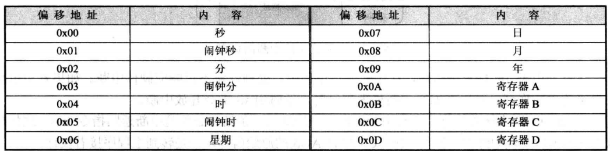
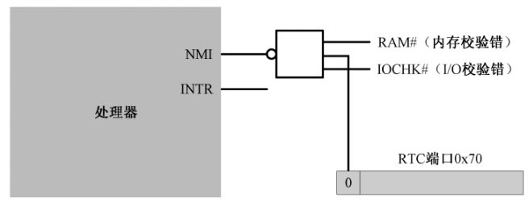

# 中断和动态时钟显示

## 一、前言

```armasm{.line-numbers}

;============================🔢 header🔢 ========================================
SECTION header vstart=0                     ;定义用户程序头部段 
    program_length  dd program_end          ;程序总长度[0x00]
    
    ;用户程序入口点
    code_entry      dw start                ;偏移地址[0x04]
                    dd section.code.start   ;段地址[0x06] 
    
    realloc_tbl_len dw (header_end-realloc_begin)/4
                                            ;段重定位表项个数[0x0a]
    
    realloc_begin:
    ;段重定位表           
    code_segment    dd section.code.start   ;[0x0c]
    data_segment    dd section.data.start   ;[0x14]
    stack_segment   dd section.stack.start  ;[0x1c]
    
header_end:                
    
;===============================================================================
SECTION code align=16 vstart=0           ;定义代码段（16 字节对齐） 
new_int_0x70:
      push ax
      push bx
      push cx
      push dx
      push es
      
  .w0:                                   
      ;阻断 NMI。当然，通常是不必要的
      ;将索引端口 0x70 中第 7 bit 位置为 1，这样就可以阻止 NMI 中断到达处理器
      mov al,0x0a                        
      or al,0x80                          
      out 0x70,al
      ;读取寄存器 A 中的值
      in al,0x71                         
      ;测试寄存器 A 中第 7 位 UIP
      test al,0x80                       
      ;如果 A 寄存器中第 7 位 UIP 为 1，那么说明正处于更新周期中
      ;不应该对 CMOS RAM 中的日期和时间信息进行访问
      ;正常情况下，访问 CMOS RAM 中的日期和时间，必须等待 RTC 更新周期结束
      ;但是，当前中断处理过程是针对更新周期结束中断的，而当此中断发生时，
      ;本身就说明对CMOS RAM 的访问是安全的
      jnz .w0                              

      ;下面分别读取 CMOS RAM 中的第 0、2、4 号单元，从中读出秒、分、时数据  
      xor al,al
      or al,0x80
      out 0x70,al
      ;读 RTC 当前时间 (秒)
      in al,0x71                         
      push ax

      mov al,2
      or al,0x80
      out 0x70,al
      ;读 RTC 当前时间 (分)
      in al,0x71                         
      push ax

      mov al,4
      or al,0x80
      out 0x70,al
      ;读 RTC 当前时间 (时)
      in al,0x71                         
      push ax

      ;寄存器 C 的索引。且开放 NMI（将 0x70 寄存器的第 7 bit位置 1）
      mov al,0x0c                         
      out 0x70,al
      ;读一下 RTC 的寄存器 C，否则只发生一次中断
      ;此处不考虑闹钟和周期性中断的情况
      in al,0x71                         
                                          
      mov ax,0xb800
      mov es,ax

      pop ax
      call bcd_to_ascii
      ;从屏幕上的 12 行 36 列开始显示
      mov bx,12*160 + 36*2               

      ;显示两位小时数字  
      mov [es:bx],ah
      mov [es:bx+2],al                   

      mov al,':'
      ;显示分隔符 ':'
      mov [es:bx+4],al                   
      ;反转显示属性
      not byte [es:bx+5]                  

      pop ax
      ;寄存器 al 中保存分钟的十位数字和个位数字，分别转换成 ascii 字符
      call bcd_to_ascii
      ;显示两位分钟数字
      mov [es:bx+6],ah
      mov [es:bx+8],al                   

      mov al,':'
      ;显示分隔符':'
      mov [es:bx+10],al                  
      ;反转显示属性
      not byte [es:bx+11]                

      pop ax
      call bcd_to_ascii
      ;显示两位秒数字
      mov [es:bx+12],ah
      mov [es:bx+14],al                  
      
      ;中断结束命令 EOI
      mov al,0x20                        
      ;向从片发送 
      out 0xa0,al                        
      ;向主片发送 
      out 0x20,al                         

      pop es
      pop dx
      pop cx
      pop bx
      pop ax

      iret

;-------------------------------------------------------------------------------
;BCD 码转 ASCII
;输入：AL=bcd 码
;输出：AX=ascii
bcd_to_ascii:                            
                                         
      mov ah,al                          
      ;仅保留低 4 位 
      and al,0x0f                        
      ;转换成 ASCII 
      add al,0x30                         
      
      ;逻辑右移 4 位
      shr ah,4                            
      and ah,0x0f                        
      add ah,0x30

      ret

;-------------------------------------------------------------------------------
start:
        ;在加载器将用户程序加载到内存之后，ds 寄存器的指向用户程序头部 header 的段地址
        ;在加载器执行完 jmp far [0x04] 之后跳转到用户程序的开始执行
        ;因此 cs 段寄存器被初始化为 section.code.start（段地址被加载器重定位过）
        mov ax,[stack_segment]
        mov ss,ax
        mov sp,ss_pointer
        mov ax,[data_segment]
        mov ds,ax

        ;显示两条初始信息，表明程序开始安装中断向量表
        mov bx,init_msg                     
        call put_string
        ;显示安装信息
        mov bx,inst_msg                     
        call put_string

        mov al,0x70
        mov bl,4
        ;计算 0x70 号中断在 IVT（中断向量表）中的偏移地址
        mul bl                             
        mov bx,ax   
        ;IF 被清零，外部中断请求被屏蔽，CPU 不会响应任何外部中断
        ;防止改动期间发生新的 0x70 号中断
        cli                                

        push es
        mov ax,0x0000
        mov es,ax
        ;偏移地址
        mov word [es:bx], new_int_0x70
        ;cs 寄存器的值即 section.code.start（重定位过），即代码段起始处         
        mov word [es:bx+2], cs              
        pop es

        ;RTC 寄存器 B
        mov al,0x0b    
        ;端口 0x70 的最高位（bit 7）是控制 NMI 中断的开关，当其为 0 时，允许 NMI 中断到达处理器，否则为 1 表示不允许到达处理器                    
        ;阻断 NMI 
        or al,0x80                         
        out 0x70,al
        ;设置寄存器 B，禁止周期性中断/闹钟中断，开放更新结束中断，并且更新周期每秒都在正常发生
        mov al,0x12                        
        ;更新结束后中断，更新周期每秒都会正常发生，禁止其它中断，BCD 码，24 小时制  
        out 0x71,al                        

        ;寄存器 C 每次被读取后，所有内容自动清零，如果不读取得话（即相应的位没有清零）同样的中断不会再产生
        mov al,0x0c
        out 0x70,al
        ;读 RTC 寄存器 C，复位未决的中断状态
        in al,0x71                         

        ;读 8259 从片的 IMR 寄存器
        in al,0xa1                 
        ;默认情况下，8259 是不会允许 RTC 中断，所以需要修改从 IMR 寄存器的第 0 bit，将其修改为 0，允许中断   
        ;清除 bit 0 (此位连接 RTC) 
        and al,0xfe                        
        ;写回从 IMR 寄存器
        out 0xa1,al                         

        ;重新开放中断，开始允许接收 RTC 中断
        sti                                 

        ;显示安装完成信息
        mov bx,done_msg                     
        call put_string
        ;显示提示信息
        mov bx,tips_msg                    
        call put_string

        mov cx,0xb800
        mov ds,cx
        ;在整个屏幕的中心显示字符 @
        ;屏幕第12行，35列
        mov byte [12*160 + 33*2],'@'       
            
 .idle:
        ;使 CPU 进入低功耗状态，直到用中断唤醒
        ;处于停机状态的处理器可以被外部中断唤醒并恢复执行，而且会继续执行 hlt 后面的指令
        hlt                                
        ;反转 '@' 字符后面的显示属性
        not byte [12*160 + 33*2+1]          
        jmp .idle

;-------------------------------------------------------------------------------
put_string:                              ;显示串(0结尾)。
                                         ;输入：DS:BX=串地址
         mov cl,[bx]
         or cl,cl                        ;cl=0 ?
         jz .exit                        ;是的，返回主程序 
         call put_char
         inc bx                          ;下一个字符 
         jmp put_string

   .exit:
         ret

;-------------------------------------------------------------------------------
put_char:                                ;显示一个字符
                                         ;输入：cl=字符ascii
         push ax
         push bx
         push cx
         push dx
         push ds
         push es

         ;以下取当前光标位置
         mov dx,0x3d4
         mov al,0x0e
         out dx,al
         mov dx,0x3d5
         in al,dx                        ;高8位 
         mov ah,al

         mov dx,0x3d4
         mov al,0x0f
         out dx,al
         mov dx,0x3d5
         in al,dx                        ;低8位 
         mov bx,ax                       ;BX=代表光标位置的16位数

         cmp cl,0x0d                     ;回车符？
         jnz .put_0a                     ;不是。看看是不是换行等字符 
         mov ax,bx                       ; 
         mov bl,80                       
         div bl
         mul bl
         mov bx,ax
         jmp .set_cursor

 .put_0a:
         cmp cl,0x0a                     ;换行符？
         jnz .put_other                  ;不是，那就正常显示字符 
         add bx,80
         jmp .roll_screen

 .put_other:                             ;正常显示字符
         mov ax,0xb800
         mov es,ax
         shl bx,1
         mov [es:bx],cl

         ;以下将光标位置推进一个字符
         shr bx,1
         add bx,1

 .roll_screen:
         cmp bx,2000                     ;光标超出屏幕？滚屏
         jl .set_cursor

         mov ax,0xb800
         mov ds,ax
         mov es,ax
         cld
         mov si,0xa0
         mov di,0x00
         mov cx,1920
         rep movsw
         mov bx,3840                     ;清除屏幕最底一行
         mov cx,80
 .cls:
         mov word[es:bx],0x0720
         add bx,2
         loop .cls

         mov bx,1920

 .set_cursor:
         mov dx,0x3d4
         mov al,0x0e
         out dx,al
         mov dx,0x3d5
         mov al,bh
         out dx,al
         mov dx,0x3d4
         mov al,0x0f
         out dx,al
         mov dx,0x3d5
         mov al,bl
         out dx,al

         pop es
         pop ds
         pop dx
         pop cx
         pop bx
         pop ax

         ret

;===============================================================================
SECTION data align=16 vstart=0

    init_msg       db 'Starting...',0x0d,0x0a,0
                   
    inst_msg       db 'Installing a new interrupt 70H...',0
    
    done_msg       db 'Done.',0x0d,0x0a,0

    tips_msg       db 'Clock is now working.',0
                   
;===============================================================================
SECTION stack align=16 vstart=0
           
                 resb 256
ss_pointer:
 
;===============================================================================
SECTION program_trail
program_end:
```

## 二、实时时钟、CMOS RAM 和 BCD 编码

在外围设备控制器芯片 ICH 内部，集成了实时时钟电路 (Real Time Clock, RTC) 和两小块由互补金属氧化物 (CMOS) 材料组成的静态存储器 (CMOS RAM)。实时时钟电路负责计时，而日期和时间的数值则存储在这块存储器中。

日期和时间信息是保存在 CMOS RAM 中的，通常有 128 字节，而日期和时间信息只占了小部分容量，其他空间则用于保存整机的配置信息。在下图中，**常规的日期和时间信息占据了CMOS RAM 开始部分的 10 字节**，有年、月、日和时、分、秒，报警的时、分、秒用于产生到时间报警中断。

<div align="center">
    
</div>

CMOS RAM 的访问，需要通过两个端口来进行。**0x70 或者 0x74 是索引端口**，用来指定 CMOS RAM 内的单元；**0x71 或者 0x75 是数据端口**，用来读写相应单元里的内容。以下代码用于读取今天是星期几：

```armasm{.line-numbers}
mov al,0x06
out 0x70,al
in al,0x71
```

端口 0x70 的最高位 (bit 7) 是控制 NMI 中断的开关。**当它为 0 时，允许 NMI 中断到达处理器，为 1 时，则阻断所有的 NMI 信号**，其他 7 个比特，即 0~6 位，则实际上用于指定 CMOS RAM 单元的索引号，这种规定直到现在也没有改变。注意 IF 标志寄存器和 IMR 寄存器是对可屏蔽中断（INTR）进行屏蔽操作，而不是非可屏蔽中断 NMI。

>The CMOS/RTC ports are 0x70 and 0x71. Port 0x70 is used to select a CMOS/RTC address to read or write from. The top 2 bits of the CMOS/RTC address don't form part of the actual address. The top most bit was re-purposed to be the NMI toggle. If you write a byte to port 0x70 where bit 7 (most significant bit) is set, NMI is disabled. **If you write a value where bit 7 is clear then NMIs are enabled**.

<div align="center">
    
</div>

>与非门（英语：NAND gate）是数字逻辑中实现逻辑与非的逻辑门。 若输入均为高电平（1），则输出为低电平（0）；**若输入中至少有一个为低电平（0），则输出为高电平（1）**。

通常来说，在往端口 0x70 写入索引时，应当先读取 0x70 原先的内容（获取第 7bit 位的原始值，知道对 NMI 的开关是否打开），然后将它用于随后的写索引操作中。但是，该端口是只写的，不能用于读出。为了解决这个问题，我们假设 NMI 中断应当始终是允许的，在访问 RTC 时，我们直接关闭 NMI，访问结束后，再打开 NMI，而不管它以前到底是什么样子。

CMOS RAM 中保存的日期和时间，通常是以二进制编码的十进制数 (Binary Coded Decimal, BCD)，这是默认状态。比如十进制数 25，如果采用 BCD 编码的话，则一个字节的高 4 位和低 4 位分别独立地表示一个 0 到 9 之间的数字，因此其 BCD 编码位 0010 0101。

单元 0x0A~0x0D 不是普通的存储单元，而被定义成 4 个寄存器的索引号，也是通过 0x70 和 0x71 这两个端口访问的。这 4 个寄存器用于设置实时时钟电路的参数和工作状态。

## 三、使用 RTC 中断显示动态时钟

现在，我们让 RTC 芯片定期发出一个中断，当这个中断发生的时候，还能执行我们自己编写的代码，来访问 CMOS RAM，在屏幕上显示一个动态走动的时钟。

### 1.初始化 8259A、RTC 和中断向量表

在原代码的第 146~154 行用于初始化栈段和数据段寄存器，然后开始在中断向量表中安装实时时钟中断的入口点。这里需要强调一件事。**当处理器执行任何一条改变栈段寄存器 ss 的指令时，它会在下一条指令执行完期间禁止中断**。

栈段除了有段寄存器，还有栈指针。因此，绝大多数时候，对栈的改变是分两步进行的：先改变段寄存器 ss 的内容，接着又修改栈指针寄存器 sp 的内容。也就是 ss 和 sp 寄存器只有都完成修改后才是有意义的。如果只修改了 ss 寄存器，此时发生了中断，在中断服务程序中调用了 push/pop 指令，后果是不可预料的。

>处理器在设计的时候就规定，当遇到修改段寄存器 ss 的指令时，在这条指令和下一条指令执行完毕期间，禁止中断，以此来保护栈。换句话说，你应该**在修改段寄存器 ss 的指令之后，紧跟着一条修改栈指针 sp 的指令**。

RTC 芯片的中断信号，通向中断控制器 8259A 从片的第 1 个中断引脚 IR0。在计算机启动期间，BIOS 会初始化中断控制器，将主片的中断号设为从 0x08 开始，将从片的中断号设为从 0x70 开始。所以，计算机启动后，RTC 芯片的中断号默认是 0x70。

在第 163~170 行，将中断号 0x70 乘以 4，就是它在中断向量表内的偏移。在修改中断向量表时，需要先用 cli 指令清中断。当表项信息只修改了一部分时，如果发生 0x70 号中断，则会产生不可预料的问题。最后将实时时钟的中断处理程序地址写入到中断向量表中。

RTC 到 8259A 的中断线只有一根，而 RTC 可以产生多种中断。比如闹钟中断、更新结束中断和周期性中断。以上所说的三种中断，我们只要设置一种就可以了。其实，最简单的就是设置更新周期结束中断。每当 RTC 更新了 CMOS RAM 中的日期和时间后，将发出此中断。更新周期每秒进行次，因此该中断也每秒发生一次。

每次当中断实际发生时，可以在程序 (中断处理过程) 中读寄存器 C 的内容来检查中断的原因。比如，每当更新周期结束中断发生时，RTC 就将它的第 4 位置 1。**该寄存器还有一个特点，就是每次读取它后，所有内容自动清零。而且，如果不读取它的话 (换句话说，相应的位没有清零)，同样的中断将不再产生**。

在第 181~196 行，先对 B 寄存器进行设置：更新结束后中断，更新周期每秒都会正常发生，禁止其它中断，BCD 码，24 小时制，然后读取寄存器 C 中的内容，复位未决的中断状态。

RTC 芯片设置完毕后，再来打通它到 8259A 的最后一道屏障。正常情况下，8259A 是不会允许 RTC 中断的，所以，需要修改它内部的中断屏蔽寄存器 IMR。IMR 是一个 8 位寄存器，位 0 对应着中断输入引脚 IR0，位 7 对应着引脚 IR7，相应的位是 0 时，允许中断，为 1 时，关掉中断。通过端口 0xa1 **读取 8259 从片的 IMR 寄存器**，用 and 指令清除第 0 位，其他各位保持原状，然后再写回去。于是，RTC 的中断可以被 8259A 处理了。

### 2.使处理器进入低功耗阶段

RTC 更新周期结束中断的处理过程可以看成另一个程序，是独立的处理过程，它随时都会发生，但和主程序互不相干。hlt 指令使处理器停止执行指令，并处于停机状态，这将降低处理器的功耗。处于停机状态的处理器可以被外部中断唤醒并恢复执行，而且会继续执行 hlt 后面的指令。

所以第 222~228 行，首先让 CPU 进入低功耗模式，如果被外部中断（包括 RTC 中断），那么就反转 @ 字符的显示属性，最后又进入循环进入低功耗阶段。

### 3.实时时钟中断的处理过程

在第 29~44 行，首先阻断 NMI 中断，然后判断 A 寄存器中第 7bit 位（UIP）位是否为 0，如果为 0，说明更新周期在 488 微秒内不会启动，现在访问 CMOS RAM 中的时间、日历和闹钟是安全的；如果为 1，说明正在更新周期中，继续跳转至 w0 进行等待。

正常情况下，访问 CMOS RAM 中的日期和时间，必须等待 RTC 更新周期结束，所以上面第 29~44 行的判断过程是必需的，而这些代码也适用于正常的访问过程。**但是，当前中断处理过程是针对更新周期结束中断的，而当此中断发生时，本身就说明对 CMOS RAM 的访问是安全的**，毕竟留给我们的时间是 999 毫秒，这段时间非常充裕。所以，在这种特定的情况下，上面的代码不是必需的。

第 47~66 行读取时、分、秒的值，并且入栈保存。第 68~73 行，读一下 RTC 的寄存器 C，使得所有中断标志复位。这等于是告诉 RTC，中断已经得到处理，可以继续下一次中断。否则的话，RTC 看到中断未被处理，将不再产生中断信号。其它的中断通过设置寄存器 B 被禁止。

在第 75~110 行，将实时时钟的小时、分钟、秒在屏幕上显示出来。在 8259 芯片内部，有一个中断服务寄存器 (Interrupt Service Register, ISR)，这是一个 8 位寄存器，每一位都对应着一个中断输入引脚。当中断处理过程开始时，8259A 芯片会将相应的位置 1，表明正在服务从该引脚来的中断。

如果允许中断嵌套的话，ISR 还起到中断判优的作用，只有比 ISR 中置 1 的位（正在处理的中断请求）优先级更高的中断源，才会被 CPU 处理。因此，如果在中断服务程序结束时不清除相应的位，下次相同优先级的中断或者优先级更低的中断将得不到处理。

在这种情况下，**需要程序在中断处理过程的结尾，向 8259A 芯片发送中断结束命令 (End Of Interrupt, EOI)，显式地对 8259A 芯片编程来清除该标志**，中断结束命令的代码是 0x20。需要注意的是，如果外部中断是 8259A 主片处理的，那么，EOI 命令仅发送给主片即可，端口号是 0x20；如果外部中断是由从片处理的，那么，EOI 命令既要发往从片(端口号 0xa0)，也要发往主片。

## 四、从键盘读取字符并显示

以下代码的第 37~42 行读取要字符串的字符，然后在屏幕上显示出来，向屏幕上写字符使用的是 BIOS 中断，具体地说就是中断 0x10 的 0x0e 号功能，该功能用于在屏幕上的光标位置处写一个字符，并推进光标位置。第 45~46 行，使用软中断 0x16 从键盘读字符，需要在寄存器 ah 中指定0x00 号功能。该中断返回后，寄存器 al 中为字符的 ascii 码，然后再使用中断 0x10 的 0x0e 号功能，将从键盘读取的字符显示在屏幕上。

```armasm{.line-numbers}
         ;代码清单9-2
         ;文件名：c09_2.asm
         ;文件说明：用于演示BIOS中断的用户程序 
         ;创建日期：2012-3-28 20:35

;定义用户程序头部段
SECTION header vstart=0 
    ;程序总长度[0x00]
    program_length  dd program_end
    
    ;用户程序入口点
    ;偏移地址[0x04]
    code_entry      dw start
                    ;段地址[0x06]
                    dd section.code.start 
    ;段重定位表项个数 [0x0a]
    realloc_tbl_len dw (header_end-realloc_begin)/4
    
    realloc_begin:
    ;段重定位表    
    ;[0x0c]
    code_segment    dd section.code.start
    ;[0x14]
    data_segment    dd section.data.start
    ;[0x1c]
    stack_segment   dd section.stack.start
    
header_end:                

;定义代码段（16 字节对齐）
SECTION code align=16 vstart=0 
start:
      mov ax,[stack_segment]
      mov ss,ax
      mov sp,ss_pointer
      mov ax,[data_segment]
      mov ds,ax
      
      mov cx,msg_end-message
      mov bx,message
      
 .putc:
      mov ah,0x0e
      mov al,[bx]
      int 0x10
      inc bx
      loop .putc

 .reps:
      mov ah,0x00
      int 0x16
      
      mov ah,0x0e
      mov bl,0x07
      int 0x10

      jmp .reps

SECTION data align=16 vstart=0

    message       db 'Hello, friend!',0x0d,0x0a
                  db 'This simple procedure used to demonstrate '
                  db 'the BIOS interrupt.',0x0d,0x0a
                  db 'Please press the keys on the keyboard ->'
    msg_end:

SECTION stack align=16 vstart=0
           
                 resb 256
ss_pointer:

SECTION program_trail
program_end:
```

