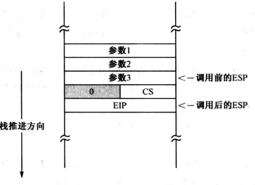

# 任务和特权级保护之二

## 一、内核程序的初始化

### 1.内核常数初始化

在内核程序的开头定义了内核需要使用的所有段选择子以及代码段、数据段、公用例程段的偏移量。很显然，这些选择子的 RPL 字段都是 0。这是因为，只有具备能动性的代码段（不一定是当前代码段）才能发出请求，**<font color="red">所以 RPL 是指【真正】发出访问请求的程序的特权级</font>**。但是真正发出访问请求的代码段和当前正在执行的代码段可能不是同一个，所以 CPL 不一定等于 RPL。

但是在这里定义的段选择子都是由内核自己使用，内核自己就是真正的请求访问者，所以 RPL=CPL=0，请求特权级应当为 0。

```armasm{.line-numbers}
    ;内核代码段选择子
    core_code_seg_sel     equ  0x38
    ;内核数据段选择子
    core_data_seg_sel     equ  0x30
    ;系统公共例程代码段的选择子
    sys_routine_seg_sel   equ  0x28
    ;视频显示缓冲区的段选择子
    video_ram_seg_sel     equ  0x20
    ;内核堆栈段选择子
    core_stack_seg_sel    equ  0x18
    ;整个 0-4GB 内存的段的选择子
    mem_0_4_gb_seg_sel    equ  0x08    

    ;以下是系统核心的头部，用于加载核心程序 
    ;核心程序总长度 #00
    core_length      dd core_end       
    ;系统公用例程段偏移量 #04
    sys_routine_seg  dd section.sys_routine.start                
    ;核心数据段偏移量 #08
    core_data_seg    dd section.core_data.start                
    ;核心代码段偏移量 #0c
    core_code_seg    dd section.core_code.start
    ;核心代码段入口点 #10
    core_entry       dd start          
                     dw core_code_seg_sel
```

由于内核工作在 0 特权级，所以主引导程序在初始化内核时，所创建的内核各段的描述符 DPL 均为 0。描述符总是指向它所描述的目标对象，代表着该对象，因此该字段实际上是目标对象的特权级。并且以上各段描述符都是在 GDT 中创建的，如下所示：

<div align="center">
    
</div>

### 2.创建调用门描述符

在上一章《程序的动态加载和执行》里，内核的主要功能是加载用户程序，为用户程序创建安装段描述符到 GDT 中以及重定位用户程序内的符号地址，并将处理器的控制权移交过去。用户程序执行完毕，还要重新回收控制。

现在我们已经知道，在上一章里，内核赋予用户程序的特权级别是 0，所以用户程序是在 0 特权级上运行的。也正是因为如此，当用户程序通过 U-SALT 表中的重定位后的符号地址直接调用内核例程时，才会通过特权级检查（**<font color="red">毕竟相同特权级之间的代码转移总是允许的</font>**）。但是在本章中，用户程序工作在 3 特权级，而且 MBR 为内核各段创建段描述符时都将 C=0，表示是非依从代码段。因此只有使用调用门才能实现不同特权级的程序之间进行控制转移，本质上它只是一个描述符，一个不同于代码段和数据段的描述符，可以安装在 GDT 或者 LDT 中。

在第 931~954 行循环遍历内核 C-SALT 表，开始安装为整个系统服务的调用门描述符到 GDT 中，并且将 C-SALT 表中的原代码段/公共例程段选择子替换为调用门描述符选择子。**通过调用门实施控制转移时，处理器只用选择子部分，salt_1 条目中给出的 32 位偏移量部分被丢弃**。原因很简单，通过调用门进行控制转移不需要偏移量，偏移量已经在调用门描述符中给出了。不单单是间接绝对远调用，直接绝对远调用也是这样，如果选择子指向的是调用门，偏移量也会被忽略。安装调用门后的 GDT 布局如下所示。

<div align="center">
    
</div>

通过 call far 使用调用门，当程序的执行流从低特权级的代码段转入高特权级的代码段时，**<font color="red">如果那是个非依从的代码段，当前特权级也随之变为目标代码段的特权级</font>**。不过，如果调用者和被调用者的特权级相同，则特权级不会变化。在当前的例子中，是从内核代码段调用公共例程段的例程，尽管也是通过调用门，但它们的特权级都是 0。所以，在控制转移的过程中不会发生栈切换，仅仅是把返回地址 CS 和 EIP 压入当前栈。当执行 retf 指令后，处理器从栈中恢复 CS 和 EIP 的原始内容，于是又返回到原先的代码段接着执行，如下所示。

<div align="center">
    <div align="center" style="color: #F14; font-size:13px; font-weight:bold">相同特权级控制转移前后栈的变化</div>
    
</div>

事实上，能够通过调用门发起控制转移的指令还包括 jmp far，**<font color="red">但只用在不需要从调用门返回的场合下，而且不改变当前特权级</font>**。也就是说，目标代码是在当前特权级上执行。通过调用门进行控制转移的特权级检查，既要在转移前进行，而且，还要在控制返回时进行。

## 二、加载用户程序并创建任务

### 1.任务控制块和 TCB 链

在完成内核的初始化工作（为内核公共例程创建调用门描述符并安装到 GDT 中）后，接下来就需要加载用户程序，并对用户程序中的符号地址进行重定位，并移交控制权。多任务系统是多个任务同时运行的，特别是在一个单处理器 (核) 的系统中，为了在任务之间切换和轮转，必须能追踪到所有正在运行的任务，记录它们的状态，或者根据它们的当前状态来采取适当的操作。**<font color="red">为了满足以上要求，内核应当为每一个任务创建一个内存区域，来记录任务的信息和状态，称为任务控制块 (Task Control Block，TCB)</font>**。本章各个数据结构之间的关系如下所示：

<div align="center">
    
</div>

在第 965~969 行为创建 TCB 任务控制块分配内存空间，返回的 TCB 起始线性地址保存在 ecx 寄存器中，并且调用 append_to_tcb_link 例程使用尾插法将此 TCB 控制块添加到 TCB 链表中。

### 2.使用栈传递过程参数

下面依然是调用 load_relocate_program 例程来实现用户程序的加载和重定位，该过程需要传入两个参数：**<font color="red">分别是用户程序的起始逻辑扇区号，以及用户程序的任务控制块 TCB 线性地址</font>**。和上一章不同的是，参数不是用寄存器传入的，而是采用栈。事实上，这是更为流行和标准的做法，这是因为寄存器数量有限，况且还要在过程内部使用，当传入的参数很多时，栈是最好的选择。

在进入 load_relocate_program 例程执行后，执行 pushad 将 8 个 32 位寄存器（eax、ecx、edx、ebx、esp、ebp、esi、edi）压入栈中，接着再压入 ds 和 es 段寄存器。然后将栈指针寄存器 ESP 的内容复制到 EBP 寄存器，以访问栈中 TCB 线性基地址参数。

>栈的访问有两种，一种是隐式的，由处理器在执行诸如 push、pop、call、ret 等指令时自动进行。隐式地访问栈需要使用指令指针寄存器 ESP。**<font color="red">另一种访问栈的方式不依赖于先进后出机制，而是把栈看成是一般的数据段，直接访问其中的任何内容</font>**。在这种方式下，需要使用栈基址寄存器 EBP。

这里有个例子，比如，从栈中读取一个双字，该数据在栈中的偏移量是由 EBP 寄存器指向的 **`mov edx， [ebp]`**，在 32 位模式下，处理器执行这条指令时，用段寄存器 SS 描述符高速缓存器中的 32 位基地址，加上 EBP 寄存器提供的 32 位偏移量，形成 32 位线性地址，访问内存取得一个双字，传送到 EDX 寄存器。很显然，用 EBP 寄存器来寻址时，不需要使用段超越前缀 "SS:"，**因为 EBP 寄存器出现在指令中的地址部分时，默认使用段寄存器 SS**。

因为 **`call load_relocate_program`** 是 32 位相对近调用，故只往栈中压入 IP 寄存器的内容，而没有压入 CS 寄存器的内容。执行 mov ebp，esp 指令后的栈状态如下所示：

<div align="center">
    <div align="center" style="color: #F14; font-size:13px; font-weight:bold">执行 mov ebp，esp 指令后的栈状态</div>
    
</div>

>在 32 位模式下，访问栈用的是栈指针寄存器 ESP，而且，每次栈操作的默认操作数大小是双字。处理器在执行压栈指令时，如果发现指令的操作数是段寄存器(CS、SS、DS、ES、FS、GS)，那么，**将先执行一个内部的零扩展操作，将段寄存器中的 16 位值扩展成 32 位，高 16 位是全零，然后再执行压栈操作**。当然，出栈指令 pop 会执行相反的操作，将 32 位的值截短为 16 位，并传送到相应的段寄存器。

### 3.加载用户程序

当用户程序被读入内存，并处于运行或者等待运行的状态时，就视为一个任务。任务有自己的代码段和数据段(包括栈)，这些段必须通过描述符来引用，而这些描述符可以放在 GDT 中，也可以放在任务自己 LDT 中，但最好是放在 LDT 中。GDT 用于存放各个任务公有的描述符，比如公共的数据段和公共例程。每个任务都允许有自己的 LDT，而且可以定义在任何内存位置。接下来要做 3 件事：

- 分配一块内存，作为 LDT 来用，为创建用户程序各个段的描述符做准备;
- 将 LDT 的界限和起始线性地址登记在任务控制块 TCB 中;
- 分配内存并加载用户程序，并将它的起始线性地址登记到 TCB 中；

先做第 1，2 件事情，首先调用 allocate_memory 例程为 LDT 表分配 160 个字节的空间（可以容纳 20 个 LDT 描述符），并且将返回的保存在 ecx 寄存器中的 LDT 起始地址写入到 TCB 块中。**另外和 GDT 一样，界限值是表的总字节数减 1，因为我们刚创建 LDT，总字节数为 0，所以当前的界限值应当是 0xFFFF**(0 减去 1)，此界限值也被写入到 TCB 中。

然后将用户程序整体读入到内存中，首先获取到用户程序的大小并对齐 512 字节，然后调用 allocate_memory 例程为用户程序分配内存空间，并将用户程序的起始线性地址写入到 ecx 中并返回。接着 load_relocate_program 例程调用 read_hard_disk_0 从磁盘中读取用户程序加载到刚刚动态分配的内存空间的起始地址。并且会将用户程序的起始线性地址写入到 TCB 控制块中。

### 4.创建局部描述符表 LDT

