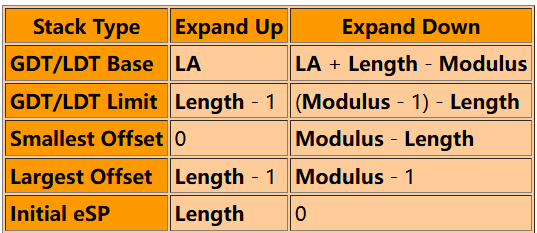
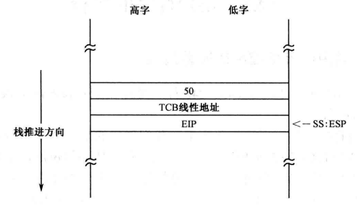
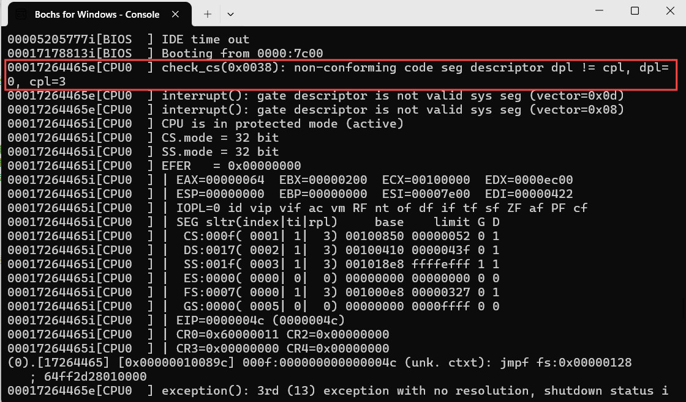
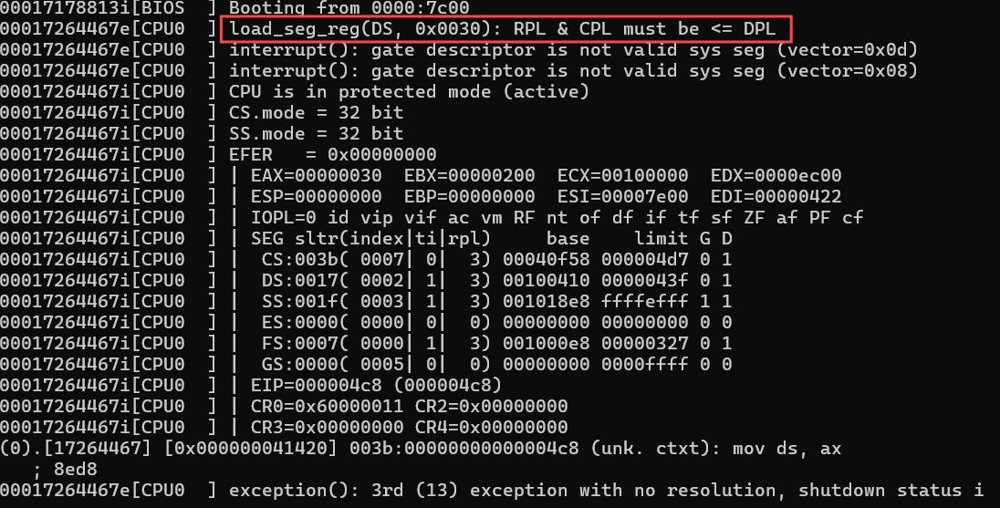
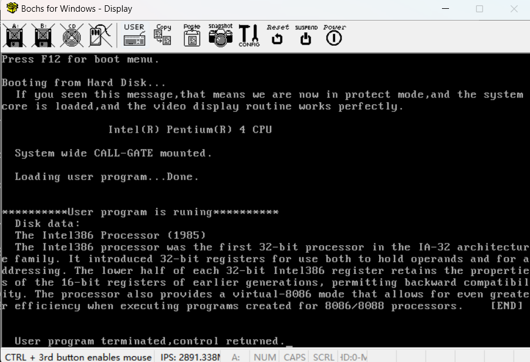
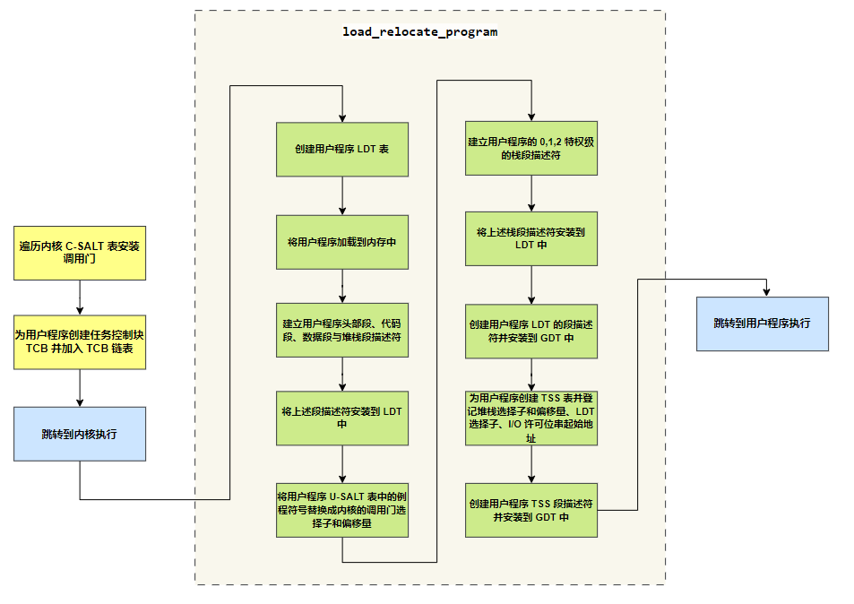

# 任务和特权级保护之二

## 一、内核程序的初始化

### 1.内核常数初始化

在内核程序的开头定义了内核需要使用的所有段选择子以及代码段、数据段、公用例程段的偏移量。很显然，这些选择子的 RPL 字段都是 0。这是因为，只有具备能动性的代码段（不一定是当前代码段）才能发出请求，**<font color="red">所以 RPL 是指【真正】发出访问请求的程序的特权级</font>**。但是真正发出访问请求的代码段和当前正在执行的代码段可能不是同一个，所以 CPL 不一定等于 RPL。

但是在这里定义的段选择子都是由内核自己使用，内核自己就是真正的请求访问者，所以 RPL=CPL=0，请求特权级应当为 0。

```armasm{.line-numbers}
    ;内核代码段选择子
    core_code_seg_sel     equ  0x38
    ;内核数据段选择子
    core_data_seg_sel     equ  0x30
    ;系统公共例程代码段的选择子
    sys_routine_seg_sel   equ  0x28
    ;视频显示缓冲区的段选择子
    video_ram_seg_sel     equ  0x20
    ;内核堆栈段选择子
    core_stack_seg_sel    equ  0x18
    ;整个 0-4GB 内存的段的选择子
    mem_0_4_gb_seg_sel    equ  0x08    

    ;以下是系统核心的头部，用于加载核心程序 
    ;核心程序总长度 #00
    core_length      dd core_end       
    ;系统公用例程段偏移量 #04
    sys_routine_seg  dd section.sys_routine.start                
    ;核心数据段偏移量 #08
    core_data_seg    dd section.core_data.start                
    ;核心代码段偏移量 #0c
    core_code_seg    dd section.core_code.start
    ;核心代码段入口点 #10
    core_entry       dd start          
                     dw core_code_seg_sel
```

由于内核工作在 0 特权级，所以主引导程序在初始化内核时，所创建的内核各段的描述符 DPL 均为 0。描述符总是指向它所描述的目标对象，代表着该对象，因此该字段实际上是目标对象的特权级。并且以上各段描述符都是在 GDT 中创建的，如下所示：

<div align="center">
    
</div>

### 2.创建调用门描述符

在上一章《程序的动态加载和执行》里，内核的主要功能是加载用户程序，为用户程序创建安装段描述符到 GDT 中以及重定位用户程序内的符号地址，并将处理器的控制权移交过去。用户程序执行完毕，还要重新回收控制。

现在我们已经知道，在上一章里，内核赋予用户程序的特权级别是 0，所以用户程序是在 0 特权级上运行的。也正是因为如此，当用户程序通过 U-SALT 表中的重定位后的符号地址直接调用内核例程时，才会通过特权级检查（**<font color="red">毕竟相同特权级之间的代码转移总是允许的</font>**）。但是在本章中，用户程序工作在 3 特权级，而且 MBR 为内核各段创建段描述符时都将 C=0，表示是非依从代码段。因此只有使用调用门才能实现不同特权级的程序之间进行控制转移，本质上它只是一个描述符，一个不同于代码段和数据段的描述符，可以安装在 GDT 或者 LDT 中。

在第 931~954 行循环遍历内核 C-SALT 表，开始安装为整个系统服务的调用门描述符到 GDT 中，并且将 C-SALT 表中的原代码段/公共例程段选择子替换为调用门描述符选择子。**通过调用门实施控制转移时，处理器只用选择子部分，salt_1 条目中给出的 32 位偏移量部分被丢弃**。原因很简单，通过调用门进行控制转移不需要偏移量，偏移量已经在调用门描述符中给出了。不单单是间接绝对远调用，直接绝对远调用也是这样，如果选择子指向的是调用门，偏移量也会被忽略。安装调用门后的 GDT 布局如下所示。

<div align="center">
    
</div>

通过 call far 使用调用门，当程序的执行流从低特权级的代码段转入高特权级的代码段时，**<font color="red">如果那是个非依从的代码段，当前特权级也随之变为目标代码段的特权级</font>**。不过，如果调用者和被调用者的特权级相同，则特权级不会变化。在当前的例子中，是从内核代码段调用公共例程段的例程，尽管也是通过调用门，但它们的特权级都是 0。所以，在控制转移的过程中不会发生栈切换，仅仅是把返回地址 CS 和 EIP 压入当前栈。当执行 retf 指令后，处理器从栈中恢复 CS 和 EIP 的原始内容，于是又返回到原先的代码段接着执行，如下所示。

<div align="center">
    <div align="center" style="color: #F14; font-size:13px; font-weight:bold">相同特权级控制转移前后栈的变化</div>
    
</div>

事实上，能够通过调用门发起控制转移的指令还包括 jmp far，**<font color="red">但只用在不需要从调用门返回的场合下，而且不改变当前特权级</font>**。也就是说，目标代码是在当前特权级上执行。通过调用门进行控制转移的特权级检查，既要在转移前进行，而且，还要在控制返回时进行。

## 二、加载用户程序并创建任务

### 1.任务控制块和 TCB 链

在完成内核的初始化工作（为内核公共例程创建调用门描述符并安装到 GDT 中）后，接下来就需要加载用户程序，并对用户程序中的符号地址进行重定位，并移交控制权。多任务系统是多个任务同时运行的，特别是在一个单处理器 (核) 的系统中，为了在任务之间切换和轮转，必须能追踪到所有正在运行的任务，记录它们的状态，或者根据它们的当前状态来采取适当的操作。**<font color="red">为了满足以上要求，内核应当为每一个任务创建一个内存区域，来记录任务的信息和状态，称为任务控制块 (Task Control Block，TCB)</font>**。本章各个数据结构之间的关系如下所示：

<div align="center">
    
</div>

在第 965~969 行为创建 TCB 任务控制块分配内存空间，返回的 TCB 起始线性地址保存在 ecx 寄存器中，并且调用 append_to_tcb_link 例程使用尾插法将此 TCB 控制块添加到 TCB 链表中。

### 2.使用栈传递过程参数

下面依然是调用 load_relocate_program 例程来实现用户程序的加载和重定位，该过程需要传入两个参数：**<font color="red">分别是用户程序的起始逻辑扇区号，以及用户程序的任务控制块 TCB 线性地址</font>**。和上一章不同的是，参数不是用寄存器传入的，而是采用栈。事实上，这是更为流行和标准的做法，这是因为寄存器数量有限，况且还要在过程内部使用，当传入的参数很多时，栈是最好的选择。

在进入 load_relocate_program 例程执行后，执行 pushad 将 8 个 32 位寄存器（eax、ecx、edx、ebx、esp、ebp、esi、edi）压入栈中，接着再压入 ds 和 es 段寄存器。然后将栈指针寄存器 ESP 的内容复制到 EBP 寄存器，以访问栈中 TCB 线性基地址参数。

>栈的访问有两种，一种是隐式的，由处理器在执行诸如 push、pop、call、ret 等指令时自动进行。隐式地访问栈需要使用指令指针寄存器 ESP。**<font color="red">另一种访问栈的方式不依赖于先进后出机制，而是把栈看成是一般的数据段，直接访问其中的任何内容</font>**。在这种方式下，需要使用栈基址寄存器 EBP。

这里有个例子，比如，从栈中读取一个双字，该数据在栈中的偏移量是由 EBP 寄存器指向的 **`mov edx， [ebp]`**，在 32 位模式下，处理器执行这条指令时，用段寄存器 SS 描述符高速缓存器中的 32 位基地址，加上 EBP 寄存器提供的 32 位偏移量，形成 32 位线性地址，访问内存取得一个双字，传送到 EDX 寄存器。很显然，用 EBP 寄存器来寻址时，不需要使用段超越前缀 "SS:"，**因为 EBP 寄存器出现在指令中的地址部分时，默认使用段寄存器 SS**。

因为 **`call load_relocate_program`** 是 32 位相对近调用，故只往栈中压入 IP 寄存器的内容，而没有压入 CS 寄存器的内容。执行 mov ebp，esp 指令后的栈状态如下所示：

<div align="center">
    <div align="center" style="color: #F14; font-size:13px; font-weight:bold">执行 mov ebp，esp 指令后的栈状态</div>
    
</div>

>在 32 位模式下，访问栈用的是栈指针寄存器 ESP，而且，每次栈操作的默认操作数大小是双字。处理器在执行压栈指令时，如果发现指令的操作数是段寄存器(CS、SS、DS、ES、FS、GS)，那么，**将先执行一个内部的零扩展操作，将段寄存器中的 16 位值扩展成 32 位，高 16 位是全零，然后再执行压栈操作**。当然，出栈指令 pop 会执行相反的操作，将 32 位的值截短为 16 位，并传送到相应的段寄存器。

### 3.加载用户程序

当用户程序被读入内存，并处于运行或者等待运行的状态时，就视为一个任务。任务有自己的代码段和数据段(包括栈)，这些段必须通过描述符来引用，而这些描述符可以放在 GDT 中，也可以放在任务自己 LDT 中，但最好是放在 LDT 中。GDT 用于存放各个任务公有的描述符，比如公共的数据段和公共例程。每个任务都允许有自己的 LDT，而且可以定义在任何内存位置。接下来要做 3 件事：

- 分配一块内存，作为 LDT 来用，为创建用户程序各个段的描述符做准备;
- 将 LDT 的界限和起始线性地址登记在任务控制块 TCB 中;
- 分配内存并加载用户程序，并将它的起始线性地址登记到 TCB 中；

先做第 1，2 件事情，首先调用 allocate_memory 例程为 LDT 表分配 160 个字节的空间（可以容纳 20 个 LDT 描述符），并且将返回的保存在 ecx 寄存器中的 LDT 起始地址写入到 TCB 块中。**另外和 GDT 一样，界限值是表的总字节数减 1，因为我们刚创建 LDT，总字节数为 0，所以当前的界限值应当是 0xFFFF**(0 减去 1)，此界限值也被写入到 TCB 中。

然后将用户程序整体读入到内存中，首先获取到用户程序的大小并对齐 512 字节，然后调用 allocate_memory 例程为用户程序分配内存空间，并将用户程序的起始线性地址写入到 ecx 中并返回。接着 load_relocate_program 例程调用 read_hard_disk_0 从磁盘中读取用户程序加载到刚刚动态分配的内存空间的起始地址。并且会将用户程序的起始线性地址写入到 TCB 控制块中。

### 4.创建局部描述符表 LDT

```armasm{.line-numbers}
SECTION header vstart=0
    ;程序总长度 #0x00
    program_length   dd program_end
    ;程序头部的长度 #0x04，保存用户程序头部段描述子
    head_len         dd header_end
    ;用于接收堆栈段选择子 #0x08，保存堆栈段描述子
    stack_seg        dd 0
    ;用户程序建议的堆栈大小（以 4KB 位单位）#0x0c
    stack_len        dd 1
                              
    ;程序入口地址 #0x10           
    prgentry         dd start                
    ;代码段位置 #0x14
    ;当内核完成用户程序的加载和重定位后，会把该代码段的段选择子回填到这里（仅占用最低 16 位）
    code_seg         dd section.code.start   
    ;代码段长度 #0x18
    code_len         dd code_end             

    ;数据段位置 #0x1c，保存数据段描述子
    data_seg         dd section.data.start   
    ;数据段长度 #0x20
    data_len         dd data_end             

    ;符号地址检索表的条目数 #0x24
    salt_items       dd (header_end-salt)/256 

    ;#0x28
    ;用户程序在偏移地址 0x28 处构造一个表格，填写用户程序需要用到的符号名
    ;内核在加载用户程序时，会将符号名称替换为相应的内存地址，这就是过程的重定位
    salt:
    PrintString      db  '@PrintString'
                    times 256-($-PrintString) db 0
    TerminateProgram db  '@TerminateProgram'
                    times 256-($-TerminateProgram) db 0
    ReadDiskData     db  '@ReadDiskData'
                    times 256-($-ReadDiskData) db 0
    header_end:
```

> 在为用户创建段描述符时，edi 指向用户程序在内存中的基地址，而 esi 为 TCB 的线性基地址。

首先创建用户程序头部段描述符，描述符属性 G=0 表示以字节为单位，D/B=1 表示 32 位的偏移地址或者操作数，或者说程序中的偏移地址和操作数按 32 位进行编译。P=1 表示描述符对应的段在内存中，S=1 表示这个是代码段或者数据段，TYPE=0010，表示是一个可读可写数据段。最后将此段描述符安装到 LDT 中（0#），然后返回对应的段选择子，并且将此段选择子的 RPL 设置为 3，最后将此段选择子保存到用户程序头部和 TCB 控制块中。**<font color="red">在 LDT 中安装的描述符，通常只由用户程序自己使用，即在请求访问这些段时，请求者就是用户程序自己。因此，其选择子的 RPL 和用户程序的特权级（CPL）始终一致</font>**。
>**<font color="blue">和 GDT 不同，LDT 表中 0 号槽位也是可用的</font>**。

接着创建用户程序代码段描述符，描述符属性 G=0 表示以字节为单位，D/B=1 表示 32 位的偏移地址或者操作数，或者说程序中的偏移地址和操作数按 32 位进行编译。P=1 表示描述符对应的段在内存中，S=1 表示这个是代码段或者数据段，TYPE=1000，表示是一个只执行代码段。最后将此段描述符安装到 LDT 中（1#），然后返回对应的段选择子，并且将此段选择子的 RPL 设置为 3，最后将此段选择子保存到用户程序头部。

然后创建用户程序代码段描述符并安装到 LDT 中（2#），其属性和用户程序头部段类似。最后创建用户程序栈段描述符，在用户程序头的 0x0C 偏移处指明用户程序栈空间的大小（倍率为 4KB）。

<div align="center">
    <div align="center" style="color: #f00; font-size:13px; font-weight:bold">相同区域向上扩展和向下扩展段描述符属性计算表格</div>
    
</div>

举例来说，如果栈空间大小为 3，即 12KB，栈分配的内存初始地址（LA）为 0x40000。**<font color="red">那么按照上述表格中 Expand-Down 列计算出来的栈段界限为 **`Modulus - 1 - Length = 0x10000 0000 - 1 - 0x3000 = 0xFFFF CFFF`**，而栈段的属性为 0x00c0f600，即 G=1 界限的粒度为 4KB，那么填写到栈段描述符中的实际段界限为 0xFFFFC</font>**，恰好就是 **`0xFFFFC=0xFFFFF-3`**。另外，对于向下扩展的栈段，其基地址（base）为 **`0x40000 + 0x3000 - 0x100000000=0x43000`**，就等于代码中的堆栈的高端地址。此段的属性如下所示：

```armasm{.line-numbers}
Base=0x43000
Limit=0xFFFFC
Smallest Offset=0x10000 0000 - 0x3000 = 0xFFFF D000
Largest Offset=0x10000 0000-1=0xFFFF FFFF
Initial ESP=0
```

并且此栈段在进行栈操作时必须满足以下原则，因此本例子中的段描述符定义了一个范围为 0x40000~0x42FFF 的栈空间。最后将此段描述符安装到 LDT 中（3#），然后返回对应的段选择子，并且将此段选择子的 RPL 设置为 3，最后将此段选择子保存到用户程序头部。

```armasm{.line-numbers}
0xFFFF D000（Smallest Offset）<= esp - 操作数的长度 <= 0xFFFF FFFF（Largest Offset）
;栈指针寄存器 ESP 只在访问栈时提供偏移地址，操作数在压入栈时的物理地址要用段基址 base 和 esp 的内容相加得到
0x40000 <= esp - 操作数的长度 + Base <= 0x42FFF
```

在创建完上述段描述符后，就对用户程序头的 U-SALT 表进行重定位，基本逻辑和上一章相同，外循环为用户程序中 U-SALT 条目，而内循环是内核程序 C-SALT 条目，每次读取一个 U-SALT 条目和 C-SALT 中的条目进行字符串比对，如果比对通过，那么将 C-SALT 中调用例程的调用门选择子和偏移量写到用户程序 U-SALT 对应条目中。当初，在创建这些调用门时，选择子的 RPL 字段是 0。也就是说，这些调用门选择子的请求特权级是 0。当它们被复制到 U-SALT 中时，应当改为用户程序的特权级(3)。**<font color="red">这是因为这些调用门选择子也是由用户程序使用，而 RPL 应该代表真正发起请求程序的特权级，而用户程序是请求的真正发起者，故调用门选择子的 RPL=CPL(用户程序)=3</font>**。

另外一个需要注意的是，上一章中，使用 es:edi 指向用户程序的 U-SALT 表，其中 es 为指向用户程序头部的选择子。而这里和前一章不同，**头部段描述符已经安装，但还没有生效（还没有加载进局部描述符表寄存器 LDTR）**，故只能通过 4GB 段访问用户程序头部

### 5.创建 0,1,2 特权级的栈

通过调用门的控制转移通常会改变当前特权级 CPL，同时还要切换到与目标代码段特权级相同的栈。为此，必须为每个任务定义额外的栈。对于当前的 3 特权级任务来说，应当创建特权级 0、1 和 2 的栈。**而且，应当将这些栈的段描述符定义在每个任务自己的 LDT 中**。这些额外的栈是动态创建的，而且需要登记在任务状态段(TSS) 中，以便处理器固件能够自动访问到它们。**但是现在的问题是还没有创建 TSS，有必要先将这些栈信息登记在任务控制块 (TCB) 中暂时保存**。

在这里创建 0,1,2 特权级栈段的描述符方法和前面相同，只是这里为它们分配的特权级各不相同。以创建 2 特权级的栈为例，此 2 特权级的栈供用户程序切换（**通过 call far 调用门选择子的方式**）到 2 特权级运行时使用，而处理器要求，在任何时候栈段的特权级别（DPL）必须和当前特权级 CPL 以及请求特权级（RPL）相同，因此 DPL=RPL=CPL=2。对于 RPL 也可以这么理解，当用户程序切换到 2 特权级时，才能请求访问此 DPL=2 的栈，因此此时真正发出访问请求的程序的特权级为 2，故 RPL=2。

### 6.创建 LDT 和 TSS

全局描述符表(GDT) 是唯一的，整个系统中只有一个，所以只需要用 GDTR 寄存器存放其线性基地址和段界限即可; 但 LDT 不同，每个任务一个，所以为了追踪它们，处理器要求在 GDT 中安装每个 LDT 的描述符。当要使用这些 LDT 时，可以用它们的选择子来访问 GDT，将 LDT 描述符加载到 LDTR 寄存器。

在第 493~500 行中，为用户程序的 LDT 表申请内存，并且将分配的内存的基地址 ecx 和 LDT 初始界限值 0xFFFF 保存到 TCB 中，但是每次调用 fill_descriptor_in_ldt 例程都会对 LDT 的界限值进行更新（增加 8）。现在从 TCB 中获取 LDT 在内存的初始基地址和最新段界限，同时指定 LDT 段描述符的属性，G=0 表示段界限是以字节为单位，D/B=1 表示 32 位的偏移地址或者操作数，或者说程序中的偏移地址和操作数按 32 位进行编译。P=1 表示描述符对应的段在内存中，S=0 表示这个是系统段，TYPE=0010 表示是一个可读可写的数据段。最后将此 LDT 段描述符安装到 GDT 中。

到目前为止，任务的所有内存段都已创建完毕，除了任务状态段 (TSS)。现在就来创建 TSS。在此之前，先来全面了解一下 TSS 的各个组成部分。TSS 内偏移 0 处是前一个任务的 TSS 描述符选择子。和 LDT 一样，必须在
全局描述符表(GDT) 中创建每个 TSS 的描述符。当系统中有多个任务同时存在时，可以从一个任务切换到另一个任务执行，此时称任务是嵌套的。**<font color="red">被嵌套的任务用这个指针指向前一个任务，即嵌套它的那个任务，当控制返回前一个任务时，处理器需要这个指针来识别前一个任务</font>**。创建 TSS 时，可以为 0（表明目前只有这一个任务）。

SS0、SS1 和 SS2 分别是 0、1 和 2 特权级的栈段选择子，ESP0、ESP1 和 ESP2 分别是 0、1 和 2 特权级栈的栈顶指针。这些内容应当由任务的创建者填写，**且属于填写后一般不变的静态部分**，当通过门进行特权级之间的控制转移时，处理器用这些信息来切换栈。

偏移为 32~92 的区域是处理器各个寄存器的快照部分，用于在进行任务切换时，保存处理器的状态以便将来恢复现场。在一个多任务环境中，每次创建一个任务时，操作系统或者内核至少要填写 EIP、EFLAGS、ESP、CS、SS、DS、ES、FS 和 GS，当该任务第一次获得执行时，处理器从这里加载初始执行环境，并从 CS:EIP 处开始执行任务的第一条指令。**在此之后的任务运行期间，该区域的内容由处理器固件进行更改**。

LDT 段选择子是当前任务的 LDT 描述符选择子。由内核或者操作系统填写，以指向当前任务的 LDT。**该信息由处理器在任务切换时使用，在任务运行期间保持不变**。

接下来就是为 TSS 分配内存空间（104 字节），然后将 TSS 中指向前一个任务的指针（任务链接域）设置为 0（表明这是唯一任务）。登记 0、1 和 2 特权级栈的段选择子，以及它们的初始栈指针。所有的栈信息都在 TCB 中，先从 TCB 中取出，然后填写到 TSS 中的相应位置。然后登记当前任务的 LDT 描述符选择子。**在任务切换时，处理器需要用这里的信息找到当前任务的 LDT**。如果没有 LDT，这里应该填写 0。填写 I/O 许可位映射区的地址。**<font color="red">在这里填写的是 TSS 段界限(103)，这意味着不存在该区域</font>**。

在填写完 TSS 中的内容后，就直接创建 TSS 描述符并安装到 GDT 中。TSS 描述符中的 B 位是"忙"位 (Busy)。在任务刚刚创建的时候，它应该为二进制的 1001，即 B 位是 0，表明任务不忙。当任务开始执行时，或者处于挂起状态 (临时被中断执行) 时，由处理器固件把 B 位置 1。

<div align="center">
    <div align="center" style="color: #f00; font-size:13px; font-weight:bold">执行 ret 指令前的栈状态</div>
    
</div>

接着继续执行 pop 指令，在执行完 **`pop es`**、**`pop ds`**、**`popad`** 这 3 条指令后，执行 **`ret 8`** 指令之前，栈的状态如上所示。在执行 ret 指令时，会将相对近调用压入的 EIP 寄存器弹出，后面的 8 意味着除了将控制返回到过程的调用者之外，还要调整栈的指针 **`esp=esp+8`**。

```armasm{.line-numbers}
    ;恢复到调用此过程前的 es 段
    pop es
    ;恢复到调用此过程前的 ds 段 
    pop ds

    popad
    ;丢弃调用本过程前压入的参数
    ret 8 
```

如果希望过程在返回时弹出参数，使 ESP 寄存器指向调用过程前的栈位置(使栈平衡)，可以使用带操作数的过程返回指令:

```armasm{.line-numbers}
ret imm16
retf imm16
```

这两条指令都允许 16 位的立即数作为操作数，不同之处仅仅在于，前者是近返回，后者是远返回。立即数是 16 位的，而且一般总是偶数，原因是栈操作总是以字或者双字进行，**<font color="red">它指示在将控制返回到调用者之前，应当从栈中弹出多少字节的数据</font>**。

### 7.进入 3 特权级的用户程序执行

在从 **`load_relocate_program`** 例程返回之后，执行 **`ltr [ecx+0x18]`** 加载 TSS 选择子到 TR 寄存器中，同时将对应的 TSS 描述符加载到 TR 的描述符高速缓存中。执行 **`lldt [ecx+0x10]`** 将 LDT 选择子加载到 LDTR 寄存器中，同时将 LDT 段描述符加载到 LDTR 的描述符高速缓存中。其实也只有先初始化 LDTR 寄存器之后，后面才能使用用户程序头部段选择子来访问用户程序 LDT 进而访问用户程序头部段数据。

接下来的工作是将控制转到用户程序那里。我们创建的是一个 3 特权级的任务，所以这是一个从 0 特权级到 3 特权级的控制转移。**<font color="red">不过我们可以假装从调用门返回来实现从高特权级向低特权级程序的转移</font>**。在执行完下述命令后，内核程序的栈布局如下所示。接下来根据《特权保护》这一章中 retf 从调用门返回的过程来执行，并且由于用户程序入口的 CS 段寄存器中的 RPL 值为 3，大于当前内核程序的 CPL（被调用者的当前特权级），即是向低特权级转移，因此特权级检查通过。用户程序的 SS、ESP、CS、EIP 被设置为栈中压入的值，控制转移到用户程序开始执行。

<div align="center">
    <div align="center" style="color: #f00; font-size:13px; font-weight:bold">执行 retf 指令前的栈状态</div>
    
</div>

```armasm{.line-numbers}
    ;以下假装是从调用门返回。模仿处理器压入返回参数
    ;调用前的堆栈段选择子 
    push dword [0x08]
    ;调用前的 esp
    push dword 0

    ;调用前的用户程序头部代码段选择子，特权级为 3
    push dword [0x14]
    ;调用前的 eip，指向用户程序入口点地址 start
    push dword [0x10]
```

#### 7.1 JMP FAR 指令报错

但是和上一章不同的是，用户程序中的一条指令会引起程序错误，即下面用户程序代码中的 **`jmp far [fs:TerminateProgram]`**，这是因为用户程序的 CPL=3，**`fs:TerminateProgram`** 指向的内存区域中调用门选择子的请求特权级 RPL=0，此调用门选择子指向的调用门描述符的 DPL=3，因此本指令满足 **<font color="red">当前特权级 CPL 和请求特权级 RPL 高于或者和调用门描述符特权级 DPL 相同</font>** 这个条件。

```armasm{.line-numbers}
    mov ebx,message_2
    call far [fs:PrintString]

    mov ebx,buffer
    call far [fs:PrintString]
    ;将控制权返回到系统
    jmp far [fs:TerminateProgram]
```

但是用户要跳转的内核代码段 DPL=0，且 MBR 引导程序在为其创建段描述符时将其指定为非依从代码段，而根据《保护模式之特权级保护》中的内容，The JMP instruction may never transfer control to a nonconforming segment whose DPL does not equal CPL.因此 bochs 会有如下报错，即 **`jmp far [fs:TerminateProgram]`** 指令本身执行出错。

<div align="center">
    
</div>

#### 7.2 访问数据段报错

如果我们将 MBR 中的程序进行修改，在为内核代码段创建段描述符时，将段属性修改为依从的，即 MBR 相关代码修改成如下，将内核代码段的属性修改为 0x00409C00，依从代码属性设置为 1，即只执行依从代码段。

```armasm{.line-numbers}
    ;建立核心代码段描述符
    ;核心代码段起始汇编地址
    mov eax,[edi+0x0c]
    ;程序总长度
    mov ebx,[edi+0x00]
    sub ebx,eax
    ;核心代码段界限
    dec ebx
    ;核心代码段基地址
    add eax,edi
    ;字节粒度的代码段描述符
    ;将之前的 0x00409800 属性修改为下属的 0x00409C00 属性
    mov ecx,0x00409C00
    call make_gdt_descriptor
    mov [esi+0x38],eax
    mov [esi+0x3c],edx
```

此时再使用 bochs 执行上面同样的用户程序代码，得到的报错结果如下所示。此时用户程序可以正常执行 **`jmp far [fs:TerminateProgram]`** 指令，从用户程序跳转到内核 return_point，但是由于是 JMP FAR 指令实施控制转移，因此程序的 CPL 依然为 3。

<div align="center">
    
</div>

此时在执行下述指令时，由于内核数据段的 DPL=0，而当前程序的 CPL=3,RPL=0，因此不满足访问数据段的要求：**<font color="red">当前特权级 **`CPL(CS.RPL)`** 和数据段选择符的请求特权级 **`RPL`** 都必须高于，或者和目标数据段描述符的 DPL 相同</font>**。即上图中 bochs 的报错结果。

```armasm{.line-numbers}
return_point:              
    ;用户程序返回点
    ;使 ds 指向核心数据段
    mov eax,core_data_seg_sel
    mov ds,eax
```

#### 7.3 正常执行结果

如果我们不修改 MBR 中的代码，即 MBR 为内核代码段创建的段描述属性依然为 0x00409800（非依从），但是我们将用户程序中的跳转指令修改如下，即将 JMP FAR 修改为 CALL FAR。此时用户程序就可以正常将控制转移到内核代码中，并且特权级 CPL 变为 0，此时也满足了访问内核数据段 core_data_seg_sel 的要求。

```armasm{.line-numbers}
    mov ebx,message_2
    call far [fs:PrintString]

    mov ebx,buffer
    call far [fs:PrintString]
    ;将控制权返回到系统
    call far [fs:TerminateProgram]
```

在经过上面修改后，bochs 的执行结果如下：

<div align="center">
    
</div>

在执行时，没有发生报错：

<div align="center">
    
</div>

## 三、总结

本章的程序执行逻辑如下所示：

<div align="center">
    
</div>