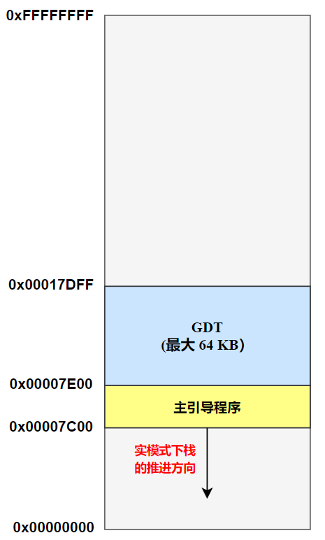
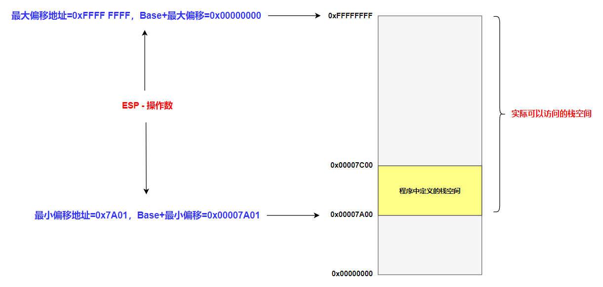

# 进入保护模式

## 零、代码

```armasm{.line-numbers}
        ;代码清单11-1
        ;文件名：c11_mbr.asm
        ;文件说明：硬盘主引导扇区代码
        ;创建日期：2011-5-16 19:54

        ;设置堆栈段和栈指针
        ;引导程序被加载到内存后，cs:ip 被初始化为 0x0000:0x7c00，即被加载到内存 0x7c00 处
        ;因此 cs 及下面程序的 ss 寄存器被初始化为 0x0000
        mov ax,cs
        mov ss,ax
        mov sp,0x7c00

        ;计算 GDT 所在的逻辑段地址（段:偏移），GDT 所在物理地址为 0x00007e00
        ;将 gdt_base 所标识双字中的低 16 位移动到 ax 中
        mov ax,[cs:gdt_base + 0x7c00]
        ;将 gdt_base 所标识双字中的高 16 位移动到 dx 中 
        mov dx,[cs:gdt_base + 0x7c00 + 0x02]
        mov bx,16
        ;dx(高 16 位) ax(低 16 位) 除以 bx，最后的结果商在 ax 中，余数在 dx 中 
        div bx
        ;令 ds 指向该段以进行操作
        mov ds,ax
        ;令 bx 指向段内起始偏移地址
        mov bx,dx

        ;创建 0# 描述符，它是空描述符，这是处理器的要求
        mov dword [bx+0x00],0x00
        mov dword [bx+0x04],0x00

        ;创建 #1 描述符，保护模式下的代码段描述符
        mov dword [bx+0x08],0x7c0001ff
        mov dword [bx+0x0c],0x00409800

        ;创建 #2 描述符，保护模式下的数据段描述符（文本模式下的显示缓冲区）
        mov dword [bx+0x10],0x8000ffff
        mov dword [bx+0x14],0x0040920b

        ;创建 #3 描述符，保护模式下的堆栈段描述符，段界限是 0x7A00，段基地址为 0，此段时可读、可写，向下扩展的栈段
        mov dword [bx+0x18],0x00007a00
        mov dword [bx+0x1c],0x00409600

        ;初始化描述符表寄存器 GDTR
        ;描述符表的界限（总字节数减一）
        mov word [cs:gdt_size+0x7c00],31     
                                            
        lgdt [cs:gdt_size+0x7c00]
        
        ;南桥芯片内的端口，端口 0x92 的位 1 用于控制 A20，它和来自键盘控制器的 A20 控制线一起，通过或门连接到处理器 A20M# 引脚，输入 1 时，高电平，开启 A20 及以上地址
        in al,0x92
        or al,0000_0010B
        ;打开 A20
        out 0x92,al

        ;保护模式下中断机制尚未建立，应禁止中断
        cli
        mov eax,cr0
        or eax,1
        ;设置 PE 位
        mov cr0,eax                        

        ;以下进入保护模式
        ;16 位的描述符选择子:32 位偏移
        jmp dword 0x0008:flush

        ;清流水线并串行化处理器
        [bits 32]

    flush:
        ;加载数据段选择子 (0x10)
        mov cx,00000000000_10_000B
        mov ds,cx

        ;以下在屏幕上显示 "Protect mode OK." 
        mov byte [0x00],'P'  
        mov byte [0x02],'r'
        mov byte [0x04],'o'
        mov byte [0x06],'t'
        mov byte [0x08],'e'
        mov byte [0x0a],'c'
        mov byte [0x0c],'t'
        mov byte [0x0e],' '
        mov byte [0x10],'m'
        mov byte [0x12],'o'
        mov byte [0x14],'d'
        mov byte [0x16],'e'
        mov byte [0x18],' '
        mov byte [0x1a],'O'
        mov byte [0x1c],'K'

        ;以下用简单的示例来帮助阐述 32 位保护模式下的堆栈操作 
        ;加载堆栈段选择子
        mov cx,00000000000_11_000B
        mov ss,cx
        mov esp,0x7c00

        ;保存堆栈指针
        mov ebp,esp
        ;压入立即数（字节）
        push byte '.'
        
        sub ebp,4
        ;判断压入立即数时，ESP 是否减 4
        cmp ebp,esp
        jnz ghalt                          
        pop eax
        ;显示句点
        mov [0x1e],al 
      
ghalt:     
        ;已经禁止中断，将不会被唤醒
        hlt 
     
        gdt_size         dw 0
        ;GDT 的物理地址
        gdt_base         dd 0x00007e00 
                            
        times 510-($-$$) db 0
                         db 0x55,0xaa
```

## 一、存储器的段描述符

下图是进入保护模式之前的内存映像，主引导程序被加载到内存地址 0x7C00 处，主引导程序的长度为 0x200，（512 字节），紧靠着 MBR 的是 GDT 表，起始物理地址为 0x7E00，由于选择子中有效选择位为 13 位，因此 GDT 表的最大长度为 $\scriptsize{2^{13}\times8B=2^{16}B=64KB}$，因此 GDT 表的物理地址范围为 **`0x7E00~0x17DFF`**。

当主引导程序 MBR 被加载到内存后，cs:ip 被初始化为 0x0000:0x7c00，即被加载到内存 0x7c00 处，因此执行完 9-10 行后，cs 及下面程序的 ss 段寄存器被初始化为 0x0000，而 sp 栈指针寄存器被初始化为 0x7c00。接下来，在进入保护模式之前，必须要构建 GDT 表，GDT 表在内存中的物理地址为 0x7E00，保存在引导程序标号 gdt_base 处。

<div align="center">
        <div align="center" style="color: #F14; font-size:13px; font-weight:bold">进入保护模式前的内存映像</div>
        
</div>

由于主引导程序位于内存 0x7C00 物理地址处，因此从标号 gdt_base 处获取 GDT 表的物理地址时，需要加上 0x7C00，即 **`[cs:gdt_base + 0x7c00]`**。接着需要将获取到的 GDT 表物理地址转换为段:段内偏移地址的形式。最后数据段寄存器 ds 中保存 GDT 表的段地址，bx 保存 GDT 表的段内偏移量地址。

## 二、创建 GDT 表

在将 GDT 表的逻辑地址（段地址:偏移地址）保存到 **`ds:bx`** 寄存器后，需要在 GDT 表中创建段描述符，包括数据段、代码段、堆栈段。其中 GDT 中第一个（0#）段描述符是空描述符。

创建的第二个（1#）段描述符是代码段（MBR）描述符，其基地址为 0x7C00，段界限为 0x01FF，G=0 表示段界限是以字节为单位，D/B=1 表示 32 位的偏移地址或者操作数，或者说程序中的偏移地址和操作数按 32 位进行编译。P=1 表示描述符对应的段在内存中，S=1 表示这个是代码段或者数据段，TYPE=1000，表示是一个只执行代码段。

创建的第三个（2#）段描述符是数据段描述符，其基地址为 0x8000，段界限为 0xFFFF，D/B=1 表示 32 位的偏移地址或者操作数，G=0 表示段界限是以字节为单位，P=1 表示描述符对应的段在内存中，S=1 表示这个是代码段或者数据段，TYPE=0010 表示可读可写数据段。

创建的第四个（3#）段描述符是栈段描述符，其基地址为 0x0000，段界限为 0x7A00，**D/B=1 表示 32 位的偏移地址或者操作数**，G=0 表示段界限是以字节为单位，P=1 表示描述符对应的段在内存中，S=1 表示这个是代码段或者数据段，**TYPE=0110 表示一个读、写、向下扩展的数据段**。根据《保护模式之内存管理》中给出过相同区域向上扩展和向下扩展段描述符属性计算表格，如下所示：

<div align="center">
    <div align="center" style="color: #F14; font-size:13px; font-weight:bold">相同区域向上扩展和向下扩展段描述符属性计算表格</div>
    
</div>

由于 D/B=1，因此 **`Modulus=4GB=0x1 0000 0000`**，故可以列出方程：

```armasm{.line-numbers}
;GDT/LDT Base
LA + Length - Modulus = 0
;GDT/LDT Limit
(Modulus - 1) - Length = 0x7A00
```

最后可以得到：

```armasm{.line-numbers}
LA = 0x7A01
Length = 0x100000000 - 0x7A01 = 0xFFFF 85FF
Smallest Offset = 0x100000000 - 0xFFFF 85FF =  0x7A01
Largest Offset = 0xFFFF FFFF
initial eSP = 0
```

对于此栈段，其 esp 在进行栈操作时必须满足以下原则：

```armasm{.line-numbers}
0x7A01（Smallest Offset）<= esp - 操作数的长度 <= 0xFFFF FFFF（Largest Offset）
;栈指针寄存器 ESP 只在访问栈时提供偏移地址，操作数在压入栈时的物理地址要用段基址 base 和 esp 的内容相加得到
0x7A01 <= esp - 操作数的长度 + Base <= 0xFFFF FFFF
```

<div align="center">
        <div align="center" style="color: #F14; font-size:13px; font-weight:bold">栈段的界限</div>
        
</div>

**<font color="red">根据上表中 expand-up 和 exapnd-down 两个区域的等价关系，此栈段描述符实际上定义了一个范围为 **`0x7A01~0xFFFF FFFF`** 栈空间</font>**，如下图所示。但是在汇编程序中，esp 寄存器的值被初始化为 0x7C00，那么，因为要压入一个 32 位数，所以处理器先将 ESP 的内容减去 4，再压入数据。此时，ESP 寄存器的内容为 (扩展到 32 位):

```armasm{.line-numbers}
0x00007C00 - 4 = 0x00007BFC
```

前面计算过，esp 在进行栈操作时的最小偏移量为 0x7A01，因此故处理器允许执行该操作，并用描述符高速缓存中的 32 位基地址 0x00000000 加上这里的偏移量 0x00007BFC，共同形成 32 位线性地址访问栈，将寄存器 EDX 的内容压入。否则处理器阻止当前操作，引发一个异常中断。这就是为什么在图中标出汇编程序中定义的栈空间为 **`0x7C00~0x7A00`**，共 512 字节。

接下来使用 lgdt 指令依次将 GDT 表的界限和基地址加载到 GDTR 寄存器中。**该 lgdt 指令的格式为，这就是说，该指令的操作数是一个 48 位 (6字节) 的内存区域。在这 6 字节的内存区域中，要求前(低) 16 位是 GDT 的界限值，后(高) 32 位是 GDT 的基地址**。在初始状态下 (计算机启动之后)，GDTR 的基地址被初始化为 0x00000000；界限值为 0xFFFF。

```armasm{.line-numbers}
;lgdt m16&m32
lgdt m48
```

## 三、进入保护模式

### 1.开启 A20 以上地址线

首先是开启 A20 以上的地址。南桥芯片内端口 0x92 的位 1 用于控制 A20，它和来自键盘控制器的 A20 控制线一起，通过或门连接到处理器 A20M# 引脚。A20M# 是低电平有效，当输入低电平 0 时有效，会屏蔽掉 A20 以上的地址；当输入 1 时，高电平，开启 A20 及以上地址。

### 2.设置 PE 位

接下来将 CR0 控制寄存器中的第 0 位是保护模式允许位 (Protection Enable，PE)，是开启保护模式大门的门把手，如果把该位置 1，则处理器进入保护模式，按保护模式的规则开始运行。

### 3.清空流水线和刷新段寄存器的高速缓存

**即使是在实模式下，段寄存器的描述符高速缓存器也被用于访问内存**。当处理器进入保护模式后，这些内容依然残留着，但不影响使用，程序可以继续执行。但是，这些残留的内容在保护模式下是无效的，迟早会在执行某些指令的时候出问题。因此，比较安全的做法是尽快刷新 CS、SS、DS、ES、FS 和 GS 的内容，包括它们的段选择器和描述符高速缓存器。

在进入保护模式前，有很多指令已经进入了流水线。因为处理器工作在实模式下，所以它们都是按 16 位操作数和 16 位地址长度进行译码的，即使是那些用 bits 32 编译的指令。**<font color="blue">进入保护模式后，受 CS 段描述符高速缓存器中实模式残留内容的影响，处理器进入 16 位保护模式工作</font>**。如果保护模式下的代码是 16 位的，影响可能不大，但如果是用 bits 32 编译的，那么由于对对操作数和默认地址大小的解释不同，指令的执行结果可能会不正确，所以必须清空流水线。

因此在汇编程序中使用 **`jmp dword 0x0008:flush`** 指令，其中索引 0x0008 指向 GDT 表中第二个（1#）代码段描述符，此描述符的基地址为 0x7C00，再加上偏移地址 flush，因此最后汇编程序跳转到了 flush 标号处开始执行。由于 CS 寄存器中的值被刷新，因此 CS 段寄存器的描述符高速缓存被更新，同时 CPU 进行了跳转，流水线也被清空。

### 4.其它代码

在进入保护模式之后，将数据段寄存器中的段选择子设置为指向 GDT 中的第三个（2#）数据段描述符，