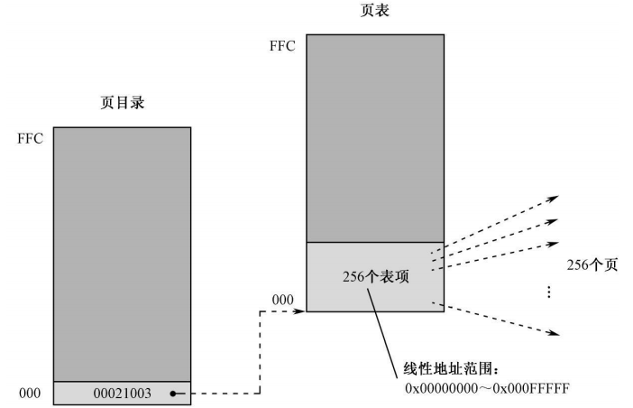
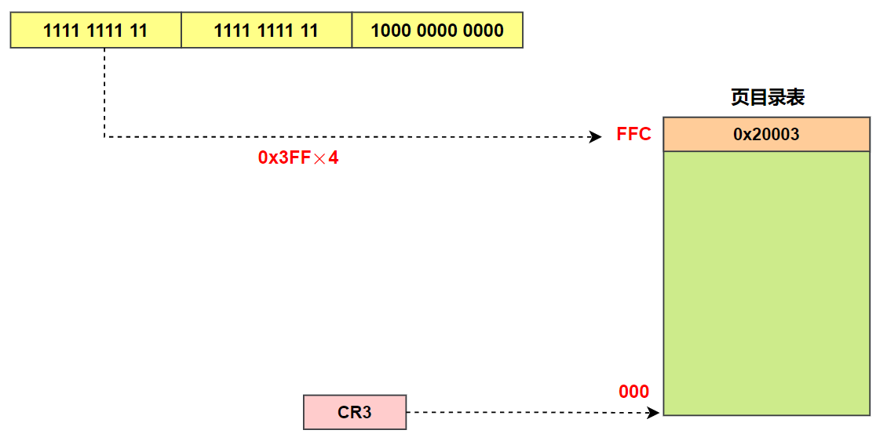
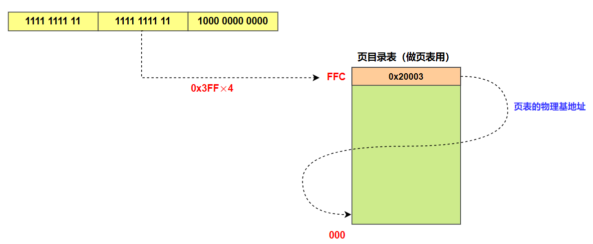
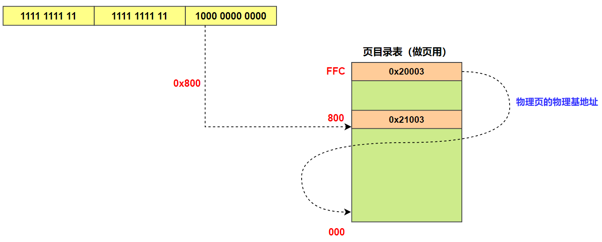
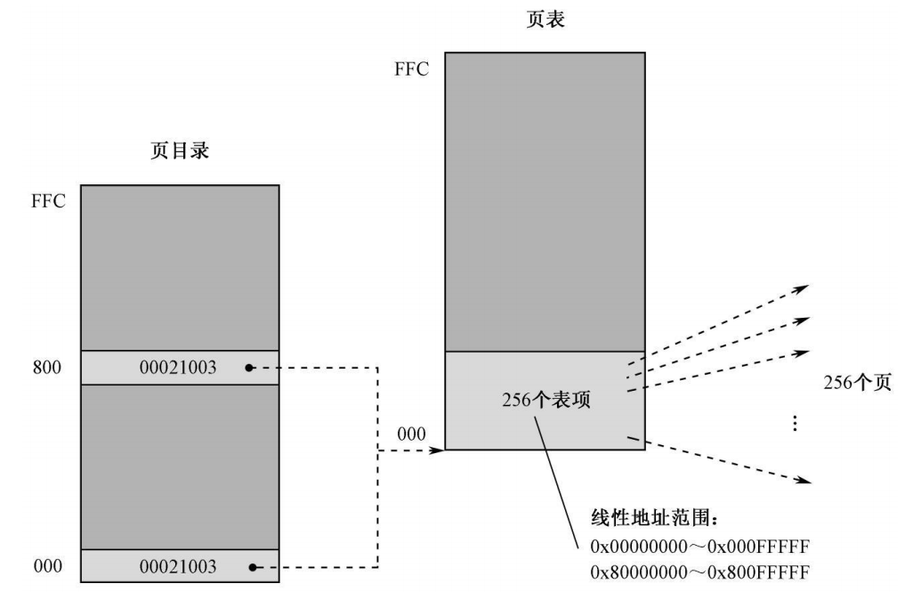
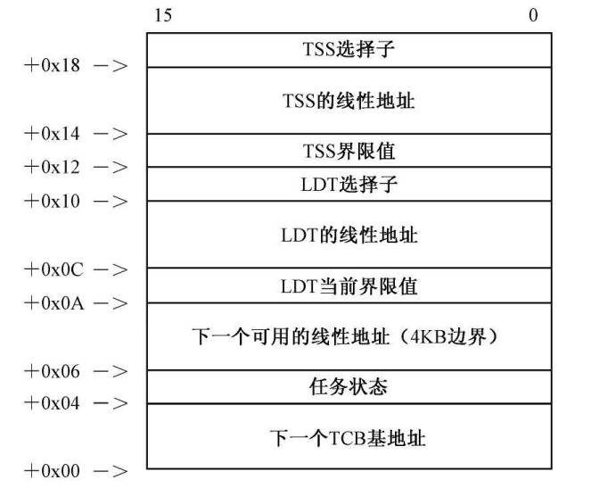

# 分页机制和动态页面分配之二

## 一、分页机制概述

页的最小单位是 4096 字节，4KB，用十六进制表示即 0x1000，可见页的物理地址的最低 12 位全部为 0。**段管理机制对于 Intel 处理器来说是最基本的，任何时候都无法关闭**。也就是说，即使启用页管理功能，分段机制依然是起作用的，段部件也依然工作。

4GB 虚拟内存空间不可能用来保存任何数据，因为它是虚拟的，它只是用来指示内存的使用情况。当操作系统加载一个程序并创建为任务时，操作系统在虚拟内存空间寻找空闲的段，并映射到空闲的页。然后到真正开始加载程序时，再把原本属于段的数据按页的尺寸拆开，分开写入对应的页中。从段部件输出的是线性地址或者叫虚拟地址。**<font color="red">为了根据线性地址找到页的物理地址，操作系统必须维护一张表，把线性地址转换成物理地址</font>**。

另外，从线性地址到物理地址的这种变换不是无缘无故的，而是事先安排好的。当任务加载时，操作系统先创建虚拟的段，并根据段地址的高20位决定它要用到哪些页目录项和页表项。**然后寻找空闲的页，将原本应该写入段中的数据写到一个或者多个页中，并将页的物理地址填写到相应的页表项中**。只有这样做了，当程序运行的时候，才能以相反的顺序进行地址变换，并找到正确的数据。

>只有在保护模式下，才能开启分页模式。

## 二、创建内核的页目录和页表

### 1.内核的页目录和页表

当从主引导程序跳转到内核的入口点 start 处执行时，此时 MBR 程序已经创建了内核的大部分要素：全局描述符表（GDT）、公共例程段、内核数据段、内核代码段、内核栈，还包括一个用于访问全部 4GB 内存空间的段。在开始介绍本章的代码之前，先总体介绍本章程序的结构：

<div align="center">
    
</div>

接下来的工作是准备开启页功能，首先必须创建页目录和页表。每个任务都有自己的页目录和页表，内核也不例外，尽管它是为所有任务所共有的，但也包括作为任务而独立存在的部分，以执行必要的系统管理工作。**因此要想内核正常运行，必须创建它自己的页目录和页表**。

麻烦在于，内核已经被 MBR 加载完毕，它的所有部分都已经位于内存中。当然，你可能会问，这怎么会是个麻烦事呢？原因是，在一个理想的分页系统中，**想要加载程序**，**必须<font color="red">先</font>搜索可用的页**，并将它们与段对应起来。在这种情况下，段部件输出的线性地址和页部件输出的物理地址不同，是很自然的事，因为一切都发生在程序加载完毕、段和页已经有了确定的映射关系之后。

总的来说即在分页系统中，**<font color="red">必须先登记后使用，在加载程序之前，先在内存中搜索分配给程序的可用物理页，将物理页的地址登记到页目录和页表中，这样就形成了程序线性地址和物理地址的对应</font>**，最后将程序加载到内存中。通过这种先登记后使用的方式形成的程序线性地址和物理地址不太可能相等。

然而，由于内核是在开启页功能之前由 MBR 加载的，段在内存中的位置已经固定。在这种情况下，即使开启了页功能，线性地址也必须和物理地址相同才行。比如在开启页功能之前，GDT 在内存中的基地址是 0x00007E00，它就是全局描述符表的物理地址，段部件输出的线性地址就是物理地址。在开启页功能之后，它还在那个内存位置，其线性地址 0x7E00 保存在 GDTR 寄存器中。这就要求页部件输出的物理地址和段部件输出的线性地址相同。一句话，要求线性地址等于物理地址才行。

为了解决这个问题，同时因为我们内核足够小，因此我们只需要将低端的 1MB 内存进行特殊处理，使这一部分的线性地址和经过页部件转换之后的物理地址相同即可。

在页目录中，一个目录项对应着 1024 个 4KB 物理页，共计 4MB 内存，所以对于内核来说，只需要一个页目录和一个页表就足够了。**并且我们将内核页目录 PDT 放在物理地址 0x00020000 处，把内核的第一个页表放在物理地址 0x00021000 处**。

<div align="center">
    
</div>

接下来创建系统内核的页目录 PDT，并将页目录清零，页目录中有 1024 个目录项，全部清零，主要是为了将所有目录项的 P 位设置为 0，表明该页表不在内存中。

### 2.页目录最后一项指向自己

在建立了一个为空的页目录表之后，**将页目录表的物理地址登记在它自己的最后一个目录项内**。最后一个目录项的偏移量是 0xFFC（4092）。页目录需要频繁地进行修改，为了方便用线性地址访问页目录表自身，需要使用这项技术。注意，填写的内容是 0x00020003，该数值的前 20 位是内核页目录 PDT 物理地址的高 20 位;P=1，页是位于内存中的;RW=1，该目录项指向的页表可读可写。

比如当使用指令 **`mov dword [es:ebx+esi]，0x00021003`**（其中 ebx+esi 为 0xFFFFF800）时，当前内核程序的页目录表，其物理地址是由控制寄存器 CR3 指示的，即 0x20000。段部件产生的线性地址是 0xFFFFF800，其高 10 位的值为 0x3FF，乘以 4 得到页目录项的偏移量 0xFFC，加上 0x20000 就得到页目录最后一个目录项的物理地址 0x20FFC，从而得到页表的基地址 0x20003。

<div align="center">
    
</div>

但是我们之前已经将页目录 PDT 的物理基地址 0x20003 写入到此项中，**<font color="red">因此该目录项所指向的页表正是当前的页目录表自己，这实际上是把页目录表当成页表来用</font>**。接下来用线性地址 0xFFFFF800 的中间 10 位作为偏移量来访问页表。这一次使用的偏移量仍然为 $\scriptsize{0x3FF\times4=0xFFC}$，再加上前面得到的页表物理基地址 0x20000 得到本次要访问的页表项的物理地址 0x20FFC，从而得到物理页的基地址 0x20003。

<div align="center">
    
</div>

因为访问的又是同一内存地址 0x20003，故最终访问的物理页仍然是页目录自己。这次将物理页的基地址 0x20000 加上偏移量 0x800 得到实际要访问内存单元物理地址 0x20800。

<div align="center">
    
</div>

综上所述，**<font color="red">如果页目录表的最后一个目录项指向当前页目录表自己，那么无论任何时候，当线性地址的高 20 位是 0xFFFFF 时，访问的就是页目录表自己</font>**。

### 3.填写内核页目录和页表

接下来将内核页目录 PDT 中的最后一个目录项中的值修改为 0x20003，将第一个目录项中的值修改为 0x21003，指向内核的第一个页表的基地址 0x21000。然后真正创建内核的第一个页表，并将内存低端 1MB 所包含的那些页的物理地址按顺序一个一个地填写到此页表中，当然仅填写 256 个页表项，表示线性地址范围 0x00000000~0x000FFFFF，同时也对应内存物理地址范围 0x00000000~0x000FFFFF。接下来将页目录 PDT 中第 256~1024 页表项的值全部设置为 0。

接下来将内核页目录 PDT 的基地址赋值给 CR3 寄存器，并且将 CR0 控制寄存器的最高位 31 位设置为 1，表示开启分页功能。此这一刻开始，段部件产生的地址不再被看成是物理地址，而是要送往页部件进行变换，以得到真正的物理地址。

目前为止，内核的页目录和页表已经创建并且初始化完毕。

## 三、任务全局空间和局部空间的页面映射

一般来说，**<font color="red">全局地址空间占据着任务 4GB 地址空间的高 2GB，对应的线性地址范围是 0x80000000~0xFFFFFFFF</font>**; 而局部地址空间则使用低 2GB，对应的线性地址范围是 0x00000000~0x7FFFFFFF。地址空间的分配必须在每个任务的页目录中体现，页目录的前半部分指向任务自己的页表; 后半部分则指向内核的页表。否则的话，当转到内核中执行时，是无法完成地址转换的，因为找不到对应的目录项和页表项。在任何任务内，在任何时候，如果段部件发出的线性地址高于等于 0x80000000，指向和访问的就是内核自己。

在内核的页目录表中，创建一个和线性地址 0x80000000 对应的目录项，并使它指向同一个页表。毕竟，我们只改变了线性地址空间范围，内核的数据和代码仍然在原来的页内，没有改变。因此代码中使用 **`mov dword [es:ebx+esi]，0x00021003`** 指令将 0x00021003 保存到内核页目录 PDT 中偏移量 0x800 处的页目录项中。

最终，页目录表内有两个目录项都指向同一个页表。不过，尽管指向的是同一个页表，这两个目录项所映射的线性地址是不一样的，旧表项依然对应着线性地址 0x00000000~0x000FFFFF; 新表项则对应着一个高端的地址范围 0x80000000~0x800FFFFF，此两个表项对应的线性地址范围为 1MB。如下图所示。

<div align="center">
    
</div>

仅仅修改页目录表是没有用的，**<font color="red">如果段部件给出的线性地址并不在 0x80000000 以上，是没有用的</font>**。因此必须修改与内核有关的段描述符，包括全局描述符表 (GDT) 自己的线性地址。由于内核各段的地址实际上是在 GDT 的段描述符中指明的，所以需要将 GDT 中的段描述符映射到线性地址 0x80000000 以上，也包括 GDT 起始地址本身。

在 1066~1073 行将 GDT 中 MBR 代码段、内核栈段、文本模式显存段、内核公用例程段、内核数据段和代码段的段描述符中基地址加上 0x80000000。并且将 GDT 的基地址也加上 0x80000000。最后更新 GDTR 寄存器的值。

由于段寄存器实际上是由段选择子和描述符高速缓存组成，当取/执行指令或者访问内存数据时，处理器不会每次都重新加载段寄存器，**而是使用 CS、SS、DS、ES、FS 和 GS 描述符高速缓存器中的内容**。所以为了使处理器真正转移到内存的高端位置执行，需要显式地刷新段寄存器的内容。因此使用 jmp 指令更新 CS 段寄存器中描述符高速缓存的内容，处理器开始从内存高端位置取指令执行，后面使用 mov 指令更新 SS 和 DS 段寄存器的缓存。

最后将内核 C-SALT 表中的段选择子修改为调用门描述符的选择子，并且将创建的调用门描述符安装到 GDT 中。

## 四、创建内核任务

首先是创建内核任务的任务状态段 (TSS)。内核的程序占据着从线性地址 0x80000000 开始的 1MB 内存空间，即 0x80000000~0x800FFFFF，在此之后的空间，即 0x80100000~0xFFFFFFFF，是可以自由分配的。**内核空间中下一个可分配的线性地址保存在内核数据段 core_next_laddr 标号处**，用户程序的下一个可分配的线性地址保存在 TCB 中。

从 core_next_laddr 标号处获取内核空间下一个可用的 **<font color="red">线性地址</font>** 作为 TSS 的起始地址，传入 alloc_inst_a_page 例程。

```armasm{.line-numbers}
;分配一个页，并安装在当前活动的层级分页结构中
;输入：EBX=页的线性地址
alloc_inst_a_page:                          

    push eax
    push ebx
    push esi
    push ds
    
    mov eax,mem_0_4_gb_seg_sel
    mov ds,eax
    
    ;检查该线性地址所对应的页表是否存在
    mov esi,ebx
    and esi,0xffc00000
    ;得到页目录索引，乘以 4
    shr esi,20
    ;页目录自身的线性地址+表内偏移，这里又利用了前面页目录索引 FFC 处保存页目录 PDT 的起始物理地址
    or esi,0xfffff000

    ;页目录项的 P 位为 1 表示页表或者页存在于内存中，这可用于检查该线性地址是否已经有对应的页表，注意 [esi] 此时保存的是页表的物理地址
    test dword [esi],0x00000001
    jnz .b1
    
    ;分配一个页做为【页表】，并将此页的物理地址保存到 eax 中
    call allocate_a_4k_page
    ;设置这个页表的属性，RW=1 可读可写，US=1 所有特权级程序都可以访问，P=1 页表位于内存中
    or eax,0x00000007
    ;在页目录中登记该页表物理地址
    mov [esi],eax

.b1:
    ;在分配了一个页表，并将其物理地址写入到页目录项中后，接下来需要再分配一个物理页，并将其物理地址写入页表项中。这里在处理时，将页表项在页表中的位置，当成了数据在页中的位置
    ;开始访问该线性地址所对应的页表
    mov esi,ebx
    shr esi,10
    ;或者 0xfffff000，因高 10 位是零
    and esi,0x003ff000
    ;得到该页表的线性地址
    or esi,0xffc00000
    
    ;得到该线性地址在页表内的对应条目（页表项） 
    and ebx,0x003ff000
    ;相当于右移 12 位，再乘以 4
    shr ebx,10
    ;页表项的线性地址，线性地址高 10 位为 0x3FF，中间 10 位是页表对应页目录项在页目录中的偏移，低 12 位是页对应页表项在页表中的偏移
    or esi,ebx
    ;分配一个页，这才是要安装的页
    call allocate_a_4k_page
    or eax,0x00000007
    mov [esi],eax
    
    pop ds
    pop esi
    pop ebx
    pop eax
    
    retf
```

在 **`alloc_inst_a_page`** 例程中，首先检查线性地址对应的页表在页目录中是否存在，如果不存在，就调用 allocate_a_4k_page 例程分配一个空闲的物理页作为页表，并且将分配的页的物理地址登记到页目录中；如果线性地址对应的页表在页目录中存在，就分配一个物理页，并且将此页的物理地址登记到页表中。通过分配空闲物理页，并将其物理地址登记到页目录和页表中，内核主程序可以使用从 core_next_laddr 标号处获取的线性地址。

>**<font color="red">在将页的物理地址登记到页表中时，页表项的线性地址高 10 位为 0x3FF，中间 10 位是页表对应页目录项在页目录中的偏移，低 12 位是页对应页表项在页表中的偏移</font>**。

接下来介绍一下 allocate_a_4k_page 例程，在内核数据段的 page_bit_map 标号处用一个长的比特串（页映射位串），来指示每个页的位置和分配情况。第 0 个比特对应着物理地址 0x00000000 的页，第 1 个比特对应着物理地址 0x00001000 的页，依此类推，最后一个比特对应着 0xFFFFF000 的页。整个页映射位串对应着 0~1MB 的内存空间。同时，比特值如果为 0，表示物理页空闲可以分配，为 1 则表示不能进行分配。

```armasm{.line-numbers}
;分配一个 4KB 的页
;输入：无
;输出：EAX=页的物理地址                             
allocate_a_4k_page:

    push ebx
    push ecx
    push edx
    push ds
    
    mov eax,core_data_seg_sel
    mov ds,eax
    
    xor eax,eax
.b1:
    ;先将 eax 清零，表示要从 page_bit_map 指明的第 1 个 bit 开始搜索，将索引值为 eax 的比特传送到 CF 标志位，并且将该索引处的比特置 1
    bts [page_bit_map],eax
    ;jmp if not Carry，当 CF=1 时（发生了进位），继续执行；当 CF=0 时（没有进位），不继续执行，CF=0，说明找到了空闲物理页
    jnc .b2
    inc eax
    cmp eax,page_map_len*8
    jl .b1

    mov ebx,message_3
    call sys_routine_seg_sel:put_string
    ;没有可以分配的页，停机
    hlt
        
.b2:
    ;乘以 4096（0x1000）
    shl eax,12
    
    pop ds
    pop edx
    pop ecx
    pop ebx
    
    ret
```

allocate_a_4k_page 例程使用 bts (Bit Test and Set) 指令测试位串中的某比特，用该比特的值设置 EFLAGS 寄存器的 CF 标志，然后将该比特置 1。它最基本的两种格式为：

```armasm{.line-numbers}
;bts dst, src
bts r/m16, r16
bts r/m32, r32
```

在这里，目的操作数可以是 16/32 位的通用寄存器，或者指向一个包含了 16/32 位实际操作数的内存单元，**<font color="red">用于指定位串</font>**; 源操作数可以是 16/32 位的通用寄存器，**<font color="red">用于指定待测试的比特在位串中的索引(位置)</font>**。

如果目的操作数是通用寄存器，那么指定的位串就是该寄存器的内容 (长度为 16/32 比特)。在这种情况下，根据操作数的长度，处理器先求得源操作数除以 16/32 的余数，并把它作为要测试的比特的索引。**然后从位串中取出该比特，传送到 EFLAGS 寄存器的 CF 位。最后将该比特置位**。

则如果目的操作数是一个内存地址，那么它给出的是位串在内存中的起始地址。同样地，源操作数用于指定待测试的比特在串中的位置。指令执行时，处理器会用目的操作数和源操作数得到被测比特所在的那个内存单元的线性地址。**然后取出该比特，传送到 EFLAGS 寄存器的 CF 位。最后将原处的该比特置位**。

在 **`allocate_a_4k_page`** 例程中，使用 bts 指令遍历 page_bit_map 位串，找到空闲的物理页的索引 eax，然后将 eax 中的索引值乘以 4096 得到分配的空闲物理页的基地址并返回。

 接下来就是填写必要内容到程序管理器（即内核）的 TSS 中，并且为其创建 TSS 描述符，并安装到 GDT 中。并且执行 **`ltr cx`** 指令，将程序管理器 TSS 描述符的 B 位设置为 1，程序管理器任务正在执行中。

 ## 五、用户任务的创建和切换

一般来说，任务都是由内核负责管理和调度的，所有任务的 TCB 都应当占用内核的地址空间，在内核的虚拟地址空间中分配。因此，接下来同样从 core_next_laddr 标号处获取内核空间下一个可用的线性地址作为 TCB 的起始地址，传入 alloc_inst_a_page 例程（分配空闲页，并且将页的物理地址写入到页目录和页表项中）。用户程序的 TCB 块的布局如下所示：

<div align="center">
    
</div>

在 TCB 中，有两个项目应该在创建用户任务前就予以填写和初始化，**它们是 LDT 当前界限值和下一个可用的线性地址**。LDT 当前界限值应该被初始化为 0xFFFF，这是计算机启动时，LDTR 寄存器中的默认界限值（初始长度 0 减去一就等于 0xFFFF）。接下来调用 load_relocate_program 例程进行用户程序加载。

在加载用户程序时，我们需要明确处理器依然在内核的地址空间上工作，或者说，依然使用内核自己的页目录表，但只修改它的前半部分，因为那里属于任务的局部地址空间。最后再把内核的页目录表复制一份，作为用户任务的页目录表。

load_relocate_program 例程刚开始将当前页目录表的前半部分（对应低 2GB 的局部地址空间）清空。在每次创建一个新任务时，都应当清空内核页目录表的前 512 个目录项。当前页目录表的后半部分是由内核使用的（内核的虚拟地址空间被映射在 0x80000000 之后），当前页目录表前半部分是由用户程序使用。

