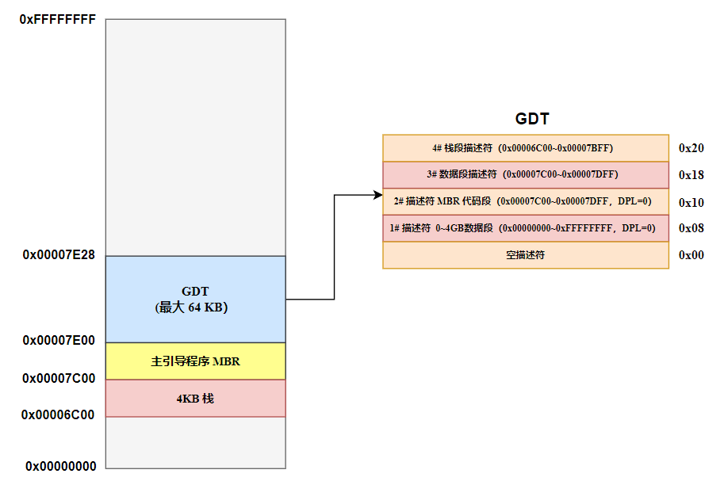

# 存储器的保护

## 0x00.代码

```armasm{.line-numbers}
    ;代码清单12-1
    ;文件名：c12_mbr.asm
    ;文件说明：硬盘主引导扇区代码 
    ;创建日期：2011-10-27 22:52

    ;设置堆栈段和栈指针 
    mov eax,cs      
    mov ss,eax
    mov sp,0x7c00

    ;计算 GDT 所在的逻辑段地址
    ;GDT 的 32 位线性基地址
    mov eax,[cs:pgdt+0x7c00+0x02]       
    xor edx,edx
    mov ebx,16
    ;64 位的被除数保存在 edx:eax 中，32 位除数可以保存在 32 位的通用寄存器中，运算的商保存到 eax 中（GDT 段地址），余数保存到 edx 中（GDT 的偏移地址），商和余数仅低 16 位有效
    ;分解成 16 位逻辑地址
    div ebx

    ;令 DS 指向 GDT 的段地址以进行操作
    mov ds,eax
    ;段内起始偏移地址
    mov ebx,edx                         

    ;创建 0# 描述符，它是空描述符，这是处理器的要求
    ;处理器不允许访问这个描述符，任何时候，使用索引字段为 0 的选择子来访问该描述符，都会被处理器阻止，并引发异常中断
    mov dword [ebx+0x00],0x00000000
    mov dword [ebx+0x04],0x00000000  

    ;创建 1# 描述符，这是一个数据段，对应 0~4GB 的线性地址空间
    ;基地址为 0，段界限为 0xfffff
    mov dword [ebx+0x08],0x0000ffff    
    ;粒度为 4KB，存储器段描述符
    mov dword [ebx+0x0c],0x00cf9200     

    ;创建保护模式下初始代码段描述符
    ;基地址为 0x00007c00，512 字节
    mov dword [ebx+0x10],0x7c0001ff    
    ;粒度为 1 个字节，代码段描述符 
    mov dword [ebx+0x14],0x00409800     

    ;创建以上代码段的别名描述符
    ;基地址为 0x00007c00，512 字节
    mov dword [ebx+0x18],0x7c0001ff    
    ;粒度为 1 个字节，数据段描述符
    mov dword [ebx+0x1c],0x00409200    

    mov dword [ebx+0x20],0x7c00fffe
    mov dword [ebx+0x24],0x00cf9600
    
    ;初始化描述符表寄存器 GDTR
    ;描述符表的界限
    mov word [cs:pgdt+0x7c00],39         

    lgdt [cs:pgdt+0x7c00]

    ;南桥芯片内的端口
    in al,0x92                          
    or al,0000_0010B
    ;打开 A20
    out 0x92,al                        

    ;中断机制尚未工作
    cli                                

    mov eax,cr0
    or eax,1
    ;设置 PE 位
    mov cr0,eax                        

    ;以下进入保护模式... ...
    ;16 位的描述符选择子: 32 位偏移
    jmp dword 0x0010:flush             
                                        
    [bits 32]                          
flush:                                     
    mov eax,0x0018                      
    mov ds,eax

    ;加载数据段 (0..4GB) 选择子
    mov eax,0x0008                     
    mov es,eax
    mov fs,eax
    mov gs,eax

    mov eax,0x0020                     ;0000 0000 0010 0000
    mov ss,eax
    xor esp,esp                        ;ESP <- 0

    mov dword [es:0x0b8000],0x072e0750 ;字符'P'、'.'及其显示属性
    mov dword [es:0x0b8004],0x072e074d ;字符'M'、'.'及其显示属性
    mov dword [es:0x0b8008],0x07200720 ;两个空白字符及其显示属性
    mov dword [es:0x0b800c],0x076b076f ;字符'o'、'k'及其显示属性

    ;开始冒泡排序
    mov ecx,pgdt-string-1              ;遍历次数 = 串长度 - 1 
@@1:
    push ecx                           ;32 位模式下的 loop 使用 ecx 
    xor bx,bx                          ;32 位模式下，偏移量可以是 16 位，也可以 
@@2:                                   ;是后面的 32 位 
    mov ax,[string+bx] 
    cmp ah,al                          ;ah 中存放的是源字的高字节 
    jge @@3 
    xchg al,ah 
    mov [string+bx],ax 
@@3:
    inc bx 
    loop @@2 
    pop ecx 
    loop @@1

    mov ecx,pgdt-string
    ;偏移地址是 32 位的情况 
    xor ebx,ebx                        
@@4:                                     
    ;32 位的偏移具有更大的灵活性
    mov ah,0x07
    mov al,[string+ebx]
    ;演示 0~4GB 寻址
    mov [es:0xb80a0+ebx*2],ax
    inc ebx
    loop @@4

    hlt 

    string            db 's0ke4or92xap3fv8giuzjcy5l1m7hd6bnqtw.'

    pgdt              dw 0
                      dd 0x00007e00      ;GDT 的物理地址
                            
    times 510-($-$$)  db 0
                      db 0x55,0xaa
```

## 0x01 创建 GDT 表

在上面代码中的 1~52 行创建 GDT 表，即创建 5 个段描述符安装到 GDT 中（包括空描述符）。第一个（0#）段描述符是空描述符。

第二个（1#）段描述符是数据段描述符，指向 0~4GB 的内存空间，此段描述符的基地址为 0x0000，段界限为 0xFFFFF，G=1 表示段界限是以 4KB 为单位，D/B=1 表示 32 位的偏移地址或操作数，S=1 表示是一个代码段或数据段，DPL=0，TYPE=0010 说明这是一个可读可写的数据段。

>**<font color="red">对于以 4KB (十进制数 4096 或者十六进制数 0x1000) 为粒度的段，描述符中的界限值加 1，就是该段有多少个 4KB。因此其实际使用的段界限为：$\scriptsize(描述符中的段界限值 + 1)\times0x1000 - 1=描述符中的段界限\times0x1000+0xFFF$</font>**

第三个（2#）段描述符是代码段描述符，指向 MBR 主引导程序本身，此段描述符的基地址为 0x7C00，段界限为 0x1FF，G=0 表示段界限是以字节为单位，D/B=1 表示 32 位偏移地址或操作数，S=1 表示是一个代码段或数据段，DPL=0，TYPE=1000 说明这是一个只执行代码段。

>**若描述符的类别是只执行的代码段，则不允许加载到除 CS 之外的其他段寄存器中。**

第四个（3#）段描述符是第 2# 代码段的别名描述符，为一个数据段，此数据段属性与第 2# 代码段相同，除了 TYPE=0010 说明这是一个可读可写的数据段。在保护模式下，代码段是不可写入的，通过该段的描述符来访问代码段区域时，处理器不允许向里面写入数据或者更改数据。**如果需要访问代码段内的数据，只能重新为该段安装一个新的描述符，并将其定义为可读可写的数据段**。这样当需要修改代码段内的数据时，可以通过这个新的描述符来进行。

像这样当两个以上的描述符都描述和指向同一个段时，把另外的描述符称为别名 (alias)。注意别名技术并非仅仅用于读写代码段，**如果两个程序想共享同一个内存区域，可以分别为每个程序都创建一个描述符，而且它们都指向同一个内存段**。

第五个（4#）段描述符是栈段描述符，此段描述符的基地址为 0x7C00，段界限为 0xFFFFE，G=1 表示段界限是以 4KB 为单位，B=1 表示栈段的上部边界（也就是 esp 寄存器的最大值）为 0xFFFFFFFF。DPL=0，TYPE=0110 表示这是一个可读、可写并且向下扩展的栈段。此栈的实际范围为：**`0x6C00~0x7BFF`**。

由于 D/B=1，Modulus=4GB=0x1 0000 0000，故可以列出方程：

```armasm{.line-numbers}
;GDT/LDT Base
LA + Length - Modulus = 0x7C00
;GDT/LDT Limit
(Modulus - 1) - Length = 0xFFFF EFFF
```

最后可以得到：

```armasm{.line-numbers}
LA = 0x6C00
Length = 0x100000000 + 0x1000 = 0x1000
Smallest Offset = 0x100000000 - 0x1000 =  0xFFFF F000
Largest Offset = 0xFFFF FFFF
initial eSP = 0
```

对于此栈段，其 esp 在进行栈操作时必须满足以下原则：

```armasm{.line-numbers}
0xFFFF F000（Smallest Offset）<= esp - 操作数的长度 <= 0xFFFF FFFF（Largest Offset）
;栈指针寄存器 ESP 只在访问栈时提供偏移地址，操作数在压入栈时的物理地址要用段基址 base 和 esp 的内容相加得到
0x6C00 <= esp - 操作数的长度 + Base <= 0x7BFF
```

在创建完 GDT 表之后，程序中各个部分在内存中的分布如下所示：

<div align="center">
    
</div>

## 0x02 使用别名访问代码段对字符排序

