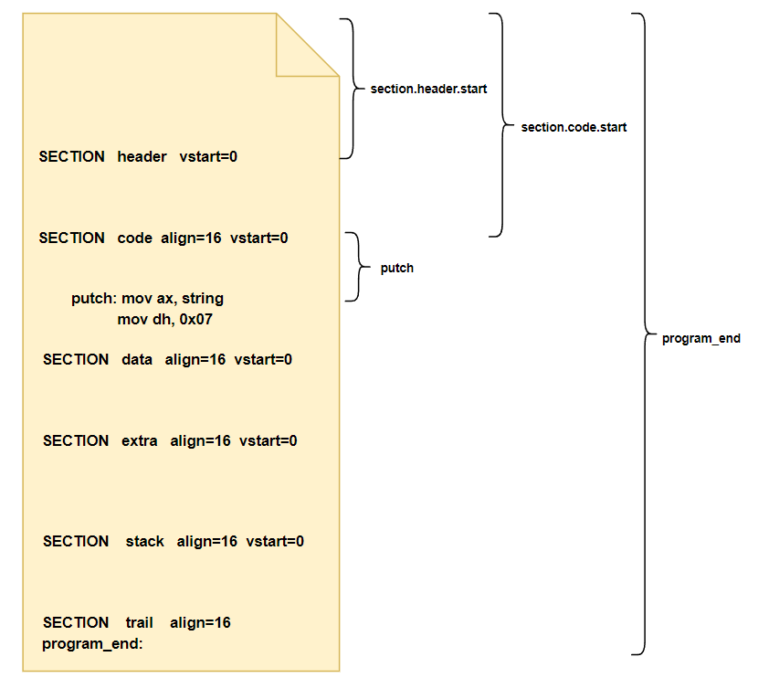
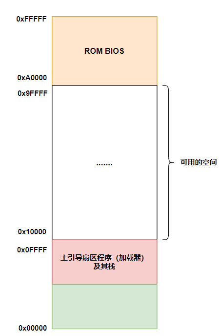
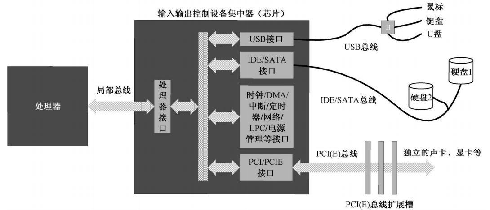
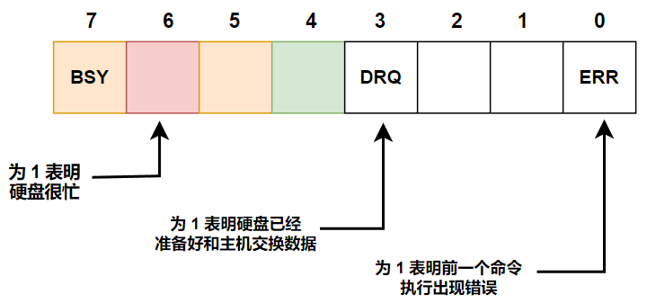

# 硬盘与显卡的访问和控制

## 一、前言

程序虽然有很多个，但其加载过程却是固定的。在本章，**我们把主引导扇区改造成一个程序加载器**，它的功能是从磁盘中加载用户程序到内存中，在加载过程中需要重新计算用户程序中代码段、数据段和栈段的段地址。然后将处理器的控制权交给该程序，执行该程序，即将 **`cs:ip`** 寄存器内容变为用户程序入口点的段地址与偏移地址。

我们知道，编译好的程序通常都存放在像硬盘这样的载体上，需要加载到内存之后才能执行。这个过程并不简单，首先要读取硬盘，然后决定把它加载到内存的什么位置。**最重要的是，程序通常是分段的，载入内存之后，还要重新计算段地址，这叫做段的重定位**。

>和主引导扇区一样，操作系统也位于硬盘上。操作系统是需要安装到硬盘上的，**这个安装过程不但要把操作系统的指令和数据写入硬盘，通常还要更新主引导扇区的内容，好让这块跳板直接连着操作系统**。不像我们，一直用主引导扇区来显示字符和做加法。

用户程序代码如下所示：

```armasm{.line-numbers}
;代码清单 8-2
;文件名：c08.asm
;文件说明：用户程序 

;============================== 用户程序头 ================================
        ;定义用户程序头部段，包括程序总长度、用户程序入口执行点、段重定位表
SECTION header vstart=0                         
        ;程序总长度[0x00] 
        program_length  dd program_end          
    
        ;用户程序入口点
        ;偏移地址[0x04]
        code_entry      dw start                    
        ;段地址[0x06]
                        dd section.code_1.start      
        
        ;段重定位表项个数[0x0a]
        realloc_tbl_len dw (header_end - code_1_segment) / 4
                                                
        ;段重定位表           
        ;代码段1:[0x0c]
        code_1_segment  dd section.code_1.start 
        ;代码段2:[0x10]
        code_2_segment  dd section.code_2.start 
        ;数据段1:[0x14]
        data_1_segment  dd section.data_1.start 
        ;数据段2:[0x18]
        data_2_segment  dd section.data_2.start 
        ;栈段:[0x1c]
        stack_segment   dd section.stack.start
        
        header_end:                

;================================= 代码段1 ===============================

;定义代码段1（16 字节对齐）
SECTION code_1 align=16 vstart=0          

;显示字符串串 (字符串以 0 结尾)
;输入：DS:BX = 32 位物理地址
put_string:                              
        ;输入：DS:BX=串地址，ds 指向数据段的段地址，bx 初始值指向数据段中的 msg0                                        
        mov cl,[bx]
        ;cl=0，如果 cl=0 的话，那么说明整个要显示字符串的结束
        or cl,cl                         
        ;如果显示到字符串的结尾，返回主程序
        jz .exit                          
        call put_char
        ;下一个字符
        inc bx                            
        jmp put_string

   .exit:
        ret

;显示一个字符
put_char:                                
        ;输入：cl = 字符 ascii
        push ax
        push bx
        push cx
        push dx
        push ds
        push es

        ;以下两段代码获取当前光标位置，即光标寄存器的高 8 位和低 8 位分别保存到 ah 和 al 中
        mov dx,0x3d4
        mov al,0x0e
        ;索引寄存器的端口号是 0x3d4，将 0x0e 的值写入此索引寄存器（al -> dx）
        ;指定想要访问光标寄存器（高 8 位）
        out dx,al
        ;在前面指定了想要访问的寄存器后，后面需要读/写数据
        mov dx,0x3d5
        ;高8位，从前面指定的光标寄存器中读取数据到 al 中（al <- dx）
        in al,dx                  
        mov ah,al

        ;取当前光标位置的低 8 位到寄存器 al 中
        mov dx,0x3d4
        mov al,0x0f
        out dx,al
        mov dx,0x3d5
        in al,dx                        
        ;bx = 代表光标位置的 16 位数 
        mov bx,ax                       

        ;判断要显示的字符 cl 是否为回车符？
        cmp cl,0x0d                     
        ;如果不是，看看是不是换行等字符
        jnz .put_0a
        ;如果是回车，就将当前光标转移到当前行行首                    
        mov ax,bx                        
        mov bl,80   
        ;每行有 80 个字符，用当前光标的位置除以 80，商 al 寄存器中就是当前光标所在行号    
        div bl
        ;将 al 中的内容乘以 bl 中的 80，会在结果 ax 寄存器中得到当前行行首的光标值
        mul bl
        mov bx,ax
        jmp .set_cursor

.put_0a:
        ;判断要显示的字符 cl 是否为换行符？
        cmp cl,0x0a                     
        ;不是，那就正常显示字符
        jnz .put_other  
        ;如果是换行符，就将当前的光标移动到下一行
        ;如果当前行在屏幕中是最后一行，就需要进行滚屏                 
        add bx,80
        jmp .roll_screen

.put_other:                             
        ;正常显示字符，在内存中，0xB8000～0xBFFFF 是留给显卡的，由显卡来显示文本
        ;使用 es 作为显存寄存器，段地址为 0xb800，偏移地址为 0x0000~0x7FFF
        mov ax,0xb800
        mov es,ax
        ;由于一个字符在显存中对应两个字节，所以可以将光标位置乘以 2 来得到该位置在显存中的偏移地址
        shl bx,1
        mov [es:bx],cl
        ;以下将光标位置推进一个字符
        shr bx,1
        add bx,1

.roll_screen:
        ;光标超出屏幕？滚屏
        cmp bx,2000                     
        jl .set_cursor

        mov ax,0xb800
        mov ds,ax
        mov es,ax
        ;从 ds:si 传送到的目的地址 es:di，并且 cld 表示要进行正向传输，即从低地址传送到高地址
        cld
        ;将屏幕上第 2~25 行的内容整体往上提 1 行，最后用黑底白字的空白字符填充第 25 行
        mov si,0xa0
        mov di,0x00
        mov cx,1920
        rep movsw
        ;清除屏幕最底一行
        mov bx,3840                     
        mov cx,80
.cls:
        ;0x0720 中的 0x20 表示空白字符（SPACE），0x07 表示黑底白字
        mov word [es:bx],0x0720
        add bx,2
        loop .cls
        ;将光标移到至最后一行的开头处
        mov bx,1920

.set_cursor:
        ;不管是回车、换行，还是显示可打印字符，上面都给出了光标位置的新数值
        ;下面就是将新的光标位置在屏幕上显示出来
        mov dx,0x3d4
        mov al,0x0e
        ;al -> dx，指定要访问光标寄存器（高 8 位）
        out dx,al
        ;需要往光标寄存器写数据
        mov dx,0x3d5
        mov al,bh
        ;将光标位置的高 8 位写入
        out dx,al

        mov dx,0x3d4
        mov al,0x0f
        ;al -> dx，指定要访问光标寄存器（低 8 位）
        out dx,al
        mov dx,0x3d5
        mov al,bl
        ;将光标位置的低 8 位写入
        out dx,al

        pop es
        pop ds
        pop dx
        pop cx
        pop bx
        pop ax

        ret

start:
        ;初始执行时，ds、es 和 ss 指向用户程序头部段和加载器的栈空间
        ;在初始化段寄存器时，必须先初始化栈段寄存器 ss，再初始化 ds 寄存器，否则 header 段中的数据无法访问
        ;设置用户程序自己的堆栈，将用户程序堆栈的段地址写入到 ss 中
        ;用户程序堆栈的段地址是距离用户程序起始地址（phy_base）的一个偏移量，并且 16 字节对齐
        mov ax,[stack_segment]            
        mov ss,ax
        ;由于栈段的 vstart=0，所以标号 stack_end 的地址实际为 256
        mov sp,stack_end

        ;设置到用户程序自己的数据段
        mov ax,[data_1_segment]          
        mov ds,ax

        mov bx,msg0
        ;显示第一段信息
        call put_string                   

        ;将代码段 2 的段地址压入栈中
        push word [es:code_2_segment]
        ;将代码段 2 中需要执行代码的偏移地址保存到 ax 寄存器并压入栈中
        mov ax,begin
        push ax                          
        ;转移到代码段 2 执行
        retf                              
         
continue:
        ;段寄存器 ds 切换到数据段 2
        mov ax,[es:data_2_segment]        
        mov ds,ax
        mov bx,msg1
        ;显示第二段信息
        call put_string    
        ;$ 在汇编语言中通常表示当前指令的地址
        ;jmp $ 表示跳转到当前指令的地址，这实际上是一个无限循环               
        jmp $ 

;================================= 代码段2 ====================================

SECTION code_2 align=16 vstart=0          ;定义代码段2（16 字节对齐）

begin:
        push word [es:code_1_segment]
        mov ax,continue
        push ax                         
        ;转移到代码段 1 中的 continue 接着执行
        retf                              
         
;================================== 数据段1 ====================================

SECTION data_1 align=16 vstart=0

  msg0  db '  This is NASM - the famous Netwide Assembler. '
        db 'Back at SourceForge and in intensive development! '
        db 'Get the current versions from http://www.nasm.us/.'
        db 0x0d,0x0a,0x0d,0x0a
        db '  Example code for calculate 1+2+...+1000:',0x0d,0x0a,0x0d,0x0a
        db '     xor dx,dx',0x0d,0x0a
        db '     xor ax,ax',0x0d,0x0a
        db '     xor cx,cx',0x0d,0x0a
        db '  @@:',0x0d,0x0a
        db '     inc cx',0x0d,0x0a
        db '     add ax,cx',0x0d,0x0a
        db '     adc dx,0',0x0d,0x0a
        db '     inc cx',0x0d,0x0a
        db '     cmp cx,1000',0x0d,0x0a
        db '     jle @@',0x0d,0x0a
        db '     ... ...(Some other codes)',0x0d,0x0a,0x0d,0x0a
        db 0

;==================================== 数据段2 ==================================

SECTION data_2 align=16 vstart=0

   msg1 db '  The above contents is written by LeeChung. '
        db '2011-05-06'
        db 0

;===================================== 栈段 =====================================

SECTION stack align=16 vstart=0           
        resb 256

stack_end:  

;==================================== trail段 ==================================

SECTION trail align=16
program_end:
```

主引导扇区的代码如下所示：

```armasm{.line-numbers}
;代码清单 8-1
;文件名：c08_mbr.asm
;文件说明：硬盘主引导扇区代码（加载程序） 

;常数使用伪指令 equ 声明，它的意思为等于，常数的声明不会占用汇编地址
;app_lba_start 表示用户程序起始逻辑扇区号（lba）
app_lba_start equ 100          

;vstart=0x7c00 意味着此段后续所有元素的汇编地址从 0x7c00 开始计算
;这是因为主引导程序的实际物理地址是 0x0000:0x7c00，所以设置了 vstart 之后不用手动加上 0x7c00
SECTION mbr align=16 vstart=0x7c00                                     

        ;设置栈段寄存器 ss 和栈指针寄存器 sp 
        mov ax,0      
        mov ss,ax
        mov sp,ax

        ;计算用于加载用户程序的内存逻辑段地址，该段地址保存在双字 dd 中
        mov ax,[cs:phy_base]
        mov dx,[cs:phy_base + 002]
        mov bx,16
        ;dx(高 16 位) ax(低 16 位) 除以 bx，最后的结果商在 ax 中，余数在 dx 中        
        div bx
        ;令 ds 和 es 指向该段以进行操作
        ;最后 ax 就是实际计算出来的逻辑段地址（用户程序需要加载到该逻辑段地址处）
        mov ds,ax
        mov es,ax

        ;以下读取程序的起始部分
        ;在后面的过程调用中需要使用 di:si 来提供读取的扇区号 LBA（26 位）
        ;因此需要使用 2 个寄存器 di、si 来保存
        xor di,di
        ;程序在硬盘上的起始逻辑扇区号
        mov si,app_lba_start            
        ;加载到 ds:0x0000 处 
        xor bx,bx       
        ;将磁盘中的程序头（header，即第一个扇区）读取到内存地址 phy_base 处       
        ;程序头中包含整个程序的大小字节数、入口以及段重定位表         
        call read_hard_disk_0

        ;以下判断整个程序有多大
        ;用户程序的总长度是保存在双字 dd 中，所以把高位保存到 dx 中，低位保存到 ax 中
        mov dx,[2]                       
        mov ax,[0]
        ;512 字节每扇区
        mov bx,512                      
        ;除以 bx（512），ax 中保存商，也就是程序有多少个扇区
        ;dx 中保存余数，也就是还剩余多少字节
        div bx
        cmp dx,0
        ;如果未除尽，且 ax = 0，则说明用户程序大小只有不到 1 个扇区的大小，直接跳转到 direct 
        ;如果未除尽，且 ax > 0，则说明用户程序真正占用的扇区数 = ax + 1，所以不用减少扇区数
        ;如果除尽了，用户程序真正占用的扇区数 = ax，由于已经读了一个扇区，所以扇区总数减 1 
        jnz @1                       
        dec ax                           
   @1:
        ;考虑实际长度小于等于 512 个字节的情况
        cmp ax,0                         
        jz direct

        ;读取剩余的扇区，由于用户程序要读到 ds:bx 指定的区域，但是如果用户程序太大超过一个段的限制（64KB），
        ;那么就需要每次读取一个扇区时临时改变段寄存器 ds 中的值，将其加上 0x20，
        ;由于每次传输用户程序都是在一个新段内进行，故 bx 在每次数据传输前需要清零
        push ds                         
        ;循环次数（剩余扇区数） 
        mov cx,ax                       
   @2:
        mov ax,ds
        ;得到下一个以 512 字节为边界的段地址
        add ax,0x20                     
        mov ds,ax  
                        
        ;每次读时，偏移地址 bx 始终为 0x0000
        xor bx,bx                       
        ;下一个逻辑扇区，之前 si 中为 app_lba_start，即 100
        inc si                           
        call read_hard_disk_0
        ;循环读，直到读完整个功能程序
        loop @2                          

        ;恢复数据段基址到用户程序头部段
        pop ds                           
      
        ;由于用户程序被加载到内存 phy_base 处，所以用户程序中的段地址发生了变化需要重新计算（重定位）
        ;用户程序的入口点处段地址被重新计算
   direct:
        ;0x06-0x09 这 4 个字节表示入口点所在代码段的汇编地址 section.code_1.start
        ;由于是双字，因此需要使用两个寄存器 ax、dx 来保存
        mov dx,[0x08]
        mov ax,[0x06]
        call calc_segment_base
        ;回填修正后的入口点代码段基址
        mov [0x06],ax                    

        ;开始处理段重定位表
        ;需要重定位的项目数量
        mov cx,[0x0a]
        ;重定位表首地址
        mov bx,0x0c                     
        
        ;用户程序的各个代码、数据段被重新计算
realloc:
        ;32 位地址的高 16 位
        mov dx,[bx + 0x02]                 
        mov ax,[bx]
        call calc_segment_base
        ;回填段的基址
        mov [bx],ax                     
        ;下一个重定位项（每项占 4 个字节）
        add bx,4                         
        loop realloc 
        ;转移到用户程序
        jmp far [0x04]                    
 
;di:si 指定的 LBA 逻辑扇区号区域读取一个扇区，并写入到 ds:bx 指定的数据区域
;ds 就是根据 phy_base 处保存的物理地址计算出来的逻辑段地址，bx 被清零
;输入：DI:SI = 起始逻辑扇区号
;      DS:BX = 目标缓冲区地址
read_hard_disk_0:                        

        push ax
        push bx
        push cx
        push dx

        🌟;1.设置要读取的扇区数量;2.设置要读取的起始扇区号（LBA）;3.设置读取命令 🌟
        ;设置要读取的扇区数量，这个数值要写入 0x1f2 端口
        mov dx,0x1f2
        mov al,1
        ;从磁盘读取的扇区数，默认每次都读取 1 个扇区，从 al 写到寄存器 dx 中
        out dx,al                       

        ;使用 di:si 来提供读取的扇区号 LBA（28 位）
        ;分别将这 28 位的 LBA 号写入到磁盘控制器的端口 0x1f3 ~ 0x1f6 中
        inc dx                          
        mov ax,si
        ;LBA 地址 7~0 -> 0x1f3
        out dx,al                       

        ;dx 为端口 0x1f4
        inc dx                          
        mov al,ah
        ;将 LBA 地址 15~8 -> 0x1f4
        out dx,al                      

        ;dx 为端口 0x1f5
        inc dx                          
        mov ax,di
        ;将 LBA 地址 23~16 -> 0x1f5
        out dx,al                       

        ;dx 为端口 0x1f6
        inc dx                          
        mov al,0xe0                     
        ;or 运算后，al 中的低 4 位表示 LBA 地址 24~27 位，高 4 位的 e（0x1110）表示这是 LBA 模式
        or al,ah                        
        ;写入到 0x1f6 端口中
        out dx,al
        
        ;向端口 0x1f7 写入 0x20，请求硬盘读
        inc dx                          
        mov al,0x20                     
        out dx,al

  .waits:
        ;端口 0x1f7 既是命令端口，又是状态端口
        ;第 7 位置 1 表示磁盘正在准备工作，准备好之后，此位清零，第 3 位置 1 表示已准备好，请求主机发送或者接收数据
        in al,dx
        and al,0x88
        cmp al,0x08
        ;等于 0 的话，不忙，且硬盘已准备好数据传输，否则继续循环等待
        jnz .waits                       

        ;总共要读取的字数（256 个字，即 512 个字节）
        mov cx,256                      
        ;0x1f0 是硬盘接口的数据接口，而且是一个 16 位的端口
        mov dx,0x1f0
  .readw:
        in ax,dx
        ;ds:bx 表示目标缓冲区的地址，ds 就是程序要加载到的逻辑段地址
        mov [bx],ax
        ;每次读取 16 位，即两个字节大小
        add bx,2
        loop .readw

        pop dx
        pop cx
        pop bx
        pop ax

        ret

;计算 16 位段地址
;输入：DX:AX = 32 位物理地址
;返回：AX = 16 位段基地址
calc_segment_base:                       
        
        push dx                          

        ;段寄存器 cs 的内容为 0x0000，由于主引导扇区位于 0x0000:0x7c00 处
        ;理论上指令中的偏移地址为 cs:phy_base+0x7c00，但是由于 vstart=0x7c00，所以不需要做处理
        add ax,[cs:phy_base]
        adc dx,[cs:phy_base + 0x02]
        shr ax,4
        ror dx,4
        and dx,0xf000
        or ax,dx
        pop dx
        ret

        ;用户程序被加载到内存的起始物理地址
        ;因为物理地址是 20 位，所以必须使用 32 位的双字类型 dd 来保存
        phy_base dd 0x10000             
                                                 
times 510-($-$$) db 0
db 0x55,0xaa
```

## 二、用户程序结构

### 1.分段、段的汇编地址和段内汇编地址

**处理器的工作模式是将内存分成逻辑上的段，指令的获取和数据的访问一律按 "段地址:偏移地址" 的方式进行**。相对应地，一个规范的程序，应当包括代码段、数据段、附加段和栈段。NASM 编译器使用汇编指令 **`SECTION`** 或者 **`SEGMENT`** 来定义段。它的一般格式是：

```armasm{.line-numbers}
SECTION 段名称
SEGMENT 段名称
```

每个段都要求给出名字，这就是段名称，它主要用来引用一个段。实际上，段只是用来分隔程序中不同的内容。比较重要的是，**一旦定义段，那么，后面的内容就都属于该段，除非又出现了另一个段的定义**。有时候，程序并不以段定义语句开始。在这种情况下，这些内容默认地自成一个段。最为典型的情况是，**整个程序中都没有段定义语句。这时整个程序自成一个段**。

>NASM 对于段的数量没有限制

intel 处理器要求段在内存中的起始物理地址起码是 16 字节对齐的，即该物理地址必须能被 16 整除。汇编语言源程序中定义的各个段，也有对齐方面的要求。**具体做法是，在段定义中使用 "align=" 子句，用于指定某个 SECTION 的汇编地址对齐方式**，比如说，"align=16" 就表示段是 16 字节对齐的，"align=32" 就表示段是 32 字节对齐的。

在源程序的编译阶段，编译器就会根据 align 子句确定段的起始汇编地址。**段的汇编地址就是段内第一个元素（数据、指令）的汇编地址**。每个段都有一个汇编地址（或者说起始地址），它是相对于整个程序开头（0）的，为了方便取得该段的汇编地址，NASM 编译器提供了表达式 **`section.段名称.start`**。

在下图中，段 "header" 相对于整个程序开头的汇编地址 **`section.header.start`**，段 "code" 相对于整个程序开头的汇编地址 **`section.code.start`**。尽管定义了段，但是，引用某个标号时，**该标号处的汇编地址依然是从整个程序的开头计算的，而不是从段的开头处计算的**。不过 vstart 可以解决这个问题。

下图中，"putch" 是段 code 中的一个标号，原则上，该标号代表的汇编地址应该从程序开头计算。但是，因为段 code 的定义中有 "vstart=0" 子句，所以，标号 "putch" 的汇编地址要从它所在段的开头计算，而且从 0 开始计算。

<div align="center">
    
</div>

在程序最后一个段 trail 中，没有 vstart 子句，该段内的 program_end 标号的汇编地址要从程序头开始计算，所以其汇编地址也表示整个程序大小。

总结来说，**vstart=xxx 的作用仅仅是告诉编译器："请你把我后面定义的标号地址从 xxx 为起点开始编址吧"，别无他用**。它只负责编址，不负责加载，加载程序是加载器的事。 所以，用 vstart 的时机是：我预先知道我的程序将来会被加载到某个偏移地址处。拿确切的例子来说，BIOS (加载器) 会将 MBR 引导程序加载到 0000:7c00 处，所以 MBR 程序段必须用 vstart=7c00 修饰。**一般情况下使用 vstart=0 (利于重定位)，这是因为段在内存中都以 16 位对齐，所以进入段时，偏移地址总是从零开始，如果标号的汇编地址和段中的偏移地址不一致，就会发生错误**。

### 2.用户程序头部

一般来说，加载器和用户程序是在不同的时间、不同的地方，由不同的人或公司开发的。这就意味着，它们彼此并不了解对方的结构和功能。但是用户程序会在程序开头写明自己程序的基本情况，**包括程序的总长度、入口点、段重定位表项数、段重定位表**。而加载器会固定从用户程序头部读取，如下所示：

<div align="center">
    
</div>

用户程序头部起码要包含以下信息：

**1)用户程序的尺寸**

即以字节为单位的大小。**这是因为加载器需要根据这一信息来决定读取多少个逻辑扇区才能把用户程序读取到内存中**。由于用户程序可能很大，所以使用伪指令 dd 来声明和初始化一个双字，即一个 32 位的数据。程序的大小即标号 **`program_end`** 所代表的汇编地址，注意 **`program_end`** 所在的 trail 段没有 **`vstart=0`** 子句，**因此标号 "program_end" 所代表的汇编地址是从整个程序的开头计算的**。

**2)应用程序的入口点**

**包括段地址和偏移地址**。加载器并不清楚用户程序的分段情况，更不知道第一条要执行的指令在用户程序中的位置。因此，必须在头部给出第一条指令的段地址和偏移地址，这就是所谓的应用程序入口点(Entry Point)。

入口点代码如下，依次指明了入口点的偏移地址和段地址，**当然 `section.code_1.start` 指明的段地址仅仅是编译阶段确定的汇编地址，在程序实际加载到内存后，还需根据加载的位置重新计算（段重定位）**。

```c{.line-numbers}
        code_entry      dw start                    
                        dd section.code_1.start 
```

>一个段可以起始于任何 20 位物理地址处，所以只能使用双字 dd（32位）来保存 20 位的段地址。

**3)段重定位表**

用户程序可能包含不止一个段，比较大的程序可能会包含多个代码段和多个数据段。这些段被加载器加载到内存后，每个段的起始地址必须重新确定一下（段重定位）。

段的重定位是加载器的工作，它需要知道每个段在用户程序内的位置，即它们分别位于用户程序内的多少字节处。为此，需要在用户程序头部建立一张段重定位表。但是用户程序可以定义的段在数量上是不确定的，因此，段重定位表的大小也需要在用户程序头部声明。

## 三、加载器的工作流程

### 1.初始化和决定加载的位置

加载器要加载一个用户程序，并使之开始执行，需要决定两件事：首先，**用户程序位于硬盘上的位置，它的起始逻辑扇区号是多少；其次，看看内存中的什么地方是空闲的，即从哪个物理内存地址开始加载用户程序**。

首先，加载用户程序需要一个确定的内存物理地址，MBR 程序中对内存物理地址的声明如下，同样使用双字 dd 来保存一个 20 位的物理地址，可以指定其它物理地址，只要该起始地址是 16 字节对齐的，这样才能在未来形成一个有效的段地址。

```c
phy_base dd 0x10000 
```

下图是计算机的地址空间，物理地址在 0x0FFFF 以下，是加载器及其栈的势力范围；物理地址在 0xA0000 以上，是 BIOS 和外围设备的势力范围，有很多传统的老式设备将自己的存储器和只读存储器映射到这个空间。

<div align="center">
    
</div>

### 2.准备加载用户程序

在加载器的代码中，将整个 MBR 程序看成一个段，**`SECTION mbr align=16 vstart=0x7c00`**（虽然不这么做，整个程序也会被 NASM 编译器自动看成一个段），并且有 **`vstart=0x7c00`** 子句。之所以这么定义是 MBR 程序实际会被加载到内存 **`0x0000:0x7c00`** 处，如果不定义，那么当我们引用一个标号时，还得手工加上那个落差 0x7c00，**而加了 vstart 子句后，段内所有元素的汇编地址都将从 0x7c00 开始计算**，也就省去了给标号手动加上 0x7c00 的步骤。

接着 MBR 代码的第 15~16 行用于初始化栈段寄存器 ss 和栈指针 sp，之后，栈的段地址为 0x0000，段的长度是 64KB，栈指针将在段内 0xFFFF 和 0x0000 之间变化。接着 MBR 代码的第 19~27 行获取用户程序要被加载到的段地址，并保存到 es 和 ds 寄存器中。

### 3.从硬盘（外围设备）读取用户程序

下图是计算机内部总线示意图，**处理器通过局部总线连接到 ICH （输入输出集中控制器，I/O Controller Hub）内部的处理接口电路。然后，在ICH 内部，又通过总线与各个 I/O 接口相连**。ICH 的作用是连接不同的总线，如 USB 总线、IDE/SATA 总线等，并协调各个 I/O 接口（USB 接口、PCI/PCIE 接口等）对处理器的访问，不产生冲突。在个人计算机上，ICH 被称为南桥芯片。

<div align="center">
    
</div>

>每个 IO 接口卡可能连接不止一个设备。比如 USB 接口，因为同类型的设备较多，也涉及线路复用和仲裁的问题，**故 I/O 接口也有自己的总线体系，称为通信总线或者设备总线**。比如上图所示的 USB 总线和 SATA 总线。

处理器是通过端口（Port）来和外围设备打交道的。本质上，端口就是一些寄存器，类似于处理器内部的寄存器。只是端口寄存器位于 I/O 接口电路中。端口是处理器和外围设备通过 I/O 接口交流的窗口，每一个 I/O 接口都可能拥有好几个端口，分别用于不同的目的。比如，连接硬盘的 PATA/SATA 接口就有几个端口:

1. 命令端口：当向该端口写入 0x20 时，表明是从硬盘读数据；写入 0x30 时，表明是向硬盘写数据；
2. 状态端口：处理器根据这个端口判断硬盘工作是否正常；
3. **参数端口：处理器通过这些端口告诉硬盘读写的扇区数量，以及起始的逻辑扇区号；**
4. 数据端口：**通过这个端口连续地取得要读出的数据，或者通过这个端口连续地发送要写入硬盘的数据**；

端口有不同的实现方式，既有独立编址也有内存映射，之后我们只介绍独立编址实现的端口。在 Intel 的系统中，只允许 65536 (十进制数)个端口存在，端口号从 0 到 65535，即 **`0x0000~0xffff`**。因为是独立编址，**所以，端口的访问不能使用类似于 mov 这样的指令，取而代之的是 in 和 out 指令**。

in 指令是从端口读，它的一般形式为：

```armasm{.line-numbers}
in al,dx       ;从 dx 指定端口中读取数据到 al/ax 中
in ax,dx
```

这就是说，in 指令的目的操作数必须是寄存器 AL 或者 AX，当访问 8 位的端口时，使用寄存器 AL；访问 16 位的端口时，使用 AX，in 指令的源操作数应当是寄存器 DX，端口号就保存在 DX 寄存器中。

>**in 指令不能使用别的通用寄存器，也不能使用内存单元作为操作数。in 指令不影响任何标志位**。

out 指令正好和 in 指令相反，往端口中写数据，目的操作数可以是 8 位立即数或者寄存器 dx，源操作数必须是寄存器 al 或者 ax。下面是一些例子:

```armasm{.line-numbers}
out 0x37,al     ;写 0x37 号端口(这是一个 8 位端口)
out 0xf5,ax     ;写 0xf5 号端口(这是一个 16 位端口)
out dx,al       ;这是一个 8 位端口，端口号在寄存器 DX 中
out dx,ax       ;这是一个 16 位端口，端口号在寄存器 DX 中
```

>out 指令不影响任何标志位

接下来通过硬盘控制器端口读写数据，**硬盘读写的基本单位是扇区。就是说，要读就至少读一个扇区，要写就至少写一个扇区，不可能仅读写一个扇区中的几个字节。即主机和硬盘之间的数据交换是成块的，所以硬盘是典型的块设备**。

从硬盘读数据，最简单的方式是向硬盘控制器分别发送磁头号、柱面号以及扇区号，这被称为 CHS 模式。但是也可以通过发送**逻辑扇区号**的方式来读取数据，这种情况下，硬盘上所有的可用扇区都被统一从 0 编号，逻辑扇区使用 LBA28 编址方式，使用 28 位来表示逻辑扇区号，共可以表示 **`0x0000000-0xFFFFFFF`** 个扇区共 128G 大小的硬盘（每个扇区大小为 512 字节）。

在 MBR 程序中，有一个过程函数 read_hard_disk_0，它从 di:si 指定的 LBA 逻辑扇区号区域读取一个扇区，并写入到 ds:bx 指定的数据区域，也就是把磁盘上 ds:si 处用户程序读取到内存 ds:bx 处。具体的整个过程如下：

1. **设置要读取的扇区数量**。这个数值要写入 **`0x1f2`** 端口，这是个 8 位端口，因此只能读写 255 个扇区；
2. **设置起始 LBA 扇区号**。扇区是连续读写的，因此只需要给出第一个扇区的编号，而 LBA28 编址的逻辑扇区号太长，需要从低位到高位依次保存到 0x1f3、0x1f4、0x1f5 和 0x1f6 这 4 个端口中。在 MBR 程序的 133-158 行代码中，LBA28 号保存在 di:si 寄存器中。注意第 152-158 行，**0x1f6 端口的低 4 位用于存放逻辑扇区号的 24~27 位，第 4 位用于指示硬盘号，0 表示主盘，1 表示从盘。高 3 位是 "111"，表示 LBA 模式**；如下所示：

<div align="center">
    
</div>

3. 向端口 **`0x1f7`** 写入数据 **`0x20`**，请求硬盘读；
4. 等待读写操作完成。端口 **`0x1f7`** 既是命令端口，又是状态端口。如下图所示，在它内部操作期间，它将 **`0x1f7`** 端口的第 7 位置 "1"，表明自己很忙。一旦硬盘系统准备就绪，它再将此位清零，同时将第 3 位置 "1"，意思是准备好了，请求主机发送或者接收数据；

<div align="center">
    
</div>

5. 从端口连续取出数据，0x1f0 是硬盘接口的数据端口（16 位端口）。一旦硬盘数据准备就绪，就可以连续从这个端口读取数据。对应代码第 178~184 行，连续读取一个扇区 512 字节的数据到 ds:bx 指向的内存区域；


