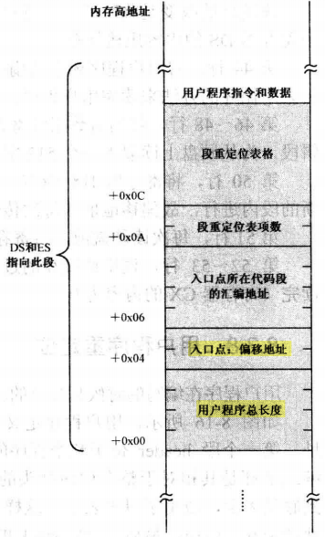
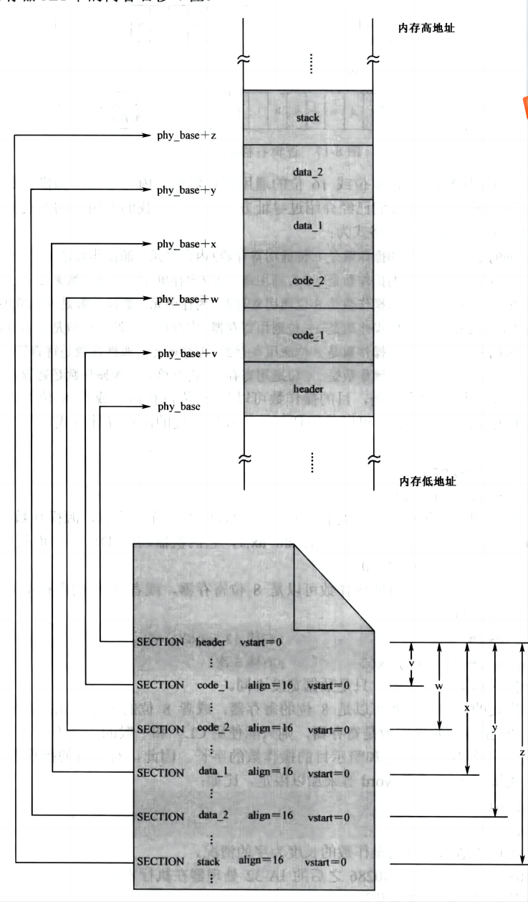
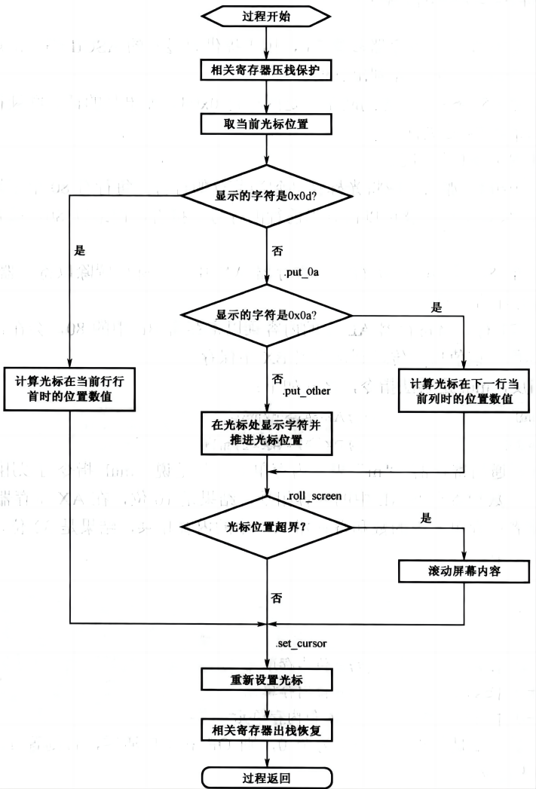
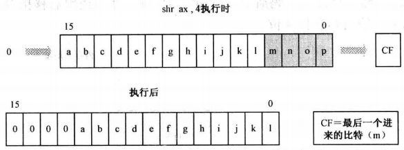

# 硬盘与显卡的访问和控制之二

## 三、加载器的工作流程

### 4.加载用户程序

上一节介绍了从磁盘读取一个扇区的方法，第一次读硬盘将得到用户程序最开始的 512 字节，这 512 字节包括最开始的用户程序头部，以及一部分实际的指令和数据。**读取了用户程序头部就可以获取到程序的整体大小，接着计算出剩余需要读取的扇区数**，调用 **`read_hard_disk_0`** 方法将剩余的硬盘扇区读取到内存中，下图是程序头部结构示意图，可以看出程序大小使用双字 dd 来保存。

<div align="center">
    
</div>

将程序大小（双字 dd）保存到 dx:ax 寄存器中，除以 512，商保存在寄存器 ax 中（剩余扇区数），余数保存在寄存器 dx 中。当 ax = 0 且未除尽时，这说明用户程序只有不到 1 个扇区的大小，之前已经读取过了，所以直接跳转到剩余代码；当 ax > 0 且未除尽时，说明用户程序的大小 = ax + 1，而之前已经读取过 1 个扇区，因此只需要读取剩余 ax 个扇区即可；当 ax > 0 且已经除尽时，则只需要读取剩余 ax - 1 个扇区即可。

用户程序被加载的位置是由 ds 和 es 所指向的逻辑段。一个逻辑段最大也才 64KB，当用户程序特别大的时候，容纳不下。要解决这个问题，**每次往内存中加载一个扇区前，都重新在前面的数据尾部构造一个新的逻辑段，并把要读取的数据加载到这个新段内**。如此一来，因为每个段的大小是 512 字节，即，十六进制的 0x200，右移 4 位后是 0x20，这就是各个段地址之间的差值。每次构造新段时，只需要在前面段地址的基础上增加 0x20 即可得到新段的段地址。

### 5.用户程序段重定位

在读取整个用户程序到内存之后，由于用户程序的起始地址基本上不为 0，并且用户程序在编写的时候是分段的。因此，**加载器下一步的工作是重新计算和确定每个段的段地址，并替换用户程序头部旧的段地址值**。

由于用户程序被加载到内存 **`phy_base`** 地址处，用户程序 header 段的汇编地址为 0，那么被加载到内存中的物理地址是 **`phy_base`**，code_1 段的汇编地址为 v，那么被加载到内存中的物理地址为 **`phy_base + v`**，依次类推，示意图如下：

<div align="center">
    
</div>

>用于加载用户程序的物理地址 phy_base 是 16 字节对齐的，而用户程序中，每个段的汇编地址也是 16 字节对齐的。**因此，每个段在内存中的起始地址也是 16 字节对齐的，将它们分别右移 4 位，就是它们各自的逻辑段地址**。

在 MBR 程序的第 84~111 行以及 **`calc_segment_base`** 过程调用代码，将用户程序入口点、代码段、数据段、栈段等的段地址加上 **`phy_base`** 的值，得到段在内存中真实的物理地址，接着除以 16 得到段的逻辑段地址，最后替换用户程序中的旧值，实现段重定位。

在 **`calc_segment_base`** 过程中，段的汇编地址的低 16 位保存在 ax 中，高 16 位保存在 dx 中，首先将 **`phy_base`** 起始地址的低 16 位与 ax 寄存器相加（有进位的话保存在 CF 标志位中），然后使用 adc 将高 16 位与 dx 寄存器相加。这时，dx:ax 中保存的就是段在内存的真实物理地址，最后右移 4 位，得到逻辑段地址。

在将 dx:ax 右移 4 位时，采取的策略是 ax 使用 shr 右移 4 位，左边空出的位数补 0，dx 使用 ror 右移 4 位，移出的 4 位依次送到左边空出的位。接着使用 and 将 dx 中的低 12 位清零，最后使用 or 命令，将 ax 和 dx 合并到 ax 中，这就是 **`calc_segment_base`** 过程的主要逻辑。

### 6.将控制权交给用户程序

在将用户程序从磁盘加载到内存，并且对程序中的段地址重定位后，加载器就会将程序的控制权交给用户程序。加载器通过一个 16 位的间接绝对远转移指令 **`jmp far [0x04]`** 跳转到用户程序入口点。入口点是两个连续的字，低字是偏移地址，位于用户程序头部内偏移为 0x04 的地方；高字是段地址（段地址被加载器重定位过），位于用户程序头部内偏移为 0x06 的地方。**这两个字分别被传送到 cs 和 ip 寄存器中**。

## 四、用户程序的工作流程

### 1.初始化段寄存器和栈段

加载器完成了用户程序的加载工作，ds 寄存器的值指向段 header，即 phy_base 地址处（也是用户程序在内存中起始物理地址），栈段寄存器 ss 指向加载器的栈空间。所以在执行用户程序之前，需要重新初始化段寄存器 ds、ss 的值。

用户程序第 180~192 行代码完成了初始化工作，ds 指向数据段 data_1，ss 指向用户程序自己的栈空间，es 依然指向 header 段。

>伪指令 resb (Reserve Byte) 的意思是从当前位置开始，保留指定数量的字节，但不初始化它们的值。在源程序编译时，编译器会保留一段内存区域，用来存放编译后的内容。当它看到这条伪指令时，它仅仅是跳过指定数量的字节，而不管里面的原始内容是什么。resw n 和 resd n 分别声明 n 个未初始化的字和双字。

### 2.调用字符串显示过程（put_string）

ds 段寄存的值被初始化为指向数据段 data_1，data_1 中的内容即需要在屏幕上显示的字符，在用户程序的第 232~248 行，**凡是需要回车换行的地方，都使用了 0x0d 和 Ox0a**。而且，在第 248 行，也就是所有要显示内容最后，**是数值 0，用来标志字符串的结束**，在高级语言里经常使用。随后 bx 寄存器被初始化为 0，然后调用 put_string 过程。

put_string 用于显示给定的字符串，它接受两个参数 ds 和 bx，分别是字符串所在的段地址和偏移地址。另外，它要求字符串的最后一个数值是 0，作为终止的标记。过程 put_string 循环从 ds:bx 中取得单个字符，判断它是否为 0。不为 0 则调用另一个过程 put_char， 为 0 则返回主程序。

### 3.屏幕光标控制（put_char）

**光标在屏幕上的位置保存在显卡内部的两个光标寄存器中，每个寄存器是 8 位的，合起来形成一个 16 位的数值**。比如，0 表示光标在屏幕上第 0 行第 0 列，80 表示它在第 1 行第 0 列，因为标准 VGA 文本模式是 25 行，每行 80 个字符。当光标在屏幕右下角时，该值为 25$\times$80 - 1 = 1999。

光标寄存器是可读可写的，可以从中读出光标的位置，也可以通过它设置光标的位置。

显卡的操作非常复杂，为了不过多占用主机的I/O空间，很多寄存器只能通过索引寄存器间接访问。**索引寄存器的端口号是 0x3d4，可以向它写入一个值，用来指定内部的某个寄存器**。比如，两个 8 位的光标寄存器，一索引值分别是 14（**`0x0e`**）和 15（**`0x0f`**），分别用于提供光标位置的高 8 位和低 8 位。**指定了寄存器之后，要对它进行读写，这可以通过数据端口 0x3d5 来进行**。

下图是 **`put_char`** 的工作流程，首先获取光标的位置，然后判断字符 cl 是换行、回车还是普通字符，这里使用了光标跟随技术，字符的不同类型，光标的操作不同。

如果是回车，则将光标的值除以 80 然后用商乘以 80，使光标位于当前行的行首；如果不是回车，但是是换行符，这将光标的值加上 80，这时如果光标的位置超过界限，那么需要进行卷屏操作，即将 2-25 行的内容移动到 1-24 行，并将光标置于最后一行的开头处；如果既不是回车也不是换行符，那么将普通字符写入到显卡中，最后将光标的位置加 1，最后判断是否需要进行卷屏操作。最后根据最新的光标位置，在屏幕上重新设置光标。

<div align="center">
    
</div>

### 4.切换到另一个代码段中执行

在一个程序中，对段的数量没有限制。可以有多个代码段和多个数据段，甚至可以有多个栈段。在用户程序工作时，可以从一个代码段转到另一个代码段中执行，也可以根据需要，访问不同的数据段。假如要想切换到另一个代码段中执行，可以使用远调用指令 (call far) 或者远转移指令 (jmp far)。

但是这里我们使用 retf 指令，用户程序代码第 198-202 行，先在栈中压入代码段 **`code_2`** 的段地址，接着压入偏移地址，该偏移地址就是标号 begin 在编译阶段的汇编地址。然后调用 retf 指令，从栈中弹出内容到指令指针寄存器 IP，接着弹出内容到代码段寄存器 CS，实现段间代码转移。

## 五、汇编指令讲解

### 1.mul 乘法指令

mul 为乘法指令，格式如下：

```armasm{.line-numbers}
mul r/m8        ;AX=AL*r/m8
mul r/m16       ;DX:AX=AX*r/m16
```

以上，r 表示通用寄存器，m 表示内存单元。就是说，mul 指令可以用 8 位的通用寄存器或者内存单元中的数和寄存器 AL 中的内容相乘，结果是 16 位，在 AX 寄存器中;也可以用 16 位的通用寄存器或者内存单元中的数和寄存器 AX 中的内容相乘，结果是 32 位，高 16 位和低 16 位分别在 DX 和 AX 中。

以下是乘法 mul 指令的几个例子：

```armasm{.line-numbers}
mul bx     
mul dx
mul byte [bx]           ;8位内存单元
mul byte [bx+di]        ;8位内存单元
mul word [0x2000]       ;16位内存单元
```

mul 指令执行后，要是结果的高一半为全 0，则 OF 和 CF 清零，否则置 1。

### 2.8086 处理器的无条件转移指令

#### 2.1.相对短转移

相对短转移的操作码为 **`0xEB`**，操作数是相对于目标位置的偏移量，仅 1 字节，是个有符号数。由于这个原因，该指令属于段内转移指令，而且只允许转移到距离当前指令 **`-128~127`** 字节的地方。相对短转移指令必须使用关键字 short。例如:

```armasm{.line-numbers}
jmp short infinite
```

在源程序编译阶段，编译器会检查标号 infinite 所代表的值，如果数值超过了一字节所能允许的数值范围，则无法通过编译。**否则，编译器用目标位置的汇编地址减去当前指令的汇编地址，再减去当前指令的长度 (2)，保留 1 字节的结果，作为机器指令的操作数**。

相对短转移指令的汇编语言操作数只能是**标号和数值**。下面是直接使用数值的情况:

```armasm{.line-numbers}
jmp short 0x2000
```

但数值和标号是等价的。在编译阶段，都被用来计算一个 8 位的偏移量。在指令执行时，处理器把指令中的操作数加上 2，再加到指令指针寄存器 IP 上，这会导致指令的执行流程转向目标地址处。

#### 2.2.16 位相对近转移

和相对短转移不同，16 位相对近转移指令的转移范围稍大一些。它的机器指令操作码为 0xE9，而且，该指令的长度为 3 字节，操作码 0xE9 后面还有一个 16 位 (2 字节) 的操作数。

因为是近转移，故其属于段内转移。"相对"的意思同样是指它的操作数是一个相对量，是相对于目标位置处的偏移量。**在源程序编译阶段，编译器用目标位置的汇编地址减去当前指令的汇编地址，再减去当前指令的长度 (3)，保留16位的结果，作为机器指令的操作数**。16 位相对近转移指令应当使用关键字 "near"，比如

```armasm{.line-numbers}
jmp near infinite
jmp near 0x3000
```

在 NASM 编译器中，如果没有指定关键字 short 或者 near，那么，如果目标位置距离当前指令 -128~127 字节，则自动采用 short；否则，采用 near。

#### 2.3.16 位间接绝对近转移

这种转移方式也是近转移，即只在段内转移。"绝对"表示给出的不是相对量，而直接是偏移量。但是，转移到的目标偏移地址不是在指令中直接给出的，而是用一个 16 位的通用寄存器或者内存地址来间接给出的。比如:

```armasm{.line-numbers}
;用 bx 和 cx 寄存器的内容替换 ip 寄存器中的值
jmp near bx
jmp near cx
jmp_dest dw 0xc000
;当这条指令执行时，处理器访问由段寄存器 DS 指向的数据段，从指令中指定的偏移地址处取
;得一个字 (在这里是 0xc000)，并用该字取代指令指针寄存器 IP 的当前内容。
jmp [jump_dest]
jmp [bx]
jmp [bx+si]
```

#### 2.4.16 位直接绝对远转移

很早以前，我们曾经见过这样的指令:

```armasm{.line-numbers}
jmp 0x0000:0x7c00
```

在这里，0x0000 和 0x7c00 分别是段地址和偏移地址，符合 "段地址:偏移地址" 的表达习惯。在编译之后，其机器指令为 **`EA 00 7C 00 00`**。注意，字的存放是按照低端字节序的。而且，在编译之后，偏移地址在前，段地址在后。**执行这条指令后，处理器用指令中给出的段地址代替段寄存器 cs 的原有内容，用给出的偏移地址代替 ip 寄存器的原有内容，从而跳转到另一个不同的代码段中**。

#### 2.5.16 位间接绝对远转移（jmp far）

远转移的目标地址可以通过访问内存来间接得到，这叫间接远转移，但是要使用关键字 far。假如在某程序的数据段内声明了标号 jump far，并在其后初始化了两个字:

```armasm{.line-numbers}
jmp_far dw 0x33c0,0xf000
jmp far [jump_far]
;也可以使用其它内存寻址方式
jmp far [bx]
jmp far [bx+si]
```

### 3.逻辑右移指令

逻辑右移指令 shr 执行时，会将操作数连续地向右移动指定的次数，每移动一次，"挤"出来的比特被移到标志寄存器的 CF 位，左边空出来的位置用比特"0"填充。

<div align="center">
    
</div>

shr 指令的目的操作数可以是 8 位或 16 位的通用寄存器或者内存单元，源操作数可以是数字 1、8 位立即数或者寄存器 cl。该指令的格式为：

```armasm{.line-numbers}
shr r/m8,1          ;目的操作数是 8 位通用寄存器/内存单元，源操作数是 1
shr r/m16,1         ;目的操作数是 16 位通用寄存器/内存单元，源操作数是 1
shr r/m8,imm8       ;目的操作数是 8 位通用寄存器/内存单元，源操作数是 8 位立即数
shr r/m16, imm8     ;目的操作数是 16 位通用寄存器/内存单元，源操作数是 8 位立即数
shr r/m8,cl         ;目的操作数是 8 位通用寄存器/内存单元，源操作数是寄存器 cl
shr r/m16,cl        ;目的操作数是 16 位通用寄存器/内存单元，源操作数是寄存器 cl
```

对于第 5 种格式的指令，如果 shr 指令的源操作数是寄存器，则只能使用 cl。和一般的指令不同，寄存器 cl 只用来提供移动次数，而不用于限定和暗示目的操作数的字长。因此，对于目的操作数是内存地址的情况，必须用关键字 byte 或者 word 等来加以限定。

### 4.调用过程

#### 4.1.16 位相对近调用

第一种是 16 位相对近调用。近调用的意思是被调用的目标过程位于当前代码段内，而非另一个不同的代码段，所以只需要得到偏移地址即可。16 位相对近调用是三字节指令，操作码为 0xE8，后跟 16 位的操作数，因为是相对调用，**故该操作数是当前 call 指令的下一条指令相对于目标过程的偏移量。计算过程如下:用目标过程的汇编地址减去当前 call 指令的汇编地址，再减去当前 call 指令以字节为单位的长度 (3)**，保留 16 位的结果。

```armasm{.line-numbers}
call near proc_1        ;near 关键字可以省略
```

在指令执行阶段，处理器看到操作码 0xE8，就知道它应当调用一个过程。于是，它用指令指针寄存器 IP 的当前内容加上指令中的操作数，再加上 3，得到一个新的偏移地址。接着，将 IP 的原有内容压入栈。最后，用刚才计算出的偏移地址取代 IP 原有的内容，使得处理器跳转到过程中执行。

#### 4.2.16 位间接绝对近调用

这种调用也是近调用，只能调用当前代码段内的过程，**指令中的操作数不是偏移量，而是被调用过程的真实偏移地址，故称为绝对地址**。不过，这个偏移地址不是直接出现在指令中，而是由 16 位的通用寄存器或者 16 位的内存单元间接给出。比如:

```armasm{.line-numbers}
call cx             ;目标地址在 cx 中。省略了关键字 "near"，下同
call [0x3000]       ;要先访问内存才能取得目标偏移地址
call [bx]           ;要先访问内存才能取得目标偏移地址
call [bx+si+0x02]   ;要先访问内存才能取得目标偏移地址
```

#### 4.3.16 位直接绝对远调用

这种调用属于段间调用，即调用另一个代码段内的过程，所以称为远调用(far call)。很容易想到，**远调用既需要被调用过程所在的段地址，也需要该过程在段内的偏移地址**。

直接的意思是，段地址和偏移地址直接在 call 指令中给出了。当然，这里的地址也是绝对地址。比如：**`call 0x2000:0x0030`**，处理器在执行时，首先将代码段寄存器 cs 的当前内容压栈，接着再把指令指针寄存器 ip 的当前内容压栈。紧接着，用指令中给出的段地址代替 cs 原有的内容，用指令中给出的偏移地址代替 ip 原有的内容。这直接导致处理器从新的位置开始执行。

#### 4.4.16 位间接绝对远调用

这也属于段间调用，被调用过程位于另一个代码段内，而且，被调用过程所在的段地址和偏移地址是间接给出的。如下所示：

```armasm{.line-numbers}
;间接绝对远调用必须要使用 far 关键字
call far [0x2000]
call far [proc_1]
call far [bx]
call far [bx+si]
```

#### 4.5.过程返回

ret 和 retf 经常用做 call [near] 和 call far 的配对指令。ret 是近返回指令，当它执行时，处理器只做 1 件事，那就是从栈中弹出一个字到指令指针寄存器 ip 中。retf 是远返回指令 (return far)，它的工作稍微复杂一点点。当它执行时，处理器分别从栈中弹出两个字到指令指针寄存器 ip 和代码段寄存器 cs 中。


