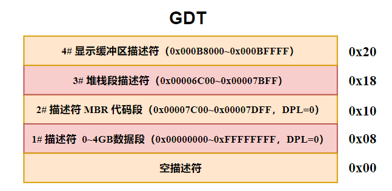

# 程序的动态加载和执行之二

## 一、MBR 程序代码

内核不能放到主引导扇区里，毕竟它都很大。所以计算机首先从主引导程序开始执行，主引导程序负责加载内核，并转交控制权。然后内核负责加载用户程序，并提供各种例程给用户程序调用。提供给用户程序调用的例程也叫应用程序接口 (Application Programming Interface,API)。

内核分为四个部分，分别是初始化代码、内核代码段、内核数据段和公共例程段，**主引导程序 MBR 也是初始化代码的组成部分**。初始化代码用于从 BIOS 那里接管处理器和计算机硬件的控制权，安装最基本的段描述符，比如创建 0~4GB 内存空间的数据段描述符，创建指向 MBR 的代码段描述符，创建显示缓冲区的描述符等。接着初始化最初的执行环境。然后从硬盘上读取和加载内核的剩余部分到内存中，创建组成内核的各个内存段的段描述符。

下面详细介绍主引导程序 MBR 的执行流程。

### 1.创建 GDT 表

当主引导程序 MBR 被加载到内存后，cs:ip 被初始化为 0x0000:0x7c00，即被加载到内存 0x7c00 处，因此执行完 13-15 行后，cs 及下面程序的 ss 段寄存器被初始化为 0x0000，而 sp 栈指针寄存器被初始化为 0x7c00。

接着计算出 GDT 表的逻辑地址，并将 GDT 表的段地址保存到 ds 数据段寄存器中，偏移地址保存到 ebx 中。然后就是创建 5 个段描述符（包含空描述符）并安装到 GDT 中。

第二个（1#）段描述符是数据段描述符，指向 0~4GB 的内存空间，此段描述符的基地址为 0x0000，段界限为 0xFFFFF，G=1 表示段界限是以 4KB 为单位，D/B=1 表示 32 位的偏移地址或操作数，S=1 表示是一个代码段或数据段，DPL=0，TYPE=0010 说明这是一个可读可写的数据段。

第三个（2#）段描述符是代码段描述符，指向 MBR 主引导程序本身，此段描述符的基地址为 0x7C00，段界限为 0x1FF，G=0 表示段界限是以字节为单位，D/B=1 表示 32 位偏移地址或操作数，S=1 表示是一个代码段或数据段，DPL=0，TYPE=1000 说明这是一个只执行代码段。

第四个（3#）段描述符是栈段描述符，此段描述符的基地址为 0x7C00，段界限为 0xFFFFE，G=1 表示段界限是以 4KB 为单位，B=1 表示栈段的上部边界（也就是 esp 寄存器的最大值）为 0xFFFFFFFF。DPL=0，TYPE=0110 表示这是一个可读、可写并且向下扩展的栈段。此栈的实际范围为：**`0x6C00~0x7BFF`**。**<font color="red">这里定义的堆栈段在 MBR 程序中就要使用，而且在进入内核之后，它又是内核的栈</font>**。

第五个（4#）段描述符是显示缓冲区描述符，此段描述符的基地址为 0xB8000，段界限为 0x7FFF，G=0 表示段界限是以字节为单位，D/B=1 表示 32 位偏移地址或操作数，S=1 表示是一个代码段或数据段，DPL=0，TYPE=0010 说明这是一个可读可写的数据段。

接着就是打开 A20 地址线，将 CR0 控制器的 PE 位设置为 1，从而进入 16 位保护模式。然后使用 JMP 指令刷新 CS 段寄存器的描述符高速缓存，**新加载的代码段描述符中 D=1，表示 32 位偏移地址和操作数，同时清空流水线中的预取指令，让程序进入 32 位保护模式执行**。

此时 GDT 表中的内容如下所示：

<div align="center">
    
</div>

### 2.加载内核程序

在创建完 GDT 中的段描述符之后，设置 ds 段寄存器指向第 1# 0~4GB 数据段描述符，ss 指向第 3# 堆栈段描述符，esp 初始化为 0。

接下来调用 read_hard_disk_0 例程将内核程序第 1 个扇区的数据从磁盘读取到物理内存 0x40000 处。这是因为在内核程序的开始处定义了内核中各个段的选择子、内核程序的总长度（core_length）、内核代码段的入口点（core_entry）、内核中各个段相的汇编地址（相对于内核程序开头）。这些数据会告诉 MBR 如何加载内核。如下所示：

```armasm{.line-numbers}
;以下常量定义部分。内核的大部分内容都应当固定
;内核代码段选择子（序号为 7） 
core_code_seg_sel     equ  0x38    
;内核数据段选择子（序号为 6）
core_data_seg_sel     equ  0x30
;系统公共例程代码段的选择子（序号为 5） 
sys_routine_seg_sel   equ  0x28
;视频显示缓冲区的段选择子（序号为 4） 
video_ram_seg_sel     equ  0x20
;内核堆栈段选择子（序号为 3）
core_stack_seg_sel    equ  0x18
;整个 0-4GB 内存的段的选择子（序号为 1）
mem_0_4_gb_seg_sel    equ  0x08

;以下是系统核心的头部，用于加载核心程序
;核心程序总长度，位于偏移地址 0x00 处 
core_length      dd core_end
;系统公用例程段位置，位于偏移地址 0x04 处
sys_routine_seg  dd section.sys_routine.start
;核心数据段位置，位于偏移地址 0x08 处
core_data_seg    dd section.core_data.start
;核心代码段位置，位于偏移地址 0x0C 处
core_code_seg    dd section.core_code.start
;核心代码段入口点，位于偏移地址 0x10 处，高地址为代码段地址，即代码段的段选择子
core_entry       dd start
                 dw core_code_seg_sel
```

>**<font color="red">伪指令 equ 仅仅是允许我们用符号代替具体的数值，但声明的数值并不占用空间。</font>**

内核文件的真正开始部分是头部，偏移量为 0x00 的地方是一个双字，可以通过标号 core_length 引用，记录了整个内核文件的大小，以字节为单位。其中 core_end 标号位于内核的 core_trail 段，此段没有 vstart=0 语句，因此 core_end 标号的汇编地址依然是从整个程序的开头开始算起，表示整个内核程序的长度。

core_entry 入口点共有 6 字节，低地址部分是一个双字，**指示入口点在内核代码段（SECTION core_code）内的偏移，将来会传送到指令指针寄存器 EIP，它来自一个标号 start**；高地址部分是一个字，指定一个内存代码段的选择子。在这里填充的是刚刚声明过的常数 core_code_seg_sel，在数值上等于 0x38。

接下来 MBR 读取 core_length 的值，并据此将内核程序完整的加载到内存中。

>**<font color="red">在 32 位模式下的循环指令需要使用 ECX 寄存器，而不是 CX</font>**。

### 3.安装内核段描述符

当 MBR 把内核程序完整加载到物理内存之后，分别为内核中的公用例程段、核心数据段、核心代码段创建段描述符，并继续安装到 GDT 中。内核程序头中的不同段的汇编地址被 MBR 程序通过相减用来计算每个段的长度，再减 1 从而得到每个段的段界限（以字节为单位），从而构造段描述符。注意这种方式也要求从 139~184 行构造的 3 个段描述符中 G 的值必须为 0（表示界限以字节为单位）。

构造段描述符通过调用 make_gdt_descriptor 例程，其中 eax 作为段的基地址，ebx 作为段界限，ecx 作为段属性，最后返回完整的段描述符（edx:eax）。

最后 MBR 通过 32 位简介绝对远转移跳转到内核代码的入口点开始执行。此时 GDT 中的段描述符布局如下：

<div align="center">
    
</div>

本章主引导程序在内存中的布局如下所示：

<div align="center">
    
</div>

## 二、内核程序代码

### 1.显示提示信息

MBR 程序会跳转到内核代码中 start 标号处开始执行。首先会设置 ds 数据段寄存器指向内核数据段选择子，然后调用内核 put_string 例程来在屏幕上显示字符串（message_1、message_5）。这里使用的是 **`call 内核公共例程段选择子:偏移值`**，属于 32 位直接绝对远调用。相对应的，put_string 例程就应该使用 retf 指令返回。

>**ret 和 retf 经常用做 call 和 call far 的配对指令**。ret 是近返回指令，当它执行时，处理器只做 1 件事，那就是从栈中弹出一个字到指令指针寄存器 ip 中。retf 是远返回指令 (return far)。**<font color="red">当 retf 指令执行时，处理器分别从栈中弹出两个字到指令指针寄存器 ip 和代码段寄存器 cs 中</font>**。

在显示完提示信息之后，开始调用 load_relocate_program 例程来加载和重定位用户程序。这里使用的是 32 位直接绝对近调用，即 **`call 偏移值`**。近调用的意思是被调用的目标过程位于当前代码段内，而非另一个不同的代码段，所以只需要得到偏移地址将其保存到 EIP 寄存器中，**CS 中的代码段选择子保持不变即可**。

### 2.用户程序的结构

用户程序必须符合规定的格式，才能被内核识别和加载。通常情况下，流行的操作系统会规定自己的可执行文件格式，比如 Windows 的 PE 格式和 Linux 的 ELF 格式。所有操作系统的可执行文件都包括文件头，这里也不例外，下面是要加载的用户程序的文件头。

```armasm{.line-numbers}
SECTION header vstart=0

    ;程序总长度 #0x00
    program_length   dd program_end
    ;程序头部的长度 #0x04，保存用户程序头部段选择子
    head_len         dd header_end
    ;用于接收堆栈段选择子 #0x08，保存堆栈段选择子
    stack_seg        dd 0
    ;用户程序建议的堆栈大小（以 4KB 位单位）#0x0c
    stack_len        dd 1

    ;程序入口地址 #0x10           
    prgentry         dd start                
    ;代码段位置 #0x14
    ;当内核完成用户程序的加载和重定位后，会把该代码段的段选择子回填到这里（仅占用最低 16 位）
    code_seg         dd section.code.start   
    ;代码段长度 #0x18
    code_len         dd code_end             
    ;数据段位置 #0x1c，保存数据段描述子
    data_seg         dd section.data.start   
    ;数据段长度 #0x20
    data_len         dd data_end             
    ;符号地址检索表 #0x24
    salt_items       dd (header_end-salt)/256 

    ;#0x28
    ;用户程序在偏移地址 0x28 处构造一个表格，填写用户程序需要用到的符号名
    ;内核在加载用户程序时，会将符号名称替换为对应例程 4 字节的偏移地址和 2 字节的段选择子，这就是过程的重定位
    salt:
    PrintString       db  '@PrintString'
                      times 256-($-PrintString) db 0
    TerminateProgram  db  '@TerminateProgram'
                      times 256-($-TerminateProgram) db 0
    ReadDiskData      db  '@ReadDiskData'
                      times 256-($-ReadDiskData) db 0

    header_end:
```

在文件头内的偏移 0 处，是一个双字，指示了用户程序的大小，以字节为单位。偏移量为 0x04 处的双字是用户程序头部段（SECTION header）的长度，以字节为单位。偏移量为 0x08 处的双字是为栈保留的，**<font color="red">和早先的做法不同，此内核不要求用户程序自己提供栈空间，而改由内核动态分配，以减轻用户程序编写的负担</font>**。当内核分配了栈空间后，会把栈段的选择子填写到这里，用户程序开始执行时，可以从这里取得该选择子以初始化自己的栈。偏移量为 0x0C 处的双字是要求分配的栈大小，即用户程序编写者建议的栈大小，以 4KB 为单位。

偏移量为 0x10 处的双字，是**用户程序入口点的 32 位偏移地址**。偏移量为 0x14 处的双字，是用户程序代码段的起始汇编地址。当内核完成对用户程序的加载和重定位后，将把该段的选择子回填到这里 (仅占用低字 code_seg 部分)。**这样一来它和 0x10 处的双字一起，共同组成一个 6 字节的入口点**，内核从这里转移控制到用户程序。偏移量为 0x18 处的双字，是用户程序代码段的长度，以字节为单位。

偏移量为 0x1C 处的双字，是用户程序数据段的起始汇编地址，当内核完成用户程序的加载和重定位后，将把该段的选择子回填到这里 (仅占用低字 data_seg 部分)。偏移量为 0x20 处的双字，是用户程序数据段的长度，以字节为单位。

操作系统提供的编程接口就是 API。问题在于，它们在操作系统内部，用户程序不知道 OS 提供例程的具体入口地址。但是另一方面，即使知道它们的地址，调用的时候也有风险，因为操作系统也需要升级换代，这些 API 的入口地址可能改变。

因此在本章程序中，内核要求用户程序必须在头部偏移量为 0x28 的地方构造一个表格，并在表格中列出所有要用到的符号名。每个符号名的长度是 256 字节，不足部分用 0 填充。**<font color="blue">在用户程序加载后，内核会分析这个表格，并将每一个符号名替换成相应的 4 字节偏移地址和 2 字节的段选择子</font>**，这就是过程的重定位。为了方便起见我们把该表格叫做"符号—地址检索表"（Symbol-Address Lookup Table,SALT）。在第 31 行表示符号地址检索表的项数，或者说符号名的数量。

### 3.简单的动态内存分配

**`load_relocate_program`** 从 ESI 中获取到用户程序在磁盘中的起始逻辑扇区号，并返回 AX 作为指向用户程序头部的选择子，从而方便内核通过用户程序头部的 prgentry 跳转到用户程序开始执行。

接下来计算用户程序的大小从而动态分配内存，分配的内存大小必须为 512 字节（一个扇区）的倍数，首先从用户程序开始的逻辑扇区号读取一个扇区的数据到 ds:ebx 指向的区域，即内核数据段中的 core_buf 缓冲区中。

用户程序的大小 (总字节数) 不一定恰好是 512 的整数倍，也就是说最后一个扇区未必是满的。因此如果直接除以 512，可能会使结果 (除法的商) 比实际的扇区数少一。通常情况下，需要判断除法的余数，根据余数是否为零，来决定实际的扇区总数。

由于所有能被 512 整除的数，其最低端的 9 个比特都是 0，因此先用 and 指令将其最低的 9 个比特清零，等于是去掉那些不足 512 的零头，然后再将其加上 512，等于是将那些零头凑整。但是若用户程序长度原本就是 512 的整数倍，这么做无疑是多加了一个扇区。因此，先测试 EAX 寄存器的最低 9 个比特，如果测试的结果是它们不全为零，则采用凑整的结果；如果为全零，则依然采用用户程序原本的长度值。最后将计算出来的用户程序长度值（512 字节的倍数）写入到 ECX 寄存器中。

在上述计算过程中，需要用到条件传送指令，它是条件转移指令和传送指令的结合，和 mov 指令不同的是，**<font color="red">它的目的操作数只允许是 16 位或者 32 位通用寄存器，源操作数只能是相同宽度的通用寄存器和内存单元</font>**，以下是一些例子：

```armasm{.line-numbers}
cmovz ax, cx            ;为零则传送
cmovnz eax, [0x2000]    ;不为零则传送
cmove ebx, ecx          ;相等则传送
```

cmovcc 指令不影响 EFLAGS 寄存器中的任何标志位。相反地，它的执行过程要依赖于这些标志，就像条件转移指令一样。

接下来使用 call（32 位绝对直接远调用）调用内核的 allocate_memory 例程来为程序分配内存，并将分配好的内存起始线性地址写入到 ECX 中并返回。allocate_memory 例程比较简单，从内核数据段的 ram_alloc 标号处获取用于分配的内存地址，并写入到 ECX 寄存器中返回 **`load_relocate_program`**。同时，allocate_memory 也会计算出下一次用于内存分配的起始地址，并且会将此地址进行 4 字节对齐，然后写入 ram_alloc 标号处用于下一次分配。

在从 **`allocate_memory`** 返回 **`load_relocate_program`** 程序之后，便将用户程序全部加载到 ECX 中保存的内存起始地址处。

### 4.段的重定位和描述符创建

