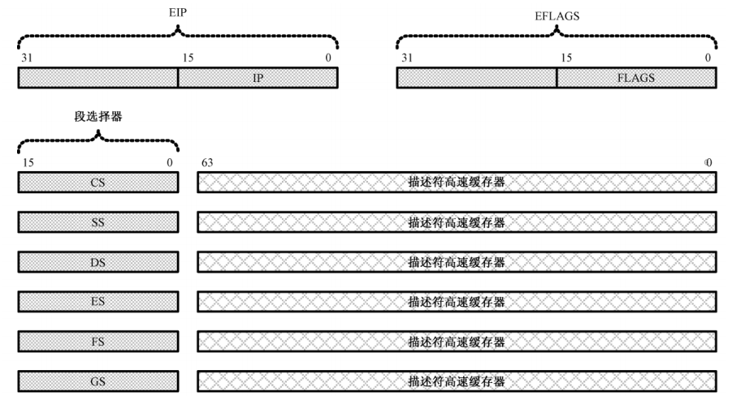

# 32 位 x86 处理器编程架构

## 一、IA-32 架构的基本执行环境

所谓处理器架构是指一整套的硬件结构，以及与之相适应的工作状态，决定了处理器的应用环境和工作模式，也决定了软件开发人员如何在这种模式下解决实际问题。**<font color="red">Intel 32 位处理器架构简称 IA-32 (Intel Architecture，32-bit)</font>**，是以 1978 年的 8086 处理器为基础发展起来的。8086 有 20 根地址线，可以寻址 1MB 内存。但是，它内部的寄存器是 16 位的，无法在程序中访问整个 1MB 内存。所以，它也是第一款支持内存分段模型的处理器，8086 处理器只有一种工作模式，即实模式。

32 位的处理器有 32 根地址线，数据线的数量是 32 根或者 64 根。因此，它可以访问 $2^{32}$，即 4GB 的内存，而且每次可以读写连续的 4 字节或者 8 字节，这称为双字 (Double Word) 或者 4 字 (Quad Word) 访问。

### 1.寄存器的扩展

在 16 位处理器内，有 8 个通用寄存器 AX、BX、CX、DX、SI、DI、BP 和 SP，其中，前 4 个还可以拆分成两个独立的 8 位寄存器来用，即 AH、AL、BH、BL、CH、CL、DH 和 DL。如下图所示，32 位处理器在 16 位处理器的基础上，扩展了这 8 个通用寄存器的长度，使之达到 32 位。

<div align="center">
    
</div>

为了在汇编语言程序中使用经过扩展 (Extend) 的寄存器，需要给它们命名，它们的名字分别是 EAX、EBX、ECX、EDX、ESI、EDI、ESP 和 EBP。**可以在程序中使用这些寄存器，即使是在实模式下**:

```armasm{.line-numbers}
mov eax, 0xf0000005
mov ecx, eax
add edx, ecx
```

但是，就像以上指令所示的那样，**<font color="red">指令的源操作数和目的操作数必须具有相同的长度</font>**，个别特殊用途的指令除外。因此，像这样的搭配是不允许的，在程序编译时，编译器会报告错误:

```armasm{.line-numbers}
mov eax, cx    ;错误的汇编语言指令
```

如果目的操作数是 32 位寄存器，源操作数是立即数，那么立即数被视为 32 位的：

```armasm{.line-numbers}
mov eax, 0xf5    ;EAX <- 0x0000_00f5
```

**32 位通用寄存器的高 16 位是不可独立使用的**，但低 16 位保持同 16 位处理器的兼容性。因此，在任何时候它们都可以照往常一样使用:

```armasm{.line-numbers}
mov ah, 0x02
mov al, 0x03
add ax, si
```

**可以在 32 位处理器上运行 16 位处理器上的软件**。但是，它并不是 16 位处理器的简单增强。事实上，32 位处理器有自己的 32 位工作模式，一般来说 32 位模式特指 32 位保护模式。在这种模式下，可以完全、充分地发挥处理器的性能，即处理器可以使用它全部的 32 根地址线，能够访问 4GB 内存。

如下图所示，在 32 位模式下，为了生成 32 位物理地址，处理器需要使用 32 位的指令指针寄存器 EIP。但是当它工作在 16 位模式下时，依然使用 16 位的 IP。和往常一样，即使是在 32 位模式下，EIP 寄存器也只由处理器内部使用，程序中是无法直接访问的。对 IP 和 EIP 的修改通常是用某些指令隐式进行的，这些指令包括 JMP、CALL、RET 和 IRET 等等。

<div align="center">
    
</div>

另外，在 16 位处理器中，标志寄存器 FLAGS 是 16 位的，在 32 位处理器中，扩展到了 32 位，低 16 位和原先保持一致。在 32 位模式下，对内存的访问从理论上来说不再需要分段，因为它有 32 根地址线，可以自由访问任何一个内存位置。**但是，IA-32 架构的处理器是基于分段模型的**，因此，32 位处理器依然需要以段为单位访问内存，即使它工作在 32 位模式下。

不过，它也提供了一种变通的方案，**即只分一个段，段的基地址是 0x00000000，段的长度 (大小) 是 4GB。在这种情况下，可以视为不分段，即平坦模型 (Flat Mode)**。

每个程序都有属于自己的内存空间。在 16 位模式下，一个程序可以自由地访问（甚至是修改）不属于它的内存位置。这当然是不安全的，但却没有任何机制来限制这种行为。**<font color="red">在 32 位模式下，处理器要求在加载程序时，先定义并安装该程序所拥有的段，然后允许使用这些段</font>**。定义段时，除了基地址(起始地址)外，还附加了段界限、特权级别、类型等属性。当程序访问一个段时，处理器将用固件实施各种检查工作，以防止对内存的违规访问。

如上图所示，在 32 位模式下，传统的段寄存器，如 CS、SS、DS、ES，**保存的不再是 16 位段基地址，而是段的选择子**。因此，它的新名字叫做段选择器。除了段选择器之外，每个段寄存器还包括一个不可见部分，称为描述符高速缓存器，里面有段的基地址和各种访问属性。这部分内容程序不可访问，由处理器自动使用。

>32 位处理器增加了两个额外的段寄存器 FS 和 GS。

### 2.基本工作模式

8086 具有 16 位的段寄存器、指令指针寄存器和通用寄存器 (CS、SS、DS、ES、IP、AX、BX、CX、DX、SI、DI、BP、SP)，因此，我们称它为 16 位的处理器。尽管它有 20 位地址线可以访问 1MB 的内存，**<font color="red">但是只能分段进行</font>**，**这是因为只能使用 16 位寄存器，导致段内偏移量只有 16 位，故段的长度最大只能是 64KB**。

和 8086/80286 不同，80386 处理器的寄存器是 32 位的，而且拥有 32 根地址线，可以访问 $2^{32}$，即 4GB 的内存。80386 以及所有后续的 32 位处理器，都兼容实模式，可以运行实模式下的 8086 程序。而且，**在刚加电时，这些 32 位处理器都自动处于实模式下**。只有在进行一番设置之后，才能进入保护模式。

在保护模式下，所有的 32 位处理器都可以访问多达 4GB 的内存，它们可以工作在分段模型下，每个段的基地址是 32 位的，段内偏移量也是 32 位的，因此，段的长度不受限制。**在最典型的情况下，可以将整个 4GB 内存定义成一个段来处理，这就是所谓的平坦模式**。在平坦模式下，可以执行 4GB 范围内的控制转移，也可以使用 32 位的偏移量访问任何 4GB 范围内的任何位置。32 位保护模式兼容 80286 的 16 位保护模式。

>32 位模式特指 IA-32 处理器上的 32 位保护模式，不存在所谓的 32 位实模式，实模式是 8086 处理器的概念。

### 3.线性地址

为 IA-32 处理器编程，访问内存时，需要在程序中给出段地址和偏移量。传统上，**段地址和偏移地址称为逻辑地址，偏移地址叫做有效地址 (Effective Address,EA)**，在指令中给出有效地址的方式叫做寻址方式 (Addressing Mode)。比如下面寻址方式为基址加变址：

```armasm{.line-numbers}
inc word [bx+si+0x06]
```

段部件将段地址和偏移地址相加，得到访问内存的地址。一般来说，段部件产生的地址就是物理地址（开启分页前）。IA-32 处理器支持分页功能，分页功能将物理内存空间划分成逻辑上的页。页的大小是固定的，一般为 4KB，通过使用页，可以简化内存管理。

**当页功能开启时，段部件产生的地址就不再是物理地址了，而是线性地址 (Linear Address)**，线性地址还要经页部件转换后，才是物理地址。

线性地址的概念用来描述任务的地址空间。IA-32 处理器上的每个任务都拥有 4GB 的虚拟内存空间，这是一段长 4GB 的平坦空间，就像一段平直的线段，因此叫线性地址空间。相应地，由段部件产生的地址，就对应着线性地址空间上的每一个点，这就是线性地址。

## 二、32 位模式的指令系统

### 1.32 位处理器的寻址方式

在 16 位处理器上，指令中的操作数可以是 8 位或者 16 位的寄存器、指向 8 位或者 16 位实际操作数的 16 位内存地址，以及 8 位或 16 位的立即数。**<font color="red">如果指令中包含了内存地址操作数，那么，它必然是一个 16 位的段内偏移地址，称为有效地址</font>**。通过有效地址，可以间接取得 8 位或者 16 位的实际操作数。指定有效地址可以使用基址寄存器 BX、BP，变址 (索引) 寄存器 SI 和 DI，同时还可以加上一个 8 位或 16 位的偏移量。比如:

```armasm{.line-numbers}
mov ax, [bx]
mov ax, [bx+di]
mov al, [bx+si+0x02]
```

以上，第 1 条指令，寄存器 BX 中的内容是指向 16 位实际操作数的 16 位地址；第 2 条指令，寄存器 BX 和 DI 的内容相加，形成指向 16 位实际操作数的 16 位地址；第 3 条指令，**寄存器 BX、SI 和 8 位偏移量共同形成指向 8 位实际操作数的 16 位地址**。

以下是 16 位处理器的内存寻址方式示意图。从图中可以看出，允许使用基址寄存器 BX 或者 BP，同变址寄存器 SI 或者 DI 结合，再加上 8 位或者 16 位偏移量来寻址内存操作数。

<div align="center">
    
</div>

在 32 位处理器中，让 16 位指令和 32 位指令共用相同的指令码，但是通过不同的指令前缀，结合处理器当前的运行状态来决定该指令的寻址方式。比如，**当处理器运行在 16 位模式时（处理器运行在 16 位还是 32 位模式下由段描述符的 D 位来决定）**，如果没有指令前缀 0x66，则认为指令是传统的 16 位寻址方式；若有指令前缀 0x66，则指令是新的 32 位寻址方式。如果处理器当前运行在 32 位模式下且没有指令前缀 0x66，则视为默认的 32 位寻址方式，否则就是传统的 16 位寻址方式。

在 32 位模式下，默认使用 32 位宽度的寄存器。如:

```armasm{.line-numbers}
mov eax, ebx
```

如果指令中使用了立即数，那么，该数值默认是 32 位的:

```armasm{.line-numbers}
mov ecx, 0x55
```

如果指令中的操作数是指向内存单元的地址，那么，该地址默认是 32 位的段内偏移地址，或者叫段内偏移量：

```armasm{.line-numbers}
;mem 是一个 32 位的段内偏移地址
mov edx, [mem]
```

如果指令中包含了内存地址操作数，**那么，它必然默认地是一个 32 位的有效地址**。通过有效地址，可以间接取得 32 位的实际操作数。如下图所示，指定有效地址可以使用全部的 32 位通用寄存器作为基址寄存器。同时，还可以再加上一个除 ESP 之外的 32 位通用寄存器作为变址寄存器。变址寄存器还允许乘以 1、2、4 或者 8 作为比例因子。最后，还允许加上一个 8 位或者 32 位的偏移量。

<div align="center">
    
</div>

>值得说明的是，**在 16 位模式下，内存寻址方式的操作数不允许使用栈指针寄存器 SP。但是，在 32 位模式下，允许在内存操作数中使用栈指针寄存器 ESP**。

### 2.操作数大小的指令前缀

每一条处理器指令都可以拥有前缀，比如重复前缀（REP/REPE/REPNE）、段超越前缀（如 ES:）、总线封锁前缀（LOCK）等。前缀是可选的，**每个前缀的长度是 1 字节，每条指令可以有 1~4 个前缀，或者不使用前缀**。IA-32 处理器指令的格式如下：

<div align="center">
    
</div>

前缀 (如果有的话) 的后面是操作码部分，**指示执行什么样的操作，比如传送、加法、减法、乘法、除法、移位等**。根据指令的不同，操作码的长度是 1~3 字节。同时，操作码还可以用来指示操作的字长，即数据宽度为字节还是字。操作码之后是**操作数类型和寻址方式部分**。这部分是可选的，其长度范围为 0~2 字节。这部分给出了指令的寻址方式，以及寄存器的类型 (用的是哪个寄存器)。**指令的最后是立即数和偏移量**。如果指令中使用了立即数，那么立即数就在这一部分给出；如果指令使用了带偏移量的寻址方式，如:

```armasm{.line-numbers}
mov cx, [0x2000]
mov ecx, [eax+ebx*8+0x02]
```

那么偏移量 0x2000 和 0x02 在这一部分给出。上面指令格式起源于 16 位处理器时代，在 32 位处理器主要扩展了数据宽度，其它保持不变。下面介绍 16 位与 32 位指令的兼容性。考虑以下指令：

```armasm{.line-numbers}
mov dx,[bx+si+0x02]
```

首先介绍 16 位处理器的情况，对于 **`MOV r16,r/m16`** 格式的指令，操作码为 0x8B。在操作码 0x8B 之后是 1 字节的寻址方式和操作数类型部分 **`ModR/M`**，其具体格式如下所示。

```armasm{.line-numbers}
                      7   6   5   4   3   2   1   0
                    +---+---+---+---+---+---+---+---+
                    |  mod  |    reg    |     r/m   |
                    +---+---+---+---+---+---+---+---+
```

对于 mod 字段，The "mod" field specifies the addressing mode for the register/memory ("r/m") operand. If the "mod" field is ${11}_2$, the "r/m" field encodes a register in the same manner as the "reg" field. However, if the "mod" field is anything else (${00}_2$, ${01}_2$, or ${10}_2$), the "r/m" field specifies an addressing mode. 

因此当 mod 为 11 时，使用寄存器寻址，而当 mod 为 00、01、10 时，使用直接寻址、基址寻址、变址寻址或者基址变址寻址中的一种，具体使用哪一种由 r/m 字段的值决定。另外 mod=00 时，不使用偏移量；mod=01 时使用 8 位偏移量；mod=11 时使用 16 位偏移量。In 16-bit mode, the eight possible values of the "r/m" field specify a base register as follows：

```armasm{.line-numbers}
000: [BX + SI + disp]
001: [BX + DI + disp]
010: [BP + SI + disp]
011: [BP + DI + disp]
100: [SI + disp]
101: [DI + disp]
110: [BP + disp]
111: [BX + disp]
```

As a special exception, the combination mod=${00}_2$, r/m=${110}_2$, which would normally specify [BP + disp0], instead specifies a 16-bit address [disp16] with no register base at all. To address [BP+0], one must use a 1-byte displacement ("disp8") form with a displacement of 0. 偏移码在 **`ModR/M`** 后面一字节。This results in the full set of combinations:

<div align="center">
    
</div>

因此上述 **`mov dx,[bx+si+0x02]`** 指令中位 7~6 的值为 01 表示 8 位偏移量，位 5~3 的值为 010，指示目的操作数为寄存器是 dx，位 2~0 的值是 000，指示寻址方式为 [bx+si+disp]，因此该 **`ModR/M`** 表明指令是 **`dx, [bx+si+disp8]`**，在该 **`ModR/M`** 指令之后，是 1 字节的偏移量 0x02。因此，这条指令编译后最终的机器代码为：**`8B 50 02`**。

32 位处理器使用相同的编码格式，但是，寻址方式和寄存器的定义却完全不同于 16 位指令。如图所示为 32 位处理器中 **`ModR/M`** 各字段的组合：

<div align="center">
    
</div>

在 32 位处理器上，位 7~6 的值是 01，表示使用了 8 位偏移量；位 5~3 的值是 010，指示目的操作数为寄存器 EDX；位 2~0 的值是 000，表示寻址方式为 EAX+8 位偏移量。在该字节之后，是 1 字节的偏移量 0x02。因此，同样的机器指令码 ，却对应着不同的 32 位指令:**`mov edx,[eax+0x02]`**。**<font color="red">也就是说相同的机器指令 **`8B 50 02`**，在 16 位模式下和 32 位模式下的解释和执行效果是不同的</font>**。而 32 位处理器可以执行 16 位的程序，包括实模式和 16 位保护模式。**为此，在 16 位模式下，处理器把所有指令都看成是 16 位的**，因此在进入保护模式之后，必须清空流水线，不然预取的按照 32 位模式编译的机器指令代码如果按照 16 位模式进行解释就会造成执行错误。

当处理器在 16 位模式下运行时，也可以使用 32 位的寄存器，执行 32 位的运算。**但前提是必须使用指令前缀 0x66 来临时改变 16 位模式的默认状态**，因为同一个指令码，在 16 位模式下和 32 位模式下具有不同的解释。在 16 位模式下，**`inc ax`** 的机器码为 **`0x40`**，而机器码指令 **`66 40`** 在 16 位模式下对应则是 **`inc eax`**。

相反地，如果处理器运行在 32 位模式下，那么，处理器认为指令的操作数都是 32 位的，如果你加了前缀 0x66，这个前缀就用来指示指令是 16 位的。因此，**指令前缀 0x66 具有反转当前默认操作数大小的作用**。

>为了指明程序的默认运行环境，编译器提供了伪指令 bits，用于指明其后的指令应该被编译成 16 位的，还是 32 位的。注意，bits 16 或者 bits 32 可以放在方括号中，也可以没有方括号。**最后，16 位模式是默认的编译模式。如果没有指定指令的编译模式，则默认是 bits 16 的**。