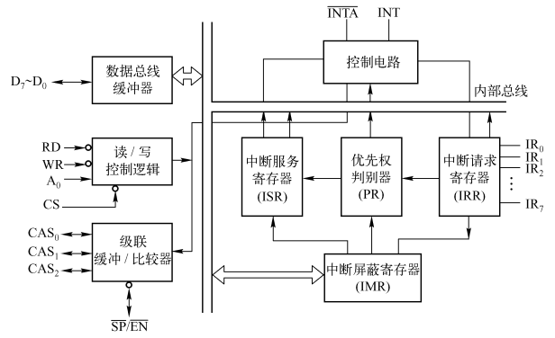
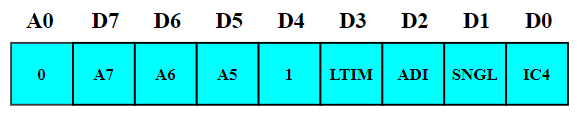
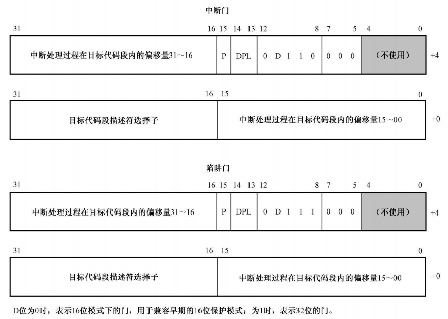
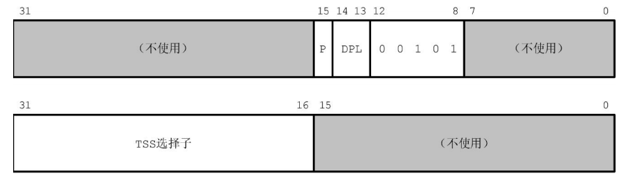
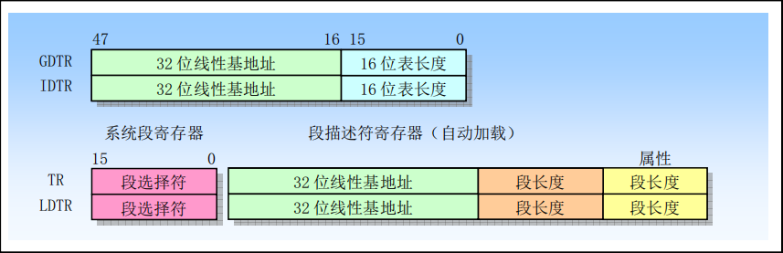

# 中断和异常

## 一、中断技术

### 1.中断概念介绍

中断是 CPU 执行程序时，由于某种事件发生（外部或内部），**引起 CPU 暂时中断正在运行的程序，转去执行一段特殊的服务程序（中断服务程序或中断处理程序）**，以处理该事件，该事件处理完后又返回被中断的程序继续执行，这一过程称为中断。如下图所示：

<div align="center">
    
</div>

引起 CPU 中断的事件，发出中断请求的来源就被称为中断源。中断源大致有以下 4 类：**I/O 设备**，键盘，打印机，A/D 转换器，完成自身操作后，向 CPU 发中断申请；**实时时钟**，定时检测与控制，**采用外部时钟电路，编程控制定时间隔，发中断申请**；**故障源**，计算机内设有故障自动检测装置，如发生溢出、存储器读写出错、电源掉电等意外事件，这些装置能使 CPU 中断，进行相应处理；**为调式程序设置的中断源**，断点设置，单步调试等。

能实现中断所需要的软件和硬件统称为中断系统，中断系统的功能包括能响应中断、处理中断和返回；能实现优先权排队；**高级中断源能中断低级的处理（中断嵌套）**。

### 2.中断用途

中断的用途如下所示：

1. 同步操作：**避免了 CPU 不断检测外设状态的过程，提高了 CPU 的利用率**，解决快速 CPU 与慢速外设速度不匹配问题；
2. 实时处理：实现对特殊事件的实时响应。如实时控制中，现场参数在任何时间发出中断请求，CPU 马上响应；
3. 故障处理：电源突跳、运算溢出，不必停机；

中断源向 CPU 发中断请求信号的条件：设置中断请求触发器（IRR）、设置中断屏蔽触发器（IMR）。CPU 响应中断源的条件：**CPU 开中断（即 IF 标志寄存器为 1）、CPU 在现行指令结束后响应中断**。

### 3.中断处理过程

当满足条件，CPU 响应中断申请，中断处理过程如下，其中 1~4 为自动完成，而 5~8 为中断服务程序完成：

1. 标志寄存器 FLAGS/EFLAGS 保存到堆栈中
2. 关中断 IF=0（禁止接受其它可屏蔽中断请求，避免破坏断点），TF=0，NT=0
3. 保护**断点**（IP、CS 自动压栈，以备中断处理完后返回断点）
4. 识别中断源，转入相应中断服务程序入口
5. 保护**现场**，将中断服务程序中要使用到的通用寄存器压栈
6. 执行中断服务程序
7. 恢复**现场**，将通用寄存器出栈
8. iret 返回，恢复**断点**（断点 IP、CS出栈，标志寄存器的值出栈）

以上 1-3 是由硬件完成，而不是软件完成。

>注意，由于 IF 标志被清除，在中断处理过程中，处理器将不再响应硬件中断。如果希望更高优先级的中断嵌套，可以在编写中断处理程序时，适时用 sti 指令开放中断。iret 指令导致处理器依次从栈中弹出(恢复) IP、CS 和 FLAGS/EFLAGS 的原始内容，于是转到主程序接着执行。由于标志寄存器 **FLAGS/EFLAGS** 的内容恢复，所以 IF 标志位也自动恢复，可以接受新的中断。

### 4.中断源分类

8086/8088 配接 8259A 中断控制器，可处理 256 个不同中断，**根据产生的方法不同分为两大类：硬件中断（外部中断）和软件中断（内部中断），硬件中断又可分为可屏蔽中断和非可屏蔽中断**。其中硬件中断由 CPU 外部提出的中断请求，与当前执行的指令无关，可以实时响应外部设备请求，及时处理外部事件。软件中断（内部中断）由 CPU 执行指令引起的程序中断，中断信号来自于 CPU 内部。微处理器中断结构图如下所示：

<div align="center">
    
</div>

8086/8088 中断的总体分类如下所示：

<div align="center">
    
</div>

可屏蔽中断是由用户定义的外部硬件中断，由 INTR 引脚引入（高电平有效），类型号 5-255，**CPU 是否响应可屏蔽中断，取决于 IF 标志寄存器的状态**。当 IF=1 时(开中断)，响应中断，当 IF=0 时(关中断)，禁止中断。STI 命令使 IF=1，开中断，CLI 使 IF=0，关中断。8086/8088 配合 8259A 可管理多个可屏蔽中断。

**非可屏蔽中断由 NMI 引脚引入（上升沿触发），非可屏蔽中断的类型号为 2**，并且不受 IF 标志寄存器的影响，8086/8088 整个系统只有一个非屏蔽中断，一旦出现，CPU 将予以响应，用于紧急故障处理（例:系统掉电处理），优先级高于可屏蔽中断。

>当有任何一个非可屏蔽的中断产生时，与非门的输出为高。Intel 处理器规定，NMI 中断信号由 0 跳变到 1 后，至少要维持 4 个以上的时钟周期才算是有效的，才能被识别。

软件中断的适用场景如下：

**1) 处理 CPU 某些错误的中断**

**除法出错的中断类型为 0**，当执行除法指令，发现除数为零或商超出寄存器所表示范围，产生类型为 0 的内部中断(自动进入)，优先级最高的内部中断。**溢出（INTO）的中断类型为 4**，INTO 指令通常跟在算术运算指令之后，进行溢出处理，产生类型 4 的内部中断。

**2) 为调试程序设置的中断**

**单步中断的类型为 1**，当 TF=1 (跟踪标志位)，每执行一条指令，CPU 产生类型 1 内部中断。**断点中断的类型为 3**，设置断点中断指令 INT 3，执行该指令会产生一个中断类型 3 的内部中断，用于软件调式，关键地方设置断点。

**中断指令 INT n 为用户自定义的软件中断**，类型号由程序员编程给定，指出中断入口地址。

可以为所有的中断类型自定义中断处理过程，包括内部中断、硬件中断和软中断。特别是考虑到处理器允许 256 种中断类型，而且大部分都没有被硬件和处理器内部中断占用。最有名的软中断是 BIOS 中断，之所以称为 BIOS 中断，**是因为这些中断功能是在计算机加电之后，BIOS 程序执行期间建立起来的**。即这些中断功能在加载和执行主引导扇区之前，就已经可以使用了。通常，为了区分针对同一硬件的不同功能，使用寄存器 ah 来指定具体的功能编号。举例来说，下面代码用于从键盘读取一个键盘。

```armasm{.line-numbers}
mov ah,0x00     ;从键盘读字符
int 0x16        ;键盘服务，返回时，字符代码在寄存器 al 中
```

在这里，当寄存器 ah 的内容是 0x00 时，执行 int 0x16 后，中断服务例程会监视键盘动作。当它返回时，会在寄存器 al 中存放按键的 ascii 码。

BIOS 会为一些简单的外围设备提供初始化代码和功能调用代码，并填写中断向量表，但也有一些 BIOS 中断是由外部设备接口自己建立的。首先，每个外部设备接口，包括各种板卡，如网卡、显卡、键盘接口电路、硬件控制器等，都有自己的只读存储器 (Read Only Memory, ROM)，这些 ROM 中提供了它自己的功能调用例程，以及本设备的初始化代码。按照规范，前两个单元的内容是 0x55 和 0xAA，第三个单元是本 ROM 中以 512 字节为单位的代码长度;从第四个单元开始，就是实际的 ROM 代码。

在计算机启动期间，BIOS 程序会以 2KB 为单位搜索内存地址 C0000~E0000 之间的区域。当它发现某个区域的头两个字节是 0x55 和 0xAA 时，那意味着该区域有 ROM 代码存在。接着，它对该区域做累加和检查，看结果是否和第三个单元相符。如果相符，就从第四个单元进入。这时，**处理器执行的是硬件自带的程序指令，这些指令初始化外部设备的相关寄存器和工作状态，<font color="red">_最后，填写相关的中断向量表，使它们指向自带的中断处理过程_</font>**。

上述不同中断的优先级为：软件中断（除法错误中断、INT n、溢出中断 INTO）、非屏蔽中断（NMI）、可屏蔽中断（INTR）、单步中断。

### 5.中断和异常分类

上面对中断源进行了分类，可以分为内部硬件中断、软中断，同时硬件中断可以分为可屏蔽中断和不可屏蔽中断。但是还可以分为中断和异常。

#### 5.1 中断（Interrupt）

**<font color="red">中断包括硬件中断和软中断</font>**。其中硬件中断（可屏蔽/不可屏蔽中断）是由外围硬件设备发出的中断信号引发的，以请求处理器提供服务。当 I/O 接口发出中断请求时，会被像 8259A 和 I/O APIC 这样的中断控制器收集，并发送到处理器。硬件中断完全是随机产生的，与处理器的执行并不同步。当中断发生时，处理器要先执行完当前的指令，然后才对中断进行处理。

软中断是由 int n 指令引发的中断处理，n 是中断号或者叫类型码。

#### 5.2 异常（Exception）

异常就是前面所说的 CPU 内部中断。它们是处理器内部产生的中断，**表示在指令执行的过程中遇到了错误的状况**。当处理器执行一条非法指令，或者因条件不具备，指令不能正常执行时，将引发这种类型的中断。

**<font color="red">以上所列的情况都是异常情况，所以内部中断又叫异常或者异常中断</font>**。比如，在执行除法指令 div/idiv 时，遇到了被 0 除的情况 (除数是 0)；再比如，使用 jmp 指令发起任务切换时，指令的操作数不是一个有效的 TSS 描述符选择子。

异常分为三种：

- 第一种是程序错误异常，指处理器在执行指令的过程中，检测到了程序中的错误，并由此而引发的异常；
- 第二种是软件引发的异常。这类异常通常由 into、int3 和 bound 指令主动发起。**这些指令允许在指令流的当前点上检查实施异常处理的条件是否满足**。举个例子来说，into 指令在执行时，将检查 EFLAGS 寄存器的 OF 标志位，如果满足为 1 的条件，则引发异常；

>into 指令是用于检查溢出标志（OF）并检测溢出的指令。当 OF 标志被设置为 1（表示有溢出发生），执行 into 指令会引发中断（触发中断 4，INT 4），引发一个溢出异常处理程序；否则，into 的效果就是简单的让程序继续执行。
>**int3 触发中断 3，通常用于设置断点**，当 CPU 执行到这条指令时会产生异常并调用相应的异常处理程序进行进一步的处理。调试器可以在 int3 指令处停止程序，并允许开发者检查程序的状态。**通常在调试器中使用。调试器会将 int3（字节码为 0xCC）插入到程序代码中，用作断点指令**。程序执行到该指令时会暂停，等待调试器的操作。

- 第三种是机器检查异常。这种异常是处理器型号相关的，也就是说，每种处理器都不太一样。无论如何，处理器提供了一种对硬件芯片内部和总线处理进行检查的机制，当检测到有错误时，将引发此类异常。

根据异常情况的性质和严重程度，异常又可以分为以下 3 类，并分别实施不同的处理：

- 故障 (Faults)。故障通常是可以纠正的，比如当处理器执行一个访问内存的指令时，发现那个段或者页不在内存中 (P=0)，此时可以在异常处理程序中予以纠正 (分配内存，或者执行磁盘的换入换出操作)，返回时程序可以重新启动并不失连续性。为了做到这一点，**<font color="red">当故障发生时，处理器把机器状态恢复到引起故障的那条指令之前的状态，在进入异常处理程序时，压入栈中的返回地址 (CS 和 EIP 的内容) 是指向引起故障的那条指令的，而不像通常那样指向下一条指令</font>**。如此一来，当中断返回时，将重新执行引起故障的那条指令，而且不再出错 (如果引起异常的情况已经妥善处置)。这表明异常并不总是意味着坏消息，相反很多时候它是有益的。如果没有异常，虚拟内存管理将无从谈起。
- 陷阱(Traps)。陷阱中断通常在执行了截获陷阱条件的指令之后立即产生，如果陷阱条件成立的话。陷阱通常用于调试目的，比如单步中断指令 int3 和溢出检测指令 into。陷阱中断允许程序或者任务在从中断处理过程返回之后继续进行而不失连续性。**因此，当此异常发生时，在转入异常处理程序之前，处理器在栈中压入陷阱截获指令的下一条指令的地址**。
- 终止(Aborts)。终止标志着最严重的错误，诸如硬件错误、系统表 (GDT、LDT 等) 中的数据不一致或者无效。这类异常总是无法精确地报告引起错误的指令的位置，在这种错误发生时，程序或者任务都不可能重新启动。一个比较典型的终止类异常是"双重故障" (中断号为 8)，**<font color="red">当发生一次异常后，处理器在转入该中断的处理程序时，又发生另外的异常 (如该中断处理程序所在的段不在内存中，或者栈溢出)</font>**。对于中断处理程序来说，很难从栈中获得有关如何纠正此类错误的明确信息，往往是发生极为重大的错误时才伴岗着这种异常，所以再继续执行引起此异常的程序或任务已相当困难，操作系统通常只能托该任务从系统中抹去。

所谓的双重故障（Double Fault）最重要的特点是在处理器转入或者说【准备开始执行】该中断的处理程序时，又发生了故障（缺页、或者段不在 GDT，LDT 中）。Strictly speaking, all double faults are faults which are caused while processing another fault. They may happen while processing an interrupt because there's an unmapped address referenced during the invocation of the interrupt handler itself【在调用中断处理器的过程中发生异常】. They may also occur if the processing of any other type of fault causes a fault while the processor itself is beginning processing of that fault.

对于某些异常，处理器在转入异常处理程序之前，会在当前栈中压入一个称为错误代码的数值，帮助程序进一步诊断异常产生的位置和原因。

#### 5.3 总结

下表列出了 Intel 处理器在保护模式下的中断和异常，从图中可以看出，在 0~31 号向量中，只有 2 号向量 NMI 是中断，其余的全部是异常，而 32~255 全部为中断（外部硬件中断和 int n 指令）。

<div align="center">
    <div align="center" style="color: #F14; font-size:13px; font-weight:bold">保护模式下的中断和异常向量分配</div>
    
</div>

当中断和异常发生时，NMI 和异常的向量是由处理器自动给出的；硬件中断（即不可屏蔽中断 INTR）的向量是由 I/O 中断控制器芯片送给处理器的；软中断的向量是由指令中的操作数给出的。

bound (Check Array Index Against Bounds) 指令用于检查数组的索引是否在边界之内，其格式为：

```armasm{.line-numbers}
bound r16, m16
bound r32, m32
```

其具有两个操作数，目的操作数是寄存器，包含了数组的索引；源操作数必须指向内存位置，在那里包含了两个成对出现的字或者双字，分别是数组索引的下限和上限。如果执行 bound 指令时，数组的索引小于下标的下限，或者大于下标的上限，则产生异常。

### 6.中断向量表

**中断向量（中断矢量）为中断程序的入口地址，即中断服务程序第 1 条指令的 CS 和 IP 值**，每个中断都对应一个中断向量。8086/8088 把 256 个中断程序入口地址建立一张表，称为中断向量表。中断向量表固定存放在 0x0000 段，偏移地址 0x0000-0x03FF 区域，每个中断向量需 4 个存储单元，共占用 256*4=1KB 空间，前两个字节存放中断程序入口地址 IP 值，后两个字节存放 CS 值，中断向量按中断类型号有规则排列。

向量地址:**每个中断程序的入口地址存放的地址或中断向量存放的地址**，向量地址=中断类型号*4。中断向量表示意图如下所示：

<div align="center">
    
</div>

>中断随时可能发生，中断向量表的建立和初始化工作是由 BIOS 在计算机启动时负责完成的。BIOS 为每个中断号填写入口地址，因为它不知道多数中断处理程序的位置，所以，一律将它们指向一个相同的入口地址，在那里，只有一条指令 iret。

### 7.CPU 响应可屏蔽中断的过程

当满足：CPU 执行完当前指令;没有内部中断和非屏蔽中断;CPU 内部 IF=1;有 INTR 申请则 CPU 响应中断，完成下列工作:

CPU 响应 INTR 请求，进入中断响应周期，获取中断类型号，CPU 响应的周期时序如下所示：

<div align="center">
    
</div>

CPU 对 INTR 中断请求的响应过程是执行两个 $\overline{INTA}$（中断响应）总线周期。每个响应周期都由 4 个T状态组成，而且都发出有效的中断响应信号 $\overline{INTA}$。在第一个中断响应总线周期内 $\overline{INTA}$ 信号通知 8259A，中断请求已被接受；**在第二个总线周期内 $\overline{INTA}$ 信号有效时，8259A 必须把请求服务的那个外设的中断类型码传输至 CPU 的数据总线**。CPU 读入中断类型码后，由此调用相应的中断服务程序。

然后执行一个写总线周期，PSW（标志寄存器）入栈，IF=0，TF=0；接着关中断，禁止单步中断执行两个写总线周期，CS，IP 入栈，保存断点；然后执行两个读总线周期，查中断向量表，读前 2 个字节送入 IP 寄存器，读后 2 个字节送入 CS 寄存器（得到中断服务入口地址）。然后转向中断服务程序执行，执行完成后返回 IRET，断点 IP，CS 弹出，PSW 出栈。完整流程图如下所示：

<div align="center">
    
</div>

## 二、8259A 可编程中断控制器

### 1.8259A 的功能

8259A 可编程中断控制器的内部结构如下所示：

<div align="center">
    
</div>

1 片 8259A 可管理 8 级中断，并对其进行优先级管理，面向 CPU 的专用接口，是辅助 CPU 进行中断管理的。使用 9 片 8259A 组成的主从式中断系统可管理 64 级中断，并对其进行优先级管理，并且可以对任何一级中断源都可单独进行屏蔽，使该级中断请求暂时被挂起，直到取消屏蔽。能自动送出中断类型码，使 CPU 迅速找到中断处理子程序的入口地址。

<div align="center">
    
</div>

上图每片 8259A 只有 8 个中断输入引脚，而在个人计算机上使用它，需要两块。如上图所示，第一块 8259A 芯片的代理输出 INT 直接送到处理器的 INTR 引脚，这是主片 (Master)；第二块 8259A 芯片的 INT 输出送到第一块的引脚 2 上，是从片 (Slave)，两块芯片之间形成级联 (Cascade) 关系。8259A 的主片引脚 0 (IR0) 接的是系统定时器/计数器芯片；从片的引脚 0 (IR0) 接的是实时时钟芯片 RTC。

>8259A 芯片是可编程的，**主片的端口号是 0x20 和 0x21，从片的端口号是 0xa0 和 0xa1**，可以通过这些端口访问 8259 芯片，设置它的工作方式，包括 IMR 的内容。优先权判别器（PR）不是寄存器，而是一个电路。

### 2.8259A 结构

8259A 芯片中包含 7 个寄存器，**第一组 4 个寄存器：初始化命令字 ICW1-ICW4**。8259A 工作之前设定，旦设定，工作过程中不变。**第二组 3 个寄存器：操作命令字 OCW1-OCW3**。8259A 工作之后设定，对中断进行管理，可被多次设置。OCW1 也称中断屏蔽寄存器 (IMR)。

**1）数据总线缓冲器**

它是 8259A 与系统数据总线的接口。CPU 对 8259A 的控制字是通过它写入的，8259A 的状态信息是通过它读入 CPU 的，**在中断响应周期，8259A 也是通过它送出中断类型号的**。

**2）读/写逻辑**

是根据 CPU 送来的读/写信号和地址信息，通过数据总线缓冲器有条不紊地完成 CPU 对 8259A 的所有读操作和写操作。它还包含 4 个初始化命令寄存器和 3 个操作命令寄存器，用于存放 4 个初始化命令字 ICW1~ICW4、和3个操作命令字 OCW1~OCW3。

**3）级连缓冲器/比较器**

这个功能部件在级连方式的主从结构中，用来存放和比较系统中各 8259A 的从设备标志（ID）。与此相关的是 3 条连线 CAS0~CAS2 和从片编程/允许缓冲器 $\scriptsize{\overline{SP}/\overline{EN}}$ 线。当 8259A 不工作在缓冲模式下时，$\scriptsize{\overline{SP}/\overline{EN}}$ 引脚是一个输入引脚，在多片级联的情况下，$\scriptsize{\overline{SP}/\overline{EN}}$ 引脚输入高电平，则表明该片是主片，否则是从片。

**4）中断请求寄存器（IRR）**

8259A 有 8 条外界中断请求线 IR0~IR7，每一条请求线有 1 个相应的触发器来保存中断请求信号，**哪一根 IR 线上有请求，哪一位触发器就置 1**，8 个触发器组合成 IRR。

**5）正在中断服务寄存器（ISR）**

该寄存器用来存放当前正在进行服务的中断。当 CPU 正为某个中断源服务时，8259A 则使 ISR 中的相应位置 1，当 ISR 为全 0 时，表示 CPU 正执行主程序，无任何中断服务。**同时把新进入中断请求与当前正在处理的中断进行比较，从而决定哪一个优先级更高**，经中断裁决器向 CPU 发中断请求 INTR。

**6）中断屏蔽寄存器（IMR）**

用来存放 CPU 送来的屏蔽信号，**_当它的某一位或某几位为 1 时，则对应的中断请求就被屏蔽_**，即对该中断源的有效请求置之不理。

>中断能否被处理，除了要看 8259 芯片的脸色外，最终的决定权在处理器手中。标志寄存器有一个标志位 IF，这就是中断标志 (Interrupt Flag)。**当 IF 为 0 时，所有从处理器 INTR 引脚来的中断信号（可屏蔽外部中断请求）都被忽略掉**；当其为 1 时，处理器可以接受和响应中断。IF 标志位可以通过两条指令 cli 和 sti 来改变。这两条指令都没有操作数，cli (Clear Interrupt Flag) 用于清除 IF 标志位，sti (Set Interrupt Flag) 用于置位 IF 标志。另外需要注意的是，IF 标志位只对 INTR 引脚来的外部可屏蔽中断起作用，对于 NMI、INT n 软中断以及 CPU 内部中断不起作用。

**7）优先权电路**

该电路用来管理和识别各个中断源的优先级别。它根据保存在 IRR 中的各个中断请求位和 IMR 中的中断屏蔽位分析出未屏蔽优先级最高的中断源。同时判别是否可以进入多重中断，即根据 ISR 寄存器判别新产生的中断源的优先级别是否高于正在处理的中断级别。

**8）控制逻辑**

按照编程设置的工作方式管理 8259A 的全部工作。在 IRR 中有未被屏蔽的中断请求时，控制逻辑输出高电平的 INT 信号，向 CPU 申请中断。**在中断响应期间，它允许 ISR 的相应位置位，并发出相应的中断类型码**，通过数据总线缓冲器输出到系统总线上。在中断服务结束时，它按照编程规定的方式对 ISR 进行处理。

**9）8259A 结构举例**

假设现在 8259A 中断控制器中 ISR、IRR、IMR 寄存器的内容如下所示，在 IRR 中 IR2、IR3、IR5 有请求，但是 IMR 中第 2 位为 1，因此 IR2 中断源被屏蔽。

<div align="center">
    
</div>

由于 ISR 寄存器中 IR6 和 IR4 均为 1，**表示这两个中断源对应的中断服务程序正在执行（中断嵌套），并且还没有执行完**，如下图所示。如果允许中断嵌套的话，只有比这两个中断源优先级更高的中断源才可以打断当前中断服务程序的执行，此中断请求才会通过 $\scriptsize{INT}$ 引脚被发送给 CPU。而 IR3 的中断优先级高于 IR4 和 IR6，因此 IR3 中断请求会被发送给 CPU。

<div align="center">
    
</div>

IR3 被送到 CPU 之后，CPU 通过 $\scriptsize{\overline{INTA}}$ 中断应答引脚会响应 2 个负脉冲，当第 1 个负脉冲到达 8259A 控制器时，8259A 会将 IRR 中 IR3 置 0，同时将 ISR 中 IR3 置 1，表示 CPU 正在执行 IR3 对应的中断服务程序。8259A 中 ISR、IRR 以及 IMR 寄存器的内容如下所示：

<div align="center">
    
</div>

当中断服务程序执行完毕之后，通常会使用一般 EOI 命令将 ISR 寄存器中优先级最高的 IR 位置 0。比如当 IR3 结束时，会将优先级最高的 IR3 置 0，而 IR4 执行结束时，会将 IR4 置 0。

### 3.中断响应过程

在 8086/88 系统中 8259A 中断响应过程如下：

1. 当有一条或若干条中断请求线（IR0~IR7）变高时，则使中断请求寄存器 IRR 的相应位置 1；
2. 8259A 接收这些请求，分析它们的优先级，在未屏蔽时向 CPU 发出中断请求信号 INTR；
3. 若 CPU 处于开中断状态 (IF=1)，则在当前指令执行完后，发出 $\scriptsize{\overline{INTA}}$ 中断响应信号；
4. 8259A 接收到第一个 $\scriptsize{\overline{INTA}}$ 信号，把允许中断的最高优先级的相应 ISR 位置 1，并清除 IRR 中的相应位；
5. CPU 启动第二个 $\scriptsize{\overline{INTA}}$ 脉冲，8259A 发出中断类型号。如果是自动结束中断 AEOI 方式，$\scriptsize{\overline{INTA}}$ 脉冲后沿复位 ISR 的相应位；在其他方式中，ISR 相应位要由中断服务程序结束时发出的 EOI 命令（中断结束命令）来复位；

8259A 发送的两个 $\scriptsize{\overline{INTA}}$ 负脉冲如下所示：

<div align="center">
    
</div>

### 4.嵌套方式

8259A 的嵌套方式有一般全嵌套方式和特殊全嵌套方式之分。8259A 在输人 ICW1 命令后初始化为一般全嵌套方式，但可用 ICW4 命令设置为特殊全嵌套方式。

- 一般全嵌套方式：在这种方式下，当中断系统正在处理某一级中断时，8259A 只响应高级的中断请求，同级的或低级的中断请求不响应。**一般全嵌套方式适用于单片 8259A 或级连时的从 8259A**。
- 特殊全嵌套方式：在特殊全嵌套方式下，当处理某一级中断时，如果有同级或更高优先级的中断请求，8259A 会给予响应。**特殊全嵌套方式适用于 8259A 级连应用时的主片**。

>特殊全嵌套仅用于多个 8259A 级连时的主片，而不能用于从片或单 8259A 系统。

<div align="center">
    
</div>

如上图所示，两片 8259A 进行级联，一共管理 15 个中断源，中断源的优先级顺序为 $\scriptsize{主IR_0>主IR_1>从IR0>从IR1>...>从IR7>主IR3>...>主IR7}$，假设从片 $\scriptsize{IR_3}$ 上发生中断请求，那么如果主片 8259A 工作在一般全嵌套方式下，那么主片中 $\scriptsize{IR_2—IR_7}$ 区间的中断源被锁死。**同样，从片中（从片肯定工作在一般全嵌套方式下）比 $\scriptsize{从IR_3}$ 更高级别的 $\scriptsize{IR_0—IR_2}$ 中断也无法得到响应**。

所以，应该将主片配置成工作在特殊全嵌套方式下，此时主片中 $\scriptsize{IR_3—IR_7}$ 区间的中断源被锁死，同时因主片不封锁从片的 INT，故从片中级别更高的 $\scriptsize{IR_0—IR_2}$ 可以得到响应，但是 $\scriptsize{IR_3—IR_7}$ 仍然被本从片封锁。

总结来说，在 8259A 级连使用时，主片要求工作在特殊全嵌套方式，而从片则工作在一般全嵌套方式。这样，当来自某一从片的中断请求正在处理时，一方面和一般全嵌套方式一样，**对来自主片的优先级较高的其他引脚上的中断请求进行开放**；另一方面，**对来自同一从片的较高优先级的请求也会开放**。对后者，在主片引脚上反映出来是与当前正在处理的中断请求处于同一级的，但从从片内部看，中断请求一定比正在处理的优先级别高。

特殊全嵌套方式不适于 8259A 单片使用，因为在中断请求频繁时，**可能会造成不必要的同级中断的多重嵌套**，从而引起混乱。另外，在级连时若主片不使用特殊全嵌套而使用一般全嵌套方式，那么，由于此时主片把从片看做一级，**尽管从片内部可以判断输入该片的各中断请求的优先级**，但由于从片的中断请求输出 INT 信号是接在主片的一个中断请求输入信号 IRi 上的，故主片不会对来自从片的由更高优先级的中断源引起的中断请求做出反应。

>级联时，只能有一片 8259A 为主片，其余的均为从属片。

8259A 级联时涉及到的引脚包括：$\scriptsize{CAS_0}$—$\scriptsize{CAS_2}$，$\scriptsize{\overline{SP}/\overline{EN}}$，$\scriptsize{IR_i}$，$\scriptsize{INT}$。

<div align="center">
    
</div>

如上图所示，8259A 芯片根据 $\scriptsize{\overline{SP}/\overline{EN}}$ 引脚是高电平还是低电平来判断自己为主片还是从片，高电平为主片，低电平为从片。**主片通过 ICW3 初始化字来确定引脚连的是从片还是中断源**，上图中 ICW3 的第 3 位和第 6 位为 1，表明主片中 $\scriptsize{IR_3}$ 和 $\scriptsize{IR_6}$ 引脚连接的为从片，其余引脚连接的是中断源。同样，从片也通过 ICW3 来判断自己连接到主片哪个引脚，其中从片 1 的 ICW3 中的值为 3，表示连接到主片 $\scriptsize{IR_3}$ 引脚，而从片 2 的 ICW3 中的值为 6，表示连接到主片 $\scriptsize{IR_6}$ 引脚。 

当从片 1 中 $\scriptsize{IR_2}$ 和从片 2 中 $\scriptsize{IR_1}$ 接收到中断请求时，由于主片中 $\scriptsize{IR_3}$ 大于 $\scriptsize{IR_6}$ 优先级（默认采用固定优先级），所以 CPU 会响应 $\scriptsize{IR_3}$。接着主片通过 $\scriptsize{\overline{INTA}}$ 应答接收到第一个负脉冲时，通过 $\scriptsize{CAS_0}$—$\scriptsize{CAS_2}$ 将级联地址（$\scriptsize{IR_3}$ 或者 $\scriptsize{IR_6}$ 对应的 3 或 6）3 发送给从片 1 和 2，从片收到后，会检测级联地址是否与本片的 ICW3 初始化字中的值相符，如果相符（如从片 1），那么在收到第二个负脉冲时，从片 1 将中断源 8 位中断向量码通过  $\scriptsize{D_0}$—$\scriptsize{D_7}$ 发送给 CPU。

### 5.优先级循环方式

8259A 有固定优先级和循环优先级。8259A 在输入ICW1 后初始化为固定优先级，但在工作期间可用 OCW2 设置成循环优先级。

**固定优先级**：8259A 在用 ICW1 写入后内部初始化为优先级固定方式，IR0 优先权最高，IR7 优先权最低，$\scriptsize{IR_1>IR_2>...>IR_7}$。

**自动循环优先级**：所谓优先级自动循环是指中断源轮流处于最高优先级，即自动中断优先级循环。一个设备得到中断服务后，它的优先级自动降为最低。例如，初始化优先级队列为 $\scriptsize{IR_0>IR_1>IR_2>...>IR_7}$，如下图所示。

<div align="center">
    
</div>

这时如果 IR4 有请求，响应 IR4 后优先级队列为：$\scriptsize{IR_5>IR_6>IR_7>...>IR_4}$，具体如下所示。在某些场合，系统内部存在着优先权相同的中断设备，**为了使得各个优先权相同的外设得到 CPU 服务的机会均等**，可以采用优先权自动循环方式。

<div align="center">
    
</div>

**指定循环优先级**：优先级排列顺序可通过 OCW2 编程改变，加电后优先级为 8259A 的默认方式，默认优先级顺序从高到低为 $\scriptsize{IR_0>IR_1>IR_2>...>IR_7}$，如下图左边所示，当通过 OCW2 指定 $\scriptsize{IR_3}$ 优先级最低时，8259A 的优先级如下图右边所示。在通过编程改变了优先级顺序之后，$\scriptsize{IR_4>IR_5>IR_6>...>IR_3}$ 又变成了一个固定优先级顺序。

<div align="center">
    
</div>

### 6.中断屏蔽方式

普通屏蔽方式：8259A 内部有一屏蔽寄存器，它的每一位对应个中断请求输入，可通过对 OCW1 (即中断屏蔽寄存器 IMR) 编程进行设置。当某一位为 1 时，对应的某一级中断就受到屏蔽。通过重新设置 OCW1 操作命令字，可随时撤消这些屏敝。

特殊屏蔽方式：**可实现能开放比本级中断源级别低的中断响应**，具体操作为用 OCW1 将屏蔽寄存器中本级中断源对应位置 1，即屏蔽本级中断，为开放较低级中断提供条件。**使当前中断服务寄存器对应位 ISRi=0，真正开放级别较低的中断**。

### 7.中断结束方式

当 8259A 响应某一级中断而为其服务时，中断服务寄存器 ISR 的相应位置 1，当有更高级的中断请求进入时，ISR 的相应位又要置 1，因而 ISR 寄存器中可有多位同时置 l，在中断服务结束时，ISR 中相应位应清 0，以便再次接收同级别的中断。**中断结束的管理就是用不同的方式使 ISR 的相应位清 0，并且确定下面的优先排队**。下面只介绍采用完全嵌套方式时，中断结束的管理方式。

采用完全嵌套方式是指中断嵌套过程中，中断服务寄存器 ISR 的内容在不断变化。例如，8259A 正在为 IR7 的中断请求服务时，ISR 中的 D7 位置 1。此时，有高级中断 IR6 请求服务，若允许为其服务，ISR 中的 D6 位又置 1。假如又有更高级的中断，且为其服务，ISR 中将有对应位置 1。**总之，在完全嵌套方式下，最多可达 8 级中断嵌套，在中断服务结束时，也应按从高到低的次序结束**。每个中断结束，使 ISR 中相应位清 0，待全部嵌套中断均结束后，则 ISR 中每位均为 0。8259A 在完全嵌套情况下，可采用 3 种中断方式。

**1)一般 EOI 方式**

当任何一级中断服务程序结束时，给 8259A 传输一个 EOI 命令，8259A 将 ISR 寄存器中级别最高的置 1 位清 0。这种方式只有在当前结束的中断总是尚未处理完的级别最高的中断时，才能使用这种结束方式。如果在中断服务中修改过中断级别，则不能采用这种方式。

**2)特殊 EOI 方式**

在一般 EOI 方式的基础上，当中断服务程序结束给 8259A 发出 EOI 命令的同时，将当前结束的中断级别也传输给 8259A，这就称为特殊 EOI 方式。在这种情况下，8259A 将 ISR 寄存器中指定级别的相应置 1 位清 0。这种方式适合于任何情况。

特殊 EOI 方式适用于这种情况，只要不是同级的中断源，其它的任何一个中断源都可以打断当前的中断服务程序，因此需要使用特殊 EOI 方式给出已经执行结束的中断服务程序是哪一个。此时屏蔽方式属于特殊屏蔽方式，无优先级的概念，有优先级概念的屏蔽方式属于一般屏蔽方式。

**3)自动 EOI 方式**

8259A 接收到第一个 $\scriptsize{\overline{INTA}}$ 信号，把允许中断的最高优先级的相应 ISR 位置 1，并清除 IRR 中的相应位；接收到第二个 $\scriptsize{\overline{INTA}}$ 信号时，把中断向量号发送给 CPU，**同时 8259A 自动将 ISR 寄存器相应位置 1 位清 0**。**中断服务程序执行结束时，不需要向 8259A 送 EOI 命令**。

这是一种最简单的结束方式，但是存在一个明显的缺点：任何一级中断在执行中断服务程序期间，在 8259A 中没有留下任何标志，如果在此过程中出现新的中断请求，**则只要 CPU 允许中断，不管出现的中断级别如何，都将打断正在执行的中断服务而被优先执行**。这显然是不合理的。

> 因此，自动 EOI 方式只能用在一些以预定速率发生中断，且不会发生同级中断互相打断或低级中断打断高级中断的情况下（简而言之就是不允许中断嵌套的情况）。其实在这种情况下，ISR 寄存器中的值始终为 0，ISR 寄存器本身也没有存在的必要了。

### 8.8259A 工作方式

<div align="center">
    
</div>

8259A 工作的模式很多，上图为 8259A 的一般工作流程。

首先，判断中断嵌套是否允许主要看在中断服务程序中有没有加开中断指令 STI，如果没有使用 STI 指令则不允许中断嵌套，此时应该把 8259A 处理器设置工作在自动 EOI 方式下，接收到第二个 $\scriptsize{\overline{INTA}}$ 信号时，8259A 自动将 ISR 寄存器相应位置 1 位清 0，中断服务程序执行结束时，不需要向 8259A 送 EOI 命令。

如果中断允许嵌套，接下来判断中断嵌套是否需要优先级，由于中断源是不可重入的，即中断源不可被同级中断源所打断。**如果除了同级中断源，其他任何级别中断源都可以打断当前的中断服务程序，此时 8259A 工作在特殊屏蔽方式下（即不需要优先级）**，当中断服务程序结束时，需要告知 8259A 应该将 ISR 寄存器中的哪一位清零。

否则，8259A 工作在一般屏蔽方式下，此时中断服务程序需要有开中断指令（STI），并且在结尾使用一般 EOI 命令，随后 8259A 将 ISR 寄存器中级别最高的置 1 位清 0。

对于优先级，如果为固定优先级，即 $\scriptsize{IR_0>IR_1>...>IR_7}$。当然，优先级也可以设置为自动循环优先级和指定循环优先级。

8259A 管理的中断源数目超过 8，那么需要多片 8259A 进行级联。在级联方式下，只能有一个主片，并且主片需设置成工作在特殊全嵌套方式，从片需设置成工作在一般嵌套方式。

## 三、8259A 编程

8259A 的编程包括两类：初始化编程和操作编程。初始化编程是在 8259A 正式工作前进行的，它需要使用到 8259A 的初始化命令字 ICW1~ICW4。**在微机中是在上电初始化时由 BIOS 完成的**。操作编程是在 8259A 工作时根据实际需要动态进行的，它需要使用 8259A 的操作命令字 OCW1~OCW4。

### 1.初始化编程

8259A 有 4 个初始化命令字 ICW1~ICW4，另外，**ICW1 和 ICW2 是必须输入的，ICW3 和 ICW4 是否要输入则由 ICW1 的相应位决定**。其初始化流程如下图所示。8259A 在级连时（即 SNGL=0）需分别对主片和从片的 ICW1、ICW2 和 ICW3 进行初始化编程，至于 ICW4 则取决于 ICW1 的 IC4 位，当 IC4=1 时，需要输入 ICW4。**对 8086/88 系统而言，ICW4 总是要写入的**。

<div align="center">
    
</div>

8259A 内部寄存器的访问方法如下所示，ICW1 和 OCW2、OCW3 是用偶地址端口 0x20 (主片) 或 0xA0 (从片) 写入。ICW2~ICW4 和 OCW1 是用**奇地址端口 0x21(主片) 或 0xA1(从片)**写入。如果要读 OCW1/IMR，则只需要从 **0x20 (主片) 或 0xA0 (从片)** 读取；如果要读取 IRR 和 ISR 寄存器，那么从 0x21(主片) 或 0xA1(从片) 读取，具体读取 ISR 还是 IRR 取决于 OCW3 中的 RR 和 RIS 位。

<div align="center">
    
</div>

OCW 的写入与顺序无关，并且 ICW1 和 OCW2、OCW3 的写入端口是一致的，**8259A 通过各控制字中的第 $\scriptsize{D_4D_3}$ 标识位**，通过这两位的组合来唯一确定某个控制字以及辨识它们。对于 OCW1，OCW 是在初始化之后才有效的，所以在初始化之后写入奇地址端口的数据便被认为写入到 OCW1。

总结如下:

- 无论 8259A 是否级联，ICW1 和 ICW2 是必须要有的，并且要顺序写入；
- 只有当 ICW1 中的 SNGL 位为 0 时，这表示级联，级联就需要设置主片和从片，这才需要在主片和从片中各写入 ICW3。
- 只能当 ICW1 中的 IC4 为 1 时，才需要写入 ICW4。不过，x86 系统 IC4 必须为 1。
- ICW 初始化完成后，向 8259A 的奇地址端口写入数据就是写入 OCW1 寄存器；
- 写入偶地址端口的数据通过 $\scriptsize{D_4D_3}$ 标识区分写入的是 OCW2 还是 OCW3 寄存器；
- 根据之前写入 OCW3 的 RR 和 RIS 位标识，读取偶地址端口的数据就是读取 IRR 或 ISR 寄存器；
- 读取奇地址端口的数据就是读取 OCW1/IMR 寄存器；

#### 1.1 ICW1 芯片控制初始化命令字

ICW1 的格式如下所示：

<div align="center">
    
</div>

ICW1 的特征是 $\scriptsize{A_0=0}$ (偶地址)，并且 $\scriptsize{D_4=1}$。无论何时，当 CPU 向 8259A 写命令字，只要地址线 $\scriptsize{A_0=0}$，**数据线的 $\scriptsize{D_4=1}$ 时**，就被 8259A 译码为 ICW1。

写入 ICW1 后，8259A 内部有一初始化过程：清除 IMR 和 ISR；指定 IR0 优先权最高 IR7 最低；清除特殊屏蔽方式；使边沿触发器复位，即中断请求采用电平触发方式；自动 EOI 复位；顺序逻辑置位，准备按 ICW2、ICW3 和 ICW，接收初始化命令。

ICW1 中各位的作用如下所示：

- $\scriptsize{A_7—A_5}$：在 8086 系统中不起作用；
- $\scriptsize{D_4=1}$：$\scriptsize{D_4=1}$ 和 $\scriptsize{A_0=0}$ 是 ICW1 的标志；
- LTIM：中断输入信号 IR 的输入触发方式。LTIM=0 为边沿触发，IR 输入信号由低到高的跳变被识别且送入 IRR；LTIM=1 为电平触发方式，IR 输入为高电平即进入 IRR，不进行边沿检测。在两种触发方式下，**IR 输入的高电平在置位 IRR 相应位后仍要保持，直到中断被响应为止。在再次响应前应撤销，以防出现第二次中断**；
- ADI：8086/88 系统中不用；
- SNGL：单片/级连方式指示。SNGL=0 为级连方式，这时在 ICW1、ICW2 之后要跟 ICW3，以设置级连方式的工作状态。SNGL=1 表示系统中只有一片 8259A，初始化过程中不需要 ICW3。
- IC4：指示初始化过程中有无 ICW4。$\scriptsize{IC_4=0}$ 表示不需要写 ICW4；$\scriptsize{IC_4=1}$ 表示要写 ICW4。8086/88 系统中 $\scriptsize{IC_4}$ 必须置 1，即需要写 ICW4。

#### 1.2 ICW2 中断类型码初始化命令字

8259A 提供给 CPU 的中断类型码是一个 8 位代码，其高 5 位通过 ICW2 的高 5 位 $\scriptsize{T_7——T_3}$ 设置，低 3 位由中断请求线 IR0~IR7 的二进制编码 (如 IR4 编码为100B) 决定。ICW2 的格式如下:

<div align="center">
    
</div>

向 ICW2 写入数据即向 8259A 的奇地址（$\scriptsize{A_0=1}$）写入。

#### 1.3 ICW3 主/从片级联方式命令字

当 ICW1 的 SNGL 位为 0 时 8259A 工作于级连方式，主 8259A 和从 8259A 都需用 ICW3 初始化，以确定从 8259A 的标志码。**主片与从片的 ICW3 格式不同，从片的 INT 脚接主片的 IR**。对于主片，ICW3 的格式为：

<div align="center">
    
</div>

$\scriptsize{D_7—D_0}$ 对应于 $\scriptsize{IR_7—IR_0}$ 引脚上的连接情况。当某一引脚上接有从片，则对应位为 1，否则为 0。对于从片，ICW3 的格式如下：

<div align="center">
    
</div>

其中，$\scriptsize{D_7—D_3}$ 不用，$\scriptsize{D_2—D_0}$ 的取值 $\scriptsize{ID_2ID_1ID_0}$。即为从片的标识码 ID，它取决于从片的 INT 脚连到主片的哪个中断请求输入脚。例如，若从片 INT 接在主片的 IR6 上，则 $\scriptsize{D_2—D_0}$ 为 110B。

主从片的 CAS0~CAS2 同名脚连在一起。主片的 CAS0~CAS2 作为输出，从片的 CAS0~CAS2 则作为输入。当第一个 $\scriptsize{\overline{INTA}}$ 到达时，**主片经优先权处理后将【向主片的 IR 脚提出请求的】【最高优先级的】【从片标识码】送到 CAS0~CAS2 上**。各个从片收到标识码后，与自己的 ICW3 规定的标识码比较，如果相等，则在第二个 $\scriptsize{\overline{INTA}}$ 到来时，**将自己提出中断请求的优先权最高的中断类型号送上数据总线**。

#### 1.4 ICW4 方式控制初始化命令字

ICW4 规定 8259A 的工作方式，如中断结束方式、中断嵌套方式、是否工作在缓冲方式并在级连时指定主片和从片。其格式如下:

<div align="center">
    
</div>

- $\scriptsize{\mu PM}$：指定 CPU 类型。$\scriptsize{\mu PM=1}$ 时 8259A 工作于 8086/88 系统中；
- AEOI：指定中断结束方式。此处的中断结束是指通过适当的手段将当前 CPU 正在进行处理的中断相应的 ISR 位清 0。AEOI=1 时，为自动中断结束方式。当 AEOI=0 时，为非自动中断结束方式。这时必须在中断服务程序结束前使用 EOI 命令 (中断结束命令)，使当前正在服务的中断在 ISR 中的相应位复位；
- BUF 位：当 BUF=1 时，为缓冲方式；BUF = 0 时，为非缓冲方式，这时若选用级连方式，$\scriptsize{\overline{SP}/\overline{EN}}$ 用作主片/从片选择的输入控制信号。**$\scriptsize{\overline{SP}=1}$ 时，8259A 为主片；$\scriptsize{\overline{SP}=0}$ 时，8259A 为从片**；
- $\scriptsize{M/\overline{S}}$：BUF = 0 时（非缓冲模式），$\scriptsize{M/\overline{S}}$ 位不起作用；
- SFNM：用来规定 8259A 的嵌套方式。SFNM=0，表示 8259A 工作于一般全嵌套方式；SFNM=1，则为特殊全嵌套方式；

### 2.操作控制字编程

#### 2.1 OCW1/IMR 中断屏蔽操作命令字

OCW1 的格式如下所示：

<div align="center">
    
</div>

要往 OCW1 中写入数据，就必须向 8259A 中的奇地址，即 $\scriptsize{A_0=1}$ 写入数据。它用于设置 8259A 的屏蔽操作。M7~M0 对应着 IR7~IR0，**$\scriptsize{M_i=1}$ 就屏蔽对应的 $\scriptsize{IR_i}$ 输入，禁止它产生中断请求输出信号 INT；$\scriptsize{M_i=0}$ 则允许对应 $\scriptsize{IR_i}$ 输入信号产生 INT 输出**，向 CPU 请求服务。中断屏蔽寄存器 IMR 的内容，CPU 可以通过读 8259A 的奇地址得到。

#### 2.2 OCW2 控制中断结束和优先权循环的操作命令字

OCW2 的格式如下所示：

<div align="center">
    
</div>

$\scriptsize{D_4D_3=00}$ 是 OCW2 的标志。OCW2 必须写入偶地址，即 $\scriptsize{A_0=0}$。

- R：优先权循环位。R=1 为循环优先权，R=0 为固定优先权；
- SL：是 $\scriptsize{L_2L_1L_0}$ 是否有效的标志。**SL=1，8259A 使用指定优先级以及指定 EOI，$\scriptsize{L_2L_1L_0}$ 有效，将当前正在服务的 $\scriptsize{IR_i}$ 优先级降到最低，同时将 $\scriptsize{L_2—L_0}$ 指定的 ISR 位清零**。SL=0 时，$\scriptsize{L_2—L_0}$ 无效。若 R=0 且 EOI=0，则 SL=1 无意义；
- EOI：中断结束命令位。当 EOI=1 时，中断服务程序须执行中断结束命令；EOI=0 则不执行；

R、SL、EOI 组合如下所示：

- 0 0 1：非指定 EOI 命令（一般 EOI），将是 1 的优先级最高的 ISR 位清零，设置固定优先级；
- 0 1 1：指定 EOI 命令（特殊 EOI），对 $\scriptsize{L_2—L_0}$ 指定的 ISR 位清零；
- 1 0 1：非指定 EOI 命令，设置自动循环优先级；
- 1 0 0：自动 EOI 情况下，设置自动循环优先级；
- 0 0 0：自动 EOI 情况下，设置固定优先级；
- 1 1 1：指定 EOI 情况下，设置指定循环优先级；
- 1 1 0：指定循环优先级，对 $\scriptsize{L_2—L_0}$ 指定的 $\scriptsize{IR_i}$ 优先级降到最低，设置为自动 EOI；

#### 2.3 OCW3 

OCW3 主要控制 8259A 的中断特殊屏蔽方式，查询中断源和读寄存器状态。其格式如下所示：

<div align="center">
    
</div>

$\scriptsize{D_4D_3=01}$ 是 OCW3 的标志，向 OCW3 中写入数据，必须向 8259A 中的偶地址写入，即 $\scriptsize{A_0=0}$。

- ESMM：允许或禁止 SMM 位起作用的控制位。ESMM=1，允许 SMM 位起作用;ESMM=0，禁止 SMM 位起作用。
- SMM：设置屏蔽方式位。当 ESMM=1 且 SMM=1 时，设置特殊屏蔽方式;当 ESMM=1 且 SMM=0 时，恢复一般屏蔽方式;当 ESMM=0 时，该位不起作用。
- P：查询命令位，P=1 时是查询命令，P=0 时不是查询命令。一般设置为 0；
- RR：读寄存器命令位。RR=1 时，RIS 位有效;RR=0 时，RIS 位无效；
- RIS：读 IRR 或 ISR 选择位。**如果 RR=1 且 RIS=1，则允许通过读偶地址读取中断服务寄存器 ISR 内容；如果 RR=1 且 RIS=0，则允许读中断请求寄存器 IRR**；

## 四、保护模型下的中断和异常

### 1.中断描述符表（IDT）、中断门和陷阱门

在实模式下，位于内存最低端的 1KB 内存，是中断向量表(IVT)，定义了 256 种中断的入口地址，包括 16 位段地址和 16 位段内偏移量（共 4 字节）。当中断发生时，处理器要么自发产生一个中断向量，要么从 int n 指令中得到中断向量，或者从外部的中断 I/O 控制器接受一个中断向量。然后它将该向量作为索引访问中断向量表。具体的做法是，将中断向量乘以 4，作为表内偏移量访问中断向量表，从中取得中断处理过程的段地址和偏移地址，并转到那里执行。

在保护模式下，处理器对中断的管理是相似的，但并非使用传统的中断向量表来保存中断处理过程的地址，而是中断描述符表 (Interrupt Descriptor Table,IDT)。顾名思义在这个表里，保存的是和中断处理过程有关的描述符，包括中断门、陷阱门和任务门。其描述符格式如下图所示：

<div align="center">
    <div align="center" style="color: #F14; font-size:13px; font-weight:bold">中断门和陷阱门描述符格式</div>
    
</div>
<div align="center">
    <div align="center" style="color: #F14; font-size:13px; font-weight:bold">任务门描述符格式</div>
    
</div>

事实上调用门、任务门、中断门和陷阱门的描述符非常相似，从大的方面来说，因为都用于实施控制转移，故都包括 16 位的目标代码段选择子以及 32 位的段内偏移量。由上图中可见，中断门和陷阱门仅仅有一比特的差别。中断门和陷阱门描述符只允许存放在 IDT 内，任务门可以位于 GDT、LDT 和 IDT 中。

和实模式下的中断向量表 (IVT) 不同，保护模式下的 IDT 不要求必须位于内存的最低端。事实上，在处理器内部，**有一个 48 位的中断描述符表寄存器 (Interrupt Descriptor Table Register,IDTR)，保存着中断描述符表在内存中的线性基地址和界限**。如图所示和 GDT 一样，因为整个系统中只需要一个 IDT 就够了，所以 GDTR 与 IDTR 不像 LDTR 和 TR，没有也不需要选择器部分。

<div align="center">
    
</div>

这就意味着，中断描述符表 IDT 可以位于内存中的任何地方，只要 IDTR 指向了它，整个中断系统就可以正常工作。为了利用高速缓存使处理器的工作性能最大化，建议 IDT 的基地址是 8 字节对齐的 (地址的数值能够被 8 整除)。处理器复位时，IDTR 的基地址部分为 0，界限部分的值为 0xFFFF。16 位的表界限值意味着 IDT 和 GDT、LDT 一样，表的大小可以是 64KB，**但是事实上，因为处理器只能识别 256 种中断，故通常只使用 2KB，其他空余的槽位应当将描述符的 P 位清零**。最后与 GDT 不同的是，IDT 中的第一个描述符也是有效的。

如下图所示，在保护模式下，当中断和异常发生时，处理器用中断向量乘以 8 的结果去访问 IDT，从中取得对应的描述符。因为 IDT 在内存中的位置是由 IDTR 指示的，所以这很容易做到。注意从下图中可以看出，左侧是中断门和陷阱门描述符的情况，右侧是任务门描述符的情况。

中断门和陷阱门中有目标代码段描述符的选择子，以及段内偏移量。取决于选择子的 TI 位，处理器访问 GDT 或者 LDT，取出目标代码段的描述符。接着从目标代码段的描述符中取得目标代码段所在的基地址，再同门描述符中的偏移量相加，就得到了中断处理程序的 32 位线性地址。如果没有开启分页功能，该线性地址就是物理地址；否则送页部件转换成物理地址。注意当处理器用中断向量访问 IDT 时，要访问的位置超出了 IDT 的界限，则产生常规保护异常 (#GP)。

<div align="center">
    <div style="text-align: center; margin-right: 2px;">
    <div align="center" style="color: #F14; font-size:13px; font-weight:bold">IDT 中的中断门和陷阱门</div>
    
    </div>
</div>

### 2.中断和异常处理程序的保护

和通过调用门实施的控制转移一样，处理器要对中断和异常处理程序进行特权级保护。当目标代码段（即中断服务程序）描述符的特权级 (可以用中断门和陷阱门描述符中的段选择子，从 GDT 或 LDT 中找到) 低于当前特权级 CPL 时，**<font color="red">即在数值上，$\scriptsize\bold{CPL \lt 目标代码段 DPL}$ 时，不允许将控制转移到中断或异常处理程序，违反此规则将引发常规保护异常（#GP）</font>**。这是因为在任何时候，都不允许将控制从较高的特权级转移到较低的特权级。

不过中断和异常处理程序的特权级保护也有一些特别之外。具体表现在：

- **因为中断和异常的向量中没有 RPL 字段**，故当处理器进入中断或异常处理程序，或者通过任务门发起任务切换时，不检查 RPL。
- 中断门、陷阱门也有自己的描述符特权级 DPL，即门的 DPL。但是通常情况下不针对该 DPL 进行检查。**除了用软中断 int n 和单步中断 int3，以及 into 引发的中断和异常，在这种情况下当前特权级 CPL 必须高于或者和门的特权级 DPL 相同**，即在数值上，$\scriptsize\bold{CPL \leq 门描述符 DPL}$，这主要是为了防止低特权级的软件通过软中断指令访问一些只为内核服务的例程，如页故障处理。相反地，对于硬件中断和处理器检测到异常情况而引发的中断处理（内部中断），不检查门的 DPL。

当中断和异常发生时，任务可能正在特权级别为 0 的全局空间（内核）中执行，也可能正在特权级别为 3 的局部空间中执行。因此，当处理器将控制转移到中断或异常处理程序时，如果处理程序运行在较高的特权级别上 (数值上较低的)，那么将转换栈：

- 根据处理程序的特权级别，从当前任务的 TSS 中取得栈段选择子和栈指针。**处理器把旧栈（跳转之前被中断程序使用的栈）的选择子和栈指针压入新栈**，毕竟中断处理程序也是当前任务的一部分。
- 处理器把 EFLAGS、CS 和 EIP 的当前状态压入新栈。
- 对于有错误代码的异常，处理器还要把错误代码压入新栈，紧挨着 EIP 之后，如下图所示。

<div align="center">
    
</div>

如果中断处理程序的特权级别和当前特权级别一致，则不用转换栈。

- 处理器把 EFLAGS、CS 和 EIP 的当前状态压入当前栈。
- 对于有错误代码的异常，处理器还要把错误代码压入当前栈，紧挨着 EIP 之后，如下图所示。

<div align="center">
    
</div>

中断门和陷阱门的区别不大，通过中断门进入中断处理程序时，EFLAGS 寄存器的 IF 位被处理器自动清零，以禁止嵌套的中断，当中断返回时，将从栈中恢复 EFLAGS 寄存器的原始状态。**<font color="red">陷阱中断的优先级较低，当通过陷阱门进入中断处理程序时，EFLAGS 寄存器的 IF 位不变，以允许其他中断优先处理</font>**。EFLAGS 寄存器的 IF 位仅影响硬件中断（可屏蔽中断 INTR），对 NMI、异常（也就是 CPU 内部中断）和 int n 形式的软件中断不起作用。

### 3.中断任务

当中断和异常发生时，如果根据中断向量从 IDT 中找到的描述符是任务门，则不是进行一般的中断处理过程，而是发起任务切换。如下图所示，这是通过中断发起任务切换的原理。因为硬件中断的发生是客观的，很容易用它来实现一个剥夺式的、抢占式的多任务系统 (硬件调度机制)。

<div align="center">
    
</div>

不过这并不是它最主要的目的。如果当前任务正在执行的时候，突然发生了终止类型的异常，比如双重故障 (#DF)。在这种情况下，要想用 iretd 指令返回到那个任务继续正常执行已无可能。在这种情况下，如果把双重故障的处理程序定义成任务，会非常恰当。**当双重故障发生时，执行任务切换，切换到内核任务中去，从容地把发生故障的任务从系统中抹去，回收内存空间**，并重新调度其他任务的执行，会是最好的解决办法。

因中断和异常而发起任务切换时，不再保存 CS、EIP 的状态（CS 和 EIP 都会保存到 TSS 中，而不会保存到栈中），但是在任务切换工作完成后，处理器要把错误代码压入新任务的栈中 (如果有错误代码的话)。

任务是不可重入的（不能跳转到 B=1 的任务），因此在进入中断任务之后和执行 iretd 指令之前，必须关中断，以防止因相同的中断再次发生而切换到当前 B=1 的任务而产生常规保护异常 (#GP)。

作为对任务门的保护，和中断门、陷阱门一样，**<font color="red">只对通过 int3、int n 和 into 指令发起的任务切换实施特权级检查，即只有在数值上符合 $\scriptsize\bold{CPL \leq 任务门的 DPL}$</font>**，才允许通过以上指令发起任务切换。在其他异常和硬件中断的情况下，不检查任务门的特权级。

>另外不管是 int n 还是其他异常和硬件中断的情况，由于是任务切换，都不会向上一节跳转到中断处理程序那样对目标代码段的 DPL 特权级别进行检查。任务切换不对要切换到的任务特权级进行限制。

### 4.错误代码

在介绍错误代码之前，先讲解一下中断和异常对于错误代码的区别：

- 中断：中断包括外部中断，以及软中断（INT n），外部中断即不可屏蔽中断 NMI 和可屏蔽中断 INTR，如键盘中断、硬盘中断及实时时钟中断。
- Exceptions occur when the processor detects an error condition while executing an instruction, such as division by zero.0~31 就是 intel 预定义好的异常（除了 2 号 NMI 中断以外）。

对于中断来说，错误代码永远不会被压入栈中，而对于异常来说，有一部分会将错误代码压入栈中，具体可以查看《保护模式下的中断和异常向量分配》表中的错误代码那一列。

压入的错误代码是 32 位的，但是高 16 位不经常使用，如下图所示。

<div align="center">
    <div align="center" style="color: #F14; font-size:13px; font-weight:bold">错误代码的格式</div>
    
</div>

错误代码中各位的作用如下所示：

- EXT 位的意思是，异常是由外部事件引发的 (External Event)。此位置位时，表示异常是由 NMI、硬件中断等引发的。
- IDT 位用于指示描述符的位置 (Descriptor Location)。为 1 时，表示段选择子的索引部分 (错误代码的位 15~3) 是指向中断描述符表 (IDT) 的；为 0 时，表示段选择子的索引部分指向 GDT 或者 LDT。
- TI 位仅在 IDT 位是 0 的情况下才有意义。此位是 0 时，表示段选择子的索引部分指向 GDT，否则指向 LDT。
- 段选择子的索引部分用于指示 GDT/LDT 内的段描述符，或者 IDT 内的门描述符，它就是我们平时所用的段选择子的高 13 位。

注意当通过 iret/iretd 指令从中断处理程序返回时，处理器并不会自动弹出错误代码。因此对于那些有异常代码的异常处理过程来说，必须在执行 iret/iretd 指令前，先从栈中移去 (或弹出) 错误代码。否则处理器在执行 iret/iretd 指令时，加载(弹出)到 CS 和 EIP 中的返回地址就是错的。

**<font color="red">对于外部异常 (通过处理器引脚触发)，以及用软中断指令 int n 引发的异常，处理器不会压入错误代码，即使它原本是一个有错误代码的异常</font>**。分配给外部中断的向量号在 31~255 之间，出于特殊的目的，外部的 8259A 或者 I/O APIC 芯片可能会给出一个 0~19 的向量号，比如 13 (常规保护异常 #GP)，并希望进行异常处理。在这种情况下，处理器并不会像通常那样压入错误代码。同样地，用软中断指令 **`int 0x0d`**，有意引发的异常也不会压入错误代码。