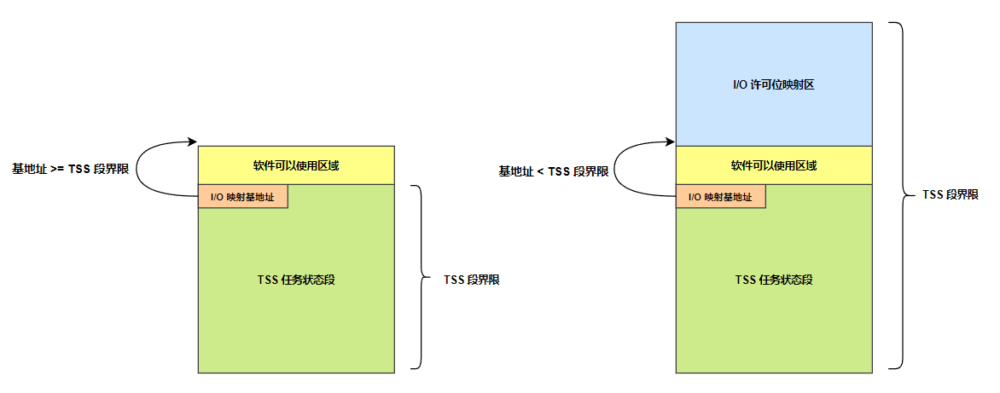

# 任务切换

## 一、前言

### 1.简介

从 80286 开始的处理器是面向多任务系统而设计的。在一个多任务的环境中，可以同时存在多个任务，**每个任务都有各自的局部描述符表 (LDT) 和任务状态段 (TSS)**。在局部描述符表中存放着专属于任务局部/私有空间的段的描述符。可以在多个任务之间切换，使它们轮流执行，从一个任务切换到另一个任务时，具体的切换过程是由处理器固件负责进行的。

有两种基本的任务切换方式，一种是协同式的，从一个任务切换到另一个任务，需要当前任务主动地请求暂时放弃执行权，或者在通过调用门请求操作系统服务时，由操作系统"趁机"将控制转移到另一个任务。这种方式依赖于每个任务的"自律"性，当一个任务失控时，其他任务可能得不到执行的机会。

另一种是抢占式的，在这种方式下，**可以安装一个定时器中断，并在中断服务程序中实施任务切换**。硬件中断信号总会定时出现，不管处理器当时在做什么，中断都会适时地发生，而任务切换也就能够顺利进行。在这种情况下，每个任务都能获得平等的执行机会。

如下图所示，**所有任务共享一个全局空间，这是内核或者操作系统提供的**，包含了系统服务程序和数据；同时，每个任务还有自己的局部空间，每个任务的功能都不一样，所以局部空间包含的是一个任务区别于其他任务的私有代码和数据。

<div align="center">
    
</div>

在一个任务内，全局空间和局部空间具有不同的特权级别。如上图所示，使用调用门，可以在任务内将控制从 3 特权级的局部空间转移到 0 特权级的全局空间，以使用内核或者操作系统提供的服务。

任务切换是以任务为单位的，是指离开一个任务，转到另一个任务中去执行。**<font color="red">当一个任务正在执行时，处理器的各个部分都和该任务息息相关：段寄存器指向该任务所使用的内存段；通用寄存器保存着该任务的中间结果</font>**，等等。离开当前任务，转到另一个任务开始执行时，要保存旧任务的各种状态，并恢复新任务的运行环境。

在《任务和特权级保护》这一章中，一开始，处理器是在任务的全局空间（特权级为 0）执行的，然后通过一个虚假的调用门返回，使处理器回到任务的局部空间（当前特权级降为 3）执行。事实上，这是没有必要的，当计算机加电之后，一旦进入保护模式，就直接创建和执行操作系统的 0 特权级任务（以完成一些管理和控制功能，比如提供一个界面和用户进行交互）。**然后可以从该任务切换到其他任务，不管它们是哪个特权级别的**。

### 2.多任务

To provide efficient, protected multitasking, the 80386 employs several special data structures. It does not, however, use special instructions to control multitasking; **<font color="red">_instead, it interprets ordinary control-transfer instructions differently when they refer to the special data structures_</font>**. The registers and data structures that support multitasking are:

- Task state segment（任务状态段）
- Task state segment descriptor（任务状态段描述符）
- Task register（任务寄存器）：TR 寄存器中保存任务状态段 TSS 描述符的选择子，并且将 TSS 描述符加载到 TR 高速缓存中；
- Task gate descriptor

With these structures the 80386 can rapidly switch execution from one task to another, saving the context of the original task so that the task can be restarted later.下面详细介绍任务切换的方法。

## 二、任务管理

### 1.任务的结构和状态

一个任务由两部分构成：任务执行空间和 TSS。**任务执行空间包括代码段、堆栈段和一个或多个数据段**，如下图所示。如果操作系统使用了处理器的特权级保护机制，那么任务执行空间就需要为每个特权级提供一个独立的堆栈空间。TSS 指定了构成任务执行空间的各个段，并且为任务状态信息提供存储空间。

<div align="center">
    
</div>

一个任务的使用由指向其 TSS 的段选择符来指定。当一个任务被加载进处理器中执行时，那么该任务的 TSS 描述符选择子以及 TSS 段描述符属性就会被加载进任务寄存器 TR (Task Register) 中。如果使用了分页机制，那么任务使用的页目录表基地址就会被加载进控制寄存器 CR3。当前执行任务的状态由处理器的以下内容构成：

- 所有通用寄存器和段寄存器信息；
- 标志寄存器 EFLAGS、程序指针 EIP、控制寄存器 CR3、任务寄存器和 LDTR 寄存器；
- 段寄存器指定的任务当前执行空间；
- I/O 映射位图基地址和 I/O 位图信息(在 TSS 中)；
- 特权级 0、1 和 2 的堆栈指针(在 TSS 中)；
- 链接至前一个任务的链指针（在 TSS 中）；

### 2.任务的执行

软件或处理器可以使用以下方法之一来调度执行一个任务:

- 使用 CALL 指令明确地调用一个任务；
- 使用 JMP 指令明确地跳转到一个任务 (Linux 内核使用的方式)；
- (由处理器) 隐含地调用一个中断句柄处理任务；
- 隐含地调用一个异常句柄处理任务。

所有这些调度任务执行的方法都会使用一个指向任务门或任务 TSS 段的选择符来确定一个任务。当使用 CALL 或 JMP 指令调度一个任务时，**<font color="blue">指令中的选择符既可以直接选择任务的 TSS，也可以选择存放有 TSS 选择符的任务门</font>**。**<font color="red">当调度一个任务来处理一个中断或异常时，IDT 中该中断或异常表项必须是一个任务门</font>**，并且其中含有中断或异常处理任务的 TSS 选择符。

作为任务切换操作的一部分，处理器也会切换到另一个 LDT，从而允许每个任务对基于 LDT 的段具有不同逻辑到物理地址的映射。同时页目录寄存器 CR3 也会在切换时被重新加载，因此每个任务可以有自己的一套页表。这些保护措施能够用来隔绝各个任务并且防止它们相互干扰。

>使用处理器的任务管理功能来处理多任务应用是任选的。我们也可以使用软件来实现多任务，使得每个软件定义的任务在一个 8086 体系结构的任务上下文中执行。

## 三、TSS 和 TSS 描述符

### 1.任务状态段 TSS

#### 1.1 TSS 结构

TSS 和 TSS 描述符的格式如下所示。如下图所示，TSS 内偏移 0 处是前一个任务的 TSS 描述符选择子。和 LDT 一样，必须在全局描述符表 (GDT) 中创建每个 TSS 的描述符。当系统中有多个任务同时存在时，可以从一个任务切换到另一个任务执行，此时称任务是嵌套的。被嵌套的任务用这个指针指向前一个任务，即嵌套它的那个任务，当控制返回前一个任务时，处理器需要这个指针来识别前一个任务。创建 TSS 时可以为 0。

**SS0、SS1 和 SS2 分别是 0、1 和 2 特权级的栈段选择子**，ESP0、ESP1 和 ESP2 分别是 0、1 和 2 特权级栈的栈顶指针。**<font color="red">这些内容应当由任务的创建者填写，且属于填写后一般不变的静态部分</font>**，当通过调用门进行特权级之间的控制转移时，处理器用这些信息来切换栈。CR3 和分页有关，此处一般由任务的创建者填写，如果没有使用分页，可以为 0。

<div align="center">
    <div align="center" style="color: #F14; font-size:13px; font-weight:bold">TSS 格式</div>
    
</div></p>

偏移为 32~92 的区域是处理器各个寄存器的快照部分，用于在进行任务切换时保存处理器的状态以便将来恢复现场。在一个多任务环境中，每次创建一个任务时，操作系统或者内核至少要填写 EIP、EFLAGS、ESP、CS、SS、DS、ES、FS 和 GS，**<font color="blue">当该任务第一次获得执行时，处理器从这里加载初始执行环境，并从 CS:EIP 处开始执行任务的第一条指令</font>**。在此之后的任务运行期间，该区域的内容由处理器固件进行更改。

**LDT 段选择子是当前任务的 LDT 描述符选择子，由内核填写，以指向当前任务的 LDT**。该信息由处理器在任务切换时使用，将此 LDT 描述符选择子加载到 LDTR 寄存器中，在任务运行期间保持不变。T 位用于软件调试，在多任务的环境中，如果 T 位是 1，每次切换到该任务时，将引发一个调试异常中断。

最后，TSS 段中的各字段可分为两类：动态字段和静态字段。

- 动态字段：当任务切换而被挂起时，处理器会更新动态字段的内容。具体包括：通用寄存器字段、段选择符字段、标志寄存器 EFLAGS 字段、指令指针 EIP 字段以及先前任务链接字段，此字段含有前一个任务 TSS 段选择符（在调用、中断或异常激发的任务切换时更新）。该字段 (通常也称为后链接字段，Back link field) 允许任务使用 iret 指令切换到前一个任务。
- 静态字段：处理器会读取静态字段的内容，但通常不会改变它们。这些字段内容是在任务被创建时设置的。LDT 段选择符字段、CR3 控制寄存器字段、特权级 0、1 和 2 的堆栈指针字段、调试陷阱(Debug Trap) T 标志字段、I/O 位图基地址字段；

#### 1.2 I/O 许可位串

I/O 映射基地址用于决定当前任务是否可以访问特定的硬件端口。我们知道，特权指令是只有 0 特权级的程序才可以执行的指令，执行这些指令会影响整个机器的状态。

现有的特权指令也许是处理器的设计者精心挑选的，即使较低特权级的程序不使用它们，这些程序也能运行得很好。不过，对于另外一些候选指令，尽管它们也适合作为特权指令，但其他特权级的程序同样需要它们。一个典型的例子是硬件端口的输入输出指令 in 和 out，它们应该对特权级别为 1 的程序开放，因为设备驱动程序就工作在这个特权级别。

不过这样做依然是不合理的，因为即使是特权级为 3 的程序，在需要快速反应的场合，也需要直接访问某些硬件端口。所以如果需要，它们（in 和 out 指令）也应该向 2、3 特权级的程序开放。每个任务都有 EFLAGS 寄存器的副本，其内容在任务创建的时候由内核或者操作系统初始化，在多任务系统中，每次当任务恢复运行时，就由处理器固件自动从 TSS 中恢复。

EFLAGS 寄存器的 IOPL 位决定了当前任务的 I/O 特权级别。**<font color="red">如果当前特权级 CPL 高于或者和任务的 I/O 特权级 IOPL 相同时，即在数值上：$\scriptsize\bold{CPL\le IOPL}$ 时，所有的 I/O 操作都是允许的</font>**，针对任何硬件端口的访问都可以通过。

相反如果当前特权级 CPL 低于任务的 I/O 特权级 IOPL，也并不意味着所有的硬件端口都对当前任务关上了大门。事实上，处理器的意思是总体上不允许，但个别端口除外。至于个别端口是哪些端口，要找到当前任务的 TSS，并检索 I/O 许可位串。

如下图所示，I/O 许可位串 (I/O Permission Bit String) 是一个比特序列，或者说是一个比特串，最多允许 65536 比特，即 8KB。从第 1 比特开始，各比特用它在串中的位置代表一个端口号。因此，第 1 个比特代表 0 号端口，第 2 个比特代表 1 号端口，第 65536 比特代表第 65535 号端口。

<div align="center">
    
</div>

比特序列中每个比特的取值决定了相应的端口是否允许访问，为 1 时，禁止访问；为 0 时允许访问。处理器检查 I/O 许可位的方法是先计算它在 I/O 许可位映射区的字节编号，并读取该字节，然后进行测试。**<font color="red">比如，当执行指令 out 0x09,al 时，这里要访问的端口号为 9，即第 10 个端口</font>**。

**该端口对应着 I/O 许可位映射区第 2 个字节的第 2 个比特（位 1）**。于是，它读取该字节，并测试那一位。

同其他和任务相关的信息一样，I/O 许可位串位于任务的 TSS 中。如下图所示，任务状态段 TSS 的最小长度是 104 字节，保存着最基本的任务信息。但是整个 TSS 还可以包括一个 I/O 许可位串，它所占用的区域称为 I/O 许可位映射区。

在下图中，在 TSS 内偏移为 102 的那个字单元，**保存着 I/O 许可位串（I/O 许可位映射区）的起始位置，从 TSS 的起始处 (0) 算起**。因此，如果该字单元的内容大于或者等于 TSS 的段界限 (在 TSS 描述符中)，则表明没有 I/O 许可位串。

<div align="center">
    
</div>

这里解释一下，如下图所示，**_因为 TSS 的段界限是包含了 I/O 许可位映射区在内，且 I/O 许可位串的起始位置从 TSS 的起始处（0）算起_**，因此如果 I/O 许可位串的起始位置等于或者大于 TSS 的段界限，说明根本没有 I/O 许可位串，如果存在 I/O 许可位串，那么其起始地址必然小于 TSS 的段界限。

<div align="center">
    
</div>

>说明一下，**和 LDT 一样，必须在 GDT 中创建 TSS 的描述符**，TSS 描述符中包括了 TSS 的基地址和界限，**<font color="red">该界限值包括 I/O 许可位映射区在内</font>**。

I/O 端口是按字节编址的。这句话的意思是，**每个端口仅被设计用来读写一个字节的数据**，当以字或者双字访问时，实际上是访问连续的 2 个或者 4 个端口。**<font color="red">比如，当从端口 n 读取一个字时，相当于同时从端口 n 和端口 n+1 各读取一个字节</font>**。

`in ax, 0x3f8` 这条指令表示从端口 0x3f8 读取数据，由于端口被设计仅用来读写一个字节数据，因此，该指令相当于执行 `in al, 0x3f8` 和 `in ah,0x3f9` 这两条命令。

由于这个原因，当处理器执行一个字或者双字 I/O 指令时，会检查许可位串中的 2 个，或者 4 个连续位，而且要求它们必须都是 0，否则引发异常中断。麻烦在于，这些连续的位可能是跨字节的。即，一些位于前一字节，另一些位于后一字节。**为此，处理器每次都要从 I/O 许可位映射区读两个连续的字节**。但是如果要检查的比特在最后一字节中，那么，这个两字节的读操作将会越界。为防止这种情况，**处理器要求 I/O 许可位映射区的最后必须附加一个额外的字节，并要求它的所有比特都是 1（1 表示该端口禁止访问）**，即 0xFF（会引发处理器中断）。当然，它必须位于 TSS 的界限之内。

处理器不要求为每一个 I/O 端口都提供位映射。对于那些没有在该区域内映射的位，处理器假定它对应的比特是 1。要是 I/O 许可位映射区的长度是 11 字节，那么，除去最后一个所有比特都是 1 的字节，前 10 字节映射了 80 个端口，分别是端口 0 到端口 79，访问更高地址的端口将引发异常中断。

尽管不存在对 EFLAGS 寄存器整体写入或者读出的指令，但存在将标志寄存器入栈和出栈的指令：

```armasm{.line-numbers}
pushf/popf
pushfd/popfd
```

pushf 指令在 16 位模式下，pushf 压入的是 EFLAGS 的低 16 位。如果要压入整个 32 位的 EFLAGS，需要指令前缀 66，即 **`66 9C`**；在 32 位模式下，pushf 压入的是整个 32 位的 EFLAGS，**即使有指令前缀，也会压入整个 32 位的 EFLAGS 寄存器**。

而对于 pushfd 命令，本质上，它们对应着同一条指令，当你使用 pushf 时，编译器就知道，应当编译成无前缀的机器码 9C；当使用 pushfd 时，编译器会编译成 **`66 9C`**。下面的例子展示了它们之间的区别，**在 32 位模式下，pushf 和 pushfd 是相同的**。

```armasm{.line-numbers}
[bits 16]
pushf ;编译后是 9C，16 位操作
pushfd ;编译后是 66 9C，32 位操作

[bits 32]
pushf ;编译后是 9C，32 位操作
pushfd ;编译后是 9C，32 位操作
```

通过将 EFLAGS 寄存器的内容压入栈，局部修改后，再弹出到 EFLAGS，可以间接地修改它的各种标志位。**能够修改 IOPL 标志的指令是** **`popf iret`**。注意，这里没有包括 pushf 指令，原因是你可以执行 pushf 指令，但我不允许你执行 popf 和 iret 指令，这样就无法修改 EFLAGS 寄存器了，所以能实现修改 IOPL 标志位的主要指令还是依赖于 **`popf iret`**；**能够修改 IF 标志的指令是 `cli sti`**，中断是由操作系统或者内核统一管理的，cli 和 sti 指令不能由低特权级的程序随便执行。但是这些指令并不是特权指令，原因就是其他特权级的程序也离不开它们（比如 iret 指令普通中断程序返回都需要）。

>iret 指令用于中断服务程序返回，执行时，iret 会从栈中弹出指令指针（IP）、代码段（CS）和标志寄存器（EFLAGS）的值，以恢复中断发生前的环境。

最好的办法是用 IOPL 本身来控制它们。**<font color="red">如果在数值上 $\scriptsize{CPL\leq IOPL}$ 则允许执行以上 4 条指令（修改 IOPL 和 IF 标志位），也允许访问所有的硬件端口</font>**。否则，如果当前特权级 CPL 低于当前的 I/O 特权级 IOPL（数值上大于），则执行 popf 和 iret 指令时，会引发处理器异常中断；执行 cli 和 sti 时，不会引发异常中断，但不改变标志寄存器的 IF 位。同时，是否能访问特定的 I/O 端口，要参考 TSS 中的 I/O 许可位映射串。

>总结来说，当前运行程序或任务的 CPL 必须小于或等于这个 IOPL 才能访问 I/O 地址空间。只有当 CPL 小于或等于这个 IOPL 时，程序才可以使用 popf 或 iret 指令修改这个字段。IOPL 也是控制对 IF 标志修改的机制之一。

### 2.TSS 描述符

和局部描述符表 (LDT) 一样，也必须在 GDT 中安装 TSS 的描述符。这样做一方面是为了对 TSS 进行段和特权级的检查；另一方面也是执行任务切换的需要。**<font color="red">当 call far 和 jmp far 指令的操作数是 TSS 描述符选择子时</font>**，处理器执行任务切换操作。TSS 描述符的格式如下所示。

<div align="center">
    <div align="center" style="color: #F14; font-size:13px; font-weight:bold">TSS 描述符格式</div>
    
</div>

TSS 描述符中的 B 位是"忙"位 (Busy)。在任务刚刚创建的时候，它应该为二进制的 1001，即 B 位是 0，表明任务不忙。当任务开始执行时，**或者处于挂起状态 (临时被中断执行) 时**，由处理器固件把 B 位置 1。

任务是不可重入的，就是说，在多任务环境中，**如果一个任务是当前任务，它可以切换到其他任务，但不能从自己切换到自己**。在 TSS 描述符中设置 B 位，并由固件进行管理，可以有效地防止这种情况的出现（即不能切换到一个 B=1 的任务）。

>可访问一个 TSS 段描述符并没有给程序读写该描述符的能力。**<font color="red">若想读或修改一个 TSS 段描述符，可以使用映射到内存相同位置的数据段描述符 (即别名描述符) 来操作</font>**。把 TSS 描述符加载进任何段寄存器将导致一个异常。企图使用 TI 标志置位的选择符 (即当前 LDT 中的选择符) 来访问 TSS 段也将导致异常（TSS 描述符只能安装在 GDT 中）。

下面介绍一下 LTR 指令：Loads the source operand into the segment selector field of the task register. The source operand (a general-purpose register or a memory location) contains a segment selector that points to a task state segment (TSS). After the segment selector is loaded in the task register, the processor uses the segment selector to locate the segment descriptor for the TSS in the global descriptor table (GDT). It then loads the segment limit and base address for the TSS from the segment descriptor into the task register. **<font color="red">The task pointed to by the task register is marked busy (将对应 TSS 段描述符中的 B 置为 1)</font>**, but a switch to the task does not occur.

The LTR instruction is provided for use in operating-system software; it should not be used in application programs. It can only be executed in protected mode when the CPL is 0. It is commonly used in initialization code to establish the first task to be executed.

## 四、使用中断进行任务切换

**第一种任务切换的方法是借助于中断**，这也是现代抢占式多任务的基础。原因很简单，只要中断没有被屏蔽，它就能随时发生。**比如设定定时器中断，中断就能够以准确的时间间隔发生，可以用来强制实施任务切换**。在实模式下，内存最低地址端的 1KB 是中断向量表，保存着 256 个中断处理过程的段地址和偏移地址。当中断发生时，处理器把中断号乘以 4，作为表内偏移量访问中断向量表，从相应的位置取出中断处理过程的段地址和偏移地址，并转移到那里执行。

<div align="center" style="display: flex; justify-content: center">
    <div style="text-align: center; margin-right: 2px;">
    <div align="center" style="color: #F14; font-size:13px; font-weight:bold">IDT 中的中断门和陷阱门</div>
    
    </div>
    <div style="text-align: center; margin-right: 2px;">
    <div align="center" style="color: #F14; font-size:13px; font-weight:bold">IDT 中的任务门</div>
    
    </div>
</div>

在保护模式下，中断向量表不再使用，取而代之的是中断描述符表（Interrupt Descriptor Table, IDT）。IDT 和 GDT、LDT 均用于保存描述符。唯一不同的地方是，它保存的是门描述符，包括中断门、陷阱门和任务门这 3 种门描述符。当中断发生时，处理器用中断号乘以8 (因为每个描述符占 8 字节)，作为偏移量访问中断描述符表，取出门描述符。门描述符中有中断处理过程的代码段选择子和段内偏移量，这和调用门是一样的，如上面左图所示。

一般的中断处理可以使用中断门和陷阱门。调用门的工作原理只是从任务的局部空间转移到更高特权级的全局空间去执行，本质上是一种任务内的控制转移行为。**<font color="red">与此相同，中断门和陷阱门允许在任务内实施中断处理，转到全局空间去执行一些系统级的管理工作</font>**，本质上也是任务内的控制转移行为，其过程如上左图所示。

但是在中断发生时，**<font color="blue">如果该中断号对应的门是任务门，那么性质就截然不同了，必须进行任务切换</font>**。即要中断当前任务的执行，保护当前任务的现场并转换到另一个任务去执行，其过程如上右图所示。

IDT 表中保存的中断门、陷阱门、任务门描述符格式如下所示，任务门描述符中的主要成份是任务的 TSS 选择子。任务门用于在中断发生时执行任务切换，而执行任务切换时必须找到新任务的任务状态段 (TSS)。所以任务门应当指向新任务的 TSS。为了指向新任务的 TSS，只需要在任务门描述符中给出任务的 TSS 选择子就可以了。任务门描述符提供对一个任务间接、受保护的引用。

>任务门描述符中的 TSS 选择符中的 RPL 域不用。任务门描述符中的 DPL 用于在任务切换时控制对 TSS 段的访问。请注意，当使用任务门时，目标 TSS 段描述符的 DPL 忽略不用。

任务门和 TSS 描述符之间的关系如下图所示：

<div align="center">
    
</div>

任务门描述符中的 P 位指示该门是否有效，当 P 位为 0 时，不允许通过此门实施任务切换；**DPL 是任务门描述符的特权级，但是对因中断而发起的任务切换不起作用，处理器不按特权级施加任何保护。但是这并不意味着 DPL 字段没有用处，当以非中断的方式通过任务门实施任务切换时它就有用了**。

<div align="center">
    <div align="center" style="color: #F14; font-size:13px; font-weight:bold">中断门和陷阱门描述符格式</div>
    
</div>
<div align="center">
    <div align="center" style="color: #F14; font-size:13px; font-weight:bold">任务门描述符格式</div>
    
</div>

当中断发生时，处理器用中断号乘以 8 作为索引访问中断描述符表。当它发现这是个任务门 (描述符) 时，就知道应当发起任务切换。于是它取出任务门描述符；再从任务门描述符中取出新任务的 TSS 选择子；接着再用 TSS 选择子访问 GDT，取出新任务的 TSS 描述符。

在转到新任务执行前，处理器要先把当前任务的状态保存起来。当前任务的 TSS 是由任务寄存器 TR 的当前内容指向的，所以处理器把每个寄存器的快照保存到由 TR 指向的 TSS 中。然后处理器访问新任务的 TSS，从中恢复各个寄存器的内容，包括通用寄存器、标志寄存器 EFLAGS、段寄存器、指令指针寄存器 EIP、栈指针寄存器 ESP，以及局部描述符表寄存器 (LDTR) 等。最终任务寄存器 TR 指向新任务的 TSS，而处理器旋即开始执行新的任务。一旦新任务开始执行，处理器固件会自动将其 TSS 描述符的 B 位置 1，表示该任务的状态为忙。

当中断发生时，可以执行常规的中断处理过程，也可以进行任务切换。尽管性质不同，但它们都要使用 iret 指令返回。前者是返回到同一任务内的不同代码段；后者是返回到被中断的那个任务。那么处理器如何区分这两种不同类型呢？**<font color="red">主要根据 EFLAGS 寄存器中的 NT 位来进行区分</font>**，当 NT 位为 1 时，表明当前任务嵌套于其他任务中，使用中断进行了任务切换；当 NT 位为 0 时，则表明当前任务不嵌套于其他任务，不可能是任务切换，是一般的中断处理过程。

>**<font color="red"> 在保护模式下，通过中断门和陷阱门进入中断处理程序工作时，会设置 TF=0，NT=0，IF=0（如果是中断门）</font>**。对于陷阱门，在转移过程中保持 IF 位不变，即如果 IF 位原来是 1，那么通过陷阱门转移到处理程序之后仍允许 INTR 中断。

<div align="center">
    <div align="center" style="color: #F14; font-size:13px; font-weight:bold">EFLAGS 寄存器格式</div>
    
</div>

上图是 EFLAGS 寄存器的格式图，32 位处理器的 EFLAGS 有 NT 位 (位14)，意思是嵌套任务标志 (Nested Task Flag)。每个任务的 TSS 中都有一个任务链接域 (指向前一个任务的指针)，**可以填写为前一个任务的 TSS 描述符选择子**。如果当前任务 EFLAGS 寄存器的 NT 位是 1，则表示当前正在执行的任务嵌套于其他任务内，并且能够通过 TSS 中任务链接域的指针返回到前一个任务。

因中断而引发任务切换时，取决于当前任务 (旧任务) 是否嵌套于其他任务内，其 EFLAGS 寄存器的 NT 位可能是 0，也可能是 1。**不过这无关紧要，因为处理器不会改变它，而是和其他寄存器一道，写入 TSS 中保护起来**。另外当前任务 (旧任务) 肯定处于"忙"的状态，其 TSS 描述符的 B 位一定是 1，在任务切换后同样保持不变。

对新任务的处理是，要把老任务的 TSS 选择子填写到新任务 TSS 中的任务链接域，同时将新任务 EFLAGS 寄存器的 NT 位置 1（表明当前新任务嵌套于老任务中），以允许返回(转换)到前一个任务 (老任务) 继续执行。同时还要把新任务 TSS 描述符的 B 位置 1 (忙)。

可以使用 iret 指令从当前任务返回(转换)到前一个任务，前提是当前任务 EFLAGS 寄存器的 NT 位必须是 1。无论任何时候处理器碰到 iret 指令，它都要检查 NT 位，如果此位是 0，表明是一般的中断过程，按一般的中断返回处理，即中断返回是任务内的 (中断处理过程虽然属于操作系统，但属于任务的全局空间)。

如果此位是 1，则表明当前任务之所以能够正在执行，是因为中断了别的任务。因此应当返回原先被中断的任务继续执行。**此时由处理器固件把当前任务 EFLAGS 寄存器的 NT 位改成 0，并把 TSS 描述符的 B 位改成 0 (非忙)**。在保存了当前任务的状态之后，接着用新任务 (被中断的任务) 的 TSS 恢复现场。这种情形在由通过**任务门**转入的中断或异常处理程序返回时出现，因为在由中断门或陷阱门转入处理程序时，NT 位已被清 0。

>中断返回指令 IRET 不仅能够用于由中断/异常引起的嵌套任务的返回，而且也适用于由段间调用指令 CALL 通过任务门/TSS 描述符选择子引起的嵌套任务的返回，如前文所述，在执行通过任务门进行任务切换的段间调用指令 CALL 时，标志寄存器中的 NT 位被置为 1，表示任务嵌套。而 RET 指令不能实现此功能。

## 五、使用 jmp 和 call 进行任务切换

除了因中断引发的任务切换之外，还可以用远过程调用指令 CALL，或者远跳转指令 JMP 直接发起任务切换。**<font color="red">在这两种情况下，CALL 和 JMP 指令的操作数是任务的 TSS 描述符选择子或任务门</font>**（两者本质相同，因为任务门中主要包含的也是 TSS 描述符选择子）。以下是两个例子:

```armasm{.line-numbers}
call 0x0010:0x00000000
jmp 0x0010:0x00000000
```

当处理器执行这两条指令时，首先用指令中给出的描述符选择子访问 GDT，分析它的描述符类型。**<font color="blue">如果是一般的代码段描述符，就按普通的段间转移规则执行；如果是调用门，按调用门的规则执行；如果是 TSS 描述符，或者任务门，则执行任务切换</font>**。此时指令中给出的 32 位偏移量被忽略，原因是执行任务切换时，所有处理器的状态（包括 CS 和 EIP 寄存器）都可以从 TSS 中获得。

注意任务门描述符可以安装在中断描述符表（IDT）中，也可以安装在全局描述符表 (GDT) 或者局部描述符表 (LDT) 中。

>描述符表中与任务相关的描述符有两类：任务状态段描述符和任务门。当执行权传给这任何一类描述符时，都会造成任务切换。

### 1.使用 call 指令进行任务切换

如果是用于发起任务切换，call 指令和 jmp 指令也有不同之处。使用 call 指令发起的任务切换类似于因中断发起的任务切换。这就是说，由 call 指令发起的任务切换是嵌套的，当前任务 (旧任务) TSS 描述符的 B 位保持原来的 1 不变，EFLAGS 寄存器的 NT 位也不发生变化；新任务 TSS 描述符的 B 位置 1，EFLAGS 寄存器的 NT 位也置 1，表示此任务嵌套于其他任务中。同时，TSS 任务链接域的内容改为旧任务的 TSS 描述符选择子。

假设任务 1 是整个系统中的第一个任务。当任务 1 开始执行时，其 TSS 描述符的 B 位是 1，EFLAGS 寄存器的 NT 位是 0，即不嵌套于其他任务。

当从任务 1 转换到任务 2 后，任务 1 仍然为"忙"，**<font color="red">EFLAGS 寄存器的 NT 位不变（在其 TSS 中）</font>**;任务 2 也变为"忙"，EFLAGS 寄存器的 NT 位变为"1"，表示嵌套于任务 1 中。同时任务 1 的 TSS 描述符选择子也被复制到任务 2 的 TSS 中 (任务链接域)。

<div align="center">
    
</div>

最后是从任务 2 转换到任务 3 执行。和从前一样，任务 2 保持"忙"的状态，EFLAGS 寄存器的 NT 不变 (在其 TSS 中)；任务 3 成为当前任务，其 TSS 描述符的 B 位变成"1" (忙)，EFLAGS 寄存器的 NT 位也变成 1，同时其 TSS 的任务链接域指向任务 2。

用 CALL 指令发起的任务切换，可以通过 iret 指令返回到前一个任务。此时也和中断一样，旧任务 TSS 描述符的 B 位，以及 EFLAGS 寄存器的 NT 位都恢复到 0。

### 2.使用 jmp 指令进行任务切换

**<font color="red">和 call 指令不同，使用 jmp 指令发起的任务切换，不会形成任务之间的嵌套关系</font>**。执行任务切换时，当前任务(旧任务) TSS 描述符的 B 位清零，变为非忙状态，EFLAGS 寄存器的 NT 位不变（这里 NT 位的处置和 call 指令进行任务切换一样）；新任务 TSS 描述符的 B 位置 "1"，进入忙的状态，EFLAGS 寄存器的 NT 位保持从 TSS 中加载时的状态不变，并且不使用前一任务链接字段，这里和 call 指令有明显的不同，**<font color="red">说明当前新任务和旧任务没有形成任务之间的嵌套关系，只是单纯的任务切换</font>**。

**任务是不可重入的。任务切换不会把任何信息压入堆栈中，处理器的状态信息都被保存在内存中被称为 TSS 的数据结构中。任务不可重入的本质是，执行任务切换时，新任务的状态不能为忙（B=1）**。这里有两个典型的情形：

- 第 1 种情形：执行任务切换时，新任务不能是当前任务自己；
- 第 2 种情形：如上图所示，不允许使用 CALL 指令从任务 3 切换到任务 2 和任务 1 上。如果不禁止这种情况的话，任务之间的嵌套关系将会因为 TSS 任务链接域的破坏而错乱；

处理器是通过 TSS 描述符的 B 位来检测重入的。因中断、iret、call 和 jmp 指令发起任务切换时，处理器固件会检测新任务 TSS 描述符的 B 位，如果为 1，则不允许执行这样的切换。

## 六、处理器在实施任务切换时的操作

### 1.4 种任务切换方法

处理器使用以下 4 种方法将控制转移到其他任务：

- 当前程序、任务或者过程执行一个 **<font color="red">将控制转移到 GDT 内某个 TSS 描述符</font>** 的 jmp 或者 call 指令；
- 当前程序、任务或者过程执行一个 **<font color="red">将控制转移到 GDT 或者当前 LDT 内某个任务门描述符</font>** 的 jmp 或者 call 指令；
- 一个异常或者中断发生时，**<font color="red">中断号指向中断描述表 IDT 内的任务门</font>**；
- 在 EFLAGS 寄存器的 NT 位置位的情况下，**<font color="red">当前任务执行了一个 iret 指令</font>**，此时会返回前一个被中断的任务继续执行。

jmp、call、iret 指令或者异常和中断，是程序重定向的机制，它们所引用的 TSS 描述符或者任务门，以及 EFLAGS 寄存器 NT 标志的状态，决定了任务切换是否，以及如何发生。

### 2.任务切换操作

在执行任务切换时，处理器执行以下操作：

**1）步骤一**

从 JMP 或者 CALL 指令的操作数、任务门中取得新任务的 TSS 描述符选择子，以 iret 发起的任务切换从当前任务的 TSS 任务链接域取得新任务的 TSS 描述符选择子。

**2）步骤二**

检查是否允许从当前任务 (旧任务) 切换到新任务。数据访问的特权级检查规则适用于 jmp 和 call 指令，**<font color="red">当前 (旧) 任务的 CPL(CS.RPL) 和新任务段选择子的 RPL 必须在数值上小于或者等于目标 TSS 或者任务门的 DPL</font>**（这里和数据段特权级检查规则一样，必须当前特权级 CPL 和数据段选择子的 RPL 数值上小于或者等于目标数据段描述符中 DPL）。

**<font color="red">对于以 int n 指令产生的中断任务切换，因为中断和异常的向量中没有 RPL 字段，所以只需要 CPL 在数值上小于等于任务门描述符的 DPL 即可</font>**。

异常、中断 (除了以 int n 指令引发的中断) 和 iret 指令引起的任务切换忽略目标任务门或者 TSS 描述符的 DPL，因为中断和异常的向量中没有 RPL 字段，所以也不会对 RPL 字段进行检查。

**3）步骤三**

检查新任务的 TSS 描述符是否已经标记为有效 (P=1)，并且界限也有效 (大于或者等于 0x67，即十进制的 103)。

**4）步骤四**

检查新任务是否可用，不忙 (B=0，对于以 CALL、JMP、异常或者中断发起的任务切换) 或者忙 (B=1，对于以 iret 发起的任务切换)。由于任务是不可重入的，对于以 CALL、JMP、异常或者中断发起的任务切换，如果新任务 TSS 描述符的 B 位，如果为 1，则不允许执行这样的切换。

**5）步骤五**

检查当前任务 (旧任务) 和新任务的 TSS，以及所有在任务切换时用到的段描述符已经安排到系统内存中。

**6）步骤六**

**<font color="red">如果任务切换是由 jmp 或者 iret 发起的，处理器清除当前 (旧) 任务的忙 (B) 标志</font>**；如果是由 call 指令、异常或者中断发起的，忙 (B) 标志保持原来的置位状态。

**7）步骤七**

如果任务切换是由 iret 指令发起的，处理器建立旧任务 EFLAGS 寄存器的一个临时副本并清除其 NT 标志；如果是由 call 指令、jmp 指令、异常或者中发起的，旧任务 EFLAGS 寄存器副本中的 NT 标志不变，即保持旧任务原来的嵌套或者无嵌套关系不变。

**8）步骤八**

保存当前(旧)任务的状态到它的 TSS 中。处理器从任务寄存器 TR 中找到当前 TSS 的基地址，然后将以下寄存器的状态复制到当前 TSS 中：所有通用寄存器、段寄存器中的段选择子、刚才那个 EFLAGS 寄存器的副本，以及指令指针寄存器 EIP。

**9）步骤九**

如果任务切换是由 call 指令、异常或者中断发起的，处理器把从新任务加载的 EFLAGS 寄存器的 NT 标志置位（设置为 1）；如果是由 iret 或者 jmp 指令发起的，NT 标志位的状态对应着从新任务加载的 EFLAGS 寄存器的 NT 位。

**10）步骤十**

如果任务切换是由 call 指令、jmp 指令、异常或者中断发起的，处理器将新任务 TSS 描述符中的 B 位设置为 1；如果是由 iret 指令发起的，新任务 TSS 描述符中的 B 位保持原先的置位状态不变。

**11）步骤十一**

用新任务的 TSS 选择子和 TSS 描述符加载任务寄存器 TR。

**12）步骤十二**

新任务的 TSS 状态数据被加载到处理器。这包括 LDTR 寄存器、PDBR (控制寄存器 CR3)、EFLAGS 寄存器、EIP 寄存器、通用寄存器，以及段选择子。

**13）步骤十三**

开始执行新任务。

在任务切换时，当前任务的状态总要被保存起来。在恢复执行时，处理器从 EIP 寄存器的保存值所指向的那条指令开始执行，这个寄存器的值是在当初任务被挂起时保存的。

任务切换时，新任务的特权级别并不是从那个被挂起的任务继承来的。**<font color="red">新任务的特权级别是由其段寄存器 CS 的低 2 位决定的，而该寄存器的内容取自新任务的 TSS</font>**。因为每个任务都有自己独立的地址空间和任务状态段 TSS，所以任务之间是彼此隔离的，只需要用特权级规则控制对 TSS 的访问就行，软件不需要在任务切换时进行显式的特权级检查。

下表给出了不同条件下，B 位、NT 位和任务链接域的变化情况：

<div align="center">
    
</div>

注意运行于任何特权级上的程序都可以修改 NT 标志，因此任何程序都可以设置 NT 标志并执行 IRET 指令。这种做法会让处理器去执行当前任务 TSS 的前一任务链接字段指定的任务。为了避免这种伪造的任务切换执行成功，操作系统应该把每个 TSS 的该字段（前一任务链接域）初始化为 0。