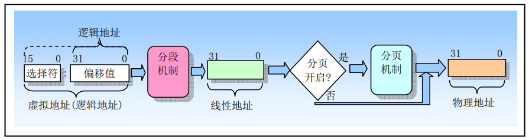
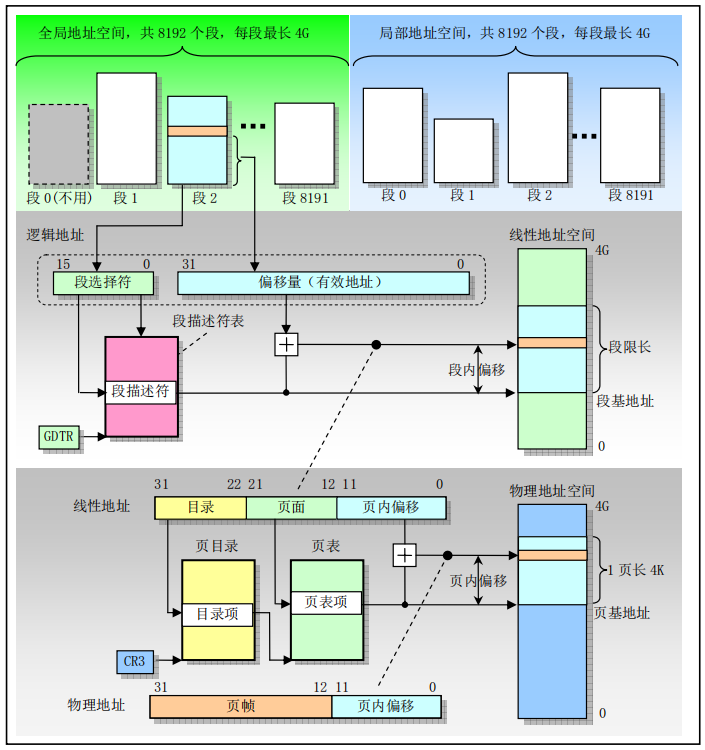
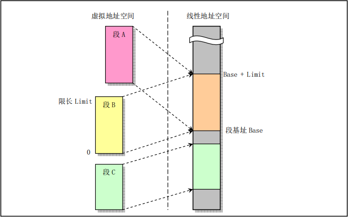
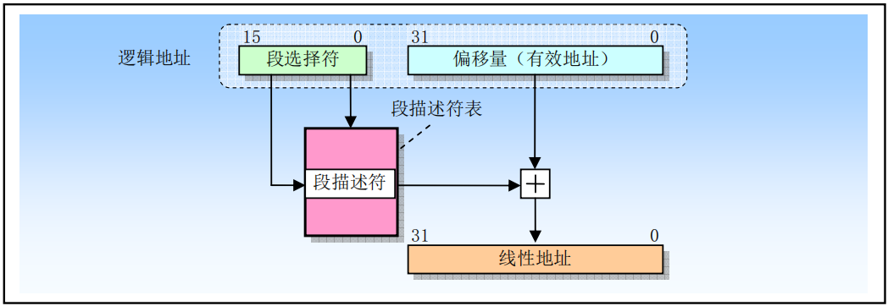
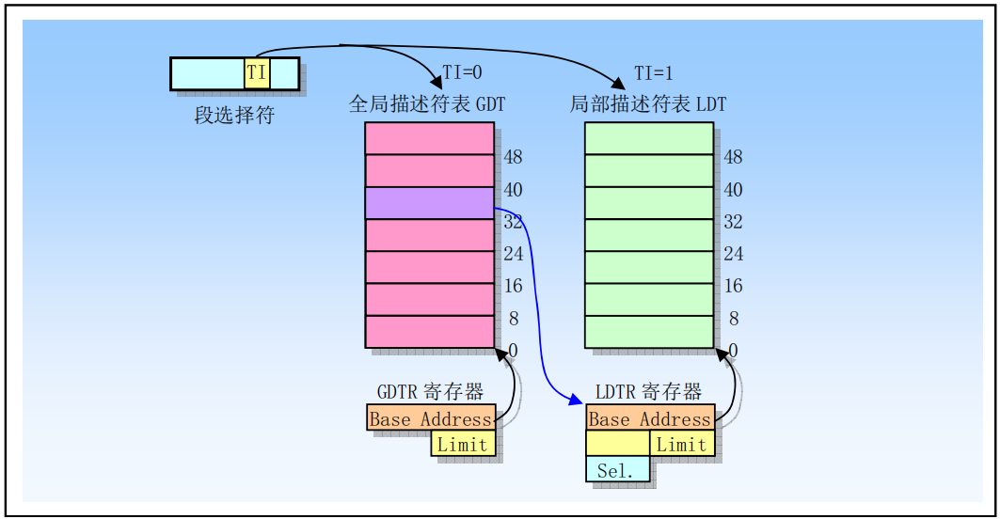
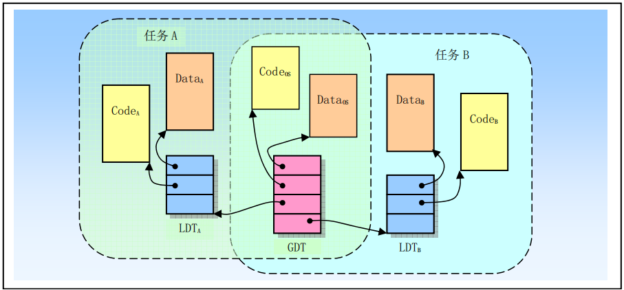
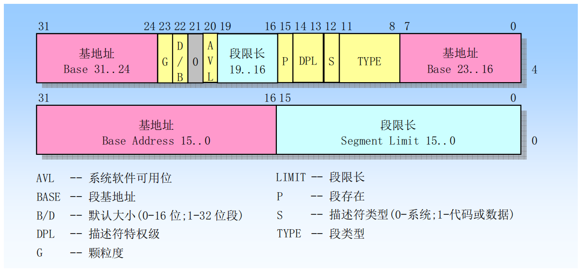

# 内存管理

## 一、内存寻址

内存是指一组有序字节组成的数组，每个字节有唯一的内存地址。内存寻址则是指对存储在内存中的某个指定数据对象的地址进行定位。80x86 支持多种数据类型：1 字节、2 字节 (1 个字) 或 4 字节 (双字) 的无符号整型数或带符号整型数，以及多字节字符串等。**通常内存地址从 0 开始编址**，对于 80x86 CPU 来说，其地址总线宽度为 32 位，因此一共有 $2^{32}$ 个不同物理地址，因此总共可以寻址 4GB 的物理内存。

>对于多字节数据类型 (例如 2 字节整数数据类型)，80x86 首先存放低值字节，随后地址处存放高值字节。因此 80x86 CPU 是一种先存小值 (Little Endian) 的处理器。

对于 8086 CPU，若要定位内存中的操作数，就要进行内存寻址。为此 8086 使用了一种称为段 (Segment) 的寻址技术。**这种寻址技术把内存空间分成一个或多个称为段的线性区域**，从而对内存中一个数据对象的寻址就需要使用一个 **<font color="red">段的起始地址(即段地址)</font>** 和 **<font color="red">一个段内偏移地址</font>** 两部分构成。段地址部分使用 16 位的段选择符指定，段内偏移地址部分使用 32 位的值来指定，因此段内地址可以是0~4GB。即一个段的最大长度可达4GB。

程序中**由 16 位的段选择子和 32 位的偏移构成的 48 位地址称为一个逻辑地址(虚拟地址)**。

8086 为段部分提供了 6 个存放段选择符的段寄存器：CS、DS、ES、SS、FS 和 GS。其中 CS 总是用于寻址代码段，而堆栈段则专门使用 SS 段寄存器。**在任何指定时刻由 CS 寻址的段称为当前代码段**。段间控制转移指令也就是为 CS 和 EIP 赋予新值，从而可以把执行位置改变到其他的代码段中。这样就实现了在不同段中程序控制的转移。

段寄存器 ss 寻址的段称为当前堆栈段，栈顶由 esp 寄存器指定。因此堆栈顶处地址是 ss:[esp]。当指令中没有指定所操作数据的段时，那么 ds 将是默认的数据段寄存器。为了指定内存操作数的段内偏移地址，32 位处理器指令规定了计算偏移量的很多方式，称为指令寻址方式。指令的偏移量由 3 部分组成:基地址寄存器、变址寄存器和一个偏移常量。三者关系为：**`偏移地址=基地址+(变址×比例因子)+偏移量`**。

## 二、地址变换

任何完整的内存管理系统都包含两个关键部分：保护和地址变换。提供保护措施是可以防止一个任务访问另一个任务或操作系统的内存区域。地址变换能够让操作系统在给任务分配内存时具有灵活性，**并且由于可以让某些物理地址不被任何逻辑地址所映射，所以在地址变换过程中同时也提供了内存保护功能**。

程序中的地址是由两部分（【选择符】和【偏移量】）构成的逻辑地址。这种逻辑地址需要使用地址变换机制将它映射到物理内存地址上。**<font color="red">为了减少确定地址变换所需要的信息，变换或映射通常以内存块作为操作单位</font>**。分段机制和分页机制是两种广泛使用的地址变换技术。

分段和分页操作都使用驻留在内存中的表来指定它们各自的变换信息。这些表只能由操作系统访问，以防止应用程序擅自修改。对于分段来说这个表就是 GDT，通过选择符选择 GDT 中某一个段描述符获取到代码段的基地址，再加上偏移地址就得到要访问的线性地址；对于分页来说这个表就是页目录和页表，通过遍历页目录和页表将线性地址转换为要访问的物理地址。因此，不管是分段还是分页都使用内存块作为单位，有效减少了表中的条目数量。

8086 在从逻辑地址到物理地址变换过程中使用了分段和分页两种机制，如下图所示。第一阶段使用分段机制把程序的逻辑地址变换成线性地址。第二阶段使用分页机制把线性地址转换为物理地址。在地址变换过程中，**第一阶段的分段变换机制总是使用的，而第二阶段的分页机制则是供选用的**。如果没有启用分页机制，那么分段机制产生的线性地址就等于物理地址。

<div align="center">
    
</div>

>**物理地址空间定义为处理器在其地址总线上能够产生的地址范围**。

### 1.分段机制

分段提供了隔绝各个代码、数据和堆栈区域的机制，因此多个程序 (或任务) 可以运行在同一个处理器上而不会互相干扰。分页机制为虚拟内存系统提供了实现机制，也能实现多任务之间的隔离。分段提供了一种机制，用于把处理器**可寻址的线性地址空间**划分成一些较小的称为段的受保护地址空间区域。段可以用来存放程序的代码、数据和堆栈，或者用来存放系统数据结构 (系统段，如 TSS 或 LDT)。如果处理器中有多个程序在运行，那么每个程序可在 LDT 表中分配各自的一套段。通过这种方式可以确保一个程序不会通过访问另一个程序的段而干扰程序的执行。

**一个系统中所有使用的段都包含在处理器线性地址空间中**。为了定位指定段中的一个字节，程序必须提供一个逻辑地址。逻辑地址包括一个段选择符和一个偏移量。段选择符提供了段描述符表 (如 GDT) 中一个数据结构 (称为段描述符) 的偏移量。每个段都有一个段描述符。段描述符指明段的大小、访问权限和段的特权级、段类型以及段的基地址。**逻辑地址的偏移量部分加到段的基地址上就可以定位段中某字节的位置**。

>如果禁用分页机制，那么线性地址空间就是物理地址空间。

<div align="center">
    
</div>

### 2.分页机制

因为多任务系统通常定义的线性地址空间都要比其含有的物理内存容量大得多，所以需要使用虚拟存储技术，使用这种技术可让编程人员产生内存空间要比计算机中实际物理内存容量大很多的错觉。大容量的线性地址空间需要使用小块的物理内存 (RAM 或 ROM) 以及某些外部存储空间 (如大容量硬盘) 来模拟。

当使用分页时，每个段被划分成页面 (通常每页为 4KB 大小)，页面会被存储于物理内存中或硬盘上。**操作系统通过维护一个页目录和一些页表来记录这些页面**。当程序访问一个线性地址位置时，处理器就会使用页目录和页表把线性地址转换成一个物理地址，**然后在该内存位置上执行所要求的操作 (读或写)**。如果当前被访问的页面不在物理内存中，处理器就会中断程序的执行 (通过产生一个页错误异常)。然后操作系统就可以从硬盘上把该页面读入物理内存中，**并继续执行刚才被中断的程序**。当实现了分页机制时，那么对于程序来说页面在物理内存和硬盘之间的交换就是透明的。

段变换机制把虚拟地址/逻辑地址变换成线性地址，并且在线性地址空间中访问自己的表，但是并不知晓分页机制把这些线性地址转换到物理地址的过程。类似地，分页机制也不知道程序产生地址的虚拟地址空间。分页机制只是简单地把线性地址转换成物理地址，并且在物理内存中访问自己的转换表。

### 3.保护

8086 支持两类保护。其一是通过给每个任务不同的线性地址空间来完全隔离各个任务，**<font color="red">这是通过给每个任务线性地址到物理地址不同的映射来做到的（每个任务有自己单独的页目录和页表）</font>**。另一个保护机制对任务进行操作，以保护操作系统内存段和处理器特殊系统寄存器不被应用程序访问。

#### 3.1 任务间保护

保护的一个重要方面是提供各任务之间的保护能力。8086 使用的方法是通过把每个任务放置在不同的线性地址空间中，并给予每个任务不同的线性地址到物理地址的映射（即不同的页目录和页表）。每个任务中的地址变换功能被定义成一个任务中的逻辑地址映射到物理内存的一部分区域，而另一个任务中的逻辑地址映射到物理内存中的不同区域中。**这样，因为一个任务不可能映射到其他任务线性地址对应使用的物理内存部分**，所以所有任务都被隔绝开了。

**只需给每个任务各自独立的映射表，每个任务就会有不同的地址变换函数**。在 8086 中，每个任务都有自己的段表和页表。当处理器切换去执行一个新任务时，任务切换的 **<font color="blue">关键部分就是切换到新任务的变换表</font>**。通过在所有任务中安排具有相同的线性到物理地址映射部分，并且把操作系统存储在这个公共的线性地址空间部分，操作系统可以被所有任务共享。这个所有任务都具有的相同线性地址空间部分被称为全局地址空间 (Global Address Space)。

每个任务唯一的线性地址空间部分被称为局部地址空间 (Local Address Space)，含有任务自己私有的数据和代码。由于每个任务中具有不同的局部地址空间，因此两个不同任务中相同的线性地址将转换到不同的物理地址处。**这使得操作系统可以给予每个任务的内存相同的虚拟地址，但仍然能隔绝每个任务**。另一方面，所有任务在全局地址空间中相同的线性地址将被转换到同一个物理地址。

#### 3.2 特权级保护

在一个任务中，定义了 4 个执行特权级 (Privilege Levels)，特权级用数字 0~3 表示，其中 0 具有最高特权级；而 3 则是最低特权级。每个内存段/数据段都与一个特权级相关联，只有具有足够特权级的程序才能访问。我们知道，处理器从 CS 寄存器指定的段中取得和执行指令，**<font color="red">当前特权级 (Current Privilege Level，CPL) 就是当前执行代码段的特权级</font>**。

每当程序企图访问一个段时，当前特权级就会与段的特权级进行比较，以确定是否有访问许可。在给定 CPL 级别上执行的程序允许访问同级别或低级别的数据段，而任何对高特权级数据段的引用都是非法的，并且会引发一个异常来通知操作系统。**每个特权级都有自己的程序栈，以避免使用共享栈带来的保护问题**。当程序从一个特权级切换到另一个特权级上执行时，堆栈段也随之改换到新级别的堆栈中。

## 三、分段机制

通常，每个程序 (或任务) 都使用自己的段描述符表以及自己的段。对程序来说段可以是私有的，或者是程序之间共享的（比如内核提供的公用例程段）。对所有段以及系统上运行程序各自执行环境的访问都由硬件控制。访问检查不仅能够用来保护对段界限以外地址的引用，而且也能用来在某些段中防止执行不允许的操作。例如，因为代码段被设计成只读，因此硬件会防止对代码段执行写操作。段中的访问权限信息也可以用来设置保护环或级别，保护级别可用于保护操作系统程序不受应用程序非法访问。

### 1.段的定义

保护模式 8086 提供了 4GB 物理地址空间，这是处理器在其地址总线上可以寻址的地址空间。这个地址空间是平坦的，地址范围从 0 到 0xFFFFFFFF。分段机制就是把虚拟地址空间中的虚拟内存组织成一些长度可变的称为段的内存块单元。80386 虚拟地址空间中的虚拟地址/逻辑地址由一个段部分和一个偏移部分构成，段是虚拟地址到线性地址转换机制的基础。每个段由以下几个参数定义:

- 段基地址(Base Address)：指定段在线性地址空间中的开始地址，**基地址是线性地址，对应于段中偏移 0 处**；
- 段限长(Limit)：它定义了段的长度；
- 段属性(Attributes)：指定段的特性。例如该段是否可读、可写或可作为一个程序执行，段的特权级等；

段限长定义了在虚拟地址空间中段的大小，**段基址和段限长定义了段所映射的线性地址范围或区域**。**段内 0 到 limit 的地址范围对应线性地址中范围 Base 到 Base+Limit**。另外，若访问一个段并没有得到段属性许可则也会导致异常。例如，如果你试图写一个只读的段，那么 80386 就会产生一个异常。另外，多个段映射到线性地址中的范围可以部分重叠或覆盖，甚至完全重叠。

<div align="center">
    
</div>

段的基地址、段限长以及段的保护属性存储在一个称为段描述符的结构项中。在逻辑地址到线性地址的转换映射过程中会使用这个段描述符。段描述符保存在内存中的段描述符表中。段描述符表是包含段描述符项的一个简单数组。前面介绍的段选择符即用于通过指定表中一个段描述符的位置来指定相应的段。逻辑地址由 16 位的段选择符和 32 位的偏移量组成，如下图所示。**<font color="red">段选择符指定字节所在的段，而偏移量指定该字节在段中相对于段基地址的位置</font>**。处理器会把每个逻辑地址转换成线性地址。**线性地址是处理器线性地址空间中的 32 位地址。与物理地址空间类似，线性地址空间也是平坦的 4GB 地址空间**，地址范围从 0 到 0xFFFFFFFF。线性地址空间中含有为系统定义的所有段和系统表。

<div align="center">
    
</div>

为了把逻辑地址转换成一个线性地址,处理器会执行以下操作：

1. 使用段选择符中的偏移值 (段索引) 在 GDT 或 LDT 表中定位相应的段描述符 (**仅当一个新的段选择符加载到段寄存器中时才需要这一步**，否则可以使用段描述符高速缓存)；
2. 利用段描述符检验段的访问权限和范围，以确保该段是可访问的并且偏移量位于段界限内；
3. 把段描述符中取得的段基地址加到偏移量上，最后形成一个线性地址；

如果没有开启分页，**那么处理器直接把线性地址映射到物理地址**，即线性地址被送到处理器地址总线上。如果对线性地址空间进行了分页处理，那么就会使用二级地址转换把线性地址转换成物理地址。

### 2.段描述符表

段描述符表是段描述符的一个数组，如下图所示。描述符表的长度可变，最多可以包含 8192 个 8 字节描述符。有两种描述符表：全局描述符表 GDT(Global Descriptor Table) 和局部描述符表 LDT (Local Descriptor Table)。

<div align="center">
    
</div>

描述符表结构应该保存在仅由操作系统软件访问的受保护的内存区域中，以防止应用程序修改其中的地址转换信息。虚拟地址空间被分割成大小相等的两半。**<font color="red">一半由 GDT 来映射变换到线性地址（全局空间），另一半则由 LDT 来映射（局部空间）</font>**。

当发生任务切换时，**LDT 会更换成新任务的 LDT**，但是 GDT 并不会改变。因此，**GDT 所映射的一半虚拟地址空间是系统中所有任务共有的**，但是 LDT 所映射的另一半则在任务切换时被改变。系统中所有任务共享的段由 GDT 来映射。这样的段通常包括含有操作系统的段以及所有任务各自的 LDT 段描述符（LDT 段描述符安装在 GDT 中）。但是 LDT 表本身以及其中的任务各个段的信息位于任务自己的局部虚拟地址空间中，具体如下所示：

<div align="center">
    
</div>

上图表明一个任务中的段如何能在 GDT 和 LDT 之间分开。图中共有 6 个段，分别用于两个应用程序 (A 和 B) 以及操作系统。应用程序 A 拥有 LDTA，用来映射段 CodeA 和 DataA。类似地，应用程序 B 使用 LDTB 来映射 CodeB 和 DataB 段。包含操作系统内核的两个段 Codeos 和 Dataos 使用 GDT 来映射，这样它们可以被两个任务所共享。两个 LDT 段（LDTA 和 LDTB）也使用 GDT 来映射，从图中可以看出，LDTA 和 LDTB 的段描述符安装在 GDT 中。

任务切换时，**<font color="red">每个任务使用不同的 LDT（任务切换伴随着 LDTR 的切换，最终导致使用不同的 LDT）和相同的 GDT，因此每个任务的虚拟地址空间被恰当的组织从而相互隔离</font>**。当任务 A 在运行时，任务 B 的私有段不是虚拟地址空间的部分（LDTR 的切换导致 A 没有方法访问 B 的私有段），因此任务 A 没有办法访问任务 B 的内存。对 B 也是同理。

>GDT 本身并不是一个段，而是线性地址空间中的一个数据结构。$\scriptsize\bold{{GDT 限长=总字节数-1=8n-1}}$，其中 n 为 GDT 中段描述符的个数。

处理器并不使用 GDT 中的第 1 个描述符。把这个"空描述符"的段选择符加载进一个**数据段寄存器 (DS、ES、FS 或 GS)** 并不会产生一个异常，但是若使用这些加载了空描述符的段选择符访问内存时就肯定会产生一般保护性异常。通过使用这个段选择符初始化段寄存器，那么意外引用未使用的段寄存器肯定会产生一个异常。**但是当把空选择符加载到 CS 和 SS 段寄存器中时将会导致一个异常**。

### 3.段选择符

段选择符 (或称段选择子) 是段的一个 16 位标识符，如下图所示。段选择符并不直接指向段，而是指向段描述符表中定义段的段描述符。段选择符的 3 个字段分别是:

- 请求特权级 RPL(Requested Privilege Level)
- 表指示标志 TI(Table Index)
- 索引值 (Index)

<div align="center">
    
</div>

请求特权级字段 RPL 提供了段保护信息。**表索引字段 TI 用来指出包含指定段描述符的段描述符表 GDT 或 LDT**。TI=0 表示描述符在 GDT 中；TI=1 表示描述符在 LDT 中。索引字段给出了描述符在 GDT 或 LDT 表中的索引项号。可见，选择符通过定位段表中的一个描述符来指定一个段。

对应用程序来说段选择符是作为指针变量的一部分而可见，**但选择符的值通常是由链接编辑器或链接加载程序进行设置或修改，而非应用程序**。段寄存器的结构如下所示：

<div align="center">
    
</div>

另外，为了避免每次访问内存时都去引用描述符表，每个段寄存器都有一个"可见"部分和一个"隐藏"部分。当一个段选择符被加载到一个段寄存器可见部分中时，处理器也同时把段选择符指向的段描述符中的段地址、段限长以及访问控制信息加载到段寄存器的隐藏部分中，起到一个缓存作用，下次寄存器 (可见和隐藏部分) 中的信息使得处理器可以在进行地址转换时不再需要花费时间从段描述符中读取基地址和限长值。

由于影子寄存器含有描述符信息的一个副本，因此操作系统必须确保对描述符表的改动反映在影子寄存器中。处理这种问题最简捷的方法是在对描述符表中的描述符作过任何改动之后就立刻重新加载 6 个段寄存器。或者说：**_<font color="red">In systems in which multiple processors have access to the same descriptor tables, it is the responsibility of software to reload the segment registers when the descriptor tables are modified.</font>_** 。这将把描述符表中的相应段信息重新加载到影子寄存器中。为加载段寄存器，80386 提供了两类指令：

**1.显示加载指令**

像 MOV、POP、LDS、LES、LSS、LGS 以及 LFS，这些指令显式地直接引用段寄存器。lds、les、lss、lgs 和 lfs 是一类指令，同时给一个段寄存器和一个 16 位通用寄存器同时赋值。其中 lds 同时给 ds 段寄存器和一个16位同样寄存器赋值。比如指令：**`lds reg16, mem32`**，那么，**reg16（比如 ax、bx 等）会获取到 **`[mem32]`** 内存地址处低字（低 2 个字节），而 ds 会获取到 **`[mem32]`** 内存地址处的高字（高 2 个字节）**。les、lss、lgs 和 lfs 指令同理。

```armasm{.line-numbers}
;地址 100h  101h  102h  103h
;内容  00h   41h   02h   03h
LDS AX，[100h]
;结果为 AX=4100h    DS=0302h
```

**2.隐式加载指令**

例如使用长指针的 call、jmp 和 ret 指令、iret、INTn、INTO 和 INT3 等指令。这些指令在操作过程中会附带改变 cs 寄存器 (和某些其他段寄存器) 的内容。

into 指令是用于检查溢出标志（OF）并检测溢出的指令。当 OF 标志被设置为 1（表示有溢出发生），执行 into 指令会引发中断（触发中断 4，INT 4），引发一个溢出异常处理程序；否则，into 的效果就是简单的让程序继续执行。而由于 int n、into 和 int3 这类指令会将程序控制权跳转到中断服务程序，**因此会将新的代码段描述符和程序偏移量加载到 cs 和 eip 寄存器中，从而实现段描述符缓存的更新**。

iret 和 ret 指令分别用于从中断服务程序和子程序返回，**在返回的时候都会从栈中弹出之前保存的 CPU 状态到 cs 和 eip 寄存器**。所以也会隐式加载和更新段寄存器 cs 的内容。

call 用于调用子程序，对于远过程调用，会修改 cs 和 ip 寄存器的值；jmp 指令用于直接跳转，对于远跳转，也会同时修改 cs 和 ip 寄存器的值。以上两条指令都会隐式修改 cs 段寄存器的值。

### 4.段描述符

**段描述符是 GDT 和 LDT 表中的一个数据结构项**，用于向处理器提供有关一个段的位置和大小信息以及访问控制的状态信息。主要含有 3 个主要字段：段基地址、段限长和段属性。段描述符通常由编译器、链接器、加载器或者操作系统来创建，而不是应用程序。下图给出了所有类型段描述符的一般格式。

<div align="center">
    
</div>

