# 内存管理

## 一、内存寻址

内存是指一组有序字节组成的数组，每个字节有唯一的内存地址。内存寻址则是指对存储在内存中的某个指定数据对象的地址进行定位。80x86 支持多种数据类型：1 字节、2 字节 (1 个字) 或 4 字节 (双字) 的无符号整型数或带符号整型数，以及多字节字符串等。**通常内存地址从 0 开始编址**，对于 80x86 CPU 来说，其地址总线宽度为 32 位，因此一共有 $2^{32}$ 个不同物理地址，因此总共可以寻址 4GB 的物理内存。

>对于多字节数据类型 (例如 2 字节整数数据类型)，80x86 首先存放低值字节，随后地址处存放高值字节。因此 80x86 CPU 是一种先存小值 (Little Endian) 的处理器。

对于 8086 CPU，若要定位内存中的操作数，就要进行内存寻址。为此 8086 使用了一种称为段 (Segment) 的寻址技术。**这种寻址技术把内存空间分成一个或多个称为段的线性区域**，从而对内存中一个数据对象的寻址就需要使用一个 **<font color="red">段的起始地址(即段地址)</font>** 和 **<font color="red">一个段内偏移地址</font>** 两部分构成。段地址部分使用 16 位的段选择符指定，段内偏移地址部分使用 32 位的值来指定，因此段内地址可以是0~4GB。即一个段的最大长度可达4GB。

程序中**由 16 位的段选择子和 32 位的偏移构成的 48 位地址称为一个逻辑地址(虚拟地址)**。

8086 为段部分提供了 6 个存放段选择符的段寄存器：CS、DS、ES、SS、FS 和 GS。其中 CS 总是用于寻址代码段，而堆栈段则专门使用 SS 段寄存器。**在任何指定时刻由 CS 寻址的段称为当前代码段**。段间控制转移指令也就是为 CS 和 EIP 赋予新值，从而可以把执行位置改变到其他的代码段中。这样就实现了在不同段中程序控制的转移。

段寄存器 ss 寻址的段称为当前堆栈段，栈顶由 esp 寄存器指定。因此堆栈顶处地址是 ss:[esp]。当指令中没有指定所操作数据的段时，那么 ds 将是默认的数据段寄存器。为了指定内存操作数的段内偏移地址，32 位处理器指令规定了计算偏移量的很多方式，称为指令寻址方式。指令的偏移量由 3 部分组成:基地址寄存器、变址寄存器和一个偏移常量。三者关系为：**`偏移地址=基地址+(变址×比例因子)+偏移量`**。

## 二、地址变换

任何完整的内存管理系统都包含两个关键部分：保护和地址变换。提供保护措施是可以防止一个任务访问另一个任务或操作系统的内存区域。地址变换能够让操作系统在给任务分配内存时具有灵活性，**并且由于可以让某些物理地址不被任何逻辑地址所映射，所以在地址变换过程中同时也提供了内存保护功能**。

程序中的地址是由两部分（【选择符】和【偏移量】）构成的逻辑地址。这种逻辑地址需要使用地址变换机制将它映射到物理内存地址上。**<font color="red">为了减少确定地址变换所需要的信息，变换或映射通常以内存块作为操作单位</font>**。分段机制和分页机制是两种广泛使用的地址变换技术。

分段和分页操作都使用驻留在内存中的表来指定它们各自的变换信息。这些表只能由操作系统访问，以防止应用程序擅自修改。对于分段来说这个表就是 GDT，通过选择符选择 GDT 中某一个段描述符获取到代码段的基地址，再加上偏移地址就得到要访问的线性地址；对于分页来说这个表就是页目录和页表，通过遍历页目录和页表将线性地址转换为要访问的物理地址。因此，不管是分段还是分页都使用内存块作为单位，有效减少了表中的条目数量。

8086 在从逻辑地址到物理地址变换过程中使用了分段和分页两种机制，如下图所示。第一阶段使用分段机制把程序的逻辑地址变换成线性地址。第二阶段使用分页机制把线性地址转换为物理地址。在地址变换过程中，**第一阶段的分段变换机制总是使用的，而第二阶段的分页机制则是供选用的**。如果没有启用分页机制，那么分段机制产生的线性地址就等于物理地址。

<div align="center">
    
</div>

>**物理地址空间定义为处理器在其地址总线上能够产生的地址范围**。

### 1.分段机制

分段提供了隔绝各个代码、数据和堆栈区域的机制，因此多个程序 (或任务) 可以运行在同一个处理器上而不会互相干扰。分页机制为虚拟内存系统提供了实现机制，也能实现多任务之间的隔离。分段提供了一种机制，用于把处理器**可寻址的线性地址空间**划分成一些较小的称为段的受保护地址空间区域。段可以用来存放程序的代码、数据和堆栈，或者用来存放系统数据结构 (系统段，如 TSS 或 LDT)。如果处理器中有多个程序在运行，那么每个程序可在 LDT 表中分配各自的一套段。通过这种方式可以确保一个程序不会通过访问另一个程序的段而干扰程序的执行。

**一个系统中所有使用的段都包含在处理器线性地址空间中**。为了定位指定段中的一个字节，程序必须提供一个逻辑地址。逻辑地址包括一个段选择符和一个偏移量。段选择符提供了段描述符表 (如 GDT) 中一个数据结构 (称为段描述符) 的偏移量。每个段都有一个段描述符。段描述符指明段的大小、访问权限和段的特权级、段类型以及段的基地址。**逻辑地址的偏移量部分加到段的基地址上就可以定位段中某字节的位置**。

>如果禁用分页机制，那么线性地址空间就是物理地址空间。

<div align="center">
    
</div>

#### 1.1 多段模型和段页式内存管理

如下图所示，在保护模式下，首先按程序的结构分段，创建各个段的描述符，用描述符指向物理内存中的各个段。描述符中的基地址给出了段的起始物理地址，界限值给出了段的长度(边界)，属性值指示了段的类型和特权级别等性质。

<div align="center">
    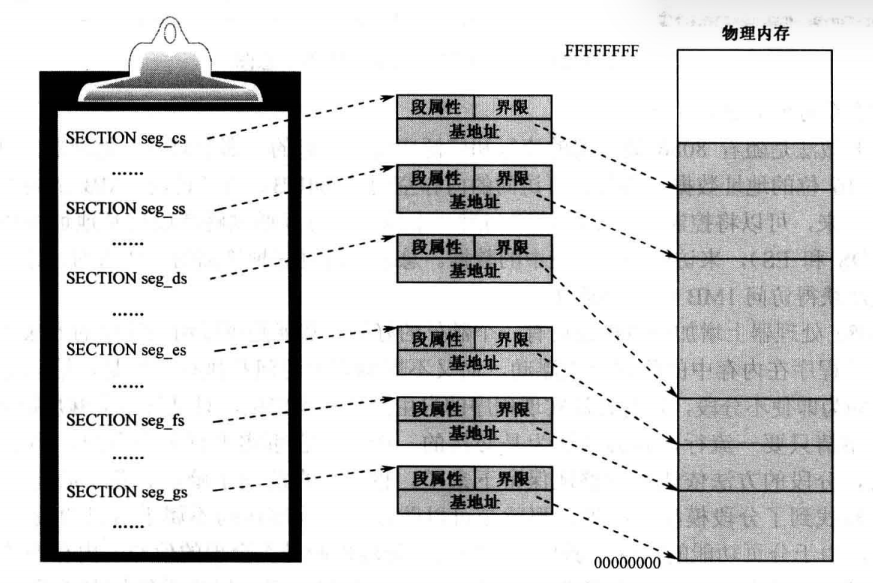
</div>

传统的多段模型 (Multi-Segment Model) 适用于开启了页功能之后的系统环境。如下图所示，首先依然是按程序的结构分段，创建各个段的描述符。因为开启了页功能，线性地址空间上的段要映射到物理内存中的一个或多个页。段是连续的，但它所占用的页不要求是相邻的。并且在开启分页之后，线性地址还要经过页部件转换后，才能得到物理地址。

<div align="center">
    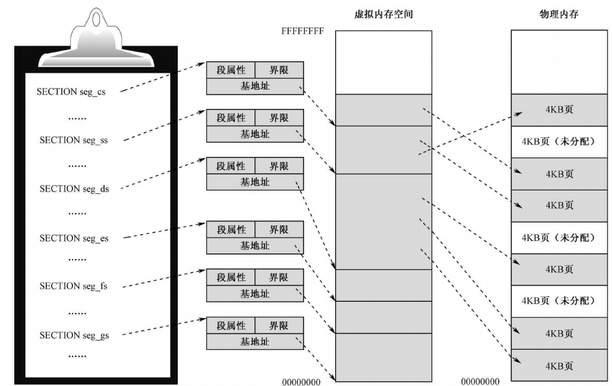
</div>

在 8086 处理器中之所以使用分段机制，是因为处理器（包括其中的寄存器）是 16 位的，可访问的内存空间为 $2^{16}B=64KB$ 的内存，而物理内存总共有 1MB，因此在这种情况下只能分段，使用一个寄存器指明段的基地址，**再使用一个段指明段内的偏移地址（每个段的最大长度为 64KB）**，从而对内存进行访问,使用这种间接的方式获得了访问 1MB 内存空间的能力。

**使用分段机制有一个额外的好处，那就是可以实现程序重定位和在内存空间中的自由浮动**。这是因为逻辑地址由两部分组成，段寄存器指明段基地址，另外一个寄存器指明偏移地址。如果需要将某个段移动到内存中其它位置，只需要修改段寄存器的值即可。当然，分段机制也可以防止一个段访问不属于自己的段。

在 80386 处理器中，地址总线为 32 位，数据总线为 32/64 位，可以直接实现对 4GB 内存空间进行访问。

#### 1.2 平坦模型

> 分段是 Intel 处理器的固有机制，处理器总是按 "段地址+偏移量" 来形成线性地址，不可能绕开这种工作机制。

如下图所示，所谓的平坦模型，就是将全部 4GB 内存整体上作为一个大段来处理，在这种模型下，每个段的描述符都指向 4GB 的段，段的基地址都是 0x00000000，段界限都是 0xFFFFF，粒度为 4KB。

在平坦模式下，程序在编写的时候不分段，即只保留一个段，代码和数据都在这个段内。在这种模式下，**<font color="red">段界限和数据访问的检查仍然进行，但从不会产生违例的情况</font>**。原因很简单，每个段描述符的基地址都是 0，实际使用的段界限都是 0xFFFFFFFF，就任务内的地址空间而言，对任何内存位置的访问都是合法的。

<div align="center">
    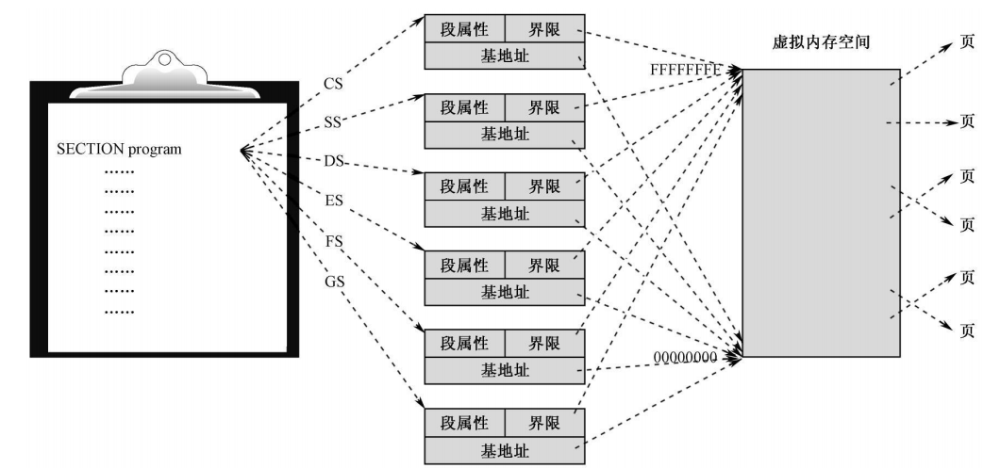
</div>

### 2.分页机制

因为多任务系统通常定义的线性地址空间都要比其含有的物理内存容量大得多，所以需要使用虚拟存储技术，使用这种技术可让编程人员产生内存空间要比计算机中实际物理内存容量大很多的错觉。大容量的线性地址空间需要使用小块的物理内存 (RAM 或 ROM) 以及某些外部存储空间 (如大容量硬盘) 来模拟。

当使用分页时，每个段被划分成页面 (通常每页为 4KB 大小)，页面会被存储于物理内存中或硬盘上。**操作系统通过维护一个页目录和一些页表来记录这些页面**。当程序访问一个线性地址位置时，处理器就会使用页目录和页表把线性地址转换成一个物理地址，**然后在该内存位置上执行所要求的操作 (读或写)**。如果当前被访问的页面不在物理内存中，处理器就会中断程序的执行 (通过产生一个页错误异常)。然后操作系统就可以从硬盘上把该页面读入物理内存中，**并继续执行刚才被中断的程序**。当实现了分页机制时，那么对于程序来说页面在物理内存和硬盘之间的交换就是透明的。

当一个程序加载时，操作系统既在要左边的虚拟内存中分配段空间，又要在右边的物理内存中分配相应的页面。

>4GB 虚拟内存空间不可能用来保存任何数据，因为它是虚拟的，它只是用来指示内存的使用情况。当OS 真正加载一个程序并创建为任务时，OS 在虚拟内存空间寻找空闲的段，映射到空闲的物理页，接着将映射记录填写到页目录和页表中。**<font color="red">然后到真正开始加载程序时，再把原本属于段的数据按页的尺寸拆开，分开写入对应的页中</font>**。

注意了，在页式内存管理中，页面的管理和分配是独立的，和分段以及段地址没有关系。OS 所要做的，就是寻找空闲页面，把它分配给需要的段，并将页的物理地址填写到映射表内。一般来说，每个任务都可以拥有 4GB 的虚拟内存空间；同时，每个任务都有自己的页目录表和页表，如下图所示。

<div align="center">
    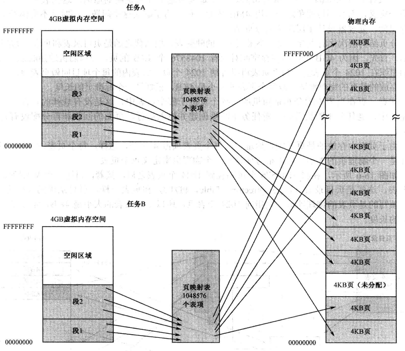
</div>

在 CR3 系统控制寄存器中，保存页目录表的基地址，因此 CR3 也被称为页目录基址寄存器（PDBR），每当任务切换时，CR3 中保存的页目录基址也会发生变化，切换使用新的页目录表，相应地，**<font color="blue">页目录又指向一个个的页表，正是这种 PDT 和 PT 切换机制，使得每个程序都只在自己的地址空间中运行</font>**，如下图所示。当程序撤销后，页目录占用的物理页也会被回收。

<div align="center">
    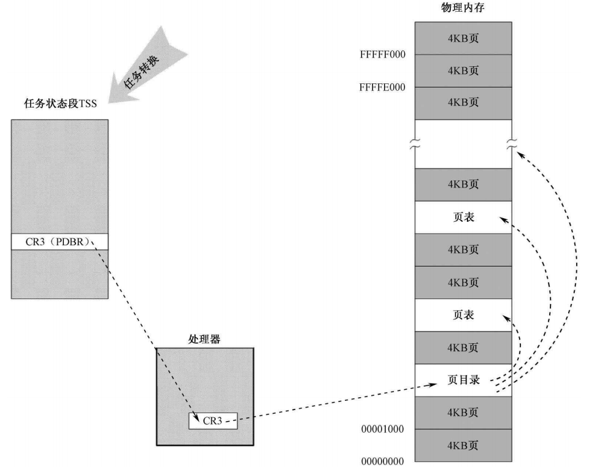
</div>

段变换机制把虚拟地址/逻辑地址变换成线性地址，并且在线性地址空间中访问自己的表，但是并不知晓分页机制把这些线性地址转换到物理地址的过程。类似地，分页机制也不知道程序产生地址的虚拟地址空间。分页机制只是简单地把线性地址转换成物理地址，并且在物理内存中访问自己的转换表。

### 3.保护

8086 支持两类保护。其一是通过给每个任务不同的线性地址空间来完全隔离各个任务，**<font color="red">这是通过给每个任务线性地址到物理地址不同的映射来做到的（每个任务有自己单独的页目录和页表）</font>**。另一个保护机制对任务进行操作，以保护操作系统内存段和处理器特殊系统寄存器不被应用程序访问。

#### 3.1 任务间保护

保护的一个重要方面是提供各任务之间的保护能力。8086 使用的方法是通过把每个任务放置在不同的线性地址空间中，并给予每个任务不同的线性地址到物理地址的映射（即不同的页目录和页表）。每个任务中的地址变换功能被定义成一个任务中的逻辑地址映射到物理内存的一部分区域，而另一个任务中的逻辑地址映射到物理内存中的不同区域中。**这样，因为一个任务不可能映射到其他任务线性地址对应使用的物理内存部分**，所以所有任务都被隔绝开了。

**只需给每个任务各自独立的映射表，每个任务就会有不同的地址变换函数**。在 8086 中，每个任务都有自己的段表和页表。当处理器切换去执行一个新任务时，任务切换的 **<font color="blue">关键部分就是切换到新任务的变换表</font>**。通过在所有任务中安排具有相同的线性到物理地址映射部分，并且把操作系统存储在这个公共的线性地址空间部分，操作系统可以被所有任务共享。这个所有任务都具有的相同线性地址空间部分被称为全局地址空间 (Global Address Space)。

每个任务唯一的线性地址空间部分被称为局部地址空间 (Local Address Space)，含有任务自己私有的数据和代码。由于每个任务中具有不同的局部地址空间，因此两个不同任务中相同的线性地址将转换到不同的物理地址处。**这使得操作系统可以给予每个任务的内存相同的虚拟地址，但仍然能隔绝每个任务**。另一方面，所有任务在全局地址空间中相同的线性地址将被转换到同一个物理地址。

#### 3.2 特权级保护

在一个任务中，定义了 4 个执行特权级 (Privilege Levels)，特权级用数字 0~3 表示，其中 0 具有最高特权级；而 3 则是最低特权级。每个内存段/数据段都与一个特权级相关联，只有具有足够特权级的程序才能访问。我们知道，处理器从 CS 寄存器指定的段中取得和执行指令，**<font color="red">当前特权级 (Current Privilege Level，CPL) 就是当前执行代码段的特权级</font>**。

每当程序企图访问一个段时，当前特权级就会与段的特权级进行比较，以确定是否有访问许可。在给定 CPL 级别上执行的程序允许访问同级别或低级别的数据段，而任何对高特权级数据段的引用都是非法的，并且会引发一个异常来通知操作系统。**每个特权级都有自己的程序栈，以避免使用共享栈带来的保护问题**。当程序从一个特权级切换到另一个特权级上执行时，堆栈段也随之改换到新级别的堆栈中。

## 三、分段机制

通常，每个程序 (或任务) 都使用自己的段描述符表以及自己的段。对程序来说段可以是私有的，或者是程序之间共享的（比如内核提供的公用例程段）。对所有段以及系统上运行程序各自执行环境的访问都由硬件控制。访问检查不仅能够用来保护对段界限以外地址的引用，而且也能用来在某些段中防止执行不允许的操作。例如，因为代码段被设计成只读，因此硬件会防止对代码段执行写操作。段中的访问权限信息也可以用来设置保护环或级别，保护级别可用于保护操作系统程序不受应用程序非法访问。

### 1.段的定义

保护模式 8086 提供了 4GB 物理地址空间，这是处理器在其地址总线上可以寻址的地址空间。这个地址空间是平坦的，地址范围从 0 到 0xFFFFFFFF。分段机制就是把虚拟地址空间中的虚拟内存组织成一些长度可变的称为段的内存块单元。80386 虚拟地址空间中的虚拟地址/逻辑地址由一个段部分和一个偏移部分构成，段是虚拟地址到线性地址转换机制的基础。每个段由以下几个参数定义:

- 段基地址(Base Address)：指定段在线性地址空间中的开始地址，**基地址是线性地址，对应于段中偏移 0 处**；
- 段限长(Limit)：它定义了段的长度；
- 段属性(Attributes)：指定段的特性。例如该段是否可读、可写或可作为一个程序执行，段的特权级等；

段限长定义了在虚拟地址空间中段的大小，**段基址和段限长定义了段所映射的线性地址范围或区域**。**段内 0 到 limit 的地址范围对应线性地址中范围 Base 到 Base+Limit**。另外，若访问一个段并没有得到段属性许可则也会导致异常。例如，如果你试图写一个只读的段，那么 80386 就会产生一个异常。另外，多个段映射到线性地址中的范围可以部分重叠或覆盖，甚至完全重叠。

<div align="center">
    
</div>

段的基地址、段限长以及段的保护属性存储在一个称为段描述符的结构项中。在逻辑地址到线性地址的转换映射过程中会使用这个段描述符。段描述符保存在内存中的段描述符表中。段描述符表是包含段描述符项的一个简单数组。前面介绍的段选择符即用于通过指定表中一个段描述符的位置来指定相应的段。逻辑地址由 16 位的段选择符和 32 位的偏移量组成，如下图所示。**<font color="red">段选择符指定字节所在的段，而偏移量指定该字节在段中相对于段基地址的位置</font>**。处理器会把每个逻辑地址转换成线性地址。**线性地址是处理器线性地址空间中的 32 位地址。与物理地址空间类似，线性地址空间也是平坦的 4GB 地址空间**，地址范围从 0 到 0xFFFFFFFF。线性地址空间中含有为系统定义的所有段和系统表。

<div align="center">
    
</div>

为了把逻辑地址转换成一个线性地址,处理器会执行以下操作：

1. 使用段选择符中的偏移值 (段索引) 在 GDT 或 LDT 表中定位相应的段描述符 (**仅当一个新的段选择符加载到段寄存器中时才需要这一步**，否则可以使用段描述符高速缓存)；
2. 利用段描述符检验段的访问权限和范围，以确保该段是可访问的并且偏移量位于段界限内；
3. 把段描述符中取得的段基地址加到偏移量上，最后形成一个线性地址；

如果没有开启分页，**那么处理器直接把线性地址映射到物理地址**，即线性地址被送到处理器地址总线上。如果对线性地址空间进行了分页处理，那么就会使用二级地址转换把线性地址转换成物理地址。

### 2.段描述符表

段描述符表是段描述符的一个数组，如下图所示。描述符表的长度可变，最多可以包含 8192 个 8 字节描述符。有两种描述符表：全局描述符表 GDT(Global Descriptor Table) 和局部描述符表 LDT (Local Descriptor Table)。

<div align="center">
    
</div>

描述符表结构应该保存在仅由操作系统软件访问的受保护的内存区域中，以防止应用程序修改其中的地址转换信息。虚拟地址空间被分割成大小相等的两半。**<font color="red">一半由 GDT 来映射变换到线性地址（全局空间），另一半则由 LDT 来映射（局部空间）</font>**。

当发生任务切换时，**LDT 会更换成新任务的 LDT**，但是 GDT 并不会改变。因此，**GDT 所映射的一半虚拟地址空间是系统中所有任务共有的**，但是 LDT 所映射的另一半则在任务切换时被改变。系统中所有任务共享的段由 GDT 来映射。这样的段通常包括含有操作系统的段以及所有任务各自的 LDT 段描述符（LDT 段描述符安装在 GDT 中）。但是 LDT 表本身以及其中的任务各个段的信息位于任务自己的局部虚拟地址空间中，具体如下所示：

<div align="center">
    
</div>

上图表明一个任务中的段如何能在 GDT 和 LDT 之间分开。图中共有 6 个段，分别用于两个应用程序 (A 和 B) 以及操作系统。应用程序 A 拥有 LDTA，用来映射段 CodeA 和 DataA。类似地，应用程序 B 使用 LDTB 来映射 CodeB 和 DataB 段。包含操作系统内核的两个段 Codeos 和 Dataos 使用 GDT 来映射，这样它们可以被两个任务所共享。两个 LDT 段（LDTA 和 LDTB）也使用 GDT 来映射，从图中可以看出，LDTA 和 LDTB 的段描述符安装在 GDT 中。

任务切换时，**<font color="red">每个任务使用不同的 LDT（任务切换伴随着 LDTR 的切换，最终导致使用不同的 LDT）和相同的 GDT，因此每个任务的虚拟地址空间被恰当的组织从而相互隔离</font>**。当任务 A 在运行时，任务 B 的私有段不是虚拟地址空间的部分（LDTR 的切换导致 A 没有方法访问 B 的私有段），因此任务 A 没有办法访问任务 B 的内存。对 B 也是同理。

>GDT 本身并不是一个段，而是线性地址空间中的一个数据结构。$\scriptsize\bold{{GDT 限长=总字节数-1=8n-1}}$，其中 n 为 GDT 中段描述符的个数。

处理器并不使用 GDT 中的第 1 个描述符。把这个"空描述符"的段选择符加载进一个**数据段寄存器 (DS、ES、FS 或 GS)** 并不会产生一个异常，但是若使用这些加载了空描述符的段选择符访问内存时就肯定会产生一般保护性异常。通过使用这个段选择符初始化段寄存器，那么意外引用未使用的段寄存器肯定会产生一个异常。**但是当把空选择符加载到 CS 和 SS 段寄存器中时将会导致一个异常**。

### 3.段选择符

段选择符 (或称段选择子) 是段的一个 16 位标识符，如下图所示。段选择符并不直接指向段，而是指向段描述符表中定义段的段描述符。段选择符的 3 个字段分别是:

- 请求特权级 RPL(Requested Privilege Level)
- 表指示标志 TI(Table Index)
- 索引值 (Index)

<div align="center">
    
</div>

请求特权级字段 RPL 提供了段保护信息。**表索引字段 TI 用来指出包含指定段描述符的段描述符表 GDT 或 LDT**。TI=0 表示描述符在 GDT 中；TI=1 表示描述符在 LDT 中。索引字段给出了描述符在 GDT 或 LDT 表中的索引项号。可见，选择符通过定位段表中的一个描述符来指定一个段。

对应用程序来说段选择符是作为指针变量的一部分而可见，**但选择符的值通常是由链接编辑器或链接加载程序进行设置或修改，而非应用程序**。段寄存器的结构如下所示：

<div align="center">
    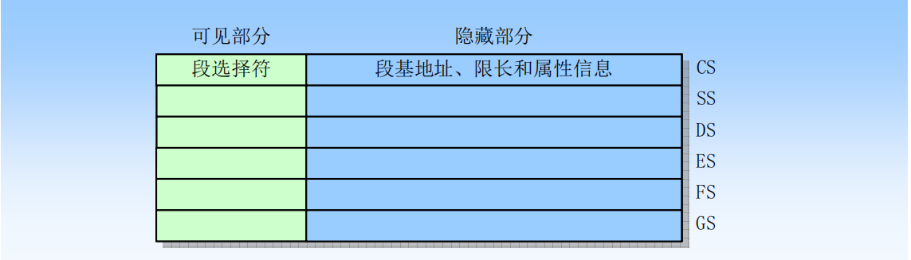
</div>

另外，为了避免每次访问内存时都去引用描述符表，每个段寄存器都有一个"可见"部分和一个"隐藏"部分。当一个段选择符被加载到一个段寄存器可见部分中时，处理器也同时把段选择符指向的段描述符中的段地址、段限长以及访问控制信息加载到段寄存器的隐藏部分中，起到一个缓存作用，下次寄存器 (可见和隐藏部分) 中的信息使得处理器可以在进行地址转换时不再需要花费时间从段描述符中读取基地址和限长值。

由于影子寄存器含有描述符信息的一个副本，因此操作系统必须确保对描述符表的改动反映在影子寄存器中。处理这种问题最简捷的方法是在对描述符表中的描述符作过任何改动之后就立刻重新加载 6 个段寄存器。或者说：**_<font color="red">In systems in which multiple processors have access to the same descriptor tables, it is the responsibility of software to reload the segment registers when the descriptor tables are modified.</font>_** 。这将把描述符表中的相应段信息重新加载到影子寄存器中。为加载段寄存器，80386 提供了两类指令：

**1.显示加载指令**

像 MOV、POP、LDS、LES、LSS、LGS 以及 LFS，这些指令显式地直接引用段寄存器。lds、les、lss、lgs 和 lfs 是一类指令，同时给一个段寄存器和一个 16 位通用寄存器同时赋值。其中 lds 同时给 ds 段寄存器和一个16位同样寄存器赋值。比如指令：**`lds reg16, mem32`**，那么，**reg16（比如 ax、bx 等）会获取到 **`[mem32]`** 内存地址处低字（低 2 个字节），而 ds 会获取到 **`[mem32]`** 内存地址处的高字（高 2 个字节）**。les、lss、lgs 和 lfs 指令同理。

```armasm{.line-numbers}
;地址 100h  101h  102h  103h
;内容  00h   41h   02h   03h
LDS AX，[100h]
;结果为 AX=4100h    DS=0302h
```

**2.隐式加载指令**

例如使用长指针的 call、jmp 和 ret 指令、iret、INTn、INTO 和 INT3 等指令。这些指令在操作过程中会附带改变 cs 寄存器 (和某些其他段寄存器) 的内容。

into 指令是用于检查溢出标志（OF）并检测溢出的指令。当 OF 标志被设置为 1（表示有溢出发生），执行 into 指令会引发中断（触发中断 4，INT 4），引发一个溢出异常处理程序；否则，into 的效果就是简单的让程序继续执行。而由于 int n、into 和 int3 这类指令会将程序控制权跳转到中断服务程序，**因此会将新的代码段描述符和程序偏移量加载到 cs 和 eip 寄存器中，从而实现段描述符缓存的更新**。

iret 和 ret 指令分别用于从中断服务程序和子程序返回，**在返回的时候都会从栈中弹出之前保存的 CPU 状态到 cs 和 eip 寄存器**。所以也会隐式加载和更新段寄存器 cs 的内容。

call 用于调用子程序，对于远过程调用，会修改 cs 和 ip 寄存器的值；jmp 指令用于直接跳转，对于远跳转，也会同时修改 cs 和 ip 寄存器的值。以上两条指令都会隐式修改 cs 段寄存器的值。

### 4.段描述符

**段描述符是 GDT 和 LDT 表中的一个数据结构项**，用于向处理器提供有关一个段的位置和大小信息以及访问控制的状态信息。主要含有 3 个主要字段：段基地址、段限长和段属性。段描述符通常由编译器、链接器、加载器或者操作系统来创建，用户程序通常是无法建立和修改 GDT。下图给出了所有类型段描述符的一般格式。

<div align="center">
    <div align="center" style="color: #000; font-size:13px; font-weight:bold">段描述符通用格式</div>
    
</div>

下面是数据段、代码段和系统段描述符的格式：

<div align="center">
    <div align="center" style="color: #000; font-size:13px; font-weight:bold">数据段描述符格式</div>
    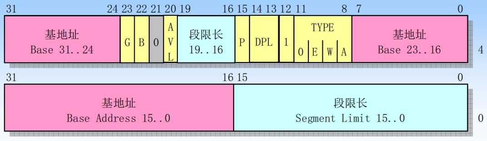
</div>

<div align="center">
    <div align="center" style="color: #000; font-size:13px; font-weight:bold">代码段描述符格式</div>
    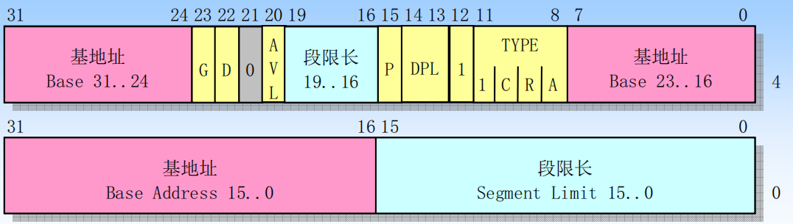
</div>

<div align="center">
    <div align="center" style="color: #000; font-size:13px; font-weight:bold">系统段描述符格式</div>
    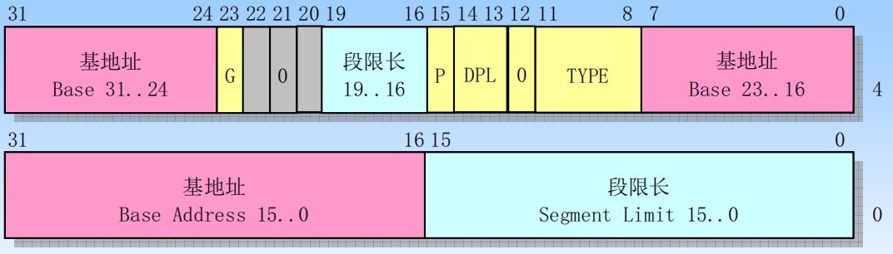
</div>

**1) 段基址**

段基地址可以是 0~4GB 范围内的任意地址，不过，还是建议应当选取那些 16 字节对齐的地址。

**2) 段界限**

20 位的段界限用来限制段的扩展范围，因为访问内存的方法是用段基地址加上偏移量，**所以对于向上扩展的段，如代码段和数据段来说，偏移量是从 0 开始递增，段界限决定了偏移量的最大值**；对于向下扩展的段，如栈段来说，**段界限决定了偏移量的最小值**。

**3) G 字段**

G 位是粒度 (Granularity) 位，用于解释段界限的含义。**<font color="red">当 G 位是 "0" 时，段界限以字节为单位</font>**。此时，段的扩展范围是从 1 字节到 1 兆字节 (1B~1MB)，因为描述符中的界限值是 20 位的。相反，**<font color="red">如果该位是 1，那么，段界限是以 4KB 为单位的</font>**。这样，段的扩展范围是从 4KB 到 4GB。

**4) S 字段**

S 位用于指定描述符的类型 (Descriptor Type)。当该位是 0 时，表示是一个系统段；为 1 时，表示是一个代码段或者数据段(栈段也是特殊的数据段)。

**5) DPL 字段**

DPL 表示描述符的特权级 (Descriptor Privilege Level,DPL)。这两位用于指定段的特权级。共有 4 种处理器支持的特权级别，分别是 0、1、2、3，其中 0 是最高特权级别，3 是最低特权级别。**刚进入保护模式时执行的代码具有最高特权级 0 (可以看成是从处理器那里继承来的)，这些代码通常都是操作系统代码，因此它的特权级别最高**。每当操作系统加载一个用户程序时，它通常都会指定一个稍低的特权级，比如 3 特权级。有些处理器指令(特权指令)只能由 0 特权级的程序来执行。

**6) P 字段**

P 是段存在位 (Segment Present)。**P 位用于指示描述符所对应的段在内存中是否存在**。一般来说，描述符所指示的段都位于内存中。但是当内存空间紧张时，有可能只是建立了描述符，而其对应的内存空间（数据段和代码段）并不存在，这时，就应当把描述符的 P 位置 0。另外，同样是在内存空间紧张的情况下，会把很少用到的段换出到硬盘中（段描述符不在内存中），这时同样要把段描述符的 P 位清零。当再次轮到它执行时，再装入内存，然后将 P 位置 1。

>当一个段描述符的 P 标志为 0 时，那么把指向这个段描述符的选择符加载进段寄存器将导致产生一个段不存在异常。

**7) D/B 字段**

D/B 位是默认的操作数大小 (Default Operation Size) 或者默认的栈指针大小 (Default Stack Pointer Size)。设立该标志位，主要是为了能够在 32 位处理器上兼容运行 16 位保护模式的程序。

对于代码段，此位称做 D 位，用于指示指令中默认的**偏移地址和操作数尺寸**。D=0 表示指令中的偏移地址或者操作数是 16 位的，处理器执行时使用 16 位的指令指针寄存器 IP 来取指令；D=1 指示 32 位的偏移地址或者操作数，处理器使用 32 位的 EIP 寄存器来取指令。指令前缀 0x66 可以用来选择非默认值的操作数大小。

对于栈段来说，该位被叫做 B 位，**用于在进行隐式的栈操作（push、pop 或者 call）时，指定使用 sp 还是 esp 寄存器**。隐式的栈操作指令包括 push、pop 和 call 等。如果该位是 0，在访问那个段时，使用 sp 寄存器，否则就是使用 esp 寄存器。同时，B 位的值也决定了栈的上部边界。如果 B=0，**<font color="red">那么栈段的上部边界 (也就是 SP 寄存器的最大值) 为 0xFFFF；如果 B=1，那么栈段的上部边界 (也就是 ESP 寄存器的最大值) 为 0xFFFFFFFF</font>**。

**8) L 字段**

L 位是 64 位代码段标志 (64-bit Code Segment)，保留此位给 64 位处理器使用。

**9) TYPE 字段**

TYPE 字段共 4 位，用于指示描述符的类别。如下表所示，对于数据段来说，这 4 位分别是 X、E、W、A 位；而对于代码段来说，这 4 位则分别是 X、C、R、A 位。

<div align="center">
    
</div>

X 表示是否可以执行 (eXecutable)，数据段总是不可执行的，X=0；代码段总是可以执行的，因此 X=1。

对于数据段来说，E 位指示段的扩展方向。**E=0 是向上扩展的，也就是向高地址方向扩展的，是普通的数据段；E=1 是向下扩展的，也就是向低地址方向扩展的，通常是栈段**。W 位指示段的读写属性，W=0 的段是不允许写入的，否则会引发处理器异常中断；W=1 的段是可以正常写入的。

对于代码段来说，C 位指示段是否为特权级依从的 (Conforming)。C=0 表示非依从的代码段，这样的代码段可以从与它特权级相同的代码段调用，或者通过门调用访问更高特权级的代码段；C=1 表示允许从低特权级的程序转移到该段执行，并且执行时保持调用者的特权级，而不需要转移到代码段自身的特权级。

R 位指示代码段是否允许读出。代码段总是可以执行的，但是，为了防止程序被破坏，它是不能写入的。至于是否有读出的可能由 R 位指定。R=0 表示不能读出，如果企图去读一个 R=0 的代码段，会引发处理器异常中断；如果 R=1，则代码段是可以读出的

>**这里的 R 属性并非用来限制处理器，而是用来限制其它程序和指令的行为**。一个典型的例子是使用段超越前缀 "CS:" 来访问代码段中的内容，或者将代码段选择符加载进一个数据段寄存器（ds、es、fs、gs），我们可以读取代码段中的数据。

数据段和代码段的 A 位是已访问 (Accessed) 位，**用于指示它所指向的段最近是否被访问过**。在描述符创建的时候应该清零。之后，每当该段被访问时，处理器自动将该位置 1。对该位的清零是由软件 (操作系统) 负责的，**通过定期监视该位的状态，就可以统计出该段的使用频率**。当内存空间紧张时，可以把不经常使用的段退避到硬盘上，从而实现虚拟内存管理。

堆栈段必须是可读/写的数据段，若使用指向不可写的数据段的选择符加载到 ss 寄存器中，将会导致一个一般保护异常（#GP），**如果堆栈段的长度需要动态地改变，那么堆栈段可以是一个向下扩展的数据段 (扩展方向标志置位)**。这里，动态改变段限长将导致栈空间被添加到栈底部。

### 5.系统段描述符类型

当段描述符中的 S 标志 (描述符类型) 是复位状态 (0) 的话，那么该描述符是一个系统描述符。处理器能够识别以类型的系统段描述符:

- 局部描述符表 (LDT) 的段描述符；
- 任务状态段 (TSS) 描述符；
- 调用门描述符；
- 中断门描述符；
- 陷阱门描述符；
- 任务门描述符；

这些描述符类型可分为两大类：系统段描述符和门描述符。**系统段描述符指向系统段 (前两个，如 LDT 和 TSS 段)，门描述符就是一个门，对于调用、中断或陷阱门，其中含有代码段的选择符和段中程序入口点的指针；对于任务门，其中含有 TSS 的段选择符**。

## 四、地址变换时的保护

### 1.栈操作时的保护

You may be used to thinking in terms of Expand Up data segments only because they are the default type for both code and data segments. In fact, there isn't even a corresponding concept to Expand Down for code segments. As you are already aware, for code and Expand Up data segments, **<font color="red">_the base address is the linear address, and the limit is the length minus one_</font>**.

Expand Down segments, in a sense, switch those and many other concepts you have always taken for granted. For example, were you to toggle the Expand Down bit in a Descriptor Table Entry (DTE), and leave the Base Address and Limit the same, then all offsets which were valid before, become invalid and vice versa.

<div align="center">
    <div align="center" style="color: #000; font-size:13px; font-weight:bold">相同区域向上扩展和向下扩展段描述符属性计算表格</div>
    
</div>

The following table points out some of the differences between the two types of segments where **<font color="red">_the same area of memory is mapped as an Expand Up and Expand Down segment for a given Linear Address (LA) and Segment Length (Length)_</font>**.

Sometimes the arithmetic is dependent upon the B (Big) bit in the DTE. This bit controls several aspects of how the CPU interprets the Base, Limit, and Valid Offsets of a selector. As you can see from the table above, the B bit has a huge effect on how Expand Down segments are described and no effect on Expand Up segments. **Because the arithmetic is done modulo either 64KB (for B=0) or 4GB (for B=1), we define the Modulus to be 64KB for B=0, and 4GB for B=1**.

The two GDT/LDT rows indicate how to set the corresponding entries in those tables. The rows labeled Smallest and Largest Offsets indicate what indices can be used to address data within the segment.

Thus, if two DTEs were setup as per the GDT/LDT rows in the above table, **the same area of memory would be addressed（寻址）**. The only difference would be in the offsets used to reference the memory. Using the Expand Up selector, the first byte would be addressed as offset zero; using the Expand Down selector, it would be addressed as offset Modulus - Length.

下面举例详细说明上述计算方式，栈段一般是使用向下扩展的内存段，段界限的检查和向上扩展的数据段和代码段不同。当然，栈也可以使用向上扩展的段，即，把数据段用做栈段。在这种情况下，对段界限的检查按数据段的规则进行。但是无论如何，**栈本身始终总是向下增长的，即向低地址方向推进。段的扩展方向用于处理器的界限检查，而对栈的性质以及在栈上进行的操作没有关系**。

现在只讨论 32 位的栈段，即其描述符 B 位是 1 的栈段。处理器在这样的段上执行压栈和出栈操作时，**默认使用 ESP 寄存器（最大值为 0xFFFFFFFF）**。在栈段中，实际使用的段界限也和粒度 (G) 位相关，如果 G=0，实际使用的段界限就是描述符中记载的段界限；如果 G=1，则实际使用的段界限为：

```armasm{.line-numbers}
(描述符中的段界限 + 1) * 0x1000 - 1 = 描述符中的段界限 * 0x1000 + 0xFFF
```

现在定义一个堆栈段，其最低有效地址为 0x00006C00，最高有效地址为 0x00007BFF。可以采用之前计算表格中的公式。如果是向上扩展的栈段（E=0），那么其段描述符的属性如下所示：

```armasm{.line-numbers}
Base=0x6c00
Limit=0x1000-1=0xFFF
Smallest Offset=0
Largest Offset=0x1000-1=0xFFF
Initial ESP=0x1000
```

对于此栈段，其 esp 初始化为 limit+1，在进行栈操作时必须满足以下原则：

```armasm{.line-numbers}
0（Smallest Offset）<= esp - 操作数的长度 <= 0xFFF（Largest Offset）
;栈指针寄存器 ESP 只在访问栈时提供偏移地址，操作数在压入栈时的物理地址要用段基址 base 和 esp 的内容相加得到
0x6C00 <= esp - 操作数的长度 + Base <= 0x7BFF
```

如果是向下扩展的栈段（E=1），则此栈段的 Modulus=4GB=0x10000 0000，那么其段描述符的属性如下所示，在实际创建一个地址范围为 0x6C00~0x7BFF 的向下扩展的栈时，可以将下面计算出来的 base 和 limit 属性填写到栈段的描述符属性中。

```armasm{.line-numbers}
Base=0x6c00+0x1000-0x10000 0000=0x7c00
;Limit=0x10000 0000-1-0x1000=0xFFFF EFFF
;根据前面 G=1 时计算段的实际界限的公式，反推描述符中的段界限为：
Limit=(0xFFFF EFFF-0xFFF) / 0x1000=0xFFFFE
Smallest Offset=0x1000 00000-0x1000=0xFFFF F000
Largest Offset=0x10000 0000-1=0xFFFF FFFF
Initial ESP=0
```

对于此栈段，其 esp 初始化为 0，在进行栈操作时必须满足以下原则：

```armasm{.line-numbers}
0xFFFF F000（Smallest Offset）<= esp - 操作数的长度 <= 0xFFFF FFFF（Largest Offset）
;栈指针寄存器 ESP 只在访问栈时提供偏移地址，操作数在压入栈时的物理地址要用段基址 base 和 esp 的内容相加得到
0x6C00 <= esp - 操作数的长度 + Base <= 0x7BFF
```

向上扩展的栈段和向下扩展的栈段描述符的属性差异如下图所示，这两者的区别为：**_<font color="red">basically, the difference between expand-up and expand-down, is whether the base is the top or bottom of the segment</font>_**，向下扩展的栈，base 指向栈段的最低端，而向上扩展的栈，base 指向其最高端。根据 OSDev wiki，The Expand Down flag for a 32-bit Segment makes the Base actually the **_top_** of the accessed memory, and the **`Limit+Base+1`** becomes the lowest possible offset you can access below that.This is slightly incorrect since the CPU is still adding the offset to the Base - but since the offset is so large it's effectively negative, resulting in a smaller final address.

<div align="center">
    
</div>

对于向上扩展的栈比较好理解，esp 初始值为 0x1000，其变化范围为 **`0~0xFFF`**，从栈段的最高端向下扩展。对于向下扩展的栈，esp 的初始值为 0，其变化范围为 **`0xFFFF F000~0xFFFF FFFF`**，**此时 esp 的值可以看成是负数**，和 base 相加的结果（base 指向栈段的最高端）变相减小了 base 的值，使得 base+esp 的值不断向低地址端移动。base+limit 可以看成 base 不断向上移动（不断变大），由于 limit 的值为 Modulus-1-Length，所以 base 增大到 Modulus 之后会进行绕回到最低端地址 0，然后不断再向高地址方向增加（移动）。

下面再讨论《任务和特权级保护》中的一个例子，以其中创建 0 特权级栈的代码为例，每个特权级栈的大小为 4KB，并且均为向下扩展的栈。对于此种类型的栈如前所述，段描述符的 base 属性指向栈段的高端，因此在通过 **`allocate_memory`** 得到分配内存的基地址（最低地址）后需加上 4096，最后回写到段描述符中，这里假设为 0x8800。

又因为栈段的大小位 4KB，因此实际使用的段界限为 **`0x10000 0000-1-0x1000=0xFFFF EFFF`**，填写到段描述符中的界限为 **`0xFFFFE`**。esp 的最低和最大偏移量分别为 **`0xFFFF F000`** 和 **`0xFFFF FFFF`**，这里 esp 同样可以看成为负数，和 base 相加得到低端有效物理地址（0x7800）和高端有效物理地址（0x87FF）之间的差为 0x1000，即 4KB。最后登记 esp 的初始值（0）到 TCB 中保存。

```armasm{.line-numbers}
;🫕创建 0-2 特权级堆栈，每个特权级堆栈的大小为 4KB🫕
;创建 0 特权级堆栈
mov ecx,4096
;为生成堆栈高端地址做准备
mov eax,ecx

mov [es:esi+0x1a],ecx
;登记 0 特权级堆栈尺寸到 TCB，由于尺寸是以 4KB 为单位，所以需要将先前保存的尺寸大小逻辑右移 12 位，除以 4096
shr dword [es:esi+0x1a],12
call sys_routine_seg_sel:allocate_memory
;堆栈必须使用高端地址为基地址
add eax,ecx
;登记 0 特权级堆栈基地址到 TCB
mov [es:esi+0x1e],eax
;0 特权级堆栈段界限
mov ebx,0xffffe
;4KB 粒度，读写堆栈段，DPL 特权级 0，向下扩展
mov ecx,0x00c09600
call sys_routine_seg_sel:make_seg_descriptor
mov ebx,esi
;安装生成的 0 特权级堆栈描述符到 LDT 中
call fill_descriptor_in_ldt
;设置选择子的 RPL 特权级为 0，由于上面过程返回的选择子 RPL 本身为 0，因此下面这条指令是作为注释存在的
;or cx,0000_0000_0000_0000
;登记 0 特权级堆栈选择子到 TCB
mov [es:esi+0x22],cx
;登记 0 特权级堆栈初始 ESP 到 TCB
mov dword [es:esi+0x24],0
```

至于引入向下扩展的栈段的目的，即：With normal segments limit controls what the highest valid address in the segment is, but with the expansion-direction flag set（set to 1）it determines the **lower valid address**. The base address becomes the **upper limit of the physical memory** you can access through the segment instead of the lower limit.**<font color="red">This means that lowering the limit will increase the space in an expand-down segment, adding extra addressable memory to the bottom of the segment</font>**. 在段描述符中的段界限 limit 值减小后，base+limit 的值相较于之前更靠近低地址处，从而使得最低有效物理地址和最高有效物理地之间的地址范围扩大，变相为栈段分配了内存空间。

根据默认栈指针大小标志 B 的设置，偏移值范围可从段限长 Limit 到 0xFFFFFFFF 或 0xFFFF。而小于段限长 Limit 的偏移值将产生一般保护性异常。对于下扩段，减小段限长字段中的值会在该段地址空间底部分配新的内存，而不是在顶部分配。8086 的栈总是向下扩展的，因此这种实现方式很适合扩展堆栈段。

### 2.代码段执行时的保护

在 32 位模式下，一旦相应的描述符被加载到段寄存器的描述符高速缓存器，则**处理器取指令和执行指令时，将不再访问描述符表，而是直接使用描述符高速缓存器**，从中取得线性基地址，同指令指针寄存器 EIP 的内容相加，共同形成 32 位的物理地址从内存中取得下一条指令。不过，在指令实际开始执行之前，处理器必须检验其存放地址的有效性，以防止执行超出允许范围之外的指令。

每个代码段实际使用的段界限，其数值和粒度 (G) 位有关，如果 G=0，实际使用的段界限就是描述符中记载的段界限；如果 G=1，则实际使用的段界限为：

```armasm{.line-numbers}
(描述符中的段界限 + 1) * 0x1000 - 1 = 描述符中的段界限 * 0x1000 + 0xFFF
```

代码段是向上（高地址方向）扩展的，因此，实际使用的段界限就是当前段内最后一个允许访问的偏移地址，当处理器在该段内取指令执行时，偏移地址由 eip 提供。因此，**要执行的那条指令，其长度减 1 后，与 EIP 寄存器的值相加，结果必须小于等于实际使用的段界限**，否则引发处理器异常即:

```armasm{.line-numbers}
0 <=（EIP + 指令长度 - 1）<= 实际使用的
```

### 3.数据访问时的保护

这里所说的数据段，特指向上扩展的数据段。因为是向上扩展的，所以代码段的检查规则同样适用于数据段。不同之处仅仅在于，对于取指令来说，是否越界取决于指令的长度；**而对于数据段来说，则取决于操作数的尺寸**。考虑以下指令：

```armasm{.line-numbers}
;将 edx 寄存器的值（操作数大小为 4）写入到内存单元的有效地址（EA）0x2000 处
mov [0x2000], edx
```

因此，当处理器访问数据段时，要依据以下规则进行检查：

```armasm{.line-numbers}
0 <= (EA + 操作数大小 - 1) <= 实际使用效果
```

在任何时候，段界限之外的访问企图都会被阻止，并引发处理器异常中断。在 32 位处理器上，尽管段界限的检查总在进行着，但如果段界限具有最大值（描述符段界限为 0xFFFFF，粒度为 4KB，实际使用的段界限为 0xFFFF FFFF），则对任何内存地址的访问都将不会违例。

## 五、分页机制

### 1.分页机制介绍

分页机制是 8086 内存管理机制的第二部分。分段机制把逻辑地址（16 位段选择符和 32 位偏移量）转换成线性地址，而分页则把线性地址转换成物理地址。分页可以用于任何一种分段模型（**平坦模型或者多段模型**）。处理器分页机制会把线性地址空间 (段已映射到其中) 划分成页面，**<font color="red">然后这些线性地址空间页面被映射到物理地址空间的页面上</font>**。

我们通过设置控制寄存器 CR0 的 PG 位可以启用分页机制（PG=1 启用分页；PG=0，则禁用分页）。前面介绍的分段机制在各种可变长度的内存区域上操作。而分页机制对固定大小的内存块 (称为页面) 进行操作。分页机制把线性和物理地址空间都划分成页面，线性地址空间中的任何页面都可以被映射到物理地址空间中的任何页面。

8086 使用 4K(22) 字节固定大小的页面。每个页面均是 4KB，并且对齐于 4K 地址边界处。这表示分页机制把 $2^{32}B$ (4GB) 的线性地址空间划分成 $2^{20}$ 个页面。由于 4KB 大小的页面对齐于 4K 边界，**因此线性地址的低 12 位可作为页内偏移量直接作为物理地址的低 12 位**。**<font color="red">分页机制执行的重定位功能可看做把线性地址的高 20 位转换到对应物理地址的高 20 位</font>**。

另外，线性到物理地址的转换功能允许一个线性地址被标注为无效的，这种情况下不会产生一个物理地址。在两种情况下一个页面可以被标注为无效的：

1. 操作系统不支持的线性地址，即该线性地址没有在页目录和页表中登记，无法将其转换成对应的物理地址；
2. 对应在虚拟内存系统中的页面在磁盘上而非在物理内存中。此时，操作系统必须将对应页面从磁盘上加载到物理内存中以供程序访问；

因为无效页面通常与虚拟存储系统相关，因此它们被称为不存在的页面，并且由页表中称为存在 (present) 属性来确定。

>如果仅使用分段地址转换，那么存储在物理内存中的一个数据结构将包含其所有的部分。但如果使用了分页，**那么一个数据结构就可以一部分存储于物理内存中，而另一部分保存在磁盘中**。

为了减少地址转换所要求的总线周期数量，最近访问的页目录和页表会被存放在处理器的缓冲器件中。该缓冲器件被称为转换查找缓冲区 (Translation Lookaside Buffer,TLB)。只有当 TLB 中不包含要求的页表项时才会使用额外的总线周期从内存中读取页表项，通常在一个页表项很长时间没有访问过时才会出现这种情况。

### 2.页表结构

#### 2.1 一级页表

**页表（Page Table）可看做简单的 $2^{20}$ 个物理地址数组（4GB 物理内存由 $2^{20}$ 个 4KB 页面组成）**。线性地址的高 20 位构成这个数组的索引值，用于选择对应页面的物理(基)地址。线性地址的低 12 位给出了页面中的偏移量，加上页面的基地址最终形成对应的物理地址。由于页面基地址对齐在 4K 边界上，因此页面基地址的低 12 位肯定是 0。这意味着高 20 位的页面基地址和 12 位偏移量连接组合在一起就能得到对应的物理地址。页表中每个页表项的大小为 32 位，只需要其中的 20 位来存放页面的物理基地址。

有人可能会觉得，可以先划分一小块内存给它，然后再根据需要动态扩展。但是因为内核需要单独占用高端 2GB 线性地址空间，用户程序自己占用低端 2GB 线性地址空间，所以这张表的前半部分和后半部分需要同时用到，所以在最开始的时候必须定义全表。

#### 2.2 二级页表

页表含有 $2^{20}$ (1MB) 个表项，而每个页表项占用 4B。如果作为一个表（只使用一级页表结构）来存放的话，它们最多将占用 4MB 的内存。因此为了减少内存占用量，8086 使用了两级表。由此高 20 位线性地址到物理地址的转换也被分成两步来进行，每步使用 (转换) 其中的 10bit。

第一级表称为页目录表 (page directory table，PDT)。**它的长度为 4096 字节（4KB）**，**<font color="red">具有 $2^{10}=1024$ 个 4B 长度的表项</font>**，保存 1024 个页表的【物理地址】。这些表项指向对应的二级表。线性地址的最高 10 位(位 31~22) 用作一级表（页目录）中的索引值来选择 $2^{10}$ 个二级表之一。

第二级表称为页表 (page table)，**它的长度为 4096 字节（4KB）**，**<font color="red">最多含有 $2^{10}=1024$ 个 4B 的表项</font>**，保存 1024 个物理页的基地址（【物理地址】）。每个 4B 表项含有相关页面的 20 位物理基地址。二级页表使用线性地址中间 10 位 (位 21~12) 作为表项索引值。该 20 位页面物理基地址和线性地址中的低 12 位 (页内偏移) 组合在一起就得到了最终物理地址。

<div align="center">
    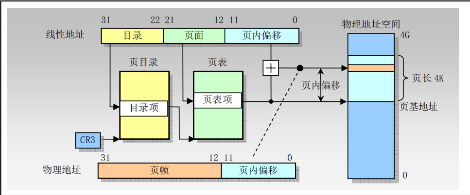
</div>

处理器的页部件首先将段部件送来的 32 位线性地址截成 3 段，分别是高 10 位、中间的 10 位和低 12 位。**<font color="blue">高 10 位是页目录的索引，中间 10 位是页表的索引，低 12 位则作为页内偏移来用</font>**。

CR3（页目录基址寄存器，PDBR）指向页目录的基地址，线性地址高 10 位（0000_0000_10B）需要乘以 4 再加上 CR3 寄存器的值 0x00005000 得到要访问的页目录项【物理地址】0x00005008，从而在页目录项中得到页表的物理地址 0x08001000。线性地址的中间 10 位（0000_0000_01）也需要乘以 4 再加上前面页表的物理地址，得到要访问的页表项的地址 0x08001004，从而在页表项中得到物理页的基地址 0x0000C000。最后加上线性地址最低 12 位（0000_0101_0000）最终得到要访问的物理地址 0x0000C050。

<div align="center">
    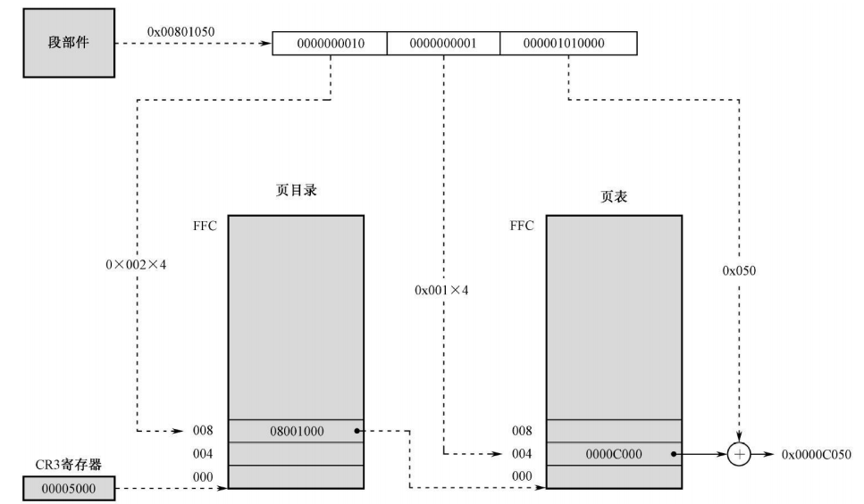
</div>

**<font color="blue">注意，这种变换不是无缘无故的，而是事先安排好的</font>**。当任务加载时，操作系统先创建虚拟的段，并根据段地址/线性地址的高 20 位决定它要用到哪些页目录项和页表项。然后，寻找空闲的物理页，将找到的空闲页的物理地址填写到相应的页表项中，将要加载的程序写到一个或者多个找到的空闲页中。

#### 2.3 不存在的页表

使用二级表结构，页目录和页表所占用的内存空间为 4MB+4KB（页目录），因此占用内存空间反而比一级页表结构增大了。然而，**二级表结构允许页表被分散在内存各个页面中**，而不需要保存在连续的 4MB 内存块中。另外，**并不需要为不存在的或线性地址空间未使用部分分配二级页表**。虽然目录表页面必须总是存在于物理内存中，但是，二级页表可以在需要时再分配。这使得页表结构的大小对应于实际使用的线性地址空间大小。

>目录表项中的存在位还可以用于在虚拟内存中存放二级页表。这意味着在任何时候只有部分二级页表需要存放在物理内存中，而其余的可保存在磁盘上。

### 3.页目录项和页表项的格式

<div align="center">
    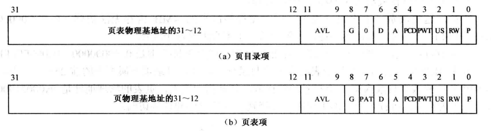
</div>

- P (Present) 是存在位，为 1 时，表示页表或者页位于内存中。否则，表示页表或者页不在内存中，必须先予以创建，或者从磁盘调入内存后方可使用。
- RW (Read/Write) 是读/写位。**为 0 时表示这样的页只能读取，为 1 时，可读可写**。
- US (User/Supervisor) 是用户/管理位。**<font color="red">为 1 时，允许所有特权级别的程序访问</font>**；为 0 时，只允许特权级别为 0、1 和 2 的程序访问，特权级别为 3 的程序不能访问。
- PWT (Page-level Write-Through) 是页级通写位，和高速缓存有关。
- PCD (Page-level Cache Disable) 是页级高速缓存禁止位。
- A (Accessed) 是访问位。该位由处理器固件设置，用来指示此表项所指向的页是否被访问过。这一位可以被操作系统用来监视页的使用频率，当内存空间紧张时，用以将较少使用的页换出到磁盘，同时将其 P 位清零。然后，将释放的页分配给马上就要运行的程序，以实现虚拟内存管理功能。
- D (Dirty) 是脏位。该位由处理器固件设置，**用来指示此表项所指向的页是否被写过数据**。
- PAT (Page Attribute Table) 页属性表支持位。在普通的 4KB 分页机制中，处理器建议将其置 "0"。
- G (Global) 是全局位。用来指示该表项所指向的页是否为全局性质的。**如果页是全局的，那么，它将在高速缓存 TLB 中一直保存 (也就意味着地址转换速度会很快)**。因为页高速缓存容量有限，只能存放频繁使用的那些表项。而且，**当因任务切换等原因改变 CR3 寄存器的内容时，整个页高速缓存的内容都会刷新**。
- AVL位被处理器忽略，软件可以使用。

>在分页机制中，**对页的访问控制按最严格的访问权执行**。对于某个线性地址，如果其页目录项的 RW 位是 "0" 而其页表项的 RW 位是 "1"，则按 RW 位是 "0" 执行。也就是说，TLB 中的访问权，**<font color="red">是页目录项和页表项中，对应访问权的逻辑与</font>**。

