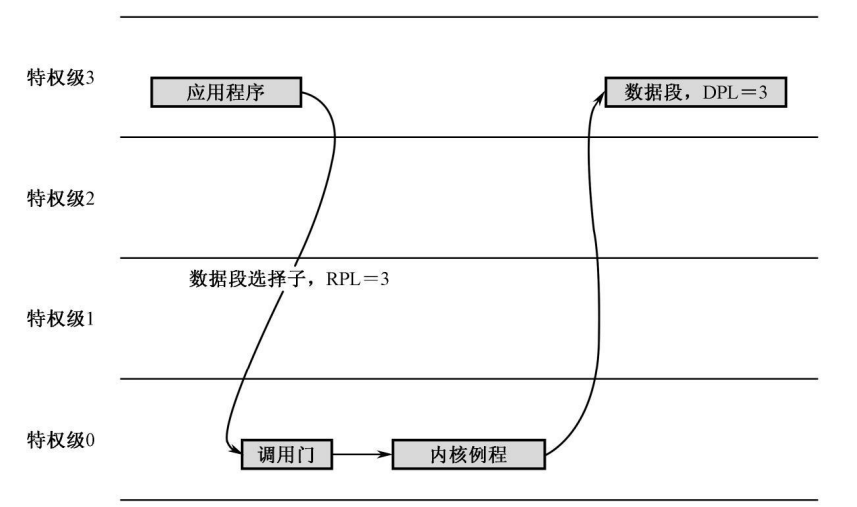
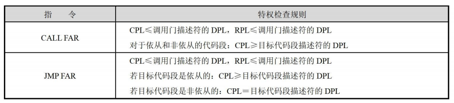

# 保护模式之特权级保护

# 一、任务的隔离

在前面《保护模式之内存管理》介绍过段保护，即通过将内存分成大小不等的段，并用描述符对每个段的用途、类型和长度进行指定，就可以在程序运行时由处理器硬件施加访问保护。但是，段保护机制只能提供最基本的保护功能。

如果用户程序知道 GDT 的位置，它可以通过向段寄存器加载操作系统的数据段描述符，**或者在 GDT 中增加一个指向操作系统数据区的描述符，来修改只属于操作系统的私有数据**，这一切行为都是合法的。接下来将介绍 IA-32 中保护机制。

## 1.任务、任务的 LDT

程序是记录在载体上的指令和数据，总是为了完成某个特定的工作，其正在执行中的一个副本叫做任务 (Task)。这句话的意思是说，如果一个程序有多个副本正在内存中运行，那么，它对应着多个任务，每一个副本都是一个任务。为了有效地在任务之间实施隔离，**处理器建议每个任务都应当具有自己的描述符表**，称为局部描述符表 LDT (Local Descriptor Table)，并且把专属于自己的那些段放到 LDT 中。和 GDT 一样，LDT 也是用来存放描述符的。不同之处在于，LDT 只属于某个任务。或者说，每个任务都有自己的 LDT，每个任务私有的段，都应当在 LDT 中进行描述。**另外，LDT 的第 1 个描述符，也就是 0 号槽位，也是有效的、可以使用的**。

尽管局部描述符表 (LDT) 和全局描述符表 (GDT) 都用来存放各种描述符，比如段描述符，但这掩盖不了它们也是内存段的事实。**简单地说，它们也是内存段。但是，因为它们用于系统管理，故称为系统的段或系统段**。

全局描述符表 (GDT) 是唯一的，整个系统中只有一个，所以只需要用 GDTR 寄存器存放其线性基地址和段界限即可；但 LDT 不同，每个任务一个，所以，为了追踪它们，**处理器要求在 GDT 中安装每个 LDT 的描述符**。当要使用这些 LDT 时，可以用 LDTR 中的选择子来访问 GDT，将 LDT 描述符的 base/limit 等信息缓存到 LDTR 寄存器。

和 GDT 不同，局部描述符表 LDT 的数量不止一个，具体有多少，视任务多少而定。为了追踪和访问这些 LDT，处理器使用了局部描述符表寄存器 (LDT Register:LDTR)。在一个多任务的系统中，会有很多任务在轮流执行，正在执行中的那个任务，称为当前任务 (Current Task)。**<font color="blue">因为 LDTR 寄存器只有一个，所以，它只用于指向当前任务的 LDT。每当发生任务切换时，LDTR 的内容被更新，以指向新任务的 LDT</font>**。

>LDT 段选择子是当前任务的 LDT 描述符的选择子（从 LDT 表中选择）。**由内核或者操作系统填写，以指向 LDT 表中当前任务的 LDT，该信息由处理器在任务切换时使用**，在任务运行期间保持不变。

因为段选择符是 16 位的，而且只有高 13 位被用做索引号来访问 GDT 或 LDT，所以每个 LDT 所能容纳的描述符个数为 $2^{13}=8192$ 个，或者换句话说，每个 LDT 只能定义 8192 个段，而 LDT 中每个段描述符长度为 8 字节，因此 LDT 的最大长度为 64KB。

## 2.任务的 TSS

在一个多任务的环境中，当任务切换发生时，必须保护旧任务的运行状态，或者说是保护现场，保护的内容包括通用寄存器、段寄存器、栈指针寄存器 ESP、指令指针寄存器 EIP、状态寄存器 EFLAGS，等等。否则的话,等下次该任务又恢复执行时，一切都会变得茫然而毫无头绪。

为了保存任务的状态，并在下次重新执行时恢复它们，**每个任务都应当用一个额外的内存区域保存相关信息，这叫做任务状态段 (Task State Segment:TSS)**。任务状态段 TSS 具有固定的格式，最小尺寸是 104 字节，处理器固件能够识别 TSS 中的每个元素，并在任务切换的时候读取其中的信息。和 LDT 一样，处理器用 TR（Task Register） 寄存器来指向当前任务的 TSS。**和 GDTR/LDTR/IDTR 一样，TR 寄存器在处理器中也只有一个**。当任务切换发生的时候，TR 寄存器的内容也会跟着指向新任务的 TSS。这个过程是这样的：**<font color="red">首先，处理器将当前任务的现场信息保存到由 TR 寄存器指向的 TSS；然后，再使 TR 寄存器指向新任务的 TSS，并从新任务的 TSS 中恢复现场</font>**。

和 LDT 一样，**必须在全局描述符表 (GDT) 中创建每个 TSS 的描述符**。这样做，一方面是为了对 TSS 进行段和特权级检查；另外一方面，也是执行任务切换的需要。当 call far 和 jmp far 指令的操作数是 TSS 描述符选择子时，处理器执行任务切换操作。

TR、TSS 描述符和 TSS 的关系如下所示：

<div align="center">
    
</div>

## 3.全局空间和局部空间

在多任务系统中，操作系统肩负着任务的创建，以及在任务之间的调度和切换工作。每个任务实际上包括两个部分：全局部分和私有部分。**全局部分是所有任务共有的，含有操作系统的软件和库程序，以及可以调用的系统服务和数据**；私有部分则是每个任务各自的数据和代码，与任务所要解决的具体问题有关，彼此并不相同。

<div align="center">
    
</div>

任务实际上是在内存中运行的，所以所谓的全局部分和私有部分，其实是【线性地址空间】的划分，即全局地址空间和局部地址空间，简称全局空间和局部空间。地址空间的访问是依靠分段机制来进行的。具体地说，需要先在描述符表中定义各个段的描述符，然后再通过描述符来访问它们。**<font color="red">因此全局地址空间是用全局描述符表 (GDT) 来指定的，而局部地址空间则是由每个任务私有的局部描述符表 (LDT) 来定义的</font>**。

从程序员的角度来看，任务的全局空间包含了操作系统的段，是由别人编写的，但是他可以调用这些段的代码，或者获取这些段中的数据；任务局部空间的内容是由程序员自己创建的。通常任务会在自己的局部空间运行，当它需要操作系统提供的服务时，转入全局空间执行。

>**<font color="blue">编译器不考虑处理器可寻址空间的大小，也不考虑物理内存的大小</font>**，它只是负责编译程序。当程序编译时，编译器允许生成非常巨大的程序。

同一块物理内存，可以让多个任务，或者每个任务的不同段来使用。当执行或者访问一个新的段时，如果它不在物理内存中，而且也没有空闲的物理内存空间来加载它，那么操作系统将挑出一个暂时用不到的段，把它换出到磁盘中，并把那个腾出来的空间分配给马上要访问的段，并修改段的描述符，使之指向这段内存空间。

内核程序运行在特权级 0 的级别上，而应用程序运行在特权级 3 的级别上，没有人愿意将自己的程序放在特权级 3 上，但是只要你在某个操作系统上面写程序，这就由不得你，应用程序的加载和开始执行是由操作系统所主导的，而操作系统一定会将它放在特权级 3 上。

以《任务和特权级保护》中的内核程序为例，在内核将应用程序加载到内存并准备跳转到其开始执行时，**加载到 CS 段寄存器中的应用程序头部段选择子的 RPL=3，因此当应用程序开始执行时，当前特权级 CPL 自然就会是 3**。

特权级保护机制只在保护模式下才能启用，而进入保护模式的方法是设置 CR0 寄存器的 PE 位。而且，处理器建议，在进入保护模式后，执行的第一条指令应当是跳转或者过程调用指令，以清空流水线和乱序执行的结果：

```armasm{.line-numbers}
jmp dword 0x0010:flush
```

转移到的目标代码段是刚刚定义过的，描述符特权级 DPL 为 0。要将控制转移到这样的代码段, 当前特权级 CPL 必须为 0。不过这并不是问题。**<font color="blue">进入保护模式之后，处理器自动将当前特权级 CPL 设定为 0, 以 0 特权级的身份开始执行保护模式的初始指令</font>**。

# 二、特权级保护

## 1.特权级保护概述

特权级 (Privilege Level) 也叫特权级别，是存在于段描述符及描述符选择子中的一个数值，**<font color="red">当这些段描述符或者描述符选择子所指向的对象要进行某种操作，或者被别的对象访问时，该数值用于控制它们所能进行的操作，或者限制它们的可访问性</font>**。

Intel 处理器可以识别 4 个特权级别，分别是 0、1、2、3，较大的数值意味着较低的特权级别，反之亦然。操作系统是为所有程序服务的，可靠性最高，**所以它的主体部分必须拥有特权级 0**。特权级 1 和 2 通常赋予那些可靠性不如内核的系统服务程序，比如设备驱动程序。当然，在很多比较流行的操作系统中，驱动程序与内核的特权级别相同，都是 0。应用程序的可靠性被视为是最低的，而且通常不需要直接访问硬件和一些敏感的系统资源，调用设备驱动程序或者操作系统例程就能完成绝大多数工作，故赋予它们最低的特权级别 3。

对于如停机指令 hlt 和对控制寄存器 CR0 的写操作，像这样的指令只能由最高特权级别的程序来做。因此，那些只有在当前特权级 CPL 为 0 时才能执行的指令，称为特权指令(Privileged Instructions)。典型的特权指令包括加载全局描述符表的指令 lgdt (它在实模式下也可执行)、加载局部描述符表的指令 lldt、加载任务寄存器的指令 ltr、读写控制寄存器的 mov 指令、停机指令 hlt 等十几条。

除了那些特权级敏感的指令外，处理器还允许对各个特权级别所能执行的 I/O 操作进行控制。**在处理器的标志寄存器 EFLAGS 中，位 13、位 12 是 IOPL 位，也就是输入/输出特权级 (I/O Privilege Level)，它代表着当前任务的 I/O 特权级别**。任务是由操作系统加载和创建的，与任务相关的信息都在它自己的任务状态段 (TSS) 中，其中就包括一个 EFLAGS 寄存器的副本，用于指示与当前任务相关的机器状态，比如它自己的 I/O 特权级 IOPL。在多任务系统中，随着任务的切换，前一个任务的所有状态被保存到它自己的 TSS 中，新任务的各种状态从其 TSS 中恢复，包括 EFLAGS 寄存器的值。处理器不限制 0 特权级程序的 I/O 访问，但是会限制低特权级程序的 I/O 访问权限。

>It is not necessary to use all four privilege levels. Existing software that was designed to use only one or two levels of privilege can simply ignore the other levels offered by the 80386. A one-level system should use privilege level zero; **a two-level system should use privilege levels zero and three**.

## 2.CPL、DPL 和 RPL

### 2.1 DPL

每个段描述符都有一个两比特的 DPL 字段，可以取值为 00、01、10 和 11，分别对应特权级 0、1、2 和 3。DPL 是每个描述符都有的字段，故又称描述符特权级 (Descriptor Privilege Level)。**描述符总是指向它所描述的目标对象，代表着该对象，因此该字段实际上是目标对象的特权级**。比如，对于数据段来说，DPL 决定了访问它们所应当具备的最低特权级别（即前面所说的限制了它们的可访问性）。如果有一个数据段，其描述符的 DPL 字段为 2，那么只有特权级为 0、1 和 2 的程序才能访问它。

>对任何段的访问都要先把它的描述符加载到段寄存器，所以这种保护手段很容易实现。

### 2.2 CPL

Before describing how a segment's DPL effects memory access rights, it makes sense to answer the obvious question: what defines the processor's privilege level? 即什么决定了程序的特权级呢？

An internal processor register records the current privilege level (CPL). The CPL is the privilege level at which the CPU is currently running (also frequently referred to as the Ring in which a program is running). **<font color="red">Normally the CPL (CS.RPL) is equal to the DPL of the code segment that the processor is currently executing</font>**. CPL changes as control is transferred to segments with differing DPLs. 根据前面所述，代码段描述符的 DPL 字段表示该代码段的特权级，用来控制该代码段所能进行的操作，所以 CPL（CS.RPL）= 对应代码段的 DPL

在保护模式下，段寄存器存放的是段选择子，段地址则位于描述符高速缓存器中。当处理器正在一个代码段中取指令和执行指令时，那个代码段的特权级叫做当前特权级 (Current Privilege Level,CPL)。**正在执行的这个代码段，其选择子位于段寄存器 CS 中，其最低两位（RPL）就是当前特权级的数值**。

The processor automatically evaluates 【the right of a procedure to access another segment】【by comparing the CPL to one or more other privilege levels】. The evaluation is performed **_at the time the selector of a descriptor is loaded into a segment register_（当段选择子加载进段寄存器时，就会进行特权级检验）**. **<font color="red">The criteria used for evaluating access to data differs from that for evaluating transfers of control to executable segments</font>**; therefore, the two types of access are considered separately in the following sections.

>当操作系统的代码正在执行时，当前特权级的 CPL 就是 0

普通的应用程序则工作在特权级别 3 上。但是应用程序的加载和执行，是由操作系统所主导的，而操作系统一定会将它放在特权级 3 上。当应用程序开始执行时，当前特权级 CPL 自然就会是 3。实际上，操作系统在加载用户程序时，**<font color="red">会为用户程序的代码段创建一个 DPL=3 的段描述符，同时会为用户程序代码段创建一个 RPL=3 的描述符选择子，因此</font>** **`CPL（CS.RPL）= DPL = 3`**。

### 2.3 RPL

RPL 的意思是请求特权级 (Requested Privilege Level)。如果要将控制从一个代码段转移到另一个代码段，通常是使用 jmp 和 call 指令，并在指令中提供目标代码段的选择子；而为了访问内存中的数据，也必须先将段选择子加载到段寄存器 DS、ES、FS 或者 GS 中。不管是实施控制转移，还是访问数据段，**这都可以看成是一个请求，请求者提供一个段选择子（<font color="red">这里注意，选择子是由请求者程序自己定义并提供的</font>），请求访问指定的段**。从这个意义上来说，RPL 也就是指请求者的特权级别 (Requestor's Privilege Level)。

在绝大多数时候，**请求者都是当前程序自己，因此 CPL=RPL**。要判断请求者是谁，最简单的方法就是看谁提供了选择子。如下所示，选择子 0x0010 就是由请求者程序自己提供。

```armasm{.line-numbers}
;jmp 中提供目标代码段选择子
jmp dword 0x0010:flush
;提供数据访问段选择子
mov eax,0x0008
mov ds,eax
```

但是，在一些并不多见的情况下，RPL 和 CPL 并不相同。如下图所示，特权级为 3 的应用程序希望从硬盘读一个扇区，并传送到自己的数据段（段描述符的 DPL=3）。

<div align="center">
    
</div>

由于 I/O 特权级的限制，应用程序无法自己访问硬盘，必须通过调用门使用操作系统提供的相关例程才可以。假设，通过调用门使用操作系统例程时，传入 3 个参数，分别是 cx 寄存器中的数据段选择子、ebx 寄存器中的段内偏移，以及 eax 中的逻辑扇区号。

应用程序通过调用门，特权级 CPL 变为操作系统的 0 特权级，而高特权级别的程序可以访问低特权级别的数据段，因此，操作系统例程会用传入的数据段选择子代入段寄存器，**以便代替应用程序访问那个段，从磁盘中读取数据保存到其中**:

```armasm{.line-numbers}
mov ds, cx
```

在执行这条指令时，cx 寄存器中的段选择子，其 RPL 字段的值是 3，当前特权级 CPL 已经变成 0。显然请求者并非当前程序，而是特权级为 3 的应用程序，RPL 和 CPL 并不相同。

接下来将介绍为什么需要引入 RPL，发生如下场景：某个恶意程序获取了内核的数据段选择子，它计划从硬盘读取一个扇区，并将所读数据写入内核的数据段。显然，它自己位于 3 特权级（CPL=3），不能直接访问内核数据段（DPL=0）。而且由于涉及硬盘读取，必须通过系统调用访问硬盘，此处使用调用门来进行系统调用。控制转移到调用门后，CPL 从 3 变为 0，此时将内核段选择子传递给内核例程，例程将选择子赋值进 ds，发生特权级检查：CPL=内核数据段描述符的 DPL，检测通过。于是，恶意程序成功向内核数据段写入内容。

<div align="center">
    
</div>

以上方式出现问题的原因很容易得出：受访者不知道访问者的真实身份。在上例中，访问者的真实身份是恶意程序（CPL=3），然而恶意程序通过调用门这个代理 (CPL=0) 去访问内核数据，内核就以为调用门是真正的请求者（毕竟是调用门直接接触内核的），于是通过了特权级检查。

因此，要破解这个问题，我们就必须让内核知道某个请求后有没有背后的请求者，背后真正请求者的特权级是多少。而 RPL 就是为了解决此问题而生，RPL 代表着【真正】的请求者的特权级。引入请求特权级 (RPL) 的原因是处理器在遇到一条将选择子传送到段寄存器的指令时，无法区分真正的请求者是谁。而 RPL 就是为了解决此问题而生，RPL 代表着 真正 的请求者的特权级。

让我们看看当加入了 RPL 后，重复以上情形将发生什么：再一次，恶意程序通过某些方式获取了内核数据段选择子（其中 RPL=0），当控制权转入调用门时，由于是远转移，处理器会将 cs, eip 等寄存器压栈以保护现场；因此调用门能够从栈中获取恶意程序 cs 中选择子的 RPL（也就是转移前的 CPL），进而使用 arpl 指令将传入的内核数据段选择子的 RPL 更正为恶意程序自身的 CPL，以保证 RPL 的真实身份 ，此时内核数据段选择子的 RPL 变成了 3；而后内核例程向 ds 中赋值，发生特权级检查，发现 **`CPL <= 目标数据段的 DPL`** 成立，但 **`RPL <= 目标数据段的 DPL`** 不成立（数据段选择子的 RPL=3，而对应描述符的 DPL=0），因此拒绝访问，保卫成功！

从上面能够看出，光有 RPL 还不够，必须还要有 arpl 指令保证 RPL 的真实性 。同时也能发现，CPL 并不总是等于 RPL，这需要看当前运行的程序在访问数据段或代码段时用的是谁提供的选择子。

但是，引入 RPL 本身并不能完全解决这个问题，**<font color="red">这只是处理器和操作系统之间的一种协议，处理器负责检查请求特权级 RPL，判断它是否有权访问，但前提是提供了正确的 RPL</font>**;内核或者操作系统负责鉴别请求者的身份，并有义务保证 RPL 的值和它的请求者身份相符，因为这是处理器无能为力的。

操作系统的编写者很清楚段选择子的来源，即真正的请求者是谁。当它自己读写一个段时，这没有什么好说的；当它提供一个服务例程时，3 特权级别的用户程序给出的选择子在哪里，也是由它定的，它也知道。在这种情况下，**它所要做的，就是将该选择子的 RPL 字段设置为请求者的特权级**。剩下的工作就看处理器了。

按照 Intel 公司的说法，**确保特权代码不会代替应用程序访问一个段，除非应用程序自己拥有访问那个段的权限**。

# 三、对代码段的访问

代码段的特权级检查是很严格的。**一般来说，控制转移只允许发生在两个特权级相同的代码段之间**。如果当前特权级为 2，那么，它可以转移到另一个 DPL 为 2 的代码段接着执行，但不允许转移到 DPL 为 0、1 和 3 的代码段执行。不过，为了让特权级低的应用程序可以调用特权级高的操作系统例程，处理器也提供了相应的解决办法。

With the 80386, control transfers are accomplished by the instructions JMP, CALL, RET（从栈中弹出值到 EIP/IP 寄存器，RETF 是弹出值到 CS 和 IP/EIP 寄存器）, INT, and IRET（从栈中弹出 CS,EIP,EFLAGS 寄存器）, as well as by the exception and interrupt mechanisms. This chapter discusses only JMP, CALL, and RET instructions. **The "near" forms of JMP, CALL, and RET transfer within the current code segment, and therefore are subject only to limit checking**. The processor ensures that the destination of the JMP, CALL, or RET instruction does not exceed the limit of the current executable segment. This limit is cached in the CS register; therefore, protection checks for near transfers require no extra clock cycles.

对于远转移，下面将分别介绍依从代码段和调用门两种控制转移的方式以及对应的特权级检查方式。

## 1 依从代码段

第一种方法是将高特权级的代码段定义为依从的。代码段描述符的 TYPE 字段有 C 位：

- **<font color="red">如果 C=0，这样的代码段为非依从代码段，只能供同特权级的程序使用</font>**；
- **如果 C=1，则这样的代码段称为依从的代码段，可以从特权级比它低的程序调用并进入**；

但是，即使是将控制转移到依从的代码段也是有条件的，要求当前特权级 CPL 必须低于，或者和目标代码段描述符的 DPL 相同。即在数值上：

```armasm{.line-numbers}
CPL ≥ 目标代码段描述符的 DPL
```

举例来说，如果一个依从的代码段，其描述符的 DPL 为 1，则只有特权级别为 1、2、3 的程序可以调用，而特权级为 0 的程序则不能。在任何时候，都不允许将控制从较高的特权级转移到较低的特权级。

依从的代码段不是在它的 DPL 特权级上运行，而是在调用者程序的特权级上运行。就是说，当控制从调用者程序转移到被调用的依从代码段上执行时，**不改变调用者程序的特权级 CPL，段寄存器 CS 的 CPL 字段不发生变化**，被调用过程的特权级依从于调用者的特权级，这就是为什么它被称为"依从的"代码段。

>**<font color="red">When control is transferred to a conforming segment, the CPL does not change. This is the only case when CPL may be unequal to the DPL of the current executable segment</font>**. 当调用者 A 调用一个依从代码段 B 时，CS 段寄存器会重新加载 B 代码段描述符，执行代码段 B 的指令，此时调用者 A 的代码段的 DPL 变为正在执行的 B 代码段的 DPL，而调用者 A 的 CPL 保持不变（The processor keeps a record of the CPL cached in the CS register），因此这是 CPL 和 DPL 不相同的唯一例外。

总的来说，当不使用调用门时，权限检查只涉及到以下 2 个特权级：

- CPL（Current Privilege Level）
- The DPL of the descriptor of the target segment

Normally the CPL is equal to the DPL of the segment that the processor is currently executing. CPL may, however, be greater than DPL（当前特权级小于目标代码段的特权级）if the conforming bit is set in the descriptor of the current executable segment. **<font color="red">The processor keeps a record of the CPL cached in the CS register</font>**; this value can be different from the DPL in the descriptor of the code segment.

Most code segments are not conforming. The basic rules of privilege above mean that, for nonconforming segments, **control can be transferred without a gate only to executable segments at the same level of privilege**. There is a need, however, to transfer control to (numerically) smaller privilege levels; this need is met by the CALL instruction when used with call-gate descriptors. The JMP instruction may never transfer control to a nonconforming segment whose DPL does not equal CPL.下面就是使用 jmp/call far 指令不经过调用门进行控制转移时，需要进行的特权级检查，此检查涉及到 CPL、目标代码段的 DPL 以及目标代码段描述符的 **CONFORMING** 标志位。

<div align="center">
    
</div>

## 2 调用门

除了依从的代码段，另一种在特权级之间转移控制的方法是使用门。门 (Gate) 是另一种形式的描述符，称为门描述符，简称门。**和段描述符不同，段描述符用于描述内存段，门描述符则用于描述可执行的代码**，比如一段程序（调用门）、一个过程/例程（中断门和陷阱门）或者一个任务（任务门）。

事际上根据不同的用途，门的类型有好几种。不同特权级之间的过程调用可以使用调用门（TYPE=12）；中断门（TYPE=14）/陷阱门（TYPE=15）是作为中断处理过程使用的;任务门（TYPE=5）对应着单个的任务，用来执行任务切换。调用门段描述符的格式如下。

<div align="center">
    
</div>

在调用门描述符中（如上所示），段选择符指定要访问的代码段，偏移地址指定代码段中入口点的偏移地址，这个入口点通常是指定过程的第一条指令，DPL 字段指定调用门的特权级，标志 P 指明调用门描述符是否有效。参数个数字段指明发生堆栈切换时从调用者堆栈复制到新堆栈中的参数个数。要想通过调用门进行控制转移，可以使用 jmp far 或者 call far 指令，并把**调用门描述符的选择子**作为操作数。

### 2.1 通过调用门访问代码段的过程

为了访问调用门，我们需要为 call far 或 jmp far 指令的操作数提供一个远指针。该指针中的 16 位段选择符用于指定调用门，**而远指针中的 32 位偏移值虽然需要但是 CPU 并不会用它，该偏移值可以设置为任意值**。

当处理器访问调用门时，它会使用调用门中的段选择符来定位目的代码段的段描述符。然后 CPU 会把代码段描述符的基地址与调用门中的偏移地址进行组合，形成代码段中指定程序入口点的线性地址。调用门调用过程如下图所示:

<div align="center">
    
</div>

### 2.2 通过调用门进行转移控制时的特权级检查
 
通过调用门进行程序控制转移时，CPU 会对以下 4 种不同的特权级进行检查，以确定控制转移的有效性，除此之外，**目的代码段描述符中的一致性标志 C 也将受到检查**。

- The CPL (current privilege level).
- The RPL (requestor's privilege level) of the selector used to specify the call gate, 也就是调用门选择子中的请求特权级 RPL.
- The DPL of the gate descriptor.
- The DPL of the descriptor of the target executable segment.

<div align="center">
    
</div>

>调用门选择子中的 RPL 值在成功转跳后并不赋给转跳后的 CS.RPL。**跳转后的 CPL(CS.RPL) 要么保持不变，要么变为目标代码段的 DPL**。调用门的调用格式为：

```armasm{.line-numbers}
call/jmp far 门选择符
```

调用门描述符中的 DPL 和目标代码段描述符的 DPL 用于决定哪些特权级的程序可以访问此门。具体的规则是必须同时符合以下两个条件才行：

第 1 个条件即当前特权级 CPL 和请求特权级 RPL 高于或者和调用门描述符特权级 DPL 相同。即在数值上：

```armasm{.line-numbers}
CPL <= 调用门描述符的 DPL
RPL <= 调用门描述符的 DPL
```

第 2 个条件，如果调用者与调用门之间的特权级检查通过，CPU 就会接着把调用者的 CPL 与代码段描述符的 DPL 进行比较检查。在这方面，CALL 指令和 JMP 指令的检查规则就不同了。**<font color="red">只有 CALL 指令可以通过调用门把程序控制转移到特权级更高的非依从代码段中，即可以转移到 DPL 小于 CPL 的非依从代码段中去执行</font>**。而 JMP 指令只能通过调用门把控制转移到 DPL 等于 CPL 的非依从代码段中。但 CALL 指令和 JMP 指令都可以把控制转移到更高特权级的依从代码段中，即 DPL 小于或等于 CPL 的依从代码段中。可以总结如下所示：

<div align="center">
    
</div>

如果 CALL 指令通过一个调用门把控制转移到了更高特权级的非依从代码段中，那么 CPL 就会被设置为目的代码段的 DPL 值，并且会引起堆栈切换。但是如果 CALL/JMP 指令通过一个调用门或跳转到控制转移到更高级别的依从代码段上，那么 CPL 并不会改变，并且不会引起堆栈切换。

**调用门的 DPL 是特权级检查的下限（门槛）**，即调用者的特权级 (CPL) 必须不低于门描述符的 DPL（数值上就是小于等于）。而调用门描述符中有目标代码段的选择子，它指向目标代码段的描述符。当一个程序通过调用门转移控制时，**处理器还要检查目标代码段描述符的 DPL，该 DPL 决定了调用门特权级检查的上限（门顶）**。也就是说，调用者特权级不能高于门描述符中目标程序所在的代码段的 DPL（数值上就是大于等于）。

为什么要求当前特权级必须低于目标代码段特权级？这点我们在前面已经强调过，这是因为除了返回指令（iret），任何时候都不允许将控制从高特权级转移到低特权级上，因为操作系统无法相信用户程序的可靠性。

为什么要通过门这种结构来提升特权级？因为门不仅有"门顶"，还有"门槛"，门顶规定只能主动从低特权级转移到高特权级，**而门槛规定了能向高特权级进行转移的最低特权级**。前者在上面第三点解释了，那后者的原因是什么呢？**<font color="red">这是为了防止某些低特权级软件通过门访问一些只为内核服务的程序，比如页故障处理</font>**。这就是门的本质。

# 四、对数据段的访问

高特权级别的程序可以访问低特权级别的数据，但低特权级别的程序不可以访问高特权级别的数据。访问数据段之前，肯定要对段寄存器 DS、ES、FS 和 GS 进行修改，比如：

```armasm{.line-numbers}
mov fs, ax
```

在这个时候，**<font color="red">要求当前特权级 **`CPL(CS.RPL)`** 和数据段选择符的请求特权级 **`RPL`** 都必须高于，或者和目标数据段描述符的 DPL 相同</font>**。即在数值上：

<div align="center">
    
</div>

```armasm{.line-numbers}
CPL ≤ 目标数据段描述符的 DPL
RPL ≤ 目标数据段描述符的 DPL
```

最后，处理器要求，在任何时候栈段的特权级别必须和当前特权级 CPL 相同。因此，随着程序的执行，要对段寄存器 SS 的内容进行修改时，必须进行特权级检查。以下就是一个修改段寄存器 SS 的例子:

```armasm{.line-numbers}
mov ss, ax
```

在对段寄存器 SS 进行修改时，**要求当前特权级 CPL 和请求特权级 RPL 必须等于目标栈段描述符的 DPL**。即在数值上：

```armasm{.line-numbers}
CPL = 目标栈段描述符的 DPL
RPL = 目标栈段描述符的 DPL
```

# 五、堆栈切换

上一节说过，对段寄存器 SS 进行修改时，要求当前特权级 CPL 和请求特权级 RPL 必须等于目标栈段描述符的 DPL。因此，如果改变了当前特权级别 CPL，则必须切换栈，即从当前任务的固有栈切换到与目标代码段特权级别相同的栈上。换句话说：**<font color="red">不同的特权级别应该使用与其同等级的栈</font>**。

不同的特权级应该使用不同的栈，理由如下：

- 恶意的低特权级程序可以通过栈获取高特权级的信息，这非常危险。
- 如果所有特权级都使用一个栈，那么这种交叉引用将会变得非常混乱。
- 用一个栈容纳所有特权级下的数据，栈很可能溢出。

处理器位于 0 特权级时要用 0 特权级的栈，位于 3 特权级时要使用 3 特权级的栈。问题是，一共有 4 个特权级，那么每个任务都应该有 4 个栈，为什么 TSS 中只有 3 个栈呢？**这是由于 TSS 中记录的是转移后的高特权级对应的目标栈**，因为 ring3 是最低级的，没有更低的特权级会向它转移，所以 TSS 不需要记录 ring3 的栈 。另外，也不是每一个任务都有 4 个栈，这取决于它最低的特权级别。比如 ring3 程序，还能提升 3 级，于是额外拥有 0，1，2 三个特权级的栈；而 ring0 程序则没有额外的栈。

## 1.栈切换

当前栈是由段寄存器 SS 和栈指针寄存器 ESP 的当前内容指示的；**要切换到的新栈位于当前任务的 TSS 中**。在栈切换前，处理器要检查新栈是否有足够的空间完成本次控制转移。栈切换过程如下，控制转移前的旧栈布局如下：

<div align="center">
    <div align="center" style="color: #F14; font-size:13px; font-weight:bold">控制转移前的旧栈布局</div>
    
</div>

1. 使用目标代码段的 DPL(也就是新的 CPL=0) 到当前任务的 TSS 中选择一个栈，包括栈段选择子 SS0 和栈指针 SP0。
2. 从 TSS 中读取所选择的段选择子 SS0 和栈指针 SP0，并用该选择子读取栈段描述符。在此期间，任何违反段界限检查的行为都将引发处理器异常中断。**_The new stack is checked to assure that it is large enough to hold the parameters and linkages; if it is not, a stack fault occurs with an error code of 0._**
3. 检查栈段描述符的特权级和类型（类似于对数据段的访问控制），并可能引发处理器异常中断 (无效 TSS)。
4. 临时保存当前栈段寄存器 SS 和栈指针 ESP 的内容 SS_Old 和 SP_Old。
5. 把新的栈段选择子和栈指针代入 SS 和 ESP 寄存器，切换到新栈。
6. 将刚才临时保存的 SS 和 ESP 的内容压入当前栈，如下图所示。

<div align="center">
    <div align="center" style="color: #F14; font-size:13px; font-weight:bold">压入栈段和栈指针后的新栈布局</div>
    
</div>

7. 依据调用门描述符 "参数个数" 字段的指示，从旧栈中将所有参数都复制到新栈中。如果参数个数为 0，不复制参数，如下图所示。另外，参数复制工作是由 CPU 自动完成，栈切换和参数复制对程序员来说是完全透明的。

<div align="center">
    <div align="center" style="color: #F14; font-size:13px; font-weight:bold">压入参数后的新栈布局</div>
    
</div>

8. 将当前段寄存器 CS 和指令指针寄存器 EIP 的内容压入新栈，如下图所示。**通过调用门实施的控制转移一定是远转移（段间转移）**，所以要压入 CS 和 EIP。

<div align="center">
    <div align="center" style="color: #F14; font-size:13px; font-weight:bold">压入CS和IP后的新栈布局</div>
    
</div>

9. 从调用门描述符中依次将目标代码段选择子和段内偏移传送到 CS 和 EIP 寄存器，开始执行被调用过程。

相反，如果没有改变特权级别，则不切换栈，继续使用调用者的当前栈，只在原来的基础上压入当前段寄存器 CS、指令指针寄存器 EIP 和参数个数的内容。

<div align="center">
    <div align="center" style="color: #F14; font-size:13px; font-weight:bold">相同特权级控制转移前后栈的变化</div>
    
</div>

再次，如果通过调用门的控制转移是使用 jmp far 指令发起的，结果就是有去无回。而且，使用 jmp far 进行控制转移没有特权级的变化，也不需要切换栈。相反，如果通过调用门的控制转移是使用 call far 指令发起的，那么可以使用远返回指令 retf 把控制返回到调用者。

## 2.栈返回

接下来我们再看看 retf 从调用门返回的过程，从同一特权级返回时，处理器将从栈中弹出调用者的代码段选择子和指令指针。尽管它们通常是有效的，**但是为了安全起见，处理器依然会进行特权级检查**。

The "far" form of the RET instruction pops the return pointer that was pushed onto the stack by a prior far CALL instruction. Under normal conditions, the return pointer is valid, because of its relation to the prior CALL or INT. Nevertheless, the processor performs privilege checking **<font color="red">_because of the possibility that the current procedure altered the pointer or failed to properly maintain the stack_（这也解释了上面所说的为什么处理器依然需要进行特权级检查）</font>**. **The RPL of the CS selector popped off the stack by the return instruction identifies the privilege level of the calling procedure**.

An intersegment return instruction can change privilege levels, but only toward procedures of lesser privilege. When the RET instruction encounters a saved CS value whose RPL is numerically greater than the CPL, an interlevel return occurs. 

要求特权级变化的远返回，只能返回到较低的特权级别上。控制返回的全部过程如下：

1. 检查栈中保存的 CS 寄存器的内容，根据其 RPL 字段（即实施控制转移前的当前特权级 CPL）决定返回时是否需要改变特权级别。
2. 从当前栈中读取 CS 和 EIP 寄存器的内容，并针对栈中保存的代码段选择子的 RPL 字段（调用此调用门的 CPL）实施特权级检查，**检查是否`RPL>=CPL（被调用者的当前特权级）`，即是否向低特权级转移**；
3. 如果远返回指令是带参数的，则将参数和 ESP 寄存器的当前值相加，以跳过栈中的参数部分。最后的结果是 ESP 寄存器指向调用者 SS 和 ESP 的压栈值。
4. 如果返回时需要改变特权级，**从栈中将 SS 和 ESP 的压栈值代入段寄存器 SS 和指令指针寄存器 ESP**，切换到调用者的栈。在此期间，一旦检测到有任何界限违例的情况都将引发处理器异常中断。
5. 如果远返回指令是带参数的，则将参数和 ESP 寄存器的当前值相加，**<font color="red">以跳过调用者栈（前面是跳过被调用者栈中参数部分）中的参数部分。最后的结果是调用者的栈恢复到平衡位置</font>**。
6. 如果返回时需要改变特权级，检查 DS、ES、FS 和 GS 寄存器的内容，根据它们找到相应的段描述符。要是有任何一个段描述符的 DPL 高于调用者的特权级(返回后的新 CPL)，**即在数值上，`段描述符的 DPL<返回后的新 CPL`**。

对于最后一点，做简单解释：当控制转移到内核（ring 0）后，内核程序必然会使用自己的数据段，所以会向 DS/ES/FS/GS 赋予自己的数据段选择子，赋值时发生特权级检查，检查通过则赋值成功，**此后对该数据段进行读写时将不再检查**。问题就在于此，当从内核返回到用户程序后，DS/ES/FS/GS 很可能还指向内核的数据段，如果此时用户程序对其进行读写，将没有任何限制！因此，返回后 DS/ES/FS/GS 则可能被自动初始化为 0，如果用户程序直接使用值为 0 的段选择子，则会被索引到 GDT 的第 0 个描述符，而第 0 个描述符是不可用的 ，从而引发 CPU 第 0x0d 号异常 (#GP General Protection)。这就是前文提到的为什么 GDT 第 0 号描述符不可用，而 LDT 第 0 号描述符可用的原因。This prevents less privileged code from accessing more privileged segments using selectors left in the segment registers by the more privileged procedure.

>前文强调过，特权级检查只发生在向段寄存器赋值的一瞬间，此后任何操作不再受限。

特别需要注意的是，**任务状态段 (TSS) 中的 SS0、ESP0、SS1、ESP1、SS2、ESP2 域是静态的，除非软件进行修改，否则处理器从来不会改变它们**。举个例子，当处理器通过调用门进入 0 特权级的代码段时，会切换到 0 特权级栈。返回时，并不把 0 特权级栈指针的内容更新到 TSS 中的 ESP0 域。下次再次通过调用门进入 0 特权级代码段时，使用的依然是 ESP0 的静态值，从来不会改变。这就是说，如果你希望通过 0 特权级栈返回数据，就必须自己来做这件事，比如在返回到低特权级别的代码段之前，手工改写 TSS 中的 ESP0 域。

# 六、总结

## 1 对数据段和栈段的访问总结

要求访问数据段或堆栈段的程序的 **`CPL≤待访问的数据段或堆栈段的 DPL`**，同时选择子的 **`RPL≤待访问的数据段或堆栈段的 DPL`**，即程序访问数据段或堆栈段要遵循一个准则：只有相同或更高特权级的代码才能访问相应的数据段。这里，RPL 可能会削弱 CPL 的作用，访问数据段或堆栈段时，默认用 CPL 和 RPL 中的最小特权级（数值最大）去访问数据段，所以 $\scriptsize\bold{max\{CPL, RPL\} ≤ DPL}$，否则访问失败。

## 2 对代码段的访问总结

### 2.1 规律

所有的程序转跳，**<font color="blue">CPU 都不会把要跳转到的目标代码段选择子的 RPL 赋给转跳后程序的 CS.RPL</font>**，跳转后程序的 CPL(CS.RPL) 只会有下面的两种可能：

```armasm{.line-numbers}
;1.转跳后程序的 CPL(CS.RPL) = 转跳前程序的 CPL(CS.RPL) 
;2.转跳后程序的 CPL(CS.RPL) = 转跳后程序的 CodeDescriptor.DPL
```

以 call 为例，怎样决定这两种选择，这就要首先知道转跳后程序的段是一致代码段还是非一致代码段。其实也很简单，规则如下：

- 如果能成功转跳到一致代码段，**`转跳后程序的 CPL(CS.RPL) = 转跳前程序的 CPL(CS.RPL)`**，(转跳后程序的 CPL 继承了转跳前程序的 CPL)；
- 如果能成功转跳到非一致代码段，**`转跳后程序的 CPL(CS.RPL) = 转跳后程序的 Descriptor.DPL`**。即转跳后程序的 CPL 变成了该代码段的特权级。

### 2.2 重要概念解析

这里有四个重要的概念：

1. **代码段的保护观念是高特权级不找低特权级办事**，低特权级找高特权级帮忙，相同的一定没问题。也就是县长不找乡长，乡长不求农民，反过来农民求乡长，乡长找县长，这个概念是最重要的。
2. 一致性代码段: 让客人很方便的利用主人 (一致代码段) 的东西为自己办事，但客人这身份没有改变 **`CPL(NewCS.RPL)=CPL(OldCS.RPL)`** 所以只能帮自己办事。比方说乡长有一头牛，农民可以借来帮自己种田，但不能种别人的田。
3. 非一致性代码段：主人 (非一致代码段) 可以帮客人但一定是用自己的身份 **`CPL(NewCS.RPL)=DestinationDescriptorCode.DPL`** 这里可能有安全的问题，搞不好很容易农民变县长。可以使用 RPL 来避免这种情况。
4. RPL: 它让程序有需要的时候可以表示一个特权级更低的身份 Max(RPL,CPL) 而不会失去本身的特权级 CPL(CS.RPL)，有需要的时候是指要检查身份的时候。**<font color="red">事实上 RPL 跟代码段本身的特权级 DPL 和当前特权级 CPL 没有什么关系，因为 RPL 的值在成功转跳后并不赋给转跳后的 CPL(CS.RPL)</font>**。

### 2.3 普通跳转

对于普通跳转（没有经过调用门），即 JMP FAR 或 CALL FAR 后跟着 48 位全指针（16 位段选择子+32 位地址偏移），且其中的段选择子指向代码段描述符，这样的跳转称为直接（普通）跳转。普通跳转不能使特权级发生跃迁，即不会引起 CPL 的变化，当在不通过调用门的情况下将程序控制转移到另一个代码段时，处理器会检查四类与特权级和段类型相关的信息，看下面的详细描述：

- CPL：这里的 CPL 指主调代码段的特权级，即包含发起 CALL 或 JMP 的过程所在的代码段。
- 目标代码段的段描述符中的 DPL：该段描述符对应的就是包含被调用过程的目标代码段。
- **<font color="red">目标代码段段选择子的 RPL</font>**。
- 目标代码段段描述符中的一致性（C）标志：该标志决定该代码段是一致代码段（C 位置 1）还是非一致代码段（C 位清零）。

<div align="center">
    
</div>

**1）跳转目标是一致性代码段**

要求：**`CPL(CS.RPL) >= DestinationDescriptorCode.DPL`**，其他 RPL 是不检查的，只能相同或者更低特权级的程序跳转访问目标代码段。**`转跳后程序的 CPL(NewCS.RPL) = 转跳前程序的 CPL(OldCS.RPL)`**。此时，CPL 没有发生变化，纵使它执行了特权级（DPL）较高的代码。若访问时不满足要求，则发生异常。

Conforming segments are used for code modules such as math libraries and exception handlers, **<font color="red">which support applications but do not require access to protected system facilities</font>**. These modules are part of the operating system or executive software, but they can be executed at numerically higher privilege levels (less privileged levels). Keeping the CPL at the level of a calling code segment when switching to a conforming code segment prevents an application program from accessing nonconforming code segments while at the privilege level (DPL) of a conforming code segment and thus prevent sit from accessing more privileged data（**在切换到一致代码段时保持 CPL 为主调代码段的特权级，可以防止应用程序在一致代码段的特权级（其 DPL）下去访问非一致代码段，从而防止它进一步访问特权更高的数据**）.

Most code segments are nonconforming. For these segments, program control can be transferred only to code segments at the same level of privilege, unless the transfer is carried out through a call gate, as described in the following sections.

**2）跳转目标是非一致性代码段**

要求：**`CPL(CS.RPL)＝DestinationDescriptorCode.DPL　AND　RPL≤CPL(CS.RPL)`**，**`转跳后程序的 CPL(NewCS.RPL) = DestinationDescriptorCode.DPL`**。转跳后程序的特权级 (CPL) 也没有发生变化。如果访问时不满足前提 CPL=DPL，则引发通用保护异常（#GP）。

### 2.4 通过调用门的跳转

当段间转移指令 JMP/CALL FAR 后跟着的目标段选择子指向一个调用门描述符时，该跳转就是利用调用门的跳转。这时如果选择子后跟着 32 位的地址偏移，也不会被处理器使用，因为调用门描述符已经记录了目标代码的偏移。

使用调门进行的跳转比普通跳转多一个步骤，**<font color="red">即在访问调用门描述符时要将描述符当作一个数据段来检查访问权限</font>**，要求指向调用门的选择子的 RPL≤门描述符 DPL，同时当前程序 CPL≤门描述符 DPL。就如同访问数据段一样，要求访问数据段的当前程序的 CPL≤待访问的数据段的 DPL，同时数据段选择子的 RPL≤待访问的数据段或堆栈段描述符的 DPL。只有满足了以上条件，CPU 才会进一步从调用门描述符中读取目标代码段的选择子和地址偏移，进行下一步的操作。

从调用门中读取到目标代码的段选择子和地址偏移后，**我们当前掌握的信息又回到了先前，和普通跳转站在了同一条起跑线上**（普通跳转一开始就得到了目标代码的段选择子和地址偏移），有所不同的是，此时，CPU 会将读到的目标代码段选择子中的 RPL 清 0，**即忽略了调用门中代码段选择子的 RPL 的作用**。完成这一步后，CPU 开始对当前程序的 CPL，目标代码段选择子的 RPL（事实上它被清 0 后总能满足要求）以及由目标代码选择子（此选择子在调用门描述符中）指示的目标代码段描述符中的 DPL 进行特权级检查，并根据情况进行跳转。

**1）跳转目标是一致性代码段**

要求：**`CPL(CS.RPL)≥DestinationDescriptorCode.DPL`**，RPL 不检查，因为 RPL 被清 0，所以事实上永远满足 RPL≤DPL，这一点与普通跳转一致，适用于 JMP 和 CALL。**`转跳后程序的 CPL(NewCS.RPL)=转跳前程序的 CPL(OldCS.RPL)`**，因此特权级没有发生跃迁。

**2）跳转目标是非一致代码段（JMP 指令）**

要求：**`CPL(CS.RPL)＝DestinationDescriptorCode.DPL AND RPL<= CPL(CS.RPL)`**（事实上因为 RPL 被清 0，所以 RPL≤CPL 总能满足，因此 RPL 与 CPL 的关系在此不检查）。若不满足要求则引起异常。

转跳后程序的 **`CPL(NewCS.RPL)=DestinationDescriptorCode.DPL`**，所以转跳后程序的 CPL 值不改变，特权级也没有发生变化。如果访问时不满足前提 CPL=DPL，则引发异常。

**3）跳转目标是非一致性代码段（CALL 指令）**

要求：**`CPL(CS.RPL)≥DestinationDescriptorCode.DPL（RPL 被清 0，不检查）`**，若不满足要求则程序引起异常。跳转后程序的 **`CPL(NewCS.RPL)=DestinationDescriptorCode.DPL`**。当条件 CPL=DPL 时，程序跳转后特权级不发生跃迁；当 CPL＞DPL 时，程序跳转后 CPL=DPL，特权级发生跃迁，**<font color="red">这是我们当目前位置唯一见到的使程序当前执行忧先级 (CPL) 发生变化的跳转方法</font>**，即用 CALL 指令+调用门方式跳转，且目标代码段是非一致代码段。

