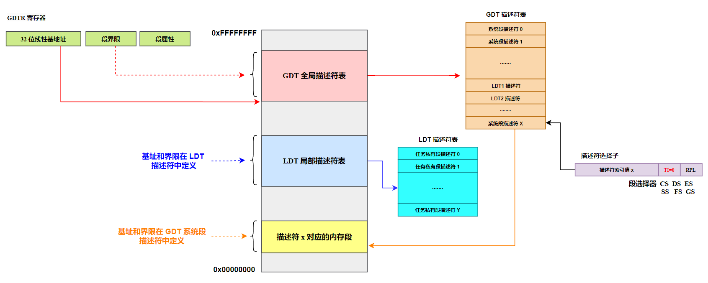
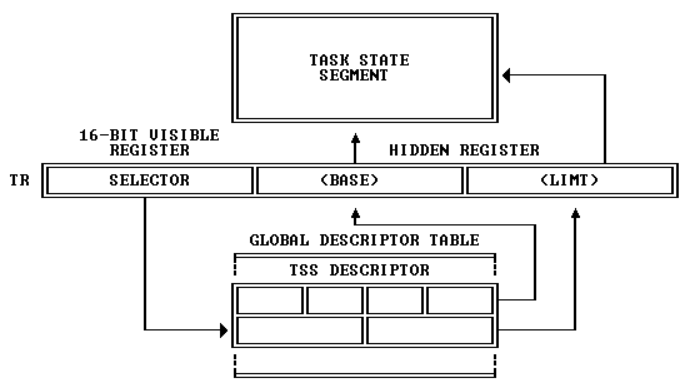

# x86 保护模式之系统寄存器和系统指令

为了协助处理器执行初始化和控制系统操作，8086 提供了一个标志寄存器 EFLAGS 和几个系统寄存器，除了一些通用状态标志（如 ZF、CF、OF 等）外，EFLAGS 中还包含几个系统标志。这些系统标志用于控制任务切换、中断处理、指令跟踪以及 I/O 端口访问权限。系统寄存器用于内存管理和控制处理器操作。含有分段和分页处理机制系统表的基地址、控制处理器操作的位标志位。

# 一、标志寄存器

标志寄存器 EFLAGS 中的系统标志和 IOPL 字段用于控制 I/O 访问、可屏蔽硬件中断（IF）、调试（TF）、任务切换（NT）以及虚拟 8086 模式，如下图所示。**通常只允许操作系统代码有权修改这些标志**。EFLAGS 中的其他标志是一些通用标志(进位 CF、奇偶 PF、辅助进位 AF、零标志 ZF、负号 SF、方向 DF、溢出 OF)。我们仅对 EFLAGS 中的系统标志进行说明。

<div align="center">
    
</div>

**每个任务都有 EFLAGS 寄存器的副本**，其内容在任务创建的时候由内核或者操作系统初始化，在多任务系统中，**每次当任务恢复运行时，就由处理器固件自动从 TSS 中恢复**。

## 1 IOPL

EFLAGS 寄存器的 IOPL 位决定了当前任务的 I/O 特权级别。如果当前特权级 CPL 高于，或者和任务的 I/O 特权级 IOPL 相同时（即在数值上，$\scriptsize{CPL\leq IOPL}$），**所有的 I/O 操作都是允许的，针对任何硬件端口的访问都可以通过**。相反，如果当前特权级 CPL 低于当前任务的 I/O 特权级 IOPL，此时处理器的意思是总体上不允许，但个别端口除外。至于个别端口是哪些端口，要找到当前任务的 TSS，并检索 I/O 许可位串。

如下图所示，I/O 许可位串 (I/O Permission Bit String) 是一个比特序列，或者说是一个比特串，最多允许 65536 比特，即 8KB。从第 1 比特开始，各比特用它在串中的位置代表一个端口号。因此，第 1 个比特代表 0 号端口，第 2 个比特代表 1 号端口，第 65536 比特代表第 65535 号端口。

<div align="center">
    
</div>

比特序列中每个比特的取值决定了相应的端口是否允许访问，为 1 时，禁止访问；为 0 时允许访问。处理器检查 I/O 许可位的方法是先计算它在 I/O 许可位映射区的字节编号，并读取该字节，然后进行测试。**<font color="red">比如，当执行指令 out 0x09,al 时，这里要访问的端口号为 9，即第 10 个端口</font>**。

**该端口对应着 I/O 许可位映射区第 2 个字节的第 2 个比特（位 1）**。于是，它读取该字节，并测试那一位。

同其他和任务相关的信息一样，I/O 许可位串位于任务的 TSS 中。如下图所示，任务状态段 TSS 的最小长度是 104 字节，保存着最基本的任务信息。但是整个 TSS 还可以包括一个 I/O 许可位串，它所占用的区域称为 I/O 许可位映射区。

在下图中，在 TSS 内偏移为 102 的那个字单元，保存着 I/O 许可位串 (I/O 许可位映射区) 的起始位置，从 TSS 的起始处 (0) 算起。因此，如果该字单元的内容大于或者等于 TSS 的段界限 (在 TSS 描述符中)，则表明没有 I/O 许可位串。

<div align="center">
    
</div>

这里解释一下，如下图所示，**_因为 TSS 的段界限是包含了 I/O 许可位映射区在内_**，因此如果 I/O 许可位串的起始位置等于或者大于 TSS 的段界限，说明根本没有 I/O 许可位串，如果存在 I/O 许可位串，那么其起始地址必然小于 TSS 的段界限。

<div align="center">
    
</div>

在这种情况下，如果当前特权级 CPL 低于当前的 I/O 特权级 IOPL，执行任何硬件 I/O 指令都会引发处理器异常中断。

>说明一下，**和 LDT 一样，必须在 GDT 中创建 TSS 的描述符**，TSS 描述符中包括了 TSS 的基地址和界限，**<font color="red">该界限值包括 I/O 许可位映射区在内</font>**。

I/O 端口是按字节编址的。这句话的意思是，**每个端口仅被设计用来读写一个字节的数据**，当以字或者双字访问时，实际上是访问连续的 2 个或者 4 个端口。**<font color="red">比如，当从端口 n 读取一个字时，相当于同时从端口 n 和端口 n+1 各读取一个字节</font>**。

`in ax, 0x3f8` 这条指令表示从端口 0x3f8 读取数据，由于端口被设计仅用来读写一个字节数据，因此，该指令相当于执行 `in al, 0x3f8` 和 `in ah,0x3f9` 这两条命令。

由于这个原因，当处理器执行一个字或者双字 I/O 指令时，会检查许可位串中的 2 个，或者 4 个连续位，而且要求它们必须都是 0，否则引发异常中断。麻烦在于，这些连续的位可能是跨字节的。即，一些位于前一字节，另一些位于后一字节。**为此，处理器每次都要从 I/O 许可位映射区读两个连续的字节**。但是如果要检查的比特在最后一字节中，那么，这个两字节的读操作将会越界。为防止这种情况，**处理器要求 I/O 许可位映射区的最后必须附加一个额外的字节，并要求它的所有比特都是 1**，即 0xFF（会引发处理器中断）。当然，它必须位于 TSS 的界限之内。

处理器不要求为每一个 I/O 端口都提供位映射。对于那些没有在该区域内映射的位，处理器假定它对应的比特是 1。要是 I/O 许可位映射区的长度是 11 字节，那么，除去最后一个所有比特都是 1 的字节，前 10 字节映射了 80 个端口，分别是端口 0 到端口 79，访问更高地址的端口将引发异常中断。

尽管不存在对 EFLAGS 寄存器整体写入或者读出的指令，但存在将标志寄存器入栈和出栈的指令：

```armasm{.line-numbers}
pushf/popf
pushfd/popfd
```

pushf 指令在 16 位模式下，pushf 压入的是 EFLAGS 的低 16 位。如果要压入整个 32 位的 EFLAGS，需要指令前缀 66，即 **`66 9C`**；在 32 位模式下，pushf 压入的是整个 32 位的 EFLAGS，**即使有指令前缀，也会压入整个 32 位的 EFLAGS 寄存器**。

而对于 pushfd 命令，本质上，它们对应着同一条指令，当你使用 pushf 时，编译器就知道，应当编译成无前缀的机器码 9C；当使用 pushfd 时，编译器会编译成 **`66 9C`**。下面的例子展示了它们之间的区别，**在 32 位模式下，pushf 和 pushfd 是相同的**。

```armasm{.line-numbers}
[bits 16]
pushf ;编译后是 9C，16 位操作
pushfd ;编译后是 66 9C，32 位操作

[bits 32]
pushf ;编译后是 9C，32 位操作
pushfd ;编译后是 9C，32 位操作
```

通过将 EFLAGS 寄存器的内容压入栈，局部修改后，再弹出到 EFLAGS，可以间接地修改它的各种标志位。**能够修改 IOPL 标志的指令是** **`popf iret`**。注意，这里没有包括 pushf 指令，原因是你可以执行 pushf 指令，但我不允许你执行 popf 和 iret 指令，这样就无法修改 EFLAGS 寄存器了，所以能实现修改 IOPL 标志位的主要指令还是依赖于 **`popf iret`**；**能够修改 IF 标志的指令是 `cli sti`**，中断是由操作系统或者内核统一管理的，cli 和 sti 指令不能由低特权级的程序随便执行。但是这些指令并不是特权指令，原因就是其他特权级的程序也离不开它们（比如 iret 指令普通中断程序返回都需要）。

最好的办法是用 IOPL 本身来控制它们。**<font color="red">如果在数值上 $\scriptsize{CPL\leq IOPL}$ 则允许执行以上 4 条指令（修改 IOPL 和 IF 标志位），也允许访问所有的硬件端口</font>**。否则，如果当前特权级 CPL 低于当前的 I/O 特权级 IOPL（数值上大于），则执行 popf 和 iret 指令时，会引发处理器异常中断；执行 cli 和 sti 时，不会引发异常中断，但不改变标志寄存器的 IF 位。同时，是否能访问特定的 I/O 端口，要参考 TSS 中的 I/O 许可位映射串。

>总结来说，当前运行程序或任务的 CPL 必须小于或等于这个 IOPL 才能访问 I/O 地址空间。只有当 CPL 小于或等于这个 IOPL 时，程序才可以使用 popf 或 iret 指令修改这个字段。IOPL 也是控制对 IF 标志修改的机制之一。

## 2 TF 标志位

EFLAGS 位 8 是跟踪标志 (Trap Flag)。当设置该位时可为调试操作启动单步执行方式，复位时则禁止单步执行。在单步执行方式下，处理器会在每个指令执行之后产生一个调试异常，这样我们就可以观察执行程序在执行每条指令后的状态。**如果程序使用 popf、popfd 或 iret 指令**设置了 TF 标志（修改 EFLAGS 寄存器设置了 TF 标志位），那么在随后指令之后处理器就会产生一个调试异常。

## 3 NT 标志位

32 位处理器的 EFLAGS 有 NT 位 (位14)，意思是嵌套任务标志 (Nested Task Flag)。每个任务的 TSS 中都有一个任务链接域，可以填写为前一个任务的 TSS 描述符选择子。**如果当前任务 EFLAGS 寄存器的 NT 位是 1，则表示当前正在执行的任务嵌套于其他任务内**，并且能够通过 TSS 任务链接域的指针返回到前一个任务。

因中断而引发任务切换时，根据当前任务（也就是旧任务/要切换的新任务的前一个任务）是否嵌套于其他任务内，其 EFLAGS 寄存器的 NT 位被设置为 0 或 1，任务切换后保持不变。并且当前任务（如上也是指旧任务）肯定处于"忙"的状态，其 TSS 描述符的 B 位一定是 1，在任务切换后同样保持不变。

> 任务切换时，EFLAGS 中的 NT 位会和其他寄存器一道，写入 TSS 中保护起来。

对新任务的处理是，要把旧任务的 TSS 选择子填写到新任务 TSS 中的任务链接域，同时，将新任务 EFLAGS 寄存器的 NT 位置 1，以允许返回到前一个任务 (旧任务) 继续执行。同时，还要把新任务 TSS 描述符的 B 位置 1 (忙)。

**无论任何时候处理器碰到 iret 指令，它都要检查 NT 位，根据新任务是否嵌套，中断返回的处理过程也不同**。如果此位是 0，表明是一般的中断过程，按一般的中断返回处理，即中断返回是任务内的；如果此位是 1，则表明当前任务 A 是嵌套任务（即中断了别的任务 B）。因此，应当返回原先被中断的任务 B 继续执行。此时，由处理器固件把当前任务 A 的 EFLAGS 寄存器的 NT 位改成 0，并把 TSS 描述符的 B 位改成 0 (非忙)。在保存了当前任务 A 的状态之后，接着，用新任务 B (即先前被中断的任务) 的 TSS 恢复现场。

# 二、内存管理寄存器

处理器提供了 4 个内存管理寄存器 (GDTR、LDTR、IDTR 和 TR)，**<font color="red">用于指定内存分段管理所用系统表的基地址</font>**，如下图所示。处理器为这些寄存器的加载和保存提供了特定的指令。

<div align="center">
    
</div>

GDTR、LDTR、IDTR 和 TR 都是段基址寄存器，这些段中含有分段机制的重要信息表。GDTR、IDTR 和 LDTR 用于寻址存放段的描述符表（全局描述符表、中断描述符表、局部描述符表）。TR 用于寻址一个特殊的任务状态段 (Task State Segment,TSS)。TSS 中包含着当前执行任务的重要信息。

GDTR、LDTR、TR 寄存器和 GDT、LDT、TSS 之间的关系如下图所示：

<div align="center">
    
</div>

## 1 全局描述符表寄存器 GDTR

### 1.1 全局描述符表 GDT

在实模式中，为了让程序在内存中能自由浮动而又不影响它的正常执行，处理器将内存划分成逻辑上的段，并在指令中使用段内偏移地址，这样就实现了程序重定位。在保护模式下，对内存的访问仍然使用段地址和偏移地址，但是，在每个段能够访问之前，必须先进行登记，**登记的信息包括段的起始地址、段的界限以及各种访问属性**。这样当程序访问的偏移地址超过段的界限时，处理器就会阻止这种访问，并产生内部异常中断。

和一个段有关的信息需要 8 个字节来描述，被称为段描述符 (Segment Descriptor)，每个段都需要一个描述符。为了存放这些描述符，需要在内存中开辟出一段空间。在这段空间里，所有的描述符都是挨在一起集中存放的，这就构成一个描述符表。

最主要的描述符表是全局描述符表 (Global Descriptor Table,GDT)，所谓全局，意味着该表是为整个软硬件系统服务的。在进入保护模式前，必须要定义全局描述符表。

为了跟踪全局描述符表，**<font color="red">处理器内部有一个 48 位的寄存器，称为全局描述符表寄存器（GDTR）。该寄存器分为两部分，分别是 32 位的线性地址和 16 位的边界</font>**。32 位的处理器具有 32 根地址线，可以访问的地址范围是 0x00000000 到 0xFFFFFFFF，共 $2^{32}$ 字节的内存，即 4GB 内存。所以，GDTR 的 32 位线性基地址部分保存的是全局描述符表在内存中的起始线性地址，16 位边界部分保存的是全局描述符表的边界(界限)，**其在数值上等于表的大小 (总字节数) 减一**。

>GDT 表的界限值=表的大小 - 1=最后 1 字节的偏移量（第 N 字节的偏移量为 N-1）

理论上，全局描述符表可以位于内存中的任何地方。但是，由于在进入保护模式之后，处理器立即要按新的内存访问模式工作（立即使用/访问 GDT 中定义的内核段描述符进行工作），**所以，必须在进入保护模式之前定义 GDT**。但是，由于在实模式下只能访问 1MB 的内存，故 GDT 通常都定义在 1MB 以下的内存范围中。当然，允许在进入保护模式之后换个位置重新定义 GDT。

### 1.2 全局描述符表寄存器 GDTR

GDTR 寄存器中用于存放全局描述符表 GDT 的 32 位的线性基地址和 16 位的表限长值。基地址指定 GDT 表中字节 0 在【线性地址空间】中的地址，表长度指明 GDT 表的字节长度值。指令 LGDT 和 SGDT 分别用于加载和保存（从/到内存中）GDTR 寄存器的内容。在机器刚加电或处理器复位后，基地址被默认地设置为 0，**而长度值被设置成 0xFFFF**。在保护模式初始化过程中必须给 GDTR 初始化一个新值。

>GDTR 界限值被初始化为 0xFFFF，是因为界限被初始化为：描述符个数 $\times$ 8 - 1，由于初始状态 GDT 中描述符个数为 0，因此界限值被初始化为 0xFFFF。

<div align="center">
    
</div>

上图反映了 GDTR、GDT、描述符选择子的关系，当描述符选择子的 TI=0 时，表示段描述符在 GDT 中。使用【**段寄存器/段选择器:偏移地址**】访问内存的流程如下所示：

1. 先从 GDTR 寄存器中获得 GDT 表的基址；
2. 然后根据段选择器高 13 位的索引值从 GDT 表中得到段描述符；
3. 段描述符包含段的基址、限长、优先级等各种属性，这就得到了段的起始地址（基址），再以基址加上偏移地址才得到最后要访问某一内存的线性地址；

## 2 中断描述符表寄存器 IDTR

IDTR 寄存器用于存放中断描述符表 IDT 的 32 位线性基地址和 16 位表长度值。指令 LIDT 和 SIDT 分别用于加载和保存 IDTR 寄存器的内容。在机器刚加电或处理器复位后，基地址被默认地设置为 0，而长度值被设置成 0xFFFF。

在保护模式下，处理器对中断的管理是相似的，处理器使用中断描述符表（Interrupt Descriptor Table,IDT）。在这个表里，保存的是和中断处理过程有关的描述符，**包括中断门、陷阱门和任务门**。事实上，调用门、任务门、中断门和陷阱门的描述符非常相似，**因为这 4 个门描述符都用于实施控制转移（控制分别转移到被调用例程、被切换任务、中断服务程序）**，故都包括 16 位的目标代码段选择子，以及 32 位的段内偏移量。中断门、调用门、陷阱门和任务门的安装位置如下所示：

>- 中断门和陷阱门描述符只允许存放在 IDT 内；
>- 任务门可以位于 GDT、LDT 和 IDT 中，任务门安装在 IDT 中，当发生中断时，进行任务切换；
>- 调用门（Call Gate）描述符可以安装在 LDT 和 GDT 中；
>- TSS 描述符固定安装在 GDT 中，TR 只是一个选择子，指向 GDT 中的 TSS 描述符
>- LDT 描述符固定安装在 GDT 中，LDTR 只是一个选择子，指向 GDT 中的 LDT 描述符

和实模式下的中断向量表 (IVT) 不同，保护模式下的 IDT 不要求必须位于内存的最低端。在处理器内部，使用 IDTR 寄存器保存着中断描述符表在内存中的线性基地址和界限。**<font color="red">和 GDT 一样，因为整个系统中只需要一个 IDT 就够了，所以 GDTR 与 IDTR 不像 LDTR 和 TR，没有也不需要选择器部分</font>**。

这就意味着中断描述符表 IDT 可以位于内存中的任何地方，只要 IDTR 指向了它，整个中断系统就可以正常工作。界限值为 16 位表示 IDT 表的大小可以是 64KB，但是，事实上，因为处理器只能识别 256 种中断，故通常只使用 2KB，其他空余的槽位应当将描述符的 P 位清零。**最后，与 GDT 不同的是，IDT 中的第一个描述符也是有效的**。

如下图所示，在保护模式下，当中断和异常发生时，处理器用中断向量乘以 8 的结果去访问 IDT，从中取得对应的描述符。因为 IDT 在内存中的位置是由 IDTR 指示的，所以这很容易做到。

<div align="center">
    
</div>

>注意，从上图可以看出，这里没有考虑门描述符是任务门的情况，因为任务门的处理比较特殊。

中断门和陷阱门中有目标代码段描述符的选择子，以及段内偏移量。取决于选择子的 TI 位，处理器访问 GDT 或者 LDT，取出目标代码段的描述符。接着，从目标代码段的描述符中取得目标代码段所在的基地址，再同门描述符中的偏移量相加，就得到了中断处理程序的 32 位线性地址。

>注意，当处理器用中断向量访问 IDT 时，要访问的位置超出了 IDT 的界限，则产生常规保护异常 (#GP)。

## 3 局部描述符表寄存器 LDTR

### 3.1 LDT 和 LDTR

程序是记录在载体上的指令和数据，总是为了完成某个特定的工作，其正在执行中的一个副本叫做任务 (Task)。这句话的意思是说，如果一个程序有多个副本正在内存中运行，那么，它对应着多个任务，每一个副本都是一个任务。为了有效地在任务之间实施隔离，**处理器建议每个任务都应当具有自己的描述符表**，称为局部描述符表 LDT (Local Descriptor Table)，并且把专属于自己的那些段放到 LDT 中。和 GDT 一样，LDT 也是用来存放描述符的。不同之处在于，LDT 只属于某个任务。或者说，每个任务都有自己的 LDT，每个任务私有的段，都应当在 LDT 中进行描述。**另外，LDT 的第 1 个描述符，也就是 0 号槽位，也是有效的、可以使用的**。

尽管局部描述符表 (LDT) 和全局描述符表 (GDT) 都用来存放各种描述符，比如段描述符，但这掩盖不了它们也是内存段的事实。**简单地说，它们也是内存段。但是，因为它们用于系统管理，故称为系统的段或系统段**。

全局描述符表 (GDT) 是唯一的，整个系统中只有一个，所以只需要用 GDTR 寄存器存放其线性基地址和段界限即可；但 LDT 不同，每个任务一个，所以，为了追踪它们，**处理器要求在 GDT 中安装每个 LDT 的描述符**。当要使用这些 LDT 时，可以用它们的选择子来访问 GDT，将 LDT 描述符加载到 LDTR 寄存器。

和 GDT 不同，局部描述符表 LDT 的数量不止一个，具体有多少，视任务多少而定。为了追踪和访问这些 LDT，处理器使用了局部描述符表寄存器 (LDT Register:LDTR)。在一个多任务的系统中，会有很多任务在轮流执行，正在执行中的那个任务，称为当前任务 (Current Task)。**<font color="blue">因为 LDTR 寄存器只有一个，所以，它只用于指向当前任务的 LDT。每当发生任务切换时，LDTR 的内容被更新，以指向新任务的 LDT</font>**。

>LDT 段选择子是当前任务的 LDT 描述符的选择子。**由内核或者操作系统填写，以指向当前任务的 LDT，该信息由处理器在任务切换时使用**，在任务运行期间保持不变。

因为段选择符是 16 位的，而且只有高 13 位被用做索引号来访问 GDT 或 LDT，所以每个 LDT 所能容纳的描述符个数为 $2^{13}=8192$ 个，或者换句话说，每个 LDT 只能定义 8192 个段，而 LDT 中每个段描述符长度为 8 字节，因此 LDT 的最大长度为 64KB。

<div align="center">
    
</div>

如上图，通过 LDT 访问线性地址的步骤如下所示：

1. 还是先从 GDTR 寄存器中获得 GDT 基址；
2. 从 LDTR 寄存器的选择子（LDTR 高 13 位）中获取 LDT 段描述符的位置索引；
3. 以这个位置索引在 GDT 中得到 LDT 段描述符从而得到 LDT 段基址；
4. 用段选择器高 13 位位置索引值从 LDT 段中得到任务私有段描述符；
5. 任务私有段描述符符包含段的基址、限长、优先级等各种属性，这就得到了段的起始地址（基址），再以基址加上偏移地址才得到最后的线性地址；

### 3.2 总结

ldtr 寄存器中用于存放局部描述符表 LDT 的 32 位线性基地址、16 位段限长和描述符属性值。指令 lldt 的作用是将一个选择子加载到 ldtr（Local Descriptor Table Register，局部描述符表寄存器）中，从而指定当前任务使用的本地描述符表（LDT）。该指令用于内存分段机制中的 LDT 切换，以支持不同任务或进程之间的内存隔离和管理。sldt 指令的作用是将当前 ldtr 的内容存储到指定的内存位置或寄存器中。

**<font color="red">LDT 表本身就是一种特殊的段，即系统段，包含 LDT 表的段必须在 GDT 表中有一个段描述符项</font>**。当使用 lldt 指令把指向 LDT 表的选择符/选择子加载进 ldtr 时，选择符对应的 ldt 段描述符的段基地址、段限长度以及描述符属性会被自动地加载到 ldtr 中。当进行任务切换时，处理器通过 lldt 把新任务 ldt 的段选择符加载进 ldtr，使得每个任务具有独立的内存分段空间，增强系统的安全性和稳定性。

## 4 任务寄存器 TR

### 4.1 TR 和 TSS

在一个多任务的环境中，当任务切换发生时，必须保护旧任务的运行状态，或者说是保护现场，保护的内容包括通用寄存器、段寄存器、栈指针寄存器 ESP、指令指针寄存器 EIP、状态寄存器 EFLAGS，等等。否则的话,等下次该任务又恢复执行时，一切都会变得茫然而毫无头绪。

为了保存任务的状态，并在下次重新执行时恢复它们，**每个任务都应当用一个额外的内存区域保存相关信息，这叫做任务状态段 (Task State Segment:TSS)**。任务状态段 TSS 具有固定的格式，最小尺寸是 104 字节，处理器固件能够识别 TSS 中的每个元素，并在任务切换的时候读取其中的信息。和 LDT 一样，处理器用 TR（Task Register） 寄存器来指向当前任务的 TSS。**和 GDTR/LDTR/IDTR 一样，TR 寄存器在处理器中也只有一个**。当任务切换发生的时候，TR 寄存器的内容也会跟着指向新任务的 TSS。这个过程是这样的：**<font color="red">首先，处理器将当前任务的现场信息保存到由 TR 寄存器指向的 TSS；然后，再使 TR 寄存器指向新任务的 TSS，并从新任务的 TSS 中恢复现场</font>**。

和 LDT 一样，**必须在全局描述符表 (GDT) 中创建每个 TSS 的描述符**。这样做，一方面是为了对 TSS 进行段和特权级检查；另外一方面，也是执行任务切换的需要。当 call far 和 jmp far 指令的操作数是 TSS 描述符选择子时，处理器执行任务切换操作。

TR、TSS 描述符和 TSS 的关系如下所示：

<div align="center">
    
</div>

TR 寄存器也同段寄存器类似，分为可见的 16 位段选择子与不可见的高速缓冲器。其中 BASE 指向 TSS 所在的起始地址，LIMIT 则为其界限。为什么还有界限呢？因为 TSS 长度是不固定的，会根据 I/O 位图而变化。

### 4.2 总结

TR 寄存器用于存放当前任务 TSS 段的 16 位段选择符、32 位基地址、16 位段长度和 TSS 描述符属性值。它引用 GDT 表中的一个 TSS 类型的描述符。指令 ltr 和 str 分别用于加载和保存 TR 寄存器的段选择符部分。当使用 ltr 指令把选择符加载进任务寄存器时，TSS 描述符中的段基地址、段限长度以及描述符属性会被自动加载到任务寄存器 TR 中。当执行任务切换时，处理器会把新任务的 TSS 的段选择符和段描述符自动加载进任务寄存器 TR 中。

# 三、控制寄存器

控制寄存器 (CR0~CR3) 用于控制和确定处理器的操作模式以及当前执行任务的特性，如下图所示。CR0 中含有控制处理器操作模式和状态的系统控制标志；CR1 保留不用；CR2 含有导致页错误的线性地址；**CR3 中含有页目录表【物理内存基地址】（即物理地址）**，因此该寄存器也被称为页目录基地址寄存器 PDBR (Page-Directory Base address Register)。

<div align="center">
    
</div>

## 1 CR0 控制器寄存器

- PE 位：**CR0 控制寄存器的位 0 是启用保护 (Protection Enable) 标志**。当设置该位为 1 时即开启了保护模式；当复位时（设置为 0）即进入实地址模式。这个标志仅开启段级保护（进入保护模式），而并没有启用分页机制。若要启用分页机制，那么 PE 和 PG 标志都要置位；
- PG 位：**CR0 的位 31 是分页 (Paging) 标志**。当设置该位时即开启了分页机制；当复位时则禁止分页机制，此时所有线性地址等同于物理地址。在开启这个标志之前必须已经或者同时开启 PE 标志。即若要启用分页机制，那么 PE 和 PG 标志都要置位；

启用保护模式 PE (Protected Enable) 位 (位0) 和开启分页 PG(Paging) 位 (位31) 分别用于控制分段和分页机制。PE 用于控制分段机制。如果 PE=1，处理器就工作在开启分段机制环境下，即运行在保护模式下。如果 PE=0，则处理器关闭了分段机制，并如同 8086 工作于实地址模式下。PG 用于控制分页机制。如果 PG=1，则开启了分页机制。如果 PG=0，分页机制被禁止，**此时线性地址被直接作为物理地址使用**。

如果 PE=0、PG=0 处理器工作在实地址模式下；如果 PG=0、PE=1 处理器工作在没有开启分页机制的保护模式下；如果 PG=1、PE=0，此时由于不在保护模式下不能启用分页机制，因此处理器会产生一个一般保护异常（#GP），即这种标志组合无效；如果 PG=1、PE=1，则处理器工作在开启了分页机制的保护模式下。

### 1.1 PG 标志位

**只有当执行程序至少有部分代码和数据在线性地址空间和物理地址空间中具有相同地址时**，我们才能改变 PG 位的设置。此时这部分具有相同地址的代码在分页和未分页世界之间起着桥梁的作用。无论是否开启分页机制，这部分代码都具有相同的地址。

接下来详细解释一下，为什么会存在部分代码和数据的线性地址和物理地址相同。以【分页机制和动态页面分配】中的内核程序为例，主引导程序 MBR 将内核代码加载到内存中，并且为内核栈和公用例程创建代码段描述符，并且安装在 GDT 中，最后跳转到内核执行。

接下来的工作是准备开启页功能，首先必须创建页目录和页表。**每个任务都有自己的页目录和页表**，内核也不例外，尽管它是为所有任务所共有的，但也包括作为任务而独立存在的部分，以执行必要的系统管理工作。因此，要想内核正常运行，必须创建它自己的页目录和页表。

麻烦在于，内核已经被 MBR 加载完毕，它的所有部分都已经位于内存中。当然，你可能会问，这怎么会是个麻烦事呢？原因是，在一个理想的分页系统中，**想要加载程序**，**必须<font color="red">先</font>搜索可用的页**，并将它们与段对应起来。在这种情况下，段部件输出的线性地址和页部件输出的物理地址不同，是很自然的事，因为一切都发生在程序加载完毕、段和页已经有了确定的映射关系之后。

总的来说即在分页系统中，**必须先登记后使用**，在加载程序之前，先在内存中搜索分配给程序的可用物理页，将物理页的地址登记到页目录和页表中，这样就形成了程序线性地址和物理地址的对应，最后将程序加载到内存中。

然而，由于内核是在开启页功能之前由 MBR 加载的，段在内存中的位置已经固定。在这种情况下，即使开启了页功能，线性地址也必须和物理地址相同才行。**比如，在开启页功能之前，GDT 在内存中的基地址是 0x00007E00，它就是全局描述符表的物理地址，段部件输出的线性地址就是物理地址**。在开启页功能之后，它还在那个内存位置，这就要求页部件输出的物理地址和段部件输出的线性地址相同。一句话，要求线性地址等于物理地址才行。因此，这也就解释了为什么会存在部分代码和数据的线性地址和物理地址相同。

### 1.2 刷新 TLB

在开启分页 (PG=1) 之前必须先刷新页高速缓冲 TLB。

开启页功能时，处理器的页部件要把线性地址转换成物理地址，而访问页目录表和页表是相当费时间的。因此，把页的物理地址预先存放到处理器中，可以加快地址转换速度。为此，处理器专门构造了一个特殊的高速缓存装置，叫做转换后援缓冲器 (Translation Lookaside Buffer,TLB)。

如下图所示，这是 TLB 的结构。它分为两大部分，第一部分是标记，其内容为线性地址的高 20 位；**第二部分是页表数据，包括属性、访问权和页物理地址的高 20 位**。在分页模式下，当段部件发出一个线性地址时，处理器用线性地址的高 20 位来查找 TLB，如果找到匹配项(命中)，则直接使用其数据部分的物理地址作为转换用的地址；如果检索不成功(不中)，则处理器还得花时间访问内存中的页目录表和页表，找到那个页表项，然后将它填写到 TLB 中，以备后用。TLB 容量不大，如果它装满了，则必须淘汰掉那些用得较少的项目。

<div align="center">
    
</div>

**对于页表项的修改不会同时反映到 TLB 中**。这是很糟糕的，如果内存中的页表项已经修改，但 TLB 中的对应条目还没有更新，那么，转换后的物理地址必定是错误的。

所以在开启分页（PG=1）之前刷新 TLB 可以清空之前缓存的所有页表条目，使处理器在分页开启后，直接去查询新的页表，从而保证所有地址映射都是最新的、正确的。

TLB 是软件不可直接访问的，但却有其他办法来刷新它的内容 (条目)。**比如，将 CR3 寄存器的内容读出，再原样写入，这样就会使得 TLB 中的所有条目失效**。当然，这是比较直接的做法。当任务切换时，**因为要从新任务中的 CR3 寄存器域加载页目录表基地址，也会隐式地导致 TLB 中的所有条目无效**。注意，上述方法对于那些标记为全局 (G 位为 "1") 的页表项来说无效，不起作用。

### 1.3 PE 标志位

这里以 x86 汇编中《保护模式》这一节的代码为例，进入保护模式的一般方法如下所示：

- 打开 A20 地址线
- 加载 GDT 表
- 将 CR0 寄存器中 PE 位设置为 1，并清空流水线

#### 1.3.1 打开 A20 地址线

首先，我们看看 real mode 的寻址方法，8086/8088 的地址线有 20 条：A0 ~ A19，意味着 processor 可以将 20 位地址放上这 20 条地址线上，它的寻址能力是 1MB（00000~FFFFF），它的寻址方法是：**`segment:offset`**，这是一种被称为 logic address（逻辑地址）表示法，它需要转化为 processor 的 linear address（线性地址）表示：

```armasm{.line-numbers}
segment:offset ---------> segment << 4 + offset
```

如：F000:FFFF = F0000 + FFFF = FFFFF，这是 8086/8088 所能访问的最高地址。这种表示方法是 Intel 为了在 16 位 real mode 下能够访问 20 位地址空间所想设计出来的计算方式。因此，8086/8088 的寻址范围是可以表示为：从 0000:0000~0000:FFFF 开始到 F000:0000~F000:FFFF（每一段是 1MB）。

在后续的 80286 上，Intel 实现了 24 位的 Address bus，**那么在 real mode 下 80286 能够访问到的最高地址是 `10FFEF`**，这个地址值是由下面的方法而来：

```armasm{.line-numbers}
FFFF:FFFF = FFFF0 + FFFF = 10FFEFh
```

这已经是 logic address 所能表达的极限范围了。**`100000h` 以上的内存被称为 extend memory**，**从 `100000h~10FFEFh` 这片内存区域在 DOS 下被称为 high memory（高端内存）**。高端内存是 80286 在 real mode 所能访问到的区域，而 8086/8088 所不能访问到的。

当在 8086/8088 下执行 FFFF:FFFF 这个内存寻址时，会产生什么结果呢？结果很明显：由于 8086/8088 只有 20 条 address bus，**地址 `10FFEF` 的高 4 位会被抛弃，实际上送上 address bus 的只有 0FFEFh 值**，所以访问 FFFF:FFFF 地址结果只能访问到 1M 以内的地址。这就是 wraparound 现象：**<font color="red">使用 8086/8088 访问 1M 以上地址都会回绕到 1M 内的模值。80286时代，处理器有24条地址线，地址回绕不灵了。因为，在地址上产生的进位不会被丢弃。</font>**。

很多 8086/8088 程序利用地址围绕特性工作，这样就无法运行在 80286 上。为了能够在 80286 上运行 8086 程序，不会因为地址线产生问题，IBM 提出了一个奇怪的想法：当 80286 运行在 real mode 时，将 A20 地址线（第 21 条 address bus）置为 0，这样使得 80286 在 real mode 下第 21 条 address line 无效，从而人为造成了 wraparound 现象。

<div align="center">
    
</div>

具体的实现方法是：设立一个 AND Gate（与门电路），**AND gate 的 IN 输入端中一端接 A20 line 上，另一端接在 keyboard control 8042 上，而 AND gate 的 OUT 输出端接在 A20 line 上**。只有两个 IN 端都为 1 时，OUT 端才为 1。

键盘控制器是一个芯片，位于电脑内部的主板上，用来控制键盘工作。一边连接键盘。键盘控制器是可编程的，程序员通过键盘控制器内的端口来获取字符，并设置键盘控制器的工作状态。在键盘控制器内部有好几个端口。其中一个端口的位 1 连接这个与门，**这个端口就是 0x60 号端口**。向这个端口写入数据时，如果这个端口的位 1 值是 1，键盘控制器通向与门的输出就是 1。此时，与门的输出完全取决于 A20 的输出。相反的，如果写入的是 0，那么与门的输出一定是 0。

上述方法比较繁琐，要访问键盘控制器，需要先判断状态。要等待键盘控制器不忙，需要很多步骤，编写很多指令。一直到 80486 才有了更好的方法。

<div align="center">
    
</div>

处理器本身就有了 A20M# 引脚。这个引脚的意思是 A20 Mask，A20 屏蔽。# 的意思是低电平有效，**所谓的 A20# 低电平有效指的是当输入低电平时 A20 有效，屏蔽 A20 及以上地址**，使 Pentium 微处理器仿真 8086 CPU 的 1MB 存储器地址（有 wraparound）。因此反之，当 A20 输入高电平时，A20 被打开，可以正常访问 A20 及以上地址，寻址空间扩大为 4GB。

如上图所示，输入输出控制器集中芯片 ICH 的处理器接口部分，有一个用于兼容老式设备的端口 0x92，第 7~2 位保留未用，第 0 位叫做 **`INIT_NOW`**，意思是"现在初始化"，用于初始化处理器，当它从 0 过渡到 1 时，ICH 芯片会使处理器 INIT# 引脚的电平变低 (有效)，并保持至少 16 个 PCI 时钟周期。**通俗地说，向这个端口写 1，将会使处理器复位，导致计算机重新启动**。

端口 0x92 的位 1 用于控制 A20，叫做替代的 A20 门控制 (Alternate A20 Gate, **`ALT A20_GATE`**)，它和来自键盘控制器的 A20 控制线一起，**通过或门连接到处理器的 A20M# 引脚**。和使用键盘控制器的端口不同，通过 0x92 端口显得非常迅速，也非常方便快捷，因此称为 Fast A20。当 **`INIT_NOW`** 从 0 过渡到 1 时，**`ALT_A20_GATE`** 将被置 1。这就是说，计算机启动时，第 21 根地址线是自动启用的。

>A20M# 信号仅用于单处理器系统，多核处理器一般不用。

打开 A20 的具体代码如下所示：

```armasm{.line-numbers}
in al, 0x92             ;南桥芯片内的端口
or al, 0000_0010B
out 0x92, al		;打开 A20
```

#### 1.3.2 加载 GDT 表

加载 GDT 表一般为内核创建段描述符并且安装在 GDT 中，并初始化描述符表寄存器 GDTR。

#### 1.3.3 清空流水线

在修改了 PE 位之后程序必须立刻使用一条跳转指令，以刷新处理器执行管道中已经获取的不同模式下的任何指令。

**1）刷新段选择器和描述符高速缓存**

**即使是在实模式下，段寄存器的描述符高速缓存器也被用于访问内存**。当处理器进入保护模式后，这些内容依然残留着，但不影响使用，程序可以继续执行。但是，这些残留的内容在保护模式下是无效的，迟早会在执行某些指令的时候出问题。因此，比较安全的做法是尽快刷新 CS、SS、DS、ES、FS 和 GS 的内容，包括它们的段选择器和描述符高速缓存器。

下面解释一下，实模式下，段寄存器的描述符高速缓存器也发挥作用：

Whether in real or protected mode, the CPU stores the base address of each segment in hidden registers called descriptor cache registers. Each time a segment register is loaded, the segment base address, segment size limit, and access attributes (access rights) are loaded, or "cached," into these hidden registers.

At power-up, **<font color="red">_the descriptor cache registers are loaded with fixed, default values; the CPU is in real-mode_</font>**, and all segments are marked as read/write data segments, including the Code Segment (CS). According to Intel, each time any segment register is loaded in real-mode, the base address is 16x the segment value, while the access rights and size limit attributes are given fixed, "real-mode compatible" values. This is not true. In fact, **_only the CS descriptor cache gets loaded with fixed values each time the segment register is loaded_**. Loading any other segment register in real mode **<font color="blue">doesn't change</font>** the access rights or the segment size limit attributes stored in the descriptor cache registers. **_For these segments, the access rights and segment size limit attributes are "honored" from any previous setting._** Thus it is possible to have a 4G-byte Read-Only data segment in real-mode on the 80386, but Intel won't acknowledge, or support this mode of operation.

It is useful to know the layout of the fields inside the segment-descriptor cache. The segment base and segment limit are always combined from the descriptor table to form a complete base address and segment limit inside the segment-descriptor cache. The format of the access rights within the segment-descriptor cache changes from implementation to implementation. 下面就是 80386 芯片的描述符高速缓存格式：

<div align="center">
    
</div>

从上可知，在实模式下，即使段寄存器加载新值，大部分段寄存器的描述符高速缓存中 access rights 和 the segment size limit 也不会发生变化，因此进入保护模式之后，这些残留的高速缓存内容应该被主动清空或者说刷新。从《保护模式》代码中可以看到，在设置 CR0 的 PE 位进入保护模式之后，执行 **`jmp dword 0x0008:flush`** 指令，从 GDT 中加载索引为 0x0008 的描述符，然后将描述符的内容保存到 CS 段寄存器的高速缓存中，后续每次将值加载到段寄存器中，都会执行类似的刷新操作。

**2）清空流水线预取指令**

由于 CPU 运行模式有实模式和保护模式两种，为了兼顾他们，所以设计 CPU 十分困难。CPU 处于实模式下时，虽然一切都是 16 位寄存器，但这并不代表寄存器只有 16 位，依然可以使用 32 位的资源，无论在哪种模式下都可以使用他们。但是我们如何知道同一个汇编语句是在哪种模式之下呢。首先我们来看看指令格式，如下图：

<div align="center">
    
</div>

这里给出一个简单的例子，比如在表示 bx 寄存器的时候，实模式是使用 010 来表示，但是在保护模式的时候 010 就代表了 ebx。**但是相同的指令格式（指的是指令 010），CPU 并不知道你到底是实模式还是保护模式下**，所以这就得交给我们的编译器来决定。因此编译器提供了伪指令 **`[bits]`**，现在我们的《保护模式》中 MBR 程序还是在实模式下运行，但是要实现从实模式下到保护模式的转化，所以在 MBR 程序中需要同时存在实模式和保护模式的代码。这里给出 **`[bits]`** 伪指令的功能：

- bits 的指令格式为 **`[bits 16]`** 或 **`[bits 32]`**；
- **`[bits 16]`** 是告诉编译器，下面的代码请给出编译成 16 位的机器码；
- **`[bits 32]`** 是告诉编译器，下面额代码请给出编译成 32 位的机器码；

>16 位模式是默认的编译模式，如果没有指定指令的编译模式，则默认是 "bits 16"

下面给出几个模式反转的例子供参考：

```armasm{.line-numbers}
[bits 16]           ;伪指令，无机器码
mov ax, 0x1234      ;B8 34 12
mov dx, 0x1234      ;BA 34 12
mov cx, dx          ;89 D1
mov eax, ebx        ;66 89 D8

[bits 32]           ;伪指令，无机器码
mov eax, 0x1234     ;B8 34 12 00 00
mov edx, 0x1234     ;BA 34 12 00 00
mov cx, dx          ;66 89 D1
mov eax, ebx        ;89 D8
```

从上面可以看出，指令前缀 0x66 具有反转当前默认操作数大小的作用。

在《保护模式》的代码中，从程序开始到设置 CR0 的 PE 位，处于实模式下，并且由于没有指明编译模式，默认使用 16 位进行编译。所以这段程序中的汇编指令都是按 16 位操作数和 16 位地址长度进行译码的。

进入保护模式后，我们知道操作数的默认大小 (16 位还是 32 位) 是由描述符的 D 位决定的，确切地说，是由段寄存器的描述符高速缓存器中的 D 位决定的，毕竟，要访问一个段，必须首先将它的描述符传送到段寄存器的描述符高速缓存器中。**<font color="red">当它刚进入保护模式时，CS 的描述符高速缓存器依然保留着实模式时的内容，其 D 位是 0，因此，在那个时刻，处理器运行在 16 位保护模式下</font>**。

>这句话很重要，操作数的【默认】大小是由描述符的 D 位决定的，如果 D=0 则编译器此时按照 16 位进行译码，如果碰到 0x66 前缀，则使用 32 位的操作数；如果 D=1 则编译器此时按照 32 位进行译码，如果碰到 0x66 前缀，则使用 16 位的操作数。

如果保护模式下的代码是 16 位的，影响可能不大，但如果是用 bits 32 编译的，那么，由于对操作数和默认地址大小的解释不同，指令的执行结果可能会不正确，所以必须清空流水线。这里以《保护模式》中的代码为例来详细解释：

对于 **`mov cx,00000000000_10_000B`** 指令，定义在 **`[bits 32]`** 之后，由于使用 16 位的寄存器，所以编译时会加上 0x66 前缀。但是在执行完 **`mov cr0,eax`** 指令后，程序进入保护模式，此时处于 16 位保护模式之下。由于流水线预取指令进行译码，根据这条指令的 0x66 前缀，在 16 位保护模式下会将指令中的 cx 解释为 32 位的操作数 ecx，**从而因为对操作数和默认地址大小的解释不同，可能造成指令执行结果的错误**。除了这里所举的例子之外，对于同样的机器指令码，32 位模式和 16 位模式会解析成不同的汇编指令，比如 **`8B 50 02`** 指令，在 16 位模式下会执行 **`mov dx,[bx+si+0x02]`** 指令；在 32 位模式下，会执行 **`mov edx,[eax+0x02]`** 指令，因此也需要清空流水线。上面举的两个例子的编译后的机器指令如下图所示：

<div align="center">
    
</div>

因此执行 **`jmp dword 0x0008:flush`** 指令，处理器遇到 call/jmp 指令一般会清空流水线并串行化执行，一个建议的方法是在设置了控制寄存器 CR0 的 PE 位之后，立即用 jmp 或者 call 转移到当前指令流的下一条指令上。

>在设置 PE 位之前，程序必须初始化几个系统段和控制寄存器。在系统刚上电时，处理器被复位成 PE=0 和 PG=0 (即实模式状态)，以允许引导代码在启用分段和分页机制之前能够初始化这些寄存器和数据结构。

## 2 CR2 和 CR3 寄存器

CR2 和 CR3 用于分页机制。CR3 含有存放页目录表页面的物理地址，因此 CR3 也被称为 PDBR。因为页目录表页面是页对齐的，所以该寄存器只有高 20 位是有效的。而低 12 位保留供更高级处理器使用，因此在往 CR3 中加载一个新值时低 12 位必须设置为 0。

**使用 mov 指令加载 CR3 时具有让页高速缓冲（TLB）无效的副作用**。为了减少地址转换所要求的总线周期数量，最近访问的页目录和页表会被存放在处理器的页高速缓冲器件中，该缓冲器件被称为转换查找缓冲区 (Translation Lookaside Buffer,TLB)。只有当 TLB 中不包含要求的页表项时才会使用额外的总线周期从内存中读取页表项。

即使 CR0 中的 PG 位处于复位状态 (PG=0)，我们也能先加载 CR3。以允许对分页机制进行初始化。**当切换任务时，CR3 的内容也会随之改变**。但是如果新任务的 CR3 值与原任务的样，处理器就无需刷新页高速缓冲。这样共享页表的任务可以执行得更快。

CR2 用于出现页异常时报告出错信息。**在报告页异常时，处理器会把引起异常的线性地址存放在 CR2 中**。因此操作系统中的页异常处理程序可以通过检查 CR2 的内容来确定线性地址空间中哪一个页面引发了异常。


