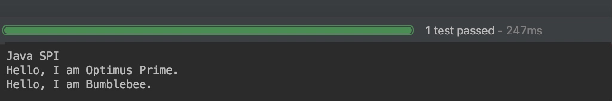
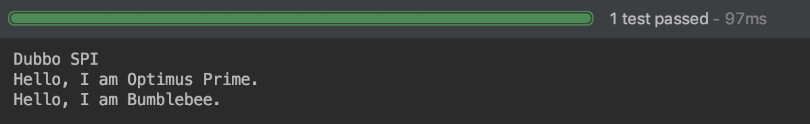

# dubbo spi 和自适应扩展机制详解

## 一、SPI 机制简介

### 0.Dubbo 可扩展机制简介

作为框架的维护者，在添加一个新功能时，只需要添加一些新代码，而不用大量的修改现有的代码，即符合开闭原则。 作为框架的使用者，在添加一个新功能时，不需要去修改框架的源码，在自己的工程中添加代码即可。 Dubbo很好的做到了上面两点。这要得益于Dubbo的微内核+插件的机制。接下来的章节中我们会慢慢揭开Dubbo扩展机制的神秘面纱。

Factory 模式 IoC容器 OSGI 容器，Dubbo 作为一个框架，不希望强依赖其他的 IoC 容器，比如 Spring，Guice。OSGI 也是一个很重的实现，不适合Dubbo。最终 Dubbo 的实现参考了 Java 原生的 SPI 机制，但对其进行了一些扩展，以满足 Dubbo 的需求。接下来，我们就更深入地了解下 Dubbo 的 SPI 机制。

Dubbo 扩展点机制基本概念 在深入学习 Dubbo 的扩展机制之前，我们先明确 Dubbo SPI 中的一些基本概念。在接下来的内容中，我们会多次用到这些术语。

**<font color="red">扩展点 (Extension Point) 是一个 Java 的接口。扩展 (Extension) 就是扩展点的实现类。 扩展实例 (Extension Instance) 是扩展点实现类的实例。 扩展自适应实例 (Extension Adaptive Instance) 第一次接触这个概念时，可能不太好理解。如果称它为扩展代理类，可能更好理解些。扩展的自适应实例其实就是一个 Extension 的代理，它实现了扩展点接口。在调用扩展点的接口方法时，会根据实际的参数来决定要使用哪个扩展。</font>**

比如一个 IRepository 的扩展点，有一个 save 方法。有两个实现 MysqlRepository 和 MongoRepository。IRepository 的自适应实例在调用接口方法的时候，会根据 save 方法中的参数，来决定要调用哪个 IRepository 的实现。如果方法参数中有 repository=mysql，那么就调用 MysqlRepository 的 save 方法。如果 repository=mongo，就调用 MongoRepository 的 save 方法。和面向对象的延迟绑定很类似。

### 1.SPI 简介

SPI 全称为 Service Provider Interface，是一种服务发现机制。**<font color="red">SPI 的本质是将接口实现类的全限定名配置在文件中，接着读取配置文件，遍历加载实现类</font>**。正因此特性，我们可以很容易的通过 SPI 机制为我们的程序提供拓展功能。SPI 机制在第三方框架中也有所应用，比如 Dubbo 就是通过 SPI 机制加载所有的组件。不过，Dubbo 并未使用 Java 原生的 SPI 机制，而是对其进行了增强，使其能够更好的满足需求。在 Dubbo 中，SPI 是一个非常重要的模块。基于 SPI，我们可以很容易的对 Dubbo 进行拓展。如果大家想要学习 Dubbo 的源码，SPI 机制务必弄懂。

需要特别说明的是，本篇文章以及本系列其他文章所分析的源码版本均为 dubbo-2.6.4。

Java SPI 机制还存在以下几点不足：

- **<font color="red">需要遍历所有的实现，并实例化，然后我们在循环中才能找到我们需要的实现</font>**。 
- 配置文件中只是简单的列出了所有的扩展实现，而没有给他们命名。导致在程序中很难去准确的引用它们。 
- 扩展如果依赖其他的扩展，做不到自动注入和装配 不提供类似于 Spring 的 IOC 功能 ，因此扩展很难和其他的框架集成，比如扩展里面依赖了一个 Spring bean，原生的 Java SPI 不支持 所以Java SPI 应付一些简单的场景是可以的，但对于 Dubbo，它的功能还是比较弱的。Dubbo 对原生 SPI 机制进行了一些扩展。

### 2.SPI 示例

#### 2.1 Java SPI 示例

前面简单介绍了 SPI 机制的原理，本节通过一个示例演示 Java SPI 的使用方法。首先，我们定义一个接口，名称为 Robot。

```java{.line-numbers}
public interface Robot {
    void sayHello();
} 
```

接下来定义两个实现类，分别为 OptimusPrime 和 Bumblebee：

```java{.line-numbers}
public class OptimusPrime implements Robot {
    @Override
    public void sayHello() {
        System.out.println("Hello, I am Optimus Prime.");
    }
}

public class Bumblebee implements Robot {
    @Override
    public void sayHello() {
        System.out.println("Hello, I am Bumblebee.");
    }
} 
```

接下来 META-INF/services 文件夹下创建一个文件，名称为 Robot 的全限定名 **`org.apache.spi.Robot`**。文件内容为实现类的全限定的类名，如下：

```shell{.line-numbers}
org.apache.spi.OptimusPrime
org.apache.spi.Bumblebee
```

做好所需的准备工作，接下来编写代码进行测试：

```java{.line-numbers}
public class JavaSPITest {
    @Test
    public void sayHello() throws Exception {
        ServiceLoader<Robot> serviceLoader = ServiceLoader.load(Robot.class);
        System.out.println("Java SPI");
        serviceLoader.forEach(Robot::sayHello);
    }
} 
```

最后来看一下测试结果，如下：

<div align="center">
    
</div>

从测试结果可以看出，我们的两个实现类被成功的加载，并输出了相应的内容。关于 Java SPI 的演示先到这里，接下来演示 Dubbo SPI。

#### 2.2 Dubbo SPI 示例

Dubbo 并未使用 Java SPI，而是重新实现了一套功能更强的 SPI 机制。Dubbo SPI 的相关逻辑被封装在了 ExtensionLoader 类中，通过 ExtensionLoader，我们可以加载指定的实现类。Dubbo SPI 所需的配置文件需放置在 META-INF/dubbo 路径下，配置内容如下。

```shell{.line-numbers}
optimusPrime = org.apache.spi.OptimusPrime
bumblebee = org.apache.spi.Bumblebee
```

与 Java SPI 实现类配置不同，Dubbo SPI 是通过键值对的方式进行配置，这样我们可以按需加载指定的实现类。另外，在测试 Dubbo SPI 时，需要在 Robot 接口上标注 @SPI 注解。下面来演示 Dubbo SPI 的用法：

```java{.line-numbers}
public class DubboSPITest {
    @Test
    public void sayHello() throws Exception {
        ExtensionLoader<Robot> extensionLoader = 
            ExtensionLoader.getExtensionLoader(Robot.class);
        Robot optimusPrime = extensionLoader.getExtension("optimusPrime");
        optimusPrime.sayHello();
        Robot bumblebee = extensionLoader.getExtension("bumblebee");
        bumblebee.sayHello();
    }
} 
```

测试结果如下：

<div align="center">
    
</div>

Dubbo SPI 除了支持按需加载接口实现类，还增加了 IOC 和 AOP 等特性。

## 二、自适应拓展机制简介

### 1.原理

在 Dubbo 中，很多拓展都是通过 SPI 机制进行加载的，比如 Protocol、Cluster、LoadBalance 等。有时，有些拓展并不想在框架启动阶段被加载，而是希望在拓展方法被调用时，根据运行时参数进行加载。这听起来有些矛盾。拓展未被加载，那么拓展方法就无法被调用（静态方法除外）。拓展方法未被调用，拓展就无法被加载。

对于这个矛盾的问题，Dubbo 通过自适应拓展机制很好的解决了。自适应拓展机制的实现逻辑比较复杂，首先 Dubbo 会为拓展接口生成具有代理功能的代码。然后通过 javassist 或 jdk 编译这段代码，得到 Class 类。最后再通过反射创建代理类，整个过程比较复杂。为了让大家对自适应拓展有一个感性的认识，下面我们通过一个示例进行演示。这是一个与汽车相关的例子，我们有一个车轮制造厂接口 WheelMaker：

```java{.line-numbers}
public interface WheelMaker {
    Wheel makeWheel(URL url);
} 

WheelMaker 接口的自适应实现类如下：

public class AdaptiveWheelMaker implements WheelMaker {
    public Wheel makeWheel(URL url) {
        if (url == null) {
            throw new IllegalArgumentException("url == null");
        }

        // 1.从 URL 中获取 WheelMaker 名称
        String wheelMakerName = url.getParameter("wheel.maker");
        if (wheelMakerName == null) {
            throw new IllegalArgumentException("wheelMakerName == null");
        }

        // 2.通过 SPI 加载具体的 WheelMaker
        WheelMaker wheelMaker = ExtensionLoader.getExtensionLoader(WheelMaker.class).getExtension(wheelMakerName);

        // 3.调用目标方法
        return wheelMaker.makeWheel(url);
    }
} 
```

**<font color="red">AdaptiveWheelMaker 是一个代理类，与传统的代理逻辑不同，AdaptiveWheelMaker 所代理的对象是在 makeWheel 方法中通过 SPI 加载得到的</font>**。makeWheel 方法主要做了三件事情：

1. 从 URL 中获取 WheelMaker 名称
2. 通过 SPI 加载具体的 WheelMaker 实现类
3. 调用目标方法

接下来，我们来看看汽车制造厂 CarMaker 接口与其实现类。

```java{.line-numbers}
public interface CarMaker {
    Car makeCar(URL url);
}

public class RaceCarMaker implements CarMaker {
    WheelMaker wheelMaker;

    // 通过 setter 注入 AdaptiveWheelMaker
    public setWheelMaker(WheelMaker wheelMaker) {
        this.wheelMaker = wheelMaker;
    }

    public Car makeCar(URL url) {
        Wheel wheel = wheelMaker.makeWheel(url);
        return new RaceCar(wheel, ...);
    }
}
```

RaceCarMaker 持有一个 WheelMaker 类型的成员变量，在程序启动时，我们可以将 AdaptiveWheelMaker 通过 setter 方法注入到 RaceCarMaker 中。在运行时，假设有这样一个 url 参数传入：

```java{.line-numbers}
dubbo://192.168.0.101:20880/XxxService?wheel.maker=MichelinWheelMaker
```

RaceCarMaker 的 makeCar 方法将上面的 url 作为参数传给 AdaptiveWheelMaker 的 makeWheel 方法，makeWheel 方法从 url 中提取 wheel.maker 参数，得到 MichelinWheelMaker。之后再通过 SPI 加载配置名为 MichelinWheelMaker 的实现类，得到具体的 WheelMaker 实例。

上面的示例展示了自适应拓展类的核心实现----在拓展接口的方法被调用时，通过 SPI 加载具体的拓展实现类，并调用拓展对象的同名方法。接下来，我们深入到源码中，探索自适应拓展类生成的过程。

### 2.接口自适应与 @Adaptive 接口

Dubbo 充分利用面向对象思想，每一个组件内引入其他组件都是以接口的形式进行依赖，动态的 inject 实现类。所以这种思想上也用到了 AOP 和 DI 的思想。我们定义一个接口 Registry，假定它的功能是将本地服务暴露到注册中心，以及从注册中心获取可用服务，属于 RPC 框架中的服务注册与发现组件。

```java{.line-numbers}
@SPI("zookeeper")
public interface Registry {
    /**
     * 注册服务
     */
    @Adaptive()
    String register(URL url, String content);
    /**
     * 发现服务
     */
    @Adaptive()
    String discovery(URL url, String content);
} 
```

@SPI 注解标注这是一个可扩展的组件。该接口定义了两个方法 register和 discovery，分别代表注册服务和发现服务。两个方法中都有 URL 参数，该类是 Dubbo 内置的类，代表了 Dubbo 整个执行过程中的上下文信息，包括各类配置信息，参数等。content 代表备注信息。@Adaptive()注解表明这两个方法都是自适应方法，具体作用后文分析。

下面分别是两个实现类 ZookeeperRegistry 、EtcdRegistry。

```java{.line-numbers}
public class ZookeeperRegistry implements Registry {
    private Logger logger = LoggerFactory.getLogger(ZookeeperRegistry.class);

    @Override
    public String register(URL url, String content) {
        logger.info("服务: {} 已注册到zookeeper上，备注: {}", url.getParameter("service"), content);

        return "Zookeeper register already! ";
    }

    @Override
    public String discovery(URL url, String content) {
        logger.info("zookeeper上发现服务: {} , 备注: {}", url.getParameter("service"), content);

        return "Zookeeper discovery already! ";
    }
}

public class EtcdRegistry implements Registry {

    private Logger logger = LoggerFactory.getLogger(ZookeeperRegistry.class);

    @Override
    public String register(URL url, String content) {
        logger.info("服务: {} 已注册到 Etcd 上，备注: {}", url.getParameter("service"), content);

        return "Etcd register already! ";
    }

    @Override
    public String discovery(URL url, String content) {
        logger.info("Etcd 上发现服务: {} , 备注: {}", url.getParameter("service"), content);

        return "Etcd discovery already! ";
    }
}
```

我们可以将服务注册信息注册到老牌注册中心 zookeeper 上，或者使用新兴流行轻量级注册中心 etcd 上。

### 3.配置扩展点实现信息到 Resource 目录下

在 Resource 下的 META-INF.dubbo 下新建 以Registry 全限定名为名的文件，配置实现类信息，以 key-value 的形式。（这里要注意与 JDK 默认的 SPI 机制的区别）。文件内内容如下：

```shell{.line-numbers}
etcd=com.maple.spi.impl.EtcdRegistry
zookeeper=com.maple.spi.impl.ZookeeperRegistry 
```

### 4.测试 Dubbo SPI 自适应类

```java{.line-numbers}
public class Main {
    public static void main(String[] args) {
        URL url = URL.valueOf("test://localhost/test").addParameter("service", "helloService");
        Registry registry = ExtensionLoader.getExtensionLoader(Registry.class).getAdaptiveExtension();
        String register = registry.register(url, "maple");
        System.out.println(register);
    }
} 
```

该程序首先通过 Registry 接口得到它专属的 ExtensionLoader 实例，然后调用 getAdaptiveExtension 拿到该接口的自适应类。Dubbo 会判断是否有实现类(即实现了 Registry 接口) 上有注解 @Adaptive，如果没有就会动态生成。本例子将会动态生成。

直接运行程序结果如下,程序最终选择的实现类是 ZookeeperRegistry，控制台结果如下:

```shell{.line-numbers}
09-20 23:43:13 323 main INFO - 服务: helloService 已注册到zookeeper上，备注: maple
Zookeeper register already!
```

上面代码我们没有看到任何实现类的信息，Dubbo SPI 机制会为动态的去调用实现类。我们重点分析 getAdaptiveExtension方法找到的是 Registry 的自适应类，可以理解为是 Registry 的一个适配器和代理类。如果该适配器类不存在，Dubbo 会通过动态代理方式在运行时自动生成一个自适应类。

打开 DEBUG 日志，在控制台我们看到了 Dubbo 生成的类的源码如下：

```java{.line-numbers}
package com.maple.spi;

import com.alibaba.dubbo.common.extension.ExtensionLoader;

public class Registry$Adaptive implements com.maple.spi.Registry {
    public java.lang.String register(com.alibaba.dubbo.common.URL arg0, java.lang.String arg1) {
        if (arg0 == null) throw new IllegalArgumentException("url == null");
        com.alibaba.dubbo.common.URL url = arg0;
        String extName = url.getParameter("registry", "zookeeper");
        if (extName == null)
            throw new IllegalStateException("Fail to get extension(com.maple.spi.Registry) name from url(" + url.toString() + ") use keys([registry])");
        com.maple.spi.Registry extension = (com.maple.spi.Registry) ExtensionLoader.getExtensionLoader(com.maple.spi.Registry.class).getExtension(extName);
        return extension.register(arg0, arg1);
    }

    public java.lang.String discovery(com.alibaba.dubbo.common.URL arg0, java.lang.String arg1) {
        if (arg0 == null) throw new IllegalArgumentException("url == null");
        com.alibaba.dubbo.common.URL url = arg0;
        String extName = url.getParameter("registry", "zookeeper");
        if (extName == null)
            throw new IllegalStateException("Fail to get extension(com.maple.spi.Registry) name from url(" + url.toString() + ") use keys([registry])");
        com.maple.spi.Registry extension = (com.maple.spi.Registry) ExtensionLoader.getExtensionLoader(com.maple.spi.Registry.class).getExtension(extName);
        return extension.discovery(arg0, arg1);
    }
} 
```

看代码，该适配器类的作用是类似于 AOP 的功能，再调用具体的实现类之前，先通过 **`ExtensionLoader.getExtensionLoader(Registry.class).getExtension(extName);`**
根据 extName 去 loader 具体的实现类，然后再去调用实现类的相应的方法。分析上面代码中的一句：

```java{.line-numbers}
String extName = url.getParameter("registry", "zookeeper");
``` 

extName 可以通过 url 进行传递，默认值为 zookeeper, 该默认值即为我们定义的接口上的注解 **`@SPI`** 里的内容，上文我们定义的 **`@SPI("zookeeper")`**，所以这里的默认值为 zookeeper, 当 url 中没有对应的参数时，我们会去拿默认值。我们可以修改 Main 测试程序，增加 key 为 registry 的 parameter：

```java{.line-numbers}
public static void main(String[] args) {
      URL url = URL.valueOf("test://localhost/test").addParameter("service", "helloService").addParameter("registry","etcd");
      Registry registry = ExtensionLoader.getExtensionLoader(Registry.class).getAdaptiveExtension();
      String register = registry.register(url, "maple");
      System.out.println(register);
} 
```

在 URL 中增加 Key，并设置值为 etcd，运行程序，结果如下：

```shell{.line-numbers}
09-20 23:44:00 009 main INFO - 服务: helloService 已注册到 Etcd 上，备注: maple
Etcd register already!
``` 

所以，Registry 接口的实现类已经被切换为 EtcdRegistry 了。

### 5.@Adaptive 注意细节

```java{.line-numbers}
public @interface Adaptive {
    String[] value() default {};
}
```

细心的读者已经发现了 @Adaptive 有 value 这个属性。上文在接口方法上定义的 @Adaptive 是没有设置值的。如果没有定义值，Dubbo 默认会使用一种策略生成。这种策略是将类名定义的驼峰法则转换为小写，并以 .号区分。 例如上文的接口名为 Registry，那么这个Key 值就是 registry。如果接口名为 HelloWorld，Key 值就为 hello.world。

**<font color="red">当然如果 @Adaptive 是有值的话，优先按里面的这个值来作为 Key</font>**，例如 Dubbo 框架中的接口 RegistryFactory ,该接口的自适应类将会从 URL 以 protocol 为 key 来找实现类的 extName。

```java{.line-numbers}
@SPI("dubbo")
public interface RegistryFactory {
   @Adaptive({"protocol"})
    Registry getRegistry(URL url);
} 
```
