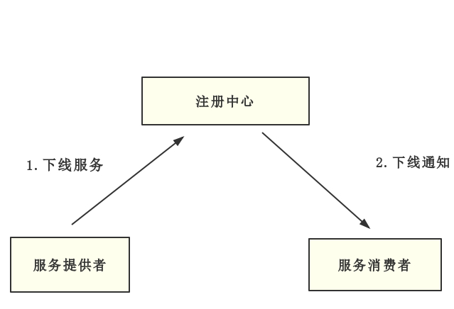
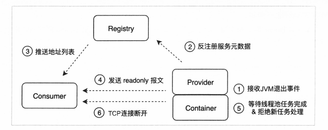

# Dubbo 优雅停机

## 一、Java 优雅停机介绍

### 1.kill -9 和kill -15的区别

在以前，我们发布 WEB 应用通常的步骤是将代码打成 war 包，然后丢到一个配置好了应用容器（如 Tomcat，Weblogic）的 Linux 机器上，这时候我们想要启动 / 关闭应用，方式很简单，运行其中的启动 / 关闭脚本即可。而 springboot 提供了另一种方式，将整个应用连同内置的 tomcat 服务器一起打包，这无疑给发布应用带来了很大的便捷性，与之而来也产生了一个问题：如何关闭 springboot 应用呢？一个显而易见的做法便是，根据应用名找到进程 id，杀死进程 id 即可达到关闭应用的效果。

上述的场景描述引出了我的疑问：怎么优雅地杀死一个 springboot 应用进程呢？这里仅仅以最常用的 Linux 操作系统为例，在 Linux 中 kill 指令负责杀死进程，其后可以紧跟一个数字，代表信号编号 (Signal)，执行 kill -l 指令，可以一览所有的信号编号。

```shell
xu@ntzyz-qcloud ~ % kill -l                                                                     
HUP INT QUIT ILL TRAP ABRT BUS FPE KILL USR1 SEGV USR2 PIPE ALRM TERM STKFLT CHLD CONT STOP TSTP TTIN TTOU URG XCPU XFSZ VTALRM PROF WINCH POLL PWR SYS 
```

这里主要介绍下第 9 个信号编码与第 15 个信号编码的区别。

#### 1.1.`kill pid、kill -15 pid`

系统会发送一个 SIGTERM 的信号给对应的程序。当程序接收到该 signal 后，将会发生以下的事情：

- 程序立刻停止
- 当程序释放相应资源后再停止
- 程序可能仍然继续运行

大部分程序接收到 SIGTERM 信号后，会先释放自己的资源，然后在停止。但是也有程序可以在接受到信号量后，做一些其他的事情，并且这些事情是可以配置的。如果程序正在等待 I/O，可能就不会立马做出相应。也就是说，SIGTERM 多半是会被阻塞的、忽略。另外，值得注意的是，kill -15 pid 和 ctrl + c 的效果一样。

#### 1.2.`kill -9 pid`

简单说，kill -9 pid 可以理解为操作系统从内核级别强行杀死某个进程。

#### 1.3.测试

增加一个实现了 **`DisposableBean`** 接口的类：

```java{.line-numbers}
@Component
public class TestDisposableBean implements DisposableBean{
    @Override
    public void destroy() throws Exception {
        System.out.println("测试 Bean 已销毁 ...");
    }
} 
```

增加 **`JVM`** 关闭时的钩子：

```java{.line-numbers}
@SpringBootApplication
@RestController
public class TestShutdownApplication implements DisposableBean {

    public static void main(String[] args) {
        SpringApplication.run(TestShutdownApplication.class, args);
        Runtime.getRuntime().addShutdownHook(new Thread(new Runnable() {
            @Override
            public void run() {
                System.out.println("执行 ShutdownHook ...");
            }
        }));
    }
} 
```

测试步骤：

1. 执行 **`java -jar test-shutdown-1.0.jar`** 将应用运行起来
2. 测试 **`kill -9 pid，kill -15 pid`**，ctrl + c 后输出日志内容

测试结果中 **`kill -15 pid`** & **`ctrl + c`**，效果一样，输出结果如下：

```java{.line-numbers}
 1 2018-01-14 16:55:32.424  INFO 8762 --- [Thread-3] ationConfigEmbeddedWebApplicationContext : Closing org.springframework.boot.context.embedded.AnnotationConfigEmbeddedWebApplicationContext@2cdf8d8a: startup date [Sun Jan 14 16:55:24 UTC 2018]; root of context hierarchy
 2 2018-01-14 16:55:32.432  INFO 8762 --- [Thread-3] o.s.j.e.a.AnnotationMBeanExporter        : Unregistering JMX-exposed beans on shutdown
 3 执行 ShutdownHook ...
 4 测试 Bean 已销毁 ...
 5 java -jar test-shutdown-1.0.jar  7.46s user 0.30s system 80% cpu 9.674 total 
```

**`kill -9 pid`**，没有输出任何应用日志：

```shell
[1]    8802 killed     java -jar test-shutdown-1.0.jar
java -jar test-shutdown-1.0.jar  7.74s user 0.25s system 41% cpu 19.272 total 
```

### 2.ShutdownHook

#### 2.1.介绍

Java 语言提供一种 ShutdownHook（钩子）机制，当 JVM 接受到系统的关闭通知之后，调用 ShutdownHook 内的方法，用以完成清理操作，从而平滑的退出应用。ShutdownHook 代码如下：

```java{.line-numbers}
Runtime.getRuntime().addShutdownHook(new Thread(() -> {
    System.out.println("关闭应用，释放资源");
})); 
```

**`Runtime.getRuntime().addShutdownHook(Thread)`** 需要传入一个线程对象，后续动作将会在该线程内异步完成。除了主动关闭应用（使用 kill -15 指令）,以下场景也将会触发 ShutdownHook :

- 代码执行结束，JVM 正常退出
- 应用代码中调用 System#exit 方法
- 应用中发生 OOM 错误，导致 JVM 关闭
- 终端中使用 Ctrl+C (非后台运行)或者 kill -9 pid 指令(强行杀死某个进程)
    
目前很多开源框架都是基于这个机制实现优雅停机，比如 Dubbo，Spring 等。

#### 2.2.注意点

ShutdownHook 代码实现起来相对简单，但是我们还是需要小心下面这些坑。

**1.`Runtime.getRuntime().addShutdownHook(Thread)` 可以被多次调用**

我们可以多次调用 **`Runtime.getRuntime().addShutdownHook(Thread)`** 方法，从而增加多个钩子。但是需要注意的是，多个 ShutdownHook 之间并无任何顺序，Java 并不会按照加入顺序执行，反而将会并发执行。所以尽量在一个 ShutdownHook 完成所有操作。

**2.ShutdownHook 需要尽快执行结束**

不要在 ShutdownHook 执行需要被阻塞代码，如 I/O 读写，这样就会导致应用短时间不能被关闭。

```java{.line-numbers}
Runtime.getRuntime().addShutdownHook(new Thread(() -> {
    while (true) {
        System.out.println("关闭应用，释放资源");
    }
}));
```

上面代码中，我们使用 while(true) 模拟长时间阻塞这种极端情况，关闭该应用时，应用将会一直阻塞在 while 代码中，导致应用没办法被关闭。除了阻塞之外，还需要小心其他会让线程阻塞的行为，比如死锁。为了避免 ShutdownHook 线程被长时间阻塞，我们可以引入超时进制。如果等待一定时间之后，ShutdownHook 还未完成，由脚本直接调用 kill -9 强制退出或者 ShutdownHook 代码中引入超时进制。

### 3.如何销毁作为成员变量的线程池

尽管 JVM 关闭时会帮我们回收一定的资源，但一些服务如果大量使用异步回调，定时任务，处理不当很有可能会导致业务出现问题，在这其中，线程池如何关闭是一个比较典型的问题。我们需要想办法在应用关闭时（JVM 关闭，容器停止运行），关闭线程池。

初始方案：什么都不做。在一般情况下，这不会有什么大问题，因为 JVM 关闭，会释放之，但显然没有做到本文一直在强调的两个字，没错———优雅。这个方法的弊端在于线程池中提交的任务以及阻塞队列中未执行的任务变得极其不可控，接收到停机指令后是立刻退出？还是等待任务执行完成？抑或是等待一定时间任务还没执行完成则关闭？

方案改进：发现初始方案的劣势后，我立刻想到了使用 **`DisposableBean`** 接口，像这样：

```java{.line-numbers}
@Service
public class SomeService implements DisposableBean {

    ExecutorService executorService = Executors.newFixedThreadPool(10);

    public void concurrentExecute() {
        executorService.execute(new Runnable() {
            @Override
            public void run() {
                System.out.println("executed...");
            }
        });
    }

    @Override
    public void destroy() throws Exception {
        executorService.shutdownNow();
        //executorService.shutdown();
    }
} 
```

紧接着问题又来了，是 shutdown 还是 shutdownNow 呢？这两个方法还是经常被误用的，简单对比这两个方法。

**1.`shutdown` 方法**

```java{.line-numbers}
/**
      * Initiates an orderly shutdown in which previously submitted
      * tasks are executed, but no new tasks will be accepted.
      * Invocation has no additional effect if already shut down.
      *
      * <p>This method does not wait for previously submitted tasks to
      * complete execution.  Use {@link #awaitTermination awaitTermination}
      * to do that.
      *
      * @throws SecurityException if a security manager exists and
      *         shutting down this ExecutorService may manipulate
      *         threads that the caller is not permitted to modify
      *         because it does not hold {@link
      *         java.lang.RuntimePermission}{@code ("modifyThread")},
      *         or the security manager's {@code checkAccess} method
      *         denies access.
      */
void shutdown(); 
```

当我们调用 shutdown() 方法后，**此时线程池不再接受新的任务**，如果我们再向线程池中提交任务，将会抛 RejectedExecutionException 异常。如果线程池的 shutdown() 方法已经调用过，重复调用没有额外效应。注意，当我们调用 shutdown() 方法后，**会立即从该方法中返回，而不会阻塞等待线程池中的先前提交的任务执行完再返回**，如果希望阻塞等待可以调用 awaitTermination() 方法。

**2.`shutdownNow` 方法**

```java{.line-numbers}
/**
     * Attempts to stop all actively executing tasks, halts the
     * processing of waiting tasks, and returns a list of the tasks
     * that were awaiting execution.
     *
     * <p>This method does not wait for actively executing tasks to
     * terminate.  Use {@link #awaitTermination awaitTermination} to
     * do that.
     *
     * <p>There are no guarantees beyond best-effort attempts to stop
     * processing actively executing tasks.  For example, typical
     * implementations will cancel via {@link Thread#interrupt}, so any
     * task that fails to respond to interrupts may never terminate.
     *
     * @return list of tasks that never commenced execution
     * @throws SecurityException if a security manager exists and
     *         shutting down this ExecutorService may manipulate
     *         threads that the caller is not permitted to modify
     *         because it does not hold {@link
     *         java.lang.RuntimePermission}{@code ("modifyThread")},
     *         or the security manager's {@code checkAccess} method
     *         denies access.
     */
List<Runnable> shutdownNow(); 
```

当我们调用了 **`shutdownNow()`** 方法后，调用线程立马从该方法返回，而不会阻塞等待正在执行的任务执行完毕，如果希望阻塞等待可以调用 **`awaitTermination()`** 方法。这也算 **`shutdownNow()`** 和 **`shutdown()`** 方法的一个相同点。与 **`shutdown()`** 方法不同的是，**`shutdownNow()`** 方法调用后，线程池会通过调用 worker 线程的 interrupt 方法尽最大努力 (best-effort) 去"终止"已经运行的任务。

值得注意的是，当我们调用一个线程的 **`interrupt()`** 方法后（前提是 caller 线程有权限，否则抛异常），该线程并不一定会立马退出：

- 如果线程处于被阻塞状态（例如处于 sleep, wait, join 等状态），那么线程立即退出被阻塞状态，并抛出一个 InterruptedException 异常。
- 如果线程处于正常的工作状态，该方法只会设置线程的一个状态位为true而已，线程会继续执行不受影响。如果想停止线程运行可以在任务中检查当前线程的状态 **`Thread.isInterrupted()`** 自己实现停止逻辑。

**简单来说，就是调用了 **`shutdownNow()`** 方法后，会变成 STOP 状态，并对执行中的线程调用Thread.interrupt 方法，但如果线程未处理中断，则不会有任何事发生，所以是“尽最大努力”**。

最终得到的线程池的优雅关闭方案如下：

```java{.line-numbers}
public abstract class ExecutorConfigurationSupport extends CustomizableThreadFactory
    implements DisposableBean {
    @Override
    public void destroy() {
       shutdown();
    }

    /**
    * Perform a shutdown on the underlying ExecutorService.
    * @see java.util.concurrent.ExecutorService#shutdown()
    * @see java.util.concurrent.ExecutorService#shutdownNow()
    * @see #awaitTerminationIfNecessary()
    */
    public void shutdown() {
       if (this.waitForTasksToCompleteOnShutdown) {
           this.executor.shutdown();
       } else {
           this.executor.shutdownNow();
       }
       awaitTerminationIfNecessary();
    }

    /**
    * Wait for the executor to terminate, according to the value of the
    * {@link #setAwaitTerminationSeconds "awaitTerminationSeconds"} property.
    */
    private void awaitTerminationIfNecessary() {
       if (this.awaitTerminationSeconds > 0) {
           try {
               this.executor.awaitTermination(this.awaitTerminationSeconds, TimeUnit.SECONDS));
           } catch (InterruptedException ex) {
               Thread.currentThread().interrupt();
           }
       }
    }
} 
```

1. 通过 waitForTasksToCompleteOnShutdown 标志来控制是想立刻终止所有任务的执行（也就是是否调用 worker 线程的 interrupt 方法），还是等待任务执行完成后退出。
2. executor.awaitTermination(this.awaitTerminationSeconds, TimeUnit.SECONDS); 控制等待的时间，防止任务无限期的运行（前面已经强调过了，即使是 shutdownNow 也不能保证线程一定停止运行）。

## 二、Dubbo 优雅停机待解决的问题

为了实现优雅停机，Dubbo 需要解决一些问题：

- 若关闭服务提供者，不再接受新的请求，已经接收到服务请求，需要处理完毕才能下线服务。
- 若关闭服务消费者，不再继续发送新的请求，已经发出的服务请求，需要等待响应返回。

解决以上两个问题，才能使停机对业务影响降低到最低，做到优雅停机。

## 三、Dubbo 2.5.X

Dubbo 优雅停机在 2.5.X 版本实现比较完整，这个版本的实现相对简单，比较容易理解。所以我们先以 Dubbo 2.5.X 版本源码为基础，先来看一下 Dubbo 如何实现优雅停机。

### 3.1 优雅停机总体实现方案

优雅停机入口类位于 AbstractConfig 静态代码中，源码如下：

```java{.line-numbers}
static {
    Runtime.getRuntime().addShutdownHook(new Thread(new Runnable() {
       public void run() {
           if (logger.isInfoEnabled()) {
               logger.info("Run shutdown hook now.");
           }
           ProtocolConfig.destroyAll();
       }
    }, "DubboShutdownHook"));
}
```

这里将会注册一个 ShutdownHook，一旦应用停机将会触发调用 ProtocolConfig.destroyAll()。其中，ProtocolConfig.destroyAll() 的源代码如下：

```java{.line-numbers}
// class:ProtocolConfig
public static void destroyAll() {
    // 防止并发调用
    if (!destroyed.compareAndSet(false, true)) {
        return;
    }
    // 先注销注册中心
    AbstractRegistryFactory.destroyAll();

    // Wait for registry notification
    try {
        // 默认等待 10s, 这是因为注册中心的发送给服务消费者通知服务下线的消息可能有延迟，
        // 所以给服务消费者一点时间
        Thread.sleep(ConfigUtils.getServerShutdownTimeout());
    } catch (InterruptedException e) {
        logger.warn("Interrupted unexpectedly when waiting for registry notification during shutdown process!");
    }

    ExtensionLoader<Protocol> loader = ExtensionLoader.getExtensionLoader(Protocol.class);
    // 再注销协议
    for (String protocolName : loader.getLoadedExtensions()) {
        try {
            Protocol protocol = loader.getLoadedExtension(protocolName);
            if (protocol != null) {
                protocol.destroy();
            }
        } catch (Throwable t) {
            logger.warn(t.getMessage(), t);
        }
    }
} 
```

从上面可以看出，Dubbo 优雅停机的步骤主要分为两步：

- 注销注册中心
- 注销所有 Protocol

### 3.2 注销注册中心

注销注册中心的源代码如下：

```java{.line-numbers}
// class:AbstractRegistryFactory
public static void destroyAll() {
    if (LOGGER.isInfoEnabled()) {
        LOGGER.info("Close all registries " + getRegistries());
    }
    // Lock up the registry shutdown process
    LOCK.lock();
    try {
        for (Registry registry : getRegistries()) {
            try {
                registry.destroy();
            } catch (Throwable e) {
                LOGGER.error(e.getMessage(), e);
            }
        }
        REGISTRIES.clear();
    }
    finally {
        // Release the lock
        LOCK.unlock();
    }
}
```

这个方法将会将会注销内部生成注册中心服务。注销注册中心内部逻辑比较简单，如下图片所示：

<div align="center">
    
</div>

以 ZK 为例，Dubbo 将会删除其对应服务节点，然后取消订阅，也就是取消注册在注册中心上的监听器。**由于 ZK 节点信息变更，ZK 服务端将会通知 dubbo 消费者下线该服务节点**，最后再关闭服务与 ZK 连接。通过注册中心，Dubbo 可以及时通知消费者下线服务，新的请求也不再发往下线的节点，也就解决上面提到的第一个问题：**新的请求不能再发往正在停机的 Dubbo 服务提供者**。

具体的源代码如下：

```java{.line-numbers}
// class:AbstractRegistry
public void destroy() {
    if (!destroyed.compareAndSet(false, true)) {
        return;
    }

    Set<URL> destroyRegistered = new HashSet<URL>(getRegistered());
    // 遍历所有已经注册到注册中心上的节点，取消注册
    if (!destroyRegistered.isEmpty()) {
        for (URL url : new HashSet<URL>(getRegistered())) {
            // 省略代码...
            unregister(url);
        }
    }
}

Map<URL, Set<NotifyListener>> destroySubscribed = new HashMap<URL, Set<NotifyListener>>(getSubscribed());
// 遍历所有已经注册到注册中心上的监听器（也就是 RegistryDirectory），取消注册
if (!destroySubscribed.isEmpty()) {
    for (Map.Entry<URL, Set<NotifyListener>> entry : destroySubscribed.entrySet()) {
        URL url = entry.getKey();
        for (NotifyListener listener : entry.getValue()) {
            // 省略代码...
            unsubscribe(url, listener);
        }
    }
}
```

但是这里还是存在一些弊端，由于网络的隔离，ZK 服务端与 Dubbo 连接可能存在一定延迟，ZK 通知可能不能在第一时间通知消费端。考虑到这种情况，在注销注册中心之后，加入等待进制，代码如下：

```java{.line-numbers}
// Wait for registry notification
try {
    Thread.sleep(ConfigUtils.getServerShutdownTimeout());
} catch (InterruptedException e) {
    logger.warn("Interrupted unexpectedly when waiting for registry notification during shutdown process!");
}
```

默认等待时间为 10000ms，可以通过设置 **`dubbo.service.shutdown.wait`** 覆盖默认参数。10s 只是一个经验值，可以根据实际情设置。不过这个等待时间设置比较讲究，不能设置成太短，太短将会导致消费端还未收到 ZK 通知，提供者就停机了。也不能设置太长，太长又会导致关停应用时间边长，影响发布体验。

### 3.3 注销 Protocol

```java{.line-numbers}
ExtensionLoader<Protocol> loader = ExtensionLoader.getExtensionLoader(Protocol.class);
// 再注销协议
for (String protocolName : loader.getLoadedExtensions()) {
    try {
        Protocol protocol = loader.getLoadedExtension(protocolName);
        if (protocol != null) {
            protocol.destroy();
        }
    } catch (Throwable t) {
        logger.warn(t.getMessage(), t);
    }
}
```

loader#getLoadedExtensions 将会返回两种 Protocol 子类，分别为 DubboProtocol 与 InjvmProtocol。DubboProtocol 用与服务端请求交互，而 InjvmProtocol 用于内部请求交互。如果应用调用自己提供 Dubbo 服务，不会再执行网络调用，直接执行内部方法。这里我们主要来分析一下 DubboProtocol 内部逻辑。DubboProtocol#destroy 源码（省略了异常捕获代码）：

```java{.line-numbers}
public void destroy() {
    for (String key : new ArrayList<String>(serverMap.keySet())) {
        ExchangeServer server = serverMap.remove(key);
        if (server != null) {
            // 在 timeout 时间内关闭 HeaderExchangeServer
            server.close(getServerShutdownTimeout());
        }
    }

    for (String key : new ArrayList<String>(referenceClientMap.keySet())) {
        ExchangeClient client = referenceClientMap.remove(key);
        if (client != null) {
            // 在 timeout 时间内关闭 HeaderExchangeClient
            client.close(getServerShutdownTimeout());
        }
    }

    for (String key : new ArrayList<String>(ghostClientMap.keySet())) {
        ExchangeClient client = ghostClientMap.remove(key);
        if (client != null) {
            client.close(getServerShutdownTimeout());
        }
    }
    stubServiceMethodsMap.clear();
    super.destroy();
}
```

Dubbo 默认使用 Netty 作为其底层的通讯框架，分为 Server 与 Client。Server 用于接收其他消费者 Client 发出的请求。上面源码中首先关闭 Server ，停止接收新的请求，然后再关闭 Client。这样做就降低服务被消费者调用的可能性。

### 3.4 关闭 HeaderExchangeServer

首先将会调用 HeaderExchangeServer#close，源码如下:

```java{.line-numbers}
// class:HeaderExchangeServer
public void close(final int timeout) {
    startClose();
    if (timeout > 0) {
        final long max = (long) timeout;
        final long start = System.currentTimeMillis();
        if (getUrl().getParameter(Constants.CHANNEL_SEND_READONLYEVENT_KEY, true)) {
            // 发送 ReadOnly 事件给服务消费者，通知服务下线
            sendChannelReadOnlyEvent();
        }
        // isRunning 方法判断服务器端是否还有客户端发送过来的任务正在执行
        while (HeaderExchangeServer.this.isRunning()
                && System.currentTimeMillis() - start < max) {
            try {
                Thread.sleep(10);
            } catch (InterruptedException e) {
                logger.warn(e.getMessage(), e);
            }
        }
    }
    // 关闭掉心跳
    doClose();
    server.close(timeout);
}

private boolean isRunning() {
    Collection<Channel> channels = getChannels();
    for (Channel channel : channels) {
        if (DefaultFuture.hasFuture(channel)) {
            return true;
        }
    }
    return false;
}

public static boolean hasFuture(Channel channel) {
    return CHANNELS.containsValue(channel);
}
```

这里将会向服务消费者发送 READ_ONLY 事件。消费者接受之后，主动排除这个节点，将请求发往其他正常节点。可能会有人有疑问，既然注册中心已经通知了最新服务列表，为什么还要再发送 readonly 报文呢？这里主要考虑到注册中心推送服务有网络延迟，以及客户端计算服务列表可能占用一些时间。

Dubbo 协议发送 readonly 时间报文时，consumer 端会设置响应的 provider 为不可用状态，下次负载均衡就不会调用下线的机器。**所以这样进一步降低了注册中心的通知延迟带来的影响，保证了第一点，也就是新的请求不能再发往正在停机的 Dubbo 提供者**。

而 isRunning 判断函数用来判断服务器端是否还有任务正在运行，如果有，则会先等待 timeout 时间，之后不管有没有任务正在执行，都会强制关闭。**即保证了若关闭服务提供者，已经接收到服务请求，需要处理完毕才能下线服务**。

接下来是关闭心跳检测。源码如下：

```java{.line-numbers}
// class:HeaderExchangeServer
private void doClose() {
    // 防止重复关闭
    if (!closed.compareAndSet(false, true)) {
        return;
    }
    // 关闭心跳机制
    stopHeartbeatTimer();
    try {
        // 关闭掉线程池
        scheduled.shutdown();
    } catch (Throwable t) {
        logger.warn(t.getMessage(), t);
    }
}
```

然后关闭 NettyServer，这里将会调用 NettyServer#close 方法,这个方法实际在 AbstractServer 处实现，源码如下：

```java{.line-numbers}
// class:AbstractServer
public void close(int timeout) {
    ExecutorUtil.gracefulShutdown(executor, timeout);
    close();
}

// class:AbstractServer
public AbstractServer(URL url, ChannelHandler handler) throws RemotingException {
    super(url, handler);
    // 省略代码
    DataStore dataStore = ExtensionLoader.getExtensionLoader(DataStore.class).getDefaultExtension();
    // 从 DataStore 获取保存的线程池，这个线程池是在 WrappedChannelHandler 的构造函数中保存到 DataStore中
    executor = (ExecutorService) dataStore.get(Constants.EXECUTOR_SERVICE_COMPONENT_KEY, Integer.toString(url.getPort()));
}

// class:WrappedChannelHandler
public WrappedChannelHandler(ChannelHandler handler, URL url) {
    // 省略代码
    // 使用自适应拓展机制来获取到对应的线程池 executor
    executor = (ExecutorService) ExtensionLoader.getExtensionLoader(ThreadPool.class).getAdaptiveExtension().getExecutor(url);
    String componentKey = Constants.EXECUTOR_SERVICE_COMPONENT_KEY;
    // 获取到 DataStore 扩展
    DataStore dataStore = ExtensionLoader.getExtensionLoader(DataStore.class).getDefaultExtension();
    // 将前面获取到的线程池 executor 保存到 DataStore 里面
    dataStore.put(componentKey, Integer.toString(url.getPort()), executor);
}
```

在 WrappedChannelHandler 中，获取到的线程池 execuor 是用来在 AllChannelHandler 中执行各种具体的任务，比如连接连上，连接断开，接收到消息等，也就包括了调用执行服务消费者所要求执行的方法。在关闭的时候，并不是简单地调用 shutdown 或者 shutdownNow，方法，具体的代码如下：

```java{.line-numbers}
// class:ExecutorUtil
public static void gracefulShutdown(Executor executor, int timeout) {
    if (!(executor instanceof ExecutorService) || isShutdown(executor)) {
        return;
    }
    final ExecutorService es = (ExecutorService) executor;
    try {
        // 调用 shutdown 方法，使得线程池不再接收到新的任务，但是 shutdown 会立即返回，而不是阻塞等待线程池中的
        // 正在执行的任务执行完毕
        es.shutdown(); // Disable new tasks from being submitted
    } catch (SecurityException ex2) {
        return;
    } catch (NullPointerException ex2) {
        return;
    }
    try {
        // 在调用了 shutdown 方法之后，调用 awaitTermination 方法会阻塞直到线程池中正在执行的任务执行完毕。
        // 如果所有执行的任务成功执行完成，则返回 true；如果等待超时，则返回 false；如果线程被中断，抛出中断异常。
        if (!es.awaitTermination(timeout, TimeUnit.MILLISECONDS)) {
            // 如果没有成功返回，也就是发生了超时，则直接关闭线程池
            es.shutdownNow();
        }
    } catch (InterruptedException ex) {
        es.shutdownNow();
        // 如果发生了中断异常，则将此线程的中断标志位设置为 true
        Thread.currentThread().interrupt();
    }
    if (!isShutdown(es)) {
        newThreadToCloseExecutor(es);
    }
}
```

所以，**通过上述优雅关闭线程池的方式和前面 isRunning 方法，共同保证了第二点，若关闭服务提供者，不再接受新的请求，已经接收到服务请求，需要处理完毕才能下线服务**。

Server 的关闭调用链如下：

```java
1 DubboProtocol#destroy
2 ->HeaderExchangeServer#close
3     ->AbstractServer#close
4     ->NettyServer#doClose 
```

### 3.5 关闭 Client

Client 关闭方式大致同 Server，这里主要介绍一下处理已经发出请求逻辑，代码位于 HeaderExchangeChannel#close。

```java{.line-numbers}
// class:HeaderExchangeClient
public void close(int timeout) {
    startClose();
    // 关闭心跳机制
    doClose();
    channel.close(timeout);
}

// class:HeaderExchangeClient
private void doClose() {
    stopHeartbeatTimer();
}

// class:HeaderExchangeChannel
public void close(int timeout) {
    if (closed) {
        return;
    }
    closed = true;
    if (timeout > 0) {
        long start = System.currentTimeMillis();
        // 阻塞等待 timeout 时间，服务消费者可能向服务提供者发送了请求，但是还在等待响应
        // 具体就是通过 DefaultFuture.hasFuture(channel) 这个方法判断是否还有响应
        while (DefaultFuture.hasFuture(channel)
                && System.currentTimeMillis() - start < timeout) {
            try {
                Thread.sleep(10);
            } catch (InterruptedException e) {
                logger.warn(e.getMessage(), e);
            }
        }
    }
    // 关闭 channel
    close();
}
```

关闭 Client 的时候，如果还存在未收到响应的信息请求，将会等待一定时间，直到确认所有请求都收到响应，或者等待时间超过超时时间。另外，Dubbo 请求会暂存在 DefaultFuture Map 中，所以只要简单判断一下 Map 就能知道请求是否都收到响应。**通过这一点我们就解决了第三个问题：若关闭服务消费者，已经发出的服务请求，需要等待响应返回**。

### 3.6 总结

优雅停机需要满足以下两个要求：

- 关闭服务提供者：不再接受服务请求，而对于正在执行的服务请求，等待其执行完毕之后再下线
- 关闭服务消费者：不再发送服务请求，而对于已经发送了的请求，需要等待其响应

Dubbo 优雅停机的总流程如下：

<div align="center">
    
</div>

Dubbo 中实现的优雅停机机制主要包含 6 个步骤：

1. 收到kill -9进程退出信号，会触发注册在 JVM 中的 ShutdownHook 来执行优雅停机操作
2. 注销注册中心：会取消注册在 ZK 端的服务元数据信息，并且取消注册在 ZK 端的监听器，最后关闭掉和 ZK 端的连接。因此 ZK 端会通知客户端，服务已经下线，**这就实现了服务端不再接受新的服务请求**
3. 注销 Protocol：
   1. Provider 端会关闭掉 HeaderExchangeServer 中的心跳检测，并且会发送 readonly 事件报文通知 consumer 当前服务不可用，**同样实现了服务端不再接受新的服务请求**。
   2. Provider 端会关闭掉 NettyServer，不过会等待 NettyServer 中的线程池中正在执行的任务执行完毕，这就实现了对于正在执行的服务请求，等待其执行完毕之后再下线。
   3. Consumer 端会首先将 ReferenceCountExchangeClient 中的引用计数减一，然后关闭掉 HeaderExchangeClient 中的心跳检测，并且在 HeaderExchangeClient 中，会检查 DefaultFuture 中是否还有当前 channel，如果有的话，说明还有请求在等待响应，就等待一段时间，**这就实现了对于已经发送了的请求，等待其响应**。接着关闭到服务端的连接，不会再发送新的请求到服务端。

Dubbo 优雅停机的时序图如下：

```java{.line-numbers}
 1 Registry 注销
 2 等待 -Ddubbo.service.shutdown.wait 秒，等待消费方收到下线通知
 3 Protocol 注销
 4     DubboProtocol 注销
 5         NettyServer 注销
 6             等待处理中的请求执行完毕
 7             停止发送心跳
 8             关闭 Netty 相关资源
 9         NettyClient 注销
10             等待服务器端的响应
11             停止发送心跳
12             关闭 Netty 相关资源
``` 
