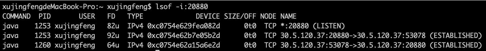

# Dubbo 心跳机制详解

## 1.长连接和短链接

TCP 本身并没有长短连接的区别 ，长短与否，完全取决于我们怎么用它。

- 短连接：每次通信时，创建 Socket；一次通信结束，调用 socket.close()。这就是一般意义上的短连接，短连接的好处是管理起来比较简单，存在的连接都是可用的连接，不需要额外的控制手段。
- 长连接：每次通信完毕后，不会关闭连接，这样可以做到连接的复用。 长连接的好处是省去了创建连接的耗时。
    
短连接和长连接的优势，分别是对方的劣势。想要图简单，不追求高性能，使用短连接合适，这样我们就不需要操心连接状态的管理；想要追求性能，使用长连接，我们就需要担心各种问题：比如 端对端连接的维护，连接的保活。短连接没有太多东西可以讲，所以下文我们将目光聚焦在长连接的一些问题上。纯讲理论未免有些过于单调，所以下文我借助一些 RPC 框架的实践来展开 TCP 的相关讨论。

## 2.服务框架中的长连接

前面已经提到过，追求性能时，必然会选择使用长连接，所以借助 Dubbo 可以很好的来理解 TCP。我们开启两个 Dubbo 应用，一个 server 负责监听本地 20880 端口（众所周知，这是 Dubbo 协议默认的端口），一个 client 负责循环发送请求。执行 lsof -i:20880 命令可以查看端口的相关使用情况：

<div align="center">
    
</div>

- *:20880 (LISTEN) 说明了 Dubbo 正在监听本地的 20880 端口，处理发送到本地 20880 端口的请求
- 后两条信息说明请求的发送情况，验证了 TCP 是一个双向的通信过程，由于我是在同一个机器开启了两个 Dubbo 应用，所以你能够看到是本地的 53078 端口与 20880 端口在通信。我们并没有手动设置 53078 这个客户端端口，它是随机的。通过这两条信息，阐释了一个事实： 即使是发送请求的一方，也需要占用一个端口 。
- 稍微说一下 FD 这个参数，他代表了 文件句柄 ，每新增一条连接都会占用新的文件句柄，如果你在使用 TCP 通信的过程中出现了 open too many files 的异常，那就应该检查一下，你是不是创建了太多连接，而没有关闭。

## 3.连接的保活

首先需要明确一点，为什么需要连接的保活？当双方已经建立了连接，但因为网络问题，链路不通，这样长连接就不能使用了。需要明确的一点是，通过 netstat，lsof 等指令查看到连接的状态处于 ESTABLISHED 状态并不是一件非常靠谱的事，因为连接可能已死，但没有被系统感知到，更不用提假死这种疑难杂症了。如果保证长连接可用是一件技术活。

首先想到的是 TCP 中的 KeepAlive 机制。KeepAlive 并不是 TCP 协议的一部分，但是大多数操作系统都实现了这个机制（所以需要在操作系统层面设置 KeepAlive 的相关参数）。**KeepAlive 机制开启后，在一定时间内（一般时间为 7200s，参数 tcp_keepalive_time）在链路上没有数据传送的情况下，TCP 层将发送相应的 KeepAlive 探针以确定连接可用性，探测失败后重试 10（参数 tcp_keepalive_probes）次，每次间隔时间 75s（参数 tcp_keepalive_intvl），所有探测失败后，才认为当前连接已经不可用**。

在 Netty 中开启 KeepAlive：

```java{.line-numbers}
bootstrap.option(ChannelOption.SO_KEEPALIVE, true) 
```

Linux 操作系统中设置 KeepAlive 相关参数，修改 /etc/sysctl.conf 文件：

```shell
1 net.ipv4.tcp_keepalive_time=90
2 net.ipv4.tcp_keepalive_intvl=15
3 net.ipv4.tcp_keepalive_probes=2
```

KeepAlive 机制是在网络层面保证了连接的可用性，但站在应用框架层面我们认为这还不够。主要体现在三个方面：

- KeepAlive 的开关是在应用层开启的，但是具体参数（如重试测试，重试间隔时间）的设置却是操作系统级别的，位于操作系统的 /etc/sysctl.conf 配置中，这对于应用来说不够灵活。
- KeepAlive 的保活机制只在链路空闲的情况下才会起到作用，假如此时有数据发送，且物理链路已经不通，操作系统这边的链路状态还是 ESTABLISHED，这时会发生什么？自然会走 TCP 重传机制，要知道默认的 TCP 超时重传，指数退避算法也是一个相当长的过程。
- KeepAlive 本身是面向网络的，并不面向于应用。也就是当应用由于本身的 GC 频繁，系统 load 高等情况，此时，应用已经失去了活性，连接应该被认为是不可用的，但从网络层的角度来看，连接仍然是通的。

我们已经为应用层面的连接保活做了足够的铺垫，下面就来一起看看，怎么在应用层做连接保活。

## 4.预备知识

### 4.1 心跳检测需要容错吗？

网络通信永远要考虑到最坏的情况，一次心跳失败，不能认定为连接不通，多次心跳失败，才能采取相应的措施。

### 4.2 心跳不需要忙检测？

忙检测的对立面是空闲检测，我们做心跳的初衷，是为了保证连接的可用性，以保证及时采取断连，重连等措施。如果一条通道上有频繁的 RPC 调用正在进行，我们不应该为通道增加负担去发送心跳包。心跳扮演的角色应当是晴天收伞，雨天送伞。

## 5.Dubbo 心跳方案的实现

Dubbo 采用的是双向心跳设计，也就是客户端会向服务端发送心跳，同时服务端也会向客户端发送心跳。客户端在 HeaderExchangeClient 中开启心跳逻辑，服务端在 HeaderExchangeServer 中开启心跳逻辑，也就是每隔 heartbeat 时间执行心跳任务 HeartbeatTask。HeartbeatTask 的功能如下：

- 遍历 channels 集合（对于客户端来说就是它连接到某个服务端的一条连接 channel；对于服务端来说，就是所有连接到它的 channel 集合）
- 对于每一个 channel，获取到这个 channel 上次发送消息的时间 lastWrite 以及上一次接收到消息的时间 lastRead
- 如果这个连接 channel 已经有 heartbeat 时间没有接收到消息或者发送消息（心跳消息和普通的数据消息），那么就发送一次心跳请求到对端（client 或者 server）
- 如果这个连接 channel 有 heartbeatTimeout 时间**没有接收到对方发送过来的任何请求**，如果当前是客户端，那么就进行重连；如果当前是服务端，那么就直接断开连接

在请求接收的 Handler 处理链路中，包含有一个心跳消息处理器 HeartbeatHandler，对于所有类型的请求消息，该 handler 都会更新对应通道中 KEY_READ_TIMESTAMP 值（最近一次接收消息的时间），当通过 HeartbeatHandler 发送请求时，该 handler 会更新对应通道中 KEY_WRITE_TIMESTAMP 值（最近一次发送消息的时间）。

- **对于心跳请求消息，该处理器接收心跳请求并构建对应的心跳响应通过通道 Channel 发送回去**；
- **对于心跳响应消息，打印 debug 日志后直接返回**；
- **对于其他数据，则交给另外的 handler 进行处理**。

我们在前面说过心跳需要满足两个要求：容错以及不要忙检测，接下来看上面的方案是如何实现的：

- 在 dubbo 中，默认是在 3 个心跳时间间隔内，heartbeatTimeout = heartbeat * 3，如果没有接收到另一方发送的心跳包或者其它数据，那么就会采取相应的措施。如果是客户端的话，就会进行重连操作；如果是服务器端，就会直接关闭连接。所以有容错功能，确保多次心跳失败，才能采取相应措施。
- 接收的一方更新 lastRead 字段，发送的一方更新 lastWrite 字段，超过心跳间隙的时间，便发送心跳请求给对端。这里的 lastRead/lastWrite 同样会被同一个通道上的普通调用更新，通过更新这两个字段，实现了只在连接空闲时才会真正发送空闲报文的机制。另外，不仅仅心跳请求会更新 lastRead 和 lastWrite，普通请求也会。

Dubbo 中和心跳有关的类是 HeartbeatTask、HeaderExchangeClient、HeaderExchangeServer 以及 HeartbeatHandler。

```java{.line-numbers}
// HeaderExchangeClient
private void startHeatbeatTimer() {
    // 开始新的心跳之前，先从线程池中移除掉之前的心跳包发送任务
    stopHeartbeatTimer();
    if (heartbeat > 0) {
        // 以固定的时间间隔向服务器发送心跳包，第一个heartbeat是initialDelay，第二个heartbeat是delay
        heartbeatTimer = scheduled.scheduleWithFixedDelay(
                new HeartBeatTask(new HeartBeatTask.ChannelProvider() {
                    public Collection<Channel> getChannels() {
                        // 这个方法主要用于只有一个元素的优化，减少内存分配，无需分配额外的内存，可以从SingletonList内部类看得出来,由于只有一个element,因此可以做到内存分配最小化。
                        // 采用这种方式是因为一个客户端对应于一个Channel，只需要往一个Channel上发送心跳包，而一个服务器Server则对应于多个Channel，需要往多个Channel上发送
                        // 同样的心跳包，两者都使用同样的HeartBeatTask类对象。因此对于客户端，即使只有一个Channel，也要将其包装成Collection对象
                        //
                        // HeaderExchangeClient是Channel的子类，所以这里将HeaderExchangeClient自己作为对象传入进去。
                        return Collections.<Channel>singletonList(HeaderExchangeClient.this);
                    }
                }, heartbeat, heartbeatTimeout),
                heartbeat, heartbeat, TimeUnit.MILLISECONDS);
    }
}
```

```java{.line-numbers}
// HeaderExchangeServer
private void startHeatbeatTimer() {
    stopHeartbeatTimer();
    if (heartbeat > 0) {
        heatbeatTimer = scheduled.scheduleWithFixedDelay(
                new HeartBeatTask(new HeartBeatTask.ChannelProvider() {
                    public Collection<Channel> getChannels() {
                        return Collections.unmodifiableCollection(
                                // 一个服务器端可能有多个客户端与其相连，所以可能有多个Channel，而且必须往其中的每一个Channel上
                                // 都发送心跳包。同时，HeaderExchangeServer不是Channel的子类，但是其中的server属性（也就是NettyServer类型对象）
                                // 中保存了连接到这个服务器的所有channel
                                HeaderExchangeServer.this.getChannels());
                    }
                }, heartbeat, heartbeatTimeout),
                heartbeat, heartbeat, TimeUnit.MILLISECONDS);
    }
}
```

```java{.line-numbers}
/**
 * 使用 ScheduledThreadPoolExecutor 来进行定时发送心跳包的任务，每个任务的执行间隔为 heartbeat。在任务的执行过程中，如果发现
 * 连接最近处于空闲状态，也就是最近连接双方没有发送过心跳数据或者其它读写数据，那么就会发送心跳请求给对方。另外如果在
 * heartbeatTimeout 时间内，channel 双方都没有检测到对方发送过来的数据，就会进行相应的处理。
 */
final static class HeartBeatTask implements Runnable {

    private static final Logger logger = LoggerFactory.getLogger(HeartBeatTask.class);

    private ChannelProvider channelProvider;

    private int heartbeat;

    private int heartbeatTimeout;

    HeartBeatTask(ChannelProvider provider, int heartbeat, int heartbeatTimeout) {
        this.channelProvider = provider;
        this.heartbeat = heartbeat;
        this.heartbeatTimeout = heartbeatTimeout;
    }

    /**
     * Dubbo 中采取的是双向心跳，即服务端会向客户端发送心跳，客户端也会向服务端发送心跳。HeartbeatTask 的主要作用就是发送心跳包，以及
     * 当超出设置的心跳总时间之后，进行相应的处理。
     */
    public void run() {
        try {
            long now = System.currentTimeMillis();
            for (Channel channel : channelProvider.getChannels()) {
                if (channel.isClosed()) {
                    continue;
                }
                try {
                    // 根据心跳检测不需要忙检测的原因，在 channel 中保存了两个属性：KEY_WRITE_TIMESTAMP 和 KEY_READ_TIMESTAMP，
                    // 分别表示在这个 channel 中，上一次读或者是上一次写的时间戳。这里的读或者写，不仅仅在channel上发送或者接收心跳包
                    // 的时候进行更新（HeartbeatHandler中的sent和received方法），在这个channel上进行读写普通数据时，也进行更新（HeaderExchangeHandler中的sent和received方法）。
                    //
                    // 因此通过更新这两个字段，实现了只在连接空闲时才会真正发送心跳包的机制。
                    Long lastRead = (Long) channel.getAttribute(
                            HeaderExchangeHandler.KEY_READ_TIMESTAMP);
                    Long lastWrite = (Long) channel.getAttribute(
                            HeaderExchangeHandler.KEY_WRITE_TIMESTAMP);
                    if ((lastRead != null && now - lastRead > heartbeat)
                            || (lastWrite != null && now - lastWrite > heartbeat)) {
                        Request req = new Request();
                        req.setVersion("2.0.0");
                        req.setTwoWay(true);
                        req.setEvent(Request.HEARTBEAT_EVENT);
                        channel.send(req);
                        if (logger.isDebugEnabled()) {
                            logger.debug("Send heartbeat to remote channel " + channel.getRemoteAddress()
                                    + ", cause: The channel has no data-transmission exceeds a heartbeat period: " + heartbeat + "ms");
                        }
                    }

                    // 如果在设定的 heartbeatTimeout 时间里面客户端与服务器双方都没有接收到对方发送过来的心跳包或者其它数据，就会进行相应处理
                    if (lastRead != null && now - lastRead > heartbeatTimeout) {
                        logger.warn("Close channel " + channel
                                + ", because heartbeat read idle time out: " + heartbeatTimeout + "ms");
                        // 如果是客户端的话，就进行重连操作
                        if (channel instanceof Client) {
                            try {
                                ((Client) channel).reconnect();
                            } catch (Exception e) {
                                //do nothing
                            }

                        // 如果是服务器端的话，直接断开连接，这样的考虑是合理的，客户端调用是强依赖可用连接的，而服务端可以等待客户端重新建立连接。
                        } else {
                            channel.close();
                        }
                    }
                } catch (Throwable t) {
                    logger.warn("Exception when heartbeat to remote channel " + channel.getRemoteAddress(), t);
                }
            }
        } catch (Throwable t) {
            logger.warn("Unhandled exception when heartbeat, cause: " + t.getMessage(), t);
        }
    }

    interface ChannelProvider {
        Collection<Channel> getChannels();
    }

}
```