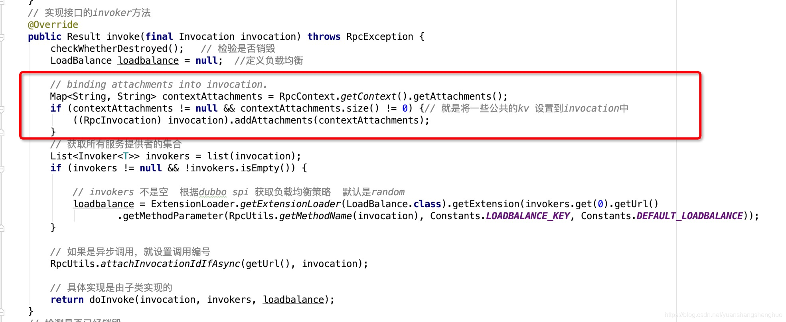

# Dubbo 拦截器 Filter 详解

## 一、Dubbo 过滤器概述

### 1.1 简介

做过 Java Web 开发的读者对过滤器应该都不会陌生，Dubbo 中的过滤器和 Web 应用中的过滤器的概念是一样的，提供了在服务调用前后插入自定义逻辑的途径。过滤器是整个 Dubbo 框架中非常重要的组成部分，Dubbo 中有很多功能都是基于过滤器扩展而来的。

过滤器提供了服务提供者和消费者调用过程的拦截，即每次执行 RPC 调用的时候（确切地说是执行 invoker#invoke 方法时），对应的过滤器都会生效。虽然过滤器的功能强大，但由于每次调用时都会执行，因此在使用的时候需要注意它对性能的影响。

### 1.2 使用规则

我们知道 Dubbo 中巳经有很多内置的过滤器，并且大多数都是默认启用的，如 ContextFilter。对于自行扩展的过滤器，有两种方式启用：第一种方式是使用 @Activate 注解，自己定义的过滤器加上了 @Activate 会使其变成内置的过滤器，默认开启；另一种方式是在 XML 配置文件中配置。

```xml{.line-numbers}
<!--消费方调用过程拦截-->
<DUBBO:REFERENCE FILTER="xxxJyyy" />
<!--消费方调用过程默认拦截器，将拦截所有reference -->
<DUBBO:CONSUMER FILTER="xxx,yyy"/>
<!--服务提供方调用过程拦截-->
<DUBBO:SERVICE FILTER="xxxJyyy" />
<!--服务提供方调用过程默认拦截器，将拦截所有service -->
<DUBBO:PROVIDER FILTER="xxxJyyy"/> 
```

以下是过滤器配置的约定：

- 用户自定义 filter 默认在内置 filter 之后。
- 特殊值 default，表示缺省扩展点插入的位置。比如：filter="xxx,default,yyy"，表示 xxx 在缺省 filter 之前，yyy 在缺省 filter 之后。并且我们在配置filter=”xxx,yyy”时，写在前面的xxx会比yyy的顺序要靠前。
- 剔除过滤器：对于一些默认的过滤器或自动激活的过滤器，有些方法不想使用这些过滤器，则可以使用加过滤器名称来过滤，如 filter="-xxFilter" 会让 xxFilter 不生效。如果不想使用所有默认启用的过滤器，则可以配置 filter="-default" 来进行剔除。
- 过滤器的叠加。如果服务提供者、消费者端都配置了过滤器，则两边的过滤器不会互相覆盖，而是互相叠加，都会生效。

## 二、过滤器链的初始化

### 2.1 源码解析

Dubbo 中 Filter 的接口如下：

```java{.line-numbers}
@SPI
public interface Filter {

    /**
     * do invoke filter.
     * // before filter
     * Result result = invoker.invoke(invocation);
     * // after filter
     * return result;
     */
    Result invoke(Invoker<?> invoker, Invocation invocation) throws RpcException;

} 
```

Dubbo 的 Filter 实现入口是在 ProtocolFilterWrapper，因为 ProtocolFilterWrapper 是 Protocol 的包装类，所以会在加载的 Extension 的时候被自动包装进来（理解这里的前提是理解 Dubbo 的 SPI 机制），然后我们看一下这个 Filter 链是如何构造的。

```java{.line-numbers}
// class:ProtocolFilterWrapper
public <T> Exporter<T> export(Invoker<T> invoker) throws RpcException {
    // 向注册中心暴露服务的时候，并不会生成 filter 链
    if (Constants.REGISTRY_PROTOCOL.equals(invoker.getUrl().getProtocol())) {
        return protocol.export(invoker);
    }
    // Constants.SERVICE_FILTER_KEY 的值为 service.filter
    return protocol.export(buildInvokerChain(invoker, Constants.SERVICE_FILTER_KEY, Constants.PROVIDER));
}

// class:ProtocolFilterWrapper
public <T> Invoker<T> refer(Class<T> type, URL url) throws RpcException {
    // 向注册中心引用服务的时候，并不会生成 filter 链
    if (Constants.REGISTRY_PROTOCOL.equals(url.getProtocol())) {
        return protocol.refer(type, url);
    }
    // Constants.REFERENCE_FILTER_KEY 的值为 reference.filter
    return buildInvokerChain(protocol.refer(type, url), Constants.REFERENCE_FILTER_KEY, Constants.CONSUMER);
}

/**
 * class:ProtocolFilterWrapper
 *
 * 在buildInvokerChain中,先获取所有已经激活的调用链，这里的调用链是已经排好序的。再通过Invoker来构造出一个Filter的调用链，
 * 最后构建出的调用链大致可以表示为：Filter1->Filter2->Filter3->......->Invoker,
 */
private static <T> Invoker<T> buildInvokerChain(final Invoker<T> invoker, String key, String group) {
    Invoker<T> last = invoker;
    // 获得所有的 Filter（已经排好序的），包括使用 @Activate 和在 XML 文件中自定义配置的
    List<Filter> filters = ExtensionLoader.getExtensionLoader(Filter.class).getActivateExtension(invoker.getUrl(), key, group);
    if (filters.size() > 0) {
        for (int i = filters.size() - 1; i >= 0; i--) {
            final Filter filter = filters.get(i);
            final Invoker<T> next = last;
            // 这里只是构造一个最简化的Invoker作为调用链的载体Invoker，并且使用闭包来构建 filter 链
            last = new Invoker<T>() {

                public Result invoke(Invocation invocation) throws RpcException {
                    return filter.invoke(next, invocation);
                }

                // 省略代码
            };
        }
    }
    return last;
} 
```

看到上面的内容，我们大致能明白实现是这样子的，通过获取所有可以被激活的 Filter 链，然后根据一定顺序构造出一个 Filter 的调用链，最后的调用链大致是这样子：Filter1->Filter2->Filter3->......->Invoker，这个构造 Filter 链的逻辑非常简单，重点就在于如何获取被激活的 Filter 链。

```java{.line-numbers}
// class:ExtensionLoader
public List<T> getActivateExtension(URL url, String[] values, String group) {
    List<T> exts = new ArrayList<T>();
    List<String> names = values == null ? new ArrayList<String>(0) : Arrays.asList(values);

    /**
     * 用户自定义 filter 默认在内置 filter 之后，内置的 filter 在配置中由特殊值 default 来指代，
     * 特殊符号 - 表示剔除，比如：filter="-default"，剔除添加所有默认的过滤器 filter，
     * 最开始是先处理内置的filter，再处理用户自定义的filter，因此一开始就要检测names中是否包含-default，
     * 如果包含了，就说明要剔除掉所有内置的filter。
     *
     * 这里解释一下内置的filter，所谓内置filter，其实就是添加了Activate注解的filter。我们自己定义好filter
     * 后，有两种配置方式，一种是添加Activate注解，这样我们自定义的filter也会被dubbo当成是一个内置的filter
     * 会和dubbo中自带的filter一起进行处理；第二种是直接在XML文件中进行配置，这样我们自定义的filter就会被当成
     * 用户自定义的filter
     */
    if (!names.contains(Constants.REMOVE_VALUE_PREFIX + Constants.DEFAULT_KEY)) {
        // 最终会调用到下面的loadResource以及loadClass方法，不断循环从配置文件中读取行，比如：
        // filter1=com.dubbo.filter.mfilter.FilterOne
        // filter2=com.dubbo.filter.mfilter.FilterTwo
        // 如果=右边的实现类上注释了Activate注解的话，就将其添加到缓存 cachedActivates 中
        getExtensionClasses();
        for (Map.Entry<String, Activate> entry : cachedActivates.entrySet()) {
            // name指的是SPI读取的配置文件的key
            String name = entry.getKey();
            Activate activate = entry.getValue();
            // group主要是区分 filter 是在provider端生效还是consumer端生效，有的filter可能在provider和consumer两端都能生效
            if (isMatchGroup(group, activate.group())) {
                T ext = getExtension(name);
                // 下面3个判断条件的含义依次如下：
                // 1.用户在xml配置的filter列表中不包含当前ext，举例来说，我们自己定义了一个filter1=com.dubbo.filter.mfilter.FilterOne，
                // 但是这个filter1既在XML文件中进行配置（因此names中包含filter1），也添加了Activate注解，那么就不会被当做内置的filter，
                // 还是会被当做是自定义的filter
                //
                // 2.用户配置的filter列表中不包含当前ext的加-的key
                //
                // 3.如果用户的配置信息（url中体现）中有可以激活的配置key并且数据不为0,false,null，N/A，也就是说有正常的使用。比如
                // 如果是dubbo自带的CacheFilter，如果url中没有配置cache参数，或者说cache参数的值为false，那么即使前面两个条件都满足，还是
                // 不会被添加到exts集合中。
                if (!names.contains(name)
                        && !names.contains(Constants.REMOVE_VALUE_PREFIX + name)
                        && isActive(activate, url)) {
                    exts.add(ext);
                }
            }
        }

        // 根据 @Activate 注解上的order排序
        Collections.sort(exts, ActivateComparator.COMPARATOR);
    }

    // 进行到此步骤的时候内置的filter（即带有@Activate注解）已经被添加完毕了，下面处理用户自己定义的filter，或者说
    // 用户定义的并且没有带@Activate注解的filter
    List<T> usrs = new ArrayList<T>();
    for (int i = 0; i < names.size(); i++) {
        String name = names.get(i);
        // 如果单个name不是以-开头并且所有的key里面并不包含-'name'（也就是说如果配置成了"dubbo,-dubbo"这种的可以，这个if是进不去的）
        if (!name.startsWith(Constants.REMOVE_VALUE_PREFIX)
                && !names.contains(Constants.REMOVE_VALUE_PREFIX + name)) {
            // 可以通过default关键字替换Dubbo原生的Filter链，主要用来控制调用链顺序
            if (Constants.DEFAULT_KEY.equals(name)) {
                if (usrs.size() > 0) {
                    exts.addAll(0, usrs);
                    usrs.clear();
                }
            } else {
                // 加入用户自己定义的扩展Filter
                T ext = getExtension(name);
                usrs.add(ext);
            }
        }
    }
    if (usrs.size() > 0) {
        exts.addAll(usrs);
    }
    return exts;
}

/**
 * class:ExtensionLoader
 *
 * 从@Activate注解中获取value值，并且作为key到url中去寻找是否有对应的参数，以及参数的值
 * 是否为true。
 *
 * 比如CacheFilter的@Activate注解中，value的值为cache，接下来到url中判断url是否有cache这个参数，以及
 * 参数的值是否为true，如果为true，则表明出于激活状态
 */
private boolean isActive(Activate activate, URL url) {
    String[] keys = activate.value();
    if (keys == null || keys.length == 0) {
        return true;
    }
    for (String key : keys) {
        for (Map.Entry<String, String> entry : url.getParameters().entrySet()) {
            String k = entry.getKey();
            String v = entry.getValue();
            if ((k.equals(key) || k.endsWith("." + key))
                    && ConfigUtils.isNotEmpty(v)) {
                return true;
            }
        }
    }
    return false;
}
```

### 2.2 案例实战

让我们来构建几个 case，来看看如何配置能满足，假定自定义 filter 的对象为 filter1，filter2。

**case 1: 其执行顺序为：原生 filter 子链->filter1->filter2**

```xml{.line-numbers}
<dubbo:reference filter="filter1,filter2"/>
```

**case 2: 其执行顺序为：filter1->filter2->原生 filter 子链**

```xml{.line-numbers}
<dubbo:reference filter="filter1,filter2,default"/>
```

**case 3: 其执行顺序为, filter1->原生 filter 子链->filter2, 同时去掉原生的 TokenFilter(token)**

```xml{.line-numbers}
<dubbo:service filter="filter1,default,filter2,-token"/>
```

## 三、自定义 Filter

得益于 Dubbo 灵活的设计和良好的可扩展性，我们可以通过实现自己的 Dubbo Filter 来完成调用链路中的逻辑嵌入，比如，耗时统计，monitor 信息统计等，下面我们来实现一个简单的 Filter。

Maven 项目结构：

```shell{.line-numbers}
src
 |-main
    |-java
        |-com
            |-xxx
                |-XxxFilter.java (实现Filter接口)
    |-resources
        |-META-INF
            |-dubbo
                |-com.alibaba.dubbo.rpc.Filter (纯文本文件，内容为：xxx=com.xxx.XxxFilter)
```

XxxFilter.java：

```java{.line-numbers}
public class XxxFilter implements Filter {
    public Result invoke(Invoker<?> invoker, Invocation invocation) throws RpcException {
        // before filter ...
        Result result = invoker.invoke(invocation);
        // after filter ...
        return result;
    }
} 
```

如果加上 @Activate 就会变成默认的 Filter，META-INF/dubbo/com.alibaba.dubbo.rpc.Filter：

```shell{.line-numbers}
xxx=com.xxx.XxxFilter
```

在 xml 中配置:

```xml{.line-numbers}
<!-- 消费方调用过程拦截 -->
<dubbo:reference filter="xxx" />
<!-- 消费方调用过程缺省拦截器，将拦截所有reference -->
<dubbo:consumer filter="xxx"/>
<!-- 提供方调用过程拦截 -->
<dubbo:service filter="xxx" />
<!-- 提供方调用过程缺省拦截器，将拦截所有service -->
<dubbo:provider filter="xxx"/> 
```

或者使用注解:

```java{.line-numbers}
@Activate(group = "consumer")
public class XxxFilter implements Filter {
    // ...
} 
```

使用 xml 的配置方式会更加灵活，粒度更细。

## 四、Dubbo 内置 Filter

### 4.1.过滤器的总体结构

在了解了过滤器的使用方式后，可以看一下过滤器的总体结构：

<div align="center">
    
</div>

从上图可以看到所有的内置过滤器中除了 CompatibleFilter 特别突出，只继承了 Filter 接口，即不会被默认激活，其他的内置过滤器都使用了 @Activate 注解，即默认被激活。Filter
接口上有 SPI 注解，说明过滤器是一个扩展点，用户可以基于这个扩展点接口实现自己的过滤器。**<font color="red">所有的过滤器会被分为消费者和服务提供者两种类型，消费者类型的过滤器只会在服务引用时被加入Invoker</font>**，服务提供者类型的过滤器只会在服务暴露的时候被加入对应的 Invoker。MonitorFilter 比较特殊，它会同时在暴露和引用时被加入 Invoker。

### 4.2.每个过滤器的作用

**AccessLogFilter**：打印每一次请求的访问日志。如果需要访问的日志只出现在指定的 appender 中，则可以在 log 的配置文件中配置 additivity。服务提供者

**ActiveLimitFilter**：用于限制消费者端对服务端的最大并行调用数。消费者

**ExecuteLimitFilter**：同上，用于限制服务端的最大并行调用数。服务提供者

**ClassLoaderFilter**：用于切换不同线程的类加载器，服务调用完成后会还原回去。服务提供者

**ConsumerContextFilter**：为消费者把一些上下文信息设置到当前线程的 RpcContext 对象中，包括 invocation、localhost、 remote host 等。消费者

**ContextFilter**：同上，但是为服务提供者服务。服务提供者 

**DeprecatedFilter**：如果调用的方法被标记为已弃用，那么 DeprecatedFilter 将记录一个错误消息。消费者 

**ExceptionFilter**：用于统一的异常处理，防止出现序列化失败。服务提供者 

**GenericFilter**：用于服务提供者端，实现泛化调用，实现序 列化的检查和处理。服务提供者 

**TimeoutFilter**：如果某些服务调用超时，则自动记录告警日志。 服务提供者 

**TokenFilter**：服务提供者下发令牌给消费者，通常用于防止消费者绕过注册中心直接调用服务提供者。服务提供者 

**TpsLimitFilter**：用于服务端的限流，注意与 ExecuteLimitFilter 区分。服务提供者 

**FutureFilter**：在发起 invoke 或得到返回值、出现异常的时 候触发回调事件。消费者 

**MonitorFilter**：监控并统计所有的接口的调用情况，如成功、 失败、耗时。后续 DubboMonitor 会定时把该过 滤器收集的数据发送到 Dubbo-Monitor 服务上。消费者与服务提供者

## 五、具体的 Filter 源码解析

### 5.1 AccessLogFilter (provider)

#### 5.1.1 AccessLogFilter 的使用

AccessLogFilter 是一个日志过滤器，如果想记录服务每一次的请求日志，则可以开启这个过滤器。虽然 AccessLogFilter 有 @Activate 注解，默认会被激活，但还是需要手动配置来开启日志的打印。我们有两种方式来配置开启 AccessLogFilter：

```xml{.line-numbers}
<dubbo:protocol accesslog="true"/>
<dubbo:provider accesslog="default"/> 
<dubbo:service accesslog="true"/>
<dubbo:protocol accesslog="custom-access.log" /> 
```

我们设置将日志输出到应用本身的日志组件（如 log4j、logback 等）时，可以配置 accesslog 的值为 true 或 default。如果想输出日志到指定路径的文件，则可以直接设置 accesslog 的值作为文件路径。

#### 5.1.2 AccessLogFilter 的实现

AccessLogFilter 的实现步骤比较简短，主要分为 init 方法和 invoke 方法两大逻辑。在 AccessLogFilter 的 init 方法中会加锁并初始化一个定时线程池 ScheduledThreadPool 该线程池。只有在 accesslog 属性值指定了输出的 log 文件路径时，才会用到。ScheduledThreadPool 中的线程会定时把队列中的日志数据写入指定的文件中。在构造方法中主要是初始化线程池，而打印日志的逻辑主要在 invoke 方法中， 其逻辑如下：

1. 获取参数。获取上下文、接口名、版本、分组信息等参数，用于日志的构建。
2. 构建日志字符串。根据步骤（1 中的数据开始组装日志，最终会得到一个日志字符 串，类似于：
>[2019-01-15 20:13:58] 192.168.1.17:20881 -> 192.168.1.17:20882 - com.test.demo.DemoService testFunction java.lang.String [null] 
3. 日志打印。如果用户配置了使用应用本身的日志组件，则直接通过封装的LoggerFactory打印日志；如果用户配置了日志要输出到自定义的文件中，则会把日志加入一个 ConcurrentMap<String, ConcurrentHashSet<String>> 中暂存，key 是自定义的 accesslog 值（如 accesslogicustom-access.log），value 就是对应的日志集合。后续等待定时线程不断遍历整个 Map,把日志写入对应的文件。 

### 5.2 ClassLoaderFilter (provider)

ClassLoaderFilter 主要的工作是：切换当前工作线程的类加载器到服务接口的类加载器，以便和服务接口的类加载器的上下文一起工作。ClassLoaderFilter 的源代码如下：

```java{.line-numbers}
@Activate(group = Constants.PROVIDER, order = -30000)
public class ClassLoaderFilter implements Filter {

    public Result invoke(Invoker<?> invoker, Invocation invocation) throws RpcException {
        ClassLoader ocl = Thread.currentThread().getContextClassLoader();
        Thread.currentThread().setContextClassLoader(invoker.getInterface().getClassLoader());
        try {
            return invoker.invoke(invocation);
        }
        finally {
            Thread.currentThread().setContextClassLoader(ocl);
        }
    }

}
```

以上的代码很端，就是切换了一下上下文类加载器，在讲解具体的原因之前，先回顾一下类加载触发的时机。类加载的触发可以分为隐式加载和显式加载，其中，隐式加载的情况分为以下 4 种：

1. 遇到 new、getstatic、putstatic、invokestatic 这 4 条字节码指令时
2. 对类进行反射调用时
3. 当初始化一个类时，如果其父类还没有初始化，优先加载其父类并初始化
4. 虚拟机启动时，需指定一个包含main函数的主类，优先加载并初始化这个主类

显式加载包括以下 3 种情况：

1. 通过 ClassLoader 的 loadClass 方法
2. 通过 Class.forName
3. 通过 ClassLoader 的 findClass 方法

接下来，我们通过下面这个例子来了解双亲委派模型存在的问题或者说局限性：

```java{.line-numbers}
public class ClassA {
    public void callClassB() {
        try {
            Class clazz = Class.forName("com.ClassB");
            Method method = clazz.getMethod("print");
            Object o = clazz.newlnstance();
            method.invoke(o);
        } catch(Throwable t) {
            //...
        }
    }
}

public class ClassB {
    public void print() {
        System.out.println("ClassB");
    }
}
```

然后进行如下调用：

```java{.line-numbers}
ClassA classA = new ClassA();
classA.callClassB(); 
```

如果 ClassA 和 ClassB 都是同一个类加载器加载的，则在 ClassA 的 callClassB 方法中可以获取到 com.ClassB 的类对象。最后的调用会输出 "ClassB" 字符串。但是，如果 ClassA 和 ClassB 位于不同的 classPath 中（ClassA 位于 classpathA，ClassB 位于 classPathB），那么当通过反射显示地加载 ClassB 时，ClassLoaderA 去 classpathA 中寻找 ClassB，没找到，继续委托给其父加载器 ExtClassLoader，没找到则继续委托父加载器 BootstrapClassLoader 去加载，当然也不会加载到。这时就会抛出 ClassNotFoundException 异常。

类比到 ClassLoaderFilter 中，在 DubboProtocol#optimizeSerialization 方法，会根据 url 中用户配置的 optimizer 参数获取扩展的自定义序列化处理类，这些外部引入的序列化类在 Dubbo 框架的类加载器中肯定没有（Dubbo 框架的类加载器中的 classpath 中肯定没有用户自定义的类），因此需要使用 Invoker 中服务接口的类加载器获取对应的类。

所以如果要实现违反双亲委派模型来查找 Class，那么通常会使用上下文类加载器 (ContextClassLoader)。当前框架线程的类加载器可能和 Invoker 中服务接口的类加载器不是同一个，而当前框架线程中又需要获取Invoker的类加载器中的一些 Class，为 了避免出现  ClassNotFoundException，此时只需要使用 Thread. currentThread(). getContextClassLoader() 就可以获取 Invoker 的类加载器，进而获得这个类加载器中的 Class。

### 5.3 ContextFilter/ConsumerContextFilter (provider/consumer)

#### 5.3.1 RpcContext 介绍

首先，先介绍一下 RpcContext，dubbo 提供了一个调用上下文用来给服务提供者或者服务调用者传递一些信息，它只会在当前这个调用链上生效，比如说我服务调用者的某个方法中有两个 rpc 调用，然后分别调用同一个或者不同的服务提供者的某个方法，这个两个 rpc 调用就会有两个 context，你可以往对应的 context 中塞东西，然后对应的服务提供者就能够根据 context 获取到，同理，服务提供者也可以给服务调用着带东西，对应的服务调用者也能够获得到。

我们先来看下这个 RpcContext。

```java{.line-numbers}
public class RpcContext {
    /**
     * use internal thread local to improve performance
     * 这个是本地的context
     */
    private static final InternalThreadLocal<RpcContext> LOCAL = new InternalThreadLocal<RpcContext>() {
        @Override
        protected RpcContext initialValue() {
            return new RpcContext();
        }
    };
    //远端的context，也就是服务提供者的context
    private static final InternalThreadLocal<RpcContext> SERVER_LOCAL = new InternalThreadLocal<RpcContext>() {
        @Override
        protected RpcContext initialValue() {
            return new RpcContext();
        }
    };

    private final Map<String, String> attachments = new HashMap<String, String>();// 附加信息，kv形式
    private final Map<String, Object> values = new HashMap<String, Object>();
    private Future<?> future;// 异步调用的时候，将这个future设置到这里
    private List<URL> urls;
    private URL url;
    private String methodName;// 调用方法名
    private Class<?>[] parameterTypes;// 参数类型
    private Object[] arguments;// 参数
    private InetSocketAddress localAddress;// 本地地址
    private InetSocketAddress remoteAddress;// 远端地址

    @Deprecated
    private List<Invoker<?>> invokers;// 这个一般服务调用者端用到，存储服务提供者invoker们
    @Deprecated
    private Invoker<?> invoker;// invoker
    @Deprecated
    private Invocation invocation;// 调用信息

    private Object request;
    private Object response;
    protected RpcContext() {
    }


    // get server side context.
    public static RpcContext getServerContext() {
        return SERVER_LOCAL.get();
    }

    // remove server side context.
    public static void removeServerContext() {
        SERVER_LOCAL.remove();
    }

    // get context.
    public static RpcContext getContext() {
        return LOCAL.get();
    }

    // remove context.
    public static void removeContext() {
        LOCAL.remove();
    }
}
```

#### 5.3.2 使用 RpcContext

我们这里就使用一下这个 RpcContext 来帮我们干点事情。这里我们在调用者端使用 RpcContext 给服务提供者端带点东西，同时服务提供者端回带点东西给服务调用者端。演示如下：

服务调用者端的代码如下：

```java{.line-numbers}
@RestController
public class TestController {
    @Reference(check = false)
    private IHelloProviderService iHelloProviderService;
    @RequestMapping("/tests")
    public String test() {
        // 往context 添加点东西，带给服务调用者端
        RpcContext.getContext().getAttachments().put("aaa","ok");
        String name = iHelloProviderService.getName(1);
        // 从服务调用者端context获取带过来的信息
        String remoteData = RpcContext.getServerContext().getAttachments().get("bbb");
        System.out.println("我从提供者端获得的数据："+remoteData);
        return null;
    }
} 
```

服务调用者端很简单，就是在调用前获取 context，塞了个 key-value 键值对进去，在调用后获取 serverContext 获取了一下服务提供者给带过来的信息。服务提供者端的代码如下：

```java{.line-numbers}
@org.springframework.stereotype.Service
@Service
public class IHelloProviderServiceImpl  implements IHelloProviderService {
    @Override
    public String getName(Integer id) {
        String remoteData = RpcContext.getContext().getAttachments().get("aaa");
        System.out.println("我从服务调用着端获得的数据是："+remoteData);
        RpcContext.getServerContext().getAttachments().put("bbb","ccc");
        return "test";
    }
} 
```

我这里就是接口的实现类，我们从 context 中获取服务调用者带过来的信息，同时往 serverContext 中塞了 key-value 带给服务调用者。我们这里测试一下，然后从服务提供者日志中可以看到：

<div align="center">
    
</div>

从服务调用者的日志可以看到：

<div align="center">
    
</div>

#### 5.3.3 原理解析

在上面的小节中我们讲解了 RpcContext，还用 RpcContext 在服务调用者与服务提供者做了信息传递。那么这个功能是怎样实现的呢，其实很简单。

首先我们得了解一下 Rpc 调用传输的实体 RpcInvocation 与 Result，在进行服务调用者调用往服务提供者端发送请求就是发送的 Request 对象，将 Request 对象序列化成二进制，然后传到服务提供者端，服务提供者端就会将二进制反序列化成 Request 对象，这个 request 对象中包含了一个 RpcInvocation（调用实体）对象，然后服务提供者进行对应方法调用（对应方法、参数其实都在 RpcInvocation 实体中封装着）将执行结果放到 RpcResult 实体中，然后包上一层 Response，序列化成二进制发送给服务调用者端，服务调用者端反序列化成 Response，再将 Response 这层皮拨开，取出 RpcResult，这个 RpcResult 就封装着调用结果集。

其实不管是 RpcInvocation 还是 RpcResult 里面都有共同的成员变量，那就是 attachments，这个就是存放附加参数的，我们上面塞到 Context 中的数据，其实都会被封装到这个成员中传输。我们可以看到，他其实就是个 map：

<div align="center">
    
</div>

那么怎么从 RpcContext 中封装到这两个实体中的呢？其实这里是用了 dubbo Filter 来做的，在服务调用着端有个 ConsumerContextFilter 过滤器，专门将 RpcResult 中的 attachments 塞到本地的 RpcServerContext 中，最后会清了本次调用 context 中的 attachments，我们来看下实现：

<div align="center">
    
</div>

在服务提供者端有个 ContextFilter 过滤器，它会在调用前，将调用者端传过来的 attachments，塞到 context 中，同时在调用完成后，将 serverContext 中的 attachments 塞到 RpcResult 中，最后移除 context 与清空 serverContext，我们来看下源码实现。

<div align="center">
    
</div>

其实这里还有个问题就是在服务调用者端，是在哪里将 context 中的附加参数添加到 invocation 里面的，这个其实是在调用的时候，会经过 clusterInvoker，然后有个抽象父类里面实现的 invoke 方法，这个类就是 AbstractClusterInvoker，就是在这个类里面将 context 中的附加参数添加到 invocation 里面的，我们稍微看下：

<div align="center">
    
</div>

所以综上，客户端在进行调用之前，会将 RpcContext 中的 attachments 设置到 invocation 中，然后把 invocation 传递到服务器端。在 ContextFilter 中，获取到 invocation 中的 attachments，再进行一些合并与设置操作，然后设置到 RpcServerContext 里面。在获取到 invoker.invoke 的结果之后，会从 RpcServerContext 拿到 attachments，设置到 Result 中返回给调用者，最后调用者再从 Result 中拿出来，设置到 RpcServerContext 中。

ContextFilter 主要记录每个请求的调用上下文。每个调用都有可能产生很多中间临时信息， 我们不可能要求在每个接口上都加一个上下文的参数，然后一路往下传。通常做法都是放在
 ThreadLocal 中，作为一个全局参数，当前线程在任何一个地方都可以直接读/写上下文信息。

ContextFilter 就是统一在过滤器中处理请求的上下文信息，它为每个请求维护一个 RpcContext 对象，该对象中维护两个 InternalThreadLocal (它是优化过的 ThreadLocal，具体可以搜索 Netty 的 InternalThreadLocal 做了什么优化)，分别记录 local 和 server 的上下文。每次收到或发起 RPC 调用的时候，上下文信息都会发生改变。例如：A 调用 B, B 调用 C。当 A 调用 B 且 B 还未调用 C 时，RpcContext 中保存 A 调用 B 的上下文；当 B 开始调用 C 的时候， RpcContext 中保存 B 调用 C 的上下文。发起调用时候的上下文是由 ConsumerContextFilter 实现的，这个是消费者端的过滤器，因此不在本节讲解 ContextFilter 保存的是收到的请求的上下文。

### 5.4 TokenFilter

在 Dubbo 中，如果某些服务提供者不想让消费者绕过注册中心直连自己，则可以使用令牌验证。总体的工作原理是，服务提供者在发布自己的服务时会生成令牌，与服务一起注册到注册中心。消费者必须通过注册中心才能获取有令牌的服务提供者的 URL。TokenFilter 是在服务 提供者端生效的过滤器，它的工作就是对请求的令牌做校验。我们首先来看一下开启令牌校验的配置方式:

```xml{.line-numbers}
<!--随机Token令牌，使用UUID生成--> 
<dubbo:service interface="com.foo.BarService" token="true" />
<!--固定Token令牌，相当于密码-->
<dubbo:service interface="com.foo.BarService" token="123456" /> 
```

我们来看一下整个令牌的工作流程：

1. 消费者从注册中心获得服务提供者包含令牌的 URL
2. 消费者 RPC 调用设置令牌。具体是在 Rpclnvocation 的构造方法中，把服务提供者的令牌设置到附件 (attachments) 中一起请求服务提供者。
3. 服务提供者认证令牌。 这就是 TokenFilter 所做的工作

TokenFilter 的工作原理很简单，收到请求后，首先检查这个暴露出去的服务是否有令牌信息。如果有，则获取请求中的令牌，如果和接口的令牌匹配，则认证通过，否则认证失败并抛出异常。TokenFilter 的源代码如下：

```java{.line-numbers}
@Activate(group = Constants.PROVIDER, value = Constants.TOKEN_KEY)
public class TokenFilter implements Filter {

    public Result invoke(Invoker<?> invoker, Invocation inv)
    throws RpcException {
        // 这里获取到的 token 是服务的 url 注册在注册中心上时，会附带的一个令牌，用来验证客户端是否从注册中心进行调用
        // 要么是用户自己指定的值，要么是通过 UUID 生成的
        String token = invoker.getUrl().getParameter(Constants.TOKEN_KEY);
        if (ConfigUtils.isNotEmpty(token)) {
            Class<?> serviceType = invoker.getInterface();
            Map<String, String> attachments = inv.getAttachments();
            // 这里获取到的 remoteToken 是客户端传送过来的，如果和 token 一致，那么就表明是从注册中心进行调用通过验证，
            // 否则不通过验证
            String remoteToken = attachments == null ? null : attachments.get(Constants.TOKEN_KEY);
            if (!token.equals(remoteToken)) {
                throw new RpcException("Invalid token! Forbid invoke remote service to provider " + RpcContext.getContext().getLocalHost());
            }
        }
        return invoker.invoke(inv);
    }
} 
```

### 5.5 TpsLimitFilter (provider)

TpsLimitFilter 主要用于服务提供者端的限流。我们会发现在 org.apache.dubbo.rpc.Filter 这个 SPI 配置文件中，并没有 TpsLimitFilter 的配置，因此如果需要使用，则用户要自己添加对应的配置。TpsLimitFilter 的限流是基于令牌的，即一个时间段内只分配 N 个令牌，每个请求过来都会消耗一个令牌，耗完即止，后面再来的请求都会被拒绝。限流对象的维度支持分组、版本和接口级别，默认通过 interface + group + version 作为唯一标识来判断是否超过最大值。我们先看一下如何配置：

```xml{.line-numbers}
<dubbo:parameter key="tps" value="1000"/>
<dubbo:parameter key="tps.interval" value="1000"/> 
```

TpsLimitFilter 的源代码如下：

```java{.line-numbers}
@Activate(group = Constants.PROVIDER, value = Constants.TPS_LIMIT_RATE_KEY)
public class TpsLimitFilter implements Filter {

    private final TPSLimiter tpsLimiter = new DefaultTPSLimiter();

    public Result invoke(Invoker<?> invoker, Invocation invocation) throws RpcException {
        if (!tpsLimiter.isAllowable(invoker.getUrl(), invocation)) {
            throw new RpcException()
        }
        return invoker.invoke(invocation);
    }
} 
```

具体的实现逻辑主要关注 DefaultTPSLimiter#isAllowable，会用这个方法判断是否触发限流，如果不触发就直接通过了。isAllowable 方法的逻辑如下：

1. 获取 URL 中的参数，包含每次发放的令牌数、令牌刷新时间间隔。
2. 如果设置了每次发放的令牌数则开始限流校验。DefaultTPSLimiter 内部用一个 ConcurrentMap 缓存每个接 口的令牌数，key 是 interface + group + version, value 是一个 Statitem 对象，它包装了令牌刷新时间间隔、每次发放的令牌数等属性。具体的判断逻辑还是在 Statitem#isAllowable 方法中进行。源代码如下：

```java{.line-numbers}
class StatItem {

    private String name;
    private long lastResetTime;
    // 令牌刷新的时间间隔
    private long interval;
    private AtomicInteger token;
    // 每次发放的令牌数
    private int rate;

    // 省略代码...

    public boolean isAllowable(URL url, Invocation invocation) {
        long now = System.currentTimeMillis();
        if (now > lastResetTime + interval) {
            token.set(rate);
            lastResetTime = now;
        }
        int value = token.get();
        boolean flag = false;
        // 如果令牌数等于 0 ，则直接返回 false，表示此次请求被限流
        while (value > 0 && !flag) {
            flag = token.compareAndSet(value, value - 1);
            value = token.get();
        }
        return flag;
    }
} 
```

首先判断上次发放令牌的时间点到现在是否超过时间间隔了，如果超过了就重新发放令牌，之前没用完的不会叠加，而是直接覆盖。然后，通过 CAS 的方式 -1 令牌，减掉后令牌数如果小于 0 则会触发限流。

### 5.6 FutureFilter

FutureFilter 主要实现框架在调用前后出现异常时，触发调用用户配置的回调方法，如以下配置：

```java{.line-numbers}
<bean id="callBack" class="com.test.CallBack"/>
<dubbo:reference id="testService" interface="com.testService">
    <dubbo:method name="testMethod" onreturn="callBack.onreturn" onthrow="callBack.onthrow" oninvoke ="callBack.oninvoke"/>
</dubbo:reference> 
```

事件通知允许 Consumer 端在调用之前、调用之后或出现异常时，触发 oninvoke、onreturn、onthrow 三个事件。FutureFilter的源代码如下：

```java{.line-numbers}
@Activate(group = Constants.CONSUMER)
public class FutureFilter implements Filter {

    protected static final Logger logger = LoggerFactory.getLogger(FutureFilter.class);

    public Result invoke(final Invoker<?> invoker, final Invocation invocation) throws RpcException {
        final boolean isAsync = RpcUtils.isAsync(invoker.getUrl(), invocation);
        // 直接调用 oninvoke 方法
        fireInvokeCallback(invoker, invocation);
        Result result = invoker.invoke(invocation);
        if (isAsync) {
            asyncCallback(invoker, invocation);
        } else {
            syncCallback(invoker, invocation, result);
        }
        return result;
    }

    private void syncCallback(final Invoker<?> invoker, final Invocation invocation, final Result result) {
        // 如果是同步调用，直接根据结果是否有异常，来进行调用
        // 如果有异常，则回调 onthrow 方法；如果没有异常，则回调 onReturn 方法
        if (result.hasException()) {
            fireThrowCallback(invoker, invocation, result.getException());
        } else {
            fireReturnCallback(invoker, invocation, result.getValue());
        }
    }

    private void asyncCallback(final Invoker<?> invoker, final Invocation invocation) {
        Future<?> f = RpcContext.getContext().getFuture();
        // 如果是异步调用，则 invoker#invoke 方法返回的是一个空结果，从 RpcContext 里面获取到 ResponseFuture 对象
        // 并且在 ResponseFuture 对象中添加回调方法，等到调用真正返回时，这些回调方法会被调用
        if (f instanceof FutureAdapter) {
            ResponseFuture future = ((FutureAdapter<?>) f).getFuture();
            future.setCallback(new ResponseCallback() {
                public void done(Object rpcResult) {
                    // 省略代码...
                    // 同样根据 result 中是否有异常来进行相应的调用
                    Result result = (Result) rpcResult;
                    if (result.hasException()) {
                        fireThrowCallback(invoker, invocation, result.getException());
                    } else {
                        fireReturnCallback(invoker, invocation, result.getValue());
                    }
                }

                public void caught(Throwable exception) {
                    fireThrowCallback(invoker, invocation, exception);
                }
            });
        }
    }

    private void fireInvokeCallback(final Invoker<?> invoker, final Invocation invocation) {
        final Method onInvokeMethod = (Method) StaticContext.getSystemContext().get(
                                          StaticContext.getKey(invoker.getUrl(), invocation.getMethodName(), Constants.ON_INVOKE_METHOD_KEY));
        final Object onInvokeInst = StaticContext.getSystemContext().get(StaticContext.getKey(invoker.getUrl(),
                                    invocation.getMethodName(), Constants.ON_INVOKE_INSTANCE_KEY));

        // 省略代码....

        try {
            onInvokeMethod.invoke(onInvokeInst, params);
        } catch (InvocationTargetException e) {
            fireThrowCallback(invoker, invocation, e.getTargetException());
        } catch (Throwable e) {
            fireThrowCallback(invoker, invocation, e);
        }
    }

    private void fireReturnCallback(final Invoker<?> invoker, final Invocation invocation, final Object result) {
        final Method onReturnMethod = (Method) StaticContext.getSystemContext().get(
                                          StaticContext.getKey(invoker.getUrl(), invocation.getMethodName(), Constants.ON_RETURN_METHOD_KEY));
        final Object onReturnInst = StaticContext.getSystemContext().get(StaticContext.getKey(invoker.getUrl(),
                                    invocation.getMethodName(), Constants.ON_RETURN_INSTANCE_KEY));

        // 省略代码...

        try {
            onReturnMethod.invoke(onReturnInst, params);
        } catch (InvocationTargetException e) {
            fireThrowCallback(invoker, invocation, e.getTargetException());
        } catch (Throwable e) {
            fireThrowCallback(invoker, invocation, e);
        }
    }

    private void fireThrowCallback(final Invoker<?> invoker, final Invocation invocation,
                                   final Throwable exception) {
        final Method onthrowMethod = (Method) StaticContext.getSystemContext().get(
                                         StaticContext.getKey(invoker.getUrl(), invocation.getMethodName(), Constants.ON_THROW_METHOD_KEY));
        final Object onthrowInst = StaticContext.getSystemContext().get(StaticContext.getKey(invoker.getUrl(),
                                   invocation.getMethodName(), Constants.ON_THROW_INSTANCE_KEY));

        // 省略代码....
        onthrowMethod.invoke(onthrowInst, params);
        // 省略日志代码
    }
} 
```

调用前的回调实现就很简单了，由于整个逻辑是在过滤器链中执行的，FutureFilter 在执行下一个节点的 invoke 方法前调用 oninvoke 回调方法就能实现调用前的回调。然后根据是否异步分别执行 syncCallback 和 asyncCallback 两个方法。

在 syncCallback 中，当调用有返回结果的时候，会根据调用结果中是否包含异常来调用相应的方法，如果没有异常，则通过 fireReturnCallback 调用 onReturn 方法，否则通过 fireThrowCallback 调用 onThrow 方法。对于异步调用的方法，invoker#invoke 方法返回一个空结果，于是从 RpcContext 中获取到 ResponseFuture，然后在 future 上添加一个回调函数。在回调函数中，和同步方法一样，根据是否发生异常来调用对应的方法。
