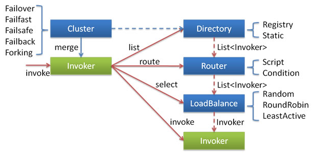

# Dubbo 服务容错详解

## 一、Cluster 层概述

### 1.1 容错机制概述

在微服务环境中，为了保证服务的高可用，很少会有单点服务出现，服务通常都是以集群的形式出现的。然而，被调用的远程服务并不是每时每刻都保持良好状况，当某个服务调用出现异常时，如网络抖动、服务短暂不可用需要自动容错，就需要使用本章介绍的集群容错机制。

我们可以把 Cluster 看作一个集群容错层，该层中包含 Cluster、Directory、Router、LoadBalance 几大核心接口。注意这里要区分 Cluster 层和 Cluster 接口，Cluster层是抽象概念，表示的是对外的整个集群容错层；Cluster是容错接口，提供 Failover、Failfast 等容错策略。 由于Cluster层的实现众多，因此本节介绍的流程是一个基于 Abstractclusterinvoker 的全量流程，某些实现可能只使用了该流程的一小部分。Cluster 的总体工作流程可以分为以下几步:

1. 生成 Invoker 对象。不同的 Cluster 实现会生成不同类型的 Clusterinvoker 对象并返回。然后调用 Clusterinvoker 的 Invoker 方法，正式开始调用流程。
2. 获得可调用的服务列表。首先会做前置校验，检查远程服务是否已被销毁。然后通过  Directory#list 方法获取所有可用的服务列表。接着使用 Router 接口处理该服务列表，根据路由规则过滤一部分服务，最终返回剩余的服务列表。
3. 做负载均衡。在第2步中得到的服务列表还需要通过不同的负载均衡策略选出一个服务，用作最后的调用。首先框架会根据用户的配置，调用 ExtensionLoader 获取不同负载均衡策略的扩展点实现（具体负载均衡策略会在后面讲解）。然后做一些后置操作，如果是异步调用则设置调用编号。接着调用子类实现的 dolnvoke 方法（父类专门留了这个抽象方法让子类实现）， 子类会根据具体的负载均衡策略选出一个可以调用的服务。
4. 做 RPC 调用。首先保存每次调用的 Invoker 到 RPC 上下文，并做 RPC 调用。然后处理调用结果，对于调用出现异常、成功、失败等情况，每种容错策略会有不同的处理方式。

总的调用流程如下所示：

<div align="center">
    
</div>

Dubbo容错机制能增强整个应用的鲁棒性，容错过程对上层用户是完全透明的，但用户也可以通过不同的配置项来选择不同的容错机制。每种容错机制又有自己个性化的配置项。Dubbo 中现有 Failover、Failfast、 Failsafe、Fallback、Forking、Broadcast 等容错机制：

- **Failover**：当出现失败时，会重试其他服务器。用户可以通过 retries="2" 设置重试次数。这是 Dubbo 的默认容错机制，会对请求做负载均衡。**<font color="red">通常使用在读操作或幕等的写操作上</font>**， 但重试会导致接口的延退增大，在下游机器负载已经达到极限时，重试容易加重下游服务的负载。
- **Failfast**：快速失败，当请求失败后，快速返回异常结果，不做任何重试。该容错机制会对请求做负载均衡，**<font color="red">通常使用在非幕等接口的调用上。该机制受网络抖动的影响较大</font>**。
- **Failsafe**：当出现异常时，直接忽略异常。会对请求做负载均衡。**<font color="red">通常使用在"佛系"调用场景， 即不关心调用是否成功，并且不想抛异常影响外层调用</font>**，如某些不重要的日志同步，即使出现异常也无所谓。
- **Failback**：请求失败后，会自动记录在失败队列中，并由一个定时线程池定时重试，**<font color="red">适用于一些异步或最终一致性的请求</font>**。请求会做负载均衡。
- **Forking**：同时调用多个相同的服务，只要其中一个返回，则立即返回结果。用户可以配置 forks="最大并行调用数"参数来确定最大并行调用的服务数量。**<font color="red">通常使用在对接口实时性要求极高的调用上，但也会浪费更多的资源</font>**
- **Mock**：提供调用失败时，返回伪造的响应结果。或直接强制返回伪造的结果，不会发起远程调用
- **Available**：最简单的方式，请求不会做负载均衡，遍历所有服务列表，找到第一个可用的节点， 直接请求并返回结果。如果没有可用的节点，则直接抛出异常

Cluseter 的具体实现:用户可以在 **`<dubbo :service>、<dubbo:reference>、<dubbo:consumer>、<dubbo:provider>`** 标签上通过 cluster 属性设置。 对于 Failover 容错模式，用户可以通过 retries 属性来设置最大重试次数。可以设置在 dubbo: reference 标签上，也可以设置在细粒度的方法标签 dubbo:method 上。 对于 Forking 容错模式，用户可通过 forks="最大并行数”属性来设置最大并行数。假设设置的 forks 数为 n，可用的服务数为 v，当 n < v 时，即可用的服务数大于配置的并行数，则并行请求 n 个服务；当 n > v时，即可用的服务数小于配置的并行数，则请求所有可用的服务 v。

### 1.2 Cluster 接口关系

在对集群相关代码进行分析之前，这里有必要先来介绍一下集群容错的所有组件。包含 Cluster、Cluster Invoker、Directory、Router 和 LoadBalance 等。集群工作过程可分为两个阶段：

1. 第一个阶段是在服务消费者初始化期间，集群 Cluster 实现类为服务消费者创建 Cluster Invoker 实例。
2. 第二个阶段是在服务消费者进行远程调用时。以 FailoverClusterInvoker 为例，该类型 Cluster Invoker 首先会调用 Directory 的 list 方法列举 Invoker 列表（可将 Invoker 简单理解为服务提供者）。Directory 的用途是保存 Invoker，可简单类比为 List<Invoker>。其实现类 RegistryDirectory 是一个动态服务目录，可感知注册中心配置的变化，它所持有的 Invoker 列表会随着注册中心内容的变化而变化。每次变化后，RegistryDirectory 会动态增删 Invoker，并调用 Router 的 route 方法进行路由，过滤掉不符合路由规则的 Invoker。当 FailoverClusterInvoker 拿到 Directory 返回的 Invoker 列表后，它会通过 LoadBalance 从 Invoker 列表中选择一个 Invoker。最后 FailoverClusterInvoker 会将参数传给 LoadBalance 选择出的 Invoker 实例的 invoke 方法，进行真正的远程调用。

容错的接口主要分为两大类，第一类是 Cluster 类，第二类是 Clusterinvoker 类。Cluster Invoker 和 Cluster 是不同的，Cluster 是接口，而 Cluster Invoker 是一种 Invoker。服务提供者的选择逻辑，以及远程调用失败后的的处理逻辑均是封装在 Cluster Invoker 中。而Cluster 的用途比较简单，仅用于生成 Cluster Invoker。比如下面的 FailoverCluster 仅仅用于生成 FailoverClusterInvoker 对象。

```java{.line-numbers}
public class FailoverCluster implements Cluster {

    public final static String NAME = "failover";

    public <T> Invoker<T> join(Directory<T> directory) throws RpcException {
        // 创建并返回FailoverClusterInvoker对象
        return new FailoverClusterInvoker<T>(directory);
    }

}
```

## 二、容错策略

### 2.1 Failover 策略

Cluster 接口上有 SPI 注解 **`@SPI(FailoverCluster.NAME)`**，即默认实现是 Failover。该策略的代码逻辑如下：

1. 校验。校验从 AbstractClusterlnvoker 传入的 Invoker 列表是否为空。
2. 获取配置参数。从调用URL中获取对应的retries重试次数。
3. 初始化一些集合和对象。用于保存调用过程中出现的异常、记录调用了哪些节点(这个会在负载均衡中使用，在某些配置下，尽量不要一直调用同一个服务)。
4. 使用 for 循环实现重试，for 循环的次数就是重试的次数。在调用 invoker 的 invoke 方法之前会将 invoker 添加到已选列表 invoked 中。成功则返回，否则继续循环。 如果 for 循环完，还没有一个成功的返回，则抛出异常，把(3)中记录的信息抛出去。 

前 3 步都是做一些校验、数据准备的工作。第4步开始真正的调用逻辑。以下步骤是 for 循环中的逻辑：

1. 校验。如果 for 循环次数大于1，即有过一次失败，则会再次校验节点是否被销毁、传入的 invoker 列表是否为空，然后重新列举 invoker 集合，这样做的好处就是如果某个服务挂了，通过调用 list 可以得到最新可用的 invoker 列表。
2. 负载均衡。调用 select 方法做负载均衡，得到要调用的节点，并记录这个节点到步骤3的集合里，再把己经调用的节点信息放进 RPC 上下文中。
   1. 如果开启了粘滞连接的话（粘滞连接是指让服务消费者尽可能的调用同一个服务提供者，除非该提供者挂了再进行切换）：
      1. 检测 invokers 列表中是否包含了 stickyInvoker，如果不包含，说明 stickyInvoker 代表的服务提供者挂了，此时需要将其置空。这里的 invokers 列表就是第一步中通过 list 方法列举得到的 invoker 集合。可以看成是存活着的服务提供者列表。
      2. stickyInvoker 不为null，并且没在已选列表 invoked 中，返回上次的服务提供者 stickyInvoker。invoked 如果包含的 stickyInvoker 的话，说明 stickyInvoker 在此之前没有成功提供服务（但其仍然处于存活状态）。此时我们认为这个服务不可靠，不应该在重试期间内再次被调用，因此这个时候不会返回该 stickyInvoker。如果 invoked 不包含 stickyInvoker，此时还需要进行可用性检测，比如检测服务提供者网络连通性等。当可用性检测通过，才可返回 stickyInvoker。
    2. 如果没有开启粘滞连接的话：
       1. 使用具体的负载均衡策略从 invokers 集合中选择一个 invoker
       2. 如果 invoked 包含负载均衡选择出的 invoker，或者该 invoker 无法经过可用性检查（同时 availablecheck 为 true），此时进行重选。invoked 集合中的 invoker 已经被 invoke 过，但是无法成功提供服务
       3. 如果重选的 rinvoker 不为空，则将其赋值给 invoker
       4. 如果重选的 rinvoker 为空，定位 invoker 在 invokers 中的位置，获取 index + 1 位置处的 Invoker
3. 远程调用。调用 invoker#invoke 方法做远程调用，成功则返回，异常则记录异常信息， 再做下次循环。

### 2.2 Failfast 策略

FailfastClusterInvoker 只会进行一次调用，失败后立即抛出异常。适用于幂等操作，比如新增记录。Failfast 实现非常简单，步骤如下： 

1. 校验。校验从 AbstractClusterlnvoker 传入的 Invoker 列表是否为空。
2. 负载均衡。调用 select 方法做负载均衡，得到要调用的节点。
3. 进行远程调用。在 try 代码块中调用 invoker#invoke 方法做远程调用。如果捕获到异常，则直接封装成RpcException抛出。 整个过程非常简短，也不会做任何中间信息的记录。

### 2.3 Failsafe 策略

Failsafe调用时如果出现异常，则会直接忽略。实现也非常简单，步骤如下：

1. 校验传入的参数。校验从 AbstractClusterlnvoker 传入的 Invoker 列表是否为空。
2. 负载均衡。调用 select 方法做负载均衡，得到要调用的节点。
3. 远程调用。在 try 代码块中调用 invoker#invoke 方法做远程调用，"catch" 到任何异常都直接"吞掉"，返回一个空的结果集，并且打印一个警告日志。

### 2.4 Failback 策略

Fallback 如果调用失败，则会定期重试。FailbackClusterlnvoker 里面定义了一个 ConcurrentHashMap，也就是 failed，专门用来保存失败的调用。另外定义了一个定时线程池，默认每 5 秒把所有失败的调用拿出来，重试一次。如果调用重试成功，则会从 failed 中移除。dolnvoke 的调用逻辑如下：

1. 校验传入的参数。校验从 AbstractClusterlnvoker 传入的 Invoker 列表是否为空。
2. 负载均衡。调用 select 方法做负载均衡，得到要调用的节点。
3. 远程调用。在 try 代码块中调用 invoker#invoke 方法做远程调用，“catch”到异常后直接把 invocation 保存到重试的 failed 中，并返回一个空的结果集。
4. **<font color="red">每个 FailbackClusterInvoker 中都有一个定时线程</font>** 会每隔 5s 把  failed 中的失败请求拿出来重新请求，请求成功则从 failed 中移除。如果请求还是失败，则异常也会被“catch”住，不会影响 failed 中后面的重试。

### 2.5 Forking 策略

ForkingClusterInvoker 会在运行时通过线程池创建多个线程，并发调用多个服务提供者。只要有一个服务提供者成功返回了结果，doInvoke 方法就会立即结束运行。ForkingClusterInvoker 的应用场景是在一些对实时性要求比较高读操作（注意是读操作，并行写操作可能不安全）下使用。相对于其他调用策略，Forking的实现是最复杂的。其步骤如下：

1. 准备工作。校验传入的 invoker 列表是否可用；初始化一个 invoker 集合，用于保存真正要调用的 invoker 列表；从 URL 中得到最大并行数 forks、超时时间。
2. 获取最终要调用的 invoker 列表。假设用户设置最大的并行数为 n 实际可以调用的最大服务数为 v。如果 n < 0 或 n >= v，则说明可用的服务数小于用户的设置，因此最终要调用的 invoker 能有 v 个；如果 n < v, 则会循环调用负载均衡方法，不断得到可调用的 invoker，加入步骤1中的 invoker 集合里。
3. 调用前的准备工作。设置要调用的 invoker 列表到 Rpc 上下文；初始化一个异常计数器；初始化一个阻塞队列，用于记录并行调用的结果。
4. 执行调用。循环使用线程池并行调用，调用成功，则把结果加入阻塞队列；调用失败， 则失败计数+1。如果所有线程的调用都失败了，即失败计数 > 所有可调用的 invoker 时，则把异常信息加入阻塞队列。 这里有一点需要注意：并行调用是如何保证个别调用失败不返回异常信息，只有全部失败才返回异常信息的呢？因为有判断条件，当失败计数 > 所有可调用的 invoker 时，才会把异常信息放入阻塞队列，所以只有当最后一个 invoker 也调用失败时才会把异常信息保存到阻塞队列， 从而达到全部失败才返回异常的效果。
5. 同步等待结果。由于步骤4中的步骤是在线程池中执行的，因此主线程还会继续往下执行，主线程中会使用阻塞队列的poll(-超时时间“)方法，同步等待阻塞队列中的第一个结果， 如果是正常结果则返回，如果是异常则抛出。 

```java{.line-numbers}
public class ForkingClusterInvoker<T> extends AbstractClusterInvoker<T> {

    private final ExecutorService executor = Executors.newCachedThreadPool(new NamedThreadFactory("forking-cluster-timer", true));

    public ForkingClusterInvoker(Directory<T> directory) {
        super(directory);
    }

    @SuppressWarnings({"unchecked", "rawtypes"})
    public Result doInvoke(final Invocation invocation, List<Invoker<T>> invokers, LoadBalance loadbalance) throws RpcException {
        checkInvokers(invokers, invocation);
        final List<Invoker<T>> selected;
        // FORKS_KEY 的值为 forks，DEFAULT_FORKS 的值为 2
        // TIMEOUT_KEY 的值为 timeout，DEFAULT_TIMEOUT 的值为 1000
        final int forks = getUrl().getParameter(Constants.FORKS_KEY, Constants.DEFAULT_FORKS);
        final int timeout = getUrl().getParameter(Constants.TIMEOUT_KEY, Constants.DEFAULT_TIMEOUT);
        // 如果 forks 配置不合理或者说 forks 的值大于 invokers 的 size（也就是服务提供者的数量），则直接将 invokers 赋值给 selected
        if (forks <= 0 || forks >= invokers.size()) {
            selected = invokers;
        } else {
            // 循环并且使用负载均衡算法选择 forks 个数量的 invoker 放入到 selected 集合中
            selected = new ArrayList<Invoker<T>>();
            for (int i = 0; i < forks; i++) {
                // ForkingClusterInvoker 的调用策略和粘滞调用相矛盾（每次尽量调用同一个 Invoker），而 selected 会添加每次返回的 Invoker ，
                // 所以可以认为 ForkingClusterInvoker 不支持粘滞调用
                Invoker<T> invoker = select(loadbalance, invocation, invokers, selected);
                if (!selected.contains(invoker)) {//Avoid add the same invoker several times.
                    selected.add(invoker);
                }
            }
        }

        // ----------------------✨ 分割线1 ✨---------------------- //

        RpcContext.getContext().setInvokers((List) selected);
        final AtomicInteger count = new AtomicInteger();
        final BlockingQueue<Object> ref = new LinkedBlockingQueue<Object>();
        // 遍历 selected 集合，为每个 invoker 创建一个执行线程，调用 invoker 的 invoke 方法。
        for (final Invoker<T> invoker : selected) {
            executor.execute(new Runnable() {
                public void run() {
                    try {
                        Result result = invoker.invoke(invocation);
                        // 将结果存到阻塞队列中
                        ref.offer(result);
                    } catch (Throwable e) {
                        int value = count.incrementAndGet();
                        // 仅在 value 大于等于 selected.size() 时，才将异常对象放入阻塞队列中。这是因为在并行调用多个服务提供者的情况下，只要有一个服务提供者
                        // 能够成功返回结果，而其他全部失败。此时 ForkingClusterInvoker 仍应该返回成功的结果，而非抛出异常。因此只有在 selected.size 次调用之后，
                        // 才能把调用失败抛出的异常添加到阻塞队列中。而后面只会取出阻塞队列的第一个元素，如果前 selected.size - 1 次调用都失败了，那么取出的阻塞
                        // 队列的第一个元素就是这个异常，随后会抛出。如果前面 selected.size -1 次调用有一次成功了，取出的就是调用成功的结果，第 selected.size 次
                        // 调用抛出的异常就会被忽略
                        if (value >= selected.size()) {
                            ref.offer(e);
                        }
                    }
                }
            });
        }

        // ----------------------✨ 分割线2 ✨---------------------- //

        try {
            // 从阻塞队列中取出远程调用结果
            Object ret = ref.poll(timeout, TimeUnit.MILLISECONDS);

            // 如果结果类型为 Throwable，说明 forks 个 invoker 的调用全部失败了。则抛出异常
            if (ret instanceof Throwable) {
                Throwable e = (Throwable) ret;
                throw new RpcException("Failed to forking invoke provider ");
            }
            return (Result) ret;
        } catch (InterruptedException e) {
            throw new RpcException("Failed to forking invoke provider " + selected + ", but no luck to perform the invocation. Last error is: " + e.getMessage(), e);
        }
    }
}
```


