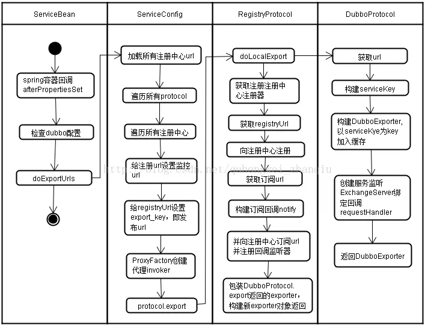
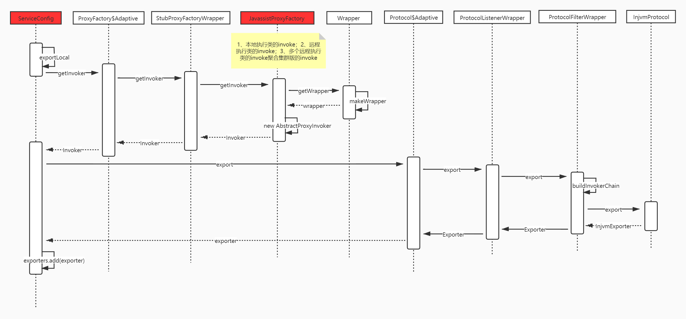
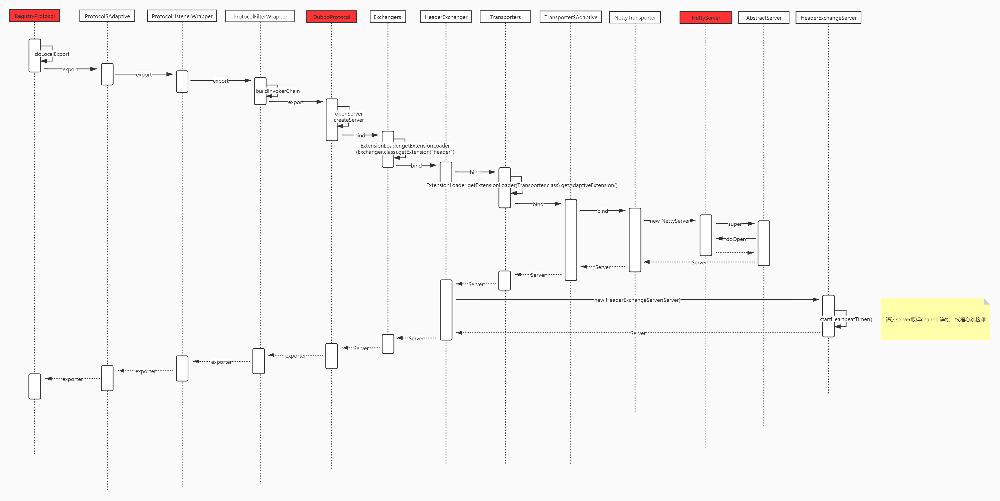
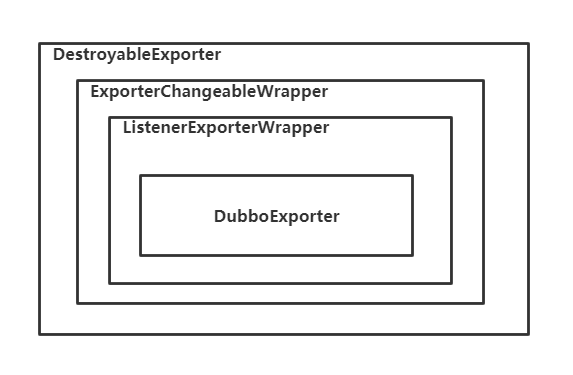
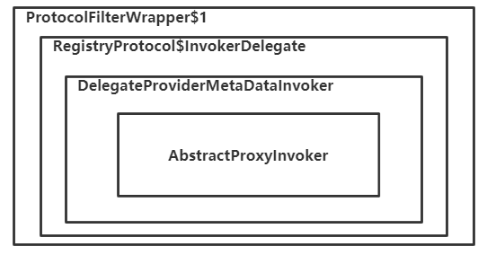

# Dubbo 服务导出详解

## 一、服务导出

### 1.简介

本篇文章，我们来研究一下 Dubbo 导出服务的过程。Dubbo 服务导出过程始于 Spring 容器发布刷新事件，Dubbo 在接收到事件后，会立即执行服务导出逻辑。整个逻辑大致可分为三个部分：

- 第一部分是前置工作，主要用于检查参数，组装 URL。
- 第二部分是导出服务，包含导出服务到本地 (JVM)，和导出服务到远程两个过程，在导出到远程的时候会根据服务支持的不同协议，启动不同的 Server，用来接收和处理请求。
- 第三部分是将第一部分组装好的 URL 向注册中心进行注册，用于服务发现。

### 2.配置承载的初始化

不管在服务暴露还是服务消费的场景下，Dubbo 框架都会根据优先级对配置信息做聚合处理，从 Dubbo 支持的配置来源说起，默认有四种配置来源：

- JVM System Properties 参数，比如 -Ddubbo.protocol.port=20880
- Externalized Configuration，外部化配置，dubbo在2.7版本后就支持了分布式配置中心，你可以在Dubbo-Admin中去操作配置中心，分布式配置中心就相当于一个远程的 dubbo.properties 文件，你可以在 Dubbo-Admin 中去修改这个dubbo.properties文件
- ServiceConfig、ReferenceConfig 等编程接口采集的配置，也就是 XML 或者 Spring 注解配置
- 本地配置文件 dubbo.properties 文件

下面展示了配置覆盖关系的优先级，从上到下优先级依次降低：

Dubbo 的配置也会受到 provider 的影响，这个属于运行期属性值影响，同样遵循以下几点规则：

- 如果只有 provider 端指定配置，则会自动透传到客户端 (比如 timeout)
- 如果客户端也配置了相应属性，则服务端配置会被覆盖 (比如 timeout)

运行时属性随着框架特性可以动态添加，因此覆盖策略中包含的属性没办法全部列出来， 一般不允许透传的属性都会在 ClusterUtils#mergeUrl 中进行特殊处理。上面 provider 配置的属性会以 Url 的形式注册在注册中心上，当消费者从注册中心上获取到 Url 之后就有可能会被这些属性所影响。

### 3.服务导出流程

这一节以文字的形式总结 Dubbo 中服务如何导出。具体的流程如下：

1. 参数刷新和检查完成了之后，就会开始导出服务，如果配置了延迟导出，那么则按指定的时间利用 ScheduledExecutorService 来进行延迟导出
2. 否则调用 doExport() 进行服务导出
3. 继续调用 doExportUrls() 进行服务导出
4. 首先通过 loadRegistries() 方法获得所配置的注册中心的 URL，可能配了多个配置中心，那么当前所导出的服务需要注册到每个配置中心去，这里，注册中心的是以 URL 的方式来表示的，包括使用的是什么注册中心、注册中心的地址和端口，给注册中心所配置的参数等等，都会存在在 URL 上，此 URL 以 registry:// 开始
5. 获得到注册中心的 registryURLs 之后，就会遍历当前服务所有的协议，调用 doExportUrlsFor1Protocol(protocolConfig, registryURLs); 方法把当前服务按每个协议注册到每一个注册中心上面
6. 在 doExportUrlsFor1Protocol() 方法中，会先构造一个服务 URL，包括:
   1. 服务的协议 dubbo://
   2. 服务的 IP 和 PORT，如果指定了就取指定的，没有指定 IP 就获取服务器上网卡的 IP
   3. 以及服务的 PATH，如果没有指定 PATH 参数，则取接口名
   4. 以及服务的参数，参数包括服务的参数，服务中某个方法的参数
   5. 最终得到的 URL 类似： dubbo://192.168.1.110:20880/com.huanglei.DemoService?timeout=3000&&sayHello.loadbalance=random
7. 在得到 URL 之后，就将此 URL 代表的服务先导出到本地（injvm）
8. 在得到服务的 URL 之后，接着会把服务 URL 作为一个参数添加到 registryURL 中去(export =)，然后把 registryURL、服务的接口、当前服务实现类 ref 生成一个 Invoker 代理对象，再把这个代理对象和当前 ServiceConfig 对象包装成一个 DelegateProviderMetaDataInvoker 对象，DelegateProviderMetaDataInvoker 就表示了完整的一个服务
9. 接下来就会使用 Protocol 去 export 导出服务到远程了，导出之后将得到一个 Exporter 对象（该 Exporter 对象，可以理解为主要可以用来卸载（unexport）服务，什么时候会卸载服务？在优雅关闭 Dubbo 应用的时候）
10. 但调用 protocol.export(wrapperInvoker) 方法时，因为 protocol 是 Protocol 接口的一个 Adaptive 对象，所以此时会根据 wrapperInvoker 的 genUrl 方法得到一个url，根据此url的协议找到对应的扩展点，此时扩展点就是RegistryProtocol，但是，因为Protocol接口有两个包装类，一个是ProtocolFilterWrapper、ProtocolListenerWrapper，所以实际上在调用 export 方法时，会经过这两个包装类的 export 方法，但是在这两个包装类的export 方法中都会 Registry 协议进行了判断，不会做过多处理，所以最终会直接调用到 RegistryProtocol的export(Invoker originInvoker) 方法
11. 在 RegistryProtocol 的 export(Invoker originInvoker) 方法中，主要完成了以下几件事情：
    1. 调用 doLocalExport() 进行服务导出，在这个方法中就会调用 DubboProtocol 的 export 方法去导出服务了，导出成功后将得到一个 ExporterChangeableWrapper。在导出的时候，会根据服务的协议启动对应的 Server，比如是 http 协议，就启动 jetty 或者 tomcat；如果是 dubbo 协议就启动 netty server，并且设置一系列的 RequestHandler，以便在接收到请求时能依次被这些 RequestHandler 所处理。
    2. 从 originInvoker 中获取注册中心的实现类，比如 ZookeeperRegistry，把服务 URL 通过 ZookeeperRegistry.registry() 方法注册到注册中心去
    3. 创建 override 监听器，向注册中心进行订阅 override 数据，监听动态配置中心此服务的参数数据的变化，一旦监听到变化，则重写服务 URL
    4. 最后将 ExporterChangeableWrapper 封装为 DestroyableExporter 对象返回，完成服务导出

根据以上流程，总结大致的服务发布图如下：

<div align="center">
    
</div>

在服务导出的时候，默认会分别导出到本地和远程，导出到本地其实就是生成一个 InjvmInvoker 供本机调用，导出到远程会开启 NettyServer 开始处理客户端的请求，同时会将服务的 url 注册到注册中心上。导出到本地的流程如下：

<div align="center">
    
</div>

导出到远程分为开启 Netty Server 以及将服务的 url 注册到注册中心，开启 Netty Server 的流程如下：

<div align="center">
    
</div>

### 4.服务导出时的 Exporter

<div align="center">
    
</div>
    
一个服务导出成功后，会生成对应的 Exporter：

- DestroyableExporter：Exporter的最外层包装类，这个类的主要作用是可以用来unexporter对应的服务
- ExporterChangeableWrapper：这个类主要负责在 unexport 对应服务之前，把服务 URL 从注册中心中移除，把该服务对应的动态配置监听器移除
- ListenerExporterWrapper：这个类主要负责在 unexport 对应服务之后，把服务导出监听器移除（这个 exporter 在 ProtocolListenerWrapper 类中生成）
- DubboExporter：这个类中保存了对应服务的 Invoker 对象，和当前服务的唯一标志，当NettyServer 接收到请求后，会根据请求中的服务信息，找到服务对应的 DubboExporter 对象，然后从对象中得到 Invoker 对象

### 5.服务导出的 Invoker

<div align="center">
    
</div>

- ProtocolFilterWrapper$1：ProtocolFilterWrapper 中的过滤器组成的 Invoker，利用该 Invoker，可以执行服务端的过滤器，执行完过滤器之后，调用下层 Invoker
- RegistryProtocol$InvokerDelegate：服务的的委托类，里面包含了 DelegateProviderMetaDataInvoker 对象和服务对应的 providerUrl，执行时直接调用下层 Invoker
- DelegateProviderMetaDataInvoker：服务的的委托类，里面包含了 AbstractProxyInvoker 对象和 ServiceConfig 对象，执行时直接调用下层Invoker
- AbstractProxyInvoker：服务接口的代理类，绑定了对应的实现类，执行时会利用反射调用服务实现类实例的具体方法，并得到结果

## 二、服务导出源码分析

在服务导出的过程中，Dubbo 允许我们使用不同的协议导出服务，也允许我们向多个注册中心注册服务。Dubbo 在 doExportUrls 方法中对多协议、多注册中心进行了支持。相关的代码如下：

```java{.line-numbers}
// ServiceConfig#doExportUrls
private void doExportUrls() {
    List<URL> registryURLs = loadRegistries(true);
    for (ProtocolConfig protocolConfig : protocols) {
        doExportUrlsFor1Protocol(protocolConfig, registryURLs);
    }
}
```

首先是通过 loadRegistries 加载注册中心链接，用户可能在 <dubbo:service/> 中指定了多个注册中心。所以，获得的 registryURLs 可能有多个，要把此服务注册到这些注册中心上去。同理，用户可能在 <dubbo:service/> 中指定了使用多个协议，因此，遍历 protocols 集合根据不同的协议导出每个服务，并且将服务注册到每一个注册中心上。因此，通过这个方法，Dubbo 将一个服务使用每一个协议注册到每一个注册中心上。在上面的 doExportUrlsFor1Protocol 方法是服务导出的最重要的方法，将服务导出到本地以及远程。

```java{.line-numbers}
// ServiceConfig#doExportUrlsFor1Protocol
private void doExportUrlsFor1Protocol(ProtocolConfig protocolConfig, List<URL> registryURLs) {
    String name = protocolConfig.getName();

    // 如果协议为空，或者说空字符串，那么将协议名变量设置为 dubbo，默认协议为 dubbo
    if (name == null || name.length() == 0) {
        name = "dubbo";
    }

    Map<String, String> map = new HashMap<String, String>();
    // 添加 side（是提供端 provider 还是消费端 consumer）、dubbo 版本、时间戳以及进程号等信息到 map 中
    map.put(Constants.SIDE_KEY, Constants.PROVIDER_SIDE);
    map.put(Constants.DUBBO_VERSION_KEY, Version.getVersion());
    map.put(Constants.TIMESTAMP_KEY, String.valueOf(System.currentTimeMillis()));
    if (ConfigUtils.getPid() > 0) {
        map.put(Constants.PID_KEY, String.valueOf(ConfigUtils.getPid()));
    }

    // 通过反射将对象的信息添加到 map 中，包括 ApplicationConfig、ModuleConfig、ProviderConfig、
    // ProtocolConfig 和 ServiceConfig 对象中的配置信息放到 map 中，用来组装 url
    appendParameters(map, application);
    appendParameters(map, module);
    appendParameters(map, provider, Constants.DEFAULT_KEY);
    appendParameters(map, protocolConfig);
    appendParameters(map, this);

    if (methods != null && !methods.isEmpty()) {
        for (MethodConfig method : methods) {
            // 添加 MethodConfig 对象的字段信息到 map 中，键 = 方法名.属性名。
            // 比如存储 <dubbo:method name="sayHello" retries="2"> 对应的 MethodConfig，
            // 键 = sayHello.retries，map = {"sayHello.retries": 2, "xxx": "yyy"}
            appendParameters(map, method, method.getName());

            // retry 属性已经被废弃，由 retries 属性代替。
            String retryKey = method.getName() + ".retry";
            if (map.containsKey(retryKey)) {
                String retryValue = map.remove(retryKey);
                // 如果配置的 retry 属性为 false，那么就移除掉，设置新的 retries 属性为 0
                if ("false".equals(retryValue)) {
                    map.put(method.getName() + ".retries", "0");
                }
            }

            // 从 methodConfig 中获取 ArgumentConfig 对象列表
            List<ArgumentConfig> arguments = method.getArguments();

            // 省略代码
        } // end of methods for
    }

    // 检测 generic 是否为 "true"，并根据检测结果向 map 中添加不同的信息
    if (ProtocolUtils.isGeneric(generic)) {
        map.put("generic", generic);
        // Constants.ANY_VALUE 的值为 *
        map.put("methods", Constants.ANY_VALUE);
    } else {
        String revision = Version.getVersion(interfaceClass, version);
        if (revision != null && revision.length() > 0) {
            map.put("revision", revision);
        }

        // 为接口生成包裹类 Wrapper，Wrapper 中包含了接口的详细信息，比如接口方法名数组，字段信息等。这里获取到了特定接口中方法名字数组
        // 具体的说就是这里通过 javassist 为 interfaceClass 生成了一个动态代理类，在这个代理类中，有一个属性 mns，它是字符串数组，
        // 保存了 interfaceClass 中所有的方法名。通过调用 getMethodNames 方法，直接返回这个属性
        String[] methods = Wrapper.getWrapper(interfaceClass).getMethodNames();
        // 添加方法名到 map 中，如果包含多个方法名，则用逗号隔开，比如 method = init,destroy
        if (methods.length == 0) {
            logger.warn("NO method found in service interface " + interfaceClass.getName());
            map.put(Constants.METHODS_KEY, Constants.ANY_VALUE);
        } else {
            // 将逗号作为分隔符连接方法名，并将连接后的字符串放入 map 中，最终会在map中形成如下键值对：
            // methods -> func A, func B
            map.put(Constants.METHODS_KEY, StringUtils.join(new HashSet<String>(Arrays.asList(methods)), ","));
        }
    }

    // 代码省略

    if ("injvm".equals(protocolConfig.getName())) {
        protocolConfig.setRegister(false);
        map.put("notify", "false");
    }

    // 获取上下文路径
    String contextPath = protocolConfig.getContextpath();
    if ((contextPath == null || contextPath.length() == 0) && provider != null) {
        contextPath = provider.getContextpath();
    }

    // 获取到本机的ip地址和端口号
    String host = this.findConfigedHosts(protocolConfig, registryURLs, map);
    Integer port = this.findConfigedPorts(protocolConfig, name, map);

    // 根据本机的 ip 和 port，以及上面 map 中的各种信息，包括但不限于提供方的应用名称，即 application，
    // dubbo 的版本号，接口的全类名，接口中的所有方法名（如果不止一个的话，使用逗号分隔），进程 id 和时间戳。
    URL url = new URL(name, host, port, (contextPath == null || contextPath.length() == 0 ? "" : contextPath + "/") + path, map);
    String scope = url.getParameter(Constants.SCOPE_KEY);

     // 下面将要进行服务导出，先导出到本地，再导出到远程。如果配置 scope 为 none，则不进行导出操作，注意这与 scope 为 null 不同，
     // 如果 scope 为 null，还是会执行导出操作（既导出到本地也导出到远程）。scope 为 local，则只导出到本地；如果 scope 为 remote，则只导出到远程
     // 在下面进行服务导出的过程当中，会创建 Invoker。Invoker 是实体域，它是 Dubbo 的核心模型，其它模型都向它靠扰，或转换成它，它代表一个可执行体，
     // 可向它发起 invoke 调用，它有可能是一个本地的实现，也可能是一个远程的实现，也可能一个集群实现。
     if (!Constants.SCOPE_NONE.toString().equalsIgnoreCase(scope)) {

         // scope != remote，导出到本地
         if (!Constants.SCOPE_REMOTE.toString().equalsIgnoreCase(scope)) {
             exportLocal(url);
         }

         // scope != local，导出到远程
         if (!Constants.SCOPE_LOCAL.toString().equalsIgnoreCase(scope)) {
             if (logger.isInfoEnabled()) {
                 logger.info("Export dubbo service " + interfaceClass.getName() + " to url " + url);
             }
             if (registryURLs != null && !registryURLs.isEmpty()) {
                 for (URL registryURL : registryURLs) {
                     url = url.addParameterIfAbsent(Constants.DYNAMIC_KEY, registryURL.getParameter(Constants.DYNAMIC_KEY));

                     // 加载监视器链接
                     URL monitorUrl = loadMonitor(registryURL);
                     if (monitorUrl != null) {
                         // 将监视器链接作为参数添加到 url 中
                         url = url.addParameterAndEncoded(Constants.MONITOR_KEY, monitorUrl.toFullString());
                     }
                     if (logger.isInfoEnabled()) {
                         logger.info("Register dubbo service " + interfaceClass.getName() + " url " + url + " to registry " + registryURL);
                     }
                     // 为服务提供类(ref)生成 Invoker
                     Invoker<?> invoker = proxyFactory.getInvoker(ref, (Class) interfaceClass, registryURL.(Constants.EXPORT_KEY, url.toFullString()));
                     // DelegateProviderMetaDataInvoker 作用为简单地持有 Invoker 和 ServiceConfig
                     DelegateProviderMetaDataInvoker wrapperInvoker = new DelegateProviderMetaDataInvoker(invoker, this);

                     // 导出服务，并生成 Exporter，由于这里的 protocol 也是使用自适应拓展模式生成的一个代理对象 Protocol$Adaptive，
                     // 而 wrapperInvoker 中持有一个 Invoker 对象，这个 Invoker 对象的 url 协议为 registry，因此实际调用的是 RegistryPortocol 的 export 方法
                     Exporter<?> exporter = protocol.export(wrapperInvoker);
                     exporters.add(exporter);
                 }
             } else {
                 // 不存在注册中心，仅导出服务
                 Invoker<?> invoker = proxyFactory.getInvoker(ref, (Class) interfaceClass, url);
                 DelegateProviderMetaDataInvoker wrapperInvoker = new DelegateProviderMetaDataInvoker(invoker, this);

                 Exporter<?> exporter = protocol.export(wrapperInvoker);
                 exporters.add(exporter);
             }
         }
     }

     // 将配置好的URL放入到urls列表集合中
     this.urls.add(url);
}
```

在前面的一些方法中完成了各个参数的检查，接下来就要将其组装成 URL，进行导出，上面的方法具体完成的工作如下：

1. 收集参数，将 ApplicationConfig、ModuleConfig、ProviderConfig、ProtocolConfig、ServiceConfig 以及 MethodConfig 对象中得配置信息保存到 map 中，并且添加 side、dubbo 版本、时间戳以及进程号到 map 中。在收集好配置参数之后，就会组装好 URL。
2. 获取 scope 参数，代表服务导出的范围。如果 scope 为 local，则只导出到本地，如果 scope 为 remote，则只导出到远程，如果不配置 scope，那么既导出到本地也导出到远程。
3. 将服务导出到本地，首先需要创建一个 Invoker，这个 Invoker 分为服务提供端和服务消费端两种。在提供者端，Invoker 主要是用来调用执行具体的服务方法，在服务消费者端，Invoker 主要用来向远程发起服务调用。Invoker 是由 ProxyFactory 创建而来，Dubbo 默认的 ProxyFactory 实现类是 JavassistProxyFactory。JavassistProxyFactory 创建了一个继承自 AbstractProxyInvoker 类的匿名对象，并覆写了抽象方法 doInvoke。覆写后的 doInvoke 逻辑比较简单，仅是将调用请求转发给了 Wrapper 类的 invokeMethod 方法。Wrapper 用于“包裹”目标类，Wrapper 是一个抽象类，仅可通过 getWrapper(Class) 方法创建子类。在创建 Wrapper 子类的过程中，子类代码生成逻辑会对 getWrapper 方法传入的 Class 对象进行解析，拿到诸如类方法，类成员变量等信息。以及生成 invokeMethod 方法代码和其他一些方法代码。然后将生成的 Invoker 封装到 InjvmExporter 中，供当前机器进行本地调用，不会注册到注册中心上。
4. 将服务导出到远程，首先也是通过 JavassistProxyFactory 创建一个 Invoker 对象。接着在 RegistryProtocol 类中完成以下两个工作：
   1. 根据所选择的协议开启对应的服务器，比如 Netty Server，并且将 Invoker 封装到 Exporter 中，比如 DubboExporter
   2. 连接注册中心，并且将组装好的 URL 注册到注册中心上

另外，通过 javassist 动态生成的 Wrapper 类代码如下所示：

```java{.line-numbers}
public class Wrapper0 extends Wrapper implements ClassGenerator.DC {

    public static String[] pns;
    public static Map pts;
    public static String[] mns;
    public static String[] dmns;
    public static Class[] mts0;
    public static Class[] mts1;

    public Class getPropertyType(String string) {
        return (Class) pts.get(string);
    }

    @Override
    public Object getPropertyValue(Object object, String string) {
        try {
            DemoService demoService = (DemoService) object;
        } catch (Throwable throwable) {
            throw new IllegalArgumentException(throwable);
        }
        throw new NoSuchPropertyException(new StringBuffer().append("Not found property \"").append(string);
    }

    @Override
    public void setPropertyValue(Object object, String string, Object object2) {
        try {
            DemoService demoService = (DemoService) object;
        } catch (Throwable throwable) {
            throw new IllegalArgumentException(throwable);
        }
        throw new NoSuchPropertyException(new StringBuffer().append("Not found property \"").append(string);
    }

    @Override
    public String[] getPropertyNames() {
        return pns;
    }

    public Object invokeMethod(Object object, String string, Class[] arrclass, Object[] arrobject) throws InvocationTargetException {
        DemoService demoService;
        try {
            demoService = (DemoService) object;
        } catch (Throwable throwable) {
            throw new IllegalArgumentException(throwable);
        }
        try {
            if ("sayGoodBye".equals(string) && arrclass.length == 1) {
                return demoService.sayGoodBye((String) arrobject[0]);
            }
            if ("sayHello".equals(string) && arrclass.length == 1) {
                return demoService.sayHello((String) arrobject[0]);
            }
        } catch (Throwable throwable) {
            throw new InvocationTargetException(throwable);
        }
        throw new NoSuchMethodException(new StringBuffer().append("Not found method \"").append(string);
    }

    @Override
    public String[] getMethodNames() {
        return mns;
    }

    @Override
    public String[] getDeclaredMethodNames() {
        return dmns;
    }

    @Override
    public boolean hasProperty(String string) {
        return pts.containsKey(string);
    }
} 
```