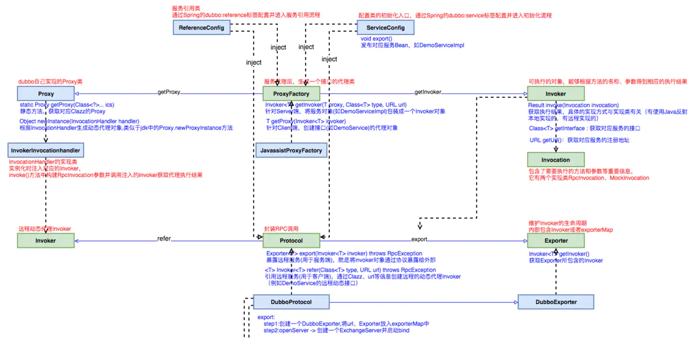
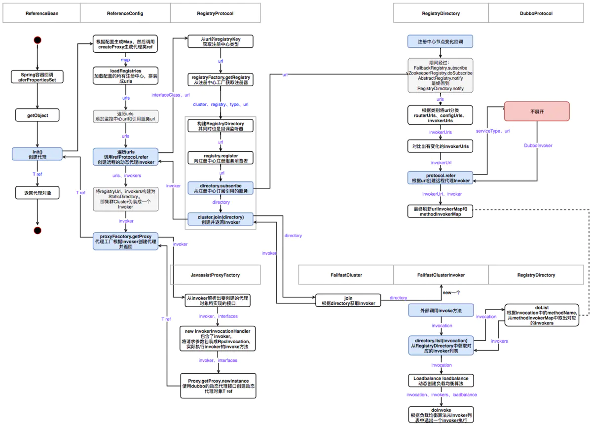
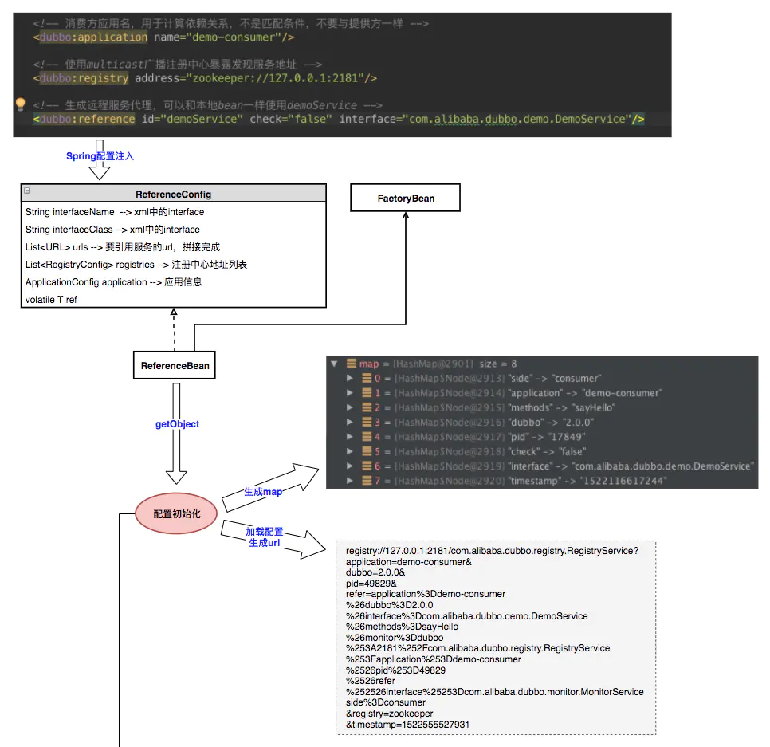
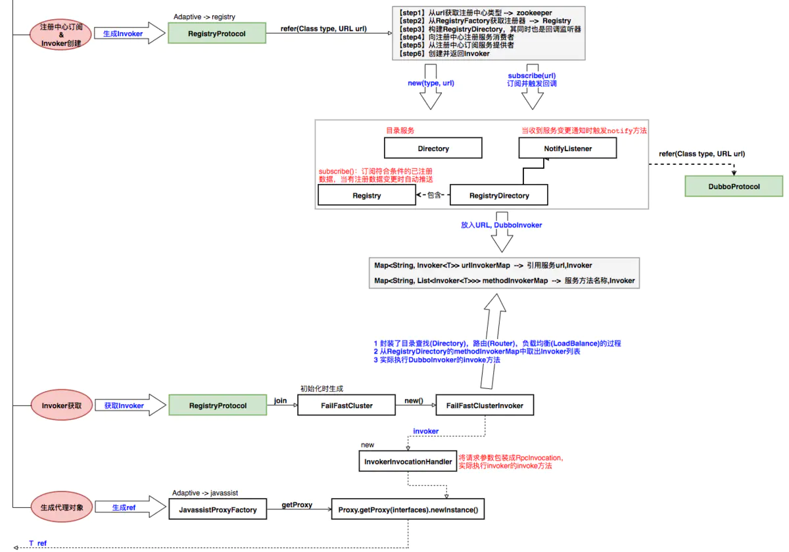
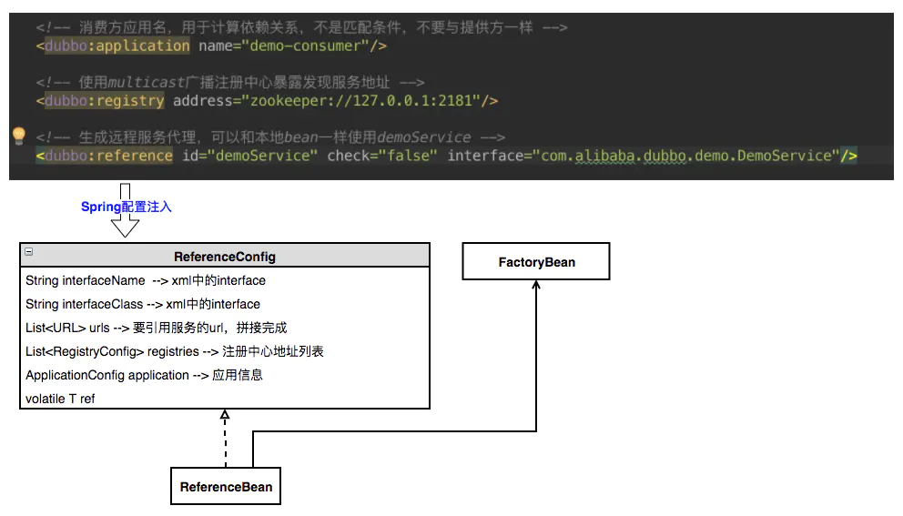

# Dubbo 服务引用总结

## 一、Dubbo 服务引用流程

### 1.服务引用的核心类

服务引用的目的是:**<font color="red">"服务消费者"向注册中心订阅"服务提供者"提供的服务地址，并生成服务接口的实际代理对象</font>**。Dubbo 服务引用的时机有两个，第一个是在 Spring 容器调用 ReferenceBean 的 afterPropertiesSet 方法时引用服务，第二个是在 ReferenceBean 对应的服务被注入到其他类中时引用。这两个引用服务的时机区别在于，第一个是饿汉式的，第二个是懒汉式的。默认情况下，Dubbo 使用懒汉式引用服务。如果需要使用饿汉式，可通过配置 <dubbo:reference> 的 init 属性开启。下面我们按照 Dubbo 默认配置进行分析，整个分析过程从 ReferenceBean 的 getObject 方法开始。

当我们的服务被注入到其他类中时，Spring 会第一时间调用 getObject 方法，并由该方法执行服务引用逻辑。按照惯例，在进行具体工作之前，需先进行配置检查与收集工作。接着根据收集到的信息决定服务引用的方式，有三种，第一种是引用本地 (JVM) 服务，第二是通过直连方式引用远程服务，第三是通过注册中心引用远程服务。

不管是哪种引用方式，最后都会得到一个 Invoker 实例。如果有多个注册中心，多个服务提供者，这个时候会得到一组 Invoker 实例，此时需要通过集群管理类 Cluster 将多个 Invoker 合并成一个实例。合并后的 Invoker 实例已经具备调用本地或远程服务的能力了，但并不能将此实例暴露给用户使用，这会对用户业务代码造成侵入。**<font color="red">此时框架还需要通过代理工厂类 (ProxyFactory) 为服务接口生成代理类，并让代理类去调用 Invoker 逻辑。避免了 Dubbo 框架代码对业务代码的侵入，同时也让框架更容易使用</font>**。

服务引用涉及到的关键类如下：

- ReferenceBean 和 ReferenceConfig：服务引用 Bean 和服务引用配置类，是服务引用信息的载体
- RegistryProtocol：协议抽象接口 Protocol 的实现，其 <T> Invoker<T> refer(Class<T> type, URL url)方法完成了服务引用的完整功能。
- RegistryDirectory：同时具有目录服务Directory和监听器NotifyListener两个接口的功能，并组合了注册器Registry。
  - 它的Invoker集合数据来源于zk注册中心；
  - 其对外暴露的subscribe(URL url)方法完成了在注册中心对服务提供者地址变更的监听功能；
  - 其同时实现了NotifyListener接口的notify(List<URL> urls)方法执行监听回调，监听服务提供者地址变更并创建对应的Invoker；
- JavassistProxyFactory：基于 javassist 的动态代理工厂，其内部使用 dubbo 自己的动态代理机制 Proxy 完成动态代理类的创建工作

上面所讲的类的关系图如下所示：

<div align="center">
    
</div>

### 2.服务引用流程

服务引用的整体流程图如下：

<div align="center">
    
</div>

**<font color="red">2.1 上面 ReferenceBean 和 ReferenceConfig 的大致逻辑</font>**

1. ReferenceBean 的 afterProperties 方法作为 consumer 的初始化入口
2. 调用 ReferenceConfig 的 get 方法
3. 接着调用 ReferenceConfig 的 init 方法，init 方法主要收集各种配置信息，比如 ConsumerConfig、ReferenceConfig、MethodConfig 以及 side 信息、dubbo 版本号、进程号、时间戳等，并且把收集到的信息保存到 map 中，用于组装 url。
4. 调用 ReferenceConfig 的 createProxy 方法创建服务接口的远程代理。这个方法是服务引用的核心类，主要完成的工作如下：
   1. 根据配置项检查是否为本地调用 injvm
   2. 如果是，则调用 InjvmProtocol 的 refer 方法生成 InjvmInvoker
   3. 如果不是：
      1. 读取直连配置项，并且将 url 存储到 urls 中
      2. 若不是进行服务直连，读取注册中心 url，并且将 url 存储到 urls 中
      3. 若 urls 的数量为 1，则直接通过 protocol 的自适应拓展类来构建 Invoker ，这里获取到的 Invoker 实际上是 MockWrapperInvoker
      4. 若 urls 的数量大于 1，即存在多个注册中心或者服务直连 url，此时先根据每个 url 构建 Invoker。然后再通过 AvailableCluster 合并多个 Invoker，最后调用 ProxyFactory 生成代理类
   4. 调用 JavassistProxyFactory 的 getProxy 方法生成远程服务的代理。proxyFactory 的类型为 ProxyFactory$Adaptive，调用 ProxyFactory$Adaptive 的 getProxy 方法时，会根据 invoker 中的 url 的 proxy 参数值，来获取对应的扩展，然后调用对应扩展的 getProxy 方法。由于在获取扩展的时候可能还有对扩展进行 Wrapper 包装，所以实际返回的可能是一个 Wrapper 包装类对象，在这里就是 StubProxyFactoryWrapper 类对象

**<font color="red">2.2 调用 RegistryProtocol 进行具体的服务导出过程</font>**

1. 调用 RegistryProtocol 的 refer 方法，主要完成的工作如下：
   1. 获取到 url 中 registry 参数的值，并且将其设置为协议头，比如 url 中配置了 registry=zookeeper，那么就把 zookeeper 设置为 url 的协议，然后把 registry=zookeeper 从 url 中删除。
   2. 从 RegistryFactory 中获取注册器，比如 ZookeeperRegistry
2. 调用 RegistryProtocol 的 doRefer 方法：
   1. 创建 RegistryDirectory 对象，它是服务提供者的集合，同时它也实现了 NotifyListener 接口，也是一个监听器
   2. 将服务消费者的信息注册到注册中心上
   3. 从注册中心订阅 providers、routers、configurators 三个目录。其实就是将 RegistryDirectory（它是一个 NotifyListener 接口）注册到对应的注册中心对应的目录上，一旦目录下的结点发生变化，比如新增 provider 或者下线 provider，就会更新 RegistryDirectory 中的 invoker 集合
   4. 通过 cluster.join 方法将多个服务提供者合并成一个 。这里 cluster 的类型为 Cluster$Adaptive，就是说通过自适应扩展机制来获取对应的 Cluster 扩展，并且调用其 join 方法，不过获取到 Cluster 扩展实际上是一个 Wrapper 包装类 MockClusterWrapper，调用的为这个 MockClusterWrapper 的 join 方法，它创建一个 MockClusterInvoker，这个 Invoker 中包含了服务降级逻辑

**<font color="red">2.3 调用 RegistryDirectory 的 subscribe 方法完成了服务消费者端对注册中心上 providers、routers、configurators 三个目录的订阅，具体的过程</font>**

1. RegistryDirectory 的 subscribe 方法会调用 FailbackRegistry 的 subscribe 方法
2. FailbackRegistry 的 subscribe 内部会调用 ZookeeperRegistry.doSubscribe() 方法
3. ZookeeperRegistry 的 doSubscribe 方法内部遍历以下目录挨个订阅
   1. /dubbo/com.alibaba.dubbo.demo.DemoService/providers
   2. /dubbo/com.alibaba.dubbo.demo.DemoService/configurators
   3. /dubbo/com.alibaba.dubbo.demo.DemoService/routers
   4. new ChildListener() 负责创建 zk 监听的回调函数，内部 childChanged 方法负责监听结点变化并且执行 notify 回调
4. 当订阅的 providers、routers、configurators 三个节点发生变化时，会最终回调 RegistryDirectory 中的 notify 方法进行更新操作，这里以 invoker 集合为例
5. RegistryDirectory 的 notify 方法调用 refreshInvoker 实现 invoker 的创建，refreshInvoker 主要完成以下两个工作：
   1. 创建新增 providerUrl 的 invoker，RegistryDirectory 的 toInvokers 方法内部通过 protocol 的 refer 方法创建客户端 invoker，这里一般是通过 DubboProtocol 创建 DubboInvoker
   2. 删除已经下线 providerUrl 的 invoker，destroyUnusedInvokers 方法内部负责清理下线的 providerUrl 的 invoker

**<font color="red">2.4 在前面 RegistryDirectory 的 toInvokers 方法中会使用 DubboProtocol 生成 DubboInvoker，在生成这个 DubboInvoker 的时候会创建好和远程服务的连接。具体过程如下</font>**

1. 调用 DubboProtocol 的 refer 方法创建一个 DubboInvoker 对象
2. 在生成 DubboInvoker 对象的过程中，通过 getClients 会创建好到服务提供者的网络连接。具体完成的工作如下：
   1. 获取到 URL 中的 connections 参数，这个默认是 0，表示没有配置
   2. 如果没有配置 connections 参数的话，就使用共享连接，connections 会被初始化为 1。所谓共享连接就是一个客户端到一个特定地址（ip地址）的只有一个连接，这个客户端的所有 invoker 如果要向这个地址发起请求，都必须使用这个连接。如果不是共享连接，那么每个 invoker 都会创建 connections 个到特定地址的连接，不会对连接进行复用。
   3. 根据是否是共享连接，获取共享客户端以及初始化新客户端。下面以共享客户端为例。
3. 调用 getSharedClient 获取共享客户端。方法先访问缓存，若缓存未命中，则通过 initClient 方法创建新的 ExchangeClient 实例，并将该实例传给 ReferenceCountExchangeClient 构造方法创建一个带有引用计数功能的 ExchangeClient 实例，记录有多少个 Invoker 在使用该 ExchangeClient 实例。最后返回 ReferenceCountExchangeClient

### 3.客户端与服务端的 Invoker

Invoker 是 Dubbo 的核心模型，代表一个可执行体。**<font color="red">在服务提供方，Invoker 用于调用服务提供类。在服务消费方，Invoker 用于执行远程调用</font>**。服务消费方的 Invoker 是由 Protocol 实现类构建而来，比如 DubboProtocol 创建一个 DubboInvoker；而服务提供方的 Invoker 是由 ProxyFactory 的 getInvoker 方法创建。 

在 Dubbo 中，Invoker 类一般有两个抽象类 AbstractInvoker 和 AbstractProxyInvoker，其中 AbstractInvoker 有子类 DubboInvoker 和 InjvmInvoker 以及一些内部类。而 AbstractProxyInvoker 的子类为 JdkProxyFactory 和JavassistProxyFactory 中的内部类。

AbstractProxyInvoker 的子类对象是提供者端的 Invoker，子类中的 doInvoke 方法用于调用 wrapper 对象的 invokeMethod 方法，从而真正地调用具体的方法。AbstractInvoker 的子类对象是消费者端的 Invoker，子类中的doInvoke 方法（比如DubboInvoker）用于向服务器端发起调用。

在 Dubbo 中，在 ProxyFactory 接口中有两个方法，一个是 getProxy 方法，另外一个是 getInvoker 方法。其中 getProxy 方法用于为消费者端生成一个远程服务代理。而 getInvoker 方法则为提供者端生成一个方法调用的封装。

#### 3.1 消费者端

在对一个 <dubbo:reference/> 标签进行服务引用的时候，先通过 RegistryProtocol 的 refer 方法获得到一个 MockClusterInvoker 类对象，在这个对象中还封装了一个 FailoverClusterInvoker 对象。其中MockClusterInvoker 的 invoke 方法中包含了服务降级的逻辑，而在 FailoverClusterInvoker 包含了集群容错的逻辑（就是一个 invoker 调用失败了之后，切换到另外一个 invoker 进行调用）。在我们调用代理对象的某个方法时，会进入到 AbstractClusterInvoker 中的 invoke 方法中，首先会通过 directory 获取到可调用的 invoker 集合（通过了路由规则的筛选），然后再在 FailoverClusterInvoker#doInvoke 方法中，通过负载均衡策略筛选出一个 Invoker，进行调用。这里的 Invoker（我们以 DubboInvoker 为例），就会向服务器端发起调用请求。

而 directory 中，确切地说是 RegistryDirectory 对象中的 Invoker 集合，是在 RegistryDirectory 中的 refreshInvoker 中创建并且进行更新的。具体调用链如下：

```shell{.line-numbers}
notify -> refreshInvoker -> toInvokers 方法
```
 
在 toInvokers 方法中，会把 protocol.refer 方法得到的 Invoker 封装在 InvokerDelegate 对象中。

#### 3.2 提供者端

在提供者端，生成的Invoker一般都是通过 proxyFactory.getInvoker(...) 方法生成的。proxyFactory 一般是 JavassistProxyFactory 对象，其 getInvoker 代码如下：

```java{.line-numbers}
public class JavassistProxyFactory extends AbstractProxyFactory {

    @Override
    @SuppressWarnings("unchecked")
    public <T> T getProxy(Invoker<T> invoker, Class<?>[] interfaces) {
        return (T) Proxy.getProxy(interfaces).newInstance(new InvokerInvocationHandler(invoker));
    }

    // proxy可以为<dubbo:service/>中interface指定接口的具体实现类，比如UserServiceImpl
    // type则为proxy对象所具体实现的接口
    @Override
    public <T> Invoker<T> getInvoker(T proxy, Class<T> type, URL url) {
        // 为目标类创建 Wrapper
        final Wrapper wrapper = Wrapper.getWrapper(proxy.getClass().getName().indexOf('$') < 0 ? proxy.getClass() : type);
        // 创建匿名 Invoker 类对象，并实现 doInvoke 方法。
        // JavassistProxyFactory 创建了一个继承自 AbstractProxyInvoker 类的匿名对象，并覆写了抽象方法 doInvoke。覆写后的 doInvoke 逻辑比较简单，
        // 仅是将调用请求转发给了 Wrapper 类的 invokeMethod 方法
        return new AbstractProxyInvoker<T>(proxy, type, url) {
            @Override
            protected Object doInvoke(T proxy, String methodName, Class<?>[] parameterTypes, Object[] arguments)
                    throws Throwable {
                // 调用 Wrapper 的 invokeMethod 方法，invokeMethod 最终会调用目标方法
                return wrapper.invokeMethod(proxy, methodName, parameterTypes, arguments);
            }
        };
    }
}
```

也就是提供者端生成的 Invoker 对象是 AbstractProxyInvoker 抽象类的子类对象，所以当我们调用 proxyFatcory 生成的 invoker 的 invoke 方法时，最终会调用到 wrapper 的 invokeMethod 方法，从而可以调用具体的方法。服务器端在进行服务导出的时候，会把前面通过 proxyFactory 生成的 invoker，封装进 exporter 对象中。比如在 ServiceConfig 的 doExportUrlsFor1Protocol 方法中，有如下代码：

```java{.line-numbers}
Invoker<?> invoker = proxyFactory.getInvoker(ref, (Class) interfaceClass, registryURL.addParameterAndEncoded(Constants.EXPORT_KEY, url.toFullString()));
DelegateProviderMetaDataInvoker wrapperInvoker = new DelegateProviderMetaDataInvoker(invoker, this);
Exporter<?> exporter = protocol.export(wrapperInvoker);
exporters.add(exporter); 
```

上面第一行代码首先通过 proxyFactory 生成一个 invoker，然后封装到 DelegateProviderMetaDataInvoker 对象中，接着通过 protocol.export 对服务进行导出，并且把这个 invoker 封装到其中。最终生成的这个 Exporter对象类型很复杂，经过了层层封装，但是其中有一个最关键的对象，就是 DubboExporter 类型的对象。我们前面创建的 wrapperInvoker，就封装在这个对象中。

并且在调用 DubboProtocol 的 export 方法时，会创建一个 DubboExporter 对象，然后将其保存到 exporterMap 中，等到消费者对应的调用传送到服务器之后，根据url取出对应的 DubboExporter对象，进而获取到封装在 DubboExporter 对象中的 Invoker 类型的对象，再调用这个 Invoker 对象的 invoke 方法，就可以调用执行具体的方法。

## 二、服务引用源码分析

### 1.简洁流程图

**<font color="red">1.引用配置及其初始化</font>**

<div align="center">
    
</div>

**<font color="red">2.注册中心订阅以及 invoker 的生成</font>**
**<font color="red">3.invoker 的获取</font>**
**<font color="red">4.生成代理对象</font>**

<div align="center">
    
</div>

接下来会结合源代码分析每一步的过程。

### 2.服务引用入口

引用配置

<div align="center">
    
</div>

服务引用方在工程中会有如上图中的 Spring 配置。在容器启动的时候会解析 schema 元素 <dubbo:reference/> 转换成 dubbo 内部数据结构 ReferenceBean。ReferenceBean 就是服务引用，它继承了dubbo 的引用配置类ReferenceConfig，并实现了 Spring 的 FactoryBean 和 InitializingBean 接口。对于服务引用获取的 demoService，并不是想要 ReferenceBean 这个对象实例本身，而是想获取对远程调用的 代理，能够通过这个代理服务调用远程 dubbo 服务；dubbo 就是通过 factoryBean.getObject() 来创建并返回基于 DemoService 接口的代理对象；

ReferenceBean 的 getObject 方法执行其 get 方法，最终会执行到 ReferenceConfig 的 init() 方法，在该方法中完成代理对象的生成过程。

```java{.line-numbers}
private void init() {
    /*...省略部分代码...*/
    //step1 根据配置生成Map
    Map<String, String> map = new HashMap<String, String>();
    Map<Object, Object> attributes = new HashMap<Object, Object>();
    map.put(Constants.SIDE_KEY, Constants.CONSUMER_SIDE);
    map.put(Constants.DUBBO_VERSION_KEY, Version.getVersion());
    map.put(Constants.TIMESTAMP_KEY, String.valueOf(System.currentTimeMillis()));

    /*...省略部分代码...*/
    //step2 调用createProxy生成代理类ref
    ref = createProxy(map);
}
```

如上，init() 中主要干的事情有两件。一，根据配置生成 map；二，调用 createProxy 生成代理对象 ref。createProxy 方法的代码如下：

```java{.line-numbers}
// ReferenceConfig#createProxy
private T createProxy(Map<String, String> map) {
    URL tmpUrl = new URL("temp", "localhost", 0, map);
    final boolean isJvmRefer;
    if (isInjvm() == null) {
        //url 配置被指定，则不做本地引用，也就是说进行 url 直连的话，本能进行本地调用
        if (url != null && url.length() > 0) {
            isJvmRefer = false;
        //根据 url 的协议、scope 以及 injvm 等参数检测是否需要本地引用, 比如如果用户显式配置了 scope=local，此时 isInjvmRefer 返回 true
        } else if (InjvmProtocol.getInjvmProtocol().isInjvmRefer(tmpUrl)) {
            // by default, reference local service if there is
            isJvmRefer = true;
        } else {
            isJvmRefer = false;
        }
    } else {
        isJvmRefer = isInjvm().booleanValue();
    }

    //本地引用
    if (isJvmRefer) {
        //生成本地引用 URL，协议为 injvm，ip 为 LOCALHOST，port 为 0
        URL url = new URL(Constants.LOCAL_PROTOCOL, NetUtils.LOCALHOST, 0, interfaceClass.getName()).addParameters(map);
        //调用 refer 方法构建 InjvmInvoker 实例
        invoker = refprotocol.refer(interfaceClass, url);
        if (logger.isInfoEnabled()) {
            logger.info("Using injvm service " + interfaceClass.getName());
        }

    //远程引用
    } else {
        //url 不为空，表明用户可能想进行点对点调用，即 url 直连
        if (url != null && url.length() > 0) {
            //当需要配置多个 url 时，可用分号进行分割，这里会进行切分
            String[] us = Constants.SEMICOLON_SPLIT_PATTERN.split(url);
            if (us != null && us.length > 0) {
                for (String u : us) {
                    URL url = URL.valueOf(u);
                    if (url.getPath() == null || url.getPath().length() == 0) {
                        url = url.setPath(interfaceName);
                    }
                    if (Constants.REGISTRY_PROTOCOL.equals(url.getProtocol())) {
                        urls.add(url.addParameterAndEncoded(Constants.REFER_KEY, StringUtils.toQueryString(map)));
                    } else {
                        urls.add(ClusterUtils.mergeUrl(url, map));
                    }
                }
            }
        } else { // assemble URL from register center's configuration
            //加载注册中心 url
            List<URL> us = loadRegistries(false);
            if (us != null && us.size() > 0) {
                for (URL u : us) {
                    URL monitorUrl = loadMonitor(u);
                    if (monitorUrl != null) {
                        map.put(Constants.MONITOR_KEY, URL.encode(monitorUrl.toFullString()));
                    }
                    // 添加 refer 参数到 url 中，并将 url 添加到 urls 中
                    urls.add(u.addParameterAndEncoded(Constants.REFER_KEY, StringUtils.toQueryString(map)));
                }
            }

            //未配置注册中心，抛出异常
            if (urls == null || urls.size() == 0) {
                throw new IllegalStateException("No such any registry to reference ");
            }
        }

        // 单个注册中心或者单个服务直连url
        if (urls.size() == 1) {
            // 调用 RegistryProtocol 的 refer 构建 Invoker 实例
            invoker = refprotocol.refer(interfaceClass, urls.get(0));
        // 多个注册中心或者多个服务直连url
        } else {
            List<Invoker<?>> invokers = new ArrayList<Invoker<?>>();
            URL registryURL = null;

            // 获取所有的 Invoker
            for (URL url : urls) {
                // 通过 refprotocol 调用 refer 构建 Invoker，refprotocol 会在运行时根据 url 协议头加载指定的 Protocol 实例，并调用实例的 refer 方法。
                // 这里一般是调用 RegistryProtocol 的 refer 方法。
                // 注意，这里的 url 指代的是一个注册中心的地址，refprotocol.refer 返回一个 MockClusterInvoker 对象，包含了 url 对应注册中心里面所有的
                // invoker 集合。invokers 则为所有 MockClusterInvoker 对象的集合，一个 MockClusterInvoker 对应一个注册中心
                invokers.add(refprotocol.refer(interfaceClass, url));
                if (Constants.REGISTRY_PROTOCOL.equals(url.getProtocol())) {
                    registryURL = url; // use last registry url
                }
            }

            if (registryURL != null) {
                // 如果注册中心链接不为空，则将使用 AvailableCluster
                URL u = registryURL.addParameter(Constants.CLUSTER_KEY, AvailableCluster.NAME);
                // 创建 StaticDirectory 实例，并由 Cluster 对多个 Invoker 进行合并，这里会使用 AvailableCluster 创建一个 invoker，不过同样会把这个
                // invoker 封装在 MockClusterInvoker 对象中（有服务降级的逻辑），而这个 MockClusterInvoker 中的 directory 则是 StaticDirectory。
                // 这个 StaticDirectory 中 invoker 集合中的每一个都可以代表一个注册中心中 providers 目录下所有的 invoker 的代表，在真正调用时，
                // 直接从 StaticDirectory 的 invoker 集合中选一个可用的，调用其 invoke 方法
                invoker = cluster.join(new StaticDirectory(u, invokers));
            } else { // not a registry url
                invoker = cluster.join(new StaticDirectory(invokers));
            }
        }
    }

    Boolean c = check;
    if (c == null && consumer != null) {
        c = consumer.isCheck();
    }
    if (c == null) {
        c = true; // default true
    }

    //invoker 可用性检查
    if (c && !invoker.isAvailable()) {
        throw new IllegalStateException("Failed to check the status of the service ");
    }
    if (logger.isInfoEnabled()) {
        logger.info("Refer dubbo service " + interfaceClass.getName() + " from url " + invoker.getUrl());
    }

    // 生成代理类，proxyFactory 的类型为 ProxyFactory$Adaptive，调用 ProxyFactory$Adaptive 的 getProxy 方法时，会根据 invoker 中的 url 的 proxy 参数值，来获取对应的扩展
    // 然后调用对应扩展的 getProxy 方法。由于在获取扩展的时候可能还有对扩展进行 Wrapper 包装，所以实际返回的可能是一个 Wrapper 包装类对象，在这里就是
    // StubProxyFactoryWrapper 类对象。
    return (T) proxyFactory.getProxy(invoker);
}
```

在进行服务引用时，可能只在一个注册中心上有提供者，也有可能在多个注册中心上都有提供者。

1. 对于第一种情况，先通过 RegistryProtocol 的 refer 方法获得到一个 MockClusterInvoker 类对象，在这个对象中还持有 RegistryDirectory 和 FailoverClusterInvoker 对象。在 FailoverClusterInvoker 对象中也持有一个 RegistryDirectory（和前面的 MockClusterInvoker 中的是同一个），用于保存 invoker 对象的集合。在我们调用代理对象的某个方法时，先进入到 MockClusterInvoker 的服务降级逻辑，接着会进入到 AbstractClusterInvoker 中的 invoke 方法中，首先会通过 directory 获取到可调用的 invoker 集合（通过了路由规则的筛选），然后再在 FailoverClusterInvoker#doInvoke方法中，通过负载均衡策略筛选出一个 invoker，进行调用。这里的 invoker（我们以 DubboInvoker 为例），就会向服务器端发起调用请求。而directory中，确切地说是 RegistryDirectory 对象中的 invoker 集合，是在 RegistryDirectory 中的 refreshInvoker 中创建并且进行更新的
2. 对于第二种情况，对于每个注册中心上的提供者，或者说 urls 中的每个 url，和前面的流程一样，都是先通过 RegistryProtocol 的 refer 方法生成一个 MockClusterInvoker，这个对象里面同样封装了FailoverClusterInvoker 对象以及 RegistryDirectory。接着，创建一个 StaticDirectory 对象，包含前面创建的 MockClusterInvoker 集合。接着，在下面的方法中通过 cluster.join 方法生成的还是 MockClusterInvoker，这是因为，cluster 也是一个 MockClusterWrapper 包装类：

```java{.line-numbers}
invoker = cluster.join(new StaticDirectory(u, invokers));
```

因此上述代码的结果依旧是创建一个 MockClusterInvoker，不过这里的 MockClusterInvoker 和上面的不是同一个。在 MockClusterInvoker 中的 directory 为 StaticDirectory 类型，这个 directory 用来保存前面所说的每个 MockClusterInvoker（每个都代表一个注册中心上的所有提供者），在 MockClusterInvoker 的 invoker 是在 AvailableCluster 中生成的一个内部类 invoker，AvailableCluster$1。调用上面的 cluster.join 创建的 invoker 的 invoke 方法时，会从 StaticDirectory 中保存的 MockClusterInvoker 里面选一个可用的，调用其 invoke 方法。接着的逻辑就和第一种情况一样。

### 3.注册中心订阅及 Invoker 创建

refProtocol 为 dubbo 通过 ExtensionLoader 动态注入的 RegistryProtocol 实例。通过其 refer 方法创建 Invoker。具体的代码如下：

```java{.line-numbers}
// RegistryProtocol#refer
public <T> Invoker<T> refer(Class<T> type, URL url) throws RpcException {
    //取 registry 参数值，并将其设置为协议头，比如 url 中配置了 registry=zookeeper，那么就将 zookeeper 设置为 url 的协议，
    //然后把 registry=zookeeper 从 url 中移除掉
    url = url.setProtocol(url.getParameter(Constants.REGISTRY_KEY, Constants.DEFAULT_REGISTRY)).removeParameter(Constants.REGISTRY_KEY);

    //registryFactory 为 RegistryFactory$Adaptive，所以这里会根据 url 中的 protocol，也就是 url 中协议的类型来调用对应 RegistryFactory 对象
    //的 getRegistry 方法。这里则是调用 ZookeeperRegistryFactory 对象的 getRegistry 方法，返回一个 ZookeeperRegistry 对象
    Registry registry = registryFactory.getRegistry(url);
    if (RegistryService.class.equals(type)) {
        return proxyFactory.getInvoker((T) registry, type, url);
    }

    // group="a,b" or group="*"
    // 将 url 查询字符串转为 Map
    Map<String, String> qs = StringUtils.parseQueryString(url.getParameterAndDecoded(Constants.REFER_KEY));
    // 获取 group 配置
    String group = qs.get(Constants.GROUP_KEY);
    if (group != null && group.length() > 0) {
        if ((Constants.COMMA_SPLIT_PATTERN.split(group)).length > 1
                || "*".equals(group)) {
            return doRefer(getMergeableCluster(), registry, type, url);
        }
    }

    // 调用 doRefer 继续执行服务引用逻辑
    return doRefer(cluster, registry, type, url);
}

// RegistryProtocol#doRefer
private <T> Invoker<T> doRefer(Cluster cluster, Registry registry, Class<T> type, URL url) {
    // 创建 RegistryDirectory 实例
    RegistryDirectory<T> directory = new RegistryDirectory<T>(type, url);

    // 设置注册中心和协议
    directory.setRegistry(registry);
    directory.setProtocol(protocol);
    // all attributes of REFER_KEY
    Map<String, String> parameters = new HashMap<String, String>(directory.getUrl().getParameters());

    // 生成服务消费者链接
    URL subscribeUrl = new URL(Constants.CONSUMER_PROTOCOL, parameters.remove(Constants.REGISTER_IP_KEY), 0, type.getName(), parameters);

    // 注册服务消费者，生成consumers新目录节点
    if (!Constants.ANY_VALUE.equals(url.getServiceInterface())
            && url.getParameter(Constants.REGISTER_KEY, true)) {
        registry.register(subscribeUrl.addParameters(Constants.CATEGORY_KEY, Constants.CONSUMERS_CATEGORY,
                Constants.CHECK_KEY, String.valueOf(false)));
    }

    // 订阅 providers、configurators、routers 等节点数据
    directory.subscribe(subscribeUrl.addParameter(Constants.CATEGORY_KEY, Constants.PROVIDERS_CATEGORY + "," + Constants.CONFIGURATORS_CATEGORY + "," + Constants.ROUTERS_CATEGORY));

    // 一个注册中心可能有多个服务提供者，因此这里需要将多个服务提供者合并为一个，这里的 cluster 的类型为 Cluster$Adaptive，
    // 也就是说通过自适应扩展机制来获取对应的 Cluster 扩展，并且调用其 join 方法。不过通过 ExtensionLoader.getExtensionLoader(Cluster.class).getExtension(cluster)，
    // 不过获取到 Cluster 扩展实际上是一个 Wrapper 包装类 MockClusterWrapper，调用的为这个 MockClusterWrapper 的 join 方法，它创建一个 MockClusterInvoker，这个 Invoker 中包含了
    // 服务降级的逻辑
    Invoker invoker = cluster.join(directory);
    ProviderConsumerRegTable.registerConsuemr(invoker, url, subscribeUrl, directory);
    return invoker;
}
```

RegistryDirectory 内包含了一个 Registry 实例，即其提供了 subscribe 方法用来实现对 url 的订阅；RegistryDirectory 同时实现了 NotifyListener 接口，即其本身具有回调监听器的功能；以上结合，RegistryDirectory 可以完成对服务引用 url 的主动订阅和监听，监听会触发其自身 notify 方法；所以，调用 RegistryDirectory 的 subscribe(URL url) 方法时，完成了对引用 url 的订阅并同时出发监听流程：

根据类别将监听 urls 分类为 invoker,router,configurator；对于有变化的 invokerUrls，调用 DubboProtocol 的 refer 方法生成 DubboInvoker；DubboInvoker 即实际远程代理 Invoker，其可完成请求远程 dubbo 服务并获取响应结果的功能；最终刷新 urlInvokerMap 和 methodInvokerMap，将对应的 invokerUrl 和 dubboInvoker 存入 map 中供后续使用；

```java{.line-numbers}
private void refreshInvoker(List<URL> invokerUrls) {
       //...省略部分代码...
       Map<String, Invoker<T>> newUrlInvokerMap = toInvokers(invokerUrls);// 将URL列表转成Invoker列表
       //...省略部分代码...
       //step3 最终刷新urlInvokerMap和methodInvokerMap
       this.methodInvokerMap = multiGroup ? toMergeMethodInvokerMap(newMethodInvokerMap) : newMethodInvokerMap;
       this.urlInvokerMap = newUrlInvokerMap;
}

private Map<String, Invoker<T>> toInvokers(List<URL> urls) {
       //...省略部分代码...
       //step2 protocol.refer根据url创建远程代理Invoker
     invoker = new InvokerDelegete<T>(protocol.refer(serviceType, url), url, providerUrl);
}
```

### 4.代理对象的生成

最终回到 ReferenceConfig 中 createProxy 的最后一步 return (T) proxyFactory.getProxy(invoker);，通过 JavassistProxyFactory.getProxy(invoker) 将 Invoker 转换成代理对象 ref：

- 先从 invoker 中解析出要创建的代理对象所实现的接口；
- new 一个 InvokerInvocationHandler，它包含了 invoker，实际也会执行 invoker的invoke 方法；
- Proxy.getProxy.newInstance，使用 dubbo 的动态代理接口创建动态代理对象 T ref；

```java{.line-numbers}
public class JavassistProxyFactory extends AbstractProxyFactory {
    @SuppressWarnings("unchecked")
    public <T> T getProxy(Invoker<T> invoker, Class<?>[] interfaces) {
        return (T) Proxy.getProxy(interfaces).newInstance(new InvokerInvocationHandler(invoker));
    }
} 
```

最后生成的 ProxyN 和 proxyN 类的代码如下：

```java{.line-numbers}
public class Proxy0 extends com.alibaba.dubbo.common.bytecode.Proxy{

    public Object newInstance(java.lang.reflect.InvocationHandler h) { 
        return new org.apache.dubbo.proxy0($1);
    }

}

public class proxy0 implements org.apache.dubbo.demo.DemoService {
    
    public static java.lang.reflect.Method[] methods;
    private java.lang.reflect.InvocationHandler handler;

    public proxy0() {
    }

    public proxy0(java.lang.reflect.InvocationHandler arg0) {
        handler = $1;
    }

    public java.lang.String sayHello(java.lang.String arg0) {
        Object[] args = new Object[1];
        args[0] = ($w) $1;
        Object ret = handler.invoke(this, methods[0], args);
        return (java.lang.String) ret;
    }

} 
```

上面的 proxy0 才是真正传递给用户的实现了服务接口的代理对象，而 Proxy0 则是 Proxy 的抽象子类，其 newInstance 方法用来生成代理对象实例。proxy0  将对其方法的调用都代理给 InvokerInvocationHandler 的 invoke 方法。其代码如下：

```java{.line-numbers}
public class InvokerInvocationHandler implements InvocationHandler {

    private final Invoker<?> invoker;

    public InvokerInvocationHandler(Invoker<?> invoker) {
        this.invoker = invoker;
    }

    public Object invoke(Object proxy, Method method, Object[] args) throws Throwable {
        String methodName = method.getName();
        //省略代码
        return invoker.invoke(new RpcInvocation(method, args)).recreate();
    }
}
```