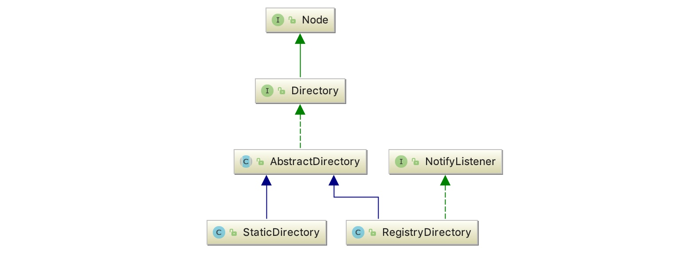
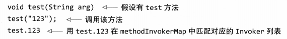
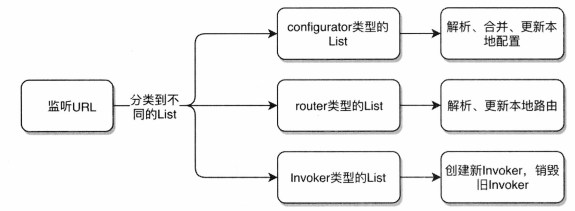

# Dubbo 服务目录

## 1.简介

服务目录是 dubbo 集群容错的一部分。集群容错源码包含四个部分，分别是服务目录 Directory、服务路由 Router、集群 Cluster 和负载均衡 LoadBalance。在进行深入分析之前，我们先来了解一下服务目录是什么。服务目录中存储了一些和服务提供者有关的信息，通过服务目录，服务消费者可获取到服务提供者的信息，比如 ip、端口、服务协议等。通过这些信息，服务消费者就可通过 Netty 等客户端进行远程调用。在一个服务集群中，服务提供者数量并不是一成不变的，如果集群中新增了一台机器，相应地在服务目录中就要新增一条服务提供者记录。或者，如果服务提供者的配置修改了，服务目录中的记录也要做相应的更新。如果这样说，服务目录和注册中心的功能不就雷同了吗？确实如此，这里这么说是为了方便大家理解。实际上服务目录在获取注册中心的服务配置信息后，会为每条配置信息生成一个 Invoker 对象，并把这个 Invoker 对象存储起来，这个 Invoker 才是服务目录最终持有的对象。Invoker 有什么用呢？看名字就知道了，这是一个具有远程调用功能的对象。讲到这大家应该知道了什么是服务目录了，它可以看做是 Invoker 集合，且这个集合中的元素会随注册中心的变化而进行动态调整。

服务目录目前内置的实现有两个，分别为 StaticDirectory 和 RegistryDirectory，它们均是 AbstractDirectory 的子类。AbstractDirectory 实现了 Directory 接口，这个接口包含了一个重要的方法定义，即 list(Invocation)，用于列举 Invoker。下面我们来看一下他们的继承体系图。

<div align="center">
    
</div>

如上，Directory 继承自 Node 接口，Node 这个接口继承者比较多，像 Registry、Monitor、Invoker 等均继承了这个接口。这个接口包含了一个获取配置信息的方法 getUrl，实现该接口的类可以向外提供配置信息。另外，大家注意看 RegistryDirectory 实现了 NotifyListener 接口，当注册中心节点信息发生变化后，RegistryDirectory 可以通过此接口方法得到变更信息，并根据变更信息动态调整内部 Invoker 列表。

从这个继承结构可以看出，也使用了模板模式，Directory 是顶层接口。AbstractDirectory 封装了通用的实现逻辑，抽象类包含了 RegistryDirectory 和 StaticDirectory 两个子类。下面分别介绍了每个类的职责和工作：

### 1.1 AbstractDirectory

AbstractDirectory 封装了通用的逻辑，主要实现了四个方法：检测 invoker 是否可用，销毁所有的 invoker，list 方法，还保留了一个抽象的 doList 方法给子类自行实现。list 方法是最主要的方法，用于返回所有的可用的 invoker 集合，这个逻辑分为两步：

- 调用抽象方法 doList 获取所有 Invoker 列表，不同子类有不同的实现
- 遍历所有的 router，进行 invoker 过滤，最后返回过滤好的 invoker 列表

doList 抽象方法则是返回所有的 invoker 列表，由于是抽象方法，子类继承之后要有自己的实现。

### 1.2 RegistryDirectory

RegistryDirectory 是属于 Directory 的动态列表实现，会自动从注册中心更新 invoker 列表、配置信息、路由列表。

### 1.3 StaticDirectory

StaticDirectory 是 Directory 的静态列表实现，它内部存放的 invoker 由用户设置，并且之后都不会发生改变。所以理论上，她和不可变的 List 功能很相似。它的 doList 方法直接返回所持有的 invoker 集合，另外其 isAvailable 方法只要持有的 invoker 集合中有一个 invoker 是可用的，就认为当前目录是可用的，直接返回 true。我们重点介绍 RegistryDiretory。

## 2.RegistryDirectory 详解

RegistryDirectory 是一种动态服务目录，实现了 NotifyListener 接口。当注册中心服务配置发生变化后，RegistryDirectory 可收到与当前服务相关的变化。收到变更通知后，RegistryDirectory 可根据配置变更信息刷新 Invoker 列表。RegistryDirectory 中有几个比较重要的逻辑：

- 第一是 Invoker 的列举逻辑
- 第二是接收服务配置变更的逻辑
- 第三是 Invoker 列表的刷新逻辑。
  
### 2.1 列举 invoker

接下来按顺序对这三块逻辑。

```java{.line-numbers}
// RegistryDirectory#doList
public List<Invoker<T>> doList(Invocation invocation) {
    if (forbidden) {
        // 服务提供者禁用了服务或者没有对应的服务提供者，此时抛出 No provider 异常
        throw new RpcException("No provider available from registry ");
    }

    List<Invoker<T>> invokers = null;
    // 获取 Invoker 本地缓存
    Map<String, List<Invoker<T>>> localMethodInvokerMap = this.methodInvokerMap; // local reference
    if (localMethodInvokerMap != null && localMethodInvokerMap.size() > 0) {
        // 获取方法名和参数列表
        String methodName = RpcUtils.getMethodName(invocation);
        Object[] args = RpcUtils.getArguments(invocation);
        // 检测参数列表的第一个参数是否为 String 或 enum 类型
        if (args != null && args.length > 0 && args[0] != null
                && (args[0] instanceof String || args[0].getClass().isEnum())) {
            invokers = localMethodInvokerMap.get(methodName + "." + args[0]); // The routing can be enumerated according to the first parameter
        }

        // 通过方法名获取 Invoker 列表
        if (invokers == null) {
            invokers = localMethodInvokerMap.get(methodName);
        }

        // 通过星号 * 获取Invokers列表
        if (invokers == null) {
            //Constants.ANY_VALUE的值为 *
            invokers = localMethodInvokerMap.get(Constants.ANY_VALUE);
        }

        // 遍历 methodlnvokerMap，找到第一个 Invoker 列表返回。如果还没有，则返回一个空列表
        if (invokers == null) {
            Iterator<List<Invoker<T>>> iterator = localMethodInvokerMap.values().iterator();
            if (iterator.hasNext()) {
                invokers = iterator.next();
            }
        }
    }
    return invokers == null ? new ArrayList<Invoker<T>>(0) : invokers;
}
```

notify 中更新的 Invoker 列表最终会转化为一个字典 Map<Stringj List<Invoker<T>>> methodlnvokerMap。key 是对应的方法名称，value 是整个 Invoker 列表。doList 的最终目标就是在字典里匹配出可以调用的 Invoker 列表，并返回给上层。其主要步骤如下：

1. 检查服务是否被禁用，如果配置中心禁用了某个服务，则该服务无法被调用，如果服务被禁用则会抛出异常。
2. 根据方法名和首参数匹配 invoker，这是一个比较奇特的特性。根据方法名和首参数查找对应的 invoker 列表，不过暂时没看到相关的应用场景。首参数匹配的 invoker 使用示例代码如下所示，不过如果这一步没有匹配到 invoker 就会进入步骤 3。

<div align="center">
    
</div>

3. 根据方法名匹配 invoker。以方法名为 key 去 methodInvokerMap 中匹配 invoker 列表，如果还是没有匹配到，则进入第 4 步。
4. 根据 "*" 匹配 invoker。用星号去匹配 invoker 列表，如果还没有匹配到，则进入最后一步兜底操作。
5. 遍历 methodInvokerMap，找到第一个 invoker 列表返回。如果还没有，则返回一个空列表。

以上代码进行多次尝试，以期从 localMethodInvokerMap 中获取到 Invoker 列表。一般情况下，普通的调用可通过方法名获取到对应的 Invoker 列表。localMethodInvokerMap 源自 RegistryDirectory 类的成员变量 methodInvokerMap。doList 方法可以看做是对 methodInvokerMap 变量的读操作。

### 2.2 接收服务变更通知

RegistryDirectory 是一个动态服务目录，会随着注册中心配置的变更进行动态调整。因此 RegistryDirectory 实现了 NotifyListener 接口，通过这个接口获取注册中心变更的通知：

```java{.line-numbers}
// RegistryDirectory#notify
public synchronized void notify(List<URL> urls) {
    // 定义三个集合，分别用于存放服务提供者 url，路由 url，配置器 url
    List<URL> invokerUrls = new ArrayList<URL>();
    List<URL> routerUrls = new ArrayList<URL>();
    List<URL> configuratorUrls = new ArrayList<URL>();

    for (URL url : urls) {
        String protocol = url.getProtocol();
        // 用来获取url中的category参数，默认是providers。在zookeeper中，注册中心的目录有4种：providers、routers、configurators、consumers
        String category = url.getParameter(Constants.CATEGORY_KEY, Constants.DEFAULT_CATEGORY);
        // 根据 category 参数将 url 分别放到不同的列表中
        if (Constants.ROUTERS_CATEGORY.equals(category) || Constants.ROUTE_PROTOCOL.equals(protocol)) {
            // 添加路由器 url
            routerUrls.add(url);
        } else if (Constants.CONFIGURATORS_CATEGORY.equals(category) || Constants.OVERRIDE_PROTOCOL.equals(protocol)) {
            // 添加配置器 url
            configuratorUrls.add(url);
        } else if (Constants.PROVIDERS_CATEGORY.equals(category)) {
            // 添加服务提供者 url
            invokerUrls.add(url);
        } else {
            // 忽略不支持的 category
            logger.warn("Unsupported category in notified url: " + url + " from registry " + getUrl().getAddress() + " to consumer " + NetUtils.getLocalHost());
        }
    }

    // configurators
    if (configuratorUrls != null && configuratorUrls.size() > 0) {
        // 将url转变为configurator
        this.configurators = toConfigurators(configuratorUrls);
    }
    // routers
    if (routerUrls != null && routerUrls.size() > 0) {
        List<Router> routers = toRouters(routerUrls);
        if (routers != null) { // null - do nothing
            // 将url转变为router
            setRouters(routers);
        }
    }

    // providers
    // 刷新 Invoker 列表
    refreshInvoker(invokerUrls);
} 
```

如上，notify 方法就是监听到配置中心对应的 URL 变化，然后更新本地的配置参数。监听的 URL 分为三类：配置 configurators、路由规则 router、Invoker 列表。工作流程如下：

1. 新建三个 List，分别用于保存更新的 Invoker URL、路由配置 URL、配置 configurators URL。然后遍历监听返回的所有 URL，分类后放入三个 List 中
2. 解析并且更新配置参数
   1. 对于 router 类参数，首先遍历所有的 router 类型的 URL，然后通过 router 工厂把每个 URL 包装成路由规则，最后更新本地的路由信息。这个过程会忽略以 empty 开头的 URL
   2. 对于 configutaors 类的参数，管理员可以在 dubbo-admin 动态配置功能上修改生产者的参数，这些参数会保存在配置中心的 configurators 类目下。notify 监听到 URL 配置参数的变化，会解析并且更新本地的 configurator 配置
   3. 对于 invoker 类型的参数，如果是 empty 协议的 URL，则会禁用该服务，并且销毁本地缓存的 invoker；如果监听到的 invoker 类型 URL都是空的，则说明没有更新，直接使用本地的老缓存；如果监听到的Invoker 类型 URL 不为空，则把新的 URL 和本地老的 URL 合并（合并的意思是用新的 URL 中的属性覆盖掉旧的 URL 中的属性，比如 timeout），创建新的 Invoker，找出差异的老 Invoker 并销毁。 

监听更新配置的整个过程如下图所示：

<div align="center">
    
</div>

### 2.3 刷新 invoker 列表

refreshInvoker 方法是保证 RegistryDirectory 随注册中心变化而变化的关键所在。

```java{.line-numbers}
// RegistryDirectory#refreshInvoker
private void refreshInvoker(List<URL> invokerUrls) {
    // Constants.EMPTY_PROTOCOL的字符串值为empty
    // 首先会根据入参 invokerUrls 的数量和协议头是否为 empty 来判断是否禁用所有的服务，如果禁用，则将 forbidden 设为 true，并销毁所有的 Invoker
    // 也就是说，如果 invokerUrls 集合中只有一个 url，并且这个 url 的协议为 empty，那么说明没有provider（在providers目录下的子节点为null）或者
    // 禁用所有服务。
    if (invokerUrls != null && invokerUrls.size() == 1 && invokerUrls.get(0) != null
            && Constants.EMPTY_PROTOCOL.equals(invokerUrls.get(0).getProtocol())) {
        // 设置 forbidden 为 true
        this.forbidden = true; 
        // 销毁所有 Invoker
        this.methodInvokerMap = null; 
        destroyAllInvokers(); 
    } else {
        this.forbidden = false; // Allow to access
        Map<String, Invoker<T>> oldUrlInvokerMap = this.urlInvokerMap; // local reference
        if (invokerUrls.size() == 0 && this.cachedInvokerUrls != null) {
            // 如果 invokerUrls 为空的话，就添加本地缓存的 url 到 invokerUrls 中
            invokerUrls.addAll(this.cachedInvokerUrls);
        } else {
            this.cachedInvokerUrls = new HashSet<URL>();
            // 如果 invokerUrls 不为空的话，就将 invokerUrls 缓存到 cachedInvokerUrls 中去，从而更新本地缓存 
            this.cachedInvokerUrls.addAll(invokerUrls);//Cached invoker urls, convenient for comparison
        }
        if (invokerUrls.size() == 0) {
            return;
        }
        // 将 url 转换成 Invoker，得到 <url, Invoker> 的映射关系
        Map<String, Invoker<T>> newUrlInvokerMap = toInvokers(invokerUrls);// Translate url list to Invoker map
        // 将 newUrlInvokerMap 转成 <methodName, Invoker列表> 的映射关系
        Map<String, List<Invoker<T>>> newMethodInvokerMap = toMethodInvokers(newUrlInvokerMap); // Change method name to map Invoker Map

        // 转换出错，直接打印异常，并返回
        if (newUrlInvokerMap == null || newUrlInvokerMap.size() == 0) {
            logger.error(new IllegalStateException("urls to invokers error .invokerUrls.size, invoker.size :0. urls :" + invokerUrls.toString()));
            return;
        }

        // 合并多个组的 Invoker
        this.methodInvokerMap = multiGroup ? toMergeMethodInvokerMap(newMethodInvokerMap) : newMethodInvokerMap;
        // 使用最新的 invokerUrls 来获取新的 newUrlInvokerMap，并且赋值给本地的 urlInvokerMap 进行更新
        this.urlInvokerMap = newUrlInvokerMap;
        try {
            // 销毁无用的 Invoker
            destroyUnusedInvokers(oldUrlInvokerMap, newUrlInvokerMap); // Close the unused Invoker
        } catch (Exception e) {
            logger.warn("destroyUnusedInvokers error. ", e);
        }
    }
}
```

refreshInvoker 方法执行流程：

1. 根据入参 invokerUrls 的数量和协议头判断是否禁用所有的服务，如果禁用，则销毁所有的 Invoker。
2. 若不禁用，则更新本地的 url 缓存
3. 将 url 转成 Invoker，得到 <url, Invoker> 的映射关系。
4. 进一步进行转换，得到 <methodName, Invoker 列表> 映射关系。然后进行多组 Invoker 合并操作，并且将合并操作的结果赋值给 methodInvokerMap，这个 methodInvokerMap 在 doList 方法中会用到，doList 方法中会对该方法进行读操作，在这里是写操作。
5. 销毁无用的 Invoker，避免服务消费者调用已下线的服务。

最后来分析一下将 url 转变为 invoker 的过程：

```java{.line-numbers}
// RegistryDirectory#toInvokers
private Map<String, Invoker<T>> toInvokers(List<URL> urls) {
    Map<String, Invoker<T>> newUrlInvokerMap = new HashMap<String, Invoker<T>>();
    if (urls == null || urls.size() == 0) {
        return newUrlInvokerMap;
    }
    Set<String> keys = new HashSet<String>();
    // 获取服务消费端配置的协议
    String queryProtocols = this.queryMap.get(Constants.PROTOCOL_KEY);

    for (URL providerUrl : urls) {
        // If protocol is configured at the reference side, only the matching protocol is selected
        // 如果在消费者一端配置了具体的协议的话，那么只会选择满足这个协议的 providerUrl
        if (queryProtocols != null && queryProtocols.length() > 0) {
            boolean accept = false;
            String[] acceptProtocols = queryProtocols.split(",");
            for (String acceptProtocol : acceptProtocols) {
                // 检测 providerUrl 中的协议是否被服务消费者所支持
                if (providerUrl.getProtocol().equals(acceptProtocol)) {
                    accept = true;
                    break;
                }
            }
            // 如果不支持，那么就直接考虑下一个 providerUrl
            if (!accept) {
                continue;
            }
        }
        // 忽略 empty 协议
        if (Constants.EMPTY_PROTOCOL.equals(providerUrl.getProtocol())) {
            continue;
        }
        // 通过 SPI 检测服务端协议是否被消费端支持，不支持则抛出异常
        if (!ExtensionLoader.getExtensionLoader(Protocol.class).hasExtension(providerUrl.getProtocol())) {
            logger.error(new IllegalStateException("Unsupported protocol in notified url: from registry to consumer " + NetUtils.getLocalHost()
                    + ", supported protocol: " + ExtensionLoader.getExtensionLoader(Protocol.class).getSupportedExtensions()));
            continue;
        }
        // 对 consumerUrl 和 providerUrl 中的部分参数进行合并，比如 timeout
        URL url = mergeUrl(providerUrl);

        String key = url.toFullString(); // The parameter urls are sorted
        if (keys.contains(key)) { // Repeated url
            continue;
        }
        keys.add(key);
        // 将本地 Invoker 缓存赋值给 localUrlInvokerMap
        Map<String, Invoker<T>> localUrlInvokerMap = this.urlInvokerMap; // local reference
        // 获取与 url 对应的 Invoker
        Invoker<T> invoker = localUrlInvokerMap == null ? null : localUrlInvokerMap.get(key);
        // 缓存未命中的话，就重新创建一个invoker对象，放入到newUrlInvokerMap中
        if (invoker == null) { // Not in the cache, refer again
            try {
                boolean enabled = true;
                if (url.hasParameter(Constants.DISABLED_KEY)) {
                    // 获取 disable 配置，取反，然后赋值给 enable 变量
                    enabled = !url.getParameter(Constants.DISABLED_KEY, false);
                } else {
                    // 获取 enable 配置，并赋值给 enable 变量
                    enabled = url.getParameter(Constants.ENABLED_KEY, true);
                }
                if (enabled) {
                    // 调用 refer 获取 Invoker，比如 DubboInvoker 对象，这里的 Invoker 对象可以向发起远程服务调用，
                    invoker = new InvokerDelegate<T>(protocol.refer(serviceType, url), url, providerUrl);
                }
            } catch (Throwable t) {
                logger.error("Failed to refer invoker for interface:" + serviceType + ",url:(" + url + ")" + t.getMessage(), t);
            }

            if (invoker != null) { // Put new invoker in cache
                newUrlInvokerMap.put(key, invoker);
            }
        } else {
            newUrlInvokerMap.put(key, invoker);
        }
    }
    keys.clear();
    return newUrlInvokerMap;
}
```

toInvokers 方法一开始会对服务提供者 url 进行检测，若服务消费端的配置不支持服务端的协议，或服务端 url 协议头为 empty 时，toInvokers 均会忽略服务提供方 url。必要的检测做完后，紧接着是合并 url，然后访问缓存，尝试获取与 url 对应的 invoker。如果缓存命中，直接将 Invoker 存入 newUrlInvokerMap 中即可。如果未命中，则需新建 Invoker。toInvokers 方法返回的是 <url, Invoker> 映射关系表。