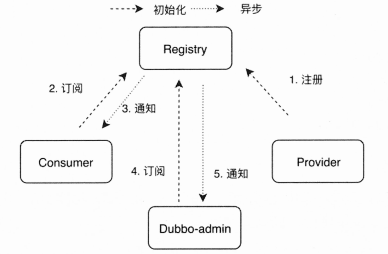
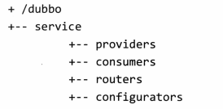
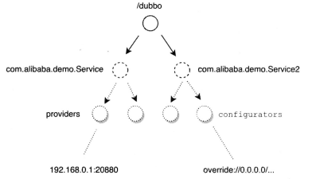
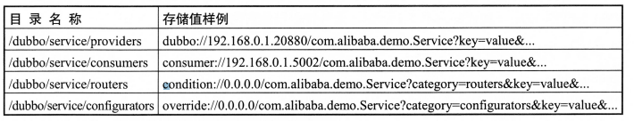
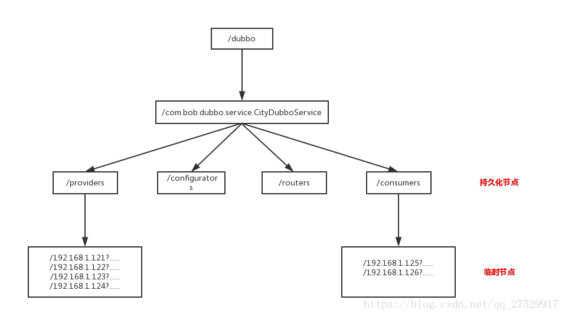
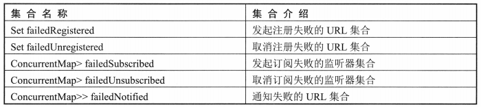
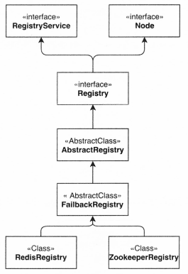
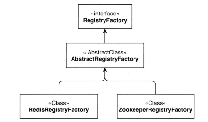

# Dubbo 服务订阅与通知详解

## 一、注册中心概述

### 1.注册中心的主要作用

在 Dubbo 微服务体系中，注册中心是其核心组件之一。Dubbo 通过注册中心实现了分布式环境中各服务之间的注册与发现，是各个分布式节点之间的纽带。其主要作用如下：

- 动态加入：一个服务提供者通过注册中心可以动态地把自己暴露给其他消费者，无须消费者逐个去更新配置文件
- 动态发现：一个消费者可以动态地感知新的配置、路由规则和新的服务提供者，无须重启服务使之生效。
- 动态调整：注册中心支持参数的动态调整，新参数自动更新到所有相关服务结点
- 统一配置：避免了本地配置导致每个服务的配置不一致问题。

### 2.工作流程

注册中心的总体流程比较简单，Dubbo 官方也有比较详细的说明，总体流程如下图所示：

- 服务提供者启动时，会向注册中心写入自己的元数据信息，同时会订阅配置元数据信息。
- 消费者启动时，也会向注册中心写入自己的元数据信息，并订阅服务提供者、路由和配置元数据信息。
- 服务治理中心(dubbo-admin)启动时，会同时订阅所有消费者、服务提供者、路由和配置元数据信息。
- 当有服务提供者离开或有新的服务提供者加入时，注册中心服务提供者目录会发生变化，变化信息会动态通知给消费者、服务治理中心

<div align="center">
    
</div>

注册中心的总体流程相同，但是不同的注册中心有不同的实现方式，其数据结构也不相同。Zookeeper 和 Redis 等注册中心都实现了这个流程。下面只分析 Zookeeper 注册中心的原理。

### 3.Zookeeper 原理概述

Zookeeper 是树形结构的注册中心，每个节点的类型分为持久节点、持久顺序节点、临时节点和临时顺序节点：

- 持久节点：服务注册后保证节点不会丢失，注册中心重启也会存在。
- 持久顺序节点：在持久节点特性的基础上增加了节点先后顺序的能力。
- 临时节点：服务注册后连接丢失或 session 超时，注册的节点会自动被移除。
- 临时顺序节点：在临时节点特性的基础上增加了节点先后顺序的能力。

Dubbo 使用 ZooKeeper 作为注册中心时，只会创建持久节点和临时节点两种，对创建的顺序并没有要求。/dubbo/com.foo.BarService/providers 是服务提供者在 ZooKeeper 注册中心的路径示例， 是一种树形结构，该结构分为四层：root （根节点，对应示例中的 dubbo）、service （接口名称，对应示例中的 com.foo.BarService）、四种服务目录（对应示例中的 providers，其它的目录还有 consumes、routers、configurators）。在服务分类节点下是具体的 Dubbo 服务 URL。树形结构示例如下：

<div align="center">
    
</div>

树形结构的关系：

1. 树的根结点是注册中心分组，下面有多个服务接口，分组值来自用户配置 **`<dubbo:registry>`** 中的 group 属性，默认是 /dubbo
2. 服务接口下包含 4 类子接口，分别是 providers、consumers、routers、configurators，这个路径是持久节点
3. 服务提供者目录（/dubbo/service/providers）下面包含的接口有多个服务者 URL 元数据信息
4. 服务消费者目录（/dubbo/service/consumers）下面包含的接口有多个消费者 URL 元数据信息
5. 路由配置目录 (/dubbo/service/routers) 下面包含多个用于消费者路由策略 URL 元数据信息。
6. 动态配置目录（/dubbo/service/configurators）下面包含多个用于服务者动态配置 URL 元数据信息

下面通过树形结构做一个简单的演示：

<div align="center">
    
</div>

在 Dubbo 框架启动时，会根据用户配置的服务，在注册中心中创建 4 个目录，在 providers 和 consumers 目录中分别存储服务提供方、消费方元数据信息，主要包括 IP、端口、权重和应用名等数据。**<font color="red">在 Dubbo 框架进行服务调用时，用户可以通过服务治理平台（dubbo-admin）下发路由配置。如果要在运行时改变服务参数，则用户可以通过服务治理平台（dubbo-admin）下发动态配置</font>**。服务器端会通过订阅机制收到属性变更，并重新更新已经暴露的服务。Dubbo 注册中心目录包含的信息如下：

<div align="center">
    
</div>

服务元数据中的所有参数都是以键值对形式存储的。以服务元数据为例：dubbo://192.168.0.1.20880/com.alibaba.demo.Service?category=provider&name=demo-provider&…。 服务元数据中包含 2 个键值对，第1个 key 为 category, key 关联的值为 provider。 

## 二、Zookeeper 实现

订阅/发布是整个注册中心的核心功能之一。在传统应用系统中，我们通常会把配置信息写入一个配置文件，当配置需要变更时会修改配置文件,再通过手动触发内存中的配置重新加载， 如重启服务等。在集群规模较小的场景下，这种方式也能方便地进行运维。当服务节点数量不断上升的时候，这种管理方式的弊端就会凸显出来。 

如果我们使用了注册中心，那么上述的问题就会迎刃而解。当一个已有服务提供者节点下线，或者一个新的服务提供者节点加入微服务环境时，订阅对应接口的消费者和服务治理中心都能及时收到注册中心的通知，并更新本地的配置信息。如此一来，后续的服务调用就能避免调用已经下线的节点，或者能调用到新的节点。整个过程都是自动完成的，不需要人工参与。Dubbo在上层抽象了这样一个工作流程，但可以有不同的实现。

### 2.1 发布的实现

服务提供者和消费者都需要把自己注册到注册中心。服务提供者的注册是为了让消费者感知服务的存在，从而发起远程调用；也让服务治理中心感知有新的服务提供者上线。消费者的发布是为了让服务治理中心可以发现自己。注册中心 Zookeeper 上的目录节点如下所示：

<div align="center">
    
</div>

其中目录节点 /dubbo、/com.xxx.xxx、/providers、/routers、/consumers、/configurators 是持久化节点，即使 provider 和 consumer 下线之后，依然会存在。而目录下面的各个 dubbo://... 和 consumer://... 节点，也就是服务提供者的 url 和服务消费者的 url 都是临时节点，只要 provider 和 consumer 下线之后就会被删除掉。

### 2.2 订阅的实现

订阅通常有 pull 和 push 两种方式，一种是客户端定时轮询注册中心拉取配置，另外一种是注册中心主动推送数据给客户端。目前 dubbo 注册中心使用的是在 zookeeper 上注册监听器，当注册中心的数据发生变化时，主动推送数据（push）到客户端。

在服务暴露时，服务端会订阅configurators用于监听动态配置，在消费端启动时，消费端会订阅providers、routers和configuratops这三个目录，分别对应服务提供者、路由和动态配置变更通知。无论服务提供者还是消费者，或者是服务治理中心，任何一个节点连接到ZooKeeper注册中心都需要使用一个客户端，Dubbo在dubbo-remoting-zookeeper模块中实现了 ZooKeeper客户端的统一封装，定义了统一的Client API,并用两种不同的ZooKeeper开源客户端库实现了这个接口：Apache Curator 和 zkClient。用户可以在 **`<dubbo:registry/>`** 的 client 属性中设置 curator、zkclient 来使用不同的客户端实现库，如果不设置则默认使用 zkClient （2.6.0）作为实现。

ZooKeeper 注册中心采用的是“事件通知” 推送的方式，客户端在第一次连接上注册中心时，会在订阅的节点上注册一个 watcher，并且获取对应目录下全量的数据，客户端与注册中心之间保持TCP长连接，后续每个节点有任何数据变化的时候，注册中心会根据 watcher 的回调主动通知客户端（事件通知），并且会把对应节点下的全量数据都推送给客户端（订阅方），这一点在 NotifyListener#notify List<URL> urls 接口上就有约束的注释说明。**<font color="red">全量拉取有一个局限，当微服务节点较多时会对网络造成很大的压力</font>**。

ZooKeeper 的每个节点都有一个版本号，当某个节点的数据发生变化（即事务操作）时， 该节点对应的版本号就会发生变化，并触发 watcher 事件，推送数据给订阅方。版本号强调的是变更次数，即使该节点的值没有变化，只要有更新操作，依然会使版本号变化。

客户端任何新增、删除、修改、会话创建和失效操作,都会被认为是事物操作，会由 ZooKeeper 集群中的 leader 执行。即使客户端连接的是非 leader 节点,请求也会被转发给 leader 执行，以此来保证所有事物操作的全局时序性。由于每个节点都有一个版本号，因此可以通过 CAS 操作比较版本号来保证该节点数据操作的原子性。

客户端第一次连上注册中心，订阅时会获取全量的数据，后续则通过监听器事件进行更新。 服务治理中心会处理所有 service 层的订阅，service 被设置成特殊值*。此外，服务治理中心除了订阅当前节点，还会订阅这个节点下的所有子节点。

### 2.3 服务引用的订阅源码

在服务消费者初始化的过程中，会有一步是进行服务的引用，具体的代码是在 RegistryProtocol 的 refer 方法：

```java{.line-numbers}
// RegistryProtocol#refer
public <T> Invoker<T> refer(Class<T> type, URL url) throws RpcException {
    // 取 registry 参数值，并将其设置为协议头，比如url中配置了registry=zookeeper，那么就将zookeeper设置为url的协议，
    // 然后把registry=zookeeper从url中移除掉
    url = url.setProtocol(url.getParameter(Constants.REGISTRY_KEY, Constants.DEFAULT_REGISTRY))
            .removeParameter(Constants.REGISTRY_KEY);

    // registryFactory 为 RegistryFactory$Adaptive，所以这里会根据url中的protocol，也就是url中协议的类型来调用对应RegistryFactory对象
    // 的getRegistry方法。这里则是调用ZookeeperRegistryFactory对象的getRegistry方法，返回一个ZookeeperRegistry对象
    Registry registry = registryFactory.getRegistry(url);
    if (RegistryService.class.equals(type)) {
        return proxyFactory.getInvoker((T) registry, type, url);
    }

    // group="a,b" or group="*"
    // 将 url 查询字符串转为 Map
    Map<String, String> qs = StringUtils.parseQueryString(url.getParameterAndDecoded(Constants.REFER_KEY));
    // 获取 group 配置
    String group = qs.get(Constants.GROUP_KEY);
    if (group != null && group.length() > 0) {
        if ((Constants.COMMA_SPLIT_PATTERN.split(group)).length > 1 || "*".equals(group)) {
            return doRefer(getMergeableCluster(), registry, type, url);
        }
    }

    // 调用 doRefer 继续执行服务引用逻辑
    return doRefer(cluster, registry, type, url);
}
```

先获取到 ZookeeperRegistry，然后会将其保存到 RegistryDirectory 的 registry 属性中。接着就是 doRefer 方法：

```java{.line-numbers}
// RegistryProtocol#doRefer
private <T> Invoker<T> doRefer(Cluster cluster, Registry registry, Class<T> type, URL url) {
    RegistryDirectory<T> directory = new RegistryDirectory<T>(type, url);
    directory.setRegistry(registry);
    directory.setProtocol(protocol);
    // all attributes of REFER_KEY
    Map<String, String> parameters = new HashMap<String, String>(directory.getUrl().getParameters());
    URL subscribeUrl = new URL(Constants.CONSUMER_PROTOCOL, parameters.remove(Constants.REGISTER_IP_KEY), 0, type.getName(), parameters);

    // 服务消费方向注册中心注册自己（也就是在consumers目录下创建一个新节点），供其他层使用，比如服务治理
    if (!Constants.ANY_VALUE.equals(url.getServiceInterface()) && url.getParameter(Constants.REGISTER_KEY, true)) {
        registry.register(subscribeUrl.addParameters(Constants.CATEGORY_KEY, Constants.CONSUMERS_CATEGORY, Constants.CHECK_KEY, String.valueOf(false)));
    }

    // 进行到这里时，subscribeUrl为：
    // consumer://169.254.207.250/com.dubbo.simple.common.DemoService?application=consumer-of-helloworld-app&dubbo=2.6.0&
    // interface=com.dubbo.simple.common.DemoService&methods=sayHello,sayGoodBye&pid=15336&side=consumer&timestamp=1593437387673
    // 这里给url添加一个参数：category=providers,configurators,router，表示要订阅这三个服务目录，所谓的订阅其实就是在这三个节点
    // 上注册了子节点变化监听器，如果其子节点发生了变化，就会通知RegistryDirectory（也就是调用RegistryDirectory的notify方法）
    directory.subscribe(subscribeUrl.addParameter(Constants.CATEGORY_KEY, Constants.PROVIDERS_CATEGORY + ","
            + Constants.CONFIGURATORS_CATEGORY + "," + Constants.ROUTERS_CATEGORY));

    Invoker invoker = cluster.join(directory);
    ProviderConsumerRegTable.registerConsuemr(invoker, url, subscribeUrl, directory);
    return invoker;
}  
```

在 doRefer 方法中服务消费者会订阅服务，同时订阅了三种类型：providers，routers，configurators。在上面调用 directory 的 subscribe 方法时，会调用 ZookeeperRegistry 的 subscribe 方法，在 ZookeeperRegistry 调用subscribe 处理之前会先经过 AbstractRegistry 的处理，然后经过 FailbackRegistry 处理，在 FailbackRegistry 中会调用 ZookeeperRegistry 的 doSubscribe 方法。

```java{.line-numbers}
// ZookeeperRegistry#doSubscribe
protected void doSubscribe(final URL url, final NotifyListener listener) {
    try {
        if (Constants.ANY_VALUE.equals(url.getServiceInterface())) {
            // 省略代码.....
        } else {
            List<URL> urls = new ArrayList<URL>();
            // 这里的path分别为providers，routers，configurators三种
            for (String path : toCategoriesPath(url)) {
                ConcurrentMap<NotifyListener, ChildListener> listeners = zkListeners.get(url);
                if (listeners == null) {
                    zkListeners.putIfAbsent(url, new ConcurrentHashMap<NotifyListener, ChildListener>());
                    listeners = zkListeners.get(url);
                }
                // 根据我们的 listener 获取一个 ChildListener 实例
                ChildListener zkListener = listeners.get(listener);
                // 没有的话就创建一个 ChildListener 实例。
                if (zkListener == null) {
                    listeners.putIfAbsent(listener, new ChildListener() {
                        public void childChanged(String parentPath, List<String> currentChilds) {
                            // 如果 path 下面的子节点的状态发生变化（增加或者删除节点），那么就会最终调用 ZookeeperRegistry 下面的 notify 方法
                            // 这个 ChildListener 接口用于把 zkclient 的事件（IZkChildListener）转换到 registry 事件（NotifyListener）。
                            // 这里的 ChildListener 可以更好的把 zkclient 的 api 和 dubbo 真身的注册中心逻辑分离开，毕竟 dubbo 除了 zkclient 以外还可以选择 curator。
                            ZookeeperRegistry.this.notify(url, listener, toUrlsWithEmpty(url, parentPath, currentChilds));
                        }
                    });
                    zkListener = listeners.get(listener);
                }
                // 根据 path 在 Zookeeper 中创建节点
                zkClient.create(path, false);
                // 这里 zkClient 是 dubbo 的 ZkclientZookeeperClient，在 addChildListener 中会转化为 ZkClient（Zookeeper 的开源客户端）中的 Listener
                List<String> children = zkClient.addChildListener(path, zkListener);
                if (children != null) {
                    urls.addAll(toUrlsWithEmpty(url, path, children));
                }
            }
            // 订阅完成之后，进行通知，调用 ZookeeperRegistry 的父类 FailbackRegistry 的 notify 方法
            // 这里的 urls 为订阅的各个 path 节点下面子节点的值的集合，如果 path 下面没有子节点，则为 empty:// 开头的 url
            notify(url, listener, urls);
        }
    } catch (Throwable e) {
        throw new RpcException("Failed to subscribe " + url + " to zookeeper " + getUrl() + ", cause: " + e.getMessage(), e);
    }
}
```

上面的 doSubscribe 方法才是真正的订阅逻辑，就会向 Zookeeper 注册中心上创建 3 个节点（providers、configurators、routers），并且在这三个节点上注册子节点变化监听器，每当这 3 个节点的子节点发生变化（增加/删除子节点）的时候，就会回调 RegistryDirectory 中的 notify 方法，进行相应的更新。而对于 notify 方法，ZookeeperRegistry 首先会调用父类 FailbackRegistry 的 notify 方法，而 FailbackRegistry#notify 方法没有做任何额外的处理，只是继续调用父类 AbstractRegistry 中的 notify 方法。

```java{.line-numbers}
// AbstractRegistry#notify
protected void notify(URL url, NotifyListener listener, List<URL> urls) {
    // 检查各个参数的合法性，比如是否为 null

    Map<String, List<URL>> result = new HashMap<String, List<URL>>();
    // result中存储的为zookeeper中各个目录（category）下的url，也就是 category -> urls 的映射关系
    // 并且还会检测这些url和消费者的url是否相匹配（传进来的参数中，url为消费者的URL，表示要调用服务的相关配置信息，比如服务的接口名是否相同，
    // 版本，组等等）
    for (URL u : urls) {
        // providerUrl 和 consumerUrl 的 interface、category、group、version、classifier 属性是否相同
        if (UrlUtils.isMatch(url, u)) {
            String category = u.getParameter(Constants.CATEGORY_KEY, Constants.DEFAULT_CATEGORY);
            List<URL> categoryList = result.get(category);
            if (categoryList == null) {
                categoryList = new ArrayList<URL>();
                result.put(category, categoryList);
            }
            categoryList.add(u);
        }
    }
    if (result.size() == 0) {
        return;
    }
    
    // 已经通知过的category
    Map<String, List<URL>> categoryNotified = notified.get(url);
    if (categoryNotified == null) {
        notified.putIfAbsent(url, new ConcurrentHashMap<String, List<URL>>());
        categoryNotified = notified.get(url);
    }
    for (Map.Entry<String, List<URL>> entry : result.entrySet()) {
        String category = entry.getKey();
        List<URL> categoryList = entry.getValue();
        categoryNotified.put(category, categoryList);
        saveProperties(url);
        // 最终调用 RegistryDirectory 中的 notify 方法
        listener.notify(categoryList);
    }
}
```

传进来的 urls 包含 providers、configurators、routers 三个目录下的 url，所以在 notify 方法中将这些 urls 分类保存到 map 中，依次传递给 listener（也就是 RegistryDirectory）中进行处理。RegistryDirectory 中的 notify 方法如下所示：

```java{.line-numbers}
// RegistryDirectory#notify
public synchronized void notify(List<URL> urls) {
    // 定义三个集合，分别用于存放服务提供者 url，路由 url，配置器 url
    List<URL> invokerUrls = new ArrayList<URL>();
    List<URL> routerUrls = new ArrayList<URL>();
    List<URL> configuratorUrls = new ArrayList<URL>();

    for (URL url : urls) {
        String protocol = url.getProtocol();
        //用来获取url中的category参数，默认是providers。在zookeeper中，注册中心的目录有4种：providers、routers、configurators、consumers
        String category = url.getParameter(Constants.CATEGORY_KEY, Constants.DEFAULT_CATEGORY);
        // 根据 category 参数将 url 分别放到不同的列表中
        if (Constants.ROUTERS_CATEGORY.equals(category)
                || Constants.ROUTE_PROTOCOL.equals(protocol)) {
            // 添加路由器 url
            routerUrls.add(url);
        } else if (Constants.CONFIGURATORS_CATEGORY.equals(category)
                || Constants.OVERRIDE_PROTOCOL.equals(protocol)) {
            // 添加配置器 url
            configuratorUrls.add(url);
        } else if (Constants.PROVIDERS_CATEGORY.equals(category)) {
            // 添加服务提供者 url
            invokerUrls.add(url);
        } else {
            // 忽略不支持的 category
            logger.warn("Unsupported category in notified url: from registry to consumer " + NetUtils.getLocalHost());
        }
    }

    // configurators
    if (configuratorUrls != null && configuratorUrls.size() > 0) {
        // 将url转变为configurator
        this.configurators = toConfigurators(configuratorUrls);
    }
    // routers
    if (routerUrls != null && routerUrls.size() > 0) {
        List<Router> routers = toRouters(routerUrls);
        if (routers != null) { // null - do nothing
            // 将url转变为router
            setRouters(routers);
        }
    }

    // providers
    // 刷新 Invoker 列表
    refreshInvoker(invokerUrls);
}
```

RegistryDirectory 是一个动态服务目录，会随注册中心配置的变化进行动态调整。因此 RegistryDirectory 实现了 NotifyListener 接口，通过这个接口获取注册中心变更通知。如上，notify 方法首先是根据 url 的 category 参数对 url 进行分门别类存储，然后通过 toRouters 和 toConfigurators 将 url 列表转成 Router 和 Configurator 列表。最后调用 refreshInvoker 方法刷新 Invoker 列表。

### 2.4 服务暴露过程中的订阅

服务暴露过程中的订阅在 RegistryProtocol 的 export 方法中：

```java{.line-numbers}
// RegistryProtocol#export
public <T> Exporter<T> export(final Invoker<T> originInvoker) throws RpcException {
    // 导出服务，并且启动服务器监听特定端口
    final ExporterChangeableWrapper<T> exporter = doLocalExport(originInvoker);

    // 获取注册中心 URL，以 zookeeper 注册中心为例，得到的示例 URL 如下：
    // zookeeper://127.0.0.1:2181/com.alibaba.dubbo.registry.RegistryService?application=demo-provider&dubbo=2.0.2&
    // export=dubbo%3A%2F%2F172.17.48.52%3A20880%2Fcom.alibaba.dubbo.demo.DemoService%3Fanyhost%3Dtrue%26application%3Ddemo-provider
    URL registryUrl = getRegistryUrl(originInvoker);
    // 创建一个 Registry 对象（代表注册中心）同时会连接到注册中心，比如 ZookeeperRegistry、RedisRegistry 等
    final Registry registry = getRegistry(originInvoker);
    final URL registedProviderUrl = getRegistedProviderUrl(originInvoker);

    // 获取 register 参数，表明是否进行注册
    boolean register = registedProviderUrl.getParameter("register", true);
    // 向服务提供者与消费者注册表中注册服务提供者
    ProviderConsumerRegTable.registerProvider(originInvoker, registryUrl, registedProviderUrl);

    // 根据 register 的值决定是否注册服务
    if (register) {
        // 向注册中心注册服务
        register(registryUrl, registedProviderUrl);
        ProviderConsumerRegTable.getProviderWrapper(originInvoker).setReg(true);
    }

    // 获取订阅 URL，比如：
    // provider://172.17.48.52:20880/com.alibaba.dubbo.demo.DemoService?category=configurators&check=false&anyhost=true&
    // application=demo-provider&dubbo=2.0.2&generic=false&interface=com.alibaba.dubbo.demo.DemoService&methods=sayHello
    final URL overrideSubscribeUrl = getSubscribedOverrideUrl(registedProviderUrl);

    // 创建监听器
    final OverrideListener overrideSubscribeListener = new OverrideListener(overrideSubscribeUrl, originInvoker);
    overrideListeners.put(overrideSubscribeUrl, overrideSubscribeListener);

    // 向注册中心进行订阅 override 数据
    registry.subscribe(overrideSubscribeUrl, overrideSubscribeListener);

    return new Exporter<T>() {
        public Invoker<T> getInvoker() {
            return exporter.getInvoker();
        }

        public void unexport() {
            try {
                exporter.unexport();
            } catch (Throwable t) {
                logger.warn(t.getMessage(), t);
            }
            try {
                registry.unregister(registedProviderUrl);
            } catch (Throwable t) {
                logger.warn(t.getMessage(), t);
            }
            try {
                overrideListeners.remove(overrideSubscribeUrl);
                registry.unsubscribe(overrideSubscribeUrl, overrideSubscribeListener);
            } catch (Throwable t) {
                logger.warn(t.getMessage(), t);
            }
        }
    };
}
```

registry.subscribe 订阅 override 数据，会首先经过 AbstractRegistry 处理，然后经过FailbackRegistry 处理。处理方法在上面消费者发布订阅的讲解中都已经介绍。往下的步骤基本相同，不同之处在于 AbstractRegistry 的 notify 方法：

```java{.line-numbers}
// AbstractRegistry#notify
protected void notify(URL url, NotifyListener listener, List<URL> urls) {
    
    // 省略代码

    for (Map.Entry<String, List<URL>> entry : result.entrySet()) {
        String category = entry.getKey();
        List<URL> categoryList = entry.getValue();
        categoryNotified.put(category, categoryList);
        saveProperties(url);
        // 对于消费者，最终调用 RegistryDirectory 中的 notify 方法
        // 对于服务提供者，最终调用 OverrideListener 中的 notify 方法，它是 RegistryProtocol 的内部类
        listener.notify(categoryList);
    }
} 
```

接下来看 OverrideListener 的 notify 方法：

```java{.line-numbers}
/*
 *  provider 端可识别的override url只有这两种.
 *  override://0.0.0.0/serviceName?timeout=10
 *  override://0.0.0.0/?timeout=10
 */
public void notify(List<URL> urls) {
    List<URL> result = null;
    for (URL url : urls) {
        URL overrideUrl = url;
        if (url.getParameter(Constants.CATEGORY_KEY) == null
                && Constants.OVERRIDE_PROTOCOL.equals(url.getProtocol())) {
            // 兼容旧版本
            overrideUrl = url.addParameter(Constants.CATEGORY_KEY, Constants.CONFIGURATORS_CATEGORY);
        }
        if (! UrlUtils.isMatch(subscribeUrl, overrideUrl)) {
            if (result == null) {
                result = new ArrayList<URL>(urls);
            }
            result.remove(url);
            logger.warn("Subsribe category=configurator, but notifed non-configurator urls. may be registry bug. unexcepted url: " + url);
        }
    }
    if (result != null) {
        urls = result;
    }
    this.configurators = RegistryDirectory.toConfigurators(urls);
    List<ExporterChangeableWrapper<?>> exporters = new ArrayList<ExporterChangeableWrapper<?>>(bounds.values());
    for (ExporterChangeableWrapper<?> exporter : exporters){
        Invoker<?> invoker = exporter.getOriginInvoker();
        final Invoker<?> originInvoker ;
        if (invoker instanceof InvokerDelegete){
            originInvoker = ((InvokerDelegete<?>)invoker).getInvoker();
        }else {
            originInvoker = invoker;
        }

        URL originUrl = RegistryProtocol.this.getProviderUrl(originInvoker);
        URL newUrl = getNewInvokerUrl(originUrl, urls);

        if (! originUrl.equals(newUrl)){
        	//对修改了url的invoker重新export
            RegistryProtocol.this.doChangeLocalExport(originInvoker, newUrl);
        }
    }
}
```

这里也是对 Invoker 重新进行了引用。

## 三、重试机制

根据上一节的类图，我们可以得知 com.alibaba.dubbo.registry.support.FailbackRegistry 继承了 AbstractRegistry，并在此基础上增加了失败重试机制作为抽象能力。ZookeeperRegistry 和 RedisRegistry 继承该抽象方法后，直接使用即可。另外，该抽象类中还有五个比较重要的集合如下：

<div align="center">
    
</div>

在定时器中调用 retry 方法的时候，会把这五个集合分别遍历和重试，重试成功则从集合中移除。FailbackRegistry 实现了 subscribe、unsubscribe 等通用方法，里面调用了未实现的模板方法 doSubscribe 和 dounsubscribe，会由子类实现。通用方法会调用这些模板方法，如果捕获到异常，则会把 URL 添加到对应的重试集合中，以供定时器重试。FailbackRegistry 的构造方法如下所示：

```java{.line-numbers}
public FailbackRegistry(URL url) {
    super(url);
    int retryPeriod = url.getParameter(Constants.REGISTRY_RETRY_PERIOD_KEY, Constants.DEFAULT_REGISTRY_RETRY_PERIOD);
    this.retryFuture = retryExecutor.scheduleWithFixedDelay(new Runnable() {
        public void run() {
            // Check and connect to the registry
            try {
                retry();
            } catch (Throwable t) { // Defensive fault tolerance
                logger.error("Unexpected error occur at failed retry, cause: " + t.getMessage(), t);
            }
        }
    }, retryPeriod, retryPeriod, TimeUnit.MILLISECONDS);
} 
```

FailbackRegistry 抽象类中定义了一个 ScheduledExecutorService，每经过固定间隔(默认为5秒)调用 FailbackRegistry#retry() 方法。FailbackRegistry 中重要的集合与属性如下所示：

```java{.line-numbers}
// 执行失败重试的逻辑
public abstract class FailbackRegistry extends AbstractRegistry {

    // Scheduled executor service
    private final ScheduledExecutorService retryExecutor = Executors.newScheduledThreadPool(1, new NamedThreadFactory("DubboRegistryFailedRetryTimer", true));

    // Timer for failure retry, regular check if there is a request for failure, and if there is, an unlimited retry
    private final ScheduledFuture<?> retryFuture;

    // 发起注册失败的 URL 集合
    private final Set<URL> failedRegistered = new ConcurrentHashSet<URL>();

    // 取消注册失败的 URL 集合
    private final Set<URL> failedUnregistered = new ConcurrentHashSet<URL>();

    // 发起订阅失败的 URL 集合
    private final ConcurrentMap<URL, Set<NotifyListener>> failedSubscribed = new ConcurrentHashMap<URL, Set<NotifyListener>>();

    // 取消订阅失败的 URL 集合
    private final ConcurrentMap<URL, Set<NotifyListener>> failedUnsubscribed = new ConcurrentHashMap<URL, Set<NotifyListener>>();

    // 通知失败的 URL 集合
    private final ConcurrentMap<URL, Map<NotifyListener, List<URL>>> failedNotified = new ConcurrentHashMap<URL, Map<NotifyListener, List<URL>>>();

    private AtomicBoolean destroyed = new AtomicBoolean(false);
} 
```

Retry 方法的部分逻辑如下所示：

```java{.line-numbers}
protected void retry() {
    // 遍历注册失败的 URL 集合，对其中的每一个 URL 进行注册重试
    if (!failedRegistered.isEmpty()) {
        Set<URL> failed = new HashSet<URL>(failedRegistered);
        if (failed.size() > 0) {
            if (logger.isInfoEnabled()) {
                logger.info("Retry register " + failed);
            }
            try {
                for (URL url : failed) {
                    try {
                        doRegister(url);
                        failedRegistered.remove(url);
                    } catch (Throwable t) { // Ignore all the exceptions and wait for the next retry
                        logger.warn("Failed to retry register " + failed + ", waiting for again, cause: " + t.getMessage(), t);
                    }
                }
            } catch (Throwable t) { // Ignore all the exceptions and wait for the next retry
                logger.warn("Failed to retry register " + failed + ", waiting for again, cause: " + t.getMessage(), t);
            }
        }
    }

    // 遍历取消注册失败的 URL 集合，对其中的每一个 URL 进行取消注册重试
    if (!failedUnregistered.isEmpty()) {
        Set<URL> failed = new HashSet<URL>(failedUnregistered);
        if (failed.size() > 0) {
            if (logger.isInfoEnabled()) {
                logger.info("Retry unregister " + failed);
            }
            try {
                for (URL url : failed) {
                    try {
                        doUnregister(url);
                        failedUnregistered.remove(url);
                    } catch (Throwable t) { // Ignore all the exceptions and wait for the next retry
                        logger.warn("Failed to retry unregister  " + failed + ", waiting for again, cause: " + t.getMessage(), t);
                    }
                }
            } catch (Throwable t) { // Ignore all the exceptions and wait for the next retry
                logger.warn("Failed to retry unregister  " + failed + ", waiting for again, cause: " + t.getMessage(), t);
            }
        }
    }

    // 省略代码
} 
```

也就是分别对 5 个集合进行遍历，重新进行 注册/取消注册/订阅/取消订阅，如果成功则将其从集合中移除，如果没有成功则等待下一次重试。

## 四、设计模式

### 1.模板模式

整个注册中心的逻辑部分使用了模板模式，其类的关系如下所示：

<div align="center">
    
</div>

AbstractRegistry 实现了 Registry 接口中的注册、订阅、查询、通知等方法，还实现了磁盘文件持久化注册信息这一通用方法。但是注册、订阅、查询、通知等方法只是简单地把 URL 加入对应的集合，没有具体的注册或订阅逻辑。

FailbackRegistry 又继承了 AbstractRegistry，重写了父类的注册、订阅、查询和通知等方法，并且添加了重试机制。此外，还添加了四个未实现的抽象模板方法：

```java{.line-numbers}
protected abstract void doRegister(URL url); 
protected abstract void dollnregister(URL url); 
protected abstract void doSubscribe(URL url. NotifyListener listener); 
protected abstract void doUnsubscribe(URL url. NotifyListener listener); 
```

### 2.工厂模式

所有的注册中心实现，都是通过对应的工厂创建的。工厂类之间的关系如下所示：

<div align="center">
    
</div>

AbstractRegistryFactory 实现了 RegistryFactory 接口的 getRegistry(URL url) 方法，是一个通用实现，主要完成了加锁，以及调用抽象模板方法 createRegistry(URL url) 创建具体实现等操作，并缓存在内存中。抽象模板方法会由具体子类继承并实现