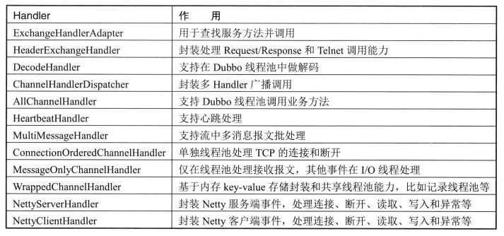

# Dubbo 服务调用详解

## 一、服务调用

### 1.简介

在讲解 Dubbo 中的 RPC 调用细节之前，我们先回顾一次调用过程经历了哪些处理步骤。 如果我们动手写简单的 RPC 调用，则需要把服务调用信息传递到服务端，每次服务调用的一些公用的信息包括服务调用接口、方法名、方法参数类型和方法参数值等，在传递方法参数值时需要先序列化对象并经过网络传输到服务端，在服务端需要按照客户端序列化顺序再做一次反序列化来读取信息，然后拼装成请求对象进行服务反射调用，最终将调用结果再传给客户端。

Dubbo 也是采用同样的处理方式，在进行源码分析之前，我们先来通过一张图了解 Dubbo 服务调用过程。

<div align="center">
    
</div>

首先服务消费者通过代理对象 Proxy 发起远程调用，接着通过网络客户端 Client 将编码后的请求发送给服务提供方的网络层上，也就是 Server。Server 在收到请求后，首先要做的事情是对数据包进行解码。然后将解码后的请求发送至分发器 Dispatcher，再由分发器将请求派发到指定的线程池上，最后由线程池调用具体的服务。这就是一个远程调用请求的发送与接收过程。至于响应的发送与接收过程，这张图中没有表现出来。对于这两个过程，我们也会进行详细分析。

### 2.消费者向提供者发起请求

消费者向提供者发起 RPC 调用的流程如下：

1. 调用代理对象对应的方法。比如 proxy 的 sayHello 方法。proxy 实现了服务接口
2. 调用 InvokerInvocationHandler 的 invoke 方法。调用前面代理对象的任何方法都会委托到 InvokerInvocationHandler 的 invoke 方法中，有点类似于 jdk 中的动态代理
3. 调用 MockClusterInvoker 的 invoke 方法。在这个方法中封装了服务降级的逻辑
4. 调用 FailoverClusterInvoker 的 invoke 方法。在 FailoverClusterInvoker 中封装了服务容错逻辑，具体的逻辑如下：
   1. 在 AbstractClusterInvoker 的 invoke 方法中，通过内部的 RegistryDirectory 获取到持有的 invoker 集合，并且先进行一次路由过滤，然后再将剩下的 invoker 集合传给 FailoverClusterInvoker
   2. 在 FailoverClusterInvoker 的 invoke 方法中，先获取到 invoker 集合，然后再使用负载均衡算法从中选择一个 invoker 发起远程调用。如果调用失败，则选择另外一个 invoker 再发起调用，直到达到重试次数上限
5. 调用 RegistryDirectory$InvokerDelegate 中的 invoke 方法
6. 经过一系列 Filter 过滤器的处理
7. 调用 AbstractInvoker 的 invoke 方法，主要的作用是添加信息到 RpcInvocation 中
8. 调用 DubboInvoker 的 doInvoke 方法，根据调用的方式不同进行不同的处理：
   1. 同步调用：发送请求，得到一个 ResponseFuture 实例，并调用该实例的 get 方法进行等待
   2. 异步调用：发送请求，并得到一个 ResponseFuture 实例，设置 future 到 RpcContext 上下文中，供用户获取，并且直接返回一个空结果
   3. 异步无返回值调用：发送请求，并得到一个 ResponseFuture 实例，并且将 RpcContext 中的 future 为 null，最后也返回一个空结果
9. 调用 ReferenceCountExchangeClient 的 request 方法，ReferenceCountExchangeClient 内部定义了一个引用计数变量 referenceCount，每当该对象被引用一次 referenceCount 都会进行自增。每当 close 方法被调用时，referenceCount 进行自减。ReferenceCountExchangeClient 内部仅实现了一个引用计数的功能，其他方法并无复杂逻辑，均是直接调用被装饰对象的相关方法。可以说，ReferenceCountExchangeClient 专注于引用计数的逻辑。
10. 调用 HeaderExchangeClient 的 request 方法，在这个 request 方法中，直接调用 HeaderExchangeChannel 的 request 方法。HeaderExchangeClient  提供心跳检查功能；将 send、request、close 等事件转由 HeaderExchangeChannel 处理。
11. 调用 HeaderExchangeChannel 的 request 方法。HeaderExchangeChannel 主要是引入了 Request 和 Response 语义，在 request(Object request,int timeout) 方法中，将请求转换成 Request 对象，将请求消息设置到 data 属性上，构建 DefaultFuture 对象，调用 NIO 框架对应的 Client 对象（默认 NettyClient）的 send 方法将消息发送出去，返回 DefultFuture 对象。
12. 调用 AbstractPeer 的 send 方法
13. 调用 AbstractClient 的 send 方法
14. 调用 NettyChannel 的 send 方法，NettyChannel 在 Netty 的 NioSocketChannel 上进行了一层封装
15. 调用 NioSocketChannel 的 write 方法，在这里，真正地将请求发送给服务端

在把请求写入到 NioSocketChannel 中之后，请求还会被 ChannelPipeline 中的各个 ChannelHandler 处理，比如 NettyClientHandler 以及其中封装的各个 handler，具体的流程如下：

1. 调用 NettyClientHandler 的 write 方法
2. 调用 NettyClient 的父类 AbstractPeer  的 sent 方法
3. 调用 MultiMessageHandler 的父类 AbstractChannelHandlerDelegate 的 sent 方法
4. 调用 HeartbeatHandler 的 sent 方法
5. 调用 AllChannelHandler 的父类 WrappedChannelHandler 的 sent 方法
6. 调用 DecodeHandler 的父类 AbstractChannelHandlerDelegate 的 sent 方法
7. 调用 HeaderExchangeHandler 的 sent 方法
8. 调用 DubboProtocol$1 的父类 ChannelHandlerAdapter 的 sent 方法，这是一个空方法，实际上不做任何处理

### 3.服务端处理消费者发送的请求

解码器将数据包解析成 Request 对象后，NettyServerHandler 的 channelRead 方法紧接着会收到这个对象，并将这个对象继续向下传递。这期间该对象会被依次传递给 AbstractPeer、MultiMessageHandler、HeartbeatHandler 以及 AllChannelHandler。最后由 AllChannelHandler 将该对象封装到 Runnable 实现类 ChannelEventRunnable 对象中，并将 Runnable 放入线程池中执行后续的调用逻辑。具体的调用流程如下：

1. 调用 NettyServerHandler 的 channelRead 方法
2. 调用 AbstractPeer 的 received 方法
3. 调用 MultiMessageHandler 的 received 方法
4. 调用 HeartbeatHandler 的 received 方法，如果这个消息不是心跳请求或者心跳响应，那么交给下面的 handler 继续处理
5. 调用 AllChannelHandler 的 received 方法，创建一个 ChannelEventRunnable 对象，放入到 executor 线程池中去执行。也就是说，对于客户端发送过来的请求事件，dubbo 放入到线程池中去处理，不阻塞 IO 线程去获取下一个请求。

在继续分析之前，先介绍一下 Dubbo 中的线程派发模型。Dubbo 将底层通信框架中接收请求的线程称为 IO 线程。如果一些事件处理逻辑可以很快执行完，比如只在内存打一个标记，此时直接在 IO 线程上执行该段逻辑即可。但如果事件的处理逻辑比较耗时，比如该段逻辑会发起数据库查询或者 HTTP 请求。此时我们就不应该让事件处理逻辑在 IO 线程上执行，而是应该派发到线程池中去执行。原因也很简单，IO 线程主要用于接收请求，如果 IO 线程被占满，将导致它不能接收新的请求。

最开始图片中的 Dispatcher 就是线程派发器。需要说明的是，Dispatcher 真实的职责创建具有线程派发能力的 ChannelHandler，比如 AllChannelHandler、MessageOnlyChannelHandler 和 ExecutionChannelHandler 等，其本身并不具备线程派发能力。Dubbo 支持 5 种不同的线程派发策略：

<div align="center">
    
</div>

默认配置下，Dubbo 使用 all 派发策略，即将所有的消息都派发到线程池中。我们接着上面的 ChannelEventRunnabel 进行分析：

1. 调用 ChannelEventRunnable 的 run 方法。事件状态 state 为 RECEIVED 
2. 调用 DecodeHandler 中的 received 方法，对 Request 对象中的 data 字段进行解码，并且解码完成后，Request 对象会继续向后传递
3. 调用 HeaderExchangeHandler 的 received 方法，处理消息对象，具体的如下：
   1. 判断消息是否为请求对象
   2. 如果是双向通信，真正的调用服务，并且将调用得到的结果封装到 Response 对象中，最后再将该对象返回给服务消费方。如果服务调用的过程中发生错误，则将错误信息封装到 Response 对象中，并返回给服务消费方。
   3. 如果是单向通信，仅向后调用指定服务即可，无需返回调用结果
4. 调用 DubboProtocol$1 的 reply 方法，具体如下：
   1. 根据调用的信息，生成 service key，格式为 groupName/serviceName:serviceVersion:port
   2. 从 exporterMap 查找与 serviceKey 相对应的 DubboExporter 对象，服务导出过程中会将 <serviceKey, DubboExporter> 映射关系存储到 exporterMap 集合中
   3. 从 DubboExporter 中找到 DubboInvoker 对象，然后调用其 invoke 方法
5. 经过一系列 Filter 过滤器的处理
6. 调用 AbstractProxyInvoker 的 invoke 方法
7. 调用 wrapper0 中的 invokeMethod 方法
8. 调用服务接口实现类中具体的方法，比如 DemoServiceImpl#sayHello

### 4.客户端接收服务端发送过来的 Response 请求

解码器将数据包解析成 Request，NettyClientHandler 的 channelRead 方法紧接着会收到这个对象, 并将这个对象继续向下传递. 这期间该对象会被依次传递给 AbstractPeer, MultiMessageHandler, HeartbeatHandler 以及 AllChannelHandler。最后由 AllChannelHandler 将该对象封装到 Runnable 实现类 ChannelEventRunnable 的对象中， 并将 Runnable 放入线程池中执行后续的调用逻辑。具体的调用流程如下：

1. 调用 NettyServerHandler 的 channelRead 方法
2. 调用 AbstractPeer 的 received 方法
3. 调用 MultiMessageHandler 的 received 方法
4. 调用 HeartbeatHandler 的 received 方法，如果这个消息不是心跳请求或者心跳响应，那么交给下面的 handler 继续处理
5. 调用 AllChannelHandler 的 received 方法，创建一个 ChannelEventRunnable 对象，放入到 executor 线程池中去执行。也就是说，对于服务端发送过来的响应事件，dubbo 放入到线程池中去处理，不阻塞 IO 线程去获取下一个响应或者请求。
6. 调用 ChannelEventRunnable 的 run 方法。事件状态 state 为 RECEIVED 
7. 调用 DecodeHandler 中的 received 方法，对 Response 对象中的 result 字段进行解码，并且解码完成之后，Response 对象还会继续向后传递
8. 调用 HeaderExchangeHandler 的 received 方法，处理消息对象：
   1. 判断消息是否为响应对象
   2. 判断服务器端发送过来的 response 不为 null，并且 response 不是服务器对客户端发送的心跳包的响应
9. 调用 DefaultFuture 的 received 方法
   1. 当接收到服务端的返回值时，从 FUTURES 这个 map 中移除掉此 response 对应的 DefaultFuture 对象
   2. 接收到返回值 Response，向在 done 变量上阻塞的线程发送信号进行唤醒操作
   3. 对 callback 进行回调操作

### 5.Netty 中的 ChannelHandler

Dubbo 框架内部使用大量 Handler 组成类似链表，依次处理具体逻辑，比如编解码、心跳时间戳和方法调用 Handler 等。因为 Netty 每次 Handler 处理完消息向后传递时都会经过 ChannelPipeline，从而传递给下一个 Handler 进行处理，会有较多的开销，因此 Dubbo 会将多个 Handler 聚合为一个 Handler。在详细讲解 ChannelHandler 之前，我们先弄清楚 Dubbo 有哪些常用的 Handler，它们之前是如何关联及如何协作的。

Dubbo 中 Handler 的 5 种状态如下所示：

<div align="center">
    
</div>

Dubbo 针对每一个特性都会实现对应的 ChannelHandler，Dubbo 中所有的 Handler 如下所示：

<div align="center">
    
</div>

Dubbo 中提供了大量的 Handler 去承载特性和扩展，这些 Handler 最终会和底层通信框架做关联，比如 Netty 等。**<font color="red">一次完整的 RPC 调用贯穿了一系列的 Handler，如果直接挂载到底层通信框架（Netty ,因为整个链路比较长，则需要触发大量链式查找和事件，不仅低效，而且浪费资源</font>**。这里注意，上面表格中的 ExchangeHandlerAdapter 其实就是前面调用过程中的 DubboProtocol 的内部类 DubboProtocol$1，用于在服务端真正调用具体服务方法。

下图展示了同时具有入站和出站 ChannelHandler 的布局，如果有一个入站事件被触发， 比如连接或数据读取，那么它会从 ChannelPipeline 头部开始一直传播到 Channelpipeline 的尾端。出站的 I/O 事件将从ChannelPipeline 最右边开始，然后向左传播。当然，在ChannelPipeline 传播事件时，它会测试入站是否实现了 ChannellnboundHandler 接口，如果没有实现则会自动跳过，出站时会监测是否实现ChannelOutboundHandler，如果没有实现，那么也会自动跳过。在Dubbo 框架中实现的这两个接口类主要是 NettyServerHandler 和 NettyClientHandler。Dubbo通过装饰者模式在 NettyServerHandler 和 NettyClientHandler 中包装Handler，从而不需要将每个 Handler 都追加到 Pipeline 中。在 NettyServer 和 NettyClient 中最多有 3 个 Handler，分别是编码、解码和 NettyServerHandler 或 NettyClientHandler。

<div align="center">
    
</div>

对于客户端，它的底层 ChannelPipeline 结构为：decoder -> encoder -> NettyClientHandler。其中 NettyClientHandler 是 Netty 中ChannelDuplexHandler 的子类，可以处理入站和出站数据。NettyClientHandler 中的 handler 经过了层层封装，它的层次结构如下：

```java{.line-numbers}
 1 NettyClientHandler（ChannelHandler handler）
 2 -> NettyClient（ChannelHandler handler）
 3 -> MultiMessageHandler（ChannelHandler handler，继承了AbstractChannelHandlerDelegate类）
 4 -> HeartbeatHandler（ChannelHandler handler，继承了AbstractChannelHandlerDelegate类）
 5 -> AllChannelHandler（ChannelHandler handler，继承的WrappedChannelHandler实现了ChannelHandlerDelegate接口）
 6 -> DecodeHandler（ChannelHandler handler，继承了AbstractChannelHandlerDelegate类）
 7 -> HeaderExchangeHandler（ExchangeHandler，实现了ChannelHandlerDelegate接口）
 8 -> DubboProtocol$1 
```

对于服务端，它的底层 ChannelPipeline 结构为：decoder -> encoder -> NettyServerHandler。其中 NettyServerHandler 是 Netty 中 ChannelDuplexHandler 的子类，可以处理入站和出站数据。NettyServerHandler 中的 handler 经过了层层封装，它的层次结构如下：

```java{.line-numbers}
 1 NettServerHandler
 2 -> NettyServer（ChannelHandler handler）
 3 -> MultiMessageHandler（ChannelHandler handler，继承了AbstractChannelHandlerDelegate类）
 4 -> HeartbeatHandler（ChannelHandler handler，继承了AbstractChannelHandlerDelegate类）
 5 -> AllChannelHandler（ChannelHandler handler，继承的WrappedChannelHandler实现了ChannelHandlerDelegate接口）
 6 -> DecodeHandler（ChannelHandler handler，继承了AbstractChannelHandlerDelegate类）
 7 -> HeaderExchangeHandler（ExchangeHandler，实现了ChannelHandlerDelegate接口）
 8 -> DubboProtocol$1 
```

上面的 DubboProtocol$1 就是上面表格中的 ExchangeHandlerAdapter。

## 二、Dubbo 同步调用与异步调用

我们知道，Dubbo 缺省协议采用单一长连接，底层实现是 Netty 的 NIO 异步通讯机制；基于这种机制，Dubbo 实现了以下几种调用方式：

- 同步调用
- 异步调用
- 参数回调
- 事件通知

### 1.同步调用

同步调用是一种阻塞式的调用方式，即 Consumer 端代码一直阻塞等待，直到 Provider 端返回为止；通常，一个典型的同步调用过程如下：

1. Consumer 业务线程调用远程接口，向 Provider 发送请求，同时当前线程处于阻塞状态；
2. Provider 接到 Consumer 的请求后，开始处理请求，将结果返回给 Consumer；
3. Consumer 收到结果后，当前线程继续往后执行。

这里有 2 个问题：

1. Consumer 业务线程是怎么进入阻塞状态的？
2. Consumer 收到结果后，如何唤醒业务线程往后执行的？

其实，Dubbo 的底层 I/O 操作都是异步的。Consumer 端发起调用后，得到一个 Future 对象。对于同步调用，业务线程通过Future#get(timeout)，阻塞等待 Provider 端将结果返回；timeout则是 Consumer 端定义的超时时间。当结果返回后，会设置到此 Future，并唤醒阻塞的业务线程；当超时时间到结果还未返回时，业务线程将会异常返回。

### 2.异步调用

基于 Dubbo 底层的异步 NIO 实现异步调用，对于 Provider 响应时间较长的场景是必须的，它能有效利用 Consumer 端的资源，相对于 Consumer 端使用多线程来说开销较小。异步调用，对于 Provider 端不需要做特别的配置。下面的例子中，Provider 端接口定义如下：

```java{.line-numbers}
public interface AsyncService {
    String goodbye(String name);
} 
```

Consumer 配置：

```xml{.line-numbers}
<DUBBO:REFERENCE ID="asyncService" INTERFACE="com.alibaba.dubbo.samples.async.api.AsyncService">
    <DUBBO:METHOD NAME="goodbye" ASYNC="true"/>
</DUBBO:REFERENCE>
```

需要异步调用的方法，均需要使用 **`<dubbo:method/>`** 标签进行描述。接着 Consumer 端发起异步调用：

```java{.line-numbers}
AsyncService service = ...;
String result = service.goodbye("samples");// 这里的返回值为空，请不要使用
Future<String> future = RpcContext.getContext().getFuture();
... // 业务线程可以开始做其他事情
result = future.get(); // 阻塞需要获取异步结果时，也可以使用 get(timeout, unit) 设置超时时间 
```

Dubbo Consumer 端发起调用后，同时通过 RpcContext.getContext().getFuture() 获取跟返回结果关联的 Future 对象，然后就可以开始处理其他任务；当需要这次异步调用的结果时，可以在任意时刻通过 future.get(timeout) 来获取。一些特殊场景下，为了尽快调用返回，可以设置是否等待消息发出：

- sent="true" 等待消息发出，消息发送失败将抛出异常；
- sent="false" 不等待消息发出，将消息放入 I/O 队列，即刻返回。

默认为 false。配置方式如下：

```java{.line-numbers}
<dubbo:method name="goodbye" async="true" sent="true" />
```

如果你只是想异步，完全忽略返回值，可以配置 return="false"，以减少 Future 对象的创建和管理成本：

```java{.line-numbers}
<dubbo:method name="goodbye" async="true" return="false"/> 
```

这样就是单向通信（one-way）。此时，RpcContext.getContext().getFuture() 将返回 null。整个异步调用的时序图如下：

<div align="center">
    
</div>

### 3.参数回调

参数回调有点类似于本地 Callback 机制，但 Callback 并不是 Dubbo 内部的类或接口，而是由 Provider 端自定义的；Dubbo 将基于长连接生成反向代理，从而实现从 Provider 端调用 Consumer 端的逻辑。

Provider 端定义 Service 接口：

```java{.line-numbers}
public interface CallbackService {
    void addListener(String key, CallbackListener listener);
}
```

Provider 端定义 Callback 接口：

```java{.line-numbers}
public interface CallbackListener {
    void changed(String msg);
} 
```

Provider 端的 Service 实现：

```java{.line-numbers}
public class CallbackServiceImpl implements CallbackService {

    private final Map<String, CallbackListener> listeners = new ConcurrentHashMap<String, CallbackListener>();

    public CallbackServiceImpl() {
        Thread t = new Thread(new Runnable() {
            public void run() {
                while (true) {
                    try {
                        for (Map.Entry<String, CallbackListener> entry : listeners.entrySet()) {
                            try {
                                entry.getValue().changed(getChanged(entry.getKey()));
                            } catch (Throwable t) {
                                listeners.remove(entry.getKey());
                            }
                        }
                        Thread.sleep(5000); // timely trigger change event
                    } catch (Throwable t) {
                        t.printStackTrace();
                    }
                }
            }
        });
        t.setDaemon(true);
        t.start();
    }

    public void addListener(String key, CallbackListener listener) {
        listeners.put(key, listener);
        listener.changed(getChanged(key)); // send notification for change to consumer to invoke method
    }

    private String getChanged(String key) {
        return "Changed: " + new SimpleDateFormat("yyyy-MM-dd HH:mm:ss").format(new Date());
    }
} 
```

Provider 端暴露服务：

```xml{.line-numbers}
<BEAN ID="callbackService" CLASS="com.alibaba.dubbo.samples.callback.impl.CallbackServiceImpl"/>

<DUBBO:SERVICE INTERFACE="com.alibaba.dubbo.samples.callback.api.CallbackService" REF="callbackService" CONNECTIONS="1" CALLBACKS="1000">
    <DUBBO:METHOD NAME="addListener">
        <DUBBO:ARGUMENT INDEX="1" CALLBACK="true"/>
        <!--<dubbo:argument type="com.demo.CallbackListener" callback="true" />-->
    </DUBBO:METHOD>
</DUBBO:SERVICE>
```

这里，Provider 需要在方法中声明哪个参数是 Callback 参数。

Consumer 端实现 Callback 接口：

```java{.line-numbers}
CallbackService callbackService = ...;
callbackService.addListener("foo.bar", new CallbackListener() {
        public void changed(String msg) {
            System.out.println("callback1:" + msg);
        }
}); 
```

Callback 接口的实现类在 Consumer 端，当方法发生调用时，Consumer 端会自动 export 一个 Callback 服务。而 Provider 端在处理调用时，判断如果参数是 Callback，则生成了一个 proxy，因此服务实现类里在调用 Callback 方法的时候，会被传递到 Consumer 端执行 Callback 实现类的代码。

### 4.事件通知

事件通知允许 Consumer 端在调用之前、调用之后或出现异常时，触发 oninvoke、onreturn、onthrow 三个事件。可以通过在配置 Consumer 时，指定事件需要通知的方法，接下来定义两个服务：

- DemoService：真正要调用的服务
- Notify：事件通知服务（用在consumer端）

Provider 端的服务接口以及服务实现类：

```java{.line-numbers}
package com.alibaba.dubbo.demo;

public interface DemoService {
    String sayHello(String name);
} 

public class DemoServiceImpl implements DemoService {
    @Override
    public String sayHello(String name) {
        throw new RpcException("ex, param: " + name);//测试onthrow方法
        // return "Hello " + name;//测试onreturn方法
    }
} 
```

Consumer 端的通知服务：

```java{.line-numbers}
package com.alibaba.dubbo.demo.consumer.eventnotify;

public interface Notify {
    void oninvoke(String name); // 调用之前
    void onreturnWithoutParam(String result); // 调用之后
    void onreturn(String result, String name); // 调用之后
    void onthrow(Throwable ex, String name);  // 出现异常
} 

package com.alibaba.dubbo.demo.consumer.eventnotify;

public class NotifyService implements Notify {
    @Override
    public void oninvoke(String name) {
        System.out.println("======oninvoke======, param: " + name);
    }

    @Override
    public void onreturnWithoutParam(String result) {
        System.out.println("======onreturn======, result: " + result);
    }

    @Override
    public void onreturn(String result, String name) {
        System.out.println("======onreturn======, param: " + name + ", result: " + result);
    }

    @Override
    public void onthrow(Throwable ex, String name) {
        System.out.println("======onthrow======, param: " + name + ", exception: " + ex.getMessage());
    }
} 
```

Xml 配置：

```xml{.line-numbers}
<BEAN ID="notifyService"  CLASS="com.alibaba.dubbo.demo.consumer.eventnotify.NotifyService"/>
<DUBBO:REFERENCE ID="demoService" CHECK="false" INTERFACE="com.alibaba.dubbo.demo.DemoService">
    <DUBBO:METHOD NAME="sayHello" TIMEOUT="60000" ONINVOKE="notifyService.oninvoke" ONRETURN="notifyService.onreturnWithoutParam" ONTHROW="notifyService.onthrow"/>
</DUBBO:REFERENCE> 
```

之后就可以运行 Consumer 启动类，之后调用 demoService.sayHello(String name) 了。注意：

- oninvoke 方法：
  - 必须具有与真实的被调用方法 sayHello 相同的入参列表：例如，oninvoke(String name)
- onreturn 方法：
  - 至少要有一个入参且第一个入参必须与 sayHello 的返回类型相同，接收返回结果：例如，onreturnWithoutParam(String result)
  - 可以有多个参数，多个参数的情况下，第一个后边的所有参数都是用来接收 sayHello 入参的：例如， onreturn(String result, String name)
- onthrow 方法：
  - 至少要有一个入参且第一个入参类型为Throwable或其子类，接收返回结果；例如，onthrow(Throwable ex)

可以有多个参数，多个参数的情况下，第一个后边的所有参数都是用来接收 sayHello 入参的：例如，onthrow(Throwable ex, String name)。

如果是 consumer 在调用 provider 的过程中，出现异常时不会走 onthrow 方法的，onthrow 方法只会在 provider 返回的 RpcResult 中含有 Exception 对象时，才会执行。（dubbo 中下层服务的 Exception 会被放在响应 RpcResult 的 exception 对象中传递给上层服务）


