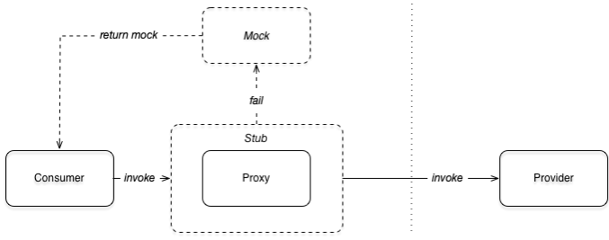

# Dubbo 本地存根和本地伪装

## 1.基本概念

典型的 RPC 调用客户端是依赖并且只依赖接口编程来进行远程调用的。在真正发起远程调用之前，用户往往需要做一些预处理的工作，比如提前校验参数。在拿到返回调用结果之后，用户可能需要缓存结果，或者是在调用失败的时候构造容错数据，而不是简单的抛出异常。这个时候，用户可以编写出类似以下的代码来处理上面提出的这些场景：

```java{.line-numbers}
try {
    preProcess();
    return service.invoke(...);
} catch (Throwable e) {
    return mockValue;
} finally {
    postProcess();
} 
```

类似的，用户也可以通过面向切面编程 AOP 的高级技巧来解决上面的诉求，比如通过 Spring AOP 的方式。使用 AOP 的技巧相比上面的代码来说，避免了容错处理等与业务无关的代码对业务代码的侵入，使得业务处理主逻辑更简洁。

为了进一步的方便用户做 Dubbo 开发，框架提出了本地存根 Stub 和本地伪装 Mock 的概念。通过约定大于配置的理念，进一步的简化了配置，使用起来更加方便，并且不依赖额外的 AOP 框架就达到了 AOP 的效果。本地存根的工作方式与 AOP 的 around advice 类似，而本地伪装的工作方式等同于 AOP 中的 after-throwing advice，也就是说，只有当远程调用发生 exception 的时候才会执行本地伪装。本地存根和本地伪装的工作流程如下图所示：

<div align="center">
    
</div>

1. 服务消费者发起调用
2. 如果服务消费者端存在本地存根 Stub 的话，会先执行本地存根
3. 本地存根 Stub 持有远程服务的 Proxy 对象，Stub 在执行的时候，会先执行自己的逻辑 (before)，然后通过 Proxy 发起远程调用，最后在返回过程之前也会执行自己的逻辑 (after-returning)
4. 如果远程服务的 Proxy 对象在执行过程中抛出了 exception，会执行服务消费端的本地伪装 Mock 的逻辑 (after-throwing)，返回容错数据，从而达到服务降级的目的

## 2.开发一个本地存根 Stub

本地存根 Stub 由用户来提供，并在服务消费方部署。

```java{.line-numbers}
public class DemoServiceStub implements DemoService { // #1
    private static Logger logger = LoggerFactory.getLogger(DemoServiceStub.class);

    private final DemoService demoService;

    public DemoServiceStub(DemoService demoService) { // #2
        this.demoService = demoService;
    }

    @Override
    public String sayHello(String name) { // #3
        logger.info("before execute remote service, parameter: " + name); // #4
        try {
            String result = demoService.sayHello(name); // #5
            logger.info("after execute remote service, result: " + result); // #6
            return result;
        } catch (Exception e) {
            logger.warn("fail to execute service", e); // #7
            return null;
        }
    }
} 
```

要和框架在一起工作，本地存根的实现需要遵循一些与框架事先做出的约定：

1. 首先本地存根 Stub 是服务接口的一个实现
2. 本地存根的实现需要提供一个拷贝构造方法，方便框架将远程调用的 Proxy 对象注入进来
3. 同样的，本地存根需要提供服务接口中所有方法的实现。在本例中，需要实现 sayHello 方法
4. 在真正发起远程调用之前，用户可以在本地执行一些操作。在本例中，在日志中记录传入的参数
5. 通过框架传入的 Proxy 对象真正发起远程调用
6. 在远程调用结束后，也可以加入本地代码的执行。在本例中，在日志中记录远程调用的返回结果
7. 如果发生错误的时候，也可以做一些错误恢复的动作。在本例中，在日志中记录异常。当然，如果提供了本地伪装的话，catch 中的逻辑是可以省略掉的

其中步骤 4、步骤 6、和步骤 7 共同构建了等同于面向切面编程中的概念，分别对应于 before、after-returning、以及 after-throwing。DemoServiceStub 运行在客户端，要使用本地存根的话，还需要在 stub-consumer.xml 中配置属性 stub。可以简单的通过指定 stub=“true” 来告诉 Dubbo 框架使用本地存根，这个时候，本地存根的包名需要和服务接口的包名一致，类名必须在服务接口的类名后加上 Stub 的后缀。例如，当服务接口名是 org.apache.dubbo.samples.stub.api.DemoService 时，本地存根的全类名应该是 org.apache.dubbo.samples.stub.api.DemoServiceStub。

```xml{.line-numbers}
<dubbo:reference id="demoService" check="false" interface="org.apache.dubbo.samples.stub.api.DemoService" stub="true"/>
```

如果不希望使用默认的命名规则，也可以直接通过 stub 属性来指定本地存根的全类名。

```xml{.line-numbers}
<dubbo:reference id="demoService" check="false" interface="org.apache.dubbo.samples.stub.api.DemoService" stub="org.apache.dubbo.samples.stub.impl.DemoStub"/> 
```

启动服务端 StubProvider 后，再运行客户端 StubConsumer，可以通过观察客户端的日志来验证本地存根的运行结果。

```xml{.line-numbers}
1 [09/04/19 11:52:21:021 CST] main  INFO api.DemoServiceStub: before execute remote service, parameter: dubbo
2 [09/04/19 11:52:21:021 CST] main  INFO api.DemoServiceStub: after execute remote service, result: greeting dubbo
3 [09/04/19 11:52:21:021 CST] main  INFO stub.StubConsumer: result: greeting dubbo 
```

## 3.本地存根的实现

在调用 ExtensionLoader 的 createExtension 方法时，如果存在有一个或者多个 wrapper 包装对象的话，会将真正的拓展传入到 wrapper 的构造函数中，然后通过反射创建 Wrapper 实例，循环创建 Wrapper 实例,形成 Wrapper 包装链。

```xml{.line-numbers}
stub=org.apache.dubbo.rpc.proxy.wrapper.StubProxyFactoryWrapper
jdk=org.apache.dubbo.rpc.proxy.jdk.JdkProxyFactory
javassist=org.apache.dubbo.rpc.proxy.javassist.JavassistProxyFactory 
```

其中 StubProxyFactoryWrapper 作为一个 wrapper，使用代理模式包裹在具体拓展的外部，当我们在执行 JdkProxyFactory 或者 JavassistProxyFactory 的 getProxy 方法时候（如在 ReferenceConfig 的 createProxy 方法中），均会先进入 StubProxyFactoryWrapper。在这个 wrapper 包装类中（其封装了真正的拓展也就是 JdkProxyFactory 或者 JavassistProxyFactory 类对象）会调用拓展的 getProxy 方法，生成远程服务的代理对象，然后根据用户的配置创建一个存根对象 Stub，并且把代理对象传入到这个存根对象 Stub 的构造方法中。最后返回的为这个存根对象给用户。具体的代码如下：

```java{.line-numbers}
public class StubProxyFactoryWrapper implements ProxyFactory {

    private final ProxyFactory proxyFactory;

    public StubProxyFactoryWrapper(ProxyFactory proxyFactory) {
        this.proxyFactory = proxyFactory;
    }

    public <T> T getProxy(Invoker<T> invoker) throws RpcException {
        //这里的proxyFactory为在createExtension时传入的真正拓展类对象，这里也就是JavassistProxyFactory类对象，调用会进入到
        //JavassistProxyFactory类的父类AbstractProxyFactory中去
        T proxy = proxyFactory.getProxy(invoker);
        if (GenericService.class != invoker.getInterface()) {
            // 获取 URL 中的 stub 参数，这里 stub 参数有可能是true/false/存根的全类名
            String stub = invoker.getUrl().getParameter(Constants.STUB_KEY, invoker.getUrl().getParameter(Constants.LOCAL_KEY));
            if (ConfigUtils.isNotEmpty(stub)) {
                // 获取 invoker 实现的接口class对象
                Class<?> serviceType = invoker.getInterface();
                // 如果 stub 如果是 true/default 的话，就默认存根的类名为：接口名 + Stub，并且位于和接口相同的包下
                if (ConfigUtils.isDefault(stub)) {
                    if (invoker.getUrl().hasParameter(Constants.STUB_KEY)) {
                        stub = serviceType.getName() + "Stub";
                    } else {
                        stub = serviceType.getName() + "Local";
                    }
                }
                try {
                    // 获取存根的实现类，并且判断是否实现了接口
                    Class<?> stubClass = ReflectUtils.forName(stub);
                    if (!serviceType.isAssignableFrom(stubClass)) {
                        throw new IllegalStateException("The stub implementation class " + stubClass.getName() + " not implement interface " + serviceType.getName());
                    }
                    try {
                        Constructor<?> constructor = ReflectUtils.findConstructor(stubClass, serviceType);
                        // 将 proxy 传入存根类（比如说 DemoServiceStub）的构造函数中，然后创建存根类对象赋值给 proxy，然后返回
                        proxy = (T) constructor.newInstance(new Object[]{proxy});
                        //export stub service
                        URL url = invoker.getUrl();
                        if (url.getParameter(Constants.STUB_EVENT_KEY, Constants.DEFAULT_STUB_EVENT)) {
                            url = url.addParameter(Constants.STUB_METHODS_KEY, StringUtils.join(Wrapper.getWrapper(proxy.getClass()).getDeclaredMethodNames(), ","));
                            url = url.addParameter(Constants.IS_SERVER_KEY, Boolean.FALSE.toString());
                            try {
                                export(proxy, (Class) invoker.getInterface(), url);
                            } catch (Exception e) {
                                LOGGER.error("export a stub service error.", e);
                            }
                        }
                    } catch (NoSuchMethodException e) {
                        throw new IllegalStateException("No such constructor \"public " in stub implementation class " + stubClass.getName(), e);
                    }
                } catch (Throwable t) {
                    LOGGER.error("Failed to create stub implementation class use dubbo version " + Version.getVersion() + ", cause: " + t.getMessage(), t);
                    // ignore
                }
            }
        }
        return proxy;
    }
}
```

## 4.开发一个本地伪装 Mock

上面说了本地伪装通常用于在远程调用出错的情况下服务降级。这里通过在服务提供方的代码中睡眠来模拟调用端超时，从而执行本地伪装来做容错处理。

```java{.line-numbers}
public class DemoServiceImpl implements DemoService {
    public String sayHello(String name) {
        try {
            Thread.sleep(5000); // #1
        } catch (InterruptedException e) {
            e.printStackTrace();
        }
        return "hello " + name; // #2
    }
} 
```

- Dubbo 默认的超时时间是 1000 ms，这里通过睡眠 5000ms 来达到触发超时异常的发生
- 由于超时的发生，这个结果并不会被返回给客户端，取而代之的是 org.apache.dubbo.remoting.TimeoutException

在客户端提供本地伪装的实现。当远程调用发生错误的时候，返回给调用方的不是服务端的 "hello name"，取而代之的是 "mock name"。

```java{.line-numbers}
public class DemoServiceMock implements DemoService {
    private static Logger logger = LoggerFactory.getLogger(DemoServiceMock.class);

    public String sayHello(String name) {
        logger.warn("about to execute mock: " + DemoServiceMock.class.getSimpleName());
        return "mock " + name;
    }
}
```

同样的，要使用本地伪装的话，还需要在 mock-consumer.xml 中配置属性 mock。可以简单的通过指定 mock="true" 来告诉 Dubbo 框架使用本地伪装，这个时候，本地伪装的包名需要和服务接口的包名一致，类名必须在服务接口的类名后加上 Mock 的后缀。例如，当服务接口名是 org.apache.dubbo.samples.stub.api.DemoService 时，本地存根的全类名应该是 org.apache.dubbo.samples.stub.api.DemoServiceMock。

```xml{.line-numbers}
<dubbo:reference id="demoService" check="false" interface="org.apache.dubbo.samples.mock.api.DemoService" mock="true"/>
```

如果不希望使用默认的命名规则，也可以直接通过 mock 属性来指定本地伪装的全类名。

```xml{.line-numbers}
<dubbo:reference id="demoService" check="false" interface="org.apache.dubbo.samples.mock.api.DemoService" mock="org.apache.dubbo.samples.mock.impl.DemoMock"/> 
```

通过提供一个本地伪装的类，可以最大限度的控制出错之后的容错逻辑。有的时候，业务上并不需要这样灵活的机制，只有返回一个默认值的诉求，这个时候提供一个完整的本地伪装的实现就显得有点重了。或者线上出错的时候，应用并没有打包本地伪装，需要通过推送规则的方式临时对服务降级。Dubbo 框架为上面的这两种诉求都提供了快捷方式，帮助用户快速配置服务降级。启动服务端 MockProvider 之后，然后再执行 MockConsumer 就可以看到下面的结果：

```xml{.line-numbers}
 1 Caused by: org.apache.dubbo.remoting.TimeoutException: Waiting server-side response timeout by scan timer. start time: 2019-04-09 14:20:48.061, end time: 2019-04-09 14:20:49.077, client elapsed: 0 ms, server elapsed: 1015 ms, timeout: 1000 ms, request: Request [id=2, version=2.0.2, twoway=true, event=false, broken=false, data=RpcInvocation [methodName=sayHello, parameterTypes=[class java.lang.String], arguments=[world], attachments={path=org.apache.dubbo.samples.mock.api.DemoService, interface=org.apache.dubbo.samples.mock.api.DemoService, version=0.0.0}]], channel: /30.5.125.99:56433 -> /30.5.125.99:20880
 2 	at org.apache.dubbo.remoting.exchange.support.DefaultFuture.returnFromResponse(DefaultFuture.java:295)
 3 	at org.apache.dubbo.remoting.exchange.support.DefaultFuture.get(DefaultFuture.java:191)
 4 	at org.apache.dubbo.remoting.exchange.support.DefaultFuture.get(DefaultFuture.java:164)
 5 	at org.apache.dubbo.rpc.protocol.dubbo.DubboInvoker.doInvoke(DubboInvoker.java:108)
 6 	at org.apache.dubbo.rpc.protocol.AbstractInvoker.invoke(AbstractInvoker.java:157)
 7 	at org.apache.dubbo.monitor.support.MonitorFilter.invoke(MonitorFilter.java:88)
 8 	at org.apache.dubbo.rpc.protocol.ProtocolFilterWrapper$1.invoke(ProtocolFilterWrapper.java:73)
 9 	at org.apache.dubbo.rpc.protocol.dubbo.filter.FutureFilter.invoke(FutureFilter.java:49)
10 	at org.apache.dubbo.rpc.protocol.ProtocolFilterWrapper$1.invoke(ProtocolFilterWrapper.java:73)
11 	at org.apache.dubbo.rpc.filter.ConsumerContextFilter.invoke(ConsumerContextFilter.java:54)
12 	at org.apache.dubbo.rpc.protocol.ProtocolFilterWrapper$1.invoke(ProtocolFilterWrapper.java:73)
13 	at org.apache.dubbo.rpc.listener.ListenerInvokerWrapper.invoke(ListenerInvokerWrapper.java:78)
14 	at org.apache.dubbo.rpc.protocol.InvokerWrapper.invoke(InvokerWrapper.java:56)
15 	at org.apache.dubbo.rpc.cluster.support.FailoverClusterInvoker.doInvoke(FailoverClusterInvoker.java:80)
16 	... 5 more
17 [09/04/19 02:20:49:049 CST] main  WARN api.DemoServiceMock: about to execute mock: DemoServiceMock
18 [09/04/19 02:20:49:049 CST] main  INFO mock.MockConsumer: result: mock world 
```