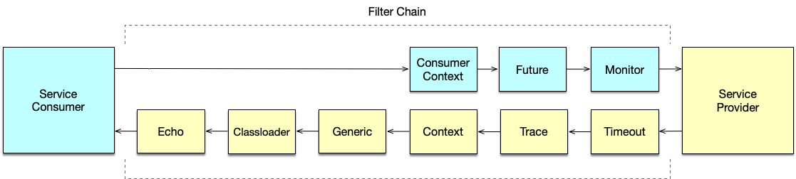

# Dubbo 本地服务

## 1.injvm 本地调用总结

Dubbo 是一个远程调用的框架，对于一个服务提供者，暴露了一个接口供外部消费者调用，那么对于提供者自己是否可以调用这个接口，需要什么特殊处理吗？这篇文章就分享下 Dubbo 关于本地调用的实现机制，以及如何开启和关闭本地调用。

使用 Dubbo 本地调用不需做特殊配置，按正常 Dubbo 服务暴露服务即可。任一服务在暴露远程服务的同时，也会同时以 injvm 的协议暴露本地服务。injvm 是一个伪协议，不会像其他协议那样对外开启端口，只用于本地调用的目的。

与真正的本地方法调用不同的是，Dubbo 本地调用会经过 Filter 链，其中包括了 Consumer 端的 Filter 链以及 Provider 端的 Filter 链。通过这样的机制，本地消费者和其他消费者都是统一对待，统一监控，服务统一进行治理。

<div align="center">
    
</div>

### 1.1 如何开启本地调用

默认情况下，本地调用是自动开启的，不需要做额外的配置。只有当需要关闭的时候，才需要通过 scope 的配置来显式的关闭。但是，特别需要指出的是，在下面的几种情况下，本地调用是无法使用的：

1. 泛化调用的时候无法使用本地调用。
2. 消费者明确指定 URL 发起直连调用。当然，如果消费者指定的是 injvm 的 URL，最终的调用也是走本地调用的，比如：

```xml{.line-numbers}
<Dubbo:reference id="demoService" interface="org.apache.Dubbo.samples.local.api.DemoService" url="injvm://127.0.0.1/org.apache.Dubbo.samples.local.api.DemoService"/> 
```

### 1.2 如何关闭本地调用

本地调用是可以显示关闭的，通过这种方式，服务提供者可以做到对远端服务消费者和本地消费者一视同仁。具体做法是通过 scope="remote" 来关闭 injvm 协议的暴露，这样，即使是本地调用者，也需要从注册中心上获取服务地址列表，然后才能发起调用，而这个时候的调用过程，与远端的服务消费者的过程是一致的。

```xml{.line-numbers}
<bean id="target" class="org.apache.Dubbo.samples.local.impl.DemoServiceImpl"/>
<!-- 服务提供者指定 scope="remote" -->
<Dubbo:service interface="org.apache.Dubbo.samples.local.api.DemoService" ref="target" scope="remote"/>
<Dubbo:reference id="demoService" interface="org.apache.Dubbo.samples.local.api.DemoService"/> 
```

## 2.源码分析

下面我们以一个例子来分析本地调用的过程：

```java{.line-numbers}
public static class InjvmDemo {
    public static void main(String[] args) {
        ClassPathXmlApplicationContext context = new ClassPathXmlApplicationContext("classpath:consumer.xml");
        context.start();

        DemoService demoService = (DemoService) context.getBean("demoService");
        String s = demoService.sayHello("world");
        System.out.println(s);
    }
}  
```

并且 dubbo 的配置如下：

```xml{.line-numbers}
<dubbo:application name="consumer-of-helloworld-app"  />
<dubbo:registry address="zookeeper://127.0.0.1:2181" />
<dubbo:protocol name="injvm" port="20880" />
<!-- 提供者端配置 -->
<dubbo:service interface="com.dubbo.simple.common.DemoService" ref="demo"/>
<bean id="demo" class="com.dubbo.simple.server.DemoServiceImpl"/>
<!-- 消费者端配置 -->
<dubbo:reference id="demoService" interface="com.dubbo.simple.common.DemoService" /> 
```

首先也是和远程调用一样先进行服务导出（在 ServiceConfig 中），只不过在远程调用中，还会默认进行本地导出，即调用 ServiceConfig 中的 exportLocal 方法，将 url 中的协议替换为 injvm，然后根据自适应拓展获取到 InjvmProtocol，进而生成 InjvmExporter 对象。而上面我们进行本地调用时，由于 url 为 injvm://...，因此不会多此一举调用 exportLocal 方法，直接在原本进行远程服务导出的代码中，根据自适应拓展功能，也会获取到 InjvmProtocol，生成 InjvmExporter，并且这生成的 exporter 会放在 exportedMap 中。

进行服务引用的流程也和远程调用一样，在 ReferenceConfig#createProxy 方法中，如果是本地调用的话，就直接通过 refprotocol#refer 生成一个 InjvmInvoker，并且传入 ProxyFactory#getProxy 方法中，生成一个远程服务代理。

在调用 InjvmInvoker 的 invoke 方法时，和远程调用的过程不同，远程调用生成的 Invoker 的 invoke 方法是向远程服务器发起调用，而在 InjvmInvoker 的 invoke 方法中，首先通过 exportedMap 获取到和 url对应的 invoker，它是直接获取到 exporter 中的 invoker 对象，从而调用其 invoke 方法。注意在 exporter 中的 invoker 对象一般都是通过 ProxyFactory 类中的 getInvoker 方法获取到的，它会真正调用执行具体的方法（比如 DemoServiceImpl 的 sayHello 方法）。也就是说，通过本地调用没有经过网络传输的过程，不过还是会经过一系列的拦截器。

### 2.1 本地导出

```java{.line-numbers}
// ServiceConfig<T>#exportLocal
private void exportLocal(URL url) {
    if (!Constants.LOCAL_PROTOCOL.equalsIgnoreCase(url.getProtocol())) {
        // 如果说url的协议不为injvm的话，就会对url进行重新设置，也就是将协议设置为injvm，ip地址设置为localhost，port设置为0
        // 这么做的目的是在下面调用protocol的export方法时使用InjvmProtocol的export方法，生成InjvmExporter。由于protocol的类型为Protocol$Adaptive，
        // 因此会根据url协议的类型，自动选择对应的拓展
        URL local = URL.valueOf(url.toFullString())
                .setProtocol(Constants.LOCAL_PROTOCOL)
                .setHost(LOCALHOST)
                .setPort(0);
        ServiceClassHolder.getInstance().pushServiceClass(getServiceClass(ref));
        Exporter<?> exporter = protocol.export(proxyFactory.getInvoker(ref, (Class) interfaceClass, local));
        exporters.add(exporter);
        logger.info("Export dubbo service " + interfaceClass.getName() + " to local registry");
    }
} 
```

将 URL 的协议设置成 injvm，方便下面使用自适应拓展获取到 InjvmProtocol 进行导出操作。如果 URL 的协议本身是 injvm 的话，就不会进行本地导出。

```java{.line-numbers}
// InjvmProtocol#export
public <T> Exporter<T> export(Invoker<T> invoker) throws RpcException {
    return new InjvmExporter<T>(invoker, invoker.getUrl().getServiceKey(), exporterMap);
} 

class InjvmExporter<T> extends AbstractExporter<T> {

    private final String key;

    private final Map<String, Exporter<?>> exporterMap;

    InjvmExporter(Invoker<T> invoker, String key, Map<String, Exporter<?>> exporterMap) {
        super(invoker);
        this.key = key;
        this.exporterMap = exporterMap;
        exporterMap.put(key, this);
    }

    public void unexport() {
        super.unexport();
        exporterMap.remove(key);
    }

}
```

生成 Exporter 的过程和远程调用相同，只不过在为远程调用进行服务导出生成 Exporter 时，一般会默认也同时进行本地导出。但如果配置进行本地调用的话，（也就是url为injvm://....），那么就不会再多此一举调用ServiceConfig#exportLocal 方法，而是会直接调用 protocol.export 生成一个 Exporter。这个 Exporter 中封装了一个 ProxyFactory 生成的 Invoker 对象（用于执行具体的调用逻辑）。

### 2.2 本地服务引用

```java{.line-numbers}
// ReferenceConfig#createProxy
private T createProxy(Map<String, String> map) {
    URL tmpUrl = new URL("temp", "localhost", 0, map);
    final boolean isJvmRefer;
    if (isInjvm() == null) {
        if (url != null && url.length() > 0) { // if a url is specified, don't do local reference
            isJvmRefer = false;
        } else if (InjvmProtocol.getInjvmProtocol().isInjvmRefer(tmpUrl)) {
            // by default, reference local service if there is
            isJvmRefer = true;
        } else {
            isJvmRefer = false;
        }
    } else {
        isJvmRefer = isInjvm().booleanValue();
    }

    // 如果是本地调用的话，就使用InjvmProtocol生成一个InjvmInvoker
    if (isJvmRefer) {
        URL url = new URL(Constants.LOCAL_PROTOCOL, NetUtils.LOCALHOST, 0, interfaceClass.getName()).addParameters(map);
        invoker = refprotocol.refer(interfaceClass, url);
        if (logger.isInfoEnabled()) {
            logger.info("Using injvm service " + interfaceClass.getName());
        }
    } else {
        // 代码省略
    }

    // 代码省略

    // create service proxy
    // 将前面生成的InjvmInvoker，使用ProxyFactory类中的getProxy包装成一个远程服务代理，然后返回
    // 在这里本地调用与远程调用不同的是，远程调用生成的Invoker的doInvoke方法是向远程服务器发起调用，而在InjvmInvoker的doInvoke方法中，
    // 它是直接获取到exporter中的invoker对象，从而调用其invoke方法。注意在exporter中的invoker对象一般都是通过ProxyFactory类中的
    // getInvoker方法获取到的，它会真正调用执行具体的方法，也就是说，通过本地调用没有经过网络传输的过程，不过还是会经过一系列的
    // 拦截器
    return (T) proxyFactory.getProxy(invoker);
} 
```

从上面的代码中可以看出，如果是使用 url 服务直连，那么就默认不会进行本地调用。如果是本地调用的话，也是先生成一个新的 Injvm url，然后通过 InjvmProtocol 生成一个 InjvmInvoker，使用 ProxyFactory 类中的 getProxy 包装成一个远程服务代理，然后返回。

```java{.line-numbers}
// InjvmProtocol#refer
public <T> Invoker<T> refer(Class<T> serviceType, URL url) throws RpcException {
    return new InjvmInvoker<T>(serviceType, url, url.getServiceKey(), exporterMap);
}

class InjvmInvoker<T> extends AbstractInvoker<T> {

    private final String key;
    
    private final Map<String, Exporter<?>> exporterMap;
    
    InjvmInvoker(Class<T> type, URL url, String key, Map<String, Exporter<?>> exporterMap) {
        super(type, url);
        this.key = key;
        this.exporterMap = exporterMap;
    }
    
    @Override
    public boolean isAvailable() {
        InjvmExporter<?> exporter = (InjvmExporter<?>) exporterMap.get(key);
        if (exporter == null) {
            return false;
        } else {
            return super.isAvailable();
        }
    }

}
```

### 2.3 服务调用

```java{.line-numbers}
// InjvmInvoker#doInvoke
public Result doInvoke(Invocation invocation) throws Throwable {
    Exporter<?> exporter = InjvmProtocol.getExporter(exporterMap, getUrl());
    if (exporter == null) {
        throw new RpcException("Service [" + key + "] not found.");
    }
    RpcContext.getContext().setRemoteAddress(NetUtils.LOCALHOST, 0);
    return exporter.getInvoker().invoke(invocation);
} 

// InjvmProtocol#getExporter
static Exporter<?> getExporter(Map<String, Exporter<?>> map, URL key) {
    Exporter<?> result = null;

    if (!key.getServiceKey().contains("*")) {
        result = map.get(key.getServiceKey());
    } else {
        if (map != null && !map.isEmpty()) {
            for (Exporter<?> exporter : map.values()) {
                if (UrlUtils.isServiceKeyMatch(key, exporter.getInvoker().getUrl())) {
                    result = exporter;
                    break;
                }
            }
        }
    }

    if (result == null) {
        return null;
    } else if (ProtocolUtils.isGeneric(
            result.getInvoker().getUrl().getParameter(Constants.GENERIC_KEY))) {
        return null;
    } else {
        return result;
    }
} 
```

在 InjvmInvoker 中，和其它的 Invoker（比如 DubboInvoker）不同，这个 InjvmInvoker 是直接从 exporterMap 中获取到 url 对应的 exporter，然后再获取到 exporter 中封装的 invoker 调用其 invoke 方法。这个 invoker 是 ProxyFactory 生成的一个对象，它会调用执行具体的方法。