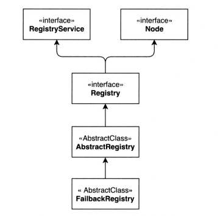

# Dubbo 本地缓存

## 1.Dubbo 缓存介绍

缓存的存在就是用空间换取时间，Dubbo 的注册中心实现了通用的缓存机制，在抽象类 AbstractRegistry 中实现。Dubbo 的本地缓存作用如下：

- Dubbo 调用者需要通过注册中心（例如：ZK），获取提供者，但是如果频繁往 ZK 获取信息，肯定会存在单点故障问题，所以 Dubbo 提供了将提供者信息缓存在本地的方法。
- Dubbo 在服务引用过程中会创建 registry 对象并加载本地缓存文件。
- Dubbo 在订阅注册中心的回调处理逻辑当中会保存服务提供者信息到本地缓存文件当中（同步/异步两种方式），以 url 纬度进行全量保存。
  
<div align="center">
    
</div>

消费者或服务治理中心获取注册信息后会做本地缓存。内存中会有一份，保存在 AbstractRegistry 类中的 properties 成员属性里，磁盘上也会持久化一份文件，就是 AbstractRegistry 类中的 file 成员属性。在 AbstractRegistry 抽象类中有如下定义：

```java{.line-numbers}
private final Properties properties = new Properties();
private File file;              
private final ConcurrentMap<URL, Map<String, List<URL>>> notified = new ConcurrentHashMap<URL, Map<String, List<URL>>>(); 
```

内存中的缓存 notified 是 ConcurrentHashMap 里面又嵌套了一个 Map，外层 Map 的 key 是消费者的 URL，内层 Map 的 key 是分类，包含 providers、consumers、routes、configurators 四种。value 则是对应的服务列表，对于没有服务提供者提供服务的 URL，它会以特殊的 empty:// 前缀开头。

## 2.Dubbo 本地缓存源码分析

### 2.1 缓存的加载

在服务初始化的时候，AbstractRegistry 的构造函数会创建一个 file 对象，它指向本地缓存的文件路径（本地缓存文件可能存在，也可能不存在），并且会调用 loadProperties 方法从本地磁盘文件（如果已经存在的话）中把持久化的注册数据读到Properties 对象里，AbstractRegistry 的构造函数如下所示：

```java{.line-numbers}
public AbstractRegistry(URL url) {
    setUrl(url);
    // syncSaveFile 属性决定了是否同步保存缓存到磁盘上
    // syncSaveFile 为 true，则同步保存，否则异步保存缓存到磁盘上
    syncSaveFile = url.getParameter(Constants.REGISTRY_FILESAVE_SYNC_KEY, false);
    // 用户可以在 <dubbo:registry/> 中根据 file 属性指定本地缓存文件名
    String filename = url.getParameter(Constants.FILE_KEY, /** Dubbo 默认缓存文件路径 */);
    File file = null;
    if (ConfigUtils.isNotEmpty(filename)) {
        // file 指向特定路径的文件
        file = new File(filename);
        if (!file.exists() && file.getParentFile() != null && !file.getParentFile().exists()) {
            // 如果文件的父文件夹不存在，就创建; 创建失败的话，抛出异常
            if (!file.getParentFile().mkdirs()) {
                throw new IllegalArgumentException("Invalid registry store file");
            }
        }
    }
    this.file = file;
    // 如果 file 文件存在的话，将里面的缓存从磁盘加载到内存中的 properties 对象中
    loadProperties();
    notify(url.getBackupUrls());
}
```

loadProperties 方法的源代码如下：

```java{.line-numbers}
private void loadProperties() {
    if (file != null && file.exists()) {
        InputStream in = null;
        try {
            // 读取磁盘上的缓存文件
            in = new FileInputStream(file);
            // 将磁盘上的缓存信息加载到内存中的 properties 对象中
            properties.load(in);
        } catch (Throwable e) {
            logger.warn("Failed to load registry store file " + file, e);
        }
        finally {
            //...
        }
    }
}
```

### 2.2 缓存的更新

消费者会注册一个监听器到注册中心的对应目录下，如果目录下面的子节点数据发生变化，那么就会回调监听器的方法更新监听器中所保存的服务提供者信息、路由信息等。而回调监听器就是在 AbstractRegistry 中的 notify 方法中完成的。Notify 方法的源代码如下所示：

```java{.line-numbers}
protected void notify(URL url, NotifyListener listener, List<URL> urls) {
    // 省略检查参数代码

    Map<String, List<URL>> result = new HashMap<String, List<URL>>();

    // result中存储的为 zookeeper 中各个目录（category）下的 url，也就是 category -> urls 的映射关系
    // 并且还会检测这些 url 和消费者的 url 是否相匹配（传进来的参数中，url 为消费者的 URL，表示要调用服务的相关配置信息，比如服务的接口名是否相同，版本，组等等）
    for (URL u : urls) {
        if (UrlUtils.isMatch(url, u)) {
            String category = u.getParameter(Constants.CATEGORY_KEY, Constants.DEFAULT_CATEGORY);
            List<URL> categoryList = result.get(category);
            if (categoryList == null) {
                categoryList = new ArrayList<URL>();
                result.put(category, categoryList);
            }
            categoryList.add(u);
        }
    }
    if (result.size() == 0) {
        return;
    }

    // 已经通知过的 category
    Map<String, List<URL>> categoryNotified = notified.get(url);
    if (categoryNotified == null) {
        notified.putIfAbsent(url, new ConcurrentHashMap<String, List<URL>>());
        categoryNotified = notified.get(url);
    }
    for (Map.Entry<String, List<URL>> entry : result.entrySet()) {
        String category = entry.getKey();
        List<URL> categoryList = entry.getValue();
        categoryNotified.put(category, categoryList);
        saveProperties(url);
        // 最终调用 RegistryDirectory 中的 notify 方法
        listener.notify(categoryList);
    }
}
```

从上可知，当注册中心的数据发生变化时，就会调用 saveProperties 方法，保存缓存到磁盘文件中。saveProperties 方法的代码如下：

```java{.line-numbers}
private void saveProperties(URL url) {
    if (file == null) {
        return;
    }

    try {
        StringBuilder buf = new StringBuilder();
        // 获取到和消费者 url 对应的 provider、router、configurator 目录下的服务器提供者的 url
        Map<String, List<URL>> categoryNotified = notified.get(url);
        // 将 categoryNotified 中所有的 url 拼接起来形成一个字符串，并且每两个 url 之间使用空格进行分割
        if (categoryNotified != null) {
            for (List<URL> us : categoryNotified.values()) {
                for (URL u : us) {
                    if (buf.length() > 0) {
                        // URL_SEPARATOR 为一个空格
                        buf.append(URL_SEPARATOR);
                    }
                    buf.append(u.toFullString());
                }
            }
        }
        // 将 <serviceName + group + version -> url字符串> 键值对保存到 properties 对象中，注意这里的 version 表示的是服务接口的版本号，而不是下面的 version 变量
        properties.setProperty(url.getServiceKey(), buf.toString());
        // 将 version 增加，表示缓存的版本更新
        long version = lastCacheChanged.incrementAndGet();
        // 根据 syncSaveFile 的值决定同步还是异步保存缓存到磁盘文件中
        if (syncSaveFile) {
            doSaveProperties(version);
        } else {
            registryCacheExecutor.execute(new SaveProperties(version));
        }
    } catch (Throwable t) {
        logger.warn(t.getMessage(), t);
    }
}
```

Properties 保存了所有服务提供者的 URL，使用 URL#serviceKey() 作为 key，提供者列表、 路由规则列表、配置规则列表等作为 value。由于 value 是列表，当存在多个的时候使用空格隔开。

### 2.3 缓存的写入

由上面的 saveProperties 方法可知，缓存的保存有同步和异步两种方式。异步会使用线程池异步保存，如果线程在执行过程中出现异常，则会再次调用线程池不断重试。具体将缓存写入到磁盘中是由 doSaveProperties 方法实现的，源代码如下：

```java{.line-numbers}
public void doSaveProperties(long version) {
    // 如果 version 所表示的缓存版本不是最新的，那么就直接返回。将缓存写入磁盘的任务交由另外的线程处理
    if (version < lastCacheChanged.get()) {
        return;
    }
    if (file == null) {
        return;
    }
    // Save
    try {
        File lockfile = new File(file.getAbsolutePath() + ".lock");
        if (!lockfile.exists()) {
            lockfile.createNewFile();
        }
        RandomAccessFile raf = new RandomAccessFile(lockfile, "rw");
        try {
            FileChannel channel = raf.getChannel();
            try {
                // 锁住，保证只有一个线程可以修改磁盘上的缓存文件
                FileLock lock = channel.tryLock();
                if (lock == null) {
                    throw new IOException("Can not lock the registry cache file " + file.getAbsolutePath());
                }
                // Save
                try {
                    if (!file.exists()) {
                        file.createNewFile();
                    }
                    FileOutputStream outputFile = new FileOutputStream(file);
                    try {
                        // 把 properties 中缓存的各个 url 信息写入到 output 所表示磁盘文件中
                        properties.store(outputFile, "Dubbo Registry Cache");
                    }
                    finally {
                        outputFile.close();
                    }
                }
                finally {
                    lock.release();
                }
            }
        }
    } catch (Throwable e) {
        // 同样，如果现在发现 version 表示的缓存版本不是最新的，直接返回
        if (version < lastCacheChanged.get()) {
            return;
        } else {
            // 在写入磁盘失败之后，重新生成一个任务放入到线程池中等待执行，并且更新缓存的版本
            registryCacheExecutor.execute(new SaveProperties(lastCacheChanged.incrementAndGet()));
        }
        logger.warn("Failed to save registry store file, cause: " + e.getMessage(), e);
    }
}
```

### 2.4 缓存的使用

FailbackRegistry#subscribe 方法中会使用到注册中心的缓存，源代码如下所示：

```java{.line-numbers}
// FailbackRegistry的subscribe方法中包含了失败重试的逻辑
@Override
public void subscribe(URL url, NotifyListener listener) {
    if (destroyed.get()) {
        return;
    }
    // 调用AbstractRegistry中的subscribe方法，将此listener添加到这个url的监听器集合当中
    super.subscribe(url, listener);
    removeFailedSubscribed(url, listener);
    try {
        // 若无法将监听器 listener 注册到注册中心上，
        // 那么根据消费者 url，获取到缓存的注册中心上的 provider、router、configurator 目录下 url 集合，直接调用 notify 方法，最终会调用 RegistryDirectory#notify 方法，更新 invokerUrls，以及通过 refer 生成新的 invoker
        List<URL> urls = getCacheUrls(url);
        if (urls != null && urls.size() > 0) {
            notify(url, listener, urls);
            logger.error("Failed to subscribe " + url);
        } else {
            // 省略代码
        }

        // 不断重试，尝试注册监听器到注册中心上
        addFailedSubscribed(url, listener);
    } catch (Exception e) {
        // 省略代码
    }
}
```

getCacheUrls 的代码如下：

```java{.line-numbers}
public List<URL> getCacheUrls(URL url) {
    // 获取到和 url 中 serviceKey 相对应的注册中心上 provider、router、configurator 目录下的 url 集合
    // 这些 url 集合是缓存保存在内存中的 properties 对象里面
    for (Map.Entry<Object, Object> entry : properties.entrySet()) {
        String key = (String) entry.getKey();
        String value = (String) entry.getValue();
        if (key != null && key.length() > 0 && key.equals(url.getServiceKey())
                && (Character.isLetter(key.charAt(0)) || key.charAt(0) == '_')
                && value != null && value.length() > 0) {
            String[] arr = value.trim().split(URL_SPLIT);
            List<URL> urls = new ArrayList<URL>();
            for (String u : arr) {
                urls.add(URL.valueOf(u));
            }
            return urls;
        }
    }
    return null;
}
```

## 3.总结

当注册中心初始化时，如果磁盘上的缓存文件存在的话，会将其中的内容加载到内存中的 properties 对象中。当消费者注册监听器到注册中心上时，每当订阅目录下的结点发生改变的时候，会返回目录下的全量数据，也就是 providers、routers、configurators 目录下的 url 集合，这时会首先把这些最新的 url 集合保存到 properties 对象中，接着调用 saveProperties 方法将其同步或者异步保存到磁盘上，起到更新缓存的作用。在 FailbackRegisry#subscribe 方法中，如果消费者订阅失败，也就是不能将 listener（即 RegistryDirectory）注册到注册中心 ZK 上，那么就会直接获取到 properties 对象中保存的缓存 url 集合，然后再调用 RegistryDirectory#notify 方法。

本地的缓存文件示例如下：

```java{.line-numbers}
 1 所在目录
 2 /Users/lebron374/.dubbo
 3 
 4 文件
 5 dubbo-registry-demo-consumer-127.0.0.1:2181.cache
 6 dubbo-registry-demo-consumer-127.0.0.1:2181.cache.lock
 7 dubbo-registry-demo-provider-127.0.0.1:2181.cache
 8 dubbo-registry-demo-provider-127.0.0.1:2181.cache.lock
 9 
10 文件内容
11 #Dubbo Registry Cache
12 #Wed Jan 22 20:59:44 CST 2020
13 com.alibaba.dubbo.demo.DemoService=empty\://192.168.1.106/com.alibaba.dubbo.demo.DemoService?application\=demo-consumer&category\=configurators&check\=false&dubbo\=2.0.2&interface\=com.alibaba.dubbo.demo.DemoService&methods\=sayHello&pid\=31961&qos.port\=33333&side\=consumer&timestamp\=1579697802111 empty\://192.168.1.106/com.alibaba.dubbo.demo.DemoService?application\=demo-consumer&category\=routers&check\=false&dubbo\=2.0.2&interface\=com.alibaba.dubbo.demo.DemoService&methods\=sayHello&pid\=31961&qos.port\=33333&side\=consumer&timestamp\=1579697802111 dubbo\://192.168.1.106\:20881/com.alibaba.dubbo.demo.DemoService?anyhost\=true&application\=demo-provider&bean.name\=com.alibaba.dubbo.demo.DemoService&dubbo\=2.0.2&generic\=false&interface\=com.alibaba.dubbo.demo.DemoService&methods\=sayHello&pid\=31565&side\=provider&timestamp\=1579696923081 empty\://192.168.1.106/com.alibaba.dubbo.demo.DemoService?application\=demo-consumer&category\=providers,configurators,routers&check\=false&dubbo\=2.0.2&interface\=com.alibaba.dubbo.demo.DemoService&methods\=sayHello&pid\=31961&qos.port\=33333&side\=consumer&timestamp\=1579697802111
14 com.alibaba.dubbo.demo.AnotherService=empty\://192.168.1.106/com.alibaba.dubbo.demo.AnotherService?application\=demo-consumer&category\=configurators&check\=false&dubbo\=2.0.2&interface\=com.alibaba.dubbo.demo.AnotherService&methods\=sayHello&pid\=31796&qos.port\=33333&side\=consumer&timestamp\=1579697435025 empty\://192.168.1.106/com.alibaba.dubbo.demo.AnotherService?application\=demo-consumer&category\=routers&check\=false&dubbo\=2.0.2&interface\=com.alibaba.dubbo.demo.AnotherService&methods\=sayHello&pid\=31796&qos.port\=33333&side\=consumer&timestamp\=1579697435025 dubbo\://192.168.1.106\:20881/com.alibaba.dubbo.demo.AnotherService?anyhost\=true&application\=demo-provider&bean.name\=com.alibaba.dubbo.demo.AnotherService&dubbo\=2.0.2&generic\=false&interface\=com.alibaba.dubbo.demo.AnotherService&methods\=sayHello&pid\=31565&side\=provider&timestamp\=1579697270262
15 com.alibaba.dubbo.demo.AnotherServiceV2=empty\://192.168.1.106/com.alibaba.dubbo.demo.AnotherServiceV2?application\=demo-consumer&category\=configurators&check\=false&dubbo\=2.0.2&interface\=com.alibaba.dubbo.demo.AnotherServiceV2&methods\=sayHello&pid\=31796&qos.port\=33333&side\=consumer&timestamp\=1579697439692 empty\://192.168.1.106/com.alibaba.dubbo.demo.AnotherServiceV2?application\=demo-consumer&category\=routers&check\=false&dubbo\=2.0.2&interface\=com.alibaba.dubbo.demo.AnotherServiceV2&methods\=sayHello&pid\=31796&qos.port\=33333&side\=consumer&timestamp\=1579697439692 dubbo\://192.168.1.106\:20881/com.alibaba.dubbo.demo.AnotherServiceV2?anyhost\=true&application\=demo-provider&bean.name\=com.alibaba.dubbo.demo.AnotherServiceV2&dubbo\=2.0.2&generic\=false&interface\=com.alibaba.dubbo.demo.AnotherServiceV2&methods\=sayHello&pid\=31565&side\=provider&timestamp\=1579697270512 
```