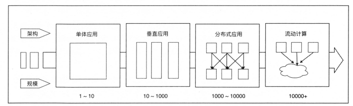
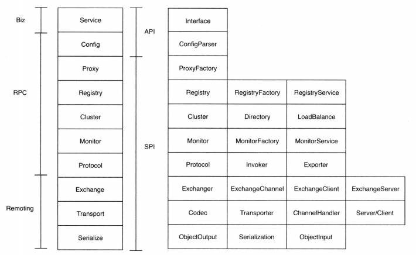
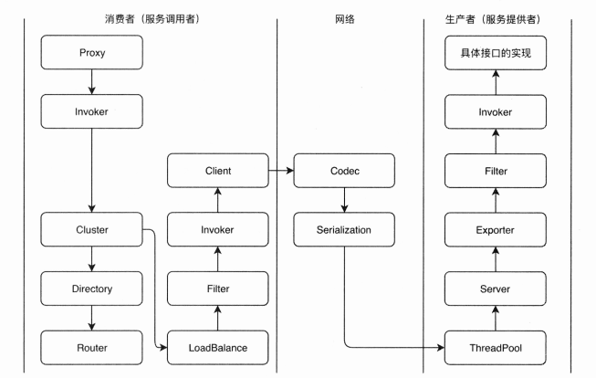

# Dubbo 架构设计

## 1.Dubbo 解决什么问题

随着互联网应用规模不断发展，单体和垂直应用架构巳经无法满足需求，分布式服务架构及流动计算架构势在必行，需要一个治理系统确保架构不断演进，架构演进请参考下图：

    

我们先来回顾一下不同应用架构之间的区别。

- 单一应用架构：当网站流量很小时，只需一个应用，将所有功能都部署在一起，以减少部署节点和成本。此时，用于简化增删改查工作量的数据访问框架 ORM 是关键。
- 垂直应用架构：当访问量逐渐增大时，单一应用增加机器带来的加速度越来越小，将应用拆成互不相干的几个应用，以提升效率。此时，用于加速前端页面开发的Web框架（MVC） 是关键。
- 分布式服务架构：当垂直应用越来越多时，应用之间的交互是不可避免的，将核心业务抽取出来，作为独立的服务，逐渐形成稳定的服务中心，使应用能更快速地响应多变的市场需求。此时，用于提高业务复用及整合的分布式服务（RPC）框架是关键。
- 流动计算架构：当服务越来越多时，容量的评估、小服务资源的浪费等问题逐渐显现，此时需增加一个调度中心基于访问压力实时管理集群容量，提高集群利用率。此时，用于提高机器利用率的资源调度和治理中心是关键。

随着服务规模和架构的不断演进，在大规模服务化之前，应用可能只是通过 RMI 或 Hessian 等工具简单地暴露和引用远程服务，通过配置服务的 URL 地址进行调用，通过 F5 等硬件进行负载均衡。当服务规模不断膨胀后，使用 Dubbo 能为用户解决什么问题呢？ Dubbo 着眼于解决如下几个最基本的问题：

- **高性能、透明的RPC调用**。只要涉及服务之间的通信，RPC 就必不可少。Dubbo 可以让开发者像调用本地的方法一样调用远程服务，而不需要显式在代码中指定是远程调用。整个过程对上层开发者透明，Dubbo 会自动完成后续的所有操作，例如：负载均衡、路由、协议转换、序列化等。开发者只需要接收对应的调用结果即可。
- **服务的自动注册与发现**。当服务越来越多时，服务 URL 配置管理变得非常困难，服务的注册和发现已经不可能由人工管理。此时需要一个服务注册中心，动态地注册和发现服务，使服务的位置透明。Dubbo 适配了多种注册中心，服务消费方（消费者）可以通过订阅注册中心，及时地知道其他服务提供者的信息，全程无须人工干预。
- **自动负载与容错**。当服务越来越多时,F5硬件负载均衡器的单点压力也越来越大。Dubbo 提供了完整的集群容错机制，可以实现软件层面的负载均衡，以此降低硬件的压力。Dubbo 还提供了调用失败的各种容错机制，如 Failover、Failfast、结果集合并等。
- **动态流量调度**。在应用运行时，某些服务节点可能因为硬件原因需要减少负载； 或者某些节点需要人工手动下线；又或者需要实现单元化的调用、灰度功能。Dubbo 提供了管理控制台，用户可以在界面上动态地调整每个服务的权重、路由规则、禁用/启用，实现运行时的流量调度。
- **依赖分析与调用统计**。当应用规模进一步提升，服务间的依赖关系变得错综复杂，甚至分不清哪个应用要在哪个应用之前启动，架构师都不能完整地描述应用的架构关系。服务的调用量越来越大，服务的容量问题就暴露出来，这个服务需要多少机器支撑？什么时候该加机器？ Dubbo 可以接入三方 APM 做分布式链路追踪与性能分析，或者使用己有的独立监控中心来监控接口的调用次数及耗时，用户可以根据这些数据反推出系统容量。

## 2.Dubbo 总体图

本节首先介绍整个 Dubbo 的总体大图，讲解 Dubbo 的分层结构，每一层所做的事情，对整个 Dubbo 的框架有个初步了解。然后介绍 Dubbo 现有的一些核心组件及总体流程。

### 2.1 Dubbo 总体分层

Dubbo 的总体分为业务层(Biz)、RPC 层、Remote 三层。如果把每一层继续做细分，那么一共可以分为十层。其中，Monitor 层在最新的官方PPT中并不再作为单独的一层。如下图所示，图中左边是具体的分层，右边是该层中比较重要的接口。

    

Service 和 Config 两层可以认为是API层，主要提供给 API 使用者，使用者无须关心底层的实现，只需要配置和完成业务代码即可；后面所有的层级合在一起，可以认为是 SPI 层，主要提供给扩展者使用，即用户可以基于 Dubbo。框架做定制性的二次开发，扩展其功能。Dubbo 的扩展能力非常强，这也是 Dubbo 一直广受欢迎的原因之一。 每一层都会有比较核心的接口来支撑整个层次的逻辑，后续如果需要阅读源码，则可以从这些核心接口开始，梳理整个逻辑过程。

### 2.2 Dubbo 核心组件

Dubbo 框架中的分层代表了不同的逻辑实现，它们是一个个组件，这些组件构成了整个 Dubbo 体系，在使用方角度更多接触到的可能是配置，更多底层构件被抽象和隐藏了，同时提供了非常高的扩展性。Dubbo 框架之所以能够做到高扩展性,受益于各个组件职责分明的设计，每个组件提供灵活的扩展点：

- 业务层：包括业务代码的接口与实现，即开发者实现的业务代码
- Config 层：配置层。主要围绕 ServiceConfig （暴露的服务配置）和 ReferenceConfig （引用的服务配置）两个实现类展开，初始化配置信息。可以理解为该层管理了整个 Dubbo 的配置
- proxy：服务代理层。在 Dubbo 中，无论生产者还是消费者，框架都会生成一个代理类，整个过程对上层是透明的。当调用一个远程接口时，看起来就像是调用了一个本地的接口一样， 代理层会自动做远程调用并返回结果，即让业务层对远程调用完全无感。
- 注册层：负责 Dubbo 框架的服务注册与发现。当有新的服务加入或旧服务下线时，注册中心都会感知并通知给所有订阅方。整个过程不需要人工参与。
- cluster：集群容错层。该层主要负责：远程调用失败时的容错策略（如失败重试、快速失败）； 选择具体调用节点时的负载均衡策略（如随机、一致性 Hash 等）；特殊调用路径的路由策略（如某个消费者只会调用某个 IP 的生产者）
- monitor：监控层。这一层主要负责监控统计调用次数和调用时间等
- protocol：远程调用层。封装 RPC 调用具体过程，Protocol 是 Invoker 暴露（发布一个服务让别人可以调用）和引用（引用一个远程服务到本地）的主功能入口，它负责管理 Invoker 的整个生命周期。Invoker 是 Dubbo 的核心模型，框架中所有其他模型都向它靠拢，或者转换成它，它代表一个可执行体。允许向它发起 invoke 调用，它可能是执行一个本地的接口实现，也可能是一个远程的实现，还可能一个集群实现
- exchange：信息交换层。建立 Request-Response 模型，封装请求响应模式，如把同步请求转化为异步请求
- transport：网络传输层。把网络传输抽象为统一的接口，如 Mina 和 Netty 虽然接口不一样，但是 Dubbo 在它们上面又封装了统一的接口。用户也可以根据其扩展接口添加更多的网络传输方式
- Serialize：序列化层。如果数据要通过网络进行发送，则需要先做序列化，变成二进制流。序列化层负责管理整个框架网络传输时的序列化/反序列化工作

### 2.3 Dubbo 总体调用过程

或许有人目前还不能理解整个组件串起来的工作过程，因此我们先介绍一下服务的暴露过程。首先，服务器端（服务提供者）在框架启动时，会初始化服务实例，通过 Proxy 组件调用具体协议（Protocol）,把服务端要暴露的接口封装成 Invoker （真实类型是AbstractProxylnvoker）,然后转换成 Exporter,这个时候框架会打开服务端口等并记录服务实例到内存中，最后通过 Registry 把服务元数据注册到注册中心。这就是服务端（服务提供者）整个接口暴露的过程。读者可能对里面的各种组件还不清楚，下面就讲解组件的含义：

- Proxy：我们知道，Dubbo 中只需要引用一个接口就可以调用远程的服务，并且只需要像调用本地方法一样调用即可。其实是 Dubbo 框架为我们生成了代理类，调用的方法其实是 Proxy 组件生成的代理方法，会自动发起远程/本地调用，并返回结果，整个过程对用户完全透明。
- Protocol：顾名思义，协议就是对数据格式的一种约定。它可以把我们对接口的配置，根据不同的协议转换成不同的 Invoker 对象。例如：用 DubboProtocol 可以把 XML 文件中一个远程接口的配置转换成一个 Dubbolnvoker。
- Exporter：用于暴露到注册中心的对象，它的内部属性持有了 Invoker 对象，我们可以认为它在 Invoker 上包了一层。
- Registry：把 Exporter 注册到注册中心。 

以上就是整个服务暴露的过程，消费方在启动时会通过 Registry 在注册中心订阅服务端的元数据（包括 IP 和端口）。这样就可以得到刚才暴露的服务了。 下面我们来看一下消费者调用服务提供者的总体流程，我们此处只介绍远程调用，本地调用是远程调用的子集，因此不在此展开。Dubbo 组件调用总体流程如下图所示：

    

首先，调用过程也是从一个 Proxy 开始的，Proxy 持有了一个 Invoker 对象。然后触发 invoker 调用。在 invoker 调用过程中，需要使用 Cluster, Cluster 负责容错，如调用失败的重试。Cluster 在调用之前会通过 Directory 获取所有可以调用的远程服务Invoker 列表（一个接口可能有多个节点提供服务）。由于可以调用的远程服务有很多，此时如果用户配置了路由规则（如指定某些方法只能调用某个节点），那么还会根据路由规则将Invoker列表过滤一遍。 

然后，存活下来的Invoker可能还会有很多，此时要调用哪一个呢？于是会继续通过 LoadBalance 方法做负载均衡，最终选出一个可以调用的 Invoker 这个 Invoker 在调用之前又会经过一个过滤器链，这个过滤器链通常是处理上下文、限流、计数等。 

接着，会使用 Client 做数据传输，如我们常见的 Netty Client 等。传输之前肯定要做一些私有协议的构造，此时就会用到 Codec 接口。构造完成后，就对数据包做序列化（Serialization）,然后传输到服务提供者端。服务提供者收到数据包，也会使用 Codec 处理协议头及一些半包、 粘包等。处理完成后再对完整的数据报文做反序列化处理。 

随后，这个 Request 会被分配到线程池 ThreadPool 中进行处理。Server 会处理这些 Request，根据请求查找对应的 Exporter 它内部持有了 Invoker。Invoker 是被用装饰器模式一层一层套了非常多 Filter 的，因此在调用最终的实现类之前，又会经过一个服务提供者端的过滤器链。 最终，我们得到了具体接口的真实实现并调用，再原路把结果返回。 至此，一个完整的远程调用过程就结束了。