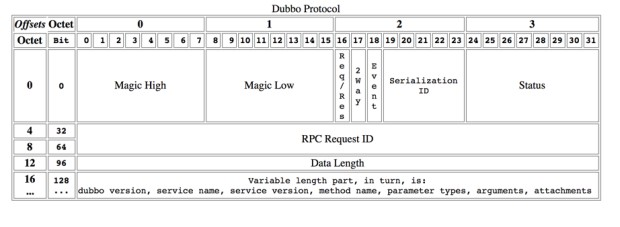
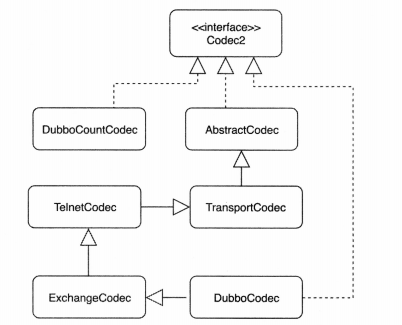

# Dubbo 编码与解码源码分析

## 一、Dubbo 协议详解

### 1.1 协议的概念

协议是两个网络实体进行通信的基础，数据在网络上从一个实体传输到另一个实体，以字节流的形式传递到对端。在这个字节流的世界里，如果没有协议，就无法将这个一维的字节流重塑成为二维或者多维的数据结构以及领域对象。

协议是双方确定的交流语义，比如：我们设计一个字符串传输的协议，它允许客户端发送一个字符串，服务端接收到对应的字符串。这个协议很简单，首先发送一个 4 字节的消息总长度，然后再发送1字节的字符集 charset 长度，接下来就是消息的 payload，字符集名称和字符串正文。

发送一个 iso-8859-1 的字符串 abc 到对端。经过协议编码，内容是：18|10|iso-8859-1|abc，其中 18 = 4 + 1 + 10 + 3，当这些字节流发往服务端后，当服务端收到字节流后，首先读取 4 个字节，将其转换为 int，在这个例子中是 18，接下来继续读 14 个字节，将首个字节得到字符集名称长度 10，将后续内容的前 10 字节转换为字符串，内容是 iso-8859-1，使用该字符集将后续的字节数组造型成为字符串 new String(bytes, "iso-8859-1")。

### 1.2 Codec 的定义

org.apache.dubbo.remoting.Codec2 定义为 I/O 的 Codec 过程，因此主要的方法就是 encode 和 decode，具体定义如下所示：

```java{.line-numbers}
@SPI
public interface Codec2 {

    @Adaptive({Constants.CODEC_KEY})
    void encode(Channel channel, ChannelBuffer buffer, Object message) throws IOException;

    @Adaptive({Constants.CODEC_KEY})
    Object decode(Channel channel, ChannelBuffer buffer) throws IOException;


    enum DecodeResult {
        NEED_MORE_INPUT, SKIP_SOME_INPUT
    }

}
```

​Codec 工作在一种协议上，encode 是将通信对象编码到 ByteBufferWrapper 中，decode 是将从网络上读取的 ChannelBuffer 解码为 Object，也就是通信对象。

### 1.3 常见的协议模式

应用层协议一般的形式有三种：定长协议、特殊结束符和协议头+ payload 模式，下面介绍一下这些形式的具体内容。

从网络上以流的形式进行数据的读取，需要确定的是一次有意义的传输内容在读到何时结束，因为一个一个 byte 传输过来，需要有一个结束。而且数据在网络上的传输，存在粘包和半包的情况，能够应对这个问题的办法就是协议能够准确的识别，当粘包发生时不会多读，当半包发生时会继续读取。

- 定长协议：定长的协议是指协议内容的长度是固定的，比如协议 byte 长度是50，当从网络上读取50个 byte 后，就进行 decode 解码操作。定长协议在读取或者写入时，效率比较高，因为数据缓存的大小基本都确定了，就好比数组一样，缺陷就是适应性不足，以 RPC 场景为例，很难估计出定长的长度是多少。
- 特殊结束符：相比定长协议，如果能够定义一个特殊字符作为每个协议单元结束的标示，就能够以变长的方式进行通信，从而在数据传输和高效之间取得平衡，比如用特殊字符 \n。特殊结束符方式的问题是过于简单的思考了协议传输的过程，对于一个协议单元必须要全部读入才能够进行处理，除此之外必须要防止用户传输的数据不能同结束符相同，否则就会出现紊乱。
- 变长协议（协议头 + payload）：一般是自定义协议，会以定长加不定长的部分组成，其中定长的部分需要描述不定长的内容长度。Dubbo 的协议实际上就是变长协议。

### 1.4 Dubbo 协议

Dubbo 框架定义了私有的 RPC 协议，其中请求和响应协议的具体内容我们使用表格来展示：

<div align="center">
    
</div>

协议详情：

- Magic - Magic High & Magic Low (16 bits)
  - 标识协议版本号，Dubbo 协议：0xdabb
- Req/Res (1 bit)
  - 标识是请求或响应。请求：1；响应：0
- 2 Way (1 bit)
  - 仅在 Req/Res 为 1（请求）时才有用，标记是否期望从服务器返回值。如果需要来自服务器的返回值，则设置为 1。
- Event (1 bit)
  - 标识是否是事件消息，例如，心跳事件。如果这是一个事件，则设置为 1
- Serialization ID (5 bit)
  - 标识序列化类型：比如 fastjson 的值为 6，dubbo 默认使用 hessian 序列化器，其 id 值为 2
- Status (8 bits)
  - 仅在 Req/Res 为 0（响应）时有用，用于标识响应的状态
  - 20 - OK
  - 30 - CLIENT_TIMEOUT
  - 31 - SERVER_TIMEOUT
  - 40 - BAD_REQUEST
  - 50 - BAD_RESPONSE
  - 60 - SERVICE_NOT_FOUND
  - 70 - SERVICE_ERROR
  - 80 - SERVER_ERROR
  - 90 - CLIENT_ERROR
  - 100 - SERVER_THREADPOOL_EXHAUSTED_ERROR
- Request ID (64 bits)
  - 标识唯一请求。类型为 long
- Data Length (32 bits)
  - 序列化后的内容长度（后面可变部分），按字节计数。Int 类型
- Variable Part
  - 被特定的序列化类型（由序列化 ID 标识）序列化后，每个部分都是一个 byte [] 或者 byte
  - 如果是请求包 ( Req/Res = 1)，则每个部分依次为：
    - Dubbo version
    - Service name
    - Service version
    - Method name
    - Method parameter types
    - Method arguments
    - Attachments
  - 如果是响应包（Req/Res = 0），则每个部分依次为：
    - 返回值类型 (byte)，标识从服务器端返回的值类型：
      1. 返回空值：**`RESPONSE_NULL_VALUE`** 2，如果是返回空值，则不会有后面的返回值
      2. 正常响应值： **`RESPONSE_VALUE`** 1
      3. 异常：**`RESPONSE_WITH_EXCEPTION`** 0
    - 返回值：从服务端返回的响应 bytes
  
## 二、解码器原理

### 2.1 编解码概述

在 dubbo 中编解码器的继承关系如下所示：

<div align="center">
    
</div>

AbstractCodec 主要提供基础能力，比如检验报文长度和查找具体的编解码器等。前面说过，在 dubbo 的 pipeline 中，handler 的结构是 decoder -> encoder -> nettyClientHandler。而 decoder 和 encoder 都是 NettyCodecAdapter 的内部类 NettyCodecAdapter$InternalEncoder 和 NettyCodecAdapter$InternalDecoder。而这两个内部类最终会将 encode 和 decode 算法转给 DubboCountCodec 进行处理。而 DubboCountCodec 中的编解码最终也是直接转交给 DubboCodec 进行处理。因为流中可能包含多个 RPC 请求，Dubbo 框架尝试一次性读取更多完整报文编解码生成对象，也就是图中的 DubboCountCodec，它的实现思想比较简单，依次调用 DubboCodec 去解码，如果能解码成完整报文，则加入消息列表，然后触发下一个 Handler 方法调用。

```java{.line-numbers}
public final class DubboCountCodec implements Codec2 {

    private DubboCodec codec = new DubboCodec();

    public void encode(Channel channel, ChannelBuffer buffer, Object msg) throws IOException {
        // 调用 DubboCodec 的编码方法，实际上调用的是 DubboCodec 的父类 ExchangeCodec 的 encode 方法
        codec.encode(channel, buffer, msg);
    }

    public Object decode(Channel channel, ChannelBuffer buffer) throws IOException {
        // 先保存当前 buffer 的 readerIndex 指针
        int save = buffer.readerIndex();
        MultiMessage result = MultiMessage.create();
        do {
            // 使用 DubboCodec 进行解码，实际上会调用 ExchangeCodec 的 decode 方法
            Object obj = codec.decode(channel, buffer);
            // 在解码的过程中，如果发现传送过来的字节流不能构成一个完整的报文，那么就直接返回枚举值 NEED_MORE_INPUT
            // 将 readerIndex 指针设置为上一次完整读取消息报文的指针。这样会等待下一次继续有字节流到达，形成一个完整的
            // 消息报文再进行解码，保存到 MultiMessage 对象中。
            if (Codec2.DecodeResult.NEED_MORE_INPUT == obj) {
                buffer.readerIndex(save);
                break;
            // 如果解码成功，则把解码得到的对象保存在 MultiMessage 中
            } else {
                result.addMessage(obj);
                logMessageLength(obj, buffer.readerIndex() - save);
                save = buffer.readerIndex();
            }
        } while (true);
        if (result.isEmpty()) {
            return Codec2.DecodeResult.NEED_MORE_INPUT;
        }
        // 如果说 MultiMessage 中只有一个消息报文对象，那么就直接返回，比如 Response，否则返回 MultiMessage 对象，
        // 这也就解释了为什么 MultiMessageHandler 是 handler 链中的第一个。另外 MultiMessage 实现了 Iterable 接口，
        // 可以使用 for 循环进行迭代
        if (result.size() == 1) {
            return result.get(0);
        }
        return result;
    }

} 
```

### 2.2 编码请求对象

Dubbo 中的编码器主要将 Java 对象编码成字节流返回给客户端，主要做两部分事情，构造报文头部，然后对消息体进行序列化处理。所有编解码层实现都应该继承自 Exchangecodec，Dubbo 协议编码器也不例外。当Dubbo 协议编码请求对象时，会调用 ExchangeCodec#encode 方法。我们首先分析编码请求对象：

```java{.line-numbers}
// ExchangeCodec#encodeRequest
protected void encodeRequest(Channel channel, ChannelBuffer buffer, Request req) throws IOException {
    // 获取指定或者默认的序列化器 hessian2
    Serialization serialization = getSerialization(channel);
    // header.
    // dubbo 协议的协议头长度为 16 个字节
    byte[] header = new byte[HEADER_LENGTH];
    // 设置魔数到这个字节数组中
    Bytes.short2bytes(MAGIC, header);

    // 设置数据包类型（Request/Response）以及序列化编号，这个就是用来指明使用哪个序列化器
    // FLAG_REQUEST 是 1000 0000
    // 序列化器的编号是 2 - 9，其中默认使用 hessian2 序列化器，其编号为 2
    header[2] = (byte) (FLAG_REQUEST | serialization.getContentTypeId());
    // 设置通信方式（单向/双向） FLAG_TWOWAY 是 0100 0000
    if (req.isTwoWay()) header[2] |= FLAG_TWOWAY;
    // 设置事件标识，0 为请求包或者响应包，1 表示心跳包，FLAG_EVENT 是 0010 0000
    if (req.isEvent()) header[2] |= FLAG_EVENT;

    // set request id.
    // 设置请求的编号，8个字节，从第4个字节开始设置
    Bytes.long2bytes(req.getId(), header, 4);

    // 获取 buffer 当前的写位置，方便后面写入消息头 header
    int savedWriteIndex = buffer.writerIndex();
    // 更新 writeIndex，为消息头预留 16 个字节的空间
    buffer.writerIndex(savedWriteIndex + HEADER_LENGTH);
    ChannelBufferOutputStream bos = new ChannelBufferOutputStream(buffer);
    // 创建序列化器，比如 Hessian2ObjectOutput
    ObjectOutput out = serialization.serialize(channel.getUrl(), bos);
    if (req.isEvent()) {
        // 对事件数据进行序列化操作
        encodeEventData(channel, out, req.getData());
    } else {
        // 对请求数据进行序列化操作，这里的 daya 一般是 RpcInvocation
        encodeRequestData(channel, out, req.getData());
    }
    out.flushBuffer();
    if (out instanceof Cleanable) {
        ((Cleanable) out).cleanup();
    }
    bos.flush();
    bos.close();
    // 获取写入的字节数，也就是发送的消息体的长度
    int len = bos.writtenBytes();
    checkPayload(channel, len);
    // 将消息体的长度写入到消息头中，从第 12 个字节开始，占用 4 个字节
    Bytes.int2bytes(len, header, 12);

    // 将 buffer 指针移动到 savedWriteIndex，为写消息头做准备
    buffer.writerIndex(savedWriteIndex);
    // 从 buffer 的 savedWriteIndex 处开始写入消息头
    buffer.writeBytes(header); // write header.
    // 设置新的 writeIndex，writeIndex = 原写下标 + 消息头长度 + 消息体长度
    buffer.writerIndex(savedWriteIndex + HEADER_LENGTH + len);
} 
```

对请求进行编码的步骤：

1. 通过位运算将消息头写入到 header 数组中
2. 对 Request 对象的 data 字段执行序列化操作
3. 序列化后的数据最终会存储到 ChannelBuffer 中，并且得到数据序列化后的长度 len
4. 将 len 写入到 header 指定位置处，最后将消息头字节数组 header 写入到 ChannelBuffer 中

通过上面请求编码器实现中，会调用 encodeRequestData 方法对 RpcInvocation 调用进行编码，这部分在介绍 dubbo 协议的时候讲过，对于请求包而言，variable part 依次为 dubbo version、service name、service version、method name、Method parameter types、Method arguments、Attachments。在 DubboCodec#encodeRequestData 中重写了这个方法实现，如下所示：

```java{.line-numbers}
// 对 Request 对象中的 data 字段进行序列化
// DubboCodec#encodeRequestData
@Override
protected void encodeRequestData(Channel channel, ObjectOutput out, Object data) throws IOException {
    RpcInvocation inv = (RpcInvocation) data;

    // 依次序列化 dubbo version（dubbo 框架的版本）、path（也就是调用接口）、version（接口的指定版本，默认为 0.0.0.0）
    out.writeUTF(inv.getAttachment(Constants.DUBBO_VERSION_KEY, DUBBO_VERSION));
    out.writeUTF(inv.getAttachment(Constants.PATH_KEY));
    out.writeUTF(inv.getAttachment(Constants.VERSION_KEY));
    // 序列化调用方法名
    out.writeUTF(inv.getMethodName());
    // 将参数类型转换为字符串，并且进行序列化
    out.writeUTF(ReflectUtils.getDesc(inv.getParameterTypes()));
    Object[] args = inv.getArguments();

    if (args != null)
        for (int i = 0; i < args.length; i++) {
            // 依次对运行时参数进行序列化
            out.writeObject(encodeInvocationArgument(channel, inv, i));
        }
    // 序列化 attachments
    out.writeObject(inv.getAttachments());
} 
```

在编码消息体的时候，首先主要先写入框架的版本，这里主要用于支持服务端版本隔离和服务端隐式参数透传给客户端的特性。接着向服务端写入调用的接口。然后指定接口的版本，默认版本为 0.0.0.0
Dubbo 允许同一个接口有多个实现，可以指定版本或分组来区分。然后指定远程调用的接口方法。接着将方法参数类型以 Java 类型方式传递给服务端。然后循环对参数值进行序列化。 最后写入隐式参数HashMap，这里可能包含 timeout 和 group 等动态参数。 

### 2.3 编码响应对象

```java{.line-numbers}
// ExchangeCodec#encodeResponse
protected void encodeResponse(Channel channel, ChannelBuffer buffer, Response res) throws IOException {
    int savedWriteIndex = buffer.writerIndex();
    try {
        Serialization serialization = getSerialization(channel);
        // 创建消息头字节数组
        byte[] header = new byte[HEADER_LENGTH];
        // 设置魔数，魔数是 short 类型的，占用两个字节
        Bytes.short2bytes(MAGIC, header);
        // 设置序列化器编号
        header[2] = serialization.getContentTypeId();
        // 如果是心跳响应类型的，那么就设置 FLAG_EVENT
        if (res.isHeartbeat()) 
            header[2] |= FLAG_EVENT;
        // 设置响应状态
        byte status = res.getStatus();
        header[3] = status;
        // 设置请求编号
        Bytes.long2bytes(res.getId(), header, 4);

        // 更新 writerIndex，为消息头预留 16 个字节的空间
        buffer.writerIndex(savedWriteIndex + HEADER_LENGTH);
        ChannelBufferOutputStream bos = new ChannelBufferOutputStream(buffer);
        ObjectOutput out = serialization.serialize(channel.getUrl(), bos);
        // encode response data or error message.
        if (status == Response.OK) {
            if (res.isHeartbeat()) {
                // 对心跳响应结果进行序列化，已经被废弃
                encodeHeartbeatData(channel, out, res.getResult());
            } else {
                // 对调用结果进行序列化，一般就是 Result 对象
                encodeResponseData(channel, out, res.getResult());
            }
        } else 
            // 对错误信息也进行序列化
            out.writeUTF(res.getErrorMessage());

        out.flushBuffer();
        if (out instanceof Cleanable) {
            ((Cleanable) out).cleanup();
        }
        bos.flush();
        bos.close();

        // 获取写入的字节数，也就是消息体的长度
        int len = bos.writtenBytes();
        checkPayload(channel, len);
        // 将消息体长度写入到消息头中
        Bytes.int2bytes(len, header, 12);
        // 将 buffer 指针移动到 savedWriteIndex 处，为写入消息头作准备
        buffer.writerIndex(savedWriteIndex);
        // 从 savedWriteIndex 下标处写入消息头
        buffer.writeBytes(header); // write header.
        // 设置新的 writerIndex，writerIndex = 原写下标 + 消息头长度 + 消息体长度
        buffer.writerIndex(savedWriteIndex + HEADER_LENGTH + len);
    } catch (Throwable t) {
        // 省略代码
    }
} 
```

从上面可以看出，编码请求对象与响应对象的过程基本一致，唯一不同的地方在于编码请求对象的过程中会对 RpcInvocation 进行编码，而在编码响应对象的过程中会对 RpcResult 进行编码，也就是对 RPC 调用的结果进行编码，具体的代码如下：

```java{.line-numbers}
@Override
// DubboCodec#encodeResponseData
protected void encodeResponseData(Channel channel, ObjectOutput out, Object data) throws IOException {
    Result result = (Result) data;

    Throwable th = result.getException();
    // 异常信息为空
    if (th == null) {
        Object ret = result.getValue();
        // 调用结果为空，则返回 RESPONSE_NULL_VALUE
        if (ret == null) {
            out.writeByte(RESPONSE_NULL_VALUE);
        // 调用结果不为空，则将结果进行序列化
        } else {
            out.writeByte(RESPONSE_VALUE);
            out.writeObject(ret);
        }
    // 异常信息非空
    } else {
        // 序列化响应类型
        out.writeByte(RESPONSE_WITH_EXCEPTION);
        // 序列化异常对象
        out.writeObject(th);
    }
}
```

从上面的代码可知，写入 rpc 调用的结果前，会先写入一个标志位（用于后面解码的时候判断），然后再写入序列化的调用结果。

### 2.4 解码请求对象

解码请求对象和解码响应对象都要经过 ExchangeCodec 的 decode 方法，在这个方法中会先解码消息头部分：

```java{.line-numbers}
// 默认情况下，dubbo 使用 netty 作为底层的通信框架，netty 检测到有数据入站后，首先会通过解码器对数据进行
// 解码，并且将解码后的数据传递给下一个入站处理器的指定方法
// ExchangeCodec#decode
public Object decode(Channel channel, ChannelBuffer buffer) throws IOException {
    int readable = buffer.readableBytes();
    // 创建消息头字节数组，最多读取 16 个字节
    byte[] header = new byte[Math.min(readable, HEADER_LENGTH)];
    // 读取消息头数据
    buffer.readBytes(header);
    // 调用重载方法进行后续解码工作
    return decode(channel, buffer, readable, header);
} 
```

接下来对请求对象和响应对象的 body 部分进行解码：

```java{.line-numbers}
// ExchangeCodec#decode
protected Object decode(Channel channel, ChannelBuffer buffer, int readable, byte[] header) throws IOException {
    // check magic number.
    // 检查魔数是否相等
    if (readable > 0 && header[0] != MAGIC_HIGH || readable > 1 && header[1] != MAGIC_LOW) {
        int length = header.length;
        if (header.length < readable) {
            header = Bytes.copyOf(header, readable);
            buffer.readBytes(header, length, readable - length);
        }
        for (int i = 1; i < header.length - 1; i++) {
            if (header[i] == MAGIC_HIGH && header[i + 1] == MAGIC_LOW) {
                buffer.readerIndex(buffer.readerIndex() - header.length + i);
                header = Bytes.copyOf(header, i);
                break;
            }
        }
        return super.decode(channel, buffer, readable, header);
    }

    // 检测可读数据量是否少于消息头长度，若小于则表明还有消息头的数据没有获取到，立即返回 DecodeResult.NEED_MORE_INPUT
    if (readable < HEADER_LENGTH) {
        return DecodeResult.NEED_MORE_INPUT;
    }

    // 从消息头中获取消息体长度
    int len = Bytes.bytes2int(header, 12);
    // 检测消息体长度是否超出限制，超出则抛出异常
    checkPayload(channel, len);

    int tt = len + HEADER_LENGTH;
    // 检测可读的字节数是否小于 dubbo 完整报文的字节数（消息头的字节数 + 消息体的字节数），否则等待更多的字节到达
    if (readable < tt) {
        return DecodeResult.NEED_MORE_INPUT;
    }

    // limit input stream.
    ChannelBufferInputStream is = new ChannelBufferInputStream(buffer, len);

    try {
        // 解码消息体，其中 is 流是完整的 RPC 调用报文
        return decodeBody(channel, is, header);
    } finally {
        // 如果解码过程有问题，则跳过这次 RPC 调用报文
        if (is.available() > 0) {
            try {
                if (logger.isWarnEnabled()) {
                    logger.warn("Skip input stream " + is.available());
                }
                StreamUtils.skipUnusedStream(is);
            } catch (IOException e) {
                logger.warn(e.getMessage(), e);
            }
        }
    }
} 
```

decode 方法的流程如下：

1. 通过检测消息头中的魔数是否与规定的魔数相等，提前拦截掉非常规数据包，比如通过 telnet 命令行发出的数据包
2. 对消息体长度以及可读字节数进行检测
3. 最后调用 decodeBody 方法进行后续的解码工作，ExchangeCodec 中实现了 decodeBody 方法，但因其子类 DubboCodec 覆写了该方法，所以在运行时 DubboCodec 中的 decodeBody 方法会被调用

```java{.line-numbers}
// DubboCodec#decodeBody
protected Object decodeBody(Channel channel, InputStream is, byte[] header) throws IOException {
    byte flag = header[2], proto = (byte) (flag & SERIALIZATION_MASK);
    Serialization s = CodecSupport.getSerialization(channel.getUrl(), proto);
    // 获取请求编号
    long id = Bytes.bytes2long(header, 4);
    // 检测消息类型，若下面的条件成立，表明消息类型为 Response
    if ((flag & FLAG_REQUEST) == 0) {
        // 创建 Response 对象
        Response res = new Response(id);
        // 检测事件标志位，也就是判断 Response 是否为心跳响应
        if ((flag & FLAG_EVENT) != 0) {
            // 设置心跳事件
            res.setEvent(Response.HEARTBEAT_EVENT);
        }
        // 获取响应状态
        byte status = header[3];
        res.setStatus(status);
        // 如果响应状态为 OK，表明调用过程正常
        if (status == Response.OK) {
            try {
                Object data;
                if (res.isHeartbeat()) {
                    // 反序列化心跳数据，已经被废弃
                    data = decodeHeartbeatData(channel, deserialize(s, channel.getUrl(), is));
                } else if (res.isEvent()) {
                    // 反序列化事件数据
                    data = decodeEventData(channel, deserialize(s, channel.getUrl(), is));
                } else {
                    DecodeableRpcResult result;
                    // 根据 url 参数决定是否在 IO 线程上执行解码逻辑
                    if (channel.getUrl().getParameter(Constants.DECODE_IN_IO_THREAD_KEY, Constants.DEFAULT_DECODE_IN_IO_THREAD)) {
                        // 创建 DecodeableRpcResult 对象
                        result = new DecodeableRpcResult(channel, res, is, (Invocation) getRequestData(id), proto);
                        // 进行后续解码工作
                        result.decode();
                    } else {
                        result = new DecodeableRpcResult(channel, res, new UnsafeByteArrayInputStream(readMessageData(is)),
                                    (Invocation) getRequestData(id), proto);
                    }
                    data = result;
                }
                // 设置 DecodeableRpcResult 对象到 Response 对象中
                res.setResult(data);
            } catch (Throwable t) {
                if (log.isWarnEnabled()) {
                    log.warn("Decode response failed: " + t.getMessage(), t);
                }
                res.setStatus(Response.CLIENT_ERROR);
                res.setErrorMessage(StringUtils.toString(t));
            }
        } else {
            res.setErrorMessage(deserialize(s, channel.getUrl(), is).readUTF());
        }
        return res;
    } else {
        // 创建 Request 对象
        Request req = new Request(id);
        req.setVersion("2.0.0");
        // 通过逻辑与运算得到通信方式，并且设置到 Request 对象中
        req.setTwoWay((flag & FLAG_TWOWAY) != 0);
        // 通过位运算检测数据包是否为事件类型
        if ((flag & FLAG_EVENT) != 0) {
            // 设置心跳事件到 Request 对象中
            req.setEvent(Request.HEARTBEAT_EVENT);
        }
        try {
            Object data;
            if (req.isHeartbeat()) {
                // 对心跳包进行解码，这个方法已经被标注为废弃
                data = decodeHeartbeatData(channel, deserialize(s, channel.getUrl(), is));
            } else if (req.isEvent()) {
                // 对事件数据进行解码
                data = decodeEventData(channel, deserialize(s, channel.getUrl(), is));
            } else {
                DecodeableRpcInvocation inv;
                // 根据 url 参数判断是否在 IO 线程上对消息体进行解码
                if (channel.getUrl().getParameter(Constants.DECODE_IN_IO_THREAD_KEY, Constants.DEFAULT_DECODE_IN_IO_THREAD)) {
                    inv = new DecodeableRpcInvocation(channel, req, is, proto);
                    // 在当前线程，也就是 IO 线程上进行后续的解码工作，此工作完成后，可将调用方法名、attachment、以及调用参数解析出来
                    inv.decode();
                } else {
                    // 仅创建 DecodeableRpcInvocation 对象，但不在当前线程上执行解码逻辑
                    inv = new DecodeableRpcInvocation(channel, req, new UnsafeByteArrayInputStream(readMessageData(is)), proto);
                }
                data = inv;
            }
            // 设置 data 到 Request 对象中
            req.setData(data);
        } catch (Throwable t) {
            if (log.isWarnEnabled()) {
                log.warn("Decode request failed: " + t.getMessage(), t);
            }
            // bad request
            // 若解码过程中出现异常，则将 broken 字段设为 true，并且将异常对象设置到 Request 对象中
            req.setBroken(true);
            req.setData(t);
        }
        return req;
    }
}
```

在这里要着重讲解的一点就是，在对 RpcInvocation 以及 RpcResult 进行解码时，会判断是否在当前线程，也就是 I/O 线程上进行解码。如果是的话，直接进行解码；否则直接将未解码的 RpcInvocation 保存到 Request 中，然后等待 Request 对象通过 pipeline 被传送到 DecodeHandler 中进行处理。具体代码如下：

```java{.line-numbers}
public class DecodeHandler extends AbstractChannelHandlerDelegate {
    // DecodeHandler#received
    public void received(Channel channel, Object message) throws RemotingException {
        if (message instanceof Decodeable) {
            decode(message);
        }
        // 对未在 I/O 线程上解码的 RpcInvocation 对象进行解码
        if (message instanceof Request) {
            decode(((Request) message).getData());
        }
        // 对未在 I/O 线程上解码的 RpcResult 对象进行解码
        if (message instanceof Response) {
            decode(((Response) message).getResult());
        }
        // 继续传递给下一个 handler
        handler.received(channel, message);
    }
} 
```

另外，从前面 dubbo 网络结构的相关内容可知，DecodeHandler 以及之后的 Handler 处理都是在线程池中进行的，所以这就是前面所说的根据 url 参数判断是否在 I/O 线程上对消息体进行解码，如果不进行解码的话，就会留到线程池中进行解码。下面就是对 RpcInvocation 进行解码的代码：

```java{.line-numbers}
// DecodeableRpcInvocation#decode
public Object decode(Channel channel, InputStream input) throws IOException {
    ObjectInput in = CodecSupport.getSerialization(channel.getUrl(), serializationType).deserialize(channel.getUrl(), input);

    // 通过反序列化得到 dubbo version、path、version，并且保存到 RpcInvocation 中的 attachments 中
    setAttachment(Constants.DUBBO_VERSION_KEY, in.readUTF());
    setAttachment(Constants.PATH_KEY, in.readUTF());
    setAttachment(Constants.VERSION_KEY, in.readUTF());
    // 通过反序列化得到要调用的方法名
    setMethodName(in.readUTF());
    try {
        Object[] args;
        Class<?>[] pts;
        // 通过反序列化得到参数类型字符串，比如 Ljava/lang/String;
        String desc = in.readUTF();
        if (desc.length() == 0) {
            pts = DubboCodec.EMPTY_CLASS_ARRAY;
            args = DubboCodec.EMPTY_OBJECT_ARRAY;
        } else {
            // 将 desc 解析为 Class<?> 数组
            pts = ReflectUtils.desc2classArray(desc);
            //  args 为参数实例数组
            args = new Object[pts.length];
            for (int i = 0; i < args.length; i++) {
                try {
                    // 解析运行时参数
                    args[i] = in.readObject(pts[i]);
                } catch (Exception e) {
                    if (log.isWarnEnabled()) {
                        log.warn("Decode argument failed: " + e.getMessage(), e);
                    }
                }
            }
        }
        // 设置参数类型数组
        setParameterTypes(pts);
        // 通过反序列化得到原 attachment 的内容
        Map<String, String> map = (Map<String, String>) in.readObject(Map.class);
        if (map != null && map.size() > 0) {
            Map<String, String> attachment = getAttachments();
            if (attachment == null) {
                attachment = new HashMap<String, String>();
            }
            // 将 map 与当前对象中的 attachment 集合进行融合
            attachment.putAll(map);
            setAttachments(attachment);
        }
        //decode argument ,may be callback
        for (int i = 0; i < args.length; i++) {
            args[i] = decodeInvocationArgument(channel, this, pts, i, args[i]);
        }
        
        // 设置参数列表
        setArguments(args);
    } catch (ClassNotFoundException e) {
        throw new IOException(StringUtils.toString("Read invocation data failed.", e));
    } finally {
        if (in instanceof Cleanable) {
            ((Cleanable) in).cleanup();
        }
    }
    return this;
} 
```

上面代码中，依次对下面内容进行反序列化：

```java{.line-numbers}
1. dubbo version
2. path
3. service version
4. method name
5. 参数类型数组 Class<?>[]
6. 参数实例数组 Object[]
7. 附属 attachments 对象
```

下面是对 RpcResult 进行解码的内容：

```java{.line-numbers}
// DecodeableRpcResult#decode
public Object decode(Channel channel, InputStream input) throws IOException {
    ObjectInput in = CodecSupport.getSerialization(channel.getUrl(), serializationType).deserialize(channel.getUrl(), input);
    
    byte flag = in.readByte();
    switch (flag) {
        case DubboCodec.RESPONSE_NULL_VALUE:
            break;
        // 返回值不为空
        case DubboCodec.RESPONSE_VALUE:
            try {
                // 获取返回值类型
                Type[] returnType = RpcUtils.getReturnTypes(invocation);
                // 反序列化调用结果，并且保存起来 
                setValue(returnType == null || returnType.length == 0 ? in.readObject() :
                        (returnType.length == 1 ? in.readObject((Class<?>) returnType[0]) : in.readObject((Class<?>) returnType[0], returnType[1])));
            } catch (ClassNotFoundException e) {
                throw new IOException(StringUtils.toString("Read response data failed.", e));
            }
            break;
        case DubboCodec.RESPONSE_WITH_EXCEPTION:
            try {
                Object obj = in.readObject();
                if (obj instanceof Throwable == false)
                    throw new IOException("Response data error, expect Throwable, but get " + obj);
                setException((Throwable) obj);
            } catch (ClassNotFoundException e) {
                throw new IOException(StringUtils.toString("Read response data failed.", e));
            }
            break;
        default:
            throw new IOException("Unknown result flag, expect '0' '1' '2', get " + flag);
    }
    if (in instanceof Cleanable) {
        ((Cleanable) in).cleanup();
    }
    return this;
} 
```

在对 RpcResult 进行解码的过程中，首先会读取标志位（在 RpcResult 进行编码的过程中设置），然后反序列化调用结果或者异常，最后反序列化成功。

## 三、粘包和半包问题

### 3.1 前言

在客户端与服务端进行通信时候都会约定一个通讯协议，协议一般包含一个 header 和 body，一个 header 和 body 组成了一次通讯的内容，一个通讯包。正常情况下客户端通过 socket 发送一个请求包后，服务端接受后解析请求包，然后进行处理，这看似是一个很简单的问题，但当客户端连续发送多个请求包时就可能会出现半包、粘包现象。

### 3.2 什么是粘包和半包问题

在客户端发送数据时，实际是把数据写入到了 TCP 发送缓存里面的。如果发送的包的大小比 TCP 发送缓存的容量大，那么这个数据包就会被分成多个包，通过 socket 多次发送到服务端，服务端第一次从接受缓存里面获取的数据，实际是整个包的一部分，这时候就产生了半包现象，半包不是说只收到了全包的一半，是说收到了全包的一部分。

如果发送的包的大小比 TCP 发送缓存容量小，并且 TCP 缓存可以存放多个包，那么客户端和服务端的一次通信就可能传递了多个包，这时候服务端从接受缓存就可能一下读取了多个包，这时候就出现了粘包现象。服务端从接受缓存读取数据后一般都是进行解码操作，也就是会把 byte 流转换了 pojo 对象，如果出现了粘包或者半包现象，则进行转换时候就会出现异常。出现粘包和半包的原因是 TCP 层不知道上层业务的包的概念，它只是简单的传递流，所以需要上层应用层协议来识别读取的数据是不是一个完整的包。

### 3.3 如何避免

- 比较常见方案是应用层设计协议时候协议包分为 header 和 body，header 里面记录 body 长度，当服务端从接受缓冲区读取数据后，如果发现数据大小小于包的长度则说明出现了半包，这时候就回退读取缓存的指针，等待下次读事件到来的时候再次测试。如果发现包长度大于了包长度则看长度是包大小整数倍则说明了出现了粘包，则循环读取多个包，否者就是出现了多个整包 + 半包
- 多个包之间添加分隔符
- 包定长，每个包大小固定长度

Dubbo 通过上面的第一种方式来解决网络通讯中的粘包和半包问题。具体相关的代码如下：

```java{.line-numbers}
// NettyCodecAdapter$InternalDecoder
private class InternalDecoder extends ByteToMessageDecoder {

    protected void decode(ChannelHandlerContext ctx, ByteBuf input, List<Object> out) throws Exception {

        ChannelBuffer message = new NettyBackedChannelBuffer(input);
        NettyChannel channel = NettyChannel.getOrAddChannel(ctx.channel(), url, handler);
        Object msg;
        int saveReaderIndex;

        try {
            // decode object.
            do {
                saveReaderIndex = message.readerIndex();
                try {
                    msg = codec.decode(channel, message);
                } catch (IOException e) {
                    throw e;
                }
                if (msg == Codec2.DecodeResult.NEED_MORE_INPUT) {
                    message.readerIndex(saveReaderIndex);
                    break;
                } else {
                    //is it possible to go here ?
                    if (saveReaderIndex == message.readerIndex()) {
                        throw new IOException("Decode without read data.");
                    }
                    if (msg != null) {
                        out.add(msg);
                    }
                }
            } while (message.readable());
        } finally {
            NettyChannel.removeChannelIfDisconnected(ctx.channel());
        }
    }
} 

// DubboCountCodec#decode
public Object decode(Channel channel, ChannelBuffer buffer) throws IOException {
    // 先保存当前 buffer 的 readerIndex 指针
    int save = buffer.readerIndex();
    MultiMessage result = MultiMessage.create();
    do {
        // 使用 DubboCodec 进行解码，实际上会调用 ExchangeCodec 的 decode 方法
        Object obj = codec.decode(channel, buffer);
        // 在解码的过程中，如果发现传送过来的字节流不能构成一个完整的报文，那么就直接返回枚举值 NEED_MORE_INPUT
        // 将 readerIndex 指针设置为上一次完整读取消息报文的指针。这样会等待下一次继续有字节流到达，形成一个完整的
        // 消息报文再进行解码，保存到 MultiMessage 对象中。
        if (Codec2.DecodeResult.NEED_MORE_INPUT == obj) {
            buffer.readerIndex(save);
            break;
        // 如果解码成功，则把解码得到的对象保存在 MultiMessage 中
        } else {
            result.addMessage(obj);
            logMessageLength(obj, buffer.readerIndex() - save);
            save = buffer.readerIndex();
        }
    } while (true);
    if (result.isEmpty()) {
        return Codec2.DecodeResult.NEED_MORE_INPUT;
    }
    // 如果说 MultiMessage 中只有一个消息报文对象，那么就直接返回，比如 Response，否则返回 MultiMessage 对象，
    // 这也就解释了为什么 MultiMessageHandler 是 handler 链中的第一个。另外 MultiMessage 实现了 Iterable 接口，
    // 可以使用 for 循环进行迭代
    if (result.size() == 1) {
        return result.get(0);
    }
    return result;
} 
```

上面的 InternalDecoder 是 NettyCodecAdapter 的一个内部类，它会调用 DubboCountCodec 进行解码操作，而 DubboCountCodec 又会调用 DubboCodec 进行真正的解码操作。而在 DubboCountCodec#decode 方法中会对粘包和半包问题进行处理，当在 ExchangeCodec#decode 方法中对传送过来的字节流进行解码时，先判断获取到的字节流数目是否小于 16 个字节，如果达不到，则返回 NEED_MORE_INPUT，接着对消息头进行解码，并且从消息头中获取到后面可变部分的长度，然后判断当前获取到的字节流数目是否达到一整条消息报文的长度（ HEADER_LENGTH + 可变部分的长度），如果没有达到，则返回 NEED_MORE_INPUT。

而在 DubboCountCodec#decode 方法中，如果解码的结果为 NEED_MORE_INPUT，那么就直接退出解码，直到有新的字节流到达。如果没有则，继续解码，并且把解码好的结果（Request/Response 对象）保存在 MultiMessage 对象中。

所以 Dubbo 就是通过 header + body 的方式来解决粘包和半包问题，其中 header 部分是固定长度的 16 字节，而 body 部分是可变的。当读取到的字节数不够时，就等待新的字节流到达，如果字节数超过了，只处理消息头中指定长度的字节数来进行解码。