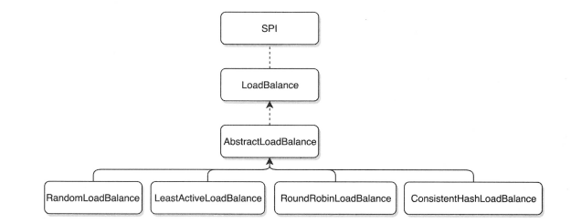

# Dubbo 负载均衡

## 一、前言

### 1.简介

LoadBalance 中文意思为负载均衡，它的职责是将网络请求，或者其他形式的负载“均摊”到不同的机器上。避免集群中部分服务器压力过大，而另一些服务器比较空闲的情况。通过负载均衡，可以让每台服务器获取到适合自己处理能力的负载。在为高负载服务器分流的同时，还可以避免资源浪费，一举两得。负载均衡可分为软件负载均衡和硬件负载均衡。在我们日常开发中，一般很难接触到硬件负载均衡。但软件负载均衡还是可以接触到的，比如 Nginx。在 Dubbo 中，也有负载均衡的概念和相应的实现。Dubbo 需要对服务消费者的调用请求进行分配，避免少数服务提供者负载过大。服务提供者负载过大，会导致部分请求超时。因此将负载均衡到每个服务提供者上，是非常必要的。Dubbo 提供了4种负载均衡实现，分别是基于权重随机算法的 RandomLoadBalance、基于最少活跃调用数算法的 LeastActiveLoadBalance、基于 hash 一致性的 ConsistentHashLoadBalance，以及基于加权轮询算法的 RoundRobinLoadBalance。

在讨论负载均衡之前，我想先解释一下这 3 个概念：

- 负载均衡
- 集群容错
- 服务路由

这 3 个概念容易混淆。他们都描述了怎么从多个 Provider 中选择一个来进行调用。那他们到底有什么区别呢?下面我来举一个简单的例子，把这几个概念阐述清楚吧。有一个 Dubbo 的用户服务，在北京部署了 10 个，在上海部署了 20 个。一个杭州的服务消费方发起了一次调用，然后发生了以下的事情:

1. 根据配置的路由规则，如果杭州发起的调用，会路由到比较近的上海的20个 Provider。
2. 根据配置的随机负载均衡策略，在20个 Provider 中随机选择了一个来调用，假设随机到了第7个 Provider。
3. 结果调用第7个 Provider 失败了。
4. 根据配置的Failover集群容错模式，重试其他服务器。
5. 重试了第13个 Provider，调用成功。

上面的第 1，2，4 步骤就分别对应了路由，负载均衡和集群容错。 Dubbo 中，先通过路由，从多个 Provider 中按照路由规则，选出一个子集。再根据负载均衡从子集中选出一个 Provider 进行本次调用。如果调用失败了，根据集群容错策略，进行重试或定时重发或快速失败等。 可以看到 Dubbo 中的路由，负载均衡和集群容错发生在一次 RPC 调用的不同阶段。最先是路由，然后是负载均衡，最后是集群容错。

### 2.包装后的负载均衡

前面介绍了几种负载均衡策略，发现在很多容错策略中都会使用负载均衡方法，并且所有的容错策略中的负载均衡都使用了抽象父类 Abstractclusterinvoker 中定义的 **`Invoker<T> select`** 方法，而并不是直接使用 LoadBalance 方法。因为抽象父类在 LoadBalance 的基础上又封装了一些新的特性：

1. 粘滞连接。Dubbo 中有一种特性叫粘滞连接，粘滞连接用于有状态服务，尽可能让客户端总是向同一提供者发起调用，除非该提供者“挂了”，再连接另一台。 粘滞连接可以减少长连接数。
2. 可用检测。Dubbo 调用的 URL 中，如果含有 **`cluster.availablecheck=false`**，则不会检测远程服务是否可用，直接调用。如果不设置，则默认会开启检查，对所有的服务都做是否可用的检查，如果不可用，则再次做负载均衡。
3. 避免重复调用。对于已经调用过，但是调用失败的远程服务，会记录在集合 invoked 中，从而避免重复选择。

### 3.负载均衡的总体结构

Dubbo 现在内置了 4 种负载均衡算法，用户也可以自行扩展，因为 LoadBalance 接口上有 @SPI 注解。4 种负载均衡算法都继承自同一个抽象类，使用的也是模板模式，抽象父类已经把通用的逻辑完成，留下了一个抽象的 doSelect 方法给子类实现。负载均衡的接口关系如下所示：

<div align="center">
    
</div>

抽象父类 AbstractLoadBalance 有两个权重相关的方法：calculateWarmupWeight 和 getWeight。getWeight 方法就是获取当前 invoker 的权重，calculateWarmupWeight 是计算具体的权重。getWeight 方法中会调用 calculateWarmupWeight。

calculateWarmupWeight 的计算逻辑比较简单，**<font color="red">由于框架考虑了服务刚启动的时候需要有一个预热的过程，如果一启动就给予 100% 的流量，则可能会让服务崩溃</font>**，因此实现了 calculateWarmupWeight 方法用于计算预热时候的权重，计算逻辑是：(启动至今时间/给予的预热总时间)X权重。例如：假设我们设置A服务的权重是5,让它预热10分钟，则第一分钟的时候，它的权重变为 (1/10) X5 = 0.5，0.5/5 = 0.1，也就是只承担10%的流量；10 分钟后，权重就变为 (10/10) X5 = 5，也就是权重变为设置的100%,承担了所有的流量。 抽象父类的 select 方法是进行具体负载均衡逻辑的地方，这里只是做了一些判断并调用需要子类实现的 doSelect 方法，因此不再赘述。下面直接看一下不同子类实现 doSelect 的方式。

## 二、负载均衡策略详解

### 1.RandomLoadBalance

RandomLoadBalance 是加权随机算法的具体实现，它的算法思想很简单。假设我们有一组服务器 servers = [A, B, C]，他们对应的权重为 weights = [5, 3, 2]，权重总和为10。现在把这些权重值平铺在一维坐标值上，[0, 5) 区间属于服务器 A，[5, 8) 区间属于服务器 B，[8, 10) 区间属于服务器 C。接下来通过随机数生成器生成一个范围在 [0, 10) 之间的随机数，然后计算这个随机数会落到哪个区间上。比如数字3会落到服务器 A 对应的区间上，此时返回服务器 A 即可。权重越大的机器，在坐标轴上对应的区间范围就越大，因此随机数生成器生成的数字就会有更大的概率落到此区间内。只要随机数生成器产生的随机数分布性很好，在经过多次选择后，每个服务器被选中的次数比例接近其权重比例。比如，经过一万次选择后，服务器 A 被选中的次数大约为 5000 次，服务器 B 被选中的次数约为 3000 次，服务器 C 被选中的次数约为 2000 次。

```java{.line-numbers}
public class RandomLoadBalance extends AbstractLoadBalance {

    public static final String NAME = "random";

    private final Random random = new Random();

    protected <T> Invoker<T> doSelect(List<Invoker<T>> invokers, URL url, Invocation invocation) {
        int length = invokers.size(); // Number of invokers
        int totalWeight = 0; // The sum of weights
        boolean sameWeight = true; // Every invoker has the same weight?

        // 下面这个循环有两个作用，第一是计算总权重 totalWeight；第二是检测每个服务提供者的权重是否相同
        for (int i = 0; i < length; i++) {
            int weight = getWeight(invokers.get(i), invocation);
            // 累加权重
            totalWeight += weight; // Sum
            // 检测当前服务提供者的权重与上一个服务提供者的权重是否相同，不相同的话，则将 sameWeight 置为 false。
            if (sameWeight && i > 0
                    && weight != getWeight(invokers.get(i - 1), invocation)) {
                sameWeight = false;
            }
        }
        // 下面的 if 分支主要用于获取随机数，并计算随机数落在哪个区间上
        if (totalWeight > 0 && !sameWeight) {
            // If (not every invoker has the same weight & at least one invoker's weight>0), select randomly based on totalWeight.
            // 随机获取一个 [0, totalWeight) 区间内的数字
            int offset = random.nextInt(totalWeight);
            // Return a invoker based on the random value.
            // 循环让 offset 数减去服务提供者权重值，当 offset 小于0时，返回相应的 Invoker。
            // 举例说明一下，我们有 servers = [A, B, C]，weights = [5, 3, 2]，offset = 7。
            // 第一次循环，offset - 5 = 2 > 0，即 offset > 5，
            // 表明其不会落在服务器 A 对应的区间上。
            // 第二次循环，offset - 3 = -1 < 0，即 5 < offset < 8，
            // 表明其会落在服务器 B 对应的区间上
            for (int i = 0; i < length; i++) {
                // 让随机值 offset 减去权重值
                offset -= getWeight(invokers.get(i), invocation);
                if (offset < 0) {
                    // 返回相应的 Invoker
                    return invokers.get(i);
                }
            }
        }
        // 如果所有服务提供者权重值相同，此时直接随机返回一个即可
        // If all invokers have the same weight value or totalWeight=0, return evenly.
        return invokers.get(random.nextInt(length));
    }
}
```

### 2.ConsistentHashLoadBalance

一致性 hash 算法的工作过程是这样的，首先根据 ip 或者其他的信息为缓存节点生成一个 hash，并将这个 hash 投射到 [0, 232 - 1] 的圆环上。当有查询或写入请求时，则为缓存项的 key 生成一个 hash 值。然后查找第一个大于或等于该 hash 值的缓存节点，并到这个节点中查询或写入缓存项。如果当前节点挂了，则在下一次查询或写入缓存时，为缓存项查找另一个大于其 hash 值的缓存节点即可。大致效果如下图所示，每个缓存节点在圆环上占据一个位置。如果缓存项的 key 的 hash 值小于缓存节点 hash 值，则到该缓存节点中存储或读取缓存项。比如下面绿色点对应的缓存项将会被存储到 cache-2 节点中。由于 cache-3 挂了，原本应该存到该节点中的缓存项最终会存储到 cache-4 节点中。

<div align="center">
    
</div>

下面来看看一致性 hash 在 Dubbo 中的应用。我们把上图的缓存节点替换成 Dubbo 的服务提供者，于是得到了下图：

<div align="center">
    
</div>

这里相同颜色的节点均属于同一个服务提供者，比如 Invoker1-1，Invoker1-2，……, Invoker1-160。这样做的目的是通过引入虚拟节点，让 Invoker 在圆环上分散开来，避免数据倾斜问题。所谓数据倾斜是指，由于节点不够分散，导致大量请求落到了同一个节点上，而其他节点只会接收到了少量请求的情况。比如：

<div align="center">
    
</div>

如上，由于 Invoker-1 和 Invoker-2 在圆环上分布不均，导致系统中75%的请求都会落到 Invoker-1 上，只有 25% 的请求会落到 Invoker-2 上。解决这个问题办法是引入虚拟节点，通过虚拟节点均衡各个节点的请求量。

Dubbo 实现的负载均衡是客户端负载均衡。初始化的时候根据用户配置的 hash.nodes 创建指定数目的虚拟节点，默认为 160 个。**<font color="red">Dubbo 对 Invoker 进行 hash 运算时使用的是 Invoker 的 ip + port + 0-39的数字；对发送的 rpc 请求则是使用方法中的参数值进行 hash 运算，默认是使用第 1 个参数（从 1 开始计数的话）</font>**。需要特别说明的是，客户端发送的请求的 hash 值只和参数值有关，具有相同参数值的请求，在虚拟节点不发生变化的情况下，会传递给相同的 Invoker 进行处理。在 Dubbo 实现的一致性 hash 算法中，每一个节点 invoker 的 hash 值就代表一个虚拟节点。

具体的过程如下：

1. 创建 key 值，也就是服务接口名 + 方法名，在 ConsistentHashLoadBalance 中，key 和 selector 一一对应，保存在 selectors 集合中
2. 获取 invokers 集合新的 hash 值
3. 如果 invokers 集合是一个新的 List 对象，这意味着服务提供者的数量发生了变化，可能新增也可能减少了。此时 hash 值发生了改变，会创建一个新的 selector 替换掉原来的 selector。创建 selector 的具体过程如下：
   1. 获取用户配置的虚拟节点数目 hash.nodes，默认为 160
   2. 获取配置的用作 hash 映射的参数索引 hash.arguments，默认对第一个参数进行 hash 运算
   3. 创建虚拟节点，并且将哈希值和 invoker 保存到 virtualInvokers 集合中。以 replicaNumber 取默认值 160 为例，假设当前遍历到的 Invoker 地址为 127.0.0.1:20880，它会依次获得 "127.0.0.1:208800"、"127.0.0.1:208801"、......、"127.0.0.1:2088039" 的 md5 摘要，在每次获得摘要之后，还会对该摘要进行四次数位级别的散列。大致可以猜到其目的应该是为了加强散列效果。
4. 调用 selector 的 select 方法，根据 invocation 的【参数值】来确定 key，默认使用第一个参数来做 hash 计算。具体就是到 virtualInvokers 这个 treeMap 中查找第一个大于等于参数 hash 的 invoker， 如果 hash 大于 Invoker 在圆环上最大的位置，此时需要取 TreeMap 的头节点作为要返回的 invoker。类似于取模运算中，大于最大值后，会自动回环从 0 开始。

```java{.line-numbers}
public class ConsistentHashLoadBalance extends AbstractLoadBalance {

    private final ConcurrentMap<String, ConsistentHashSelector<?>> selectors = new ConcurrentHashMap<String, ConsistentHashSelector<?>>();

    /**
     * doSelect主要作了一些前置逻辑，比如检查invokers列表是否发生了变动过，以及创建ConsistentHashSelector对象。接下来，就会调用
     * ConsistentHashSelector对象的select方法，进行负载均衡逻辑
     */
    @SuppressWarnings("unchecked")
    @Override
    protected <T> Invoker<T> doSelect(List<Invoker<T>> invokers, URL url, Invocation invocation) {
        // key 值一般为：服务接口名 + 方法名
        // key 的值一般为：com.dubbo.simple.common.DemoService.sayHello
        String key = invokers.get(0).getUrl().getServiceKey() + "." + invocation.getMethodName();

        // 获取 invokers 列表的新的 hash 值
        int identityHashCode = System.identityHashCode(invokers);
        ConsistentHashSelector<T> selector = (ConsistentHashSelector<T>) selectors.get(key);

        // 如果 invokers 集合是一个新的 List 对象，这意味着服务提供者的数量发生了变化，可能新增也可能减少了。此时 selector.identityHashCode != identityHashCode 条件成立
        if (selector == null || selector.identityHashCode != identityHashCode) {
            // 创建新的 ConsistentHashSelector
            selectors.put(key, new ConsistentHashSelector<T>(invokers, invocation.getMethodName(), identityHashCode));
            selector = (ConsistentHashSelector<T>) selectors.get(key);
        }

        // 调用 ConsistentHashSelector 的 select 方法选择 Invoker
        return selector.select(invocation);
    }

    private static final class ConsistentHashSelector<T> {

        /**
         * 存储 Hash 值与虚拟节点映射关系的 TreeMap
         */
        private final TreeMap<Long, Invoker<T>> virtualInvokers;

        /**
         * 节点数目
         */
        private final int replicaNumber;

        /**
         * 用来识别Invoker列表是否发生变更的Hash码
         */
        private final int identityHashCode;

        /**
         * 请求中用来作Hash映射的参数的索引
         */
        private final int[] argumentIndex;

        /**
         * 为每个Invoker都创建replicaNumber个虚拟节点，Hash值与Invoker的映射关系即象征着一个节点，这个关系存储在TreeMap中
         */
        ConsistentHashSelector(List<Invoker<T>> invokers, String methodName, int identityHashCode) {
            this.virtualInvokers = new TreeMap<Long, Invoker<T>>();
            this.identityHashCode = identityHashCode;
            URL url = invokers.get(0).getUrl();
            // 获取虚拟节点数目，默认为 160
            this.replicaNumber = url.getMethodParameter(methodName, "hash.nodes", 160);
            // 获取配置的用作Hash映射的参数的索引，默认对第一个参数进行 hash 运算
            String[] index = Constants.COMMA_SPLIT_PATTERN.split(url.getMethodParameter(methodName, "hash.arguments", "0"));
            argumentIndex = new int[index.length];
            for (int i = 0; i < index.length; i++) {
                argumentIndex[i] = Integer.parseInt(index[i]);
            }

            /**
             * 以replicaNumber取默认值160为例，假设当前遍历到的Invoker地址为127.0.0.1:20880，它会依次获得"127.0.0.1:208800"、"127.0.0.1:208801"、
             * ......、"127.0.0.1:2088039" 的md5摘要，在每次获得摘要之后，还会对该摘要进行四次数位级别的散列。大致可以猜到其目的应该是为了加强散列效果。
             */

            // 遍历所有 invoker 对象
            for (Invoker<T> invoker : invokers) {
                // 获取 provider 的 ip + port
                String address = invoker.getUrl().getAddress();
                for (int i = 0; i < replicaNumber / 4; i++) {
                    // 对 address + i 进行 md5 运算，得到一个长度为16的字节数组
                    byte[] digest = md5(address + i);
                    // 对 digest 部分字节进行4次 hash 运算，得到四个不同的 long 型正整数
                    for (int h = 0; h < 4; h++) {
                        // h = 0 时，取 digest 中下标为 0 ~ 3 的4个字节进行位运算
                        // h = 1 时，取 digest 中下标为 4 ~ 7 的4个字节进行位运算
                        // h = 2 时，取 digest 中下标为 8 ~ 11 的4个字节进行位运算
                        // h = 3 时，取 digest 中下标为 12 ~ 15 的4个字节进行位运算
                        long m = hash(digest, h);
                        // 将 hash 到 invoker 的映射关系存储到 virtualInvokers 中，virtualInvokers 需要提供高效的查询操作，因此选用 TreeMap 作为存储结构
                        virtualInvokers.put(m, invoker);
                    }
                }
            }
        }

        private long hash(byte[] digest, int number) {
            return (((long) (digest[3 + number * 4] & 0xFF) << 24)
                    | ((long) (digest[2 + number * 4] & 0xFF) << 16)
                    | ((long) (digest[1 + number * 4] & 0xFF) << 8)
                    | (digest[number * 4] & 0xFF))
                     & 0xFFFFFFFFL;
         }

        public Invoker<T> select(Invocation invocation) {
            // 根据 invocation 的【参数值】来确定 key，默认使用第一个参数来做 hash 计算。
            // argumentIndex 是在初始化 Selector 的时候一起赋值的，代表着需要用哪几个请求参数作 Hash 映射获取 Invoker。
            // 比如：有方法 methodA(Integer a, Integer b, Integer c)，如果 argumentIndex 的值为{0,2}，那么即用a和c拼接的字符串来计算 Hash 值。
            String key = toKey(invocation.getArguments());
            // 获取【参数值】的 md5 编码
            byte[] digest = md5(key);
            return selectForKey(hash(digest, 0));
        }

        // 根据参数索引获取参数，并将所有参数拼接成字符串
        private String toKey(Object[] args) {
            StringBuilder buf = new StringBuilder();
            for (int i : argumentIndex) {
                if (i >= 0 && i < args.length) {
                    buf.append(args[i]);
                }
            }
            return buf.toString();
        }

        private Invoker<T> selectForKey(long hash) {
            // 到 TreeMap 中查找第一个节点值大于或等于当前 hash 的 Invoker
            Map.Entry<Long, Invoker<T>> entry = virtualInvokers.tailMap(hash, true).firstEntry();
            // 如果 hash 大于 Invoker 在圆环上最大的位置，此时 entry = null，需要将 TreeMap 的头节点赋值给 entry
            // 类似于取模运算中，大于最大值后，会自动回环从0开始
            if (entry == null) {
                entry = virtualInvokers.firstEntry();
            }

            // 返回 Invoker
            return entry.getValue();
        }
    }
}
```

### 3.RoundRobinLoadBalance

本节，我们来看一下 Dubbo 中加权轮询负载均衡的实现 RoundRobinLoadBalance。在详细分析源码前，我们先来了解一下什么是加权轮询。这里从最简单的轮询开始讲起，所谓轮询是指将请求轮流分配给每台服务器。举个例子，我们有三台服务器 A、B、C。我们将第一个请求分配给服务器 A，第二个请求分配给服务器 B，第三个请求分配给服务器 C，第四个请求再次分配给服务器 A。这个过程就叫做轮询。轮询是一种无状态负载均衡算法，实现简单，适用于每台服务器性能相近的场景下。但现实情况下，我们并不能保证每台服务器性能均相近。如果我们将等量的请求分配给性能较差的服务器，这显然是不合理的。因此，这个时候我们需要对轮询过程进行加权，以调控每台服务器的负载。经过加权后，每台服务器能够得到的请求数比例，接近或等于他们的权重比。比如服务器 A、B、C 权重比为 5:2:1。那么在8次请求中，服务器 A 将收到其中的5次请求，服务器 B 会收到其中的2次请求，服务器 C 则收到其中的1次请求。

Dubbo 中 RoundRobinLoadBalance 代码经过了多次重构，重构原因是新的 RoundRobinLoadBalance 在某些情况下选出的服务器序列不够均匀。比如，服务器 [A, B, C] 对应权重 [5, 1, 1]。进行7次负载均衡后，选择出来的序列为 [A, A, A, A, A, B, C]。前5个请求全部都落在了服务器 A上，这将会使服务器 A 短时间内接收大量的请求，压力陡增。而 B 和 C 此时无请求，处于空闲状态。而我们期望的结果是这样的 [A, A, B, A, C, A, A]，不同服务器可以穿插获取请求。为了增加负载均衡结果的平滑性，社区再次对 RoundRobinLoadBalance 的实现进行了重构，这次重构参考自 Nginx 的平滑加权轮询负载均衡。

每个服务器对应两个权重，分别为 weight 和 currentWeight。其中 weight 是固定的，currentWeight 会动态调整，初始值为0。当有新的请求进来时，遍历服务器列表，让它的 currentWeight 加上自身权重。遍历完成后，找到最大的 currentWeight，并将其减去权重总和，然后返回相应的服务器即可。具体的过程如下所示：

那么，调度算法可以描述为：

1. 将每个实例 i 的 当前有效权重 CWi 加上配置权重 Wi，并且求得配置权重和 weightSum；
2. 选出当前有效权重最大的实例，将当前有效权重 CWi 减去所有实例的权重和 weightSum，且变量 currentPos 指向此位置；
3. 此时变量 currentPos 指向的实例就是需调度的实例；
4. 每次调度重复上述步骤 2、3、4；

<div align="center">
    
</div>

如上，经过平滑性处理后，得到的服务器序列为 [A, A, B, A, C, A, A]，相比之前的序列 [A, A, A, A, A, B, C]，分布性要好一些。初始情况下 currentWeight = [0, 0, 0]，第7个请求处理完后，currentWeight 再次变为 [0, 0, 0]。

```java{.line-numbers}
public class RoundRobinLoadBalance extends AbstractLoadBalance {
    public static final String NAME = "roundrobin";

    private static int RECYCLE_PERIOD = 60000;

    protected static class WeightedRoundRobin {
        // 服务提供者权重
        private int weight;
        // 当前权重
        private AtomicLong current = new AtomicLong(0);
        // 最后一次更新时间
        private long lastUpdate;

        public void setWeight(int weight) {
            this.weight = weight;
            // 初始情况下，current = 0
            current.set(0);
        }
        public long increaseCurrent() {
            // current = current + weight；
            return current.addAndGet(weight);
        }
        public void sel(int total) {
            // current = current - total;
            current.addAndGet(-1 * total);
        }
    }

    // 嵌套 Map 结构，存储的数据结构示例如下：
    // {
    //     "UserService.query": {
    //         "url1": WeightedRoundRobin@123,
    //         "url2": WeightedRoundRobin@456,
    //     },
    //     "UserService.update": {
    //         "url1": WeightedRoundRobin@123,
    //         "url2": WeightedRoundRobin@456,
    //     }
    // }
    // 最外层为服务类名 + 方法名，第二层为 url 到 WeightedRoundRobin 的映射关系。
    // 这里我们可以将 url 看成是服务提供者的 id
    private ConcurrentMap<String, ConcurrentMap<String, WeightedRoundRobin>> methodWeightMap = new ConcurrentHashMap<String, ConcurrentMap<String, WeightedRoundRobin>>();

    // 原子更新锁
    private AtomicBoolean updateLock = new AtomicBoolean();

    @Override
    protected <T> Invoker<T> doSelect(List<Invoker<T>> invokers, URL url, Invocation invocation) {
        String key = invokers.get(0).getUrl().getServiceKey() + "." + invocation.getMethodName();
        // 获取 url 到 WeightedRoundRobin 映射表，如果为空，则创建一个新的
        ConcurrentMap<String, WeightedRoundRobin> map = methodWeightMap.get(key);
        if (map == null) {
            methodWeightMap.putIfAbsent(key, new ConcurrentHashMap<String, WeightedRoundRobin>());
            map = methodWeightMap.get(key);
        }
        int totalWeight = 0;
        long maxCurrent = Long.MIN_VALUE;

        // 获取当前时间
        long now = System.currentTimeMillis();
        Invoker<T> selectedInvoker = null;
        WeightedRoundRobin selectedWRR = null;

        // 下面这个循环主要做了这样几件事情：
        //   1. 遍历 Invoker 列表，检测当前 Invoker 是否有
        //      相应的 WeightedRoundRobin，没有则创建
        //   2. 检测 Invoker 权重是否发生了变化，若变化了，
        //      则更新 WeightedRoundRobin 的 weight 字段
        //   3. 让 current 字段加上自身权重，等价于 current += weight
        //   4. 设置 lastUpdate 字段，即 lastUpdate = now
        //   5. 寻找具有最大 current 的 Invoker，以及 Invoker 对应的 WeightedRoundRobin，
        //      暂存起来，留作后用
        //   6. 计算权重总和
        for (Invoker<T> invoker : invokers) {
            String identifyString = invoker.getUrl().toIdentityString();
            WeightedRoundRobin weightedRoundRobin = map.get(identifyString);
            int weight = getWeight(invoker, invocation);
            if (weight < 0) {
                weight = 0;
            }

            // 检测当前 Invoker 是否有对应的 WeightedRoundRobin，没有则创建
            if (weightedRoundRobin == null) {
                weightedRoundRobin = new WeightedRoundRobin();
                // 设置 Invoker 权重
                weightedRoundRobin.setWeight(weight);
                // 存储 url 唯一标识 identifyString 到 weightedRoundRobin 的映射关系
                map.putIfAbsent(identifyString, weightedRoundRobin);
                weightedRoundRobin = map.get(identifyString);
            }
            // Invoker 权重不等于 WeightedRoundRobin 中保存的权重，说明权重变化了，此时进行更新
            if (weight != weightedRoundRobin.getWeight()) {
                weightedRoundRobin.setWeight(weight);
            }

            // 让 current 加上自身权重，等价于 current += weight
            long cur = weightedRoundRobin.increaseCurrent();
            // 设置 lastUpdate，表示近期更新过
            weightedRoundRobin.setLastUpdate(now);
             // 找出最大的 current
             if (cur > maxCurrent) {
                 maxCurrent = cur;
                 // 将具有最大 current 权重的 Invoker 赋值给 selectedInvoker
                 selectedInvoker = invoker;
                 // 将 Invoker 对应的 weightedRoundRobin 赋值给 selectedWRR，留作后用
                 selectedWRR = weightedRoundRobin;
             }

             // 计算权重总和
             totalWeight += weight;
        }

        // 对 <identifyString, WeightedRoundRobin> 进行检查，过滤掉长时间未被更新的节点。
        // 该节点可能挂了，invokers 中不包含该节点，所以该节点的 lastUpdate 长时间无法被更新。
        // 若未更新时长超过阈值后，就会被移除掉，默认阈值为60秒。
        if (!updateLock.get() && invokers.size() != map.size()) {
            if (updateLock.compareAndSet(false, true)) {
                try {
                    ConcurrentMap<String, WeightedRoundRobin> newMap = new ConcurrentHashMap<String, WeightedRoundRobin>();
                    // 拷贝
                    newMap.putAll(map);

                    // 遍历修改，即移除过期记录
                    Iterator<Entry<String, WeightedRoundRobin>> it = newMap.entrySet().iterator();
                    while (it.hasNext()) {
                        Entry<String, WeightedRoundRobin> item = it.next();
                        if (now - item.getValue().getLastUpdate() > RECYCLE_PERIOD) {
                            it.remove();
                        }
                    }

                    // 更新引用
                    methodWeightMap.put(key, newMap);
                } finally {
                    updateLock.set(false);
                }
            }
        }

        if (selectedInvoker != null) {
            // 让 current 减去权重总和，等价于 current -= totalWeight
            selectedWRR.sel(totalWeight);
            // 返回具有最大 current 的 Invoker
            return selectedInvoker;
        }

        // should not happen here
        return invokers.get(0);
    }
}
```

### 4.LeastActiveLoadBalance

LeastActiveLoadBalance 翻译过来是最小活跃数负载均衡。活跃调用数越小，表明该服务提供者效率越高，单位时间内可处理更多的请求。此时应优先将请求分配给该服务提供者。在具体实现中，每个服务提供者对应一个活跃数 active。初始情况下，所有服务提供者活跃数均为0。每收到一个请求，活跃数加1，完成请求后则将活跃数减1。在服务运行一段时间后，性能好的服务提供者处理请求的速度更快，因此活跃数下降的也越快，此时这样的服务提供者能够优先获取到新的服务请求、这就是最小活跃数负载均衡算法的基本思想。除了最小活跃数，LeastActiveLoadBalance 在实现上还引入了权重值。所以准确的来说，LeastActiveLoadBalance 是基于加权最小活跃数算法实现的。举个例子说明一下，在一个服务提供者集群中，有两个性能优异的服务提供者。某一时刻它们的活跃数相同，此时 Dubbo 会根据它们的权重去分配请求，权重越大，获取到新请求的概率就越大。如果两个服务提供者权重相同，此时随机选择一个即可。
