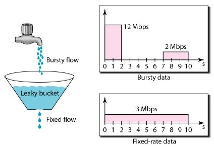
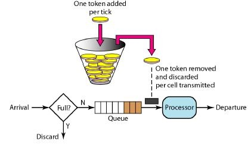

# Dubbo 高并发

## 一、简介

在开发高并发系统时有三把利器用来保护系统：缓存、降级、 限流 , 今天我们就来谈谈 Dubbo 是怎么实现这三种方式的：

- 缓存：缓存的目的是提升系统访问速度和增大系统处理容量
- 降级：降级是当服务器压力剧增的情况下，根据当前业务情况及流量对一些服务和页面有策略的降级，以此释放服务器资源以保证核心任务的正常运行
- 限流：限流的目的是通过对并发访问/请求进行限速，或者对一个时间窗口内的请求进行限速来保护系统，一旦达到限制速率则可以拒绝服务、排队或等待、降级等处理

## 二、结果缓存

Dubbo 框架提供了对服务调用结果进行缓存的特性，用于加速热门数据的访问速度，Dubbo 提供声明式缓存，以减少用户加缓存的工作量。因为每次调用都会使用 JSON.toJSONString 方法将请求参数转换成字符串，然后拼装唯一的 key，用于缓存唯一键。如果不能接受缓存造成的开销，则谨慎使用这个特性。Dubbo 中提供了 3 种缓存方式：

- lru：基于最近最少使用原则删除多余缓存，保持最热的数据被缓存
- threadlocal：当前线程缓存
- jcache：可以桥接各种缓存实现

### 2.1 使用方式

```xml{.line-numbers}
<dubbo:reference id="demoService" check="false" interface="com.alibaba.dubbo.demo.DemoService">
        <dubbo:method name="sayHello" timeout="60000" cache="lru"/>
</dubbo:reference> 
```

### 2.2 LRU 缓存源码解析

```java{.line-numbers}
/**
 * CacheFilter
 * 配置了cache配置才会加载CacheFilter
 */
@Activate(group = {Constants.CONSUMER, Constants.PROVIDER}, value = Constants.CACHE_KEY)
public class CacheFilter implements Filter {
    private CacheFactory cacheFactory;

    public void setCacheFactory(CacheFactory cacheFactory) {
        this.cacheFactory = cacheFactory;
    }

    public Result invoke(Invoker<?> invoker, Invocation invocation) throws RpcException {
        if (cacheFactory != null && ConfigUtils.isNotEmpty(invoker.getUrl().getMethodParameter(invocation.getMethodName(), Constants.CACHE_KEY))) {
            // 使用CacheFactory$Adaptive获取具体的CacheFactory，然后再使用具体的CacheFactory获取具体的Cache对象
            Cache cache = cacheFactory.getCache(invoker.getUrl().addParameter(Constants.METHOD_KEY, invocation.getMethodName()));
            if (cache != null) {
                // 缓存对象的key为arg1,arg2,arg3,...,arg4
                String key = StringUtils.toArgumentString(invocation.getArguments());
                // 获取缓存value
                Object value = cache.get(key);
                if (value != null) {
                    return new RpcResult(value);
                }
                Result result = invoker.invoke(invocation);
                // 响应结果没有exception信息，则将相应结果的值塞入缓存
                if (!result.hasException()) {
                    cache.put(key, result.getValue());
                }
                return result;
            }
        }
        return invoker.invoke(invocation);
    }
} 
```

从 @Activate(group = {Constants.CONSUMER, Constants.PROVIDER}, value = Constants.CACHE_KEY) 中我们可以看出，consumer 端或 provider 端配置了 cache="xxx"，则会走该 CacheFilter。首先获取具体 Cache 实例：CacheFilter 中的 cacheFactory 属性是 CacheFactory$Adaptive 实例。

```java{.line-numbers}
public class CacheFactory$Adaptive implements com.alibaba.dubbo.cache.CacheFactory {
    public com.alibaba.dubbo.cache.Cache getCache(com.alibaba.dubbo.common.URL arg0) {
        if (arg0 == null) throw new IllegalArgumentException("url == null");
        com.alibaba.dubbo.common.URL url = arg0;
        String extName = url.getParameter("cache", "lru");
        if (extName == null)
            throw new IllegalStateException("Fail to get extension(com.alibaba.dubbo.cache.CacheFactory) name from url(" + url.toString() + ") use keys([cache])");
        // 获取具体的 CacheFactory
        CacheFactory extension = (com.alibaba.dubbo.cache.CacheFactory) ExtensionLoader.getExtensionLoader(CacheFactory.class).getExtension(extName);
        // 使用具体的 CacheFactory 获取具体的 Cache
        return extension.getCache(arg0);
    }
} 
```

这里 extName 使我们配置的 lru，如果不配置，默认也是 lru。这里获取到的具体的 CacheFactory 是 LruCacheFactory。

```java{.line-numbers}
@SPI("lru")
public interface CacheFactory {
    @Adaptive("cache")
    Cache getCache(URL url);
}

public abstract class AbstractCacheFactory implements CacheFactory {
    private final ConcurrentMap<String, Cache> caches = new ConcurrentHashMap<String, Cache>();

    public Cache getCache(URL url) {
        String key = url.toFullString();
        Cache cache = caches.get(key);
        if (cache == null) {
            caches.put(key, createCache(url));
            cache = caches.get(key);
        }
        return cache;
    }

    protected abstract Cache createCache(URL url);
}

public class LruCacheFactory extends AbstractCacheFactory {
    protected Cache createCache(URL url) {
        return new LruCache(url);
    }
} 
```

调用 LruCacheFactory.getCache(URL url) 方法，实际上调用的是其父类 AbstractCacheFactory 的方法。逻辑是：创建一个 LruCache 实例，之后存储在 ConcurrentMap<String, Cache> caches 中，key 为 url.toFullString()。而 LruCache 只是 LRUCache 的一个代理：

```java{.line-numbers}
public class LRUCache<K, V> extends LinkedHashMap<K, V> {
    private static final long serialVersionUID = -5167631809472116969L;

    private static final float DEFAULT_LOAD_FACTOR = 0.75f;

    private static final int DEFAULT_MAX_CAPACITY = 1000;
    private final Lock lock = new ReentrantLock();
    private volatile int maxCapacity;

    public LRUCache(int maxCapacity) {
        /**
         * 注意：
         * LinkedHashMap 维护着一个运行于所有Entry的双向链表：此链表定义了迭代顺序，该迭代顺序可以是插入顺序或者是访问顺序
         * 而真正存储的数据结构还是其父类HashMap的那个Entry[]数组，上述的双向链表仅用于维护迭代顺序（帮助实现lru算法等）
         *
         * LinkedHashMap(int initialCapacity, float loadFactor, boolean accessOrder)
         * 第三个参数accessOrder：false（插入顺序），true（访问顺序）
         */
        super(16, DEFAULT_LOAD_FACTOR, true);
        this.maxCapacity = maxCapacity;
    }

    /**
     * 是否需要删除最老的数据（即最近没有被访问的数据）
     * @param eldest
     * @return
     */
    @Override
    protected boolean removeEldestEntry(java.util.Map.Entry<K, V> eldest) {
        return size() > maxCapacity;
    }

    @Override
    public V get(Object key) {
        try {
            lock.lock();
            return super.get(key);
        } finally {
            lock.unlock();
        }
    }

    @Override
    public V put(K key, V value) {
        try {
            lock.lock();
            return super.put(key, value);
        } finally {
            lock.unlock();
        }
    }

    @Override
    public V remove(Object key) {
        try {
            lock.lock();
            return super.remove(key);
        } finally {
            lock.unlock();
        }
    }

    @Override
    public int size() {
        try {
            lock.lock();
            return super.size();
        } finally {
            lock.unlock();
        }
    }
    ...
} 
```

从上面可以看出，LRUCache 是使用了 LinkedHashMap 来实现 LRU 缓存，并且加锁来防止并发冲突。LinkedHashMap 实现 Map 的接口，和 HashMap 不同的是维持了一个所有 entries 的双向链表，并持有一个该有序链表的迭代器，并有两个 Entry<K,V> 引用 transient LinkedHashMap.Entry<K,V> head,tail 分别指向链表的首部和尾部，**<font color="red">最常使用的元素会放到链表的尾部，链表的头部为最不常用的数据，插入一个新元素也会插入到尾部</font>**，同时访问一个元素之后，该元素也会被移动到链表的尾部。我们可以用这个特性来实现 LRU（最近最不常使用）缓存，下面我们在实现前先简单的对 LinkedHashMap 的一些特性进行简单介绍：

- 构造方法 LinkedHashMap<K,V>(int initialCapacity, float loadFactor, boolean accessOrder)，前两个参数和 HashMap 常用参数一样，后一个是表示是否维持一个访问顺序。accessOrder 为 false 的话就表示维持一个插入顺序，accessOrder 为 true 的话，就表示维持一个访问顺序。
- accessOrder 其实表示访问一个元素后，是否强调 afterNodeAccess 方法。当 accessOrder 为 true 的时候，在我们访问了一个 Entry<K,V> 时，我们会调用 afterNodeAccess() 方法，将我们当前访问的节点放入到链表的末尾，利用这个特性便可以区分谁是最近访问，谁是最近最不常访问元素了。
- boolean removeEldestEntry(Map.Entry) 该方法返回值为 true 时，会删除最近最不常使用的元素，也就是 double-link 的头部节点，当插入一个新节点之后 removeEldestEntry() 方法会被put()、putAll() 方法调用，我们可以通过 override 该方法，来控制删除最旧节点的条件。

下面我们举一个例子来进行讲解：

```java{.line-numbers}
LinkedHashMap<Integer,Integer> map = new LinkedHashMap<>(8, 0.75f, true);

map.put(1, 1);
map.put(2, 2);
map.put(3, 3);

map.get(2);

System.out.println(map);  
```

输出结果如下所示：

```java{.line-numbers}
{1=1, 3=3, 2=2}
```

可以看到 get 了的数据被放到了双向链表尾部，也就是按照了访问时间进行排序,这就是访问顺序的含义。

总结一下就是，LRU 缓存策略是框架默认使用的。它的原理比较简单，缓存对应实现类是 LRUCache。缓存实现类 LRUCache 继承了 JDK 的 LinkedHashMap 类，LinkedHashMap 是基于链表的实现，它提供了钩子方法 removeEldestEntry, 它的返回值用于判断每次向集合中添加元素时是否应该删除最少访问的元素。LRUCache 重写了这个方法，当缓存值达到 1000 时，这个方法会返回 true,链表会把头部节点移除。链表每次添加数据时都会在队列尾部添加，因此队列头部就是最少访问的数据。LinkedHashMap 在更新数据时，会把更新数据更新到列表尾部。

### 2.3 ThreadLocal 缓存源码解析

大家应该知道，用户从发起请求，到服务器响应的这个过程中，在服务器中是在一个线程中的。如果我们把查询出来的对象放到这个线程自己的缓存中，到用户请求结束时，把这些东西清理掉，应该是一个不错的 cache 方案。

```java{.line-numbers}
<dubbo:reference id="demoService" check="false" interface="com.alibaba.dubbo.demo.DemoService" cache="threadlocal"/> 

public class ThreadLocalCacheFactory extends AbstractCacheFactory {
    protected Cache createCache(URL url) {
        return new ThreadLocalCache(url);
    }
}

public class ThreadLocalCache implements Cache {
    private final ThreadLocal<Map<Object, Object>> store;

    public ThreadLocalCache(URL url) {
        this.store = new ThreadLocal<Map<Object, Object>>() {
            @Override
            protected Map<Object, Object> initialValue() {
                return new HashMap<Object, Object>();
            }
        };
    }

    public void put(Object key, Object value) {
        store.get().put(key, value);
    }

    public Object get(Object key) {
        return store.get().get(key);
    }
} 
```

## 三、服务降级

### 3.1 服务降级简介

由于爆炸性的流量冲击，对一些服务进行有策略的放弃，以此缓解系统压力，保证目前主要业务的正常运行。它主要是针对非正常情况下的应急服务措施：当此时一些业务服务无法执行时，给出一个统一的返回结果。降级服务的特征：

- 原因：整体负荷超出整体负载承受能力。
- 目的：保证重要或基本服务正常运行，非重要服务延迟使用或暂停使用
- 大小：降低服务粒度，要考虑整体模块粒度的大小，将粒度控制在合适的范围内
- 可控性：在服务粒度大小的基础上增加服务的可控性，后台服务开关的功能是一项必要配置，可分为手动控制和自动控制。
- 次序：一般从外围延伸服务开始降级，需要有一定的配置项，重要性低的优先降级，比如可以分组设置等级 1-10，当服务需要降级到某一个级别时，进行相关配置

### 3.2 Dubbo 中服务降级实现

Dubbo 提供服务容错的能力，通常用于服务降级，比如验权服务，当服务提供方“挂掉”后，客户端不抛出异常，而是通过 Mock 数据返回授权失败。目前 Dubbo 提供以下几种方式来使用 Mock 能力：

```xml{.line-numbers}
<dubbo:reference mock="true" .../>
<dubbo:reference mock="com.foo.BarServiceMock"・・・/>
<dubbo:reference mock="return null" .../>
<dubbo:reference mock="throw com.alibaba.XXXException" ・・・/>
<dubbo:reference mock="force:return fake" ・・・/>
<dubbo:reference mock="force:throw com.foo.MockException"・・・・/>
```

当 Dubbo 服务提供者调用抛出 RpcException 时，框架会降级到本地 Mock 伪装。以接口 com.foo.BarService 例，第 1 种和第 2 种的使用方式是等价的，当直接指定 mock=true 时， 客户端启动时会查找并加装 com.foo. BarServiceMock 类。查找规则根据接口名加 Mock 后缀组合成新的实现类，当然也可以使用自己的 Mock 实现类指定给 Mock 属性。 当在 Mock 中指定 return null 时,允许调用失败返回空值。当在 Mock 中指定 throw 或throw com. alibaba. XXXException 时，分别会抛出即 RpcException 和用户自定义异常 com. alibaba. XXXException。

2.6.5版本以前（包括当前版本），因为实现有缺陷，在使用方式4、5和6中需要更新后的版本支持。目前默认场景都是在没有服务提供者或调用失败时，触发Mock调用，如果不想发起 RPC 调用直接使用 Mock 数据，则需要在配置中指定 force:语法（同样需要版本高于2.6.5）。 这些 Mock 关键逻辑是在哪里处理的呢？处理 Mock 伪装对应的实现类是 MockClusterlnvoker，因为 MockClusterWrapper 是对扩展点 Cluster 的包装，当框架在加载 Cluster 扩展点时会自动使用 MockClusterWrapper 类对 Cluster 实例进行包装（默认是 FailoverCluster）。MockClusterlnvoker 对应的实现如下所示：

```java{.line-numbers}
// 本地伪装 Mock 通常用于服务降级，比如某验权服务，当服务提供方全部挂掉后，客户端不抛出异常，而是通过 Mock 数据返回授权失败。
// MockClusterInvoker#invoke
public Result invoke(Invocation invocation) throws RpcException {
    Result result = null;

    // 获取 mock 配置值
    String value = directory.getUrl()
            .getMethodParameter(invocation.getMethodName(), Constants.MOCK_KEY, Boolean.FALSE.toString())
            .trim();
    if (value.length() == 0 || value.equalsIgnoreCase("false")) {
        // 无 mock 逻辑，直接调用其他 Invoker 对象的 invoke 方法，比如 FailoverClusterInvoker
        result = this.invoker.invoke(invocation);
    } else if (value.startsWith("force")) {
        // 在 dubbo2.6.6 版本中，可以开始在 Spring XML 中使用 fail 和 force。force 代表强制是使用 Mock
        // 的行为，在这种情况下不会使用走远程调用，
        if (logger.isWarnEnabled()) {
            logger.info("force-mock: " + invocation.getMethodName() + " force-mock enabled , url : "
                    + directory.getUrl());
        }
        // force:direct mock
        result = doMockInvoke(invocation, null);
    } else {
        // fail-mock
        // fail: 与默认行为一致，只有当远程调用发生错误时才使用 Mock 行为
        try {
            result = this.invoker.invoke(invocation);
        } catch (RpcException e) {
            if (e.isBiz()) {
                throw e;
            } else {
                if (logger.isWarnEnabled()) {
                    logger.info("fail-mock: " + invocation.getMethodName() + " fail-mock enabled , url : "
                            + directory.getUrl(), e);
                }
                // 失败之后才是由 Mock 行为
                result = doMockInvoke(invocation, e);
            }
        }
    }
    return result;
} 
```

在上面的第一个 if 代码中，如果没有配置 Mock，则直接发起 RPC 调用。在 2.6.5 版本以后，如果用户为 Mock 指定了 force-mock，则直接在本地伪装而不发起 RPC 调用。如果配置 fail-mock，那么先处理正常 RPC 调用，如果调用出错则会降级到 Mock 调用。最后具体 Mock 数据是由开发者自己编码完成的。Dubbo 框架对常用的返回值做了支持，比如接口返回布尔值，可以直接在 Mock 中指定 return true。

## 四、限流算法

### 4.1 简介

限流顾名思义是限制流量，限制流量的目的是为了保障服务稳定运行，避免服务被流量冲垮。当流量超出服务处理能力时，部分请求将会被限流组件拦截。被拦截的请求可能会被丢弃，如果是 C 端请求，那么这个请求可能会被导向指定的错误页上，而不是生硬的拒绝。这里我们丢弃掉一部分请求，以保证大部分请求可以正常响应。如果我们不这样做，那么服务崩溃后，所有请求都将无法响应了。当一台机器崩溃后，该机器的所有流量将由其他机器承担，这样就会造成剩余机器压力增大，进而导致奔溃，最后形成雪崩。除此之外，服务崩溃还会造成数据不一致的严重问题，特别是一些敏感数据。比如对于电商网站，如果后台服务准备将某笔订单数据存入数据库时，服务突然崩溃，导致数据没有落库。这个时候，开发同学就要想办法修订数据了。

综上，我们可以看出来限流的重要性。接下来，我将向大家介绍三种常用的限流算法，分别是计数器、漏桶算法和令牌桶算法。下面我们从最简单的计数器开始说起。

### 4.2 计数器限流算法

计数器算法的思想很简单，每当一个请求到来时，我们就将计数器加一，当计数器数值超过阈值后，就拒绝余下请求。一秒钟后，我们将计数器清零，开始新一轮的计数。计数器算法简单粗暴，易于实现。但是缺点也是有的，也就是所谓的"突刺现象"。举例说明一下，假如我们给计数器设置的阈值为 100。系统瞬间内（比如10毫秒内）有200个请求到来，这个时候计数器只能放过其中的 100 个请求，余下的 100 个请求全部被拒绝掉。如果第二秒内没有请求到来，那么系统就处于空闲状态。也就是上一秒忙的要死，这一秒又闲的要死。如果我们能用一个容器将剩余的 100 个请求缓存起来，待计数器重置后再将这些请求放出来。这样系统在这两秒内的吞吐量就由 100 变成了200，提升了一倍。基于这个思考，下面我们再来看看漏桶算法。

### 4.3 漏桶算法

漏桶算法由流量容器、流量入口和出口组成。其中流量出口流速即为我们期望的限速值，比如 100 QPS。漏桶算法除了具备限流能力，还具备流量整型功能。下面我们通过一张图来了解漏桶算法。

<div align="center">
    
</div>

如上图，流入漏桶流量的流速是不恒定的，经过漏桶限速后，流出流量的速度是恒定的。需要说明的是，漏桶的容量是有限的，一旦流入流量超出漏桶容量，这部分流量只能被丢弃了。接下来，详细分解一下漏桶算法在数据包传送过程中的实现原理：

1. 队列接收到准备转发的数据包。
2. 队列被调度，得到转发机会。由于队列配置了流量整形，队列中的数据包首先进入漏桶中。
3. 根据数据包到达漏桶的速率与漏桶的输出速率关系，确定数据包是否被转发。
   1. 如果到达速率 ≤ 输出速率，则漏桶不起作用。
   2. 如果到达速率 > 输出速率，则需考虑漏桶是否能承担这个瞬间的流量。
      1. 若数据包到达的速率 - 漏桶流出的速率 ≤ 配置的漏桶突发速率，则数据包可被不延时的送出。
      2. 若数据包到达的速率 - 漏桶流出的速率 > 配置的漏桶突发速率，则多余的数据包被存储到漏桶中。暂存在漏桶中的数据包在不超过漏桶容量的情况下延时发出。
      3. 若数据包到达的速率 - 漏桶流出的速率 > 配置的漏桶突发速率，且数据包的数量已经超过漏桶的容量，则这些数据包将被丢弃。

漏桶是一个比较好的限流整型工具，不过漏桶不能处理突发流量，一些观点认为这是它的一个缺点。不过如果较起真来，我觉得这个缺点是不成立的。毕竟漏桶本就是用来平滑流量的，如果支持突发，那么输出流量反而不平滑了。如果要找一种能够支持突发流量的限流算法，那么令牌桶算法可以满足需求。

### 4.4 令牌桶算法

令牌桶算法是网络流量整形（Traffic Shaping）和速率限制（Rate Limiting）中最常使用的一种算法。典型情况下，令牌桶算法用来控制发送到网络上的数据的数目，并允许突发数据的发送。在网络中传输数据时，为了防止网络拥塞，需限制流出网络的流量，使流量以比较均匀的速度向外发送。令牌桶算法就实现了这个功能，可控制发送到网络上数据的数目，并允许突发数据的发送。

大小固定的令牌桶可自行以恒定的速率源源不断地产生令牌。如果令牌不被消耗，或者被消耗的速度小于产生的速度，令牌就会不断地增多，直到把桶填满。后面再产生的令牌就会从桶中溢出。最后桶中可以保存的最大令牌数永远不会超过桶的大小。传送到令牌桶的数据包需要消耗令牌。不同大小的数据包，消耗的令牌数量不一样。

令牌桶这种控制机制基于令牌桶中是否存在令牌来指示什么时候可以发送流量。令牌桶中的每一个令牌都代表一个字节。如果令牌桶中存在令牌，则允许发送流量；而如果令牌桶中不存在令牌，则不允许发送流量。因此，如果突发门限被合理地配置并且令牌桶中有足够的令牌，那么流量就可以以峰值速率发送。

令牌桶算法的基本过程如下：

1. 假如用户配置的平均发送速率为 r，则每隔 1/r 秒一个令牌被加入到桶中；
2. 假设桶最多可以存发 b 个令牌。如果令牌到达时令牌桶已经满了，那么这个令牌会被丢弃；
3. 当一个 n 个字节的数据包到达时，就从令牌桶中删除 n 个令牌，并且数据包被发送到网络；
4. 如果令牌桶中少于 n 个令牌，那么不会删除令牌，并且认为这个数据包在流量限制之外；
5. 算法允许最长 b 个字节的突发，但从长期运行结果看，数据包的速率被限制成常量 r。对于在流量限制外的数据包可以以不同的方式处理：
   1. 它们可以被丢弃；
   2. 它们可以排放在队列中以便当令牌桶中累积了足够多的令牌时再传输；
   3. 它们可以继续发送，但需要做特殊标记，网络过载的时候将这些特殊标记的包丢弃；

注意：令牌桶算法不能与另外一种常见算法“漏桶算法（Leaky Bucket）”相混淆。这两种算法的主要区别在于“漏桶算法”能够强行限制数据的传输速率，而“令牌桶算法”在能够限制数据的平均传输速率外，还允许某种程度的突发传输。在“令牌桶算法”中，只要令牌桶中存在令牌，那么就允许突发地传输数据直到达到用户配置的门限，因此它适合于具有突发特性的流量。

<div align="center">
    
</div>

尽管令牌桶允许突发流量，但突发流量速率 R1 + 限流速率 R2 不能超过系统最大的处理能力 Rt，即 R1 + R2 ≤ Rt,否则会冲垮系统。

### 4.5 令牌桶算法和漏桶算法的区别

- 漏桶算法能够强行限制数据的传输速率。
- 令牌桶算法能够在限制数据的平均传输速率的同时还允许某种程度的突发传输。

需要说明的是：在某些情况下，漏桶算法不能够有效地使用网络资源。因为漏桶的漏出速率是固定的，所以即使网络中没有发生拥塞，漏桶算法也不能使某一个单独的数据流达到端口速率。因此，漏桶算法对于存在突发特性的流量来说缺乏效率。而令牌桶算法则能够满足这些具有突发特性的流量。通常，漏桶算法与令牌桶算法结合起来为网络流量提供更高效的控制。

### 4.6 Dubbo 限流实现分析

Dubbo 限流实现是使用 TpsLimiter 实现的，基于计数算法。