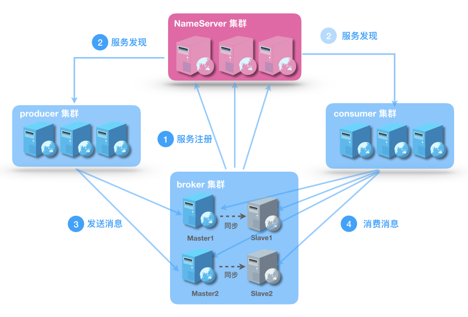
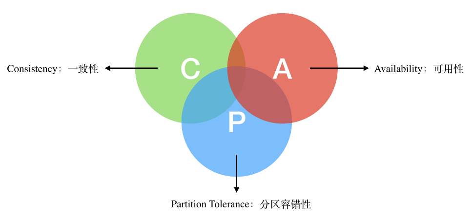
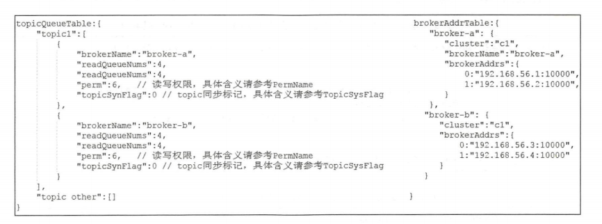
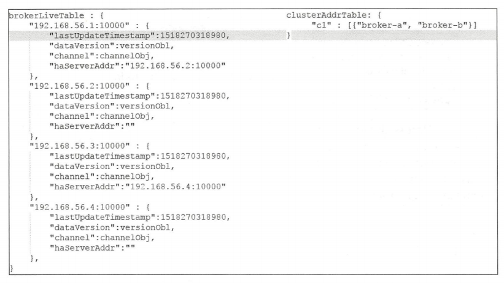
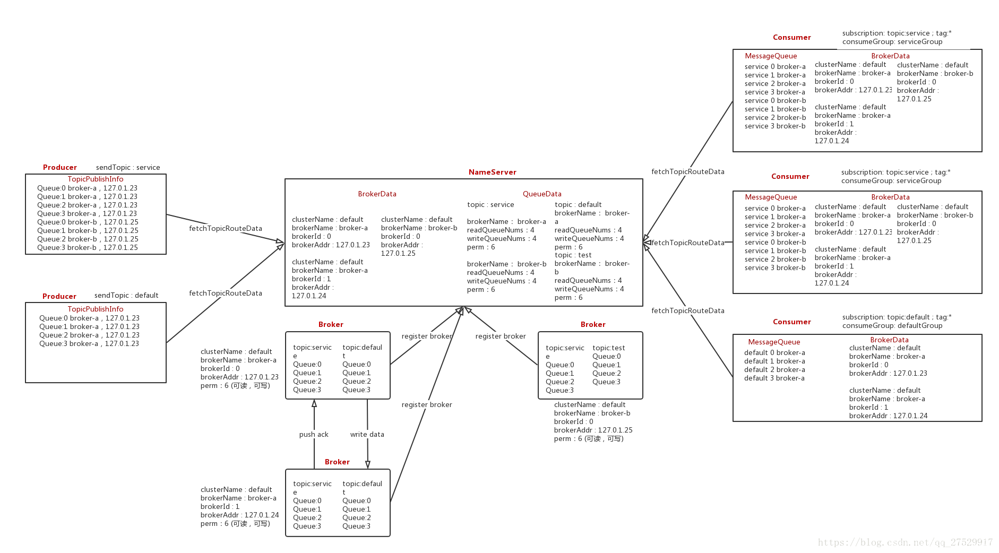

# RocketMQ NameServer 详解

## 一、简介

### 1.前言

NameServer 是类似于 Zookeeper 的分布式服务治理可单独部署的模块。主要负责管理集群的路由信息，包括 Topic 队列信息和 Broker 地址信息。

先来讲讲什么是分布式系统的服务治理？

服务治理在分布式系统的构建中是类似血液一样的存在。随着分布式系统服务的越来越多，而每个服务都可以横向扩展出多个机器，因此服务的各种状况都可能出现。服务可能出现某台机器宕机，如果用户的请求刚好打到宕机的机器，就会造成服务不可用；当提供服务的机器发生变化，也需要将机器的调用 IP 通知服务的调用方。另外当服务的主机有多台的时候，如何负载均衡地分发请求也是需要考虑的。

**<font color="red">服务治理具体为服务注册和服务发现</font>**。它作为一个管理中心一样的存在，解耦 provider 和 consumer，需要分布式强一致性的存储服务的IP地址以及端口。目前业界常见的产品为 Zookeeper，Zookeeper 使用 Paxos 保证强一致性。

在同一个分布式集群中的进程或服务，互相感知并建立连接，这就是服务发现。服务发现最明显的优点就是零配置，不用使用硬编码的网络地址，只需服务的名字，就能使用服务。在现代体系架构中，单个服务实例的启动和销毁很常见，所以应该做到无需了解整个架构的部署拓扑，就能找到整个实例。复杂的服务发现组件要提供更多的功能，例如服务元数据存储，监控监控，多种查询和实时更新等。

在服务治理之前，RPC 调用使用点对点方式，完全通过人为进行配置操作决定，运维成本高且容易出错，且整个系统运行期间的服务稳定性也无法很好感知。因此需要设计出包含基本功能服务的自动注册，客户端的自动发现，变更下发的服务治理。

### 2.NameServer 简介

NameServer 是专为 RocketMQ 设计的轻量级名称服务，具有简单、可集群横向扩展、无状态，节点之间互不通信等特点。整个 Rocketmq 集群的工作原理如下图所示：

<div align="center">
    
</div>

可以看到，Broker 集群、Producer 集群、Consumer 集群都需要与 NameServer 集群进行通信：

#### 2.1 Broker 集群

Broker 用于接收生产者发送消息，或者消费者消费消息的请求。一个 Broker 集群由多组 Master/Slave 组成，Master 可写可读，Slave 只可以读，Master 将写入的数据同步给Slave。**<font color="red">每个 Broker 节点，在启动时，都会遍历 NameServer 列表，与每个 NameServer 建立长连接，注册自己的信息，之后定时上报</font>**。

#### 2.2 Producer 集群

消息的生产者，通过 NameServer 集群获得 Topic 的路由信息，包括 Topic 下面有哪些 Queue，这些 Queue 分布在哪些 Broker 上等（即后面会说到的 QueueData）。Producer 只会将消息发送到 Master 节点上，因此只需要与 Master 节点建立连接。

#### 2.3 Consumer 集群

消息的消费者，通过 NameServer 集群获得 Topic 的路由信息，连接到对应的 Broker 上消费消息。**<font color="red">注意，由于 Master 和 Slave 都可以读取消息，因此 Consumer 会与对应的 Master 和 Slave 都建立连接</font>**。 

**<font color="red">NameServer 的主要作用是为消息生产者和消息消费者提供关于主题 Topic 的路由信息</font>**，那么 NameServer 需要存储路由的基础信息，还要能够管理 Broker 节点，包括路由注册、路由删除等功能。Broker 消息服务器在启动时向所有的 NameServer 注册，消息生产者（Producer）在发送消息之前先从 NameServer 获取 Broker 服务器地址列表，然后根据负载算法从列表中选择一台消息服务器进行消息发送。NameServer 与每台 Broker 服务器保持长连接，并且间隔 30s 检测 Broker 是否存活，如果检测到 Broker 宕机，则从路由表中将其移除。但是这个路由变化不会马上通知消息生产者，这么设计是为了降低 NameServer 实现的复杂性，在消息发送端提供了容错机制来保证消息发送的高可用性。

NameServer 本身的高可用可以通过部署多台 NameServer 服务器来实现，但是彼此之间互不通信，也就是 NameServer 服务器之间在某一时刻的数据并不会完全相同，但是这对于消息发送不会造成任何影响。Rocketmq NameServer 追求简单高效。

RocketMQ 基于订阅发布机制，一个 Topic 拥有多个消息队列，一个 Broker 为每一主题 topic 默认创建 4 个读队列 4 个写队列。多个 Broker 组成一个集群，也就是由 BrokerName 相同的多台 Broker 组成 Master-Slave 架构。brokerId 为 0 代表 Master，大于 0 表示 Slave。BrokerLivelnfo 中的 lastUpdateTimestamp 存储上次收到 Broker 心跳包的时间。

### 3.为什么要使用 NameServer

目前可以作为服务发现组件有很多，如 etcd、consul，zookeeper 等。

那么为什么 rocketmq 选择自己开发一个 NameServer，而不是使用这些开源组件呢？特别的， RocketMQ 设计之初时参考的另一款消息中间件 Kafka 就使用了 Zookeeper，Zookeeper 其提供了 Master 选举、分布式锁、数据的发布和订阅等诸多功能。

事实上，在 RocketMQ 的早期版本，即 MetaQ 1.x 和 MetaQ 2.x 阶段，也是依赖 Zookeeper 的。但 MetaQ 3.x（即 RocketMQ）却去掉了 ZooKeeper 依赖，转而采用自己的 NameServer。

**<font color="red">而 RocketMQ 的架构设计决定了只需要一个轻量级的元数据服务器就足够了，只需要保持最终一致，而不需要 Zookeeper 这样的强一致性解决方案。同时不再依赖另一个中间件，从而减少整体维护成本</font>**。敏锐的同学肯定已经意识到了，根据 CAP 理论，RocketMQ 在名称服务这个模块的设计上选择了 AP，而不是 CP： 

<div align="center">
    
</div>

- 一致性(Consistency)：NameServer 集群中的多个实例，彼此之间是不通信的，这意味着某一时刻，不同实例上维护的元数据可能是不同的，客户端获取到的数据也可能是不一致的。
- 可用性(Availability)：只要不是所有 NameServer 节点都挂掉，且某个节点可以在指定之间内响应客户端即可。
- 分区容错(Partiton Tolerance)：对于分布式架构，网络条件不可控，出现网络分区是不可避免的，只要保证部分 NameServer 节点网络可达，就可以获取到数据。具体看公司如何实施，例如：为了实现跨机房的容灾，可以将 NameServer 部署的不同的机房，某个机房出现网络故障，其他机房依然可用，当然 Broker集群/Producer集群/Consumer集群也要跨机房部署。

## 二、NameServer 主要作用以及源码分析

NameServer 的主要作用就是三个方面：路由注册、路由删除以及路由发现，下面将会结合源代码来具体分析这三个功能。

### 1.路由元信息

NameServer 路由实现的核心类：org.apache.rocketmq.namesrv.routeinfo.RouteInfoManager，在其中保存了路由的元信息，具体如下：

```java{.line-numbers}
public class QueueData implements Comparable<QueueData> {
    private String brokerName;
    private int readQueueNums;
    private int writeQueueNums;
    private int perm;
    private int topicSynFlag;
}

public class BrokerData implements Comparable<BrokerData> {
    private String cluster;
    private String brokerName;
    private HashMap<Long/* brokerId */, String/* broker address */> brokerAddrs;
}

class BrokerLiveInfo {
    private long lastUpdateTimestamp;
    private DataVersion dataVersion;
    private Channel channel;
    private String haServerAddr;
} 

public class RouteInfoManager {
    private final HashMap<String/* topic */, List<QueueData>> topicQueueTable;
    private final HashMap<String/* brokerName */, BrokerData> brokerAddrTable;
    private final HashMap<String/* clusterName */, Set<String/* brokerName */>> clusterAddrTable;
    private final HashMap<String/* brokerAddr */, BrokerLiveInfo> brokerLiveTable;
    private final HashMap<String/* brokerAddr */, List<String>/* Filter Server */> filterServerTable;
}
```

**1) topicQueueTable**

topicQueueTable 记录了一个 topic 对应的消息队列信息，比如 topic 对应的消息队列位于哪些 Broker 上，以及在这些 Broker 上有多少个读队列和写队列。topicQueueTable 的 value 是一个 QueueData 队列，队列的长度等于这个 topic 数据存储到的 Master Broker 的个数，QueueData 里面存储着 Broker 的名称，读写 queue 的数量，同步标识。

**2) brokerAddrTable**

broker 基础信息，包含 broker 所属集群名称，brokerName，以及主备 Broker 地址相同名称的 Broker 可能存在多台机器，一个 Master 和多个 Slave。

**3) clusterAddrTable**

Broker 集群信息，存储集群中所有 Broker 名称

**4) brokerLiveTable**

Broker 状态信息，包括上次收到 Broker 发送过来心跳包的时间以及和 Broker 的连接 Channel, NameServer 每次收到心跳包时会替换该信息 lastUpdateTimestamp。key 是 brokerAddr，也就是对应着一台机器，brokerLiveTable 存储的内容是这台 Broker 机器的实时状态，包括上次更新状态的时间戳，NameServer 会定期检查这个时间戳，超时没有更新就认为这个 Broker 无效了，将其从 Broker 列表里清除。

**5) filterServerTable**

Broker 上的 FilterServer 列表，用于类模式消息过滤

上面 topicQueueTable 和 brokerAddrTable 的运行时内存结构如下所示：

<div align="center">
    
</div>

brokerLiveTable 和 clusterAddrTable 的运行时内存结构如下所示：

<div align="center">
    
</div>

Broker、NameServer、Producer、Consumer 四者之间的交互过程如下：

<div align="center">
    
</div>

### 2.路由注册

#### 2.1 简介

 对于 Zookeeper、Etcd 这样强一致性组件，数据只要写到主节点，内部会通过状态机将数据复制到其他节点，Zookeeper 使用的是 Zab 协议，etcd 使用的是 raft 协议。

但是 NameServer 节点之间是互不通信的，无法进行数据复制。RocketMQ 采取的策略是，在Broker 节点在启动的时候，轮训 NameServer 列表，与每个 NameServer 节点建立长连接，发起注册请求。NameServer 内部会维护一个 Broker 表，用来动态存储 Broker 的信息。

同时，Broker 节点为了证明自己是存活的，会将最新的信息上报给 NameServer，然后每隔 30 秒向 NameServer 发送心跳包，心跳包中包含 BrokerId、Broker地址、Broker名称、Broker 所属集群名称等等，然后 NameServer 接收到心跳包后，会更新时间戳，记录这个 Broker 的最新存活时间。

NameServer 在处理心跳包的时候，存在多个 Broker 同时操作一张 Broker 表，为了防止并发修改 Broker 表导致不安全，路由注册操作引入了 ReadWriteLock 读写锁，这个设计亮点允许多个消息生产者并发读，保证了消息发送时的高并发，但是同一时刻 NameServer 只能处理一个 Broker 心跳包，多个心跳包串行处理。这也是读写锁的经典使用场景，即读多写少。

#### 2.2 Broker 发送心跳包进行注册

Broker 通过发送心跳包的方式将自己的信息注册到每一个 NameServer 上。具体的方式是在 BrokerController#start 方法中的 registerBrokerAll 方法，并且随后开启一个定时线程，每隔 30s 将这个 Broker 的基础信息发送到所有的 NameServer 上。

```java{.line-numbers}
// BrokerController#start
public void start() throws Exception {
    // 将此 Broker 的信息注册到所有的 NameServer 上
    this.registerBrokerAll(true, false);
    
    this.scheduledExecutorService.scheduleAtFixedRate(new Runnable() {
        @Override
        public void run() {
            try {
                // Broker 每隔 30s 向【所有的】 NameServer 发送心跳包
                BrokerController.this.registerBrokerAll(true, false);
            } catch (Throwable e) {
                log.error("registerBrokerAll Exception", e);
            }
        }
    }, 1000 * 10, 1000 * 30, TimeUnit.MILLISECONDS);
} 
```

BrokerController 中的 registerBrokerAll 方法如下所示：

```java{.line-numbers}
// BrokerController#registerBrokerAll
public synchronized void registerBrokerAll(final boolean checkOrderConfig, boolean oneway) {

    TopicConfigSerializeWrapper topicConfigWrapper = this.getTopicConfigManager().buildTopicConfigSerializeWrapper();

    // 省略代码

    RegisterBrokerResult registerBrokerResult = this.brokerOuterAPI.registerBrokerAll(
        this.brokerConfig.getBrokerClusterName(),
        this.getBrokerAddr(),
        this.brokerConfig.getBrokerName(),
        this.brokerConfig.getBrokerId(),
        // 将此 Broker 的 haMasterAddress 地址也注册到 NameServer 上
        this.getHAServerAddr(),
        topicConfigWrapper,
        this.filterServerManager.buildNewFilterServerList(),
        oneway,
        this.brokerConfig.getRegisterBrokerTimeoutMills());

    if (registerBrokerResult != null) {
        // 1.如果此 Broker 是 MASTER 的话，updateMasterHAServerAddrPeriodically 就为 false
        // 2.如果此 Broker 是 SLAVE 的话，
        //     i.如果配置了 haMasterAddress 的话，updateMasterHAServerAddrPeriodically 为 false，表明不会从 NameServer
        //     上获取 haMasterAdress 地址，所以这里注册结果中的 haMasterAddress 的值直接会被忽略
        //     ii.如果没有配置 haMasterAddress 的话，就会从 NameServer 上获取到 haMasterAddress 地址，并且将其通过
        //     messageStore.updateHaMasterAddress 保存到 HAClient 中用于连接 Master 进行主从同步
        if (this.updateMasterHAServerAddrPeriodically && registerBrokerResult.getHaServerAddr() != null) {
            this.messageStore.updateHaMasterAddress(registerBrokerResult.getHaServerAddr());
        }

        this.slaveSynchronize.setMasterAddr(registerBrokerResult.getMasterAddr());

        if (checkOrderConfig) {
            this.getTopicConfigManager().updateOrderTopicConfig(registerBrokerResult.getKvTable());
        }
    }
} 
```

在 BrokerOuterAPI 类中的 registerBrokerAll 方法中真正将 Broker 的信息注册到所有的 NameServer 上面。首先遍历 NameServer 列表，然后向每个 NameServer 发送一个请求，将 Broker 的基础信息保存到 NameServer 中。RocketMQ 网络传输基于 Netty。每一个请求，RocketMQ 都会定义一个 RequestCode，然后在服务端会对应相应的网络处理器（processor 包中）。只需整库搜索 questCode 即可找到相应的处理逻辑。这里发送心跳包的 RequestCode 为 REGISTER_BROKER，由 NameSever 的 DefaultMessageProcessor 进行处理。

```java{.line-numbers}
// BrokerOuterAPI#registerBrokerAll
public RegisterBrokerResult registerBrokerAll(final String clusterName, final String brokerAddr, final String brokerName, 
        final long brokerId, final String haServerAddr, final TopicConfigSerializeWrapper topicConfigWrapper, 
        final List<String> filterServerList, final boolean oneway, final int timeoutMills) {

    RegisterBrokerResult registerBrokerResult = null;

    List<String> nameServerAddressList = this.remotingClient.getNameServerAddressList();
    if (nameServerAddressList != null) {
        // 遍历 NameServer 的列表，Broker 依次向 NameServer 发送心跳包
        for (String namesrvAddr : nameServerAddressList) {
            try {
                // 向 NameServer 发送一个 RequestCode 为 REGISTER_BROKER 的请求，由 NameServer 上的 DefaultRequestProcessor 进行处理
                RegisterBrokerResult result = this.registerBroker(namesrvAddr, clusterName, brokerAddr, brokerName, brokerId, 
                        haServerAddr, topicConfigWrapper, filterServerList, oneway, timeoutMills);

                if (result != null) {
                    registerBrokerResult = result;
                }

                log.info("register broker to name server {} OK", namesrvAddr);
            } catch (Exception e) {
                log.warn("registerBroker Exception, {}", namesrvAddr, e);
            }
        }
    }

    return registerBrokerResult;
} 
```

#### 2.3 NameServer 处理心跳包

在 NameServer 上只注册了一个 Processor，就是 DefaultRequestProcessor，由这个 Processor 来处理所有发送带 NameServer 的请求。DefaultRequestProcessor 网络处理器解析请求类型，如果请求类型为 RequestCode REGISTER_BROKER ，则请求最终转发到 RoutelnfoManager#registerBroker；同样如果请求类型为 RequestCode.UNREGISTER_BROKER，那么就会将请求转发到 RoutelnfoManager#unregisterBroker。

```java{.line-numbers}
// DefaultRequestProcessor#processRequest
// 根据 processRequest() 方法分析源码，发现接收到的所有请求操作的数据都保存在 KVConfigManager 和 RouteInfoManager 类中，
// 所有的操作都是对 KVConfigManager 和 RouteInfoManager 类的操作。
public RemotingCommand processRequest(ChannelHandlerContext ctx, RemotingCommand request) throws Exception {
    if (log.isDebugEnabled()) {
        log.debug("receive request, {} {} {}");
    }

    switch (request.getCode()) {

    // ignore code

    case RequestCode.REGISTER_BROKER:
        Version brokerVersion = MQVersion.value2Version(request.getVersion());
        if (brokerVersion.ordinal() >= MQVersion.Version.V3_0_11.ordinal()) {
            return this.registerBrokerWithFilterServer(ctx, request);
        } else {
            // org.apache.rocketmq.namesrv processor.DefaultRequestProcessor 网络处理器解析请求类型，
            // 如果请求类型为 RequestCode REGISTER_BROKER ，则请求最终转发到 RoutelnfoManager#registerBroker
            return this.registerBroker(ctx, request);
        }
    case RequestCode.UNREGISTER_BROKER:
        return this.unregisterBroker(ctx, request);

    // ignore code

    case RequestCode.GET_NAMESRV_CONFIG:
        return this.getConfig(ctx, request);
    default:
        break;
    }
    
    return null;
} 
```

RouteInfoManager#registerBroker 方法的源代码如下，NameServer 与 Broker 保持长连接，Broker 状态存储在 brokerLiveTable 中，NameServer 每收到一个心跳包，将更新 brokerLiveTable 中关于 Broker 的状态信息以及路由表（ topicQueueTable、brokerAddrTable、brokerLiveTabl、filterServerTable）。更新上述路由表使用了锁粒度较少的读写锁，允许多个消息消费者（Consumer）并发读，保证消息发送时的高并发，但同一时刻 NameServer 只处理一个 Broker 心跳包，多个心跳包请求串行执行 这也是读写锁经典使用场景。

```java{.line-numbers}
// RouteInfoManager#registerBroker
public RegisterBrokerResult registerBroker(final String clusterName, final String brokerAddr, final String brokerName, 
        final long brokerId, final String haServerAddr, final TopicConfigSerializeWrapper topicConfigWrapper, final List<String> filterServerList,
        final Channel channel) {

    RegisterBrokerResult result = new RegisterBrokerResult();

    try {
        try {
            // 路由注册需要加写锁，防止并发修改 RouteInfoManager 中的路由表
            this.lock.writeLock().lockInterruptibly();

            /** 更新 clusterAddrTable 对象 */

            // 首先判断 Broker 所属的集群是否存在，如果不存在，则创建，然后将 Broker 名称加入到集群 Broker 集合中
            Set<String> brokerNames = this.clusterAddrTable.get(clusterName);
            if (null == brokerNames) {
                brokerNames = new HashSet<String>();
                this.clusterAddrTable.put(clusterName, brokerNames);
            }
            brokerNames.add(brokerName);

            boolean registerFirst = false;
            
            /** 更新 brokerAddrTable 对象 */

            // 维护 BrokerData 信息，首先从 brokerAddrTable 根据 BrokerName 尝试获取 Broker 信息，
            // 如果不存在，新建 BrokerData 并放入到 brokerAddrTable，registerFirst 设置为 true；
            // 如果存在，直接替换原先的 Broker 地址信息，registerFirst 设置为 false，表示非第一次注册；
            BrokerData brokerData = this.brokerAddrTable.get(brokerName);
            if (null == brokerData) {
                registerFirst = true;
                brokerData = new BrokerData(clusterName, brokerName, new HashMap<Long, String>());
                this.brokerAddrTable.put(brokerName, brokerData);
            }
            String oldAddr = brokerData.getBrokerAddrs().put(brokerId, brokerAddr);
            registerFirst = registerFirst || (null == oldAddr);

            /** 更新 topicQueueTable 对象 */

            // 如果这个 Broker 是 Master，并且满足以下两个条件时，会创建当前 Broker 的 QueueData 信息：
            // 1.这个心跳信息是该 Broker 的第一次心跳
            // 2.Broker 的 topic 信息发生了变化，这时会用新的 QueueData 对象去取代旧的 QueueData 对象
            if (null != topicConfigWrapper && MixAll.MASTER_ID == brokerId) {
                if (this.isBrokerTopicConfigChanged(brokerAddr, topicConfigWrapper.getDataVersion()) || registerFirst) {
                    ConcurrentMap<String, TopicConfig> tcTable = topicConfigWrapper.getTopicConfigTable();
                    if (tcTable != null) {
                        for (Map.Entry<String, TopicConfig> entry : tcTable.entrySet()) {
                            // 在下面这个方法中会创建或者更新 topicQueueTable 对象
                            this.createAndUpdateQueueData(brokerName, entry.getValue());
                        }
                    }
                }
            }

            /** 更新 brokerLiveTable 对象 */

            // 更新 BrokerLiveInfo，也就是存活的 Broker 信息表，BrokerLiveInfo 是执行路由删除的重要依据
            BrokerLiveInfo prevBrokerLiveInfo = this.brokerLiveTable.put(brokerAddr, new BrokerLiveInfo(
                    System.currentTimeMillis(), topicConfigWrapper.getDataVersion(), channel, haServerAddr));

            if (null == prevBrokerLiveInfo) {
                log.info("new broker registered, {} HAServer: {}", brokerAddr, haServerAddr);
            }

            // 注册 Broker 的 Filter Server 地址列表，一个 Broker 上会关联多个 FilterServer 消息过滤服务器，
            if (filterServerList != null) {
                if (filterServerList.isEmpty()) {
                    this.filterServerTable.remove(brokerAddr);
                } else {
                    this.filterServerTable.put(brokerAddr, filterServerList);
                }
            }

            // 如果此 Broker 为从节点，则获取到 Master Broker 的地址，然后通过 masterAddr 的地址获取到 HaServerAddress 的地址
            // 并且将其设置到 result 中再返回，让 Broker 从节点可以知道到哪个地址去进行主从同步
            if (MixAll.MASTER_ID != brokerId) {
                String masterAddr = brokerData.getBrokerAddrs().get(MixAll.MASTER_ID);
                if (masterAddr != null) {
                    BrokerLiveInfo brokerLiveInfo = this.brokerLiveTable.get(masterAddr);
                    if (brokerLiveInfo != null) {
                        // 设置 Master 的 HaServerAddress 到结果中
                        result.setHaServerAddr(brokerLiveInfo.getHaServerAddr());
                        result.setMasterAddr(masterAddr);
                    }
                }
            }
        } finally {
            this.lock.writeLock().unlock();
        }
    } catch (Exception e) {
        log.error("registerBroker Exception", e);
    }

    return result;
} 
```

在上面的 RouteInfoManager#registerBroker 方法中，注册了一个 Broker 会使用这个 Broker 的 BrokerId，BrokerName，BrokerAddr 等信息更新路由表。在这里要特别注意一个信息就是 haServerAddr 比较特殊，具体的介绍放在下一小节中。

#### 2.4 haMasterAddress

在 Broker 启动的时候，会监听 3 个端口：

- 第一个是用户可以在配置文件中配置的 listenPort，默认值为 10911，由 RemotingServer 组件来使用
-  第二个是 haListenPort =  listenPort + 1，默认值为 10912，由 HAService 组件来使用，这个 haListenPort 只能用来进行主从同步操作
- 第三个是 listenPort - 2，默认是10909，由 fastRemotingServer 组件来使用

以上 RemotingServer 和 fastRemotingServer 的主要区别如下：

- Broker端：remotingServer 可以处理客户端所有请求，如：生产者发送消息的请求，消费者拉取消息的请求。fastRemotingServer 功能基本与 remotingServer 相同，唯一不同的是不可以处理消费者拉取消息的请求。**<font color="red">Broker 在向 NameServer 注册时，只会上报 remotingServer 监听的 listenPort 端口</font>**。
- 客户端：客户端的 DefaultMQProducer 和 DefaultMQPushConsumer 根据是否开启 vipChannelEnabled 字段，来决定将消息发送给 fastRemotingServer 还是 remotingServer。从字面意思看。vipChannelEnabled  用于控制是否开启 VIP 通道，如果为true，生产者发送的消息会请求 fastRemotingServer，否则请求 remotingServer。在RocketMQ 4.5.0及之前，vipChannelEnabled字段值默认为true。在RocketMQ 4.5.1之后，修改为了false。可以通过JVM参数 -Dcom.rocketmq.sendMessageWithVIPChannel=false，来修改这个默认值。

对于 haListenPort 是 rocketmq 自动生成，用户自己无法配置。不过用户可以配置 haMasterAddress 属性。haMasterAddress 是用来进行主从同步的地址，只不过是 Slave 用来连接 Master 的。而 haListenPort 是 Master 的一个监听端口，用于监听 Slave 的主从同步请求。 对于 Master 和 Slave 来说，这两个属性的作用分别如下：

**1）Slave**

**<font color="red">如果一个 Slave Broker 机器配置了 haMasterAddress 属性，那么这个 Broker 就不会去 NameServer 拉取 haMasterAddress 地址</font>**（在代码中是 haServerAddr），在下面的代码中就是将 updateMasterHAServerAddrPeriodically  设置为 false，然后这个 Broker 会将 haMasterAddress 设置到 HAClient 中的 masterAddress（BrokerController#initialize 方法），在之后使用这个地址连接 Master（connectMaster）。

Slave Broker 每隔 30s 会向 NameServer 发送一个心跳包，包含一些基础信息，这个其实就是把此 Broker 的信息注册到 NameSever 上。发送完心跳包之后返回的结果中有一个 haServerAddr，这个地址就是从 NameServer 中获取到的 haMasterAddress，其实就是和 Slave Broker 的 BrokerName 相同的 Master Broker 的用于监听主从同步的地址（ip + haListenPort）。注意这里不是 Master Broker 的地址（ip + listenPort）。当然，如果 Slave Broker 设置了 haMasterAddress，那么这个从 NameSever 获取到的 haServerAddr 就会直接被忽略（在上面的 BrokerController#registerBroker 方法）。

如果一个 Slave Broker 机器没有配置 haMasterAddress，那么就必须得从 NameServer 上获取 haMasterAddress，也就是在发送心跳包到 NameServer 之后，根据前面所说的返回结果中的 haServerAddr 属性，来连接 Master Broker，进行主从同步。

**2) Master**

对于 Master Broker 来说，haMasterAddress 配置会被直接忽略掉，并且updateMasterHAServerAddrPeriodically  属性一直为 false，也不会从 NameServer 上获取到地址（从 RouteInfoManager#registerBroker 方法可以看出）。对于 Master Broker 来说有效的是 haListenPort 属性（用户不可自己配置），haListenPort = listenPort + 1。Master Broker 在 HAService#AcceptSocketService 服务线程中会监听 haListenPort 端口，等待 Slave Broker 发送过来的主从同步请求。

```java{.line-numbers}
// BrokerController#initialize
public boolean initialize() throws CloneNotSupportedException {

    // 省略代码

    // 这个 Broker 是 SLAVE 的话
    if (BrokerRole.SLAVE == this.messageStoreConfig.getBrokerRole()) {
        /**
         * 如果用户自己在配置文件中配置了 haMasterAddress 属性，并且合法的话
         * 就将此 haMasterAddress 最终设置成为 HAClient 中的 masterAddress，并且不会从 NameServer 上获取 haMasterAddress 的地址。
         * 在 HAClient 启动的时候，就直接连接此 masterAddress 的地址，然后每隔 5s，此 SLAVE Broker 就会发送一个心跳包给对应的 MASTER，
         * 其中包含一个 slave offset，表示 SLAVE 已经接收到的消息的偏移量
         */
        if (this.messageStoreConfig.getHaMasterAddress() != null && this.messageStoreConfig.getHaMasterAddress().length() >= 6) {
            this.messageStore.updateHaMasterAddress(this.messageStoreConfig.getHaMasterAddress());
            this.updateMasterHAServerAddrPeriodically = false;
        } else {
            this.updateMasterHAServerAddrPeriodically = true;
        }

        this.scheduledExecutorService.scheduleAtFixedRate(new Runnable() {

            @Override
            public void run() {
                try {
                    BrokerController.this.slaveSynchronize.syncAll();
                } catch (Throwable e) {
                    log.error("ScheduledTask syncAll slave exception", e);
                }
            }
        }, 1000 * 10, 1000 * 60, TimeUnit.MILLISECONDS);
    } else {
        this.scheduledExecutorService.scheduleAtFixedRate(new Runnable() {

            @Override
            public void run() {
                try {
                    BrokerController.this.printMasterAndSlaveDiff();
                } catch (Throwable e) {
                    log.error("schedule printMasterAndSlaveDiff error.", e);
                }
            }
        }, 1000 * 10, 1000 * 60, TimeUnit.MILLISECONDS);
    }

    return result;
} 
```

### 3.路由删除

RocktMQ 有 3 个触发点来触发路由删除：

1. NameServer 定时扫描 brokerLiveTable 检测上次心跳包与当前系统时间的时间差，如果时间戳大于 120s ，则需要移除该 Broker 信息。
2. Broker 在正常被关闭的情况下（执行 BrokerController#shutdown 方法），会执行 unregisterBroker 指令，向 NameServer 发出 UNREGISTER_BROKER 请求，由 NameServer 进行处理，从路由表中删除 Broker 的信息。
3. NameServer 与 Broker 之间的连接发生异常而不正常关闭时，会触发 RouteInfoManager 的 onChannelDestory 方法来删除路由。这种方法主要和 BrokerHousekeepingService 属性有关。

由于不管是何种方式触发的路由删除，路由删除的方法都是一样的，就是从 topicQueueTable、brokerAddrTable、brokerLiveTable、filterServerTable 这些路由表中删除与该 Broker 相关的信息。我们这里只介绍相关的第一种和第三种情况。对于第一种情况，在 RouteInfoManager 类中扫描 Broker 的状态的代码如下：

```java{.line-numbers}
// RouteInfoManager#scanNotActiveBroker
public void scanNotActiveBroker() {
    Iterator<Entry<String, BrokerLiveInfo>> it = this.brokerLiveTable.entrySet().iterator();
    while (it.hasNext()) {
        Entry<String, BrokerLiveInfo> next = it.next();
        long last = next.getValue().getLastUpdateTimestamp();
        // 判断现在距离上次收到 Broker 发送的心跳包的时间是否已经过去了 120s
        if ((last + BROKER_CHANNEL_EXPIRED_TIME) < System.currentTimeMillis()) {
            // 如果超时了，则关闭掉和 Broker 的连接
            RemotingUtil.closeChannel(next.getValue().getChannel());
            it.remove();
            log.warn("The broker channel expired, {} {}ms", next.getKey(), BROKER_CHANNEL_EXPIRED_TIME);
            this.onChannelDestroy(next.getKey(), next.getValue().getChannel());
        }
    }
} 
```

如果 RouteInfoManager 检测到了 Broker 已经有 120s 没有检测到 Broker 发送过来的心跳包，就会把将此 Broker 先从 brokerLiveTable 中删除，然后再在 onChannelDestory 方法中从topicQueueTable，brokerAddrTable，brokerLiveTable，filterServerTable 这四个路由表中删除掉这个 Broker 的信息。

```java{.line-numbers}
// 执行具体的删除逻辑，也就是从
// brokerLiveTable、filterServerTable、clusterAddrTable、topicQueueTable、brokerAddrTable
// 中移除掉已经超时的 Broker，维护上述 table 的一致性
public void onChannelDestroy(String remoteAddr, Channel channel) {
    String brokerAddrFound = null;
    if (channel != null) {
        try {
            try {
                // 获取写锁
                this.lock.readLock().lockInterruptibly();
                Iterator<Entry<String, BrokerLiveInfo>> itBrokerLiveTable = this.brokerLiveTable.entrySet().iterator();
                // 遍历 brokerLiveTable，获取到和此 channel 对应的 broker 地址
                while (itBrokerLiveTable.hasNext()) {
                    Entry<String, BrokerLiveInfo> entry = itBrokerLiveTable.next();
                    if (entry.getValue().getChannel() == channel) {
                        brokerAddrFound = entry.getKey();
                        break;
                    }
                }
            } finally {
                this.lock.readLock().unlock();
            }
        } catch (Exception e) {
            log.error("onChannelDestroy Exception", e);
        }
    }

    if (null == brokerAddrFound) {
        brokerAddrFound = remoteAddr;
    } else {
        log.info("the broker's channel destroyed, {}, clean it's data structure at once", brokerAddrFound);
    }

    if (brokerAddrFound != null && brokerAddrFound.length() > 0) {
        try {
            try {
                this.lock.writeLock().lockInterruptibly();
                // 从 brokerLiveTable 中删除此 broker 地址的 BrokerLiveInfo
                this.brokerLiveTable.remove(brokerAddrFound);
                // 从 filterServerTable 中删除此 broker 地址中的 FilterServer
                this.filterServerTable.remove(brokerAddrFound);
                String brokerNameFound = null;
                boolean removeBrokerName = false;
                Iterator<Entry<String, BrokerData>> itBrokerAddrTable = this.brokerAddrTable.entrySet().iterator();

                // 维护 brokerAddrTable。遍历 HashMap<String /* brokerName */, BrokerData> brokerAddrTable，
                // 从 BrokerData 的 HashMap<Long/* brokerId */， String /*broker address */> brokerAddr 中，找到具体的 Broker ，
                // 从 BrokerData 中移除，如果移除后在 BrokerData 不再包含其 Broker，则 brokerAddrTable 中移除该
                // brokerName 对应的 Broker 条目
                while (itBrokerAddrTable.hasNext() && (null == brokerNameFound)) {
                    BrokerData brokerData = itBrokerAddrTable.next().getValue();

                    Iterator<Entry<Long, String>> it = brokerData.getBrokerAddrs().entrySet().iterator();

                    while (it.hasNext()) {
                        Entry<Long, String> entry = it.next();
                        Long brokerId = entry.getKey();
                        String brokerAddr = entry.getValue();
                        if (brokerAddr.equals(brokerAddrFound)) {
                            brokerNameFound = brokerData.getBrokerName();
                            it.remove();
                            log.info("remove brokerAddr[{}, {}] from brokerAddrTable, because channel destroyed");
                            break;
                        }
                    }

                    if (brokerData.getBrokerAddrs().isEmpty()) {
                        removeBrokerName = true;
                        itBrokerAddrTable.remove();
                        log.info("remove brokerName[{}] from brokerAddrTable, because channel destroyed");
                    }
                }

                // 根据 BrokerName ，从 clusterAddrTable 中找到 Broker 并从集群中移除。如果移除后，集群中不包含任何
                // Broker，则将该集群从 clusterAddrTable 中移除
                if (brokerNameFound != null && removeBrokerName) {
                    Iterator<Entry<String, Set<String>>> it = this.clusterAddrTable.entrySet().iterator();
                    while (it.hasNext()) {
                        Entry<String, Set<String>> entry = it.next();
                        String clusterName = entry.getKey();
                        Set<String> brokerNames = entry.getValue();
                        boolean removed = brokerNames.remove(brokerNameFound);
                        if (removed) {
                            log.info("remove brokerName[{}], clusterName[{}] from clusterAddrTable, because channel destroyed");
                            if (brokerNames.isEmpty()) {
                                log.info("remove the clusterName[{}] from clusterAddrTable, because channel destroyed and no broker in this cluster");
                                it.remove();
                            }
                            break;
                        }
                    }
                }

                // 根据 brokerName ，遍历所有主题的队列，如果队列中包含了当前 Broker 的队列，则移除，如果 topic 只包含待移除 Broker
                // 的队列的话，从路由表中删除该 topic
                if (removeBrokerName) {
                    Iterator<Entry<String, List<QueueData>>> itTopicQueueTable = this.topicQueueTable.entrySet().iterator();
                    while (itTopicQueueTable.hasNext()) {
                        Entry<String, List<QueueData>> entry = itTopicQueueTable.next();
                        String topic = entry.getKey();
                        List<QueueData> queueDataList = entry.getValue();

                        Iterator<QueueData> itQueueData = queueDataList.iterator();
                        while (itQueueData.hasNext()) {
                            QueueData queueData = itQueueData.next();
                            if (queueData.getBrokerName().equals(brokerNameFound)) {
                                itQueueData.remove();
                                log.info("remove topic[{} {}], from topicQueueTable, because channel destroyed");
                            }
                        }

                        if (queueDataList.isEmpty()) {
                            itTopicQueueTable.remove();
                            log.info("remove topic[{}] all queue, from topicQueueTable, because channel destroyed");
                        }
                    }
                }
            } finally {
                // 释放锁，完成了路由删除
                this.lock.writeLock().unlock();
            }
        } catch (Exception e) {
            log.error("onChannelDestroy Exception", e);
        }
    }
}
```

对于第三种情况，先介绍一下 NamesrvController 中的 brokerHousekeepingService 属性。

```java{.line-numbers}
public NamesrvController(NamesrvConfig namesrvConfig, NettyServerConfig nettyServerConfig) {
    this.namesrvConfig = namesrvConfig;
    this.nettyServerConfig = nettyServerConfig;
    this.kvConfigManager = new KVConfigManager(this);
    this.routeInfoManager = new RouteInfoManager();
    this.brokerHousekeepingService = new BrokerHousekeepingService(this);
    this.configuration = new Configuration(
        log,
        this.namesrvConfig, this.nettyServerConfig
    );
    this.configuration.setStorePathFromConfig(this.namesrvConfig, "configStorePath");
} 
```

brokerHousekeepingService 属于 BrokerHousekeepingService 类。

```java{.line-numbers}
public class BrokerHousekeepingService implements ChannelEventListener {
    private static final Logger log = LoggerFactory.getLogger(LoggerName.NAMESRV_LOGGER_NAME);
    private final NamesrvController namesrvController;

    public BrokerHousekeepingService(NamesrvController namesrvController) {
        this.namesrvController = namesrvController;
    }

    @Override
    public void onChannelConnect(String remoteAddr, Channel channel) {
    }

    @Override
    public void onChannelClose(String remoteAddr, Channel channel) {
        this.namesrvController.getRouteInfoManager().onChannelDestroy(remoteAddr, channel);
    }

    @Override
    public void onChannelException(String remoteAddr, Channel channel) {
        this.namesrvController.getRouteInfoManager().onChannelDestroy(remoteAddr, channel);
    }

    @Override
    public void onChannelIdle(String remoteAddr, Channel channel) {
        this.namesrvController.getRouteInfoManager().onChannelDestroy(remoteAddr, channel);
    }
} 
```

BrokerHousekeepingService  实现了 ChannelEventListener，从上面可以看出，当 Netty 检测到连接发生了异常时（比如连接的突然关闭，抛出异常以及空闲），就会调用 onChannelDestory 方法，把这个 Broker 的信息从相关的路由表中清理出去。

### 4.路由发现

路由发现是客户端的行为，这里的客户端主要说的是生产者和消费者。具体来说：

- 对于生产者，可以发送消息到多个 Topic，因此一般是在发送第一条消息时，才会根据 Topic 获取从 NameServer 获取路由信息。
- 对于消费者，订阅的 Topic 一般是固定的，所在在启动时就会拉取。

那么生产者/消费者在工作的过程中，如果路由信息发生了变化怎么处理呢？如：Broker 集群新增了节点，节点宕机或者 Queue 的数量发生了变化。细心的读者注意到，**<font color="red">前面讲解 NameServer 在路由注册或者路由剔除过程中，并不会主动推送会客户端的，这意味着，需要由客户端拉取主题的最新路由信息</font>**。

事实上，RocketMQ 客户端提供了定时拉取 Topic 最新路由信息的机制，这里我们直接结合源码来讲解。DefaultMQProducer 和 DefaultMQConsumer 有一个 pollNameServerInterval 配置项，用于定时从 NameServer 并获取最新的路由表，默认是 30 秒，它们底层都依赖一个 MQClientInstance 类。MQClientInstance 类中有一个 updateTopicRouteInfoFromNameServer 方法，用于根据指定的拉取时间间隔，周期性的的从 NameServer 拉取路由信息。 在拉取时，会把当前启动的 Producer 和 Consumer 需要使用到的 Topic 列表放到一个集合中，逐个从 NameServer 进行更新。

源代码如下：

```java{.line-numbers}
// MQClientInstance#updateTopicRouteInfoFromNameServer
public void updateTopicRouteInfoFromNameServer() {

    // 1 需要更新路由信息的Topic集合
    Set<String> topicList = new HashSet<String>();

    // Consumer
    // 2 添加消费者需要使用到的Topic到集合中
    {
        Iterator<Entry<String, MQConsumerInner>> it = this.consumerTable.entrySet().iterator();
        while (it.hasNext()) {
            Entry<String, MQConsumerInner> entry = it.next();
            MQConsumerInner impl = entry.getValue();
            if (impl != null) {
                Set<SubscriptionData> subList = impl.subscriptions();
                if (subList != null) {
                    for (SubscriptionData subData : subList) {
                        topicList.add(subData.getTopic());
                    }
                }
            }
        }
    }

    // Producer
    // 3 添加生产者需要使用到的topic到集合中
    {
        Iterator<Entry<String, MQProducerInner>> it = this.producerTable.entrySet().iterator();
        while (it.hasNext()) {
            Entry<String, MQProducerInner> entry = it.next();
            MQProducerInner impl = entry.getValue();
            if (impl != null) {
                Set<String> lst = impl.getPublishTopicList();
                topicList.addAll(lst);
            }
        }
    }

    // 4 逐一从NameServer更新每个Topic的路由信息
    for (String topic : topicList) {
        this.updateTopicRouteInfoFromNameServer(topic);
    }
} 
```

然后调用 MQClientAPIImpl 的 getTopicRouteInfoFromNameServer 方法真正向 NameServer 发送拉取路由信息的请求，请求的 RequestCode 为 **`GET_ROUTEINTO_BY_TOPIC`** 。源代码如下：

```java{.line-numbers}
public TopicRouteData getTopicRouteInfoFromNameServer(final String topic, final long timeoutMillis,
    boolean allowTopicNotExist) throws MQClientException, InterruptedException, RemotingTimeoutException, RemotingSendRequestException, RemotingConnectException {
    
    GetRouteInfoRequestHeader requestHeader = new GetRouteInfoRequestHeader();
    requestHeader.setTopic(topic);

    // 设定 RequestCode 为 GET_ROUTEINFO_BY_TOPIC，然后在 NameServer 中由 DefaultRequestProcessor 来进行处理
    RemotingCommand request = RemotingCommand.createRequestCommand(RequestCode.GET_ROUTEINTO_BY_TOPIC, requestHeader);

    RemotingCommand response = this.remotingClient.invokeSync(null, request, timeoutMillis);
    assert response != null;
    switch (response.getCode()) {
        case ResponseCode.TOPIC_NOT_EXIST: {
            if (allowTopicNotExist && !topic.equals(MixAll.DEFAULT_TOPIC)) {
                log.warn("get Topic [{}] RouteInfoFromNameServer is not exist value", topic);
            }
            break;
        }
        case ResponseCode.SUCCESS: {
            byte[] body = response.getBody();
            if (body != null) {
                return TopicRouteData.decode(body, TopicRouteData.class);
            }
        }
        default:
            break;
    }

    throw new MQClientException(response.getCode(), response.getRemark());
} 
```

当 Broker 收到 Producer 发送的消息并判断 **`RequestCode = GET_ROUTINEINFO_BY_TOPIC`** 之后，会调用默认注册的请求处理器（DefaultRequestProcessor）的 getRouteInfoByTopic 方法，该方法根据 Topic 获取对应的 broker 路由信息。然后会调用 RouteInfoManager 的 pickupTopicRouteData 方法来获取到路由信息。

```java{.line-numbers}
// RouteInfoManager#pickupTopicRouteData
public TopicRouteData pickupTopicRouteData(final String topic) {
    TopicRouteData topicRouteData = new TopicRouteData();
    boolean foundQueueData = false;
    boolean foundBrokerData = false;
    Set<String> brokerNameSet = new HashSet<String>();
    List<BrokerData> brokerDataList = new LinkedList<BrokerData>();
    topicRouteData.setBrokerDatas(brokerDataList);

    HashMap<String, List<String>> filterServerMap = new HashMap<String, List<String>>();
    topicRouteData.setFilterServerTable(filterServerMap);

    try {
        try {
            this.lock.readLock().lockInterruptibly();
            List<QueueData> queueDataList = this.topicQueueTable.get(topic);
            if (queueDataList != null) {
                topicRouteData.setQueueDatas(queueDataList);
                foundQueueData = true;

                Iterator<QueueData> it = queueDataList.iterator();
                while (it.hasNext()) {
                    QueueData qd = it.next();
                    brokerNameSet.add(qd.getBrokerName());
                }

                for (String brokerName : brokerNameSet) {
                    BrokerData brokerData = this.brokerAddrTable.get(brokerName);
                    if (null != brokerData) {
                        BrokerData brokerDataClone = new BrokerData(brokerData.getCluster(), brokerData.getBrokerName(), (HashMap<Long, String>) brokerData
                            .getBrokerAddrs().clone());
                        brokerDataList.add(brokerDataClone);
                        foundBrokerData = true;
                        for (final String brokerAddr : brokerDataClone.getBrokerAddrs().values()) {
                            List<String> filterServerList = this.filterServerTable.get(brokerAddr);
                            filterServerMap.put(brokerAddr, filterServerList);
                        }
                    }
                }
            }
        } finally {
            this.lock.readLock().unlock();
        }
    } catch (Exception e) {
        log.error("pickupTopicRouteData Exception", e);
    }

    // 省略代码

    return null;
} 
```

具体的流程就是调用 RouteInfoManager 的方法，从路由表 topicQueueTable、brokerAddrTable、filterServerTable 中分别填充 TopicRouteData 中的 **`List<QueueData>、List<BrokerData>`** 和 filterServer 地址表。


