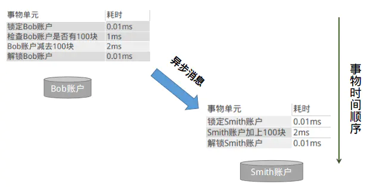

# RocketeMQ 事务消息详解

## 一、事务消费

我们经常支付宝转账余额宝，这是日常生活的一件普通小事，但是我们思考支付宝扣除转账的钱之后，如果系统挂掉怎么办，这时余额宝账户并没有增加相应的金额，数据就会出现不一致状况了。

上述场景在各个类型的系统中都能找到相似影子，比如在电商系统中，当有用户下单后，除了在订单表插入一条记录外，对应商品表的这个商品数量必须减1吧，怎么保证？在搜索广告系统中，当用户点击某广告后，除了在点击事件表中增加一条记录外，还得去商家账户表中找到这个商家并扣除广告费吧，怎么保证等等，相信大家或多或多少都能碰到相似情景。本质上问题可以抽象为：当一个表数据更新后，怎么保证另一个表的数据也必须要更新成功。

如果是单机系统(数据库实例也在同一个系统上)的话，我们可以用本地事务轻松解决：还是以支付宝转账余额宝为例（比如转账 10000 块钱），假设有：

```java{.line-numbers}
支付宝账户表：A（id，userId，amount）
余额宝账户表：B（id，userId，amount）
用户的 userId=1；
```

从支付宝转账1万块钱到余额宝的动作分为两步：

```java{.line-numbers}
1）支付宝表扣除1万：update A set amount=amount-10000 where userId=1;
2）余额宝表增加1万：update B set amount=amount+10000 where userId=1;
```

如何确保支付宝余额宝收支平衡呢？有人说这个很简单嘛，可以用事务解决。

```SQL{.line-numbers}
BEGIN TRANSACTION 
  UPDATE A SET amount=amount-10000 WHERE userId=1;
   UPDATE B SET amount=amount+10000 WHERE userId=1;
END TRANSACTION 
COMMIT; 
```

如果系统规模较小，数据表都在一个数据库实例上，上述本地事务方式可以很好地运行，但是如果系统规模较大，比如支付宝账户表和余额宝账户表显然不会在同一个数据库实例上，他们往往分布在不同的物理节点上，这时本地事务已经失去用武之地。下面我们来看看比较主流的两种方案。

### 1.1 分布式事务----两阶段提交协议

两阶段提交协议（Two-phase Commit，2PC）经常被用来实现分布式事务。一般分为协调器 TC 和若干事务执行者两种角色，这里的事务执行者就是具体的数据库，协调器可以和事务执行器在一台机器上。

<div align="center">
    
</div>

我们根据上面的图来看看主要流程：

1. 我们的应用程序（client）发起一个开始请求到 TC（transaction）；
2. TC 先将 prepare消息 写到本地日志，之后向所有的事务执行者发起 prepare 消息。以支付宝转账到余额宝为例，TC 给 A 的 prepare 消息是通知支付宝数据库相应账目扣款 1 万，TC 给 B 的 prepare 消息是通知余额宝数据库相应账目增加 1w。为什么在执行任务前需要先写本地日志，主要是为了故障后恢复用，本地日志起到现实生活中凭证的效果，如果没有本地日志（凭证），出问题容易死无对证
3. 事务执行者收到 prepare 消息后，执行具体本机事务，但不会进行 commit，如果成功返回 yes，不成功返回 no。同理，返回前都应把要返回的消息写到日志里，当作凭证。
4. TC 收集所有执行器返回的消息，如果所有执行器都返回yes，那么给所有执行器发生送 commit 消息，执行器收到 commit 后执行本地事务的 commit 操作；如果有任一个执行器返回 no，那么给所有执行器发送 abort 消息，执行器收到 abort 消息后执行事务 abort 操作。

注：TC 或事务执行者把发送或接收到的消息先写到日志里，主要是为了故障后恢复用。如某一事务执行者从故障中恢复后，先检查本机的日志，如果已收到 commit，则提交，如果 abort 则回滚。如果是 yes，则再向 TC 询问一下，确定下一步。

不过上述两阶段提交的性能比较差，根本不适合高并发的系统。为什么？

- 两阶段提交涉及多次节点间的网络通信，通信时间太长
- 事务时间相对于变长了，锁定的资源的时间也变长了，造成资源等待时间也增加很多

正是由于分布式事务存在很严重的性能问题，大部分高并发服务都在避免使用，往往通过其他途径来解决数据一致性问题。

### 1.2 使用消息队列来避免分布式事务

如果仔细观察生活的话，生活的很多场景已经给了我们提示。

比如在北京很有名的姚记炒肝点了炒肝并付了钱后，他们并不会直接把你点的炒肝给你，而是给你一张小票，然后让你拿着小票到出货区排队去取。为什么他们要将付钱和取货两个动作分开呢？原因很多，其中一个很重要的原因是为了使他们接待能力增强（并发量更高）。

还是回到我们的问题，只要这张小票在，你最终是能拿到炒肝的。同理转账服务也是如此，当支付宝账户扣除1万后，我们只要生成一个凭证（消息）即可，这个凭证（消息）上写着“让余额宝账户增加1万”，只要这个凭证（消息）能可靠保存，我们最终是可以拿着这个凭证（消息）让余额宝账户增加1万的，即我们能依靠这个凭证（消息）完成最终一致性。

那么我们如何可靠保存凭证（消息）有两种方法：

#### 1.2.1 业务与消息耦合

支付宝在完成扣款的同时，同时记录消息数据，这个消息数据与业务数据保存在同一数据库实例里（消息记录表表名为 message）。

```sql{.line-numbers}
BEGIN TRANSACTION 
       UPDATE A SET amount=amount-10000 WHERE userId=1; 
       INSERT INTO MESSAGE(userId, amount,status) VALUES(1, 10000, 1); 
END TRANSACTION 
COMMIT; 
```

**<font color="red">上述事务能保证只要支付宝账户里被扣了钱，消息一定能保存下来</font>**。当上述事务提交成功后，我们通过实时消息服务将此消息通知余额宝，余额宝处理成功后发送回复成功消息，支付宝收到回复后删除该条消息数据。

#### 1.2.2 业务与消息解耦

上述保存消息的方式使得消息数据和业务数据紧耦合在一起，从架构上看不够优雅，而且容易诱发其他问题。为了解耦，可以采用以下方式。

1. 支付宝在扣款事务提交之前，向实时消息服务发送消息，实时消息服务只记录消息数据，而不真正发送，只有消息发送成功后才会提交事务；
2. 当支付宝扣款事务被提交成功后，向实时消息服务确认发送。只有在得到确认发送指令后，实时消息服务才真正发送该消息；
3. 当支付宝扣款事务提交失败回滚后，向实时消息服务取消发送。在得到取消发送指令后，该消息将不会被发送；
4. 对于那些未确认的消息或者取消的消息，需要有一个消息状态确认系统定时去支付宝系统查询这个消息的状态并进行更新。为什么需要这一步骤，举个例子：假设在第2步支付宝扣款事务被成功提交后，系统挂了，此时消息状态并未被更新为"确认发送"，从而导致消息不能被发送。

优点：消息数据独立存储，降低业务系统与消息系统间的耦合；
缺点：一次消息发送需要两次请求；业务处理服务需要实现消息状态回查接口。

### 1.3 如何解决消息重复投递的问题

还有一个很严重的问题就是消息重复投递，以我们支付宝转账到余额宝为例，如果相同的消息被重复投递两次，那么我们余额宝账户将会增加2万而不是1万了。为什么相同的消息会被重复投递？比如余额宝处理完消息msg后，发送了处理成功的消息给支付宝，正常情况下支付宝应该要删除消息msg，但如果支付宝这时候挂了，重启后一看消息msg还在，就会继续发送消息msg。

解决方法很简单，在余额宝这边增加消息应用状态表（message_apply），通俗来说就是个账本，用于记录消息的消费情况。每次来一个消息，在真正执行之前，先去消息应用状态表中查询一遍，如果找到说明是重复消息，丢弃即可，如果没找到才执行，同时插入到消息应用状态表（同一事务） 。

为了方便大家理解，我们再来举一个银行转账的示例。比如，Bob 向 Smith 转账100块。在单机环境下，执行事务的情况，大概是下面这个样子：

<div align="center">
    
</div>

当用户增长到一定程度，Bob 和 Smith 的账户及余额信息已经不在同一台服务器上了，那么上面的流程就变成了这样：

<div align="center">
    
</div>

这时候你会发现，同样是一个转账的业务，在集群环境下，耗时居然成倍的增长，这显然是不能够接受的。那如何来规避这个问题？

**<font color="red">大事务 = 小事务 + 异步</font>**

将大事务拆分成多个小事务异步执行。这样基本上能够将跨机事务的执行效率优化到与单机一致。转账的事务就可以分解成如下两个小事务：

<div align="center">
    
</div>

**<font color="red">图中执行本地事务（Bob 账户扣款）和发送异步消息应该保证同时成功或者同时失败，也就是扣款成功了，发送消息一定要成功，如果扣款失败了，就不能再发送消息</font>**。那问题是：我们是先扣款还是先发送消息呢？首先看下先发送消息的情况，大致的示意图如下：

<div align="center">
    
</div>

存在的问题是：如果消息发送成功，但是扣款失败，消费端就会消费此消息，进而向 Smith 账户加钱。先发消息不行，那就先扣款吧，大致的示意图如下：

<div align="center">
    
</div>

存在的问题跟上面类似：如果扣款成功，发送消息失败，就会出现 Bob 扣钱了，但是 Smith 账户未加钱。可能大家会有很多的方法来解决这个问题，比如：直接将发消息放到 Bob 扣款的事务中去，如果发送失败，抛出异常，事务回滚。这样的处理方式也符合"恰好"不需要解决的原则。RocketMQ 支持事务消息，下面来看看 RocketMQ 是怎样来实现的：

<div align="center">
    
</div>

RocketMQ 第一阶段发送 Prepared 消息时，会拿到消息的地址，第二阶段执行本地事物，第三阶段通过第一阶段拿到的地址去访问消息，并修改消息的状态（Commit or Rollback）。

细心的你可能又发现问题了，如果确认消息发送失败了怎么办？RocketMQ 会定期扫描消息集群中的事物消息，如果发现了 Prepared 消息，它会向消息发送端(生产者)确认，Bob的钱到底是减了还是没减呢？如果减了是回滚还是继续发送确认消息呢？RocketMQ 会根据发送端设置的策略来决定是回滚还是继续发送确认消息。这样就保证了消息发送与本地事务同时成功或同时失败。

再回到转账的例子，如果 Bob 的账户的余额已经减少，且消息已经发送成功，Smith 端开始消费这条消息，这个时候就会出现消费失败和消费超时两个问题，**<font color="red">解决超时问题的思路就是一直重试，直到消费端消费消息成功</font>**，整个过程中有可能会出现消息重复的问题，按照前面的思路解决即可。

<div align="center">
    
</div>

这样基本上可以解决消费端超时问题，但是如果消费失败怎么办？阿里提供给我们的解决方法是：人工解决。大家可以考虑一下，按照事务的流程，因为某种原因 Smith 加款失败，那么需要回滚整个流程。如果消息系统要实现这个回滚流程的话，系统复杂度将大大提升，且很容易出现Bug，估计出现 Bug 的概率会比消费失败的概率大很多。这也是 RocketMQ 目前暂时没有解决这个问题的原因，在设计实现消息系统时，我们需要衡量是否值得花这么大的代价来解决这样一个出现概率非常小的问题，这也是大家在解决疑难问题时需要多多思考的地方。

### 1.4 代码实例

本节通过一个简单的场景模拟 RocketMQ 的事务消息：存在 2 个微服务，分别是订单服务和商品服务。订单服务进行下单处理，并发送消息给商品服务，对于下单成功的商品进行减库存。

首先是订单服务：

```java{.line-numbers}
/**
 * @Auther: ZhangShenao
 * @Date: 2019/3/27 16:44
 * @Description:使用RocketMQ事务消息——订单服务发送事务消息,然后进行本地下单,并通知商品服务减库存
 */
public class OrderService {
  public static void main(String[] args) throws Exception {
    TransactionMQProducer producer = new TransactionMQProducer();
    producer.setNamesrvAddr(RocketMQConstants.NAMESRV_ADDR);
    producer.setProducerGroup(RocketMQConstants.TRANSACTION_PRODUCER_GROUP);

    //自定义线程池,执行事务操作
    ThreadPoolExecutor executor = new ThreadPoolExecutor(10, 50, 10L, TimeUnit.SECONDS, new ArrayBlockingQueue<>(20), (Runnable r) -> new Thread("Order Thread"));
    producer.setExecutorService(executor);

    //设置事务消息监听器
    producer.setTransactionListener(new OrderTransactionListener());

    producer.start();

    System.err.println("OrderService Start");

    for (int i = 0;i < 10;i++){
      String orderId = UUID.randomUUID().toString();
      String payload = "下单,orderId: " + orderId;
      String tags = "Tag";
      Message message = new Message(RocketMQConstants.TRANSACTION_TOPIC_NAME, tags, orderId, payload.getBytes(RemotingHelper.DEFAULT_CHARSET));

      //发送事务消息
      TransactionSendResult result = producer.sendMessageInTransaction(message, orderId);
      System.err.println("发送事务消息,发送结果: " + result);
    }
  }
} 
```

事务消息需要一个 TransactionListener，主要进行本地事务的执行和事务回查，代码如下：

```java{.line-numbers}
/**
 * @Auther: ZhangShenao
 * @Date: 2019/3/27 16:50
 * @Description:订单事务消息监听器
 */
public class OrderTransactionListener implements TransactionListener {
  private static final Map<String, Boolean> results = new ConcurrentHashMap<>();

  @Override
  public LocalTransactionState executeLocalTransaction(Message msg, Object arg) {
    String orderId = (String) arg;

    //记录本地事务执行结果
    boolean success = persistTransactionResult(orderId);
    System.err.println("订单服务执行本地事务下单,orderId: " + orderId + ", result: " + success);
    return success ? LocalTransactionState.COMMIT_MESSAGE : LocalTransactionState.ROLLBACK_MESSAGE;
  }

  @Override
  public LocalTransactionState checkLocalTransaction(MessageExt msg) {
    String orderId = msg.getKeys();
    System.err.println("执行事务消息回查,orderId: " + orderId);
    return Boolean.TRUE.equals(results.get(orderId)) ? LocalTransactionState.COMMIT_MESSAGE : LocalTransactionState.ROLLBACK_MESSAGE;
  }

  private boolean persistTransactionResult(String orderId) {
    boolean success = Math.abs(Objects.hash(orderId)) % 2 == 0;
    results.put(orderId, success);
    return success;
  }
} 
```

下面是商品服务及监听器：

```java{.line-numbers}
/**
 * @Auther: ZhangShenao
 * @Date: 2019/3/27 17:09
 * @Description:使用RocketMQ事务消息——商品服务接收下单的事务消息,如果消息成功commit则本地减库存
 */
public class ProductService {
  public static void main(String[] args) throws Exception {
    DefaultMQPushConsumer consumer = new DefaultMQPushConsumer();
    consumer.setNamesrvAddr(RocketMQConstants.NAMESRV_ADDR);
    consumer.setConsumerGroup(RocketMQConstants.TRANSACTION_CONSUMER_GROUP);
    consumer.subscribe(RocketMQConstants.TRANSACTION_TOPIC_NAME, "*");
    consumer.registerMessageListener(new ProductListener());
    consumer.start();
    System.err.println("ProductService Start");
  }
}
/**
 * @Auther: ZhangShenao
 * @Date: 2019/3/27 17:14
 * @Description:
 */
public class ProductListener implements MessageListenerConcurrently {
  @Override
  public ConsumeConcurrentlyStatus consumeMessage(List<MessageExt> msgs, ConsumeConcurrentlyContext context) {
    Optional.ofNullable(msgs).orElse(Collections.emptyList()).forEach(m -> {
      String orderId = m.getKeys();
      System.err.println("监听到下单消息,orderId: " + orderId + ", 商品服务减库存");
    });
    return ConsumeConcurrentlyStatus.CONSUME_SUCCESS;
  }
} 
```

## 二、事务消息的实现思想

### 2.1 相关概念

RocketMQ 在其消息定义的基础上，对事务消息扩展了两个相关的概念：

Half(Prepare) Message——半消息(预处理消息)

半消息是一种特殊的消息类型，该状态的消息暂时不能被 Consumer 消费。当一条事务消息被成功投递到 Broker 上，但是 Broker 并没有接收到 Producer 发出的二次确认时，该事务消息就处于"暂时不可被消费"状态，该状态的事务消息被称为半消息。

Message Status Check——消息状态回查

由于网络抖动、Producer 重启等原因，可能导致 Producer 向 Broker 发送的二次确认消息没有成功送达。如果 Broker 检测到某条事务消息长时间处于半消息状态，则会主动向 Producer 端发起回查操作，查询该事务消息在 Producer 端的事务状态(Commit 或 Rollback)。可以看出，Message Status Check 主要用来解决分布式事务中的超时问题。

### 2.2 执行流程

<div align="center">
    
</div>

上面是官网提供的事务消息执行流程图，下面对具体流程进行分析：

1. Producer向Broker端发送Half Message；
2. Broker ACK，Half Message发送成功；
3. Producer执行本地事务，并且记录本地事务的执行状态，为之后进行事务状态回查做准备；
4. 本地事务完毕，根据事务的状态，Producer 向 Broker 发送二次确认消息，确认该 Half Message 的 Commit 或者 Rollback 状态。Broker 收到二次确认消息后，对于 Commit 状态，则直接发送到 Consumer 端执行消费逻辑，而对于 Rollback 则直接标记为失败，一段时间后清除，并不会发给 Consumer。正常情况下，到此分布式事务已经完成，剩下要处理的就是超时问题，即一段时间后 Broker 仍没有收到 Producer 的二次确认消息；
5. 针对超时状态，Broker 主动向 Producer 发起消息回查；
6. Producer 处理回查消息，返回对应的本地事务的执行结果；
7. Broker 针对回查消息的结果，执行 Commit 或 Rollback 操作，同 Step4。

## 三、事务消息（prepare/half 消息）的发送流程

RocketMQ 事务消息的发送者为 TransactionMQProducer。其中有一个重要属性就是事务监听器，TransactionListener：

```java{.line-numbers}
public interface TransactionListener {
    /**
     * When send transactional prepare(half) message succeed, this method will be invoked to execute local transaction.
     * 执行本地事务
     */
    LocalTransactionState executeLocalTransaction(final Message msg, final Object arg);

    /**
     * When no response to prepare(half) message. broker will send check message to check the transaction status, and this
     * method will be invoked to get local transaction status.
     * 回查事务状态
     */
    LocalTransactionState checkLocalTransaction(final MessageExt msg);
} 
```

接下来详细分析事务消息的发送流程:

```java{.line-numbers}
@Override
// TransactionMQProducer#sendMessageInTransaction
public TransactionSendResult sendMessageInTransaction(final Message msg, final Object arg) throws MQClientException {
    if (null == this.transactionListener) {
        throw new MQClientException("TransactionListener is null", null);
    }

    return this.defaultMQProducerImpl.sendMessageInTransaction(msg, transactionListener, arg);
} 
```

如果监听器为空，则直接返回异常，最终调用 DefaultMQProducerImpl 的 sendMessageInTransaction 方法：

```java{.line-numbers}
// DefaultMQProducerImpl#sendMessageInTransaction
public TransactionSendResult sendMessageInTransaction(final Message msg, final TransactionListener tranExecuter, final Object arg) throws MQClientException {
    // 如果事件监听器为空，那么就直接返回异常，
    if (null == tranExecuter) {
        throw new MQClientException("tranExecutor is null", null);
    }
    Validators.checkMessage(msg, this.defaultMQProducer);

    SendResult sendResult = null;
    // 在消息属性中，添加两个属性：TRAN_MSG，其值为 true，表示为事务消息; PGROUP：消息所属发送者组，然后以同步方式发送消息
    // 设置消息生产组的目的是在查询事务消息本地事务状态的时候，从该生产者组中随机选择一个消息生产者即可
    // PROPERTY_TRANSACTION_PREPARED 的值为 TRAN_MSG
    MessageAccessor.putProperty(msg, MessageConst.PROPERTY_TRANSACTION_PREPARED, "true");
    // PROPERTY_PRODUCER_GROUP 的值为 PGROUP
    MessageAccessor.putProperty(msg, MessageConst.PROPERTY_PRODUCER_GROUP, this.defaultMQProducer.getProducerGroup());
    try {
        sendResult = this.send(msg);
    } catch (Exception e) {
        throw new MQClientException("send message Exception", e);
    }

    LocalTransactionState localTransactionState = LocalTransactionState.UNKNOW;
    Throwable localException = null;
    // sendResult 为服务端响应 prepare 消息的写入结果
    // 如果 prepare 成功写入服务端，那么就直接执行本地事务
    // 如果 prepare 消息写入失败，那么就直接回滚事务，ROLLBACK
    switch (sendResult.getSendStatus()) {
    case SEND_OK: {
        try {
            if (sendResult.getTransactionId() != null) {
                msg.putUserProperty("__transactionId__", sendResult.getTransactionId());
            }
            String transactionId = msg.getProperty(MessageConst.PROPERTY_UNIQ_CLIENT_MESSAGE_ID_KEYIDX);
            if (null != transactionId && !"".equals(transactionId)) {
                msg.setTransactionId(transactionId);
            }
            // 如果消息发送成功，则执行 TransactionListener#executeLocalTransaction 方法
            // 并且该方法与业务代码处于同一事务，与业务事务要么一起成功，要么一起失败
            // 该方法的作用是记录事务消息的本地事务状态，这里是事务消息设计的关键理念之一，为后续的事务状态回查提供唯一依据
            localTransactionState = tranExecuter.executeLocalTransaction(msg, arg);
            // executeLocalTransaction 返回 null，则相当于 localTransactionState 为 UNKNOW
            if (null == localTransactionState) {
                localTransactionState = LocalTransactionState.UNKNOW;
            }

            if (localTransactionState != LocalTransactionState.COMMIT_MESSAGE) {
                log.info("executeLocalTransactionBranch return {}", localTransactionState);
                log.info(msg.toString());
            }
        } catch (Throwable e) {
            log.info("executeLocalTransactionBranch exception", e);
            log.info(msg.toString());
            localException = e;
        }
    }
        break;
    case FLUSH_DISK_TIMEOUT:
    case FLUSH_SLAVE_TIMEOUT:
    case SLAVE_NOT_AVAILABLE:
        // 如果消息发送失败，则设置本次事务状态为 LocalTransactionState.ROLLBACK_MESSAGE
        localTransactionState = LocalTransactionState.ROLLBACK_MESSAGE;
        break;
    default:
        break;
    }

    try {
        // 结束事务，根据第二步返回的事务状态执行，向 Broker 发送提交（COMMIT）、回滚（ROLLBACK）或者暂时不处理（UNKNOW）事务
        // LocalTransactionState.COMMIT_MESSAGE:提交事务
        // LocalTransactionState.ROLLBACK_MESSAGE:回滚事务
        // LocalTransactionState.UNKNOW:结束事务，但是不做任何处理
        this.endTransaction(sendResult, localTransactionState, localException);
    } catch (Exception e) {
        log.warn("local transaction execute " + localTransactionState + ", but end broker transaction failed", e);
    }

    TransactionSendResult transactionSendResult = new TransactionSendResult();
    transactionSendResult.setSendStatus(sendResult.getSendStatus());
    transactionSendResult.setMessageQueue(sendResult.getMessageQueue());
    transactionSendResult.setMsgId(sendResult.getMsgId());
    transactionSendResult.setQueueOffset(sendResult.getQueueOffset());
    transactionSendResult.setTransactionId(sendResult.getTransactionId());
    transactionSendResult.setLocalTransactionState(localTransactionState);
    return transactionSendResult;
} 
```

上面就是 Producer 发送事务消息的代码，具体所做的工作如下：

1. 在消息属性中添加两个属性，TRAN_MSG 和 PGROUP，从而和普通的消息进行区分，使得 Broker 端知道这个是事务消息
2. 通过同步的 send 方法发送事务消息到 Broker 服务端，阻塞直到拿到返回结果。这一步对应流程图中的 step1，发送 half message 到 Broker 端，以及 step2，收到 Broker 端发送过来的确认 Ack。
3. 如果发送 half message 消息成功，那么就会调用 TransactionListener#executeLocalTransaction 方法执行本地事务，得到的本地事务结果可能为 COMMIT_MESSAGE、ROLLBACK_MESSAGE 以及 UNKNOW
4. 如果发送 half message 消息失败，那么会直接设置本地事务结果为 ROLLBACK_MESSAGE，这里的 3,4 步对应流程图中的 step3，执行本地事务
5. 根据事务的执行状态，向 Broker 发送提交、回滚以及暂时不处理请求，对应流程图中的 step4，向 Broker 发送二次确认消息

事务消息发送的整体流程就介绍到这里，接下来我们再重点介绍一下 prepare 消息发送的全过程：

```java{.line-numbers}
// DefaultMQProducerImpl#sendKernelImpl
final String tranMsg = msg.getProperty(MessageConst.PROPERTY_TRANSACTION_PREPARED);
if (tranMsg != null && Boolean.parseBoolean(tranMsg)) {
    sysFlag |= MessageSysFlag.TRANSACTION_PREPARED_TYPE;
} 
```

发送消息之前，如果消息为 prepare 消息，则设置消息的系统标记为 MessageSysFlag.TRANSACTION_PREPARED_TYPE，方便消息服务器正确识别事务类型消息。

```java{.line-numbers}
// SendMessageProcessor#sendMessage
PutMessageResult putMessageResult = null;
Map<String, String> oriProps = MessageDecoder.string2messageProperties(requestHeader.getProperties());
// 如果从消息中获取 PROPERTY_TRANSACTION_PREPARED 属性的值，这个值表明消息是否是事务消息中的 prepare 消息，
// Broker 端在收到消息存储请求时，如果消息为 prepare 消息，则执行 prepareMessage 方法，否则走普通的消息存储流程
String traFlag = oriProps.get(MessageConst.PROPERTY_TRANSACTION_PREPARED);
if(traFlag!=null&&Boolean.parseBoolean(traFlag)){
    // 如果 Broker 被配置为拒绝事务消息，那么就会直接返回 NO_PERMISSION
    if (this.brokerController.getBrokerConfig().isRejectTransactionMessage()) {
        response.setCode(ResponseCode.NO_PERMISSION);
        response.setRemark("the broker [" + this.brokerController.getBrokerConfig().getBrokerIP1()
                + "] sending transaction message is forbidden");
        return response;
    }
    putMessageResult = this.brokerController.getTransactionalMessageService().prepareMessage(msgInner);
}else{
    // 调用 DefaultMessageStore#putMessage 进行消息存储，
    putMessageResult = this.brokerController.getMessageStore().putMessage(msgInner);
} 
```

Broker 端在收到消息存储的请求之后，如果消息为 half 消息，那么就调用 prepareMessage 方法，否则就走普通的消息存储流程。

```java{.line-numbers}
@Override
// TransactionalMessageServiceImpl#prepareMessage
public PutMessageResult prepareMessage(MessageExtBrokerInner messageInner) {
    return transactionalMessageBridge.putHalfMessage(messageInner);
} 

// TransactionalMessageBridge#putHalfMessage
public PutMessageResult putHalfMessage(MessageExtBrokerInner messageInner) {
    return store.putMessage(parseHalfMessageInner(messageInner));
}

// TransactionalMessageBridge#parseHalfMessageInner
private MessageExtBrokerInner parseHalfMessageInner(MessageExtBrokerInner msgInner) {
    MessageAccessor.putProperty(msgInner, MessageConst.PROPERTY_REAL_TOPIC, msgInner.getTopic());
    MessageAccessor.putProperty(msgInner, MessageConst.PROPERTY_REAL_QUEUE_ID, String.valueOf(msgInner.getQueueId()));
    msgInner.setSysFlag(MessageSysFlag.resetTransactionValue(msgInner.getSysFlag(), MessageSysFlag.TRANSACTION_NOT_TYPE));
    msgInner.setTopic(TransactionalMessageUtil.buildHalfTopic());
    msgInner.setQueueId(0);
    msgInner.setPropertiesString(MessageDecoder.messageProperties2String(msgInner.getProperties()));
    return msgInner;
} 
```

这里是事务消息与非事务消息的主要区别，如果是事务消息，则备份消息的原主题与原消息队列 id，然后将主题变更为 RMQ_SYS_TRANS_HALF_TOPIC，消息队列设置为 0，然后消息和普通消息一样存储在 CommitLog 文件，从而转发到 RMQ_SYS_TRANS_HALF_TOPIC 主题对应的消息消费队列。也就是说，**<font color="red">事务消息在未提交之前不会存入消息原有主题的消息队列，自然也就不会被消费者消费。既然变更了主题，RocketMQ 通常会采用定时任务（单独的线程）去消费该主题，然后将该消息在满足特定条件下恢复消息主题，进而被消费者消费</font>**。

<div align="center">
    
</div>

## 四、提交或者回滚事务

在这一节继续解析提交的第二个阶段：提交或者回滚事务。

```java{.line-numbers}
// DefaultMQPushConsumerImpl#endTransaction
public void endTransaction(final SendResult sendResult, final LocalTransactionState localTransactionState, final Throwable localException) throws Exception {
    final MessageId id;
    if (sendResult.getOffsetMsgId() != null) {
        id = MessageDecoder.decodeMessageId(sendResult.getOffsetMsgId());
    } else {
        id = MessageDecoder.decodeMessageId(sendResult.getMsgId());
    }

    String transactionId = sendResult.getTransactionId();
    final String brokerAddr = this.mQClientFactory.findBrokerAddressInPublish(sendResult.getMessageQueue().getBrokerName());
    EndTransactionRequestHeader requestHeader = new EndTransactionRequestHeader();
    requestHeader.setTransactionId(transactionId);
    requestHeader.setCommitLogOffset(id.getOffset());

    switch (localTransactionState) {
    case COMMIT_MESSAGE:
        requestHeader.setCommitOrRollback(MessageSysFlag.TRANSACTION_COMMIT_TYPE);
        break;
    case ROLLBACK_MESSAGE:
        requestHeader.setCommitOrRollback(MessageSysFlag.TRANSACTION_ROLLBACK_TYPE);
        break;
    case UNKNOW:
        requestHeader.setCommitOrRollback(MessageSysFlag.TRANSACTION_NOT_TYPE);
        break;
    default:
        break;
    }

    requestHeader.setProducerGroup(this.defaultMQProducer.getProducerGroup());
    requestHeader.setTranStateTableOffset(sendResult.getQueueOffset());
    requestHeader.setMsgId(sendResult.getMsgId());
    String remark = localException != null ? ("executeLocalTransactionBranch exception: " + localException.toString()) : null;
    // 根据消息所属的消息队列获取 Broker 的 IP 与端口信息，然后发送结束事务命令，其关键就是根据本地执行事务的状态分别提交、
    // 回滚或者"不作为"的命令
    this.mQClientFactory.getMQClientAPIImpl().endTransactionOneway(brokerAddr, requestHeader, remark, this.defaultMQProducer.getSendMsgTimeout());
} 
```

根据消息所属的消息队列获取 Broker 的 IP 与端口信息，然后发送结束事务命令，其关键就是根据本地事务的执行状态分别发送提交（COMMIT）、回滚（ROLLBACK）或者不作为（UNKNOW）的命令。Broker 服务端的结束事务处理器为：EndTransactionProcessor，其 processRequest 代码如下：

```java{.line-numbers}
// EndTransactionProcessor#processRequest
OperationResult result = new OperationResult();
// 如果结束事务动作为提交事务，则执行提交事务逻辑
if (MessageSysFlag.TRANSACTION_COMMIT_TYPE == requestHeader.getCommitOrRollback()) {
    // 1.首先从结束事务请求命令中获取消息的物理偏移量（commitlogOffset）
    result = this.brokerController.getTransactionalMessageService().commitMessage(requestHeader);
    if (result.getResponseCode() == ResponseCode.SUCCESS) {
        RemotingCommand res = checkPrepareMessage(result.getPrepareMessage(), requestHeader);
        if (res.getCode() == ResponseCode.SUCCESS) {
            // 2.恢复消息的主题、消费队列，构建新的消息对象
            MessageExtBrokerInner msgInner = endMessageTransaction(result.getPrepareMessage());
            msgInner.setSysFlag(MessageSysFlag.resetTransactionValue(msgInner.getSysFlag(), requestHeader.getCommitOrRollback()));
            msgInner.setQueueOffset(requestHeader.getTranStateTableOffset());
            msgInner.setPreparedTransactionOffset(requestHeader.getCommitLogOffset());
            msgInner.setStoreTimestamp(result.getPrepareMessage().getStoreTimestamp());
            // 3.然后将消息再次存储在 commitlog 文件中，此时的消息主题则为业务方发送的消息，被转发到对应的消息消费队列，
            // 供消息消费者消费
            RemotingCommand sendResult = sendFinalMessage(msgInner);
            if (sendResult.getCode() == ResponseCode.SUCCESS) {
                // 4.消息存储后，删除 prepare 消息，其实现方法并不是真正的删除，而是将 prepare 消息存储到 RMQ_SYS_TRANS_OP_HALF_TOPIC
                // 主题消息队列中，表示该事务消息（prepare 状态的消息）已经处理过（提交或者回滚），为未处理的事务进行事务回查提供查找依据
                this.brokerController.getTransactionalMessageService().deletePrepareMessage(result.getPrepareMessage());
            }
            return sendResult;
        }
        return res;
    }
} else if (MessageSysFlag.TRANSACTION_ROLLBACK_TYPE == requestHeader.getCommitOrRollback()) {
    // 事务回滚与提交的唯一差别是无须将消息恢复原主题，直接删除 prepare 消息即可，同样是将预处理消息存储在 RMQ_SYS_TRANS_OP_HALF_TOPIC
    // 主题中，表示已经处理过该消息
    result = this.brokerController.getTransactionalMessageService().rollbackMessage(requestHeader);
    if (result.getResponseCode() == ResponseCode.SUCCESS) {
        RemotingCommand res = checkPrepareMessage(result.getPrepareMessage(), requestHeader);
        if (res.getCode() == ResponseCode.SUCCESS) {
            this.brokerController.getTransactionalMessageService().deletePrepareMessage(result.getPrepareMessage());
        }
        return res;
    }
}
response.setCode(result.getResponseCode());
response.setRemark(result.getResponseRemark());
return response;
```

如果结束事务动作为提交事务，则执行提交事务逻辑，其关键实现如下：

1. 首先从结束事务请求命令中获取消息的物理偏移量，其实现逻辑由 TransactionMessageService#commitMessage 实现
2. 然后恢复消息主题、消费队列，构建新的消息对象，由 TransactionalMessageService#endMessageTransaction 实现
3. 然后将消息再次存储在 commitlog 文件中，此时的消息主题则为业务方发送的消息，被转发到对应的消息消费队列，供消息消费者消费，其实现由 TransactionalMessageService#sendFinalMessage 实现
4. 消息存储后，删除 prepare 消息，其实现方法并不是真正的删除，而是将 prepare 消息存储到 RMQ_SYS_TRANS_OP_HALF_TOPIC 主题中，表示该事务消息（prepare 状态的消息）已经处理过（提交或者回滚），为未处理的事务进行事务回查提供查找依据。

如果结束事务动作为回滚事务，那么直接删除 prepare 消息即可，同样是将预处理消息存储在 RMQ_SYS_TRANS_OP_HALF_TOPIC 主题中，表示已经处理过该消息。

如果结束事务动作为 UNKNOW，那么就打印一条警告日志，然后返回 null，不做任何处理。代码如下：

```java{.line-numbers}
// EndTransactionProcessor#processRequest
if (requestHeader.getFromTransactionCheck()) {
    switch (requestHeader.getCommitOrRollback()) {
    // 可以看出如果本地事务的处理结果为 UNKNOW 时，不做任何处理，而是直接返回
    // 后面会通过事务状态的定时回查以期得到发送端明确的事务操作（提交事务或者回滚事务）
    case MessageSysFlag.TRANSACTION_NOT_TYPE: {
        LOGGER.warn("Check producer[{}] transaction state, but it's pending status.");
        return null;
    }

    case MessageSysFlag.TRANSACTION_COMMIT_TYPE: {
        LOGGER.warn("Check producer[{}] transaction state, the producer commit the message.");
        break;
    }

    case MessageSysFlag.TRANSACTION_ROLLBACK_TYPE: {
        LOGGER.warn("Check producer[{}] transaction state, the producer rollback the message.");
        break;
    }
    default:
        return null;
    }
} 
```

所以说，当执行完本地事务返回事务状态为 UNKNOW 时，结束事务时将不做任何处理，而是通过事务状态定时回查以期得到发送端明确的事务操作（提交或者回滚事务）。

## 五、事务消息回查事务状态

RocketMQ 通过 TransactionalMessageCheckService 线程来定时检测 **`RMQ_SYS_TRANS_HALF_TOPIC`** 主题中的消息，回查消息的事务状态。TransactionalMessageCheckService 的检测频率默认为 1 分钟，可以通过在 broker.conf 文件中设置 transactionCheckInterval 来改变默认值，单位为毫秒。

```java{.line-numbers}
@Override
// TransactionalMessageCheckService#onWaitEnd
protected void onWaitEnd() {
    long timeout = brokerController.getBrokerConfig().getTransactionTimeOut();
    int checkMax = brokerController.getBrokerConfig().getTransactionCheckMax();
    long begin = System.currentTimeMillis();
    log.info("Begin to check prepare message, begin time:{}", begin);
    this.brokerController.getTransactionalMessageService().check(timeout, checkMax, this.brokerController.getTransactionalMessageCheckListener());
    log.info("End to check prepare message, consumed time:{}", System.currentTimeMillis() - begin);
} 
```

这里解释一下上面方法中的两个变量：

- timeout:事务的过期时间，只有当消息的存储时间加上这个过期时间大于系统当前时间时，才对消息执行事务状态回查，否则在下一次周期中执行事务回查操作。
- checkMax:事务回查的最大检测次数，如果超过了最大检测次数还是无法获知消息的事务状态，RocketMQ 将不会继续对消息进行事务状态回查，而是直接丢弃即相当于回滚事务。

接下来重点分析 TransactionalMessageService#check 的实现逻辑，其实现类为 TransactionalMessageServiceImpl。

```java{.line-numbers}
@Override
// TransactionalMessageServiceImpl#check
public void check(long transactionTimeout, int transactionCheckMax, AbstractTransactionalMessageCheckListener listener) {
    try {
        String topic = MixAll.RMQ_SYS_TRANS_HALF_TOPIC;
        // 获取主题 RMQ_SYS_TRANS_HALF_TOPIC 下的所有消息队列，然后依次处理
        Set<MessageQueue> msgQueues = transactionalMessageBridge.fetchMessageQueues(topic);
        if (msgQueues == null || msgQueues.size() == 0) {
            log.warn("The queue of topic is empty :");
            return;
        }
        log.info("Check topic={}, queues={}");
        for (MessageQueue messageQueue : msgQueues) {
            long startTime = System.currentTimeMillis();
            // 根据事务消息队列获取与之对应的主题为 RMQ_SYS_TRANS_OP_HALF_TOPIC 消息队列，其实就是获取已经被处理过的（Commit or Rollback）
            // 消息的消息队列
            MessageQueue opQueue = getOpQueue(messageQueue);
            long halfOffset = transactionalMessageBridge.fetchConsumeOffset(messageQueue);
            long opOffset = transactionalMessageBridge.fetchConsumeOffset(opQueue);
            log.info("Before check, the queue={} msgOffset={} opOffset={}");
            if (halfOffset < 0 || opOffset < 0) {
                log.error("MessageQueue: {} illegal offset read: {}, op offset: {},skip this queue");
                continue;
            }

            List<Long> doneOpOffset = new ArrayList<>();
            HashMap<Long, Long> removeMap = new HashMap<>();
            // fillOpRemoveMap 主要的作用是根据当前的处理进度依次从已经处理队列中拉取 32 条消息，方便判断当前
            // 消息是否已经处理过（Commit or Rollback），如果处理过则无须再次发送发送事务状态回查请求，
            // 避免重复发送事务回查请求，在事务消息的处理过程中，涉及如下两个主题:
            // RMQ_SYS_TRANS_HALF_TOPIC:prepare 消息的主题，事务消息首先进入到该主题
            // RMQ_SYS_TRANS_OP_HALF_TOPIC:当消息服务器收到事务消息的提交或者回滚请求后，会将消息存储在该主题下
            // removeMap 中的消息表示已经被处理过的消息
            // Read op message, parse op message, and fill removeMap
            PullResult pullResult = fillOpRemoveMap(removeMap, opQueue, opOffset, halfOffset, doneOpOffset);
            if (null == pullResult) {
                log.error("The queue={} check msgOffset={} with opOffset={} failed, pullResult is null");
                continue;
            }
            // single thread
            // 获取空消息的次数
            int getMessageNullCount = 1;
            // 当前处理 RMQ_SYS_TRANS_HALF_TOPIC#queueId 的最新进度
            long newOffset = halfOffset;
            // i 当前处理消息队列的偏移量，其主题依然为 RMQ_SYS_TRANS_HALF_TOPIC
            long i = halfOffset; // @1
            while (true) {
                // RocketMQ 为待检测主题 RMQ_SYS_TRANS_HALF_TOPIC 的每个队列做事务状态回查，一次最多不超过 60 秒
                if (System.currentTimeMillis() - startTime > MAX_PROCESS_TIME_LIMIT) { // @2
                    log.info("Queue={} process time reach max={}");
                    break;
                }

                // 如果该消息已经被处理（Commit or Rollback），则继续处理下一条消息
                if (removeMap.containsKey(i)) {  // @3
                    log.info("Half offset {} has been committed/rolled back");
                    removeMap.remove(i);
                } else {
                    // 根据消息队列偏移量 i 从消费队列中获取消息
                    GetResult getResult = getHalfMsg(messageQueue, i); // @4
                    MessageExt msgExt = getResult.getMsg();
                    // 从待处理任务队列中拉取消息，如果没有拉取到消息，则根据允许重复次数进行操作，默认重试一次
                    if (msgExt == null) {  // @5
                        // 如果超过重试次数，直接跳出，结束该消息队列的事务状态回查，MAX_RETRY_COUNT_WHEN_HALF_NULL 的值为 1
                        if (getMessageNullCount++ > MAX_RETRY_COUNT_WHEN_HALF_NULL) {
                            break;
                        }
                        // 如果是由于没有新的消息而返回空，则结束该消息队列的事务状态回查
                        if (getResult.getPullResult().getPullStatus() == PullStatus.NO_NEW_MSG) {
                            log.info("No new msg, the miss offset={} in={}, continue check={}, pull result={}");
                            break;
                        // 重新拉取
                        } else {
                            log.info("Illegal offset, the miss offset={} in={}, continue check={}, pull result={}");
                            i = getResult.getPullResult().getNextBeginOffset();
                            newOffset = i;
                            continue;
                        }
                    }

                    // 判断该消息是否需要丢弃 discard 或者跳过
                    // 超过最大重试次数，则丢弃消息；如果事务消息超过文件的过期时间，则跳过消息
                    if (needDiscard(msgExt, transactionCheckMax) || needSkip(msgExt)) {  // @6
                        listener.resolveDiscardMsg(msgExt);
                        newOffset = i + 1;
                        i++;
                        continue;
                    }

                    if (msgExt.getStoreTimestamp() >= startTime) {
                        log.info("Fresh stored. the miss offset={}, check it later, store={}");
                        break;
                    }

                    // 消息已经存储的时间，当前系统时间减去消息存储的时间戳
                    long valueOfCurrentMinusBorn = System.currentTimeMillis() - msgExt.getBornTimestamp();  // @7
                    // checkImmunityTime 变量的意义是，应用程序在发送事务消息之后，事务不会马上提交，会执行一段时间，在这段时间内，
                    // RocketMQ 事务没有提交，故不应该在这个时间段内向应用程序发送回查请求
                    long checkImmunityTime = transactionTimeout;
                    String checkImmunityTimeStr = msgExt.getUserProperty(MessageConst.PROPERTY_CHECK_IMMUNITY_TIME_IN_SECONDS);
                    if (null != checkImmunityTimeStr) {  // @8
                        // 如果用户配置了上面的 PROPERTY_CHECK_IMMUNITY_TIME_IN_SECONDS 属性的话，
                        // 那么 checkImmunityTime = checkImmunityTimeStr * 1000，否则 checkImmunityTime = transactionTimeout
                        checkImmunityTime = getImmunityTime(checkImmunityTimeStr, transactionTimeout);
                        // 只有超过了 checkImmunityTime 时间，才会发送回查消息进行回查请求
                        if (valueOfCurrentMinusBorn < checkImmunityTime) {
                            if (checkPrepareQueueOffset(removeMap, doneOpOffset, msgExt, checkImmunityTime)) {
                                newOffset = i + 1;
                                i++;
                                continue;
                            }
                        }
                    } else {  // @9
                        // 如果当前消息的 valueOfCurrentMinusBorn 小于 checkImmunityTime，那就说明回查的时间还没到，
                        // 并且消息队列之后的消息回查的时间也还没有到，因为之后的消息 getBornTimestamp 更大，算出来的
                        // valueOfCurrentMinusBorn 值只会更小
                        if ((0 <= valueOfCurrentMinusBorn) && (valueOfCurrentMinusBorn < checkImmunityTime)) {
                            log.info("New arrived, the miss offset={}, check it later checkImmunity={}, born={}");
                            break;
                        }
                    }
                    List<MessageExt> opMsg = pullResult.getMsgFoundList();
                    // 判断是否需要发送事务回查消息，具体逻辑如下：
                    // 1.如果操作队列（RMQ_SYS_TRANS_OP_HALF_TOPIC）中已经没有已处理的消息，并且已经超过了 checkImmunityTime
                    // 2.如果操作队列不为空，并且最后一条消息的存储时间已经超过了 transactionTimeout 的值，如果最后一条消息的存储时间
                    // 都已经超过 transactionTimeout 的话，那么其中的所有消息的存储时间都超过了 transactionTimeout
                    boolean isNeedCheck = (opMsg == null && valueOfCurrentMinusBorn > checkImmunityTime)
                            || (opMsg != null && (opMsg.get(opMsg.size() - 1).getBornTimestamp() - startTime > transactionTimeout))
                            || (valueOfCurrentMinusBorn <= -1);  // @10

                    if (isNeedCheck) {
                        // 如果需要发送事务状态回查消息，则先将消息再次发送到 RMQ_SYS_TRANS_HALF_TOPIC 主题中，
                        // 发送成功则返回 true，否则返回 false
                        if (!putBackHalfMsgQueue(msgExt, i)) {
                            continue; // @11
                        }
                        listener.resolveHalfMsg(msgExt);
                    } else {
                        // 如果无法判断是否发送回查消息，则加载更多的已处理消息进行筛选
                        pullResult = fillOpRemoveMap(removeMap, opQueue, pullResult.getNextBeginOffset(), halfOffset, doneOpOffset); // @12
                        log.info("The miss offset:{} in messageQueue:{} need to get more opMsg, result is:{}");
                        continue;
                    }
                }
                newOffset = i + 1;
                i++;
            }
            // 保存 prepare 消息队列的回查进度
            if (newOffset != halfOffset) {   // @13
                transactionalMessageBridge.updateConsumeOffset(messageQueue, newOffset);
            }
            // 保存处理队列 op 的进度
            long newOpOffset = calculateOpOffset(doneOpOffset, opOffset);
            if (newOpOffset != opOffset) {  // @14
                transactionalMessageBridge.updateConsumeOffset(opQueue, newOpOffset);
            }
        }
    } catch (Exception e) {
        e.printStackTrace();
        log.error("Check error", e);
    }
}
```

putBackHalfMsgQueue 方法将消息再次发送到 RMQ_SYS_TRANS_HALF_TOPIC 主题的消息队列中，resolveHalfMsg 则发送具体的事务回查命令，使用线程池来异步发送回查消息，为了回查消费进度保存的简化，只要发送了回查消息，当前回查进度会向前推动，如果回查失败，上一步骤 putBackHalfMsgQueue 新增的消息将可以再次发送回查消息，那如果回查消息发送成功，会不会下一次又重复发送回查消息呢？这个可以根据 OP 队列中的消息来判断是否重复，如果回查消息发送成功并且消息服务器完成提交或者回滚操作，这条消息会发送到 OP 队列，然后首先会通过 fillOpRemoveMap 根据处理进度获取一批已处理的消息，与消息判断是否重复，由于 fillOpRemoveMap 一次只拉 32 条消息，那又如何保证一定只能拉取到与当前消息的处理记录呢？其实就是通过代码 @10，如果此批消息最后一条未超过事务延迟消息，则继续拉取更多消息进行判断 @12 和 @14，OP 队列也会随着回查进度的推进而推进。

在这里介绍和消息队列事务有关的两个主题：

- RMQ_SYS_TRANS_HALF_TOPIC:prepare 消息的主题，事务消息首先进入到该主题
- RMQ_SYS_TRANS_OP_HALF_TOPIC:当消息服务器收到事务消息的提交或者回滚请求后，会将消息存储在该主题下

而上述 check 方法主要的功能为获取到主题 RMQ_SYS_TRANS_HALF_TOPIC 下的所有消息队列，并且遍历获取到的每一个消息队列。然后获取到和每一个消息队列相对应的主题为 RMQ_SYS_TRANS_OP_HALF_TOPIC 的队列，从中可以得到已经被处理的消息。接着就从主题 RMQ_SYS_TRANS_HALF_TOPIC 的消息队列中获取 prepare 消息，如果这个 prepare 消息没有被处理过，并且消息的 valueOfCurrentMinusBorn  大于事务的超时时间，就会发送事务回查请求。

```java{.line-numbers}
public abstract class AbstractTransactionalMessageCheckListener {

    public void resolveHalfMsg(final MessageExt msgExt) {
        executorService.execute(new Runnable() {
            @Override
            public void run() {
                try {
                    // 异步方式发送消息回查的实现过程
                    sendCheckMessage(msgExt);
                } catch (Exception e) {
                    LOGGER.error("Send check message error!", e);
                }
            }
        });
    }
    
    public void sendCheckMessage(MessageExt msgExt) throws Exception {
        CheckTransactionStateRequestHeader checkTransactionStateRequestHeader = new CheckTransactionStateRequestHeader();
        checkTransactionStateRequestHeader.setCommitLogOffset(msgExt.getCommitLogOffset());
        checkTransactionStateRequestHeader.setOffsetMsgId(msgExt.getMsgId());
        checkTransactionStateRequestHeader.setMsgId(msgExt.getUserProperty(MessageConst.PROPERTY_UNIQ_CLIENT_MESSAGE_ID_KEYIDX));
        checkTransactionStateRequestHeader.setTransactionId(checkTransactionStateRequestHeader.getMsgId());
        checkTransactionStateRequestHeader.setTranStateTableOffset(msgExt.getQueueOffset());
        msgExt.setTopic(msgExt.getUserProperty(MessageConst.PROPERTY_REAL_TOPIC));
        msgExt.setQueueId(Integer.parseInt(msgExt.getUserProperty(MessageConst.PROPERTY_REAL_QUEUE_ID)));
        msgExt.setStoreSize(0);
        String groupId = msgExt.getProperty(MessageConst.PROPERTY_PRODUCER_GROUP);
        Channel channel = brokerController.getProducerManager().getAvaliableChannel(groupId);
        if (channel != null) {
            // 向 Producer 发送回查消息
            brokerController.getBroker2Client().checkProducerTransactionState(groupId, channel, checkTransactionStateRequestHeader, msgExt);
        } else {
            LOGGER.warn("Check transaction failed, channel is null. groupId={}", groupId);
        }
    }
}
```

从上面可以看出，事务的回查命令通过线程池来进行异步发送。首先构建事务状态回查请求消息，核心参数包含消息 offsetId、消息 ID（索引）、消息事务 ID、事务消息队列中的偏移量、消息主题、消息队列。然后根据消息的生产者组，从中随机选择一个消息发送者。最后向消息发送者发送事务回查命令。

事务回查命令的最终处理者为 ClientRemotingProcessor 的 processRequest 方法，最终将任务提交到 TransactionMQProducer 的线程池中去执行，最终调用应用程序实现的 TransactionListener 的 checkLocalTransaction 方法，返回事务状态。如果事务状态为 LocalTransactionState#COMMIT_MESSAGE，则向消息服务器发送提交事务消息命令；如果事务状态为 LocalTransactionState#ROLLBACK_MESSAGE，则向 Broker 服务器发送回滚事务操作；如果事务状态为 UNKNOW，则服务端会忽略此次提交。具体的代码如下：

```java{.line-numbers}
// DefaultMQProducerImpl#checkTransactionState
public void checkTransactionState(final String addr, final MessageExt msg, final CheckTransactionStateRequestHeader header) {
    Runnable request = new Runnable() {
        private final String brokerAddr = addr;
        private final MessageExt message = msg;
        private final CheckTransactionStateRequestHeader checkRequestHeader = header;
        private final String group = DefaultMQProducerImpl.this.defaultMQProducer.getProducerGroup();

        @Override
        public void run() {
            // 获取当前 producer 所注册的 TransactionListener
            TransactionListener transactionCheckListener = DefaultMQProducerImpl.this.checkListener();
            if (transactionCheckListener != null) {
                LocalTransactionState localTransactionState = LocalTransactionState.UNKNOW;
                Throwable exception = null;
                try {
                    // 回调 TransactionListener 的 checkLocalTransaction 方法，回查事务状态
                    localTransactionState = transactionCheckListener.checkLocalTransaction(message);
                } catch (Throwable e) {
                    log.error("Broker call checkTransactionState, but checkLocalTransactionState exception", e);
                    exception = e;
                }
                // 发送事务的回查结果到 Broker
                this.processTransactionState(localTransactionState, group, exception);
            } else {
                log.warn("checkTransactionState, pick transactionCheckListener by group[{}] failed", group);
            }
        }

        private void processTransactionState(final LocalTransactionState localTransactionState, final String producerGroup, final Throwable exception) {

            final EndTransactionRequestHeader thisHeader = new EndTransactionRequestHeader();
            thisHeader.setCommitLogOffset(checkRequestHeader.getCommitLogOffset());
            thisHeader.setProducerGroup(producerGroup);
            thisHeader.setTranStateTableOffset(checkRequestHeader.getTranStateTableOffset());
            thisHeader.setFromTransactionCheck(true);

            String uniqueKey = message.getProperties().get(MessageConst.PROPERTY_UNIQ_CLIENT_MESSAGE_ID_KEYIDX);
            if (uniqueKey == null) {
                uniqueKey = message.getMsgId();
            }

            thisHeader.setMsgId(uniqueKey);
            thisHeader.setTransactionId(checkRequestHeader.getTransactionId());
            switch (localTransactionState) {
            case COMMIT_MESSAGE:
                thisHeader.setCommitOrRollback(MessageSysFlag.TRANSACTION_COMMIT_TYPE);
                break;
            case ROLLBACK_MESSAGE:
                thisHeader.setCommitOrRollback(MessageSysFlag.TRANSACTION_ROLLBACK_TYPE);
                log.warn("when broker check, client rollback this transaction, {}", thisHeader);
                break;
            case UNKNOW:
                thisHeader.setCommitOrRollback(MessageSysFlag.TRANSACTION_NOT_TYPE);
                log.warn("when broker check, client does not know this transaction state, {}", thisHeader);
                break;
            default:
                break;
            }

            String remark = null;
            if (exception != null) {
                remark = "checkLocalTransactionState Exception: " + RemotingHelper.exceptionSimpleDesc(exception);
            }

            try {
                DefaultMQProducerImpl.this.mQClientFactory.getMQClientAPIImpl().endTransactionOneway(brokerAddr, thisHeader, remark, 3000);
            } catch (Exception e) {
                log.error("endTransactionOneway exception", e);
            }
        }
    };
    // 异步执行事务的回查
    this.checkExecutor.submit(request);
} 
```

到这里，事务消息状态回查流程就讲解完毕，事务状态回查的流程图如下：

<div align="center">
    
</div>