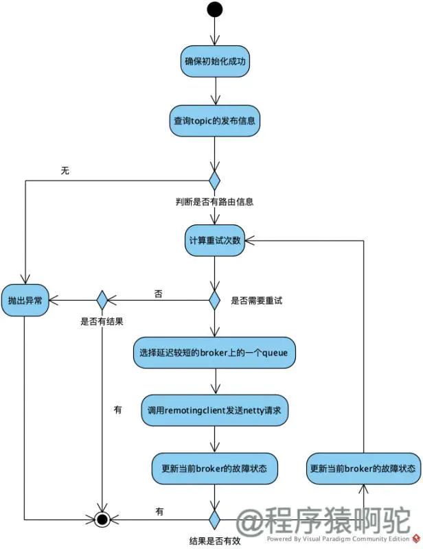

# RokcketMQ 消息发送详解

## 一、简介

RocketMQ 发送普通消息有三种方式：可靠同步发送、可靠异步发送、单向发送。

- 同步：发送者向 MQ 执行发送消息的 API 时，同步等待，直到消息服务器返回发送结果
- 异步：发送者向 MQ 执行发送消息 API 时，指定消息发送成功后的回调函数，然后调用消息发送 API 后，立即返回，消息发送者线程不阻塞。直到运行结束，消息发送成功或者失败的回调任务在一个新的线程中执行。
- 单向：消息发送者向 MQ 执行发送消息 API 时，直接返回，不等待消息服务器的结果，也不注册回调函数，简单地说，就是只管发送，不在乎消息是否成功地存储在消息服务器上

RocketMQ 消息发送需要考虑以下几个问题：

- 消息队列如何进行负载
- 消息发送如何实现高可用

接下来将从以下 3 个方面介绍消息发送：

- 消息发送者 Producer 的启动流程
- Producer 的轮询以及故障规避机制
- 消息的发送流程

## 二、消息发送者的启动流程

消息生产者 Producer 的启动入口在 DefaultMQProducerImpl#start 方法中：

```java{.line-numbers}
public void start(final boolean startFactory) throws MQClientException {
    switch (this.serviceState) {
        case CREATE_JUST:
            // 如果下面的流程中出错了，那么 ServiceState 就为 START_FAILED
            this.serviceState = ServiceState.START_FAILED;
            // 检查 productGroup 是否符合要求
            this.checkConfig();

            // 如果 producer 的 instanceName 为 DEFAULT（也就是说如果用户没有设置自定义的 instanceName 的话），那么就将其转变为进程的 pid，
            // 这么做是因为 MQClientInstance 保存在 MQClientManager#factoryTable 属性中的时候，键是 ip + @ + instanceName。
            // 如果不这样做的话一台机器上面部署了多个程序，也就是多个进程，那么这多个进程都会共用一个 MQClientInstance，会造成一些错误。
            // 另外，要注意的是，在同一个进程中的 Consumer 和 Producer 获取到的 MQClientInstance 是同一个对象，不过 MQClientInstance
            // 封装了 rocketmq 网络处理的 API，是 Consumer 和 Producer 与 NameServer 和 Broker 打交道的网络通道
            if (!this.defaultMQProducer.getProducerGroup().equals(MixAll.CLIENT_INNER_PRODUCER_GROUP)) {
                this.defaultMQProducer.changeInstanceNameToPID();
            }

            // 创建 MQClientInstance 实例。整个 JVM 实例中只存在一个 MQClientManager 实例，维护一个 MQClientInstance 缓存表 
            // ConcurrentMap<String /*ClientId*/，MQClientinstance> factoryTable，其中 clientId = ip + @ + instanceName
            // instanceName 会被设置成为进程 pid
            this.mQClientFactory = MQClientManager.getInstance().getAndCreateMQClientInstance(this.defaultMQProducer, rpcHook);
            
            // 向 MQClientlnstance 注册，将当前生产者加入到 MQClientlnstance 管理中，方便后续调用网络请求、进行心跳检测等
            // 一台机器可能既需要发送消息，也需要消费消息，也就是说既是 Producer，也是 Consumer。这些 instance 都会注册到
            // MQClientInstance 中方便后续管理，比如会收集这些 instance 中的 topic，一起向 NameServer 获取 topic 的路由信息
            boolean registerOK = mQClientFactory.registerProducer(this.defaultMQProducer.getProducerGroup(), this);
            if (!registerOK) {
                this.serviceState = ServiceState.CREATE_JUST;
                throw new MQClientException();
            }

            // 首先将主题 TBW102 加入到 topicPublishInfoTable 中，这个是默认主题
            // 后面再发送消息的时候，也会将消息的 topic 加入到 topicPublishInfoTable 中
            this.topicPublishInfoTable.put(this.defaultMQProducer.getCreateTopicKey(), new TopicPublishInfo());

            // 启动 MQClientInstance
            if (startFactory) {
                mQClientFactory.start();
            }

            log.info("the producer [{}] start OK. sendMessageWithVIPChannel={}");
            this.serviceState = ServiceState.RUNNING;
            break;
        case RUNNING:
        case START_FAILED:
        case SHUTDOWN_ALREADY:
            throw new MQClientException("The producer service state not OK, maybe started once");
        default:
            break;
    }
    // 向所有的 Broker 发送心跳包
    this.mQClientFactory.sendHeartbeatToAllBrokerWithLock();
} 
```

在 DefaultMQProducerImpl#start 方法中，先从 MQClientManager 的 factoryTable 属性中获取到一个 MQClientInstance 类对象，如果没有则创建一个，并且将其加入到 factoryTable 中。这里获取的关键字 key 是 ip + @ + instanceName，这里如果用户不自己指定 instanceName 的话，rocketmq 就会将 instanceName 转换为当前的进程 Pid（具体的逻辑在 changeInstanceNameToPID 方法中）。下面是生成 MQClientInstance 的键的方法。

```java{.line-numbers}
// 为 MQClientInstance 创建一个 clientId，也就是 IP + @ + instanceName
// ClientConfig#buildMQClientId
public String buildMQClientId() {
    StringBuilder sb = new StringBuilder();
    sb.append(this.getClientIP());

    sb.append("@");
    sb.append(this.getInstanceName());
    if (!UtilAll.isBlank(this.unitName)) {
        sb.append("@");
        sb.append(this.unitName);
    }
    return sb.toString();
} 
```

获取到 MQClientInstance 对象之后，Producer 就可以通过 MQClientInstance 进行网络通信，并且同一个进程中的消费者 Consumer 获取到的也是同一个 MQClientInstance。然后在 start 方法中会将这个 Producer 注册到 MQClientInstance#producerTable 中去，同样，消费者 Consumer 也会注册到 MQClientInstance#consumerTable 中去。这样方便统一进行管理，比如向 Broker 发送心跳请求时，会将 consumerTable 中的消费者信息以及 producerTable 中的 producer 信息都获取到，并且保存到 heartbeatData 中，然后发送到 Broker 端，同理，从 NameServer 端获取到 topic 的路由信息时，也会进行同样处理。

在 start 方法中，接下来就是将 MQProducer 默认的主题 TBW102 保存到 topicPublishInfoTable 中，并且再次发送消息时，也会将消息的 topic 保存到 topicPublishInfoTable 中。然后启动 MQClientInstance，并且向所有的 Broker 发送心跳包。代码如下：

```java{.line-numbers}
// MQClientInstance#sendHeartbeatToAllBrokerWithLock
public void sendHeartbeatToAllBrokerWithLock() {
    if (this.lockHeartbeat.tryLock()) {
        try {
            // 将此 Consumer 和 Producer 中的信息发送到所有的 Broker
            this.sendHeartbeatToAllBroker();
            this.uploadFilterClassSource();
        } catch (final Exception e) {
            log.error("sendHeartbeatToAllBroker exception", e);
        } finally {
            this.lockHeartbeat.unlock();
        }
    } else {
        log.warn("lock heartBeat, but failed.");
    }
} 

// MQClientInstance#sendHeartbeatToAllBroker
private void sendHeartbeatToAllBroker() {
    // 在发送心跳包到所有的 Broker 之前（包括 Master 和 Slave），先收集好 Producer 和 Consumer 的必要的信息。
    final HeartbeatData heartbeatData = this.prepareHeartbeatData();
    final boolean producerEmpty = heartbeatData.getProducerDataSet().isEmpty();
    final boolean consumerEmpty = heartbeatData.getConsumerDataSet().isEmpty();
    // 如果 producer 和 consumer 的数据都为空，那么则直接返回
    if (producerEmpty && consumerEmpty) {
        log.warn("sending heartbeat, but no consumer and no producer");
        return;
    }

    if (!this.brokerAddrTable.isEmpty()) {
        long times = this.sendHeartbeatTimesTotal.getAndIncrement();
        // 获取到所有 Broker 组的地址，一个 Broker 组 = 一个 Master Broker 和多个 Slave Broker，一个 Broker 组的名称都是一样的
        Iterator<Entry<String, HashMap<Long, String>>> it = this.brokerAddrTable.entrySet().iterator();
        while (it.hasNext()) {
            Entry<String, HashMap<Long, String>> entry = it.next();
            String brokerName = entry.getKey();
            HashMap<Long, String> oneTable = entry.getValue();
            if (oneTable != null) {
                // 一个 entry1 表示一个 Broker 组中一个 Broker 的 id 和地址
                for (Map.Entry<Long, String> entry1 : oneTable.entrySet()) {
                    Long id = entry1.getKey();
                    String addr = entry1.getValue();
                    if (addr != null) {
                        // 如果此 MQClientInstance 中没有 Consumer，并且 Broker 的 id 不是 MASTER_ID 的话，就直接忽略掉这个 Broker
                        // 这是因为 Consumer 会与 Master Broker 以及 Slave Broker 同时建立连接，而 Producer 只会与 Master 建立连接
                        if (consumerEmpty) {
                            if (id != MixAll.MASTER_ID)
                                continue;
                        }

                        try {
                            int version = this.mQClientAPIImpl.sendHearbeat(addr, heartbeatData, 3000);
                            if (!this.brokerVersionTable.containsKey(brokerName)) {
                                this.brokerVersionTable.put(brokerName, new HashMap<String, Integer>(4));
                            }
                            this.brokerVersionTable.get(brokerName).put(addr, version);
                            if (times % 20 == 0) {
                                log.info("send heart beat to broker[{} {} {}] success", brokerName, id, addr);
                                log.info(heartbeatData.toString());
                            }
                        } catch (Exception e) {
                            // 省略代码
                        }
                    }
                }
            }
        }
    }
} 
```

## 三、Producer 的故障规避机制

### 3.1 消息发送流程

在介绍 Producer 的故障规避机制之前，我们先讲解 Producer 消息发送的基本流程，消息发送流程的主要步骤：验证消息、查找路由、消息发送（包含异常处理机制）。在 rocketmq 中，默认消息发送是以同步方式进行的，默认超时时间为 3s。这里主要以 DefaultMQProducerImpl#sendMessage(Message msg, long timeout) 方法为入口：

```java{.line-numbers}
// 以同步状态发送消息，默认的超时时间为 3s
// DefaultMQProducerImpl#send
public SendResult send(Message msg, long timeout) throws MQClientException, RemotingException, MQBrokerException, InterruptedException {
    return this.sendDefaultImpl(msg, CommunicationMode.SYNC, null, timeout);
} 
```

其中，sendDefaultImpl 的代码如下：

```java{.line-numbers}
// MQClientInstance#sendDefaultImpl
private SendResult sendDefaultImpl(Message msg, final CommunicationMode communicationMode, final SendCallback sendCallback, final long timeout)
                            throws MQClientException{
    // 消息发送之前，首先确保生产者处于运行状态
    this.makeSureStateOK();
    // 对消息进行验证，具体就是检查消息的主题，消息对象不能为 null，消息体的长度不能等于 0，且不能大于消息的最大长度 4MB
    Validators.checkMessage(msg, this.defaultMQProducer);

    final long invokeID = random.nextLong();
    long beginTimestampFirst = System.currentTimeMillis();
    long beginTimestampPrev = beginTimestampFirst;
    long endTimestamp = beginTimestampFirst;

    // 消息发送之前，首先需要获取主题的路由信息，只有获取了这些信息我们才知道消息要发送到的具体的 Broker 节点
    TopicPublishInfo topicPublishInfo = this.tryToFindTopicPublishInfo(msg.getTopic());

    if (topicPublishInfo != null && topicPublishInfo.ok()) {
        MessageQueue mq = null;
        Exception exception = null;
        SendResult sendResult = null;
        // 重试次数，同步模式下默认为 3 次，ONEWAY 或者异步的情况下不进行重试
        int timesTotal = communicationMode == CommunicationMode.SYNC ? 1 + this.defaultMQProducer.getRetryTimesWhenSendFailed() : 1;
        int times = 0;
        String[] brokersSent = new String[timesTotal];

        for (; times < timesTotal; times++) {
            // lastBrokerName 为上一次发送失败的 Broker 的名称，第一次发送时 mq 为 null
            String lastBrokerName = null == mq ? null : mq.getBrokerName();
            // 选择一个消息队列，有两种选择策略：开启 Broker 故障规避；不开启 Broker 故障规避
            MessageQueue mqSelected = this.selectOneMessageQueue(topicPublishInfo, lastBrokerName);
            if (mqSelected != null) {
                mq = mqSelected;
                brokersSent[times] = mq.getBrokerName();
                try {
                    beginTimestampPrev = System.currentTimeMillis();
                    // 调用 MQClientAPIImpl 进行真正的消息发送
                    sendResult = this.sendKernelImpl(msg, mq, communicationMode, sendCallback, topicPublishInfo, timeout);
                    endTimestamp = System.currentTimeMillis();
                    // endTimestamp - startTimestamp 表示此次发送消息的延迟时间
                    this.updateFaultItem(mq.getBrokerName(), endTimestamp - beginTimestampPrev, false);
                    // 如果是异步或者ONEWAY调用的，直接返回 null 结果
                    switch (communicationMode) {
                        case ASYNC:
                            return null;
                        case ONEWAY:
                            return null;
                        case SYNC:
                            // 如果发送没有成功
                            if (sendResult.getSendStatus() != SendStatus.SEND_OK) {
                                // retryAnotherBrokerWhenNotStoreOK 属性表示如果发送消息到 Broker 端失败的话，是否重新发送消息到另外一个 Broker
                                // 默认为 false
                                if (this.defaultMQProducer.isRetryAnotherBrokerWhenNotStoreOK()) {
                                    continue;
                                }
                            }
                            return sendResult;
                        default:
                            break;
                    }

                // 消息发送的过程中出现异常的话，更新 faultItemTable，也就是更新当前 Broker 的故障状态
                } catch (RemotingException e) {
                    endTimestamp = System.currentTimeMillis();
                    this.updateFaultItem(mq.getBrokerName(), endTimestamp - beginTimestampPrev, true);
                    // 省略代码
                    continue;
                } catch (MQClientException e) {
                    endTimestamp = System.currentTimeMillis();
                    this.updateFaultItem(mq.getBrokerName(), endTimestamp - beginTimestampPrev, true);
                    // 省略代码
                    continue;
                } catch (MQBrokerException e) {
                    endTimestamp = System.currentTimeMillis();
                    this.updateFaultItem(mq.getBrokerName(), endTimestamp - beginTimestampPrev, true);
                    // 省略代码
                } catch (InterruptedException e) {
                    endTimestamp = System.currentTimeMillis();
                    this.updateFaultItem(mq.getBrokerName(), endTimestamp - beginTimestampPrev, false);
                    // 省略代码
                    throw e;
                }
            } else {
                break;
            }
        }

        // 如果发送成功，那么就直接返回 sendResult
        if (sendResult != null) {
            return sendResult;
        }

        String info = String.format("Send [%d] times, still failed, cost [%d]ms, Topic: %s, BrokersSent: %s",
                times, System.currentTimeMillis() - beginTimestampFirst, msg.getTopic(),
                Arrays.toString(brokersSent));

        info += FAQUrl.suggestTodo(FAQUrl.SEND_MSG_FAILED);

        MQClientException mqClientException = new MQClientException(info, exception);
        if (exception instanceof MQBrokerException) {
            mqClientException.setResponseCode(((MQBrokerException) exception).getResponseCode());
        } else if (exception instanceof RemotingConnectException) {
            mqClientException.setResponseCode(ClientErrorCode.CONNECT_BROKER_EXCEPTION);
        } else if (exception instanceof RemotingTimeoutException) {
            mqClientException.setResponseCode(ClientErrorCode.ACCESS_BROKER_TIMEOUT);
        } else if (exception instanceof MQClientException) {
            mqClientException.setResponseCode(ClientErrorCode.BROKER_NOT_EXIST_EXCEPTION);
        }

        throw mqClientException;
    }

    List<String> nsList = this.getmQClientFactory().getMQClientAPIImpl().getNameServerAddressList();
    if (null == nsList || nsList.isEmpty()) {
        throw new MQClientException();
    }

    throw new MQClientException().setResponseCode(ClientErrorCode.NOT_FOUND_TOPIC_EXCEPTION);
}
```

上面 sendDefaultImpl 方法的代码如下：

<div align="center">
    
</div>

**1)  验证消息**

在消息发送之前，首先需要确保生产者处于运行状态（具体的在方法 makeSureStateOK ），然就验证消息是否符合相应的规范，具体的规范要求是主题名称、消息体不能为空、消息长度不能等于 0 并且默认不能超过允许发送消息的最大长度 4MB（maxMessageSize = 1024 * 1024 * 4）。

**2)  查找主题路由信息**

在消息发送之前，首先需要获取到主题的路由信息，只有获取了这些信息我们才能知道消息要发送到具体的 Broker 结点。

```java{.line-numbers}
// DefaultMQProducerImpl#tryToFindTopicPublishInfo
private TopicPublishInfo tryToFindTopicPublishInfo(final String topic) {
    TopicPublishInfo topicPublishInfo = this.topicPublishInfoTable.get(topic);
    // 如果没有缓存路由信息
    if (null == topicPublishInfo || !topicPublishInfo.ok()) {
        this.topicPublishInfoTable.putIfAbsent(topic, new TopicPublishInfo());
        // 向 NameServer 查询该 topic 路由信息，这个 topic 就是用户自定义的 topic
        this.mQClientFactory.updateTopicRouteInfoFromNameServer(topic);
        topicPublishInfo = this.topicPublishInfoTable.get(topic);
    }

    // 如果生产者中缓存了 topic 的路由信息，或者向 NameServer 发送请求查询到了路由信息的话，则直接返回该路由信息。
    if (topicPublishInfo.isHaveTopicRouterInfo() || topicPublishInfo.ok()) {
        return topicPublishInfo;
    // 向 NameServer 查询默认 topic 的路由信息，这个 topic 是默认的，也就是 TBW102，这里如果还没有找到的话，就直接抛出异常
    } else {
        this.mQClientFactory.updateTopicRouteInfoFromNameServer(topic, true, this.defaultMQProducer);
        topicPublishInfo = this.topicPublishInfoTable.get(topic);
        return topicPublishInfo;
    }
} 
```

tryToFindTopicPublishInfo 是查找主题的路由信息的方法。第一次发送消息时，本地没有缓存 topic 的路由信息，查询 NameServer 尝试获取，如果路由信息未找到，再次尝试用默认主题 
DefaultMQProducerImpl#createTopicKey，也就是 "TBW102" 去查询，这个时候如果 BrokerConfig#autoCreateTopicEnable 为 true 时，NameServer 将返回路由信息，如果 autoCreateTopicEnab 为 false 时，将抛出无法找到 topic 路由异常。上面的 updateTopicRouteInfoFromNameServer 方法如下：

```java{.line-numbers}
// MQClientInstance#updateTopicRouteInfoFromNameServer
public boolean updateTopicRouteInfoFromNameServer(final String topic, boolean isDefault, DefaultMQProducer defaultMQProducer) {
    try {
        if (this.lockNamesrv.tryLock(LOCK_TIMEOUT_MILLIS, TimeUnit.MILLISECONDS)) {
            try {
                TopicRouteData topicRouteData;
                // 如果 isDefault 的值为 true，则使用默认主题 "TBW102" 去查询
                if (isDefault && defaultMQProducer != null) {
                    topicRouteData = this.mQClientAPIImpl.getDefaultTopicRouteInfoFromNameServer(defaultMQProducer.getCreateTopicKey(), 1000 * 3);
                    if (topicRouteData != null) {
                        // 如果查询到路由信息，则替换路由信息中读写队列个数为消息生产者默认的队列个数
                        for (QueueData data : topicRouteData.getQueueDatas()) {
                            int queueNums = Math.min(defaultMQProducer.getDefaultTopicQueueNums(), data.getReadQueueNums());
                            data.setReadQueueNums(queueNums);
                            data.setWriteQueueNums(queueNums);
                        }
                    }
                
                // 如果 isDefault 为 false，则使用参数 topic 去查询
                } else {
                    // 向 NameServer 发送 RequestCode 为 GET_ROUTEINTO_BY_TOPIC 的请求，获取要查询主题的路由信息
                    topicRouteData = this.mQClientAPIImpl.getTopicRouteInfoFromNameServer(topic, 1000 * 3);
                }
                
                if (topicRouteData != null) {
                    TopicRouteData old = this.topicRouteTable.get(topic);
                    // 如果路由信息找到，与本地缓存中的路由信息进行对比，判断路由信息是否发生了改变，如果未发生变化，则直接返回 false
                    boolean changed = topicRouteDataIsChange(old, topicRouteData);
                    if (!changed) {
                        changed = this.isNeedUpdateTopicRouteInfo(topic);
                    } else {
                        log.info("the topic[{}] route info changed, old[{}] ,new[{}]", topic, old, topicRouteData);
                    }

                    // 如果路由信息发生了变化
                    if (changed) {
                        TopicRouteData cloneTopicRouteData = topicRouteData.cloneTopicRouteData();

                        // topicRouteData 中的 List<BrokerData> 属性表明这个 topic 保存在哪些 Broker 上
                        // 所以将这些 BrokerData 保存到 MQClientInstance 的 brokerAddrTable 中，即
                        // Map<String /* broker name */, Map<Long /* broker id */, String /* broker address */>>
                        for (BrokerData bd : topicRouteData.getBrokerDatas()) {
                            this.brokerAddrTable.put(bd.getBrokerName(), bd.getBrokerAddrs());
                        }

                        // Update Pub info
                        {
                            TopicPublishInfo publishInfo = topicRouteData2TopicPublishInfo(topic, topicRouteData);
                            publishInfo.setHaveTopicRouterInfo(true);
                            Iterator<Entry<String, MQProducerInner>> it = this.producerTable.entrySet().iterator();
                            // 根据最新的 topic 路由信息更新各个 DefaultMQProducerImpl 中的路由信息 topicPublishInfoTable
                            while (it.hasNext()) {
                                Entry<String, MQProducerInner> entry = it.next();
                                MQProducerInner impl = entry.getValue();
                                if (impl != null) {
                                    impl.updateTopicPublishInfo(topic, publishInfo);
                                }
                            }
                        }

                        // Update sub info
                        {
                            Set<MessageQueue> subscribeInfo = topicRouteData2TopicSubscribeInfo(topic, topicRouteData);
                            Iterator<Entry<String, MQConsumerInner>> it = this.consumerTable.entrySet().iterator();
                            // 根据最新得 topic 路由信息更新各个 RebalanceImpl （也就是消息消费者的）中的 topicSubscribeInfoTable
                            while (it.hasNext()) {
                                Entry<String, MQConsumerInner> entry = it.next();
                                MQConsumerInner impl = entry.getValue();
                                if (impl != null) {
                                    impl.updateTopicSubscribeInfo(topic, subscribeInfo);
                                }
                            }
                        }
                        log.info("topicRouteTable.put. Topic = {}, TopicRouteData[{}]", topic, cloneTopicRouteData);
                        // 将路由信息保存在 MQClientInstance 的 topicRouteTable 属性中，而对于 DefaultMQProducerImpl 来说，路由信息保存在
                        // topicPublishInfoTable 中
                        this.topicRouteTable.put(topic, cloneTopicRouteData);
                        return true;
                    }
                } else {
                    log.warn("updateTopicRouteInfoFromNameServer, getTopicRouteInfoFromNameServer return null, Topic: {}", topic);
                }
            } catch (Exception e) {
                // ...
            } finally {
                this.lockNamesrv.unlock();
            }
        } else {
            log.warn("updateTopicRouteInfoFromNameServer tryLock timeout {}ms", LOCK_TIMEOUT_MILLIS);
        }
    } catch (InterruptedException e) {
        log.warn("updateTopicRouteInfoFromNameServer Exception", e);
    }
    return false;
} 
```

上面的 updateTopicRouteInfoFromNameServer  所做的事情其实很简单，就是根据我们所要查找的 topic 向 NameServer 发送请求信息。如果返回的路由信息相比之前发生了变化，那么就会将新的路由信息保存到 consumer、producer 以及此 MQClientInstance 中的 topicRouteTable 属性中。

**3) 选择消息队列**

这里会根据故障规避机制（如果开启了的话）选择某个 Broker 上的 MessageQueue，从而把消息发送到上面去。

综上，前面简单介绍了 Producer 发送消息的流程，总结如下：

1. 检查 producer 是否处于运行状态，也就是调用 DefaultMQProducerImpl#makeSureOK 方法，确保 serviceState 等于 RUNNING
2. 调用 DefaultMQProducerImpl#tryToFindTopicPublishInfo 方法获取到 topic 主题的路由信息
3. 如果前面获取到有效的路由信息之后，计算一下重试次数。对于同步模式来说，如果发送失败，还有两次重试机会，但是对于异步和 ONEWAY 方式，没有重试次数。
4. 选择一个消息队列。这里根据 sendLatencyFaultEnable 开关是否打开，来选择是否开启 Broker 的故障规避策略，从而来选择对应的 MessageQueue
5. 调用 MQClientAPIImpl 来将消息真正的发送到 Broker 端
6. 更新发送到的 Broker 端的"故障信息"（保存在 LatencyFaultToleranceImpl#faultItemTable），这些"故障信息"只有在开启了故障规避策略的时候才会使用到

### 3.2 选择消息队列

#### 3.2.1 Producer 选择消息队列策略简介

熟悉 RocketMQ 的小伙伴应该都知道，RocketMQ Topic 路由注册中心 NameServer 采用的是最终一致性模型，而且客户端是定时向 NameServer 拉取 Topic 的路由信息，即客户端（Producer、Consumer）是无法实时感知 Broker 宕机的，这样消息发送者会继续向已宕机的 Broker 发送消息，造成消息发送异常。那 RocketMQ 是如何保证消息发送的高可用性呢？

RocketMQ 为了保证消息发送的高可用性，在内部引入了重试机制，默认同步发送的话会重试 2 次。**<font color="red">RocketMQ 消息发送端采取的队列负载均衡默认采用轮循</font>**。在 RocketMQ 中消息发送者是线程安全的，即一个消息发送者可以在多线程环境中安全使用。**<font color="red">每一个消息发送者全局会维护一个 Topic 上一次选择的队列，然后基于这个序号进行递增轮循，用 sendWhichQueue 表示</font>**。

但 RocketMQ 提供了两种规避策略，该参数由 sendLatencyFaultEnable 控制，用户可干预，表示是否开启延迟规避机制，默认为不开启。（DefaultMQProducer中设置这两个参数）

**<font color="red">sendLatencyFaultEnable 设置为 false：默认值，不开启</font>**。topicA 在 broker-a、broker-b 上分别创建了 4 个队列，例如一个线程使用 Producer 发送消息时，通过对 sendWhichQueue getAndIncrement() 方法获取下一个队列。例如在发送之前 sendWhichQueue 该值为 broker-a 的 q1，如果由于此时 broker-a 的突发流量异常大导致消息发送失败，会触发重试，按照轮循机制，下一次不会从 broker-a 上面选择消息队列，而是从 broker-b 上面选择消息队列。这一次的消息重试成功了，但是 producer 发送第二条消息的时候，还是得从 broker-a 上的 q1 队列开始重试，如果 broker-a 宕机一段时间，发送的第二条消息还是会进行重试，然后选择 broker-b 上面的消息队列，发送第三条消息同理。这样就会造成重复发送消息给一个宕机的 Broker，浪费机器的性能。

故 RocketMQ 为了解决该问题，引入了故障规避机制，在消息重试的时候，会尽量规避上一次发送的 Broker，回到上述示例，当消息发往 broker-a q1 队列时返回发送失败，那重试的时候，会先排除 broker-a 中所有队列，即这次会选择 broker-b q1 队列，增大消息发送的成功率。

**<font color="red">sendLatencyFaultEnable 设置为 true：开启延迟规避机制</font>**。一旦消息发送失败会将 broker-a "悲观"地认为在接下来的一段时间内该 Broker 不可用，在为未来某一段时间内所有的客户端不会向该 Broker 发送消息。这个延迟时间就是通过 notAvailableDuration、latencyMax 共同计算的，就首先先计算本次消息发送失败所耗的时延，然后对应 latencyMax 中哪个区间，即计算在 latencyMax 的下标，然后返回 notAvailableDuration 同一个下标对应的延迟值。

温馨提示：如果所有的 Broker 都触发了故障规避，并且 Broker 只是那一瞬间压力大，那岂不是明明存在可用的 Broker，但经过你这样规避，反倒是没有 Broker 可用来，那岂不是更糟糕了？针对这个问题，会退化到队列轮循机制，即不考虑故障规避这个因素，按自然顺序进行选择进行兜底。

#### 3.2.2 故障规避机制

从上面的 DefaultMQProducerImpl#sendDefaultImpl 方法，我们可以知道，选择消息队列的入口在 MQFaultStrategy#selectOneMessageQueue 中，代码如下所示：

```java{.line-numbers}
// MQFaultStrategy#selectOneMessageQueue
public MessageQueue selectOneMessageQueue(final TopicPublishInfo tpInfo, final String lastBrokerName) {
    // 启动 Broker 的故障延迟机制
    if (this.sendLatencyFaultEnable) {
        try {
            int index = tpInfo.getSendWhichQueue().getAndIncrement();
            // 根据对消息队列的轮询，获取到一个消息队列
            for (int i = 0; i < tpInfo.getMessageQueueList().size(); i++) {
                int pos = Math.abs(index++) % tpInfo.getMessageQueueList().size();
                if (pos < 0)
                    pos = 0;
                MessageQueue mq = tpInfo.getMessageQueueList().get(pos);
                // 通过 isAvailable 方法验证消息队列 mq 是否可用，其实就是判断这个 mq 所属的 Broker 是否可用
                if (latencyFaultTolerance.isAvailable(mq.getBrokerName())) {
                    if (null == lastBrokerName || mq.getBrokerName().equals(lastBrokerName))
                        return mq;
                }
            }

            // 选择一个相对较好的 Broker，并且获得其对应的一个消息队列，不考虑该队列的可用性
            final String notBestBroker = latencyFaultTolerance.pickOneAtLeast();
            int writeQueueNums = tpInfo.getQueueIdByBroker(notBestBroker);
            if (writeQueueNums > 0) {
                final MessageQueue mq = tpInfo.selectOneMessageQueue();
                if (notBestBroker != null) {
                    mq.setBrokerName(notBestBroker);
                    mq.setQueueId(tpInfo.getSendWhichQueue().getAndIncrement() % writeQueueNums);
                }
                return mq;
            } else {
                latencyFaultTolerance.remove(notBestBroker);
            }
        } catch (Exception e) {
            log.error("Error occurred when selecting message queue", e);
        }
        // 选择一个消息队列，不考虑队列的可用性
        return tpInfo.selectOneMessageQueue();
    }

    // 不启用 Broker 的故障延迟机制，选择一个消息队列，不考虑队列的可用性，只要消息队列的名称不等于 lastBrokerName
    return tpInfo.selectOneMessageQueue(lastBrokerName);
} 
```

上面就是选择消息队列的源代码，有两种策略，开启故障规避以及不开启故障规避。如果不开启故障规避，就是简单的轮询所有的消息队列 mq，不过如果在一次发送消息重试时，某个 Broker 不可用，也是会进行规避。如果开启了故障规避，首先也是对消息队列进行轮询获取一个消息队列，然后验证该消息队列是否可用（通过 isAvailable 方法）。下面从源码的对故障规避的 updateFaultItem、isAvailable 方法进行分析。

在上面的 sendDefaultImpl 方法中，部分代码如下：

```java{.line-numbers}
beginTimestampPrev = System.currentTimeMillis();
// 调用 MQClientAPIImpl 进行真正的消息发送
sendResult = this.sendKernelImpl(msg, mq, communicationMode, sendCallback, topicPublishInfo, timeout);
endTimestamp = System.currentTimeMillis();
// endTimestamp - startTimestamp 表示此次发送消息的延迟时间
this.updateFaultItem(mq.getBrokerName(), endTimestamp - beginTimestampPrev, false); 

class FaultItem implements Comparable<FaultItem> {
    // broker name，也就是这个 FaultItem 对应的 Broker 的名称
    private final String name;
    // 本次消息发送的延迟，其实就是从发送消息，到消息发送完毕所花费的时间
    private volatile long currentLatency;
    //  startTimestamp 表示此 Broker 可以启用的时间
    private volatile long startTimestamp;
} 
```

在发送完消息到 Broker 之后，会调用 updateFaultItem 方法为这个 Broker 创建一个 FaultItem 或者更新对应 FaultItem 中的 startTimestamp（也就是下次可用的时间）以及 currentLatency（即消息发送完毕消耗的时间），并且当发消息到 Broker 端发生了错误的话，也会调用 updateFaultItem 方法进行处理。如果开启了故障规避的话，Producer 每次发送消息到一个 Broker 端，就会为这个 Broker 创建一个 FaultItem，FaultItem 是用来描述 Broker 可用性的对象。 

上面调用 DefaultMQProducerImpl#updateFaultItem 方法会直接调用 MQFaultStrategy#updateFaultItem 方法，参数的含义分别为：broker 的名称、本次消息发送所消耗的时间、isolation，是否隔离。其中第三个参数的含义如果是 true，则使用默认时长 30s 来计算 Broker 故障规避时长，如果为 false，则使用本次消息发送延迟时间来计算 Broker 故障规避时长。

```java{.line-numbers}
/**
 * @param brokerName mq 所属的 Broker 的名称
 * @param currentLatency 本次消息发送的时间延迟
 * @param isolation 是否隔离，该参数的含义如果为 true，则使用默认时长 30s 来计算 Broker 故障规避时长（也就是最大的规避时长），
 * 如果为 false 则使用本次消息发送延迟时间来计算 Broker 的故障规避时长
 */
// MQFaultStrategy#updateFaultItem
public void updateFaultItem(final String brokerName, final long currentLatency, boolean isolation) {
    if (this.sendLatencyFaultEnable) {
        long duration = computeNotAvailableDuration(isolation ? 30000 : currentLatency);
        this.latencyFaultTolerance.updateFaultItem(brokerName, currentLatency, duration);
    }
}

// MQFaultStrategy#computeNotAvailableDuration
private long computeNotAvailableDuration(final long currentLatency) {
    for (int i = latencyMax.length - 1; i >= 0; i--) {
        if (currentLatency >= latencyMax[i])
            return this.notAvailableDuration[i];
    }

    return 0;
} 

public class MQFaultStrategy {
    // 延迟故障容错，维护每个 Broker 的发送消息的延迟
    private final LatencyFaultTolerance<String> latencyFaultTolerance = new LatencyFaultToleranceImpl();
    // 发送消息延迟容错开关
    private boolean sendLatencyFaultEnable = false;
    // 延迟级别数组
    private long[] latencyMax = {50L, 100L, 550L, 1000L, 2000L, 3000L, 15000L};
    // 不可用时长数组
    private long[] notAvailableDuration = {0L, 0L, 30000L, 60000L, 120000L, 180000L, 600000L};
} 
```

computeNotAvailableDuration 的作用是计算因本次消息发送故障需要将 Broker 规避的时长，也就是接下来多长时间内该 Broker 不参与消息发送队列的选择。latencyMax，根据 currentLatency 本次消息的发送延迟，从 latencyMax 尾部向前找到第一个比 currentLatency 小的索引 index，如果没有找到，返回 0，然后根据这个索引从 notAvailableDuration 数组中取出对应的时间，在这个时长内 Broker 将设为不可用。该方法最终会调用到LatencyFaultToleranceImpl 中的  updateFaultItem 方法：

```java{.line-numbers}
// 根据 broker 名称从缓存表中获取 FaultItem，如果找到则更新 FaultItem，否则创建 FaultItem
// LatencyFaultToleranceImpl#updateFaultItem
@Override
public void updateFaultItem(final String name, final long currentLatency, final long notAvailableDuration) {
    FaultItem old = this.faultItemTable.get(name);
    if (null == old) {
        final FaultItem faultItem = new FaultItem(name);
        // 如果 isolation 为 false 的话，currentLatency 为发送消息到 Broker 所消耗的时间
        // 如果 isolation 为 true 的话，currentLatency 为默认的 30s
        faultItem.setCurrentLatency(currentLatency);
        // 设置的 startTime 为当前系统时间 + 需要进行故障规避的时长，也就是 Broker 可以重新启用的时间点
        faultItem.setStartTimestamp(System.currentTimeMillis() + notAvailableDuration);

        old = this.faultItemTable.putIfAbsent(name, faultItem);
        if (old != null) {
            old.setCurrentLatency(currentLatency);
            old.setStartTimestamp(System.currentTimeMillis() + notAvailableDuration);
        }
    } else {
        old.setCurrentLatency(currentLatency);
        old.setStartTimestamp(System.currentTimeMillis() + notAvailableDuration);
    }
}
```

上面中重点需要关注的是 startTimestamp，它表示 Broker 下次可用的时间，等于当前时间 + 系统需要进行故障规避的时间段（也就是系统不可用的时间），并且 startTimestamp 是判断 broker 是否可用的核心，具体的代码如下：

```java{.line-numbers}
// 如果现在的时间戳 > Broker 可以启用的时间戳，就表明已经过了 Broker 故障延迟的时间，可以启用
// FaultItem#isAvailable
public boolean isAvailable() {
    return (System.currentTimeMillis() - startTimestamp) >= 0;
} 
```

#### 3.2.3 默认机制

默认机制就是 sendLatencyFaultEnable = false，调用 TopicPublishInfo#selectOneMessageQueue：

```java{.line-numbers}
// TopicPublishInfo#selectOneMessageQueue
public MessageQueue selectOneMessageQueue(final String lastBrokerName) {
    // 第一次执行消息队列选择的时候，lastBrokerName 为 null，此时直接使用 sendWhichQueue 自增再获取值，
    // 然后进行取模，最后获得相应位置的 MessageQeue
    if (lastBrokerName == null) {
        return selectOneMessageQueue();
    
    // 如果消息发送失败的话，下次在消息重试的时候，进行消息队列选择会规避上次 MesageQueue 所在的 Broker，否则还是有可能会再次失败
    } else {
        int index = this.sendWhichQueue.getAndIncrement();
        for (int i = 0; i < this.messageQueueList.size(); i++) {
            int pos = Math.abs(index++) % this.messageQueueList.size();
            if (pos < 0)
                pos = 0;
            MessageQueue mq = this.messageQueueList.get(pos);
            if (!mq.getBrokerName().equals(lastBrokerName)) {
                return mq;
            }
        }
        return selectOneMessageQueue();
    }
}

// TopicPublishInfo#selectOneMessageQueue
public MessageQueue selectOneMessageQueue() {
    int index = this.sendWhichQueue.getAndIncrement();
    int pos = Math.abs(index) % this.messageQueueList.size();
    if (pos < 0)
        pos = 0;
    return this.messageQueueList.get(pos);
} 
```

首先在一次消息发送过程中，可能会多次执行选择消息队列这个方法，lastBrokerName 就是上一次选择的执行发送消息失败的 Broker。在第一次执行消息队列的选择时，lastBrokerName 为 null，此时直接用 sendWhichQueue 自增再获取值，与当前路由表中消息队列个数取模，返回该位置的 MessageQueue（也就是 selectOneMessageQueue 方法），如果消息发送再失败的话，下次进行消息队列选择时会规避掉上一次失败的 MessageQueue 所在的 Broker。

从上面可以看出，默认的机制在发送一次消息的过程中能够成功地规避故障的 Broker，但是如果 broker-a 在一段时间内宕机了，那么每次发送消息时，都要从 broker-a 开始，这就会造成时间的浪费，带来不必要的性能损耗。所以 rocketmq 引入了故障规避机制，在 Broker 宕机期间，如果一次消息发送失败以后，就会将这个 Broker 暂时排除在消息队列的选择范围之外。

### 3.3 总结

故障规避机制的实现原理如下：

对于 Broker 的规避机制来说，首先，一个 Broker 可用的标准是这个 Broker 的名称 broker name 不在 LatencyFaultToleranceImpl#faultItemTable 中，或者当前的时间戳大于这个 Broker 对应的 faultItem 的 startTimestamp，也就是可用的时间戳。

在 DefaultMQProducerImpl#sendDefaultImpl 方法中，每次发送完消息到 Broker 端之后，都会把对 LatencyFaultToleranceImpl#faultItemTable 进行更新，要么创建一个新的 faultItem，要么会对已经存在的进行更新。这里的更新主要是对 faultItem 的 currentLatency 和 startTimestamp 属性进行更新。

其中 currentLatency 就是在 DefaultMQProducerImpl#sendDefaultImpl 方法中，发送完一个消息花费的时间。根据这个 currentLatency，如果比较长的话，就说明从发送消息到接收消息花费的时间比较长，此 Broker 的可用性较低，因此将其不可用的时间（notAvailableTime）设置为一个比较长的时间，再加上当前时间：startTimestamp = System.currentTimeMillis() + notAvailableTime。

因此，faultItem 中的 startTimestamp 就表明这个 Broker 下次可以启用的时间。**<font color="red">同理，当消息发送给一个 Broker 的延迟比较低时，这时 rocketmq 就会认为这个 Broker 的可用性很高，一般将其不可用时间（notAvailableTime）设置为 0，所以其 faultItem 的 startTimestamp 就等于当前时间，表明立即可用</font>**。

因此，rocketmq 的 Broker 的故障规避机制就是靠 LatencyFaultToleranceImpl#faultItemTable 实现的，其中每一个 faultItem 都代表了一个 Broker 的可用状态。然后依据这些 Broker 的可用状态来选择对应的消息队列 MessageQueue。

## 四、消息的发送流程

消息发送 API 的核心入口为 DefaultMQProducerImpl#sendKernelImpl 方法，代码如下：

```java{.line-numbers}
/**
 *
 * @param msg 待发送的消息
 * @param mq 消息将发送到该队列上
 * @param communicationMode 消息发送模式，SYNC、ASYNC、ONEWAY
 * @param sendCallback 异步消息回调函数
 * @param topicPublishInfo 主题路由信息
 * @param timeout 消息发送超时时间
 */
// DefaultMQProducerImpl#sendKernelImpl 方法
private SendResult sendKernelImpl(final Message msg, final MessageQueue mq, final CommunicationMode communicationMode, final SendCallback sendCallback,
        final TopicPublishInfo topicPublishInfo, final long timeout)
        throws MQClientException, RemotingException, MQBrokerException, InterruptedException {

    // 根据 MessageQueue 获取到 Broker 的网络地址，如果 MQClientInstance 的 brokerAddrTable 未缓存
    // 该 Broker 的信息，则从 NameServer 上主动更新一下 topic 的路由信息，如果路由更新后还是找不到
    // Broker 的信息，则抛出 MQClientException 异常，提示 Broker 不存在
    String brokerAddr = this.mQClientFactory.findBrokerAddressInPublish(mq.getBrokerName());
    if (null == brokerAddr) {
        tryToFindTopicPublishInfo(mq.getTopic());
        brokerAddr = this.mQClientFactory.findBrokerAddressInPublish(mq.getBrokerName());
    }

    SendMessageContext context = null;
    if (brokerAddr != null) {
        brokerAddr = MixAll.brokerVIPChannel(this.defaultMQProducer.isSendMessageWithVIPChannel(), brokerAddr);

        byte[] prevBody = msg.getBody();
        try {
            // for MessageBatch,ID has been set in the generating process
            if (!(msg instanceof MessageBatch)) {
                // 为消息分配全局唯一的 id
                MessageClientIDSetter.setUniqID(msg);
            }

            int sysFlag = 0;
            // 如果消息体默认超过 4K(compressMsgBodyOverHowmuch)，会对消息体采用 zip 压缩，
            // 并设置消息的系统标记为 MessageSysFlag.COMPRESSED_FLAG
            if (this.tryToCompressMessage(msg)) {
                sysFlag |= MessageSysFlag.COMPRESSED_FLAG;
            }

            // 如果是事务消息 prepared 消息，则设置消息的系统标记为 MessageSysFlag.TRANSACTION_PREPARED_TYPE
            final String tranMsg = msg.getProperty(MessageConst.PROPERTY_TRANSACTION_PREPARED);
            if (tranMsg != null && Boolean.parseBoolean(tranMsg)) {
                sysFlag |= MessageSysFlag.TRANSACTION_PREPARED_TYPE;
            }

            // ignore code

            // 构建消息发送请求包
            SendMessageRequestHeader requestHeader = new SendMessageRequestHeader();
            // 生产者组
            requestHeader.setProducerGroup(this.defaultMQProducer.getProducerGroup());
            // topic 名称
            requestHeader.setTopic(msg.getTopic());
            // 默认创建的主题 key
            requestHeader.setDefaultTopic(this.defaultMQProducer.getCreateTopicKey());
            // 该主题在单个 Broker 默认队列个数
            requestHeader.setDefaultTopicQueueNums(this.defaultMQProducer.getDefaultTopicQueueNums());
            // 队列 ID
            requestHeader.setQueueId(mq.getQueueId());
            // 对于消息标记 MessageSysFlag，RocketMQ 不对消息中的 flag 进行任何处理，留给应用程序使用
            requestHeader.setSysFlag(sysFlag);
            // 消息发送时间
            requestHeader.setBornTimestamp(System.currentTimeMillis());
            // 消息标记，rocketmq 对消息中的 flag 不做任何处理，仅仅供程序使用
            requestHeader.setFlag(msg.getFlag());
            // 消息的扩展属性
            requestHeader.setProperties(MessageDecoder.messageProperties2String(msg.getProperties()));
            // 消息的重试次数
            requestHeader.setReconsumeTimes(0);
            requestHeader.setUnitMode(this.isUnitMode());
            requestHeader.setBatch(msg instanceof MessageBatch);

            if (requestHeader.getTopic().startsWith(MixAll.RETRY_GROUP_TOPIC_PREFIX)) {
                String reconsumeTimes = MessageAccessor.getReconsumeTime(msg);
                if (reconsumeTimes != null) {
                    requestHeader.setReconsumeTimes(Integer.valueOf(reconsumeTimes));
                    MessageAccessor.clearProperty(msg, MessageConst.PROPERTY_RECONSUME_TIME);
                }

                String maxReconsumeTimes = MessageAccessor.getMaxReconsumeTimes(msg);
                if (maxReconsumeTimes != null) {
                    requestHeader.setMaxReconsumeTimes(Integer.valueOf(maxReconsumeTimes));
                    MessageAccessor.clearProperty(msg, MessageConst.PROPERTY_MAX_RECONSUME_TIMES);
                }
            }

            SendResult sendResult = null;

            // 根据消息发送方式，同步、异步、单向方式进行网络传输
            switch (communicationMode) {
                case ASYNC:
                    sendResult = this.mQClientFactory.getMQClientAPIImpl().sendMessage(brokerAddr,
                        mq.getBrokerName(), msg, requestHeader, timeout, communicationMode, sendCallback,
                        topicPublishInfo, this.mQClientFactory, this.defaultMQProducer.getRetryTimesWhenSendAsyncFailed(), context, this);
                    break;
                case ONEWAY:
                case SYNC:
                    sendResult = this.mQClientFactory.getMQClientAPIImpl().sendMessage(brokerAddr,
                            mq.getBrokerName(), msg, requestHeader, timeout, communicationMode, context, this);
                    break;
                default:
                    assert false;
                    break;
            }

            // ignore code

            return sendResult;
        } catch (RemotingException e) {
            // ignore code
        } finally {
            msg.setBody(prevBody);
        }
    }

    throw new MQClientException("The broker[" + mq.getBrokerName() + "] not exist", null);
}
```

具体的逻辑就是做发送消息的准备工作，也就是获取到 Broker 的 ip 地址、构造消息头对象 SendMessageRequestHeader，然后根据消息的发送方式（同步、异步、单向方式）进行具体发送。具体的发送由 MQClientAPIImpl 来负责。

发送的消息的请求命令是 RequestCode.SEND_MESSAGE，这条消息是由 Broker 上的 SendMessageProcessor 类来进行处理，入口为：

```java{.line-numbers}
// SendMessageProcessor#processRequest
public RemotingCommand processRequest(ChannelHandlerContext ctx, RemotingCommand request) throws RemotingCommandException {
    SendMessageContext mqtraceContext;
    switch (request.getCode()) {
    // RequestCode.CONSUMER_SEND_MSG_BACK 由下面的方法处理
    case RequestCode.CONSUMER_SEND_MSG_BACK:
        return this.consumerSendMsgBack(ctx, request);
    // RequestCode.SEND_MESSAGE 以及其它的 RequestCode 由下面的方法进行处理
    default:
        SendMessageRequestHeader requestHeader = parseRequestHeader(request);
        if (requestHeader == null) {
            return null;
        }

        mqtraceContext = buildMsgContext(ctx, requestHeader);
        this.executeSendMessageHookBefore(ctx, request, mqtraceContext);

        RemotingCommand response;
        if (requestHeader.isBatch()) {
            response = this.sendBatchMessage(ctx, request, mqtraceContext, requestHeader);
        } else {
            response = this.sendMessage(ctx, request, mqtraceContext, requestHeader);
        }

        this.executeSendMessageHookAfter(response, mqtraceContext);
        return response;
    }
} 
```

sendMessage 的代码如下：

```java{.line-numbers}
// SendMessageProcessor#sendMessage
private RemotingCommand sendMessage(final ChannelHandlerContext ctx, final RemotingCommand request, final SendMessageContext sendMessageContext, 
        final SendMessageRequestHeader requestHeader) throws RemotingCommandException {

    final RemotingCommand response = RemotingCommand.createResponseCommand(SendMessageResponseHeader.class);
    final SendMessageResponseHeader responseHeader = (SendMessageResponseHeader) response.readCustomHeader();
    // opaque 等同于 requestId，将其保存到 response 中
    response.setOpaque(request.getOpaque());

    response.addExtField(MessageConst.PROPERTY_MSG_REGION, this.brokerController.getBrokerConfig().getRegionId());
    response.addExtField(MessageConst.PROPERTY_TRACE_SWITCH, String.valueOf(this.brokerController.getBrokerConfig().isTraceOn()));

    log.debug("receive SendMessage request command, {}", request);
    // startTimestamp 表示 Broker 可以开始获取请求的时间戳
    final long startTimstamp = this.brokerController.getBrokerConfig().getStartAcceptSendRequestTimeStamp();
    if (this.brokerController.getMessageStore().now() < startTimstamp) {
        response.setCode(ResponseCode.SYSTEM_ERROR);
        response.setRemark(String.format("broker unable to service, until %s", UtilAll.timeMillisToHumanString2(startTimstamp)));
        return response;
    }

    response.setCode(-1);
    // 进行对应的检查
    // 1.检查该 Broker 是否有写权限
    // 2.检查该 topic 是否可以进行消息发送，主要针对默认主题，默认主题不能发送消息，仅仅用于路由查找
    // 3.在 NameServer 端存储主题的配置信息，默认路径是 ${ROCKET_HOME}/store/config/topic.json
    // 4.检查队列 id，如果队列 id 不合法，返回错误码
    super.msgCheck(ctx, requestHeader, response);
    if (response.getCode() != -1) {
        return response;
    }

    final byte[] body = request.getBody();

    int queueIdInt = requestHeader.getQueueId();
    TopicConfig topicConfig = this.brokerController.getTopicConfigManager().selectTopicConfig(requestHeader.getTopic());

    if (queueIdInt < 0) {
        queueIdInt = Math.abs(this.random.nextInt() % 99999999) % topicConfig.getWriteQueueNums();
    }

    MessageExtBrokerInner msgInner = new MessageExtBrokerInner();
    msgInner.setTopic(requestHeader.getTopic());
    msgInner.setQueueId(queueIdInt);
    
    // 如果消息的重试次数超过允许的最大重试次数，消息将进入到 DLQ 延迟队列，延迟队列的主题为：%DLQ% + 消费组名
    if (!handleRetryAndDLQ(requestHeader, response, request, msgInner, topicConfig)) {
        return response;
    }

    // 将 Message 中的消息保存到 MessageExtBrokerInner 中
    msgInner.setBody(body);
    msgInner.setFlag(requestHeader.getFlag());
    MessageAccessor.setProperties(msgInner, MessageDecoder.string2messageProperties(requestHeader.getProperties()));
    msgInner.setPropertiesString(requestHeader.getProperties());
    msgInner.setBornTimestamp(requestHeader.getBornTimestamp());
    msgInner.setBornHost(ctx.channel().remoteAddress());
    msgInner.setStoreHost(this.getStoreHost());
    msgInner.setReconsumeTimes(requestHeader.getReconsumeTimes() == null ? 0 : requestHeader.getReconsumeTimes());

    if (this.brokerController.getBrokerConfig().isRejectTransactionMessage()) {
        String traFlag = msgInner.getProperty(MessageConst.PROPERTY_TRANSACTION_PREPARED);
        if (traFlag != null) {
            response.setCode(ResponseCode.NO_PERMISSION);
            response.setRemark("the broker[" + this.brokerController.getBrokerConfig().getBrokerIP1() + "] sending transaction message is forbidden");
            return response;
        }
    }
    // 调用 DefaultMessageStore#putMessage 进行消息存储，
    PutMessageResult putMessageResult = this.brokerController.getMessageStore().putMessage(msgInner);

    return handlePutMessageResult(putMessageResult, response, request, msgInner, responseHeader, sendMessageContext, ctx, queueIdInt);
} 
```

Broker 对于发送过来的消息主要完成了以下几件事情：

1. 检查发送过来的消息各项数据是否合法
   1. 检查该 Broker 是否有写权限
   2. 检查该 Broker 是否可以进行消息发送，主要针对默认主题 TBW102，默认主题不能发送消息，仅仅供路由查找
   3. 在 NameServer 端存储主题的配置信息，默认路径为：**`${ROCKET_HOME}/store/config/topic.json`**
   4. 检查队列 id，如果队列不合法，返回错误码
2. 如果消息重试次数超过允许的最大重试次数，消息将进入到 DLQ 延迟队列，延迟队列主题为：%DLQ% + 消费组名
3. 将发送过来的消息对象中的各种属性保存到 Broker 内置的 MessageExtBrokerInner 对象中，然后将其保存到 CommitLog 文件中