# RocketMQ 消息存储详解

## 一、前言

作为一款高性能的消息中间件，RocketMQ 基于互联网的生产要求对多 Topic 场景做了诸多针对性优化。根据中间件团队提供的 压测报告，在 Producer 和 Consumer 共存的情况下，相比于 Kafka，RocketMQ 的性能指标（TPS 和 RT）随着 Topic 数量的上升表现稳定。本文从消息存储的角度谈谈 RocketMQ 高性能的原因，重点包括以下几个方面：

- 消息文件存储的结构设计
- 消息从 Broker 接收到持久化磁盘的流程
- 刷盘策略
- 消息存储所做的各种优化

## 二、消息文件的存储结构

### 2.1 rocketmq 消息存储

与 Kafka 类似，RocketMQ 选择直接操作文件系统来提升存储效率，不同的是，RocketMQ 将消息持久化过程最大化的转化为顺序写。为了进一步理解消息存储结构，本文作者在单机部署了 RocketMQ 并投递一定量的消息。RocketMQ 默认存储路径为 **`${ROCKET_HOME}/store`**，相关文件目录结构如下：

```java{.line-numbers}
$ tree ~/store/commitlog ~/store/consumequeue ~/store/index
/Users/xu/store/commitlog
├── 00000000000000000000
└── 00000000001073741824
/Users/xu/store/consumequeue
└── TopicTest
    ├── 0
    │   ├── 00000000000000000000
    │   ├── 00000000000006000000
    │   ├── 00000000000012000000
    │   ├── 00000000000018000000
    │   └── 00000000000024000000
    ├── 1
    │   └── ...
    ├── 2
    │   └── ...
    └── 3
        └── ...
/Users/xu/store/index
└── 20190626213710317 
```

Kafka 以 Topic 作为文件存储的基本单元，即每个 Topic 有其对应的数据文件和索引文件。当存在大量 Topic 时，消息持久化逐渐变成一种随机写磁盘的行为，此时磁盘 IO 成为影响系统吞吐量的主要因素。针对上述问题，RocketMQ 首先将消息的写入转化为顺序写，即所有 Topic 的消息均写入同一个文件（CommitLog）。同时，由于消息仍需要以 Topic 为维度进行消费，**<font color="red">因此 RocketMQ 基于 CommitLog 为每个 Topic 异步构建多个逻辑队列（ConsumeQueue）和索引信息（Index）</font>**：ConsumeQueue 记录了消息在 CommitLog 中的位置信息；给定 Topic 和消息 Key，索引文件（Index）提供消息检索的能力，主要在问题排查和数据统计等场景应用。ConsumeQueue 和 Index 的构建依然遵循顺序写。

### 2.2 CommitLog 文件和 ConsumeQueue 文件

RocketMQ 利用 mmap 将文件直接映射到用户态内存地址，由此将对文件的 IO 转化为对内存的 IO。由于使用 mmap 必须明确内存映射的大小，因此 RocketMQ 约定：单个 CommitLog 文件大小等于 1 GB，每条消息被顺序追加至文件，一个文件存储满之后存下一个，所有的消息都存储到 CommitLog 文件中。不过 CommitLog 文件尾部可能存在空闲区域；

对于 ConsumeQueue 文件，一个 topic 可以有多个，每一个文件代表一个逻辑队列，其中保存了消息在Commit Log的偏移值以及大小和Tag属性。**<font color="red">单个 ConsumeQueue 文件大小等于 6000000 B，存储 30 W 条记录，每条记录固定 20 B，一个 ConsumeQueue 条目包含三个部分：消息在 CommitLog 文件中的偏移量、消息的大小、以及 tag 的 hashcode</font>**；

RocketMQ 以如下图所示存储格式将消息顺序写入 CommitLog。除了记录消息本身的属性（消息长度、消息体、Topic 长度、Topic、消息属性长度和消息属性），CommitLog 同时记录了消息所在消费队列的信息（消费队列 ID 和偏移量）。由于存储条目具备不定长的特性，当 CommitLog 剩余空间无法满足消息时，CommitLog 在尾部追加一个 MAGIC CODE 等于 BLANK_MAGIC_CODE 的存储条目作为结束标记，并将消息存储至下一个 CommitLog 文件。

<div align="center">
    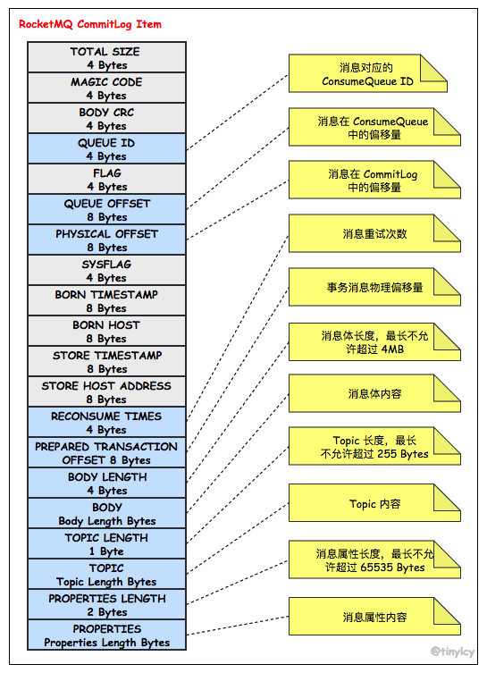
</div>

与 CommitLog 不同，ConsumeQueue 的存储条目采用定长存储结构，如下图所示。为了实现定长存储，ConsumeQueue 存储了消息 Tag 的 Hash Code，在进行 Broker 端消息过滤时，通过比较 Consumer 订阅 Tag 的 HashCode 和存储条目中的 Tag Hash Code 是否一致来决定是否消费消息。

<div align="center">
    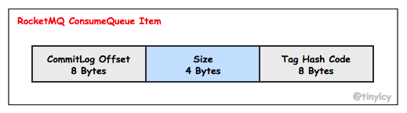
</div>

举个例子，假如集群有一个 Broker，Topic 为 binlog 的队列（Consume Queue）数量为 4，如下图所示，按顺序发送这 5 条内容各不相同消息：

<div align="center">
    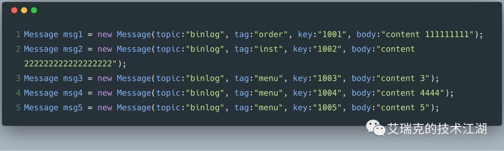
</div>

对于上面发送的 5 条消息，CommitLog 和 ConsumeQueue 文件的状态如下所示：

<div align="center">
    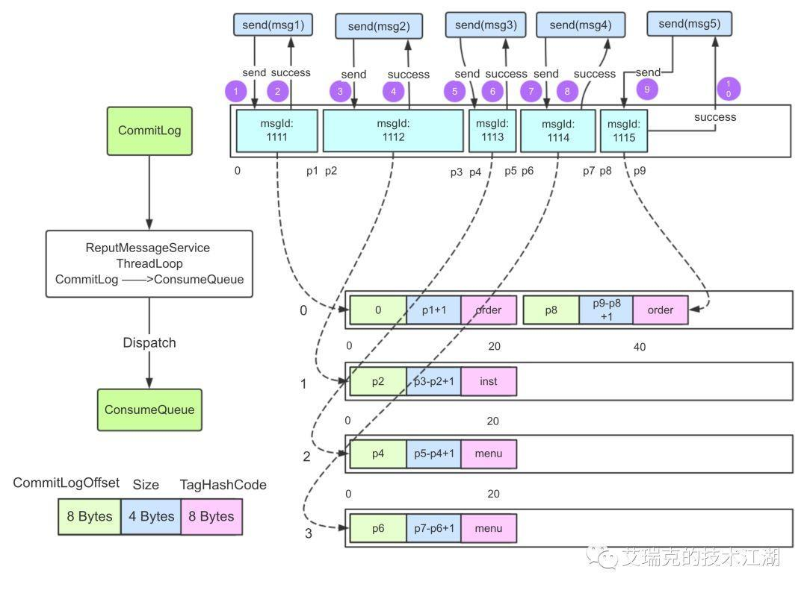
</div>

RMQ 的消息整体是有序的，所以这 5 条消息按顺序将内容持久化在 Commit Log 中。Consume Queue 则用于将消息均衡地排列在不同的逻辑队列，集群模式下多个消费者就可以并行消费 Consume Queue 的消息。

### 2.3 IndexFile 文件

单个 Index 文件大小等于 420000040 B，包含索引头（IndexHeader）、哈希槽（HashSlot）和消息索引（MessageIndex）。同时，CommitLog 和 ConsumeQueue 以字节偏移量作为文件名，第一个 CommitLog 文件的偏移量为 00000000000000000000，第二个 CommitLog 的文件名为 1024 * 1024 * 1024 = 00000000001073741824，而第二个 ConsumeQueue 的文件名为 20 * 30 W = 00000000000006000000。

消息消费队列 ConsumeQueue 是 rocketmq 专门为消息订阅构建的索引文件，提高根据【主题】与【消息队列】检索消息的速度。除此之外，rcoketmq 引入了 Hash 索引机制专门为【消息】建立索引，也就是 IndexFile。IndexFile 的结构和 HashMap 比较像，也包括两个基本点，Hash 槽与 Hash 冲突的链表结构。

**<font color="red">IndexFile 的结构分为以下 3 个部分：IndexHead（40 个字节）、hash 槽（500万个）、index 条目（2000万个）</font>**。IndexHead：包含 40 个字节，记录该 IndexFile 的统计信息，包含的具体信息在 IndexHead 对象属性中 hash 槽列表：一个 IndexFile 默认包含 500 万个 Hash 槽，每个 Hash 槽存储的是落在该 Hash 槽的最新的 Index 的索引（落在同一个 hash 槽的 Index 索引会形成 链表结构）。每个 hash 槽是大概 4 个字节 Index 条目列表：默认一个索引文件包含 2000 万个条目，**<font color="red">每一个 Index 条目（总共 20 个字节）结构如下： hashcode：key 的 hashcode；phyoffset：消息对应的物理偏移量；timedif：该消息存储时间与第一条消息的时间戳的差值，小于 0 该消息无效；prelndexNo：该条目的前一条记录的 Index 索引，当出现 hash 冲突时，构建链表结构</font>**。

在已有的 CommitLog 和 ConsumeQueue 基础之上，消息中间件的消息发送和消费逻辑已经可以得到满足，RocketMQ 引入 Index 的目的是为消息建立索引方便问题排查：在给定消息 Topic 和 Key 的前提下，快速定位消息。Index 的文件存储结构如下图所示。Index 的整体设计思想类似持久化在磁盘的 HashMap，同样使用链式地址法解决哈希冲突：每个 Hash Slot 关联一个 Message Index 链表，Hash Slot 中存储的是最新的 Message Index 条目的索引，并且多个 Message Index 通过 preIndexOffset 连接。

<div align="center">
    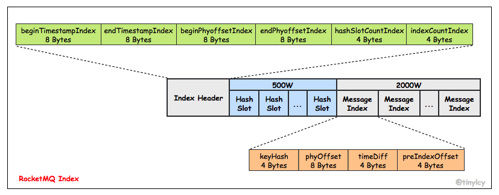
</div>

本节讨论了 RocketMQ 消息存储相关的核心文件存储结构。无论是 CommitLog，ConsumeQueue 还是 Index，RocketMQ 均使用统一的 MappedFile 来抽象。本文将讨论 RocketMQ 是如何围绕 MappedFile 并结合内存映射来构建 CommitLog。

## 三、RocketMQ 消息存储整体架构

<div align="center">
    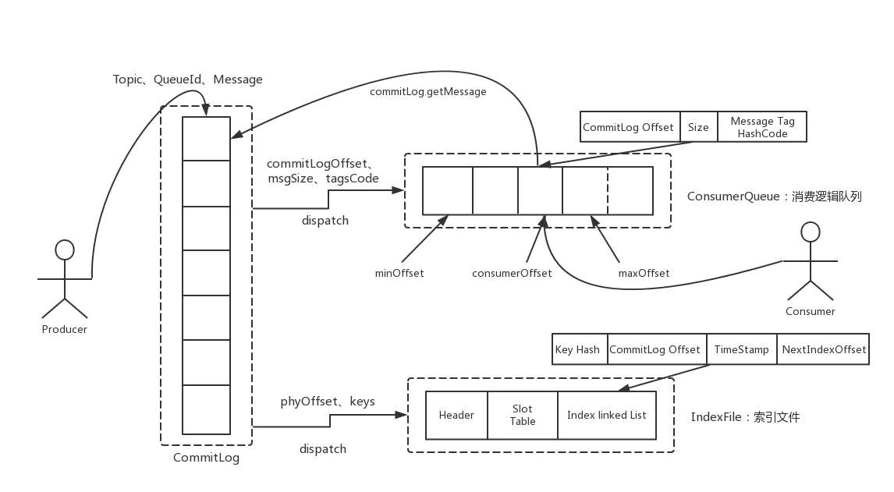
</div>

### 3.1 RocketMQ 消息存储结构类型及缺点

上图即为 RocketMQ 的消息存储整体架构，RocketMQ 采用的是混合型的存储结构，即为 Broker 单个实例下所有的队列共用一个日志数据文件（即为 CommitLog ）来存储。而 Kafka 采用的是独立型的存储结构，每个队列一个文件。这里，RocketMQ 采用混合型存储结构的缺点在于，会存在较多的随机读操作，因此读的效率偏低。同时消费消息需要依赖 ConsumeQueue，构建该逻辑消费队列需要一定开销。

### 3.2 RocketMQ 消息存储架构深入分析

从上面的整体架构图中可见，**<font color="red">RocketMQ 的混合型存储结构针对 Producer 和 Consumer 分别采用了数据和索引部分相分离的存储结构</font>**，Producer 发送消息至 Broker 端，然后 Broker 端使用同步或者异步的方式对消息刷盘持久化，保存至 CommitLog 中。只要消息被刷盘持久化至磁盘文件 CommitLog 中，那么 Producer 发送的消息就不会丢失。正因为如此，Consumer 也就肯定有机会去消费这条消息，至于消费的时间可以稍微滞后一些也没有太大的关系。退一步地讲，即使Consumer端第一次没法拉取到待消费的消息，Broker服务端也能够通过长轮询机制等待一定时间延迟后再次发起拉取消息的请求。

这里，RocketMQ 的具体做法是，**<font color="red">使用 Broker 端的后台服务线程—ReputMessageService 不停地分发请求并异步构建 ConsumeQueue（逻辑消费队列）和 IndexFile（索引文件）数据</font>**。然后， Consumer 即可根据 ConsumerQueue 来查找待消费的消息了。其中，ConsumeQueue（逻辑消费队列）作为消费消息的索引，保存了指定 Topic 下的队列消息在 CommitLog 中的起始物理偏移量 offset，消息大小 size 和消息 Tag 的 HashCode 值。而 IndexFile（索引文件）则只是为了消息查询提供了一种通过 key 或时间区间来查询消息的方法（这种通过 IndexFile 来查找消息的方法不影响发送与消费消息的主流程）。

### 3.3 RokcketMQ 文件存储模型层次结构

<div align="center">
    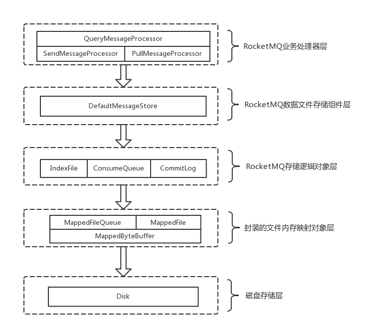
</div>

RocketMQ文件存储模型层次结构如上图所示，根据类别和作用从概念模型上大致可以划分为5层，下面将从各个层次分别进行分析和阐述：

#### 3.3.1 RocketMQ 业务处理器层

Broker 端对消息进行读取和写入的业务逻辑入口，这一层主要包含了业务逻辑相关处理操作（根据解析 RemotingCommand 中的 RequestCode 来区分具体的业务操作类型，进而执行不同的业务处理流程），比如前置的检查和校验步骤、构造 MessageExtBrokerInner 对象、decode 反序列化、构造Response 返回对象等；

#### 3.3.2 RocketMQ 数据存储组件层

该层主要是 RocketMQ 的存储核心类—DefaultMessageStore，其为 RocketMQ 消息数据文件的访问入口，通过该类的 "putMessage()" 和 "getMessage()" 方法完成对 CommitLog 消息存储的日志数据文件进行读写操作（具体的读写访问操作还是依赖下一层中 CommitLog 对象模型提供的方法）；另外，在该组件初始化时候，还会启动很多存储相关的后台服务线程，包括 AllocateMappedFileService（MappedFile 预分配服务线程）、ReputMessageService（回放存储消息服务线程）、HAService（Broker 主从同步高可用服务线程）、StoreStatsService（消息存储统计服务线程）、IndexService（索引文件服务线程）等；

#### 3.3.3 RocketMQ 存储逻辑对象层

该层主要包含了 RocketMQ 数据文件存储直接相关的三个模型类 IndexFile、ConsumerQueue 和 CommitLog。IndexFile 为索引数据文件提供访问服务，ConsumerQueue 为逻辑消息队列提供访问服务，CommitLog 则为消息存储的日志数据文件提供访问服务。这三个模型类也是构成了 RocketMQ 存储层的整体结构；

#### 3.3.4 封装的文件内存映射层

RocketMQ 主要采用 JDK NIO 中的 MappedByteBuffer 和 FileChannel 两种方式完成数据文件的读写。其中，采用 MappedByteBuffer 这种内存映射磁盘文件的方式完成对大文件的读写，在 RocketMQ 中将该类封装成MappedFile 类。这里限制的问题在上面已经讲过；对于每类大文件（IndexFile/ConsumerQueue/CommitLog），在存储时分隔成多个固定大小的文件（单个 IndexFile 文件大小约为 400M、单个 ConsumerQueue 文件大小约 5.72M、单个 CommitLog 文件大小为 1G），其中每个分隔文件的文件名为前面所有文件的字节大小数+1，即为文件的起始偏移量，从而实现了整个大文件的串联。这里，每一种类的单个文件均由 MappedFile 类提供读写操作服务；

#### 3.3.5 磁盘存储层

主要指的是部署 RocketMQ 服务器所用的磁盘。这里，需要考虑不同磁盘类型（如 SSD 或者普通的 HDD）特性以及磁盘的性能参数（如 IOPS、吞吐量和访问时延等指标）对顺序写/随机读操作带来的影响;

## 四、消息存储流程

在启动阶段，Broker 将消息处理器注册至核心控制器（BrokerController），Broker 根据请求的 RequestCode 将请求路由至对应的消息处理器。相比于 NameServer 将所有网络通信交由单一的消息处理器处理，**<font color="red">Broker 定义了八种消息处理器（AdminBrokerProcessor，ClientManageProcessor，ConsumerManageProcessor，EndTransactionProcessor，ForwardRequestProcessor，PullMessageProcessor，QueryMessageProcessor 和 SendMessageProcessor）</font>**。其中，SendMessageProcessor 负责处理消息发送请求，其注册相关的核心代码精简如下：

```java{.line-numbers}
// org.apache.rocketmq.broker.BrokerStartup#main
public static void main(String[] args) {
    start(createBrokerController(args));
}

// org.apache.rocketmq.broker.BrokerStartup#createBrokerController
public static BrokerController createBrokerController(String[] args) {
    // 省略代码
    try {
        // Configuation initialization.
        final BrokerConfig brokerConfig = new BrokerConfig();
        final NettyServerConfig nettyServerConfig = new NettyServerConfig();
        final NettyClientConfig nettyClientConfig = new NettyClientConfig();
        // 在 BrokerStartup 的 createBrokerController 方法中创建一个 BrokerController 对象
        final BrokerController controller = new BrokerController(brokerConfig, nettyServerConfig, nettyClientConfig, messageStoreConfig);
        // 对 BrokerController 进行初始化
        boolean initResult = controller.initialize();
        // 省略代码
        return controller;
    } catch (Throwable e) {
        // 省略代码
    }
    return null;
}

// org.apache.rocketmq.broker.BrokerController#initialize
public boolean initialize() throws CloneNotSupportedException {
    // 省略代码
    if (result) {
        try {
            // 创建 messageStore 对象
            this.messageStore = new DefaultMessageStore(this.messageStoreConfig, this.brokerStatsManager, this.messageArrivingListener,
                    this.brokerConfig);
            this.brokerStats = new BrokerStats((DefaultMessageStore) this.messageStore);
            // load plugin
            MessageStorePluginContext context = new MessageStorePluginContext(messageStoreConfig, brokerStatsManager, messageArrivingListener, brokerConfig);
            this.messageStore = MessageStoreFactory.build(context, this.messageStore);
            this.messageStore.getDispatcherList().addFirst(new CommitLogDispatcherCalcBitMap(this.brokerConfig, this.consumerFilterManager));
        } catch (IOException e) {
            result = false;
            log.error("Failed to initialize", e);
        }
    }
    result = result && this.messageStore.load();

    // Create several thread pool service.
    this.registerProcessor();
    // Create and execute a periodic action.
    // 省略代码
}

// org.apache.rocketmq.broker.BrokerController#registerProcessor
public void registerProcessor() {
    SendMessageProcessor sendProcessor = new SendMessageProcessor(this);
    sendProcessor.registerSendMessageHook(sendMessageHookList);
    sendProcessor.registerConsumeMessageHook(consumeMessageHookList);
    this.remotingServer.registerProcessor(RequestCode.SEND_MESSAGE,  sendProcessor, this.sendMessageExecutor);
    // 省略代码
}

// org.apache.rocketmq.broker.BrokerController#start
public void start() throws Exception {
    if (this.messageStore != null) {
        // 开启 DefaultMessageStore
        this.messageStore.start();
    }

    // 省略代码
} 
```

SendMessageProcessor 实现了 NettyRequestProcessor 接口，其对消息的核心处理逻辑实现在 processRequest 方法中，RocketMQ 发送消息包括单个消息发送和批量消息发送，本节以单个消息发送为例进一步说明。不同 Topic 的消息最终均被顺序持久化至共享的 CommitLog，CommitLog 由固定大小的文件队列组成，文件队列被定义为 MappedFileQueue，MappedFileQueue 中每个文件被定义为 MappedFile，每个MappedFile 对应一个具体的文件用于将消息持久化至磁盘。CommitLog、MappedFileQueue 和 MappedFile 之间的依赖关系如下所示。

<div align="center">
    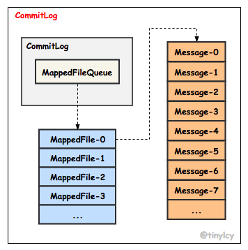
</div>

从上面的代码可以看出，在 Broker 启动阶段 DefaultMessageStore 被初始化（确切地说是在 BrokerController 的 initialize 方法中），然后在 BrokerController 的 start 方法中启动 DefaultMessageStore。DefaultMessageStore 是 RocketMQ 消息存储的抽象，提供 CommitLog 的维护、ConsumeQueue & Index 的异步构建（ReputMessageService）、MappedFile 内存映射的分配（AllocateMappedFileService）、HA（HAService） 等保障。DefaultMessageStore 通过 putMessage 方法将消息存储至 CommitLog，核心代码精简如下：

```java{.line-numbers}
// DefaultMessageStore#putMessage
public PutMessageResult putMessage(MessageExtBrokerInner msg) {
    // 判断当前 Broker 是否能够进行消息写入
    
    // 1.如果当前 Broker 停止工作，不支持写入
    if (this.shutdown) {
        log.warn("message store has shutdown, so putMessage is forbidden");
        return new PutMessageResult(PutMessageStatus.SERVICE_NOT_AVAILABLE, null);
    }
    // 2.如果当前 Broker 是 SLAVE 的话，那么也不支持写入
    if (BrokerRole.SLAVE == this.messageStoreConfig.getBrokerRole()) {
        long value = this.printTimes.getAndIncrement();
        if ((value % 50000) == 0) {
            log.warn("message store is slave mode, so putMessage is forbidden ");
        }
        return new PutMessageResult(PutMessageStatus.SERVICE_NOT_AVAILABLE, null);
    }
    // 3.如果当前 Broker 不支持消息写入，则拒绝消息写入
    if (!this.runningFlags.isWriteable()) {
        long value = this.printTimes.getAndIncrement();
        if ((value % 50000) == 0) {
            log.warn("message store is not writeable, so putMessage is forbidden " + this.runningFlags.getFlagBits());
        }
        return new PutMessageResult(PutMessageStatus.SERVICE_NOT_AVAILABLE, null);
    } else {
        this.printTimes.set(0);
    }
    // 4.如果消息主题的长度大于 256 个字符，则拒绝消息写入
    if (msg.getTopic().length() > Byte.MAX_VALUE) {
        log.warn("putMessage message topic length too long " + msg.getTopic().length());
        return new PutMessageResult(PutMessageStatus.MESSAGE_ILLEGAL, null);
    }
    // 5.如果消息属性的长度超过 65536 个字符，则拒绝消息写入
    if (msg.getPropertiesString() != null && msg.getPropertiesString().length() > Short.MAX_VALUE) {
        log.warn("putMessage message properties length too long " + msg.getPropertiesString().length());
        return new PutMessageResult(PutMessageStatus.PROPERTIES_SIZE_EXCEEDED, null);
    }

    if (this.isOSPageCacheBusy()) {
        return new PutMessageResult(PutMessageStatus.OS_PAGECACHE_BUSY, null);
    }

    long beginTime = this.getSystemClock().now();
    PutMessageResult result = this.commitLog.putMessage(msg);

    long eclipseTime = this.getSystemClock().now() - beginTime;
    if (eclipseTime > 500) {
        log.warn("putMessage not in lock eclipse time(ms)={}, bodyLength={}", eclipseTime, msg.getBody().length);
    }
    this.storeStatsService.setPutMessageEntireTimeMax(eclipseTime);

    if (null == result || !result.isOk()) {
        this.storeStatsService.getPutMessageFailedTimes().incrementAndGet();
    }

    return result;
} 
```

在将消息存储至 CommitLog 之前，需要校验 DefaultMessageStore 状态、当前 Broker 节点角色、DefaultMessageStore 是否允许写入、Topic 和 Properties 是否超长和 PageCache 是否繁忙。校验通过后，接着消息交由 CommitLog 的 putMessage 方法将消息 append 至 MappedFileQueue 中最后一个 MappedFile。

putMessage 方法核心流程（暂不涉及延迟消息）包括：

1. 尝试获取最后一个 MappedFile
2. 然后通过对 CommitLog 加锁将 append CommitLog 限定为一种串行操作；
3. 如果没有获取到 MappedFile 或者 MappedFile 已满，创建新的 MappedFile；
4. 将消息 append 至 MappedFile，如果返回结果为 END_OF_FILE，说明 MappedFile 已经没有足够的剩余空间，创建新的 MappedFile 并将消息重新 append 至新 MappedFile；
5. 释放 CommitLog 锁；

上述逻辑核心代码如下:

```java{.line-numbers}public PutMessageResult putMessage(final MessageExtBrokerInner msg) {
    // Set the storage time
    msg.setStoreTimestamp(System.currentTimeMillis());
    // Set the message body BODY CRC (consider the most appropriate setting on the client)
    msg.setBodyCRC(UtilAll.crc32(msg.getBody()));
    // Back to Results
    AppendMessageResult result = null;
    
    StoreStatsService storeStatsService = this.defaultMessageStore.getStoreStatsService();
    String topic = msg.getTopic();
    int queueId = msg.getQueueId();
    
    if (tranType == MessageSysFlag.TRANSACTION_NOT_TYPE || tranType == MessageSysFlag.TRANSACTION_COMMIT_TYPE) {
        // Delay Delivery
        if (msg.getDelayTimeLevel() > 0) {
            // 如果消息的延迟级别超过最大的延迟级别的话（默认为 32），就将其设置为 32
            if (msg.getDelayTimeLevel() > this.defaultMessageStore.getScheduleMessageService().getMaxDelayLevel()) {
                msg.setDelayTimeLevel(this.defaultMessageStore.getScheduleMessageService().getMaxDelayLevel());
            }
    
            // 定时消息的主题统一设置为 SCHEDULE_TOPIC_XXX
            topic = ScheduleMessageService.SCHEDULE_TOPIC;
            // 定时消息的消息队列为: delayLevel - 1
            queueId = ScheduleMessageService.delayLevel2QueueId(msg.getDelayTimeLevel());
    
            // 将这个消息的原主题和原来的消息队列 id 存入到消息的属性中，进行备份
            MessageAccessor.putProperty(msg, MessageConst.PROPERTY_REAL_TOPIC, msg.getTopic());
            MessageAccessor.putProperty(msg, MessageConst.PROPERTY_REAL_QUEUE_ID,String.valueOf(msg.getQueueId()));
            msg.setPropertiesString(MessageDecoder.messageProperties2String(msg.getProperties()));
            
            msg.setTopic(topic);
            msg.setQueueId(queueId);
        }
    }
    
    long eclipseTimeInLock = 0;
    MappedFile unlockMappedFile = null;
    
    // 获取到现在可以写入的 CommitLog 文件，其实也就是获取到 mappedFileQueue 中的最后一个 MappedFile
    MappedFile mappedFile = this.mappedFileQueue.getLastMappedFile();
    
    // 在往 CommitLog 中写入消息之前，先申请一个写锁 putMessageLock，这也就说明将消息写入到 CommitLog 是串行的
    putMessageLock.lock(); 
    try {
        long beginLockTimestamp = this.defaultMessageStore.getSystemClock().now();
        this.beginTimeInLock = beginLockTimestamp;
    
        // 设置消息的存储时间
        msg.setStoreTimestamp(beginLockTimestamp);
    
        // 1.如果 mappedFile 为空，说明本次消息是第一次消息发送，用偏移量 0 创建第一个 commitlog 文件，文件名为 0000 0000 0000 0000 0000，
        // 如果创建文件失败，抛出 CREATE_MAPEDFILE_FAILED 异常，可能是权限不够或者磁盘空间不足
        // 2.如果 mappedFile 已经满了的话，创建一个新的 mappedFile，这个新 mappedFile 的 createOffset 也就是初始偏移量是 
        // mappedFileLast.getFileFromOffset() + this.mappedFileSize
        if (null == mappedFile || mappedFile.isFull()) {
            mappedFile = this.mappedFileQueue.getLastMappedFile(0); // Mark: NewFile may be cause noise
        }
    
        if (null == mappedFile) {
            log.error("create mapped file1 error, topic: " + msg.getTopic() + " clientAddr: " + msg.getBornHostString());
            beginTimeInLock = 0;
            return new PutMessageResult(PutMessageStatus.CREATE_MAPEDFILE_FAILED, null);
        }
    
        result = mappedFile.appendMessage(msg, this.appendMessageCallback);
        switch (result.getStatus()) {
        case PUT_OK:
            break;
        case END_OF_FILE:
            unlockMappedFile = mappedFile;
            // Create a new file, re-write the message
            // 上一个 MappedFile 已经满了，创建一个新的 MappedFile，并且将消息重新 append 到新的 MappedFile
            mappedFile = this.mappedFileQueue.getLastMappedFile(0);
            if (null == mappedFile) {
                log.error("create mapped file2 error, topic: " + msg.getTopic() + " clientAddr: " + msg.getBornHostString());
                beginTimeInLock = 0;
                return new PutMessageResult(PutMessageStatus.CREATE_MAPEDFILE_FAILED, result);
            }
            result = mappedFile.appendMessage(msg, this.appendMessageCallback);
            break;
        // ...
        }
    
        eclipseTimeInLock = this.defaultMessageStore.getSystemClock().now() - beginLockTimestamp;
        beginTimeInLock = 0;
    } finally{
        putMessageLock.unlock();
    }
    
    if (eclipseTimeInLock > 500) {
        log.warn("[NOTIFYME]putMessage in lock cost time(ms)={}, bodyLength={} AppendMessageResult={}");
    }
    
    if (null != unlockMappedFile && this.defaultMessageStore.getMessageStoreConfig().isWarmMapedFileEnable()) {
        this.defaultMessageStore.unlockMappedFile(unlockMappedFile);
    }
    
    // result 的类型为 AppendMessageResult
    PutMessageResult putMessageResult = new PutMessageResult(PutMessageStatus.PUT_OK, result);
    
    // Statistics
    storeStatsService.getSinglePutMessageTopicTimesTotal(msg.getTopic()).incrementAndGet();
    storeStatsService.getSinglePutMessageTopicSizeTotal(topic).addAndGet(result.getWroteBytes());
    
    // DefaultAppendMessageCallback#doAppend 是将消息追加在内存中， 需要根据是同步刷盘还是异步刷盘方式，
    // 将内存中的数据持久化到磁盘
    handleDiskFlush(result, putMessageResult, msg);
    // 然后执行 HA 主从同步复制
    handleHA(result, putMessageResult, msg);
    
    return putMessageResult;
}
```

接着进一步理解创建 MappedFile 的原理。在 DefaultMessageStore 调用构造函数的初始化期间会启动 AllocateMappedFileService 线程，这个线程用来真正的为 MappedFile 分配存储空间。当需要创建 MappedFile 时，首先基于 startOffset 计算 MappedFile 文件名，包括两种场景：如果此时不存在 MappedFile，意味着当前为第一次消息投递或者历史 MappedFile 已经被清理，createOffset 不能简单等于 startOffset % mappedFileSize；如果此时最后一个 MappedFile 已存在且已满，createOffset 等于最后一个 MappedFile 的 fromOffset + mappedFileSize。

消息处理线程基于 createOffset 构建两个连续的 AllocateRequest 并插入 AllocateMappedFileService 线程维护的 requestQueue。AllocateMappedFileService 线程读取 requestQueue 中的 AllocateRequest 异步创建对应的 MappedFile。在创建过程中，消息处理线程通过 CountDownLatch 同步等待 MappedFile 完成创建。思考一个问题，消息处理线程为什么不直接同步创建 MappedFile，而是通过创建一个 AllocateRequest 请求，由 AllocateMappedFileService 线程异步统一处理？构建 AllocateRequest 并插入 requestQueue 的核心代码如下。

```java{.line-numbers}
// MappedFileQueue#getLastMappedFile
public MappedFile getLastMappedFile(final long startOffset) {
    return getLastMappedFile(startOffset, true);
}

// MappedFileQueue#getLastMappedFile
public MappedFile getLastMappedFile(final long startOffset, boolean needCreate) {
    // 创建映射问价的起始偏移量
    long createOffset = -1;
    // 获取最后一个映射文件，如果为null或者写满则会执行创建逻辑
    MappedFile mappedFileLast = getLastMappedFile();

    // 1.mappedFileLast == null 则说明此时不存在任何 mappedFile 文件或者历史的 mappedFile 文件已经被清理了
    // 此时的 createOffset 按照如下的方式进行计算
    if (mappedFileLast == null) {
        // 计算将要创建的映射文件的起始偏移量
        // 如果 startOffset < mappedFileSize 则起始偏移量为0
        // 如果 startOffset >= mappedFileSize 则起始偏移量为是 mappedFileSize 的倍数
        createOffset = startOffset - (startOffset % this.mappedFileSize);
    }

    // 2.mappedFileLast != null && mappedFileLast.isFull() 说明最后一个 mappedFile 的空间已满，此时 createOffset
    // 应该按照下面的方式进行计算，createOffset 也就是新的 mappedFile 的偏移量以及文件名（这两个是相等的）
    if (mappedFileLast != null && mappedFileLast.isFull()) {
        // 创建的映射文件的偏移量等于最后一个映射文件的起始偏移量 + 映射文件的大小（commitlog文件大小）
        createOffset = mappedFileLast.getFileFromOffset() + this.mappedFileSize;
    }

    if (createOffset != -1 && needCreate) {
        String nextFilePath = this.storePath + File.separator + UtilAll.offset2FileName(createOffset);
        String nextNextFilePath = this.storePath + File.separator + UtilAll.offset2FileName(createOffset + this.mappedFileSize);
        MappedFile mappedFile = null;

        if (this.allocateMappedFileService != null) {
            // 预分配内存
            // 基于 createOffset 构建两个连续的 AllocateRequest 并插入 AllocateMappedFileService 线程维护的 requestQueue
            // 这两个 AllocateRequest 也就是创建两个 mappedFile 文件，一个文件的初始偏移量为 createOffset，另外一个为 createOffset + mappedFileSize
            // AllocateMappedFileService 线程读取 requestQueue 中的 AllocateRequest 异步创建对应的 MappedFile。在创建过程中，
            // 消息处理线程通过 CountDownLatch 同步等待 MappedFile 完成创建
            mappedFile = this.allocateMappedFileService.putRequestAndReturnMappedFile(nextFilePath, nextNextFilePath, this.mappedFileSize);
        } else {
            try {
                mappedFile = new MappedFile(nextFilePath, this.mappedFileSize);
            } catch (IOException e) {
                log.error("create mappedFile exception", e);
            }
        }

        if (mappedFile != null) {
            if (this.mappedFiles.isEmpty()) {
                mappedFile.setFirstCreateInQueue(true);
            }
            this.mappedFiles.add(mappedFile);
        }

        return mappedFile;
    }

    return mappedFileLast;
} 

// AllocateMappedFileService#putRequestAndReturnMappedFile
public MappedFile putRequestAndReturnMappedFile(String nextFilePath, String nextNextFilePath, int fileSize) {
    // 默认提交两个请求
    int canSubmitRequests = 2;
    if (this.messageStore.getMessageStoreConfig().isTransientStorePoolEnable()) {
        if (this.messageStore.getMessageStoreConfig().isFastFailIfNoBufferInStorePool()
                && BrokerRole.SLAVE != this.messageStore.getMessageStoreConfig().getBrokerRole()) { 
            canSubmitRequests = this.messageStore.getTransientStorePool().remainBufferNumbs()
                    - this.requestQueue.size();
        }
    }

    // 创建一个 AllocateRequest 请求，创建初始偏移量为 nextFilePath 的 mappedFile 
    AllocateRequest nextReq = new AllocateRequest(nextFilePath, fileSize);
    // 判断 requestTable 中是否存在该路径的分配请求，如果存在则说明该请求已经在排队中
    boolean nextPutOK = this.requestTable.putIfAbsent(nextFilePath, nextReq) == null;

    // 该路径没有在排队
    if (nextPutOK) {
        if (canSubmitRequests <= 0) {
            log.warn("[NOTIFYME]TransientStorePool is not enough, so create mapped file error, ");
            this.requestTable.remove(nextFilePath);
            return null;
        }
        // 将创建的 AllocateRequest 放入到 requestQueue 中
        boolean offerOK = this.requestQueue.offer(nextReq);
        if (!offerOK) {
            log.warn("never expected here, add a request to preallocate queue failed");
        }
        canSubmitRequests--;
    }

    // 创建一个 AllocateRequest 请求，创建初始偏移量为 nextNextFilePath（等于 nextFilePath + mappedFileSize） 的 mappedFile 
    AllocateRequest nextNextReq = new AllocateRequest(nextNextFilePath, fileSize);
    boolean nextNextPutOK = this.requestTable.putIfAbsent(nextNextFilePath, nextNextReq) == null;
    if (nextNextPutOK) {
        if (canSubmitRequests <= 0) {
            log.warn("[NOTIFYME]TransientStorePool is not enough, so skip preallocate mapped file, ";
            this.requestTable.remove(nextNextFilePath);
        } else {
            boolean offerOK = this.requestQueue.offer(nextNextReq);
            if (!offerOK) {
                log.warn("never expected here, add a request to preallocate queue failed");
            }
        }
    }

    if (hasException) {
        log.warn(this.getServiceName() + " service has exception. so return null");
        return null;
    }

    // 获取创建第一个 mappedFile 的请求
    AllocateRequest result = this.requestTable.get(nextFilePath);
    try {
        if (result != null) {
            // 阻塞等待创建第一个 mappedFile 完成
            // AllocateMappedFileService 线程循环从 requestQueue 获取 AllocateRequest，AllocateRequest 实现了 Comparable 接口，
            // 依据文件名从小到大排序。当需要创建 MappedFile 时，同时构建两个 AllocateRequest，消息处理线程通过下面的 CountDownLatch 将 
            // AllocateMappedFileService 线程异步创建第一个 MappedFile 文件转化为同步操作，而第二个 MappedFile 文件的仍然创建交由 
            // AllocateMappedFileService 线程异步创建。当消息处理线程需要再次创建 MappedFile 时，此时可以直接获取已创建的 MappedFile。
            boolean waitOK = result.getCountDownLatch().await(waitTimeOut, TimeUnit.MILLISECONDS);
            if (!waitOK) {
                log.warn("create mmap timeout " + result.getFilePath() + " " + result.getFileSize());
                return null;
            } else {
                this.requestTable.remove(nextFilePath);
                // 返回创建好的第一个 mappedFile 对象
                return result.getMappedFile();
            }
        } else {
            log.error("find preallocate mmap failed, this never happen");
        }
    } catch (InterruptedException e) {
        log.warn(this.getServiceName() + " service has exception. ", e);
    }

    return null;
}
```

回答上面提出的问题，AllocateMappedFileService 线程循环从 requestQueue 获取 AllocateRequest，AllocateRequest 实现了 Comparable 接口，依据文件名从小到大排序。当需要创建 MappedFile 时，同时构建两个 AllocateRequest，消息处理线程通过 CountDownLatch 将 AllocateMappedFileService 线程异步创建第一个 MappedFile 文件转化为同步操作（RocketMQ 存在大量利用 CountDownLatch 将异步转化为同步的案例），而第二个 MappedFile 文件的仍然创建交由 AllocateMappedFileService 线程异步创建。当消息处理线程需要再次创建 MappedFile 时，此时可以直接获取已创建的 MappedFile。AllocateMappedFileService 线程创建 MappedFile 核心逻辑如下。

```java{.line-numbers}
// AllocateMappedFileService#mmapOperation
private boolean mmapOperation() {
    boolean isSuccess = false;
    AllocateRequest req = null;
    try {
        req = this.requestQueue.take();
        AllocateRequest expectedRequest = this.requestTable.get(req.getFilePath());
        if (null == expectedRequest) {
            log.warn("this mmap request expired, maybe cause timeout");
            return true;
        }
        if (expectedRequest != req) {
            log.warn("never expected here,  maybe cause timeout");
            return true;
        }

        if (req.getMappedFile() == null) {
            long beginTime = System.currentTimeMillis();

            // 在下面开始正式进行 mappedFile 的创建工作
            // 如果 isTransientStorePoolEnable 为 true，MappedFile 会将 TransientStorePool 申请的堆外内存（Direct Byte Buffer）空间作为 
            // writeBuffer，写入消息时先将消息写入 writeBuffer，然后将消息提交至 fileChannel 再 flush；否则，直接创建 MappedFile 内存映射
            // 文件字节缓冲区 mappedByteBuffer，将消息写入 mappedByteBuffer 再 flush。完成消息写入后，更新 wrotePosition（此时还未 flush 至磁盘）
            MappedFile mappedFile;
            if (messageStore.getMessageStoreConfig().isTransientStorePoolEnable()) {
                try {
                    mappedFile = ServiceLoader.load(MappedFile.class).iterator().next();
                    mappedFile.init(req.getFilePath(), req.getFileSize(), messageStore.getTransientStorePool());
                } catch (RuntimeException e) {
                    log.warn("Use default implementation.");
                    mappedFile = new MappedFile(req.getFilePath(), req.getFileSize(), messageStore.getTransientStorePool());
                }
            } else {
                mappedFile = new MappedFile(req.getFilePath(), req.getFileSize());
            }

            // 省略代码

            // pre write mappedFile
            // 对 MappedFile 进行预热
            if (mappedFile.getFileSize() >= this.messageStore.getMessageStoreConfig().getMapedFileSizeCommitLog() &&
                this.messageStore.getMessageStoreConfig().isWarmMapedFileEnable()) {
                mappedFile.warmMappedFile(this.messageStore.getMessageStoreConfig().getFlushDiskType(),
                    this.messageStore.getMessageStoreConfig().getFlushLeastPagesWhenWarmMapedFile());
            }

            req.setMappedFile(mappedFile);
            this.hasException = false;
            isSuccess = true;
        }
    } catch (InterruptedException e) {
        // ignore code
    } catch (IOException e) {
        // ignore code
    } finally {
        if (req != null && isSuccess)
            req.getCountDownLatch().countDown();
    }
    return true;
} 
```

继续理解 MappedFile 的创建原理。如果 isTransientStorePoolEnable 为 true，MappedFile 会将TransientStorePool 申请的堆外内存（Direct Byte Buffer）空间作为 writeBuffer，写入消息时先将消息写入 writeBuffer，然后将消息提交（commit）至 fileChannel 再 flush；否则，直接创建 MappedFile 内存映射文件字节缓冲区mappedByteBuffer，将消息写入 mappedByteBuffer 再 flush（这时不需要进行提交 commit 操作，直接 flush）。完成消息写入后，更新 wrotePosition（此时还未 flush 至磁盘）。对于 RocketMQ 写入消息时为什么采用两种不同的方式，本文不做过多分析。消息 append 至 MappedFile 核心代码精简如下。

```java{.line-numbers}
// MappedFile#appendMessage
public AppendMessageResult appendMessage(final MessageExtBrokerInner msg, final AppendMessageCallback cb) {
    return appendMessagesInner(msg, cb);
}

// 将消息追加到 MappedFile 中
// MappedFile#appendMessageInner
public AppendMessageResult appendMessagesInner(final MessageExt messageExt, final AppendMessageCallback cb) {  
    // 先获取 MappedFile 当前的写指针  
    int currentPos = this.wrotePosition.get();

    // 如果 currentPos 大于或者等于文件大小，则表明文件已经写满，会抛出 AppendMessageStatus.UNKNOWN_ERROR 异常
    if (currentPos < this.fileSize) {
        // 如果 currentPos 小于文件大小，通过 slice() 方法创建一个与 MappedFile 的共享共存区，并设置 position 为当前指针
        // 如果 writeBuffer 为 null，则表明 transientStorePoolEnable 为 false，数据直接写入到 mappedByteBuffer 中
        // 否则的话。消息写入到 writeBuffer 中
        ByteBuffer byteBuffer = writeBuffer != null ? writeBuffer.slice() : this.mappedByteBuffer.slice();
        byteBuffer.position(currentPos);
        AppendMessageResult result = null;

        if (messageExt instanceof MessageExtBrokerInner) {
            result = cb.doAppend(this.getFileFromOffset(), byteBuffer, this.fileSize - currentPos, (MessageExtBrokerInner) messageExt);
        } else if (messageExt instanceof MessageExtBatch) {
            result = cb.doAppend(this.getFileFromOffset(), byteBuffer, this.fileSize - currentPos, (MessageExtBatch) messageExt);
        } else {
            return new AppendMessageResult(AppendMessageStatus.UNKNOWN_ERROR);
        }

        this.wrotePosition.addAndGet(result.getWroteBytes());
        this.storeTimestamp = result.getStoreTimestamp();
        return result;
    }

    log.error("MappedFile.appendMessage return null, wrotePosition: {} fileSize: {}", currentPos, this.fileSize);
    return new AppendMessageResult(AppendMessageStatus.UNKNOWN_ERROR);
} 

// org.apache.rocketmq.store.CommitLog.DefaultAppendMessageCallback#doAppend
public AppendMessageResult doAppend(final long fileFromOffset, final ByteBuffer byteBuffer, final int maxBlank,
    final MessageExtBrokerInner msgInner) {
    // PHY OFFSET
    // 写入消息的偏移量 wroteOffset 为：这个 MappedFile 最开始的偏移量 + position
    long wroteOffset = fileFromOffset + byteBuffer.position();
    this.resetByteBuffer(hostHolder, 8);
    // 创建一个全局唯一的消息 id，这个消息 id 有 16 个字节。这 16 个字节的组成如下：
    // 4 字节的 IP + 4 字节的端口号地址 + 8 字节的消息偏移量
    String msgId = MessageDecoder.createMessageId(this.msgIdMemory, msgInner.getStoreHostBytes(hostHolder), wroteOffset);

    final int msgLen = calMsgLength(bodyLength, topicLength, propertiesLength);

    //...

    // Determines whether there is sufficient free space
    // 判断 commitlog 剩下的空间是否可以容纳 消息的长度 + 8 个字节的系统信息
    // 如果大于则返回 AppendMessageStatus.END_OF_FILE，Broker 会重新创建一个新的 CommitLog 文件来存储该消息，
    // 从这里也可以看出来 CommitLog 最少会空闲 8 个字节，高 4 个字节会存储当前文件的剩余空间，低 4 个字节会存储魔数
    if ((msgLen + END_FILE_MIN_BLANK_LENGTH) > maxBlank) {
        this.resetByteBuffer(this.msgStoreItemMemory, maxBlank);
        // 1 TOTALSIZE 剩余空间
        this.msgStoreItemMemory.putInt(maxBlank);
        // 2 MAGICCODE 魔数
        this.msgStoreItemMemory.putInt(CommitLog.BLANK_MAGIC_CODE);
        // 3 The remaining space may be any value
        final long beginTimeMills = CommitLog.this.defaultMessageStore.now();
        byteBuffer.put(this.msgStoreItemMemory.array(), 0, maxBlank);
        return new AppendMessageResult(AppendMessageStatus.END_OF_FILE, wroteOffset, maxBlank, msgId,
                msgInner.getStoreTimestamp(), queueOffset,
                CommitLog.this.defaultMessageStore.now() - beginTimeMills);
    }

    // Initialization of storage space
    // ...

    // Write messages to the queue buffer
    // 将消息写入到 ByteBuffer 中，然后创建 AppendMessageResult。这里只是将消息存储到 MappedFile 对应的磁盘映射中，并没有刷到磁盘中
    byteBuffer.put(this.msgStoreItemMemory.array(), 0, msgLen);
    AppendMessageResult result = new AppendMessageResult(AppendMessageStatus.PUT_OK, wroteOffset, msgLen, msgId, msgInner.getStoreTimestamp(), 
                        queueOffset, CommitLog.this.defaultMessageStore.now() - beginTimeMills);

    return result;
}
```

如果有足够的剩余空间供消息写入，设置 byteBuffer（writeBuffer/mappedByteBuffer）的 position 等于 wrotePosition，执行 byteBuffer 的 put 方法将字节数组写入即可。如果 MappedFile 没有足够剩余空间（msgLen + END_FILE_MIN_BLANK_LENGTH > maxBlank），向 byteBuffer 写入 maxBlank 和 BLANK_MAGIC_CODE 后返回 END_OF_FILE，消息处理线程创建新的 MappedFile 并将消息 append 至 byteBuffer。

## 五、刷盘策略

rocketmq 的存储于读写是基于 JDK NIO 的内存映射机制（MappedByteBuffer）的，消息存储时首先将消息追加到内存，再根据配置的刷盘策略在不同时间进行刷写磁盘。

1. 如果是同步刷盘，消息追加到内存后，将同步调用 MappedByteBuffer 的 force 方法。
2. 如果是异步刷盘，在消息追加到内存后立刻返回给消息发送端。rocketmq 使用一个单独的线程按照某一个设定频率执行刷盘操作。

**<font color="red">通过在 broker 配置文件中 配置 flushDiskType 来设定刷盘方式，可选值为 ASYNC_FLUSH（异步刷盘）、SYNC_FLUSH（同步刷盘），默认为异步刷盘</font>**。rocketmq 的刷盘相关的有两个线程： 

1. flushCommitLogService，这个线程负责真正将 mappedByteBuffer 或者 fileChannel 中的数据写入到磁盘中。如果是同步刷盘的话，被初始化为 GroupCommitService，如果是异步刷盘则被初始化为 FlushRealTimeService。

2. commitLogService，值得注意的是如果开启了 transientStorePoolEnable，那么就会开启 commitLogService 线程。如果 transientStorePoolEnable 为 true 的话，往 CommitLog
写入数据时，是先写入到堆外内存 writeBuffer 中，而不是写入到 mappedByteBuffer 中。**<font color="red">所以这个线程的主要作用就是将 writeBuffer 中的数据写入到 fileChannel 中，然后再由 flushCommitLogService 线程进行真正的刷盘操作</font>**。

消息的刷盘流程如下，其中上面的流程是 transientStorePoolEnable 为 true 的情况，也就是说往 CommitLog 写入数据时，是先写入到堆外内存 writeBuffer 中，然后再从 writeBuffer 中提交到 fileChannel 中，最后刷盘的时候从 fileChannel 中写入到磁盘中。下面的流程是 transientStorePoolEnable 为 false 的情况，也就是说，消息是直接写入到 mappedByteBuffer 中，然后再刷盘写入到磁盘上。

<div align="center">
    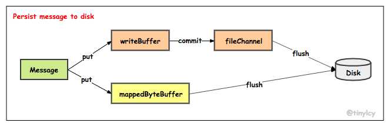
</div>

CommitLog 文件的刷盘机制，ConsumeQueue 文件的刷盘策略和 CommitLog 类似， 值得注意的是索引文件的刷盘并不是采取定时刷盘机制，而是每更新一次索引文件就将上一次的改动刷写到磁盘。CommitLog 的构造函数以及 start 启动方法如下：

```java{.line-numbers}
// CommitLog#CommitLog
public CommitLog(final DefaultMessageStore defaultMessageStore) {
    this.mappedFileQueue = new MappedFileQueue(defaultMessageStore.getMessageStoreConfig().getStorePathCommitLog(),
        defaultMessageStore.getMessageStoreConfig().getMapedFileSizeCommitLog(), defaultMessageStore.getAllocateMappedFileService());
    this.defaultMessageStore = defaultMessageStore;

    // 如果是同步刷盘策略，那么 flushCommitLogService 就初始化为 GroupCommitService
    if (FlushDiskType.SYNC_FLUSH == defaultMessageStore.getMessageStoreConfig().getFlushDiskType()) {
        this.flushCommitLogService = new GroupCommitService();
    // 如果是异步刷盘策略，flushCommitLogService 初始化为 FlushRealTimeService
    } else {
        this.flushCommitLogService = new FlushRealTimeService();
    }

    this.commitLogService = new CommitRealTimeService();

    this.appendMessageCallback = new DefaultAppendMessageCallback(defaultMessageStore.getMessageStoreConfig().getMaxMessageSize());
    batchEncoderThreadLocal = new ThreadLocal<MessageExtBatchEncoder>() {
        @Override
        protected MessageExtBatchEncoder initialValue() {
            return new MessageExtBatchEncoder(defaultMessageStore.getMessageStoreConfig().getMaxMessageSize());
        }
    };
    this.putMessageLock = defaultMessageStore.getMessageStoreConfig().isUseReentrantLockWhenPutMessage() ? 
        new PutMessageReentrantLock() : new PutMessageSpinLock();
}

// CommitLog#start
public void start() {
    this.flushCommitLogService.start();
    if (defaultMessageStore.getMessageStoreConfig().isTransientStorePoolEnable()) {
        this.commitLogService.start();
    }
} 
```

CommitRealTimeService 线程将 writeBuffer 中的数据 commit 至 fileChannel，执行 commit 有以下两个触发条件。

- writeBuffer 中待 commit 的数据的页数大于等于 commitCommitLogLeastPages，默认为 4 页，每页大小为 4 KB，即当待 commit 的数据超过 16 KB 时，执行 commit 操作。如果脏页的数量不超过 4 页，则不会进行提交操作
- 最近 commitCommitLogThoroughInterval 时间间隔内没有执行 commit 操作，主动执行一次 commit 操作，默认为 200 ms。

上述两个触发条件控制了 writeBuffer 中的数据能够在合并后再写入 fileChannel，提升 IO 性能。commit 操作执行完成后，CommitRealTimeService  唤醒 flushCommitLogService 线程执行 flush 操作。上述流程对应代码如下：

```java{.line-numbers}
class CommitRealTimeService extends FlushCommitLogService {

    private long lastCommitTimestamp = 0;

    @Override
    public String getServiceName() {
        return CommitRealTimeService.class.getSimpleName();
    }

    @Override
    public void run() {
        CommitLog.log.info(this.getServiceName() + " service started");
        while (!this.isStopped()) {
            // CommitRealTimeService 线程间隔时间，默认 200ms
            int interval = CommitLog.this.defaultMessageStore.getMessageStoreConfig().getCommitIntervalCommitLog();
            // commitDataLeastPages 一次提交任务至少包含页数， 如果待提交数据不足，小于该参数配置的值，将忽略本次提交任务，默认为 4 页
            int commitDataLeastPages = CommitLog.this.defaultMessageStore.getMessageStoreConfig().getCommitCommitLogLeastPages();
            // commitDataThoroughInterval 两次真实提交的最大间隔，默认为 200ms
            int commitDataThoroughInterval = CommitLog.this.defaultMessageStore.getMessageStoreConfig().getCommitCommitLogThoroughInterval();

            // 如果距上次提交间隔超过 commitDataThoroughInterval，则本次提交忽略 commitDataLeastPages 参数，也就是如果待提交数据小于指定页数，
            // 也执行提交操作
            long begin = System.currentTimeMillis();
            if (begin >= (this.lastCommitTimestamp + commitDataThoroughInterval)) {
                this.lastCommitTimestamp = begin;
                commitDataLeastPages = 0;
            }

            try {
                boolean result = CommitLog.this.mappedFileQueue.commit(commitDataLeastPages);
                long end = System.currentTimeMillis();
                if (!result) {
                    this.lastCommitTimestamp = end; // result = false means some data committed.
                    // commit 操作执行完成后，CommitRealTimeService 唤醒 flushCommitLogService 线程执行 flush 操作
                    flushCommitLogService.wakeup();
                }

                if (end - begin > 500) {
                    log.info("Commit data to file costs {} ms", end - begin);
                }
                this.waitForRunning(interval);
            } catch (Throwable e) {
                CommitLog.log.error(this.getServiceName() + " service has exception. ", e);
            }
        }

        boolean result = false;
        for (int i = 0; i < RETRY_TIMES_OVER && !result; i++) {
            result = CommitLog.this.mappedFileQueue.commit(0);
            CommitLog.log.info(this.getServiceName() + " service shutdown, retry " + (i + 1) + " times " + (result ? "OK" : "Not OK"));
        }
        CommitLog.log.info(this.getServiceName() + " service end");
    }
} 
```

MappedFile 维护的 committedPosition 和 wrotePosition 分别标记了 writeBuffer 中待 commit 数据的起始偏移量和终止偏移量，commit 操作基于此构造 ByteBuffer 并写入 fileChannel。上述流程核心代码如下：

```java{.line-numbers}
// MappedFile#commit
public int commit(final int commitLeastPages) {
    // 如果 writeBuffer 为空，说明是 transientStorePoolEnable 为 false，也就是说消息内容是直接写入到 mappedByteBuffer 中，
    // 所以不需要进行提交
    if (writeBuffer == null) {
        // no need to commit data to file channel, so just regard wrotePosition as committedPosition.
        return this.wrotePosition.get();
    }
    // commitLeastPages 为本次提交最小的页数，如果待提交数据不满 commitLeastPages ，则不执行本次提交操作，待下次提交
    if (this.isAbleToCommit(commitLeastPages)) {
        if (this.hold()) {
            commit0(commitLeastPages);
            this.release();
        } else {
            log.warn("in commit, hold failed, commit offset = " + this.committedPosition.get());
        }
    }
    // All dirty data has been committed to FileChannel.
    if (writeBuffer != null && this.transientStorePool != null && this.fileSize == this.committedPosition.get()) {
        this.transientStorePool.returnBuffer(writeBuffer);
        this.writeBuffer = null;
    }
    return this.committedPosition.get();
}

// MappedFile#commit0
protected void commit0(final int commitLeastPages) {
    int writePos = this.wrotePosition.get();
    int lastCommittedPosition = this.committedPosition.get();

    // 把 commitedPosition 到 wrotePosition 之间的数据写入到 FileChannel 中， 然后更新 committedPosition 指针为
    // wrotePosition。commit 的作用就是将 MappedFile#writeBuffer 中的数据提交到文件通道 FileChannel 中
    if (writePos - this.committedPosition.get() > 0) {
        try {
            // 创建 writeBuffer 的共享缓存区。slice 方法创建一个共享缓冲区，与原先的 ByteBuffer 共享内存，但是维护一套独立的指针
            ByteBuffer byteBuffer = writeBuffer.slice();
            byteBuffer.position(lastCommittedPosition);
            byteBuffer.limit(writePos);

            this.fileChannel.position(lastCommittedPosition);
            this.fileChannel.write(byteBuffer);
            this.committedPosition.set(writePos);
        } catch (Throwable e) {
            log.error("Error occurred when commit data to FileChannel.", e);
        }
    }
} 
```

相比于 Kafka，除了提供异步刷盘的能力，RocketMQ 还提供了同步刷盘的能力。同步刷盘的实现方式类似于 MappedFile 创建，即主线程构造刷盘请求 GroupCommitRequest 写入请求队列，由异步线程 GroupCommitService 消费请求，然后主线程在 CountDownLatch 上阻塞，等待异步线程刷盘任务的完成之后唤醒。对于异步刷盘，如果 isTransientStorePoolEnable 为 true，唤醒 CommitRealTimeService 线程将 writeBuffer 中的数据 commit 至 fileChannel，否则唤醒 FlushRealTimeService 线程将 mappedByteBuffer 的数据刷盘。

```java{.line-numbers}
// 同步刷盘和异步刷盘
public void handleDiskFlush(AppendMessageResult result, PutMessageResult putMessageResult, MessageExt messageExt) {
    // Synchronization flush
    // 同步刷盘，是指在消息追加到内存映射文件的内存之后，立即将数据刷写到磁盘
    // 同步刷盘的实现方式类似于 MappedFile 创建，即构造刷盘请求 GroupCommitRequest 写入请求队列，由异步线程 GroupCommitService 消费请求
    if (FlushDiskType.SYNC_FLUSH == this.defaultMessageStore.getMessageStoreConfig().getFlushDiskType()) {
        final GroupCommitService service = (GroupCommitService) this.flushCommitLogService;
        if (messageExt.isWaitStoreMsgOK()) {
            // 1.构建 GroupCommitRequest 同步任务并提交到 GroupCommitService
            GroupCommitRequest request = new GroupCommitRequest(result.getWroteOffset() + result.getWroteBytes());
            service.putRequest(request);
            // 2.waitForFlush 会阻塞直到刷盘任务完成，如果超时则返回刷盘错误， 刷盘成功后正常返回给调用方
            boolean flushOK = request.waitForFlush(this.defaultMessageStore.getMessageStoreConfig().getSyncFlushTimeout());
            if (!flushOK) {
                log.error("do groupcommit, wait for flush failed, topic: " + messageExt.getTopic() + " tags: " + messageExt.getTags()
                    + " client address: " + messageExt.getBornHostString());
                putMessageResult.setPutMessageStatus(PutMessageStatus.FLUSH_DISK_TIMEOUT);
            }
        } else {
            service.wakeup();
        }
    }
    // Asynchronous flush
    // 异步刷盘
    else {
        // 如果 isTransientStorePoolEnable 为 false1，唤醒 FlushCommitLogService 线程直接将 mappedByteBuffer 中的内容提交
        if (!this.defaultMessageStore.getMessageStoreConfig().isTransientStorePoolEnable()) {
            flushCommitLogService.wakeup();
        // 如果 isTransientStorePoolEnable 为 true，唤醒 CommitRealTimeService 线程将 writeBuffer 中的数据 commit 至 fileChannel
        // 虽然这里没有唤醒 flushCommitLogService，但是在 commitLogService 线程中，将 writeBuffer 中的数据提交后会自行唤醒 flushCommitLogService
        } else {
            commitLogService.wakeup();
        }
    }
} 
```

为了避免刷盘请求 GroupCommitRequest 的锁竞争，**<font color="red">GroupCommitService 线程维护了读队列 requestsRead 和写队列 requestsWrite，在提交的时候，GroupCommitRequest 会提交到 reuqestsWrite 中，而 GroupCommitService 会从 reuqestsRead 中读取磁盘的刷盘请求，GroupCommitRequest 的提交和消费不会阻塞</font>**。当 GroupCommitService 线程消费完 requestsRead 队列后，清空 requestsRead，交换 requestsRead 和 requestsWrite。上述逻辑核心代码如下：

```java{.line-numbers}
public static class GroupCommitRequest {
    // 刷盘点偏移量
    private final long nextOffset;
    private final CountDownLatch countDownLatch = new CountDownLatch(1);
    // 刷盘结果，初始状态为 false
    private volatile boolean flushOK = false;

    // GroupCommitService 线程处理 GroupCommitRequest 对象后将调用 wakeupCustomer 法将消费发送线程唤醒，并将刷盘的结果告知 GroupCommitRequest
    // 也就是将 flushOK 的结果保存到 GroupCommitRequest 中去
    public void wakeupCustomer(final boolean flushOK) {
        this.flushOK = flushOK;
        this.countDownLatch.countDown();
    }

    // 消费发送线程将消息追加到内存映射文件后，将同步任务 GroupCommitRequest 提交到 GroupCommitService 线程，然后调用阻塞等待刷盘结果，
    // 超时时间默认 5s
    public boolean waitForFlush(long timeout) {
        try {
            this.countDownLatch.await(timeout, TimeUnit.MILLISECONDS);
            return this.flushOK;
        } catch (InterruptedException e) {
            log.error("Interrupted", e);
            return false;
        }
    }
}

// 为了避免刷盘请求 GroupCommitRequest 的锁竞争，GroupCommitService 线程维护了 GroupCommitRequest
// 读队列 requestsRead 和写队列 requestsWrite，GroupCommitRequest 的提交和消费互不阻塞。当 GroupCommitService
// 线程消费完 requestsRead 队列后，清空 requestsRead，交换 requestsRead 和 requestsWrite
class GroupCommitService extends FlushCommitLogService {
    // 同步刷盘任务暂存器
    private volatile List<GroupCommitRequest> requestsWrite = new ArrayList<GroupCommitRequest>();
    // GroupCommitService 线程每次处理的 request 容器，这是一个设计亮点，避免了任务提交与任务执行的锁冲突
    // 在 putRequest 将创建的任务提交到 GroupCommitService 中时，是存入到 requestsWrite 列表中，但是在 doCommit 中
    // 真正是从 requestsRead 列表中读取任务进行刷盘操作，这样就避免了刷盘任务提交与刷盘任务具体执行的冲突
    private volatile List<GroupCommitRequest> requestsRead = new ArrayList<GroupCommitRequest>();

    public synchronized void putRequest(final GroupCommitRequest request) {
        synchronized (this.requestsWrite) {
            this.requestsWrite.add(request);
        }
        if (hasNotified.compareAndSet(false, true)) {
            // 如果线程处于等待状态，则将其唤醒
            waitPoint.countDown(); // notify
        }
    }

    // 由于避免同步刷盘消费任务与其他消息生产者提交任务直接的锁竞争，GroupCommitrvice 提供读容器与写容器，这两个容器每执行完一次任务后，
    // 交互，继续消费
    private void swapRequests() {
        List<GroupCommitRequest> tmp = this.requestsWrite;
        this.requestsWrite = this.requestsRead;
        this.requestsRead = tmp;
    }

    private void doCommit() {
        synchronized (this.requestsRead) {
            if (!this.requestsRead.isEmpty()) {
                // 1.遍历同步刷盘任务列表，根据加入顺序逐一执行刷盘逻辑
                for (GroupCommitRequest req : this.requestsRead) {
                    // There may be a message in the next file, so a maximum of two times the flush
                    boolean flushOK = false;
                    // 2.调用 mappedFileQueue#flush 方法执行刷盘操作，最终会调用 MappedByteBuffer#force 方法。
                    // 如果已刷盘指针大于等于提交的刷盘点，表示刷盘成功，每执行一次刷盘操作后，立即调用 GroupCommitRequest#wakeupCustomer
                    // 唤醒消息发送线程并通知刷盘结果
                    for (int i = 0; i < 2 && !flushOK; i++) {
                        flushOK = CommitLog.this.mappedFileQueue.getFlushedWhere() >= req.getNextOffset();
                        if (!flushOK) {
                            CommitLog.this.mappedFileQueue.flush(0);
                        }
                    }
                    req.wakeupCustomer(flushOK);
                }

                long storeTimestamp = CommitLog.this.mappedFileQueue.getStoreTimestamp();
                // 3.处理完所有的同步刷盘任务之后，更新刷盘检测点 StoreCheckpoint 中的 physicMsgTimestamp，
                // 但并没有执行检测点的刷盘操作，刷盘检测点的刷盘操作将在写消息队列文件时触发
                if (storeTimestamp > 0) {
                    CommitLog.this.defaultMessageStore.getStoreCheckpoint().setPhysicMsgTimestamp(storeTimestamp);
                }

                this.requestsRead.clear();
            } else {
                // Because of individual messages is set to not sync flush, it will come to this process
                CommitLog.this.mappedFileQueue.flush(0);
            }
        }
    }

    public void run() {
        CommitLog.log.info(this.getServiceName() + " service started");

        // GroupCommitService 每处理一批同步刷盘请求（也就是 requestsRead 容器中的刷盘请求）后"休息" 0ms，然后继续处理下一批，
        // 其任务的核心实现为 doCommit 方法
        while (!this.isStopped()) {
            try {
                this.waitForRunning(10);
                this.doCommit();
            } catch (Exception e) {
                CommitLog.log.warn(this.getServiceName() + " service has exception. ", e);
            }
        }

        try {
            Thread.sleep(10);
        } catch (InterruptedException e) {
            CommitLog.log.warn("GroupCommitService Exception, ", e);
        }

        synchronized (this) {
            this.swapRequests();
        }

        this.doCommit();

        CommitLog.log.info(this.getServiceName() + " service end");
    }
}
```

无论是否开启 isTransientStorePoolEnable，异步刷盘交由 FlushRealTimeService 线程处理。在 handleDiskFlush 方法中，如果 isTransientStorePoolEnable 为 true，仅唤醒了 CommitRealTimeService 线程，但是实际上 CommitRealTimeService 线程在 commit 之后也会唤醒 FlushRealTimeService 线程。FlushRealTimeService 线程维护了 lastFlushTimestamp 以标记上次 flush 磁盘的时间点。 FlushRealTimeService 线程 flush 磁盘的触发条件与 GroupCommitService 线程 commit 数据的触发条件类似： fileChannel 或者 mappedByteBuffer 中待 flush 的数据页大小大于等于 flushPhysicQueueLeastPages 页，默认为 4 页；距上次 flush 磁盘时间间隔超过 flushPhysicQueueThoroughInterval，默认为 10 s。最终 FlushRealTimeService 线程调用 fileChannel 和 mappedByteBuffer 的 force 方法将数据刷盘。

## 六、实时更新消息消费队列与索引文件

### 6.1.ReputMessageService

消息消费队列文件 ConsumeQueue、消息属性索引文件 IndexFile 都是基于 CommitLog 文件构建的，当消息生产者提交的消息 存储在 CommitLog 文件中的时候，ConsumeQueue、IndexFile 需要及时更新，否则消息无法及时消费。根据消息属性查找消息也会出现较大的延迟。RocketMQ 通过开启一个线程 ReputMessageService 来准实时转发 CommitLog 文件更新事件，相应的任务处理器 根据转发的消息及时更新 ConsumeQueue、IndexFile 文件。

```java{.line-numbers}
public DefaultMessageStore(final MessageStoreConfig messageStoreConfig, final BrokerStatsManager brokerStatsManager,
    final MessageArrivingListener messageArrivingListener, final BrokerConfig brokerConfig) throws IOException {
        // 省略代码
        this.dispatcherList = new LinkedList<>();
        this.dispatcherList.addLast(new CommitLogDispatcherBuildConsumeQueue());
        this.dispatcherList.addLast(new CommitLogDispatcherBuildIndex());
        // 省略代码
}
```

在 DefaultMessageStore 的构造函数中，会在 DispatcherList 中添加两个 CommitLogDispatcher 类对象，其中  CommitLogDispatcherBuildConsumeQueue 对象就是用来根据 CommitLog 中的消息构建 ConsumeQueue 文件，CommitLogDispatcherBuildIndex 对象是用来构建 IndexFile 文件。另外，DefaultMessageStore 对象是在 BrokerController 的 initialize 方法中创建的。

```java{.line-numbers}
public void start() throws Exception {

    lock = lockFile.getChannel().tryLock(0, 1, false);
    if (lock == null || lock.isShared() || !lock.isValid()) {
        throw new RuntimeException("Lock failed,MQ already started");
    }

    lockFile.getChannel().write(ByteBuffer.wrap("lock".getBytes()));
    lockFile.getChannel().force(true);

    this.flushConsumeQueueService.start();
    this.commitLog.start();
    this.storeStatsService.start();

    if (this.scheduleMessageService != null && SLAVE != messageStoreConfig.getBrokerRole()) {
        this.scheduleMessageService.start();
    }

    // Broker 服务器在启动的时候会启动 ReputMessageService 线程，并且初始化一个非常关键的参数 reputFromOffset，
    // 该参数的含义是 ReputMessageService 线程从哪个偏移量开始转发消息给 ConsumeQueue 和 IndexFile。如果允许重复转发，
    // reputFromOffset 设置为 CommitLog 的提交指针。如果不允许重复转发，reputFromOffset 设置为 CommitLog 的内存中的最大偏移量
    if (this.getMessageStoreConfig().isDuplicationEnable()) {
        this.reputMessageService.setReputFromOffset(this.commitLog.getConfirmOffset());
    } else {
        this.reputMessageService.setReputFromOffset(this.commitLog.getMaxOffset());
    }
    this.reputMessageService.start();

    this.haService.start();
    this.createTempFile();
    this.addScheduleTask();
    this.shutdown = false;
} 
```

Broker 服务器在启动的时候会启动 ReputMessageService 线程，并且初始化一个非常关键的参数 reputFromOffset，该参数的含义是 ReputMessageService 线程从哪个偏移量开始转发消息给 ConsumeQueue 和 IndexFile。如果允许重复转发，reputFromOffset 设置为 CommitLog 的提交指针。如果不允许重复转发，reputFromOffset 设置为 CommitLog 的内存中的最大偏移量。

```java{.line-numbers}
// ReputMessageService#run
@Override
public void run() {
    DefaultMessageStore.log.info(this.getServiceName() + " service started");

    while (!this.isStopped()) {
        try {
            // ReputMessageService 线程每执行一次任务推送就休息 1 毫秒就继续尝试推送消息到消息消费队列 ConsumeQueue 文件
            // 和索引文件 IndexFile，消息消费转发的核心实现在 doReput 方法中实现
            Thread.sleep(1);
            this.doReput();
        } catch (Exception e) {
            DefaultMessageStore.log.warn(this.getServiceName() + " service has exception. ", e);
        }
    }

    DefaultMessageStore.log.info(this.getServiceName() + " service end");
}
```

ReputMessageService 线程每执行一次任务推送就休息 1 毫秒就继续尝试推送消息到消息消费队列 ConsumeQueue 文件和索引文件 IndexFile，消息消费转发的核心实现在 doReput 方法中实现。

```java{.line-numbers}
// ReputMessageService#doReput
private void doReput() {
    for (boolean doNext = true; this.isCommitLogAvailable() && doNext; ) {
        if (DefaultMessageStore.this.getMessageStoreConfig().isDuplicationEnable()
            && this.reputFromOffset >= DefaultMessageStore.this.getConfirmOffset()) {
            break;
        }

        // 返回 reputFromOffset 偏移量开始的全部有效数据(CommitLog 文件)，然后循环读取每一条消息
        SelectMappedBufferResult result = DefaultMessageStore.this.commitLog.getData(reputFromOffset);
        if (result != null) {
            try {
                this.reputFromOffset = result.getStartOffset();
                for (int readSize = 0; readSize < result.getSize() && doNext; ) {
                    // 从 result 中返回的 ByteBuffer 中循环读取消息，一次读取一条，并且创建 DispatchResult 对象
                    DispatchRequest dispatchRequest = DefaultMessageStore.this.commitLog.checkMessageAndReturnSize(result.getByteBuffer(), false, false);
                    int size = dispatchRequest.getMsgSize();

                    if (dispatchRequest.isSuccess()) {
                        // 如果消息的长度大于 0，则调用 doDisptach 方法，最终会分别调用 CommitLogDispatcherBuildConsumeQueue（构建消息消费队列文件）
                        // 和 CommitLogDispatcherBuildIndex（构建消息索引文件）
                        if (size > 0) {
                            DefaultMessageStore.this.doDispatch(dispatchRequest);

                            // 如果开启了长轮询机制，那么就会通知阻塞的线程有新的消息到达
                            if (BrokerRole.SLAVE != DefaultMessageStore.this.getMessageStoreConfig().getBrokerRole()
                                && DefaultMessageStore.this.brokerConfig.isLongPollingEnable()) {
                                DefaultMessageStore.this.messageArrivingListener.arriving(dispatchRequest.getTopic(),
                                    dispatchRequest.getQueueId(), dispatchRequest.getConsumeQueueOffset() + 1,
                                    dispatchRequest.getTagsCode(), dispatchRequest.getStoreTimestamp(),
                                    dispatchRequest.getBitMap(), dispatchRequest.getPropertiesMap());
                            }

                            this.reputFromOffset += size;
                            readSize += size;
                            
                            // 省略代码
                        } else if (size == 0) {
                            this.reputFromOffset = DefaultMessageStore.this.commitLog.rollNextFile(this.reputFromOffset);
                            readSize = result.getSize();
                        }
                    } else if (!dispatchRequest.isSuccess()) {
                        // 省略代码
                    }
                }
            } finally {
                result.release();
            }
        } else {
            doNext = false;
        }
    }
} 

// CommitLog#doDispatch
public void doDispatch(DispatchRequest req) {
    for (CommitLogDispatcher dispatcher : this.dispatcherList) {
        dispatcher.dispatch(req);
    }
} 
```

从返回的 result 中的 ByteBuffer 中循环读取消息，一次读取一条，然后放入到 doDispatch 方法中就会调用 DefaultMessageStore 构造方法中保存的 CommitLogDispatcherBuildConsumeQueue 和 
CommitLogDispatcherBuildIndex 对象，分别更新 ConsumeQueue 文件和 IndexFile 文件。另外，在 doReput 方法中，如果 Broker 开启了长轮询的话，就会通知阻塞线程有新的消息到达（对于长轮询来说，线程会每阻塞几秒钟再去尝试拉取消息）。

### 6.2.根据消息更新 ConsumeQueue

消息消费消费队列转发任务实现类为：CommitLogDispatcherBuildConsumeQueue，内部最终将调用 putMessagePositionInfo。

```java{.line-numbers}
// DefaultMessageStore#CommitLogDispatcherBuildConsumeQueue
class CommitLogDispatcherBuildConsumeQueue implements CommitLogDispatcher {

    @Override
    public void dispatch(DispatchRequest request) {
        final int tranType = MessageSysFlag.getTransactionValue(request.getSysFlag());
        switch (tranType) {
            case MessageSysFlag.TRANSACTION_NOT_TYPE:
            case MessageSysFlag.TRANSACTION_COMMIT_TYPE:
                DefaultMessageStore.this.putMessagePositionInfo(request);
                break;
            case MessageSysFlag.TRANSACTION_PREPARED_TYPE:
            case MessageSysFlag.TRANSACTION_ROLLBACK_TYPE:
                break;
        }
    }
}

// DefaultMessageStore#putMessagePositionInfo
public void putMessagePositionInfo(DispatchRequest dispatchRequest) {
    // 根据消息主题 topic 和消息队列 id 从 consumeQueueTable 中获取到对应的 ConsumeQueue 
    ConsumeQueue cq = this.findConsumeQueue(dispatchRequest.getTopic(), dispatchRequest.getQueueId());
    cq.putMessagePositionInfoWrapper(dispatchRequest);
}
```

根据消息主题与队列 ID，从 consumeQueueTable 中获取对应的 ConsumeQueue 逻辑对象，这个逻辑比较简单，consumeQueueTable 对象的结构如下所示：

```java{.line-numbers}
private final ConcurrentMap<String/* topic */, ConcurrentMap<Integer/* queueId */, ConsumeQueue>> consumeQueueTable;

// ConsumeQueue#putMessagePositionInfoWrapper
public void putMessagePositionInfoWrapper(DispatchRequest request) {
    final int maxRetries = 30;
    boolean canWrite = this.defaultMessageStore.getRunningFlags().isCQWriteable();
    for (int i = 0; i < maxRetries && canWrite; i++) {
        long tagsCode = request.getTagsCode();

        // 省略代码

        boolean result = this.putMessagePositionInfo(request.getCommitLogOffset(), request.getMsgSize(), tagsCode, request.getConsumeQueueOffset());
        // 如果更新 ConsumeQueue 文件成功
        if (result) {
            this.defaultMessageStore.getStoreCheckpoint().setLogicsMsgTimestamp(request.getStoreTimestamp());
            return;
        // 如果更新 ConsumeQueue 文件失败
        } else {
            log.warn("[BUG]put commit log position");
            try {
                Thread.sleep(1000);
            } catch (InterruptedException e) {
                log.warn("", e);
            }
        }
    }

    log.error("[BUG]consume queue can not write, {} {}", this.topic, this.queueId);
    this.defaultMessageStore.getRunningFlags().makeLogicsQueueError();
}

// ConsumeQueue#putMessagePositionInfo
// offset 表示的是消息在 CommitLog 文件中的偏移量
// cqOffset 表示是消息在 ConsumeQueue 文件中的偏移量，这是逻辑偏移量，比如 msgA 是 ConsumeQueue 中的第一个消息，那么它的逻辑偏移量为 0
// 如果是第二个消息，那么逻辑偏移量为 1，依次类推，所以 cqOffset 表示下次要插入消息的逻辑偏移量
private boolean putMessagePositionInfo(final long offset, final int size, final long tagsCode, final long cqOffset) {
    if (offset <= this.maxPhysicOffset) {
        return true;
    }

    // 依次将消息在 CommitLog 文件的偏移量，消息长度，tag hashcode 写入到 ByteBuffer 中
    this.byteBufferIndex.flip();
    this.byteBufferIndex.limit(CQ_STORE_UNIT_SIZE);
    this.byteBufferIndex.putLong(offset);
    this.byteBufferIndex.putInt(size);
    this.byteBufferIndex.putLong(tagsCode);
    // exptectLogicOffset 表示要从此偏移量插入消息
    final long expectLogicOffset = cqOffset * CQ_STORE_UNIT_SIZE;
    MappedFile mappedFile = this.mappedFileQueue.getLastMappedFile(expectLogicOffset);

    if (mappedFile != null) {

        if (mappedFile.isFirstCreateInQueue() && cqOffset != 0 && mappedFile.getWrotePosition() == 0) {
            this.minLogicOffset = expectLogicOffset;
            this.mappedFileQueue.setFlushedWhere(expectLogicOffset);
            this.mappedFileQueue.setCommittedWhere(expectLogicOffset);
            this.fillPreBlank(mappedFile, expectLogicOffset);
            log.info();
        }

        if (cqOffset != 0) {
            // currentLogicOffset 表示该 ConsumeQueue 中已经写入消息的总偏移量
            long currentLogicOffset = mappedFile.getWrotePosition() + mappedFile.getFileFromOffset();

            // 由于 exptectLogicOffset 表示要从此偏移量插入消息，所以 exptectLogicOffset 应该和 currentLogicOffset 相等
            // 比如 ConsumeQueue 中已经有 3 条消息，此 ConsumeQueue 的 fileFromOffset 为 0，那么现在要插入的消息的 cqOffset 为 3
            // （查看 CommitLog#DefaultAppendMessageCallback#doAppend 方法），那么 expectLogicOffset 和 currentLogicOffset
            // 都为 60，是相等的
            if (expectLogicOffset < currentLogicOffset) {
                log.warn();
                return true;
            }
            if (expectLogicOffset != currentLogicOffset) {
                LOG_ERROR.warn();
            }
        }

        this.maxPhysicOffset = offset;
        // 将消息的内容追加到 ConsumeQueue 的内存映射文件 MappedFile 中，但是并不刷盘，ConsumeQueue 的刷盘方式是固定为异步刷盘
        // 追加方式就是简单地写入到 MappedFile 中的 fileChannel 中
        return mappedFile.appendMessage(this.byteBufferIndex.array());
    }
    return false;
}
```

在 ConsumeQueue#putMessagePositionInfo 方法中依次将消息偏移量、消息长度和消息 tag 写入到 ByteBuffer 中，并且将ByteBuffer中的内容写入到 MappedFile 中的 FileChannel 属性中，但是并不刷盘，ConsumeQueue 刷盘的方式固定为异步刷盘。这里说一下，在 ConsumeQueue 的构造函数中，创建 MappedFileQueue 对象时，指定 allocateMappedFileService 属性为 null，因此当 ConsumeQueue 中需要添加消息而分配内存时，是直接等待 new MappedFile 完成。具体如下：

```java{.line-numbers}
// MappedFileQueue#getLastMappedFile
public MappedFile getLastMappedFile(final long startOffset, boolean needCreate) {
    // 创建映射问价的起始偏移量
    long createOffset = -1;
    // 获取最后一个映射文件，如果为null或者写满则会执行创建逻辑
    MappedFile mappedFileLast = getLastMappedFile();

    // 1.mappedFileLast == null 则说明此时不存在任何 mappedFile 文件或者历史的 mappedFile 文件已经被清理了
    // 此时的 createOffset 按照如下的方式进行计算
    if (mappedFileLast == null) {
        // 计算将要创建的映射文件的起始偏移量
        // 如果 startOffset < mappedFileSize 则起始偏移量为0
        // 如果 startOffset >= mappedFileSize 则起始偏移量为是 mappedFileSize 的倍数
        createOffset = startOffset - (startOffset % this.mappedFileSize);
    }

    // 2.mappedFileLast != null && mappedFileLast.isFull() 说明最后一个 mappedFile 的空间已满，此时 createOffset
    // 应该按照下面的方式进行计算，createOffset 也就是新的 mappedFile 的偏移量以及文件名（这两个是相等的）
    if (mappedFileLast != null && mappedFileLast.isFull()) {
        // 创建的映射文件的偏移量等于最后一个映射文件的起始偏移量 + 映射文件的大小（commitlog文件大小）
        createOffset = mappedFileLast.getFileFromOffset() + this.mappedFileSize;
    }

    if (createOffset != -1 && needCreate) {
        String nextFilePath = this.storePath + File.separator + UtilAll.offset2FileName(createOffset);
        String nextNextFilePath = this.storePath + File.separator + UtilAll.offset2FileName(createOffset + this.mappedFileSize);
        MappedFile mappedFile = null;

        if (this.allocateMappedFileService != null) {
            // 预分配内存
            // 基于 createOffset 构建两个连续的 AllocateRequest 并插入 AllocateMappedFileService 线程维护的 requestQueue
            // 这两个 AllocateRequest 也就是创建两个 mappedFile 文件，一个文件的初始偏移量为 createOffset，另外一个为 createOffset + mappedFileSize
            // AllocateMappedFileService 线程读取 requestQueue 中的 AllocateRequest 异步创建对应的 MappedFile。在创建过程中，
            // 消息处理线程通过 CountDownLatch 同步等待 MappedFile 完成创建
            mappedFile = this.allocateMappedFileService.putRequestAndReturnMappedFile(nextFilePath, nextNextFilePath, this.mappedFileSize);
        } else {
            try {
                // 直接 new 一个 MappedFile 对象，并且不使用 TransientStorePool
                mappedFile = new MappedFile(nextFilePath, this.mappedFileSize);
            } catch (IOException e) {
                log.error("create mappedFile exception", e);
            }
        }

        if (mappedFile != null) {
            if (this.mappedFiles.isEmpty()) {
                mappedFile.setFirstCreateInQueue(true);
            }
            this.mappedFiles.add(mappedFile);
        }

        return mappedFile;
    }

    return mappedFileLast;
}
```

在 DefaultMessageStore 的 start 方法中，开启 flushConsumeQueueService 服务，用来异步将 ConsumeQueue 中的内容刷到磁盘上去，上面说过，ConsumeQueue 没有开启 transientStorePool，所以消息都是直接写入到 fileChannel 中，所以 flushConsumeQueueService  线程直接将 fileChannel 中的内容刷盘即可（调用 force 方法）。

### 6.3 根据消息更新 Index 索引文件

Hash 索引文件的转发任务实现类：CommitLogDispatcherBuildIndex。

```java{.line-numbers}
class CommitLogDispatcherBuildIndex implements CommitLogDispatcher {
    @Override
    public void dispatch(DispatchRequest request) {
        if (DefaultMessageStore.this.messageStoreConfig.isMessageIndexEnable()) {
            // 根据消息，更新消息索引文件
            DefaultMessageStore.this.indexService.buildIndex(request);
        }
    }
} 
```

如果 messageIndexEnable 设置为 true，则调用 IndexService#buildIndex 构建 Hash 索引，否则忽略本次转发任务。

```java{.line-numbers}
public void buildIndex(DispatchRequest req) {
    IndexFile indexFile = retryGetAndCreateIndexFile();
    if (indexFile != null) {
        // 获取或创建 IndexFile 文件，并获取 IndexFile 文件中保存的消息在 CommitLog 中最大的偏移量 endPhyOffset。
        long endPhyOffset = indexFile.getEndPhyOffset();
        DispatchRequest msg = req;
        String topic = msg.getTopic();
        String keys = msg.getKeys();

        // 如果该消息在 CommitLog 文件中的偏移量小于 endPhyOffset，则说明是重复数据，忽略本次索引构建
        // 这是因为 CommitLog 文件中消息是按顺序写入的，而 IndexFile 也是按顺序构建的，加入到 IndexFile 中的
        // 新消息，其在 CommitLog 中的偏移量是逐步增大的
        if (msg.getCommitLogOffset() < endPhyOffset) {
            return;
        }

        final int tranType = MessageSysFlag.getTransactionValue(msg.getSysFlag());
        switch (tranType) {
        case MessageSysFlag.TRANSACTION_NOT_TYPE:
        case MessageSysFlag.TRANSACTION_PREPARED_TYPE:
        case MessageSysFlag.TRANSACTION_COMMIT_TYPE:
            break;
        case MessageSysFlag.TRANSACTION_ROLLBACK_TYPE:
            return;
        }

        // 如果消息的唯一键不为空，则添加到 Hash 索引中，以便加速根据唯一键检索消息
        if (req.getUniqKey() != null) {
            indexFile = putKey(indexFile, msg, buildKey(topic, req.getUniqKey()));
            if (indexFile == null) {
                log.error("putKey error commitlog {} uniqkey {}", req.getCommitLogOffset(), req.getUniqKey());
                return;
            }
        }

        // 构建索引键，RocketMQ 支持为同一个消息建立多个索引，多个索引键空格分开。
        // Producer 创建消息的时候需要指定 topic、tag、keys
        if (keys != null && keys.length() > 0) {
            String[] keyset = keys.split(MessageConst.KEY_SEPARATOR);
            for (int i = 0; i < keyset.length; i++) {
                String key = keyset[i];
                if (key.length() > 0) {
                    // buildkey: topic + # + key
                    indexFile = putKey(indexFile, msg, buildKey(topic, key));
                    if (indexFile == null) {
                        log.error("putKey error commitlog {} uniqkey {}", req.getCommitLogOffset(), req.getUniqKey());
                        return;
                    }
                }
            }
        }
    } else {
        log.error("build index error, stop building index");
    }
} 
```

上面的代码中，先获取 IndexFile 文件中的消息在 CommitLog 中的最大偏移量 endPhyOffset，然后如果该消息在 CommitLog 文件中的偏移量大于 endPhyOffset，则会开始构建 IndexFile 文件，否则直接忽略掉。具体的构建逻辑如下：

```java{.line-numbers}
/**
 * IndexService#putKey
 * @param key            发送的消息中的 key 值
 * @param phyOffset      消息在 commitlog 中的物理偏移量
 * @param storeTimestamp
 * @return
 */
public boolean putKey(final String key, final long phyOffset, final long storeTimestamp) {
    // IndexHeader 对象中的 indexCount 表示已经使用的索引条目个数，如果大于 IndexFile 最多允许的索引条目个数，就直接返回 false
    if (this.indexHeader.getIndexCount() < this.indexNum) {
        // 获取到 key 对应的 hashcode 值
        int keyHash = indexKeyHashMethod(key);
        // 根据 keyHash 取模得到对应的 hash 槽的下标
        int slotPos = keyHash % this.hashSlotNum;
        // 计算出这个新添加的条目在 hash 槽对应的偏移量，也就是：IndexHeader 头部（40 字节） + hash 槽的下标 * hash 槽的大小（4 字节）
        // hash 槽中存储的值为最新的 key 对应的 Index 条目在 Index 条目列表中的下标值
        int absSlotPos = IndexHeader.INDEX_HEADER_SIZE + slotPos * hashSlotSize;

        FileLock fileLock = null;

        try {
            // 读取 hash 槽中存储的数据值，每个 hash 槽的大小刚好是 4 个字节，
            int slotValue = this.mappedByteBuffer.getInt(absSlotPos);
            if (slotValue <= invalidIndex || slotValue > this.indexHeader.getIndexCount()) {
                slotValue = invalidIndex;
            }

            // 省略代码

            // 计算这个新添加的条目在 Index 条目列表中的偏移量，用来往里面存储 Index 的条目值
            int absIndexPos = IndexHeader.INDEX_HEADER_SIZE + this.hashSlotNum * hashSlotSize + this.indexHeader.getIndexCount() * indexSize;
            // 依次将消息中 key 值计算出来的 hashcode，消息在 CommitLog 文件中的偏移量，时间差值，以及当前的 hash 槽的值存入 MappedByteBuffer 中
            this.mappedByteBuffer.putInt(absIndexPos, keyHash);
            this.mappedByteBuffer.putLong(absIndexPos + 4, phyOffset);
            this.mappedByteBuffer.putInt(absIndexPos + 4 + 8, (int) timeDiff);
            this.mappedByteBuffer.putInt(absIndexPos + 4 + 8 + 4, slotValue);
            // 将当前条目在 Index 条目列表中的下标存入到 hash 槽中
            this.mappedByteBuffer.putInt(absSlotPos, this.indexHeader.getIndexCount());

            if (this.indexHeader.getIndexCount() <= 1) {
                this.indexHeader.setBeginPhyOffset(phyOffset);
                this.indexHeader.setBeginTimestamp(storeTimestamp);
            }

            // 更新 IndexHeader 的信息
            this.indexHeader.incHashSlotCount();
            this.indexHeader.incIndexCount();
            //  更新最新的消息在 CommitLog 文件中的偏移量，其实也就是该 IndexFile 文件中消息在 CommitLog 文件中的最大偏移量
            this.indexHeader.setEndPhyOffset(phyOffset);
            this.indexHeader.setEndTimestamp(storeTimestamp);

            return true;
        } catch (Exception e) {
            log.error("putKey exception, Key: " + key + " KeyHashCode: " + key.hashCode(), e);
        } finally {
            if (fileLock != null) {
                try {
                    fileLock.release();
                } catch (IOException e) {
                    log.error("Failed to release the lock", e);
                }
            }
        }
    } else {
        log.warn("Over index file capacity: index count = " + this.indexHeader.getIndexCount()
                + "; index max num = " + this.indexNum);
    }

    return false;
} 
```

上面是 Hash 冲突链式解决方案的关键实现， **<font color="red">Hash 槽中存储的是在这个槽中的所对应的最新的 Index 条目的下标</font>**，新的 Index 条目的最后 4 个字节存储的是相同 hash 槽中上一个条目的 Index 下标。如果 Hash 槽中存储的值为 0 或大于当前 IndexFile 最大条目数，表示该 Hash 槽当前并没有与之对应的 Index 条目。值得关注的是 IndexFile 条目中存储的不是消息的原始 key 值而是消息属性 key 的 HashCode，在根据 key 查找时需要根据消息物理偏移量找到消息 进而再验证消息 key 的值，之所以只存储 HashCode 不存储具体的 key 是为了将 Index 条目设计为定长结构，才能方便地检索与定位条目。

## 七、消息存储优化

Rocketmq 对于消息的存储作了相当多的优化，这里先简单总结一下，具体如下：

1. CommitLog 文件顺序写，ConsumeQueue 文件顺序写和顺序读
2. MappedFile 预分配
3. 文件预热和 mlock 系统调用
4. Mmap 技术

### 7.1 CommitLog 文件顺序写

下面先介绍一些前置概念。

#### 7.1.1 磁盘顺序 I/O

硬盘内部主要部件为磁盘盘片、传动手臂、读写磁头和主轴马达。实际数据都是写在盘片上，读写主要是通过传动手臂上的读写磁头来完成。实际运行时，主轴让磁盘盘片转动，然后传动手臂可伸展让读取头在盘片上进行读写操作。磁盘物理结构如下图所示：

<div align="center">
    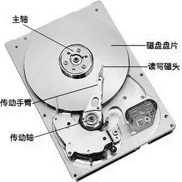
</div>

磁盘读取时间是由以下几部分组成：

- 寻道时间，表示磁头在不同磁道之间移动的时间。
- 旋转延迟，表示在磁道找到时，中轴带动盘面旋转到合适的扇区开头处。
- 传输时间，表示盘面继续转动，实际读取数据的时间。

顺序读写和随机读写对于机械硬盘来说为什么性能差异巨大？

- 随机读写：**<font color="red">操作的磁盘地址不是连续的；需要多次寻道和旋转延迟，而这个时间可能是传输时间的许多倍</font>**。
- 顺序读写：操作的磁盘地址是连续的；主要时间花费在了传输时间，不需要寻道；磁盘会预读，预读即在读取的起始地址连续读取多个页面。

#### 7.1.2 磁盘 cache

磁盘 Cache 有两大功能：预读和回写。

预读：利用了局部性原理，具体过程是：对于每个文件的第一个读请求，系统读入所请求的页面并读入紧随其后的少数几个页面（X86的Linux中一个标准页面大小是4KB），这时的预读称为同步预读。对于第二次读请求，如果所读页面不在 Cache 中，即不在前次预读的页中，则表明文件访问不是顺序访问，系统继续采用同步预读；如果所读页面在 Cache 中，则表明前次预读命中，操作系统把预读页的大小扩大一倍，此时预读过程是异步的，应用程序可以不等预读完成即可返回，只要后台慢慢读页面即可，这时的预读称为异步预读。任何接下来的读请求都会处于两种情况之一：

- 若不在cache，操作系统从磁盘中读取对应的数据页，并且系统还会将该数据页之后的连续几页（X86的Linux中一个标准页面大小是4KB）也一并读入到cache中，再将应用需要的数据返回给应用。此情况操作系统认为是跳跃读取，属于同步预读。
- 若命中cache，相当于上次缓存的内容有效，操作系统认为顺序读盘，则继续扩大缓存的数据范围，将之前缓存的数据页往后的N页数据再读取到cache中，属于异步预读。

回写：暂时将数据存在Cache里，然后统一异步写到磁盘中。通过这种异步的数据 I/O 模式解决了程序中的计算速度和数据存储速度不匹配的鸿沟，减少了访问底层存储介质的次数，使存储系统的性能大大提高。

#### 7.1.3 I/O 调度

- 如果所有读写请求都直接发给硬盘，对传统硬盘来说太残忍了。**<font color="red">I/O 调度层主要做两个事情，合并和排序</font>**。合并是将相同和相邻扇区(每个 512 字节)的操作合并成一个，比如我现在要读扇区 1，2，3，那可以合并成一个读扇区 1-3 的操作。排序就是将所有操作按扇区方向排成一个队列，让磁盘的磁头可以按顺序移动，有效减少了机械硬盘寻址这个最慢最慢的操作。
- 现在操作系统内核实现了 I/O 调度器 (I/O Scheduler)，通过操作 I/O 请求的服务顺序以及服务时间点，最大程度的减小磁盘寻址次数和移动距离。
- I/O 调度器的总体目标是希望让磁头能够总是往一个方向移动，移动到底了再往反方向走，这恰恰就是现实生活中的电梯模型，所以 I/O 调度器也被叫做电梯 (elevator) 而相应的算法也就被叫做电梯算法。**<font color="red">调度器算法的目标：将一个或多个进程的读操作合并到一起读，将一个或多个进程的写操作合并到一起写，尽可能变随机为顺序（因为随机读写比顺序读写要慢），读必须优先满足，而写也不能等太久</font>**。

#### 7.1.4 Page Cache

接下来先对 Page Cache 有一个直观的了解：

<div align="center">
    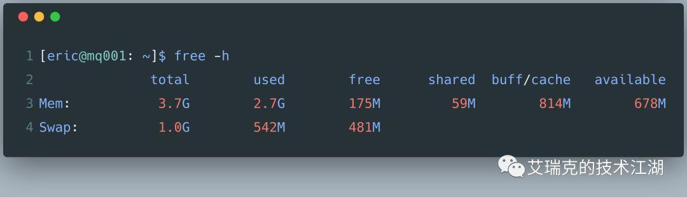
</div>

先来个直观的感受，整个 OS 有 3.7G 的物理内存，用掉了 2.7G，应当还剩下 1G 空闲的内存，但 OS 给出的却是 175M。当然这个数学题肯定不能这么算。OS 发现系统的物理内存有大量剩余时，为了提高 I/O 的性能，就会使用多余的内存当做文件缓存，也就是图上的 buff/cache，广义我们说的 Page Cache 就是这些内存的子集。**<font color="red">OS 在读磁盘时会将当前区域的内容全部读到 Cache 中，以便下次读时能命中 Cache，写磁盘时直接写到Cache中就写返回，由 OS 的 pdflush 以某些策略将 Cache 的数据 Flush 回磁盘</font>**。

#### 7.1.5 总结

Rocketmq 保证对于 CommitLog 文件的写入是顺序的，同时对于 ConsumeQueue 文件的写入也是顺序的。一般来说，程序对文件进行顺序读写的速度几乎接近于内存的读写速度。这是因为程序在写入数据到磁盘上的文件时，并不是直接写到磁盘上，而是写入到内存中的 Page Cache（内存的一部分被操作系统当做 Page Cache），**<font color="red">累积到一定程度之后然后再由 pdflush 线程将 Page Cache 中的数据 flush 到磁盘</font>**。而由于 CommitLog 和 ConsuemQueue 文件都是顺序写入的，所以 Page Cache 中的数据会被 OS 写入到磁盘上的同一区域，所以写入磁盘主要时间花费在了传输时间，寻道时间和旋转时间会少很多，比随机写入磁盘效率要高。

ConsumeQueue 的读取也是顺序的。OS 在从磁盘上读取文件的页时，会提前预读紧跟着的后面几页到 Page Cache 中。这样顺序读取 ConsumeQueue 文件时，由于读取的文件页在磁盘上是连续的，不会很分散，**<font color="red">所以磁盘的预读机制会很好地发挥作用（从上面可以看出，如果磁盘预读取的cache多次命中，会一直增加预读取的页的数目），同时也会使得 OS 缺页中断少很多</font>**。

但是对于 CommitLog 的读取是随机，这是因为消息消费者先从 ConsumeQueue 中获取到消息在 CommitLog 中的偏移量，再去 CommitLog 文件中读取消息，所以对于CommitLog消息存储的日志数据文件来说，读取消息内容时候会产生较多的随机访问读取，严重影响性能。如果选择合适的系统IO调度算法，比如设置调度算法为“Deadline”（此时块存储采用SSD的话），随机读的性能也会有所提升。

### 7.2 预分配 MappedFile

在消息写入过程中（调用 CommitLog 的 putMessage() 方法），CommitLog 会先从 MappedFileQueue 队列中获取一个 MappedFile，如果没有就新建一个。这里，MappedFile 的创建过程是将构建好的一个 AllocateRequest 请求（具体做法是，将下一个文件的路径、下下个文件的路径、文件大小为参数封装为 AllocateRequest 对象，也就是创建两个 AllocateRequest 对象）添加至队列中，后台运行的 AllocateMappedFileService 服务线程（在 Broker 启动时，该线程就会创建并运行），会不停地 run，只要请求队列里存在请求，就会去执行 MappedFile 映射文件的创建和预分配工作。分配的时候有两种策略，一种是使用 Mmap 的方式来构建 MappedFile 实例，另外一种是从 TransientStorePool 堆外内存池中获取相应的 DirectByteBuffer 来构建 MappedFile。

程序会阻塞等待第一个 AllocateRequest 执行完毕，也就是等待第一个 MappedFile 创建完成。但是对于第二个 MappedFile，则是 AllocateMappedFileService 服务线程异步创建，并且保存至请求队列 requestTable 和 requestQueue 中，然后等待下次获取时直接返回。RocketMQ中预分配 MappedFile 的设计非常巧妙，下次获取时候直接返回就可以不用等待 MappedFile 创建分配所产生的时间延迟。

<div align="center">
    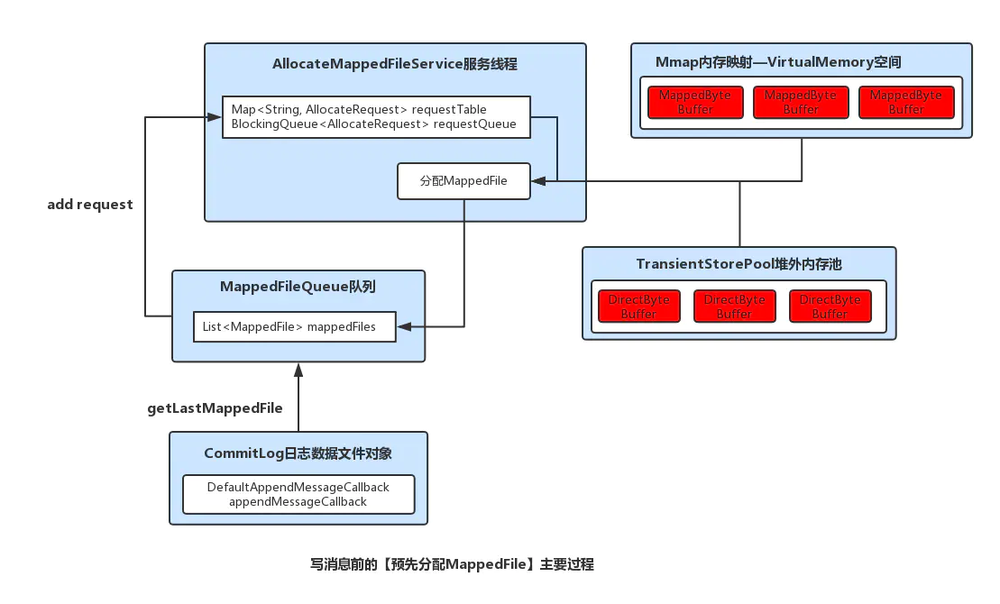
</div>

### 7.3 文件预热和 mlock 系统锁定

#### 7.3.1 mlock 锁定物理内存

系统调用 mlock 家族允许程序在物理内存上锁住它的部分或全部地址空间。这将阻止Linux 将这个内存页调度到交换空间（swap space），即使该程序已有一段时间没有访问这段空间。

一个严格时间相关的程序可能会希望锁住物理内存，因为内存页面调出调入的时间延迟可能太长或过于不可预知。安全性要求较高的应用程序可能希望防止敏感数据被换出到交换文件中，因为这样在程序结束后，攻击者可能从交换文件中恢复出这些数据。

锁定一个内存区间只需简单将指向区间开始的指针及区间长度作为参数调用 mlock。Linux 分配内存到页(page)且每次只能锁定整页内存，被指定的区间涉及到的每个内存页都将被锁定。getpagesize 函数返回系统的分页大小，在 x86 Linux 系统上，这个值是 4KB。

举个例子来说，分配 32Mb 的地址空间并把它锁进内存中，您需要使用如下的代码：

```java{.line-numbers}
const int alloc_size = 32 * 1024 * 1024;
char* memory = malloc (alloc_size);
mlock (memory, alloc_size); 
```

需注意的是，仅分配内存并调用 mlock 并不会为调用进程锁定这些内存，因为对应的分页可能是写时复制（copy-on-write）的5。因此，你应该在每个页面中写入一个假的值：

```java{.line-numbers}
size_t i;
size_t page_size = getpagesize ();
for (i = 0; i < alloc_size; i += page_size)
  memory[i] = 0; 
```

这样针对每个内存分页的写入操作会强制 Linux 为当前进程分配一个独立、私有的内存页。

要解除锁定，可以用同样的参数调用 munlock。

如果你希望程序的全部地址空间被锁定在物理内存中，请用 mlockall。这个系统调用接受一个参数；如果指定 MCL_CURRENT，则仅仅当前已分配的内存会被锁定，之后分配的内存则不会；MCL_FUTURE 则会锁定之后分配的所有内存。使用 MCL_CURRENT|MCL_FUTURE 将已经及将来分配的所有内存锁定在物理内存中。

锁定大量的内存，尤其是通过 mlockall，对整个系统而言可能是危险的。不加选择的内存加锁会把您的系统折磨到死机，因为其余进程被迫争夺更少的资源的使用权，并且会更快地被交换进出物理内存（这被称之为 thrashing）。如果你锁定了太多的内存，Linux 系统将整体缺乏必需的内存空间并开始杀死进程。

出于这个原因，只有具有超级用户权限的进程才能利用 mlock 或 mlockall 锁定内存。如果一个并无超级用户权限的进程调用了这些系统调用将会失败、得到返回值 -1 并得到 errno 错误号 EPERM。

munlock 系统调用会将当前进程锁定的所有内存解锁，包括经由 mlock 或 mlockall 锁定的所有区间。

#### 7.3.2 madvise 函数

**1 madvise 函数介绍**

madvise() 函数建议内核，在从 addr 指定的地址开始，长度等于 len 参数值的范围内，该区域的用户虚拟内存应遵循特定的使用模式。内核使用这些信息优化与指定范围关联的资源的处理和维护过程。如果使用 madvise() 函数的程序明确了解其内存访问模式，则使用此函数可以提高系统性能。

> The madvise() system call advises the kernel about how to handle paging input/output in the address range beginning at address start and with size length bytes. It allows an application to tell the kernel how it expects to use some mapped or shared memory areas, so that the kernel can choose appropriate read-ahead and caching techniques. This call does not influence the semantics of the application (except in the case ofMADV_DONTNEED), but may influence its performance. The kernel is free to ignore the advice.

The advice is indicated in the advice parameter which can be:

- **`MADV_NORMAL`**: No special treatment. This is the default.
- **`MADV_RANDOM`**: Expect page references in random order. (Hence, read ahead may be less useful than normally.)
- **`MADV_SEQUENTIAL`**: Expect page references in sequential order. (Hence, pages in the given range can be aggressively read ahead, and may be freed soon after they are accessed.)
- **`MADV_WILLNEED`**: Expect access in the near future.  (Hence, it might be a good idea to read some pages ahead.)

The current Linux implementation (2.4.0) views this system call more as a command than as advice and hence may return an error when it cannot do what it usually would do in response to this advice. 

**2 mmap 和 madvise 函数使用**

mmap 的作用是将硬盘文件的内容映射到内存中，采用闭链哈希建立的索引文件非常适合利用 mmap 的方式进行内存映射，利用 mmap 返回的地址指针就是索引文件在内存中的首地址，这样我们就可以放心大胆的访问这些内容了。

使用过 mmap 映射文件的同学会发现一个问题，search 程序访问对应的内存映射时，处理 query 的时间会有 latecny 会陡升，究其原因是因为 mmap 只是建立了一个逻辑地址，linux 的内存分配测试都是采用延迟分配的形式，也就是只有你真正去访问时采用分配物理内存页，并与逻辑地址建立映射，这也就是我们常说的缺页中断。  

缺页中断分为两类，一种是内存缺页中断，这种的代表是 malloc，利用 malloc 分配的内存只有在程序访问到得时候，内存才会分配；另外就是硬盘缺页中断，这种中断的代表就是 mmap，利用 mmap 映射后的只是逻辑地址，当我们的程序访问时，内核会将硬盘中的文件内容读进物理内存页中，这里我们就会明白为什么 mmap 之后，访问内存中的数据延时会陡增。

出现问题解决问题，上述情况出现的原因本质上是 mmap 映射文件之后，实际并没有加载到内存中，要解决这个文件，需要我们进行索引的预加载，这里就会引出本文讲到的另一函数 madvise，这个函数会传入一个地址指针，已经是一个区间长度，madvise 会向内核提供一个针对于于地址区间的 I/O 的建议，内核可能会采纳这个建议，会做一些预读的操作。例如 MADV_SEQUENTIAL 这个就表明顺序预读。

#### 7.3.3 总结

```java{.line-numbers}
// MappedFile#warmMappedFile
public void warmMappedFile(FlushDiskType type, int pages) {
    long beginTime = System.currentTimeMillis();
    ByteBuffer byteBuffer = this.mappedByteBuffer.slice();
    int flush = 0;
    long time = System.currentTimeMillis();
    for (int i = 0, j = 0; i < this.fileSize; i += MappedFile.OS_PAGE_SIZE, j++) {
        byteBuffer.put(i, (byte) 0);
        // force flush when flush disk type is sync
        if (type == FlushDiskType.SYNC_FLUSH) {
            if ((i / OS_PAGE_SIZE) - (flush / OS_PAGE_SIZE) >= pages) {
                flush = i;
                mappedByteBuffer.force();
            }
        }

        // prevent gc
        if (j % 1000 == 0) {
            log.info("j={}, costTime={}", j, System.currentTimeMillis() - time);
            time = System.currentTimeMillis();
            try {
                Thread.sleep(0);
            } catch (InterruptedException e) {
                log.error("Interrupted", e);
            }
        }
    }

    // force flush when prepare load finished
    if (type == FlushDiskType.SYNC_FLUSH) {
        log.info("mapped file warm-up done, force to disk, mappedFile={}, costTime={}");
        mappedByteBuffer.force();
    }
    log.info("mapped file warm-up done. mappedFile={}, costTime={}");

    this.mlock();
}

// MappedFile#mlock
public void mlock() {
    final long beginTime = System.currentTimeMillis();
    final long address = ((DirectBuffer) (this.mappedByteBuffer)).address();
    // pointer 指向 mappedByteBuffer 所代表的内存
    Pointer pointer = new Pointer(address);

    {
        // 调用 mlock 方法将 mappedByteBuffer 所代表的内存区域进行锁定，防止 OS 将内存交换到 swap 空间上去
        // 内存的 page input/page output 可能会耗费很多时间
        int ret = LibC.INSTANCE.mlock(pointer, new NativeLong(this.fileSize));
        log.info("mlock {} {} {} ret = {} time consuming = {}");
    }

    {
        // 调用 madvise 方法，madvise会向内核提供一个针对于于地址区间的I/O的建议，内核可能会采纳这个建议，
        // 会做一些预读的操作。RocketMQ采用的是MADV_WILLNEED模式，它的效果是，对所有当前不在内存中的数据进行页面调度
        int ret = LibC.INSTANCE.madvise(pointer, new NativeLong(this.fileSize), LibC.MADV_WILLNEED);
        log.info("madvise {} {} {} ret = {} time consuming = {}");
    }
} 
```

上面的 warmMappedFile 主要进行了两步操作：

1. 第一步：对当前映射文件的每个内存页写入一个字节 0.当刷盘策略为同步刷盘时，执行强制刷盘，并且是每修改 pages (默认是 16MB)个分页刷一次盘
2. 第二步：将当前全部的地址空间锁定在物理存储中，防止其被交换到 swap 空间。再调用，传入 **`MADV_WILLNEED`** 策略，将刚刚预热的内存锁住，其实就是告诉内核，我马上就要用（**`MADV_WILLNEED`**）这块内存，先做虚拟内存到物理内存的映射，防止正式使用时产生缺页中断。

预热的目的主要有两点；第一点，由于仅分配内存并进行 mlock 系统调用后并不会为程序完全锁定这些内存，因为其中的分页可能是写时复制的。因此，就有必要对每个内存页面中写入一个假的值。其中，RocketMQ 是在创建并分配 MappedFile 的过程中，预先写入一些随机值至 Mmap 映射出的内存空间里。第二，调用 Mmap 进行内存映射后，OS 只是建立虚拟内存地址至物理地址的映射表，而实际并没有加载任何文件至内存中。程序要访问数据时 OS 会检查该部分的分页是否已经在内存中，如果不在，则发出一次缺页中断。这里，可以想象下 1G 的 CommitLog 需要发生多少次缺页中断，才能使得对应的数据才能完全加载至物理内存中（ps：X86 的 Linux 中一个标准页面大小是 4KB）。

另外，RocketMQ 会调用 madvise 函数，这个函数会传入一个地址指针，已经一个区间长度，madvise会向内核提供一个针对于于地址区间的 I/O 的建议，内核可能会采纳这个建议，会做一些预读的操作。RocketMQ 采用的是 **`MADV_WILLNEED`** 模式，它的效果是，对所有当前不在内存中的数据进行页面调度，进行预读操作。

#### 7.3.4 mmap 技术

Mmap 技术在前面的文章已经详细讲过，它主要就是减少了文件在内核缓冲区到用户自己的缓冲区之间的拷贝。

## 八、总结

### 8.1 rocketmq 总体介绍

官方介绍："淘宝中间件团队在对 Kafka 做过充分 Review 之后，Kafka 无限消息堆积，高效的持久化速度吸引了我们，但是同时发现这个消息系统主要定位于日志传输，对于使用在淘宝交易、订单、充值等场景下还有诸多特性不满足，为此我们重新用 Java 语言编写了 RocketMQ"。

RocketMQ 采用了单一的日志文件，即把同1台机器上面所有 topic 的所有 queue 的消息，存放在一个文件里面，从而避免了随机的磁盘写入。

<div align="center">
    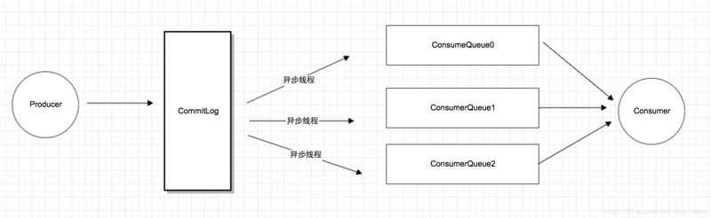
</div>

所有消息都存在一个单一的 CommitLog 文件里面，然后有后台线程异步的同步到 ConsumeQueue，再由 Consumer 进行消费。Rokcetmq 这样处理的优缺点如下：

优点：

- 由于 MQ 的特性，热点数据基本上都是新发送的消息：由于 PageCache 的局部性热点原理且MQ整体情况下还是从旧到新的有序读，因此大部分情况下消息还是可以直接从 PageCache 中读取，可以很好的利用到操作系统的预读功能，不会产生太多的缺页（Page Fault）中断而从磁盘读取。
- RocketMQ 都写在一个 CommitLog 文件内，热点数据几乎都是在同一个文件内，甚至热点数据可能都凑在一起，能更好的利用NOOP（合并操作）和更高的命中page cache。ConsumerQueue 文件虽然多，但是文件非常小，文件内每条记录只有 20Byte，加载所有的 ConsumerQueue 文件并不需要很大的内容，相当于对 ConsumerQueue 的操作都是在内存里操作

缺点：

- 读一条消息，会先读 ConsumeQueue，再读 CommitLog，对于 CommitLog 的读变成了完全的随机读，并且增加了开销

<div align="center">
    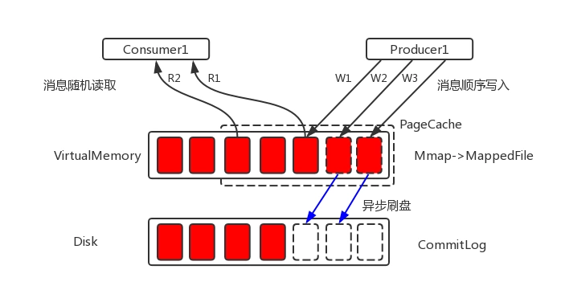
</div>

RocketMQ 在存储上借鉴了 kafka，很多地方原理是一样的；有人做了性能测试（https://yq.aliyun.com/article...），在 topic/partition 文件不多的情况下，kafka 吞吐量优于 RocketMQ 一个量级，超过一定的量之后，RocktMQ 吞吐量更优。

<div align="center">
    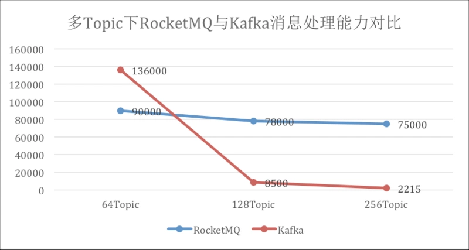
</div>

### 8.2 CommitLog 文件

<div align="center">
    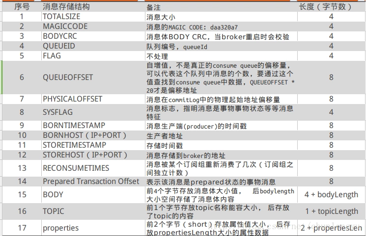
</div>

RocketMQ 在创建文件时，会完成文件的内存映射工作，并且会异步预先创建好下下个文件和映射，文件大小为 1G（默认，可配置，MappedByteBuffer 最大只能操作 2G 文件）。

文件预热：调用 Mmap 进行内存映射后，OS 只是建立虚拟内存地址至物理地址的映射表，而实际并没有加载任何文件至内存中。程序要访问数据时 OS 会检查该部分的分页是否已经在内存中，如果不在，则发出一次缺页中断。这里，可以想象下 1G 的 CommitLog 需要发生多少次缺页中断，才能使得对应的数据才能完全加载至物理内存中：

- 创建完文件之后，预先用默认字节填充（每隔4K写入一个byte‘0’，即每个内存页写入一个字节，跳跃式写入，缩减填充耗时），写入至 mmap 映射的内存空间里。
- 调用系统 mlock，将文件内容锁定在物理内存中，防止被 swap 到磁盘；对已写满的映射文件执行 munlock（异步，延迟6秒）。
- RocketMQ 会调用 madvise 函数，这个函数会传入一个地址指针，已经一个区间长度，madvise会向内核提供一个针对于于地址区间的 I/O 的建议，内核可能会采纳这个建议，会做一些预读的操作。RocketMQ 采用的是 **`MADV_WILLNEED`** 模式，它的效果是，对所有当前不在内存中的数据进行页面调度。

文件名 20 位长度的数字，数字值为当前文件起始偏移量（offset），前面补 0，方便根据 offset 查找消息内容。

支持同步刷盘和异步刷盘：同步刷盘是每个内存页（page cache）刷一次；异步刷盘是数据先写入page cache 后即返回，由其他线程异步定时批量刷入磁盘。

<div align="center">
    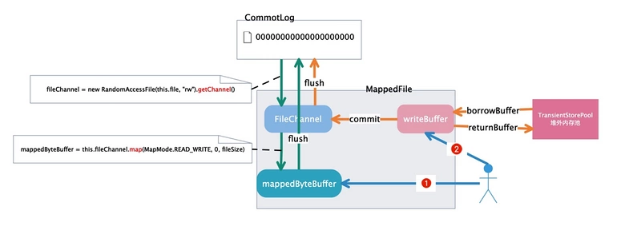
</div>

### 8.3 ConsumeQueue 文件

- 文件生成方式：
  - 线程每隔1毫秒，从 CommitLog 中同步未同步的记录，如果进程（程序）刚启动，同步记录分两种：
    1. 配置成允许重复消息，则从第一个（没被删除的文件中，最早的文件）CommitLog 的起始 offset 开始同步；
    2. 如果配置成不允许同步，则从 CommitLog 最大的 offset 开始同步；
   - 同 CommitLog 一样，名字为 queueOffset 的起始值，20 个数字长度，不足前面补零；
- consumerOffset.json 文件会记下每个 topic 下的每个 queue 的消费进度；
- 文件内，每条记录 20byte（8byte 的 CommitLog offset、4byte 的消息长度、8 字节的 tag 信息），单个文件为 30W 条记录，单文件大小为 5.86M 多；文件小，全部做内存映射也占用不了多少内存；
- 单文件顺序读取；
- 消息拉取查找；
  - Conumser 拉取的时候，会带上 QueueOffset，真实的文件偏移量 offset 是 queueOffset * 20（每条记录 20 个字节大小，QueueOffset 实际更像是序号）；
  - 根据文件名就能知道当前文件的起始 offset；
  - 根据 offset 获取 MappedFile，获取方式如下(过期的文件会删除，所以第一个文件的起始 offset 不一定是 0)；
    - int index = (int) ((offset / this.mappedFileSize) - (firstMappedFile.getFileFromOffset() / this.mappedFileSize));
    - 以上获取不到，就遍历所有的 MappedFile，对每个文件的起始 offset 和最终 offset 做比较；
  - 找到 ComsumerQueue 之后，根据 offset 能定位到详细的位置，取到对应的记录；
  - ConsumerQueue 记录内，会包含 CommitLog 的 offset，在以 c 步骤同样的方式找到对应的记录；

<div align="center">
    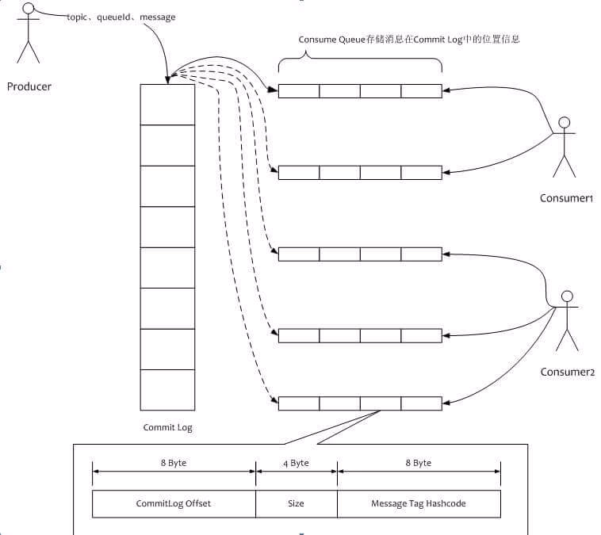
</div>

### 8.4 Index 文件

- 文件生成：
  - 文件名为创建文件时的时间戳；
  - 文件分为三部分；
    - 40B 的头部信息；
    - 19M 多的 hash 槽点（slot），每个槽大小为 4B，共 500W 个槽点；
    - 381M 多的索引内容槽点，每个槽大小为 20B，共 2000W 个槽点；
  - 头部信息如下：
    1. beginTimestamp 和 endTimestamp 分别是文件内包含的索引内容的起始时间和结束时间；
    2. beginPhyOffset 和 endPhyOffset 分别是文件内包含的索引内容的起始偏移量和结束偏移量；
    3. hashslotcount 和 indexCount 记录当前 hash 槽点和索引内容槽点的数据量；
    <div align="center">
        
    </div>
  - hash 槽点的值为索引内容的序号；
  - 索引内存槽点的值如下：
    - 4 位 int 值，存储的是的 key 的 hash 值；
    - 8 位 long 值，存储的是消息在 commitlog 的物理偏移量 phyOffset；
    - 4 位 int 值，存储了当前消息跟索引文件中第一个消息在 broker 落地的时间（beginTimestamp）差；
    - 4 位 int 值，如果存在 hash 冲突，存储的是上一个消息的索引地址；
    <div align="center">
        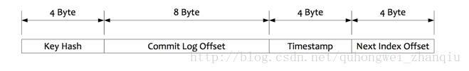
    </div>
  - 内容插入：
    - 判断最新的索引文件数据是否已满（索引内容数大于等于 2000W），如果已满，则创建新文件；
    - 根据消息的 key 生成的 hash 值，找到对应的hash槽点（hashcode % 500W），取当前槽点的值，如果值非默认值，即存在 hash 冲突，值是上一个消息的索引地址；
    - index 文件起始空白位填入 20 位的内容，将 hash 槽点值设成当前内容的序号（每插入一条，序号加 1）
- 内容查找：
  - 根据时间获取到相应的索引文件；
  - 根据消息的 key 生成的 hash 值，获取到相应的 hash 槽点，取文件的 40B + 槽点值 * 4的值为偏移量，得到索引内容的序号；
  - 取 40B + 500W * 4 + 索引序号 * 20 起的 20 个字节为索引内容；
  - 根据内容里的 CommitLog 的 offset 查找消息内容，方式同 ConsumerQueue 一样；