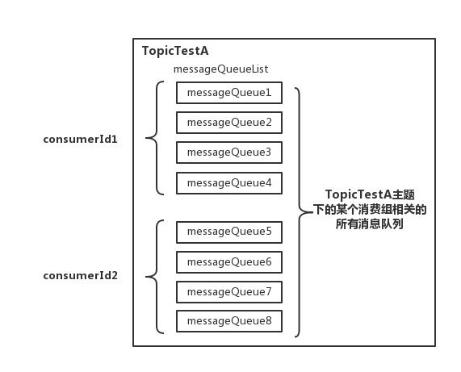
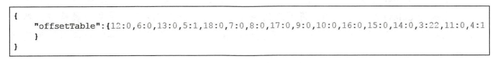

# RocketMQ 消息消费详解之一

## 0 前言

在前面，已经简略地介绍过 RocketMQ 中消息消费时 Pull 消息的长轮询机制了，其主要的思路是：Consumer 如果第一次尝试 Pull 消息失败（比如：Broker 端没有可以消费的消息），并不立即给消费者客户端返回 Response 的响应，而是先 hold 住并且挂起请求。然后在 Broker 端，通过后台独立线程— PullRequestHoldService 重复尝试执行 Pull 消息请求来取消息。同时，另外一个 ReputMessageService 线程不断地构建 ConsumeQueue/IndexFile 数据，当有新消息到达时，就通知阻塞的长轮询线程，有新消息到达。通过这种长轮询机制，即可解决 Consumer 端需要通过不断地发送无效的轮询 Pull 请求，而导致整个 RocketMQ 集群中 Broker 端负载很高的问题。

## 一、RocketMQ 消息消费总结

### 1.1.Consumer 向 Broker 端发送 Pull 消息请求的过程

在 RocketMQ 的 Consumer 端，后台独立线程服务—pullMessageService 是 Pull 消息请求的发起者，它不断地尝试从阻塞队列—LinkedBlockingQueue 中获取元素 PullRequest，并根据 pullRequest 中的参数以及订阅关系信息调用 pullAPIWrapper 的 pullKernelImpl() 方法发送封装后的 Pull 消息请求—PullMessageRequestHeader 至 Broker 端来拉取消息（具体完成发送一次 Pull 消息的 PRC 通信请求的是 MQClientAPIImpl 中的 pullMessage() 方法）。这里涉及细节的时序图（ps：时序图中没有涉及 PRC 异步通信中的 callback 过程）如下：

<div align="center">
    
</div>

其中， DefaultMQPushConsumerImpl#pullMessage(pullRequest) 方法是发送 Pull 消息请求的关键，具体的流程如下：

- 校验 ProcessQueue 是否 "dropped"， 如果为 "dropped" 为 true 则直接返回（这个 "dropped" 的设置是由于对消息队列负载，使得有的消息队列不再分配给某个 Consumer）；
- 给 ProcessQueue 设置 Pull 消息的时间戳；
- 做流量控制，对于满足下面条件的任何一种情况，稍后再发起 Pull 消息的请求；
  1. 条件 1：正在消费的队列中，未被消费的消息数和消息大小超过阀值（默认每个队列消息数为 1000 个/消息存储容量 100MB）；
  2. 条件 2：如果是顺序消费，正在消费的队列中，消息的跨度超过阀值（默认 2000）；
- 根据 topic 获取订阅关系—SubscriptionData；
- 构建 Pull 消息的回调对象—PullBack，这里从 Broker 端 Pull 消息的返回结果处理是通过异步回调（发送异步通信 RPC 请求），其中如果 Broker 端返回 Pull 消息成功，在回调方法中先填充至处理队列——processQueue 中（将 Pull 下来的消息，设置到 ProcessQueue 的 msgTreeMap 容器中），然后通过消费消息的服务线程——ConsumeMessageService，将封装好的 ConsumeRequest 提交至消费端消费线程池——ConsumeExecutor 异步执行处理（具体处理逻辑：通过业务应用系统在 DefaultMQPushConsumer 实例中注册的消息监听器完成业务端的消息消费）；
- 从 Consumer 端内存中获取 commitOffsetValue；
- 通过 RocketMQ 的 Remoting 通信层向 Broker 端发送 Pull 消息的 RPC 请求；

### 1.2.Broker 端处理 Pull 消息请求的一般过程

这里先来说下对于一般情况下（即所要 Pull 的消息在 RocketMQ 的 Broker 端已经是存在，一般可以拉取到的情况），Broker 端处理这个 Pull 消息请求的主要过程。其时序图如下：

<div align="center">
    
</div>

从上面的简易时序图中可以看到 Broker 端 Pull 消息的主要关键点如下：

1. Pull 消息的业务处理器 --- PullMessageProcessor 的 processRequest 为处理拉取消息请求的入口，在设置 reponse 返回结果中的 opaque 值后，就完成一些前置的校验（Broker 是否可读、Topic/ConsumerGroup 是否存在、读取队列 Id 是否在 Topic 配置的队列范围数内）；
2. 据“ConsumerGroup”、“Topic”、“queueId”和“offset”这些参数来调用 MessageStore 实例的 getMessage()方法来产尝试读取 Broker 端的消息；
3. 其中，通过 findConsumeQueue()方法，获取逻辑消费队列—ConsumeQueue；
4. 根据 offset 与逻辑消费队列中的 maxOffset、minOffset 的比较，来设置状态值 status，同时计算出下次 Pull 消息的开始偏移量值—nextBeginOffset，然后通过 MappedFile 的方式获取 ConsumeQueue 的 Buffer 映射结果值；
5. 根据算出来的 offsetPy（物理偏移量值）和 sizePy（消息的物理大小），从 commitLog 获取对应消息的 Buffer 映射结果值，并填充至 GetMessageResult 返回对象，并设置返回结果（状态/下次其实偏移量/maxOffset/minOffset）后 return；
6. 在 PullMessageProcessor 业务处理器的最后，提交并持久化消息消费的 offset 偏移量进度

### 1.3 Broker 端对于 Pull 请求挂起的流程

说完了 Pull 消息请求的一般流程，下面主要看下 Broker 端的 PullMessageProcessor 业务处理器在 RocketMQ 中还没有消息可以拉取情况下（即为：PULL_NOT_FOUND）的处理流程，本节内容也是 RocketMQ 中长轮询机制的关键。

长轮询机制是对普通轮询的一种优化方案，它平衡了传统 Push/Pull 模型的各自缺点，Server 端如果当前没有 Client 端请求拉取的相关数据会 hold 住这个请求，直到 Server 端存在相关的数据，或者等待超时时间后返回。在响应返回后，Client 端又会再次发起下一次的长轮询请求。RocketMQ 的 push 模式正是采用了这种长轮询机制的设计思路，如果在上面所述的第一次尝试 Pull 消息失败后（比如 Broker 端暂时没有可以消费的消息），先 hold 住并且挂起该请求（这里，设置返回响应 response 为 null，此时不会向 Consumer 端发送任何响应的内容，即不会对响应结果进行处理），然后通过 Broker 端的后台线程 PullRequestHoldService 重新尝试和后台线程 ReputMessageService 的二次处理。在 Broker 端，两个后台线程服务 PullRequestHoldService 和 ReputMessageService 是实现长轮询机制的关键点。下面就来分别介绍这两个服务线程：

（1）PullRequestHoldService：该服务线程会从 pullRequestTable 本地缓存变量中取 PullRequest 请求，**<font color="red">检查轮询条件 ------ "待拉取消息的偏移量是否小于消费队列最大偏移量”是否成立，如果条件成立则说明有新消息达到 Broker 端</font>**，则通过 PullMessageProcessor 的  executeRequestWhenWakeup() 方法重新尝试发起 Pull 消息的 RPC 请求（此处，每隔 5S 重试一次，默认长轮询整体的时间设置为 30s）；

（2）ReputMessageService：当新消息到达 CommitLog 时，ReputMessageService 线程负责将消息转发给 ConsumeQueue、IndexFile，如果 Broker 端开启了长轮询模式并且角色为主节点，则最终会调用 PullRequestHoldService 线程的 notifyMessageArriving 方法唤醒挂起线程，判断当前消费队列最大偏移量是否大于带拉取偏移量，如果大于则拉取消息，长轮询模式使得消息拉取能够实现准实时；

### 1.4 Consumer 端的负载请求

看了上面一节的 "RocketMQ 中长轮询的 Pull 消息机制"后，大家可能会有这样子一个疑问：在 Consumer 端 pullMessageService 线程作为消息的主动拉取者不断地从阻塞队列中获取元素 PullRequest，那么这里的 PullRequest 是在哪儿由哪个线程放入至阻塞队列中的呢？本节内容将介绍"Consumer 端的负载均衡机制"，同时解答上面的疑问。

#### 1.4.1 RocketMQ 为何需要在 Consumer 端做负载均衡

在 RocketMQ 中，Consumer 端的两种消费模式（Push/Pull）都是基于拉模式来 Pull 消息的，而在 Push 模式中采用了长轮询的方式而实现了准实时的自动消息拉取。在两种基于拉模式的消费方式（Push/Pull）中，均需要 Consumer 端在知道从 Broker 端的哪一个消息队列—MessageQueue 中去 Pull 消息。因此，消息队列的负载均衡处理（即 Broker 端中多个 MessageQueue 分配给同一个 ConsumerGroup 中的哪些 Consumer 消费），由 Consumer 端来主动完成更为合理。

#### 1.4.2 Consumer 端负载均衡的主要流程

**1 Consumer 端的心跳包发送**

在 Consumer 启动后，它就会通过定时任务不断地向 RocketMQ 集群中的所有 Broker 实例发送心跳包（其中包含了，消息消费分组名称、订阅关系集合、消息通信模式和客户端 id 的值等信息）。Broker 端在收到 Consumer 的心跳消息后，会将它维护在 ConsumerManager 的本地缓存变量—consumerTable，同时并将封装后的客户端网络通道信息保存在本地缓存变量—channelInfoTable 中，为之后做 Consumer 端的负载均衡提供可以依据的元数据信息。

**2 Consumer 端实现负载均衡的核心类—RebalanceImpl**

"Consumer 启动流程"中已经介绍了在启动 MQClientInstance 实例时候，会完成负载均衡服务线程—RebalanceService 的启动（每隔 20s 执行一次）。通过查看源码可以发现，RebalanceService 线程的 run() 方法最终调用的是 RebalanceImpl 类的 rebalanceByTopic() 方法，该方法是实现 Consumer 端负载均衡的核心关键。这里，rebalanceByTopic() 方法会根据消费者通信类型为"广播模式"还是"集群模式"做不同的逻辑处理。这里主要来看下集群模式下的主要处理流程：

1. 从 rebalanceImpl 实例的本地缓存变量—topicSubscribeInfoTable 中，获取该 Topic 主题下的消息消费队列集合（mqSet）；
2. 根据 topic 和 consumerGroup 为参数调用 mQClientFactory.findConsumerIdList() 方法向 Broker 端发送获取该消费组下消费者 Id 列表的 RPC 通信请求（Broker 端基于前面 Consumer 端上报的心跳包数据而构建的 consumerTable 做出响应返回，业务请求码：**`GET_CONSUMER_LIST_BY_GROUP`**）；
3. 先对 Topic 下的消息消费队列、消费者 Id 排序，然后用消息队列分配策略算法（默认为：消息队列的平均分配算法），计算出待拉取的消息队列。

<div align="center">
    
</div>

4. 然后，调用 updateProcessQueueTableInRebalance()方法，具体的做法是，先将分配到的消息队列集合（mqSet）与 processQueueTable 做一个过滤比对，具体的过滤比对方式如下图：
   
<div align="center">
    
</div>

这里可以分如下两种情况来筛选过滤：

1. 图中 processQueueTable 标注的红色部分，表示与分配到的消息队列集合 mqSet 互不包含。将这些 ProcessQueue 队列设置 Dropped 属性为 true，然后查看这些队列是否可以移除出 processQueueTable 缓存变量，这里具体执行 removeUnnecessaryMessageQueue()方法，即每隔 1s 查看是否可以获取当前消费处理队列的锁，拿到的话返回 true。如果等待 1s 后，仍然拿不到当前消费处理队列的锁则返回 false。如果返回 true，则从 processQueueTable 缓存变量中移除对应的 Entry；
2. 图中 processQueueTable 的绿色部分，表示与分配到的消息队列集合 mqSet 的交集。**判断该 ProcessQueue 是否已经过期了，在 Pull 模式的不用管，如果是 Push 模式的，设置 Dropped 属性为 true，并且调用 removeUnnecessaryMessageQueue()方法，像上面一样尝试移除 Entry；

最后，如果过滤后的消息队列集合（mqSet）中的某个消息队列 MessageQueue 不存在于 processQueueTable 中，则为这个 MessageQueue 创建一个 ProcessQueue 对象并存入 RebalanceImpl 的 processQueueTable 队列中（其中调用 RebalanceImpl 实例的 computePullFromWhere(MessageQueue mq)方法获取该 MessageQueue 对象的下一个进度消费值 offset，随后填充至接下来要创建的 pullRequest 对象属性中），并创建拉取请求对象——pullRequest 添加到拉取列表——pullRequestList 中，最后执行 dispatchPullRequest() 方法，将 Pull 消息的请求对象 PullRequest 依次放入 PullMessageService 服务线程的阻塞队列 pullRequestQueue 中，待该服务线程取出后向 Broker 端发起 Pull 消息的请求。其中，可以重点对比下，RebalancePushImpl 和 RebalancePullImpl 两个实现类的 dispatchPullRequest() 方法不同，RebalancePullImpl 类里面的该方法为空。

### 1.5 消息重试

#### 1.5.1 重试队列与死信队列

在介绍 RocketMQ 的消费重试机制之前，需要先来说下"重试队列"和"死信队列"两个概念。

- 重试队列：如果 Consumer 端因为各种类型异常导致本次消费失败，为防止该消息丢失而需要将其重新回发给 Broker 端保存，保存这种因为异常无法正常消费而回发给 MQ 的消息队列称之为重试队列。RocketMQ 会为每个消费组都设置一个 Topic 名称为 "**`%RETRY%+consumerGroup`**" 的重试队列（这里需要注意的是，这个 Topic 的重试队列是针对消费组，而不是针对每个 Topic 设置的），用于暂时保存因为各种异常而导致 Consumer 端无法消费的消息。**<font color="red">考虑到异常恢复起来需要一些时间，会为重试消息设置一个重试级别 delayLevel，每个重试级别都有与之对应的重新投递延时，重试次数越多投递延时就越大</font>**。RocketMQ 对于重试消息的处理是先保存至 Topic 名称为 "**`SCHEDULE_TOPIC_XXXX`**" 的延迟队列中，后台定时任务按照对应的时间进行 delay 后重新保存至 "%RETRY%+consumerGroup" 的重试队列中。
- 死信队列：由于有些原因导致 Consumer 端长时间的无法正常消费从 Broker 端 Pull 过来的业务消息，为了确保消息不会被无故的丢弃，那么超过配置的"最大重试消费次数"后就会移入到这个死信队列中。**<font color="red">在 RocketMQ 中，SubscriptionGroupConfig 配置常量默认地设置了两个参数，一个是 retryQueueNums 为 1（重试队列数量为 1 个），另外一个是 retryMaxTimes 为 16（最大重试消费的次数为 16 次）</font>**。Broker 端通过校验判断，如果超过了最大重试消费次数则会将消息移至这里所说的死信队列。这里，RocketMQ 会为每个消费组都设置一个 Topic 命名为 "**`%DLQ%+consumerGroup`**" 的死信队列。一般在实际应用中，移入至死信队列的消息，需要人工干预处理；

#### 1.5.2 Consumer 端回发消息至 Broker 端

在业务工程中的 Consumer 端（Push 消费模式下），如果消息能够正常消费需要在注册的消息监听回调方法中返回 **`CONSUME_SUCCESS`** 的消费状态，否则因为各类异常消费失败则返回 **`RECONSUME_LATER`** 的消费状态。消费状态的枚举类型如下所示：

```java{.line-numbers}
public enum ConsumeConcurrentlyStatus {
    // 业务方消费成功
    CONSUME_SUCCESS,
    // 业务方消费失败，之后进行重新尝试消费
    RECONSUME_LATER;
}
```

如果业务代码对消息消费失败了，那么则会抛出异常并且返回这里的 **`RECONSUME_LATER`** 状态。这里，在消费消息的服务线程——consumeMessageService 中，将封装好的消息消费任务 ConsumeRequest 提交至线程池——consumeExecutor 异步执行。从消息消费任务 ConsumeRequest 的 run() 方法中会执行业务工程中注册的消息监听回调方法，并在 processConsumeResult 方法中根据业务工程返回的状态（**`CONSUME_SUCCESS`** 或者 **`RECONSUME_LATER`**）进行判断和做对应的处理（下面讲的都是在消费通信模式为集群模型下的，广播模型下的比较简单就不再分析了）。

- 业务方正常消费（CONSUME_SUCCESS）：正常情况下，设置 ackIndex 的值为 consumeRequest.getMsgs().size() - 1，因此后面的遍历 consumeRequest.getMsgs()消息集合条件不成立，不会调用回发消费失败消息至 Broker 端的方法—sendMessageBack(msg, context)。最后，更新消费的偏移量；
- 业务方消费失败（RECONSUME_LATER）：异常情况下，设置 ackIndex 的值为-1，这时就会进入到遍历 consumeRequest.getMsgs() 消息集合的 for 循环中，执行回发消息的方法——sendMessageBack(msg,context)。这里，首先会根据 brokerName 得到 Broker 端的地址信息，然后通过网络通信的 Remoting 模块发送 RPC 请求到指定的 Broker 上，如果上述过程失败，则创建一条新的消息重新发送给 Broker，此时新消息的 Topic 为 **`%RETRY%+ConsumeGroupName`**——重试队列的主题。其中，在 MQClientAPIImpl 实例的 consumerSendMessageBack()方法中封装了 ConsumerSendMsgBackRequestHeader 的请求体，随后完成回发消费失败消息的 RPC 通信请求（业务请求码为：**`CONSUMER_SEND_MSG_BACK`**）。倘若上面的回发消息流程失败，则会延迟 5S 后重新在 Consumer 端进行重新消费。与正常消费的情况一样，在最后更新消费的偏移量；

#### 1.5.3 Broker 端对回发消息处理的主要流程

Broker 端收到这条 Consumer 端回发过来的消息后，通过业务请求码（CONSUMER_SEND_MSG_BACK）匹配业务处理器——SendMessageProcessor 来处理。在完成一系列的前置校验（这里主要是"消费分组是否存在"、"检查 Broker 是否有写入权限"、"检查重试队列数是否大于 0"等）后，尝试获取重试队列的 TopicConfig 对象（如果是第一次无法获取到，则调用  createTopicInSendMessageBackMethod() 方法进行创建）。根据回发过来的消息偏移量尝试从 commitlog 日志文件中查询消息内容，若不存在则返回异常错误。

**<font color="red">然后，设置重试队列的 Topic—"%RETRY%+consumerGroup" 至 MessageExt 的扩展属性"RETRY_TOPIC"中</font>**，并对根据延迟级别 delayLevel 和最大重试消费次数 maxReconsumeTimes 进行判断，如果超过最大重试消费次数（默认 16 次），则会创建死信队列的 TopicConfig 对象（用于后面将回发过来的消息移入死信队列）。在构建完成需要落盘的 MessageExtBrokerInner 对象后，调用"commitLog.putMessage(msg)"方法做消息持久化。这里，需要注意的是，在 putMessage(msg) 的方法里会使用 "**`SCHEDULE_TOPIC_XXXX`**" 和对应的延迟级别队列 Id 分别替换 MessageExtBrokerInner 对象的 Topic 和 QueueId 属性值，**<font color="red">并将原来设置的重试队列主题（"%RETRY%+consumerGroup"）的 Topic 和 QueueId 属性值做一个备份分别存入扩展属性 properties 的 "REAL_TOPIC" 和 "REAL_QID" 属性中</font>**。看到这里也就大致明白了，回发给 Broker 端的消费失败的消息并非直接保存至重试队列中，而是会先存至 Topic 为 **`SCHEDULE_TOPIC_XXXX`** 的定时延迟队列中。

疑问：上面说了 RocketMQ 的重试队列的 Topic 是 "%RETRY%+consumerGroup"，为啥这里要保存至 Topic 是 "**`SCHEDULE_TOPIC_XXXX`**" 的这个延迟队列中呢？

在源码中搜索下关键字——"**`SCHEDULE_TOPIC_XXXX`**"，会发现 Broker 端还存在着一个后台服务线程——ScheduleMessageService（通过消息存储服务——DefaultMessageStore 启动），通过查看源码可以知道其中有一个 DeliverDelayedMessageTimerTask 定时任务线程会根据 Topic（"**`SCHEDULE_TOPIC_XXXX`**"）与 QueueId，先查到逻辑消费队列 ConsumeQueue，然后根据偏移量，找到 ConsumeQueue 中的内存映射对象，从 commitlog 日志中找到消息对象 MessageExt，并做一个消息体的转换（messageTimeup()方法，由定时延迟队列消息转化为重试队列的消息），再次做持久化落盘，这时候才会真正的保存至重试队列中。**<font color="red">看到这里就可以解释上面的疑问了，定时延迟队列只是为了用于暂存的，然后延迟一段时间再将消息移入至重试队列中</font>**。RocketMQ 设定不同的延时级别 delayLevel，并且与定时延迟队列相对应。

<div align="center">
    
</div>

## 二、前言

### 2.1 简介

消息消费是以组的模式开展，一个消费组内可以包含多个消费者，每一个消费组可以订阅多个主题，消费组之间有集群模式与广播模式两种消费模式。

- 集群模式（CLUSTERING）:主题下的同一条消息只允许被其中一个消费者消费
- 广播模式（BROADCASTING）:主题下的同一条消息将被集群里面的所有消费者消费一次。

消息服务器与消费者之间的消息传送也有两种方式：推模式 (PUSH) 和拉模式 (PULL)。

- 拉模式（PULL）:由用户主动调用 pull 方法来获取消息，没有则返回
- 推模式（PUSH）:在启动后，Consumer 客户端会主动循环发送 Pull 请求到 broker，如果没有消息，broker 会把请求放入等待队列，新消息到达后返回 response。

从上面的介绍可以看出，**<font color="red">RocketMQ 中消息的推模式实际上也是基于拉模式，只不过是在拉模式上包装了一层，也就是长轮询。一个拉取任务完成之后开始下一个拉取任务</font>**。集群模式下，多个消费者如何对消息进行负载？消息队列的负载机制遵循一个通用的思想：**<font color="red">一个消息队列在同一时间只允许被一个消费者消费，一个消费者可以消费多个消息队列</font>**。消息的拉模式主要要求客户端手动调用消息拉取 API，而消息推模式是消息服务器主动将消息推送到消息消费端，在介绍消息消费的实现时，都是以推模式来进行介绍。

### 2.2 介绍顺序

分析消息消费实现将按照如下顺序来进行讲解：

1. 消费者启动流程
2. 消费者负载均衡
3. 消费拉取过程
4. 消息的长轮询
5. 消息的消费
6. 消息重试和定时消息

## 三、消费者启动顺序

本文将以如下的 consumer 代码为例来讲解消息的消费：

```java{.line-numbers}
public class Consumer {

    public static void main(String[] args) throws InterruptedException, MQClientException {

        /*
         * Instantiate with specified consumer group name.
         */
        DefaultMQPushConsumer consumer = new DefaultMQPushConsumer("debug-consumer");

        /*
         * Specify name server addresses.
         */
        consumer.setNamesrvAddr("127.0.0.1:9876");
        /*
         * Specify where to start in case the specified consumer group is a brand new one.
         */
        consumer.setConsumeFromWhere(ConsumeFromWhere.CONSUME_FROM_FIRST_OFFSET);

        /*
         * Subscribe one more topics to consume.
         */
        consumer.subscribe("test-topic", "TagA || TagB || TagC");

        /*
         *  Register callback to execute on arrival of messages fetched from brokers.
         */
        consumer.registerMessageListener(new MessageListenerConcurrently() {

            @Override
            public ConsumeConcurrentlyStatus consumeMessage(List<MessageExt> msgs,
                ConsumeConcurrentlyContext context) {
                System.out.printf("%s Receive New Messages: %s %n", Thread.currentThread().getName(), msgs);
                return ConsumeConcurrentlyStatus.RECONSUME_LATER;
            }
        });

        /*
         *  Launch the consumer instance.
         */
        consumer.start();

        System.out.printf("Consumer Started.%n");
    }
} 
```

### 3.1 订阅主题和 Tag

```java{.line-numbers}
// DefaultMQPushConsumerImpl#subscribe
// 构建主题订阅信息 SubscriptionData 并加入到 Rebalancelmpl 的订阅消息中
// 这里的订阅关系主要来自于 DefaultMQPushConsumer#subscribe(String topic, String subExpression) 方法
public void subscribe(String topic, String subExpression) throws MQClientException {
    try {
        // 创建一个 SubscriptionData 类型的对象，保存了 topic、subString、tagsSet 属性，其中 tagsSet 保存了 subString 中的各个 tag
        // 也就是例子中的 TagA、TagB、TagC，而 codeSet 中保存了对应 Tag 的 hashcode 值用于消息过滤
        SubscriptionData subscriptionData = FilterAPI.buildSubscriptionData(this.defaultMQPushConsumer.getConsumerGroup(), topic, subExpression);
        // rebalanceImpl 中的 subscriptionInner 类型是 ConcurrentMap<String/* topic */, SubscriptionData>
        // 也就是一个 topic 对应一个 subscriptionData
        this.rebalanceImpl.getSubscriptionInner().put(topic, subscriptionData);
        if (this.mQClientFactory != null) {
            // 向所有的 Broker 发送当前进程中的 Consumer 和 Producer 信息
            this.mQClientFactory.sendHeartbeatToAllBrokerWithLock();
        }
    } catch (Exception e) {
        throw new MQClientException("subscription exception", e);
    }
} 

public class SubscriptionData implements Comparable<SubscriptionData> {
    public final static String SUB_ALL = "*";
    private boolean classFilterMode = false;
    // consumer 订阅的主题信息
    private String topic;
    private String subString;
    // 订阅的 tag 的集合
    private Set<String> tagsSet = new HashSet<String>();
    // 订阅的 tag 的 hashcode 集合
    private Set<Integer> codeSet = new HashSet<Integer>();
    private long subVersion = System.currentTimeMillis();
    private String expressionType;
} 
```

上面的代码中主要会创建一个 SubscriptionData 对象，用来表示用户 Consumer 所订阅的信息，并且将其添加到 rebalanceImpl 中的 subscriptionInner 属性中，这个属性会在 rebalanceImpl 对象进行负载均衡的时候使用，用来获取到每一个 DefaultMQPushConsumerImpl 的所有 topic 信息。这里提一下，RebalanceImpl 对象在每个 DefaultMQPushConsumerImpl 中都会创建一个，主要用来给属于的 DefaultMQPushConsumerImpl 进行队列的负载均衡。

```java{.line-numbers}
// DefaultMQPushConsumerImpl
private final RebalanceImpl rebalanceImpl = new RebalancePushImpl(this);  
```

### 3.2 Rocketmq 中消费者 push 方式的启动流程

这一节主要先讲下 RocketMQ 消费者的启动流程，看下在启动的时候究竟完成了什么样的操作。由于 RocketMQ 的 DefaultMQPushConsumer 和 DefaultMQPullConsumer 启动流程大部分类似，而 DefaultMQPushConsumer 更为复杂一些，因此这一节内容主要讲的是 DefaultMQPushConsumer 启动流程。

DefaultPushConsumer 是 DefaultPushConsumerImpl 的 Facade 类，启动直接调用 DefaultPushConsumerImpl.start() 方法：

```java{.line-numbers}
// DefaultMQPushConsumerImpl#start
public synchronized void start() throws MQClientException {
    switch (this.serviceState) {
        case CREATE_JUST:
            log.info("the consumer [{}] start beginning. messageModel={}, isUnitMode={}");
            this.serviceState = ServiceState.START_FAILED;
            // 基本的参数检查，group name 不能是 DEFAULT_CONSUMER
            this.checkConfig();

            // copySubscription 执行以下两步操作：
            // 1.将 DefaultMQPushConsumer 的订阅信息 copy 到 rebalanceImpl 中
            // 2.如果是 CLUSTERING 模式，则自动订阅 %RETRY%topic，可以进行消息重试；如果是 BROADCASTING 模式，则不会进行消息重试
            //
            // 那这个 %RETRY% 开头的 topic 是做什么的呢？我们知道 consumer 消费消息失败的话（其实也就是我们业务代码消费消息失败），
            // broker 会延时一定的时间重新推送消息给 consumer，重新推送不是跟其它新消息一起过来，而是通过单独的 %RETRY% 的 topic 过来
            this.copySubscription();

            // 修改 InstanceName 参数值为 pid
            // 当消息模式为 CLUSTERING 时，且此 Consumer 没有指定 InstanceName 时，就会修改 InstanceName 为 pid
            if (this.defaultMQPushConsumer.getMessageModel() == MessageModel.CLUSTERING) {
                this.defaultMQPushConsumer.changeInstanceNameToPID();
            }

            /**
             * 新建一个 MQClientInstance，客户端管理类，所有 Consumer 和 Producer 的网络通讯操作由它管理，这个是和 Producer 共用一个实现
             * 这个 MQClientInstance 对象默认是一个进程中只有一个，因为 MQClientInstance 的 key 是 ip + @ + instanceName，而 instanceName
             * 如果用户不自己指定的话，就会转变为当前进程的 pid
             */
            this.mQClientFactory = MQClientManager.getInstance().getAndCreateMQClientInstance(this.defaultMQPushConsumer, this.rpcHook);

            this.rebalanceImpl.setConsumerGroup(this.defaultMQPushConsumer.getConsumerGroup());
            this.rebalanceImpl.setMessageModel(this.defaultMQPushConsumer.getMessageModel());
            // 对于同一个 group 内的 consumer，RebalanceImpl 负责分配具体每个 consumer 应该消费哪些 queue 上的消息,以达到负载均衡的目的。
            // Rebalance 支持多种分配策略，比如平均分配、一致性 Hash 等(具体参考 AllocateMessageQueueStrategy 实现类)。默认采用平均分配策略(AVG)
            this.rebalanceImpl.setAllocateMessageQueueStrategy(this.defaultMQPushConsumer.getAllocateMessageQueueStrategy());
            this.rebalanceImpl.setmQClientFactory(this.mQClientFactory);
            // PullRequest 封装实现类，封装了和 broker 的通信接口
            this.pullAPIWrapper = new PullAPIWrapper(mQClientFactory, this.defaultMQPushConsumer.getConsumerGroup(), isUnitMode());
            this.pullAPIWrapper.registerFilterMessageHook(filterMessageHookList);

            // 初始化消息进度，如果消息消费是集群模式（负载均衡），那么消息进度保存在 Broker 上; 如果是广播模式，那么消息消进度存储在消费端
            if (this.defaultMQPushConsumer.getOffsetStore() != null) {
                this.offsetStore = this.defaultMQPushConsumer.getOffsetStore();
            } else {
                switch (this.defaultMQPushConsumer.getMessageModel()) {
                    case BROADCASTING:
                        this.offsetStore = new LocalFileOffsetStore(this.mQClientFactory, this.defaultMQPushConsumer.getConsumerGroup());
                        break;
                    case CLUSTERING:
                        this.offsetStore = new RemoteBrokerOffsetStore(this.mQClientFactory, this.defaultMQPushConsumer.getConsumerGroup());
                        break;
                    default:
                        break;
                }
                this.defaultMQPushConsumer.setOffsetStore(this.offsetStore);
            }

            // 加载消息消费的进度，从磁盘或者是 Broker 中加载消息的消费进度
            // 如果是 LocalFileOffsetStore 的话，由于消息消费进度是存储在 Consumer 端，因此从本地磁盘中读取消费进度
            // 如果是 RemoteBrokerOffsetStore 的话，load 方法是一个空方法，不做任何处理
            this.offsetStore.load();

            // 根据是否是顺序消费，创建消费端消费线程服务。ConsumeMessageService 主要负责消息消费，内部维护一个线程池
            // 消息到达 Consumer 后会缓存到队列中，ConsumeMessageService 另起线程回调 Listener 消费。同时对于在缓存队列中等待的消息，
            // 会定时检查是否已超时，通知 Broker 重发
            if (this.getMessageListenerInner() instanceof MessageListenerOrderly) {
                this.consumeOrderly = true;
                this.consumeMessageService = new ConsumeMessageOrderlyService(this, (MessageListenerOrderly) this.getMessageListenerInner());
            } else if (this.getMessageListenerInner() instanceof MessageListenerConcurrently) {
                this.consumeOrderly = false;
                this.consumeMessageService = new ConsumeMessageConcurrentlyService(this, (MessageListenerConcurrently) this.getMessageListenerInner());
            }

            // 启动了消息消费服务，这里其实只是开启检查 ProcessQueue 中缓存的消息是否过期的功能
            this.consumeMessageService.start();

            // 向 MQClientInstance 注册消费者，并启动 MQClientlnstance，在一个进程中，只有一个 MQClientInstance, MQClientInstance 只会启动一次
            boolean registerOK = mQClientFactory.registerConsumer(this.defaultMQPushConsumer.getConsumerGroup(), this);
            if (!registerOK) {
                this.serviceState = ServiceState.CREATE_JUST;
                this.consumeMessageService.shutdown();
                throw new MQClientException();
            }

            // 启动 MQClientInstance，会启动 PullMessageService 和 RebalanceService，并且会启动客户端，也就是 NettyRemotingClient
            mQClientFactory.start();
            log.info("the consumer [{}] start OK.");
            this.serviceState = ServiceState.RUNNING;
            break;
        case RUNNING:
        case START_FAILED:
        case SHUTDOWN_ALREADY:
            throw new MQClientException();
        default:
            break;
    }

    // 从 NameServer 更新 topic 路由和订阅信息
    this.updateTopicSubscribeInfoWhenSubscriptionChanged();
    this.mQClientFactory.checkClientInBroker();
    // 发送心跳，同步 consumer 配置到 broker，同步 FilterClass 到 FilterServer(PushConsumer)
    this.mQClientFactory.sendHeartbeatToAllBrokerWithLock();
    // 进行一次 Rebalance，启动 RebalanceImpl，这里才真正开始的 Pull 消息的操作
    this.mQClientFactory.rebalanceImmediately();
}
```

上面的 start 方法主要做了以下几个事情：

1. 首先将订阅信息和 RebalanceImpl 同步，这个类是 consumer 负载均衡的核心逻辑实现类，另外，如果 consumer 是 cluster 模式，并且订阅了 test-topic 消息的话，那么消费者就会自动订阅 %RETRY%test-topic。那这个 %RETRY% 开头的 topic 是做什么的呢？我们知道 consumer 消费消息处理失败的话，broker 是会延时一定的时间重新推送的，重新推送不是跟其它新消息一起过来，而是通过单独的 %RETRY% 的 topic 过来。
2. 初始化一个MQClientInstance，同一个进程中的 consumer 和 producer 共用了一个 MQClientInstance（如果用户没有自己指定 InstanceName 的话）。这个 MQClientInstance 类对象封装了很多用来进行网络通讯的方法
3. 对于同一个 group 内的 consumer，RebalanceImpl 负责分配具体每个 consumer 应该消费哪些 queue 上的消息,以达到负载均衡的目的。Rebalance 支持多种分配策略，比如平均分配、一致性 Hash 等(具体参考AllocateMessageQueueStrategy 实现类)。默认采用平均分配策略(AVG)。
4. consumer 端会将消费进度保存下来，这样可以保证在 consumer 重启或者 queue 被分给集群内其它 consumer 的时候能够从上次的位置开始消费。对于 broadcast 的模式，采用文件的方式存到 consumer 本地；cluster 模式下，是同步到 broker，由 broker 负责保存。
5. 启动消息消费线程 consumeMessageService，依据前面 Consumer 类会启动 ConsumeMessageConcurrentlyService 线程，这个线程会回调 listener 来对消息进行消费，执行用户自己定义的业务代码。不过，在上面的 start 方法中，只会开启一个定时线程，用来清理过期消息。
6. 将 consumer 的信息注册到 MQClientInstance 类对象的 consumerTable 中，并且在 producer 启动的时候，也会将自己的信息注册到 MQClientInstance 中的 producerTable 中。
7. 启动 MQClientInstance，在 MQClientInstance 中会启动两个很重要的线程 PullMessageService 和 RebalanceService，一个用来不间断向 Broker 发送拉取消息请求，另外一个用来给 consumer 进行负载均衡。
8. 从 NameServer 中获取各个主题 topic 的路由信息
9. 进行一次 Rebalance，也就是根据不同的 topic 给各个 consumer 分配消息队列，并且如果分配给 consumer 的消息队列是新的，则创建一个 PullRequest，开启对应消息队列上消息的拉取操作。由于这里是第一次进行 rebalance，所以所有的消息队列都是新分配的，所以会为这些消息队列都创建 PullRequest，开始它们的拉取工作。

接下来，看看比较重要的 MQClientInstance 启动方法。

```java{.line-numbers}
// MQClientInstance#start
public void start() throws MQClientException {

    synchronized (this) {
        switch (this.serviceState) {
            case CREATE_JUST:
                this.serviceState = ServiceState.START_FAILED;
                // If not specified,looking address from name server
                // 如果 NameServer 为空，尝试从 http server 中获取 namesrv 地址，这里看出适合于有统一配置中心的系统
                if (null == this.clientConfig.getNamesrvAddr()) {
                    this.mQClientAPIImpl.fetchNameServerAddr();
                }
                // Start request-response channel
                // 启动 MQClientAPIImpl，其实也就是启动 remotingClient，
                // 在 Producer/Consumer/Broker 中，remotingClient 真正用来对方进行通信
                this.mQClientAPIImpl.start();
                // Start various schedule tasks
                // 开启定时任务：
                // 1.定时获取 NameServer 的地址
                // 2.定时从 NameServer 上获取路由信息
                // 3.定时清除已经下线的 Broker，并且向 Broker 发送心跳
                // 4.定时保存消费进度
                // 5.根据负载调整本地处理消息的线程池 corePool 大小
                this.startScheduledTask();
                // 启动 PullMessageService，开启拉消息服务，使用一个单独的线程来进行消息的拉取操作
                this.pullMessageService.start();
                // 启动 rebalance service，最终会调用 RebalanceImpl 类对象，来给 Consumer 重新调整和分配 queue，触发 rebalance 的情况如下：
                // 
                // 1.定时触发(20sec)做 rebalance
                // 2.当 consumer list 发生变化后需要重新做负载均衡，比如同一个 group 中新加入了 consumer 或者有 consumer 下线; 
                // 3.当 consumer 启动的时候，也会进行负载均衡
                this.rebalanceService.start();
                // Start push service
                // 启动自用的 producer，用来在 Consumer 消费消息失败的时候，重新发送消息给 Broker
                this.defaultMQProducer.getDefaultMQProducerImpl().start(false);
                log.info("the client factory [{}] start OK", this.clientId);
                this.serviceState = ServiceState.RUNNING;
                break;
            case RUNNING:
                break;
            case SHUTDOWN_ALREADY:
                break;
            case START_FAILED:
                throw new MQClientException("The Factory object[" + this.getClientId() + "] has been created before, and failed.", null);
            default:
                break;
        }
    }
} 
```

上面 RebalanceService 的任务主要是调用 RebalanceImpl，来给 consumer 重新调整和分配 queue。重新调整和分配 queue 会在以下三种情况下被触发：

1. 定时触发(20sec)做 rebalance
2. 收到 broker 的 consumer list 发生变化通知后需要重新做负载均衡，比如同一个 group中新加入了 consumer 或者有 consumer 下线
3. consumer 启动的时候

对上面 consumer 的启动，确切地说是 DefaultMQPushConsumerImpl 启动的时序图如下：

<div align="center">
    
</div>

从上面的时序图以及我们前面的介绍可以知道，Push 方式的 Consumer 启动流程完成的任务比较多，主要任务如下：

1. 设置consumerGroup、NameServer服务地址、消费起始偏移地址并根据参数Topic构建Consumer端的SubscriptionData（订阅关系值）；
2. 在Consumer端注册消费者监听器，当消息到来时完成消费消息；
3. 启动 defaultMQPushConsumerImpl 实例，主要完成前置校验、复制订阅关系（将 defaultMQPushConsumer 的订阅关系复制至 rebalanceImpl 中）、订阅重试主题 retryTopic、创建 MQClientInstance 实例、设置 rebalanceImpl 的各个属性值、pullAPIWrapper 包装类对象的初始化、初始化 offsetStore 实例并加载消费进度、启动消息消费服务线程以及在 MQClientInstance 中注册 consumer 等任务；
4. 启动 MQClientInstance 实例，其中包括完成客户端网络通信线程、拉取消息服务线程、负载均衡服务线程和若干个定时任务的启动；
5. 向所有的 Broker 端发送心跳（采用加锁方式）；
6. 最后，唤醒负载均衡服务线程在 Consumer 端开始负载均衡；

下面我们就接着上面 DefaultMQPushConsumerImpl 启动时，调用 rebalanceImmediately 方法分析一下是怎么进行负载均衡以及拉取消息的。

## 三、消费者负载均衡

前面所说的 rebalanceImmediately 方法如下，它会唤醒 RebalanceService，立即开始进行对 consumer 的负载均衡操作。

```java{.line-numbers}
// DefaultMQPushConsumerImpl#rebalanceImmediately
public void rebalanceImmediately() {
    this.rebalanceService.wakeup();
}
```

RebalanceService 的 run 方法如下：

```java{.line-numbers}
// RebalanceService 每隔 20s 执行一次 mqClientFactory.doRebalance 方法
// RebalanceService#run
@Override
public void run() {
    log.info(this.getServiceName() + " service started");

    while (!this.isStopped()) {
        // 默认阻塞等待 20s
        this.waitForRunning(waitInterval);
        // 调用 RebalanceImpl 的 doRebalance 操作
        this.mqClientFactory.doRebalance();
    }

    log.info(this.getServiceName() + " service end");
} 
```

里面最关键的步骤是调用 MQClientInstance 的 doRebalance 方法，代码如下：

```java{.line-numbers}
// 遍历已经注册的消费者，对消费者执行 doRebalance 操作
// MQClientInstance#doRebalance
public void doRebalance() {
    for (Map.Entry<String, MQConsumerInner> entry : this.consumerTable.entrySet()) {
        MQConsumerInner impl = entry.getValue();
        if (impl != null) {
            try {
                // 最终会调用 RebalanceImpl#doRebalance 方法来进行消息队列负载和重新分布
                impl.doRebalance();
            } catch (Throwable e) {
                log.error("doRebalance exception", e);
            }
        }
    }
} 
```

由于前面 Consumer 在启动的时候，已经将自己的信息注册到 MQClientInstance 的 consumerTable 中，所以在这里会遍历 consumerTable，对其中的每一个 consumer 进行负载均衡，为其分配消息队列。最终会调用 RebalanceImpl 中的 doRebalance 方法：

```java{.line-numbers}
// RebalanceImpl#doRebalance
// 有两种情况下，要重新进行负载均衡（doRebalance）：
// 1.消费者 Consumer 的上线和下线
// 2.定时每隔 20s 来重新进行一次负载均衡
public void doRebalance(final boolean isOrder) {
    // 获取到该 DefaultMQPushConsumerImpl 中所有的订阅信息
    // subTable 在调用消费者 DefaultMQPushConsumerImpl#subscribe 方法时进行填充，如果消费者 consumer 的订阅信息发生了变化，
    // 例如调用了 unsubscribe 方法，则需要将不关心的主题消费队列从 processQueueTable 中移除
    Map<String, SubscriptionData> subTable = this.getSubscriptionInner();
    if (subTable != null) {
        for (final Map.Entry<String, SubscriptionData> entry : subTable.entrySet()) {
            final String topic = entry.getKey();
            try {
                // 循环针对所有订阅的 topic，做 rebalance
                this.rebalanceByTopic(topic, isOrder);
            } catch (Throwable e) {
                if (!topic.startsWith(MixAll.RETRY_GROUP_TOPIC_PREFIX)) {
                    log.warn("rebalanceByTopic Exception", e);
                }
            }
        }
    }
    
    // 做完 rebalance 后，检查是否有的 queue 已经不归自己负责消费，是的话就释放缓存 message 的 queue
    this.truncateMessageQueueNotMyTopic();
} 
```

当调用 consumer 的 susbscribe 方法时，就会将订阅信息包装成一个 SubscriptionData，然后保存到 RebalanceImpl 中的 subscriptionInner 属性中。**<font color="red">根据前面所讲的，每个 DefaultMQPushConsumerImpl 中都有一个 RebalanceImpl 对象，因此每个 RebalanceImpl 中都保存了其所属 consumer 订阅的 topic 相关的信息</font>**。所以在这里会对某个 consumer 中的每一个 topic 做负载均衡操作，分配这个 topic 下的消息队列。

```java{.line-numbers}
// RebalanceImpl#rebalanceByTopic
private void rebalanceByTopic(final String topic, final boolean isOrder) {
    switch (messageModel) {
        case BROADCASTING: {
            Set<MessageQueue> mqSet = this.topicSubscribeInfoTable.get(topic);
            if (mqSet != null) {
                boolean changed = this.updateProcessQueueTableInRebalance(topic, mqSet, isOrder);
                if (changed) {
                    this.messageQueueChanged(topic, mqSet, mqSet);
                }
            } else {
                log.warn("doRebalance, {}, but the topic[{}] not exist.", consumerGroup, topic);
            }
            break;
        }

        case CLUSTERING: {
            // 从路由信息中获取 topic 对应所有的 Queue
            Set<MessageQueue> mqSet = this.topicSubscribeInfoTable.get(topic);
            // 发送请求（RequestCode 为 GET_CONSUMER_LIST_BY_GROUP）从 Broker 中获取该 topic 下消费组内所有的消费者客户端 id
            // 某个主题 topic 的队列可能分布在多个 Broker 上，那么上面的 GET_CONSUMER_LIST_BY_GROUP 请求该发送给哪个 Broker 呢？RocketeMQ 会从主题的路由信息表中随机选择一个 Broker，
            // 为什么呢？因为消费者 DefaultMQPushConsumerImpl 在启动的时候，会向 MQClientInstance 中注册消费者，然后会向所有的 Broker 发送心跳包，而这个
            // 心跳包中包含了 MQClientInstance 的消费者信息
            List<String> cidAll = this.mQClientFactory.findConsumerIdList(topic, consumerGroup);

            if (null == mqSet) {
                if (!topic.startsWith(MixAll.RETRY_GROUP_TOPIC_PREFIX)) {
                    log.warn("doRebalance, {}, but the topic[{}] not exist.", consumerGroup, topic);
                }
            }

            if (null == cidAll) {
                log.warn("doRebalance, {} {}, get consumer id list failed", consumerGroup, topic);
            }

            if (mqSet != null && cidAll != null) {
                List<MessageQueue> mqAll = new ArrayList<MessageQueue>();
                mqAll.addAll(mqSet);
                // 将 MQ 和 cid 都排好序，这个很重要，因为要确保同一个消费队列不会被分配给多个消费者
                Collections.sort(mqAll);
                Collections.sort(cidAll);

                AllocateMessageQueueStrategy strategy = this.allocateMessageQueueStrategy;
                List<MessageQueue> allocateResult = null;
                try {
                    // 按照初始化指定的分配策略，获取分配的 MQ 列表
                    // 同一个 topic 的消息会分布于集群内的多个 broker 的不同 queue 上。同一个 group 下面会有多个 consumer，
                    // 分配策略 AllocateMessageQueueStrategy 的作用就是计算当前 consumer 应该消费哪几个 queue 的消息
                    allocateResult = strategy.allocate(this.consumerGroup, this.mQClientFactory.getClientId(), mqAll,cidAll);
                } catch (Throwable e) {
                    log.error("AllocateMessageQueueStrategy.allocate Exception. allocateMessageQueueStrategyName={}", strategy.getName(), e);
                    return;
                }

                Set<MessageQueue> allocateResultSet = new HashSet<MessageQueue>();
                if (allocateResult != null) {
                    allocateResultSet.addAll(allocateResult);
                }
                
                // 更新 RebalanceImpl 中的 processQueue 用来缓存收到的消息，对于新加入的 Queue，提交一次 PullRequest
                // 根据前面分配策略分配到 queue 之后，会查看是否是新增的 queue，如果是则提交一次 PullRequest 去 broker 拉取消息
                // 不过对于新启动的 consumer 来说，所有的 queue 都是新添加的，所以所有 queue 都会触发 PullRequest
                // 
                // 1、为什么会有新的 queue，broker 和 consumer 的上下线，造成集群中每个 consumer 重新做一次负载均衡，这样就会有本来不属于这个 
                // consumer 的 queue 被分到当前 consumer 来负责消费
                // 2、对于 RebalanceImpl 来说，启动的时候会对每个 queue 发送一次 pullRequest，之后就由处理线程负责发起 pullRequest。
                // 所以要有个定时任务定期检查是否有 queue 是新进来的，第一次的 pullRequest 没做
                boolean changed = this.updateProcessQueueTableInRebalance(topic, allocateResultSet, isOrder);
                if (changed) {
                    // 同步数据到 Broker，通过发送一次心跳实现
                    this.messageQueueChanged(topic, mqSet, allocateResultSet);
                }
            }
            break;
        }
        default:
            break;
    }
} 
```

同一个 topic 的消息会分布在集群内的多个 broker 的不同 queue 上。同一个 group 下面会有多个 consumer，分配策略 AllocateMessageQueueStrategy 的作用就是计算当前 consumer 应该消费哪几个 queue 的消息。根据分配策略分配到 queue 之后，会查看是否是新增的 queue，如果是则提交一次 PullRequest 到 Broker 上面去拉取消息。对于新启动的 consumer 来说，所有的 queue 都是新添加的，所以所有 queue 都会触发 PullRequest。具体的代码是在 updateProcessQueueTableInRebalance方法中：

```java{.line-numbers}
// RebalanceImpl#updateProcessQueueTableInRebalance
private boolean updateProcessQueueTableInRebalance(final String topic, final Set<MessageQueue> mqSet, final boolean isOrder) {
    boolean changed = false;

    Iterator<Entry<MessageQueue, ProcessQueue>> it = this.processQueueTable.entrySet().iterator();
    while (it.hasNext()) {
        Entry<MessageQueue, ProcessQueue> next = it.next();
        MessageQueue mq = next.getKey();
        ProcessQueue pq = next.getValue();

        if (mq.getTopic().equals(topic)) {
            // 不再消费这个 MessageQueue 的消息，也就是说经过负载均衡的分配策略之后，分配给这个 consumer 的消息队列发生了变化
            if (!mqSet.contains(mq)) {
                pq.setDropped(true);
                if (this.removeUnnecessaryMessageQueue(mq, pq)) {
                    it.remove();
                    changed = true;
                    log.info("doRebalance, {}, remove unnecessary mq, {}", consumerGroup, mq);
                }
            // 超过max idle时间    
            } else if (pq.isPullExpired()) {
                // ignore code
            }
        }
    }

    List<PullRequest> pullRequestList = new ArrayList<PullRequest>();
    for (MessageQueue mq : mqSet) {
        // 如果是新加入的 MessageQueue，也就是说新分配给这个 consumer 的 MessageQueue
        if (!this.processQueueTable.containsKey(mq)) {
            // 如果是顺序消息，对于新分配的消息队列，首先尝试向 Broker 发起锁定该消息队列的请求
            // 如果返回加锁成功则创建该消息队列的拉取请求，否则直接跳过。等待其他消费者释放该消息队列的锁，然后在下一次队列重新负载均衡的时候
            // 再尝试重新加锁
            if (isOrder && !this.lock(mq)) {
                log.warn("doRebalance, {}, add a new mq failed, {}, because lock failed", consumerGroup, mq);
                continue;
            }

            // 从内存中移除该消息队列的消费进度
            this.removeDirtyOffset(mq);
            // 为新的 MessageQueue 初始化一个 ProcessQueue，用来缓存收到的消息
            ProcessQueue pq = new ProcessQueue();
            // 从磁盘中读取该消息队列的消费进度
            long nextOffset = this.computePullFromWhere(mq);
            if (nextOffset >= 0) {
                ProcessQueue pre = this.processQueueTable.putIfAbsent(mq, pq);
                if (pre != null) {
                    log.info("doRebalance, {}, mq already exists, {}", consumerGroup, mq);
                } else {
                    // 对于新加的 MessageQueue，初始化一个 PullRequest，并且将其加入到 pullRequestList 中
                    // 在一个 JVM 进程中，同一个消费组中同一个队列只会存在一个 PullRequest 对象
                    log.info("doRebalance, {}, add a new mq, {}", consumerGroup, mq);
                    PullRequest pullRequest = new PullRequest();
                    pullRequest.setConsumerGroup(consumerGroup);
                    pullRequest.setNextOffset(nextOffset);
                    pullRequest.setMessageQueue(mq);
                    pullRequest.setProcessQueue(pq);
                    pullRequestList.add(pullRequest);
                    changed = true;
                }
            } else {
                log.warn("doRebalance, {}, add new mq failed, {}", consumerGroup, mq);
            }
        }
    }

    // 分发 Pull Request 到 PullMessageService 中的 pullRequestQueue 中以便唤醒 PullMessageService 线程
    this.dispatchPullRequest(pullRequestList);

    return changed;
} 

// RebalancePushImpl#dispatchPullRequest
@Override
public void dispatchPullRequest(List<PullRequest> pullRequestList) {
    for (PullRequest pullRequest : pullRequestList) {
        this.defaultMQPushConsumerImpl.executePullRequestImmediately(pullRequest);
        log.info("doRebalance, {}, add a new pull request {}", consumerGroup, pullRequest);
    }
} 
```

上面代码的具体逻辑就是对比消息队列是否发生变化，主要思路就是遍历当前负载队列集合，如果队列不在新分配的队列集合中，需要将该队列停止消费并且保存消费进度；另外，遍历新分配的队列，如果队列不在队列负载表中（processQueueTable）则需要创建该队列拉去任务 PullRequest，然后添加到 PullMessageService 线程的 pullRequestQueue 中，PullMessageService 才会继续拉取任务。

**<font color="red">因此，新增的 queue 只有第一次 Pull 请求时 RebalanceImpl 发起的，后续请求是在 Broker 返回数据后，处理线程发起的</font>**。

另外，Rocketmq 提供了 5 种分配算法，也就是接口 AllocateMessageQueueStrategy 有 5 个不同的实现类：

**1.AllocateMessageQueueAveragely 平均分配**

举例来说，如果现在有 8 个消息消费队列 q1,q2,q3,q4,q5,q6,q7,q8，有 3 个消费者 c1,c2,c3，那么根据该负载算法，消息队列分配如下：

- c1:q1, q2, q3
- c2:q4, q5, q6
- c3:q7, q8

**2.AllocateMessageQueueAveragelyByCircle 平均轮询分配**

举例来说，如果现在有 8 个消息消费队列 q1, q2, q3, q4, q5, q6, q7, q8，有 3 个消费者 c1, c2, c3，那么根据该负载算法，消息队列分配如下：

- c1:q1, q2. q3
- c2:q2, q5, q8
- c3:q3, q6

**3.AllocateMessageQueueConsistentHash**

一致性 hash

**4.AllocateMessageQueueByConfig**

根据配置，为每一个消费者配置固定的消息队列

**5.AllocateMessageQueueByMachineRoom**

根据 Broker 部署机房名称，对每个消费者负责不同的 Broker 上的队列。

消息负载算法如果没有特殊的要求，尽量使用 AllocateMessageQueueAveragely，AllocateMessageQueueAveragelyByCircle。因为分配算法比较直观。消息队列分配遵循一个消费者可以分配多个消息队列，但是同一个消息队列只会分配给一个消费者，故如果消费者个数大于消息队列数量，则有些消费者无法消费消息。以上就是消息队列负载机制的介绍，以下面两个问题的回答作为总结。

**1.PullRequest 对象是在什么时候创建并且加入到 pullRequestQueue 中以便唤醒 PullMessageService 线程？**

在两种情况下，需要进行重新负载均衡（doRebalance），消费者的上线和下线，RebalanceService 线程定时每隔 20s 来重新进行一次负载均衡。每一次分配都会获取到主题 topic 的所有队列，从 Broker 服务器实时查询当前该主题该消费组内的消费者列表，对新分配的消息队列会创建对应的 PullRequest 对象。特别地，如果 consumer 在第一次启动的时候，由于所有的消息队列都是新分配的，所以会为每个消息队列创建一个 PullRequest 加入到 PullRequestQueue 开始拉取消息到对应的队列中。

**2.集群内多个消费者是如何负载主题下的多个消息队列，并且如果有新的消费者加入时，消息队列又会如何重新分布？**

由于每次进行队列重新负载时，会从 Broker 实时查询出当前消费组内所有消费者，并且对消息队列、消费者列表进行排序，这样新加入的消费者就会在队列重新分布时分配到消息队列从而消费消息。

消息队列负载的逻辑主要由 RebalanceService 来完成，具体流程如下：

<div align="center">
    
</div>

## 四、消息拉取过程

在本节，我们主要介绍并发消息消费的原理，顺序消息消费会在后面单独介绍。消息消费有两种模式：广播模式与集群模式，广播模式比较简单，每一个消费者都需要去拉取订阅主题下所有消息队列的消息；而在本节则主要是基于集群模式，在集群模式下，同一个消费组内有多个消息消费者，同一个主题存在多个消息队列。每一个消费者在同一时刻可以消费多个消息队列，但是一个消息队列在同一时刻只能被一个消费者消费。在前面，我们介绍过，当一个 consumer 启动之后，会为它所分配的每一个消息队列创建一个 PullRequest，开始拉取消息。

从 MQClientInstance 的启动流程中可以看出，Rocketmq 使用一个单独的线程 PullMessageService 来负责消息的拉取。

### 4.1 PullMessageService 实现机制

PullMessageService 继承的是 ServiceThread，从名称来看，它是服务线程，通过 run 方法启动，具体代码如下：

```java{.line-numbers}
// PullMessageService#run
@Override
public void run() {
    log.info(this.getServiceName() + " service started");

    // stopped 是父类 ServiceThread 中的 volatile 属性
    while (!this.isStopped()) {
        try {
            // 从 pullRequestQueue 中获取 PullRequest 消息拉取任务，如果 pullRequestQueue 为空，则线程将阻塞，直到有拉取任务被放入
            PullRequest pullRequest = this.pullRequestQueue.take();
            if (pullRequest != null) {
                // 调用 pullMessage 方法进行消息拉取
                this.pullMessage(pullRequest);
            }
        } catch (InterruptedException e) {
        } catch (Exception e) {
            log.error("Pull Message Service Run Method exception", e);
        }
    }

    log.info(this.getServiceName() + " service end");
} 
```

PullMessageService 就是消息拉取服务线程，run 方法是其核心逻辑，run 方法的两个核心要点如下：

1. 从 pullRequestQueue 中获取一个 PullRequest 消息拉取任务，如果 pullRequestQueue 为空，则线程将阻塞，直到有消息拉取任务被放入。
2. 调用 pullMessage 方法开始进行消息拉取

接下来，我们就来看看 PullRequest 是在什么时候添加的。

```java{.line-numbers}
// PullMessageService#executePullRequestLater
public void executePullRequestLater(final PullRequest pullRequest, final long timeDelay) {
    this.scheduledExecutorService.schedule(new Runnable() {
        @Override
        public void run() {
            PullMessageService.this.executePullRequestImmediately(pullRequest);
        }
    }, timeDelay, TimeUnit.MILLISECONDS);
}

// PullMessageService#executePullRequestImmediately
public void executePullRequestImmediately(final PullRequest pullRequest) {
    try {
        this.pullRequestQueue.put(pullRequest);
    } catch (InterruptedException e) {
        log.error("executePullRequestImmediately pullRequestQueue.put", e);
    }
} 
```

在 PullMessageService 中，提供了延迟添加与立即添加 2 种方式将 PullRequest 放入到 pullRequestQueue 中，那么 PullRequest 是在什么时候被添加的呢？是在以下两个地方被添加的。

1. 在 DefaultMQPushConsumerImpl#pullMessage 方法中，一次消息拉取任务执行完成之后，又将 PullRequest 对象放入到 pullRequestQueue 中，这样 Consumer 就可以进行连续不断地拉取操作。
2. 在 RebalanceImpl 中创建，如果有新分配给消费者 Consumer 的 MessageQueue 的话，就创建一个新的 PullRequest，执行对应的 mq 的消息拉取工作。前面介绍过，当一个 consumer 启动之后，会为它所分配的每一个消息队列创建一个 PullRequest，开始拉取消息。

```java{.line-numbers}
// PullMessageService#pullMessage
private void pullMessage(final PullRequest pullRequest) {
    // 从 MQClientInstance 中获取到和 ConsumerGroup 对应的 MQConsumerInner 对象（其实就是 DefaultMQPushConsumerImpl 对象，
    // DefaultMQPushConsumerImpl 实现了 MQConsumerInner 接口），在 MQClientInstance 中，消费者组名和消费者一一对应，并且消费者组名
    // ConsumerGroupName 不能重复
    final MQConsumerInner consumer = this.mQClientFactory.selectConsumer(pullRequest.getConsumerGroup());
    if (consumer != null) {
        // 将 consumer 强制转换为 DefaultMQPushConsumerImpl，这也就说明 PullServiceMessage，这个线程只为 PUSH 模式服务
        DefaultMQPushConsumerImpl impl = (DefaultMQPushConsumerImpl) consumer;
        impl.pullMessage(pullRequest);
    } else {
        log.warn("No matched consumer for the PullRequest {}, drop it", pullRequest);
    }
} 
```

调用 DefaultMQPushConsumerImpl 开始真正的进行消息拉取工作。

### 4.2 Consumer 端消息拉取的基本流程

消息的拉取分为以下 3 个步骤：

- 消息拉取客户端消息拉取请求封装
- 消息服务器查找并且返回消息
- 消息拉取客户端处理返回的消息

从前面的代码可以看出，消息拉取的入口代码为 DefaultMQPushConsumerImpl#pullMessage。

```java{.line-numbers}
// DefaultMQPushConsumerImpl#pullMessage
public void pullMessage(final PullRequest pullRequest) {
    // 从 pullRequest 中获取到 ProcessQueue
    final ProcessQueue processQueue = pullRequest.getProcessQueue();
    // 检查处理队列 ProcessQueue 是否被丢弃
    if (processQueue.isDropped()) {
        log.info("the pull request[{}] is dropped.", pullRequest.toString());
        return;
    }
    // 如果处理队列当前状态未被丢弃，则更新 ProcessQueue 的 lastPullTimestamp 为当前时间戳
    pullRequest.getProcessQueue().setLastPullTimestamp(System.currentTimeMillis());

    try {
        // 检查当前 Consumer 的状态是否为 RUNNING，如果不是，则当前消费者被挂起，将拉取任务延迟 3000 ms 再次放入到 PullMessageService 的拉取任务队列中，
        // 进行拉取操作，然后结束本次消息的拉取
        this.makeSureStateOK();
    } catch (MQClientException e) {
        log.warn("pullMessage exception, consumer state not ok", e);
        this.executePullRequestLater(pullRequest, PULL_TIME_DELAY_MILLS_WHEN_EXCEPTION);
        return;
    }

    // ignore code

    /**
     * 接下来进行消息拉取的流控
     *
     * rocketmq 拉取消息其实是一个循环的过程，这里就来到了一个问题，如果消息队列消费的速度跟不上消息发送的速度，那么就会出现消息堆积，
     * 如果不进行流控的话，会有很多的 message 存在于我们的内存中，会导致我们的 JVM 出现 OOM 也就是内存溢出。
     */

    // 消息的总数
    long cachedMessageCount = processQueue.getMsgCount().get();
    // ProcessQueue 中消息的大小，cachedMessageSizeInMiB 单位为 MB
    long cachedMessageSizeInMiB = processQueue.getMsgSize().get() / (1024 * 1024);

    // 如果 ProcessQueue 当前处理的消息条数超过了 pullThresholdForQueue = 1000 ，也就是堆积未处理的消息过多，将触发流控，放弃本次拉取任务
    // 将拉取任务延迟 50 ms 之后再次加入到拉取任务队列中，进行拉取操作
    if (cachedMessageCount > this.defaultMQPushConsumer.getPullThresholdForQueue()) {
        this.executePullRequestLater(pullRequest, PULL_TIME_DELAY_MILLS_WHEN_FLOW_CONTROL);
        if ((queueFlowControlTimes++ % 1000) == 0) {
           // 打印警告日志
        }
        return;
    }

    // 如果 ProcessQueue 当前处理的消息总大小超过了 pullThresholdSizeForQueue = 1000 MB，也就是堆积的消息过大，也将触发流控，逻辑同上
    if (cachedMessageSizeInMiB > this.defaultMQPushConsumer.getPullThresholdSizeForQueue()) {
        this.executePullRequestLater(pullRequest, PULL_TIME_DELAY_MILLS_WHEN_FLOW_CONTROL);
        if ((queueFlowControlTimes++ % 1000) == 0) {
            // 打印警告日志
        }
        return;
    }

    if (!this.consumeOrderly) {
        // ProcessQueue 中队列最大偏移量与最小偏离量的间距，不能超 consumeConcurrentlyMaxSpan = 2000，否则触发流控，
        if (processQueue.getMaxSpan() > this.defaultMQPushConsumer.getConsumeConcurrentlyMaxSpan()) {
            this.executePullRequestLater(pullRequest, PULL_TIME_DELAY_MILLS_WHEN_FLOW_CONTROL);
            if ((queueMaxSpanFlowControlTimes++ % 1000) == 0) {
                // 打印警告日志
            }
            return;
        }
    } else {
        // 如果 processQueue 被锁定的话
        // processQueue 被锁定（设置其 locked）属性是在 RebalanceImpl#lock 方法中，在 consumer 向 Broker 发送锁定消息队列请求之后，Broker 会返回
        // 已经锁定好的消息队列集合，接着就会依次遍历这些消息队列 mq，并且从缓存 processQueueTable 中获取到和 mq 对应的 ProcessQueue，
        // 并且将这些 ProcessQueue 的 locked 属性设置为 true
        if (processQueue.isLocked()) {
            // 该处理队列是第一次拉取任务，则首先计算拉取偏移量，然后向消息服务端拉取消息
            // pullRequest 第一次被处理的时候，lockedFirst 属性为 false，之后都为 true
            if (!pullRequest.isLockedFirst()) {
                final long offset = this.rebalanceImpl.computePullFromWhere(pullRequest.getMessageQueue());
                // 如果 Broker 的 offset 小于 pullRequest 的 offset，则说明 Broker 可能比较繁忙，来不及更新消息队列的 offset
                boolean brokerBusy = offset < pullRequest.getNextOffset();
                log.info("the first time to pull message, so fix offset from broker. pullRequest: {} NewOffset: {} brokerBusy: {}", pullRequest, offset, brokerBusy);
                if (brokerBusy) {
                    log.info("[NOTIFYME]the first time to pull message, but pull request offset larger than broker consume offset. pullRequest: {} NewOffset: {}", pullRequest, offset);
                }

                pullRequest.setLockedFirst(true);
                // 拉取的偏移量以 Broker 为准
                pullRequest.setNextOffset(offset);
            }

        // 如果消息处理队列未被锁定，则延迟 3s 后再将 PullRequest 对象放入到拉取任务中
        } else {
            this.executePullRequestLater(pullRequest, PULL_TIME_DELAY_MILLS_WHEN_EXCEPTION);
            log.info("pull message later because not locked in broker, {}", pullRequest);
            return;
        }
    }

    // 拉取该主题订阅信息，如果为空，结束本次消息拉取，关于该队列的下一次拉取任务延迟 3 s
    final SubscriptionData subscriptionData = this.rebalanceImpl.getSubscriptionInner().get(pullRequest.getMessageQueue().getTopic());
    if (null == subscriptionData) {
        this.executePullRequestLater(pullRequest, PULL_TIME_DELAY_MILLS_WHEN_EXCEPTION);
        log.warn("find the consumer's subscription failed, {}", pullRequest);
        return;
    }

    final long beginTimestamp = System.currentTimeMillis();
    // Pull Command 发送之后，返回的结果处理
    PullCallback pullCallback = new PullCallback() {

        /**
         * 在消息返回后，会将消息放入ProcessQueue，然后通知 ConsumeMessageService 来异步处理消息，然后再次提交 Pull 请求。这样对于用户端来说，
         * 只有 ConsumeMessageService 回调 listener 这一步是可见的，其它都是透明的。
         * @param pullResult
         */
        @Override
        public void onSuccess(PullResult pullResult) {
            // 省略代码
        }

        @Override
        public void onException(Throwable e) {
            if (!pullRequest.getMessageQueue().getTopic().startsWith(MixAll.RETRY_GROUP_TOPIC_PREFIX)) {
                log.warn("execute the pull request exception", e);
            }

            DefaultMQPushConsumerImpl.this.executePullRequestLater(pullRequest, PULL_TIME_DELAY_MILLS_WHEN_EXCEPTION);
        }
    };

    boolean commitOffsetEnable = false;
    long commitOffsetValue = 0L;
    if (MessageModel.CLUSTERING == this.defaultMQPushConsumer.getMessageModel()) {
        commitOffsetValue = this.offsetStore.readOffset(pullRequest.getMessageQueue(), ReadOffsetType.READ_FROM_MEMORY);
        if (commitOffsetValue > 0) {
            commitOffsetEnable = true;
        }
    }

    String subExpression = null;
    boolean classFilter = false;
    SubscriptionData sd = this.rebalanceImpl.getSubscriptionInner().get(pullRequest.getMessageQueue().getTopic());
    if (sd != null) {
        if (this.defaultMQPushConsumer.isPostSubscriptionWhenPull() && !sd.isClassFilterMode()) {
            subExpression = sd.getSubString();
        }
        classFilter = sd.isClassFilterMode();
    }

    // commitOffset:从内存中读取消息的进度
    // suspend:表示消息拉取时是否支持挂起
    // subscription:消息过滤机制为表达式，则设置该标记位
    // class filter:消息过滤机制为类过滤模式
    int sysFlag = PullSysFlag.buildSysFlag(commitOffsetEnable, true, subExpression != null, classFilter);
    try {
        this.pullAPIWrapper.pullKernelImpl(
            pullRequest.getMessageQueue(), // 从哪个消息队列拉取消息
            subExpression,      // 消息过滤表达式
            subscriptionData.getExpressionType(), // 消息表达式类型，分为 TAG 和 SQL92
            subscriptionData.getSubVersion(),
            pullRequest.getNextOffset(), // 消息拉取偏移量
            this.defaultMQPushConsumer.getPullBatchSize(), // 本次拉取的最大消息条数，默认为 32 条
            sysFlag,  // 拉取系统标记
            commitOffsetValue, // 当前 MessageQueue 的消费进度（内存中）
            BROKER_SUSPEND_MAX_TIME_MILLIS, // Broker 长轮询时间，也就是消息拉取过程中允许 Broker 挂起的时间，默认为 15s
            CONSUMER_TIMEOUT_MILLIS_WHEN_SUSPEND, // 消息拉取的超时时间，也就是客户端阻塞等待的时间
            CommunicationMode.ASYNC,  // 消息拉取模式，默认为异步拉取
            pullCallback // 从 Broker 拉取消息之后的回调方法
        );
    } catch (Exception e) {
        log.error("pullKernelImpl exception", e);
        this.executePullRequestLater(pullRequest, PULL_TIME_DELAY_MILLS_WHEN_EXCEPTION);
    }
}
```

以上 DefaultMQPushConsumerImpl#pullMessage 方法主要完成的工作如下：

1. 从 PullRequest 中获取到 ProcessQueue 对象，首先检查 ProcessQueue 的状态是否已经被设置为 dropped，接着检查当前 Consumer 是否处于运行状态。ProcessQueue 被设置为 dropped，表明又进行了消息队列负载，使得分配给当前 Consumer 消息队列发生了变化，有些消息队列不再被这个 Consumer 消费。
2. 在 Consumer 端，消息的拉取是一个不断循环的过程，如果 Consumer 消费消息的速度低于消息发送的速度，那么就会导致消息的堆积，会导致 JVM 出现 OOM 也就是内存溢出。触发消息流控之后，会延时一段时间之后再进行拉取消息操作，以下两个条件会触发消息流控：
   1. 在 ProcessQueue 中堆积的未处理消息个数过多，超过了设定的阈值 pullThresholdForQueue（默认为 1000），就会触发流控，延迟 50ms 之后再次将拉取任务加入到队列中进行消息拉取操作
   2. 在 ProcessQueue 中堆积的未处理消息总大小太大，超过了设定的阈值 pullThresholdSizeForQueue（默认为 1000MB），就会触发流控
3. 获取到主题的订阅信息，如果为空，延时一段时间再去拉取消息
4. 定义一个回调对象 PullCallback，这个回调对象会在消息拉取到之后被调用，处理消息
5. 使用 pullAPIWrapper 开始真正的向 Broker 发起拉取消息请求（RequestCode 为 Pull_Message）

这里要解释 3 个在长轮询机制中要使用到的参数，第一个是 sysFlag 中的 **`FLAG_SUSPEND`** 位，它表明 Consumer 是否希望 Broker 端开启长轮询机制，第二个是 **`BROKER_SUSPEND_MAX_TIME_MILLIS`**，表明如果 Broker 开启长轮询的话，Consumer 允许 Broker 挂起的时间，默认为 15s；第三个是 **`CONSUMER_TIMEOUT_MILLIS_WHEN_SUSPEND`**，如果 Broker 开启长轮询的话，这个表明 Consumer 阻塞等待的时间，默认为 30s。对于 pull 长轮询来说，有两个超时概念，一个就是 Broker 最长挂起的时间， Broker需要保证在请求超时之前返回一个结果给 Consumer，无论这个结果是读取到了消息或者没有可读消息，也就是 **`BROKER_SUSPEND_MAX_TIME_MILLIS`**。第二个超时概念就是 Consumer 最多阻塞多长时间等待 Broker 返回消息直到判定请求超时，即 **`CONSUMER_TIMEOUT_MILLIS_WHEN_SUSPEND`**。通常的做法时在 Broker 端可以阻塞请求的时间总是小于 Consumer 请求的超时时间。比如 Consumer 请求的超时时间为 30s，那么 Broker 在收到请求后最迟在 25s 之后一定会返回一个结果。中间 5s 的差值来应对 Broker 和 Consumer 的始终存在偏差和网络存在延迟的情况。 

### 4.3 Broker 端组装消息

根据消息拉取命令 Code: RequestCode.PULL_MESSAGE，很容易找到 Broker 端处理消息拉取的入口：PullMessageProcessor#processRequest:

```java{.line-numbers}
// PullMessageProcessor#processRequest
private RemotingCommand processRequest(final Channel channel, RemotingCommand request, boolean brokerAllowSuspend) throws RemotingCommandException {

    RemotingCommand response = RemotingCommand.createResponseCommand(PullMessageResponseHeader.class);
    final PullMessageResponseHeader responseHeader = (PullMessageResponseHeader) response.readCustomHeader();
    final PullMessageRequestHeader requestHeader = (PullMessageRequestHeader) request.decodeCommandCustomHeader(PullMessageRequestHeader.class);
    // 将 request 中的 opaque 参数设置到 response 中，opaque 也就是 requestId
    response.setOpaque(request.getOpaque());

    // 省略代码

    // 这个就是 DefaultMQPushConsumerImpl 中 sysFlag 的 FLAG_SUSPEND 位，表示 Consumer 是否希望 Broker 开启长轮询
    final boolean hasSuspendFlag = PullSysFlag.hasSuspendFlag(requestHeader.getSysFlag());
    // 从 requestHeader 中获得，这个参数也是 DefaultMQPushConsumerImpl 中的
    // CONSUMER_TIMEOUT_MILLIS_WHEN_SUSPEND，表示 Consumer 希望 Broker 端长轮询挂起的时间
    final long suspendTimeoutMillisLong = hasSuspendFlag ? requestHeader.getSuspendTimeoutMillis() : 0;

    // 省略代码

    MessageFilter messageFilter;

    // 构建消息过滤对象 ExpressionForRetryMessageFilter，支持对重试主题的过滤
    if (this.brokerController.getBrokerConfig().isFilterSupportRetry()) {
        messageFilter = new ExpressionForRetryMessageFilter(subscriptionData, consumerFilterData, this.brokerController.getConsumerFilterManager());
    // 构建消息过滤对象 ExpressionMessageFilter，不支持对重试主题消息的过滤
    } else {
        messageFilter = new ExpressionMessageFilter(subscriptionData, consumerFilterData, this.brokerController.getConsumerFilterManager());
    }

    // 调用 MessageStore#getMessage 来查找消息
    final GetMessageResult getMessageResult = this.brokerController.getMessageStore().getMessage(
            requestHeader.getConsumerGroup(), requestHeader.getTopic(), requestHeader.getQueueId(),
            requestHeader.getQueueOffset(), requestHeader.getMaxMsgNums(), messageFilter);

    if (getMessageResult != null) {
        // 根据 PullResult 来填充 responseHeader 中的 nextBeginOffset、minOffset、maxOffset
        response.setRemark(getMessageResult.getStatus().name());
        responseHeader.setNextBeginOffset(getMessageResult.getNextBeginOffset());
        responseHeader.setMinOffset(getMessageResult.getMinOffset());
        responseHeader.setMaxOffset(getMessageResult.getMaxOffset());

        // 根据主从同步延迟，设置下一次拉取任务的 brokerId
        if (getMessageResult.isSuggestPullingFromSlave()) {
            responseHeader.setSuggestWhichBrokerId(subscriptionGroupConfig.getWhichBrokerWhenConsumeSlowly());
        } else {
            responseHeader.setSuggestWhichBrokerId(MixAll.MASTER_ID);
        }

        switch (this.brokerController.getMessageStoreConfig().getBrokerRole()) {
            case ASYNC_MASTER:
            case SYNC_MASTER:
                break;
            case SLAVE:
                // 如果当前 broker 是 slave 的话，并且根据设置不可以从 slave 读取消息的话，
                // 就将 response code 设置为 PULL_RETRY_IMMEDIATELY，重新拉取消息
                if (!this.brokerController.getBrokerConfig().isSlaveReadEnable()) {
                    response.setCode(ResponseCode.PULL_RETRY_IMMEDIATELY);
                    responseHeader.setSuggestWhichBrokerId(MixAll.MASTER_ID);
                }
                break;
        }

        // 如果配置允许从 slave 端读取消息，那么会配置下次建议拉取的 broker Id
        if (this.brokerController.getBrokerConfig().isSlaveReadEnable()) {
            // consume too slow ,redirect to another machine
            if (getMessageResult.isSuggestPullingFromSlave()) {
                responseHeader.setSuggestWhichBrokerId(subscriptionGroupConfig.getWhichBrokerWhenConsumeSlowly());
            }
            // consume ok
            else {
                responseHeader.setSuggestWhichBrokerId(subscriptionGroupConfig.getBrokerId());
            }
        // 如果不允许从 slave 读取消息，则直接建议下一次从 master broker 拉取消息
        } else {
            responseHeader.setSuggestWhichBrokerId(MixAll.MASTER_ID);
        }

        // 根据 GetMessageResult 编码转换成 ResponseCode
        switch (getMessageResult.getStatus()) {
            case FOUND:
                response.setCode(ResponseCode.SUCCESS);
                break;
            // 省略代码
        }

        switch (response.getCode()) {
            case ResponseCode.PULL_NOT_FOUND:

            // brokerAllowSuspend 表示 Broker 是否支持挂起，即是否允许在未找到消息时暂时挂起线程。第一次调用时默认为 true。
            // 如果该参数为 true，表示支持挂起，如果没有找到消息则挂起
            // 如果该参数为 false，未找到消息时直接返回客户端消息未找到
            // hashSuspendFlag 则表示 Consumer 是否希望 Broker 开启长轮询机制
            if (brokerAllowSuspend && hasSuspendFlag) {
                // 如果支持长轮询，则根据是否开启长轮询来决定挂起方式。如果 Broker 配置支持长轮询，挂起超时时间来源于请求参数 requestHeader，
                // Push 模式默认为 15s，然后创建拉取任务 PullRequest 并且提交到 PullRequestHoldService 线程中
                long pollingTimeMills = suspendTimeoutMillisLong;
                if (!this.brokerController.getBrokerConfig().isLongPollingEnable()) {
                    pollingTimeMills = this.brokerController.getBrokerConfig().getShortPollingTimeMills();
                }

                /**
                 * RocketMQ 轮询机制由两个线程共同完成：
                 * 1.PullRequestHoldService: 每隔 5s 重试一次
                 * 2.DefaultMessageStore#ReputMessageService: 每处理一次重新拉取，Thread.sleep(1) 继续下一次检查
                 */

                String topic = requestHeader.getTopic();
                long offset = requestHeader.getQueueOffset();
                int queueId = requestHeader.getQueueId();
                // 创建拉取任务 PullRequest，pollingTimeMills 表示的是长轮询的超时时间，now 表示的是当前的时间，这两个时间参数会用来计算
                // 长轮询的时间间隔
                PullRequest pullRequest = new PullRequest(request, channel, pollingTimeMills, this.brokerController.getMessageStore().now(), offset, subscriptionData, messageFilter);
                // 将创建好的 PullRequest 提交到 PullRequestHoldService 线程中，PullRequestHoldService 线程每隔 5s 重试一次
                this.brokerController.getPullRequestHoldService().suspendPullRequest(topic, queueId, pullRequest);
                // 关键，设置 response = null，则此时此次调用不会向客户端输出任何字节，客户端网络请求的读事件不会触发，客户端处于等待状态
                response = null;
                break;
            }
        }
    } else {
        response.setCode(ResponseCode.SYSTEM_ERROR);
        response.setRemark("store getMessage return null");
    }

    boolean storeOffsetEnable = brokerAllowSuspend;
    storeOffsetEnable = storeOffsetEnable && hasCommitOffsetFlag;
    storeOffsetEnable = storeOffsetEnable && this.brokerController.getMessageStoreConfig().getBrokerRole() != BrokerRole.SLAVE;

    // 如果 commitlog 标记可用，并且当前节点为主节点，那么就更新消息消费进度
    if (storeOffsetEnable) {
        this.brokerController.getConsumerOffsetManager().commitOffset(RemotingHelper.parseChannelRemoteAddr(channel), requestHeader.getConsumerGroup(),
                requestHeader.getTopic(), requestHeader.getQueueId(), requestHeader.getCommitOffset());
    }
    return response;

}
```

在上面的代码中，主要就是根据发送过来的拉取消息的请求，从 CommitLog 文件中获取消息，然后返回。

### 4.4 消息拉取客户端处理消息

回到消息拉取客户端调用入口：MQClientAPIImpl#pullMessageAysnc，NettyRemotingClient 在收到服务端响应结构后会回调 PullCallback 的 onSuccess 或者 onException，PullCallback 对象在 DefaultMQPushConsumerImpl#pullMessage 中创建。

```java{.line-numbers}
// MQClientAPIImpl#pullMessageAsync
private void pullMessageAsync(final String addr, final RemotingCommand request, final long timeoutMillis, final PullCallback pullCallback) throws Exception {

    this.remotingClient.invokeAsync(addr, request, timeoutMillis, new InvokeCallback() {
        @Override
        public void operationComplete(ResponseFuture responseFuture) {
            // NettyRemotingClient 在收到 Broker 端的响应结果之后会回调 pullback 的 onSuccess 和 onException 方法，pullback 对象在
            // DefaultMQPushConsumerImpl#pullMessage 方法中创建
            RemotingCommand response = responseFuture.getResponseCommand();
            if (response != null) {
                try {
                    // 根据响应结果 ResponseFuture 的状态，解码并生成 PullResultExt 对象
                    // ResponseCode 到 PullStatus 状态编码转换
                    // SUCCESS -> FOUND
                    // PULL_RETRY_IMMEDIATELY -> NO_MATCHED_MSG
                    // PULL_OFFSET_MOVED -> OFFSET_ILLEGAL
                    // PULL_NOT_FOUND -> NO_NEW_MSG
                    PullResult pullResult = MQClientAPIImpl.this.processPullResponse(response);
                    assert pullResult != null;
                    pullCallback.onSuccess(pullResult);
                } catch (Exception e) {
                    pullCallback.onException(e);
                }
            } else {
                if (!responseFuture.isSendRequestOK()) {
                    pullCallback.onException(new MQClientException());
                } else if (responseFuture.isTimeout()) {
                    pullCallback.onException(new MQClientException());
                } else {
                    pullCallback.onException();
                }
            }
        }
    });
} 
```

接下来，我们按照正常流程，也就是分析拉取结果为 PullStatus.FOUND（找到对应消息时）的情况来分析整个消息拉取过程：

```java{.line-numbers}
// DefaultMQPushConsumerImpl#pullMessage
// Pull Command 发送之后，返回的结果处理
PullCallback pullCallback = new PullCallback() {

    /**                 
     * 在消息返回后，会将消息放入ProcessQueue，然后通知 ConsumeMessageService 来异步处理消息，然后再次提交 Pull 请求。这样对于用户端来说，
     * 只有 ConsumeMessageService 回调 listener 这一步是可见的，其它都是透明的。
     * @param pullResult
     */
    @Override
    public void onSuccess(PullResult pullResult) {
        if (pullResult != null) {
            // 调用 pullAPIWrapper#processPullResult 方法将消息字节数组解码成消息列表填充 msgFoundList，并且对消息进行消息过滤（TAG）模式
            pullResult = DefaultMQPushConsumerImpl.this.pullAPIWrapper.processPullResult(pullRequest.getMessageQueue(), pullResult, subscriptionData);

            switch (pullResult.getPullStatus()) {
                case FOUND:
                    long prevRequestOffset = pullRequest.getNextOffset();
                    // 更新 PullRequest 的下一次拉取偏移量
                    pullRequest.setNextOffset(pullResult.getNextBeginOffset());
                    long pullRT = System.currentTimeMillis() - beginTimestamp;
                    DefaultMQPushConsumerImpl.this.getConsumerStatsManager().incPullRT(pullRequest.getConsumerGroup(), pullRequest.getMessageQueue().getTopic(), pullRT);

                    long firstMsgOffset = Long.MAX_VALUE;

                    // 如果 msgFoundList 为空，则立即将 PullRequest 放入到 PullMessageService 的 pullRequestQueue，以便  PullMessageService 能够及时唤醒，
                    // 并进行消息拉取操作，为什么 PullStatus.FOUND, msgFoundList 会为空呢？因为 RocketMQ 根据 TAG 消息过滤，在服务端只是验证了 TAG hashcode ，在客户端再次
                    // 对消息进行过滤，故可能会出现 msgFoundList 为空的情况
                    if (pullResult.getMsgFoundList() == null || pullResult.getMsgFoundList().isEmpty()) {
                        DefaultMQPushConsumerImpl.this.executePullRequestImmediately(pullRequest);
                    } else {
                        firstMsgOffset = pullResult.getMsgFoundList().get(0).getQueueOffset();

                        DefaultMQPushConsumerImpl.this.getConsumerStatsManager().incPullTPS(pullRequest.getConsumerGroup(),
                            pullRequest.getMessageQueue().getTopic(), pullResult.getMsgFoundList().size());

                        // 将拉取到的消息存入 ProcessQueue
                        boolean dispathToConsume = processQueue.putMessage(pullResult.getMsgFoundList());
                        // 将拉取到的消息提交给 ConsumeMessageService 中供消费者消费，该方法是一个异步方法
                        // 也就是 PullCallBack 将消息提交给 ConsumeMessageService 中就会立即返回，至于这些消息如何消费， PullCallBack 不关注
                        // 在 ConsumeMessageService 中进行消息的消费时，会调用 MessageListener 对消息进行实际的处理，
                        // 处理完成会通知 ProcessQueue，从 ProcessQueue 中移除掉这些处理完的 msg
                        DefaultMQPushConsumerImpl.this.consumeMessageService.submitConsumeRequest(pullResult.getMsgFoundList(), processQueue, pullRequest.getMessageQueue(), dispathToConsume);

                        // 将消息提交给消费者线程之后 PullCallBack 将立即返回,可以说本次消息拉取顺利完成,然后根据 PullInterval 参数,如果 pullInterval > 0,则等待 pullInterval 毫秒后将
                        // PullRequest 对象放入到 PullMessageService 的 PullRequestQueue 中，该消息队列的下次拉取即将被激活，达到持续消息拉取，实现准实时拉取消息的效果
                        if (DefaultMQPushConsumerImpl.this.defaultMQPushConsumer.getPullInterval() > 0) {
                            DefaultMQPushConsumerImpl.this.executePullRequestLater(pullRequest, DefaultMQPushConsumerImpl.this.defaultMQPushConsumer.getPullInterval());
                        } else {
                            DefaultMQPushConsumerImpl.this.executePullRequestImmediately(pullRequest);
                        }
                    }

                    if (pullResult.getNextBeginOffset() < prevRequestOffset || firstMsgOffset < prevRequestOffset) {
                        // ignore code
                    }

                    break;
                
                case NO_NEW_MSG:
                    // 省略代码
                    break;
                case NO_MATCHED_MSG:
                    // 省略代码
                    break;
                case OFFSET_ILLEGAL:
                    // 省略代码
                    break;
                default:
                    break;
            }
        }
    }

    @Override
    public void onException(Throwable e) {
        if (!pullRequest.getMessageQueue().getTopic().startsWith(MixAll.RETRY_GROUP_TOPIC_PREFIX)) {
            log.warn("execute the pull request exception", e);
        }

        DefaultMQPushConsumerImpl.this.executePullRequestLater(pullRequest, PULL_TIME_DELAY_MILLS_WHEN_EXCEPTION);
    }
}; 
```

onSucess 方法主要完成以下功能：

1. 将 pullResult 中的字节数组进行解码成消息列表 msgList，并且对 msgList 中的消息 msg 使用 tag 进行过滤，过滤的依据就是 Consumer 端订阅的主题 topic 下的各个 tags。如果 msg 的 tags 属于 topic 下的 tags，那么就将这个 msg 保留下来，否则就过滤掉。
2. 更新 pullRequest 的下一次拉取偏移量，为下一次拉取做好准备
3. 将拉取到的消息 msgList 保存到 ProcessQueue 中
4. 将拉取到的消息交给消息消费线程 ConsumeMessageService 进行消费
5. 将消息提交给消费者线程之后 PullCallBack 将立即返回,可以说本次消息拉取顺利完成，然后根据 PullInterval 参数,如果 pullInterval > 0,则等待 pullInterval 毫秒后将 PullRequest 对象放入到 PullMessageService 的 PullRequestQueue 中，该消息队列的下次拉取即将被激活，达到持续消息拉取，实现准实时拉取消息的效果

如果是 onException 方法，就是简单地打印警告日志，然后延迟一段时间再提交拉取消息请求。

以上就是消息拉取的全过程，首先是 Consumer 端发起拉取消息的请求，然后是 Broker 端对请求进行处理，并且返回处理结果，接着 Consumer 会处理拉取到的消息，并且再次发起拉取消息的请求，这样就可以进行持续消息拉取。其核心流程图如下：

<div align="center">
    
</div>

## 五、消息长轮询机制

### 5.1 Pull or Push

采用 Pull 模型还是 Push 模型是很多中间件都会面临的一个问题。消息中间件、配置管理中心等都会需要考虑 Client 和 Server 之间的交互采用哪种模型：

- 服务端主动推送数据给客户端？
- 客户端主动从服务端拉取数据？

本篇文章对比 Pull 和 Push，结合消息中间件的场景进一步探讨有没有其他更合适的模型。

### 5.2 Push

Push 即服务端主动发送数据给客户端。在服务端收到消息之后立即推送给客户端。Push 模型最大的好处就是实时性。因为服务端可以做到只要有消息就立即推送，所以消息的消费没有“额外”的延迟。但是 Push 模式在消息中间件的场景中会面临以下一些问题：

- 在 Broker 端需要维护 Consumer 的状态，不利于 Broker 去支持大量的 Consumer 的场景
- Consumer 的消费速度是不一致的，由 Broker 进行推送难以处理不同的 Consumer 的状况
- Broker 难以处理 Consumer 无法消费消息的情况（Broker 无法确定 Consumer 的故障是短暂的还是永久的）
- 大量的推送消息会加重 Consumer 的负载或者冲垮 Consumer

Pull 模式可以很好的应对以上的这些场景。

### 5.3 Pull

Pull模式由Consumer主动从Broker获取消息。这样带来了一些好处：

- Broker 不再需要维护 Consumer 的状态（每一次pull都包含了其实偏移量等必要的信息）
- 状态维护在 Consumer，所以 Consumer 可以很容易的根据自身的负载等状态来决定从 Broker 获取消息的频率
- Pull 模式还有一个好处是可以聚合消息。因为 Broker 无法预测写一条消息产生的时间，所以在收到消息之后只能立即推送给 Consumer，所以无法对消息聚合后再推送给 Consumer。 而 Pull 模式由 Consumer 主动来获取消息，每一次 Pull 时都尽可能多的获取已近在 Broker 上的消息。

但是，和 Push 模式正好相反，Pull 就面临了实时性的问题。因为由 Consumer 主动来 Pull 消息，所以实时性和 Pull 的周期相关，这里就产生了"额外"延迟。如果为了降低延迟来提升 Pull 的执行频率，可能在没有消息的时候产生大量的 Pull 请求（消息中间件是完全解耦的，Broker 和 Consumer 无法预测下一条消息在什么时候产生）；如果频率低了，那延迟自然就大了。另外， Pull 模式状态维护在 Consumer，所以多个 Consumer 之间需要相互协调，这里就需要引入 ZK 或者自己实现 NameServer 之类的服务来完成 Consumer 之间的协调。

有没有一种方式，能结合 Push 和 Pull 的优势，同时变各自的缺陷呢？答案是肯定的。

### 5.4 Long Polling

使用 long-polling 模式，Consumer 主动发起请求到 Broker，正常情况下 Broker 响应消息给Consumer；在没有消息或者其他一些特殊场景下，可以将请求阻塞在服务端延迟返回。 long-polling 不是一种 Push 模式，而是 Pull 的一个变种。那么：

- 在 Broker 一直有可读消息的情况下，long-polling 就等价于执行间隔为 0 的 pull 模式（每次收到 Pull 结果就发起下一次 Pull 请求）。
- 在 Broker 没有可读消息的情况下，请求阻塞在了 Broker，在产生下一条消息或者请求"超时之前"响应请求给 Consumer。

以上两点避免了多余的 Pull 请求，同时也解决 Pull 请求的执行频率导致的"额外"的延迟。

### 5.5 消息长轮询的实现入口

Broker 端消息长轮询的入口是在 PullMessageProcessor 的 processRequest 方法中，当从 CommitLog 文件中找不到客户端要获取的消息时（也就是结果为 PULL_NOT_FOUND），那么就会进入到如下的代码块中：

```java{.line-numbers}
// PullMessageProcessor#processRequest
private RemotingCommand processRequest(final Channel channel, RemotingCommand request, boolean brokerAllowSuspend) throws RemotingCommandException {
    
    RemotingCommand response = RemotingCommand.createResponseCommand(PullMessageResponseHeader.class);
    final PullMessageResponseHeader responseHeader = (PullMessageResponseHeader) response.readCustomHeader();
    final PullMessageRequestHeader requestHeader = (PullMessageRequestHeader) request.decodeCommandCustomHeader(PullMessageRequestHeader.class);
    // 将 request 中的 opaque 参数设置到 response 中，opaque 也就是 requestId
    response.setOpaque(request.getOpaque());

    // 省略代码

    // 这个就是 DefaultMQPushConsumerImpl 中 sysFlag 的 FLAG_SUSPEND 位，表示 Consumer 是否希望 Broker 开启长轮询
    final boolean hasSuspendFlag = PullSysFlag.hasSuspendFlag(requestHeader.getSysFlag());
    // 从 requestHeader 中获得，这个参数也是 DefaultMQPushConsumerImpl 中的
    // CONSUMER_TIMEOUT_MILLIS_WHEN_SUSPEND，表示 Consumer 希望 Broker 端长轮询挂起的时间
    final long suspendTimeoutMillisLong = hasSuspendFlag ? requestHeader.getSuspendTimeoutMillis() : 0;

    // 调用 MessageStore#getMessage 来查找消息
    final GetMessageResult getMessageResult = this.brokerController.getMessageStore().getMessage(
            requestHeader.getConsumerGroup(), requestHeader.getTopic(), requestHeader.getQueueId(),
            requestHeader.getQueueOffset(), requestHeader.getMaxMsgNums(), messageFilter);
    
    if (getMessageResult != null) {

        // 省略代码

        switch (response.getCode()) {
            case ResponseCode.PULL_NOT_FOUND:
            
            // brokerAllowSuspend 表示 Broker 是否支持挂起，即是否允许在未找到消息时暂时挂起线程。第一次调用时默认为 true。
            // 如果该参数为 true，表示支持挂起，如果没有找到消息则挂起
            // 如果该参数为 false，未找到消息时直接返回客户端消息未找到
            // hashSuspendFlag 则表示 Consumer 是否希望 Broker 开启长轮询机制
            if (brokerAllowSuspend && hasSuspendFlag) {
                // 如果支持长轮询，则根据是否开启长轮询来决定挂起方式。如果 Broker 配置支持长轮询，挂起超时时间来源于请求参数 requestHeader，
                // Push 模式默认为 15s，然后创建拉取任务 PullRequest 并且提交到 PullRequestHoldService 线程中
                long pollingTimeMills = suspendTimeoutMillisLong; 
                if (!this.brokerController.getBrokerConfig().isLongPollingEnable()) {
                    pollingTimeMills = this.brokerController.getBrokerConfig().getShortPollingTimeMills();
                }

                /** 
                 * RocketMQ 轮询机制由两个线程共同完成：
                 * 1.PullRequestHoldService: 每隔 5s 重试一次
                 * 2.DefaultMessageStore#ReputMessageService: 每处理一次重新拉取，Thread.sleep(1) 继续下一次检查
                 */

                String topic = requestHeader.getTopic();
                long offset = requestHeader.getQueueOffset();
                int queueId = requestHeader.getQueueId();
                // 创建拉取任务 PullRequest，pollingTimeMills 表示的是长轮询的超时时间，now 表示的是当前的时间，这两个时间参数会用来计算
                // 长轮询的时间间隔
                PullRequest pullRequest = new PullRequest(pollingTimeMills, this.brokerController.getMessageStore().now(), offset, subscriptionData, messageFilter);
                // 将创建好的 PullRequest 提交到 PullRequestHoldService 线程中，PullRequestHoldService 线程每隔 5s 重试一次
                this.brokerController.getPullRequestHoldService().suspendPullRequest(topic, queueId, pullRequest);
                // 关键，设置 response = null，则此时此次调用不会向客户端输出任何字节，客户端网络请求的读事件不会触发，客户端处于等待状态
                response = null;
                break;
            }
        }
    } else {
        response.setCode(ResponseCode.SYSTEM_ERROR);
        response.setRemark("store getMessage return null");
    }

    // 省略代码
    return response;
    
} 
```

这里要解释 3 个在长轮询机制中要使用到的参数，第一个是 sysFlag 中的 FLAG_SUSPEND 位，它表明 Consumer 是否希望 Broker 端开启长轮询机制（也就是这里的 hasSuspendFlag），第二个是 **`BROKER_SUSPEND_MAX_TIME_MILLIS`**，表明如果 Broker 开启长轮询的话，Consumer 允许 Broker 挂起的时间，默认为 15s；第三个是 **`CONSUMER_TIMEOUT_MILLIS_WHEN_SUSPEND`**，如果 Broker 开启长轮询的话，这个表明 Consumer 阻塞等待的时间，默认为 30s。

对于 pull 长轮询来说，有两个超时概念，一个就是 Broker 最长挂起的时间， Broker 需要保证在请求超时之前返回一个结果给 Consumer，无论这个结果是读取到了消息或者没有可读消息，也就是 **`BROKER_SUSPEND_MAX_TIME_MILLIS`**。第二个超时概念就是 Consumer 最多阻塞多长时间等待 Broker 返回消息直到判定请求超时，即 **`CONSUMER_TIMEOUT_MILLIS_WHEN_SUSPEND`**。通常的做法时在 Broker 端可以阻塞请求的时间总是小于 Consumer 请求的超时时间。比如 Consumer 请求的超时时间为 30s，那么 Broker 在收到请求后最迟在 25s 之后一定会返回一个结果。中间 5s 的差值来应对 Broker 和 Consumer 的始终存在偏差和网络存在延迟的情况。 

而 PullMessageProcessor#processRequest 返回的处理结果 response 在 NettyRemotingAbstract#processRequestCommand 方法中被处理。

```java{.line-numbers}
// NettyRemotingAbstract#processRequestCommand
public void processRequestCommand(final ChannelHandlerContext ctx, final RemotingCommand cmd) {
    // 根据 RemotingCommand 中的 code 获取到 processor 和 executorService
    final Pair<NettyRequestProcessor, ExecutorService> matched = this.processorTable.get(cmd.getCode());
    final Pair<NettyRequestProcessor, ExecutorService> pair = null == matched ? this.defaultRequestProcessor : matched;
    final int opaque = cmd.getOpaque();

    if (pair != null) {
        Runnable run = new Runnable() {
            @Override
            public void run() {
                try {
                    RPCHook rpcHook = NettyRemotingAbstract.this.getRPCHook();
                    if (rpcHook != null) {
                        rpcHook.doBeforeRequest(RemotingHelper.parseChannelRemoteAddr(ctx.channel()), cmd);
                    }
                    // 使用 processor 来处理这个 RemotingCommand 请求
                    final RemotingCommand response = pair.getObject1().processRequest(ctx, cmd);
                    if (rpcHook != null) {
                        rpcHook.doAfterResponse(RemotingHelper.parseChannelRemoteAddr(ctx.channel()), cmd, response);
                    }

                    if (!cmd.isOnewayRPC()) {
                        if (response != null) {
                            response.setOpaque(opaque);
                            response.markResponseType();
                            try {
                                // 将 response 对象发送回客户端
                                ctx.writeAndFlush(response);
                            } catch (Throwable e) {
                                // 省略代码
                            }
                        } else {
                        }
                    }
                } catch (Throwable e) {
                    // 省略代码
                }
            }
        };

        // 省略代码

        try {
            // 将上面的 run 任务（实现了 Runnable 接口）封装成一个 task 提交到线程池中去执行，并且这个线程池和这个 processor 是成对的
            final RequestTask requestTask = new RequestTask(run, ctx.channel(), cmd);
            pair.getObject2().submit(requestTask);
        } catch (RejectedExecutionException e) {
            // 省略代码
        }
    } else {
        // 省略代码
    }
} 
```

PullMessageProcessor#processRequest 被上面的 pair.getObject1().processRequest 语句所调用，而当开启长轮询时，会将 response 设置为 null。而在 processRequestCommand 方法中，当返回的 response 为 null 时，不会进行任何处理，客户端也不会收到任何响应，依然处于等待状态。

Rocketmq 轮询机制由以下两个线程共同完成:

1. PullRequestHoldService: 每隔 5s 重试一次
2. DefaultMessageStore#ReputMessageService。每处理一次重新拉取，Thread.sleep(1)，继续下一次检查

### 5.6 PullRequestHoldService 线程详解

```java{.line-numbers}
// PullRequestHoldService#suspendPullRequest
public void suspendPullRequest(final String topic, final int queueId, final PullRequest pullRequest) {
    // 根据消息主题和消息队列构建 key，从 pullRequestTable 中获取到该【主题@队列ID】对应的 ManyPullRequest，它内部持有一个 PullRequest 列表，
    // 表示同一【主题@队列ID】累积拉取的消息队列
    String key = this.buildKey(topic, queueId);
    ManyPullRequest mpr = this.pullRequestTable.get(key);
    if (null == mpr) {
        mpr = new ManyPullRequest();
        ManyPullRequest prev = this.pullRequestTable.putIfAbsent(key, mpr);
        if (prev != null) {
            mpr = prev;
        }
    }
    // 将 PullRequest 放入到 ManyPullRequest 中
    mpr.addPullRequest(pullRequest);
}

// PullRequestHoldService#buildKey
private String buildKey(final String topic, final int queueId) {
    StringBuilder sb = new StringBuilder();
    // key = topic + @ + queueId
    sb.append(topic);
    sb.append(TOPIC_QUEUEID_SEPARATOR);
    sb.append(queueId);
    return sb.toString();
} 
```

如果开启了长轮询且消息还没有到达 Broker，那么就会创建一个消息拉取任务，并且将其保存到 PullRequestHoldService#pullRequestTable 中，等待之后再次检查拉取任务要拉取的消息是否到达 Broker。其中，ManyPullRequest 类的代码如下：

```java{.line-numbers}
public class ManyPullRequest {
    private final ArrayList<PullRequest> pullRequestList = new ArrayList<>();
}
```

可以知道，ManyPullRequest 其实就是对 PullRequest 列表做了一层封装。接下来，来看看 PullRequestHoldService 是如何处理 PullRequest 任务的：

```java{.line-numbers}
// PullRequestHoldService#run
@Override
public void run() {
    log.info("{} service started", this.getServiceName());
    while (!this.isStopped()) {
        try {
            // 开启了长轮询的话，等待 5s
            if (this.brokerController.getBrokerConfig().isLongPollingEnable()) {
                this.waitForRunning(5 * 1000);
            // 如果没有开启长轮询，则等待 shortPollingTimeMills
            } else {
                this.waitForRunning(this.brokerController.getBrokerConfig().getShortPollingTimeMills());
            }

            long beginLockTimestamp = this.systemClock.now();
            // 依次检查 pullRequestTable 中的 PullRequest，也就是判断是否有符合其条件的消息到达 Broker
            this.checkHoldRequest();
            long costTime = this.systemClock.now() - beginLockTimestamp;
            if (costTime > 5 * 1000) {
                log.info("[NOTIFYME] check hold request cost {} ms.", costTime);
            }
        } catch (Throwable e) {
            log.warn(this.getServiceName() + " service has exception. ", e);
        }
    }

    log.info("{} service end", this.getServiceName());
} 
```

**<font color="red">如果开启了长轮询机制，每 5s 尝试一次，判断消息是否到达；如果未开启长轮询，则等待 shortPollingTimeMills 之后再尝试，shortPollingTimeMills 默认为 1s</font>**。现在有一种场景，在 PullRequest 休眠的5秒钟，如果有消息到达，也需要等待下次调度。如果开启了长轮询，则需要等待 5s 之后才能被唤醒去检查是否有新的消息到达，这样消息的实时性比较差。

RocketMQ 在这边做了优化，在下面是通过 notifyMessageArriving 来做消息是否达到的处理以及再次触发消息拉取。因此可以在消息达到的时候直接触发 notifyMessageArriving，来拉取消息返回到客户端。这个逻辑封装在 NotifyMessageArrivingListener 中。而这个 Listener 会在消息做 reput 的时候触发。

简单的来讲，我们生产的消息落到 broker 之后，先是持久化到 commitlog，然后在通过 reput 持久化到 consumequeue 和 index。也正因为持久化到 consumequeue，我们的客户端才能感知到这条消息的存在。然后在 reput 这个操作中顺带激活了长轮询休眠的 PullRequest。PullRequestHoldService 的核心逻辑见 PullRequestHoldService#checkHoldRequest 方法：

```java{.line-numbers}
// PullRequestHoldService#checkHoldRequest
private void checkHoldRequest() {
    for (String key : this.pullRequestTable.keySet()) {
        String[] kArray = key.split(TOPIC_QUEUEID_SEPARATOR);
        if (2 == kArray.length) {
            String topic = kArray[0];
            int queueId = Integer.parseInt(kArray[1]);
            // 根据主题 topic 和消息队列 queueId 来获取消息队列的最大偏移量
            final long offset = this.brokerController.getMessageStore().getMaxOffsetInQueue(topic, queueId);
            try {
                this.notifyMessageArriving(topic, queueId, offset);
            } catch (Throwable e) {
                log.error("check hold request failed. topic={}, queueId={}", topic, queueId, e);
            }
        }
    }
}
```

遍历拉取任务列表，根据键 **<font color="red">【主题@队列】</font>** 获取到消息消费队列最大偏移量，如果该偏移量大于待拉取的偏移量，说明有新的消息到达，调用 notifyMessageArriving 触发消息拉取。

```java{.line-numbers}
// PullRequestHoldService#notifyMessageArriving
public void notifyMessageArriving(final String topic, final int queueId, final long maxOffset, final Long tagsCode, long msgStoreTime, Map<String, String> properties) {
    String key = this.buildKey(topic, queueId);
    ManyPullRequest mpr = this.pullRequestTable.get(key);
    if (mpr != null) {
        // 从 ManyPullRequest 中获取所有挂起的拉取任务
        List<PullRequest> requestList = mpr.cloneListAndClear();
        if (requestList != null) {
            List<PullRequest> replayList = new ArrayList<PullRequest>();

            for (PullRequest request : requestList) {
                long newestOffset = maxOffset;
                // newestOffset 表明消息队列中最新的消息 offset
                // 如果 newestOffset 小于待拉取的偏移量 offset，则重新获取一下消息队列中最新的消息 offset
                if (newestOffset <= request.getPullFromThisOffset()) {
                    newestOffset = this.brokerController.getMessageStore().getMaxOffsetInQueue(topic, queueId);
                }

                // 如果消息队列的最大偏移量大于待拉取的偏移量，说明有新的消息到达
                // 调用 executeRequestWhenWakeup 将消息返回给消息拉取客户端，否则等待下一次尝试
                if (newestOffset > request.getPullFromThisOffset()) {
                    boolean match = request.getMessageFilter().isMatchedByConsumeQueue(tagsCode, new ConsumeQueueExt.CqExtUnit(tagsCode, msgStoreTime, filterBitMap));
                    // match by bit map, need eval again when properties is not null.
                    if (match && properties != null) {
                        match = request.getMessageFilter().isMatchedByCommitLog(null, properties);
                    }

                    if (match) {
                        try {
                            // executeRequestWhenWakeup 方法会触发再次拉取消息
                            this.brokerController.getPullMessageProcessor().executeRequestWhenWakeup(request.getClientChannel(), request.getRequestCommand());
                        } catch (Throwable e) {
                            log.error("execute request when wakeup failed.", e);
                        }
                        continue;
                    }
                }

                // 如果挂起超时时间超时，则不继续等待，直接去拉取消息，拉取不到消息也返回
                if (System.currentTimeMillis() >= (request.getSuspendTimestamp() + request.getTimeoutMillis())) {
                    try {
                        this.brokerController.getPullMessageProcessor().executeRequestWhenWakeup(request.getClientChannel(), request.getRequestCommand());
                    } catch (Throwable e) {
                        log.error("execute request when wakeup failed.", e);
                    }
                    continue;
                }

                replayList.add(request);
            }

            if (!replayList.isEmpty()) {
                mpr.addPullRequest(replayList);
            }
        }
    }
} 
```

上面的 notifyMessageArriving 是消息长轮询的核心代码，具体完成的功能如下：

1. 根据 topic 和 queueId，从 pullRequestTable 中获取所有挂起的拉取消息的任务 pullRequest
2. **<font color="red">检查待拉取的消息偏移量 request.getPullFromThisOffset 小于消息队列最大的消息偏移量 newestOffset，则说明有新消息到达</font>**，并且如果消息匹配的话，就会调用 executeRequestWhenWakeup 方法触发再次拉取消息
3. 如果挂起时间超时，则不会继续等待，直接去拉取消息，拉取不到消息也返回
4. 如果挂起时间既没有超时，现在也没有符合条件新消息到达 Broker，那么就会把 PullRequest 再次保存到 PullRequestHoldService 中，等待下次调用

接下来看看 executeRequestWhenWakeup  方法的代码，来具体看是如何触发再次拉取消息的调用：

```java{.line-numbers}
// PullMessageProcessor#executeRequestWhenWakeup
public void executeRequestWhenWakeup(final Channel channel, final RemotingCommand request) throws RemotingCommandException {
    Runnable run = new Runnable() {
        @Override
        public void run() {
            try {
                // 因为这里 brokerAllowSuspend 为 false，也就表明不支持长轮询，因此不会将 response 置为 null
                final RemotingCommand response = PullMessageProcessor.this.processRequest(channel, request, false);

                // 获取到拉取结果，返回客户端
                if (response != null) {
                    response.setOpaque(request.getOpaque());
                    response.markResponseType();
                    try {
                        channel.writeAndFlush(response).addListener(new ChannelFutureListener() {
                            @Override
                            public void operationComplete(ChannelFuture future) throws Exception {
                                if (!future.isSuccess()) {
                                    // 打印日志
                                }
                            }
                        });
                    } catch (Throwable e) {
                        // 打印日志
                    }
                }
            } catch (RemotingCommandException e1) {
                log.error("excuteRequestWhenWakeup run", e1);
            }
        }
    };
    this.brokerController.getPullMessageExecutor().submit(new RequestTask(run, channel, request));
} 
```

这里又是长轮询的核心代码，其核心是设置 brokerAllowSuspend 为 false，表示不支持拉取线程挂起，也就是说，在拉取不到消息时不再进行长轮询。即当根据偏移量无法获取到消息时将不挂起线程等待新消息的到来，而是直接返回告诉客户端本次消息拉取未找到消息。

再结合 notifyMessageArriving 方法中的代码可知，第一会检查偏移量也就是是否有新的消息到达，以及检查消息是否匹配要拉取的消息，只有满足了这两个条件，才会调用 executeRequestWhenWakeup 方法，尽管 brokerAllowSuspend  为 false，但是一定可以拉取到消息，所以开不开启长轮询也就不重要了。而第二会检查挂起时间是否超时，如果超时了，也会调用 executeRequestWhenWakeup 方法，进行消息拉取操作，这时如果没有找到消息，就不会挂起进行长轮询（brokerAllowSuspend  为 false），而是直接返回客户端 PULL_NOT_FOUND。而既没有超时，也没有匹配的消息到达时，再次保存到 PullRequestHoldService  中等待下次调用。

### 5.7 ReputMessageService 线程详解

ReputMessageService 线程是将 CommitLog 中的消息转发到 ConsumeQueue 和 IndexFile 文件。其 doReput 方法的代码如下：

```java{.line-numbers}
// ReputMessageService#doReput
private void doReput() {
    // 如果开启了长轮询，并且 Broker 的角色为主节点的话，则通知有新消息到达，执行 NotifyMessageArrivingListener 代码，
    // 最终调用 pullRequestHoldService 的 notifyMessageArriving 方法，进行一次消息拉取
    if (BrokerRole.SLAVE != DefaultMessageStore.this.getMessageStoreConfig().getBrokerRole() && DefaultMessageStore.this.brokerConfig.isLongPollingEnable()) {
        DefaultMessageStore.this.messageArrivingListener.arriving(dispatchRequest.getTopic(),
                dispatchRequest.getQueueId(), dispatchRequest.getConsumeQueueOffset() + 1,
                dispatchRequest.getTagsCode(), dispatchRequest.getStoreTimestamp(), dispatchRequest.getBitMap(),
                dispatchRequest.getPropertiesMap());
    }
} 
```

当新消息到达 CommitLog 时，ReputMessageService 线程负责将消息转发给 ConsumeQueue、IndexFile，如果 Broker 端开启了长轮询模式并且角色为主节点，则最终会调用 PullRequestHoldService 线程的 notifyMessageArriving 方法唤醒挂起线程，判断当前消费队列最大偏移量是否大于带拉取偏移量，如果大于则拉取消息，长轮询模式使得消息拉取能够实现准实时。

### 5.8 消息长轮询总结

通过研究源码可知，RocketMQ 的消费方式都是基于拉模式拉取消息的，而在这其中有一种长轮询机制（对普通轮询的一种优化），来平衡 Push/Pull 模型的各自缺点。

基本设计思路是：消费者如果第一次尝试 Pull 消息失败（比如：Broker 端没有可以消费的消息），Broker 并不立即给消费者客户端返回 Response 的响应，而是先 hold 住并且挂起请求（将请求保存至 pullRequestTable 本地缓存变量中），然后 Broker 端的后台独立线程 ---- PullRequestHoldService 会每隔 5s 去检查是否有新的消息到达。Broker 在一直有新消息到达的情况下，长轮询就变为执行时间间隔为 0 的 pull 模式。Broker 在一直没有新消息到达的情况下，请求阻塞在了 Broker，在下一条新消息到达或者长轮询等待时间超时的时候响应请求给 Consumer。

**<font color="red">RocketMQ 消息 Pull 的长轮询机制的关键在于 Broker 端的 PullRequestHoldService 和 ReputMessageService 两个后台线程</font>**。下面介绍一下和长轮询有关的三个参数：

- 第一个参数是 requestHeader 中的 sysFlag，它作为 pullKernelImpl 的参数传入，sysFlag 的第二个 bit 位会告诉 broker 是否应该长轮询，这第二个 bit 位就是 Broker 端的 hasSuspendFlag 变量
- 第二个参数是 brokerSuspendMaxTimeMillis，长轮询不可能无限期等待下去，因此需要传递这个长轮询时间给到 broker，如果超过这个时间还没有消息到达，那么直接返回空的 Response
- 第三个参数是 timeoutMillis，broker在长轮询的时候，客户端也需要阻塞等待结果，但是也不能无限制等待下去，如果超过 timeoutMillis 还没收到返回，那么我本地也需要做对应处理。brokerSuspendMaxTimeMillis 会小于 timeoutMillis
 
接下来对 rocketmq 中长轮询的过程做一个概述：

RocketMQ 并没有真正实现推模式，而是消费者主动向消息服务器拉取消息， RocketMQ 推模式是循环向消息服务端发送消息拉取请求，如果消息消费者向 RocketMQ 发送消息拉取时，消息并未到达消费队列，如果不启用长轮询机制，则会在服务端等待 shortPollingTimeMills 时间后（挂起，具体源码查看 PullRequestHoldService#run 方法）再去判断消息是否已到达消息队列，如果消息未到达则提示消息拉取客户端 **`PULL_NOT_FOUND`** （消息不存在）。

如果开启长轮询模式，RocketMQ 一方面会每 5s 轮询检查一次消息是否可达。同时，有新消息到达后立马通知挂起线程再次验证新消息是否是自己感兴趣的消息，如果是则从 commitlog 文件提取消息返回给消息拉取客户端，否则直到挂起超时，超时时间由消息拉取方在消息拉取时封装在请求参数中， PUSH 模式默认为 15s，RocketMQ 通过在 Broker 端配置 longPollingEnable 为仕回来开启长轮询模式。

## 六、消息消费与消费重试

回顾一下前面消息拉取，PullMessageService 负责对消息队列进行消息拉取，从远端服务器拉取消息后将消息存入 ProcessQueue 消息队列处理队列中，然后调用 ConsumeMessageService#submitConsumeRequest 方法进行消息消费，使用线程池来消费消息，确保了消息拉取与消费的解耦。Rocketmq 使用 ConsumeMessageService 来实现消息消费的处理逻辑。注意这里主要介绍并发消费消息的逻辑，顺序消息的消费逻辑后面会专门介绍。

### 6.1 消息消费

为了揭示消息消费的完整过程，从服务器拉取到消息后回调 PullCallBack 回调方法之后，先将消息放入到 ProcessQueue 中，然后把消息提交到消费线程池中执行，也就是调用 ConsumeMessageService#submitConsumeRequest 开始进入到消息消费的世界中来。下面我们开始查看消息消费的源代码：

```java{.line-numbers}
// ConsumeMessageConcurrentlyService#submitConsumeRequest
public void submitConsumeRequest(final List<MessageExt> msgs, final ProcessQueue processQueue, final MessageQueue messageQueue, final boolean dispatchToConsume) {
    // consumeMessageBatchMaxSize，在这里看来也就是一次消息消费任务 ConumeRequest 中包含的消息条数，默认为 1
    final int consumeBatchSize = this.defaultMQPushConsumer.getConsumeMessageBatchMaxSize();

    // msgs.size() 默认最多为 32 条，受 DefaultMQPushConsumer 中的 pullBatchSize 属性控制，
    // 如果 msgs.size() 小于 consumeMessageBatchMaxSize ，则直接将拉取到的消息放入到 ConsumeRequest 中，然后将 consumeRequest
    // 提交到消息消费者线程池中，如果提交过程中出现拒绝提交异常则延迟 5s 再提交，这里其实是给出一种标准的拒绝提交实现方式，
    // 实际过程中由于消费者线程池使用的任务队列为 LinkedBlockingQueue 无界队列，故不会出现拒绝提交异常
    if (msgs.size() <= consumeBatchSize) {
        ConsumeRequest consumeRequest = new ConsumeRequest(msgs, processQueue, messageQueue);
        try {
            this.consumeExecutor.submit(consumeRequest);
        } catch (RejectedExecutionException e) {
            this.submitConsumeRequestLater(consumeRequest);
        }
        
    // 如果拉取的消息条数大于 consumeMessageBatchMaxSize 则对拉取消息进行分页，每页 consumeMessagBatchMaxSize 条消息，创建多个 ConsumeRequest 
    // 任务并提交到消费线程池。ConsumRequest#run 方法封装了具体消息消费逻辑    
    } else {
        for (int total = 0; total < msgs.size();) {
            List<MessageExt> msgThis = new ArrayList<MessageExt>(consumeBatchSize);
            for (int i = 0; i < consumeBatchSize; i++, total++) {
                if (total < msgs.size()) {
                    msgThis.add(msgs.get(total));
                } else {
                    break;
                }
            }
            
            // msgThis 中的 msg 数目小于等于 consumeBatchSize
            ConsumeRequest consumeRequest = new ConsumeRequest(msgThis, processQueue, messageQueue);
            try {
                this.consumeExecutor.submit(consumeRequest);
            } catch (RejectedExecutionException e) {
                for (; total < msgs.size(); total++) {
                    msgThis.add(msgs.get(total));
                }

                this.submitConsumeRequestLater(consumeRequest);
            }
        }
    }

} 
```

在 PullCallBack 对象的回调方法中，将从 Broker 拉取到的消息列表 msgList 传入到 ConsumeMessageService#submitConsumeRequest 方法中，而这个方法的主要目的就是将传入的消息集合 msgList 中的消息包装成一个或者多个 ConsumeRequest 对象，然后提交到线程池中去执行（ConsumeRequest 实现了 Runnable 接口）。而这个 ConsumeRequest 的 run 方法就会真正回调用户定义的业务代码来对方法进行处理。由于在 ConsumeRequest 的 run 方法中消息消费中包含了消息重试的功能，所以接下来就将这两个一起介绍。

### 6.2 消息消费处理

代码入口：ConsumeMessageConcurrentlyService#ConsumeRequest#run 方法：

```java{.line-numbers}
// ConsumeRequest#run
@Override
public void run() {
    // 先检查 processQueue 的 dropped，
    if (this.processQueue.isDropped()) {
        log.info("the message queue not be able to consume, because it's dropped. group={} {}");
        return;
    }

    MessageListenerConcurrently listener = ConsumeMessageConcurrentlyService.this.messageListener;
    ConsumeConcurrentlyContext context = new ConsumeConcurrentlyContext(messageQueue);
    ConsumeConcurrentlyStatus status = null;
    ConsumeMessageContext consumeMessageContext = null;

    // 执行消息消费的钩子函数 ConsumeMessageHook#consumeMessageBefore 函数...
    // 钩子函数的注册是通过 consumer.getDefaultMQPushConsumerlmpl().registerConsumeMessageHook(hook)

    long beginTimestamp = System.currentTimeMillis();
    boolean hasException = false;
    ConsumeReturnType returnType = ConsumeReturnType.SUCCESS;
    try {
        ConsumeMessageConcurrentlyService.this.resetRetryTopic(msgs);
        if (msgs != null && !msgs.isEmpty()) {
            for (MessageExt msg : msgs) {
                MessageAccessor.setConsumeStartTimeStamp(msg, String.valueOf(System.currentTimeMillis()));
            }
        }
        // 执行具体的消息消费，调用应用程序消息监昕器的 consumeMessage 方法，进入到具体的消息消费业务逻辑，返回该批消息的消费结果，
        // 最终将返回 CONSUME_SUCCESS （消费成功）或 RECONSUME_LATER （需要重新消费）
        status = listener.consumeMessage(Collections.unmodifiableList(msgs), context);
    } catch (Throwable e) {
        // 打印日志
        hasException = true;
    }

    long consumeRT = System.currentTimeMillis() - beginTimestamp;
    if (null == status) {
        if (hasException) {
            returnType = ConsumeReturnType.EXCEPTION;
        } else {
            returnType = ConsumeReturnType.RETURNNULL;
        }
    } else if (consumeRT >= defaultMQPushConsumer.getConsumeTimeout() * 60 * 1000) {
        returnType = ConsumeReturnType.TIME_OUT;
    } else if (ConsumeConcurrentlyStatus.RECONSUME_LATER == status) {
        returnType = ConsumeReturnType.FAILED;
    } else if (ConsumeConcurrentlyStatus.CONSUME_SUCCESS == status) {
        returnType = ConsumeReturnType.SUCCESS;
    }

    if (ConsumeMessageConcurrentlyService.this.defaultMQPushConsumerImpl.hasHook()) {
        consumeMessageContext.getProps().put(MixAll.CONSUME_CONTEXT_TYPE, returnType.name());
    }

    if (null == status) {
        // 打印日志
        status = ConsumeConcurrentlyStatus.RECONSUME_LATER;
    }

    // 执行消息消费的钩子函数 ConsumeMessageHook#consumeMessageAfter 函数...

    ConsumeMessageConcurrentlyService.this.getConsumerStatsManager().incConsumeRT(consumerGroup, messageQueue.getTopic(), consumeRT);

    // 执行业务消息消费后，在处理结果前再次验证一下 ProcessQueue 的 isDropped 状态值。前面说过，在 RebalanceImpl#updateProcessQueueTableInRebalance
    // 方法中，如果当前 consumer 中的某一个 ProcessQueue 不再被使用，那么就将这个 PrcocessQueue 状态设置为 dropped。
    // 也就是如果由于新的消费者加入或者原先的消费者出现宕机导致原先分配给消费者的队列在负载之后分配给别的消费者，那么
    // 从 rocketmq 的角度看，消息就可能会被重复消费，所以必须将 ProcessQueue 设置为 dropped。并且在这里，如果
    // dropped 为 true，就不对结果进行处理。
    if (!processQueue.isDropped()) {
        ConsumeMessageConcurrentlyService.this.processConsumeResult(status, context, this);
    } else {
        log.warn("processQueue is dropped without process consume result. messageQueue={}, msgs={}", messageQueue, msgs);
    }
} 

// ConsumeMessageConcurrentlyService#resetRetryTopic
public void resetRetryTopic(final List<MessageExt> msgs) {
    final String groupTopic = MixAll.getRetryTopic(consumerGroup);
    for (MessageExt msg : msgs) {
        String retryTopic = msg.getProperty(MessageConst.PROPERTY_RETRY_TOPIC);
        if (retryTopic != null && groupTopic.equals(msg.getTopic())) {
            msg.setTopic(retryTopic);
        }
    }
} 
```

在调用 Listener 对消息进行处理之前，会调用 resetRetryTopic 方法，恢复重试消息主题名。这是为什么呢？这是由消息重试机制决定的，Broker 端在对重试消息进行处理时，会把原始的消息主题（比如 test-topic）保存到 PROPERTY_RETRY_TOPIC 中，替换为重试主题 %RETRY% + consumer group，所以在这里要将重试主题更改为原来的主题。

消息处理的逻辑比较简单，就是回调 Consumer 启动时注册的 Listener，执行用户自定义的业务代码处理消息。无论 Listener 是否处理消息成功，消息都会从 ProcessQueue 中移除掉。**<font color="red">在回调 Listener 处理消息之后，返回的结果 ConsumeConcurrentlyStatus 只有两个状态：`CONSUME_SUCCESS` 和 `RECONSUME_LATER`</font>**。其中，如果为 **`RECONSUME_LATER`** 的话，就表明客户端希望进行消息重试。具体我们来看下面结果处理的代码：

```java{.line-numbers}
// ConsumeMessageConcurrentlyService#processConsumeResult
public void processConsumeResult(final ConsumeConcurrentlyStatus status, final ConsumeConcurrentlyContext context, final ConsumeRequest consumeRequest) {
    // 从哪里开始重试，ackIndex默认是int最大值，除非用户自己指定了从哪些消息开始重试
    int ackIndex = context.getAckIndex();

    if (consumeRequest.getMsgs().isEmpty())
        return;

    // 根据消息监听器返回的结果，计算 ackIndex，如果返回 CONSUME_SUCCESS，ackIndex 设置为 msgs.size() - 1，
    // 如果返回 RECONSUME_LATER，ackIndex = -1，这是为下文发送 msg back（ACK）做准备
    switch (status) {
        // 即使是CONSUME_SUCCESS，也可能部分消息需要重试, ackIndex 表示的是消费成功的消息的索引
        case CONSUME_SUCCESS:
            if (ackIndex >= consumeRequest.getMsgs().size()) {
                ackIndex = consumeRequest.getMsgs().size() - 1;
            }
            int ok = ackIndex + 1;
            int failed = consumeRequest.getMsgs().size() - ok;
            break;
        case RECONSUME_LATER:
            ackIndex = -1;
            break;
        default:
            break;
    }

    switch (this.defaultMQPushConsumer.getMessageModel()) {
        // 对于广播模式，是不会进行重试消息，有可能是因为代价太大，只是以警告级别输出到日志中
        case BROADCASTING:
            for (int i = ackIndex + 1; i < consumeRequest.getMsgs().size(); i++) {
                MessageExt msg = consumeRequest.getMsgs().get(i);
                log.warn("BROADCASTING, the message consume failed, drop it, {}", msg.toString());
            }
            break;
        
        // 对于集群模式，如果消息消费成功，由于 ackIndex = consumeRequest.getMsgs().size() - 1，而 i = ackIndex + 1 等于 consumeRequest.getMsgs().size()
        // 因此，并不会执行消息重试，也就是 sendMessageBack 方法。如果消息消费失败（RECONSUME_LATER），则该消息需要进行消息重试
        case CLUSTERING:
            List<MessageExt> msgBackFailed = new ArrayList<MessageExt>(consumeRequest.getMsgs().size());
            for (int i = ackIndex + 1; i < consumeRequest.getMsgs().size(); i++) {
                MessageExt msg = consumeRequest.getMsgs().get(i);
                // 进行消息重试
                boolean result = this.sendMessageBack(msg, context);
                // 如果消息重试失败，则把消息添加到 msgBackFailed 中，稍后再进行一次消费
                // 则把发送失败的消息再次封装称为 ConsumeRequest，然后延迟 5s 重新消费，如果 ACK 消息发送成功，则该消息会进行延迟消费
                if (!result) {
                    msg.setReconsumeTimes(msg.getReconsumeTimes() + 1);
                    msgBackFailed.add(msg);
                }
            }

            if (!msgBackFailed.isEmpty()) {
                consumeRequest.getMsgs().removeAll(msgBackFailed);
                // 发回 broker 失败，则再次尝试本地消费
                this.submitConsumeRequestLater(msgBackFailed, consumeRequest.getProcessQueue(), consumeRequest.getMessageQueue());
            }
            break;
        default:
            break;
    }

    // 将消费前缓存的消息从 ProcessQueue 中清除
    long offset = consumeRequest.getProcessQueue().removeMessage(consumeRequest.getMsgs());
    // 更新 offset
    if (offset >= 0 && !consumeRequest.getProcessQueue().isDropped()) {
        this.defaultMQPushConsumerImpl.getOffsetStore().updateOffset(consumeRequest.getMessageQueue(), offset, true);
    }
} 

```

如果返回结果是 CONSUME_SUCCESS，此时 ackIndex = msg.size() - 1,再看发送 sendMessageBack 循环的条件，for (int i = ackIndex + 1; i < msg.size() ;;) 从这里可以看出如果消息成功，则无需发送sendMsgBack 给 broker;如果返回结果是 RECONSUME_LATER，此时 ackIndex = -1，则这批所有的消息都会发送消息给 Broker，也就是这一批消息都得重新消费。如果发送 ack 失败，则会延迟5s后重新在消费端重新消费。

消费者向 Broker 发送重试消息，如果发送成功，重试机制由 broker 处理，如果发送重试消息失败，则将该任务直接在消费者这边，再次在本地处理该批消息，默认延迟 5s 后在消费者重新消费，其关键总结如下：

- 根据消费结果，设置 ackIndex 的值
- 如果是消费失败，根据消费模式（集群消费还是广播消费），如果是广播模式，直接丢弃然后直接打印一条警告日志；如果是集群模式，则调用 sendMessageBack 方法，将消息重新发送到 Broker 端。
- 更新消息消费进度，不管消费成功与否，上述这些消息消费成功，其实就是修改消费偏移量。

接下来我们重点跟踪 sendMessageBack 方法：

```java{.line-numbers}
// ConsumeMessageConcurrentlyService#sendMessageBack
public boolean sendMessageBack(final MessageExt msg, final ConsumeConcurrentlyContext context) {
    // 当 msg 第一次进行消息重试时，delayLevel 默认设置为 0
    int delayLevel = context.getDelayLevelWhenNextConsume();
    try {
        this.defaultMQPushConsumerImpl.sendMessageBack(msg, delayLevel, context.getMessageQueue().getBrokerName());
        return true;
    } catch (Exception e) {
        log.error("sendMessageBack exception, group: " + this.consumerGroup + " msg: " + msg.toString(), e);
    }
    return false;
} 

// DefaultMQPushConsumerImpl#sendMessageBack
public void sendMessageBack(MessageExt msg, int delayLevel, final String brokerName) throws Exception{
    try {
        String brokerAddr = (null != brokerName) ? this.mQClientFactory.findBrokerAddressInPublish(brokerName) : RemotingHelper.parseSocketAddressAddr(msg.getStoreHost());
        // 首先尝试直接发送 CONSUMER_SEND_MSG_BACK 命令给 broker
        this.mQClientFactory.getMQClientAPIImpl().consumerSendMessageBack(brokerAddr, msg, this.defaultMQPushConsumer.getConsumerGroup(), delayLevel, 5000, getMaxReconsumeTimes());
    } catch (Exception e) {
        log.error("sendMessageBack Exception, " + this.defaultMQPushConsumer.getConsumerGroup(), e);
        // 如果消费失败的消息发送回 broker 失败了，会再重试一次，和 try 里面的方法不一样的地方是这里直接修改 topic 为 %RETRY%topic + consumerGroup
        // 然后和 producer 发送消息的方法一样发送到 broker。这个 producer 是在 consumer 启动的时候预留的
        Message newMsg = new Message(MixAll.getRetryTopic(this.defaultMQPushConsumer.getConsumerGroup()), msg.getBody());
        String originMsgId = MessageAccessor.getOriginMessageId(msg);
        MessageAccessor.setOriginMessageId(newMsg, UtilAll.isBlank(originMsgId) ? msg.getMsgId() : originMsgId);

        newMsg.setFlag(msg.getFlag());
        MessageAccessor.setProperties(newMsg, msg.getProperties());
        MessageAccessor.putProperty(newMsg, MessageConst.PROPERTY_RETRY_TOPIC, msg.getTopic());
        // 将消息的重试次数加一
        MessageAccessor.setReconsumeTime(newMsg, String.valueOf(msg.getReconsumeTimes() + 1));
        MessageAccessor.setMaxReconsumeTimes(newMsg, String.valueOf(getMaxReconsumeTimes()));
        // 消息的延迟级别 delayLevel = 重试次数 + 3
        newMsg.setDelayTimeLevel(3 + msg.getReconsumeTimes());

        this.mQClientFactory.getDefaultMQProducer().send(newMsg);
    }
} 
```

上面方法的核心要点如下：

- 首先根据 brokerName 得到 broker 地址信息，然后通过网络发送到指定的 Broker上。
- 如果上述过程失败，则创建一条新的消息重新发送给 Broker,此时新消息的主题为重试主题："%RETRY%" + ConsumeGroupName, 注意，这里的主题和原先的消息主题没任何关系而是和消费组相关。

接下来看看在 Broker 端会如何处理 CONSUMER_SEND_BACK_MESSAGE 命令。

### 6.3 Broker 端处理 CONSUMER_SEND_BACK_MESSAGE 的逻辑

发送的 RequestCode 为 CONSUMER_SEND_BACK_MESSAGE 的请求在 Broker 端由 SendMessageProcessor 来进行处理：

```java{.line-numbers}
@Override
// SendMessageProcessor#processRequest
public RemotingCommand processRequest(ChannelHandlerContext ctx, RemotingCommand request) throws RemotingCommandException {
    SendMessageContext mqtraceContext;
    switch (request.getCode()) {
    // RequestCode.CONSUMER_SEND_MSG_BACK 由下面的方法处理
    case RequestCode.CONSUMER_SEND_MSG_BACK:
        return this.consumerSendMsgBack(ctx, request);
    // RequestCode.SEND_MESSAGE 以及其它的 RequestCode 由下面的方法进行处理
    default:
        // 省略代码
    }
} 
```

consumerSendMsgBack 方法的代码如下：

```java{.line-numbers}
// SendMessageProcessor#consumerSendMsgBack
private RemotingCommand consumerSendMsgBack(final ChannelHandlerContext ctx, final RemotingCommand request) throws RemotingCommandException {

    final RemotingCommand response = RemotingCommand.createResponseCommand(null);
    final ConsumerSendMsgBackRequestHeader requestHeader = (ConsumerSendMsgBackRequestHeader) request.decodeCommandCustomHeader(ConsumerSendMsgBackRequestHeader.class);

    // .......

    SubscriptionGroupConfig subscriptionGroupConfig = this.brokerController.getSubscriptionGroupManager().findSubscriptionGroupConfig(requestHeader.getGroup());
    // 先获取消费组的订阅配置信息，如果配置信息为空则返回配置组信息不存在的错误
    if (null == subscriptionGroupConfig) {
        response.setCode(ResponseCode.SUBSCRIPTION_GROUP_NOT_EXIST);
        response.setRemark("subscription group not exist, " + requestHeader.getGroup() + " " + FAQUrl.suggestTodo(FAQUrl.SUBSCRIPTION_GROUP_NOT_EXIST));
        return response;
    }

    // ......

    // 如果重试队列数量小于 1，则直接返回成功，说明该消费组不支持重试
    if (subscriptionGroupConfig.getRetryQueueNums() <= 0) {
        response.setCode(ResponseCode.SUCCESS);
        response.setRemark(null);
        return response;
    }

    // 创建重试主题，重试主题名称为 %RETRY% + 消费组名
    String newTopic = MixAll.getRetryTopic(requestHeader.getGroup());
    // 创建一个新的消息队列 id，queueId，从重试队列中随机选择一个队列
    int queueIdInt = Math.abs(this.random.nextInt() % 99999999) % subscriptionGroupConfig.getRetryQueueNums();

    int topicSysFlag = 0;
    if (requestHeader.isUnitMode()) {
        topicSysFlag = TopicSysFlag.buildSysFlag(false, true);
    }

    // 使用重试主题，构建 TopicConfig 主题配置消息
    TopicConfig topicConfig = this.brokerController.getTopicConfigManager().createTopicInSendMessageBackMethod(newTopic, PermName.PERM_WRITE | PermName.PERM_READ, topicSysFlag);
    if (null == topicConfig) {
        response.setCode(ResponseCode.SYSTEM_ERROR);
        response.setRemark("topic[" + newTopic + "] not exist");
        return response;
    }

    // ....

    // 根据消息物理偏移量从 commitlog 文件中获取消息，同时将消息的原始主题存入属性中
    MessageExt msgExt = this.brokerController.getMessageStore().lookMessageByOffset(requestHeader.getOffset());
    if (null == msgExt) {
        response.setCode(ResponseCode.SYSTEM_ERROR);
        response.setRemark("look message by offset failed, " + requestHeader.getOffset());
        return response;
    }

    // PROPERTY_RETRY_TOPIC 保存的是这个消息原始的 topic，比如 test-topic
    final String retryTopic = msgExt.getProperty(MessageConst.PROPERTY_RETRY_TOPIC);
    if (null == retryTopic) {
        MessageAccessor.putProperty(msgExt, MessageConst.PROPERTY_RETRY_TOPIC, msgExt.getTopic());
    }
    msgExt.setWaitStoreMsgOK(false);
    int delayLevel = requestHeader.getDelayLevel();

    // 获取最大重试次数
    int maxReconsumeTimes = subscriptionGroupConfig.getRetryMaxTimes();
    if (request.getVersion() >= MQVersion.Version.V3_4_9.ordinal()) {
        maxReconsumeTimes = requestHeader.getMaxReconsumeTimes();
    }

    // 设置消息重试次数， 如果消息重试次数超过 maxReconsumeTimes ，再次改变 newTopic 主题为 DLQ （"%DLQ%"），该主题的权限为只写，
    // 说明消息一旦进入到 DLQ 队列中， RocketMQ 将不负责再次调度进行消费了， 需要人工干预
    if (msgExt.getReconsumeTimes() >= maxReconsumeTimes || delayLevel < 0) {
        newTopic = MixAll.getDLQTopic(requestHeader.getGroup());
        queueIdInt = Math.abs(this.random.nextInt() % 99999999) % DLQ_NUMS_PER_GROUP;
        topicConfig = this.brokerController.getTopicConfigManager().createTopicInSendMessageBackMethod(newTopic, DLQ_NUMS_PER_GROUP, PermName.PERM_WRITE, 0);

        // ignore code
    } else {
        // 正常的消息会进入 else 分支，对于首次重试的消息，默认的 delayLevel 是 0，rocketMQ 会将给该 level + 3，也就是加到 3，
        // 这就是说，如果没有显示的配置延时级别，消息消费重试首次，是延迟了第三个级别发起的重试，从表格中看也就是距离首次发送 10s 后重试
        if (0 == delayLevel) {
            delayLevel = 3 + msgExt.getReconsumeTimes();
        }
        msgExt.setDelayTimeLevel(delayLevel);
    }

    // 根据原先的消息创建一个新的消息对象，重试消息会拥有自己唯一消息 ID(msgID) 并存人到 commitlog 文件中，并不会去更新原先消息（也就是 msgExt），
    //
    // 将消息存入到 CommitLog 件中，这里介绍一个机制，消息重试机制依托于定时任务实现。
    // MessageExtBrokerInner，也就是对重试的消息，rocketMQ 会创建一个新的 MessageExtBrokerInner 对象，它实际上是继承了 MessageExt
    MessageExtBrokerInner msgInner = new MessageExtBrokerInner();
    // 使用新的 topic，也就是 %RETRY% + ConsumerGroup
    msgInner.setTopic(newTopic);
    msgInner.setBody(msgExt.getBody());
    msgInner.setFlag(msgExt.getFlag());
    MessageAccessor.setProperties(msgInner, msgExt.getProperties());
    msgInner.setPropertiesString(MessageDecoder.messageProperties2String(msgExt.getProperties()));
    msgInner.setTagsCode(MessageExtBrokerInner.tagsString2tagsCode(null, msgExt.getTags()));
    // 设置重试队列的队列 id
    msgInner.setQueueId(queueIdInt);
    msgInner.setSysFlag(msgExt.getSysFlag());
    msgInner.setBornTimestamp(msgExt.getBornTimestamp());
    msgInner.setBornHost(msgExt.getBornHost());
    msgInner.setStoreHost(this.getStoreHost());
    // 刷新消息的重试次数为当前次数加 1
    msgInner.setReconsumeTimes(msgExt.getReconsumeTimes() + 1);

    String originMsgId = MessageAccessor.getOriginMessageId(msgExt);
    MessageAccessor.setOriginMessageId(msgInner, UtilAll.isBlank(originMsgId) ? msgExt.getMsgId() : originMsgId);

    // 消息刷盘
    // 按照正常的消息消费流程，消息保存在 broker 之后，consumer 就可以拉取消费了，和普通消息不一样的是拉取消息的并不是 consumer 本来订阅的 topic，
    // 而是 %RETRY%+group
    // 这里保存消息到 CommitLog 中，如果 delayLevel > 0，则将 msgInner 的 topic 由 %RETRY% + consumerGroup 更改为 SCHEDULE_TOPIC_XXXX，
    // 并且将队列 id 改为 delayLevel - 1，然后将原始的 topic（%RETRY% + consumer group）和 queueId 保存到 properties 的 PROPERTY_REAL_TOPIC
    // 和 PROPERTY_REAL_QUEUE_ID 属性中
    PutMessageResult putMessageResult = this.brokerController.getMessageStore().putMessage(msgInner);
    if (putMessageResult != null) {
        switch (putMessageResult.getPutMessageStatus()) {
            case PUT_OK:
                String backTopic = msgExt.getTopic();
                String correctTopic = msgExt.getProperty(MessageConst.PROPERTY_RETRY_TOPIC);
                if (correctTopic != null) {
                    backTopic = correctTopic;
                }

                this.brokerController.getBrokerStatsManager().incSendBackNums(requestHeader.getGroup(), backTopic);

                response.setCode(ResponseCode.SUCCESS);
                response.setRemark(null);

                return response;
            default:
                break;
        }

        response.setCode(ResponseCode.SYSTEM_ERROR);
        response.setRemark(putMessageResult.getPutMessageStatus().name());
        return response;
    }

    response.setCode(ResponseCode.SYSTEM_ERROR);
    response.setRemark("putMessageResult is null");
    return response;
}

// CommitLog#putMessage
if (tranType == MessageSysFlag.TRANSACTION_NOT_TYPE || tranType == MessageSysFlag.TRANSACTION_COMMIT_TYPE) {
    // Delay Delivery
    if (msg.getDelayTimeLevel() > 0) {
        // 如果消息的延迟级别超过最大的延迟级别的话（默认为 32），就将其设置为 32
        if (msg.getDelayTimeLevel() > this.defaultMessageStore.getScheduleMessageService().getMaxDelayLevel()) {
            msg.setDelayTimeLevel(this.defaultMessageStore.getScheduleMessageService().getMaxDelayLevel());
        }

        // 定时消息的主题统一设置为 SCHEDULE_TOPIC_XXX
        topic = ScheduleMessageService.SCHEDULE_TOPIC;
        // 定时消息的消息队列为: delayLevel - 1
        queueId = ScheduleMessageService.delayLevel2QueueId(msg.getDelayTimeLevel());

        // 将这个消息的原主题和原来的消息队列 id 存入到消息的属性中，进行备份
        MessageAccessor.putProperty(msg, MessageConst.PROPERTY_REAL_TOPIC, msg.getTopic());
        MessageAccessor.putProperty(msg, MessageConst.PROPERTY_REAL_QUEUE_ID,String.valueOf(msg.getQueueId()));
        msg.setPropertiesString(MessageDecoder.messageProperties2String(msg.getProperties()));

        msg.setTopic(topic);
        msg.setQueueId(queueId);
    }
}
```

上面的代码比较长，所完成的功能如下：

- 先获取到消费组的订阅配置信息，如果订阅配置信息为空，则返回配置组信息不存在的错误
- 判断重试队列的数量是否为 0，如果为 0 的话，表明该消费组不支持消息重试，因此直接返回成功
- 给消息创建一个新的主题 %RETRY% + ConsumerGroup，并且创建一个新的消息队列 ID，新的消息队列是从重试消息队列中随机选择一个
- 根据消息的物理偏移量从 CommitLog 文件中获取消息
- 把消息的原始主题，比如 test-topic 保存到消息的 properties 属性中，键为 **`PROPERTY_RETRY_TOPIC`**
- 如果消息的重试次数超过了最大重试次数，那么就将消息的主题改为 %DLQ%，然后保存到死信队列；如果没有超过，并且消息是首次重试，那么就将 delayLevel 设置为 0 + 3 = 3
- 根据原先的消息创建一个新的消息对象，并且将新的消息对象保存到 CommitLog 文件中，如果消息的 delayLevel 大于 0，那么就将消息的主题（也就是重试主题 RETRY）更改为 **`SCHEDULE_TOPIC_XXXX`**，队列 ID 更改为 delayLevel - 1，然后将原始的 topic（%RETRY% + consumer group）和 queueId 保存到 properties 的 **`PROPERTY_REAL_TOPIC`** 和 **`PROPERTY_REAL_QUEUE_ID`** 属性中

由于消息重试是使用定时消息来实现的，所以下面接着定时消息的实现原理。

### 6.4 定时/延时消息

定时消息是指消息发送到 Broker 后，并不立即被消费者消费而是要等到特定的时间后才能被消费， RocketMQ 并不支持任意的时间精度， 如果要支持任意时间精度的定时调度，不可避免地需要在 Broker 层做消息排序，再加上持久化方面的考量，将不可避免地带来具大的性能消耗，所以 RocketMQ 只支持特定级别的延迟消息。

说到定时任务，上文提到的消息重试正是借助定时任务实现的，在将消息存入 commitlog 文件之前需要判断消息的重试次数 ，如果大于 0，则会将消息的主题设置 SCHEDULE_TOPIC_XXXX，RocketMQ 定时消息 实现类为 org.apache.rocketmq.store.schedule.ScheduleMessageService。该类的实例在 DefaultMessageStore 中创建，具体的调用链如下：

```java{.line-numbers}
BrokerStartup
|-main
   |-start
      |-createBrokerController
              |-BrokerController.initialize()    
               |-controller.start()
                |-DefaultMessageStore.start()
                     |-new ScheduleMessageService(this)
     |-scheduleMessageService.start()
```

下面来分析一下 ScheduleMessageService 的核心属性：

```java{.line-numbers}
public class ScheduleMessageService extends ConfigManager {
    public static final String SCHEDULE_TOPIC = "SCHEDULE_TOPIC_XXXX";
    private static final long FIRST_DELAY_TIME = 1000L;
    private static final long DELAY_FOR_A_WHILE = 100L;
    private static final long DELAY_FOR_A_PERIOD = 10000L;

    private final DefaultMessageStore defaultMessageStore;
    private int maxDelayLevel;
    private final ConcurrentMap<Integer /* level */, Long/* delay timeMillis */> delayLevelTable = new ConcurrentHashMap<Integer, Long>(32);
    private final ConcurrentMap<Integer /* level */, Long/* offset */> offsetTable = new ConcurrentHashMap<Integer, Long>(32);
} 
```

上面核心属性的用途如下：

- SCHEDULE_TOPIC：延时消息的统一主题，SCHEDULE_TOPIC_XXXX
- FIRST_DELAY_TIME：第一次调度延迟的时间，默认为 1s
- DELAY_FOR_A_WHILE：每一延时级别调度一次后延迟该时间间隔后再放入调度池
- DELAY_FOR_A_PERIOD：发送异常后延迟该时间后再继续参与调度
- maxDelayLevel：最大消息的延时级别
- delayLevelTable：延迟级别，将 "1s 5s 10s 30s 1m 2m 3m 4m Sm 6m 7m 8m 9m 10m 20m 30m lh 2h" 字符串解析成 delayLevelTable，转换后的数据结构类似 {1: 1000 ,2 :5000 30000, ...}
- offsetTable：offsetTable，延迟级别对应的消费进度，key=延迟级别，value=对应延迟级别下的消费进度

上面需要注意一点，就是 ScheduleMessageService 继承了 ConfigManager，而不是像通常的服务线程那样继承 ServiceThread 类。ScheduleMessageService 的 load 方法代码如下：

```java{.line-numbers}
// ScheduleMessageService#load
public boolean load() {
    boolean result = super.load();
    // delayLevelTable 数据的构造
    result = result && this.parseDelayLevel();
    return result;
} 
```

该方法主要完成了延迟队列消息消费进度的加载以及 delayLevelTable 的构造，延迟队列消息消费进度存储的默认路径为：**`${ROCKET_HOME}/store/config/delayOffset.json`**，存储的格式为：

<div align="center">
    
</div>

下面来介绍一下，ScheduleMessageService 的启动方法：

```java{.line-numbers}
// ScheduleMessageService#start
public void start() {
    for (Map.Entry<Integer, Long> entry : this.delayLevelTable.entrySet()) {
        Integer level = entry.getKey();
        Long timeDelay = entry.getValue();
        Long offset = this.offsetTable.get(level);
        if (null == offset) {
            offset = 0L;
        }

        if (timeDelay != null) {
            this.timer.schedule(new DeliverDelayedMessageTimerTask(level, offset), FIRST_DELAY_TIME);
        }
    }

    this.timer.scheduleAtFixedRate(new TimerTask() {
        @Override
        public void run() {
            try {
                ScheduleMessageService.this.persist();
            } catch (Throwable e) {
                log.error("scheduleAtFixedRate flush exception", e);
            }
        }
    }, 10000, this.defaultMessageStore.getMessageStoreConfig().getFlushDelayOffsetInterval());
} 
```

上面代码主要完成的工作如下：

- 对不同的延迟级别创建对应的定时任务，遍历延迟级别，根据延迟级别 level 从 offsetTable 中获取到消费队列的消费进度，如果不存在，则使用 0，也就是说，每一个延迟级别对应一个消息消费队列，也就是每一个消息队列有自己的消费进度 offset
- 创建定时任务 DeliverDelayedMessageTimerTask，每一个定时任务第一次启动时默认延迟 1s （FIRST_DELAY_TIME）再执行，第二次调度开始才使用相应的延迟时间。延迟级别与消息消费队列的映射关系为：消息队列 ID = 延迟级别 - 1。
- 创建定时任务，每隔 10s 持久化一次延迟队列的消息消费进度，**<font color="red">也就是持久化 offsetTable 到磁盘的 delayOffset.json 上</font>**，持久化频率可以通过 flushDelayOffsetInterval 配置属性进行设置

延迟级别和消息队列 Id 的转换关系如下：

```java{.line-numbers}
// ScheduleMessageService#queueId2DelayLevel
public static int queueId2DelayLevel(final int queueId) {
    return queueId + 1;
}

// ScheduleMessageService#delayLevel2QueueId
public static int delayLevel2QueueId(final int delayLevel) {
    return delayLevel - 1;
} 
```

定时消息的第一个设计关键点是，定时消息单独一个主题：SCHEDULE_TOPIC_XXXX，该主题下队列的数量等于 MessageStoreConfig#messageDelayLevel 配置的延迟级别数量，其对应关系为 queueId 等于延迟级别减 1，ScheduleMessageService 会为每一个延迟级别 delayLevel 创建一个调度任务 DeliverDelayedMessageTimerTask，每一个延迟级别其实对应 SCHEDULE_TOPIC_XXXX 主题下的一个消息消费队列。定时调度任务的实现类为 DeliverDelayedMessageTimerTask，它的 run 方法如下：

```java{.line-numbers}
@Override
// DeliverDelayedMessageTimerTask#run
public void run() {
    try {
        this.executeOnTimeup();
    } catch (Exception e) {
        // ignore code
    }
} 
```

从上面可以看出，DeliverDelayedMessageTimerTask 类的核心实现为 executeOnTimeup 方法：

```java{.line-numbers}
// DeliverDelayedMessageTimerTask#executeOnTimeup
public void executeOnTimeup() {
    // 根据队列 ID 与延迟主题查找消息消费队列，如果未找到，说明目前并不存在该延时级别的消息，忽略本次任务，根据延时级别创建下一次调度任务即可
    // queueId = delayLevel - 1
    ConsumeQueue cq = ScheduleMessageService.this.defaultMessageStore.findConsumeQueue(SCHEDULE_TOPIC, delayLevel2QueueId(delayLevel));

    long failScheduleOffset = offset;

    if (cq != null) {
        // 从消息消费队列 ConsumeQueue 中获取偏移量为 offset 的数据，包含多条消息。
        // 如果未找到，更新一下延迟队列定时拉取进度并创建定时任务待下一次继续尝试
        SelectMappedBufferResult bufferCQ = cq.getIndexBuffer(this.offset);

        if (bufferCQ != null) {
            try {
                long nextOffset = offset;
                int i = 0;
                ConsumeQueueExt.CqExtUnit cqExtUnit = new ConsumeQueueExt.CqExtUnit();
                // 遍历 ConsumeQueue，每一个标准 ConsumeQueue 条目为 20 个字节。解析出消息的物理偏移量、
                // 消息长度、消息 tag hashcode，为从 commitlog 加载具体的消息做准备
                for (; i < bufferCQ.getSize(); i += ConsumeQueue.CQ_STORE_UNIT_SIZE) {
                    long offsetPy = bufferCQ.getByteBuffer().getLong();
                    int sizePy = bufferCQ.getByteBuffer().getInt();
                    long tagsCode = bufferCQ.getByteBuffer().getLong();

                    if (cq.isExtAddr(tagsCode)) {
                        if (cq.getExt(tagsCode, cqExtUnit)) {
                            tagsCode = cqExtUnit.getTagsCode();
                        } else {
                            //can't find ext content.So re compute tags code.
                            log.error("[BUG] can't find consume queue extend file content!addr={}, offsetPy={}, sizePy={}", tagsCode, offsetPy, sizePy);
                            long msgStoreTime = defaultMessageStore.getCommitLog().pickupStoreTimestamp(offsetPy, sizePy);
                            tagsCode = computeDeliverTimestamp(delayLevel, msgStoreTime);
                        }
                    }

                    long now = System.currentTimeMillis();
                    // 这里的 tagsCode 是消息到期的时间戳
                    long deliverTimestamp = this.correctDeliverTimestamp(now, tagsCode);
                    nextOffset = offset + (i / ConsumeQueue.CQ_STORE_UNIT_SIZE);

                    // 定时任务每次执行到这里都进行时间比较，计算延迟时间与当前时间的差值，如果延迟时间 - 当前时间 <=0，说明该延迟消息应当被处理，
                    // 使其能够被消费者消费
                    long countdown = deliverTimestamp - now;

                    if (countdown <= 0) {
                        // 根据消息物理偏移量与消息大小从 commitlog 文件中查找消息。如果未找到消息，打印错误日志，根据延迟时间创建下一个定时器
                        MessageExt msgExt = ScheduleMessageService.this.defaultMessageStore.lookMessageByOffset(offsetPy, sizePy);

                        if (msgExt != null) {
                            try {
                                // 执行消息的恢复操作，这里会清除掉消息的 delayLevel 属性，复原先的队列以及消息 topic，确保在保存到 commitLog 时，
                                // 不会被再次放入到延迟队列。
                                MessageExtBrokerInner msgInner = this.messageTimeup(msgExt);
                                // 对消息执行重新存储操作，将消息重新持久化到 commitLog 中，此时的消息已经能够被消费者拉取到
                                PutMessageResult putMessageResult = ScheduleMessageService.this.defaultMessageStore.putMessage(msgInner);

                                // 如果写成功了，则继续写下一条消息
                                if (putMessageResult != null && putMessageResult.getPutMessageStatus() == PutMessageStatus.PUT_OK) {
                                    continue;
                                } else {
                                    log.error("ScheduleMessageService, a message time up, but reput it failed, topic: {} msgId {}", msgExt.getTopic(), msgExt.getMsgId());
                                    ScheduleMessageService.this.timer.schedule(new DeliverDelayedMessageTimerTask(this.delayLevel, nextOffset), DELAY_FOR_A_PERIOD);
                                    ScheduleMessageService.this.updateOffset(this.delayLevel, nextOffset);
                                    return;
                                }
                            } catch (Exception e) {
                                // ignore code
                            }
                        }
                    } else {
                        // 延迟时间还没到，所以等待 countdown 时间之后再次进行执行
                        ScheduleMessageService.this.timer.schedule(new DeliverDelayedMessageTimerTask(this.delayLevel, nextOffset), countdown);
                        ScheduleMessageService.this.updateOffset(this.delayLevel, nextOffset);
                        return;
                    }
                } // end of for
                // offset 是一个逻辑值，而 i 表示消费的真实字节数
                nextOffset = offset + (i / ConsumeQueue.CQ_STORE_UNIT_SIZE);
                // 继续处理延迟级别 delayLevel 的消息队列中的延迟消息，其实也就是 delayLevel - 1 的
                ScheduleMessageService.this.timer.schedule(new DeliverDelayedMessageTimerTask(this.delayLevel, nextOffset), DELAY_FOR_A_WHILE);
                // 更新当前延迟队列的消息拉取进度
                ScheduleMessageService.this.updateOffset(this.delayLevel, nextOffset);
                return;
            } finally {
                bufferCQ.release();
            }
        } // end of if (bufferCQ != null)
        else {
            // 如果根据 offset 未取到 SelectMappedBufferResult，则纠正下次定时任务的 offset 为当前定时任务队列的最小值
            long cqMinOffset = cq.getMinOffsetInQueue();
            if (offset < cqMinOffset) {
                failScheduleOffset = cqMinOffset;
                log.error("schedule CQ offset invalid. offset=" + offset + ", cqMinOffset=" + cqMinOffset + ", queueId=" + cq.getQueueId());
            }
        }
    } // end of if (cq != null)

    ScheduleMessageService.this.timer.schedule(new DeliverDelayedMessageTimerTask(this.delayLevel, failScheduleOffset), DELAY_FOR_A_WHILE);
}
```

上面代码比较长，主要完成的功能如下：

- 根据队列 Id 和延迟主题 SCHEDULE_TOPIC_XXXX 来查找消息消费队列，如果没有找到，说明不存在该延时级别的消息，那么就会延迟一段时间（DELAY_FOR_A_WHILE）后再执行这个 delayLevel 的 DeliverDelayedMessageTimerTask。
- 从消息消费队列 ConsumeQueue 中偏移量为 offset 处获取到多条消息，如果没有找到，则更新下次定时任务的 offset 为当前定时消息消费队列的最小值。然后延迟 DELAY_FOR_A_WHILE 时间之后再进行下一次尝试。
- 计算当前消息的延迟时间是否到期，也就是 countdown = deliverTimestamp - now，如果 countdown 大于 0，那么就说明消息的延迟时间还没有到，继续等待 countdown 时间段之后再进行尝试；如果 countdown 小于等于 0，那么就说明消息需要立即被处理，好让消费者消费。
- 根据消息物理偏移量与消息大小从 commitlog 文件中查找消息，执行消息的恢复操作，这里会清除掉消息的 delayLevel 属性，复原先的队列以及消息 topic，确保在保存到 commitLog 时，不会被再次放入到延迟队列。
- 对消息执行重新存储操作，将消息重新持久化到 commitLog 中，此时的消息已经能够被消费者拉取到

接下来，我们查看一下 messageTimeup，来看看是如何进行消息恢复工作：

```java{.line-numbers}
// DeliverDelayedMessageTimerTask#messageTimeup
private MessageExtBrokerInner messageTimeup(MessageExt msgExt) {
    // 创建一个新的 MessageExtBrokerInner 对象
    MessageExtBrokerInner msgInner = new MessageExtBrokerInner();
    msgInner.setBody(msgExt.getBody());
    msgInner.setFlag(msgExt.getFlag());
    MessageAccessor.setProperties(msgInner, msgExt.getProperties());

    // ignore code

    msgInner.setWaitStoreMsgOK(false);
    // 删除掉 msgInner 中的 delayLevel 属性
    MessageAccessor.clearProperty(msgInner, MessageConst.PROPERTY_DELAY_TIME_LEVEL);
    // 恢复 msgInner 中的原始 topic
    msgInner.setTopic(msgInner.getProperty(MessageConst.PROPERTY_REAL_TOPIC));
    // 恢复 msgInner 中的原始队列 id
    String queueIdStr = msgInner.getProperty(MessageConst.PROPERTY_REAL_QUEUE_ID);
    int queueId = Integer.parseInt(queueIdStr);
    msgInner.setQueueId(queueId);

    return msgInner;
} 
```

在上面的代码中，对延迟消息进行了改写，去掉了 delayLevel 属性，然后恢复 msgInner 中原始的 topic 和原始的消息队列 id（分别保存在  PROPERTY_REAL_TOPIC 和 PROPERTY_REAL_QUEUE_ID 中）。

上述就是定时消息的实现原理，具体的流程如下：

1. 消息消费者发送消息，Broker 端在持久化发送消息的时候，如果发送消息的 delayLevel 大于 0，那么就会改变消息主题为 SCHEDULE_TOPIC_XXXX，消息队列为 delayLevel - 1，也就是将消息保存到 SCHEDULE_TOPIC_XXXX 主题下的延时队列中
2. 开启的定时任务 DeliverDelayedMessageTimerTask 会每隔一段时间就去检查延时消息是否到期，
    1. 如果时间已经到了，就去除掉消息的 delayLevel 属性，恢复消息原始的主题和消息队列 Id，然后再次保存消息到 CommitLog 中供消费者消费。由于消息 delayLevel 属性已经被去除，所以该消息不会被当做是延时消息；
    2. 如果时间没有到，则延迟所需要的时间再进行下一次尝试。