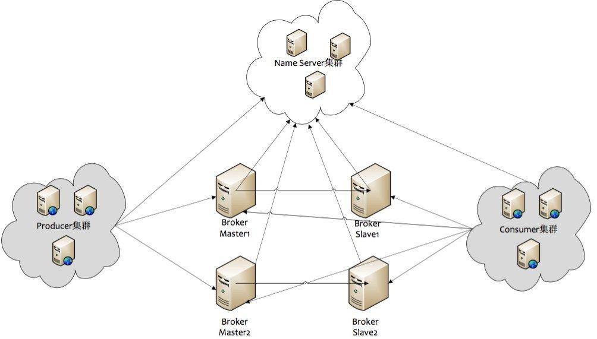
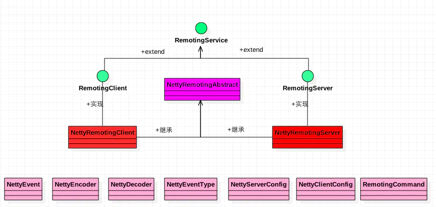
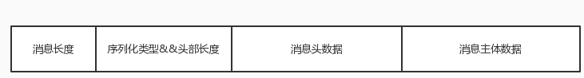
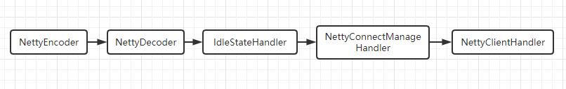
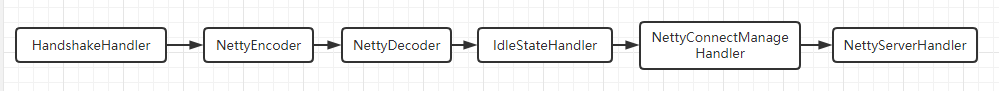
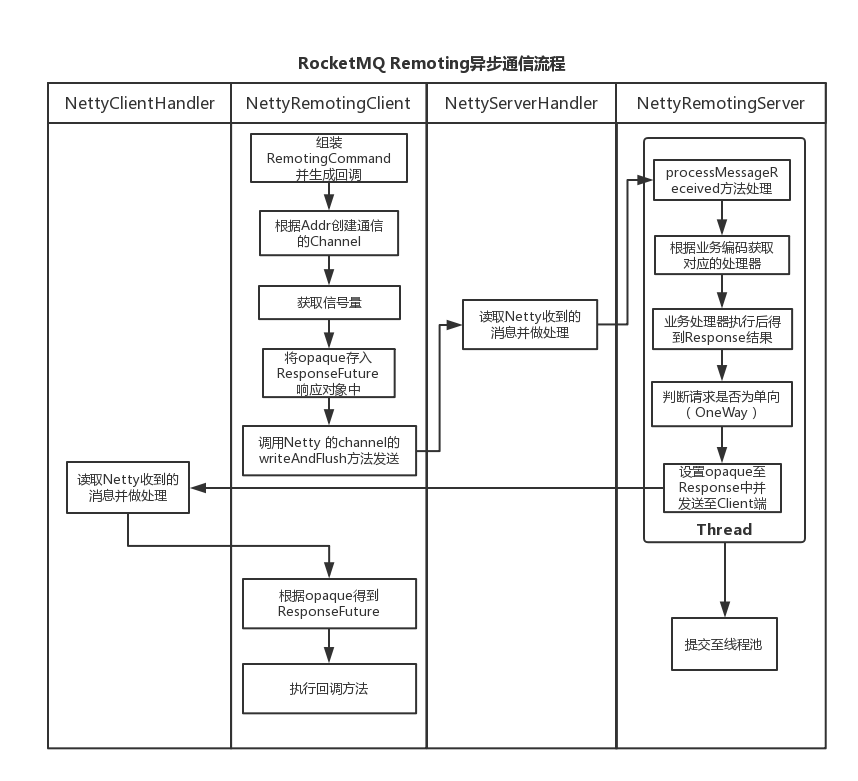
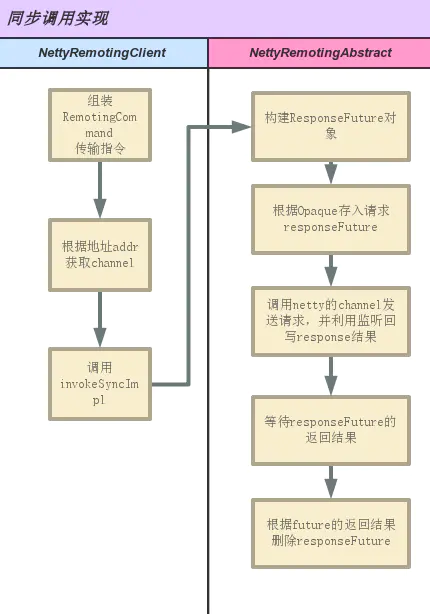
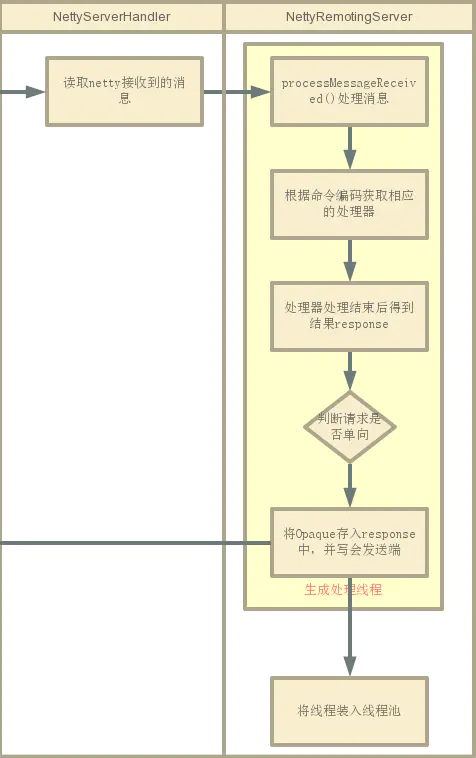
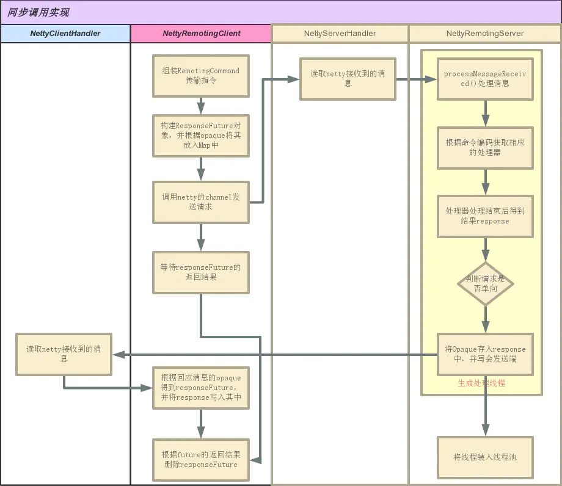

# RocketMQ 远程通信模块详解

## 一、RocketMQ 消息概览

RocketMQ 消息队列的整体部署架构如下图所示：

<div align="center">
    
</div>

先来说下 RocketMQ 消息队列集群中的几个角色：

1. NameServer: 在 MQ 集群中做的是做命名服务，更新和路由发现 broker 服务；
2. Broker-Master: Broker 消息主机服务器
3. Broker-Slave:Broker 消息从机服务器
4. Producer:消息生产者
5. Consumer:消息消费者

其中，RocketMQ 集群的一部分通信如下：

1. Broker 启动之后需要完成一次将自己注册到 NameServer 的操作，随后每隔30s时间定期向 NameServer 上报 Topic 路由信息
2. 消息生产者 Producer 作为客户端发送消息时候，需要根据 Msg 的 Topic 从本地缓存的 TopicPublishInfoTable 获取路由信息。如果没有则更新路由信息会从 NameServer 上重新拉取
3. 消息生产者 Producer 根据（2）中获取的路由信息选择一个队列（MessageQueue）进行消息发送；Broker 作为消息的接收者收消息并落盘存储

从上面（1）~（3）中可以看出在消息生产者, Broker 和 NameServer 之间都会发生通信（这里只说了 MQ 的部分通信），因此如何设计一个良好的网络通信模块在 MQ 中至关重要，它将决定 RocketMQ 集群整体的消息传输能力与最终的性能。 rocketmq-remoting 模块是 RocketMQ 消息队列中负责网络通信的模块，它几乎被其他所有需要网络通信的模块（诸如 rocketmq-client、rocketmq-server、rocketmq-namesrv）所依赖和引用。为了实现客户端与服务器之间高效的数据请求与接收，RocketMQ 消息队列自定义了通信协议并在 Netty 的基础之上扩展了通信模块。

最后，这里分析的代码是 rocketmq-4.2.0 版本，通信的源代码位于rocketmq-remoting 模块中。

## 二、RocketMQ 中 Remoting 模块设计

### 2.1 Remoting 通信模块的类图

<div align="center">
    
</div>

**1) RemotingService 是最上层的接口**

```java{.line-numbers}
public interface RemotingService {
    void start();

    void shutdown();

    void registerRPCHook(RPCHook rpcHook);
} 
```

**2) RemotingClient 和 RemotingServer** 

这两个接口继承了最上层接口—RemotingService，分别各自为Client和Server提供所必需的方法。

**3) NettyRemotingAbstract**

Netty 通信处理的抽象类，定义并封装了 Netty 处理的公共处理方法

**4) NettyRemotingClient/NettyRemotingServer**

分别实现了 RemotingClient 和 RemotingServer, 都继承了 NettyRemotingAbstract 抽象类。RocketMQ 中其他的组件（如 client、nameServer、broker 在进行消息的发送和接收时均使用这两个组件）

### 2.2 消息的协议设计与编解码

#### 2.2.1 消息的封装

在 Client 和 Server 之间完成一次消息发送时，需要将发送的消息内容封装成为一个对象，并且为了高效地在网络中传输消息和对收到的消息读取，就需要对消息进行编解码。在 RocketMQ 中， RemotingCommand 这个类在消息传输过程中对所有数据内容的封装，作为消息的载体，并且还包含了编码解码操作。RemotingCommand 类的部分成员变量如下：

```java{.line-numbers}
public static class RemotingCommand {
    // 对于 request 而言，是请求操作码，应答方根据不同的请求码进行不同的业务处理
    // 对于 response 而言，是应答响应码。0 表示成功，非 0 则表示各种错误
    private int code;
    // 对于 request 而言，是请求方实现的语言
    // 对于 response 而言，是应答方实现的语言
    private LanguageCode language = LanguageCode.JAVA;
    // 对于 request 而言，是请求方程序的版本
    // 对于 response 而言，是应答方程序的版本
    private int version = 0;
    private static AtomicInteger requestId = new AtomicInteger(0);
    // 对于 request 而言，相当于 reqeustId，在同一个连接上的不同请求标识码，与响应消息中的相对应
    // 对于 response 而言，应答不做修改直接返回
    private int opaque = requestId.getAndIncrement();
    // 对于 request 和 response 来说都是区分是普通的 rpc 还是 oneway rpc 的标志
    private int flag = 0;
    // 传输自定义文本信息
    private String remark;
    // 请求自定义扩展信息
    private HashMap<String, String> extFields;
} 
```

这里展示下 Broker 向 NameServer 发送一次心跳注册的报文：

```java{.line-numbers}
[
code=103,// 这里的 103 对应的 code 就是 broker 向 nameserver 注册自己的消息
language=JAVA,
version=137,
opaque=58,// 这个就是 requestId
flag(B)=0,
remark=null,
extFields={
    brokerId=0,
    clusterName=DefaultCluster,
    brokerAddr=ip1: 10911,
    haServerAddr=ip1: 10912,
    brokerName=LAPTOP-SMF2CKDN
},
serializeTypeCurrentRPC=JSON 
```

#### 2.2.2 通信协议

下面来看下 RocketMQ 通信协议的格式：

<div align="center">
    
</div>

可见传输内容主要分为以下四个部分：

- 消息长度：总长度，四个字节存储，占用一个 int 类型；
- 序列化类型&消息头长度：同样占用一个 int 类型，第一个字节表示序列化类型，后面三个字节表示消息头长度；
- 消息头数据：经过序列化后的消息头数据；
- 消息主体数据：消息主体的二进制字节数据内容；

### 2.3 NettyRemotingServer 和 NettyRemotingClient 的网络结构

NettyRemotingClient 的网络结构（pipeline 结构）如下：

<div align="center">
    
</div>

NettyRemotingServer 的网络结构（pipeline 结构）如下：

<div align="center">
    
</div>

NettyRemotingClient 是用来主动和服务器端建立连接，并且发送请求消息，而NettyRemotingServer 则是被动的等待客户端的连接，并且接收请求消息，处理之后再将响应返回。上面网络结构中的各个 handler 的作用如下所示：

- NettyEncoder: 将消息对象 RemotingCommand 编码成字节流发送出去
- NettyDecoder:将消息字节流解码成 RemotingCommand 对象
- IdleStateHandler:进行心跳检测
- NettyConnectManageHandler:继承了 ChannelDuplexHandler 对象，当 channel 发生了 CLOSE、CONNECT 以及 IDLE 等事件时，就将其封装称为 NettyEvent 对象，然后将其加入到阻塞队列中保存起来，等待
- ChannelEventListener 对象来对这些事件分别进行处理
- NettyServerHandler/NettyClientHandler:依据发送过来的请求或者响应对象 RemotingCommand 中的 code，将其分发给对应的 Processor 来进行处理

### 2.4 消息的通信方式和通信流程

在 RocketMQ 中支持的通信方式主要为以下 3 种：

1. 同步 sync
2. 异步 async
3. 单向 oneway

"同步"通信模式和"异步"通信模式很相似，其中"同步"通信相对简单，一般用在发送心跳包场景下，无需关注其 Response；而"异步"通信模式相比"同步"通信增加了一个回调的处理。本文将主要介绍 RocketMQ 的同步通信流程（同步通信流程和异步通信流程及其类似）。 下面先给出了 RocketMQ 异步通信的整体流程图：

<div align="center">
    
</div>

## 三、消息编解码的原理

编码的流程为：

1. 使用 channel.writeAndFlush() 将 RemotingCommand 对象写入到 Channel 中
2. RemtingCommand 使用 NettyEncoder 将其编码成为字节流发送到网络中

解码的流程为：

1. Client/Server 从网络中接收到对方发送过来的字节流，然后通过 NettyDecoder 解码成 RemotingCommand 对象
2. 将 RemotingCommand 对象传递到 NettyClientHandler/NettyServerHandler 中进行处理

### 3.1 编码

我们发送的消息对象 RemotingCommand 被编码是在 NettyEncoder 中，具体代码如下：

```java{.line-numbers}
// NettyEncoder#encode
@Override
public void encode(ChannelHandlerContext ctx, RemotingCommand remotingCommand, ByteBuf out)
    throws Exception {
    try {
        // 对消息的第 1,2,3 部分进行编码，也就是：消息总长度域、消息头长度&序列化方式域、消息头数据
        // 其实就是将这三部分编码成字节流，写入到 ByteBuffer 中，然后在写入到 Channel 中
        ByteBuffer header = remotingCommand.encodeHeader();
        out.writeBytes(header);
        // 由于在 RemotingCommand 中消息体本身就是字节数组形式，所以直接获取，然后写入
        byte[] body = remotingCommand.getBody();
        if (body != null) {
            out.writeBytes(body);
        }
    } catch (Exception e) {
        // 省略代码
    }
} 
```

Client 和 Server 之间传递的请求或者响应消息都是以 RemotingCommand 对象为载体的，不管是 Client 还是 Server，当把 RemotingCommand 通过 channel.writeAndFlush 方法写入到 channel 之后，都首先会通过 NettyEncoder，被编码成字节流，然后传输到网络中去。encodeHeader 的代码如下所示：

```java{.line-numbers}
// RemotingCommand#encodeHeader
public ByteBuffer encodeHeader() {
    return encodeHeader(this.body != null ? this.body.length : 0);
}

// RemotingCommand#encodeHeader
public ByteBuffer encodeHeader(final int bodyLength) {
    // 1> header length size
    // length 代表的是消息的总长度，这里的 4 表示的是第二部分的长度，占用一个 int 类型
    int length = 4;

    // 2> header data length
    // length 加上了消息头具体数据的长度，也就是第 3 部分的长度
    byte[] headerData;
    headerData = this.headerEncode();
    length += headerData.length;

    // 3> body data length
    // length 加上了消息体中具体数据的长度，也就是第 4 部分的长度，到这里 length 等于第 2,3,4 部分的长度之和
    length += bodyLength;
    // 分配的长度目前包括: 总长度域(4) + 消息头长度域(4) + 消息头内容
    ByteBuffer result = ByteBuffer.allocate(4 + length - bodyLength);

    // length
    // 保存总长度
    result.putInt(length);

    // header length
    // 放入第 2 部分，4 个字节，第 1 个字节表示序列化类型，后面 3 个字节表示消息头的长度
    result.put(markProtocolType(headerData.length, serializeTypeCurrentRPC));

    // header data
    // 保存消息头数据
    result.put(headerData);
    result.flip();

    return result;
} 
```

### 3.2 解码

同理，RocketMQ 中 Client/Server 接收到对方发送过来的字节流数据时，需要先通过 NettyDecoder 进行解码，将其转变为 RemotingCommand 对象，然后才能进行后续的处理。具体的代码如下：

```java{.line-numbers}
// NettyDecoder#decode
@Override
public Object decode(ChannelHandlerContext ctx, ByteBuf in) throws Exception {
    ByteBuf frame = null;
    try {
        // 从传送过来的字节流数据中（参数 ByteBuf in），获取到一个消息字节流数据 RemotingCommand
        frame = (ByteBuf) super.decode(ctx, in);
        if (null == frame) {
            return null;
        }
        // 将上面得到的消息字节流数据进行解码，转变为 RemotingCommand 对象
        ByteBuffer byteBuffer = frame.nioBuffer();
        return RemotingCommand.decode(byteBuffer);
    } catch (Exception e) {
        // 省略代码
    } finally {
        // 省略代码
    }
    return null;
} 
```

frame 是字节流，将其解码成为 RemotingCommand 对象的逻辑是在 RemotingCommand 的 decode 方法中。具体的代码如下：

```java{.line-numbers}
// RemotingCommand#decode
// 对 byteBuffer 进行解码，这里的 byteBuffer 是前面所说的消息的第 2,3,4 部分，不包括第 1 部分（也就是消息的总长度）
public static RemotingCommand decode(final ByteBuffer byteBuffer) {
    int length = byteBuffer.limit();
    // 获取第 2 部分，4 个字节，表示消息头的长度（3 个字节）以及消息的序列化类型（1 个字节）
    int oriHeaderLen = byteBuffer.getInt();
    // 获取低 3 个字节，也就是消息头的长度
    int headerLength = getHeaderLength(oriHeaderLen);

    byte[] headerData = new byte[headerLength];
    byteBuffer.get(headerData);

    // getProtocolType 获取最高位的第 4 个字节，也就消息的序列化类型，然后进行消息的反序列化
    RemotingCommand cmd = headerDecode(headerData, getProtocolType(oriHeaderLen));

    int bodyLength = length - 4 - headerLength;
    byte[] bodyData = null;
    if (bodyLength > 0) {
        bodyData = new byte[bodyLength];
        // 将消息体的数据读入到 bodyData 字节数组中
        byteBuffer.get(bodyData);
    }
    cmd.body = bodyData;

    return cmd;
} 
```

解码得到的 RemotingCommand 对象会进一步传递到 pipeline 中的 NettyClientHandler/NettyServerHandler 中进行处理。

## 四、Client 发送请求源码分析

接下来主要介绍一下 Client 端发送请求，Server 端接收消息的具体实现并简要分析的 Client 端的回调。这里分析的都是同步调用的情况。下面是客户端同步调用的整体流程：

<div align="center">
    
</div>

下面我们以客户端获取 NameServer 中的路由信息为例，分析上述流程。

```java{.line-numbers}
// MQClientAPIImpl#getTopicRouteInfoFromNameServer
public TopicRouteData getTopicRouteInfoFromNameServer(final String topic, final long timeoutMillis,
        boolean allowTopicNotExist) throws MQClientException, InterruptedException, RemotingTimeoutException,
        RemotingSendRequestException, RemotingConnectException {
    // 创建一个命令特有的消息头对象
    GetRouteInfoRequestHeader requestHeader = new GetRouteInfoRequestHeader();
    requestHeader.setTopic(topic);
    // 组装 RemotingCommand 传输指令，其实也就是将创建好的 customHeader（这里是 GetRouteInfoRequestHeader）
    // 以及 code（这里是 RequestCode.GET_ROUTEINTO_BY_TOPIC）设置到 RemotingCommand 中。
    RemotingCommand request = RemotingCommand.createRequestCommand(RequestCode.GET_ROUTEINTO_BY_TOPIC, requestHeader);

    // 调用 invokeSync
    RemotingCommand response = this.remotingClient.invokeSync(null, request, timeoutMillis);
    assert response != null;
    // 在 request 中，code 表示的是请求的类型，server 会根据相应的请求类型来调用 processor 进行处理
    // 在 response 中，code 表示的请求在 server 端处理的结果
    switch (response.getCode()) {
    // 如果路由信息不存在
    case ResponseCode.TOPIC_NOT_EXIST: {
        if (allowTopicNotExist && !topic.equals(MixAll.DEFAULT_TOPIC)) {
            log.warn("get Topic [{}] RouteInfoFromNameServer is not exist value", topic);
        }
        break;
    }
    // 如果获取路由信息成功
    case ResponseCode.SUCCESS: {
        byte[] body = response.getBody();
        if (body != null) {
            // 将 response 中的 body 字节流解码
            return TopicRouteData.decode(body, TopicRouteData.class);
        }
    }
    default:
        break;
    }

    throw new MQClientException(response.getCode(), response.getRemark());
} 
```

在上面的代码中，具体干了 3 件事情：

1. 创建一个和 RequestCode 对应的消息头对象
2. 组装成 RemotingCommand 对象（包括 RequestCode，消息头、topic）
3. 调用 remotingClient#invokeSync 方法，真正将请求 RemotingCommand 发送出去

RemotingClient 中的 invokeSync 方法的代码如下：

```java{.line-numbers}
// RemotingClient#invokeSync
@Override
public RemotingCommand invokeSync(String addr, final RemotingCommand request, long timeoutMillis)
        throws InterruptedException, RemotingConnectException, RemotingSendRequestException, RemotingTimeoutException {
    // 根据 addr 地址获取到 channel
    final Channel channel = this.getAndCreateChannel(addr);
    // 如果 channel 不为 null，并且这个 channel 依然有效
    if (channel != null && channel.isActive()) {
        try {
            if (this.rpcHook != null) {
                this.rpcHook.doBeforeRequest(addr, request);
            }
            // 在 NettyRemotingAbstract 中真正执行同步调用，并且阻塞直到返回结果，或者抛出异常
            RemotingCommand response = this.invokeSyncImpl(channel, request, timeoutMillis);
            if (this.rpcHook != null) {
                this.rpcHook.doAfterResponse(RemotingHelper.parseChannelRemoteAddr(channel), request, response);
            }
            return response;
        } catch (RemotingSendRequestException e) {
            // 省略代码
        } catch (RemotingTimeoutException e) {
            // 省略代码
        }
    } else {
        this.closeChannel(addr, channel);
        throw new RemotingConnectException(addr);
    }
} 
```

上面的核心逻辑其实就是根据 addr 地址获取一个 Channel，然后调用 NettyRemotingAbstract#invokeSyncImpl 方法将请求信息真正发送出去。

```java{.line-numbers}
// 同步转异步，同步调用模式依然是采用异步方式完成的
// NettyRemotingAbstract#invokeSyncImpl
public RemotingCommand invokeSyncImpl(final Channel channel, final RemotingCommand request, final long timeoutMillis)
        throws InterruptedException, RemotingSendRequestException, RemotingTimeoutException {
    // opaque 可以看成是 requestId
    final int opaque = request.getOpaque();

    try {
        // 创建 ResponseFuture 对象
        final ResponseFuture responseFuture = new ResponseFuture(opaque, timeoutMillis, null, null);
        // 根据 opaque 保存 responseFuture，opaque 即 requestId，也就是在 responseTable 中，
        // 一个 requestId 和一个 responseFuture 一一对应
        this.responseTable.put(opaque, responseFuture);
        final SocketAddress addr = channel.remoteAddress();

        // 调用 channel#writeAndFlush 将前面组装好的 RemotingCommand 请求发送出去，并且利用监听回写 response 结果
        channel.writeAndFlush(request).addListener(new ChannelFutureListener() {
            @Override
            public void operationComplete(ChannelFuture f) throws Exception {
                // 如果请求发送成功，那么就将 responseFuture 的 sendRequest 变量设置为 true，
                // 表明发送成功，然后返回
                if (f.isSuccess()) {
                    responseFuture.setSendRequestOK(true);
                    return;
                    // 如果请求发送失败，那么就将 responseFuture 的 sendRequest 变量设置为 false，
                    // 表明数据发送失败。然后继续执行下面的代码，将此 responseFuture 移除掉并且设置发送失败的原因
                } else {
                    responseFuture.setSendRequestOK(false);
                }

                // 将此 responseFuture 从 responseTable 中移除掉
                responseTable.remove(opaque);
                // 设置发送失败的原因
                responseFuture.setCause(f.cause());
                // 将 responseFuture 中的 responseCommand 设置为 null，也就是表明没有返回结果，然后唤醒正在阻塞等待返回结果的线程
                responseFuture.putResponse(null);
                log.warn("send a request command to channel <" + addr + "> failed.");
            }
        });

        // 等待 responseFuture 的返回结果
        RemotingCommand responseCommand = responseFuture.waitResponse(timeoutMillis);
        // 如果 responseCommand 为 null，表明没有接收到服务器端的返回值
        if (null == responseCommand) {
            // 为 true，表明请求发送成功，但是等待服务端响应超时
            if (responseFuture.isSendRequestOK()) {
                throw new RemotingTimeoutException();
                // 为 false，表明是发送请求失败
            } else {
                throw new RemotingSendRequestException();
            }
        }

        return responseCommand;
    } finally {
        // 根据 responseFuture 对应的 opaque，从 responseTable 中删除这个 responseFuture 对象
        this.responseTable.remove(opaque);
    }
} 
```

从上面的代码中可以看出，在 RocketMQ 中，同步调用其实也是使用异步的方式完成的。先生成一个 ResponseFuture 对象，并且将其保存到 responseTable 中。responseTable 中的键值对为 opaque（requestID) -> ResponseFuture，表示还在等待对方响应的请求信息。接着，调用 channel#writeAndFlush 方法将其异步发送出去，然后当前线程阻塞，直到接收到对方返回的响应。下面介绍服务器端接收到请求后的处理流程。

## 五、服务端接收请求源码分析

<div align="center">
    
</div>

从客户端发送过来的消息在服务端先经过 NettyDecoder 解码处理，转换成为 RemotingCommand 对象，然后在传入到 NettyServerHandler 进行具体的处理。NettyServerHandler 代码如下：

```java{.line-numbers}
class NettyServerHandler extends SimpleChannelInboundHandler<RemotingCommand> {
    @Override
    protected void channelRead0(ChannelHandlerContext ctx, RemotingCommand msg) throws Exception {
        processMessageReceived(ctx, msg);
    }
} 
```

接着会调用 NettyRemotingAbstract 中的 processMessageReceived 方法。

```java{.line-numbers}
// NettyRemotingAbstract#processMessageReceived
public void processMessageReceived(ChannelHandlerContext ctx, RemotingCommand msg) throws Exception {
    final RemotingCommand cmd = msg;
    if (cmd != null) {
        switch (cmd.getType()) {
            case REQUEST_COMMAND:
                processRequestCommand(ctx, cmd);
                break;
            case RESPONSE_COMMAND:
                processResponseCommand(ctx, cmd);
                break;
            default:
                break;
        }
    }
}
```

从上面可以看出，就是简单地依据 RemotingCommand 是请求还是响应类型来分别处理。这里 RemotingCommand 是 REQUEST_COMMAND，接着调用 processRequestCommand 方法。

这里需要注意，在 RocketMQ 中，NettyRemotingClient 在 Consumer、Producer 以及 Broker 中都会用到。而 NettyRemotingServer 只在 Broker、NameServer 中会使用到。并且在使用 NettyRemotingClient 和 NettyRemotingServer 的时候都会注册 processor 和 executor 到其中。并且一种 processor 可以用来多种多个不同的 RequestCode，并且这个处理的过程是包装成一个 Runnable 任务放入到线程池中去执行。所以在注册的时候会指定 RequestCode、Processor 以及 Executor 线程池。NameServer 中只注册一个 DefaultProcessor，所有发往 NameServer 的请求都由上面注册的 DefaultRequestProcessor 来进行处理。代码如下：

```java{.line-numbers}
// NamesrvController#registerProcessor
private void registerProcessor() {
    if (namesrvConfig.isClusterTest()) {
        this.remotingServer.registerDefaultProcessor(new ClusterTestRequestProcessor(this, namesrvConfig.getProductEnvName()), this.remotingExecutor);
    } else {
        this.remotingServer.registerDefaultProcessor(new DefaultRequestProcessor(this), this.remotingExecutor);
    }
} 
```

而在 Broker 中，由于要处理的请求更加的复杂，所以在 Broker 中注册了 7 个 Processor，具体的代码如下：

```java{.line-numbers}
// BrokerController#registerProcessor
public void registerProcessor() {
    /**
     * SendMessageProcessor
     */
    SendMessageProcessor sendProcessor = new SendMessageProcessor(this);
    sendProcessor.registerSendMessageHook(sendMessageHookList);
    sendProcessor.registerConsumeMessageHook(consumeMessageHookList);

    this.remotingServer.registerProcessor(RequestCode.SEND_MESSAGE, sendProcessor, this.sendMessageExecutor);
    this.remotingServer.registerProcessor(RequestCode.SEND_MESSAGE_V2, sendProcessor, this.sendMessageExecutor);
    this.remotingServer.registerProcessor(RequestCode.SEND_BATCH_MESSAGE, sendProcessor, this.sendMessageExecutor);
    this.remotingServer.registerProcessor(RequestCode.CONSUMER_SEND_MSG_BACK, sendProcessor, this.sendMessageExecutor);

    /**
     * PullMessageProcessor
     */
    this.remotingServer.registerProcessor(RequestCode.PULL_MESSAGE, this.pullMessageProcessor, this.pullMessageExecutor);
    this.pullMessageProcessor.registerConsumeMessageHook(consumeMessageHookList);

    /**
     * QueryMessageProcessor
     */
    NettyRequestProcessor queryProcessor = new QueryMessageProcessor(this);
    this.remotingServer.registerProcessor(RequestCode.QUERY_MESSAGE, queryProcessor, this.queryMessageExecutor);
    this.remotingServer.registerProcessor(RequestCode.VIEW_MESSAGE_BY_ID, queryProcessor, this.queryMessageExecutor);

    /**
     * ClientManageProcessor
     */
    ClientManageProcessor clientProcessor = new ClientManageProcessor(this);
    this.remotingServer.registerProcessor(RequestCode.HEART_BEAT, clientProcessor, this.clientManageExecutor);
    this.remotingServer.registerProcessor(RequestCode.UNREGISTER_CLIENT, clientProcessor, this.clientManageExecutor);
    this.remotingServer.registerProcessor(RequestCode.CHECK_CLIENT_CONFIG, clientProcessor, this.clientManageExecutor);

    /**
     * ConsumerManageProcessor
     */
    ConsumerManageProcessor consumerManageProcessor = new ConsumerManageProcessor(this);
    this.remotingServer.registerProcessor(RequestCode.GET_CONSUMER_LIST_BY_GROUP, consumerManageProcessor, this.consumerManageExecutor);
    this.remotingServer.registerProcessor(RequestCode.UPDATE_CONSUMER_OFFSET, consumerManageProcessor, this.consumerManageExecutor);
    this.remotingServer.registerProcessor(RequestCode.QUERY_CONSUMER_OFFSET, consumerManageProcessor, this.consumerManageExecutor);

    /**
     * EndTransactionProcessor
     */
    this.remotingServer.registerProcessor(RequestCode.END_TRANSACTION, new EndTransactionProcessor(this), this.sendMessageExecutor);

    /**
     * Default
     */
    AdminBrokerProcessor adminProcessor = new AdminBrokerProcessor(this);
    this.remotingServer.registerDefaultProcessor(adminProcessor, this.adminBrokerExecutor);
} 
```

而对于 NettyRemotingClient 而言，注册的 Processor 如下：

```java{.line-numbers}

public MQClientAPIImpl(final NettyClientConfig nettyClientConfig,
    final ClientRemotingProcessor clientRemotingProcessor,
    RPCHook rpcHook, final ClientConfig clientConfig) {
    this.clientConfig = clientConfig;
    topAddressing = new TopAddressing(MixAll.getWSAddr(), clientConfig.getUnitName());
    this.remotingClient = new NettyRemotingClient(nettyClientConfig, null);
    this.clientRemotingProcessor = clientRemotingProcessor;
    
    this.remotingClient.registerRPCHook(rpcHook);
    this.remotingClient.registerProcessor(RequestCode.CHECK_TRANSACTION_STATE, this.clientRemotingProcessor, null);
    
    this.remotingClient.registerProcessor(RequestCode.NOTIFY_CONSUMER_IDS_CHANGED, this.clientRemotingProcessor, null);
    
    this.remotingClient.registerProcessor(RequestCode.RESET_CONSUMER_CLIENT_OFFSET, this.clientRemotingProcessor, null);
    
    this.remotingClient.registerProcessor(RequestCode.GET_CONSUMER_STATUS_FROM_CLIENT, this.clientRemotingProcessor, null);
    
    this.remotingClient.registerProcessor(RequestCode.GET_CONSUMER_RUNNING_INFO, this.clientRemotingProcessor, null);
    
    this.remotingClient.registerProcessor(RequestCode.CONSUME_MESSAGE_DIRECTLY, this.clientRemotingProcessor, null);
} 
```

说完了上述 Processor 和 Executor 的关系之后，接着就是 processRequestCommand 的具体代码：

```java{.line-numbers}
// NettyRemotingAbstract#processRequestCommand
public void processRequestCommand(final ChannelHandlerContext ctx, final RemotingCommand cmd) {
    // 根据 RemotingCommand 中的 code 获取到 processor 和 executorService
    final Pair<NettyRequestProcessor, ExecutorService> matched = this.processorTable.get(cmd.getCode());
    final Pair<NettyRequestProcessor, ExecutorService> pair = null == matched ? this.defaultRequestProcessor : matched;
    final int opaque = cmd.getOpaque();

    if (pair != null) {
        Runnable run = new Runnable() {
            @Override
            public void run() {
                try {
                    RPCHook rpcHook = NettyRemotingAbstract.this.getRPCHook();
                    if (rpcHook != null) {
                        rpcHook.doBeforeRequest(RemotingHelper.parseChannelRemoteAddr(ctx.channel()), cmd);
                    }
                    // 使用 processor 来处理这个 RemotingCommand 请求
                    final RemotingCommand response = pair.getObject1().processRequest(ctx, cmd);
                    if (rpcHook != null) {
                        rpcHook.doAfterResponse(RemotingHelper.parseChannelRemoteAddr(ctx.channel()), cmd, response);
                    }

                    if (!cmd.isOnewayRPC()) {
                        if (response != null) {
                            response.setOpaque(opaque);
                            response.markResponseType();
                            try {
                                // 将 response 对象发送回客户端
                                ctx.writeAndFlush(response);
                            } catch (Throwable e) {
                                log.error("process request over, but response failed", e);
                                log.error(cmd.toString());
                                log.error(response.toString());
                            }
                        } else {
                        }
                    }
                } catch (Throwable e) {
                    // 省略代码
                }
            }
        };

        if (pair.getObject1().rejectRequest()) {
            // 省略代码
        }

        try {
            // 将上面的 run 任务（实现了 Runnable 接口）封装成一个 task 提交到线程池中去执行，并且这个线程池和这个 processor 是成对的
            final RequestTask requestTask = new RequestTask(run, ctx.channel(), cmd);
            pair.getObject2().submit(requestTask);
        } catch (RejectedExecutionException e) {
            // 省略代码
        }
    } else {
        // 省略代码
    }
} 
```

上面的代码就是获取到和 RequestCode 对应的 Processor 和 Executor，然后将 Processor 处理 RemotingCommand 请求的代码封装到一个 Runnable 对象里面，然后提交到线程池中去执行。在处理完成之后会将 RemotingCommand 响应通过 channel 发送给客户端。

## 六、客户端处理服务端的响应源码分析

同样，Client 接收到 NameServer 发送过来的响应，也就是字节流之后，会通过 NettyDecoder 将其转化为 RemotingCommand 对象，然后交给 NettyClientHandler 进行处理，NettyClientHandler 的代码如下：

```java{.line-numbers}
class NettyClientHandler extends SimpleChannelInboundHandler<RemotingCommand> {
    @Override
    protected void channelRead0(ChannelHandlerContext ctx, RemotingCommand msg) throws Exception {
        processMessageReceived(ctx, msg);
    }
}
```

其中，processMessageReceived 同样也是调用 NettyRemotingAbstract 中的 processMessageReceived 方法，只不过这里是响应，所以会调用 processResponseCommand 方法。

```java{.line-numbers}
// NettyRemotingAbstract#processResponseCommand
public void processResponseCommand(ChannelHandlerContext ctx, RemotingCommand cmd) {
    // 获取到 response 中的 opaque，这个 opaque 其实就是 request 中的 requestId
    final int opaque = cmd.getOpaque();
    // 根据这个 opaque 从 responseTable 中取出 responseFuture
    final ResponseFuture responseFuture = responseTable.get(opaque);
    if (responseFuture != null) {
        responseFuture.setResponseCommand(cmd);
        responseTable.remove(opaque);
        // 如果 responseFuture 对象中有回调，那么就会执行回调函数，回调一般在异步调用中使用
        if (responseFuture.getInvokeCallback() != null) {
            executeInvokeCallback(responseFuture);
        } else {
            // 唤醒阻塞等待请求响应结果的线程
            responseFuture.putResponse(cmd);
            responseFuture.release();
        }
    } else {
        log.warn("receive response, but not matched any request, " + RemotingHelper.parseChannelRemoteAddr(ctx.channel()));
        log.warn(cmd.toString());
    }
} 
```

在获取到 RemotingCommand 对象之后，会将其从 responseTable 中移除，然后如果 responseFuture 中有回调的话，就执行回调函数，只不过一般是在异步调用中使用回调。如是同步的话，就会唤醒阻塞等待响应结果的线程。

前文中讲到, 每次有消息需要发送, 就会生成 resposneFuture 用于接收消息回应, 但是如果始终没有收到回应, Map(scanResponseTable) 中的 responseFuture 就会堆积。这个时候就需要一个线程来专门做 Map 的清理回收，即前文提到的定时扫描 responseTable 的任务，这个线程会 1s 调用一次来检查所有的 responseFuture，判断是否有效，是否已经得到返回，并进行相应的处理。代码如下:

```java{.line-numbers}
// NettyRemotingAbstract#scanResponseTable
public void scanResponseTable() {
    final List<ResponseFuture> rfList = new LinkedList<ResponseFuture>();
    Iterator<Entry<Integer, ResponseFuture>> it = this.responseTable.entrySet().iterator();
    while (it.hasNext()) {
        Entry<Integer, ResponseFuture> next = it.next();
        ResponseFuture rep = next.getValue();

        if ((rep.getBeginTimestamp() + rep.getTimeoutMillis() + 1000) <= System.currentTimeMillis()) {
            rep.release();
            it.remove();
            rfList.add(rep);
            PLOG.warn("remove timeout request, " + rep);
        }
    }

    for (ResponseFuture rf : rfList) {
        try {
            executeInvokeCallback(rf);
        } catch (Throwable e) {
            PLOG.warn("scanResponseTable, operationComplete Exception", e);
        }
    }
}
```

将客户端和服务器端联合起来的流程图如下：

<div align="center">
    
</div>