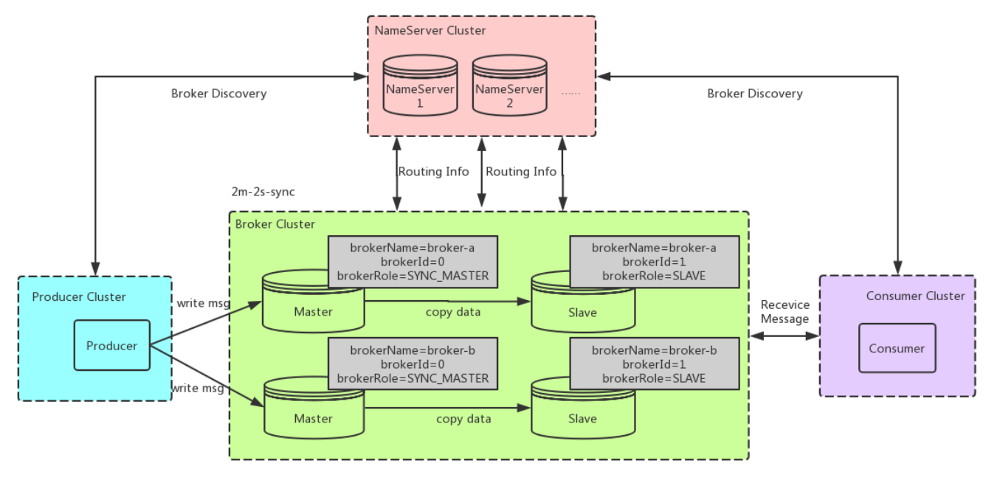
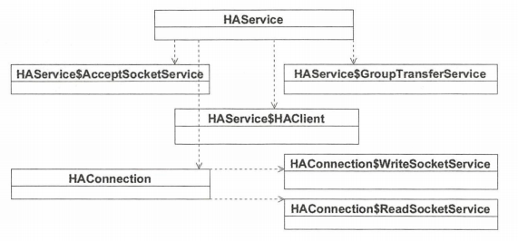
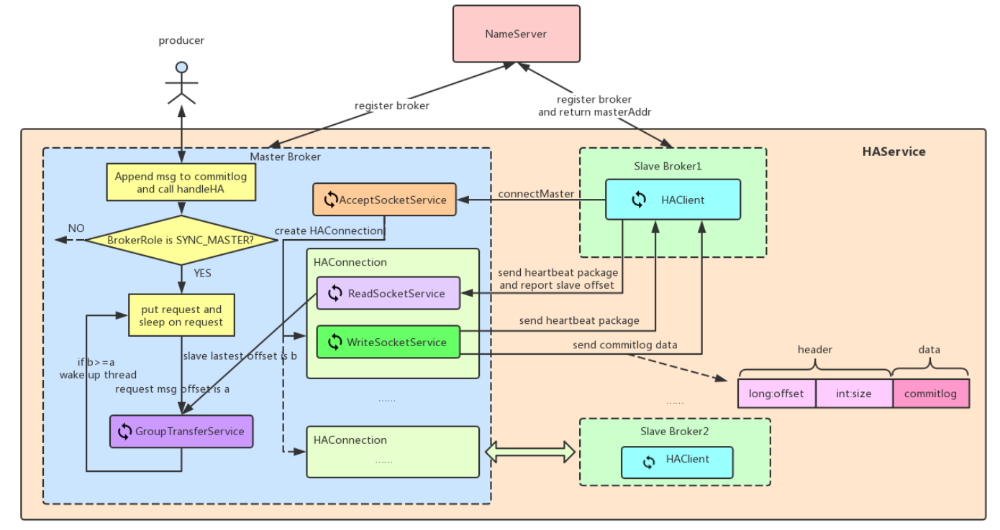

# RocketMQ 高可用 HA 详解

## 一、概述

主从同步，同步的是啥，作为消息中间件无疑是消息，相当于给数据做"备份"，主节点服务器 Broker 宕机后，消费者可以从从节点的服务消费消息，可以保证业务的正常运行。主从同步的原理图如下：

<div align="center">
    
</div>

增加 slave 结点的优点如下：

- 数据备份：保证了两/多台机器上的数据冗余，特别是在主从同步复制的情况下，一定程度上保证了Master出现不可恢复的故障以后，数据不丢失。
- 高可用性：即使Master掉线， Consumer会自动重连到对应的Slave机器，不会出现消费停滞的情况。并且在 4.5 版本以前，slave 不能接收 producer 发送的消息，slave 只能同步 master 数据，从 4.5 版本开始增加多副本机制，根据 RAFT 算法，master 宕机会自动选择其中一个副本节点作为 master 保证消息可以正常的生产消费。
- 提高性能：主要表现为可分担 Master 读的压力，**<font color="red">当从 Master 拉取消息，拉取消息的最大物理偏移与本地存储的最大物理偏移的差值超过一定值</font>**，会转向 Slave (默认brokerId=1)进行读取，减轻了 Master 压力。

我们知道，broker 有两种角色 master 和 slave，每种角色有两个关键配置：brokerId 和brokerRole，brokerId 指定此 master 或 slave 在 Broker 中的序号，0 表示 Master，1 及之后的表示 Slave，Broker 中 Slave 可以有多个，当然一般一个就够了，所以 brokerId 的值一般为 1。brokerRole 表示其在 Broker 中的角色定位，有 3 个值可选：

```java{.line-numbers}
public enum BrokerRole {
    ASYNC_MASTER,
    SYNC_MASTER,
    SLAVE;
} 
```

ASYNC_MASTER：异步 Master，也就是新的消息存储时不需要等 Slave 同步完成； SYNC_MASTER：同步 Master，新消息存现时需要等 Slave 同步完成，也就是返回的 Ack Offset >= 当前消息的CommitLog Offset； SLAVE：Slave 角色其 brokerRole；

所以 rocketmq 的主从数据同步有两种方式：同步复制和异步复制：

- 同步复制：
  - 优点：slave 保证了与 master 一致的数据副本，如果 master 宕机，数据依然可以在 slave 中找到，并且其数据和 master 的数据一致
  - 缺点：由于需要 slave 确认，效率上会有一定的损失
  - 适应场景：数据可靠性要求很高的场景
- 异步复制：
  - 优点：无需等待 slave 确认消息是否存储成功，效率上要高于同步复制
  - 缺点：如果 master 宕机，由于数据同步有延迟导致 slave 和 master 存在一定程度的数据不一致问题

适应场景：数据可靠性要求一般的场景。

## 二、同步复制原理

### 2.1 RocketMQ HA 实现原理

为了提高消息消费的高可用性，避免 Broker 发生单点故障引起存储在 Broker 上的消息无法及时消费，Rocketmq 引入了 Broker 主备机制，即消息消费到达主服务器后需要将消息同步到消息从服务器，如果主服务器 Broker 宕机后，消息消费者可以从从服务器拉取消息。RocketMQ HA 的核心类图如下所示：

<div align="center">
    
</div>

- **`HAService`**: Rocketmq 主从同步核心实现类
- **`HAService$AcceptSocketService`**: Master 端监听客户端连接实现类
- **`HAService$GroupTransferService`**: 主从同步通知实现类，用于判断主从同步复制是否完成
- **`HAService$HAClient`**: HA Client 端实现类，SLAVE 使用此类对象来向 MASTER 发送心跳包来报告 slave offset，读取 MASTER 发送过来的消息数据
- **`HAConnection`**: Master 与 SLAVE 连接的封装，包含 ReadSocketService 和 WriteSocketService 两个类，分别用来读取 SLAVE 发送的请求以及往 SLAVE 发送消息数据
- **`HAConnection$ReadSocketService`**: HA Master 网络读实现类，用来读取 SLAVE 上的 HA Client 发送的心跳包，其中包含了 slave offset，也就是 SLAVE 下次希望获取到的消息偏移量（确切地说是消息在 CommitLog 文件中的偏移量）
- **`HAConnection$WriteSocketService`**: HA Master 网络写实现类，根据 SLAVE 发送的 slave offset，将 CommitLog 中的消息发送给 SLAVE，同时每过 5s 会发送一个心跳包（不包含实际数据）给 SLAVE

### 2.2 同步复制的过程

最开始，在 DefaultMessageStore 的构造函数中，创建 HAService 对象，然后在 DefaultMessageStore#start 方法中开启 haService。在 HAService 类的构造方法中，会分别创建一个 HAClient 对象、一个 AcceptSocketService 对象以及一个 GroupTransferService 对象。这三个类都继承于 ServiceThread，所以都是服务线程。它们在 HAService#start 方法中开启。

MASTER 在 HAService#start 方法中会开启 AcceptSocketService 线程，用来获取到 SLAVE 端建立连接的请求。一旦接收到连接，就创建一个 HAConnection 对象将和此 SLAVE 的连接封装起来，并且在这个 HAConnection 对象中，开启两个服务线程，ReadSocketService 和 WriteSocketService 分别用来读取 SLAVE 发送的请求以及往 SLAVE 发送消息数据。

HAClient 主要用于 SLAVE 端。在 HAClient 开启以后，它首先会尝试和 MASTER 创建一个连接，然后会每隔一定时间向 MASTER 发送一个心跳包，在这个心跳包中只有一个 8 字节的数据 slave offset，就是 SLAVE 端下次希望获取到的消息偏移量（这个偏移量其实就是消息在 CommitLog 中的偏移量）。

 MASTER 端的 ReadSocketService 在获取到 SLAVE 端发送过来的 slave offset （**<font color="red">SLAVE 端下次希望获取到的消息偏移量或者说 SLAVE 中已成功复制的最大偏移量</font>**）之后会判断其和 req.getNextOffset（**<font color="red">消息生产者发送消息后消息服务端返回下一条消息的起始偏移</font>**）的大小，如果大于的话就会唤醒阻塞的消息发送者线程（如果有的话）。MASTER 端的 WriteSocketService 会将 CommitLog 中的消息发送给 SLAVE 进行同步。

 具体的流程如下图所示：

 <div align="center">
    
 </div>

## 三、源码分析

### 3.1 初始化以及连接创建

主从复制过程主要和 HAService 类相关，Broker 启动时，会相应启动 HAService，用于主从复制，同时相应启动其内部的 HAClient、AcceptSocketService（用于服务端接收连接线程实现类）、GroupTransferService（用于判断主从同步复制是否完成）。 Slave 向 Master 发送请求，那就需要去 Master 看看处理这个请求的方式，Broker 在启动时会启动 HAService 内的AcceptSocketService，这个对象就是用来接收 Socket 请求连接的服务对象，看其对 Slave 的请求处理形式：

```java{.line-numbers}
// AcceptSocketService#run
@Override
public void run() {
    log.info(this.getServiceName() + " service started");

    // 下面的逻辑是标准的基于 NIO 的服务端实例，选择器每 1s 处理一次连接就绪事件，连接事件就绪后
    // 调用 ServerSocketChannel 的 accept 方法创建 SocketChannel。然后为每一个连接创建一个 HAConnection 
    // 对象，该 HAConnection 将负责 M-S 数据同步逻辑
    while (!this.isStopped()) {
        try {
            this.selector.select(1000);
            Set<SelectionKey> selected = this.selector.selectedKeys();

            if (selected != null) {
                for (SelectionKey k : selected) {
                    if ((k.readyOps() & SelectionKey.OP_ACCEPT) != 0) {
                        SocketChannel sc = ((ServerSocketChannel) k.channel()).accept();

                        if (sc != null) {
                            HAService.log.info("HAService receive new connection");
                            try {
                                HAConnection conn = new HAConnection(HAService.this, sc);
                                conn.start();
                                HAService.this.addConnection(conn);
                            } catch (Exception e) {
                                log.error("new HAConnection exception", e);
                                sc.close();
                            }
                        }
                    } else {
                        log.warn("Unexpected ops in select " + k.readyOps());
                    }
                }
                selected.clear();
            }
        } catch (Exception e) {
            log.error(this.getServiceName() + " service has exception.", e);
        }
    }

    log.info(this.getServiceName() + " service end");
} 
```

AcceptSocketService 在启动时会监听 SelectionKey.OP_ACCEPT 事件，当接收到请求时，创建一个 SocketChannel 长连接对象，然后用 HAConnection 去封装 SocketChannel，之后启动 HAConnection，可以先看看 HAConnection 的 start() 方法做了什么：

```java{.line-numbers}
// HAConnection#start
public void start() {
    // 启动 readSocketService 读取 Slave 传过来的数据
    this.readSocketService.start();
    // 启动 writeSocketService 向 Channel 写入消息, 同步给 Slave
    this.writeSocketService.start();
} 
```

HAConnection 在实例化时生成了 writeSocketService 和 readSocketService 两个对象。

- writeSocketService：负责同步操作，将 Master 中 CommitLog 的消息数据写入到SocketChannel；
- readSocketService：负责从 SocketChannel 中读取 Slave 传递的 ACK 进度，也就是其 CommitLog 的maxPhyOffset，Slave 向 Master 同步的进度信息。

下面看 HAClient 的启动过程：

```java{.line-numbers}
// HAClient#run
@Override
public void run() {
    log.info(this.getServiceName() + " service started");

    while (!this.isStopped()) {
        try {
            // 当存在 masterAddress != null && 连接 Master 成功
            if (this.connectMaster()) {
                // 若距离上次上报时间超过5S，上报到 Master 进度
                if (this.isTimeToReportOffset()) {
                    boolean result = this.reportSlaveMaxOffset(this.currentReportedOffset);
                    if (!result) {
                        this.closeMaster();
                    }
                }

                // 最多阻塞 1s,直到 Master 有数据同步过来。若 1s 满了还是没有接受到数据,中断阻塞, 执行 processReadEvent()
                this.selector.select(1000);
                // 处理读取事件
                boolean ok = this.processReadEvent();

                if (!ok) {
                    this.closeMaster();
                }
                // 处理读事件之后，若进度有变化，上报到Master进度
                if (!reportSlaveMaxOffsetPlus()) {
                    continue;
                }
                long interval = HAService.this.getDefaultMessageStore().getSystemClock().now() - this.lastWriteTimestamp;
                // Master 超过 20s 未返回数据，关闭连接，MASTER 每过 5s 就会向 SLAVE 发送一次心跳包
                if (interval > HAService.this.getDefaultMessageStore().getMessageStoreConfig().getHaHousekeepingInterval()) {
                    log.warn("HAClient, housekeeping, found this connection");
                    this.closeMaster();
                    log.warn("HAClient, master not response some time, so close connection");
                }
            } else {
                this.waitForRunning(1000 * 5);
            }
        } catch (Exception e) {
            log.warn(this.getServiceName() + " service has exception. ", e);
            this.waitForRunning(1000 * 5);
        }
    }

    log.info(this.getServiceName() + " service end");
} 
```

可以看出 SLAVE 端的 HA Client 启动的第一步，就是和 MASTER 建立连接。

```java{.line-numbers}
/**
 * Slave 端尝试连接 Master 服务器，在 Broker 启动的时候，如果 Broker 角色为 SLAVE 时将读取 Broker 配置文件中的
 * haMasterAddress 属性并且更新 HAClient 的 masterAddress，如果角色为 SLAVE 并且 haMasterAddress 为空，启动
 * 并不会报错，但不会执行主从同步复制，该方法最终返回是否成功连接上 Master
 * 
 * Master 在接收到 Slave 的连接请求后，创建 SocketChannel，封装成一个 HAConnection，同时启动 writeSocketService 
 * 和 readSocketService 服务。但 Master 启动时是不会主动传输数据的，因为其不知道 Slave 的 CommitLog的maxPhyOffset，
 * 也就是不知道从哪个位置开始同步，需要 Slave 先上报当前 CommitLog的maxPhyOffset。
 */
// HAClient#connectMaster
private boolean connectMaster() throws ClosedChannelException {
    if (null == socketChannel) {
        String addr = this.masterAddress.get();
        if (addr != null) {
            // 当自身角色是 Slave 时,会将配置中的 MessageStoreConfig 中的 haMasterAddress 赋值给 masterAddress, 
            // 或者在 registerBroker 时的返回值赋值
            SocketAddress socketAddress = RemotingUtil.string2SocketAddress(addr);
            if (socketAddress != null) {
                this.socketChannel = RemotingUtil.connect(socketAddress);
                if (this.socketChannel != null) {
                    // 注册网络读事件 OP_READ
                    this.socketChannel.register(this.selector, SelectionKey.OP_READ);
                }
            }
        }
        // 初始化 currentReportedOffset 为 commitlog 文件的最大偏移量
        // 更新最近上报 offset, 也就是当前 SLAVE 端的 CommitLog 的 maxOffset
        this.currentReportedOffset = HAService.this.defaultMessageStore.getMaxPhyOffset();
        this.lastWriteTimestamp = System.currentTimeMillis();
    }
    return this.socketChannel != null;
} 
```

Master 在接收到 Slave 的连接请求后，创建 SocketChannel，封装成一个 HAConnection，同时启动 writeSocketService 和 readSocketService 服务。但 Master 启动时是不会主动传输数据的，因为其不知道Slave 的 CommitLog 的 maxPhyOffset，也就是不知道从哪个位置开始同步，需要 Slave 先上报当前 CommitLog的maxPhyOffset。

### 3.2 Slave 上报偏移量

Slave 和 Master 之间的互相传输的第首先是 Slave 开始的。下面我们看 Slave 发起的请求步骤，首先，判断距离上次上报 Master 的时间间隔：

```java{.line-numbers}
// HAClient#isTimeToReportOffset
// 判断是否需要向 Master 反馈当前待拉取的偏移量，Master 与 Slave 的 HA 心跳发送间隔默认为 5s，
// 可以通过配置 haSendHeartbeatInterval 来改变心跳间隔
private boolean isTimeToReportOffset() {
    long interval = HAService.this.defaultMessageStore.getSystemClock().now() - this.lastWriteTimestamp;
    boolean needHeart = interval > HAService.this.defaultMessageStore.getMessageStoreConfig().getHaSendHeartbeatInterval();
    return needHeart;
} 
```

如果满足条件，则执行 reportSlaveMaxOffset 上报进度：

```java{.line-numbers}
/**
 * 向 Master 服务器反馈拉取偏移量，这里有两重意义，对于 Slave 端来说，是发送下次待拉取消息偏移量，而对于 Master 服务端来说，
 * 既可以认为是 Slave 本次请求拉取的消息偏移量，也可以理解为 Slave 的消息同步 ACK 确认消息
 * 
 * 上报进度,传递进度的时候仅传递一个 Long 类型的 Offset, 8 个字节,没有其他数据
 */
// HAClient#reportSlaveMaxOffset
private boolean reportSlaveMaxOffset(final long maxOffset) {
    this.reportOffset.position(0);
    this.reportOffset.limit(8);
    // 只保存一个 8 字节的 Long 型数据
    this.reportOffset.putLong(maxOffset);
    this.reportOffset.position(0);
    this.reportOffset.limit(8);

    // 特别需要留意的是，调用网络通道的 write 方法是在一个 while 循环中反复判断 byteBuffer 是否全部写入到通道中，
    // 这是由于 NIO 是一个非阻塞 IO，调用一次 write 方法不一定会将 ByteBuffer 可读字节全部写入
    for (int i = 0; i < 3 && this.reportOffset.hasRemaining(); i++) {
        try {
            this.socketChannel.write(this.reportOffset);
        } catch (IOException e) {
            log.error("reportSlaveMaxOffset this.socketChannel.write exception", e);
            return false;
        }
    }

    return !this.reportOffset.hasRemaining();
} 
```

Master 和 Slave 在创建连接成功后，生成 SocketChannel，都注册 SelectionKey.OP_READ 事件。

### 3.3 MASTER 获取 SLAVE 的同步偏移量

当 Slave 上报数据时，会触发 SelectionKey.OP_READ事件，然后 Master 将请求交由 ReadSocketService 服务处理：

```java{.line-numbers}
// ReadSocketService#run
@Override
public void run() {
    HAConnection.log.info(this.getServiceName() + " service started");

    while (!this.isStopped()) {
        try {
            // 每隔 1s 处理一次读就绪事件，每次读请求调用其 processReadEvent 来解析从服务器拉取的请求
            this.selector.select(1000);
            boolean ok = this.processReadEvent();
            if (!ok) {
                HAConnection.log.error("processReadEvent error");
                break;
            }

            long interval = HAConnection.this.haService.getDefaultMessageStore().getSystemClock().now() - this.lastReadTimestamp;
            
            // 如果超过 20s 没有收到 SLAVE 的心跳包，则关闭掉这个连接
            if (interval > HAConnection.this.haService.getDefaultMessageStore().getMessageStoreConfig().getHaHousekeepingInterval()) {
                log.warn("ha housekeeping, found this connection[" + HAConnection.this.clientAddr + "] expired, " + interval);
                break;
            }
        } catch (Exception e) {
            HAConnection.log.error(this.getServiceName() + " service has exception.", e);
            break;
        }
    }

    this.makeStop();
    writeSocketService.makeStop();
    haService.removeConnection(HAConnection.this);
    HAConnection.this.haService.getConnectionCount().decrementAndGet();

    SelectionKey sk = this.socketChannel.keyFor(this.selector);
    if (sk != null) {
        sk.cancel();
    }

    try {
        this.selector.close();
        this.socketChannel.close();
    } catch (IOException e) {
        HAConnection.log.error("", e);
    }

    HAConnection.log.info(this.getServiceName() + " service end");
} 
```

当 Slave 传递了自身的 maxPhyOffset 时，Master 会马上中断 selector.select(1000)，执行processReadEvent() 方法：

```java{.line-numbers}
// 解析 SLAVE 服务器拉取的请求
private boolean processReadEvent() {
    int readSizeZeroTimes = 0;

    // 如果该 byteBufferRead 没有剩余空间，那么说明 position == limit，调用 byteBufferRead 的 flip 方法
    // 产生的效果为 limit = position, position = 0，表示从头开始处理
    if (!this.byteBufferRead.hasRemaining()) {
        this.byteBufferRead.flip();
        this.processPostion = 0;
    }

    while (this.byteBufferRead.hasRemaining()) {
        try {
            int readSize = this.socketChannel.read(this.byteBufferRead);
            if (readSize > 0) {
                readSizeZeroTimes = 0;
                this.lastReadTimestamp = HAConnection.this.haService.getDefaultMessageStore().getSystemClock().now();

                // 超过 8 个字节处理，因为 slave 的 broker 发送的就是 8 个字节的 slave 的 offset 的心跳
                // 如果读取的字节大于 0 并且本次读取到的内容大于等于 8，表明收到了从服务器一条拉取消息的请求。
                // 由于有新的从服务器反馈拉取偏移量，服务端会通知由于同步等待 HA 复制结果而阻塞的消息发送者线程
                if ((this.byteBufferRead.position() - this.processPostion) >= 8) {
                    // 获取离 byteBufferRead.position() 最近的 8 的整除数（获取最后一个完整的包）
                    int pos = this.byteBufferRead.position() - (this.byteBufferRead.position() % 8);
                    // 读取能读取到的最后一个有效的 8 个字节的心跳包，比如 position = 571, 则 571 - (571%8) = 571-3 = 568
                    // 也就是读取 560-568 位置的字节, 因为Slave可能发送了多个进度过来, Master只读最末尾也就是最大的那个
                    long readOffset = this.byteBufferRead.getLong(pos - 8);
                    this.processPostion = pos;

                    // 更新 slave broker 反馈的已经拉取完的 offset 偏移量，也就是下一次希望获取到的消息起始偏移量
                    HAConnection.this.slaveAckOffset = readOffset;
                    if (HAConnection.this.slaveRequestOffset < 0) {
                        // 将 slave broker 请求的拉取消息的偏移量也更新为该值
                        HAConnection.this.slaveRequestOffset = readOffset;
                        log.info("slave[" + HAConnection.this.clientAddr + "] request offset " + readOffset);
                    }

                    // 读取从服务器已拉取偏移量，因为有新的从服务器反馈拉取进度，需要通知某些生产者以便返回，因为如果消息发送使用同步方式，
                    // 需要等待将消息复制到从服务器，然后才返回，故这里需要唤醒相关线程去判断自己关注的消息是否已经传输完成
                    HAConnection.this.haService.notifyTransferSome(HAConnection.this.slaveAckOffset);
                }
            } else if (readSize == 0) {
                if (++readSizeZeroTimes >= 3) {
                    break;
                }
            } else {
                log.error("read socket[" + HAConnection.this.clientAddr + "] < 0");
                return false;
            }
        } catch (IOException e) {
            log.error("processReadEvent exception", e);
            return false;
        }
    }

    return true;
} 
```

其中，最重要的是修改 HAConnection.this.slaveRequestOffset 的值，由于其值默认是 -1，导致 WriteSocketService 不知道从哪里开始同步给 Slave，从而一直 sleep，当获取到 Slave 第一次同步进度后，更新其值为 Slave 发送过了需要同步的偏移量后，writeSocketService 启动后的定期循环，会发现 slaveRequestOffset 已经不是 -1，然后知道从哪里开始将数据发送给 Slave了，所以就可以从这个进度开始向 SocketChannel 写入数据。

### 3.4 MASTER 同步数据到 SLAVE

下面看一下 WriteSocketService 如何将数据同步到 Slave：

```java{.line-numbers}
// WriteSocketService#run
@Override
public void run() {
    HAConnection.log.info(this.getServiceName() + " service started");

    while (!this.isStopped()) {
        try {
            this.selector.select(1000);

            // 如果 slaveRequestOffset 等于 -1，说明 Master 还未收到 SLAVE 服务器的拉取请求，因为不知道 Slave 需要同步的开始位置，
            // 会休眠，然后继续，只有 Slave 把 maxPhyOffset 传给 Master 后才能往下
            // slaveRequestOffset 在收到从服务器拉取请求时更新（HAConnection$ReadSocketService#processReadEvent）
            if (-1 == HAConnection.this.slaveRequestOffset) {
                Thread.sleep(10);
                continue;
            }

            // 如果 nextTransferFromWhere 为 -1 表示初次进行数据传输，需要计算需要传输的物理偏移量
            if (-1 == this.nextTransferFromWhere) {
                // 如果 Slave 传的 maxPhyOffset 为 0，那么 Master 只会同步最后一个 MappedFile 的数据到 Slave
                if (0 == HAConnection.this.slaveRequestOffset) {
                    long masterOffset = HAConnection.this.haService.getDefaultMessageStore().getCommitLog().getMaxOffset();
                    masterOffset = masterOffset - (masterOffset % HAConnection.this.haService.getDefaultMessageStore().getMessageStoreConfig().getMapedFileSizeCommitLog());

                    if (masterOffset < 0) {
                        masterOffset = 0;
                    }

                    this.nextTransferFromWhere = masterOffset;
                // 否则根据从服务器的拉取请求偏移量开始传输
                } else {
                    this.nextTransferFromWhere = HAConnection.this.slaveRequestOffset;
                }
            }

            // 如果已全部写入，判断当前系统是与上次最后写入的时间间隔是否大于 HA 心跳检测时间，则需要发送一个心跳包，心跳包的长度为 12 个字节
            // (从服务器待拉取偏移量(8) + size(4))，消息长度默认存 0，表示本次数据包为心跳包，避免长连接由于空闲被关闭。HA 心跳包发送间隔通过设置
            // haSendHeartbeatInterval，默认值为 5s
            if (this.lastWriteOver) {
                long interval = HAConnection.this.haService.getDefaultMessageStore().getSystemClock().now() - this.lastWriteTimestamp;

                if (interval > HAConnection.this.haService.getDefaultMessageStore().getMessageStoreConfig().getHaSendHeartbeatInterval()) {
                    // Build Header
                    this.byteBufferHeader.position(0);
                    this.byteBufferHeader.limit(headerSize);
                    this.byteBufferHeader.putLong(this.nextTransferFromWhere);
                    // size = 0
                    this.byteBufferHeader.putInt(0);
                    this.byteBufferHeader.flip();
                    this.lastWriteOver = this.transferData();

                    if (!this.lastWriteOver)
                        continue;
                }
            // 如果上次数据未写完，则继续传输上一次的数据，然后再次判断是否传输完成，如果消息还是未全部传输，
            // 则结束此次事件处理，待下次写事件到底后，继续将未传输完的数据先写入消息从服务器。
            } else {
                this.lastWriteOver = this.transferData();
                if (!this.lastWriteOver)
                    continue;
            }

            // 根据 SLAVE 服务器请求的待拉取偏移量，RocketMQ 首先获取该偏移量之后所有的可读消息，如果未查到匹配的消息，通知所有等待线程继续等待100ms
            SelectMappedBufferResult selectResult = HAConnection.this.haService.getDefaultMessageStore().getCommitLogData(this.nextTransferFromWhere);

            // 如果匹配到消息，判断返回消息总长度是否大于配置的 HA 传输一次同步任务最大传输的字节数，则通过设置 ByteBuffer 的 limit 来设置只传输
            // 指定长度的字节，这就意味着 HA 客户端收到的信息会包含不完整的消息。HA 一批次传输消息最大字节通过 haTransferBatchSize 来设置，默认值为 32K。
            // HA 服务端消息的传输一直以上述步骤在循环运行，每次事件处理完成后等待 1s
            if (selectResult != null) {
                int size = selectResult.getSize();
                if (size > HAConnection.this.haService.getDefaultMessageStore().getMessageStoreConfig().getHaTransferBatchSize()) {
                    size = HAConnection.this.haService.getDefaultMessageStore().getMessageStoreConfig().getHaTransferBatchSize();
                }

                long thisOffset = this.nextTransferFromWhere;
                this.nextTransferFromWhere += size;
                selectResult.getByteBuffer().limit(size);
                this.selectMappedBufferResult = selectResult;

                // Build Header
                this.byteBufferHeader.position(0);
                // headerSize 为 8 + 4 = 12
                this.byteBufferHeader.limit(headerSize);
                // 发送到 SLAVE 端的消息在 CommitLog 文件中的偏移量
                this.byteBufferHeader.putLong(thisOffset);
                // 发送的消息的大小
                this.byteBufferHeader.putInt(size);
                this.byteBufferHeader.flip();

                this.lastWriteOver = this.transferData();
            } else {
                HAConnection.this.haService.getWaitNotifyObject().allWaitForRunning(100);
            }
        } catch (Exception e) {
            HAConnection.log.error(this.getServiceName() + " service has exception.", e);
            break;
        }
    }

    if (this.selectMappedBufferResult != null) {
        this.selectMappedBufferResult.release();
    }

    this.makeStop();
    readSocketService.makeStop();
    haService.removeConnection(HAConnection.this);

    SelectionKey sk = this.socketChannel.keyFor(this.selector);
    if (sk != null) {
        sk.cancel();
    }

    try {
        this.selector.close();
        this.socketChannel.close();
    } catch (IOException e) {
        HAConnection.log.error("", e);
    }

    HAConnection.log.info(this.getServiceName() + " service end");
}
```

当 Slave 第一次传给 Master，发送的 maxPhyOffset 等于 0，那么 Master 在同步数据时会仅同步最后一个 MappedFile，后续会按照 maxPhyOffset 的偏移量开始同步给 Slave。 从上面可以看出，将 Master 的 CommitLog 文件数据传输给 Slave 的主要流程由 transferData 完成：

```java{.line-numbers}
// WriteSocketService#transferData
private boolean transferData() throws Exception {
    int writeSizeZeroTimes = 0;

    // Write Header(8 + 4)，8 个字节为消息在 CommitLog 文件的偏移量，4 个字节为消息的大小
    // 如果请求头有数据，先传输请求头，同时更新最后写入时间
    while (this.byteBufferHeader.hasRemaining()) {
        int writeSize = this.socketChannel.write(this.byteBufferHeader);
        if (writeSize > 0) {
            writeSizeZeroTimes = 0;
            this.lastWriteTimestamp = HAConnection.this.haService.getDefaultMessageStore().getSystemClock().now();
        } else if (writeSize == 0) {
            if (++writeSizeZeroTimes >= 3) {
                break;
            }
        } else {
            throw new Exception("ha master write header error < 0");
        }
    }

    if (null == this.selectMappedBufferResult) {
        return !this.byteBufferHeader.hasRemaining();
    }

    writeSizeZeroTimes = 0;

    // Write Body
    // 请求头没有数据，就发送消息体，也就是消息本身
    if (!this.byteBufferHeader.hasRemaining()) {
        while (this.selectMappedBufferResult.getByteBuffer().hasRemaining()) {
            int writeSize = this.socketChannel.write(this.selectMappedBufferResult.getByteBuffer());
            if (writeSize > 0) {
                writeSizeZeroTimes = 0;
                this.lastWriteTimestamp = HAConnection.this.haService.getDefaultMessageStore().getSystemClock().now();
            } else if (writeSize == 0) {
                if (++writeSizeZeroTimes >= 3) {
                    break;
                }
            } else {
                throw new Exception("ha master write body error < 0");
            }
        }
    }

    boolean result = !this.byteBufferHeader.hasRemaining() && !this.selectMappedBufferResult.getByteBuffer().hasRemaining();

    if (!this.selectMappedBufferResult.getByteBuffer().hasRemaining()) {
        this.selectMappedBufferResult.release();
        this.selectMappedBufferResult = null;
    }

    return result;
} 
```

byteBufferHeader 主要存放的是请求头，包含请求头大小、请求的偏移量、请求体的大小等信息； selectMappedBufferResult 存放的是请求体，其中的数据主要从 CommitLog 文件中获取（getCommitLogData）；

### 3.5 SLAVE 处理 MASTER 同步的数据

到目前为止，Master 已经将数据传输给 Slave，当 Master 有数据传输过来， 触发 **`SelectionKey.OP_READ`**，此时 Slave 就能读取其数据。下面看看 Slave 如何处理收到的数据：

```java{.line-numbers}
/**
 * 处理网络读请求，即处理从 Master 服务器传回的消息数据。同样 RocketMQ 给出了一个处理网络读的 NIO 示例，循环判断 readByteBuffer 是否还有剩余空间，
 * 如果存在剩余空间，则调用 SocketChannel#read(ByteBuffer eadByteBuffer)，将通道中的数据读入到读缓存区中
 * 
 * 1.如果读取到的字节数大于 0，重置读取到 0 字节的次数，并更新最后一次写入时间戳（ lastWriteTimestamp ），然后调用 dispatchReadRequest 
 * 方法将读取到的所有消息全部追加到消息内存映射文件中，然后再次反馈拉取进度给服务器
 * 2.如果连续 3 次从网络通道读取到 0 个字节，则结束本次读取，返回 true
 * 3.如果读取到的字节数小于 0 或发生 IO 异常，则返回 false，
 * 
 * HA Client 线程反复执行上述 3 个步骤完成主从同步复制功能
 */
// HAClient#processReadEvent
private boolean processReadEvent() {
    int readSizeZeroTimes = 0;

    while (this.byteBufferRead.hasRemaining()) {
        try {
            int readSize = this.socketChannel.read(this.byteBufferRead);
            if (readSize > 0) {
                lastWriteTimestamp = HAService.this.defaultMessageStore.getSystemClock().now();
                readSizeZeroTimes = 0;
                boolean result = this.dispatchReadRequest();
                if (!result) {
                    log.error("HAClient, dispatchReadRequest error");
                    return false;
                }
            } else if (readSize == 0) {
                if (++readSizeZeroTimes >= 3) {
                    break;
                }
            } else {
                log.info("HAClient, processReadEvent read socket < 0");
                return false;
            }
        } catch (IOException e) {
            log.info("HAClient, processReadEvent read socket exception", e);
            return false;
        }
    }

    return true;
} 
```

其主要处理过程是由 dispatchReadRequest 完成，下面看看核心流程：

```java{.line-numbers}
// 该方法主要从byteBufferRead中解析一条一条的消息，然后存储到commitlog文件并转发到消息消费队列与索引文件中
// 该方法需要解决以下两个问题：
// 1.如果判断 byteBufferRead 中是否包含一条完整的消息
// 2.如果不包含一条完整的消息，应该如何处理
// HAClient#dispatchReadRequest
private boolean dispatchReadRequest() {
    // msgHeaderSize 头部长度，大小为12个字节，8 个字节的物理偏移量，4 个字节的消息长度，包括消息的物理偏移量与消息的长度，
    // 长度字节必须首先探测，否则无法判断byteBufferRead缓存区中是否包含一条完整的消息
    final int msgHeaderSize = 8 + 4; // phyoffset + size
    // readSocketPos 记录当前 byteBufferRead 的当前指针，后面可能会使用其恢复 byteBufferRead 的位置
    int readSocketPos = this.byteBufferRead.position();

    while (true) {
        // 先探测 byteBufferRead 缓冲区中是否包含一条消息的头部，如果包含头部，则读取物理偏移量与消息长度，然后再探测是否包含一条完整的消息，
        // 如果不包含，则需要将 byteBufferRead 中的数据备份，以便更多数据到达再处理
        // byteBufferRead.position - dispatchPosition 的值为 byteBufferRead 从网络连接中获取到的字节数
        int diff = this.byteBufferRead.position() - this.dispatchPostion;
        if (diff >= msgHeaderSize) {
            long masterPhyOffset = this.byteBufferRead.getLong(this.dispatchPostion);
            int bodySize = this.byteBufferRead.getInt(this.dispatchPostion + 8);

            long slavePhyOffset = HAService.this.defaultMessageStore.getMaxPhyOffset();

            // 如果 byteBufferRead 中包含一则消息头部，则读取物理偏移量与消息的长度，然后获取 Slave 当前消息文件的最大物理偏移量，
            // 如果 slave 的最大物理偏移量与 master 给的偏移量不相等，则返回false
            // 这里也就是保证了 M-S 消息的一致性，Master 发送过来的消息在 Master 的 CommitLog 文件中的地址和现在 SLAVE 的 CommitLog 
            // 的最大偏移量必须是一样的
            if (slavePhyOffset != 0) {
                if (slavePhyOffset != masterPhyOffset) {
                    log.error("master pushed offset not equal the max phy offset in slave");
                    return false;
                }
            }

            if (diff >= (msgHeaderSize + bodySize)) {
                byte[] bodyData = new byte[bodySize];
                this.byteBufferRead.position(this.dispatchPostion + msgHeaderSize);
                // 读取 bodySize 个字节内容到 byte[] 字节数组中
                this.byteBufferRead.get(bodyData);
                // 将消息内容追加到消息内存映射文件中
                HAService.this.defaultMessageStore.appendToCommitLog(masterPhyOffset, bodyData);

                this.byteBufferRead.position(readSocketPos);
                // 更新 dispatchPosition，dispatchPosition 表示 byteBufferRead 中已转发的指针
                // 更确切地说，dispatchPosition 表示 byteBufferRead 中已经被 SLAVE 读取并添加到 CommitLog 文件的字节数
                this.dispatchPostion += msgHeaderSize + bodySize;

                if (!reportSlaveMaxOffsetPlus()) {
                    return false;
                }

                continue;
            }
        }

        // 只要 byteBufferRead 中还有剩余的空间，就不会调用 reallocateByteBuffer，否则会发生错误
        // 如果 byteBufferRead 中还有剩余空间，则会继续在 run 方法中，从 socketChannel 中读取数据到 byteBufferRead 中
        if (!this.byteBufferRead.hasRemaining()) {
            // reallocateByteBuffer 方法的核心思想是：byteBufferRead 已经被写满了，所以将 dispatchPosition 到 limit 之间的数据
            // 复制到另外一个 byteBufferBackup 中，然后交换 byteBufferBackup 与 byteBufferRead
            this.reallocateByteBuffer();
        }

        break;
    }

    return true;
} 
```

从 dispatchReadRequest 方法里可以看到，Slave 使用 dispatchPostion 变量来指定每次处理的位置，其目的是为了应对粘包问题。每次提取数据的 body 部分，追加到 CommitLog，当添加成功一次就马上向 Master 上报此次的进度。

### 3.6 MASTER 通知阻塞的消息发送线程

GroupTransferService 是主从同步阻塞的实现，如果是同步主从模式，消息发送者将消息刷写到磁盘后，需要继续等待新数据被传输到从服务器，从服务器数据的复制是在另外一个线程 HA Connection 中去拉取，所以消息发送者在这里需要等待数据传输的结果。代码如下所示：

```java{.line-numbers}
 1 // GroupTransferService 主从同步阻塞实现，如果是同步主从模式，消息发送者将消息刷写到磁盘后，需要继续等待新数据被传输到从服务器，
 2 // 从服务器数据的复制是在另外一个线程 HAConnection 中去拉取，所以消息发送者在这里需要等待数据传输的结果
 3 // 下面的 SYNC_MASTER 表明 Master-Slave 之间使用的是同步复制，ASYNC_MASTER 表明的是异步复制
 4 // CommitLog#handleHA
 5 public void handleHA(AppendMessageResult result, PutMessageResult putMessageResult, MessageExt messageExt) {
 6     if (BrokerRole.SYNC_MASTER == this.defaultMessageStore.getMessageStoreConfig().getBrokerRole()) {
 7         HAService service = this.defaultMessageStore.getHaService();
 8         if (messageExt.isWaitStoreMsgOK()) {
 9             // Determine whether to wait
10             if (service.isSlaveOK(result.getWroteOffset() + result.getWroteBytes())) {
11                 // result.getWroteOffset + result.getWroteBytes 等于消息生产者发送消息后服务端返回的下一条消息的起始偏移量
12                 GroupCommitRequest request = new GroupCommitRequest(result.getWroteOffset() + result.getWroteBytes());
13                 service.putRequest(request);
14                 service.getWaitNotifyObject().wakeupAll();
15                 // 阻塞直到从服务器的消息同步完毕
16                 boolean flushOK = request.waitForFlush(this.defaultMessageStore.getMessageStoreConfig().getSyncFlushTimeout());
17                 if (!flushOK) {
18                     log.error("do sync transfer other node, wait return, but failed");
19                     putMessageResult.setPutMessageStatus(PutMessageStatus.FLUSH_SLAVE_TIMEOUT);
20                 }
21             }
22             // Slave problem
23             else {
24                 // Tell the producer, slave not available
25                 putMessageResult.setPutMessageStatus(PutMessageStatus.SLAVE_NOT_AVAILABLE);
26             }
27         }
28     }
29 } 
```

GroupTransferService 就是实现该功能，该类的整体结构与同步刷盘实现类（CommitLog$GroupCommitService）类似，不过这里只关注该类的核心业务逻辑 doWaitTransfer 的实现。

```java{.line-numbers}
// HAService$GroupTransferService#doWaitTransfer
private void doWaitTransfer() {
    synchronized (this.requestsRead) {
        if (!this.requestsRead.isEmpty()) {
            for (CommitLog.GroupCommitRequest req : this.requestsRead) {
                // 判断 Slave 中已成功复制的最大偏移量是否大于等于消息生产者发送消息后消息服务端返回下一条消息的起始偏移
                boolean transferOK = HAService.this.push2SlaveMaxOffset.get() >= req.getNextOffset();
                // 最多等待 5s
                for (int i = 0; !transferOK && i < 5; i++) {
                    this.notifyTransferObject.waitForRunning(1000);
                    transferOK = HAService.this.push2SlaveMaxOffset.get() >= req.getNextOffset();
                }

                if (!transferOK) {
                    log.warn("transfer messsage to slave timeout, " + req.getNextOffset());
                }
                req.wakeupCustomer(transferOK);
            }
            this.requestsRead.clear();
        }
    }
} 
```

GroupTransferService 的职责是负责当主从同步复制结束后通知由于等待 HA 同步结果而阻塞的消息发送者线程。 判断主从同步是否完成的依据是 Slave 中已成功复制的最大偏移量是否大于等于消息生产者发送消息后消息服务端返回下一条消息的起始偏移，如果是则表示主从同步复制已经完成，唤醒消息发送线程，否则等待 1s 再次判断，每一个任务在一批任务中循环判断 5 次。消息发送者返回有两种情况： 等待超过 5s或者  GroupTransferService 通知主从复制完成，可以通过 syncFlushTimeout 来设置发送线程等待超时时间。

```java{.line-numbers}
// HAService#notifyTransferSome
// 在 HAConnection$ReadSocketService#processReadEvents 方法中被调用，也就是接收到 slave 端发送过来的心跳包，
// 其中包含有 slave offset，就会调用 notifyTransferSome 方法来更新 push2SlaveMaxOffset 变量，以及唤醒 
// GroupTransferService 线程来继续通知阻塞的消息发送者线程。
public void notifyTransferSome(final long offset) {
    for (long value = this.push2SlaveMaxOffset.get(); offset > value; ) {
        boolean ok = this.push2SlaveMaxOffset.compareAndSet(value, offset);
        if (ok) {
            this.groupTransferService.notifyTransferSome();
            break;
        } else {
            value = this.push2SlaveMaxOffset.get();
        }
    }
} 
```

上面的方法在 Master 收到 Slave 服务器的心跳包后被调用（也就是在HAConnection$ReadSocketService#processReadEvents中），心跳包中包含 slave offset，表示从服务器当前已经同步的偏移量，既然收到从服务器的反馈信息，需要唤醒某些消息发送者线程。如果从 Slave 服务器收到的确认偏移量大于 push2SlaveMaxOffset，则更新 push2SlaveMaxOffset，然后唤醒 GroupTransferService 线程，各消息发送者线程再次判断自己本次发送的消息是否已经成功复制到从服务器。

综上，在 CommitLog#handleHA 方法中，消息发送者线程会创建 GroupCommitRequest 对象，将其发送到 GroupTransferService 线程中，之后消息发送者线程会阻塞。在 GroupTransferService 线程中，判断主从同步是否完成的依据是 Slave 中已成功复制的最大偏移量是否大于等于消息生产者发送消息后消息服务端返回下一条消息的起始偏移。如果大于，则直接唤醒消息发送者线程，否则的话，会休眠 1s，然后继续等待，直到尝试次数超过 5 次。而当 Master 中的 HAConnection$ReadSocketService 接收到 Slave 端发送过来的心跳包时，会调用 notifyTransferSome 方法，更新 push2SlaveMaxOffset，并且唤醒 GroupTransferService 线程，来判断各消息发送者线程发送的消息是否已经成功复制到从服务器。