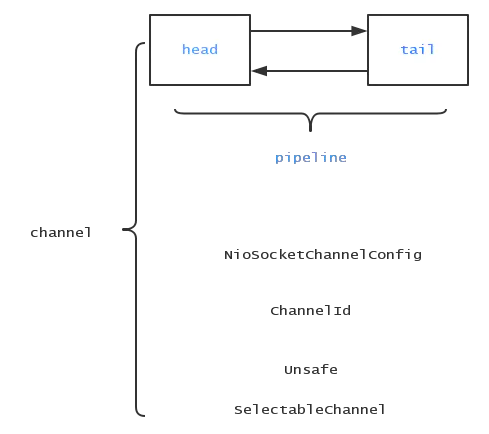
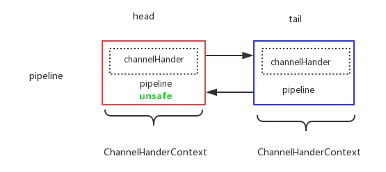
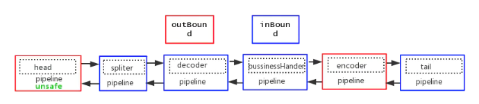
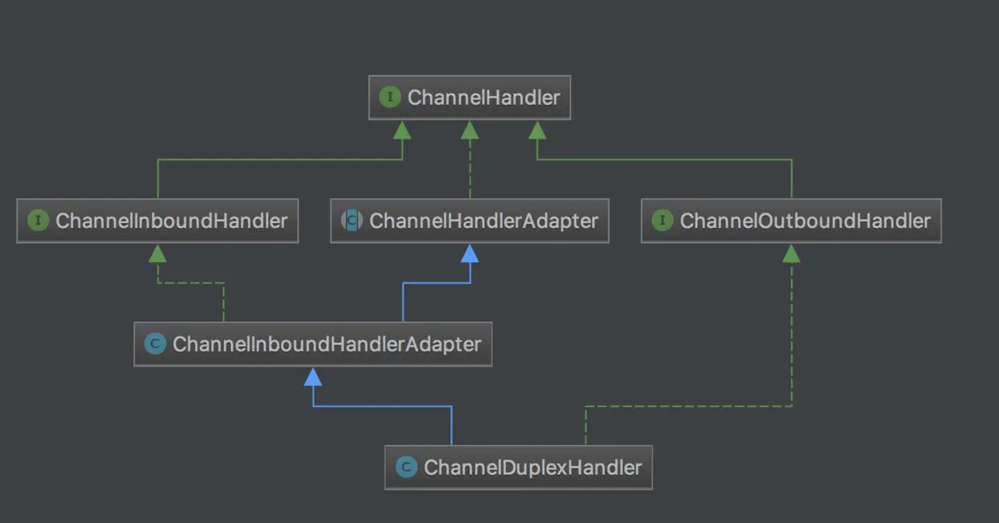

# Netty Pipeline 初始化和添加删除节点

## 1.前言

netty 在服务端端口绑定和新连接建立的过程中会建立相应的 channel，而与 channel 的动作密切相关的是 pipeline 这个概念，pipeline 像是可以看作是一条流水线，原始的原料(字节流)进来，经过加工，最后输出。pipeline 中包含多个 ChannelHandlerContext，每个 ChannelHandlerContext 包含 ChannelHandler 来对字节流进行处理。本文，我将以前面的新连接的建立过程为例，分为以下几个部分给你介绍 netty 中的 pipeline 是怎么玩转起来的：

- pipeline 初始化
- pipeline 添加节点
- pipeline 删除节点

## 2.pipeline 初始化

在新连接建立过程的文章中，我们已经知道了创建 NioSocketChannel 的时候会将 netty 的核心组件创建出来：

<div align="center">
    
</div>

pipeline 是其中一员，在下面这段代码中被创建：

```java{.line-numbers}
 /**
  * class:AbstractChannel
  * 在新连接建立的时候，通过channelFactory创建NioSevrerSocketChannel或者在doReadMessages中创建NioSocketChannel，
  * 创建NioSocketChannel会将各个组件初始化好，其中就包括pipeline，pipeline在下面的代码中被创建
  */
protected AbstractChannel(Channel parent) {
    this.parent = parent;
    id = newId();
    unsafe = newUnsafe();
    pipeline = newChannelPipeline();
} 

/**
 * class:AbstractChannel
 */
protected DefaultChannelPipeline newChannelPipeline() {
    return new DefaultChannelPipeline(this);
} 

/**
 * class:DefaultChannelPipeline
 * pipeline中的每个节点是一个ChannelHandlerContext对象，每个ChannelHandlerContext对象
 * 中包括一个ChannelHandler(在DefaultChannelHandlerContext类中)。
 * 一条pipeline默认会有两个节点，head和tail
 */
protected DefaultChannelPipeline(Channel channel) {
    this.channel = ObjectUtil.checkNotNull(channel, "channel");
    //省略代码......
    
    tail = new TailContext(this);
    head = new HeadContext(this);

    head.next = tail;
    tail.prev = head;
} 
```

pipeline 中保存了 channel 的引用，创建完 pipeline 之后，整个 pipeline 是这个样子的：

<div align="center">
    
</div>

pipeline 中的每个节点是一个 ChannelHandlerContext 对象，**<font color="red">每个 ChannelHandlerContext 节点保存了处理器 ChannelHandler</font>**（在 DefaultChannelHandlerContext 类中），同时， ChannelHandlerContext 包裹了处理器 ChannelHandler 执行操作所需要的上下文，其实就是 AbstractChannelHandlerContext 类中包含有属性 pipeline，而 pipeline 包含了 channel 的引用，可以拿到所有的 context 信息。**<font color="red">默认情况下，一条 pipeline 会有两个节点，head 和 tail</font>**。

## 3.pipeline 中添加节点

下面是一段非常常见的客户端代码：

```java{.line-numbers}
bootstrap.handler(new ChannelInitializer<SocketChannel>() {
     @Override
     public void initChannel(SocketChannel ch) throws Exception {
         ChannelPipeline p = ch.pipeline();
         p.addLast(new Spliter())
         p.addLast(new Decoder());
         p.addLast(new BusinessHandler())
         p.addLast(new Encoder());
     }
}); 
```

首先，对于 InBound 事件来说，用一个 spliter 将来源 TCP 数据包拆包，然后将拆出来的包进行 decoder，传入业务处理器 BusinessHandler。对于 OutBound 事件来说，业务处理完 encoder，输出。整个 pipeline 结构如下：

<div align="center">
    
</div>

我用两种颜色区分了一下 pipeline 中两种不同类型的节点，一个是  ChannelInboundHandler，处理 inBound 事件，最典型的就是读取数据流，加工处理；还有一种类型的 Handler 是 ChannelOutboundHandler, 处理 outBound 事件，比如当调用 writeAndFlush() 类方法时，就会经过该种类型的 handler。

不管是哪种类型的 handler，其外层对象 ChannelHandlerContext 之间都是通过双向链表连接，而区分一个 ChannelHandlerContext 到底是 in 还是 out，在添加节点的时候我们就可以看到 netty 是怎么处理的。

```java{.line-numbers}
/**
 * class:DefaultChannelPipeline
 */
public final ChannelPipeline addLast(ChannelHandler... handlers) {
    return addLast(null, handlers);
}

/**
 * class:DefaultChannelPipeline
 */
public final ChannelPipeline addLast(EventExecutorGroup executor, ChannelHandler... handlers) {
    if (handlers == null) {
        throw new NullPointerException("handlers");
    }

    for (ChannelHandler h: handlers) {
        if (h == null) {
            break;
        }
        addLast(executor, null, h);
    }

    return this;
} 

/**
 * class:DefaultChannelPipeline
 */
public final ChannelPipeline addLast(EventExecutorGroup group, String name, ChannelHandler handler) {
    final AbstractChannelHandlerContext newCtx;

    // 使用synchronized是防止多个线程同时操作底层pipeline双向链表
    synchronized (this) {
        // 检查是否有重复的handler
        checkMultiplicity(handler);
        // 创建一个新的DefaultChannelHandlerContext节点，其中filterName方法的作用：
        // 是如果用户没有给handler命名的话，Netty就给这个handler一个默认的名字(一般为：类名#数字)，
        // 如果用户指定了名字，则检查这个名字有没有重复。
        // newContext函数把handler赋值给DefaultChannelHandlerContext中的handler属性，另外newCtx的
        // 类型为DefaultChannelHandlerContext
        newCtx = newContext(group, filterName(name, handler), handler);
        // 真正添加节点到pipeline中
        addLast0(newCtx);

        // 如果 registered 为 false, 则表示这个channel还未注册到EventLoop上.
        // 在这种情况下，我们添加一个Task到PendingHandlerCallback中，然后直接返回
        // 等到这个channel注册成功之后，将会调用立即调用用户添加的handler中的handlerAdded(...) 方法，
        if (!registered) {
            // 设置为待添加状态
            newCtx.setAddPending();
            callHandlerCallbackLater(newCtx, true);
            return this;
        }
    }
    // 回调用户添加的handler中的handlerAdded方法
    callHandlerAdded0(newCtx);
    return this;
} 
```

这里简单地用 synchronized 方法是为了防止多线程并发操作 pipeline 底层的双向链表。我们还是逐步分析上面这段代码：

### 3.1 检查是否有重复 handler

在用户代码添加一条 handler 的时候，首先会查看该 handler 有没有添加过：

```java{.line-numbers}
/**
 * class:DefaultChannelPipeline
 */
private static void checkMultiplicity(ChannelHandler handler) {
    if (handler instanceof ChannelHandlerAdapter) {
        ChannelHandlerAdapter h = (ChannelHandlerAdapter) handler;
        // ChannelHandlerAdapter使用一个added属性来表示是否被添加到pipeline中，
        // 如果一个handler不是共享的，且已经被添加过了，那么就会抛出异常,
        // 反之如果一个handler是共享的，那么它可以被无限次的添加到pipeline中
        if (!h.isSharable() && h.added) {
            throw new ChannelPipelineException(h.getClass().getName()
                    + " is not a @Sharable handler, so can't be added or removed multiple times.");
        }
        h.added = true;
    }
} 
```

netty 使用一个成员变量 added 标识一个 channel 是否已经添加，上面这段代码很简单，如果当前要添加的 Handler 是非共享的，并且已经添加过，那就抛出异常，否则，标识该 handler 已经添加。由此可见，一个 Handler 如果是 sharable 的，就可以无限次被添加到 pipeline 中（注意，ChannelInitializer 就是一个 Sharable 的类，可以被无限次的添加到 pipeline 中），我们客户端代码如果要让一个 Handler 被共用，只需要加一个 @Sharable 标注即可，如下:

```java{.line-numbers}
@Sharable
public class BusinessHandler {
    
} 
```

而如果 Handler 是 sharable 的，一般就通过 spring 的注入的方式使用，不需要每次都 new 一个。isSharable() 方法正是通过该 Handler 对应的类是否标注 @Sharable 来实现的：

```java{.line-numbers}
public boolean isSharable() {
   Class<?> clazz = getClass();
    Map<Class<?>, Boolean> cache = InternalThreadLocalMap.get().handlerSharableCache();
    Boolean sharable = cache.get(clazz);
    if (sharable == null) {
        sharable = clazz.isAnnotationPresent(Sharable.class);
        cache.put(clazz, sharable);
    }
    return sharable;
} 
```

这里也可以看到，netty 为了性能优化到极致，还使用了 ThreadLocal 来缓存 Handler 的状态，高并发海量连接下，每次有新连接添加 Handler 都会创建调用此方法。

### 3.2 创建节点

回到主流程，看创建上下文这段代码：

```java{.line-numbers}
newCtx = newContext(group, filterName(name, handler), handler); 
```

这里我们需要先分析 filterName(name, handler) 这段代码，这个函数用于给 handler 创建一个唯一性的名字：

```java{.line-numbers}
/**
 * class:DefaultChannelPipeline
 */
private String filterName(String name, ChannelHandler handler) {
    if (name == null) {
        return generateName(handler);
    }
    checkDuplicateName(name);
    return name;
} 
```

显然，我们传入的 name 为 null，netty 就给我们生成一个默认的 name，否则，检查是否有重名，检查通过的话就返回。netty 创建默认 name 的规则为简单类名#0。处理完 name 之后，就进入到创建 context 的过程，由前面的调用链得知，group 为 null，因此 childExecutor(group) 也返回 null。

```java{.line-numbers}
/**
 * class:DefaultChannelPipeline
 */
private AbstractChannelHandlerContext newContext(EventExecutorGroup group, String name, ChannelHandler handler) {
    // childExecutor(group)方法当group为null的时候，返回null，由于我们传入的为null，因此这里的也为null
    return new DefaultChannelHandlerContext(this, childExecutor(group), name, handler);
}

/**
 * class:DefaultChannelPipeline
 */
private EventExecutor childExecutor(EventExecutorGroup group) {
    if (group == null) {
        return null;
    }
    // 省略代码.......
} 

/**
 * pipeline为调用pipeline.addLast的那个pipeline，name为handler的名字，
 * 而handler则为我们希望添加到pipeline中的handler, executor为null
 */
DefaultChannelHandlerContext(DefaultChannelPipeline pipeline, EventExecutor executor, String name,
        ChannelHandler handler) {
    // 在构造函数中，DefaultChannelHandlerContext只保留handler的引用，
    // 而把其他的参数传递给父类AbstractChannelHandlerContext，同时告知父类此handler
    // 为InBound还是OutBound，或者两者都是
    super(pipeline, executor, name, isInbound(handler), isOutbound(handler));
    if (handler == null) {
        throw new NullPointerException("handler");
    }
    this.handler = handler;
} 
```

构造函数中，DefaultChannelHandlerContext 将参数回传到父类，保存 Handler 的引用，进入到其父类：

```java{.line-numbers}
/**
 * class:DefaultChannelHandlerContext
 * 判断一个handler是否为一个Inbound Handler
 */ 
private static boolean isInbound(ChannelHandler handler) {
    return handler instanceof ChannelInboundHandler;
}

/**
 * class:DefaultChannelHandlerContext
 * 判断一个handler是否为一个Outbound Handler
 */
private static boolean isOutbound(ChannelHandler handler) {
    return handler instanceof ChannelOutboundHandler;
} 

/**
 * pipeline为调用pipeline.addLast的那个pipeline，name为handler的名字，
 * 而handler则为我们希望添加到pipeline中的handler, executor为null
 */
DefaultChannelHandlerContext(DefaultChannelPipeline pipeline, EventExecutor executor, String name,
        ChannelHandler handler) {
    // 在构造函数中，DefaultChannelHandlerContext只保留handler的引用，
    // 而把其他的参数传递给父类AbstractChannelHandlerContext，同时告知父类此handler
    // 为InBound还是OutBound，或者两者都是
    super(pipeline, executor, name, isInbound(handler), isOutbound(handler));
    if (handler == null) {
        throw new NullPointerException("handler");
    }
    this.handler = handler;
} 
```

通过 instanceof 关键字根据接口类型来判断，因此，如果一个 Handler 实现了两类接口，那么他既是一个 inBound 类型的 Handler，又是一个 outBound 类型的 Handler，比如下面这个类：

<div align="center">
    
</div>

常用的，将 decode 操作和 encode 操作合并到一起的 codec，一般会继承  MessageToMessageCodec，而 MessageToMessageCodec 就是继承 ChannelDuplexHandler：

```java{.line-numbers}
public abstract class MessageToMessageCodec<INBOUND_IN, OUTBOUND_IN> extends ChannelDuplexHandler {
    protected abstract void encode(ChannelHandlerContext ctx, OUTBOUND_IN msg, List<Object> out) throws Exception;
    protected abstract void decode(ChannelHandlerContext ctx, INBOUND_IN msg, List<Object> out) throws Exception;
}
```

context 创建完了之后，接下来终于要将创建完毕的 context 加入到 pipeline 中去了：

### 3.3 添加节点

```java{.line-numbers}
/**
 * class:DefaultChannelPipeline
 * 当创建好一个ChannelHandlerContext之后，把它加入到pipeline中，下面的代码是典型的对
 * 双向链表进行操作的步骤
 */
private void addLast0(AbstractChannelHandlerContext newCtx) {

    AbstractChannelHandlerContext prev = tail.prev;
    newCtx.prev = prev;
    newCtx.next = tail;
    prev.next = newCtx;
    tail.prev = newCtx;
} 
```

上面的代码执行双向链表的插入操作。操作完毕，该 context 就加入到 pipeline 中。

### 3.4 回调用户方法

在上面的 addLast 方法中，最后一个步骤就是回调添加到 pipeline 中 ChannelHandler 的 handlerAdded 方法，即：

```java{.line-numbers}
/**
 * class:DefaultChannelPipeline
 * 当往pipeline中添加handler结束之后，就会调用此方法来对加入的handler中的handlerAdded方法进行回调
 */
private void callHandlerAdded0(final AbstractChannelHandlerContext ctx) {
    try {
        //ctx真实类型为DefaultChannelHandlerContext，因此它会返回创建时，所传入的用户的handler，然后调用
        //用户所重写的handlerAdded方法(Override)
        ctx.handler().handlerAdded(ctx);
        ctx.setAddComplete();
    } catch (Throwable t) {
        //省略代码.....
    }
} 
```

到了第四步，pipeline 中的新节点添加完成，于是便开始回调用户代码 **`ctx.handler().handlerAdded(ctx);`**，常见的用户代码如下：

```java{.line-numbers}
public class DemoHandler extends SimpleChannelInboundHandler<...> {
    @Override
    public void handlerAdded(ChannelHandlerContext ctx) throws Exception {
        // 节点被添加完毕之后回调到此
        // do something
    }
} 
```

接下来，调用 setAddComplete 用 cas 修改节点的状态至：REMOVE_COMPLETE（说明该节点已经被移除） 或者 ADD_COMPLETE。

## 4.pipeline 中删除节点

netty 有个最大的特性之一就是 Handler 可插拔，做到动态编织 pipeline，比如在首次建立连接的时候，需要通过进行权限认证，在认证通过之后，就可以将此 context 移除，下次 pipeline 在传播事件的时候就就不会调用到权限认证处理器。下面是权限认证 Handler 最简单的实现，第一个数据包传来的是认证信息，如果校验通过，就删除此 Handler，否则，直接关闭连接：

```java{.line-numbers}
public class AuthHandler extends SimpleChannelInboundHandler<ByteBuf> {
    @Override
    protected void channelRead0(ChannelHandlerContext ctx, ByteBuf data) throws Exception {
        if (verify(authDataPacket)) {
            ctx.pipeline().remove(this);
        } else {
            ctx.close();
        }
    }

    private boolean verify(ByteBuf byteBuf) {
        //...
    }
} 
```

重点就在 ctx.pipeline().remove(this) 这段代码：

```java{.line-numbers}
/**
 * class:DefaultChannelPipeline
 * 在pipeline中，每一个节点都是ChannelHandlerContext类型的，在其中包含了handler。
 * 当我们尝试去删除一个handler时，就会调用getContextOrDie返回包含这个handler的ChannelHandlerContext，
 * 如果不存在的话，直接抛出异常
 */
public final ChannelPipeline remove(ChannelHandler handler) {
    remove(getContextOrDie(handler));
    return this;
} 
```

remove 操作相比add简单不少，分为三个步骤：找到待删除的节点、调整双向链表指针删除、回调用户函数。

### 4.1 找到待删除的节点

```java{.line-numbers}
/**
 * class:DefaultChannelPipeline
 * 此方法在pipeline中找到handler，如果handler存在，则返回，如果不存在则抛出异常
 */
private AbstractChannelHandlerContext getContextOrDie(ChannelHandler handler) {
    AbstractChannelHandlerContext ctx = (AbstractChannelHandlerContext) context(handler);
    if (ctx == null) {
        throw new NoSuchElementException(handler.getClass().getName());
    } else {
        return ctx;
    }
}

/**
 * class:DefaultChannelPipeline
 * 通过遍历pipeline双向链表来找出handler，如果handler不存在，则返回null
 */
public final ChannelHandlerContext context(ChannelHandler handler) {
    if (handler == null) {
        throw new NullPointerException("handler");
    }

    AbstractChannelHandlerContext ctx = head.next;
    for (;;) {

        if (ctx == null) {
            return null;
        }

        if (ctx.handler() == handler) {
            return ctx;
        }

        ctx = ctx.next;
    }
} 
```

这里为了找到 Handler 对应的 context，照样是通过依次遍历双向链表的方式，直到某一个 context 的 Handler 和当前 Handler 相同，便找到了该节点。

### 4.2 调整双向链表指针删除

```java{.line-numbers}
//class:DefaultChannelPipeline
private AbstractChannelHandlerContext remove(final AbstractChannelHandlerContext ctx) {
    assert ctx != head && ctx != tail;

    synchronized (this) {
        //调整pipeline双向链表的指针来将ChannelHandlerContext从链表中删除
        remove0(ctx);

        // 如果为false，则表明channel还没有注册到eventloop上
        // 在删除这种场景下，我们先添加一个Task，一旦channel注册成功就会调用这个Task，
        // 这个Task就会立即调用此用户添加handler的handlerRemoved(...)方法，来从pipeline中删除context。
        if (!registered) {
            callHandlerCallbackLater(ctx, false);
            return ctx;
        }

        //省略代码.....
    }
    //回调用户的自定义的handlerRemoved方法
    callHandlerRemoved0(ctx);
    return ctx;
} 
```

经历的过程要比添加节点要简单。结合这两幅图，可以很清晰地了解权限验证 Handler 的工作原理，另外，被删除的节点因为没有对象引用到，果过段时间就会被 gc 自动回收。

### 4.3 回调用户函数

```java{.line-numbers}
private void callHandlerRemoved0(final AbstractChannelHandlerContext ctx) {
    try {
        ctx.handler().handlerRemoved(ctx);
    } finally {
        ctx.setRemoved();
    }
} 
```

到了第三步，pipeline 中的节点删除完成，于是便开始回调用户代码 ctx.handler().handlerRemoved(ctx);，常见的代码如下：

```java{.line-numbers}
public class DemoHandler extends SimpleChannelInboundHandler<...> {
    @Override
    public void handlerRemoved(ChannelHandlerContext ctx) throws Exception {
        // 节点被删除完毕之后回调到此，可做一些资源清理
        // do something
    }
} 
```

最后，将该节点的状态设置为 removed：

```java{.line-numbers}
final void setRemoved() {
    handlerState = REMOVE_COMPLETE;
} 
```

## 5. pipeline的总结

### 5.1 pipeline的初始化：

以新连接创建为例，新连接创建的过程中创建 channel，而在创建 channel 的过程中创建了该 channel 对应的 pipeline，创建完 pipeline 之后，自动给该 pipeline 添加了两个节点，即 ChannelHandlerContext，ChannelHandlerContext 中有用 pipeline 和 channel 所有的上下文信息。

pipeline 是双向个链表结构，添加和删除节点均只需要调整链表结构。pipeline 中的每个节点包着具体的处理器 ChannelHandler，节点根据 ChannelHandler 的类型是 ChannelInboundHandler 还是 ChannelOutboundHandler 来判断该节点属于in还是out或者两者都是

### 5.2 pipeline添加节点：

1. 检查 pipeline 中是否有重复的 handler
2. 创建一个实际类型为 DefaultChannelHandlerContext
3. 将 context 真正添加到 pipeline 中
4. 回调用户添加的 handler 的 handlerAdded 方法

### 5.3 pipeline删除节点：

1. 在 pipeline 中找到包含 handler 的 context
2. 从 pipeline 中真正删除 context
3. 回调用户添加 handler 中的 handlerRemoved 方法