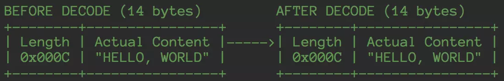
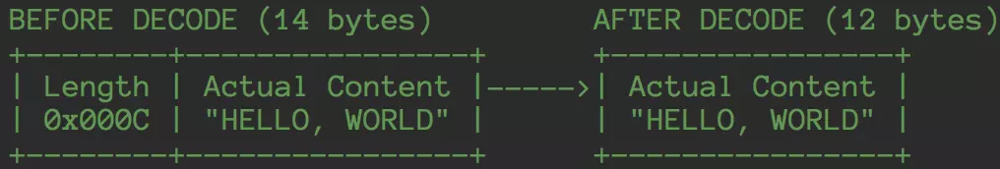
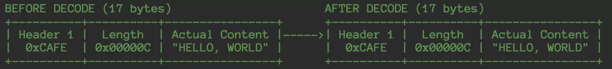
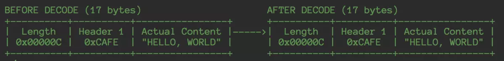
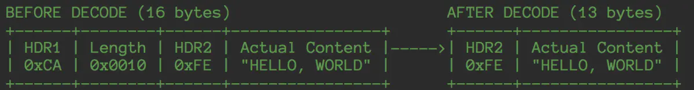

# Netty 解码器详解

## 一、ByteToMessageDecoder 详解

### 1.1 简介

#### 1.1.1 粘包

首先你得了解一下 TCP/IP 协议，在用户数据量非常小的情况下，极端情况下，一个字节，该 TCP 数据包的有效载荷非常低，传递 100 字节的数据，需要 100 次 TCP 传送，100 次 ACK，在应用及时性要求不高的情况下，将这 100 个有效数据拼接成一个数据包，那会缩短到一个 TCP 数据包，以及一个 ack，有效载荷提高了，带宽也节省了。

非极端情况，有可能两个数据包拼接成一个数据包，也有可能一个半的数据包拼接成一个数据包，也有可能两个半的数据包拼接成一个数据包。

#### 1.1.2 拆包

拆包和粘包是相对的，一端粘了包，另外一端就需要将粘过的包拆开，举个栗子，发送端将三个数据包粘成两个 TCP 数据包发送到接收端，接收端就需要根据应用协议将两个数据包重新组装成三个数据包。

#### 1.1.3 拆包的原理

在没有 Netty 的情况下，用户如果自己需要拆包，**<font color="red">基本原理就是不断从 TCP 缓冲区中读取数据，每次读取完都需要判断是否是一个完整的数据包</font>**：

1. 如果当前读取的数据不足以拼接成一个完整的业务数据包，那就保留该数据，继续从 TCP 缓冲区中读取，直到得到一个完整的数据包；
2. 如果本次读到的数据加上已经读取的数据足够拼接成一个数据包，那就将已经读取的数据拼接上本次读取的数据，够成一个完整的业务数据包传递到业务逻辑，多余的数据仍然保留，以便和下次读到的数据尝试拼接；

ByteToMessageDecoder 是一种常用的 ChannelInboundHandler，可以称为解码器，负责将 byte 字节流 (ByteBuf) 转换成一种 Message，Message 是应用可以自己定义的一种 Java 对象。例如应用中使用 protobuf 协议，则可以将 byte 转换为 Protobuf 对象，再交给后面的 Handler 来处理。

### 1.2 ByteToMessageDecoder

ByteToMessageDecoder 继承了 ChannelInboundHandlerAdapter 所以是一个处理 Inbound 事件的 Handler。其内部保存一个 Cumulator 用于保存待解码的 ByteBuf，然后不断调用子类需要实现的抽象方法 decode 去取出 byte 数据转换处理。

```java{.line-numbers}
public interface Cumulator {
    ByteBuf cumulate(ByteBufAllocator alloc, ByteBuf cumulation, ByteBuf in);
}

ByteBuf cumulation;
// 内部保存一个 cumulator 用于保存待解码的ByteBuf，cumulator有两种实现，MERGE_CUMULATOR和COMPOSITE_CMUMULATOR，
// MERGE_CUMULATOR通过memory copy的方法将in中的数据复制写入到cumulation中
// COMPOSITE_CUMULATOR采取的是类似链表的方式，没有进行memory copy
private Cumulator cumulator = MERGE_CUMULATOR;

public static final Cumulator MERGE_CUMULATOR = new Cumulator() {
    @Override
    public ByteBuf cumulate(ByteBufAllocator alloc, ByteBuf cumulation, ByteBuf in) {
        final ByteBuf buffer;
        // 如果cumulation中剩余空间的大小不能够容纳in中的数据的话，就对cumulation进行扩容，否则，
        // 直接将cumulation赋值给buffer，并且把in里面的数据写入到cumulation中
        if (cumulation.writerIndex() > cumulation.maxCapacity() - in.readableBytes()
                || cumulation.refCnt() > 1 || cumulation.isReadOnly()) {
            buffer = expandCumulation(alloc, cumulation, in.readableBytes());
        } else {
            buffer = cumulation;
        }
        buffer.writeBytes(in);
        in.release();
        return buffer;
    }
};
```

ByteToMessageDecoder 中定义了两个累加器：MERGE_CUMULATOR和COMPOSITE_CUMULATOR，默认情况下，会使用 MERGE_CUMULATOR，**<font color="red">`MERGE_CUMULATOR` 的原理是每次都将读取到的数据通过内存拷贝的方式，拼接到一个大的字节容器中，这个字节容器在 `ByteToMessageDecoder` 中叫做 `cumulation`</font>**。

ByteToMessageDecoder 中最主要的部分在 channelRead 处理上，主要分为四个步骤：**<font color="red">1.累加字节流；2.调用子类的 decode 方法进行解析；3.清理字节容器；4.将解析到的 ByteBuf 向下传播</font>**：

```java{.line-numbers}
@Override
public void channelRead(ChannelHandlerContext ctx, Object msg) throws Exception {
    if (msg instanceof ByteBuf) {
        // 从对象池中取出一个List
        CodecOutputList out = CodecOutputList.newInstance();
        try {
            ByteBuf data = (ByteBuf) msg;
            first = cumulation == null;
            if (first) {
                // 第一次解码，直接将data赋值给cumulation
                cumulation = data;
            } else {
                // 将data中的数据添加到累加器cumulation中，并释放data
                cumulation = cumulator.cumulate(ctx.alloc(), cumulation, data);
            }
            // 得到追加后的 cumulation 后，调用 decode 方法进行解码，将所有解析到的对象添加到List中
            // 解码之后，调用 fireChannelRead 方法，主要目的是将List中的对象向下继续传播
            callDecode(ctx, cumulation, out);
        } catch (DecoderException e) {
            throw e;
        } catch (Throwable t) {
            throw new DecoderException(t);
        } finally {
            if (cumulation != null && !cumulation.isReadable()) {
                numReads = 0;
                cumulation.release();
                cumulation = null;
            } else if (++ numReads >= discardAfterReads) {
                numReads = 0;
                discardSomeReadBytes();
            }

            int size = out.size();
            decodeWasNull = !out.insertSinceRecycled();
            // 将out中的所有对象向下进行传递
            fireChannelRead(ctx, out, size);
            out.recycle();
        }
    } else {
        ctx.fireChannelRead(msg);
    }
} 
```

1. 收到一个 msg 后先判断是否是 ByteBuf 类型，如果是的话创建一个 **`CodecOutputList`** (也是一种 list) 用来保存转码后的对象列表
2. 如果 **`cumulation`** 为 null，则把 **`cumulation`** 直接设置为 msg，否则就把 msg 合并到 **`cumulation`** 里
3. 调用 callDecode 方法，尝试解码
4. finally 中如果 cumulation 已经读完了，就 release 并置为 null 等待 gc
5. 调用 **`fireChannelRead`** 将解码后的 out 传递给后面的 Handler

callDecode 中不断执行抽象 **`decode(ctx, in, out)`** 方法直到 in 可读数据没有减少或当前 handler 被 remove：

```java{.line-numbers}
protected void callDecode(ChannelHandlerContext ctx, ByteBuf in, List<Object> out) {
    try {
        // 如果累加器中还有可读字节
        while (in.isReadable()) {
            int outSize = out.size();
            // 如果上次循环成功解码了一些对象添加到out中
            if (outSize > 0) {
                // 将out(List类型)中的所有对象向后进行传播
                fireChannelRead(ctx, out, outSize);
                out.clear();
                // Check if this handler was removed before continuing with decoding.
                // If it was removed, it is not safe to continue to operate on the buffer.
                if (ctx.isRemoved()) {
                    break;
                }
                outSize = 0;
            }
            // 得到可读字节数
            int oldInputLength = in.readableBytes();
            decodeRemovalReentryProtection(ctx, in, out);
            if (ctx.isRemoved()) {
                break;
            }

            // 如果解码前的out数组大小和解码后的out数组大小相等，且累积区的可读字节数没有变化，说明此次读取什么都没做，就直接结束。
            // 如果字节数变化了，说明虽然数组没有增加，但确实在读取字节，就再继续读取（这种情况下，可能是丢弃了ByteBuf中的
            // 一些字节）。
            if (outSize == out.size()) {
                if (oldInputLength == in.readableBytes()) {
                    break;
                } else {
                    continue;
                }
            }
            
            if (oldInputLength == in.readableBytes()) {
                throw new DecoderException(
                        StringUtil.simpleClassName(getClass()) +
                                ".decode() did not read anything but decoded a message.");
            }

            if (isSingleDecode()) {
                break;
            }
        }
    } catch (DecoderException e) {
        throw e;
    } catch (Throwable cause) {
        throw new DecoderException(cause);
    }
} 
```

该方法主要逻辑：只要累积区还有未读数据，就循环进行读取：

- 调用 decodeRemovalReentryProtection 方法，内部调用了子类重写的 decode 方法，很明显，这里是个模板模式。decode 方法的逻辑就是将累积区的内容按照约定进行解码，如果成功解码，就添加到数组中。同时该方法也会检查该 handler 的状态，如果被移除出 pipeline 了，就将累积区的内容直接刷新到后面的 handler 中。
- 如果 Context 节点被移除了，直接结束循环。如果解码前的数组大小和解码后的数组大小相等，且累积区的可读字节数没有变化，说明此次读取什么都没做，就直接结束。如果字节数变化了，说明虽然数组没有增加，但确实在读取字节，就再继续读取。
- 如果上面的判断过了，说明数组读到数据了，但如果累积区的 readIndex 没有变化，则抛出异常，说明没有读取数据，但out数组却增加了，子类的操作是不对的。
- 如果是个单次解码器，解码一次就直接结束了。
    
所以，这段代码的关键就是子类需要重写 decode 方法，将累积区的数据正确的解码并添加到数组中。

fireChannelRead(ctx, msgs, numElements) 的处理方式是对每个解码后的消息进行 fireChannelRead，交给下一个 Handler 处理：

```java{.line-numbers}
static void fireChannelRead(ChannelHandlerContext ctx, List<Object> msgs, int numElements) {
    if (msgs instanceof CodecOutputList) {
        fireChannelRead(ctx, (CodecOutputList) msgs, numElements);
    } else {
        for (int i = 0; i < numElements; i++) {
            ctx.fireChannelRead(msgs.get(i));
        }
    }
}
static void fireChannelRead(ChannelHandlerContext ctx, CodecOutputList msgs, int numElements) {
    for (int i = 0; i < numElements; i ++) {
        ctx.fireChannelRead(msgs.getUnsafe(i));
    }
} 
```

接下来，我们介绍一下，上面所说的第三个步骤清理字节容器。

**<font color="red">业务拆包完成之后，只是从字节容器中取走了数据，但是这部分空间对于字节容器来说依然保留着</font>**，而字节容器每次累加字节数据的时候都是将字节数据追加到尾部，如果不对字节容器做清理，那么时间一长就会 OOM。正常情况下，其实每次读取完数据，netty 都会在下面这个方法中将字节容器清理，只不过，当发送端发送数据过快，channelReadComplete 可能会很久才被调用一次。

```java{.line-numbers}
public void channelReadComplete(ChannelHandlerContext ctx) throws Exception {
    numReads = 0;
    discardSomeReadBytes();
    if (decodeWasNull) {
        decodeWasNull = false;
        if (!ctx.channel().config().isAutoRead()) {
            ctx.read();
        }
    }
    ctx.fireChannelReadComplete();
} 
```

所以为了防止发送端发送数据过快，netty 会在每次读取到一次数据，业务拆包之后对字节字节容器做清理，清理部分的代码如下：

```java{.line-numbers}
if (cumulation != null && !cumulation.isReadable()) {
    numReads = 0;
    cumulation.release();
    cumulation = null;
} else if (++numReads >= discardAfterReads) {
    numReads = 0;
    discardSomeReadBytes();
} 
```

- 如果字节容器当前已无数据可读取，直接销毁字节容器，并且标注一下当前字节容器一次数据也没读取
- 如果连续 16 次（discardAfterReads 的默认值），字节容器中仍然有未被业务拆包器读取的数据，那就做一次压缩，有效数据段整体移到容器首部

discardSomeReadBytes 之前，字节累加器中的数据分布：

```java{.line-numbers}
+--------------+----------+----------+
|   readed     | unreaded | writable | 
+--------------+----------+----------+ 
```

discardSomeReadBytes 之后，字节容器中的数据分布：

```java{.line-numbers}
+----------+-------------------------+
| unreaded |      writable           | 
+----------+-------------------------+ 
```

这样字节容器又可以承载更多的数据了。

## 二、FixedLengthFrameDecoder 介绍

FixedLengthFrameDecoder 是固定长度解码器，它能够按照指定的长度对消息进行自动解码，开发者不需要考虑 TCP 的粘包/拆包问题，非常实用。

利用 FixedLengthFrameDecoder 解码器，无论一次接收到多少数据报，它都会按照构造函数中设置的固定长度进行解码，如果是半包消息，FixedLengthFrameDecoder 会缓存半包消息并等待下个包到达后进行拼包，直到读取到一个完整的包。

FixedLengthFrameDecoder 的代码如下，具体的解释在代码注释中：

```java{.line-numbers}
/**
 * A decoder that splits the received ByteBufs by the fixed number
 * of bytes. For example, if you received the following four fragmented packets:
 *
 * +---+----+------+----+
 * | A | BC | DEFG | HI |
 * +---+----+------+----+
 * 
 * A link FixedLengthFrameDecoder will decode them into the
 * following three packets with the fixed length:
 * 
 * +-----+-----+-----+
 * | ABC | DEF | GHI |
 * +-----+-----+-----+
 * 
 * FixedLengthFrameDecoder 固定长度解码器，它能够按照指定的长度对消息进行自动解码，开发者不需要考虑 TCP 的粘包与拆包问题，
 * 非常实用。无论一次接收到多少数据报，它都会按照构造器中设置的固定长度进行解码，如果是半包消息，FixedLengthFrameDecoder  
 * 会缓存半包消息并等待下个包到达之后进行拼包合并，直到读取一个完整的消息包。
 */
class FixedLengthFrameDecoder extends ByteToMessageDecoder{
   private final int frameLength;

   public FixedLengthFrameDecoder(int frameLength) {
       if (frameLength <= 0) {
           throw new IllegalArgumentException(
                   "frameLength must be a positive integer: " + frameLength);
       }
       this.frameLength = frameLength;
   }

   @Override
   protected final void decode(ChannelHandlerContext ctx, ByteBuf in, List<Object> out) throws Exception {
       Object decoded = decode(ctx, in);
       if (decoded != null) {
           out.add(decoded);
       }
   }

   protected Object decode(
           @SuppressWarnings("UnusedParameters") ChannelHandlerContext ctx, ByteBuf in) throws Exception {
       // 如果in中的可读字节小于 frameLength ，则返回null
       // 否则返回 frameLength 长度的ByteBuf，并且将它加入到out列表中
       if (in.readableBytes() < frameLength) {
           return null;
       } else {
           return in.readRetainedSlice(frameLength);
       }
   }
} 
```

## 三、LineBasedFrameDecoder 介绍

### 3.1. 简介

LineBasedFrameDecoder 和 LineEncoder 采用的通信协议非常简单，即按照行进行分割，遇到一个换行符（/n 或者 /r/n），则认为是一个完整的报文。在发送方，使用 LineEncoder 为数据添加换行符；在接受方，使用 LineBasedFrameDecoder 对换行符进行解码。

LineBasedFrameDecoder 采用的通信协议格式非常简单：使用换行符 \n 或者 \r\n 作为依据，遇到\n或者 \r\n 都认为是一条完整的消息。LineBasedFrameDecoder 提供了 2 个构造方法，如下：

```java{.line-numbers}
public LineBasedFrameDecoder(final int maxLength) {
    this(maxLength, true, false);
}
public LineBasedFrameDecoder(final int maxLength, final boolean stripDelimiter, final boolean failFast) {
    this.maxLength = maxLength;
    this.failFast = failFast;
    this.stripDelimiter = stripDelimiter;
} 
```

其中：

- maxLength：表示一行最大的长度，如果超过这个长度依然没有检测到 \n 或者 \r\n，将会抛出 TooLongFrameException
- failFast：与 maxLength 联合使用，表示超过 maxLength 后，抛出 TooLongFrameException 的时机。如果为 true，则超出 maxLength 后立即抛出 TooLongFrameException，不继续进行解码；如果为false，则等到完整的消息被解码后，再抛出 TooLongFrameException 异常。
- stripDelimiter：解码后的消息是否去除 \n，\r\n 分隔符，例如对于以下二进制字节流：

```java{.line-numbers}
 +--------------+
 | ABC\nDEF\r\n |
 +--------------+ 
```

如果 stripDelimiter 为 true，则解码后的结果为：

```java{.line-numbers}
+-----+-----+
| ABC | DEF |
+-----+-----+ 
```

如果 stripDelimiter 为 false，则解码后的结果为：

```java{.line-numbers}
+-------+---------+
| ABC\n | DEF\r\n |
+-------+---------+ 
```

### 3.2 源码分析

```java{.line-numbers}
  +--------------+
  | ABC\nDEF\r\n |
  +--------------+  1  /**
 * LineBasedFrameDecoder：行解码器
 * TCP是个“流”协议，它们是连成一片的，其间并没有分界线。TCP底层并不了解上层业务数据的具体含义，它
 * 会根据TCP缓冲区的实际情况进行包的划分，所以在业务上认为，一个完整的包可能会
 * 被TCP拆分成多个包进行发送，也有可能把多个小小的包封装成一个大的数据包发送，这就是所谓的TCP粘包和拆包问题。
 */
public class LineBasedFrameDecoder extends ByteToMessageDecoder {

   // 表示一行最大的长度，如果超过这个长度依然没有检测到\n或者\r\n，将会抛出TooLongFrameException
   private final int maxLength;
   // 与maxLength联合使用，表示超过maxLength后，抛出TooLongFrameException的时机。如果为true，
   // 则超出maxLength后立即抛出TooLongFrameException，不继续进行解码；如果为false，则等到完整的消息被解码后，
   // 再抛出TooLongFrameException异常。
   private final boolean failFast;
   // 解析出来的数据包带不带换行符，如果为true的话，就不带换行符
   // 如果为false的话，就带上换行符
   private final boolean stripDelimiter;

   private boolean discarding;
   // 解码到现在，已经丢弃了多少个字节
   private int discardedBytes;

   private int offset;

   public LineBasedFrameDecoder(final int maxLength) {
       this(maxLength, true, false);
   }

   public LineBasedFrameDecoder(final int maxLength, final boolean stripDelimiter, final boolean failFast) {
       this.maxLength = maxLength;
       // 默认为false
       this.failFast = failFast;
       // 默认为true
       this.stripDelimiter = stripDelimiter;
   }

   @Override
   protected final void decode(ChannelHandlerContext ctx, ByteBuf in, List<Object> out) throws Exception {
       Object decoded = decode(ctx, in);
       if (decoded != null) {
           out.add(decoded);
       }
   }

   /**
    * ... byte  byte  byte  \n  byte  byte  byte  byte  \r  \n
    *       |                |                           |
    *   readerIndex         eol                         eol
    */
   protected Object decode(ChannelHandlerContext ctx, ByteBuf buffer) throws Exception {
       // 从累加器中去找行的结尾，支持/n或者/r/n两种类型的换行符
       // 如果行的结尾是/n的话，那么返回的eol就是指向/n的位置
       // 如果行的结尾是/r/n的话，那么返回的eol就是指向/r的位置
       final int eol = findEndOfLine(buffer);
       // 第一次的时候，discarding默认为false
       if (!discarding) {
           // 非discarding模式进行处理
           if (eol >= 0) {
               // 计算出换行符的长度和数据包的长度
               final ByteBuf frame;
               final int length = eol - buffer.readerIndex();
               final int delimLength = buffer.getByte(eol) == '\r'? 2 : 1;

               // 然后判断一下需要拆包的长度是否大于该拆包器允许的最大长度(maxLength)，
               // 这个参数在构造函数中被传递进来，如超出允许的最大长度，就将这段数据抛弃，返回 null
               if (length > maxLength) {
                   // 将readerIndex设置为换行符后面的第一个元素
                   buffer.readerIndex(eol + delimLength);
                   fail(ctx, length);
                   return null;
               }

               // 最后，将一个完整的数据包取出，如果构造本解包器的时候指定 stripDelimiter 为 false，
               // 即解析出来的包包含分隔符，默认为不包含分隔符
               if (stripDelimiter) {
                   frame = buffer.readRetainedSlice(length);
                   buffer.skipBytes(delimLength);
               } else {
                   frame = buffer.readRetainedSlice(length + delimLength);
               }

               return frame;
           } else {
               final int length = buffer.readableBytes();
               // 首先取得当前字节容器的可读字节个数，接着，判断一下是否已经超过可允许的最大长度，
               // 如果没有超过，代表有可能此时数据包中的数据是不完整的，因此直接返回null，
               // 字节容器中的数据没有任何改变，否则，就需要进入丢弃模式
               if (length > maxLength) {
                   // discardedBytes表示已经丢弃了多少字节
                   discardedBytes = length;
                   buffer.readerIndex(buffer.writerIndex());
                   discarding = true;
                   offset = 0;
                   // failFast为true的话，就立即抛出异常，否则就等到读完所有应该抛弃的字节之后
                   // 再抛出异常
                   if (failFast) {
                       fail(ctx, "over " + discardedBytes);
                   }
               }
                return null;
            }
        } else {
            // 在discarding模式下，如果找到换行符，那可以将分隔符之前的都丢弃掉(包括换行符)
            // 经过这么一次丢弃，后面就有可能是正常的数据包，下一次解包的时候就会进入正常的解包流程
            if (eol >= 0) {
                final int length = discardedBytes + eol - buffer.readerIndex();
                final int delimLength = buffer.getByte(eol) == '\r'? 2 : 1;
                buffer.readerIndex(eol + delimLength);
                discardedBytes = 0;
                discarding = false;
                // failFast为false的话，就等到读完所有应该抛弃的字节之后，再抛出异常
                if (!failFast) {
                    fail(ctx, length);
                }
            } else {
                // 这种情况比较简单，因为当前还在丢弃模式，当前读取的数据是丢弃的一部分，所以直接丢弃
                discardedBytes += buffer.readableBytes();
                buffer.readerIndex(buffer.writerIndex());
            }
            return null;
        }
    }

    private void fail(final ChannelHandlerContext ctx, int length) {
        fail(ctx, String.valueOf(length));
    }

    private void fail(final ChannelHandlerContext ctx, String length) {
        ctx.fireExceptionCaught(
                new TooLongFrameException(
                        "frame length (" + length + ") exceeds the allowed maximum (" + maxLength + ')'));
    }

    /**
     * 返回换行符在buffer中的index，如果index为-1，则说明没找到换行符
     */
    private int findEndOfLine(final ByteBuf buffer) {
        // ByteProcessor FIND_LF = new IndexOfProcessor((byte) '\n');
        int i = buffer.forEachByte(ByteProcessor.FIND_LF);
        if ( i > 0 && buffer.getByte(i - 1) == '\r'){
            i--;
        }
        return i;
    }
} 
```

## 四、DelimiterBasedFrameDecoder 介绍

DelimiterBasedFrameDecoder 解码器，DelimiterBasedFrameDecoder 可以接受多个自定义的分隔符，比 LineBasedFrameDecoder 功能强大。实际上，DelimiterBasedFrameDecoder 有一个成员变量就是 LineBasedFrameDecoder。主要的代码如下，它的流程和 LineBasedFrameDecoder 类似，具体的解释以注释的形式写在代码中：

```java{.line-numbers}
public class DelimiterBasedFrameDecoder extends ByteToMessageDecoder {

    /** Set only when decoding with "\n" and "\r\n" as the delimiter. */
    private final LineBasedFrameDecoder lineBasedDecoder;

    // 默认stripDelimiter为true，failFast也为true
    public DelimiterBasedFrameDecoder(int maxFrameLength, boolean stripDelimiter, boolean failFast,
            ByteBuf... delimiters) {
        validateMaxFrameLength(maxFrameLength);
        if (delimiters == null) {
            throw new NullPointerException("delimiters");
        }
        if (delimiters.length == 0) {
            throw new IllegalArgumentException("empty delimiters");
        }

        // isLineBased判断分隔符是否是\r\n和\n
        if (isLineBased(delimiters) && !isSubclass()) {
            // 如果分割符全部是基于行的分割符，那么就将lineBasedDecoder初始化为LineBasedFrameDecoder
            lineBasedDecoder = new LineBasedFrameDecoder(maxFrameLength, stripDelimiter, failFast);
            this.delimiters = null;
        } else {
            this.delimiters = new ByteBuf[delimiters.length];
            for (int i = 0; i < delimiters.length; i++) {
                ByteBuf d = delimiters[i];
                validateDelimiter(d);
                this.delimiters[i] = d.slice(d.readerIndex(), d.readableBytes());
            }
            lineBasedDecoder = null;
        }
        this.maxFrameLength = maxFrameLength;
        this.stripDelimiter = stripDelimiter;
        this.failFast = failFast;
    }

    protected Object decode(ChannelHandlerContext ctx, ByteBuf buffer) throws Exception {
        // 1.基于行的解码器
        if (lineBasedDecoder != null) {
            return lineBasedDecoder.decode(ctx, buffer);
        }
        /**
         * 2.找到离readerIndex距离最小分割符 ... byte byte byte byte A byte byte byte B ... 
         *                        |                 |                | 
         *                   readerIndex         分隔符1           分隔符2
         * 下面这段代码的功能就是分别计算从readerIndex到分隔符1，分隔符2，...，分隔符N的距离，然后
         * 从中选出距离最小的分隔符，在上面的例子中，就是分割符1
         */
        int minFrameLength = Integer.MAX_VALUE;
        ByteBuf minDelim = null;
        for (ByteBuf delim : delimiters) {
            int frameLength = indexOf(buffer, delim);
            if (frameLength >= 0 && frameLength < minFrameLength) {
                minFrameLength = frameLength;
                minDelim = delim;
            }
        }

        // 3.解码，和行解码器LineBasedFrameDecoder中decode方法的逻辑相似，都是由丢弃模式与非丢弃模式，
        // 以及有没有距离最小的分隔符这几种情况的组合
        // 如果没有找到最小距离的解码器
        if (minDelim != null) {
            int minDelimLength = minDelim.capacity();
            ByteBuf frame;

            // 是否进入到丢弃模式，discardingTooLongFrame最开始默认为false
            if (discardingTooLongFrame) {
                discardingTooLongFrame = false;
                buffer.skipBytes(minFrameLength + minDelimLength);

                int tooLongFrameLength = this.tooLongFrameLength;
                this.tooLongFrameLength = 0;
                if (!failFast) {
                    fail(tooLongFrameLength);
                }
                return null;
            }

            if (minFrameLength > maxFrameLength) {
                buffer.skipBytes(minFrameLength + minDelimLength);
                fail(minFrameLength);
                return null;
            }

            if (stripDelimiter) {
                frame = buffer.readRetainedSlice(minFrameLength);
                buffer.skipBytes(minDelimLength);
            } else {
                frame = buffer.readRetainedSlice(minFrameLength + minDelimLength);
            }

            return frame;
        } else {
            if (!discardingTooLongFrame) {
                if (buffer.readableBytes() > maxFrameLength) {
                    // Discard the content of the buffer until a delimiter is found.
                    tooLongFrameLength = buffer.readableBytes();
                    buffer.skipBytes(buffer.readableBytes());
                    discardingTooLongFrame = true;
                    if (failFast) {
                        fail(tooLongFrameLength);
                    }
                }
            } else {
                // Still discarding the buffer since a delimiter is not found.
                tooLongFrameLength += buffer.readableBytes();
                buffer.skipBytes(buffer.readableBytes());
            }
            return null;
        }
    }

} 
```

## 五、LengthFieldBasedFrameDecoder 介绍

### 5.1 简介

拆包的原理是：Netty 的拆包过程和自己写手工拆包并没有什么不同，都是将字节累加到一个容器里面，判断当前累加的字节数据是否达到了一个包的大小，达到一个包大小就拆开，进而传递到上层业务解码 handler。之所以 Netty 的拆包能做到如此强大，就是因为 Netty 将具体如何拆包抽象出一个 decode 方法，不同的拆包器实现不同的 decode 方法，就能实现不同协议的拆包。

这节中要讲的就是通用拆包器 LengthFieldBasedFrameDecoder，几乎所有和长度相关的二进制协议都可以通过 TA 来实现，下面我们先看看他有哪些用法。

### 5.2 用法

#### 5.2.1 基于长度的拆包

<div align="center">
    
</div>

上面这类数据包协议比较常见的，前面几个字节表示数据包的长度（不包括长度域），后面是具体的数据。拆完之后数据包是一个完整的带有长度域的数据包（之后即可传递到应用层解码器进行解码），创建一个如下方式的 LengthFieldBasedFrameDecoder 即可实现这类协议：

```java{.line-numbers}
new LengthFieldBasedFrameDecoder(Integer.MAX, 0, 2); 
```

其中：
    1. 第一个参数是 maxFrameLength 表示的是包的最大长度，超出包的最大长度 Netty 将会做一些特殊处理，后面会讲到
    2. 第二个参数指的是长度域的偏移量 lengthFieldOffset，在这里是 0，表示无偏移
    3. 第三个参数指的是长度域长度 lengthFieldLength，这里是 2，表示长度域的长度为 2

#### 5.2.2 基于长度的截断拆包

如果我们的应用层解码器不需要使用到长度字段，那么我们希望 Netty 拆完包之后，是这个样子：

<div align="center">
    
</div>

长度域被截掉，我们只需要指定另外一个参数就可以实现，这个参数叫做 initialBytesToStrip，表示 netty 拿到一个完整的数据包之后向业务解码器传递之前，应该跳过多少字节：

```java{.line-numbers}
new LengthFieldBasedFrameDecoder(Integer.MAX, 0, 2, 0, 2); 
```

前面三个参数的含义和上文相同，第四个参数我们后面再讲，而这里的第五个参数就是 initialBytesToStrip，这里为 2，表示获取完一个完整的数据包之后，忽略前面的四个字节，应用解码器拿到的就是不带长度域的数据包。

#### 5.2.3 基于偏移长度的拆包

下面这种方式二进制协议是更为普遍的，前面几个固定字节表示协议头，通常包含一些 magicNumber，protocol version 之类的 meta 信息，紧跟着后面的是一个长度域，表示包体有多少字节的数据：

<div align="center">
    
</div>

只需要基于第一种情况，调整第二个参数既可以实现：

```java{.line-numbers}
new LengthFieldBasedFrameDecoder(Integer.MAX, 2, 3); 
```

lengthFieldOffset 是 2，表示跳过 2 个字节之后的才是长度域。

#### 5.2.4 基于可调整长度的拆包

有些时候，二进制协议可能会设计成如下方式：

<div align="center">
    
</div>

即长度域在前，header 在后，这种情况又是如何来调整参数达到我们想要的拆包效果呢？

1. 长度域在数据包最前面表示无偏移，lengthFieldOffset 为 0；
2. 长度域的长度为3，即 lengthFieldLength 为 3；
3. 长度域表示的包体的长度略过了 header，这里有另外一个参数，叫做 lengthAdjustment，包体长度调整的大小，长度域的数值表示的长度加上这个修正值表示的就是带 header 的包，这里是 12+2，header 和包体一共占 14 个字节；

最后，代码实现为：

```java{.line-numbers}
new LengthFieldBasedFrameDecoder(Integer.MAX, 0, 3, 2, 0);
```

#### 5.2.5 基于偏移可调整长度的截断包

拆完之后，HDR1 丢弃，长度域丢弃，只剩下第二个 header 和有效包体，这种协议中，一般 HDR1 可以表示 magicNumber，表示应用只接受以该 magicNumber 开头的二进制数据，rpc 里面用的比较多，我们仍然可以通过设置 netty 的参数实现：

- 长度域偏移为 1，那么 lengthFieldOffset 为 1
- 长度域长度为 2，那么 lengthFieldLength 为 2
- 长度域表示的包体的长度略过了 HDR2，但是拆包的时候 HDR2 也被 netty 当作是包体的的一部分来拆，HDR2的长度为1，那么 lengthAdjustment 为 1
- 拆完之后，截掉了前面三个字节，那么 initialBytesToStrip 为 3

最后的代码实现为：

```java{.line-numbers}
new LengthFieldBasedFrameDecoder(Integer.MAX, 1, 2, 1, 3);
```

#### 5.2.6 基于偏移可调整变异长度的截断包

前面的所有的长度域表示的都是不带 header 的包体的长度，如果让长度域表示的含义包含整个数据包的长度，比如如下这种情况：

<div align="center">
    
</div>

其中长度域字段的值为 16， 其字段长度为 2，HDR1 的长度为 1，HDR2 的长度为 1，包体的长度为 12，1+1+2+12=16，又该如何设置参数呢？

这里除了长度域表示的含义和上一种情况不一样之外，其他都相同，因为 netty 并不了解业务情况，你需要告诉 netty 的是，长度域后面，再跟多少字节就可以形成一个完整的数据包，这里显然是 13 个字节，而长度域的值为 16，因此减掉3才是真是的拆包所需要的长度，lengthAdjustment 为 -3。

### 5.3 LengthFieldBasedFrameDecoder 源码剖析

关于 LengthFieldBasedFrameDecoder 的构造函数，我们只需要看一个就够了：

```java{.line-numbers}
public LengthFieldBasedFrameDecoder(
        ByteOrder byteOrder, int maxFrameLength, int lengthFieldOffset, int lengthFieldLength,
        int lengthAdjustment, int initialBytesToStrip, boolean failFast) {
    // 省略参数校验部分
    this.byteOrder = byteOrder;
    this.maxFrameLength = maxFrameLength;
    this.lengthFieldOffset = lengthFieldOffset;
    this.lengthFieldLength = lengthFieldLength;
    this.lengthAdjustment = lengthAdjustment;
    lengthFieldEndOffset = lengthFieldOffset + lengthFieldLength;
    this.initialBytesToStrip = initialBytesToStrip;
    this.failFast = failFast;
} 
```

构造函数做的事很简单，只是把传入的参数简单地保存在 field，这里的大多数 field 在前面已经阐述过，剩下的几个补充说明下：

- byteOrder 表示字节流表示的数据是大端还是小端，用于长度域的读取；
- **<font color="red">lengthFieldEndOffset 表示紧跟长度域字段后面的第一个字节的在整个数据包中的偏移量</font>**；
- failFast，如果为 true，则表示读取到长度域，TA 的值的超过 maxFrameLength，就抛出一个 TooLongFrameException，而为 false 表示只有当真正读取完长度域的值表示的字节之后，才会抛出 TooLongFrameException，默认情况下设置为 true，建议不要修改，否则可能会造成内存溢出；

在 netty 源码分析之拆包器的奥秘，我们已经知道，具体的拆包协议只需要实现：

```java{.line-numbers}
void decode(ChannelHandlerContext ctx, ByteBuf in, List<Object> out); 
```

其中 in 表示目前为止还未拆的数据，拆完之后的包添加到 out 这个 list 中即可实现包向下传递。第一层实现比较简单：

```java{.line-numbers}
@Override
protected final void decode(ChannelHandlerContext ctx, ByteBuf in, List<Object> out) throws Exception {
    Object decoded = decode(ctx, in);
    if (decoded != null) {
        out.add(decoded);
    }
} 
```

重载的 protected 函数 decode 做真正的拆包动作，下面分三个部分来分析一下这个重量级函数：

#### 5.3.1 获取需要待拆包的包大小

```java{.line-numbers}
// 如果当前可读字节还未达到长度长度域的偏移，那说明肯定是读不到长度域的，直接不读
if (in.readableBytes() < lengthFieldEndOffset) {
    return null;
}

// 拿到长度域的实际字节偏移
int actualLengthFieldOffset = in.readerIndex() + lengthFieldOffset;
// 拿到实际的未调整过的包长度，也就是数据包中长度域的值
long frameLength = getUnadjustedFrameLength(in, actualLengthFieldOffset, lengthFieldLength, byteOrder);


// 如果拿到的长度为负数，直接跳过长度域并抛出异常
if (frameLength < 0) {
     in.skipBytes(lengthFieldEndOffset);
     throw new CorruptedFrameException(
                "negative pre-adjustment length field: " + frameLength);
}

// 调整包的长度，后面统一做拆分
frameLength += lengthAdjustment + lengthFieldEndOffset; 
```

#### 5.3.2 长度校验

```java{.line-numbers}
// 整个数据包的长度还没有长度域长，直接抛出异常
if (frameLength < lengthFieldEndOffset) {
    in.skipBytes(lengthFieldEndOffset);
    throw new CorruptedFrameException(
            "Adjusted frame length (" + frameLength + ") is less " +
            "than lengthFieldEndOffset: " + lengthFieldEndOffset);
}

// 数据包长度超出最大包长度，进入丢弃模式
if (frameLength > maxFrameLength) {
    long discard = frameLength - in.readableBytes();
    tooLongFrameLength = frameLength;

    if (discard < 0) {
        // 当前可读字节已达到frameLength，直接跳过frameLength个字节，丢弃之后，后面有可能就是一个合法的数据包
        in.skipBytes((int) frameLength);
    } else {
        // 当前可读字节未达到frameLength，说明后面未读到的字节也需要丢弃，进入丢弃模式，先把当前累积的字节全部丢弃
        discardingTooLongFrame = true;
        // bytesToDiscard表示还需要丢弃多少字节
        bytesToDiscard = discard;
        in.skipBytes(in.readableBytes());
    }
    failIfNecessary(true);
    return null;
} 
```

最后，调用 failIfNecessary 判断是否需要抛出异常：

```java{.line-numbers}
private void failIfNecessary(boolean firstDetectionOfTooLongFrame) {
    // 不需要再丢弃后面的未读字节，就开始重置丢弃状态
    if (bytesToDiscard == 0) {
        long tooLongFrameLength = this.tooLongFrameLength;
        this.tooLongFrameLength = 0;
        discardingTooLongFrame = false;
        // 如果没有设置快速失败，或者设置了快速失败并且是第一次检测到大包错误，抛出异常，让handler去处理
        if (!failFast ||
            firstDetectionOfTooLongFrame) {
            fail(tooLongFrameLength);
        }
    } else {
        // 如果设置了快速失败，并且是第一次检测到打包错误，抛出异常，让handler去处理
        if (failFast && firstDetectionOfTooLongFrame) {
            fail(tooLongFrameLength);
        }
    }
} 
```

下面是抛出异常的代码：

```java{.line-numbers}
private void fail(long frameLength) {
    if (frameLength > 0) {
        throw new TooLongFrameException(
                        "Adjusted frame length exceeds " + maxFrameLength +
                        ": " + frameLength + " - discarded");
    } else {
        throw new TooLongFrameException(
                        "Adjusted frame length exceeds " + maxFrameLength +
                        " - discarding");
    }
}
```

#### 5.3.3 丢弃模式处理

如果读者是一边对着源码，一边阅读本篇文章，就会发现 LengthFieldBasedFrameDecoder.decoder 函数的入口处还有一段代码在我们的前面的分析中被我省略掉了，放到这一小节中的目的是为了承接上一小节，更加容易读懂丢弃模式的处理。

```java{.line-numbers}
if (discardingTooLongFrame) {
    long bytesToDiscard = this.bytesToDiscard;
    int localBytesToDiscard = (int) Math.min(bytesToDiscard, in.readableBytes());
    in.skipBytes(localBytesToDiscard);
    bytesToDiscard -= localBytesToDiscard;
    this.bytesToDiscard = bytesToDiscard;

    failIfNecessary(false);
} 
```

如上，如果当前处在丢弃模式，先计算需要丢弃多少字节，取当前还需可丢弃字节和可读字节的最小值，丢弃掉之后，进入 failIfNecessary，对照着这个函数看，默认情况下是不会继续抛出异常，而如果设置了 failFast为false，那么等丢弃完之后，才会抛出异常。

#### 5.3.4 跳过指定字节长度

丢弃模式的处理以及长度的校验都通过之后，进入到跳过指定字节长度这个环节：

```java{.line-numbers}
int frameLengthInt = (int) frameLength;
if (in.readableBytes() < frameLengthInt) {
    return null;
}

if (initialBytesToStrip > frameLengthInt) {
    in.skipBytes(frameLengthInt);
    throw new CorruptedFrameException(
            "Adjusted frame length (" + frameLength + ") is less " +
            "than initialBytesToStrip: " + initialBytesToStrip);
}
in.skipBytes(initialBytesToStrip); 
```

先验证当前是否已经读到足够的字节，如果读到了，在下一步抽取一个完整的数据包之前，需要根据 initialBytesToStrip 的设置来跳过某些字节(见文章开篇)，当然，跳过的字节不能大于数据包的长度，否则就抛出 CorruptedFrameException 的异常。

#### 5.3.5 抽取 frame

```java{.line-numbers}
int readerIndex = in.readerIndex();
int actualFrameLength = frameLengthInt - initialBytesToStrip;
ByteBuf frame = extractFrame(ctx, in, readerIndex, actualFrameLength);
in.readerIndex(readerIndex + actualFrameLength);

return frame; 
```

到了最后抽取数据包其实就很简单了，拿到当前累积数据的读指针，然后拿到待抽取数据包的实际长度进行抽取，抽取之后，移动读指针:

```java{.line-numbers}
protected ByteBuf extractFrame(ChannelHandlerContext ctx, ByteBuf buffer, int index, int length) {
    return buffer.retainedSlice(index, length);
} 
```
