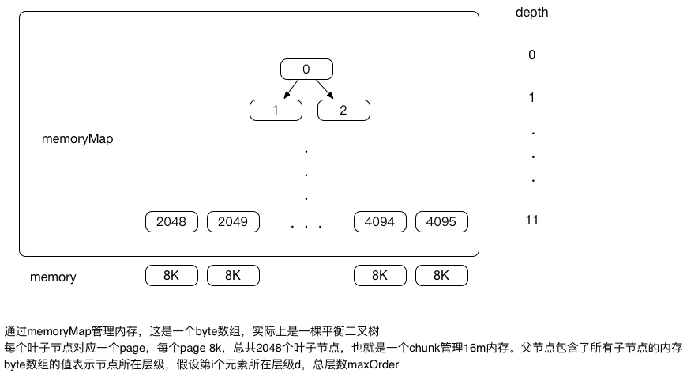
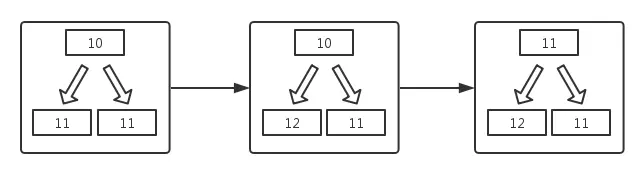

# Netty 之 Normal 内存分配详解

## 一、前言

前面解释了 Netty 中进行池化内存分配的核心组件 PoolArena 和 PoolChunkList。 Netty 中池化的 ByteBuf 类型分为 PooledDirectByteBuf 和   PooledHeapByteBuf。其中 PooledDirectByteBuf 使用 directArena 进行分配，在底层使用 JDK 中的 ByteBuffer 作为容器，而 PooledHeapByteBuf 类似，采用 heapArena 进行分配，在底层使用 byte 字节数组作为容器。这两种类型的 ByteBuf 申请内存的过程类似，我们接下来以 PooledDirectByteBuf 为例。

Netty 将分配的内存依据大小分为了四种类型： tiny、 small、 normal、 huge。其中 tiny 和 small 类型的内存大小小于 PoolSubpage 的大小（ 8KB）； normal 类型的内存大小 >= pageSize，但是 <= PoolChunk 的大小（ 16MB）； huge 类型的内存 > PoolChunk，这种情况下， Netty 本身不对内存进行管理，而是交给 JVM 来进行管理。所以我们主要分析 tiny&small 的内存分配过程和 normal 类型的内存分配过程。

## 二、 PoolChunk 与 PoolSubpage 介绍

### 1. 简介

我们将 PoolChunk 上的内存分配视为一个算法来分析：

- 输入：指定的连续内存空间大小
- 输出：如果分配成功，返回一个包含目标空闲内存地址信息的句柄，否则返回失败

这里强调以下， Netty 内存池分配出来的内存空间不是 Client 申请 size 的大小，而是大于 size 的最小 2 的幂次方（ size > 512 ）或者是 16 的倍数。比如 Client 申请 100byte 的内存，那么返回的将是 128byte。 Netty 会在入口处对申请的大小统一做规整化的处理，来保证分配出来的内存都是 2 的幂次方，这样做有两点好处：**<font color="red">内存保持对齐，不会有很零散的内存碎片，这点和操作系统的内存管理类似；其次可以基于 2 的幂次方在二进制上的特性，大量运用位运算提升效率</font>**。后面的详细流程中我们将会看到。

### 2. 内存存储单元

在分析原理之前，我们先看以下 PoolChunk 中一些默认参数：

#### 2.1 内存块 PoolChunk

Netty 向操作系统申请资源的最小单位， PoolChunk 是 PoolSubpage 单元的集合。 PoolChunk 默认大小 16MB，可调节，根据 pageSize 和 maxOrder 计算得到。一个 PoolChunk 默认由 2 ^ 11 个页面构成，因为一个 PoolSubpage 大小默认为 8KB，所以 PoolChunk 默认大小 16MB。而一个 PoolChunk 包含多少个 PoolSubpage 是由 maxOrder 决定的，默认的 maxOrder 大小为 11 ，所以一个 PoolChunk 包含 2 ^ 11 （ 2048 ）个页面。

$$DefaultChunkSize = DefaultPageSize\times2 ^ {defaultMaxOrder}=16M$$

#### 2.2 内存页 PoolSubpage

当请求的内存小于页大小时，可继续划分为更小的内存段，使用位图标记各使用情况。 PoolSubpage 大小的默认值为 8K，可调节，必须为 2 的幂：

$$
DefaultPageSize=8192Byte=8k\\
pageShifts=log_{2}pageSize=13
$$

#### 2.3 数据结构

PoolChunk 内部包含一个 byte 数组 memoryMap，默认包含 4096 个元素， memoryMap 实际上是一棵完全二叉树，共有 12 层，也就是 maxOrder 默认是 11 （从 0 开始），所以这棵树总共有 2048 个叶子结点，每个叶子节点对应一个 PoolSubpage，树中非叶子节点的内存大小由左子节点的内存大小加上右子节点的内存大小， memoryMap 数组中存储的值是 byte 类型，其实就是该树节点在树中的深度（深度从 0 开始）。树的基本结构如下图：

<div align="center">
    
</div>

PoolChunk 默认由 2048 个 PoolSubpage 组成，一个 PoolSubpage 默认大小为 8k：

- 如果需要分配大小 8k 的内存，则只需要在第 11 层，找到第一个可用节点即可。
- 如果需要分配大小 16k 的内存，则只需要在第 10 层，找到第一个可用节点即可。
- 如果节点 1024 存在一个已经被分配的子节点 2048 ，则该节点不能被分配，如需要分配大小 16k 的内存，这个时候节点 2048 已被分配，节点 2049 未被分配，就不能直接分配节点 1024 ，因为该节点目前只剩下 8k 内存。

memoryMap 在 PoolChunk 的构造函数中被初始化，代码如下：

```java{.line-numbers}
//class:PoolChunk
PoolChunk(PoolArena<T> arena, T memory, int pageSize, int maxOrder, int pageShifts, int chunkSize, int offset) {
    // unusable 的值为 12 ， maxOrder 的值为 11
    unusable = (byte) (maxOrder + 1);
    // 省略代码 ......
    assert maxOrder < 30 : "maxOrder should be < 30, but is: " + maxOrder;
    // maxSubpageAllocs 的大小为 2048 ，也就是 2 ^ 11
    maxSubpageAllocs = 1 << maxOrder;
    // 进行 memoryMap 的初始化， memoryMap 的大小为 4096 ， memoryMap 表示一棵完全二叉树，有 12 层， memoryMap 中的每一个元素表示
    // 二叉树中的一个结点，下面的双重循环，其实是使用层序遍历的方式，将 memoryMap 的每一个节点值初始化为此节点在完全二叉树中的深度（以 0 开始）
    memoryMap = new byte[maxSubpageAllocs << 1];
    depthMap = new byte[memoryMap.length];
    int memoryMapIndex = 1;

    // 从深度 0 ，一直遍历到深度 11
    for (int d = 0; d <= maxOrder; ++ d) { // move down the tree one level at a time
        // 在第 d 层，总共有 depth 个节点
        int depth = 1 << d;
        // 将在第 d 层的所有树节点赋值为此节点在树中的深度，也就是 d
        for (int p = 0; p < depth; ++ p) {
            // in each level traverse left to right and set value to the depth of subtree
            memoryMap[memoryMapIndex] = (byte) d;
            depthMap[memoryMapIndex] = (byte) d;
            memoryMapIndex ++;
        }
    }

    //subpages = new PoolSubpage[maxSubpageAllocs]
    //subpages 表示此 PoolChunk 中可分配的叶子节点
    subpages = newSubpageArray(maxSubpageAllocs);
}
```

memoryMap 数组中每个位置保存的是该节点所在的层数，有什么作用？对于节点 512 ，其层数是 9 ，则：

- 如果 memoryMap[512] = 9 ，则表示其本身到下面所有的子节点都可以被分配；
- 如果 memoryMap[512] = 10 ， 则表示节点 512 下有子节点已经分配过，则该节点不能直接被分配，而其子节点中的第 10 层还存在未分配的节点 ;
- 如果 memoryMap[512] = 12 （即总层数 + 1 ），可分配的深度已经大于总层数，则表示该节点下的所有子节点都已经被分配。

## 三、 PoolChunk 分配 Normal 内存的过程

PoolChunk 分配内存的调用的入口在 PoolArena 类中的 allocate 方法：

```java{.line-numbers}
//class:PoolArena
private void allocate(PoolThreadCache cache, PooledByteBuf<T> buf, final int reqCapacity) {
    final int normCapacity = normalizeCapacity(reqCapacity);
    if (isTinyOrSmall(normCapacity)) { // capacity < pageSize
        // 省略代码
    }
    if (normCapacity <= chunkSize) {
        if (cache.allocateNormal(this, buf, reqCapacity, normCapacity)) {
            return;
        }
        synchronized (this) {
            allocateNormal(buf, reqCapacity, normCapacity);
            ++allocationsNormal;
        }
    } else {
        // 省略代码
    }
} 
```

首先 if (normCapacity <= chunkSize) 说明其小于 16MB，然后首先在缓存中分配，如果是最初缓存中没有值或者从缓存中申请内存失败，会走到 allocateNormal(buf, reqCapacity, normCapacity)，这里实际上就是在 PoolSubpage 级别上进行分配，分配一个或者多个 PoolSubpage 的空间。 allocateNormal 的代码如下：

```java{.line-numbers}
// class:PoolArena
private synchronized void allocateNormal(PooledByteBuf<T> buf, int reqCapacity, int normCapacity) {
    // 首先从内存池中（也就是 6 种 PoolChunkList）尝试获取需要的内存
    if (q050.allocate(buf, reqCapacity, normCapacity) || q025.allocate(buf, reqCapacity, normCapacity) ||
        q000.allocate(buf, reqCapacity, normCapacity) || qInit.allocate(buf, reqCapacity, normCapacity) ||
        q075.allocate(buf, reqCapacity, normCapacity)) {
        ++allocationsNormal;
        return;
    }
    // 如果从现有内存池中没有找到可用的内存，则重新申请一个 PoolChunk
    PoolChunk<T> c = newChunk(pageSize, maxOrder, pageShifts, chunkSize);
    long handle = c.allocate(normCapacity);
    ++allocationsNormal;
    assert handle > 0;
    // 用申请的内存初始化 Buffer
    c.initBuf(buf, handle, reqCapacity); 
    // 将申请到的 PoolChunk 放到 qInit 的 PoolChunkList 中
    qInit.add(c);
} 
```

首先从内存池中已有的内存，也就是 6 个 PoolChunkList 中尝试去申请内存，我们之前讲过， PoolChunkList 是存储不同内存使用量的 PoolChunk 集合，每个 PoolChunkList 通过双向链表的形式进行关联，这里的 q050.allocate(buf, reqCapacity, normCapacity) 就代表首先在 q050 这个 PoolChunkList 上进行内存分配。

我们以 q050 为例进行分析 , 跟到 **<font color="red">`q050.allocate(buf, reqCapacity, normCapacity)`</font>** 方法中 :

```java{.line-numbers}
//class:PoolChunkList
boolean allocate(PooledByteBuf<T> buf, int reqCapacity, int normCapacity) {
    if (head == null || normCapacity > maxCapacity) {
        // 当前链表为空或者申请内存的大小大于当前链表的利用率直接返回 false
        return false;
    }
    // 从链表头开始依次查找可用的内存
    for (PoolChunk<T> cur = head;;) {
        // 针对每个 PoolChunk 申请内存，如果返回 handle 小于 0 表示没有符合条件的内存，继续查找下一个
        long handle = cur.allocate(normCapacity);
        if (handle < 0) {
            cur = cur.next;
            if (cur == null) {
                return false;
            }
        } else {
            // 如果找到可用的内存，用来初始化 buffer
            cur.initBuf(buf, handle, reqCapacity);
            if (cur.usage() >= maxUsage) {
                // 如果当前 PoolChunk 的利用率大于当前链表的最大利用率需要移动到下一个链表
                remove(cur);
                nextList.add(cur);
            }
            return true;
        }
    }
} 
```

PoolChunkList#allocate 代码的注释具体解释了 allocate 的分配流程。接下里回到 PoolChunk 中的 allocateNormal 方法，如果从内存池中分配失败（可能最开始分配内存的时候， 6 种 PoolChunkList 都为空，没有 PoolChunk，这样就导致无法进行分配，也有可能是其它原因导致的），则会调用 PoolChunk 的构造函数，创建一个新的 PoolChunk（从这里可以看出， Netty 向操作系统进行内存申请的最小单位为 PoolChunk），使用这个 PoolChunk 进行分配，并且将其加入到 qInit 中。

调用 newChunk 方法的代码如下：

```java{.line-numbers}
protected PoolChunk<ByteBuffer> newChunk(int pageSize, int maxOrder,
                int pageShifts, int chunkSize) {
    // 省略代码
    return new PoolChunk<ByteBuffer>(this, memory, pageSize,
                maxOrder, pageShifts, chunkSize,
                offsetCacheLine(memory));
}
```

现在我们继续剖析 allocateNormal 方法中的 long handle = c.allocate(normCapacity) 这步。 allocate 方法的代码如下：

```java{.line-numbers}
//class:PoolChunk
long allocate(int normCapacity) {
    if ((normCapacity & subpageOverflowMask) != 0) { // >= pageSize
        return allocateRun(normCapacity);
    } else {
        return allocateSubpage(normCapacity);
    }
} 
```

- 当需要分配的内存大于 pageSize 时，使用 allocateRun 实现内存分配。
- 否则使用方法 allocateSubpage 分配内存，在 allocateSubpage 实现中，会把一个 page 分割成多段，进行内存分配。

```java{.line-numbers}
/**
 * io.netty.buffer.PoolChunk#allocateRun
 * 需要分配的内存大小大于 PoolSubPage（ 8K）但是小于 PoolChunk（ 16M）时，调用此方法
 */
private long allocateRun(int normCapacity) {
    // 计算出所申请的内存位于树的哪一层
    // pageShifts = Integer.SIZE - 1 - Integer.numberOfLeadingZeros(pageSize) = 13
    // Integer.SIZE 大小为 32 ，表示 Integer 占用四个字节，而 pageSize 的大小为 8K，也就是 2 ^ 13
    // Integer.numberOfLeadingZeros(pageSize) 表示 pageSize 二进制表示的时候，前面有多少个 0 ，在这里算出的结果为 18
    // pageShifts 就意味着 1 << pageShifts 的值等于 pageSize，除此之外， maxOrder 的值为 11 
    // 假如我们要分配的内存大小（ normCapacity）为 32K，则 log2(normCapacity) 为 15 ，因此算出的 d 为 11 - (15 - 13) = 9 ，
    // 即要申请的内存位于第 9 层，验证一下，叶子节点内存大小是一个 page8k，父节点 16k，父节点的父节点是 32k，
    // 所以申请的内存应该位于上一层的上一层，也就是第 9 层
    int d = maxOrder - (log2(normCapacity) - pageShifts);
    // 在 d 层找到可用的内存并返回对应的 memoryMap 数组元素的 index
    int id = allocateNode(d);
    if (id < 0) {
        // 如果小于 0 说明没有找到
        return id;
    }
    // 如果找到了则更新当前 chunk 可用内存大小
    freeBytes -= runLength(id);
    return id;
} 
```

上面 allocateRun 代码的流程：

1. normCapacity 是处理过的值，如申请大小为 1000 的内存，实际申请的内存大小为 1024 。
2. d = maxOrder - (log2(normCapacity) - pageShifts) 可以确定需要在二叉树的 d 层开始节点匹配。其中 maxOrder 表示 memoryMap 树最大深度为 maxOrder（从 0 开始），从上到下依次是 0,1,2,3,4,5,6,7,8,9,10,11 ，也即 maxOrder 默认为 11 。 d 的含义为要申请的内存位于 memoryMap 树的第几层。
3. 方法 allocateNode 实现在二叉树中进行节点匹配，具体实现如下：

```java{.line-numbers}
//class:PoolChunk
private int allocateNode(int d) {
    int id = 1;

    /**
     *                  2 ^ 10  0000 0000 0000 0000 0000 0100 0000 0000
     * 加入 d = 10, 则 initial 为 1111 1111 1111 1111 1111 1100 0000 0000 ，
     * 当 id < 2 ^ 10 的时候，也就是节点深度小于第 10 层时， id & initial = 0 ；
     * 当 id = 2 ^ 10 的时候，也就是位于第 10 层时， id & initial = 1 << 10
     * 所以 id & initial 这个条件就是确保当 val 等于 d 的节点确实位于 d 层
     */
    int initial = - (1 << d); 
    //value(id) = memoryMap[id] 
    byte val = value(id); 
    if (val > d) { // unusable
        return -1;
    }
    while (val < d || (id & initial) == 0) { // id & initial == 1 << d for all ids at depth d, for < d it is 0
        id <<= 1;
        val = value(id);
        // val > d 表明以该节点为根的子树的叶子节点剩余的内存已经不够了（因为有些叶子节点已经被分配过了），
        // 那么找兄弟节点
        if (val > d) {
            // id = id + 1
            id ^ = 1;
            val = value(id);
        }
    }

    byte value = value(id);
    // 找到的节点 memoryMap[id] = d，且真正位于第 d 层
    assert value == d && (id & initial) == 1 << d : String.format("val = %d, id & initial = %d, d = %d",
            value, id & initial, d);

    // 将当前内存标记为不可用，也就是将 memoryMap[id] 的值更新 maxOrder+1 ，也就是 12
    setValue(id, unusable); // mark as unusable
    // 分配节点完成后，其父节点的状态也需要更新，并可能引起更上一层父节点的更新
    updateParentsAlloc(id);
    return id;
} 
```

从上面的 allocateRun 方法，我们得知了要找的内存位于 d 层，下面这个方法就是在指定的 d 层找到符合条件的内存，最初每个节点的值本来是该节点所在的深度 depth，但是如果一个结点的值为 12 ，那么表明这以这个节点为根的子树的所有叶子节点都已经被分配出去。如果一个结点的值大于这个结点的初始值（也就是这个节点在二叉完全树中的深度），比如深度为 10 ，结果现在的值为 11 ，表明在以此结点为根的子树中，叶子结点有一部分被分配出去了。
 
所以在真正查找的时候，从根结点开始（ id = 1 ），不断往下，当 val < d 时，表明子树的叶子节点的内存大小足够，进入到此节点的左子节点（ id <<= 1 ），继续匹配。当 val > d 时，则表明子树的叶子节点已经被分配了一部分，剩下叶子节点的内存不够，所以需要在兄弟节点上进行查找（ id ^ = 1 ）。当最后找到的节点 val 值等于 d，并且此结点确实位于第 d 层（(id & initial) == 0 ），则将此节点赋值为 12 ，表明此节点为根子树的所有叶子节点全部被分配。

这里注意一点，那就是 memoryMap 数组表示一棵完全二叉树，数组中的每一个元素（即二叉树中的一个节点）的值除了意味着该节点在二叉树中的深度还意味着剩余可分配内存的大小，即以此结点为根的子树中叶子结点代表内存大小，值越小，则可分配的内存也就越大。

allocateNode 的查找流程如下：

1. 从根节点开始遍历，如果当前节点的 val<d，则通过 id <<=1 匹配下一层；
2. 如果 val > d，则表示存在子节点被分配的情况，而且剩余节点的内存大小不够，此时需要在兄弟节点上继续查找；
3. 分配成功的节点需要标记为不可用，防止被再次分配，在 memoryMap 对应位置更新为 12 ；
4. 分配节点完成后，其父节点的状态也需要更新，并可能引起更上一层父节点的更新，实现如下：

```java{.line-numbers}
//class:PoolChunk
private void updateParentsAlloc(int id) {
    while (id > 1) {
        int parentId = id >>> 1;
        byte val1 = value(id);
        byte val2 = value(id ^ 1);
        byte val = val1 < val2 ? val1 : val2;
        setValue(parentId, val);
        id = parentId;
    }
} 
```

举个例子，当节点 2048 被分配出去之后：

<div align="center">
    
</div>

## 四、总结

Netty 为 PooledByteBuf 分配 normal 类型的内存时，入口在 allocate 方法。首先会尝试从缓存中申请分配内存，如果申请失败，则调用 allocateNormal 方法从内存池中申请内存。在 allocateNormal 方法中，首先会从 6 种类型的 PoolChunkList 中寻找合适的 PoolChunk 进行内存分配，如果没有分配成功（可能是由于初次分配，所以所有的 PoolChunkList 为空）则重新创建一个 PoolChunk，并从这个 PoolChunk 中分配内存，最后把 PoolChunk 加入到 qInit 链表中进行保存，以便下次也从里面进行分配。
