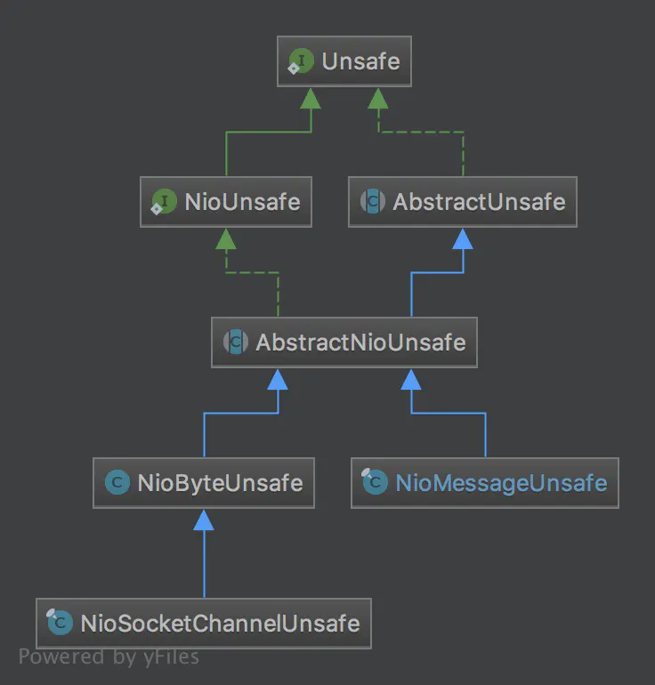

# Netty 之 Pipeline 详解

## 一、Unsafe 类

### 1.初识 Unsafe

顾名思义，unsafe 是不安全的意思，就是告诉你不要在应用程序里面直接使用 Unsafe 以及他的衍生类对象。netty 官方的解释为：**_Unsafe operations that should never be called from user-code. These methods are only provided to implement the actual transport, and must be invoked from an I/O thread_**。

Unsafe 接口在 Channel 接口中被定义，属于 Channel 接口的内部类，表明 Channel 和 Unsafe 密切相关。下面是 unsafe 接口的所有方法：

```java{.line-numbers}
interface Unsafe {
   RecvByteBufAllocator.Handle recvBufAllocHandle();
   
   SocketAddress localAddress();
   SocketAddress remoteAddress();

   void register(EventLoop eventLoop, ChannelPromise promise);
   void bind(SocketAddress localAddress, ChannelPromise promise);
   void connect(SocketAddress remoteAddress, SocketAddress localAddress, ChannelPromise promise);
   void disconnect(ChannelPromise promise);
   void close(ChannelPromise promise);
   void closeForcibly();
   void beginRead();
   void write(Object msg, ChannelPromise promise);
   void flush();
   
   ChannelPromise voidPromise();
   ChannelOutboundBuffer outboundBuffer();
} 
```

按功能可以分为分配内存，Socket 四元组信息，注册事件循环，绑定网卡端口，Socket 的连接和关闭，Socket 的读写，看的出来，这些操作都是和 jdk 底层相关。

### 2.Unsafe 的继承结构

<div align="center">
    
</div>

NioUnsafe 在 Unsafe 基础上增加了以下几个接口：

```java{.line-numbers}
public interface NioUnsafe extends Unsafe {
    SelectableChannel ch();
    void finishConnect();
    void read();
    void forceFlush();
} 
```

从增加的接口以及类名上来看，NioUnsafe 增加了可以访问底层 jdk 的 SelectableChannel 的功能，定义了从 SelectableChannel 读取数据的 read 方法，AbstractUnsafe 实现了大部分 Unsafe 的功能（并且AbstractUnsafe为定义在 AbstractChannel 中的内部类）。AbstractNioUnsafe（定义在 AbstractNioChannel 中的内部类）主要是通过代理到其外部类 AbstractNioChannel 拿到了与 jdk nio 相关的一些信息，比如 SelectableChannel，SelectionKey 等等。

NioMessageUnsafe 和 NioByteUnsafe 是处在同一层次的抽象，**<font color="red">netty 将一个新连接的建立也当作一个 io 操作来处理，这里的 Message 的含义我们可以当作是一个 SelectableChannel</font>**，读的意思就是 accept 一个 SelectableChannel，写的意思是针对一些无连接的协议，比如 UDP 来操作的，我们先不用关注。NioByteUnsafe 则实现了 IO 的基本操作，读和写，这些操作都与 jdk 底层相关。

### 3.Unsafe 的分类

从以上继承结构来看，我们可以总结出两种类型的 Unsafe 分类，**<font color="red">一个是与连接的字节数据读写相关的 NioByteUnsafe，一个是与新连接建立操作相关的 NioMessageUnsafe</font>**。在 NioByteUnsafe 中，读操作 read 的完成需要委托到外部 AbstractNioByteChannel 的子类 NioSocketChannel 中的 doWriteBytes 来完成：

```java{.line-numbers}
//class:NioSocketChannel
protected int doReadBytes(ByteBuf byteBuf) throws Exception {
    final RecvByteBufAllocator.Handle allocHandle = unsafe().recvBufAllocHandle();
    allocHandle.attemptedBytesRead(byteBuf.writableBytes());
    return byteBuf.writeBytes(javaChannel(), allocHandle.attemptedBytesRead());
} 
```

最后一行已经与 jdk 底层以及 netty 中的 ByteBuf 相关，将 jdk 的 SelectableChannel 的字节数据读取到 netty 的 ByteBuf 中。NioMessageUnsafe 中的读操作需要委托到外部类 AbstractNioMessageChannel 的子类 NioServerSocketChannel 中的 doReadMessages 来解决。

```java{.line-numbers}
//class:NioServerSocketChannel
protected int doReadMessages(List<Object> buf) throws Exception {
    // 由于之前的Reactor线程已经探测到了有OP_ACCEPT事件发生，所以这个accept方法立即返回
    SocketChannel ch = SocketUtils.accept(javaChannel());

    try {
        if (ch != null) {
            //将jdk的 SocketChannel 封装成自定义的 NioSocketChannel，加入到list里面
            buf.add(new NioSocketChannel(this, ch));
            return 1;
        }
    } catch (Throwable t) {
        // 省略代码......
    }
    return 0;
} 
```

## 二、pipeline 中 InBound 事件的传播

### 1.示例

我们通过下面这个例子来解释 pipeline 中的 inbound 事件传播机制：

```java{.line-numbers}
public class NettyPipelineInboundExample {

    public static void main(String[] args) {
        EventLoopGroup group = new NioEventLoopGroup(1);
        ServerBootstrap strap = new ServerBootstrap();
        strap.group(group)
                .channel(NioServerSocketChannel.class)
                .localAddress(new InetSocketAddress(8888))
                .childOption(ChannelOption.TCP_NODELAY, true)
                .childHandler(new ChannelInitializer<SocketChannel>() {
                    @Override
                    protected void initChannel(SocketChannel ch) throws Exception {
                        ch.pipeline().addLast(new InboundHandlerA());
                        ch.pipeline().addLast(new InboundHandlerB());
                        ch.pipeline().addLast(new InboundHandlerC());
                    }
                });
        try {
            ChannelFuture future = strap.bind().sync();
            future.channel().closeFuture().sync();
        } catch (InterruptedException e) {
            e.printStackTrace();
        } finally {
            group.shutdownGracefully();
        }
    }
}

class InboundHandlerA extends ChannelInboundHandlerAdapter {

    @Override
    public void channelRead(ChannelHandlerContext ctx, Object msg) throws Exception {
        System.out.println("InboundHandler A : " + msg);
        // 传播read事件到下一个channelhandler
        ctx.fireChannelRead(msg);
    }

    @Override
    public void channelActive(ChannelHandlerContext ctx) throws Exception {
        // channel激活，触发channelRead事件，从pipeline的heandContext节点开始往下传播
        ctx.channel().pipeline().fireChannelRead("Hello world");
    }

}

class InboundHandlerB extends ChannelInboundHandlerAdapter {

    @Override
    public void channelRead(ChannelHandlerContext ctx, Object msg) throws Exception {
        System.out.println("InboundHandler B : " + msg);
        // 传播read事件到下一个channelhandler
        ctx.fireChannelRead(msg);
    }

}

class InboundHandlerC extends ChannelInboundHandlerAdapter {

    @Override
    public void channelRead(ChannelHandlerContext ctx, Object msg) throws Exception {
        System.out.println("InboundHandler C : " + msg);
        // 传播read事件到下一个channelhandler
        ctx.fireChannelRead(msg);
    }
} 
```

通过 telnet 来连接上面启动好的 netty 服务，触发 InboundHandlerA 中的 channel active 事件：

```shell{.line-numbers}
$ telnet 127.0.0.1 8888 
```

接下来控制台的输出如下：

```shell{.line-numbers}
Connected to the target VM, address: '127.0.0.1:56920', transport: 'socket'
InboundHandler A : Hello world
InboundHandler B : Hello world
InboundHandler C : Hello world 
```

### 2.源码详解

首先解释一下，InboundHandlerA 中 channelActive 的调用时机。当服务器端检测到客户端的连接之后，将连接 NioSocketChannel 传递给 ServerBootsrapAcceptor 进行处理。处理的主要步骤一个是把 childHandler 添加到 NioSocketChannel 的 pipeline 上，同时将 NioSocketChannel 注册到 workerGroup 中的某一个 NioEventLoop 上。在注册的 register0 方法中，有如下代码：

```java{.line-numbers}
if (isActive()) {
    if (firstRegistration) {
        pipeline.fireChannelActive();
    } else if (config().isAutoRead()) {
        beginRead();
    }
}
```

isActive 直接返回 true（与服务端 NioServerSocketChannel 注册 register0 时不同，对于 NioServerSocketChannel 来说，由于还没绑定到特定的端口，所以 isActive 返回 false）。通过调用 pipeline.fireChannelActive() 逐渐调用到 InboundHandlerA 中的 channelActive 方法。pipeline().fireChannelRead("Hello world") 从下面这个方法开始调用：

```java{.line-numbers}
// class:DefaultChannelPipeline
public final ChannelPipeline fireChannelRead(Object msg) {
    //从 head 节点开始往后传播 read 事件
    AbstractChannelHandlerContext.invokeChannelRead(head, msg);
    return this;
} 
```

接着调用 AbstractChannelHandlerContext 中的 invokeChannelRead(head, msg) 接口：

```java{.line-numbers}
// class:AbstractChannelHandlerContext
static void invokeChannelRead(final AbstractChannelHandlerContext next, Object msg) {
    final Object m = next.pipeline.touch(ObjectUtil.checkNotNull(msg, "msg"), next);
    EventExecutor executor = next.executor();
    if (executor.inEventLoop()) {
        // next.invokeChannelRead同样会调用AbstractChannelHandlerContext中的invokeChannelRead方法
        next.invokeChannelRead(m);
    } else {
        executor.execute(new Runnable() {
            @Override
            public void run() {
                next.invokeChannelRead(m);
            }
        });
    }
} 

// class:AbstractChannelHandlerContext
private void invokeChannelRead(Object msg) {
    if (invokeHandler()) {
        try {
            // 这里返回的的handler可能是pipeline中自带的head和tail两个ChannelHandlerContext，
            // 或者是用户自定义然后添加到Pipeline中的ChannelHandler。如果是head或者tail，
            // 则handler()返回的就是head或者tail本身，调用head的channelRead方法时，只会继续传播事件。
            // 如果是用户自定义的ChannelHandler，则会直接调用用户自定义的channelRead方法
            ((ChannelInboundHandler) handler()).channelRead(this, msg);
        } catch (Throwable t) {
            notifyHandlerException(t);
        }
    } else {
        fireChannelRead(msg);
    }
} 
```

顺着这个调用链，我们可以知道这个 handler() 返回的就是 pipeline 中的 head 对象本身，它的 channelRead 方法只会继续调用下一个 handler 的 channelRead 方法，如下所示：

```java{.line-numbers}
// class:DefaultChannelPipeline$HeadContext
public void channelRead(ChannelHandlerContext ctx, Object msg) throws Exception {
    //HeadContext中的channelRead所做的操作只是将msg继续传播
    ctx.fireChannelRead(msg);
} 

// class:AbstractChannelHandlerContext
// AbstractChannelHandlerContext 中的 fireChannelRead 方法和 DefaultChannelPipeline 中的
// fireChannelRead 方法一样，都是调用 AbstractChannelHandlerContext 中的 invokeChannelRead 方法，
// 不同的只是，AbstractChannelHandlerContext 中，是将 msg 传递给 pipeline 中下一个 ChannelHandlerContext，
// 而 DefaultChannelPipeline 中的 fireChannelRead 则是从 pipeline 中的 head 开始，将事件往后传播
public ChannelHandlerContext fireChannelRead(final Object msg) {
    invokeChannelRead(findContextInbound(), msg);
    return this;
} 

// class:AbstractChannelHandlerContext
// 返回 pipeline 中下一个 Inbound 类型的 ChannelHandlerContext
private AbstractChannelHandlerContext findContextInbound() {
    AbstractChannelHandlerContext ctx = this;
    do {
        ctx = ctx.next;
    } while (!ctx.inbound);
    return ctx;
} 
```

所以，从上面的代码可以看出，在 channelActive 的方法中，调用 pipeline().fireChannelRead("Hello world") 会把 read 事件传给 pipeline 中的第一个 handler，也就是 head。而 head 的 channelRead 方法什么事情也不做，只是把 read 事件传递给 pipeline 中的下一个 handler。而此时 NioSocketChannel 的 pipeline 的结构为：

```java{.line-numbers}
Head -> InboundHandlerA -> InboundHandlerB -> InboundHandlerB -> Tail
```

因此，read 事件会逐步传递给后续的 InboundHandler，也就是回调各个 InboundHandler 中的 channelRead 方法。最后调用 Tail 中的 channelRead 方法：

```java{.line-numbers}
public class DefaultChannelPipeline implements ChannelPipeline {
        
    final class TailContext extends AbstractChannelHandlerContext implements ChannelInboundHandler {
        ... 
        @Override
        public void channelRead(ChannelHandlerContext ctx, Object msg) throws Exception {
            // 调用onUnhandledInboundMessage接口
            onUnhandledInboundMessage(msg);
        }      
        ...
    }
    
    ...
    
    // 对未处理inbound消息做最后的处理
    protected void onUnhandledInboundMessage(Object msg) {
        try {
            logger.debug("Discarded inbound message {} that reached at the tail of the pipeline. Please check your pipeline configuration.", msg);
        } finally {
            // 对msg对象的引用数减1，当msg对象的引用数为0时，释放该对象的内存
            ReferenceCountUtil.release(msg);
        }
    }
    ...
   
}
```

以上就是 pipeline 对 InBound 事件的处理。

### 3.SimpleChannelInboundHandler

在前面的例子中，假如中间有一个 ChannelHandler 未对 channelRead 事件进行传播，就会导致消息对象无法得到释放，最终导致内存泄露。我们还可以继承 SimpleChannelInboundHandler 来自定义 ChannelHandler，它的 channelRead 方法，对消息对象做了 msg 处理，防止内存泄露：

```java{.line-numbers}
public abstract class SimpleChannelInboundHandler<I> extends ChannelInboundHandlerAdapter {
    ...
    @Override
    public void channelRead(ChannelHandlerContext ctx, Object msg) throws Exception {
        boolean release = true;
        try {
            if (acceptInboundMessage(msg)) {
                @SuppressWarnings("unchecked")
                I imsg = (I) msg;
                channelRead0(ctx, imsg);
            } else {
                release = false;
                ctx.fireChannelRead(msg);
            }
        } finally {
            if (autoRelease && release) {
                // 对msg对象的引用数减1，当msg对象的引用数为0时，释放该对象的内存
                ReferenceCountUtil.release(msg);
            }
        }
    }
    ...
}
```

对于继承 SimpleChannelInboundHandler 的 ChannelHandler，我们需要只需要重写抽象方法 channelRead0。SimpleChannelInboundHandler 和一般的 ChannelInboundHandlerAdapter 不同之处就在于，它默认对传递到此 ChannelHandler 的 msg 进行处理，在退出此 handler 时将 msg 的引用计数减一，防止发生内存泄漏。acceptInboundMessage 方法主要用来判断 msg 的类型此 ChannelHandler 是否可以处理，如果可以，就调用用户定义的 channelRead0 方法，否则，就将 msg 传播给 pipeline 中的下一个 ChannelHandler 来进行处理。

## 三、pipeline 中的 outbound 事件的传播

### 1.示例

现在我们以下面的示例代码来分析 pipeline 的 OutBound 事件的传播机制：

```java{.line-numbers}
public class NettyPipelineOutboundExample {

    public static void main(String[] args) {
        EventLoopGroup group = new NioEventLoopGroup(1);
        ServerBootstrap strap = new ServerBootstrap();
        strap.group(group)
                .channel(NioServerSocketChannel.class)
                .localAddress(new InetSocketAddress(8888))
                .childOption(ChannelOption.TCP_NODELAY, true)
                .childHandler(new ChannelInitializer<SocketChannel>() {
                    @Override
                    protected void initChannel(SocketChannel ch) throws Exception {
                        ch.pipeline().addLast(new OutboundHandlerA());
                        ch.pipeline().addLast(new OutboundHandlerB());
                        ch.pipeline().addLast(new OutboundHandlerC());
                    }
                });
        try {
            ChannelFuture future = strap.bind().sync();
            future.channel().closeFuture().sync();
        } catch (InterruptedException e) {
            e.printStackTrace();
        } finally {
            group.shutdownGracefully();
        }
    }
}

class OutboundHandlerA extends ChannelOutboundHandlerAdapter {

    @Override
    public void write(ChannelHandlerContext ctx, Object msg, ChannelPromise promise) throws Exception {
        // 输出消息
        System.out.println("OutboundHandlerA: " + msg);
        // 传播write事件到下一个节点
        ctx.write(msg, promise);
    }
}

class OutboundHandlerB extends ChannelOutboundHandlerAdapter {

    @Override
    public void write(ChannelHandlerContext ctx, Object msg, ChannelPromise promise) throws Exception {
        // 输出消息
        System.out.println("OutboundHandlerB: " + msg);
        // 传播write事件到下一个节点
        ctx.write(msg, promise);
    }


    @Override
    public void handlerAdded(ChannelHandlerContext ctx) throws Exception {
        // 待handlerAdded事件触发3s后，模拟触发一个
        ctx.executor().schedule(() -> {
            ctx.channel().write("Hello world ! ");
        }, 3, TimeUnit.SECONDS);
    }
}

class OutboundHandlerC extends ChannelOutboundHandlerAdapter {

    @Override
    public void write(ChannelHandlerContext ctx, Object msg, ChannelPromise promise) throws Exception {
        // 输出消息
        System.out.println("OutboundHandlerC: " + msg);
        // 传播write事件到下一个节点
        ctx.write(msg, promise);
    }
} 
```

通过 telnet 来连接上面启动好的 netty 服务，触发 channel added 事件：

```java{.line-numbers}
$ telnet 127.0.0.1 8888
```

控制台输出如下信息：

```java{.line-numbers}
OutboundHandlerC: Hello world ! 
OutboundHandlerB: Hello world ! 
OutboundHandlerA: Hello world ! 
```

### 2.源码详解

首先，在上面的示例代码中，调用的入口为 handlerAdded 方法，这里解释一下。但 NioServerSocketChannel 上发生了 OP_ACCEPT 事件，将客户端发送过来的连接传递给 ServerBootstrapAcceptor 来进行处理。在 ServerBootstrapAcceptor 中，将用户自定义的 childHandler 添加到 NioSocketChannel 对应的 pipeline 中，但是由于 NioSocketChannel 还没有注册到 NioEventLoop 上，因此不会立即回调 childHandler 中的 handlerAdded 方法。等到 NioSocketChannel 注册到 NioEventLoop 上之后，就会调用 childHandler 的 handlerAdded 方法，初始化 NioSocketChannel。

在初始化 NioSocketChannel 时，添加 OutboundHandlerA 到 NioSocketChannel 对应的 pipeline 中（这时，由于 NioSocketChannel 已经注册，所以会立即调用 handler 的 handlerAdded 方法），由于它的 handlerAdded 继承于 ChannelHandlerAdapter 是个空函数，所以没有影响。接着调用 OutboundHandlerB 的 handlerAdded 方法，开始触发 write 事件。

这里为什么要使用定时任务？这是因为如果不包装成定时任务的话，直接执行 ctx.channel().write("Hello world!"); 的话，先把 handlerA 添加到 pipeline 中，然后会回调 handlerA 的 handlerAdded 方法，但是它的 handlerAdded 继承于 ChannelHandlerAdapter 是个空函数，所以没有影响。此时 pipeline 为 head --> handlerA --> tail。

**<font color="red">当我们把 handlerB 加入后，此时 pipeline 为 `head --> handlerA --> handlerB --> tail`</font>**。回调 handlerB 的 handlerAdded 函数，即 ctx.channel().write("Hello world ! ")，会先调用 pipeline.write，接着为 tail.pipeline（write 传播开始是从 tail 开始，与 read 相反），然后在 write(Object, boolean, ChannelPromise) 方法中，会有 findContextOutbound，返回 tail 前一个 handler (严格来说是 context)，也就是 handlerB，**<font color="red">但是 handlerB 的 handlerAdded 回调还没有完成（也就是 handlerAdded 方法没有调用完成），因此，也就 invokeHandler 返回 false，于是会跳过 handlerB 的 write 方法</font>**，而是继续调用前面的 handlerA 的 write 方法。这就造成控制台只显示 OutboundHandlerA：Hello World!。

如果采用定时任务的话，在等待任务发生的事件内，handlerA、handlerB、handlerC 都会被完成调用，因此 invokeHandler 会返回 true，也就意味着 write 事件可以从 tail 一直传播到 head。所以这样控制台会依次显示从 handlerC、handlerB、handlerA 的打印信息。

本次 write 事件的调用入口如下：

```java{.line-numbers}
//class:AbstractChannel
public ChannelFuture write(Object msg) {
    //调用DefaultChannelPipeline中的write(Object msg)方法
    return pipeline.write(msg);
} 
```

接着来看看 Pipeline 中的 write 接口：

```java{.line-numbers}
// class:DefaultChannelPipeline
public final ChannelFuture write(Object msg) {
    // 调用 AbstractChannelHandlerContext 中的 write(Object msg) 方法
    return tail.write(msg);
} 
```

调用 AbstractChannelHandlerContext 中的 write 接口：

```java{.line-numbers}
public ChannelFuture write(Object msg) {
    //继续调用AbstractChannelHandlerContext中的write(final Object, final ChannelPromise)方法
    return write(msg, newPromise());
}

@Override
public ChannelFuture write(final Object msg, final ChannelPromise promise) {
    if (msg == null) {
        throw new NullPointerException("msg");
    }

    try {
        if (isNotValidPromise(promise, true)) {
            ReferenceCountUtil.release(msg);
            // cancelled
            return promise;
        }
    } catch (RuntimeException e) {
        ReferenceCountUtil.release(msg);
        throw e;
    }

    //由于只是write而没有flush，因此将flush设置为false
    //调用AbstractChannelHandlerContext中的write(final Object, boolean,final ChannelPromise)方法
    write(msg, false, promise);

    return promise;
}

private void write(Object msg, boolean flush, ChannelPromise promise) {
    //找到在此ChannelHandlerContext之前的类型也为Outbound的ChannelHandlerContext
    AbstractChannelHandlerContext next = findContextOutbound();
    final Object m = pipeline.touch(msg, next);
    EventExecutor executor = next.executor();
    if (executor.inEventLoop()) {
        if (flush) {
            next.invokeWriteAndFlush(m, promise);
        } else {
            //由于flush为false，因此调用invokeWrite
            next.invokeWrite(m, promise);
        }
    } else {
        AbstractWriteTask task;
        if (flush) {
            task = WriteAndFlushTask.newInstance(next, m, promise);
        }  else {
            task = WriteTask.newInstance(next, m, promise);
        }
        safeExecute(executor, task, promise, m);
    }
}

private void invokeWrite(Object msg, ChannelPromise promise) {
    //如果ChannelHandler中的handlerAdded方法已经被调用完成，表明ChannelHandler已经被添加到
    //pipeline中，那么这时invokeHandler方法返回true，表明可以对ChannelHandler中的write方法进行
    //回调。另外，如果不确定ChannelHandler中的handlerAdded方法是否已经被完全执行，invokeHandler也同样会
    //返回true。
    if (invokeHandler()) {
        invokeWrite0(msg, promise);
    } else {
        write(msg, promise);
    }
}

private void invokeWrite0(Object msg, ChannelPromise promise) {
    try {
        //回调用户handler中的write方法
        ((ChannelOutboundHandler) handler()).write(this, msg, promise);
    } catch (Throwable t) {
        notifyOutboundHandlerException(t, promise);
    }
} 
```

最终会调用到 HeadContext 的 write 接口，执行 write 的实际写出：

```java{.line-numbers}
@Override
public void write(ChannelHandlerContext ctx, Object msg, ChannelPromise promise) throws Exception {
    // 调用unsafe进行写数据操作
    unsafe.write(msg, promise);
} 
```

## 四、异常传播

### 1.示例

本节以下面的实例来讲解 pipeline 中异常的传播：

```java{.line-numbers}
public class NettyPipelineExceptionCaughtExample {

    public static void main(String[] args) {
        EventLoopGroup group = new NioEventLoopGroup(1);
        ServerBootstrap strap = new ServerBootstrap();
        strap.group(group)
                .channel(NioServerSocketChannel.class)
                .localAddress(new InetSocketAddress(8888))
                .childOption(ChannelOption.TCP_NODELAY, true)
                .childHandler(new ChannelInitializer<SocketChannel>() {
                    @Override
                    protected void initChannel(SocketChannel ch) throws Exception {
                        ch.pipeline().addLast(new InboundHandlerA());
                        ch.pipeline().addLast(new InboundHandlerB());
                        ch.pipeline().addLast(new InboundHandlerC());
                        ch.pipeline().addLast(new OutboundHandlerA());
                        ch.pipeline().addLast(new OutboundHandlerB());
                        ch.pipeline().addLast(new OutboundHandlerC());
                    }
                });
        try {
            ChannelFuture future = strap.bind().sync();
            future.channel().closeFuture().sync();
        } catch (InterruptedException e) {
            e.printStackTrace();
        } finally {
            group.shutdownGracefully();
        }
    }

    static class InboundHandlerA extends ChannelInboundHandlerAdapter {

        @Override
        public void channelRead(ChannelHandlerContext ctx, Object msg) throws Exception {
            throw new Exception("ERROR !!!");
        }

        @Override
        public void exceptionCaught(ChannelHandlerContext ctx, Throwable cause) throws Exception {
            System.out.println("InboundHandlerA.exceptionCaught:" + cause.getMessage());
            ctx.fireExceptionCaught(cause);
        }
    }

    static class InboundHandlerB extends ChannelInboundHandlerAdapter {

        @Override
        public void exceptionCaught(ChannelHandlerContext ctx, Throwable cause) throws Exception {
            System.out.println("InboundHandlerB.exceptionCaught:" + cause.getMessage());
            ctx.fireExceptionCaught(cause);
        }
    }

    static class InboundHandlerC extends ChannelInboundHandlerAdapter {

        @Override
        public void exceptionCaught(ChannelHandlerContext ctx, Throwable cause) throws Exception {
            System.out.println("InboundHandlerC.exceptionCaught:" + cause.getMessage());
            ctx.fireExceptionCaught(cause);
        }
    }


    static class OutboundHandlerA extends ChannelOutboundHandlerAdapter {

        @Override
        public void exceptionCaught(ChannelHandlerContext ctx, Throwable cause) throws Exception {
            System.out.println("OutboundHandlerA.exceptionCaught:" + cause.getMessage());
            ctx.fireExceptionCaught(cause);
        }

    }

    static class OutboundHandlerB extends ChannelOutboundHandlerAdapter {

        @Override
        public void exceptionCaught(ChannelHandlerContext ctx, Throwable cause) throws Exception {
            System.out.println("OutboundHandlerB.exceptionCaught:" + cause.getMessage());
            ctx.fireExceptionCaught(cause);
        }
    }

    static class OutboundHandlerC extends ChannelOutboundHandlerAdapter {

        @Override
        public void exceptionCaught(ChannelHandlerContext ctx, Throwable cause) throws Exception {
            System.out.println("OutboundHandlerC.exceptionCaught:" + cause.getMessage());
            ctx.fireExceptionCaught(cause);
        }
    }

} 
```

通过 telnet 来连接上面启动好的 netty 服务，并在控制台发送任意字符：

```shell{.line-numbers}
$ telnet 127.0.0.1 8888
```

控制台输出如下信息：

```shell{.line-numbers}
InboundHandlerB.exceptionCaught:ERROR !!!
InboundHandlerC.exceptionCaught:ERROR !!!
OutboundHandlerA.exceptionCaught:ERROR !!!
OutboundHandlerB.exceptionCaught:ERROR !!!
OutboundHandlerC.exceptionCaught:ERROR !!! 
```

### 2.源码详解

当 NioSocketChannel 注册到某一个 NioEventLoop 上时，如果此时发生了 OP_READ 事件，会调用如下方法：

```java{.line-numbers}
//class:NioEventLoop
private void processSelectedKey(SelectionKey k, AbstractNioChannel ch) {
    final AbstractNioChannel.NioUnsafe unsafe = ch.unsafe();
    //省略代码......
    try {
        int readyOps = k.readyOps();
        
        /**
         * 新连接已经准备接入或者已经存在的连接有数据可读
         * 1.如果是有新连接准备接入的话，那么unsafe.read应该是AbstractNioMessageChannel中的NioMessageUnsafe#read方法，用来
         * 接收新连接
         * 2.如果是连接有数据可读，则调用NioByteUnsafe#read操作，读取数据到ByteBuf中
         */
        if ((readyOps & (SelectionKey.OP_READ | SelectionKey.OP_ACCEPT)) != 0 || readyOps == 0) {
        
            unsafe.read();
        }
    } catch (CancelledKeyException ignored) {
        //省略代码......
    }
} 
```

这里使用 telnet 127.0.0.1 8888 连接到服务器端之后，输入一个字符，就会执行到这里，下一步会执行 NioByteUnsafe#read 方法。read 方法中的 pipeline.fireChannelRead(byteBuf) 就会调用 pipeline 中所有 handler 的 channelRead 方法，如果用户没有定义 channelRead 方法，则会调用 ChannelInboundHandlerAdapter 中的 channelRead 方法(从 head 开始)，当调用到 InboundHandlerA 的 channelRead 时，根据用户程序，就会抛出异常。

```java{.line-numbers}
//class:AbstractChannelHandlerContext
private void invokeChannelRead(Object msg) {
    if (invokeHandler()) {
        try {
            //如前所述，这里的InboundHandlerA的channelRead方法会抛出异常，因此会转到catch语句块执行
            ((ChannelInboundHandler) handler()).channelRead(this, msg);
        } catch (Throwable t) {
            //异常捕获，往下传播
            notifyHandlerException(t);
        }
    } else {
        fireChannelRead(msg);
    }
}

//class:AbstractChannelHandlerContext
private void notifyHandlerException(Throwable cause) {
    if (inExceptionCaught(cause)) {
        if (logger.isWarnEnabled()) {
            logger.warn(
                    "An exception was thrown by a user handler " +
                            "while handling an exceptionCaught event", cause);
        }
        return;
    }

    //接下来，调用下面的方法
    invokeExceptionCaught(cause);
}

//class:AbstractChannelHandlerContext
private void invokeExceptionCaught(final Throwable cause) {
    if (invokeHandler()) {
        try {
            // 调用当前ChannelHandler的exceptionCaught接口
            // 在我们的案例中，依次会调用InboundHandlerA、InboundHandlerB、InboundHandlerC、
            // OutboundHandlerA、OutboundHandlerB、OutboundHandlC中的exceptionCaught方法
            handler().exceptionCaught(this, cause);
        } catch (Throwable error) {
            //省略代码.......
        }
    } else {
        fireExceptionCaught(cause);
    }
}

//class:AbstractChannelHandlerContext
public ChannelHandlerContext fireExceptionCaught(final Throwable cause) {
    //next指向当前pipeline中下一个ChannelHandlerContext
    invokeExceptionCaught(next, cause);
    return this;
}

//class:AbstractChannelHandlerContext
static void invokeExceptionCaught(final AbstractChannelHandlerContext next, final Throwable cause) {
    ObjectUtil.checkNotNull(cause, "cause");
    EventExecutor executor = next.executor();
    if (executor.inEventLoop()) {
        //调用上面的invokeExceptionCaught(final Throwable)
        next.invokeExceptionCaught(cause);
    } else {
        try {
            executor.execute(new Runnable() {
                @Override
                public void run() {
                    next.invokeExceptionCaught(cause);
                }
            });
        } catch (Throwable t) {
            //省略代码......
        }
    }
} 
```

可以看到，exception 在 pipeline 中向前传播的时候，不论 InBound 还是 OutBound，只会向 pipeline 中的下一个 handler 传递，调用下一个 handler 中的 exceptionCaught 方法。最后调用到 TailContext 节点的 exceptionCaught 接口，如果我们中途没有对异常进行拦截处理，做会打印出一段警告信息：

```java{.line-numbers}
public class DefaultChannelPipeline implements ChannelPipeline {
    ...
    final class TailContext extends AbstractChannelHandlerContext implements ChannelInboundHandler {
        ...   
        @Override
        public void exceptionCaught(ChannelHandlerContext ctx, Throwable cause) throws Exception {
            onUnhandledInboundException(cause);
        }
        ...
        protected void onUnhandledInboundException(Throwable cause) {
            try {
                logger.warn(
                    "An exceptionCaught() event was fired, and it reached at the tail of the pipeline. " +
                    "It usually means the last handler in the pipeline did not handle the exception.",
                    cause);
            } finally {
                ReferenceCountUtil.release(cause);
            }
        }
    }    
    ...  
}
```

在实际的应用中，一般会定一个 ChannelHandler，放置 Pipeline 末尾，专门用来处理中途出现的各种异常。