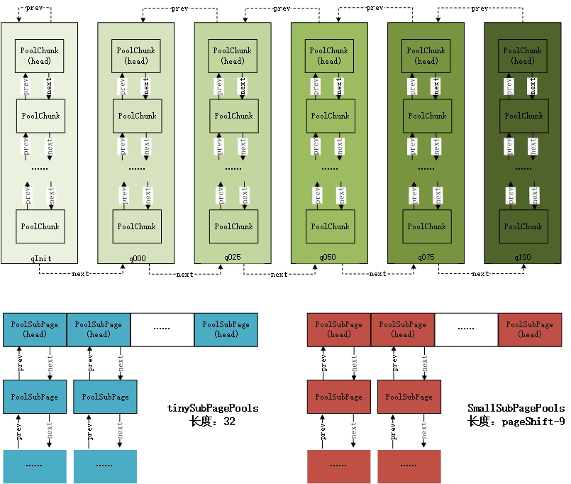
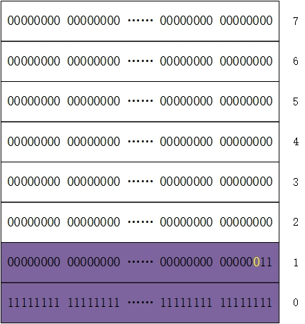

# Netty 之 tiny 和 small 内存分配详解

## 一、前言

上一节中分析了如何在 PoolChunk 中分配一块大于等于 PoolSubpage 的内存，但在实际应用中，存在很多分配小内存的情况，如果也占用一个 PoolSubpage 的大小，明显很浪费。针对这种情况， Netty 把 PoolChunk 中的一个 PoolSubpage 节点 8KB 内存划分成更小的内存段，通过对每个内存段的标记与清理标记进行内存的分配与释放。

## 二、分配 tiny/small 内存过程

### 1.PoolArena 数据结构

<div align="center">
    
</div>

在上图 PoolArena 的主要数据结构中， tinySubpagePools 用来分配 tiny 类型内存，smallSubpagePools 用来分配 small 类型的内存。在分配内存时，首先会对申请的内存大小 reqCapacity 进行规整化为 normCapacity，比如当 reqCapacity < 512byte 时，会将 reqCapacity 规整化为 16 的倍数，比如 25byte 规整华为 32byte， 40byte 规整化为 48byte；当 512byte <= reqCapacity < 8KB 时，会将 reqCapacity 规范化为大于 reqCapacity 的最近的 2 的指数次的值，其实也就是 512byte、 1024byte、 2048byte、 4096byte 这四个值。

**<font color="red">为了保持 PoolSubpage 中内存的连续性，避免内存碎片，并方便根据内存偏移量进行定位，每个页面内分配的内存段应该具有统一的规格 (PoolSubpage 中的 elemSize)。因此， PoolArena 把相同 elemSize 的 PoolSubpage 组成一个链表，放入数组中。由于 PoolSubpage 最小的内存段被限定为 16byte，所以 tinySubpages 共占据 512/16=32 个数组位置。</font>**

举例来说， tinySubpagePools[1] 中链表所包含的 PoolSubpage 的 elemSize 全部为 16byte，那么当我们需要分配的内存大小为 16byte 时，会从这个链表中取出一个 PoolSubpage 进行内存的分配。tinySubpagePools[2] 中链表所包含的 PoolSubpage 的 elemSize 全部为 32byte，当我们需要分配的内存大小为 32byte 时，就会从这个链表中进行申请。依次类推， tinySubpagePools 中各元素代表的 PoolSubpage 链表中 elemSize 的大小为：0, 16byte, 32byte, 48byte, ……, 496byte。这里需要注意的是，数组中的 head 节点本身不能用来分配内存，当 head 节点的 next 指针指向 head 节点本身时，表明这个链表为空（只有 head 节点）。

smallSubpagePools 则在 512byte 的基础上依次翻倍，直到 4KB 大小，所以 smallsubpages 默认共有 4 个数组元素，依次代表 elemSize 大小为 512byte，1KB，2KB，4KB。分配 tiny/small 类型的内存的入口也是 PoolArena 中的 allocate 方法：

```java{.line-numbers}
//class:PoolArena
private void allocate(PoolThreadCache cache, PooledByteBuf<T> buf, final int reqCapacity) {
    // 将 reqCapacity 规整化为 normCapacity，就是说只能申请某些固定大小的内存
    // tiny 范围的是 16byte 倍数的内存，Small 范围的为 512byte、1kb、2kb、4kb 的内存，Normal 的为 8kb、16kb … 16mb，huge 范围的申请多少分配多少
    final int normCapacity = normalizeCapacity(reqCapacity);
    // 如果 normCapacity 的大小小于 8kb，则为 Tiny 或者 Small 范围的
    if (isTinyOrSmall(normCapacity)) { // capacity < pageSize
        int tableIdx;
        PoolSubpage<T>[] table;
        boolean tiny = isTiny(normCapacity);
        // 继续细分为 tiny 或者 small
        if (tiny) { // < 512byte
            // 首先尝试使用缓存来进行分配，如果分配成功则返回，否则尝试使用 tinySubpagePools 进行分配内存
            if (cache.allocateTiny(this, buf, reqCapacity, normCapacity)) {
                return;
            }
            // 计算出该内存在 tinySubPagePools 中对应的下标，从而可以获取对应的 head
            tableIdx = tinyIdx(normCapacity);
            table = tinySubpagePools;
        } else {
            if (cache.allocateSmall(this, buf, reqCapacity, normCapacity)) {
                return;
            }
            tableIdx = smallIdx(normCapacity);
            table = smallSubpagePools;
        }

        // 获取到对应的 head
        final PoolSubpage<T> head = table[tableIdx];

        synchronized (head) {
            final PoolSubpage<T> s = head.next;
            if (s != head) {
                assert s.doNotDestroy && s.elemSize == normCapacity;
                // 直接从 PoolSubpage 中进行分配
                long handle = s.allocate();
                assert handle >= 0;
                s.chunk.initBufWithSubpage(buf, handle, reqCapacity);
                incTinySmallAllocation(tiny);
                return;
            }
        }
        synchronized (this) {
            allocateNormal(buf, reqCapacity, normCapacity);
        }

        incTinySmallAllocation(tiny);
        return;
    }
    if (normCapacity <= chunkSize) {
        // 省略代码
    } else {
        // 省略代码
    }
} 
```

根据 allocate 方法的代码，我们以 **初次分配 tiny 类型内存** 的流程为例，首先会调用 allocateTiny 方法去从缓存中分配内存，如果申请失败，则会尝试从 tinySubpagePools 数组中选取一个 PoolSubpage 来进行分配。如果没有，则同样调用 allocateNormal 来从内存池中进行分配或者创建一个 PoolChunk 分配一个 PoolSubpage，然后把这个 PoolSubpage 加入到 tinySubpagePools 数组中。

我们假设缓存申请内存失败，则首先调用 tinyIdx 来对页面进行定位，也就是根据请求内存的大小在 tinySubpagePools 数组中定位。页面定位主要解决的是根据请求内存的大小，如何选择合适的 PoolSubpage 来进行分配的问题，tinyIdx 代码如下：

```java{.line-numbers}
static int tinyIdx(int normCapacity) {
    return normCapacity >>> 4;
} 
```

我们已经知道，tinySubpagePools 管理的内存段自 0 开始，以 16byte 依次递增自 496byte，共映射到 32 个数组元素中，所以按照请求内存的大小除以 16 即可完成定位。定位完成之后就是获取对应 PoolSubpage 链表的 head，假如此链表不为空的话，选取一个 PoolSubpage，然后进行内存分配。但是这里由于是初次分配，因此 PoolSubpage 链表为空（head 的 next 指针指向 head 本身），调用 allocateNormal 时，由于同样的原因，PoolChunkList 也为空，最后会调用到 PoolChunk 中的 allocateSubpage 方法：

```java{.line-numbers}
//class:PoolChunk
// 当需要分配的内存小于 SubPoolSize（8K）的大小时，调用 allocateSubpage 进行分配。
private long allocateSubpage(int normCapacity) {
    PoolSubpage<T> head = arena.findSubpagePoolHead(normCapacity);
    synchronized (head) {
        // allocateNode 负责在二叉树中找到匹配的节点，和 poolChunk 不同的是，只匹配叶子节点；
        // 这是因为所需要分配的内存大小小于 pageSize，因此只需要分配一个单独的 PoolSubPage 就行
        int d = maxOrder; 
        int id = allocateNode(d);
        if (id < 0) {
            return id;
        }
        // 在 PoolChunk 中，维护了一个大小为 2048 的 poolSubpage 类型数组，分别对应二叉树中 2048 个叶子节点
        final PoolSubpage<T>[] subpages = this.subpages;
        final int pageSize = this.pageSize;
        // 更新当前 chunk 的剩余内存大小，本次申请的是一个 page，所以减去 pageSize
        freeBytes -= pageSize;
        
        // 由于 memoryMap 中保存了 4096 个节点，因此叶子节点在 memoryMap 中的下标是：2048 、2049 、.....、4095 ，也就是 id 的范围为
        // [2048, 4095]，但是 PoolChunk 中的 PoolSubPage 数组只保存了完全二叉树中的叶子结点，因此大小为 2048 。如果我们获取到的
        // id 为 2048 ，也就是第一个叶子节点，那么 subpageIdx 为 2048 % 2048 = 0 ，subpageIdx 为 0 。而 subpageIdx 的代码如下：
        // private int subpageIdx(int memoryMapIdx) {
        // return memoryMapIdx ^ maxSubpageAllocs; // return memoryMapIdx % 2048;
        // }
        // maxSubpageAllocs 的值为 2048
        int subpageIdx = subpageIdx(id);
        PoolSubpage<T> subpage = subpages[subpageIdx];
        if (subpage == null) {
            // 如果 subpage 为空，则创建一个 PoolSubpage 对象（构造函数中也会进行 init 操作），并加入到 poolSubpage 数组；
            subpage = new PoolSubpage<T>(head, this, id, runOffset(id), pageSize, normCapacity);
            subpages[subpageIdx] = subpage;
        } else {
            subpage.init(head, normCapacity);
        }
        return subpage.allocate();
    }
} 
```

首先根据在 PoolArena 中找到 normCapacity 大小的内存空间应该在 arena 维持的 tinySubpagePools 列表中的那一个节点上分配，然后以 d = maxorder, 在 PoolChunk 的完全二叉树中，寻找一个空闲的叶子节点，用于此次的内存分配。在 PoolChunk 找到一个空闲的叶子节点时，首先调用 subpageIdx，计算该叶子节点在 PoolChunk 完全二叉树最底层的相对位置。如果 subpages 当前位置没有记录，则调用构造函数生成一个新的 PoolSubpage 对象，否则直接初始化当前 PoolSubpage 对象，并插入 head 的后。

PoolSubpage 的构造函数如下：

```java{.line-numbers}
//class:PoolSubpage
PoolSubpage(PoolSubpage<T> head, PoolChunk<T> chunk, int memoryMapIdx, int runOffset, int pageSize, int elemSize) {
    // 表示当前PoolSubpage属于哪一个PoolChunk
    this.chunk = chunk;
    // memoryMapIdx 表示当前的 PoolSubpage 在 PoolChunk 中的 memoryMap 数组的 id
    this.memoryMapIdx = memoryMapIdx;
    this.runOffset = runOffset;
    this.pageSize = pageSize;
    // pageSize 大小默认为 8K，bitmap 默认初始化大小为 8 的 long 数组。这是因为分配的内存大小都是处理过的，分配内存最小为 16 个字节，
    // 因此最多可能会有 8192/16 = 512 个内存段，一个 long 有 64 位，因此需要 8 个 long 就可以描述所有内存段的分配情况
    bitmap = new long[pageSize >>> 10]; // pageSize / 16 / 64
    // 初始化PoolSubpage中的一些参数
    init(head, elemSize);
} 
```

在构造函数的末尾调用了 init 方法，在 init 方法中，根据当前需要分配的内存大小，确定需要多少个 bitmap 元素：

```java{.line-numbers}
//class:PoolSubpage
void init(PoolSubpage<T> head, int elemSize) {
    doNotDestroy = true;
    // elemSize为需要分配的内存大小
    this.elemSize = elemSize;
    if (elemSize != 0) {
        // maxNumElems为该page包含的段的数量，numAvail为可用的段的数量，在初始化的时候，这两个是相同的。
        maxNumElems = numAvail = pageSize / elemSize;
        nextAvail = 0;
        // bitmapLength = maxNumElems / 64
        bitmapLength = maxNumElems >>> 6;
        // maxNumElems % 64
        if ((maxNumElems & 63) != 0) {
            bitmapLength ++;
        }

        for (int i = 0; i < bitmapLength; i ++) {
            bitmap[i] = 0;
        }
    }
    addToPool(head);
} 
```

下面通过分布申请 4096 和 32 大小的内存，说明如何确定 bitmapLength（也就是实际用到的 bitmap 长度）的值：

1. 比如，当前申请大小 4096 的内存，maxNumElems 和 numAvail 为 2，说明一个 page 被拆分成 2 个内存段，2 >>> 6 = 0 ，且 2 & 63 ！= 0 ，所以 bitmapLength 为 1，说明只需要一个 long 就可以描述 2 个内存段状态。
2. 如果当前申请大小 32 的内存，maxNumElems 和 numAvail 为 256，说明一个 page 被拆分成 256 个内存段，256>>> 6 = 4，说明需要 4 个 long 描述 256 个内存段状态。

而在初始化完此 PoolSubpage 之后就会调用 addToPool 方法，把这个从 PoolChunk 中新申请到的 PoolSubpage 放到 tinySubpagePools 中。代码如下：

```java{.line-numbers}
private void addToPool(PoolSubpage<T> head) {
    assert prev == null && next == null;
    prev = head;
    next = head.next;
    next.prev = this;
    head.next = this;
} 
```

接下来，我们回到 PoolChunk 中的 allocateSubpage 方法，subpage.allocate() 执行了具体的分配逻辑：

```java{.line-numbers}
//class:PoolSubpage
//返回的是申请到的可用内存段在bitmap数组中对应bit的index
long allocate() {
    if (elemSize == 0) {
        return toHandle(0);
    }

    if (numAvail == 0 || !doNotDestroy) {
        return -1;
    }

    // 获取下一个可用内存段的位置，bitmapIdx区间为[0, maxNumElems - 1]，比如申请大小32的内存，maxNumElems为256，
    // 则bitmapIdx区间为[0, 255]
    final int bitmapIdx = getNextAvail();
    // bitmapIdx / 64，得到的是该内存段地址对应的bitmap数组中下标，即第几个long
    int q = bitmapIdx >>> 6;
    // bitmapIdx % 64，得到的是该内存段地址位于long数中第几个bit
    int r = bitmapIdx & 63;
    assert (bitmap[q] >>> r & 1) == 0;
    // 将该bit置为已使用
    bitmap[q] |= 1L << r;
    // 将可用的内存块总数减1
    if (-- numAvail == 0) {
        removeFromPool();
    }

    return toHandle(bitmapIdx);
} 
```

PoolSubPage 分配内存段的过程就是在位图中找到第一个未被使用的内存段，返回一个描述其内存位置偏移量的整数句柄，用于定位。

```java{.line-numbers}
//class:PoolSubpage
//如果 nextAvail 大于等于0，说明 nextAvail 指向了下一个可分配的内存段，直接返回nextAvail值；
// 每次分配完成，nextAvail 被置为 -1，这时只能通过方法 findNextAvail 重新计算出下一个可分配的内存段位置
private int getNextAvail() {
    int nextAvail = this.nextAvail;
    if (nextAvail >= 0) {
        this.nextAvail = -1;
        return nextAvail;
    }
    return findNextAvail();
}

//class:PoolSubpage
private int findNextAvail() {
    final long[] bitmap = this.bitmap;
    final int bitmapLength = this.bitmapLength;
    // bitmapLength使得我们可以从实际使用到的标志位中查找
    for (int i = 0; i < bitmapLength; i ++) {
        long bits = bitmap[i];
        // ~bits != 0表示bits不全为1，即还有空余的内存空间
        if (~bits != 0) {
            return findNextAvail0(i, bits);
        }
    }
    return -1;
}

//class:PoolSubpage
private int findNextAvail0(int i, long bits) {
    final int maxNumElems = this.maxNumElems;
    // 64: 100 0000
    // 63: 011 1111
    // 这里的i表示是bitmap中第i个long数，如果i = 1，则baseVal = 64; i = 2, baseVal = 128
    final int baseVal = i << 6;
    // 判断第 i 个 long 数中的每一位是否可用，bits & 1 == 0 表明 bits 的第 j 位为 0，还可以进行分配，
    // 因此 baseVal 加上 j，则 val 为下一个可以进行分配的内存段的位置
    for (int j = 0; j < 64; j ++) {
        if ((bits & 1) == 0) {
            // val = baseVal + j
            int val = baseVal | j;
            if (val < maxNumElems) {
                return val;
            } else {
                break;
            }
        }
        bits >>>= 1;
    }
    return -1;
} 
```

算法首先在位图数组 bitmap 中开始遍历，如果当前数组元素表示的内存空间上有空闲内存段 ( 即数组元素的二进制位上有 0)，则进一步在此数组元素中查找空闲内存段在二进制位上的位置。通过在二进制位上循环移位遍历，访问到 0 则构造内存偏移量并返回。整形的内存偏移量，低 6 位用来表示空闲内存在 long 型元素的二进制位表示中占据的位置，高位用来记录该数组元素的下标，也就是元素位于数组中的第几个 long 数上。

以下图的 bitmap 为例，算法首先在 bitmap[0] 上没有发现空闲内存，则进一步访问 bitmap[1]。为了找到空闲内存在 bitmap[1] 中的位置，依次遍历，最终在位置 2（j=2）上 找到目标内存。构建位图索引，baseVal = 1 << 6, val = baseVal | j = 01000010：

<div align="center">
    
</div>

## 三、总结

分配 tiny/small 类型的内存，也就是小于 pageSize 大小的内存，分配的入口也在 PoolArena 类中的 allocate 方法，首先会尝试从缓存中去申请内存，如果申请失败，则从 PoolArena 中的 tinySubpagePools 或者 smallSubpagePools 数组中去分配，如果分配失败，则调用 allocateNormal 方法。在 allocateNormal 方法中，首先会尝试从内存池中 6 种类型的 PoolChunkList 申请内存（也就是申请一个 PoolSubpage），申请成功的话，会将这个 PoolSubpage 加入到 tinySubpagePools 或者 smallSubpagePools 数组中的链表中去。如果申请失败，则重新创建一个 PoolChunk，并且从这个 PoolChunk 申请一个 PoolSubpage，也会把这个 PoolSubpage 加入到数组中。