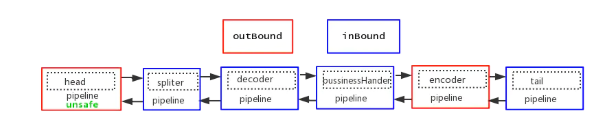

# Netty 之 writeAndFlush 解析

本文分以下几个部分阐述一个 java 对象最后是如何转变成字节流，写到 socket 缓冲区中去的：

1. pipeline 中的标准链表结构
2. java 对象编码过程
3. write：写队列
4. flush：刷新写队列
5. writeAndFlush: 写队列并刷新

## 一、pipeline 中的标准链表结构

一个标准的 pipeline 链式结构如下( 我们省去了异常处理 Handler)：

<div align="center">
    
</div>

数据从 head 节点流入，先拆包，然后解码成业务对象，最后经过业务 Handler 处理，调用 write，将结果对象写出去。而写的过程先通过 tail 节点，然后通过 encoder 节点将对象编码成 ByteBuf，最后将该 ByteBuf 对象传递到 head 节点，调用底层的 Unsafe 写到 jdk 底层管道。

## 二、Java 对象的编码过程

为什么我们在 pipeline 中添加了 encoder 节点，java 对象就转换成 netty 可以处理的 ByteBuf，写到管道里？我们先看下调用 write 的 code：

```java{.line-numbers}
// class:BusinessHandler
protected void channelRead0(ChannelHandlerContext ctx, Request request) throws Exception {
    Response response = doBusiness(request);
    
    if (response != null) {
        ctx.channel().write(response);
    }
} 
```

业务处理器接受到请求之后，做一些业务处理，返回一个 Response，然后，response 在 pipeline 中传递，落到 Encoder 节点，下面是 Encoder 的处理流程：

```java{.line-numbers}
// class:Encoder
public class Encoder extends MessageToByteEncoder<Response> {
    @Override
    protected void encode(ChannelHandlerContext ctx, Response response, ByteBuf out) throws Exception {
        out.writeByte(response.getVersion());
        out.writeInt(4 + response.getData().length);
        out.writeBytes(response.getData());
    }
} 
```

Encoder 的处理流程很简单，按照简单自定义协议，将 java 对象 Response 写到传入的参数 out 中，这个 out 到底是什么？为了回答这个问题，我们需要了解到 Response 对象，从 BusinessHandler 传入到 MessageToByteEncoder 的时候，首先是传入到 write 方法：

```java{.line-numbers}
public void write(ChannelHandlerContext ctx, Object msg, ChannelPromise promise) throws Exception {
    ByteBuf buf = null;
    try {
        // 判断MessageToByteEncoder能不能处理msg对象，如果不能进行处理，则继续在pipeline中向前进行传播
        if (acceptOutboundMessage(msg)) {
            @SuppressWarnings("unchecked")
            I cast = (I) msg;
            // 内存分配，创建一个ByteBuf对象
            buf = allocateBuffer(ctx, cast, preferDirect);
            try {
                // encode方法是一个抽象方法，encode的具体实现交由子类来完成
                // 根据自定的逻辑，将cast对象编码为字节流，并且写入到buf中
                encode(ctx, cast, buf);
            } finally {
                // 既然自定义java对象转换成ByteBuf了，那么这个对象就已经无用了，释放掉
                // (当传入的msg类型是ByteBuf的时候，就不需要自己手动释放了)
                ReferenceCountUtil.release(cast);
            }
    
            if (buf.isReadable()) {
                // 如果buf中有数据，则把它在pipeline中向前继续传递
                ctx.write(buf, promise);
            } else {
                // 如果buf中没有数据，则将空数据传到下一个节点
                buf.release();
                ctx.write(Unpooled.EMPTY_BUFFER, promise);
            }
            buf = null;
        } else {
            // 如果当前节点不能处理传入的对象，直接扔给下一个节点处理
            ctx.write(msg, promise);
        }
    } catch (EncoderException e) {
        throw e;
    } catch (Throwable e) {
        throw new EncoderException(e);
    } finally {
        if (buf != null) {
            // 释放掉buf
            buf.release();
        }
    }
}
```

其实，这一小节的内容，在前面的博文中，已经提到过，这里，我们详细阐述一下 MessageToByteEncoder 是如何处理传入的 java 对象的：

1. 判断当前 Handler 是否能处理写入的消息，如果能处理，进入下面的流程，否则，直接扔给下一个节点处理
2. 将对象强制转换成 Encoder 可以处理的 Response 对象
3. 分配一个 ByteBuf
4. 调用 encoder，即进入到 Encoder 的 encode 方法，该方法是用户代码，用户将数据写入 ByteBuf
5. 既然自定义 java 对象转换成 ByteBuf 了，那么这个对象就已经无用了，释放掉，( 当传入的 msg 类型是 ByteBuf 的时候，就不需要自己手动释放了)
6. 如果 buf 中写入了数据，就把 buf 传到下一个节点，否则，释放 buf，将空数据传到下一个节点
7. 最后，当 buf 在 pipeline 中处理完之后，释放节点

总结一点就是，Encoder 节点分配一个 ByteBuf，调用 encode 方法，将 java 对象根据自定义协议写入到 ByteBuf，然后再把 ByteBuf 传入到下一个节点，在我们的例子中，最终会传入到 head 节点。

```java{.line-numbers}
//class:DefaultChannelPipeline$HeadContext
public void write(ChannelHandlerContext ctx, Object msg, ChannelPromise promise) throws Exception {
    unsafe.write(msg, promise);
} 
```

这里的 msg 就是前面在 Encoder 节点中，载有 java 对象数据的自定义 ByteBuf 对象。

## 三、Write：写队列

```java{.line-numbers}
// write-写buffer队列
// class:AbstractChannel
public final void write(Object msg, ChannelPromise promise) {
    assertEventLoop();

    ChannelOutboundBuffer outboundBuffer = this.outboundBuffer;
    if (outboundBuffer == null) {
        safeSetFailure(promise, WRITE_CLOSED_CHANNEL_EXCEPTION);
        ReferenceCountUtil.release(msg);
        return;
    }

    int size;
    try {
        // 将待写入的对象过滤，如果msg是非堆外内存，则转化为堆外内存
        msg = filterOutboundMessage(msg);
        // 估算出需要写入的ByteBuf的size
        size = pipeline.estimatorHandle().size(msg);
        if (size < 0) {
            size = 0;
        }
    } catch (Throwable t) {
        safeSetFailure(promise, t);
        ReferenceCountUtil.release(msg);
        return;
    }
    // 将这个ByteBuf封装成一个Entry，然后将其插入到写队列中，并且设置写状态
    outboundBuffer.addMessage(msg, size, promise);
} 
```

1. 首先，调用 assertEventLoop 确保该方法的调用是在 reactor 线程中
2. 然后，调用 filterOutboundMessage() 方法，将待写入的对象过滤，把所有的非直接内存转换成直接内存 DirectBuffer

```java{.line-numbers}
// 如果msg是ByteBuf类型的话，若msg是direct类型的话，直接返回；若msg不是direct类型的话，
// 就把它转化成一个direct类型的ByteBuf
protected final Object filterOutboundMessage(Object msg) {
    if (msg instanceof ByteBuf) {
        ByteBuf buf = (ByteBuf) msg;
        if (buf.isDirect()) {
            return msg;
        }
        // 将buf转化为direct类型的ByteBuf
        return newDirectBuffer(buf);
    }
    if (msg instanceof FileRegion) {
        return msg;
    }
    throw new UnsupportedOperationException(
            "unsupported message type: " + StringUtil.simpleClassName(msg) + EXPECTED_TYPES);
} 
```

3. 接下来，估算出需要写入的 ByteBuf 的 size
4. 最后，调用 ChannelOutboundBuffer 的 addMessage(msg, size, promise) 方法，所以，接下来，我们需要重点看一下这个方法干了什么事情：

```java{.line-numbers}
public void addMessage(Object msg, int size, ChannelPromise promise) { 
    // 创建出一个待写出的消息节点
    Entry entry = Entry.newInstance(msg, size, total(msg), promise);
    if (tailEntry == null) {
        flushedEntry = null;
        tailEntry = entry;
    } else {
        Entry tail = tailEntry;
        tail.next = entry;
        tailEntry = entry;
    }
    if (unflushedEntry == null) {
        unflushedEntry = entry;
    }
    // 增加写缓冲区中的字节数，并且设置写状态位
    incrementPendingOutboundBytes(entry.pendingSize, false);
} 
```

想要理解上面这段代码，必须得掌握写缓存中的几个消息指针：

```java{.line-numbers}
// Entry(flushedEntry) --> ... Entry(unflushedEntry) --> ... Entry(tailEntry)
// flushedEntry指针表示第一个被写到操作系统socket缓冲区中的节点
private Entry flushedEntry;
// unflushedEntry指针表示第一个未被写入到操作系统socket缓冲区中的节点
private Entry unflushedEntry;
// tailEntry指针表示ChannelOutboundBuffer缓冲区中的最后一个节点
private Entry tailEntry;
// The number of flushed entries that are not written yet
private int flushed; 
```

<div align="center">
    
</div>

ChannelOutboundBuffer 里面的数据结构是一个单链表结构，每个节点是一个 Entry，Entry 里面包含了待写出 ByteBuf 以及消息回调 promise，下面分别是三个指针的作用

- flushedEntry 指针表示第一个被写到操作系统 Socket 缓冲区中的节点
- unFlushedEntry 指针表示第一个未被写入到操作系统 Socket 缓冲区中的节点
- tailEntry 指针表示 ChannelOutboundBuffer 缓冲区的最后一个节点

初次调用 addMessage 之后，各个指针的情况为：

<div align="center">
    
</div>

fushedEntry 指向空，unFushedEntry 和 tailEntry 都指向新加入的节点。第二次调用 addMessage 之后，各个指针的情况为：

<div align="center">
    
</div>

第 n 次调用 addMessage 之后，各个指针的情况为：

<div align="center">
    
</div>

可以看到，调用 n 次 addMessage，flushedEntry 指针一直指向 NULL，表示现在还未有节点需要写出到 Socket 缓冲区，而 unFushedEntry 之后有 n 个节点，表示当前还有 n 个节点尚未写出到 Socket 缓冲区中去。接下来，回到 ChannelOutboundBuffer 类中的 addMessage 方法，除了创建一个 Entry 节点，并且把它加入到链表结构中，**`incrementPendingOutboundBytes(entry.pendingSize, false)`** 还会设置写状态，其代码如下：

```java{.line-numbers}
private void incrementPendingOutboundBytes(long size, boolean invokeLater) {
    if (size == 0) {
        return;
    }
    // 将新的entry中的字节数加到TOTAL_PENDING_SIZE上，并且设置写状态标志位，
    // 表示是否允许继续往这个channel对应的写缓冲区中进行写操作。其中getWriteBufferHighWaterMark返回64 * 1024，
    // 也就是64K，如果newWriteBufferSize大于64K，则不允许继续往缓冲区中写入字节
    long newWriteBufferSize = TOTAL_PENDING_SIZE_UPDATER.addAndGet(this, size);
    if (newWriteBufferSize > channel.config().getWriteBufferHighWaterMark()) {
        setUnwritable(invokeLater);
    }
}
// 设置写状态位
private void setUnwritable(boolean invokeLater) {
    for (;;) {
        final int oldValue = unwritable;
        final int newValue = oldValue | 1;
        if (UNWRITABLE_UPDATER.compareAndSet(this, oldValue, newValue)) {
            if (oldValue == 0 && newValue != 0) {
                fireChannelWritabilityChanged(invokeLater);
            }
            break;
        }
    }
}
```

## 四、flush：刷新写队列

不管调用 channel.flush()，还是 ctx.flush()，最终都会落地到 pipeline 中的 head 节点：

```java{.line-numbers}
@Override
public void flush(ChannelHandlerContext ctx) throws Exception {
    unsafe.flush();
} 
```

之后进入到 AbstractUnsafe：

```java{.line-numbers}
public final void flush() {
   assertEventLoop();

   ChannelOutboundBuffer outboundBuffer = this.outboundBuffer;
   if (outboundBuffer == null) {
       return;
   }

   outboundBuffer.addFlush();
   flush0();
} 
```

flush 方法中，先调用 ChannelOutboundBuffer 中的 addFlush 方法：

```java{.line-numbers}
public void addFlush() {
    Entry entry = unflushedEntry;
    // 首先拿到 unflushedEntry 指针，然后将 flushedEntry 指向unflushedEntry所指向的节点
    if (entry != null) {
        if (flushedEntry == null) {
            flushedEntry = entry;
        }
        do {
            flushed ++;
            if (!entry.promise.setUncancellable()) {
                int pending = entry.cancel();
                // 减少此channel对应的写缓冲区中可写的字节数，并且如果可写的字节数小于32K,
                // 设置写状态为可写
                decrementPendingOutboundBytes(pending, false, true);
            }
            entry = entry.next;
        } while (entry != null);
    
        unflushedEntry = null;
    }
}
```

可以结合前面的图来看，首先拿到 unflushedEntry 指针，然后将 flushedEntry 指向 unflushedEntry 所指向的节点，调用完毕之后，三个指针的情况如下所示：

<div align="center">
    
</div>

decrementPendingOutboundBytes 的代码如下：

```java{.line-numbers}
private void decrementPendingOutboundBytes(long size, boolean invokeLater, boolean notifyWritability) {
    if (size == 0) {
        return;
    }
    long newWriteBufferSize = TOTAL_PENDING_SIZE_UPDATER.addAndGet(this, -size);
    if (notifyWritability && newWriteBufferSize < channel.config().getWriteBufferLowWaterMark()) {
        setWritable(invokeLater);
    }
}
```

我们回到 AbstractUnsafe 函数中，接下来继续调用 flush0 方法：

```java{.line-numbers}
protected void flush0() {
    doWrite(outboundBuffer);
} 
```

发现这里的核心代码就一个 doWrite，继续跟到 AbstractNioByteChannel 中的 doWrite 方法：

```java{.line-numbers}
protected void doWrite(ChannelOutboundBuffer in) throws Exception {
    int writeSpinCount = -1;
    
    boolean setOpWrite = false;
    for (;;) {
        // 拿到第一个需要flush的节点，也就是flushedEntry.msg
        Object msg = in.current();
        if (msg == null) {
            // Wrote all messages.
            clearOpWrite();
            return;
        }
    
        if (msg instanceof ByteBuf) {
            // 强转为ByteBuf
            ByteBuf buf = (ByteBuf) msg;
            // 若发现没有数据可读，直接删除该节点
            int readableBytes = buf.readableBytes();
            if (readableBytes == 0) {
                in.remove();
                continue;
            }
    
            boolean done = false;
            long flushedAmount = 0;
            if (writeSpinCount == -1) {
                writeSpinCount = config().getWriteSpinCount();
            }
            // 自旋，将当前节点写出
            for (int i = writeSpinCount - 1; i >= 0; i --) {
                int localFlushedAmount = doWriteBytes(buf);
                // localFlushedAmount = 0 表示没有写出什么字节，所以跳出循环
                if (localFlushedAmount == 0) {
                    setOpWrite = true;
                    break;
                }
    
                flushedAmount += localFlushedAmount;
                if (!buf.isReadable()) {
                    done = true;
                    break;
                }
            }
    
            in.progress(flushedAmount);
            // 写完之后，将当前节点删除
            if (done) {
                in.remove();
            } else {
                break;
            }
        } else if (msg instanceof FileRegion) {
            // 省略代码
        } else {
            // Should not reach here.
            throw new Error();
        }
    }
    incompleteWrite(setOpWrite);
}
```

这里略微有点复杂，我们分析一下

1. 第一步，调用 current() 先拿到第一个需要 flush 的节点的数据

```java{.line-numbers}
public Object current() {
    Entry entry = flushedEntry;
    if (entry == null) {
        return null;
    }

    return entry.msg;
} 
```

2. 第二步, 拿到自旋锁的迭代次数。
3. 以自旋的方式调用 doWriteBytes 将 ByteBuf 写出到 jdk nio 的 Channel。
4. 删除节点，节点的数据已经写入完毕，接下来就需要删除该节点。

```java{.line-numbers}
public boolean remove() {
    Entry e = flushedEntry;
    Object msg = e.msg;

    ChannelPromise promise = e.promise;
    int size = e.pendingSize;

    removeEntry(e);

    if (!e.cancelled) {
        ReferenceCountUtil.safeRelease(msg);
        safeSuccess(promise);
    }

    // recycle the entry
    e.recycle();

    return true;
} 
```

首先拿到当前被 flush 掉的节点(flushedEntry 所指)，然后拿到该节点的回调对象 ChannelPromise, 调用 removeEntry() 方法移除该节点：

```java{.line-numbers}
private void removeEntry(Entry e) {
    if (-- flushed == 0) {
        flushedEntry = null;
        if (e == tailEntry) {
            tailEntry = null;
            unflushedEntry = null;
        }
    } else {
        flushedEntry = e.next;
    }
} 
```

这里的 remove 是逻辑移除，只是将 flushedEntry 指针移到下个节点，调用完毕之后。flushed 就是 addFlush 中进行累加得到的需要刷新到 channel 中的 Entry 数量。在节点图示如下：

<div align="center">
    
</div>

随后，释放该节点数据的内存，调用 safeSuccess 进行回调，用户代码可以在回调里面做一些记录。

## 五、总结

- pipeline 中的编码器原理是创建一个 ByteBuf, 将 java 对象转换为 ByteBuf，然后再把 ByteBuf 继续向前传递；
- **<font color="red">调用 write 方法并没有将数据写到 Socket 缓冲区中，而是写到了一个单向链表的数据结构中，flush 才是真正的写出</font>**；
- writeAndFlush 等价于先将数据写到 netty 的缓冲区，再将 netty 缓冲区中的数据写到 Socket 缓冲区中，写的过程与并发编程类似，用自旋锁保证写成功；
- **<font color="red">netty 中的缓冲区中的 ByteBuf 为 DirectByteBuf</font>**；