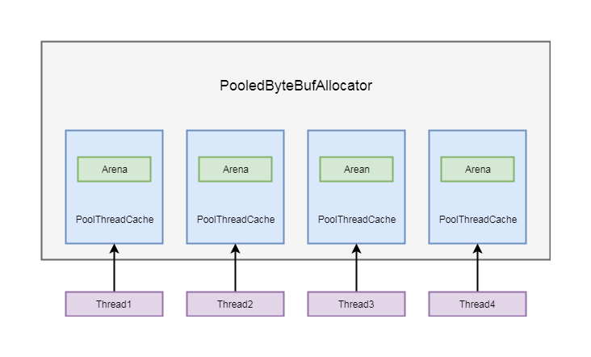
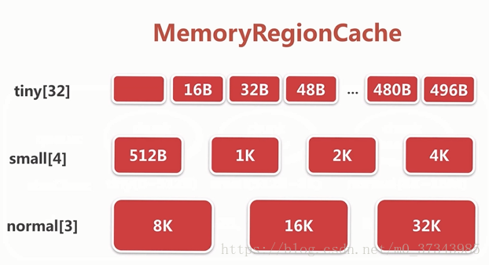
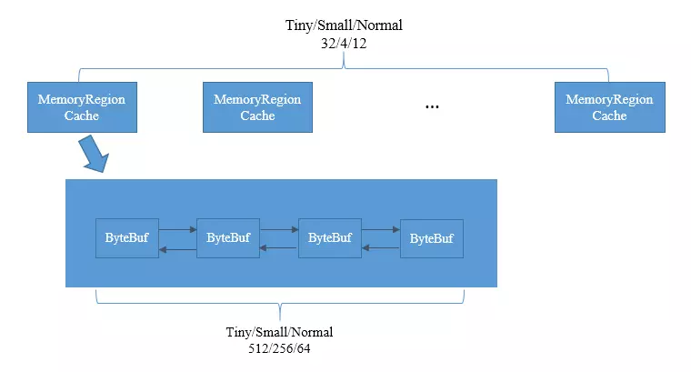

# Netty 之命中缓存分配

## 一、前言

在本篇文章中，将会介绍 Netty 如何使用缓存进行内存分配的以及 PooledByteBufAllocator 类。PooledByteBufAllocator 是通过自己取一块连续的内存进行 ByteBuf 的封装。

## 二、PooledByteBufAllocator

PooledByteBufAllocator 同样也重写了 AbstractByteBufAllocator 的 newDirectBuffer 和 newHeapBuffer 两个抽象方法，我们这一小节以 newDirectBuffer 为例，先简述一下其逻辑：

```java{.line-numbers}
//class:PooledByteBufAllocator
protected ByteBuf newDirectBuffer(int initialCapacity，int maxCapacity) {
    //拿到线程局部缓存PoolThreadCache
    PoolThreadCache cache = threadCache.get();
    PoolArena<ByteBuffer> directArena = cache.directArena;

    final ByteBuf buf;
    if (directArena != null) {
        buf = directArena.allocate(cache，initialCapacity，maxCapacity);
    } else {
        buf = PlatformDependent.hasUnsafe() ?
                UnsafeByteBufUtil.newUnsafeDirectByteBuf(this，initialCapacity，maxCapacity) :
                new UnpooledDirectByteBuf(this，initialCapacity，maxCapacity);
    }

    return toLeakAwareBuffer(buf);
} 
```

首先 PoolThreadCache cache = threadCache.get() 这一步使线程拿到一个缓存对象。threadCache 是 PooledByteBufAllocator 类的一个成员变量，类型是 PoolThreadLocalCache：

```java{.line-numbers}
private final PoolThreadLocalCache threadCache; 
```

我们接着看看 PoolThreadLocalCache 的定义：

```java{.line-numbers}
//class:PoolThreadLocalCache
protected synchronized PoolThreadCache initialValue() {
    final PoolArena<byte[]> heapArena = leastUsedArena(heapArenas);
    final PoolArena<ByteBuffer> directArena = leastUsedArena(directArenas);
    
    // useCacheForAllThreads是全局变量，是否全部线程都使用缓存，默认初始化为true
    // 或者线程类型是FastThreadLocalThread(即Netty的IO线程)的话，使用缓存
    if (useCacheForAllThreads || Thread.currentThread() instanceof FastThreadLocalThread) {
        return new PoolThreadCache(
                heapArena，directArena，tinyCacheSize，smallCacheSize，normalCacheSize,
                DEFAULT_MAX_CACHED_BUFFER_CAPACITY，DEFAULT_CACHE_TRIM_INTERVAL);
    }
    // 其它情况下不使用缓存
    return new PoolThreadCache(heapArena，directArena，0，0，0，0，0);
} 
```

这里继承了一个 FastThreadLocal 类，这个类相当于 jdk 的 ThreadLocal，只是性能更快。通过继承 FastThreadLocal 类并且重写了 initialValue 方法，则通过其 get 方法就能获得 initialValue 返回的对象。在这里我们看到，在重写的 initialValue 方法中，初始化了 heapArena 和 directArena 两个属性之后，通过 new PoolThreadCache() 这种方式创建了 PoolThreadCache 对象。

**<font color="red">这里注意，PoolThreadLocalCache 是一个 FastThreadLocal，而 PoolThreadCache 才是线程所需要获取的缓存</font>**，这两个类名非常非常像，千万别搞混了。

其中 heapArena 和 directArena 是分别是用来分配堆和堆外内存用的两个对象，以 directArena 为例，我们看到是通过 leastUsedArena(directArenas) 这种方式获得的，directArenas 是一个 directArena 类型的数组，leastUsedArena(directArenas) 这个方法是用来获取数组中一个使用最少的 directArena 对象，其中的 leastUsedArena() 方法，使得线程均等使用 PoolArena，代码如下：

```java{.line-numbers}
private <T> PoolArena<T> leastUsedArena(PoolArena<T>[] arenas) {
    if (arenas == null || arenas.length == 0) {
        return null;
    }
    
    // 寻找使用缓存最少的arena
    PoolArena<T> minArena = arenas[0];
    for (int i = 1; i < arenas.length; i++) {
        PoolArena<T> arena = arenas[i];
        if (arena.numThreadCaches.get() < minArena.numThreadCaches.get()) {
            minArena = arena;
        }
    }
    
    return minArena;
}
```

每次都寻找被最少线程使用的 PoolArena 分配新的线程，这样每个 PoolArena 都能均等分到线程数，从而平均 PoolArena 的负载。当线程生命周期结束时，调用 onRemoval() 方法进行一些清理操作。我们回到 initialValue 方法中，接着进入到 PoolThreadCache 方法：

```java{.line-numbers}
PoolThreadCache(PoolArena<byte[]> heapArena，PoolArena<ByteBuffer> directArena,
                    int tinyCacheSize，int smallCacheSize，int normalCacheSize,
                    int maxCachedBufferCapacity，int freeSweepAllocationThreshold) {
    // 省略代码
    this.heapArena = heapArena;
    this.directArena = directArena;
    // 省略代码
} 
```

这里省略了大段代码，**<font color="red">只需要关注这里将两个值保存在 PoolThreadCache 的成员变量中</font>**，接下来回到 newDirectBuffer 方法中，有如下代码：

```java{.line-numbers}
PoolArena<ByteBuffer> directArena = cache.directArena;
```

通过上面的分析，这步我们应该不陌生，在 PoolThreadCache 构造方法中将 directArena 和 heapArena 中保存在成员变量中，这样就可以直接通过 cache.directArena 这种方式拿到其成员变量的内容。从以上逻辑，我们可以大概的分析一下流程，在 PooledByteBufAllocator 构造函数中，通常会创建和线程数量相等的 PoolArena，并以数组的形式存储在 PooledByteBufAllocator 的成员变量 heapArenas 和 directArenas 中。每一个 PoolThreadCache 创建的时候，都会拿到一个 heapArena 和 DirectArena，并保存在自身的成员变量中：

<div align="center">
    
</div>

PoolThreadCache 除了维护 DirectArena 和 HeapArena 之外，还维护了一个缓存列表，我们在重复分配 ByteBuf 的时候，并不需要每次都通过 PoolArena 进行分配，可以直接从缓存列表中拿一个 ByteBuf。有关缓存列表，我们循序渐进的往下看，在 PooledByteBufAllocator 中维护了三个成员变量：

- tinyCacheSize：tinyCacheSize 代表 tiny 类型的 ByteBuf 能缓存多少个
- smallCacheSize：smallCacheSize 代表 small 类型的 ByteBuf 能缓存多少个
- normalCacheSize：normalCacheSize 代表 normal 类型的 ByteBuf 能缓存多少个

上面的三个值是在 PooledByteBufAllocator 的构造函数中被初始化的，初始化的参数的是 **`DEFAULT_TINY_CACHE_SIZE`** 和 **`DEFAULT_SMALL_CACHE_SIZE`** 和 **`DEFAULT_NORMAL_CACHE_SIZE`**，而这三个 DEFAULT 开头的参数在 static 块中初始化：

```java{.line-numbers}
static{
    DEFAULT_TINY_CACHE_SIZE = SystemPropertyUtil.getInt("io.netty.allocator.tinyCacheSize"，512);
    DEFAULT_SMALL_CACHE_SIZE = SystemPropertyUtil.getInt("io.netty.allocator.smallCacheSize"，256);
    DEFAULT_NORMAL_CACHE_SIZE = SystemPropertyUtil.getInt("io.netty.allocator.normalCacheSize"，64);
}
```

在这里我们看到，这三个属性分别初始化的大小是 512，256，64，这三个属性就对应了 PooledByteBufAllocator 另外的几个成员变量，tinyCacheSize，smallCacheSize，normalCacheSize。也就是说，tiny 类型的 ByteBuf 在每个缓存中默认缓存的数量是 512 个，small 类型的 ByteBuf 在每个缓存中默认缓存的数量是 256 个，normal 类型的 ByteBuf 在每个缓存中默认缓存的数量是 64 个。

在 PoolThreadLocalCache 的 initialValue 方法中，在调用 PoolThreadCache 的构造函数的时候，会传入 tinyCacheSize，smallCacheSize，normalCacheSize 这三个成员变量：

```java{.line-numbers}
//class:PoolThreadCache
PoolThreadCache(PoolArena<byte[]> heapArena，PoolArena<ByteBuffer> directArena,
                int tinyCacheSize，int smallCacheSize，int normalCacheSize,
                int maxCachedBufferCapacity，int freeSweepAllocationThreshold) {
    //代码省略
    this.freeSweepAllocationThreshold = freeSweepAllocationThreshold;
    this.heapArena = heapArena;
    this.directArena = directArena;
    if (directArena != null) {
        tinySubPageDirectCaches = createSubPageCaches(
                tinyCacheSize，PoolArena.numTinySubpagePools，SizeClass.Tiny);
        smallSubPageDirectCaches = createSubPageCaches(
                smallCacheSize，directArena.numSmallSubpagePools，SizeClass.Small);

        numShiftsNormalDirect = log2(directArena.pageSize);
        normalDirectCaches = createNormalCaches(
                normalCacheSize，maxCachedBufferCapacity，directArena);

        directArena.numThreadCaches.getAndIncrement();
    } else {
        //代码省略
    }
    //代码省略
    ThreadDeathWatcher.watch(thread，freeTask);
}
```

其中 tinySubPageDirectCaches，smallSubPageDirectCaches 和 normalDirectCaches 就代表了三种类型的缓存数组，数组元素是 MemoryRegionCache 类型的对象。**<font color="red">MemoryRegionCache 其内部是一个 ByteBuf 队列。每个节点是一个 ByteBuf 的说法并不准确，切确的说，是不再使用的 ByteBuf 待释放的内存空间，可以再次使用这部分空间构建 ByteBuf 对象（这句话相当关键！！！）</font>**。根据分配请求大小的不同，MemoryRegionCache 可以分为 Tiny，Small，Normal 三种。为了更方便的根据请求分配时的大小找到满足需求的缓存空间，每一种 MemoryRegionCache 又根据规范化后的大小依次组成数组，Tiny、Small、Normal 的数组大小依次为 32、4、3。

其中 ByteBuf 队列的长度是有限制的，Tiny、Small、Normal 依次为 512、256、64。为了更好的理解，举例子如下：

```java{.line-numbers}
16B  -- TinyCache[1]  -- (Buf512-...-Buf3-Buf2-Buf1)
32B  -- TinyCache[2]  -- ()
496B -- TinyCache[31] -- (Buf2-Buf1)
512B -- SmallCache[0] -- (Buf256-...-Buf3-Buf2-Buf1)
8KB  -- NormalCache[0] - (Buf64 -...-Buf3-Buf2-Buf1) 
```

以 tinySubPageDirectCaches 为例，我们看到 tiny 类型的缓存是通过 createSubPageCaches 这个方法创建的。**<font color="red">这里传入了三个参数 tinyCacheSize 我们之前分析过是 512，PoolArena.numTinySubpagePools 这里是 32( 这里不同类型的缓存大小不一样，small 类型是 4，normal 类型是 3)，SizeClass.Tiny 代表其类型是 tiny 类型</font>**。

我们跟到 createSubPageCaches 这个方法中:

```java{.line-numbers}
//class:PoolThreadCache$MemoryRegionCache<T>
private static <T> MemoryRegionCache<T>[] createSubPageCaches(
        int cacheSize，int numCaches，SizeClass sizeClass) {
    if (cacheSize > 0) {
        // 创建数组，长度为32
        @SuppressWarnings("unchecked")
        MemoryRegionCache<T>[] cache = new MemoryRegionCache[numCaches];
        for (int i = 0; i < cache.length; i++) {
            // 每一个节点是SubPageMemoryRegionCache对象，cacheSize对于tiny为512，small为256，normal为64
            cache[i] = new SubPageMemoryRegionCache<T>(cacheSize，sizeClass);
        }
        return cache;
    } else {
        return null;
    }
} 
```

这里首先创建了 MemoryRegionCache，长度是我们刚才分析过的 32。然后通过 for 循环，为数组赋值，赋值的对象是 SubPageMemoryRegionCache 类型的，SubPageMemoryRegionCache 就是 MemoryRegionCache 类型的子类，同样也是一种缓存对象，在这个对象中包含了一个队列，队列元素就是缓存的 ByteBuf。 构造方法中，cacheSize，就是队列中 ByteBuf 的数量，如果是 tiny 类型就是 512，sizeClass，代表其类，比如 tiny，small 或者 normal。

我们接着跟到 SubPageMemoryRegionCache 的构造方法：

```java{.line-numbers}
SubPageMemoryRegionCache(int size，SizeClass sizeClass) {
    super(size，sizeClass);
} 
```

这里调用父类的构造方法，我们继续跟进去：

```java{.line-numbers}
MemoryRegionCache(int size，SizeClass sizeClass) {
            this.size = MathUtil.safeFindNextPositivePowerOfTwo(size);
            queue = PlatformDependent.newFixedMpscQueue(this.size);
            this.sizeClass = sizeClass;
}
```

首先会对其进行规格化，其实就是寻找大于等于当前 size 的 2 的幂次方的数，这里如果是 512 那么规格化之后还是 512，然后初始化一个队列，队列大小就是传入的大小，如果是 tiny，这里大小就是 512。最后并保存其类型。这里我们不难看出，其实每个缓存的对象，里面都使用一个队列保存 ByteBuf。从上面剖析我们不难看出，PoolThreadCache 中维护了三种类型的缓存数组，每个缓存数组中的每个值中，又通过一个队列进行 ByteBuf 对象的存储。

这里使用了一个 MPSC（Multiple Producer Single Consumer）队列即多个生产者单一消费者队列，之所以使用这种类型的队列是因为：ByteBuf 的分配和释放可能在不同的线程中，这里的多生产者即多个不同的释放线程，这样才能保证多个释放线程同时释放 ByteBuf 时所占空间正确添加到队列中。

在 Netty 中，其内部结构如下面两张图所示：

<div align="center">
    
</div>

<div align="center">
    
</div>

## 三、命中缓存的分配

回顾上一小节的内容，我们讲到 PoolThreadCache 中维护了三个缓存数组( 实际上是六个，这里仅仅以 Direct 为例，heap 类型的逻辑是一样的): tinySubPageDirectCaches，smallSubPageDirectCaches，和 normalDirectCaches 分别代表 tiny 类型，small 类型和 normal 类型的缓存数组。这三个数组保存在 PoolThreadCache 的成员变量中：

```java{.line-numbers}
private final MemoryRegionCache<ByteBuffer>[] tinySubPageDirectCaches;
private final MemoryRegionCache<ByteBuffer>[] smallSubPageDirectCaches;
private final MemoryRegionCache<ByteBuffer>[] normalDirectCaches; 
```

这三个数组是在构造方法中进行了初始化：

```java{.line-numbers}
if (directArena != null) {
    tinySubPageDirectCaches = createSubPageCaches(
            tinyCacheSize, PoolArena.numTinySubpagePools, SizeClass.Tiny);
    smallSubPageDirectCaches = createSubPageCaches(
            smallCacheSize, directArena.numSmallSubpagePools, SizeClass.Small);
    
    numShiftsNormalDirect = log2(directArena.pageSize);
    normalDirectCaches = createNormalCaches(
            normalCacheSize, maxCachedBufferCapacity, directArena);
    
    directArena.numThreadCaches.getAndIncrement();
}

```

我们以 tiny 类型为例跟到 createSubPageCaches 方法中:

```java{.line-numbers}
private static <T> MemoryRegionCache<T>[] createSubPageCaches(
        int cacheSize, int numCaches, SizeClass sizeClass) {
    if (cacheSize > 0) {
        @SuppressWarnings("unchecked")
        MemoryRegionCache<T>[] cache = new MemoryRegionCache[numCaches];
        for (int i = 0; i < cache.length; i++) {
            cache[i] = new SubPageMemoryRegionCache<T>(cacheSize, sizeClass);
        }
        return cache;
    } else {
        return null;
    }
} 
```

这里上面的小节已经分析过，这里创建了一个缓存数组，这个缓存数组的长度，也就是 numCaches，在不同的类型，这个长度不一样，tiny 类型长度是 32，small 类型长度为 4，normal 类型长度为 3。我们知道，缓存数组中每个节点代表一个缓存对象，里面维护了一个队列，队列大小由 PooledByteBufAllocator 类中的 tinyCacheSize，smallCacheSize，normalCacheSize 属性决定的，这里之前小节已经剖析过。

其中每个缓存对象，队列中缓存的 ByteBuf 大小是固定的，netty 将每种缓冲区类型分成了不同长度规格，而每个缓存中的队列缓存的 ByteBuf 的长度，都是同一个规格的长度，而缓冲区数组的长度，就是规格的数量。

比如，在 tiny 类型中，netty 将其长度分成 32 个规格，每个规格都是 16 的整数倍，也就是包含 0B，16B，32B，48B，64B，80B，96B......496B 总共 32 种规格，而在其缓存数组 tinySubPageDirectCaches 中，这每一种规格代表数组中的一个缓存对象缓存的 ByteBuf 的大小，我们以 tinySubPageDirectCaches[1] 为例( 这里下标选择 1 是因为下标为 0 代表的规格是 0B，其实就代表一个空的缓存，这里不进行举例)，在 tinySubPageDirectCaches[1] 的缓存对象中所缓存的 ByteBuf 的缓冲区长度是 16B，在 tinySubPageDirectCaches[2] 中缓存的 ByteBuf 长度都为 32B，以此类推，tinySubPageDirectCaches[31] 中缓存的 ByteBuf 长度为 496B。

有关类型规则的分配如下：

- tiny: 总共 32 个规格, 均是 16 的整数倍, 0B, 16B, 32B, 48B, 64B, 80B, 96B......496B
- small:4 种规格, 512b, 1k, 2k, 4k
- nomal:3 种规格, 8k, 16k, 32k

大概了解缓存数组的数据结构, 我们再继续剖析在缓冲中分配内存的逻辑，回到 PoolArena 的 allocate 方法中:

```java{.line-numbers}
//class:PoolArena
private void allocate(PoolThreadCache cache, PooledByteBuf<T> buf, final int reqCapacity) {
    // 将reqCapacity进行规整化为normCapacity，就是说只能申请某些固定大小的内存
    // Tiny范围的是16byte倍数的内存，Small范围的为512byte、1kb、2kb、4kb 的内存，Normal的为8kb、16kb … 16mb，huge范围的申请多少分配多少
    final int normCapacity = normalizeCapacity(reqCapacity);
    // 如果normCapacity的大小小于8kb，则为Tiny或者Small范围的
    if (isTinyOrSmall(normCapacity)) { // capacity < pageSize
        int tableIdx;
        PoolSubpage<T>[] table;
        boolean tiny = isTiny(normCapacity);
        // 继续细分为tiny或者small
        if (tiny) { // < 512byte
            // 首先尝试使用缓存来进行分配，如果分配成功则返回，否则尝试使用tinySubpagePools进行分配内存
            if (cache.allocateTiny(this, buf, reqCapacity, normCapacity)) {
                return;
            }
            // 计算出该内存在 tinySubPagePools 中对应的下标，从而可以获取对应的head
            tableIdx = tinyIdx(normCapacity);
            table = tinySubpagePools;
        } else {
            if (cache.allocateSmall(this, buf, reqCapacity, normCapacity)) {
                return;
            }
            tableIdx = smallIdx(normCapacity);
            table = smallSubpagePools;
        }

        // 省略代码
    }
} 
```

从上面的代码中可以看出，如果是 tiny 类型的内存，则通过 cache.allocateTiny(this，buf，reqCapacity，normCapacity) 在缓存上进行分配，我们就以 tiny 类型为例，分析在缓存上分配 ByteBuf 的流程，allocateTiny 是缓存分配的入口：

```java{.line-numbers}
boolean allocateTiny(PoolArena<?> area, PooledByteBuf<?> buf, int reqCapacity, int normCapacity) {
    return allocate(cacheForTiny(area, normCapacity), buf, reqCapacity);
} 
```

这里有个方法 cacheForTiny(area, normCapacity), 这个方法的作用是根据 normCapacity 找到 tiny 类型缓存数组中的一个缓存对象，我们跟进 cacheForTiny:

```java{.line-numbers}
private MemoryRegionCache<?> cacheForTiny(PoolArena<?> area, int normCapacity) { 
    int idx = PoolArena.tinyIdx(normCapacity);
    if (area.isDirect()) {
        return cache(tinySubPageDirectCaches, idx);
    }
    return cache(tinySubPageHeapCaches, idx);
} 
```

PoolArena.tinyIdx(normCapacity)是找到tiny类型缓存数组的下标：

```java{.line-numbers}
static int tinyIdx(int normCapacity) {
    return normCapacity >>> 4;
} 
```

这里直接将 normCapacity 除以 16, 通过前面的内容我们知道, tiny 类型缓存数组中每个元素规格化的数据都是 16 的倍数, 所以通过这种方式可以找到其下标, 如果是 16B 会拿到下标为 1 的元素, 如果是 32B 则会拿到下标为 2 的元素。回到 acheForTiny 方法中，if (area.isDirect()) 这里判断是否是分配堆外内存, 因为我们是按照堆外内存进行举例, 所以这里为 true。

再继续跟到 cache(tinySubPageDirectCaches, idx) 方法中:

```java{.line-numbers}
private static <T> MemoryRegionCache<T> cache(MemoryRegionCache<T>[] cache, int idx) {
    if (cache == null || idx > cache.length - 1) {
        return null;
    } 
    return cache[idx];
} 
```

这里我们看到直接通过下标的方式拿到了缓存数组中的对象，拿到了缓存对象之后, 我们跟到 allocate(cacheForTiny(area, normCapacity), buf, reqCapacity) 方法中:

```java{.line-numbers}
private boolean allocate(MemoryRegionCache<?> cache, PooledByteBuf buf, int reqCapacity) {
    if (cache == null) {
        return false;
    }
    boolean allocated = cache.allocate(buf, reqCapacity);
    if (++ allocations >= freeSweepAllocationThreshold) {
        allocations = 0;
        trim();
    }
    return allocated;
} 
```

这里通过 cache.allocate(buf, reqCapacity) 进行继续进行分配，再继续往里跟, 跟到内部类 MemoryRegionCache 的 allocate(PooledByteBuf<T> buf, int reqCapacity) 方法中:

```java{.line-numbers}
public final boolean allocate(PooledByteBuf<T> buf, int reqCapacity) {
    Entry<T> entry = queue.poll();
    if (entry == null) {
        return false;
    }
    initBuf(entry.chunk, entry.handle, buf, reqCapacity);
    entry.recycle();
    ++ allocations;
    return true;
} 
```

这里首先通过 queue.poll() 这种方式弹出一个 entry，我们之前的小节分析过，MemoryRegionCache 维护着一个队列，而队列中的每一个值是一个 entry。我们简单看下 Entry 这个类：

```java{.line-numbers}
static final class Entry<T> {
    final Handle<Entry<?>> recyclerHandle;
    PoolChunk<T> chunk;
    long handle = -1;

    //代码省略
} 
```

这里重点关注 chunk 和 handle 的这两个属性, chunk 代表一块连续的内存, 我们之前简单介绍过, netty 是通过 chunk 为单位进行内存分配的，handle 相当于一个指针, 可以唯一定位到 chunk 里面的一块连续的内存。这样, 通过 chunk 和 handle 就可以定位 ByteBuf 中指定一块连续内存, 有关 ByteBuf 相关的读写, 都会在这块内存中进行。我们回到 MemoryRegionCache 的 allocate(PooledByteBuf<T> buf, int reqCapacity) 方法。

弹出 entry 之后, 通过 initBuf(entry.chunk, entry.handle, buf, reqCapacity) 这种方式给 ByteBuf 初始化, 这里参数传入我们刚才分析过的当前 Entry 的 chunk 和 hanle。因为我们分析的 tiny 类型的缓存对象是 SubPageMemoryRegionCache 类型, 所以我们继续跟到 SubPageMemoryRegionCache 类的 initBuf(entry.chunk, entry.handle, buf, reqCapacity) 方法中:

```java{.line-numbers}
protected void initBuf(
        PoolChunk<T> chunk, long handle, PooledByteBuf<T> buf, int reqCapacity) {
    chunk.initBufWithSubpage(buf, handle, reqCapacity);
} 
```

这里的 chunk 调用了 initBufWithSubpage(buf, handle, reqCapacity) 方法, 其实就是 PoolChunk 类中的方法。我们继续跟 initBufWithSubpage:

```java{.line-numbers}
void initBufWithSubpage(PooledByteBuf<T> buf, long handle, int reqCapacity) {
    initBufWithSubpage(buf, handle, bitmapIdx(handle), reqCapacity);
} 
```

这里有关 bitmapIdx(handle) 相关的逻辑, 这里继续往里跟:

```java{.line-numbers}
private void initBufWithSubpage(PooledByteBuf<T> buf, long handle, int bitmapIdx, int reqCapacity) {
    assert bitmapIdx != 0;
    int memoryMapIdx = memoryMapIdx(handle);
    PoolSubpage<T> subpage = subpages[subpageIdx(memoryMapIdx)];
    assert subpage.doNotDestroy;
    assert reqCapacity <= subpage.elemSize;
    buf.init(
        this, handle, 
        runOffset(memoryMapIdx) + (bitmapIdx & 0x3FFFFFFF) * subpage.elemSize, reqCapacity, subpage.elemSize, 
        arena.parent.threadCache());
} 
```

这里我们先关注 init 方法, 因为我们是以 PooledUnsafeDirectByteBuf 为例, 所以这里走的是 PooledUnsafeDirectByteBuf 的 init 方法，跟进 init 方法:

```java{.line-numbers}
void init(PoolChunk<ByteBuffer> chunk, long handle, int offset, int length, int maxLength, 
          PoolThreadCache cache) {
    super.init(chunk, handle, offset, length, maxLength, cache);
    initMemoryAddress();
} 
```

首先调用了父类的 init 方法, 再跟进去:

```java{.line-numbers}
void init(PoolChunk<T> chunk, long handle, int offset, int length, int maxLength, PoolThreadCache cache) {
    //初始化
    assert handle >= 0;
    assert chunk != null;
    //在哪一块内存上进行分配的
    this.chunk = chunk;
    //这一块内存上的哪一块连续内存
    this.handle = handle;
    memory = chunk.memory;
    this.offset = offset;
    this.length = length;
    this.maxLength = maxLength;
    tmpNioBuf = null;
    this.cache = cache;
} 
```

这里将 PooledUnsafeDirectByteBuf 的各个属性进行了初始化

- this.chunk = chunk 这里初始化了 chunk, 代表当前的 ByteBuf 是在哪一块内存中分配的
- this.handle = handle 这里初始化了 handle, 代表当前的 ByteBuf 是这块内存的哪个连续内存

**<font color="red">在这里我们只需要知道, 通过缓存分配 ByteBuf，我们只需要通过一个 chunk 和 handle，就可以确定一块内存</font>**，以上就是通过缓存分配 ByteBuf 对象的过程。

