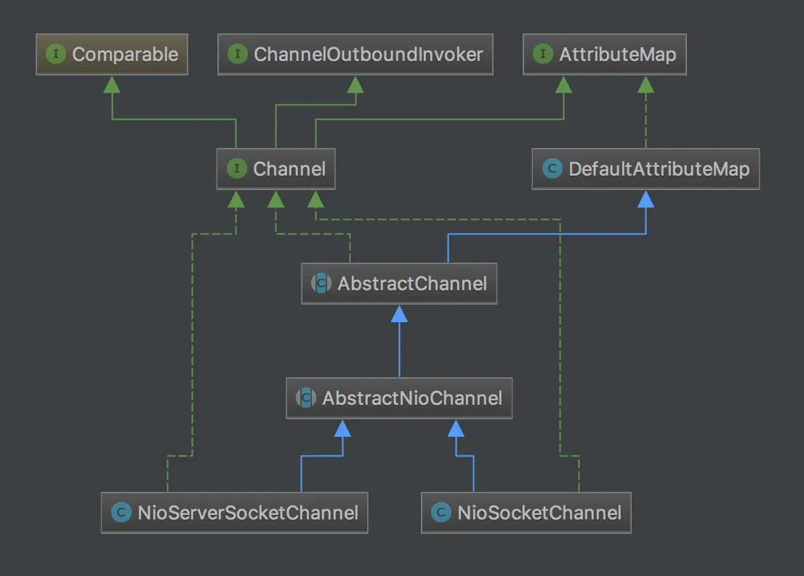

# Netty 之新连接接入

## 一、简介

首先，先概括的介绍一下，新连接接入的全过程。前面服务端启动时，会创建并且初始化一个 NioServerSocketChannel，并且会将此 channel 对应的 pipeline 中添加一个 handler，也就是 ServerBootstrapAcceptor（具体是在 init(Channel) 方法中），这个时候，NioServerSocketChannel 对应的 pipeline 的结构为 head->ServerBootstrapAcceptor->tail。

这个 handler 作用为当有客户端发起连接时，为客户端生成一个 NioSocketChannel，并且添加 childHandler（由用户编写）到 NioSocketChannel 的 pipeline 中。这个 childHandler 一般是 ChannelInitializier，因此添加 handler 之后，NioSocketChannel 的 pipeline 结构为：head->ChannelInitializer（用户编写）->tail。然后将这个 NioSocketChannel 注册到某一个 NioEventLoop 上，注册完成之后，就会回调 childHandler 的 handlerAdded 方法，前面说过，这个 childHandler 一般是 ChannelInitializer，因此会调用其 initChannel 方法，初始化 NioSocketChannel，其实也就是在 NioSocketChannel 中添加多个 Handler。这个 NioSocketChannel 用来处理客户端发送过来的读写请求，而 NioServerSocketChannel 一般用来处理客户端建立连接的请求。

接着将 NioServerSocketChannel 注册到 Selector 上，并且设置了监听事件为 OP_ACCEPT，由于发生了新连接的接入，所以 select 方法返回，调用 accept 方法，返回新的连接 NioSocketChannel。并且将这个 NioSocketChannel 注册到 Selector 上，并且设置监听事件 OP_READ，使得这个 Selector 可以处理 NioSocketChannel 上的读写事件。

对于 Netty 服务器端新连接接入的具体过程如下：

首先 boss reactor 线程轮询到有新的连接接入，即发生了 OP_ACCEPT 事件，则会通过 unsafe.read 方法调用 AbstractNioMessageChannel 中内部类 NioMessageUnsafe 的 read 方法。在这个方法中会将获取到的连接包装成一个 NioSocketChannel，并将其传递给 pipeline.fireChannelRead 方法（注意，在 Netty 中，对于连接的处理也是当成读操作来写的，这也可以从
processSelectedKey 将 OP_ACCEPT 和 OP_READ 放在一起处理可以看出）。此时 NioServerSocketChannel 对应 pipeline 为：head -> ServerBootstrapAcceptor -> tail，所以调用 pipeline.fireChannelRead 会最后调用到 ServerBootstrapAcceptor 中的 channelRead 方法，在 channelRead 方法中完成最终以下几个目标：

1. 将用户代码中自定义处理器 childHandler 添加到 NioSocketChannel 的 pipeline 中
2. 将 NioSocketChannel 注册到 worker Group 中的某一个 NioEventLoop 中的 Selector 上，这个 NioEventLoop 会负责这个 NioSocketChannel 的读写操作
3. 回调 childHandler 中 handlerAdded 方法，最终会调用 ChannelInitializer 中的 initChannel 方法，初始化 NioSocketChannel 中的各种 handler
4. 在 NioSocketChannel 上注册读事件，NioEventLoop 开始监听 NioSocketChannel 上的读写事件

## 二、源码详解

简单来说，新连接的建立可以分为三个步骤：检测到有新的连接、将新的连接注册到 worker 线程组、注册新连接的读事件。

### 1.检测到有新连接进入

我们已经知道，当服务端绑启动之后，服务端的 channel 已经注册到 boos reactor 线程中，reactor 不断检测有新的事件，直到检测出有 OP_ACCEPT 事件发生。

```java{.line-numbers}
//class:NioEventLoop
private void processSelectedKey(SelectionKey k, AbstractNioChannel ch) {
    final AbstractNioChannel.NioUnsafe unsafe = ch.unsafe();
    // 省略代码......
    try {
        int readyOps = k.readyOps();

        /**
         * 新连接已经准备接入或者已经存在的连接有数据可读会进行如下操作
         * 1.如果是有新连接准备接入的话，那么unsafe.read应该是AbstractNioMessageChannel中的NioMessageUnsafe#read方法，用来接收新连接 
         * 2.如果是连接有数据可读，则调用NioByteUnsafe#read操作，读取数据到ByteBuf中
         */
        if ((readyOps & (SelectionKey.OP_READ | SelectionKey.OP_ACCEPT)) != 0 || readyOps == 0) {
            unsafe.read();
        }
    } catch (CancelledKeyException ignored) {
        // 省略代码......
    }
} 
```

上面这段代码表示 boss reactor 线程已经轮询到 SelectionKey.OP_ACCEPT 事件或者 SelectionKey.OP_READ 事件，说明有新的连接进入，此时将调用 channel 的 unsafe 来进行实际的操作。所有的 channel 底层都会有一个与 unsafe 绑定，每种类型的 channel 实际的操作都由 unsafe 来实现。在上面，当发生的为 OP_ACCEPT 事件时，就会调用 NioMessageUnsafe，而当发生了 OP_READ 方法时则会调用 NioByteUnsafe。

接下来，我们进入到 NioMessageUnsafe 的 read 方法：

```java{.line-numbers}
private final List<Object> readBuf = new ArrayList<Object>();

public void read() {
    assert eventLoop().inEventLoop();
    final ChannelConfig config = config();
    //拿到和此NioServerSocketChannel对应的pipeline对象
    final ChannelPipeline pipeline = pipeline();
    final RecvByteBufAllocator.Handle allocHandle = unsafe().recvBufAllocHandle();
    allocHandle.reset(config);

    boolean closed = false;
    Throwable exception = null;
    try {
        try {
            do {
                //调用 doReadMessages 方法不断地读取消息，用 readBuf 作为容器，
                //这里，其实可以猜到读取的是一个个连接
                int localRead = doReadMessages(readBuf);
                if (localRead == 0) {
                    break;
                }
                if (localRead < 0) {
                    closed = true;
                    break;
                }
                allocHandle.incMessagesRead(localRead);
            } while (allocHandle.continueReading());
        } catch (Throwable t) {
            exception = t;
        }

        int size = readBuf.size();
        for (int i = 0; i < size; i ++) {
            readPending = false;
            // 此时，NioServerSocketChannel所属的pipeline结构为：
            // head -> ServerBootstrapAcceptor -> tail
            // 调用pipeline.fireChannelRead()，将每条新连接经过一层服务端pipeline中ChannelHandler的洗礼，
            // 最终会调用到ServerBootstrap中的ServerBootstrapAcceptor#channelRead方法，
            // 在initChannel(channel)方法中，通过pipeline.addLast方法将ServerBootstrapAcceptor
            // 添加到NioServerSocketChannel对应的pipeline中。从而使每个服务器的新接收到的连接
            // 都通过这个ServerBootstrapAcceptor的处理
            pipeline.fireChannelRead(readBuf.get(i));
        }
        readBuf.clear();
        allocHandle.readComplete();
        pipeline.fireChannelReadComplete();

        // 省略代码......
    } finally {
        // 省略代码......
    }
}
```

可以看到，一上来，就用一条断言确定该 read 方法必须是 reactor 线程调用，然后拿到 channel 对应的 pipeline 和 RecvByteBufAllocator.Handle (先不解释)。接下来，调用 doReadMessages 方法不断地读取消息，用 readBuf 作为容器，这里，其实可以猜到读取的是一个个连接，然后调用 pipeline.fireChannelRead()，将每条新连接经过一层服务端 channel 的洗礼。

之后清理容器，触发 pipeline.fireChannelReadComplete()，整个过程清晰明了，不含一丝杂质，下面我们具体看下这两个方法：

- **`doReadMessages(List)`**
- **`pipeline.fireChannelRead(NioSocketChannel)`**

#### 1.1 doReadMessages()

```java{.line-numbers}
protected int doReadMessages(List<Object> buf) throws Exception {
    // 由于之前的Reactor线程已经探测到了有OP_ACCEPT事件发生，所以这个accept方法立即返回
    SocketChannel ch = SocketUtils.accept(javaChannel());
    
    try {
        if (ch != null) {
            //将SocketChannel 封装成自定义的 NioSocketChannel，加入到list里面
            buf.add(new NioSocketChannel(this, ch));
            return 1;
        }
    } catch (Throwable t) {
        // 省略代码......
    }
    return 0;
}
```

我们终于窥探到 netty 调用 jdk 底层 nio 的边界 javaChannel().accept();，由于 netty 中 reactor 线程第一步就扫描到有 accept 事件发生，因此，这里的 accept 方法是立即返回的，返回 jdk 底层 nio 创建的一条 channel。netty 将 jdk 的 SocketChannel 封装成自定义的 NioSocketChannel，加入到 list 里面，这样外层就可以遍历该 list，做后续处理。

从上篇文章中，我们已经知道服务端的创建过程中会创建 netty 中一系列的核心组件，包括 pipeline,unsafe 等等，那么，接受一条新连接的时候是否也会创建这一系列的组件呢？带着这个疑问，我们跟进去：

```java{.line-numbers}
//class:NioSocketChannel
public NioSocketChannel(Channel parent, SocketChannel socket) {
    super(parent, socket);
    config = new NioSocketChannelConfig(this, socket.socket());
}
```

我们重点分析 super(parent, socket)，NioSocketChannel 的父类为 AbstractNioByteChannel。

```java{.line-numbers}
//class:AbstractNioByteChannel
protected AbstractNioByteChannel(Channel parent, SelectableChannel ch) {
    super(parent, ch, SelectionKey.OP_READ);
}
```

这里，我们看到 jdk nio 里面熟悉的影子—— SelectionKey.OP_READ，一般在原生的 jdk nio 编程中，也会注册这样一个事件，表示对 channel 的读感兴趣。这个 OP_READ 会赋值给 AbstractChannel 中的 readInterestOp。我们继续往上，追踪到 AbstractNioByteChannel 的父类 AbstractNioChannel：

```java{.line-numbers}
// class:AbstractNioChannel
// AbstractNioChannel基于AbstractChannel做了nio相关的一些操作，
// 保存jdk底层的 SelectableChannel，并且在构造函数中设置channel为非阻塞
protected AbstractNioChannel(Channel parent, SelectableChannel ch, int readInterestOp) {
    super(parent);
    this.ch = ch;
    this.readInterestOp = readInterestOp;
    try {
        ch.configureBlocking(false);
    } catch (IOException e) {
        try {
            ch.close();
        } catch (IOException e2) {
            // 省略代码......
        }
        throw new ChannelException("Failed to enter non-blocking mode.", e);
    }
} 
```

而这里的 readInterestOp 表示该 channel 关心的事件是 SelectionKey.OP_READ，后续会将该事件注册到 selector 上，之后设置该通道为非阻塞模式。在创建服务端 channel 的时候，最终也会进入到这个方法，super(parent), 便是在 AbstractChannel 中创建一系列和该 channel 绑定的组件，如下：

```java{.line-numbers}
protected AbstractChannel(Channel parent) {
    this.parent = parent;
    id = newId();
    unsafe = newUnsafe();
    pipeline = newChannelPipeline();
} 
```

到了这里，我终于可以将 netty 里面最常用的 channel 的结构图放给你看：

<div align="center">
    
</div>

从上图可知，AbstractChannel 用于实现 channel 的大部分方法，其中我们最熟悉的就是其构造函数中，创建出一条 channel 的基本组件。AbstractNioChannel 基于 AbstractChannel 做了 nio 相关的一些操作，保存 jdk 底层的 SelectableChannel，并且在构造函数中设置 channel 为非阻塞。最后，就是两大 channel，NioServerSocketChannel，NioSocketChannel 对应着服务端接受新连接过程和新连接读写过程。

#### 1.2 pipeline.fireChannelRead(NioSocketChannel)

在没有正式介绍 pipeline 之前，请让我简单介绍一下 pipeline 这个组件

在 netty 的各种类型的 channel 中，都会包含一个 pipeline，字面意思是管道，我们可以理解为一条流水线工艺，流水线工艺有起点，有结束，中间还有各种各样的流水线关卡，一件物品，在流水线起点开始处理，经过各个流水线关卡的加工，最终到流水线结束

对应到 netty 里面，流水线的开始就是 HeadContxt，流水线的结束就是 TailConext，**<font color="red">HeadContxt 中调用 Unsafe 做具体的操作，TailConext 中用于向用户抛出 pipeline 中未处理异常以及对未处理消息的警告</font>**。通过前面一篇文章，我们已经知道在服务端处理新连接的 pipeline 中，已经自动添加了一个 pipeline 处理器 ServerBootstrapAcceptor, 并已经将用户代码中设置的一系列的参数传入了构造函数，接下来，我们就来看下 ServerBootstrapAcceptor。

```java{.line-numbers}
//class:ServerBootstrap.ServerBootstrapAcceptor
private static class ServerBootstrapAcceptor extends ChannelInboundHandlerAdapter {
    private final EventLoopGroup childGroup;
    private final ChannelHandler childHandler;
    private final Entry<ChannelOption<?>, Object>[] childOptions;
    private final Entry<AttributeKey<?>, Object>[] childAttrs;

    ServerBootstrapAcceptor(
            EventLoopGroup childGroup, ChannelHandler childHandler,
            Entry<ChannelOption<?>, Object>[] childOptions, Entry<AttributeKey<?>, Object>[] childAttrs) {
        this.childGroup = childGroup;
        this.childHandler = childHandler;
        this.childOptions = childOptions;
        this.childAttrs = childAttrs;
    }

    public void channelRead(ChannelHandlerContext ctx, Object msg) {
        final Channel child = (Channel) msg;

        // 将用户代码中的.childHandler 设置的 handler 添加到 NioSocketChannel 对应的 pipeline 中，
        // 此时 pipeline 结构为：head -> childHandler -> tail
        // 这个 childHandler 也是在 NioSocketChannel 注册到 selector 上时被调用（通过 pipeline.invokeHandlerAddedIfNeeded();）
        // 方法
        child.pipeline().addLast(childHandler);

        //省略代码......

        try {
            // 将 NioSocketChannel 注册到 workerGroup 中的某个 NioEventLoop 上，
            // 同时调用 NioSocketChannel 对应 pipeline 中的 childHandler 的代码，
            // 并且最后在 NioSocketChannel 上注册读事件，开始处理读写事件
            childGroup.register(child).addListener(new ChannelFutureListener() {
                @Override
                public void operationComplete(ChannelFuture future) throws Exception {
                    if (!future.isSuccess()) {
                        forceClose(child, future.cause());
                    }
                }
            });
        } catch (Throwable t) {
            forceClose(child, t);
        }
    }
} 
```

由于此时 NioServerSocketChannel 的 pipeline 结构为 head -> ServerBootstrapAcceptor -> tail，因此 **`pipeline.fireChannelRead(NioSocketChannel)`** 会最终调用到 ServerBootstrapAcceptor 中的 channelRead 方法，而 channelRead 一上来就把这里的 msg 强制转换为 Channel。

然后，拿到该 channel（也就是我们之前 new 出来的 NioSocketChannel）对应的 pipeline，将用户代码中的 childHandler，添加到 pipeline，这里的 childHandler（在这里即为 ChannelInitializer）在用户代码中的体现为：

```java{.line-numbers}
ServerBootstrap b = new ServerBootstrap();
b.group(bossGroup, workerGroup)
 .channel(NioServerSocketChannel.class)
 .childHandler(new ChannelInitializer<SocketChannel>() {
     @Override
     public void initChannel(SocketChannel ch) throws Exception {
         ChannelPipeline p = ch.pipeline();
         p.addLast(new EchoServerHandler());
     }
}); 
```

**<font color="red">所以此时 NioSocketChannel 对应的 pipeline 结构为 **`head -> ChannelInitializer -> tail`**</font>**。当把 ChannelInitializer 添加到 pipeline 中时，由于此时 NioSocketChannel 还没有注册到 NioEventLoop 上，因此，ChannelInitializer 的 handlerAdded 方法（其 handlerAdded 会最终调用 initChannel 方法）不会被调用，而是等到 NioSocketChannel 注册之后才会被调用。

接着，设置 NioSocketChannel 对应的 attr 和 option，然后进入到 childGroup.register(child)，这里的 childGroup 就是我们在启动代码中 new 出来的 NioEventLoopGroup。我们进入到 NioEventLoopGroup 的 register 方法，代理到其父类 MultithreadEventLoopGroup：

```java{.line-numbers}
public ChannelFuture register(Channel channel) {
    return next().register(channel);
} 
```

这里 next() 会从 workerGroup 中选择一个 NioEventLoop，将 NioSocketChannel 注册到其上。这里的环节和服务端的启动环节一样，我们直接跳到关键的环节：

```java{.line-numbers}

//class:AbstractChannel
private void register0(ChannelPromise promise) {
    try {
        if (!promise.setUncancellable() || !ensureOpen(promise)) {
            return;
        }
        boolean firstRegistration = neverRegistered;
        // 真正地将 channel 注册到 NioEventLoop 中的 selector 上
        doRegister();
        neverRegistered = false;
        registered = true;

        /**
         * 当我们把 ChannelHandler 添加到 channel 所属的 pipeline 中时，如果 channel 还没有
         * 注册到某一个 NioEventLoop 上时，则会添加一个 Task 到 PendingHandlerCallback 中，
         * 等到这个 channel 注册成功之后，将会调用立即调用 ChannelHandler.handlerAdded(...) 方法。
         * 往 pipeline 中添加 ChannelHandler 时，channel 都没有注册，因此在调用 register0 注册好之后，都会调用
         * 这些 ChannelHandler 中的 handlerAdded 方法，最后一般会调用到 initChannel 方法
         */
        pipeline.invokeHandlerAddedIfNeeded();

        safeSetSuccess(promise);
        pipeline.fireChannelRegistered();
        if (isActive()) {
            if (firstRegistration) {
                pipeline.fireChannelActive();
            } else if (config().isAutoRead()) {
                beginRead();
            }
        }
    } catch (Throwable t) {
        closeForcibly();
        closeFuture.setClosed();
        safeSetFailure(promise, t);
    }
} 
```

和服务端启动过程一样，先是调用 doRegister(); 做真正的注册过程，如下：

```java{.line-numbers}
protected void doRegister() throws Exception {
    boolean selected = false;
    for (;;) {
        try {
            selectionKey = javaChannel().register(eventLoop().selector, 0, this);
            return;
        } catch (CancelledKeyException e) {
            if (!selected) {
                eventLoop().selectNow();
                selected = true;
            } else {
                throw e;
            }
        }
    }
} 
```

将该条 channel 绑定到一个 selector 上去，一个 selector 被一个 reactor 线程使用，后续该 channel 的事件轮询，以及事件处理，异步 task 执行都是由此 reactor 线程来负责。绑定完 reactor 线程之后，调用 **`pipeline.invokeHandlerAddedIfNeeded()`**。前面我们说到，到目前为止 NioSocketChannel 的 pipeline 中有三个处理器，**`head->ChannelInitializer->tail`**，最终会调用到 ChannelInitializer 的 handlerAdded 方法。

```java{.line-numbers}
public abstract class ChannelInitializer<C extends Channel> extends ChannelInboundHandlerAdapter {

   private final ConcurrentMap<ChannelHandlerContext, Boolean> initMap = PlatformDependent.newConcurrentHashMap();
   
   /**
    * 当 ch 注册成功之后，该方法就会被调用，该方法结束返回之后，
    * 此ChannelInitializer实例将会从Channel所绑定的ChannelPipeline中移除
    */
   protected abstract void initChannel(C ch) throws Exception;
   
   // ChannelInitializer 添加成功后，会回调到handlerAdded()接口
   @Override
    public void handlerAdded(ChannelHandlerContext ctx) throws Exception {
        if (ctx.channel().isRegistered()) {
            initChannel(ctx);
        }
    }  
    
    @SuppressWarnings("unchecked")
    //class:
    private boolean initChannel(ChannelHandlerContext ctx) throws Exception {
        // 标记ctx为true,且之前没有标记过。防止重复执行
        if (initMap.putIfAbsent(ctx, Boolean.TRUE) == null) {
            try {
                // 调用initChannel方法
                initChannel((C) ctx.channel());
            } catch (Throwable cause) {
                exceptionCaught(ctx, cause);
            } finally {
                // 最终会删除 ChannelInitializer 实例
                remove(ctx);
            }
            return true;
        }
        return false;
    }

    // 删除 ChannelInitializer 实例
    private void remove(ChannelHandlerContext ctx) {
        try {
            // 获取 Pipeline
            ChannelPipeline pipeline = ctx.pipeline();
            // 从 Pipeline 中返回 ChannelInitializer 实例
            if (pipeline.context(this) != null) {
                // 删除 ChannelInitializer 实例
                pipeline.remove(this);
            }
        } finally {
            initMap.remove(ctx);
        }
    }
}
```

handlerAdded 方法调用 initChannel 方法之后，调用 remove(ctx); 将自身 ChannelInitializer 从 pipeline 中删除。而这里的 initChannel 方法又是神马玩意？让我们回到用户方法，比如下面这段用户代码：

```java{.line-numbers}
ServerBootstrap b = new ServerBootstrap();
b.group(bossGroup, workerGroup)
 .channel(NioServerSocketChannel.class)
 .option(ChannelOption.SO_BACKLOG, 100)
 .handler(new LoggingHandler(LogLevel.INFO))
 .childHandler(new ChannelInitializer<SocketChannel>() {
     @Override
     public void initChannel(SocketChannel ch) throws Exception {
         ChannelPipeline p = ch.pipeline();
         p.addLast(new LoggingHandler(LogLevel.INFO));
         p.addLast(new EchoServerHandler());
     }
});
```

所以，initChannel 方法最终会回调我们自己定义的 ChannelInitializer 中的 initChannel 方法。完了之后，NioSocketChannel 绑定的 pipeline 的处理器就包括 head->LoggingHandler->EchoServerHandler->tail。**<font color="red">注意上面 ChannelInitializer<SocketChannel> 中的 SocketChannel 并不是 jdk 中定义的 SocketChannel，而是 Netty 中自定义的 SocketChannel，它是 NioSocketChannel 的父类</font>**。

### 2.注册读事件

接下来，我们还剩下这些代码没有分析完：

```java{.line-numbers}
private void register0(ChannelPromise promise) {
    // ..
    pipeline.fireChannelRegistered();
    if (isActive()) {
        if (firstRegistration) {
            pipeline.fireChannelActive();
        } else if (config().isAutoRead()) {
            beginRead();
        }
    }
} 
```

pipeline.fireChannelRegistered();，其实没有干啥有意义的事情，最终无非是再调用一下业务 pipeline 中每个处理器的 ChannelHandlerAdded 方法处理下回调。isActive() 在连接已经建立的情况下返回 true，所以进入方法块，进入到 pipeline.fireChannelActive();，这里的分析和 netty 源码分析之服务端启动全解析分析中的一样，在这里我详细步骤先省略，直接进入到关键环节：

```java{.line-numbers}
@Override
protected void doBeginRead() throws Exception {
    // Channel.read() or ChannelHandlerContext.read() was called
    final SelectionKey selectionKey = this.selectionKey;
    if (!selectionKey.isValid()) {
        return;
    }

    readPending = true;

    final int interestOps = selectionKey.interestOps();
    if ((interestOps & readInterestOp) == 0) {
        selectionKey.interestOps(interestOps | readInterestOp);
    }
}
```

你应该还记得前面 register0() 方法的时候，向 selector 注册的事件代码是 0，而 readInterestOp 对应的事件代码是 SelectionKey.OP_READ，参考前文中创建 NioSocketChannel 的过程，稍加推理，就会知道，这里其实就是将 SelectionKey.OP_READ 事件注册到 selector 中去，表示这条通道已经可以开始处理 read 事件了。

## 三、总结

新连接接入的过程可以总结如下：

1. boss reactor 线程轮询到有新的连接进入；
2. 通过封装 jdk 底层的 channel 创建 NioSocketChannel 以及一系列的 netty 核心组件；
3. 将该条连接通过 chooser，选择一条 worker reactor 线程绑定上去；
4. 注册读事件，开始新连接的读写；