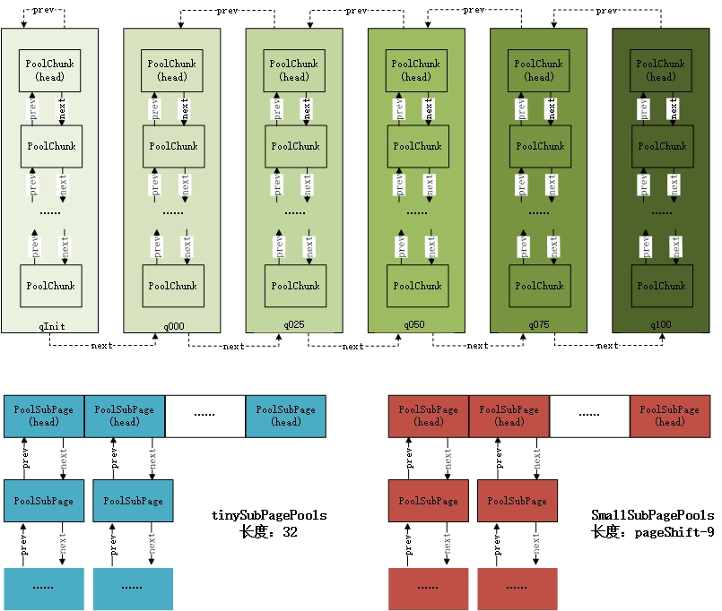
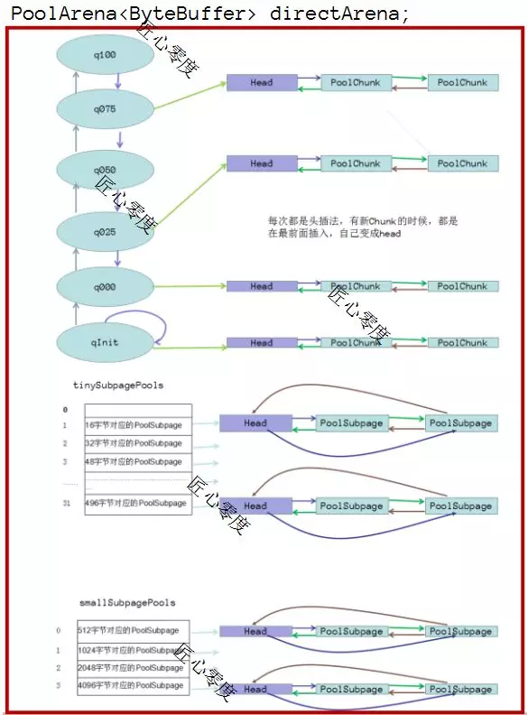
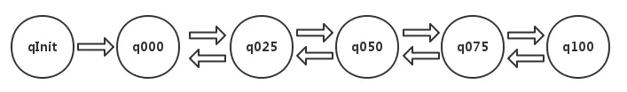
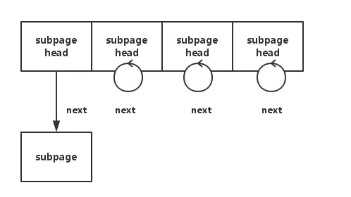
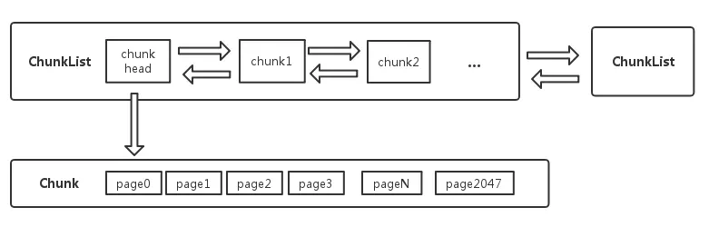

# Netty 之池化内存分配

## 一、内存分配简介

内存管理的主要目的是合理分配内存，减少内存碎片，及时回收资源，提高内存使用效率。（任何一个组件管理内存的目的都是这个）。

从 Netty 层面来说，操作系统分配内存容易有碎页并且比较耗时，一次性申请足够空间，自己管理更高效。**<font color="red">Netty 内存管理其实质就是先分配一块大内存，其实就是 Netty 每次向操作系统以 PoolChunk 为单位（大小为16MB）并且保存起来（添加到 PoolChunkList 中）。然后在内存的分配和回收过程中，使用一些数据结构记录内存使用状态，如果有新的分配请求，根据这些状态信息寻找最合适的位置并更新内存结构</font>**。释放内存时候同步修改数据结构。

个人认为 Netty 的优势在于以下两点：

- 方便：良好的封装与接口设计，对多种通信协议的支持，使得上手简单，快速
- 高效（性能）：异步的、事件驱动的线程模型和高效的内存管理机制

Netty 内存池的实现参考了 jemalloc 的原理。宏观上来说，Netty 对内存的管理分为两个层面：在为线程分配内存的过程中，会首先查找线程私有缓存（默认为线程开启缓存，可配置关闭）；当私有缓存不满足需求时，会在内存池中查找合适的内存空间，提供给线程：

- 线程私有缓存 PoolThreadCache：线程私有缓存因为可以避免多线程请求内存时的竞争，所以效率很高，但是也存在一些缺陷：最大缓存容量小，每个线程默认32k；使用不当可能会造成内存泄漏.
- 内存池 PoolArena：全局共享的内存池支持堆内存和堆外内存（Direct Buffer）的申请和回收，其内存管理的粒度有以下几个单位：
  - PoolChunkList：PoolChunk 的集合，PoolChunkList 内部将 PoolChunk 组合成一个双向链表，同时 PoolChunkList 自己也形成一个双向链表
  - PoolChunk：Netty 向操作系统申请内存是以 PoolChunk 为单位申请的，内存分配也是基于 PoolChunk。PoolChunk 是 PoolSubpage（一个内存页）为单元的集合，默认有 2048 个 PoolSubpage，因此默认大小为16MB
  - PoolSubpage: 一个内存页，是内存管理的最小单元，默认 8K

Netty 逻辑上将内存大小分为了 tiny, small, normal, huge 几个单位。申请内存大于 Chunk size 为 huge，此时不在内存池中管理，由 JVM 负责处理；当 Client 申请的内存大于一个 Page 的大小（normal 类型），在 PoolChunk 内进行分配; 对 tiny&small 大小的内存，在一个 PoolSubpage 页内进行分配。针对上述几种粒度的内存块的管理，其实现上包含以下几个组件（类）：

- PoolArena：内存分配中心
- PoolChunk：负责 Chunk 内的内存分配
- PoolSubpage：负责 Page 内的内存分配

现在先对 Netty 分配内存的流程做一个大致的介绍：

1. new 一个 ByteBuf，如果是 direct 则创建一个 PooledUnsafeDirectByteBuf
2. 从缓存中查找，没有可用的缓存进行下一步
3. 从内存池中查找可用的内存
4. 如果找不到则重新申请内存（申请一个 PoolChunk），并将申请到的内存放入内存池进行管理（其实就是放进 PoolChunkList）
5. 使用申请到的内存初始化 ByteBuf

接下来，简单介绍一下上面所说的数据结构：PoolArena、PoolChunk、PoolSubpage、PoolChunkList。

## 二、PoolArena

### 1.PoolArena 的结构

顾明思义，PoolArena 负责缓存池的全局调度，它负责在上层组织和管理所有的 PoolChunk 以及 PoolSubpage 单元。由于 netty 通常应用于高并发系统，不可避免的有多线程进行同时内存分配，可能会极大的影响内存分配的效率，为了缓解线程竞争，Netty 默认提供了 cpu 核数 * 2 个 PoolArena 实例（计算机的最大线程数为 CPU 核数 * 2 ）。并且 PoolArena 有两种类型：heapArena 和 directArena，每种类型各有 cpu 核数 * 2个。

与 PoolArena、PoolChunk 和 PoolSubpage 相关的默认参数的初始化和设置是在 PooledByteBufAllocator 类中，比如说一个内存页 PoolSubpage 的默认大小的参数 DEFAULT_PAGE_SIZE，决定一个 PoolChunk 大小的参数 maxOrder 等。并且 PooledByteBufAllocator 中还有 heapArena 和 directArena 数组，数组大小就为 cpu 核数 * 2。PooledByteBufAllocator 类的一部分成员属性以及 static 初始化块如下：

```java{.line-numbers}
public class PooledByteBufAllocator extends AbstractByteBufAllocator{
    private static final int DEFAULT_NUM_HEAP_ARENA;
    private static final int DEFAULT_NUM_DIRECT_ARENA;
    private static final int DEFAULT_PAGE_SIZE;
    private static final int DEFAULT_MAX_ORDER;

    private static final int DEFAULT_TINY_CACHE_SIZE;
    private static final int DEFAULT_SMALL_CACHE_SIZE;
    private static final int DEFAULT_NORMAL_CACHE_SIZE;
    private static final int DEFAULT_MAX_CACHED_BUFFER_CAPACITY;
    private static final int DEFAULT_MAX_CACHED_BUFFER_CAPACITY;

    static{
        int defaultPageSize = SystemPropertyUtil.getInt("io.netty.allocator.pageSize", 8192);
        // 初始化DEFAULT_PAGE_SIZE，也就是默认的pageSize为8KB
        DEFAULT_PAGE_SIZE = defaultPageSize;
        int defaultMaxOrder = SystemPropertyUtil.getInt("io.netty.allocator.maxOrder", 11);
        // 初始化maxOrder为11，maxOrder决定了一个PoolChunk中有多少个PoolSubpage，
        // maxOrder为11时，PoolChunk中有2048个PoolSubpage
        DEFAULT_MAX_ORDER = defaultMaxOrder;
        // Arena的数量默认为处理器数量的两倍
        final int defaultMinNumArena = NettyRuntime.availableProcessors() * 2;
        DEFAULT_NUM_HEAP_ARENA = Math.max(0, SystemPropertyUtil.getInt("io.netty.allocator.numHeapArenas",
                    (int) Math.min(
                            defaultMinNumArena,
                            runtime.maxMemory() / defaultChunkSize / 2 / 3)));
        DEFAULT_NUM_DIRECT_ARENA = Math.max(0, SystemPropertyUtil.getInt("io.netty.allocator.numDirectArenas",
                    (int) Math.min(
                            defaultMinNumArena,
                            PlatformDependent.maxDirectMemory() / defaultChunkSize / 2 / 3)));

        // 初始化为tinyCacheSize，smallCacheSize，normalCacheSize大小为512,256，64
        DEFAULT_TINY_CACHE_SIZE = SystemPropertyUtil.getInt("io.netty.allocator.tinyCacheSize", 512);
        DEFAULT_SMALL_CACHE_SIZE = SystemPropertyUtil.getInt("io.netty.allocator.smallCacheSize", 256);
        DEFAULT_NORMAL_CACHE_SIZE = SystemPropertyUtil.getInt("io.netty.allocator.normalCacheSize", 64);
        // 缓存的最大容量默认为 32KB
        DEFAULT_MAX_CACHED_BUFFER_CAPACITY = SystemPropertyUtil.getInt("io.netty.allocator.maxCachedBufferCapacity", 32 * 1024);
    }
    
    private final PoolArena<byte[]>[] heapArenas;
    private final PoolArena<ByteBuffer>[] directArenas;
    private final int tinyCacheSize;
    private final int smallCacheSize;
    private final int normalCacheSize;
    private final PoolThreadLocalCache threadCache;
    public static final PooledByteBufAllocator DEFAULT = new PooledByteBufAllocator(PlatformDependent.directBufferPreferred());
}
```

在 PooledByteBufAllocator 的构造函数中对 heapArenas 和 directArenas 两个数组进行了初始化，在初始化的过程中，调用了 PoolArena 的构造函数创建 PoolArena 对象。调用构造函数时，传入的参数 maxOrder，pageSize，pageShifts，chunkSize 等保存到 PoolArena 的成员变量中。同时，在 PooledByteBufAllocator 中，还有 PoolThreadLocalCache 类型的变量 threadCache，PooledByteBufAllocator 的构造函数如下：

```java{.line-numbers}
public PooledByteBufAllocator(boolean preferDirect, int nHeapArena, int nDirectArena, int pageSize, int maxOrder,
                                  int tinyCacheSize, int smallCacheSize, int normalCacheSize,
                                  boolean useCacheForAllThreads, int directMemoryCacheAlignment) {
    super(preferDirect);
    threadCache = new PoolThreadLocalCache(useCacheForAllThreads);
    this.tinyCacheSize = tinyCacheSize;  // 512
    this.smallCacheSize = smallCacheSize;  // 256
    this.normalCacheSize = normalCacheSize; // 64
    chunkSize = validateAndCalculateChunkSize(pageSize, maxOrder);
    
    //省略代码
    //初始化pageShifts为13                            
    int pageShifts = validateAndCalculatePageShifts(pageSize);
    
    if (nHeapArena > 0) {
        // heapArenas = new PoolArena[nHeapArena];
        // nHeapArena的值默认为CPU的数量 * 2
        heapArenas = newArenaArray(nHeapArena);
        for (int i = 0; i < heapArenas.length; i ++) {
            // 调用PoolArena类的构造函数，传入必要的参数，创建一个PoolArena对象，并将其保存到数组中
            PoolArena.HeapArena arena = new PoolArena.HeapArena(this,
                    pageSize, maxOrder, pageShifts, chunkSize,
                    directMemoryCacheAlignment);
            heapArenas[i] = arena;
        }
    } else {
        heapArenas = null;
    }
    
    if (nDirectArena > 0) {
        // directArenas = new PoolArena[nDirectArena];
        // nDirectArena的值默认为CPU的数量 * 2
        directArenas = newArenaArray(nDirectArena);
        for (int i = 0; i < directArenas.length; i ++) {
            PoolArena.DirectArena arena = new PoolArena.DirectArena(
                    this, pageSize, maxOrder, pageShifts, chunkSize, directMemoryCacheAlignment);
            directArenas[i] = arena;
        }
    } else {
        directArenas = null;
    }
    //省略代码
} 
```

在 PoolArena 内部对 PoolSubpage 和 PoolChunk 的内存组织方式如下：

<div align="center">
    
</div>

下图也可以反映出 PoolArena 的主要数据结构：

<div align="center">
    
</div>

每个 PoolArena 管理的所有 PoolChunk 根据内存使用率的不同被划分为 6 种类型，以双向链表 PoolChunkList 的方式组织，并在不断的内存分配过程中根据 chunk 的使用率，对 chunk 的类型进行调整，放入合适的链表中。这 6 个 PoolChunkList 就是上图中的 qInit、q000、q025、q050、q075、q100。

如上图所示，PoolArena 提供了两种方式进行内存分配：

**1.smallSubpagePools 和 tinySubpagePools 用于分配小于 8k 的内存**

在向 PoolArena 申请内存，如果申请的内存大小小于 pageSize 时，有两种情况，一种是 tiny 类型，也就是申请的内存小于 512byte 时，会从 tinySubpagePools 数组中申请一个 PoolSubpage（假设从缓存申请内存没成功）；第二种情况是 small 类型，也就是申请的内存大于等 512byte，但是小于 8192byte 时，会从 smallSubpagePools 中申请一个 PoolSubpage（同样假设从缓存申请内存没成功）。

**2.PoolChunkList 用于分配大于等于 8KB 的内存**

**<font color="red">为了保持 PoolSubpage 中内存的连续性，避免内存碎片，并方便根据内存偏移量进行定位，每个页面内分配的内存段应该具有统一的规格 (PoolSubpage 中的 elemSize)</font>**。因此，PoolArena 把相同 elemSize 的 PoolSubpage 组成一个链表，放入数组中。由于 PoolSubpage 最小的内存段被限定为 16byte，所以 tinySubpages 共占据 512/16=32 个数组位置。

举例来说，tinySubpagePools[1] 中链表所包含的 PoolSubpage 的 elemSize 全部为 16byte，那么当我们需要分配的内存大小为 16byte 时，会从这个链表中取出一个 PoolSubpage 进行内存的分配。tinySubpagePools[2] 中链表所包含的 PoolSubpage 的 elemSize 全部为 32byte，当我们需要分配的内存大小为 32byte 时，就会从这个链表中进行申请。依次类推，tinySubpagePools 中各元素代表的 PoolSubpage 链表中 elemSize 的大小为：0, 16byte, 32byte, 48byte, ……, 496byte。这里需要注意的是，head 节点本身不能用来分配内存，当 head 节点的 next 指针指向 head 节点本身时，表明这个链表为空（只有 head 节点）。

smallSubpagePools 则在 512byte 的基础上依次翻倍，直到 4KB 大小，所以 smallsubpages 默认共有 4 个数组元素，依次代表 elemSize 大小为 512byte，1KB，2KB，4KB。PoolArena 类的代码如下：

```java{.line-numbers}
protected PoolArena(PooledByteBufAllocator parent, int pageSize,
          int maxOrder, int pageShifts, int chunkSize, int cacheAlignment) {
    this.parent = parent;
    this.pageSize = pageSize; // 8KB
    this.maxOrder = maxOrder; // 11
    this.pageShifts = pageShifts; // 4
    this.chunkSize = chunkSize; // 16MB
    subpageOverflowMask = ~(pageSize - 1);
    
    //tinySubpagePools = new PoolSubpage[numTinySubpagePools]
    //numTinySubpagePools大小为32
    tinySubpagePools = newSubpagePoolArray(numTinySubpagePools);
    for (int i = 0; i < tinySubpagePools.length; i ++) {
        //创建一个特殊的PoolSubpage对象，赋值给tinySubpagePools数组中的每个元素，作为链表的head，也就是头结点
        //这个PoolSubpage对象中，next和prev成员变量指向这个对象本身
        tinySubpagePools[i] = newSubpagePoolHead(pageSize);
    }
    
    numSmallSubpagePools = pageShifts - 9; // 4
    // 和tinySubpagePools数组的创建类似
    smallSubpagePools = newSubpagePoolArray(numSmallSubpagePools);
    for (int i = 0; i < smallSubpagePools.length; i ++) {
        smallSubpagePools[i] = newSubpagePoolHead(pageSize);
    }
    
    q100 = new PoolChunkList<T>(this, null, 100, Integer.MAX_VALUE, chunkSize);
    q075 = new PoolChunkList<T>(this, q100, 75, 100, chunkSize);
    q050 = new PoolChunkList<T>(this, q075, 50, 100, chunkSize);
    q025 = new PoolChunkList<T>(this, q050, 25, 75, chunkSize);
    q000 = new PoolChunkList<T>(this, q025, 1, 50, chunkSize);
    qInit = new PoolChunkList<T>(this, q000, Integer.MIN_VALUE, 25, chunkSize);
    
    q100.prevList(q075);
    q075.prevList(q050);
    q050.prevList(q025);
    q025.prevList(q000);
    q000.prevList(null);
    qInit.prevList(qInit);
    
    //省略代码
}
```

从上面的构造函数可知，PoolArena 中的 PoolChunkList 的结构如下：

<div align="center">
    
</div>

- qInit：存储内存利用率 0-25% 的 chunk；
- q000：存储内存利用率 1-50% 的 chunk；
- q025：存储内存利用率 25-75% 的 chunk；
- q050：存储内存利用率 50-100% 的 chunk；
- q075：存储内存利用率 75-100% 的 chunk；
- q100：存储内存利用率 100% 的 chunk；

qInit 前置节点为自己，且 minUsage = Integer.MIN_VALUE，意味着一个初始分配的 chunk，在最开始的内存分配过程中 (也就是内存使用率一直低于 25% 的情况下，没有因为使用率的上升被移到后面的 PoolChunkList 中)，即使完全释放也不会被回收，会始终保留在内存中。而 q000 没有前置节点，prevList 为 null，当一个 PoolChunk 进入到 q000 列表，如果其内存被完全释放时，由于 prevList 为 null，因此不能把此 Chunk 移动到前面的 PoolChunkList 中，只会把此 Chunk 从这个 PoolChunkList 中移除，然后此 PoolChunk 被分配的内存会由 GC 完全回收。

### 2.PoolArena 分配内存的基本流程

PoolArena 分配内存是由 **`allocate(PoolThreadCache cache, PooledByteBuf<T> buf, final int reqCapacity)`** 方法进行的，基本的流程如下：

- 将需要分配的内存大小 reqCapacity 进行规整化：
  - 如果是 tiny，**`reqCapacity < 512byte`**，则规范为 16 的倍数
  - 如果是 small 或者 normal，**`512byte <= reqCapacity  <= 16MB`**，则规范为大于 reqCapacity 的最近的 2 的指数次的值
  - 如果是 huge，reqCapacity > 16MB，直接返回 reqCapacity   
- 如果分配 tiny 或者 small 类型的内存时：
  - 则先尝试从 PoolThreadCache 中分配内存，PoolThreadCache 利用 ThreadLocal 的特性，消除了多线程竞争，提高内存分配效率；首次分配时，PoolThreadCache 中并没有可用内存进行分配，当上一次分配的内存使用完并释放时，会将其加入到 PoolThreadCache 中，提供该线程下次申请时使用。
  - 如果从缓存中分配没有成功，则尝试从 tinySubpagePools 或 smallSubpagePools 中分配内存，如果没有合适 PoolSubpage，则采用方法 allocateNormal 分配内存。allocateNormal 方法会尝试依次从 6 个 PoolChunkList 中分配内存
  - 如果仍然失败，则重新创建一个 PoolChunk，并且从此 PoolChunk 中选取一个 PoolSubpage 分配内存，分配完成之后把 PoolChunk 加入到 qInit 中。另外，将选取的 PoolSubpage 加入到 tinySubpagePools 或者 smallSubpagePools 中；
- 如果分配 normal 类型的内存时：
  - 先尝试从 PoolThreadCache 中分配内存
  - 如果从缓存中分配失败，则尝试调用 allocateNormal 方法进行内存分配
  - 如果分配 huge 类型的内存时，直接由 JVM 进行分配和管理
  
PoolArena 中的 allocate 方法如下：

```java{.line-numbers}
private void allocate(PoolThreadCache cache, PooledByteBuf<T> buf, final int reqCapacity) {
    final int normCapacity = normalizeCapacity(reqCapacity);
    if (isTinyOrSmall(normCapacity)) { // capacity < pageSize
        int tableIdx;
        PoolSubpage<T>[] table;
        boolean tiny = isTiny(normCapacity);
        if (tiny) { // < 512
            if (cache.allocateTiny(this, buf, reqCapacity, normCapacity)) {
                // was able to allocate out of the cache so move on
                return;
            }
            tableIdx = tinyIdx(normCapacity);
            table = tinySubpagePools;
        } else {
            if (cache.allocateSmall(this, buf, reqCapacity, normCapacity)) {
                // was able to allocate out of the cache so move on
                return;
            }
            tableIdx = smallIdx(normCapacity);
            table = smallSubpagePools;
        }
    
        final PoolSubpage<T> head = table[tableIdx];
    
        /**
         * Synchronize on the head. This is needed as {@link PoolChunk#allocateSubpage(int)} and
         * {@link PoolChunk#free(long)} may modify the doubly linked list as well.
         */
        synchronized (head) {
            final PoolSubpage<T> s = head.next;
            if (s != head) {
                assert s.doNotDestroy && s.elemSize == normCapacity;
                long handle = s.allocate();
                assert handle >= 0;
                s.chunk.initBufWithSubpage(buf, handle, reqCapacity);
                incTinySmallAllocation(tiny);
                return;
            }
        }
        synchronized (this) {
            allocateNormal(buf, reqCapacity, normCapacity);
        }
    
        incTinySmallAllocation(tiny);
        return;
    }
    if (normCapacity <= chunkSize) {
        if (cache.allocateNormal(this, buf, reqCapacity, normCapacity)) {
            // was able to allocate out of the cache so move on
            return;
        }
        synchronized (this) {
            allocateNormal(buf, reqCapacity, normCapacity);
            ++allocationsNormal;
        }
    } else {
        // Huge allocations are never served via the cache so just call allocateHuge
        allocateHuge(buf, reqCapacity);
    }
}
```

allocateNormal 的代码如下：

```java{.line-numbers}
private synchronized void allocateNormal(PooledByteBuf<T> buf, int reqCapacity, int normCapacity) {
    ++allocationsNormal;
    if (q050.allocate(buf, reqCapacity, normCapacity) 
     || q025.allocate(buf, reqCapacity, normCapacity) 
     || q000.allocate(buf, reqCapacity, normCapacity) 
     || qInit.allocate(buf, reqCapacity, normCapacity) 
     || q075.allocate(buf, reqCapacity, normCapacity)
     || q100.allocate(buf, reqCapacity, normCapacity)) {
        return;
    }

    // Add a new chunk.
    PoolChunk<T> c = newChunk(pageSize, maxOrder, pageShifts, chunkSize);
    long handle = c.allocate(normCapacity);
    assert handle > 0;
    c.initBuf(buf, handle, reqCapacity);
    qInit.add(c);
} 
```

第一次进行内存分配时，在 PoolChunkList 中没有 PoolChunk 可以分配内存，需通过方法 newChunk 新建一个 PoolChunk 进行内存分配，并添加到 qInit 列表中。如果分配 small 或者 tiny 类型的小内存，除了创建 PoolChunk，还有创建 PoolSubpage，PoolSubpage 在初始化之后，会添加到 smallSubpagePools 或者 tinySubpagePools 中，其实并不是直接插入到数组，而是添加到以 head 为头节点的链表中。下次再有分配的需求时，直接从 smallSubpagePools 或者 tinySubpagePools 中获取对应的 PoolSubpage 进行分配。

<div align="center">
    
</div>

## 三、PoolChunkList

在前面介绍 PoolArena 的时候，讲过在 PoolArena 内部通过 PoolChunkList 来管理 PoolChunk，同时根据 PoolChunkList 的使用率，将其分为 6 种类型（qInit，q000，q025，q050，q075，q100），并且使用双向链表组织起来。在每个 PoolChunkList内部，PoolChunk 也通过双向链表进行组织。PoolChunkList 负责管理多个 chunk 的生命周期，在此基础上对内存分配进行进一步的优化。

```java{.line-numbers}
final class PoolChunkList<T> implements PoolChunkListMetric {
    private final PoolArena<T> arena;
    private final PoolChunkList<T> nextList;
    private final int minUsage;  //PoolChunkList的最小使用率
    private final int maxUsage;  //PoolChunkList的最大使用率
    private final int maxCapacity;
    private PoolChunk<T> head;
    private PoolChunkList<T> prevList;
    
    PoolChunkList(PoolArena<T> arena, PoolChunkList<T> nextList, int minUsage, int maxUsage, int chunkSize) {
        assert minUsage <= maxUsage;
        this.arena = arena;
        this.nextList = nextList;
        this.minUsage = minUsage;
        this.maxUsage = maxUsage;
        maxCapacity = calculateMaxCapacity(minUsage, chunkSize);
    }
}
```

从代码实现可以看出，每个 PoolChunkList 实例维护了一个 PoolChunk 链表，PoolChunkList 自身也形成一个链表。PoolChunkList 的结构图如下所示：

<div align="center">
    
</div>

接下来看看前面 PoolArena 类中的 allocateNormal 方法代码：

```java{.line-numbers}
// class:PoolArena
private synchronized void allocateNormal(PooledByteBuf<T> buf, int reqCapacity, int normCapacity) {
    // 首先从内存池中（也就是6种PoolChunkList）尝试获取需要的内存
    if (q050.allocate(buf, reqCapacity, normCapacity) || q025.allocate(buf, reqCapacity, normCapacity) ||
        q000.allocate(buf, reqCapacity, normCapacity) || qInit.allocate(buf, reqCapacity, normCapacity) ||
        q075.allocate(buf, reqCapacity, normCapacity)) {
        ++allocationsNormal;
        return;
    }
    // 如果从现有内存池中没有找到可用的内存，则重新申请一个PoolChunk
    PoolChunk<T> c = newChunk(pageSize, maxOrder, pageShifts, chunkSize);
    long handle = c.allocate(normCapacity);
    ++allocationsNormal;
    assert handle > 0;
    // 用申请的内存初始化Buffer
    c.initBuf(buf, handle, reqCapacity); 
    // 将申请到的PoolChunk放到qInit的PoolChunkList中
    qInit.add(c);
} 
```

接着我们看下上面使用到的几个数据结构：

```java{.line-numbers}
// 使用率在50%-100%
private final PoolChunkList<T> q050;
// 使用率在25%-75%
private final PoolChunkList<T> q025;
// 使用率在1%-50%
private final PoolChunkList<T> q000;
// 使用率在Integer.MIN_VALUE-25%
private final PoolChunkList<T> qInit;
// 使用率在75%-100%
private final PoolChunkList<T> q075;
// 使用率100%
private final PoolChunkList<T> q100; 
```

每个链表存放的是已经被分配过的 PoolChunk，不同使用率的 PoolChunk 被存放在不同的链表中，初始情况 6 种类型链表都是空的。刚开始 PoolChunk 创建好之后，都是加入到 qInit 中，然后随着对此 PoolChunk 中的内存进行分配，使得其内存使用率逐渐增大，逐渐被移动到后面的 PookChunkList 中。6 种 PoolChunkList 的链接顺序如下所示：

<div align="center">
    
</div>

注意 qinit 和 q000 之间是单向，也就是说 qinit 中的 PoolChunk 可以移动到 q000，但是 q000 的 PoolChunk 不能再向前移动到 qInit 中，并且 qInit 的最小使用率 minUsage 为 Integer.MIN_VALUE。将 qInit 的最小使用率 minUsage 设置为 Integer.MIN_VALUE，这样做的考虑是那些始终存在于 qInit 中的 PoolChunk（也就是说内存使用率一直低于 25%），**<font color="red">当这些 PoolChunk 因为内存释放使得内存使用率变为 0 时，也不会从 PoolChunkList 移除，依然留在内存池中，这样在下一次需要分配内存时，就可以直接使用而不需要重新再进行分配</font>**。qInit 和 q000 之间的关系是单向的，这是因为当 q000 中的 PoolChunk 因为内存的释放使得内存使用率低于 minUsage（1%）的时候，由于 q000 的 prevList 为 null，所以只会把此 PoolChunk 从 q000 中移除掉，等待 GC 进行回收，而不会移动到前面的 qInit 中。

就像我们一直说的，从 qInit 到 q100，链表中的 PoolChunkList 的内存使用率不断地增大，具体的实现代码如下：

```java{.line-numbers}
//class:PoolChunkList
boolean allocate(PooledByteBuf<T> buf, int reqCapacity, int normCapacity) {
    if (head == null || normCapacity > maxCapacity) {
        // 当前链表为空或者申请内存的大小大于当前链表的利用率直接返回false
        return false;
    }
    // 从链表头开始依次查找可用的内存
    for (PoolChunk<T> cur = head;;) {
        // 针对每个PoolChunk申请内存，如果返回handle小于0表示没有符合条件的内存，继续查找下一个
        long handle = cur.allocate(normCapacity);
        if (handle < 0) {
            cur = cur.next;
            if (cur == null) {
                return false;
            }
        } else {
            // 如果找到可用的内存，用来初始化buffer
            cur.initBuf(buf, handle, reqCapacity);
            if (cur.usage() >= maxUsage) {
                // 如果当前PoolChunk的利用率大于当前链表的最大利用率需要移动到下一个链表
                remove(cur);
                nextList.add(cur);
            }
            return true;
        }
    }
} 
```

假设 poolChunkList 中已经存在多个 chunk。当分配完内存后，如果当前 chunk 的使用量超过 maxUsage，则把该 chunk 从当前链表中删除，添加到下一个链表中。但是，随便 chunk 中内存的释放，其内存使用率也会随着下降，当下降到 minUsage 时，该 chunk 会移动到前一个列表中，实现如下：

```java{.line-numbers}
boolean free(PoolChunk<T> chunk, long handle) {
    chunk.free(handle);
    if (chunk.usage() < minUsage) {
        // 将此PoolChunk从PoolChunkList中移除
        remove(chunk);
        // 将此PoolChunk移动到下一个PoolChunkList中
        return move0(chunk);
    }
    return true;
}

private boolean move0(PoolChunk<T> chunk) {
    if (prevList == null) {
        // 如果PoolChunkList中的prevList为null，则直接返回false，这会导致此PoolChunk被GC回收，同时和此PoolChunk相关的
        // 内存都被释放
        assert chunk.usage() == 0;
        return false;
    }
    return prevList.move(chunk);
}

private boolean move(PoolChunk<T> chunk) {
    assert chunk.usage() < maxUsage;

    if (chunk.usage() < minUsage) {
        // 如果此PoolChunk比这个PoolChunkList中的最小内存使用率还小就继续往前移动
        return move0(chunk);
    }
    // 将此PoolChunk添加到这个PoolChunkList中
    add0(chunk);
    return true;
}
```

从 poolChunkList 的实现可以看出，每个 chunkList 的都有一个上下限：minUsage 和 maxUsage，两个相邻的 chunkList，前一个的 maxUsage 和后一个的 minUsage 必须有一段交叉值进行缓冲，否则会出现某个 chunk 的 usage 处于临界值，而导致不停的在两个 chunk 间移动。所以 chunk 的生命周期不会固定在某个 chunkList 中，随着内存的分配和释放，根据当前的内存使用率，在 chunkList 链表中前后移动。

