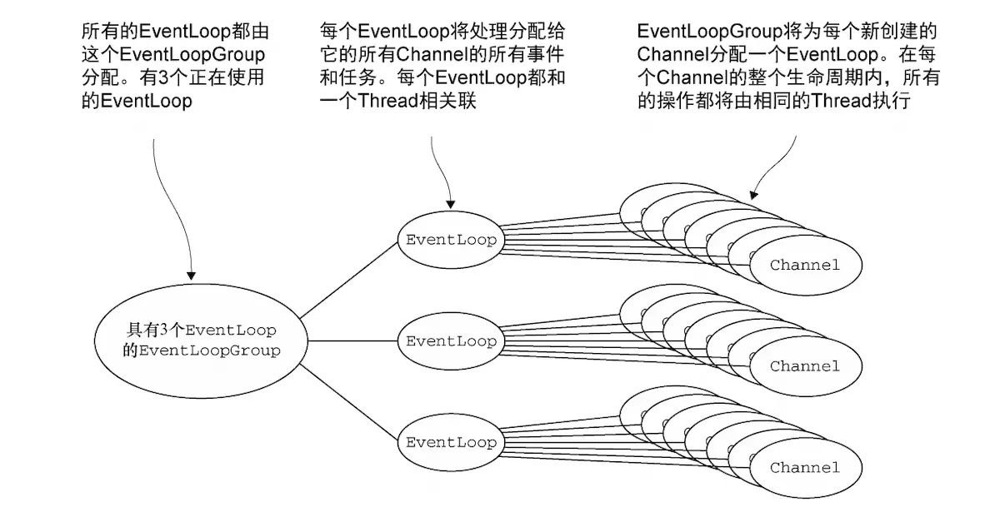
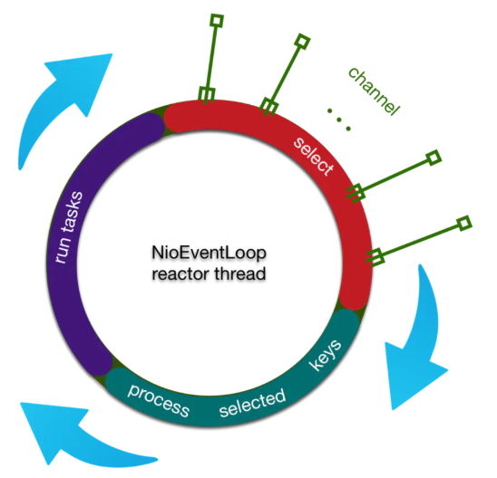

# Netty 线程模型详解

## 一、Netty 线程模型

### 1.1.简介

<div align="center">
    
</div>

在前面了解了线程模型以及 Reactor 线程模型之后，我们来看一下 Netty 的线程模型是怎么样的。首先，Netty 使用 EventLoop 来处理连接上的读写事件，而一个连接上的所有请求都保证在一个 EventLoop 中被处理，**<font color="red">一个 EventLoop 中只有一个 Selector 和一个 Thread，所以也就实现了一个连接上的所有事件只会在一个线程中被执行</font>**。

一个 EventLoopGroup 包含多个 EventLoop，可以把一个 EventLoop 当做是 Reactor 线程模型中的一个线程，而一个 EventLoopGroup 类似于一个 ExecutorService（也就是线程池），当然，这只是为了更好的理解 Netty 的线程模型，它们之间是没有等价关系的，后面的分析中会详细讲到。

首先我们可以看一下 Netty 服务端的启动代码：

```java{.line-numbers}
// Configure the server.
EventLoopGroup bossGroup = new NioEventLoopGroup(1);
EventLoopGroup workerGroup = new NioEventLoopGroup();
    try {
    ServerBootstrap b = new ServerBootstrap();
    b.group(bossGroup, workerGroup)
            .channel(NioServerSocketChannel.class)
            .option(ChannelOption.SO_BACKLOG, 100)
            .handler(new LoggingHandler(LogLevel.INFO))
            .childHandler(new ChannelInitializer<SocketChannel>() {
                @Override
                public void initChannel(SocketChannel ch) throws Exception {
                    ChannelPipeline p = ch.pipeline();
                    p.addLast(your_handler_name, your_handler_instance);
                }
            });

    // Start the server.
    ChannelFuture f = b.bind(PORT).sync();

    // Wait until the server socket is closed.
    f.channel().closeFuture().sync();
} finally {
    // Shut down all event loops to terminate all threads.
    bossGroup.shutdownGracefully();
    workerGroup.shutdownGracefully();
} 
```

Netty 的服务端使用了两个 EventLoopGroup，而第一个 EventLoopGroup 通常只有一个 EventLoop，通常叫做 bossGroup，负责客户端的连接请求，然后打开 Channel，交给后面的 EventLoopGroup 中的一个 EventLoop 来负责这个 Channel 上的所有读写事件，一个 Channel 只会被一个 EventLoop 处理，而一个 EventLoop 可能会被分配给多个 Channel 来负责上面的事件，当然，Netty 不仅支持 NI/O，还支持 OI/O，所以两者的 EventLoop 分配方式有所区别，下面就是 NIO 的分配方式：

<div align="center">
    
</div>

在 NI/O 非阻塞模式下，Netty 将负责为每个 Channel 分配一个 EventLoop，一旦一个 EventLoop 被分配给了一个 Channel，那么在它的整个生命周期中都使用这个 EventLoop，但是多个 Channel 将可能共享一个 EventLoop，所以和 Thread 相关的 ThreadLocal 的使用就要特别注意，因为有多个 Channel 在使用该 Thread 来处理读写时间。

在阻塞 IO 模式下，考虑到一个 Channel 将会阻塞，所以不太可能将一个 EventLoop 共用于多个 Channel 之间，所以，每一个 Channel 都将被分配一个 EventLoop，并且反过来也成立，也就是一个 EventLoop 将只会被绑定到一个 Channel 上来处理这个 Channel 上的读写事件。无论是非阻塞模式还是阻塞模式，一个 Channel 都将会保证一个 Channel 上的所有读写事件都只会在一个 EventLoop 上被处理。

### 1.2.Netty 中 Reactor 线程的启动

NioEventLoop 的 run 方法是 reactor 线程的主体，在第一次添加任务的时候被启动。在上面的 Netty 服务器端启动代码中，就是创建 ServerSocketChannel，并且将此 channel 注册到   NioEventLoop 中的 Selector 上时发生的。

```java{.line-numbers}
//Class：SingleThreadEventExecutor
public void execute(Runnable task) {
    if (task == null) {
        throw new NullPointerException("task");
    }
   
    /**
     * inEventLoop会调用SingleThreadEventExecutor#inEventLoop(Thread.currentThread()),此方法的代码如下：
     * public boolean inEventLoop(Thread thread) {
     *       return thread == this.thread;
     *  }
     * 也就是判断当前执行的线程是否和 SingleThreadEventExecutor 中的 thread 相同，
     * 如果相同的话，则直接把 task 添加到任务队列中 taskQueue
     * 如果不相同的话，再判断线程是否被启动，没有启动的话，新创建一个线程并启动，开启NioEventLoop 的事件循环，
     * 如果线程已经启动的话，直接把 task 添加到 taskQeueu 中
     * 由于 taskQueue 的类型是 LinkedBlockingQueue，所以是并发安全的
     */
    boolean inEventLoop = inEventLoop();
    if (inEventLoop) {
        addTask(task);
    } else {
        //启动线程
        startThread();
        //将此Runnable任务放到SingleThreadEventExecutor中的taskQueue（任务队列）中去
        addTask(task);
        if (isShutdown() && removeTask(task)) {
            reject();
        }
    }

    if (!addTaskWakesUp && wakesUpForTask(task)) {
        wakeup(inEventLoop);
    }
} 
```

外部线程在往任务队列里面添加任务的时候执行 startThread() ，netty 会判断 reactor 线程有没有被启动，如果没有被启动，那就启动线程再往任务队列里面添加任务：

```java{.line-numbers}
// Class:SingleThreadEventExecutor
private void startThread() {
    // 当外部的线程添加
    if (state == ST_NOT_STARTED) {
        if (STATE_UPDATER.compareAndSet(this, ST_NOT_STARTED, ST_STARTED)) {
            doStartThread();
        }
    }
}
```

SingleThreadEventExecutor 在执行 doStartThread 的时候，会调用内部执行器 executor 的 execute 方法，将调用 NioEventLoop 的 run 方法的过程封装成一个 runnable 塞到一个线程中去执行。接下来介绍一下这个内部执行器 executor 是什么时候被赋值的。首先在 new NioEventLoopGroup() 的时候，会调用如下的构造方法：

```java{.line-numbers}
protected MultithreadEventExecutorGroup(int nThreads, Executor executor,
                                        EventExecutorChooserFactory chooserFactory, Object... args) {
    if (executor == null) {
        executor = new ThreadPerTaskExecutor(newDefaultThreadFactory());
    }
} 
```

在上面的构造函数中，会将 SingleThreadEventExecutor 中的 executor 属性默认赋值为 ThreadPerTaskExecutor（如果 executor 为 null 的话）。然后通过 newChild 的方式传递给 NioEventLoop：

```java{.line-numbers}
@Override
protected EventLoop newChild(Executor executor, Object... args) throws Exception {
    return new NioEventLoop(this, executor, (SelectorProvider) args[0],
        ((SelectStrategyFactory) args[1]).newSelectStrategy(), (RejectedExecutionHandler) args[2]);
} 
```

然后当执行到 serverBootstrap.bind() 时，会一路调用到 doStartThread 方法，在这个方法中，会使用 executor.execute() 方法即调用 ThreadPerTaskExecutor#execute 方法，默认情况下， ThreadPerTaskExecutor 在每次执行 execute 方法的时候都会通过 DefaultThreadFactory 创建一个 FastThreadLocalThread 线程，而这个线程就是 netty 中的 reactor 线程实体：

```java{.line-numbers}
//class:ThreadPerTaskExecutor
public final class ThreadPerTaskExecutor implements Executor {
    private final ThreadFactory threadFactory;

    public ThreadPerTaskExecutor(ThreadFactory threadFactory) {
        if (threadFactory == null) {
            throw new NullPointerException("threadFactory");
        }
        this.threadFactory = threadFactory;
    }

    @Override
    public void execute(Runnable command) {
        //创建一个新线程，并且启动
        threadFactory.newThread(command).start();
    }
}
```

在 execute 方法中，会创建一个新的线程，并让这个新线程来执行这个 command 参数，也就是下面的 new Runnable(){....} 对象。

```java{.line-numbers}
//class：SingleThreadEventExecutor
private void doStartThread() {
    // 当 NioEventLoop 没有被分配线程的时候（也就是 SingleThreadEventExecutor 中 thread 属性为 null）
    // 才会调用此方法
    assert thread == null;

    // 在使用new NioEventLoopGroup()方法时，在NioEventLoopGroup的超类MultiThreadEventExecutorGroup的构造函数中，
    // 指定默认的executor为ThreadPerTaskExecutor。然后在newChild方法中创建NioEventLoop对象时，将此executor传入，
    // 并且赋值给NioEventLoop的父类对象SingleThreadEventExecutor，然后在doStartThread中使用，创建线程并启动
    executor.execute(new Runnable() {
        @Override
        public void run() {
            thread = Thread.currentThread();
            if (interrupted) {
                thread.interrupt();
            }

            boolean success = false;
            updateLastExecutionTime();
            try {
                SingleThreadEventExecutor.this.run();
                success = true;
            } catch (Throwable t) {
                logger.warn("Unexpected exception from an event executor: ", t);
            } finally {

                //代码省略
                //.......

            }
        }
    });
} 
```

当新线程在执行这个对象的 run 方法时，下面的代码：

```java{.line-numbers}
thread = Thread.currentThread(); 
```

会把当前线程赋值给 SingleThreadEventExecutor 中的 thread 属性。新线程执行的核心就是：

```java{.line-numbers}
SingleThreadEventExecutor.this.run(); 
```

用户或者 Reactor 线程不断通过 **<font color="red">SingleThreadEventExecutor#execute</font>** 方法或者 **<font color="red">AbstractScheduledEventExecutor#schdule</font>** 方法，最后这些任务都会被加入到 SingleThreadEventExecutor 中的 taskQueue 中，或者AbstractScheduledEventExecutor#schdule 中的 scheduledTaskQueue 队列中，然后这些 scheduledTask 都会被加入到 taskQueue 中，由 Reactor 线程来执行(通过 runAllTask 方法)。

### 1.3.Reactor 线程的执行

那么下面我们就重点剖析一下 NioEventLoop 的 run 方法：

```java{.line-numbers}
/**
 * class：NioEventLoop
 * NioEventLoop中的run方法是不断地进行一个循环，select阻塞监听、处理Channel上的IO事件、处理TaskQueue中的task任务
 * run方法在线程启动(doStartThread)之后被执行
 */
@Override
protected void run() {
    for (;;) {
        try {
            switch (selectStrategy.calculateStrategy(selectNowSupplier, hasTasks())) {
                case SelectStrategy.CONTINUE:
                    continue;
                case SelectStrategy.SELECT:
                    select(wakenUp.getAndSet(false));
                    if (wakenUp.get()) {
                        selector.wakeup();
                    }
                    // fall through
                default:
            }

            cancelledKeys = 0;
            needsToSelectAgain = false;
            final int ioRatio = this.ioRatio;
            if (ioRatio == 100) {
                try {
                    processSelectedKeys();
                } finally {
                    // Ensure we always run tasks.
                    runAllTasks();
                }
            } else {
                final long ioStartTime = System.nanoTime();
                try {
                    //处理Channel上发生的IO事件
                    processSelectedKeys();
                } finally {
                    // Ensure we always run tasks.
                    // ioTime表明run方法对前面Channel中的IO事件处理所花费的时间
                    final long ioTime = System.nanoTime() - ioStartTime;
                    // ioRatio这个参数是Netty用来控制执行IO任务和非IO任务的时间配比的
                    // ioTime * (100 - ioRatio) / ioRatio：非IO任务执行的时间
                    runAllTasks(ioTime * (100 - ioRatio) / ioRatio);
                }
            }
        } catch (Throwable t) {
            handleLoopException(t);
        }
        // Always handle shutdown even if the loop processing threw an exception.
        try {
            //省略代码
            //.........
        } catch (Throwable t) {
            handleLoopException(t);
        }
    }
}
```

我们抽取出主干，reactor 线程做的事情其实很简单，用下面一幅图就可以说明：

<div align="center">
    
</div>

reactor 线程大概做的事情分为对三个步骤不断循环，轮询 selector 上的事件，处理产生 I/O 事件的 channel，处理任务队列中的非 I/O 事件。在事件循环中我们不仅要处理 I/O 事件，还要处理非 I/O 事件。Netty中可以设置用于 I/O 操作和非 I/O 操作的时间占比，默认各位 50%，也就是说，如果某次 I/O 操作的时间花了 100ms，那么这次循环中非 I/O 得任务也可以花费 100ms。Netty 中的 I/O 时间处理通过 processSelectedKeys 方法来进行，而非 I/O 操作通过 runAllTasks 反复来进行。

**1.首先轮询注册到 reactor 线程对用的 selector 上的所有的 channel 的 I/O 事件：**

```java{.line-numbers}
select(wakenUp.getAndSet(false));
if (wakenUp.get()) {
    selector.wakeup();
} 
```

**2.处理产生网络 I/O 事件的 channel**

```java{.line-numbers}
processSelectedKeys();
```

**3.处理任务队列**

```java{.line-numbers}
runAllTasks(...); 
```

接下来我们对上面的步骤1进行详细的说明。

### 1.4.Select 操作

```java{.line-numbers}
select(wakenUp.getAndSet(false));
if (wakenUp.get()) {
      selector.wakeup();
} 
```

wakenUp 表示是否应该唤醒正在阻塞的 select 操作，可以看到 netty 在进行一次新的 loop 之前，都会将 wakeUp 被设置成 false，标志新的一轮 loop 的开始，具体的 select 操作我们也拆分开来看。

#### 1.4.1 定时任务截止时间快到了，中断本次轮询

```java{.line-numbers}
int selectCnt = 0;
long currentTimeNanos = System.nanoTime();
long selectDeadLineNanos = currentTimeNanos + delayNanos(currentTimeNanos);

for (;;) {
    long timeoutMillis = (selectDeadLineNanos - currentTimeNanos + 500000L) / 1000000L;
    if (timeoutMillis <= 0) {
        if (selectCnt == 0) {
            selector.selectNow();
            selectCnt = 1;
        }
        break;
    }
    ....
} 
```

我们可以看到，NioEventLoop 中 reactor 线程的 select 操作也是一个 for 循环，在 for 循环第一步中，如果发现当前的定时任务队列中有任务的截止事件快到了(<=0.5ms)，就跳出循环。此外，跳出之前如果发现目前为止还没有进行过 select 操作（if (selectCnt == 0)），那么就调用一次 selectNow()，该方法会立即返回，不会阻塞。

这里说明一点，netty 里面定时任务队列是按照延迟时间从小到大进行排序， delayNanos(currentTimeNanos) 方法即取出第一个定时任务的延迟时间：

```java{.line-numbers}
/**
 * class：SingleThreadEventExecutor
 * 如果当前时间(currentTimeNanos)超过了这个scheduledTask的deadline，则返回0
 * 否则，返回距离deadline所还剩余的时间
 */
protected long delayNanos(long currentTimeNanos) {
    ScheduledFutureTask<?> scheduledTask = peekScheduledTask();
    if (scheduledTask == null) {
        return SCHEDULE_PURGE_INTERVAL;
    }
    return scheduledTask.delayNanos(currentTimeNanos);
}
```

#### 1.4.2 轮询过程中发现有任务加入，中断本次轮询

```java{.line-numbers}
for (;;) {
    // 1.定时任务截至事时间快到了，中断本次轮询
    ...
    // 2.轮询过程中发现有任务加入，中断本次轮询
    if (hasTasks() && wakenUp.compareAndSet(false, true)) {
        selector.selectNow();
        selectCnt = 1;
        break;
    }
    ....
} 
```

netty 为了保证任务队列能够及时执行，在进行阻塞 select 操作之前会判断任务队列是否为空，如果不为空，就执行一次非阻塞 select 操作，跳出循环。

#### 1.4.3 阻塞式 select 操作

```java{.line-numbers}
for (;;) {
    // 1.定时任务截至事时间快到了，中断本次轮询
    ...
    // 2.轮询过程中发现有任务加入，中断本次轮询
    ...
    // 3.阻塞式select操作
    int selectedKeys = selector.select(timeoutMillis);
    selectCnt ++;
    if (selectedKeys != 0 || oldWakenUp || wakenUp.get() || hasTasks() || hasScheduledTasks()) {
        break;
    }
    ....
} 
```

执行到这一步，说明 netty 任务队列里面队列为空，并且所有定时任务延迟时间还未到(大于0.5ms)，于是，在这里进行一次阻塞 select 操作，截止到第一个定时任务的截止时间。这时就会有一个问题，如果第一个定时任务的延迟非常长，比如一个小时，那么有没有可能线程一直阻塞在 select 操作，当然有可能。不过这时，如果有新任务加入，该阻塞就会被释放：

```java{.line-numbers}
/**
 * class:SingleThreadEventExecutor
 * 外部线程调用 execute 方法添加任务
 */
@Override
public void execute(Runnable task) {
    ...
    wakeup(inEventLoop); // inEventLoop为false
    ...
} 
```

调用 wakeup 方法唤醒 selector 阻塞：

```java{.line-numbers}
protected void wakeup(boolean inEventLoop) {
    if (!inEventLoop && wakenUp.compareAndSet(false, true)) {
        selector.wakeup();
    }
}
```

可以看到，在外部线程添加任务的时候，会调用 wakeup 方法来唤醒。阻塞 select 操作结束之后，netty 又做了一系列的状态判断来决定是否中断本次轮询，中断本次轮询的条件有：

- 轮询到 I/O 事件（selectedKeys != 0）
- oldWakenUp 参数为 true
- 任务队列里面有任务（hasTasks）
- 第一个定时任务即将要被执行（hasScheduledTasks()）
- 用户主动唤醒（wakenUp.get()）

#### 1.4.4 总结

最后，我们总结 reactor 线程 select 步骤做的事情：不断地轮询是否有 I/O 事件发生，并且在轮询的过程中不断检查是否有定时任务和普通任务，保证了 netty 的任务队列中的任务得到有效执行，轮询过程顺带用一个计数器避开了了 jdk 空轮询的 bug，过程清晰明了。

## 二、Netty 处理 I/O 事件

在前面一章中，我们已经了解到 netty reactor 线程的第一步是轮询出注册在 selector 上面的 I/O 事件（select），那么接下来就要处理这些 I/O 事件（process selected keys），本篇文章我们将一起来探讨 netty 处理 I/O 事件的细节。

我们进入到 reactor 线程的 run 方法，找到处理 I/O 事件的代码，如下：

```java{.line-numbers}
processSelectedKeys()； 
```

跟进去：

```java{.line-numbers}
private void processSelectedKeys() {
    if (selectedKeys != null) {
        processSelectedKeysOptimized(selectedKeys.flip());
    } else {
        processSelectedKeysPlain(selector.selectedKeys());
    }
} 
```

我们发现处理 I/O 事件，netty 有两种选择，从名字上看，一种是处理优化过的 selectedKeys，一种是正常的处理。我们对优化过的 selectedKeys 的处理稍微展开一下，看看 netty 是如何优化的，我们查看 selectedKeys 被引用过的地方，有如下代码：

```java{.line-numbers}
private SelectedSelectionKeySet selectedKeys;

private Selector NioEventLoop.openSelector() {
    // ...
    final SelectedSelectionKeySet selectedKeySet = new SelectedSelectionKeySet();
    // selectorImplClass -> sun.nio.ch.SelectorImpl
    Field selectedKeysField = selectorImplClass.getDeclaredField("selectedKeys");
    Field publicSelectedKeysField = selectorImplClass.getDeclaredField("publicSelectedKeys");
    selectedKeysField.setAccessible(true);
    publicSelectedKeysField.setAccessible(true);
    selectedKeysField.set(selector, selectedKeySet);
    publicSelectedKeysField.set(selector, selectedKeySet);
    // ...
    selectedKeys = selectedKeySet;
} 
```

首先，selectedKeys 是一个 SelectedSelectionKeySet 类对象，在 NioEventLoop 的 openSelector 方法中创建，之后就通过反射将 selectedKeys 与 sun.nio.ch.SelectorImpl 中的两个 field 绑定。sun.nio.ch.SelectorImpl 中我们可以看到，这两个 field 其实是两个 HashSet：

```java{.line-numbers}
// Public views of the key sets
private Set<SelectionKey> publicKeys;             // Immutable
private Set<SelectionKey> publicSelectedKeys;     // Removal allowed, but not addition
protected SelectorImpl(SelectorProvider sp) {
    super(sp);
    keys = new HashSet<SelectionKey>();
    selectedKeys = new HashSet<SelectionKey>();
    if (Util.atBugLevel("1.4")) {
        publicKeys = keys;
        publicSelectedKeys = selectedKeys;
    } else {
        publicKeys = Collections.unmodifiableSet(keys);
        publicSelectedKeys = Util.ungrowableSet(selectedKeys);
    }
} 
```

selector 在调用 select() 族方法的时候，如果有 I/O 事件发生，就会往里面的两个 field 中塞相应的 selectionKey，即相当于往一个 hashSet 中 add 元素，既然 netty 通过反射将 jdk 中的两个 field 替换掉，那我们就应该意识到是不是 netty 自定义的 SelectedSelectionKeySet 在 add 方法做了某些优化呢？带着这个疑问，我们进入到 SelectedSelectionKeySet 类中探个究竟：

```java{.line-numbers}
final class SelectedSelectionKeySet extends AbstractSet<SelectionKey> {

    SelectionKey[] keys;
    int size;

    SelectedSelectionKeySet() {
        keys = new SelectionKey[1024];
    }

    @Override
    public boolean add(SelectionKey o) {
        if (o == null) {
            return false;
        }

        keys[size++] = o;
        if (size == keys.length) {
            increaseCapacity();
        }

        return true;
    }

    @Override
    public int size() {
        return size;
    }

    @Override
    public boolean remove(Object o) {
        return false;
    }

    @Override
    public boolean contains(Object o) {
        return false;
    }

    @Override
    public Iterator<SelectionKey> iterator() {
        throw new UnsupportedOperationException();
    }

    void reset() {
        reset(0);
    }

    void reset(int start) {
        Arrays.fill(keys, start, size, null);
        size = 0;
    }

    private void increaseCapacity() {
        SelectionKey[] newKeys = new SelectionKey[keys.length << 1];
        System.arraycopy(keys, 0, newKeys, 0, size);
        keys = newKeys;
    }
} 
```

综合上面的几段代码，在 openSelector 中，把我们自己创建的 SelectedSelectionKeySet 类型的 selectedKeySet 设置到 WindowsSelectorImpl 中的 selectedKeys 和 publicSelectedKeys 属性中，取代原来的 jdk 自带的 Set 类型。SelectedSelectionKeySet 的优势是在底层实现的时候是使用了数组来保存 SelectionKey，在添加和查找 SelectionKey 的时候，相比于 HashSet 有速度优势。下面我们接着讨论 netty 对 I/O 事件的处理，转到processSelectedKeysOptimized：

```java{.line-numbers}
private void processSelectedKeysOptimized(SelectionKey[] selectedKeys) {
    for (int i = 0;; i ++) {
        // 1.取出IO事件以及对应的channel
        final SelectionKey k = selectedKeys[i];
        if (k == null) {
            break;
        }
        selectedKeys[i] = null;
        final Object a = k.attachment();
        // 2.处理该channel
        if (a instanceof AbstractNioChannel) {
            processSelectedKey(k, (AbstractNioChannel) a);
        } else {
            NioTask<SelectableChannel> task = (NioTask<SelectableChannel>) a;
            processSelectedKey(k, task);
        }
        // 3.判断是否该再来次轮询
        if (needsToSelectAgain) {
            for (;;) {
                i++;
                if (selectedKeys[i] == null) {
                    break;
                }
                selectedKeys[i] = null;
            }
            selectAgain();
            selectedKeys = this.selectedKeys.flip();
            i = -1;
        }
    }
} 
```

我们可以将该过程分为以下三个步骤：

**1.取出 I/O 事件以及对应的 netty channel 类**

这里其实也能体会到优化过的 SelectedSelectionKeySet 的好处，遍历的时候遍历的是数组，相对 jdk 原生的 HashSet 效率有所提高。拿到当前 SelectionKey 之后，将 selectedKeys[i] 置为 null。

**2.处理该 channel**

拿到对应的 attachment 之后，netty 做了如下判断：

```java{.line-numbers}
if (a instanceof AbstractNioChannel) {
   processSelectedKey(k, (AbstractNioChannel) a);
}
```

源码读到这，我们需要思考为啥会有这么一条判断，凭什么说 attachment 可能会是  AbstractNioChannel 对象？我们的思路应该是找到底层 selector, 然后在 selector 调用 register 方法的时候，看一下注册到 selector 上的对象到底是什么，我们使用 intellij 的全局搜索引用功能，最终在 AbstractNioChannel 中搜索到如下方法：

```java{.line-numbers}
//class：AbstractNioChannel(在netty包中)
@Override
protected void doRegister() throws Exception {
    boolean selected = false;
    for (;;) {
        try {
            //AbstractNioChannel中有一个SelectableChannel对象(JDK类)，这个javaChannel()方法会返回这个SelectabelChannel对象
            //，然后把它注册到selector对象上。并且把此AbstractNioChannel对象作为attachment
            selectionKey = javaChannel().register(eventLoop().unwrappedSelector(), 0, this);
            return;
        } catch (CancelledKeyException e) {
            //省略代码
            //........
        }
    }
}
```

javaChannel() 返回 netty 类 **<font color="red">AbstractChannel</font>** 对应的 jdk 底层 channel 对象：

```java{.line-numbers}
protected SelectableChannel javaChannel() {
    return ch;
} 
```

我们查看到 SelectableChannel 方法，结合 netty 的 doRegister() 方法，我们不难推论出， netty 的轮询注册机制其实是将 AbstractNioChannel 内部的 jdk 类 SelectableChannel 对象注册到 jdk 类 Selctor 对象上去，并且将 AbstractNioChannel 作为 SelectableChannel 对象的一个 attachment 附属上，这样再jdk轮询出某条 SelectableChannel 有 I/O 事件发生时，就可以直接取出 AbstractNioChannel 进行后续操作。

下面是 jdk 中的 register 方法：

```java{.line-numbers}
//*
//* @param  sel
//*         The selector with which this channel is to be registered
//*
//* @param  ops
//*         The interest set for the resulting key
//*
//* @param  att
//*         The attachment for the resulting key; may be <tt>null</tt>
public abstract SelectionKey register(Selector sel, int ops, Object att)
        throws ClosedChannelException;
```

processSelectedKey(SelectionKey k, AbstractNioChannel ch) 的代码如下：

```java{.line-numbers}
//class：NioEventLoop
private void processSelectedKey(SelectionKey k, AbstractNioChannel ch) {
    final AbstractNioChannel.NioUnsafe unsafe = ch.unsafe();
    if (!k.isValid()) {
        final EventLoop eventLoop;
        try {
            //从AbstractNioChannel对象上，获取分配给它的EventLoop
            eventLoop = ch.eventLoop();
        } catch (Throwable ignored) {
            return;
        }
        //.......
        //代码省略
    }

    //根据channel上获取到的事件类型调用底层的API来处理
    try {
        int readyOps = k.readyOps();
        //我们在调用read或者write方法之前，必须首先调用finishConnect方法，否则NIO JDK channel的
        //实现可能会抛出一个NotYetConnectedException异常
        if ((readyOps & SelectionKey.OP_CONNECT) != 0) {
            // 移除掉OP_CONNECT操作，否则的话Selector#select方法将不会阻塞，而是一直返回
            int ops = k.interestOps();
            ops &= ~SelectionKey.OP_CONNECT;
            k.interestOps(ops);

            unsafe.finishConnect();
        }

        if ((readyOps & SelectionKey.OP_WRITE) != 0) {
            ch.unsafe().forceFlush();
        }

        if ((readyOps & (SelectionKey.OP_READ | SelectionKey.OP_ACCEPT)) != 0 || readyOps == 0) {
            unsafe.read();
        }
    } catch (CancelledKeyException ignored) {
        unsafe.close(unsafe.voidPromise());
    }
} 
```

这个方法的运行流程如下：

1. 从 Channel 上获取一个 unsafe 对象，这个对象 是用来进行 NIO 操作的一系列系统级 API
2. 从 Channel 上获取了 EventLoop
3. 根据事件调用底层 API 来处理事件

同时，对于不同的 NioEventLoopGroup，轮询到的 I/O 事件类型不同：

- 对于 boss NioEventLoop 来说，轮询到的是基本上就是连接事件，后续的事情就通过他的 pipeline 将连接扔给一个 worker NioEventLoop 处理
- 对于 worker NioEventLoop 来说，轮询到的基本上都是 io 读写事件，后续的事情就是通过他的 pipeline 将读取到的字节流传递给每个 channelHandler 来处理

上面处理 attachment 的时候，还有个 else 分支，我们也来分析一下 else 部分的代码如下：

```java{.line-numbers}
NioTask<SelectableChannel> task = (NioTask<SelectableChannel>) a;
processSelectedKey(k, task); 
```

说明注册到 selctor 上的 attachment 还有另外一中类型，就是 NioTask，NioTask 主要是用于当一个 SelectableChannel 注册到 selector 的时候，执行一些任务。由于 NioTask 在 netty 内部没有使用的地方，这里不过多展开。

netty 的 reactor 线程第二步做的事情为处理 I/O 事件，netty 使用数组替换掉 jdk 原生的 HashSet 来保证 I/O 事件的高效处理，每个 SelectionKey 上绑定了 netty 类 AbstractChannel 对象作为 attachment，在处理每个 SelectionKey 的时候，就可以找到AbstractChannel，然后通过 pipeline 的方式将处理串行到 ChannelHandler，回调到用户方法。

## 三、Netty 中 task 的常用场景

### 3.1.用户自定义的普通任务

```java{.line-numbers}
ctx.channel().eventLoop().execute(new Runnable() {
    @Override
    public void run() {
        //...
    }
}); 
```

我们跟进 execute 方法，看重点：

```java{.line-numbers}
@Override
public void execute(Runnable task) {
    //...
    addTask(task);
    //...
} 
```

execute 方法调用 addTask 方法：

```java{.line-numbers}
protected void addTask(Runnable task) {

    // ...

    if (!offerTask(task)) {

        reject(task);

    }

} 
```

然后调用 offerTask 方法，如果 offer 失败，那就调用 reject 方法，通过默认的  RejectedExecutionHandler 直接抛出异常：

```java{.line-numbers}
final boolean offerTask(Runnable task) {
    // ...
    return taskQueue.offer(task);
} 
```

跟到 offerTask 方法，基本上task就落地了，netty 内部使用一个 taskQueue 将 task 保存起来，那么这个 taskQueue 又是何方神圣？我们查看 taskQueue 定义的地方和被初始化的地方：

```java{.line-numbers}
private final Queue<Runnable> taskQueue;
taskQueue = newTaskQueue(this.maxPendingTasks);

@Override
protected Queue<Runnable> newTaskQueue(int maxPendingTasks) {
    // This event loop never calls takeTask()
    return PlatformDependent.newMpscQueue(maxPendingTasks);
}
```

我们发现 taskQueue 在 NioEventLoop中默认是 mpsc 队列，mpsc 队列，即多生产者单消费者队列，netty 使用 mpsc，方便的将外部线程的 task 聚集，在 reactor 线程内部用单线程来串行执行，我们可以借鉴 netty 的任务执行模式来处理类似多线程数据上报，定时聚合的应用。

**<font color="red">在本节讨论的任务场景中，所有代码的执行都是在 reactor 线程中的，所以，所有调用 inEventLoop() 的地方都返回 true</font>**，既然都是在 reactor 线程中执行，那么其实这里的 mpsc 队列其实没有发挥真正的作用，mpsc 大显身手的地方其实在第二种场景。

### 3.2.非当前 reactor 线程调用 channel 的各种方法

```java{.line-numbers}
// non reactor thread
channel.write(...) 
```

上面一种情况在 push 系统中比较常见，一般在业务线程里面，根据用户的标识，找到对应的 channel 引用，然后调用 write 类方法向该用户推送消息，就会进入到这种场景。关于channel. write() 类方法的调用链，后面会单独拉出一篇文章来深入剖析，这里，我们只需要知道，最终 write 方法串至以下方法：

```java{.line-numbers}
private void write(Object msg, boolean flush, ChannelPromise promise) {
    // ...
    EventExecutor executor = next.executor();
    if (executor.inEventLoop()) {
        if (flush) {
            next.invokeWriteAndFlush(m, promise);
        } else {
            next.invokeWrite(m, promise);
        }
    } else {
        AbstractWriteTask task;
        if (flush) {
            task = WriteAndFlushTask.newInstance(next, m, promise);
        }  else {
            task = WriteTask.newInstance(next, m, promise);
        }
        safeExecute(executor, task, promise, m);
    }
} 
```

外部线程在调用 write 的时候，executor.inEventLoop() 会返回 false，直接进入到 else 分支，将 write 封装成一个 WriteTask（这里仅仅是 write 而没有 flush，因此 flush 参数为 false）, 然后调用 safeExecute 方法。

```java{.line-numbers}
private static void safeExecute(EventExecutor executor, Runnable runnable, ChannelPromise promise, Object msg) {
    // ...
    executor.execute(runnable);
    // ...
} 
```

接下来的调用链就进入到第一种场景了，但是和第一种场景有个明显的区别就是，**<font color="red">第一种场景的调用链的发起线程是 reactor 线程，第二种场景的调用链的发起线程是用户线程，用户线程可能会有很多个</font>**，显然多个线程并发写 taskQueue 可能出现线程同步问题，于是，这种场景下，netty 的 mpsc queue 就有了用武之地：

### 3.3 用户自定义定时任务

```java{.line-numbers}
ctx.channel().eventLoop().schedule(new Runnable() {
    @Override
    public void run() {

    }
}, 60, TimeUnit.SECONDS);
```

第三种场景就是定时任务逻辑了，用的最多的便是如上方法：在一定时间之后执行任务。我们跟进 schedule 方法：

```java{.line-numbers}
public ScheduledFuture<?> schedule(Runnable command, long delay, TimeUnit unit) {
//...
    return schedule(new ScheduledFutureTask<Void>(
            this, command, null, ScheduledFutureTask.deadlineNanos(unit.toNanos(delay))));
}
```

通过 ScheduledFutureTask，将用户自定义任务再次包装成一个 netty 内部的任务：

```java{.line-numbers}
<V> ScheduledFuture<V> schedule(final ScheduledFutureTask<V> task) {
    // ...
    scheduledTaskQueue().add(task);
    // ...
    return task;
} 
```

到了这里，我们有点似曾相识，在非定时任务的处理中，netty 通过一个 mpsc 队列将任务落地，这里，是否也有一个类似的队列来承载这类定时任务呢？带着这个疑问，我们继续向前：

```java{.line-numbers}
Queue<ScheduledFutureTask<?>> scheduledTaskQueue() {
    if (scheduledTaskQueue == null) {
        scheduledTaskQueue = new PriorityQueue<ScheduledFutureTask<?>>();
    }
    return scheduledTaskQueue;
} 
```

果不其然，scheduledTaskQueue() 方法，会返回一个优先级队列，然后调用 add 方法将定时任务加入到队列中去，但是，这里为什么要使用优先级队列，而不需要考虑多线程的并发？因为我们现在讨论的场景，调用链的发起方是 reactor 线程，不会存在多线程并发这些问题。但是，万一有的用户在 reactor 之外执行定时任务呢？虽然这类场景很少见，但是 netty 作为一个无比健壮的高性能io框架，必须要考虑到这种情况。

对此，netty 的处理是，如果是在外部线程调用 schedule，netty 将添加定时任务的逻辑封装成一个普通的 task，这个 task 的任务是添加[添加定时任务]的任务，而不是添加定时任务，其实也就是第二种场景，这样，对 PriorityQueue 的访问就变成单线程，即只有 reactor 线程。完整的 schedule 方法代码如下：

```java{.line-numbers}
<V> ScheduledFuture<V> schedule(final ScheduledFutureTask<V> task) {
    if (inEventLoop()) {
        scheduledTaskQueue().add(task);
    } else {
        // 进入到场景二，进一步封装任务
        execute(new Runnable() {
            @Override
            public void run() {
                scheduledTaskQueue().add(task);
            }
        });
    }
    return task;
} 
```

我们知道，优先级队列按一定的顺序来排列内部元素，内部元素必须是可以比较的，联系到这里每个元素都是定时任务，那就说明定时任务是可以比较的，那么到底有哪些地方可以比较？每个任务都有一个下一次执行的截止时间，截止时间是可以比较的，截止时间相同的情况下，任务添加的顺序也是可以比较的。

带着猜想，我们研究与一下 ScheduledFutureTask，抽取出关键部分：

```java{.line-numbers}
final class ScheduledFutureTask<V> extends PromiseTask<V> implements ScheduledFuture<V> {
    
    private static final AtomicLong nextTaskId = new AtomicLong();
    private static final long START_TIME = System.nanoTime();

    static long nanoTime() {
        return System.nanoTime() - START_TIME;
    }

    private final long id = nextTaskId.getAndIncrement();
    /* 0 - no repeat, >0 - repeat at fixed rate, <0 - repeat with fixed delay */
    private final long periodNanos;

    @Override
    public int compareTo(Delayed o) {
        //...
    }

    // 精简过的代码
    @Override
    public void run() {
    }

}
```

这里，我们一眼就找到了 compareTo 方法，cmd+u 跳转到实现的接口，发现就是 Comparable 接口：

```java{.line-numbers}
public int compareTo(Delayed o) {
    if (this == o) {
        return 0;
    }

    ScheduledFutureTask<?> that = (ScheduledFutureTask<?>) o;
    long d = deadlineNanos() - that.deadlineNanos();
    if (d < 0) {
        return -1;
    } else if (d > 0) {
        return 1;
    } else if (id < that.id) {
        return -1;
    } else if (id == that.id) {
        throw new Error();
    } else {
        return 1;
    }
} 
```

进入到方法体内部，我们发现，两个定时任务的比较，确实是先比较任务的截止时间，截止时间相同的情况下，再比较 id，即任务添加的顺序，如果id再相同的话，就抛 Error。这样，在执行定时任务的时候，就能保证最近截止时间的任务先执行。

下面，我们再来看下 netty 是如何来保证各种定时任务的执行的，netty 里面的定时任务分以下三种：

- 若干时间后执行一次
- 每隔一段时间执行一次
- 每次执行结束，隔一定时间再执行一次

netty 使用一个 periodNanos 来区分这三种情况，正如 netty 的注释那样：

```java{.line-numbers}
/* 0 - no repeat, >0 - repeat at fixed rate, <0 - repeat with fixed delay */
private final long periodNanos; 
```

了解这些背景之后，我们来看下 netty 是如何来处理这三种不同类型的定时任务的：

```java{.line-numbers}
public void run() {
    if (periodNanos == 0) {
        V result = task.call();
        setSuccessInternal(result);
    } else { 
        task.call();
        long p = periodNanos;
        if (p > 0) {
            deadlineNanos += p;
        } else {
            deadlineNanos = nanoTime() - p;
        }
            scheduledTaskQueue.add(this);
    }
}
```

if (periodNanos == 0) 对应 若干时间后执行一次 的定时任务类型，执行完了该任务就结束了。否则，进入到 else 代码块，先执行任务，然后再区分是哪种类型的任务，periodNanos 大于 0，表示是以固定频率执行某个任务，和任务的持续时间无关，然后，设置该任务的下一次截止时间为本次的截止时间加上间隔时间 periodNanos，否则，就是每次任务执行完毕之后，间隔多长时间之后再次执行，截止时间为当前时间加上间隔时间，-p 就表示加上一个正的间隔时间，最后，将当前任务对象再次加入到队列，实现任务的定时执行。

## 四、Reactor 线程 task 的调度

首先，我们将目光转向最外层的外观代码：

```java{.line-numbers}
runAllTasks(long timeoutNanos); 
```

顾名思义，这行代码表示了尽量在一定的时间内，将所有的任务都取出来 run 一遍。timeoutNanos 表示该方法最多执行这么长时间，netty 为什么要这么做？我们可以想一想，reactor 线程如果在此停留的时间过长，那么将积攒许多的 I/O 事件无法处理(见 reactor 线程的前面两个步骤)，最终导致大量客户端请求阻塞，因此，默认情况下，netty 将控制内部队列的执行时间。

好，我们继续跟进：

```java{.line-numbers}
/**
 * class：SingleThreadEventExecutor
 */
protected boolean runAllTasks(long timeoutNanos) {
    // 将scheduledTaskQueue中的ScheduledFutureTask移到SingleThreadEventExecutor中的taskQueue中
    // 有个条件:调用这个方法的时候，ScheduledFutureTask的截止时间到了的话，就将其加入taskQueue，否则不加入
    fetchFromScheduledTaskQueue();
    Runnable task = pollTask();
    if (task == null) {
        afterRunningAllTasks();
        return false;
    }

    final long deadline = ScheduledFutureTask.nanoTime() + timeoutNanos;
    long runTasks = 0;
    long lastExecutionTime;
    for (;;) {
        safeExecute(task);

        runTasks ++;

        // Check timeout every 64 tasks because nanoTime() is relatively expensive.
        // 执行64次task任务后，再判断总的执行时间有没有超过deadline
        if ((runTasks & 0x3F) == 0) {
            lastExecutionTime = ScheduledFutureTask.nanoTime();
            if (lastExecutionTime >= deadline) {
                break;
            }
        }

        task = pollTask();
        if (task == null) {
            lastExecutionTime = ScheduledFutureTask.nanoTime();
            break;
        }
    }

    // 在执行完所有任务或者超过deadline后，执行此方法
    // 这个方法本质上就是执行SingleThreadEventLoop中的tailTasks
    afterRunningAllTasks();
    this.lastExecutionTime = lastExecutionTime;
    return true;
} 
```

这段代码便是 reactor 执行 task 的所有逻辑，可以拆解成下面几个步骤：

1. 从 scheduledTaskQueue 转移定时任务到 taskQueue(mpsc queue)
2. 计算本次任务循环的截止时间
3. 执行任务
4. 收尾

按照这个步骤，我们一步步来分析下：

### 4.1 从 scheduledTaskQueue 转移定时任务到 taskQueue(mpsc queue)

首先调用 fetchFromScheduledTaskQueue() 方法，将到期的定时任务转移到 mpsc queue 里面：

```java{.line-numbers}
private boolean fetchFromScheduledTaskQueue() {
    long nanoTime = AbstractScheduledEventExecutor.nanoTime();
    Runnable scheduledTask  = pollScheduledTask(nanoTime);
    while (scheduledTask != null) {
        if (!taskQueue.offer(scheduledTask)) {
            // No space left in the task queue add it back to the scheduledTaskQueue so we pick it up again.
            scheduledTaskQueue().add((ScheduledFutureTask<?>) scheduledTask);
            return false;
        }
        scheduledTask  = pollScheduledTask(nanoTime);
    }
    return true;
} 
```

可以看到，netty 在把任务从 scheduledTaskQueue 转移到 taskQueue 的时候还是非常小心的，当 taskQueue 无法 offer 的时候，需要把从 scheduledTaskQueue 里面取出来的任务重新添加回去。从 scheduledTaskQueue 从拉取一个定时任务的逻辑如下，传入的参数 nanoTime 为当前时间(其实是当前纳秒减去 ScheduledFutureTask 类被加载的纳秒个数)。

```java{.line-numbers}
protected final Runnable pollScheduledTask(long nanoTime) {
    assert inEventLoop();

    Queue<ScheduledFutureTask<?>> scheduledTaskQueue = this.scheduledTaskQueue;
    ScheduledFutureTask<?> scheduledTask = scheduledTaskQueue == null ? null : scheduledTaskQueue.peek();
    if (scheduledTask == null) {
        return null;
    }

    if (scheduledTask.deadlineNanos() <= nanoTime) {
        scheduledTaskQueue.remove();
        return scheduledTask;
    }
    return null;
} 
```

可以看到，每次 pollScheduledTask 的时候，只有在当前任务的截止时间已经到了，才会取出来。

### 4.2 计算本次任务循环的截止时间

```java{.line-numbers}
Runnable task = pollTask();
 //...
final long deadline = ScheduledFutureTask.nanoTime() + timeoutNanos;
long runTasks = 0;
long lastExecutionTime; 
```

这一步将取出第一个任务，用 reactor 线程传入的超时时间 timeoutNanos 来计算出当前任务循环的 deadline，并且使用了 runTasks，lastExecutionTime 来时刻记录任务的状态。

### 4.3 循环执行任务

```java{.line-numbers}
for (;;) {
    safeExecute(task);
    runTasks ++;
    if ((runTasks & 0x3F) == 0) {
        lastExecutionTime = ScheduledFutureTask.nanoTime();
        if (lastExecutionTime >= deadline) {
            break;
        }
    }

    task = pollTask();
    if (task == null) {
        lastExecutionTime = ScheduledFutureTask.nanoTime();
        break;
    }
} 
```

这一步便是 netty 里面执行所有任务的核心代码了。 首先调用 safeExecute 来确保任务安全执行，忽略任何异常。

```java{.line-numbers}
protected static void safeExecute(Runnable task) {
    try {
        task.run();
    } catch (Throwable t) {
        logger.warn("A task raised an exception. Task: {}", task, t);
    }
} 
```

然后将已运行任务 runTasks 加一，每隔0x3F任务，即每执行完 64 个任务之后，判断当前时间是否超过本次 reactor 任务循环的截止时间了，如果超过，那就 break 掉，如果没有超过，那就继续执行。可以看到，netty 对性能的优化考虑地相当的周到，假设 netty 任务队列里面如果有海量小任务，如果每次都要执行完任务都要判断一下是否到截止时间，那么效率是比较低下的。

从上面的代码中，我们可以看出 Netty 强烈要求不要线程中运行阻塞任务的原因，因为阻塞任务将会阻塞住 Netty 的事件循环，从而造成事件堆积的现象。

### 4.4 收尾

```java{.line-numbers}
afterRunningAllTasks();
this.lastExecutionTime = lastExecutionTime; 
```

收尾工作很简单，调用一下 afterRunningAllTasks 方法。

```java{.line-numbers}
@Override
protected void afterRunningAllTasks() {
        runAllTasksFrom(tailTasks);
} 
```

NioEventLoop 可以通过父类 SingleTheadEventLoop 的 executeAfterEventLoopIteration 方法向 tailTasks 中添加收尾任务，比如，你想统计一下一次执行一次任务循环花了多长时间就可以调用此方法。

## 五、总结

首先回顾一下我们的服务器端代码：

```java{.line-numbers}
public class NettyServer {
    public static void main(String[] args) {
        ServerBootstrap serverBootstrap = new ServerBootstrap();

        NioEventLoopGroup boss = new NioEventLoopGroup();
        NioEventLoopGroup worker = new NioEventLoopGroup();
        serverBootstrap
                .group(boss, worker)
                .channel(NioServerSocketChannel.class)
                .childHandler(new ChannelInitializer<NioSocketChannel>() {
                    @Override
                    protected void initChannel(NioSocketChannel ch) {
                        ch.pipeline().addLast(new StringDecoder());
                        ch.pipeline().addLast(new SimpleChannelInboundHandler<String>() {
                            @Override
                            protected void channelRead0(ChannelHandlerContext ctx, String msg) {
                                System.out.println(msg);
                            }
                        });
                    }
                }).bind(8000);
    }
} 
```

在上面代码中，**<font color="red">serverBootstrap.group(boss, worker)</font>** 会把 boss 设置给 **<font color="red">AbstractBoostrap</font>** 中的 **<font color="red">group</font>**，同时将 worker 设置给 ServerBootstrap 中的 childGroup。除此之外，serverBootstrap.channel(NioServerSocketChannel.class) 则会根据传入的 class 类型创建一个 channelFactory。这个 channelFactory的newChannel 方法会创建一个 NioServerSocketChannel 来对客户端进行监听。

在上面的代码中，bind 方法的调用链如下：

```java{.line-numbers}
 -> AbstractBootstrap.bind
 -> AbstractBootstrap.doBind
 -> AbstractBootstrap.initAndRegister 
 -> EventLoopGroup.register
 -> MultithreadEventLoopGroup.register
 -> SingleThreadEventLoop.register
 -> Channel.register
 -> AbstractChannel$AbstractUnsafe.register
```

将 NioEventLoop 分配给某个 AbstractNioChannel 上，也是在用 bind 绑定端口号时发生的，在 AbstractBootstrap 类的 initAndRegister 方法中，除了创建一个新的 Channel，对其进行一些参数的设置，最后会通过 regitser 方法，依据 MultithreadEventLoopGroup 中的 EventExecutorChooser 对象的选择策略，给此 Channel 分配一个 NioEventLoop：

```java{.line-numbers}
@Override
public final void register(EventLoop eventLoop, final ChannelPromise promise) {
    //......

    //将依据选择策略选择好的NioEventLoop分配给channel
    AbstractChannel.this.eventLoop = eventLoop;

    if (eventLoop.inEventLoop()) {
        //如果是eventLoop中的线程话，就直接执行register0函数
        register0(promise);
    } else {

        // 否则，如果是外部线程的话，就需要把执行register0函数包装成一个task，
        // 调用eventLoop的execute函数，将其添加到NioEventLoop中的taskQueue中，
        // 同时如果NioEventLoop线程没有启动的话，就启动线程（这里是bossGroup中某个NioEventLoop包含的线程首次启动）。
        // 然后添加到taskQueue中的task从而由NioEventLoop中的线程来执行。
        try {
            eventLoop.execute(new Runnable() {
                @Override
                public void run() {
                    register0(promise);
                }
            });
        } catch (Throwable t) {
            //......
        }
    }
} 
```

上面 register0 的代码如下：

```java{.line-numbers}
//class：AbstractChannel
private void register0(ChannelPromise promise) {
    try {
        //......
        boolean firstRegistration = neverRegistered;
        doRegister();
        //......
    } catch (Throwable t) {
        //.......
    }
} 
```

在 doRegister 的代码中，将 NioEventLoop 分配给 channel 之后，也会将当前的AbstractChannel中的 SelectableChannel（jdk 类）注册到分配给它的 NioEventLoop 的 Selector 对象上。

```java{.line-numbers}
//class: AbstractNioChannel
@Override
protected void doRegister() throws Exception {
    boolean selected = false;
    for (;;) {
        try {
            //将新创建的channel(类型为SelectableChannel)注册到NioEventLoop中的Selector上，
            //并且将此AbstractChannel作为attchment
            selectionKey = javaChannel().register(eventLoop().unwrappedSelector(), 0, this);
            return;
        } catch (CancelledKeyException e) {
            //.....
        }
    }   
} 
```

从上面 register 代码的注释中可知，将 register0(promise) 包装成一个 task 添加到 taskQueue 时，如果此时的线程没有启动，则会先启动线程，再进行相应的添加操作。这里值得注意的是，调用 register0 是 bossGroup 中的线程首次被创建并且启动的时刻（这个线程用来监听客户端连接）。然后再由启动后的 NioEventLoop 中的线程来执行添加的 task。启动 NioEventLoop 的方法是 execute 中的 startThread :

```java{.line-numbers}
private void startThread() {
    if (state == ST_NOT_STARTED) {
        if (STATE_UPDATER.compareAndSet(this, ST_NOT_STARTED, ST_STARTED)) {
            doStartThread();
        }
    }
} 
```

doStartThread 方法的代码如下：

```java{.line-numbers}
private void doStartThread() {
    //当NioEventLoop没有被分配线程的时候（也就是SingleThreadEventExecutor中thread属性为null）
    //才会调用此方法
    assert thread == null;

    //在使用new NioEventLoopGroup()方法时，在NioEventLoopGroup的超类MultiThreadEventExecutorGroup的构造函数中，
    //指定默认的executor为ThreadPerTaskExecutor。然后在newChild方法中创建NioEventLoop对象时，将此executor传入，
    //然后在doStartThread中使用，创建线程并启动
    executor.execute(new Runnable() {
        @Override
        public void run() {
            thread = Thread.currentThread();
            if (interrupted) {
                thread.interrupt();
            }

            boolean success = false;
            updateLastExecutionTime();
            try {
                SingleThreadEventExecutor.this.run();
                success = true;
            } catch (Throwable t) {
                logger.warn("Unexpected exception from an event executor: ", t);
            } finally {
                //代码省略
                //.......
            }
        }
    });
} 


//class:MultithreadEventExecutorGroup
protected MultithreadEventExecutorGroup(int nThreads, Executor executor,
                                        EventExecutorChooserFactory chooserFactory, Object... args) {
    if (nThreads <= 0) {
        throw new IllegalArgumentException(String.format("nThreads: %d (expected: > 0)", nThreads));
    }

    if (executor == null) {
        executor = new ThreadPerTaskExecutor(newDefaultThreadFactory());
    }

    //根据调用NioEventLoopGroup(n)中所指定的n个数，来创建n个NioEventLoop
    children = new EventExecutor[nThreads];

    for (int i = 0; i < nThreads; i ++) {
        boolean success = false;
        try {
            //调用NioEventLoopGroup中的构造函数来创建一个NioEventLoop，并且
            //在这个构造函数中会给NioEventLoop分配selector
            children[i] = newChild(executor, args);
            success = true;
        } catch (Exception e) {
            // TODO: Think about if this is a good exception type
            throw new IllegalStateException("failed to create a child event loop", e);
        } finally {
            //代码省略.....
        }
    }
    //代码省略.....
} 
```

在 MultithreadEventExecutorGroup 中提到的 newChild 代码如下：

```java{.line-numbers}
//class:NioEventLoopGroup
protected EventLoop newChild(Executor executor, Object... args) throws Exception {
        return new NioEventLoop(this, executor, (SelectorProvider) args[0],
            ((SelectStrategyFactory) args[1]).newSelectStrategy(), (RejectedExecutionHandler) args[2]);
}

//class:NioEventLoop
NioEventLoop(NioEventLoopGroup parent, Executor executor, SelectorProvider selectorProvider,
             SelectStrategy strategy, RejectedExecutionHandler rejectedExecutionHandler) {
    super(parent, executor, false, DEFAULT_MAX_PENDING_TASKS, rejectedExecutionHandler);
    if (selectorProvider == null) {
        throw new NullPointerException("selectorProvider");
    }
    if (strategy == null) {
        throw new NullPointerException("selectStrategy");
    }
    provider = selectorProvider;
    final SelectorTuple selectorTuple = openSelector();
    selector = selectorTuple.selector;
    unwrappedSelector = selectorTuple.unwrappedSelector;
    selectStrategy = strategy;
} 
```

在 doStartThread 方法中，执行 executor(executor) 的类型为 ThreadPerTaskExecutor) 的 execute 方法，此 execute 的代码如下：

```java{.line-numbers}
@Override
    public void execute(Runnable command) {
        threadFactory.newThread(command).start();
} 
```

接下来，介绍一下NioEventLoop的分配策略。EventExecutorChooser 对象在 MultithreadEventExecutorGroup 初始化时被赋值，它有两种类型：PowerOfTwoEventExecutorChooser 和GenericEventExecutorChooser，如果 NioEventLoopGroup 中 NioEventLoop 的个数恰好为 2 的 n 次方的话，使用 PowerOfTwoEventExecutorChooser，否则使用 GenericEventExecutorChooser。这两种类型所代表的分配策略都是将 EventLoop 从 0 开始不断分配给 Channel，比如说 NioEventLoopGroup 中有 8 个 EventLoop，编号从 0-7，于是先分配 0,1,2，...，7，然后再从 0 开始分配。只不过 PowerOfTwoEventExecutorChooser 是把取模运算用位运算来代替，更快一些，而 GenericEventExecutorChooser 则是采用传统的除法来取余。

在 MultithreadEventExecutorGroup 初始化时，同时会根据我们使用 new NioEventLoopGroup(nThreads) 中所指定的 nThreads 数目，创建对应数目的 NioEventLoop，并且保存在 MultithreadEventExecutorGroup的children 属性中。

综上，总结一下，当调用 AbstractBootstrap 的 initAndRegister 方法时，会创建 channel，并且对其进行配置等初始化工作，然后分配一个 NioEventLoop 给这个 channel。接着需要将 channel 注册到 NioEventLoop 中的 Selector 对象上，同时将 AbstractNioChannel 作为 attchment。此时，会把注册操作包装成一个 task，通过调用 execute 方法，将其加入到 taskQueue 中，等待 NioEventLoop 来执行。如果线程没有启动的话，execute 方法会调用 doStartThread 方法，新创建一个线程，并且在此线程中开启事件循环，即执行 NioEventLoop 的 run 方法，运行添加进去的 task。

在 run 方法中，执行的步骤分为3部分：

1. 先进行 select 选择操作
2. 在选择之后，处理产生网络 I/O 事件的 channel(processSelectedKeys)
3. 对 taskQueue 中的任务 task 进行处理，但是在处理的时候，先调用fetchFromScheduledTaskQueue，把 scheduledTaskQueue 中的定时任务添加到 taskQueue 队列中，然后再不断循环执行 taskQueue 中的 task；在最后，需要调用 afterRunningAllTasks，处理 tailTasks 中的任务。